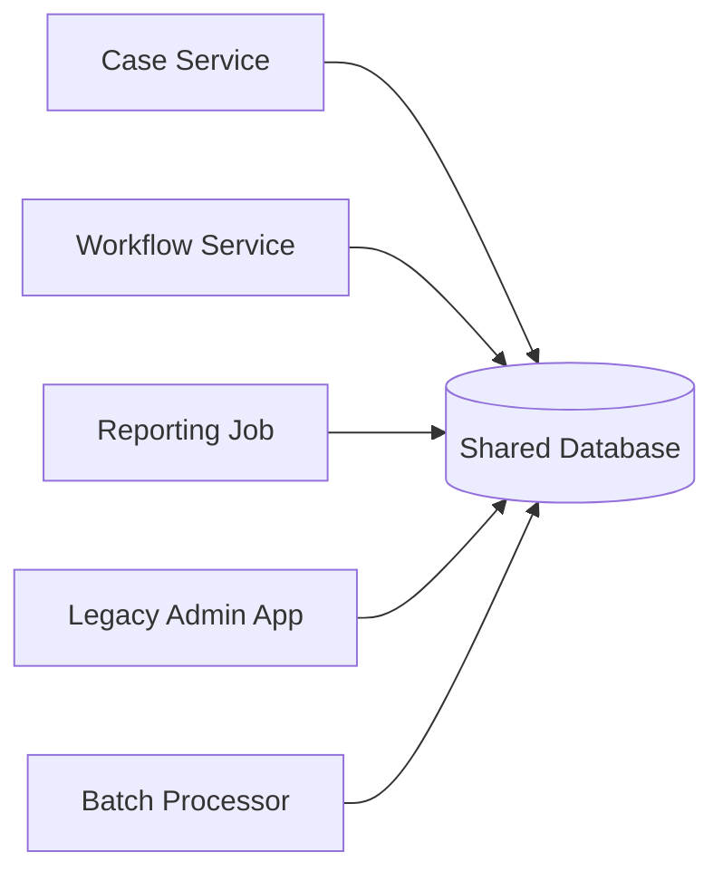
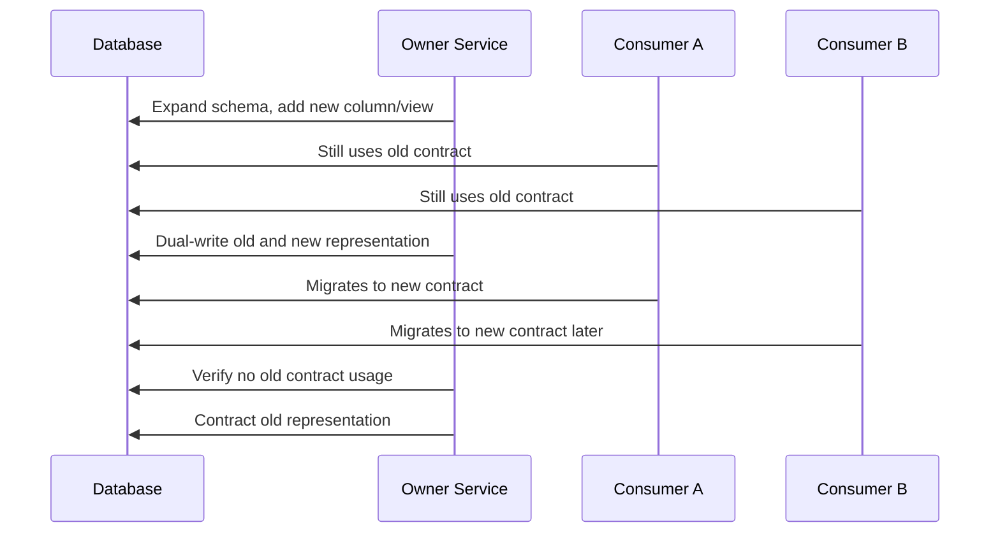
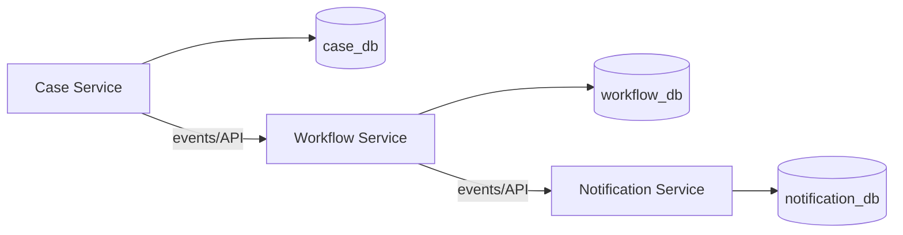
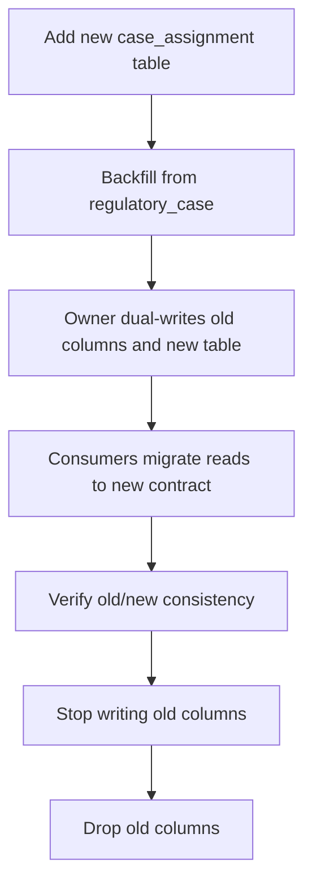
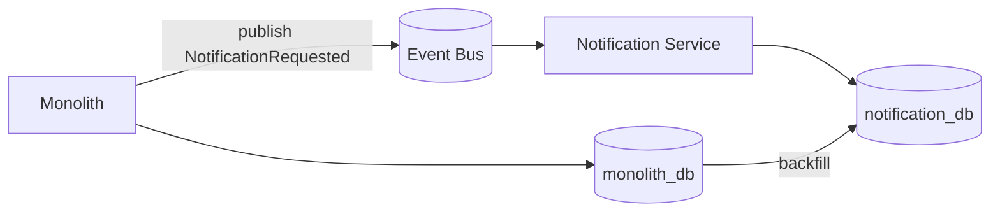
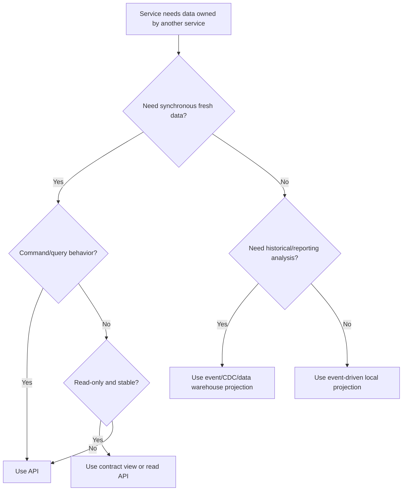

------
title: Learn Java Database Migrations, Flyway, Liquibase - Part 026
description: Multi-service database ownership, shared database risks, contract migration, and schema evolution across distributed Java systems.
series: learn-java-database-migrations
seriesTitle: Learn Java Database Migrations, Flyway, Liquibase
order: 26
partTitle: Multi-Service Database Ownership and Contract Migration
tags:
  - java
  - database
  - migration
  - flyway
  - liquibase
  - microservices
  - architecture
  - contract-migration
  - production-engineering
date: 2026-06-28
---

# Part 026 — Multi-Service Database Ownership and Contract Migration

> **Goal:** setelah bagian ini, kamu bisa merancang database migration di lingkungan multi-service tanpa menciptakan shared-database trap, deployment ordering fragility, hidden coupling, atau schema change yang merusak service lain. Fokusnya adalah ownership, contract, compatibility window, dan migration choreography.

Pada single application, database migration biasanya mudah dipahami:

```txt
application version N --> migration version N --> schema version N
```

Pada distributed system, model itu pecah.

Bisa ada:

- beberapa service membaca schema yang sama;
- beberapa service menulis table yang sama;
- reporting job membaca table internal;
- batch process menggunakan query private;
- CDC pipeline mengekspor perubahan ke data lake;
- legacy app masih memakai column lama;
- microservice baru ingin memecah table;
- monolith lama dan service baru hidup bersamaan selama migrasi.

Di titik ini, database migration bukan lagi urusan satu repository. Ia menjadi **contract migration problem**.

---

## 1. Core Principle: Database Has an Owner

Prinsip utama:

> Setiap schema, table, column, stored object, dan reference data harus punya owner yang jelas.

Tanpa owner, perubahan database menjadi arena konflik.

Owner bertanggung jawab atas:

- semantic meaning;
- schema evolution;
- migration authoring;
- data quality;
- access contract;
- backward compatibility;
- deprecation;
- audit evidence;
- incident response.

Jika semua service merasa boleh mengubah table yang sama, tidak ada satu pun yang benar-benar memiliki contract.

---

## 2. Ownership Levels

Database ownership tidak selalu binary. Ada beberapa level.

### 2.1 Database Owner

Team/service memiliki seluruh database.

```txt
case-service owns case_db
```

Cocok untuk microservice yang benar-benar independen.

### 2.2 Schema Owner

Beberapa domain berbagi database instance, tetapi schema berbeda.

```txt
case_service owns schema case
notification_service owns schema notification
reporting owns schema reporting
```

Cocok untuk modular monolith, cost-constrained environments, atau platform dengan shared DB instance.

### 2.3 Table Owner

Satu schema berisi table dari beberapa domain.

```txt
case.case owns regulatory_case
case.workflow owns case_transition
case.assignment owns assignment_rule
```

Masih bisa dikelola, tetapi membutuhkan governance lebih kuat.

### 2.4 Column Owner

Beberapa team memiliki column berbeda di table yang sama.

Ini adalah smell.

Contoh:

```txt
customer table:
- identity team owns name/email
- risk team owns risk_score
- marketing team owns campaign_opt_in
- compliance team owns kyc_status
```

Ini biasanya tanda table terlalu besar atau domain boundary tidak jelas.

### 2.5 Row Owner

Beberapa service menulis row berbeda di table yang sama.

Contoh:

```txt
configuration table:
- notification service writes NOTIFICATION_* keys
- workflow service writes WORKFLOW_* keys
- risk service writes RISK_* keys
```

Bisa diterima hanya jika namespace dan contract jelas.

---

## 3. Shared Database Anti-Pattern

Shared database terjadi ketika banyak aplikasi mengakses schema yang sama secara langsung tanpa contract owner yang kuat.



Risiko:

- schema change tidak bisa diprediksi dampaknya;
- deployment harus diurutkan manual;
- service diam-diam bergantung pada private table;
- migration rollback sulit;
- column tidak bisa dihapus;
- query reporting memblokir DDL;
- data ownership kabur;
- security boundary lemah;
- audit responsibility tidak jelas.

Shared database bukan selalu salah. Yang salah adalah **shared database tanpa contract**.

---

## 4. Shared Database Smell Catalog

### 4.1 Multiple Writers to Same Table

```txt
case-service writes regulatory_case
workflow-service writes regulatory_case.status
assignment-service writes regulatory_case.assignee_id
```

Problem:

- race condition semantic;
- transaction boundary unclear;
- audit trail fragmented;
- invariants tersebar.

Better:

- one service owns writes;
- others request changes via API/command/event;
- table split if domain truly separate.

### 4.2 Reporting Reads Internal Tables

```sql
SELECT * FROM regulatory_case rc
JOIN case_internal_transition cit ON ...
```

Problem:

- internal schema becomes public API;
- index/drop/rename blocked by report;
- report query may lock or overload OLTP database.

Better:

- reporting view owned as contract;
- read replica;
- event stream;
- materialized reporting model;
- data warehouse.

### 4.3 Batch Job Uses Private Columns

A nightly job reads `processing_flag` from a table owned by another service.

Problem:

- migration owner may not know batch dependency;
- batch may fail after column rename;
- incident appears hours later.

Better:

- declare dependency;
- expose contract view/table;
- migrate batch first or provide compatibility column.

### 4.4 Foreign Key Across Service Boundaries

```sql
ALTER TABLE invoice
ADD CONSTRAINT fk_invoice_case
FOREIGN KEY (case_id) REFERENCES regulatory_case(id);
```

If `invoice` and `regulatory_case` are owned by different services, this creates runtime coupling.

Possible alternatives:

- store external reference ID without FK;
- validate through API;
- use eventual consistency;
- maintain local projection;
- use cross-domain FK only if system is modular monolith with shared lifecycle.

---

## 5. Contract Types for Database Access

When another service needs data, choose contract deliberately.

| Contract Type | Coupling | Best For | Migration Impact |
|---|---:|---|---|
| Direct table read | Very high | Same module/internal only | Dangerous |
| Database view | Medium | Stable read model | View must be versioned |
| Stored procedure/function | Medium | Encapsulated DB access | Signature compatibility |
| API | Lower | Command/query boundary | App-level versioning |
| Event stream | Lower | Asynchronous propagation | Schema/event versioning |
| CDC projection | Medium | Analytics/integration | Source schema coupling |
| Replicated read model | Lower | Reporting/search | Projection migration |

Database migration strategy depends on contract type.

---

## 6. Contract View Pattern

If consumers must read from database, expose a view as stable contract.

Internal table:

```sql
CREATE TABLE regulatory_case_internal (
    id uuid PRIMARY KEY,
    case_number varchar(64) NOT NULL,
    status_code varchar(64) NOT NULL,
    risk_score numeric(10,4),
    internal_flags jsonb,
    created_at timestamp NOT NULL,
    updated_at timestamp NOT NULL
);
```

Contract view:

```sql
CREATE VIEW v_case_summary_v1 AS
SELECT
    id,
    case_number,
    status_code,
    created_at,
    updated_at
FROM regulatory_case_internal;
```

Consumer reads:

```sql
SELECT id, case_number, status_code
FROM v_case_summary_v1;
```

Owner can change internal table while preserving view.

### 6.1 Versioned View Contract

When breaking change needed:

```sql
CREATE VIEW v_case_summary_v2 AS
SELECT
    id,
    case_number,
    status_code AS status,
    created_at,
    updated_at,
    risk_score
FROM regulatory_case_internal;
```

Then migrate consumers from `v1` to `v2`, and drop `v1` only after deprecation window.

---

## 7. Expand/Contract Across Services

Single-service expand/contract is straightforward. Multi-service expand/contract must account for different deployment times.



Rule:

> Contract phase can happen only after all consumers stop using old contract.

---

## 8. Consumer Inventory

Before changing shared schema, inventory consumers.

Consumer types:

- application service;
- legacy monolith;
- batch job;
- scheduler;
- ETL process;
- BI dashboard;
- data warehouse pipeline;
- CDC connector;
- monitoring query;
- support/admin script;
- external partner integration;
- ad hoc report.

Inventory fields:

| Field | Example |
|---|---|
| Consumer name | case-reporting-job |
| Owner team | analytics-platform |
| Access type | direct table read |
| Object used | regulatory_case.status_code |
| Query path | report_case_summary.sql |
| SLA | daily 02:00 UTC |
| Migration owner | case-platform |
| Contact | #analytics-platform |
| Deprecation status | not migrated |

Without this inventory, “safe migration” is mostly hope.

---

## 9. Database Contract Registry

In mature organizations, database contracts can be registered.

Example file:

```yaml
contracts:
  - name: case-summary-v1
    owner: case-platform
    type: database-view
    object: case.v_case_summary_v1
    consumers:
      - analytics-case-reporting
      - compliance-dashboard
    compatibility:
      additiveChangesAllowed: true
      breakingChangesRequireNoticeDays: 30
    deprecation:
      status: active
      replacement: case.v_case_summary_v2
```

This can live in:

- repo metadata;
- architecture catalog;
- service catalog;
- data catalog;
- internal developer platform.

---

## 10. Ownership in Monolith, Modular Monolith, and Microservices

### 10.1 Monolith

One application owns database.

Risk:

- internal modules bypass boundaries;
- migration can still become messy;
- no clear domain ownership.

Recommendation:

- use schema/module naming;
- enforce package boundaries;
- use migration folder by bounded context;
- avoid cross-module table writes.

### 10.2 Modular Monolith

One deployable application, multiple domain modules.

Good pattern:

```txt
src/main/resources/db/migration/
  V20260628_1000__case_create_tables.sql
  V20260628_1010__workflow_create_tables.sql
  V20260628_1020__notification_create_tables.sql
```

Stronger pattern:

```txt
db/migration/case/
db/migration/workflow/
db/migration/notification/
```

Then root manifest controls order.

Important:

- modules can share transaction boundary;
- DB-level FK can be acceptable;
- ownership still matters.

### 10.3 Microservices

Each service should ideally own its database/schema.



Migration belongs with owning service.

Avoid:

- service A running migration for service B table;
- service B reading service A table directly;
- shared changelog with unclear owner.

---

## 11. Multi-Service Migration Ownership Models

### 11.1 Service-Owned Migration

Each service repo contains its own migration.

```txt
case-service/src/main/resources/db/migration
workflow-service/src/main/resources/db/migration
notification-service/src/main/resources/db/migration
```

Good when:

- each service owns DB/schema;
- deployment independently controlled;
- no shared table.

Risk:

- cross-service dependency not visible;
- ordering across services requires release choreography.

### 11.2 Platform-Owned Migration Repository

A central repo manages database changes.

```txt
database-migrations/
  case/
  workflow/
  reporting/
```

Good when:

- regulated approval requires central DB change process;
- DBA team owns execution;
- database is shared legacy platform.

Risk:

- application code and schema drift;
- slower delivery;
- ownership ambiguity;
- migration repo becomes bottleneck.

### 11.3 Hybrid Model

Service owns migration source, platform controls production execution.

```txt
service repo -> migration artifact -> release pipeline -> DBA/platform approval -> production apply
```

Often best for regulated systems.

---

## 12. Deployment Ordering Problem

Breaking changes usually fail because deployment order is assumed.

Bad assumption:

```txt
1. Deploy DB migration
2. Deploy all services immediately
3. Everything works
```

Reality:

- some pods still old;
- one service deploy is rolled back;
- batch runs later;
- report uses old column;
- CDC connector sees new schema;
- old version is redeployed during rollback.

### 12.1 Compatibility Matrix

For each schema change, build matrix:

| Schema State | Old Owner App | New Owner App | Old Consumer | New Consumer |
|---|---:|---:|---:|---:|
| S0 old schema | OK | Maybe | OK | Maybe |
| S1 expanded schema | OK | OK | OK | OK |
| S2 transition dual-write | OK | OK | OK | OK |
| S3 contracted schema | Broken | OK | Broken | OK |

Only S1/S2 should exist during rolling multi-service deployment.

---

## 13. Pattern: Column Rename Across Services

Requirement: rename `status` to `status_code`.

### Bad Migration

```sql
ALTER TABLE regulatory_case RENAME COLUMN status TO status_code;
```

Breaks all consumers still reading `status`.

### Safe Multi-Service Plan

#### Migration 1: Expand

```sql
ALTER TABLE regulatory_case
ADD COLUMN status_code varchar(64);

UPDATE regulatory_case
SET status_code = status
WHERE status_code IS NULL;
```

#### App Release 1: Dual-write

Owner service writes both columns.

```java
caseRecord.setStatus(oldStatus);
caseRecord.setStatusCode(newStatusCode);
```

#### Consumer Migration

Consumers move from `status` to `status_code`.

#### Verification

```sql
SELECT count(*)
FROM regulatory_case
WHERE status IS DISTINCT FROM status_code;
```

Track old column usage via:

- query logs;
- database audit;
- view access logs;
- code search;
- consumer sign-off.

#### Migration 2: Contract

```sql
ALTER TABLE regulatory_case
DROP COLUMN status;
```

Only after all consumers have migrated.

---

## 14. Pattern: Table Split Across Services

Requirement: split assignment data out of `regulatory_case` into `case_assignment` owned by assignment module/service.

### Starting Table

```sql
CREATE TABLE regulatory_case (
    id uuid PRIMARY KEY,
    case_number varchar(64) NOT NULL,
    status_code varchar(64) NOT NULL,
    assignee_user_id uuid,
    assigned_at timestamp
);
```

### Target Table

```sql
CREATE TABLE case_assignment (
    case_id uuid PRIMARY KEY,
    assignee_user_id uuid,
    assigned_at timestamp,
    updated_at timestamp NOT NULL
);
```

### Safe Plan



### Migration 1: Expand

```sql
CREATE TABLE case_assignment (
    case_id uuid PRIMARY KEY,
    assignee_user_id uuid,
    assigned_at timestamp,
    updated_at timestamp NOT NULL DEFAULT current_timestamp
);

INSERT INTO case_assignment (case_id, assignee_user_id, assigned_at, updated_at)
SELECT id, assignee_user_id, assigned_at, current_timestamp
FROM regulatory_case
WHERE assignee_user_id IS NOT NULL
ON CONFLICT (case_id) DO NOTHING;
```

### Verification

```sql
SELECT count(*)
FROM regulatory_case rc
LEFT JOIN case_assignment ca ON ca.case_id = rc.id
WHERE rc.assignee_user_id IS NOT NULL
  AND ca.case_id IS NULL;
```

### Contract View for Consumers

```sql
CREATE VIEW v_case_with_assignment_v1 AS
SELECT
    rc.id,
    rc.case_number,
    rc.status_code,
    ca.assignee_user_id,
    ca.assigned_at
FROM regulatory_case rc
LEFT JOIN case_assignment ca ON ca.case_id = rc.id;
```

This view stabilizes consumers while internal storage changes.

---

## 15. Pattern: Service Extraction from Monolith

Service extraction is one of the hardest migration scenarios.

### Starting Point

Monolith owns all tables:

```txt
monolith_db
  regulatory_case
  case_transition
  notification
  user_account
```

### Target

```txt
case-service owns regulatory_case/case_transition
notification-service owns notification
identity-service owns user_account
```

### Migration Strategy

1. Define ownership map.
2. Stop new cross-domain writes.
3. Introduce APIs/events for extracted domain.
4. Create projection/read model if needed.
5. Dual-run old and new paths under feature flag.
6. Backfill extracted service database.
7. Reconcile counts/checksums.
8. Cut traffic.
9. Freeze old writes.
10. Decommission old tables/columns after retention.

### Extraction Diagram



---

## 16. Contract Migration with Events

If consumers use events, database migration must consider event schema.

Example event before:

```json
{
  "eventType": "CaseClosed",
  "caseId": "...",
  "status": "CLOSED"
}
```

After adding `resolutionCode`:

```json
{
  "eventType": "CaseClosed",
  "caseId": "...",
  "status": "CLOSED",
  "resolutionCode": "NO_VIOLATION"
}
```

Safe event evolution:

- add optional field first;
- consumers tolerate unknown fields;
- producer populates after consumers ready;
- make required only in new event version;
- do not change meaning of existing field.

Database migration and event migration must be coordinated when event field derives from new column.

---

## 17. CDC and Data Pipeline Consumers

CDC consumers are often forgotten.

Examples:

- Debezium connector;
- Kafka Connect sink;
- data lake ingestion;
- audit replication;
- search indexer;
- fraud analytics;
- regulator reporting pipeline.

Schema change can affect them:

- dropping column removes field from CDC payload;
- changing type breaks deserializer;
- renaming column appears as drop + add;
- high-volume backfill floods Kafka;
- table split changes event semantics.

Mitigation:

- include CDC consumers in inventory;
- version event/projection schema;
- throttle backfill;
- mark backfill events if necessary;
- use compatibility mode in schema registry if applicable;
- test downstream replay.

---

## 18. Database Privilege as Ownership Boundary

A strong ownership model is enforced by permissions.

### Bad

All services use the same DB user:

```txt
app_user has SELECT/INSERT/UPDATE/DELETE on all tables
```

### Better

Each service has its own runtime role:

```sql
GRANT SELECT, INSERT, UPDATE ON case.regulatory_case TO case_service_runtime;
GRANT SELECT ON case.v_case_summary_v1 TO reporting_runtime;
REVOKE SELECT ON case.regulatory_case FROM reporting_runtime;
```

Migration role is separate:

```txt
case_service_migrator != case_service_runtime
```

Benefits:

- unauthorized cross-service access fails early;
- ownership is visible;
- audit logs clearer;
- accidental writes reduced;
- contract views can be enforced.

---

## 19. Flyway in Multi-Service Ownership

### 19.1 Service-Owned Schema

```txt
case-service
  src/main/resources/db/migration
    V20260628_1000__create_case_tables.sql
    V20260628_1010__add_case_summary_view.sql
```

Config:

```properties
spring.flyway.default-schema=case
spring.flyway.schemas=case
```

Runtime service should not run migration for other schemas.

### 19.2 Multiple Schemas in One Service

If one service owns multiple schemas:

```properties
spring.flyway.schemas=case,case_audit
spring.flyway.default-schema=case
```

Be explicit about schema-qualified object names.

### 19.3 Dedicated Migration Runner

For production:

```txt
case-service-migrator image
  - includes migration files
  - uses migrator credential
  - runs before app rollout
  - emits evidence
```

This avoids every pod trying to migrate on startup.

### 19.4 Shared DB but Separate History Tables

If multiple services share one database instance but own different schemas, each can use separate Flyway history table in its schema.

Avoid one global history table for unrelated owners unless release process is centralized.

---

## 20. Liquibase in Multi-Service Ownership

### 20.1 Changelog per Owner

```txt
case-service/src/main/resources/db/changelog/db.changelog-master.yaml
workflow-service/src/main/resources/db/changelog/db.changelog-master.yaml
```

Each changelog owns its schema/table set.

### 20.2 Central Root Changelog

In platform-managed DB:

```yaml
databaseChangeLog:
  - include:
      file: case/db.changelog-case.yaml
  - include:
      file: workflow/db.changelog-workflow.yaml
  - include:
      file: reporting/db.changelog-reporting.yaml
```

Use this only when release ordering is centrally governed.

### 20.3 Labels for Release Coordination

Labels can group changes by feature/release:

```yaml
- changeSet:
    id: 20260628-1000-add-case-summary-v2
    author: case-platform
    labels: case-summary-v2
    changes:
      - sql:
          sql: |
            CREATE VIEW v_case_summary_v2 AS
            SELECT id, case_number, status_code, risk_score
            FROM regulatory_case;
```

Do not use labels to hide owner ambiguity. Labels are filters, not ownership.

### 20.4 Lock Table Consideration

Liquibase uses a lock table to prevent concurrent updates. In shared database setups, decide whether separate schemas/changelogs should share lock semantics or execute independently.

If two independent service migrations can conflict on shared objects, the problem is ownership, not locking.

---

## 21. Schema Change Request Template

For multi-service schema changes, require a structured request.

```md
# Schema Change Request

## Owner
case-platform

## Change
Add `case_resolution.reason_code` and expose `v_case_summary_v2`.

## Objects changed
- case.regulatory_case
- case.case_resolution
- case.v_case_summary_v1
- case.v_case_summary_v2

## Compatibility
- Old app can read expanded schema.
- New app can write old and new representation.
- Old consumers remain on v1.
- New consumers migrate to v2.

## Known consumers
- compliance-dashboard: v_case_summary_v1
- analytics-case-export: v_case_summary_v1
- regulator-report-job: direct table read, migration required

## Rollout phases
1. Expand schema
2. Deploy owner dual-write
3. Migrate consumers
4. Verify usage
5. Contract old fields

## Verification
- row count reconciliation
- old/new column consistency
- query log confirms v1 no longer used

## Rollback/Roll-forward
Prefer roll-forward. If no rows use new code, deactivate reference data.
```

---

## 22. Consumer-Driven Database Contract Tests

Borrow the idea of consumer-driven contracts.

Consumer declares required shape:

```yaml
consumer: compliance-dashboard
provider: case-platform
contract:
  object: case.v_case_summary_v1
  requiredColumns:
    - id
    - case_number
    - status_code
    - created_at
```

Provider pipeline validates:

```sql
SELECT
    id,
    case_number,
    status_code,
    created_at
FROM case.v_case_summary_v1
WHERE 1 = 0;
```

If provider migration drops/renames a required column, pipeline fails before production.

---

## 23. Query Log-Based Deprecation

Before dropping old column/view, verify no usage.

Signals:

- database audit logs;
- query logs;
- pg_stat_statements-like views;
- SQL proxy logs;
- application telemetry;
- BI dashboard dependency scan;
- code search;
- CDC config scan;
- consumer sign-off.

Do not rely only on “we think nobody uses it.”

---

## 24. Cross-Service Foreign Key Decision Framework

Use database-level FK across services only when:

- services share deployment lifecycle;
- same team or governance owns both schemas;
- transaction consistency is required;
- operational coupling is accepted;
- migration ordering is controlled.

Avoid cross-service FK when:

- services deploy independently;
- database ownership differs;
- one service may archive/delete independently;
- external references cross bounded contexts;
- eventual consistency is acceptable.

Alternative pattern:

```sql
CREATE TABLE invoice_case_reference (
    invoice_id uuid PRIMARY KEY,
    case_id uuid NOT NULL,
    case_number varchar(64) NOT NULL,
    case_snapshot jsonb NOT NULL,
    captured_at timestamp NOT NULL
);
```

This stores reference and snapshot without DB-level FK.

---

## 25. Operational Playbook: Breaking Change Found Late

Scenario: migration drops `regulatory_case.status`, but reporting job still uses it.

### Immediate Response

1. Stop deployment if not applied.
2. If applied and app is failing, assess restore vs roll-forward.
3. Recreate compatibility view/column if safe.
4. Notify consumer owner.
5. Capture incident timeline.
6. Add contract test to prevent recurrence.

### Emergency Compatibility Patch

If data still exists in `status_code`:

```sql
ALTER TABLE regulatory_case
ADD COLUMN status varchar(64);

UPDATE regulatory_case
SET status = status_code
WHERE status IS NULL;
```

Then restore dual-write temporarily in owner app.

Better emergency patch:

```sql
CREATE VIEW v_regulatory_case_legacy AS
SELECT
    id,
    case_number,
    status_code AS status,
    created_at,
    updated_at
FROM regulatory_case;
```

But if consumer expects table not view, it may not be enough.

---

## 26. Operational Playbook: Two Services Need Same Migration Order

Scenario:

- Service A adds column `risk_score`.
- Service B reads `risk_score`.
- Service B deploys before migration.

Solution:

1. Service B code must tolerate absence only if it queries through API, not direct DB.
2. If direct DB read is unavoidable, migration must be a prerequisite.
3. Pipeline should encode dependency.
4. Feature flag should disable path until schema exists.
5. Contract test should validate object shape before enabling.

Do not rely on human memory for deployment ordering.

---

## 27. Anti-Patterns

### 27.1 Database as Integration Bus

Using shared tables for service communication creates implicit, unversioned contracts.

Better:

- events;
- APIs;
- outbox/inbox;
- projection tables.

### 27.2 Everyone Owns the Customer Table

If multiple services update different columns of a giant table, domain boundary has collapsed.

### 27.3 Migration Repo Without Ownership Metadata

A central migration repo with no owner per script becomes archeology.

### 27.4 Dropping Column After Only Code Search

Code search misses BI tools, batch jobs, SQL notebooks, CDC connectors, and external reports.

### 27.5 Service Startup Migration in Large Fleet

If 50 pods start and all attempt migration, lock contention and startup failure become deployment risk. Prefer dedicated migration job for production.

### 27.6 Cross-Service FK by Default

FK is useful inside ownership boundary. Across independent service boundary, it often creates hidden release coupling.

### 27.7 Reporting Against OLTP Internals

Reporting query becomes accidental schema contract and may block operational migrations.

### 27.8 Contract View Without Versioning

A view named `v_case_summary` without version/deprecation policy can still break consumers.

---

## 28. Governance Model

For serious systems, database migration governance should answer:

- Who can create migration?
- Who can approve migration?
- Who can execute production migration?
- Who owns each schema/table/view?
- Which consumers are affected?
- What is the deprecation period?
- What is the rollback/roll-forward strategy?
- What evidence is kept?
- How are emergency changes reconciled?

A lightweight governance table:

| Artifact | Owner | Change Approval | Consumer Notice | Evidence Required |
|---|---|---|---|---|
| Private table | Service team | Team review | No | Migration log |
| Contract view | Service + consumers | Owner + consumer review | Yes | Contract test |
| Shared reference data | Domain owner | Domain + platform | Maybe | Before/after snapshot |
| Permission grant | Security owner | Security approval | Maybe | Access review |
| Cross-service FK | Architecture review | Architecture + owners | Yes | Compatibility plan |
| Drop column | Owner + consumers | Consumer sign-off | Yes | Usage evidence |

---

## 29. Architecture Decision Matrix

When a service needs another service’s data:



Direct table access should be a conscious exception.

---

## 30. Top 1% Mental Model

Weak model:

> “Each service just runs its own migrations.”

Strong model:

> “A migration changes a contract graph. The database object has an owner, consumers, compatibility windows, deployment choreography, evidence, and deprecation lifecycle.”

A top engineer asks before changing schema:

- Who owns this object?
- Who reads it directly?
- Who writes it?
- Is this private or public contract?
- Are old and new versions compatible?
- Can deployment happen in any order?
- What happens if one service rolls back?
- How will we know old usage is gone?
- Is drop safe or just desired?
- What evidence proves safety?

---

## 31. Practice Tasks

### Task 1 — Identify Ownership Smells

Given:

```txt
customer table:
- identity-service writes email
- billing-service writes billing_status
- risk-service writes risk_score
- notification-service reads phone_number
- reporting reads all columns
```

Identify:

- owner ambiguity;
- hidden contracts;
- migration risks;
- possible decomposition strategy.

### Task 2 — Design Contract View Migration

A report reads `regulatory_case` directly. Design a migration to move it to `v_case_summary_v1` safely.

Include:

- view definition;
- permission change;
- consumer migration;
- usage verification;
- deprecation plan.

### Task 3 — Table Split

Split `assignee_user_id` from `regulatory_case` into `case_assignment`.

Design:

- expand migration;
- backfill;
- dual-write;
- verification;
- consumer migration;
- contract migration;
- rollback/roll-forward.

---

## 32. Summary

Multi-service database migration is not only a Flyway/Liquibase problem. It is an ownership and contract problem.

Key takeaways:

- every database object needs an owner;
- direct table access is a high-coupling contract;
- shared database without contract is the real anti-pattern;
- use views/API/events/projections to control coupling;
- expand/contract must account for all consumers, not only the owner app;
- do not drop old schema until old usage is proven gone;
- use privileges to enforce ownership;
- service-owned migrations work only if ownership boundaries are real;
- centralized migration repos need explicit owner metadata;
- contract tests and consumer inventory prevent painful surprises.

Next, we move into **multi-tenant, multi-schema, and multi-database migration**, where the problem changes again: one logical migration may need to run thousands of times with partial failure, tenant skew, and resumability.
