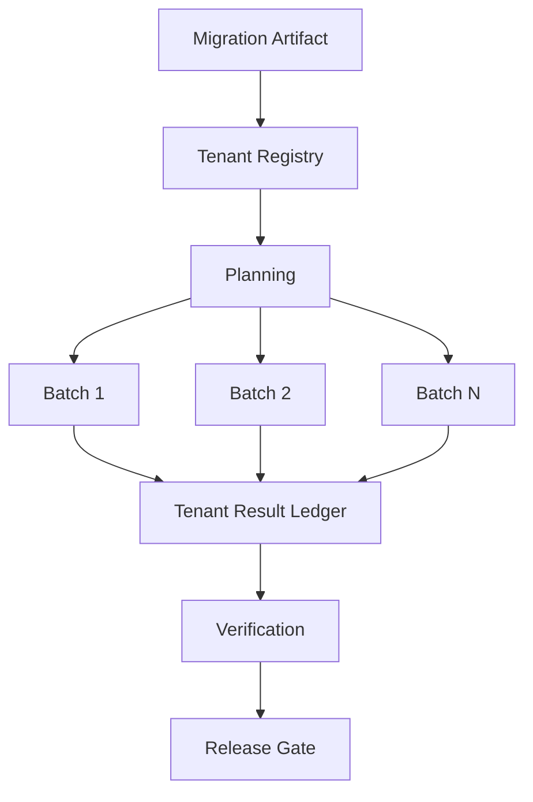
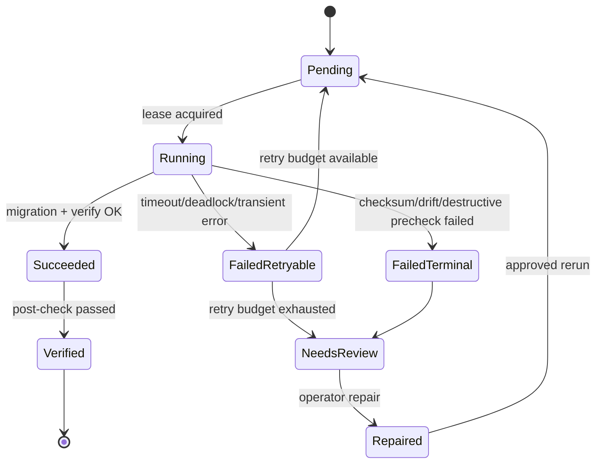
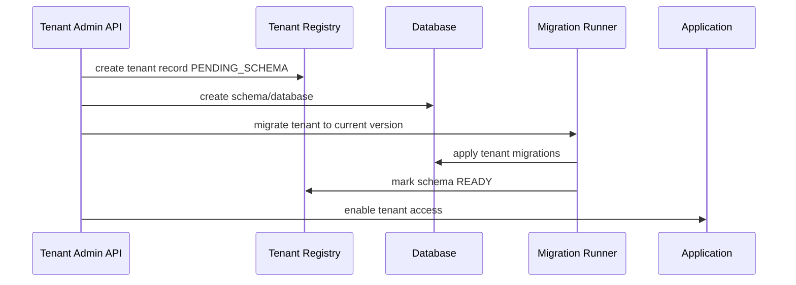

------
title: Learn Java Database Migrations, Flyway, Liquibase - Part 027
description: Multi-tenant, multi-schema, and multi-database migration strategies for Java systems with tenant isolation, fan-out orchestration, version skew, repair, and operational evidence.
series: learn-java-database-migrations
seriesTitle: Learn Java Database Migrations, Flyway, Liquibase
order: 27
partTitle: Multi-Tenant, Multi-Schema, Multi-Database Migration
tags:
  - java
  - database
  - migration
  - flyway
  - liquibase
  - multi-tenant
  - multi-schema
  - saas
  - production-engineering
  - platform-engineering
date: 2026-06-28
---

# Part 027 — Multi-Tenant, Multi-Schema, Multi-Database Migration

> **Goal:** setelah bagian ini, kamu bisa mendesain migration untuk sistem multi-tenant tanpa menganggap semua tenant bisa diperlakukan seperti satu database kecil. Fokusnya adalah tenant isolation, migration fan-out, version skew, partial failure, tenant onboarding, observability, dan recovery.

Pada sistem single tenant, migration sering terlihat linear:

```txt
release artifact --> migrate one database --> deploy app
```

Pada sistem multi-tenant, bentuknya berubah menjadi distributed operation:

```txt
release artifact --> migrate tenant 1
                 --> migrate tenant 2
                 --> migrate tenant 3
                 --> ...
                 --> migrate tenant N
```

Ini bukan sekadar loop. Setiap tenant bisa punya ukuran data berbeda, versi schema berbeda, lock behavior berbeda, data quality berbeda, SLA berbeda, dan failure history berbeda. Karena itu, migration multi-tenant harus diperlakukan sebagai **controlled fleet operation**, bukan hanya command `flyway migrate` atau `liquibase update` yang dipanggil berkali-kali.

---

## 1. Kaufman Deconstruction

Skill ini perlu dipecah menjadi beberapa sub-skill kecil:

| Sub-skill | Pertanyaan yang Harus Bisa Dijawab |
|---|---|
| Tenancy model classification | Apakah tenant berbagi schema, punya schema sendiri, atau database sendiri? |
| Version tracking | Di mana versi schema tiap tenant dicatat? |
| Orchestration | Siapa yang memutuskan tenant mana dimigrasikan, kapan, dan dengan concurrency berapa? |
| Isolation | Apakah failure satu tenant bisa menghentikan tenant lain? |
| Resumability | Bagaimana migration dilanjutkan setelah gagal di tenant ke-482? |
| Observability | Bagaimana kita tahu tenant mana berhasil, gagal, pending, skipped, atau diverged? |
| Compatibility | Apakah aplikasi bisa melayani tenant dengan versi schema berbeda sementara? |
| Repair | Bagaimana memperbaiki satu tenant tanpa menyentuh tenant lain? |
| Evidence | Bukti apa yang cukup untuk audit production? |

Latihan 20 jam pertama untuk skill ini bukan “hafal config multi-schema”. Latihannya adalah membaca sebuah sistem SaaS dan mampu menjawab:

1. tenant isolation model-nya apa;
2. migration boundary-nya apa;
3. failure domain-nya apa;
4. bagaimana rollback/roll-forward dilakukan per tenant;
5. apakah deployment bisa tetap aman jika tenant berada di versi schema berbeda selama beberapa jam.

---

## 2. Tenancy Model Taxonomy

Ada tiga model utama yang perlu dibedakan sejak awal.

### 2.1 Shared Schema

Semua tenant berada dalam table yang sama dan dibedakan oleh `tenant_id`.

```sql
CREATE TABLE invoice (
    tenant_id UUID NOT NULL,
    invoice_id UUID NOT NULL,
    status VARCHAR(50) NOT NULL,
    amount NUMERIC(18, 2) NOT NULL,
    PRIMARY KEY (tenant_id, invoice_id)
);
```

Karakteristik:

- satu migration berlaku untuk semua tenant;
- tidak ada fan-out schema per tenant;
- migration DDL biasanya lebih sederhana secara orchestration;
- data migration lebih berisiko karena menyentuh table besar lintas tenant;
- isolasi tenant bergantung pada row-level filtering, policy, atau application enforcement;
- per-tenant rollback hampir mustahil untuk DDL karena semua tenant berbagi object.

Shared schema cocok jika jumlah tenant besar, tenant kecil, dan kebutuhan isolasi database tidak ekstrem. Tetapi migration data harus sangat hati-hati karena satu query buruk bisa mempengaruhi seluruh fleet.

### 2.2 Schema per Tenant

Setiap tenant memiliki schema sendiri di database yang sama.

```txt
app_database
  ├── tenant_a.invoice
  ├── tenant_b.invoice
  ├── tenant_c.invoice
  └── platform.tenant_registry
```

Karakteristik:

- tenant punya object database sendiri;
- migration perlu fan-out ke banyak schema;
- failure bisa diisolasi per schema;
- database connection pool dan metadata operation bisa menjadi bottleneck;
- migration history bisa per schema atau centralized;
- jumlah schema besar bisa membuat backup, analyze, permission, dan metadata query lebih berat.

Model ini sering dipakai pada SaaS B2B yang butuh isolasi lebih kuat tetapi belum ingin database-per-tenant.

### 2.3 Database per Tenant

Setiap tenant punya database sendiri.

```txt
tenant_a_db
  └── public.invoice

tenant_b_db
  └── public.invoice

tenant_c_db
  └── public.invoice
```

Karakteristik:

- isolasi paling kuat;
- blast radius kecil;
- migration orchestration paling kompleks;
- connection credential, secret rotation, backup, restore, dan monitoring harus per tenant;
- version skew hampir pasti terjadi;
- cost operasional lebih tinggi;
- per-tenant restore lebih realistis.

Model ini cocok untuk tenant besar, enterprise isolation, data residency, regulated customer, atau customer-specific lifecycle.

### 2.4 Hybrid Model

Banyak platform matang akhirnya hybrid:

```txt
small tenants       --> shared schema
medium tenants      --> schema per tenant
enterprise tenants  --> database per tenant
regulated tenants   --> dedicated cluster/region
```

Hybrid memberi fleksibilitas bisnis, tetapi membuat migration policy lebih penting. Satu tool command tidak cukup; kita butuh platform migration framework.

---

## 3. Core Mental Model: Tenant Fleet, Bukan Single Database

Pada multi-tenant migration, unit berpikirnya adalah **fleet**.



Setiap tenant memiliki state:

```txt
tenant_id
current_schema_version
 target_schema_version
migration_status
last_attempt_at
attempt_count
last_error_code
last_error_message
lock_owner
schema_size_class
sla_class
region
```

Tanpa tenant ledger, kamu hanya punya log. Log bukan control plane. Untuk skala besar, migration butuh **control plane**.

---

## 4. Tenant Migration State Machine

Migration multi-tenant sebaiknya eksplisit sebagai state machine.



Invariant:

1. satu tenant hanya boleh punya satu active migration lease;
2. setiap attempt harus meninggalkan result record;
3. failure tidak boleh hilang karena retry;
4. tenant yang gagal tidak boleh dianggap migrated hanya karena batch selesai;
5. migration completion harus berdasarkan verification, bukan hanya command exit code.

---

## 5. Version Tracking Strategy

Ada dua pilihan besar.

### 5.1 Per-Tenant History Table

Setiap tenant schema/database punya history table sendiri.

```txt
tenant_a.flyway_schema_history
tenant_b.flyway_schema_history
tenant_c.flyway_schema_history
```

Atau untuk Liquibase:

```txt
tenant_a.DATABASECHANGELOG
tenant_b.DATABASECHANGELOG
tenant_c.DATABASECHANGELOG
```

Kelebihan:

- history dekat dengan schema yang dimigrasikan;
- repair bisa dilakukan per tenant;
- tenant restore membawa history-nya sendiri;
- cocok untuk schema-per-tenant dan database-per-tenant.

Kekurangan:

- sulit query fleet-wide tanpa agregator;
- perlu koneksi ke tiap tenant untuk melihat versi;
- monitoring membutuhkan collector.

### 5.2 Centralized Tenant Migration Ledger

Ada table platform yang mencatat status migration semua tenant.

```sql
CREATE TABLE platform.tenant_migration_ledger (
    tenant_id UUID NOT NULL,
    migration_artifact VARCHAR(200) NOT NULL,
    target_version VARCHAR(100) NOT NULL,
    status VARCHAR(50) NOT NULL,
    started_at TIMESTAMP NULL,
    finished_at TIMESTAMP NULL,
    attempt_count INT NOT NULL DEFAULT 0,
    last_error_code VARCHAR(100),
    last_error_message TEXT,
    evidence_uri TEXT,
    PRIMARY KEY (tenant_id, migration_artifact)
);
```

Kelebihan:

- observability fleet-wide lebih mudah;
- orchestration bisa resumable;
- cocok untuk dashboard dan audit;
- bisa menyimpan classification dan rollout status.

Kekurangan:

- bukan pengganti history table Flyway/Liquibase;
- harus disinkronkan dengan actual tenant database;
- bisa menjadi source of confusion jika ledger bilang sukses tetapi tenant history tidak sesuai.

Praktik matang biasanya memakai keduanya:

```txt
per-tenant Flyway/Liquibase history = database-level execution truth
central tenant ledger               = fleet-level orchestration truth
```

---

## 6. Flyway untuk Multi-Schema dan Multi-Tenant

Flyway memiliki konsep `schemas`, `defaultSchema`, `locations`, dan schema history table. Pada multi-schema mode, history table ditempatkan di default schema yang dikonfigurasi. Ini penting karena menentukan apakah history bersifat global atau dekat dengan schema tenant.

### 6.1 Single Database, Many Tenant Schemas, Same Version

Model sederhana:

```txt
schemas = tenant_a, tenant_b, tenant_c
locations = classpath:db/migration
```

Tetapi ini tidak selalu ideal. Jika satu Flyway run menganggap semua schema sebagai satu target migration, failure bisa membingungkan. Untuk tenant-per-schema, lebih aman menjalankan Flyway per tenant dengan konfigurasi eksplisit:

```java
Flyway.configure()
    .dataSource(dataSource)
    .schemas(tenantSchema)
    .defaultSchema(tenantSchema)
    .locations("classpath:db/migration/tenant")
    .load()
    .migrate();
```

Dengan cara ini:

- tenant A punya history sendiri;
- tenant B bisa gagal tanpa mengubah history tenant A;
- retry bisa dilakukan per tenant;
- evidence bisa dikumpulkan per tenant.

### 6.2 Separate Platform Schema

Sistem multi-tenant biasanya punya object global:

```txt
platform.tenant
platform.tenant_plan
platform.tenant_migration_ledger
platform.feature_flag
```

Pisahkan migration platform dan tenant:

```txt
src/main/resources/db/migration/platform
src/main/resources/db/migration/tenant
```

Jangan mencampur:

```txt
V027__alter_tenant_table.sql
V028__alter_platform_registry.sql
```

Lebih baik:

```txt
platform/V027__add_tenant_sla_class.sql
tenant/V042__add_invoice_archival_status.sql
```

### 6.3 Migration Runner Skeleton

```java
public final class TenantMigrationRunner {

    private final TenantRegistry tenantRegistry;
    private final DataSourceFactory dataSourceFactory;
    private final TenantMigrationLedger ledger;

    public void migrateAllTenants(String artifact, String targetVersion) {
        List<TenantDescriptor> tenants = tenantRegistry.findEligibleTenants(targetVersion);

        for (TenantDescriptor tenant : tenants) {
            if (!ledger.tryAcquireLease(tenant.id(), artifact)) {
                continue;
            }

            try {
                ledger.markRunning(tenant.id(), artifact);

                Flyway flyway = Flyway.configure()
                    .dataSource(dataSourceFactory.forTenant(tenant))
                    .locations("classpath:db/migration/tenant")
                    .schemas(tenant.schemaName())
                    .defaultSchema(tenant.schemaName())
                    .load();

                flyway.migrate();

                verifyTenant(tenant, targetVersion);
                ledger.markSucceeded(tenant.id(), artifact, targetVersion);
            } catch (Exception ex) {
                ledger.markFailed(tenant.id(), artifact, classify(ex), ex.getMessage());
            } finally {
                ledger.releaseLease(tenant.id(), artifact);
            }
        }
    }
}
```

Ini masih sederhana. Production runner perlu concurrency control, retry budget, circuit breaker, rate limit, metrics, and operator override.

---

## 7. Liquibase untuk Multi-Tenant

Liquibase bisa dijalankan per tenant database/schema dengan parameter `defaultSchemaName`, contexts, labels, dan changelog yang sama. Untuk tenant fleet, prinsipnya sama: jalankan per tenant dan catat hasil per tenant.

### 7.1 Per-Tenant Update

```java
Database database = DatabaseFactory.getInstance()
    .findCorrectDatabaseImplementation(new JdbcConnection(connection));

database.setDefaultSchemaName(tenant.schemaName());

Liquibase liquibase = new Liquibase(
    "db/changelog/tenant/db.changelog-master.yaml",
    new ClassLoaderResourceAccessor(),
    database
);

liquibase.update(new Contexts("prod"), new LabelExpression("release-2026-06"));
```

Kunci desain:

- changelog tenant harus deterministic;
- contexts/labels tidak boleh menjadi schema fork permanen;
- `DATABASECHANGELOG` dan `DATABASECHANGELOGLOCK` harus berada di boundary tenant yang benar;
- lock timeout dan stale lock playbook harus jelas.

### 7.2 Contexts dan Labels untuk Tenant Class

Contoh yang boleh:

```yaml
- changeSet:
    id: 20260628-001-add-enterprise-audit-column
    author: platform-db
    labels: enterprise-audit
    changes:
      - addColumn:
          tableName: case_event
          columns:
            - column:
                name: audit_retention_class
                type: varchar(50)
```

Dijalankan hanya untuk tenant enterprise:

```bash
liquibase update --label-filter=enterprise-audit
```

Tetapi hati-hati. Jika label membuat schema tenant berbeda secara permanen, maka application compatibility harus eksplisit:

```txt
tenant standard schema     != tenant enterprise schema
app must support both      = true
contract tests per class   = required
```

---

## 8. Version Skew: Musuh yang Tidak Bisa Dihindari

Dalam multi-tenant system, versi schema tidak selalu seragam.

```txt
tenant_a -> version 42
tenant_b -> version 42
tenant_c -> version 41  failed due to lock timeout
tenant_d -> version 40  paused due to customer freeze window
tenant_e -> version 43  canary tenant
```

Pertanyaannya bukan “bagaimana mencegah skew sepenuhnya?”. Pertanyaannya:

> Berapa lama skew boleh hidup, versi mana yang kompatibel, dan service mana yang boleh melayani tenant di versi berbeda?

### 8.1 Compatibility Window

Aplikasi harus mendukung minimal:

```txt
schema version N
schema version N + 1
```

Untuk migration besar, kadang perlu:

```txt
schema version N
schema version N + 1 expand
schema version N + 2 backfilled
schema version N + 3 contract-ready
```

### 8.2 Tenant Routing Berdasarkan Schema Version

Untuk sistem ekstrim, service bisa mengecek tenant schema capability:

```java
TenantCapabilities capabilities = tenantCapabilityService.load(tenantId);

if (capabilities.supports("invoice.tax_breakdown.v2")) {
    return invoiceRepository.readTaxBreakdownV2(tenantId, invoiceId);
}

return invoiceRepository.readTaxBreakdownLegacy(tenantId, invoiceId);
```

Ini mahal. Jangan jadikan default. Gunakan untuk migration besar yang butuh long compatibility window.

---

## 9. Fan-Out Orchestration

Migration semua tenant sekaligus adalah anti-pattern jika tenant banyak.

```txt
bad:
run migration against 4,000 tenants in one unbounded loop
```

Lebih aman:

```txt
canary tenants -> low-risk batch -> medium batch -> high-value tenants -> regulated tenants
```

### 9.1 Batch Strategy

| Batch | Isi | Tujuan |
|---|---|---|
| Canary | internal tenant, test tenant, low traffic tenant | detect obvious failure |
| Small normal | tenant kecil | validate scale behavior |
| Medium | tenant normal | observe runtime and lock pattern |
| Large | tenant besar | controlled run window |
| Critical | regulated/high ARR tenant | manual approval and close observation |

### 9.2 Concurrency Control

Concurrency bukan angka asal.

Pertimbangkan:

- max database connections;
- lock intensity migration;
- CPU/IO pressure;
- replication lag;
- query latency impact;
- migration duration percentile;
- tenant SLA class.

Pseudo-config:

```yaml
tenantMigration:
  globalConcurrency: 8
  perRegionConcurrency: 3
  perDatabaseClusterConcurrency: 2
  maxRetry: 3
  retryBackoff: PT5M
  stopOnGlobalFailureRate: 0.05
  stopOnCriticalTenantFailure: true
```

### 9.3 Circuit Breaker

Jika banyak tenant gagal dengan error sama, hentikan fleet rollout.

```txt
if failed_tenants_in_last_20 >= 5 and same_error_code:
    pause rollout
    page owner
    preserve evidence
```

Tanpa circuit breaker, kamu bisa mengubah satu bug migration menjadi incident massal.

---

## 10. Partial Failure Playbook

Partial failure adalah keadaan normal, bukan edge case.

### 10.1 Retryable Failure

Contoh:

- lock timeout;
- deadlock;
- transient network error;
- database failover;
- connection pool exhaustion;
- temporary disk pressure.

Action:

```txt
mark failed_retryable
release lease
retry with backoff
lower concurrency if repeated
```

### 10.2 Terminal Failure

Contoh:

- checksum mismatch;
- missing expected column;
- unexpected manual schema drift;
- incompatible tenant customization;
- data invariant violation;
- precondition failed with `HALT`.

Action:

```txt
mark needs_review
do not blind retry
capture snapshot
classify drift
repair tenant specifically
rerun after approval
```

### 10.3 Poison Tenant Pattern

Satu tenant bisa terus gagal karena data quality buruk.

Contoh:

```txt
tenant_193 has duplicate external_reference
migration wants unique constraint
```

Jangan hentikan semua tenant jika migration bisa dilanjutkan aman untuk tenant lain. Tandai tenant tersebut:

```txt
status = NEEDS_DATA_REPAIR
reason = DUPLICATE_EXTERNAL_REFERENCE
```

Lalu lanjutkan batch lain jika failure classification menyatakan isolated.

---

## 11. Tenant Onboarding dan Offboarding

Migration bukan hanya upgrade existing tenant. Tenant baru harus lahir di schema version yang benar.

### 11.1 Onboarding Flow



Invariant:

```txt
tenant must not receive traffic before schema READY
```

### 11.2 Offboarding

Tenant offboarding harus menentukan:

- apakah schema/database dihapus;
- apakah data diarsipkan;
- apakah migration masih dijalankan selama retention;
- apakah tenant yang suspended tetap ikut migration;
- apakah legal hold mencegah destructive migration.

Untuk regulated system, tenant lifecycle state harus masuk migration eligibility.

```txt
ACTIVE       -> eligible
SUSPENDED    -> maybe eligible
DECOMMISSION -> not eligible except archive migration
LEGAL_HOLD   -> no destructive change without legal approval
```

---

## 12. Multi-Region Migration

Jika tenant tersebar lintas region, migration juga menjadi region-aware.

```txt
ap-southeast-1 tenant fleet
us-east-1 tenant fleet
eu-central-1 tenant fleet
```

Pertimbangan:

- data residency;
- regional maintenance window;
- latency ke database;
- independent deployment wave;
- region-specific incident rollback;
- replication topology;
- regional compliance approval.

Jangan jalankan global migration tanpa region gate jika database berada di region berbeda.

---

## 13. Schema Customization dan Tenant-Specific Extensions

Banyak enterprise SaaS tergoda memberi custom column/table per tenant.

```txt
tenant_a.custom_invoice_field_1
tenant_b.special_case_workflow_table
tenant_c.customer_specific_index
```

Ini mahal untuk migration. Jika custom schema tidak diatur, setiap migration menjadi conditional logic nightmare.

Lebih aman:

1. custom field disimpan dalam extension table;
2. schema extension diberi namespace;
3. extension migration punya owner jelas;
4. core migration tidak bergantung pada extension;
5. extension contract diuji per tenant class.

Contoh extension table:

```sql
CREATE TABLE invoice_custom_attribute (
    tenant_id UUID NOT NULL,
    invoice_id UUID NOT NULL,
    attribute_key VARCHAR(100) NOT NULL,
    attribute_value TEXT,
    PRIMARY KEY (tenant_id, invoice_id, attribute_key)
);
```

Ini bukan berarti EAV selalu bagus. Tetapi untuk tenant customization, controlled extension sering lebih aman daripada DDL unik per tenant.

---

## 14. Observability: Metrics yang Benar

Jangan hanya ukur “migration job succeeded”. Ukur fleet.

| Metric | Kenapa Penting |
|---|---|
| tenants_pending | backlog migration |
| tenants_running | concurrency aktual |
| tenants_succeeded | progress |
| tenants_failed_retryable | transient pressure |
| tenants_failed_terminal | drift/data problem |
| duration_per_tenant_p50/p95/p99 | sizing window |
| lock_wait_time | production contention |
| rows_touched | blast radius data migration |
| retry_count | stability |
| version_skew_count | compatibility risk |
| tenant_schema_version_distribution | fleet health |

Log per tenant harus menyertakan:

```txt
tenant_id
migration_artifact
target_version
attempt_id
runner_id
schema/database
started_at
finished_at
status
error_code
error_fingerprint
checksum/version summary
evidence_uri
```

---

## 15. Evidence Bundle

Untuk sistem critical/regulatory, simpan evidence per migration wave:

```txt
migration-artifact: tenant-schema-2026.06.28
source-commit: abc123
approved-by: db-review-board
canary-window: 2026-06-28T10:00+07:00
rollout-window: 2026-06-28T13:00+07:00
eligible-tenants: 4218
succeeded: 4210
failed-retryable: 3
failed-terminal: 5
paused: 0
manual-repair-tickets: DBMIG-912, DBMIG-913
post-check-dashboard: <uri>
```

Evidence bukan birokrasi kosong. Evidence membuat incident response lebih cepat dan audit lebih murah.

---

## 16. Anti-Patterns

### 16.1 Startup Migration di Semua App Instance

Jika 80 instance service start bersamaan dan semuanya mencoba migrate tenant fleet, kamu membuat distributed lock storm.

```txt
bad:
each application instance runs all tenant migrations at startup
```

Lebih baik:

```txt
dedicated migration job per release wave
application only validates compatible schema/capability
```

### 16.2 Tenant Loop Tanpa Ledger

```java
for (Tenant tenant : tenants) {
    migrate(tenant);
}
```

Jika job mati di tengah, kamu tidak tahu tenant mana selesai, mana gagal, mana partial.

### 16.3 Satu Failure Menghentikan Semua Tenant

Untuk failure isolated, jangan hentikan semua tenant. Untuk systemic failure, hentikan semua tenant. Bedanya harus berdasarkan classification, bukan emosi.

### 16.4 Blind Context/Label per Tenant

Jika setiap tenant punya label unik:

```txt
label = tenant_a
label = tenant_b
label = tenant_c
```

maka changelog menjadi kumpulan if-else permanen. Itu bukan multi-tenant strategy; itu schema fork yang tidak terkendali.

### 16.5 No Version Skew Policy

Jika aplikasi hanya bekerja ketika semua tenant berada di versi schema yang sama, maka sistemmu tidak benar-benar siap multi-tenant at scale.

---

## 17. Review Checklist

Sebelum menyetujui migration multi-tenant, jawab:

- Apakah tenant model jelas: shared schema, schema-per-tenant, database-per-tenant, atau hybrid?
- Apakah migration bisa dijalankan per tenant?
- Apakah ada tenant ledger?
- Apakah runner resumable?
- Apakah concurrency dibatasi?
- Apakah ada canary tenant?
- Apakah ada stop condition?
- Apakah failure diklasifikasikan retryable vs terminal?
- Apakah aplikasi mendukung version skew?
- Apakah onboarding tenant baru memakai target schema version terbaru?
- Apakah suspended/legal-hold tenant punya policy?
- Apakah evidence bundle akan tersimpan?

---

## 18. Mini Practice

Ambil migration berikut:

```txt
Add NOT NULL column invoice.tax_region to all tenants.
Existing data must be backfilled from tenant billing profile.
There are 3,200 tenants across 4 regions.
Some enterprise tenants have freeze windows.
```

Desain rencana:

1. expand: add nullable `tax_region`;
2. deploy app capable of writing new value;
3. backfill per tenant with checkpoint;
4. verify null count per tenant;
5. skip freeze-window tenants and keep compatibility;
6. later enforce NOT NULL only for verified tenants;
7. store evidence per tenant.

Jika kamu langsung menulis:

```sql
ALTER TABLE invoice ADD COLUMN tax_region varchar(50) NOT NULL;
```

maka kamu belum berpikir sebagai engineer multi-tenant production.

---

## 19. Key Takeaways

Multi-tenant migration adalah fleet operation. Tool seperti Flyway dan Liquibase tetap penting, tetapi tool itu bukan orchestration platform dengan sendirinya. Untuk skala production, kamu butuh tenant registry, migration ledger, lease, retry, concurrency limit, version skew policy, observability, dan repair playbook.

Prinsip paling penting:

```txt
Do not optimize for making migration start.
Optimize for knowing exactly which tenants reached which state, why, and how to safely continue.
```

---

## References

- Redgate Flyway Documentation — Migrations, schema handling, schemas, and default schema behavior.
- Redgate Flyway Documentation — Schema history table configuration.
- Liquibase Documentation — Contexts and labels as runtime filters for changesets.
- Liquibase Documentation — DATABASECHANGELOG and DATABASECHANGELOGLOCK tables.
- Spring Boot Documentation — Database initialization with Flyway and Liquibase.
