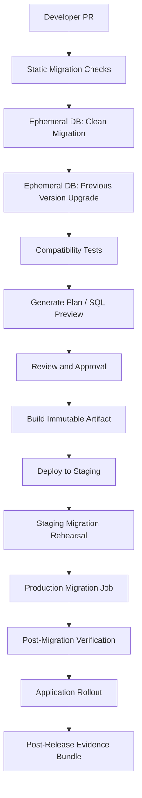
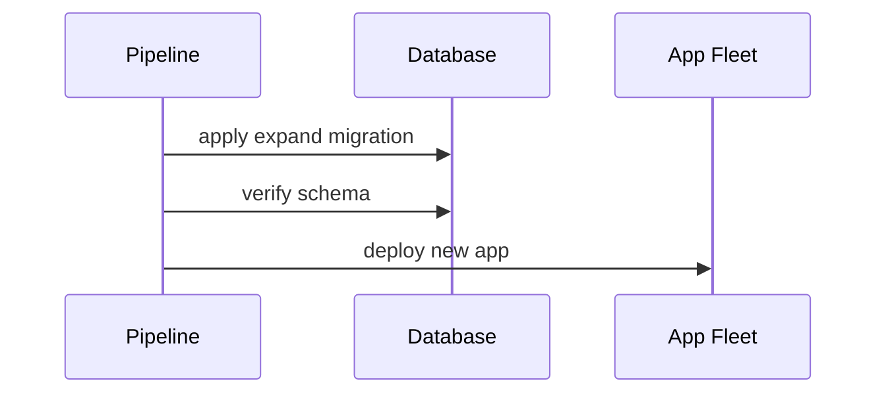

------
title: Learn Java Database Migrations, Flyway, Liquibase - Part 028
description: CI/CD pipeline design for Java database migrations with validation, dry-run, ephemeral databases, release gates, production execution, audit evidence, and recovery controls.
series: learn-java-database-migrations
seriesTitle: Learn Java Database Migrations, Flyway, Liquibase
order: 28
partTitle: CI/CD Pipeline Design for Database Migration
tags:
  - java
  - database
  - migration
  - flyway
  - liquibase
  - cicd
  - devops
  - release-engineering
  - production-engineering
  - audit
date: 2026-06-28
---

# Part 028 — CI/CD Pipeline Design for Database Migration

> **Goal:** setelah bagian ini, kamu bisa mendesain pipeline database migration yang aman, repeatable, auditable, dan cocok untuk production. Fokusnya bukan “menaruh command migrate di Jenkins/GitHub Actions”, melainkan menjadikan migration sebagai release artifact dengan validation gate, dry-run, evidence, deployment order, observability, dan recovery plan.

Database migration berbeda dari application deployment karena migration mengubah **stateful shared asset**. Binary aplikasi bisa di-rollback dengan cepat. Database schema/data tidak selalu bisa dikembalikan begitu saja, terutama jika sudah menerima write dari versi aplikasi baru.

Pipeline yang matang harus menjawab:

```txt
Apa yang akan berubah?
Apakah perubahan kompatibel?
Apakah bisa dijalankan dari schema kosong?
Apakah bisa dijalankan dari schema production-like?
Apakah SQL final sudah terlihat?
Apakah ada destructive operation?
Siapa menyetujui?
Kapan dijalankan?
Bagaimana tahu berhasil?
Bagaimana melanjutkan jika gagal?
```

---

## 1. Kaufman Deconstruction

Skill pipeline migration bisa dipecah menjadi:

| Sub-skill | Output Konkret |
|---|---|
| Artifact design | migration packaged as immutable release artifact |
| Static validation | naming, checksum, destructive command, lock-risk checks |
| Ephemeral testing | migrate clean database and previous schema snapshot |
| Compatibility testing | old app/new app vs old schema/new schema |
| Dry-run review | generated SQL or migration plan reviewed before production |
| Promotion model | dev → test → staging → production with same artifact |
| Production execution | controlled runner, credentials, lock timeout, stop condition |
| Observability | metrics, logs, history table, post-checks |
| Recovery | repair, roll-forward, rollback, manual intervention path |
| Evidence | audit-ready change record |

Kaufman-style target untuk bagian ini:

> Dalam 20 jam pertama latihan, kamu harus bisa mengambil satu PR migration dan merancang pipeline yang dapat membuktikan migration itu aman untuk production, bukan hanya menjalankannya.

---

## 2. Pipeline Anti-Goal

Sebelum desain yang benar, pahami desain yang salah:

```yaml
steps:
  - checkout
  - build
  - run: mvn test
  - run: java -jar app.jar
```

Jika aplikasi menjalankan migration otomatis saat startup, pipeline terlihat sederhana tetapi production behavior menjadi kabur:

- instance mana yang menjalankan migration?
- apakah semua instance berebut lock?
- apakah migration terjadi sebelum readiness?
- apakah migration failure menyebabkan deploy rollback atau crash loop?
- apakah SQL sudah direview?
- apakah destructive operation dicegah?

Startup migration boleh untuk aplikasi kecil atau internal tool. Untuk sistem critical, migration sebaiknya menjadi **explicit deployment stage**.

---

## 3. Target Architecture

Pipeline ideal memisahkan application artifact dan migration execution, tetapi tetap mengikat keduanya dalam release.



Tidak semua organisasi mampu menerapkan semua gate sejak hari pertama. Tetapi mental model ini memberi arah kematangan.

---

## 4. Artifact Principle

Migration harus diperlakukan sebagai artifact, bukan folder script yang berubah-ubah.

Invariant:

```txt
The exact migration artifact validated in CI must be the artifact executed in production.
```

Contoh artifact:

```txt
service-name-db-migrations-2026.06.28+commit.abc123.jar
```

Isi artifact:

```txt
db/migration/*.sql
db/changelog/*.yaml
migration-runner.jar
checksums.json
migration-manifest.yaml
```

Manifest contoh:

```yaml
service: enforcement-case-service
release: 2026.06.28
commit: abc123
migrationTool: flyway
migrationLocations:
  - classpath:db/migration/platform
  - classpath:db/migration/tenant
expectedTargetVersion: 2026.06.28.004
requiresAppCompatibility:
  minAppVersion: 4.17.0
  maxSkewHours: 72
destructiveChanges: false
requiresManualApproval: true
```

Tanpa artifact immutable, audit dan reproduction menjadi sulit.

---

## 5. PR-Level Checks

PR adalah gate pertama.

### 5.1 Naming and Ordering Check

Untuk Flyway:

```txt
V202606281030__add_case_priority_reason.sql
R__case_summary_view.sql
```

Checks:

- version belum dipakai;
- filename sesuai convention;
- timestamp tidak mundur;
- no duplicate version;
- no modified applied migration if compared against main/release branch;
- repeatable migration description stable.

Untuk Liquibase:

- changeset `id` unik dalam file;
- `author` sesuai convention;
- include order deterministic;
- no random `includeAll` ordering risk kecuali dikontrol;
- no changed historical changeset tanpa `runOnChange` yang memang disengaja;
- rollback policy jelas.

### 5.2 Static SQL Risk Check

Cari operasi berbahaya:

```txt
DROP TABLE
DROP COLUMN
TRUNCATE
DELETE without WHERE
UPDATE without WHERE
ALTER COLUMN TYPE
SET NOT NULL
CREATE INDEX without CONCURRENTLY for PostgreSQL large table
LOCK TABLE
```

Static check tidak menggantikan review manusia, tetapi bisa menghentikan kesalahan kasar.

Contoh policy:

```yaml
rules:
  destructiveDdl:
    deny:
      - "DROP TABLE"
      - "TRUNCATE"
    requireApproval:
      - "DROP COLUMN"
      - "ALTER TABLE .* DROP CONSTRAINT"
  dml:
    deny:
      - "DELETE FROM .*;"
      - "UPDATE .* SET .*;"
  postgres:
    warn:
      - "CREATE INDEX (?!CONCURRENTLY)"
```

### 5.3 Compatibility Review

Setiap migration harus diklasifikasikan:

```txt
C0 = no app compatibility concern
C1 = backward-compatible additive
C2 = requires app dual-read/dual-write
C3 = requires deployment choreography
C4 = destructive/high-risk/manual window
```

Pipeline bisa memaksa approval lebih tinggi untuk C3/C4.

---

## 6. Ephemeral Database Testing

Jangan hanya test aplikasi. Test migration.

### 6.1 Clean Migration Test

Tujuan:

```txt
Can a new database be created from all migrations from zero?
```

Flow:

```txt
start container database
run migrations from scratch
run schema smoke tests
run application integration tests
```

Ini menangkap:

- missing object dependency;
- non-deterministic ordering;
- repeatable migration failure;
- Liquibase include path issue;
- vendor-specific SQL incompatibility.

### 6.2 Upgrade from Previous Version

Clean migration tidak cukup. Production tidak mulai dari nol.

Flow:

```txt
start database
apply migration artifact from previous release
load minimal production-like data
apply new migration artifact
run verification
```

Ini menangkap:

- migration yang hanya bekerja pada empty table;
- NOT NULL failure karena existing row;
- duplicate data blocking unique constraint;
- data migration assumption yang salah.

### 6.3 Production-Like Snapshot Test

Untuk critical migration, gunakan sanitized snapshot atau generated representative dataset.

Tujuannya bukan menyalin production sembarangan, tetapi menguji:

- table size;
- data distribution;
- null/duplicate anomalies;
- constraint readiness;
- migration duration;
- lock behavior approximation.

---

## 7. Flyway Pipeline Design

### 7.1 CI Validation

Command umum:

```bash
flyway info
flyway validate
flyway migrate
```

Dalam CI, `validate` digunakan sebagai integrity gate. Tetapi validate hanya berarti artifact konsisten terhadap target database history. Karena itu, jalankan terhadap database ephemeral dengan skenario yang benar.

### 7.2 SQL Review

Untuk SQL-first Flyway, file SQL adalah review artifact utama. Untuk Java migration, reviewer harus melihat logic dan test-nya.

Pipeline harus menghasilkan:

```txt
migration list
checksum list
pending migration list
repeatable migration list
schema history after run
```

### 7.3 Production Execution

Production runner contoh:

```bash
java -jar migration-runner.jar \
  --service=enforcement-case-service \
  --release=2026.06.28 \
  --target=prod \
  --tool=flyway \
  --locations=classpath:db/migration \
  --lock-timeout=30s
```

Guardrails:

- `clean` disabled;
- `baselineOnMigrate` disabled kecuali onboarding eksplisit;
- `repair` tidak tersedia di normal deploy job;
- destructive migration butuh manual approval;
- migration user berbeda dari app user;
- output disimpan sebagai evidence.

---

## 8. Liquibase Pipeline Design

### 8.1 Validate and UpdateSQL

Liquibase pipeline biasanya memakai:

```bash
liquibase validate
liquibase update-sql
liquibase update
```

`update-sql` penting karena menghasilkan SQL yang akan dijalankan tanpa menerapkannya. Untuk regulated environment, SQL preview sering menjadi review artifact.

### 8.2 Context and Label Filters

Pipeline harus eksplisit:

```bash
liquibase update \
  --context-filter=prod \
  --label-filter=release-2026-06
```

Jangan biarkan context/label default tidak jelas. Evidence harus menyimpan filter aktual yang digunakan.

### 8.3 Rollback Preview

Untuk changeset yang mengklaim rollback-capable, pipeline dapat menjalankan:

```bash
liquibase future-rollback-sql
```

Tetapi rollback SQL bukan jaminan operational rollback aman. Tetap review compatibility dan data semantics.

---

## 9. Deployment Ordering

Ada tiga pola umum.

### 9.1 Migration Before App

Cocok untuk additive backward-compatible changes.



Contoh:

```txt
add nullable column
add new table not yet used by old app
add index
add view compatible with old app
```

### 9.2 App Before Migration

Lebih jarang, tetapi bisa terjadi jika aplikasi harus siap membaca schema lama dan baru sebelum migration.

```txt
deploy app that tolerates both states
run migration
activate feature flag
```

### 9.3 Interleaved Expand/Contract

Untuk perubahan besar:

```txt
migration expand
app dual-write
backfill
verify
app read-new
migration contract
```

Pipeline harus bisa merepresentasikan release multi-step, bukan memaksa semuanya dalam satu deploy.

---

## 10. Environment Promotion Model

Jangan membuat migration baru per environment. Artifact sama, config berbeda.

```txt
same artifact:
  dev
  test
  staging
  production

different config:
  jdbc url
  credentials
  contexts/labels if explicitly allowed
  lock timeout
  concurrency
```

Anti-pattern:

```txt
V001__dev_schema.sql
V001__staging_schema.sql
V001__prod_schema.sql
```

Jika environment berbeda terlalu jauh, itu drift atau architecture smell.

---

## 11. Pipeline Gates

### 11.1 Gate 1 — Static Gate

Fail fast:

- invalid naming;
- duplicate version;
- forbidden SQL;
- missing rollback metadata if required;
- modified historical migration;
- unknown Liquibase context/label.

### 11.2 Gate 2 — Build Gate

- Java compiles;
- migration runner compiles;
- Java-based migration tested;
- package artifact produced;
- checksum manifest generated.

### 11.3 Gate 3 — Database Gate

- migrate from scratch;
- migrate from previous release;
- run schema tests;
- run data invariant tests;
- capture duration.

### 11.4 Gate 4 — Compatibility Gate

Test matrix:

| App | Schema | Expected |
|---|---|---|
| old app | old schema | pass |
| old app | expanded schema | pass |
| new app | old schema | pass if migration may lag |
| new app | new schema | pass |

For destructive contract migration:

| App | Schema | Expected |
|---|---|---|
| old app | contracted schema | fail expected, only allowed after old app retired |

### 11.5 Gate 5 — Approval Gate

Approval should depend on risk class.

```txt
C0/C1: normal code review
C2: senior engineer + test evidence
C3: service owner + DBA/platform review
C4: change advisory / incident-aware window
```

### 11.6 Gate 6 — Production Gate

Before execution:

- backup/PITR status known;
- migration lock available;
- current schema version expected;
- no active incident;
- replication lag acceptable;
- long transactions checked;
- on-call owner available;
- rollback/roll-forward plan linked.

---

## 12. Production Execution Patterns

### 12.1 Dedicated Migration Job

Preferred for critical systems:

```txt
Kubernetes Job / ECS Task / Jenkins Agent / GitHub Runner with private network
```

Properties:

- one execution owner;
- explicit credentials;
- logs captured;
- not tied to app startup;
- can be paused/retried independently.

### 12.2 Application Startup Migration

Acceptable when:

- app is small;
- single instance or strong lock behavior;
- migration is fast;
- migration failure should block app startup;
- no multi-tenant fan-out;
- operational team accepts startup coupling.

Risky when:

- many replicas start together;
- migration takes minutes;
- schema change is lock-heavy;
- readiness/liveness causes restart loop;
- app user has excessive DDL privileges.

### 12.3 DBA-Executed SQL

Sometimes required in regulated environments. If so, keep source of truth in repo.

Flow:

```txt
Liquibase update-sql / reviewed Flyway SQL
DBA executes exact artifact SQL
pipeline records manual execution evidence
history table reconciled
```

Manual execution without source-controlled artifact is drift creation.

---

## 13. Observability and Post-Checks

Migration success is not only command success.

Post-check examples:

```sql
-- column exists
SELECT column_name
FROM information_schema.columns
WHERE table_name = 'case_record'
  AND column_name = 'priority_reason';
```

```sql
-- no unbackfilled rows
SELECT COUNT(*)
FROM case_record
WHERE priority_reason IS NULL
  AND priority_required = true;
```

```sql
-- constraint validity PostgreSQL
SELECT conname, convalidated
FROM pg_constraint
WHERE conname = 'case_record_priority_reason_nn';
```

Metrics:

- migration duration;
- lock wait;
- blocked sessions;
- rows affected;
- replication lag;
- database CPU/IO;
- error count by code;
- schema version after run.

---

## 14. Recovery Design

Pipeline must know what to do when migration fails.

### 14.1 Failed Before Any Change

Action:

```txt
fix artifact/config
rerun
```

### 14.2 Failed After Partial Change

Action:

```txt
inspect database state
inspect history table
classify changed objects
choose repair/roll-forward/manual cleanup
capture evidence
```

### 14.3 Checksum Mismatch

Action:

```txt
stop
identify who changed applied migration
restore original file or create new migration
repair only if metadata must be reconciled and approval exists
```

### 14.4 Lock Timeout

Action:

```txt
check blockers
reschedule or reduce lock timeout/concurrency
consider online/staged DDL
rerun if no partial change
```

### 14.5 Data Invariant Failure

Action:

```txt
create data repair migration
run verification
then run original migration or replacement migration
```

Recovery must be designed before production execution, not invented during incident.

---

## 15. Security Boundary

Pipeline should use different identities:

| Identity | Permission |
|---|---|
| application user | DML needed by app, no broad DDL |
| migration user | controlled DDL/DML for schema changes |
| read-only verifier | schema/data checks |
| break-glass DBA | emergency repair only |

Secrets:

- injected at runtime;
- not stored in artifact;
- rotated;
- scoped per environment;
- audited.

Dangerous commands like `clean`, unrestricted `repair`, or ad-hoc SQL shell should not be available in standard pipeline jobs.

---

## 16. Example GitHub Actions Shape

This is conceptual; adapt to your platform.

```yaml
name: database-migration-ci

on:
  pull_request:
    paths:
      - 'src/main/resources/db/**'
      - 'migration-runner/**'

jobs:
  validate-migrations:
    runs-on: ubuntu-latest
    steps:
      - uses: actions/checkout@v4

      - name: Set up JDK
        uses: actions/setup-java@v4
        with:
          distribution: temurin
          java-version: '21'

      - name: Static migration policy check
        run: ./gradlew migrationPolicyCheck

      - name: Start ephemeral database
        run: docker compose -f docker-compose.db.yml up -d

      - name: Migrate from scratch
        run: ./gradlew flywayMigrate -Penv=ci

      - name: Run integration tests
        run: ./gradlew test integrationTest

      - name: Build migration artifact
        run: ./gradlew :migration-runner:bootJar

      - name: Upload evidence
        uses: actions/upload-artifact@v4
        with:
          name: migration-evidence
          path: build/migration-evidence/**
```

Untuk Liquibase, ganti step dengan `liquibase validate`, `liquibase update-sql`, dan `liquibase update` terhadap ephemeral DB.

---

## 17. Migration Evidence Bundle

Setiap production migration harus menghasilkan bundle:

```txt
release id
commit sha
artifact checksum
migration tool version
migration config excluding secrets
pending migration list before run
schema history/changelog before run
SQL preview or migration file list
approval record
execution log
post-check result
schema history/changelog after run
rollback/roll-forward decision record
incident/change ticket link
```

Evidence ini membuat tim bisa menjawab:

> Apa yang berubah di production, kapan, oleh artifact mana, dengan hasil apa?

---

## 18. Maturity Model

| Level | Karakteristik |
|---|---|
| 0 | Manual SQL di production, tidak ada source of truth |
| 1 | Migration tool dipakai lokal, production masih manual |
| 2 | Migration jalan otomatis saat app startup |
| 3 | CI validates migration against ephemeral DB |
| 4 | Dedicated migration artifact and production job |
| 5 | Compatibility gates, dry-run review, evidence bundle |
| 6 | Drift detection, tenant-aware orchestration, policy-as-code |
| 7 | Fully governed migration platform with audit and SLOs |

Target top engineer bukan langsung level 7. Targetnya adalah tahu level sistem saat ini, risiko level itu, dan next improvement paling bernilai.

---

## 19. Anti-Patterns

### 19.1 “Migration Happens When App Starts” untuk Semua Kasus

Ini menyembunyikan release step paling riskan di balik startup aplikasi.

### 19.2 Generate SQL di Production

Dry-run/SQL preview harus dibuat dan direview sebelum production, bukan baru saat window production.

### 19.3 Environment-Specific Migration Files

Menciptakan drift by design.

### 19.4 No Previous-Version Upgrade Test

Clean migration pass tidak membuktikan production upgrade aman.

### 19.5 Pipeline Repair Otomatis

`repair` bukan command normal deploy. Ia adalah reconciliation action setelah investigasi.

### 19.6 No Stop Condition

Pipeline yang terus jalan meskipun failure rate tinggi adalah incident amplifier.

---

## 20. Final Checklist

Sebelum migration masuk production, pastikan:

- artifact immutable;
- static checks pass;
- clean migration test pass;
- previous-version upgrade test pass;
- compatibility matrix pass;
- SQL preview/review tersedia jika relevan;
- risk class ditentukan;
- approval sesuai risk class;
- execution identity benar;
- backup/PITR posture diketahui;
- stop condition jelas;
- post-check query tersedia;
- recovery plan jelas;
- evidence bundle path tersedia.

---

## 21. Mini Practice

Diberikan PR:

```txt
- Adds column case_record.escalation_reason nullable
- Backfills from case_event latest escalation event
- Adds index on case_event(case_id, event_type, created_at)
- New app reads escalation_reason if present
```

Pipeline yang baik:

1. static check mendeteksi index dan backfill;
2. test clean migration;
3. test upgrade from previous release with sample data;
4. validate old app still works with expanded schema;
5. validate new app works before and after backfill;
6. run SQL preview/review;
7. deploy expand migration;
8. deploy app;
9. run backfill as controlled job;
10. verify null count and event reconciliation;
11. later enforce constraints if needed.

Jika pipeline hanya menjalankan `mvn test`, ia belum menguji migration sebagai production state transition.

---

## 22. Key Takeaways

CI/CD untuk database migration adalah sistem kontrol perubahan stateful. Fokusnya bukan automation saja, tetapi **safe automation**.

Prinsip utama:

```txt
A migration pipeline is successful only when it can prove what it will do,
execute it with bounded risk,
verify the result,
and preserve enough evidence to recover or audit later.
```

---

## References

- Redgate Flyway Documentation — Migrations, validate, schema history, and migration commands.
- Liquibase Documentation — update, update-sql, validate, contexts, labels, rollback SQL commands.
- Spring Boot Documentation — Database initialization and Flyway/Liquibase integration.
- PostgreSQL Documentation — transactional and non-transactional DDL considerations such as concurrent indexes.
- MySQL Documentation — online DDL operations and algorithm differences.
