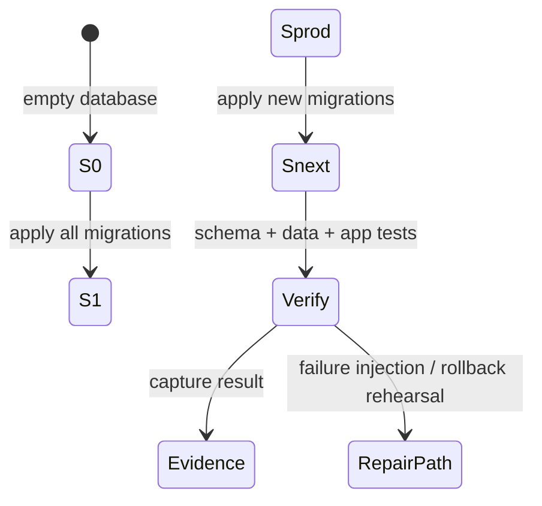
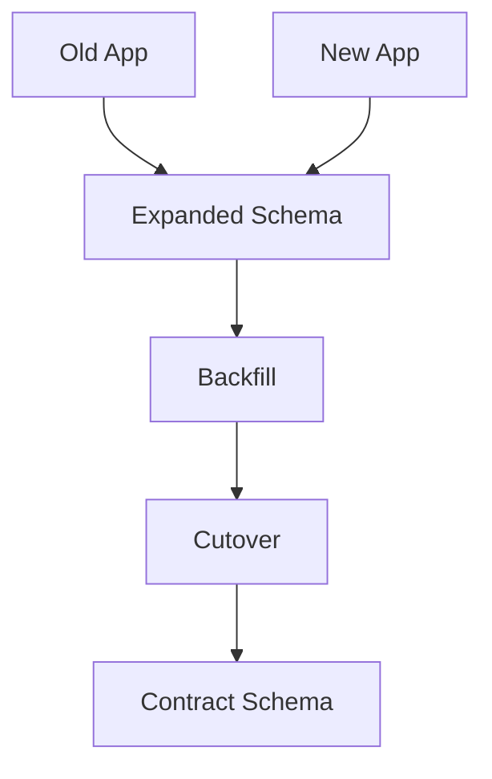
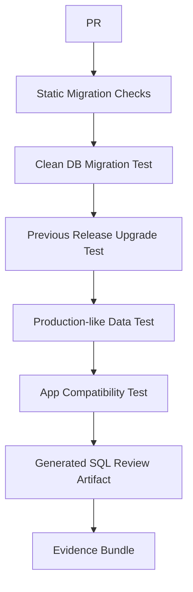

------
title: Learn Java Database Migrations, Flyway, Liquibase - Part 029
description: Production-grade testing strategy for Java database migrations using Flyway, Liquibase, Testcontainers, ephemeral databases, compatibility tests, failure injection, and schema contract verification.
series: learn-java-database-migrations
seriesTitle: Learn Java Database Migrations, Flyway, Liquibase
order: 29
partTitle: Testing Database Migrations
slug: testing-migrations
tags:
  - java
  - database
  - migration
  - flyway
  - liquibase
  - testing
  - testcontainers
  - spring-boot
  - ci-cd
  - production-engineering
date: 2026-06-28
---

# Part 029 — Testing Database Migrations

> **Goal:** setelah bagian ini, kamu bisa merancang testing strategy untuk database migration yang membuktikan tiga hal: migration dapat dijalankan, hasil schema/data benar, dan aplikasi tetap kompatibel selama release window.

Database migration testing bukan hanya `mvn test` plus database kosong. Testing migration harus menjawab pertanyaan yang lebih keras:

```txt
Apakah migration bisa membangun schema dari nol?
Apakah migration bisa upgrade schema versi production saat ini?
Apakah migration aman terhadap data production-like?
Apakah migration compatible dengan versi aplikasi lama dan baru?
Apakah migration deterministic?
Apakah failure-nya recoverable?
Apakah evidence-nya cukup untuk production approval?
```

Jika test hanya membuktikan aplikasi bisa start dengan H2 atau embedded database, itu belum membuktikan migration aman untuk PostgreSQL/MySQL/Oracle/SQL Server production. Perbedaan DDL, locking, index behavior, type semantics, constraint validation, collation, timezone, sequence, identity, dan transaction boundary bisa membuat test hijau tetapi deployment production gagal.

---

## 1. Kaufman Deconstruction

Skill testing migration bisa dipecah menjadi sub-skill berikut:

| Sub-skill | Output Konkret |
|---|---|
| Clean-build test | migration dapat membangun schema dari database kosong |
| Upgrade test | migration dapat meng-upgrade schema versi sebelumnya |
| Compatibility test | old/new app kompatibel dengan transitional schema |
| Data invariant test | jumlah, relasi, uniqueness, dan business invariant tetap benar |
| Drift test | schema actual cocok dengan expected model |
| Rollback/roll-forward test | recovery path realistis dan terdokumentasi |
| Failure injection | partial failure, lock timeout, duplicate data, bad state diuji |
| Performance rehearsal | lock, duration, batch size, log growth, dan timeout diprediksi |
| Evidence capture | hasil test menjadi bahan approval dan audit |

Kaufman-style practice target:

> Ambil satu migration nyata, lalu buktikan bukan hanya bahwa SQL-nya valid, tetapi bahwa transition-nya aman untuk data, aplikasi, deployment order, dan recovery.

---

## 2. Mental Model: Migration Test Matrix

Migration adalah state transition. Maka testing-nya harus berbasis state transition, bukan hanya statement execution.



Minimal test matrix:

| Test Type | Starting State | Action | Expected Evidence |
|---|---|---|---|
| Clean migration | empty DB | apply all migrations | schema lengkap terbentuk |
| Upgrade migration | previous release schema | apply new migrations | upgrade sukses |
| Production-like upgrade | anonymized/synthetic prod-like data | apply new migrations | invariant tetap benar |
| Compatibility | old/new app + transitional schema | run API/repository tests | deployment window aman |
| Drift check | target DB vs expected schema | compare/snapshot/diff | tidak ada manual drift |
| Failure recovery | injected failure | rerun/repair/roll-forward | recovery path valid |

Testing yang matang selalu menguji dua jalur:

```txt
from scratch  : empty DB     -> latest schema
from reality  : prod-like DB -> latest schema
```

Keduanya menangkap bug yang berbeda.

---

## 3. Why Clean Database Test Is Necessary but Not Sufficient

Clean database test penting karena membuktikan repo migration lengkap dan urutannya valid.

Contoh Flyway clean-build test:

```java
@Test
void flywayCanBuildSchemaFromEmptyDatabase() {
    Flyway flyway = Flyway.configure()
            .dataSource(postgres.getJdbcUrl(), postgres.getUsername(), postgres.getPassword())
            .locations("classpath:db/migration")
            .cleanDisabled(false) // only in isolated test database
            .load();

    flyway.clean();
    flyway.migrate();

    assertTableExists("customer");
    assertTableExists("case_file");
    assertColumnExists("case_file", "status");
}
```

Namun clean test tidak membuktikan upgrade production aman. Production database tidak kosong. Ia punya:

- data historis yang kotor;
- nullable value yang tidak terduga;
- duplicate natural key;
- orphan row dari bug lama;
- index lama;
- sequence yang tidak sinkron;
- enum value lama;
- manual hotfix;
- long-running transaction;
- permission/grant berbeda;
- table besar dengan lock risk.

Karena itu, clean test harus dipasangkan dengan upgrade test.

---

## 4. Upgrade Test from Previous Release

Upgrade test mensimulasikan jalur production yang lebih realistis:

```txt
schema at release N
+ representative data
+ migration for release N+1
= expected schema/data state
```

### 4.1 Pattern: Previous Release Fixture

Simpan snapshot schema/data minimal dari release sebelumnya:

```txt
src/test/resources/db/previous-release/
  schema-v2026.06.1.sql
  data-v2026.06.1.sql
```

Lalu jalankan migration terbaru di atasnya.

```java
@Test
void migrationUpgradesPreviousReleaseSchema() throws Exception {
    DatabaseClient db = connectTo(postgres);

    sqlScript(db, "db/previous-release/schema-v2026.06.1.sql");
    sqlScript(db, "db/previous-release/data-v2026.06.1.sql");

    Flyway flyway = Flyway.configure()
            .dataSource(postgres.getJdbcUrl(), postgres.getUsername(), postgres.getPassword())
            .locations("classpath:db/migration")
            .baselineOnMigrate(true) // only if previous fixture has no flyway history
            .baselineVersion("2026.06.1")
            .load();

    flyway.migrate();

    assertNoNulls("case_file", "status");
    assertForeignKeyValid("case_file", "fk_case_file_customer");
}
```

Catatan penting: `baselineOnMigrate` di test bisa berguna untuk fixture lama tanpa history table, tetapi di production harus diperlakukan sebagai command berisiko. Jangan jadikan test convenience sebagai production default.

### 4.2 Better Pattern: Restore Real History Table

Untuk migration tool behavior yang lebih akurat, fixture previous release sebaiknya menyertakan history table:

```txt
flyway_schema_history
DATABASECHANGELOG
DATABASECHANGELOGLOCK
```

Dengan demikian tool benar-benar melihat state seperti production, bukan schema kosong yang dipalsukan dengan baseline.

---

## 5. Testcontainers as Production-Like Database Harness

Untuk Java, Testcontainers memberi cara praktis menjalankan database nyata dalam test. Ini penting karena migration sering bergantung pada fitur vendor:

- PostgreSQL `CREATE INDEX CONCURRENTLY`;
- MySQL `ALGORITHM=INPLACE` atau `LOCK=NONE`;
- Oracle sequence/identity behavior;
- SQL Server filtered index atau computed column;
- timezone/collation/case-sensitivity;
- locking dan transactional DDL.

Contoh JUnit 5 + PostgreSQL:

```java
@Testcontainers
class MigrationIT {

    @Container
    static PostgreSQLContainer<?> postgres = new PostgreSQLContainer<>("postgres:16-alpine")
            .withDatabaseName("app")
            .withUsername("app")
            .withPassword("secret");

    @Test
    void flywayMigrationsApplyOnRealPostgres() {
        Flyway flyway = Flyway.configure()
                .dataSource(postgres.getJdbcUrl(), postgres.getUsername(), postgres.getPassword())
                .locations("classpath:db/migration")
                .load();

        MigrateResult result = flyway.migrate();

        assertThat(result.success).isTrue();
    }
}
```

Spring Boot sample:

```java
@SpringBootTest
@Testcontainers
class ApplicationMigrationIT {

    @Container
    static PostgreSQLContainer<?> postgres = new PostgreSQLContainer<>("postgres:16-alpine");

    @DynamicPropertySource
    static void databaseProperties(DynamicPropertyRegistry registry) {
        registry.add("spring.datasource.url", postgres::getJdbcUrl);
        registry.add("spring.datasource.username", postgres::getUsername);
        registry.add("spring.datasource.password", postgres::getPassword);
        registry.add("spring.flyway.enabled", () -> "true");
        registry.add("spring.jpa.hibernate.ddl-auto", () -> "validate");
    }

    @Test
    void contextLoadsAfterMigration() {
        // Spring Boot starts, Flyway migrates, JPA validates mappings.
    }
}
```

Key rule:

> Test database type should match production database type for migration tests.

H2 boleh dipakai untuk pure unit test repository ringan, tetapi bukan untuk membuktikan production migration.

---

## 6. Flyway Testing Strategy

Flyway testing perlu membuktikan beberapa layer.

### 6.1 `validate` Test

`validate` mendeteksi mismatch antara resolved migration dan schema history table: missing, changed checksum, naming issue, atau migration history inconsistency.

```java
@Test
void flywayValidatePassesAfterMigrate() {
    Flyway flyway = flywayFor(postgres);
    flyway.migrate();
    flyway.validate();
}
```

CI command:

```bash
./mvnw -DskipTests=false flyway:validate
# or
./gradlew flywayValidate
```

Namun `validate` bukan SQL semantic checker. Ia tidak membuktikan query plan aman, lock kecil, atau data invariant benar.

### 6.2 Repeatable Migration Test

Repeatable migration perlu diuji rerun behavior-nya.

```java
@Test
void repeatableMigrationsAreStableAcrossSecondRun() {
    Flyway flyway = flywayFor(postgres);

    MigrateResult first = flyway.migrate();
    MigrateResult second = flyway.migrate();

    assertThat(second.migrationsExecuted).isZero();
}
```

Jika test ini gagal tanpa perubahan file, ada script yang tidak deterministic atau checksum berubah karena placeholder/time/template.

### 6.3 Immutable Versioned Migration Check

Tambahkan CI check: migration versi lama tidak boleh berubah setelah merged ke main/permanent branch.

Pseudo-script:

```bash
git diff --name-only origin/main...HEAD \
  | grep 'src/main/resources/db/migration/V' \
  | while read file; do
      if git cat-file -e origin/main:"$file" 2>/dev/null; then
        echo "ERROR: existing versioned migration modified: $file"
        exit 1
      fi
    done
```

Allowed:

```txt
add V20260628_1400__add_case_priority.sql
```

Rejected:

```txt
modify V20260501_1000__create_case_table.sql
```

---

## 7. Liquibase Testing Strategy

Liquibase test perlu memvalidasi syntax, generated SQL, changeset identity, rollback expectation, dan runtime behavior.

### 7.1 Validate Changelog

CI command:

```bash
liquibase \
  --changelog-file=db/changelog/db.changelog-master.yaml \
  validate
```

`validate` memeriksa changelog dan potensi syntax/behavior error Liquibase. Ia tidak menjamin SQL generated pasti benar untuk semua data dan semua locking condition.

### 7.2 Inspect Generated SQL

```bash
liquibase \
  --changelog-file=db/changelog/db.changelog-master.yaml \
  update-sql > build/liquibase/update.sql
```

Review `update.sql` untuk:

- destructive DDL;
- table rewrite;
- unbounded update;
- missing where clause;
- risky type cast;
- blocking index creation;
- implicit default/backfill;
- vendor-specific syntax.

### 7.3 Execute Update on Real Database

```java
@Test
void liquibaseUpdateAppliesOnRealPostgres() throws Exception {
    try (Connection connection = DriverManager.getConnection(
            postgres.getJdbcUrl(), postgres.getUsername(), postgres.getPassword())) {

        Database database = DatabaseFactory.getInstance()
                .findCorrectDatabaseImplementation(new JdbcConnection(connection));

        Liquibase liquibase = new Liquibase(
                "db/changelog/db.changelog-master.yaml",
                new ClassLoaderResourceAccessor(),
                database);

        liquibase.update(new Contexts(), new LabelExpression());
    }
}
```

### 7.4 Rollback SQL Review Test

Untuk changeset yang mengklaim rollback support:

```bash
liquibase future-rollback-sql > build/liquibase/future-rollback.sql
```

Test tidak cukup hanya memastikan file rollback ada. Review harus menjawab:

```txt
Apakah rollback menjaga data?
Apakah rollback compatible dengan aplikasi lama?
Apakah rollback bisa dilakukan setelah user menulis data baru?
Apakah rollback justru destructive?
```

---

## 8. Schema Contract Tests

Migration tidak selesai ketika table berhasil dibuat. Aplikasi punya contract terhadap schema:

- column exists;
- column type expected;
- nullability expected;
- index exists;
- FK exists;
- enum/lookup value exists;
- stored function signature stable;
- view columns stable;
- permission/grant available.

Contoh contract assertion:

```java
record ColumnContract(
        String table,
        String column,
        String dataType,
        boolean nullable
) {}

@Test
void caseTableContractIsStable() {
    assertColumn(new ColumnContract("case_file", "id", "uuid", false));
    assertColumn(new ColumnContract("case_file", "status", "character varying", false));
    assertIndexExists("case_file", "idx_case_file_status");
}
```

Contract tests cocok untuk reusable library internal:

```txt
migration-test-support/
  SchemaAssert.java
  ConstraintAssert.java
  IndexAssert.java
  FlywayTestHarness.java
  LiquibaseTestHarness.java
```

---

## 9. Application Compatibility Tests

Expand/contract migration membutuhkan compatibility matrix.



Test matrix:

| App Version | Schema Version | Expected Result |
|---|---|---|
| old app | old schema | pass |
| old app | expanded schema | pass |
| new app | expanded schema | pass |
| new app | contracted schema | pass |
| old app | contracted schema | fail/not allowed |

Untuk rolling deployment, test paling penting:

```txt
old app + expanded schema = must pass
new app + expanded schema = must pass
```

Jika old app gagal setelah expand migration, deployment tidak zero-downtime.

---

## 10. Data Invariant Tests

Data migration harus diuji dengan invariant, bukan hanya row count.

Contoh migration:

```sql
ALTER TABLE case_file ADD COLUMN priority VARCHAR(20);

UPDATE case_file
SET priority = CASE
    WHEN severity = 'CRITICAL' THEN 'HIGH'
    ELSE 'NORMAL'
END
WHERE priority IS NULL;
```

Invariant test:

```java
@Test
void priorityBackfillPreservesBusinessInvariant() {
    assertEquals(0, count("case_file", "priority IS NULL"));
    assertEquals(0, count("case_file", "severity = 'CRITICAL' AND priority <> 'HIGH'"));
    assertEquals(totalCasesBefore, count("case_file", "1 = 1"));
}
```

Better invariant categories:

| Invariant | Example |
|---|---|
| Cardinality | row count preserved unless explicitly changed |
| Completeness | no required field remains null |
| Referential integrity | no orphan child rows |
| Uniqueness | no duplicate business key |
| Semantic mapping | old status maps to valid new status |
| Reversibility | backup/shadow column can reconstruct old value |
| Auditability | migrated rows have migration marker if required |

---

## 11. Test Data Design

Test data harus sengaja mencakup edge case.

```txt
happy path data is not enough
```

Minimal fixture classes:

| Fixture Class | Purpose |
|---|---|
| empty table | migration handles no data |
| small normal data | base behavior |
| null-heavy data | nullability/backfill risk |
| duplicate candidates | uniqueness risk |
| orphan candidates | FK risk |
| old enum/status values | mapping risk |
| boundary dates/timezones | temporal conversion risk |
| long text/unicode | length/collation risk |
| large batch sample | chunking/performance risk |
| permission restricted user | privilege risk |

Example fixture:

```sql
INSERT INTO case_file(id, status, severity, created_at) VALUES
('00000000-0000-0000-0000-000000000001', 'OPEN', 'LOW', now()),
('00000000-0000-0000-0000-000000000002', 'ESCALATED', 'CRITICAL', now()),
('00000000-0000-0000-0000-000000000003', 'LEGACY_UNKNOWN', null, now());
```

---

## 12. Failure Injection Tests

Production failure jarang terjadi pada happy path. Testing harus mensimulasikan:

- migration interrupted halfway;
- duplicate data blocks unique constraint;
- FK validation fails;
- lock timeout;
- missing permission;
- checksum mismatch;
- precondition failure;
- partial tenant migration;
- repeatable migration syntax failure;
- data backfill worker crashes after batch 7.

### 12.1 Duplicate Data Failure

```sql
INSERT INTO user_account(email) VALUES ('same@example.com');
INSERT INTO user_account(email) VALUES ('same@example.com');
```

Migration:

```sql
CREATE UNIQUE INDEX ux_user_account_email ON user_account(email);
```

Expected test result:

```txt
Migration must fail before production.
Failure message must explain duplicate email.
Remediation script or pre-check must exist.
```

### 12.2 Lock Timeout Rehearsal

PostgreSQL example:

```sql
BEGIN;
SELECT * FROM case_file WHERE id = '...' FOR UPDATE;
-- hold transaction open in test thread
```

Migration thread:

```sql
SET lock_timeout = '5s';
ALTER TABLE case_file ADD COLUMN reviewed_at timestamptz;
```

Expected:

```txt
Migration fails fast, not hang indefinitely.
Pipeline captures failure.
Rerun strategy is documented.
```

---

## 13. Performance and Operational Rehearsal

For large table migration, correctness test is not enough.

Measure:

| Signal | Why It Matters |
|---|---|
| migration duration | deployment window |
| lock wait time | availability risk |
| rows per second | batch sizing |
| WAL/binlog/redo growth | replication/storage risk |
| replication lag | read replica impact |
| CPU/IO load | production saturation |
| dead tuples/bloat | vacuum/maintenance impact |
| connection usage | pool starvation risk |

Test backfill worker with representative volume:

```java
@Test
void backfillProcessesInBatchesAndCanResume() {
    seedRows(100_000);

    BackfillWorker worker = new BackfillWorker(dataSource, 1_000);
    worker.runUntilBatchCount(10);
    worker.simulateCrash();

    BackfillWorker resumed = new BackfillWorker(dataSource, 1_000);
    resumed.runToCompletion();

    assertEquals(0, count("case_file", "new_column IS NULL"));
    assertCheckpointComplete("case_file_priority_backfill");
}
```

---

## 14. Drift-Aware Tests

Migration can pass from clean state but fail on drifted target.

Drift-aware test pattern:

```txt
1. Create database from expected previous release.
2. Apply intentional drift.
3. Run migration pre-check.
4. Assert drift is detected before destructive action.
```

Example drift:

```sql
ALTER TABLE customer ALTER COLUMN external_id DROP NOT NULL;
DROP INDEX idx_case_file_status;
```

Expected:

```txt
Precondition or validation stops deployment.
Evidence says what drift exists.
Operator does not discover drift halfway through production migration.
```

Liquibase precondition example:

```yaml
- changeSet:
    id: 20260628-verify-customer-external-id
    author: platform-db
    preConditions:
      onFail: HALT
      not:
        columnExists:
          tableName: customer
          columnName: legacy_external_id
    changes:
      - addColumn:
          tableName: customer
          columns:
            - column:
                name: external_id_v2
                type: varchar(64)
```

---

## 15. Golden Schema Strategy

Golden schema adalah expected latest schema hasil migration dari source-controlled artifact.

Use cases:

- compare local generated schema vs expected;
- detect accidental change from ORM mapping;
- generate jOOQ/QueryDSL metadata from authoritative schema;
- verify staging/prod does not drift;
- review schema diff in PR.

Pattern:

```txt
migration files -> ephemeral DB -> snapshot schema -> compare with expected snapshot
```

Caution:

> Golden schema should be generated from migration source, not manually edited to match production drift.

---

## 16. Spring Boot Test Slices

### 16.1 `@SpringBootTest`

Good for end-to-end migration + app context + repository mapping.

```java
@SpringBootTest
class FullApplicationMigrationIT {
    @Test
    void applicationStartsWithMigratedDatabase() {}
}
```

### 16.2 `@DataJpaTest`

Good for repository mapping validation, but ensure it uses real DB and not embedded replacement.

```java
@DataJpaTest
@Testcontainers
@TestPropertySource(properties = {
    "spring.test.database.replace=none",
    "spring.datasource.url=jdbc:tc:postgresql:16-alpine:///app",
    "spring.flyway.enabled=true",
    "spring.jpa.hibernate.ddl-auto=validate"
})
class RepositorySchemaCompatibilityIT {
}
```

### 16.3 Migration-Only Test

Good for fast feedback without starting the full app.

```java
class FlywayOnlyIT {
    @Test
    void migrationsApply() {
        Flyway.configure()
              .dataSource(url, user, pass)
              .locations("classpath:db/migration")
              .load()
              .migrate();
    }
}
```

---

## 17. CI Pipeline for Migration Tests

Recommended stages:



Example GitHub Actions sketch:

```yaml
name: migration-tests

on:
  pull_request:

jobs:
  migration:
    runs-on: ubuntu-latest
    steps:
      - uses: actions/checkout@v4
      - uses: actions/setup-java@v4
        with:
          distribution: temurin
          java-version: '21'
      - name: Static migration checks
        run: ./scripts/check-migrations.sh
      - name: Integration tests with Testcontainers
        run: ./mvnw -Pmigration-test verify
      - name: Generate SQL preview
        run: ./mvnw -Pdb-plan liquibase:updateSQL || true
      - name: Upload migration evidence
        uses: actions/upload-artifact@v4
        with:
          name: migration-evidence
          path: build/migration-evidence/**
```

---

## 18. What Not to Test with Migration Tool Alone

Flyway/Liquibase cannot by themselves prove:

| Concern | Needs |
|---|---|
| lock duration safe | rehearsal/DB monitoring |
| query plan stable | EXPLAIN/benchmark |
| app compatibility | old/new app integration test |
| business invariant preserved | domain-specific assertions |
| rollback safe after writes | scenario test |
| drift absent | snapshot/diff/precondition |
| tenant fan-out safe | orchestration test |
| permission correct | restricted migration user test |

Tool validation is necessary, not sufficient.

---

## 19. Test Review Checklist

Before approving a migration PR, ask:

```txt
[ ] Is this migration tested from empty database?
[ ] Is it tested from previous release schema?
[ ] Is it tested with dirty/edge-case data?
[ ] Does it use the same DB engine family as production?
[ ] Does it validate app compatibility during rolling deployment?
[ ] Are destructive changes guarded by expand/contract?
[ ] Are data invariants asserted?
[ ] Is rollback/roll-forward tested or explicitly waived?
[ ] Are lock/time/performance risks rehearsed?
[ ] Are generated SQL and evidence artifacts attached?
[ ] Are tool-specific validate commands run?
[ ] Are history/changelog tables preserved in realistic upgrade tests?
```

---

## 20. Common Anti-Patterns

### Anti-pattern 1: H2 as Migration Proof

H2 success does not prove PostgreSQL/MySQL/Oracle/SQL Server migration safety.

### Anti-pattern 2: Only Clean DB Testing

Clean DB success misses legacy data and production drift.

### Anti-pattern 3: Testing ORM Auto-DDL Instead of Migration

If Hibernate creates schema in test, you are testing Hibernate schema generation, not your migration artifact.

### Anti-pattern 4: No Previous Release Fixture

Without previous release upgrade test, you are not testing the actual production path.

### Anti-pattern 5: No Dirty Data

The migration works only because test data is too clean.

### Anti-pattern 6: Treating Rollback SQL as Safe by Existence

Rollback script existing does not mean rollback is semantically safe after production writes.

### Anti-pattern 7: Test Runs as Superuser

Production migration may fail if CI test uses higher privilege than production migration user.

---

## 21. Minimal Internal Standard

For a serious Java service, minimum bar:

```txt
MUST:
- run Flyway/Liquibase validate in CI
- run migration against real DB engine via Testcontainers or equivalent
- run clean DB migration test
- run previous release upgrade test
- disable Hibernate DDL generation for migration tests
- assert key schema contracts
- assert data invariants for DML/backfill
- archive generated SQL/evidence for risky changes

SHOULD:
- include dirty data fixtures
- include rollback/roll-forward rehearsal
- include lock timeout rehearsal for risky DDL
- compare schema snapshot against golden schema
- run old/new app compatibility tests for expand/contract

MAY:
- run production-volume rehearsal in staging
- run tenant fan-out simulation
- run query plan regression checks
```

---

## 22. Practical Exercise

Take one migration that adds a non-null column to a large table.

Design tests for:

1. clean schema build;
2. upgrade from previous release;
3. table with existing rows;
4. rows with null source fields;
5. old app compatibility after expand migration;
6. new app compatibility after backfill;
7. contract migration that sets `NOT NULL`;
8. failure when duplicate/invalid data exists;
9. rerun after partial backfill;
10. evidence generated for approval.

Expected result:

```txt
You should be able to explain not just that the migration passes,
but what production risk each test reduces.
```

---

## 23. References

- Flyway documentation — schema history table and checksum/audit trail.
- Flyway documentation — validate command.
- Liquibase documentation — validate command.
- Liquibase documentation — update and update-sql commands.
- Testcontainers Java documentation — JDBC support and database containers.
- Testcontainers guide — working with jOOQ and Flyway using Testcontainers.
- Spring Boot documentation — database initialization and higher-level migration tools.

---

## 24. Key Takeaways

1. Migration testing is state-transition testing, not SQL syntax testing.
2. Always test from empty database and from previous release schema.
3. Production-like engine matters; H2 is not proof for vendor-specific DDL.
4. Data migration must be verified with domain invariants.
5. Expand/contract requires old/new app compatibility tests.
6. Tool validation is necessary but does not replace operational rehearsal.
7. Testing output should become audit and release evidence.

Next: Part 030 will focus on **observability, audit trail, compliance, and regulatory defensibility** for database migration.
