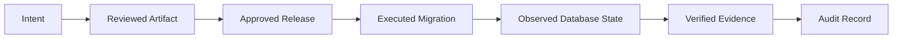

------
title: Learn Java Database Migrations, Flyway, Liquibase - Part 030
description: Observability, audit trail, compliance, and regulatory defensibility for Java database migrations using Flyway, Liquibase, CI/CD evidence, production logs, approvals, and release records.
series: learn-java-database-migrations
seriesTitle: Learn Java Database Migrations, Flyway, Liquibase
order: 30
partTitle: Observability, Audit Trail, Compliance, and Regulatory Defensibility
slug: observability-audit-and-compliance
tags:
  - java
  - database
  - migration
  - flyway
  - liquibase
  - observability
  - audit
  - compliance
  - governance
  - production-engineering
date: 2026-06-28
---

# Part 030 — Observability, Audit Trail, Compliance, and Regulatory Defensibility

> **Goal:** setelah bagian ini, kamu bisa membuat database migration yang tidak hanya berhasil secara teknis, tetapi juga bisa dijelaskan, dibuktikan, diaudit, dan dipertanggungjawabkan setelah production change terjadi.

Dalam sistem production, terutama regulated systems, migration harus menjawab pertanyaan audit sederhana tetapi berat:

```txt
Siapa yang mengubah database?
Apa yang berubah?
Kapan berubah?
Di environment mana berubah?
Mengapa berubah?
Siapa yang menyetujui?
Artifact mana yang dijalankan?
Apakah artifact itu sama dengan yang direview?
Apakah migration berhasil?
Apa evidence-nya?
Apa dampaknya ke data dan aplikasi?
Bagaimana recovery plan-nya?
```

Jika jawaban hanya “pipeline hijau” atau “Flyway/Liquibase sukses”, evidence belum cukup.

Observability dan audit bukan dekorasi. Keduanya adalah bagian dari correctness model database migration.

---

## 1. Kaufman Deconstruction

Skill observability/audit migration bisa dipecah menjadi:

| Sub-skill | Output Konkret |
|---|---|
| Change identity | setiap migration punya identity, owner, ticket, risk class |
| Execution trace | start/end/duration/status/operator/environment tercatat |
| Artifact integrity | checksum, commit SHA, build ID, image digest, changelog version |
| Approval evidence | PR, review, DBA approval, change request, risk signoff |
| Database evidence | schema history/changelog table, row counts, post-checks |
| Runtime observability | metrics, logs, traces, alerts, lock/wait monitoring |
| Compliance mapping | evidence bisa menjawab kontrol internal/regulator |
| Incident linkage | failure migration terhubung ke incident/change record |
| Retention policy | evidence disimpan sesuai kebutuhan audit |

Kaufman-style target:

> Dalam 20 jam latihan, kamu harus bisa membuat satu migration evidence bundle yang cukup untuk menjawab audit tanpa membuka Slack history atau bertanya ke engineer yang deploy.

---

## 2. Mental Model: Migration as Auditable State Transition

Migration adalah transition dari `S_before` ke `S_after`.



Setiap edge harus punya evidence.

| Transition | Evidence |
|---|---|
| Intent → artifact | ticket, design note, migration file |
| Artifact → reviewed | PR review, SQL preview, risk checklist |
| Reviewed → approved | approval record, change request |
| Approved → executed | build ID, commit SHA, runner identity, timestamp |
| Executed → observed | Flyway/Liquibase history, logs, metrics |
| Observed → verified | post-check SQL, app health, invariant checks |
| Verified → audit record | evidence bundle, release notes, retention location |

---

## 3. Observability vs Audit vs Compliance

Ketiganya sering dicampur, padahal berbeda.

| Concern | Primary Question | Example |
|---|---|---|
| Observability | Apa yang sedang/baru saja terjadi? | migration duration, lock wait, failed changeset |
| Audit | Apa yang terjadi dan apa buktinya? | PR, checksum, who/when/what |
| Compliance | Apakah proses memenuhi kontrol yang diwajibkan? | approval, segregation of duties, retention |

Observability membantu operasi real-time.

Audit membantu rekonstruksi kejadian.

Compliance membantu membuktikan proses memenuhi aturan internal/regulatory.

---

## 4. Evidence Hierarchy

Tidak semua evidence punya kualitas sama.

```txt
Level 0: verbal claim
Level 1: log line
Level 2: CI job result
Level 3: immutable artifact + checksum
Level 4: database history table + release metadata
Level 5: independently retained evidence bundle
```

Untuk production-grade migration, target minimal adalah Level 4. Untuk regulated environment, targetkan Level 5.

---

## 5. Flyway Audit Surface

Flyway menyediakan audit surface utama melalui schema history table. Table ini mencatat migration yang diterapkan, checksum, status, timestamp, dan metadata eksekusi.

Typical fields dalam `flyway_schema_history` mencakup konsep seperti:

```txt
installed_rank
version
description
type
script
checksum
installed_by
installed_on
execution_time
success
```

Gunakan table ini sebagai ledger teknis, bukan satu-satunya audit record.

### 5.1 Useful Queries

```sql
SELECT installed_rank,
       version,
       description,
       type,
       script,
       checksum,
       installed_by,
       installed_on,
       execution_time,
       success
FROM flyway_schema_history
ORDER BY installed_rank;
```

Failed migration:

```sql
SELECT *
FROM flyway_schema_history
WHERE success = false
ORDER BY installed_rank DESC;
```

Last migration:

```sql
SELECT *
FROM flyway_schema_history
ORDER BY installed_rank DESC
LIMIT 1;
```

### 5.2 What Flyway History Does Not Prove Alone

Flyway history table does not prove:

- PR was approved;
- SQL was reviewed;
- change request was authorized;
- data invariant was verified;
- application compatibility was tested;
- production lock impact was acceptable;
- operator used correct approval path;
- generated SQL matched reviewed artifact if build was not immutable.

It is necessary evidence, not complete evidence.

---

## 6. Liquibase Audit Surface

Liquibase menyediakan `DATABASECHANGELOG` untuk mencatat changeset yang sudah dijalankan dan `DATABASECHANGELOGLOCK` untuk mencegah concurrent update pada database yang sama.

Important concepts:

```txt
id
author
filename/dateexecuted/orderexecuted/exectype/md5sum/description/comments/tag/liquibase/contexts/labels/deployment_id
```

### 6.1 Useful Queries

```sql
SELECT id,
       author,
       filename,
       dateexecuted,
       orderexecuted,
       exectype,
       md5sum,
       description,
       comments,
       tag,
       deployment_id
FROM databasechangelog
ORDER BY orderexecuted;
```

Current lock:

```sql
SELECT id,
       locked,
       lockgranted,
       lockedby
FROM databasechangeloglock;
```

Changes by deployment:

```sql
SELECT deployment_id,
       count(*) AS changeset_count,
       min(dateexecuted) AS first_change,
       max(dateexecuted) AS last_change
FROM databasechangelog
GROUP BY deployment_id
ORDER BY max(dateexecuted) DESC;
```

### 6.2 What Liquibase History Does Not Prove Alone

`DATABASECHANGELOG` does not by itself prove:

- generated SQL was inspected;
- rollback was reviewed;
- labels/contexts were correctly selected;
- manual SQL was not executed separately;
- data migration completed if done outside Liquibase;
- application compatibility was verified;
- release approval existed.

---

## 7. Migration Logging Standard

A migration runner should emit structured logs.

Example JSON log:

```json
{
  "event": "database_migration_started",
  "service": "case-management",
  "environment": "production",
  "database": "case_db",
  "schema": "public",
  "tool": "flyway",
  "toolVersion": "...",
  "commitSha": "8b9f...",
  "buildId": "github-actions-123456",
  "releaseVersion": "2026.06.28.1",
  "changeRequestId": "CHG-10452",
  "operator": "migration-runner",
  "riskClass": "high"
}
```

Completion log:

```json
{
  "event": "database_migration_completed",
  "service": "case-management",
  "environment": "production",
  "status": "success",
  "durationMs": 43821,
  "migrationsExecuted": 3,
  "lastVersion": "20260628.1400",
  "postChecksPassed": true
}
```

Failure log:

```json
{
  "event": "database_migration_failed",
  "service": "case-management",
  "environment": "production",
  "status": "failed",
  "failedMigration": "V20260628_1400__add_case_priority.sql",
  "errorClass": "lock_timeout",
  "durationMs": 5000,
  "recoveryMode": "roll_forward_or_retry_after_lock_clear",
  "incidentId": "INC-8821"
}
```

---

## 8. Metrics to Capture

Migration metrics should be emitted to the same monitoring stack as application metrics.

| Metric | Type | Meaning |
|---|---|---|
| `db_migration_started_total` | counter | migration runs started |
| `db_migration_completed_total` | counter | migration runs completed |
| `db_migration_failed_total` | counter | migration failures |
| `db_migration_duration_seconds` | histogram | execution duration |
| `db_migration_pending_count` | gauge | pending migrations before run |
| `db_migration_executed_count` | gauge/counter | executed migrations in run |
| `db_migration_lock_wait_seconds` | histogram | lock acquisition/wait |
| `db_migration_backfill_rows_total` | counter | rows migrated by backfill |
| `db_migration_backfill_lag_rows` | gauge | remaining rows |
| `db_migration_postcheck_failed_total` | counter | failed verification checks |

Recommended labels:

```txt
service
environment
database
schema
tenant
tool
release_version
migration_version
risk_class
```

Be careful with high-cardinality labels. Tenant label may be acceptable for small tenant fleets but dangerous for massive SaaS fleets. In large fleets, aggregate by shard or tenant tier and emit per-tenant detail to logs/evidence store.

---

## 9. Tracing Migration Execution

For Java migration runner, create trace span around migration execution.

```txt
span: db.migration.run
attributes:
  db.system=postgresql
  db.name=case_db
  migration.tool=flyway
  migration.release_version=2026.06.28.1
  migration.change_request_id=CHG-10452
  migration.risk_class=high
```

Nested spans:

```txt
db.migration.validate
db.migration.migrate
db.migration.post_check
db.migration.backfill_batch
db.migration.evidence_upload
```

Do not put secrets or full SQL with sensitive literals into traces.

---

## 10. Post-Migration Verification

Migration should end with explicit post-checks.

Examples:

```sql
-- No failed Flyway migration
SELECT count(*) = 0 AS ok
FROM flyway_schema_history
WHERE success = false;
```

```sql
-- No null after backfill
SELECT count(*) AS null_priority_count
FROM case_file
WHERE priority IS NULL;
```

```sql
-- FK candidates are valid before validation
SELECT count(*) AS orphan_count
FROM case_file cf
LEFT JOIN customer c ON c.id = cf.customer_id
WHERE cf.customer_id IS NOT NULL
  AND c.id IS NULL;
```

```sql
-- Feature readiness marker
SELECT value
FROM system_setting
WHERE key = 'case_priority_backfill_completed';
```

Post-check rule:

> A migration is not complete when the tool returns success. It is complete when expected state is verified.

---

## 11. Evidence Bundle

For each production migration, generate an evidence bundle.

Recommended structure:

```txt
migration-evidence/
  metadata.json
  change-request.md
  reviewed-files.txt
  git-diff.patch
  artifact-digest.txt
  flyway-info-before.json
  flyway-info-after.json
  liquibase-status-before.txt
  liquibase-history-after.csv
  generated-sql.sql
  rollback-or-rollforward-plan.md
  pre-check-results.json
  post-check-results.json
  migration-run.log.jsonl
  metrics-summary.json
  approval-records.json
  incident-link.txt
```

Example `metadata.json`:

```json
{
  "service": "case-management",
  "environment": "production",
  "database": "case_db",
  "schema": "public",
  "releaseVersion": "2026.06.28.1",
  "commitSha": "8b9f...",
  "artifactDigest": "sha256:...",
  "tool": "flyway",
  "toolVersion": "...",
  "changeRequestId": "CHG-10452",
  "riskClass": "high",
  "approvedBy": ["db-reviewer", "service-owner"],
  "executedBy": "migration-runner",
  "startedAt": "2026-06-28T10:10:00Z",
  "completedAt": "2026-06-28T10:10:44Z",
  "status": "success"
}
```

Evidence bundle should be immutable after closure. Store it in artifact storage, release system, or audit evidence repository with retention policy.

---

## 12. Release Notes for Database Change

Each migration should have release-note quality documentation.

Template:

```md
# Database Change: Add case priority

## Intent
Add `case_file.priority` to support priority-based triage.

## Change Type
Expand migration: additive nullable column + backfill worker.

## Compatibility
Old app can ignore the new column.
New app can read/write it after feature flag enabled.

## Risk
Medium: backfill touches 18M rows in batches.

## Pre-checks
- column does not exist
- severity values are within known mapping
- no long-running transaction on target table

## Execution
- apply DDL
- deploy app with dual-write
- run backfill
- verify no null priority

## Roll-forward
- fix mapping defects with new migration
- rerun backfill for failed rows

## Rollback
- disable feature flag
- app ignores column
- column drop deferred to contract release

## Verification
- null priority count = 0
- API smoke test passed
- dashboard healthy
```

---

## 13. Compliance Control Mapping

Migration process often supports controls like:

| Control Intent | Migration Evidence |
|---|---|
| Change authorization | change request / ticket / approval |
| Peer review | PR review record |
| Segregation of duties | reviewer != author; runner identity controlled |
| Traceability | ticket ID in migration description/comment |
| Integrity | checksum, artifact digest, immutable build |
| Environment promotion | same artifact across staging and prod |
| Least privilege | migration role documented |
| Operational monitoring | logs/metrics/traces |
| Post-implementation review | post-check results |
| Incident management | incident link for failed migration |
| Retention | evidence bundle stored with retention policy |

A regulated migration process should not rely on tribal memory.

---

## 14. Segregation of Duties

For higher control environments, separate roles:

| Role | Responsibility | Should Not Do |
|---|---|---|
| Author | writes migration | self-approve high-risk DB change |
| Reviewer | reviews logic/risk | execute unreviewed change |
| DBA/platform | reviews lock/ops/security | silently patch prod without record |
| Release manager | approves change window | modify migration artifact |
| Migration runner | executes approved artifact | use ad hoc SQL outside artifact |
| Auditor | inspects evidence | require engineer memory as evidence |

Automation helps enforce this:

```txt
PR author cannot be sole approver
production migration uses service account
manual SQL requires emergency change record
artifact digest must match approved build
```

---

## 15. Artifact Integrity

You need to prove that what ran is what was reviewed.

Capture:

```txt
git commit SHA
repository URL
branch/tag
build ID
container image digest
migration artifact checksum
Flyway/Liquibase tool version
generated SQL checksum
approval timestamp
execution timestamp
```

Bad evidence:

```txt
We ran the script from someone's laptop.
```

Better evidence:

```txt
Artifact sha256:abc was built from commit 8b9f, reviewed in PR #492,
approved in CHG-10452, executed by migration-runner in job #8931,
and target DB history table shows checksum X applied successfully at timestamp Y.
```

---

## 16. Manual Change Detection

Manual database changes are a major audit and reliability risk.

Controls:

- production DDL only via migration role;
- revoke broad DDL from app user;
- database audit logging for DDL;
- scheduled drift detection;
- Flyway/Liquibase validation in pipeline;
- compare schema snapshots;
- alert on DDL outside deployment window;
- require emergency migration artifact after hotfix.

Example PostgreSQL event trigger idea:

```sql
CREATE TABLE ddl_audit_log (
    id bigserial PRIMARY KEY,
    occurred_at timestamptz NOT NULL DEFAULT now(),
    username text NOT NULL,
    command_tag text NOT NULL,
    object_identity text
);
```

Implementation varies by database and organization, but the invariant is universal:

> Production schema change must be attributable to an approved change path.

---

## 17. Observability for Backfill and Long-Running Migration

Backfill should have its own operational telemetry.

Progress table:

```sql
CREATE TABLE migration_job_progress (
    job_name varchar(128) PRIMARY KEY,
    status varchar(32) NOT NULL,
    last_processed_id varchar(128),
    rows_processed bigint NOT NULL DEFAULT 0,
    rows_failed bigint NOT NULL DEFAULT 0,
    started_at timestamptz NOT NULL DEFAULT now(),
    updated_at timestamptz NOT NULL DEFAULT now(),
    completed_at timestamptz
);
```

Metrics:

```txt
backfill_rows_processed_total
backfill_rows_failed_total
backfill_remaining_rows
backfill_batch_duration_seconds
backfill_throttle_sleep_seconds
backfill_checkpoint_age_seconds
```

Logs per batch:

```json
{
  "event": "migration_backfill_batch_completed",
  "job": "case_priority_backfill",
  "batchSize": 1000,
  "rowsProcessed": 1000,
  "lastProcessedId": "case-123456",
  "durationMs": 812,
  "remainingEstimate": 420000
}
```

Backfill completion evidence:

```sql
SELECT status, rows_processed, rows_failed, completed_at
FROM migration_job_progress
WHERE job_name = 'case_priority_backfill';
```

---

## 18. Alerts and Stop Conditions

Migration should have predefined stop conditions.

Examples:

| Condition | Action |
|---|---|
| lock wait > threshold | abort migration |
| replication lag > threshold | pause backfill |
| error rate increases | pause release |
| failed post-check | keep feature flag off |
| row failure count > threshold | stop backfill |
| migration duration exceeds window | escalate to incident/change manager |
| app health degraded | halt next deployment phase |

Do not invent stop conditions during incident. Define them before deployment.

---

## 19. Audit-Ready Flyway Runner Sketch

```java
public final class AuditedFlywayRunner {

    private final Flyway flyway;
    private final MigrationEvidenceWriter evidence;
    private final MigrationMetrics metrics;

    public void run(MigrationMetadata metadata) {
        evidence.writeMetadata(metadata);
        metrics.started(metadata);

        long start = System.nanoTime();
        try {
            evidence.writePreInfo(flyway.info());
            flyway.validate();
            MigrateResult result = flyway.migrate();
            evidence.writeMigrateResult(result);
            runPostChecks();
            evidence.writePostInfo(flyway.info());
            metrics.completed(metadata, elapsedSeconds(start));
        } catch (Exception ex) {
            evidence.writeFailure(ex);
            metrics.failed(metadata, ex);
            throw ex;
        } finally {
            evidence.close();
        }
    }
}
```

Key design choices:

- evidence written before and after execution;
- validation happens before migration;
- post-checks are first-class;
- failure is recorded before rethrow;
- metadata includes release identity.

---

## 20. Audit-Ready Liquibase Runner Sketch

```java
public final class AuditedLiquibaseRunner {

    public void run(Connection connection, MigrationMetadata metadata) throws Exception {
        evidence.writeMetadata(metadata);
        evidence.writeGeneratedSql(generateUpdateSql(connection));

        Database database = DatabaseFactory.getInstance()
                .findCorrectDatabaseImplementation(new JdbcConnection(connection));

        Liquibase liquibase = new Liquibase(
                metadata.changelogFile(),
                new ClassLoaderResourceAccessor(),
                database);

        try {
            liquibase.validate();
            evidence.writeDatabaseChangeLogBefore(connection);
            liquibase.update(new Contexts(metadata.contexts()), new LabelExpression(metadata.labels()));
            runPostChecks(connection);
            evidence.writeDatabaseChangeLogAfter(connection);
        } catch (Exception ex) {
            evidence.writeFailure(ex);
            throw ex;
        }
    }
}
```

Careful: generated SQL should be tied to the same changelog artifact, context, labels, DB engine, and tool version as production execution.

---

## 21. Risk Classification

Not every migration needs the same ceremony.

| Risk Class | Example | Required Evidence |
|---|---|---|
| Low | add nullable column to small table | PR, CI, history table, post-check |
| Medium | add index, backfill small data | generated SQL, timing estimate, post-check |
| High | large table DDL, FK validation, data rewrite | DBA review, rehearsal, metrics, rollback/roll-forward plan |
| Critical | destructive change, tenant-wide migration, regulated data rewrite | change board, full evidence bundle, emergency plan |

Risk should be explicit in migration metadata.

```yaml
migration:
  id: DB-20260628-001
  riskClass: high
  destructive: false
  touchesSensitiveData: true
  requiresBackfill: true
  requiresDowntime: false
  rollbackClass: roll-forward-only
```

---

## 22. Naming and Traceability Convention

Migration names should help audit.

Flyway:

```txt
V20260628_1400__CHG_10452_add_case_priority_column.sql
V20260628_1430__CHG_10452_backfill_case_priority.sql
R__case_priority_reporting_view.sql
```

Liquibase:

```yaml
- changeSet:
    id: CHG-10452-20260628-1400-add-case-priority
    author: platform-db
    comments: "Add case priority column for triage release 2026.06.28.1"
```

Rules:

```txt
MUST include change/ticket reference for production-impacting migration.
SHOULD include concise intent in filename/description.
MUST NOT include secrets, customer names, or sensitive data in filenames.
```

---

## 23. Retention and Access

Evidence is useful only if retained and discoverable.

Recommended retention design:

| Artifact | Retention |
|---|---|
| migration source | repository lifetime |
| CI logs | at least release/audit window |
| generated SQL | release/audit window |
| evidence bundle | compliance retention period |
| database history table | database lifetime / archived on decommission |
| production DDL audit log | security/audit retention |
| change approvals | compliance retention period |

Access rule:

```txt
Auditors and incident responders should be able to retrieve evidence by:
- service name
- database name
- release version
- change request ID
- migration version
- execution date
```

---

## 24. Failure and Incident Linkage

A failed migration should create or attach to an incident/change event.

Failure record should include:

```txt
migration identity
failure timestamp
target environment
database/schema/tenant
error message
partial state
history table status
objects created/changed before failure
operator action
repair/roll-forward plan
customer impact
incident ID
final closure evidence
```

Avoid vague closure:

```txt
Fixed manually.
```

Use explicit closure:

```txt
Failure caused by duplicate email values blocking unique index creation.
Migration halted before index creation.
Duplicates identified by query X.
Remediation migration V20260628_1530 merged and applied.
Post-check duplicate count = 0.
Unique index created successfully.
Incident INC-8821 closed with evidence bundle link.
```

---

## 25. Common Anti-Patterns

### Anti-pattern 1: History Table as the Only Audit Record

History table tells what tool applied. It does not prove authorization, review, compatibility, or post-checks.

### Anti-pattern 2: No Artifact Integrity

If production runner pulls mutable branch HEAD, you cannot prove what was reviewed is what ran.

### Anti-pattern 3: Manual Hotfix Without Follow-Up Migration

Emergency SQL may be necessary, but it must be reconciled into source-controlled migration history.

### Anti-pattern 4: Logs Without Structured Metadata

Unstructured logs are hard to search by release, service, tenant, or change request.

### Anti-pattern 5: Post-Checks Are Manual and Unrecorded

If someone ran SQL manually and pasted “looks good” in chat, evidence is weak.

### Anti-pattern 6: Same User for App and Migration

App user should not normally own broad DDL rights. Migration runner should have controlled, auditable privileges.

### Anti-pattern 7: Audit Trail Stored Only in Ephemeral CI Logs

CI logs expire. Evidence must be retained according to audit needs.

---

## 26. Internal Standard

A mature engineering organization should define:

```txt
MUST:
- Every production migration has owner, ticket, risk class, and artifact identity.
- Every production migration is traceable to reviewed source control changes.
- Migration runner emits structured logs.
- Tool history/changelog table is captured before/after for high-risk changes.
- Post-checks are executed and stored.
- Failures link to incident/change records.
- Manual hotfixes are reconciled into migration source.

SHOULD:
- Generate evidence bundle automatically.
- Emit migration metrics to observability platform.
- Store generated SQL for review.
- Use immutable build artifacts and image digests.
- Enforce reviewer/author separation for high-risk migrations.
- Run scheduled drift detection.

MAY:
- Require change advisory board for critical database migrations.
- Attach database audit log excerpts.
- Capture before/after schema snapshots.
```

---

## 27. Practical Exercise

For a migration that adds a new regulated case status and backfills historical case records:

Create an evidence bundle containing:

1. migration intent;
2. ticket/change request ID;
3. risk classification;
4. reviewed migration files;
5. generated SQL;
6. approval record;
7. pre-check results;
8. execution logs;
9. Flyway/Liquibase history after execution;
10. data invariant post-checks;
11. rollback/roll-forward plan;
12. dashboard/metric summary;
13. final audit summary.

Then answer:

```txt
Could an auditor reconstruct what happened without asking the deployer?
Could an incident responder know exactly what state the database is in?
Could a future engineer understand whether a manual hotfix occurred?
```

If any answer is no, the evidence model is incomplete.

---

## 28. References

- Flyway documentation — schema history table as audit trail and checksum/status tracking.
- Flyway documentation — validate, migrate, and schema history behavior.
- Liquibase documentation — `DATABASECHANGELOG`, `DATABASECHANGELOGLOCK`, `update`, `validate`, and `update-sql`.
- Spring Boot documentation — database initialization and migration tool integration.
- Testcontainers Java documentation — database containers for production-like integration testing.

---

## 29. Key Takeaways

1. Database migration is an auditable state transition.
2. Tool history tables are necessary evidence but not complete audit evidence.
3. Observability answers what is happening; audit answers what happened; compliance proves the required process was followed.
4. Evidence should connect intent, review, artifact, execution, verification, and recovery.
5. Structured logs, metrics, post-checks, and immutable artifacts turn migration from tribal operation into defensible engineering process.
6. Manual hotfixes must be reconciled into source-controlled migration history.

Next: Part 031 will cover **security, privileges, secrets boundary, and dangerous command guardrails**.
