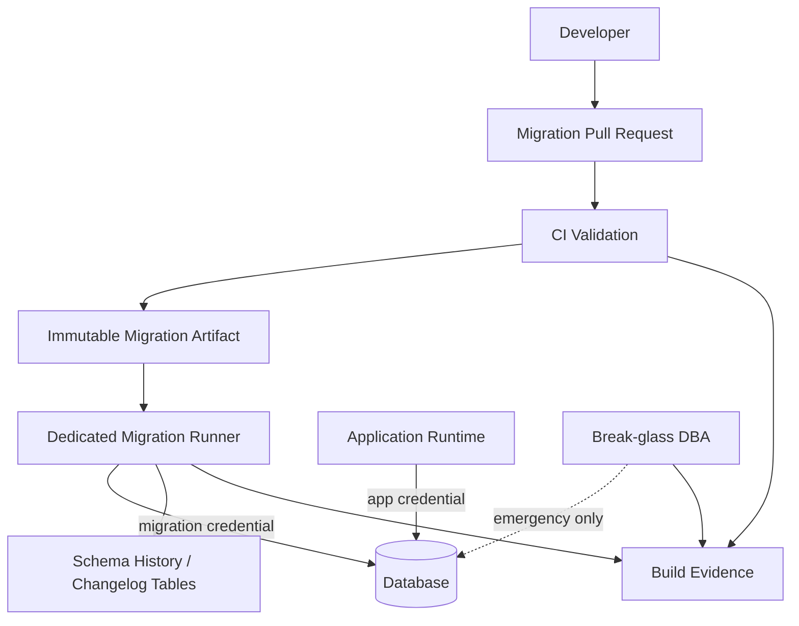
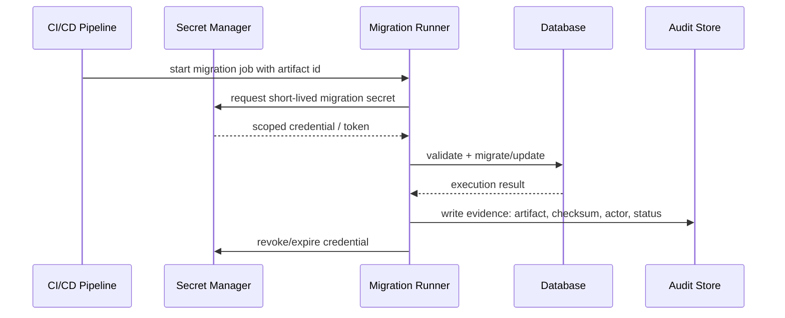
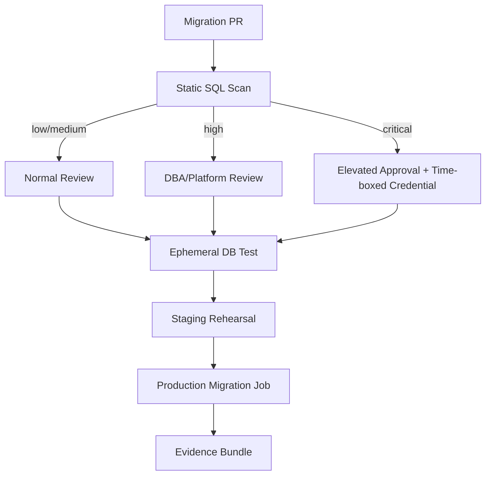

------
title: Learn Java Database Migrations, Flyway, Liquibase - Part 031
description: Security, privilege design, secrets boundary, dangerous command guardrails, and operational controls for Java database migrations using Flyway and Liquibase.
series: learn-java-database-migrations
seriesTitle: Learn Java Database Migrations, Flyway, Liquibase
order: 31
partTitle: Security and Secrets Boundary
slug: security-and-secrets-boundary
tags:
  - java
  - database
  - migration
  - flyway
  - liquibase
  - security
  - secrets
  - least-privilege
  - compliance
  - production-engineering
date: 2026-06-28
---

# Part 031 — Security and Secrets Boundary

> **Goal:** setelah bagian ini, kamu bisa mendesain migration execution yang aman: kredensial tidak bocor, privilege tidak berlebihan, destructive command terkunci, dan setiap perubahan database punya identity serta evidence yang jelas.

Database migration berada di titik berbahaya: ia punya kemampuan mengubah struktur, data, permission, stored logic, dan kadang seluruh schema. Aplikasi biasa biasanya hanya butuh `SELECT`, `INSERT`, `UPDATE`, `DELETE` pada object tertentu. Migration runner sering membutuhkan `CREATE`, `ALTER`, `DROP`, `CREATE INDEX`, `CREATE VIEW`, `GRANT`, atau operation vendor-specific. Karena itu, security model untuk migration tidak boleh disamakan dengan application runtime.

Kesalahan umum adalah menganggap migration sebagai “bagian startup aplikasi”, lalu memakai credential yang sama dengan aplikasi. Ini nyaman, tetapi dari sisi risk buruk:

```txt
Application credential compromise
  -> attacker gains application DML access

Migration credential compromise
  -> attacker may gain DDL + destructive capability
  -> attacker can alter audit tables
  -> attacker can bypass application invariants
  -> attacker can hide destructive change behind schema mutation
```

Migration harus diperlakukan sebagai **privileged operational workflow**, bukan sekadar library yang kebetulan dipanggil saat aplikasi start.

---

## 1. Core Security Principle

Prinsip utama:

```txt
Migration identity != application identity
Migration privilege != application privilege
Migration execution != normal request processing
Migration secret != application secret
Migration approval != application deploy approval only
```

Target desainnya bukan “migration selalu punya izin minimal absolut”. Dalam praktik, migration memang butuh privilege tinggi. Target yang benar adalah:

1. privilege tinggi hanya aktif di waktu yang sempit,
2. secret hanya tersedia ke runner yang tepat,
3. command berbahaya diberi guardrail,
4. perubahan terekam sebagai artifact yang immutable,
5. failure dan repair tetap meninggalkan evidence,
6. tidak ada jalur manual yang lebih mudah daripada jalur terkontrol.

---

## 2. Identity Model

Gunakan identity berbeda untuk minimal empat aktor:

| Actor | Purpose | Example Privilege |
|---|---|---|
| App runtime user | menjalankan transaksi aplikasi | DML terbatas pada table/view yang dibutuhkan |
| Migration runner user | menjalankan DDL/DML migration | DDL terkontrol pada schema target |
| Read-only observer | observability, health check, reporting | SELECT terbatas pada metadata/status |
| Break-glass DBA/admin | emergency manual repair | elevated, audited, time-bound |

Diagram boundary:



The mistake to avoid:

```txt
One database superuser shared by:
- application
- migration
- batch jobs
- manual DBA sessions
- dashboards
- emergency fixes
```

Ini menghilangkan forensic clarity. Saat ada perubahan schema, kamu tidak bisa menjawab apakah perubahan dilakukan oleh deploy pipeline, aplikasi, atau manusia.

---

## 3. Privilege Design

Privilege migration harus dipikirkan per operation class, bukan satu label “admin”.

### 3.1 Operation Class

| Operation | Risk | Permission Shape |
|---|---:|---|
| Create table/index/view | medium | DDL on owned schema |
| Alter table add nullable column | medium | ALTER on table/schema |
| Drop table/column | high | destructive DDL, restricted |
| Truncate/delete data | high | destructive DML, restricted |
| Grant/revoke | high | security-impacting DDL |
| Create function/procedure | high | executable code in DB |
| Alter owner/schema | very high | admin-level |
| Clean/drop schema | critical | normally disabled in prod |

A mature system treats these as different risk classes. A migration user that can add an index does not necessarily need permission to drop the entire schema.

### 3.2 Least Privilege in Practice

For small systems, a single migration role may be acceptable:

```sql
-- Conceptual example, not copy-paste production SQL.
CREATE ROLE app_runtime NOLOGIN;
CREATE ROLE app_migrator NOLOGIN;

GRANT USAGE ON SCHEMA app TO app_runtime;
GRANT SELECT, INSERT, UPDATE, DELETE ON ALL TABLES IN SCHEMA app TO app_runtime;

GRANT USAGE, CREATE ON SCHEMA app TO app_migrator;
GRANT SELECT, INSERT, UPDATE, DELETE, TRUNCATE ON ALL TABLES IN SCHEMA app TO app_migrator;
-- ALTER/DROP semantics differ by database and object ownership model.
```

For larger systems, prefer **tiered migrator roles**:

```txt
migrator_standard
  - create table
  - alter table additive
  - create index
  - insert/update reference data

migrator_destructive
  - drop column/table
  - truncate
  - delete large data
  - guarded by manual approval + short-lived credential

migrator_security
  - grant/revoke
  - role/user changes
  - owned by platform/DBA/security team
```

This prevents the most dangerous changes from being accidentally deployable through normal feature pipelines.

---

## 4. Migration Credential Boundary

Credential boundary rules:

```txt
Do not put migration credentials in application properties committed to Git.
Do not bake migration credentials into Docker images.
Do not expose migration credentials to normal runtime pods if migration is run separately.
Do not reuse local/dev passwords in staging/prod.
Do not log JDBC URLs with password query parameters.
Do not use one credential across all environments.
```

### 4.1 Recommended Secret Flow



The best operational posture is **short-lived credentials** where possible. If the platform cannot support that yet, compensate with:

1. separate account per environment,
2. credential rotation,
3. restricted network path,
4. pipeline-only access,
5. audit logging on DB login/session,
6. alerting on use outside deployment windows.

---

## 5. Flyway Security Boundary

Flyway is simple by design: it runs SQL/Java migrations against a database and records execution in its schema history table. That simplicity is powerful, but the surrounding controls matter.

### 5.1 Dangerous Flyway Commands

| Command/Setting | Why Dangerous | Production Rule |
|---|---|---|
| `clean` | drops objects in configured schemas | disabled by default, blocked in prod |
| `repair` | mutates schema history metadata | approved repair playbook only |
| `baseline` | marks existing DB as baseline | onboarding/existing DB only |
| `baselineOnMigrate=true` | auto-baselines non-empty DB | avoid in prod unless tightly controlled |
| `outOfOrder=true` | applies older version after newer version | release/hotfix policy required |
| `ignoreMigrationPatterns` | can suppress validation findings | use with audit waiver only |
| `placeholderReplacement` | changes SQL before execution | do not hide semantic changes per env |

The rule is not “never use these”. The rule is: **commands that mutate metadata or erase database state require a different approval path than normal migrate**.

### 5.2 Flyway Clean Guardrail

Recommended production posture:

```properties
# prod
flyway.cleanDisabled=true
```

Also enforce outside application config:

```txt
- CI policy rejects clean on production target
- migration wrapper blocks clean unless environment is ephemeral
- production service account lacks permission to drop schema/database
- database audit alert triggers on DROP SCHEMA / DROP DATABASE / mass DROP
```

Do not rely on one layer only. Configuration can be misread; wrapper scripts can be bypassed; permission can be too broad. Defense is layered.

### 5.3 Flyway Repair Boundary

`repair` should have a ticket and evidence because it changes the history table, not the real database structure. Use it for metadata reconciliation after root cause is understood, not as first response.

```txt
Bad repair flow:
  validate fails
  -> run repair
  -> rerun migrate
  -> hope

Good repair flow:
  validate fails
  -> identify exact mismatch
  -> compare artifact checksum vs DB history checksum
  -> determine if script was edited, deleted, renamed, or partially applied
  -> inspect actual database state
  -> choose revert/adopt/roll-forward/manual cleanup
  -> run repair only if metadata must be reconciled
  -> attach evidence
```

---

## 6. Liquibase Security Boundary

Liquibase has richer metadata: changelogs, changesets, contexts, labels, preconditions, rollback commands, diff/snapshot, and lock table. That power requires clear boundaries.

### 6.1 Liquibase Risk Controls

| Feature | Security Use | Security Risk |
|---|---|---|
| Preconditions | assert expected DB state before change | `MARK_RAN` can hide skipped change |
| Contexts | restrict changeset by environment | environment fork if abused |
| Labels | restrict by feature/release | inconsistent release selection |
| Rollback | generate or define inverse changes | false confidence on data-destructive changes |
| `clear-checksums` | reset checksum tracking | can hide modified changesets if uncontrolled |
| `changelog-sync` | mark changes as executed | can bypass real execution if misused |
| `release-locks` | unlock stuck lock table | can corrupt concurrent execution if used blindly |
| Diff/generate changelog | onboarding/drift analysis | can normalize unauthorized production drift |

### 6.2 DATABASECHANGELOG and DATABASECHANGELOGLOCK

Liquibase tracks executed changesets in `DATABASECHANGELOG` and uses `DATABASECHANGELOGLOCK` to prevent more than one Liquibase update process from running at the same time against the same database.

Security implication:

```txt
If an attacker or careless operator can modify tracking tables,
then migration evidence can be falsified.
```

Therefore:

1. app runtime user should not update Liquibase tracking tables,
2. reporting users should not update tracking tables,
3. manual access to tracking tables should be break-glass audited,
4. `release-locks` should only be used after verifying no active migration process remains.

### 6.3 Contexts and Labels Are Not Security Boundaries

Liquibase contexts and labels filter which changesets run. They are useful, but they are not strong security controls.

Bad assumption:

```txt
This destructive changeset has context=prod-admin,
so it is safe.
```

Better model:

```txt
context/label = selection mechanism
approval gate = governance mechanism
DB privilege = enforcement mechanism
pipeline policy = prevention mechanism
audit log = evidence mechanism
```

A destructive production changeset should be blocked by default unless:

1. artifact is approved,
2. context/label is explicitly selected,
3. privileged credential is short-lived,
4. runner confirms target environment,
5. SQL preview/evidence is attached,
6. post-check confirms expected result.

---

## 7. Secret Handling in Java and Spring Boot

Spring Boot makes Flyway/Liquibase integration convenient. Convenience is not the same as safety.

### 7.1 Startup Migration Risk

If migration runs on application startup, every application instance may need migration credentials or may try to run migration. This creates problems:

```txt
- application pod now holds elevated credential
- horizontal scale creates migration race
- startup failure can take down service
- logs may expose migration config
- deployment rollback may rerun startup paths unexpectedly
```

Startup migration is acceptable for:

1. small internal services,
2. non-critical apps,
3. dev/test environments,
4. early-stage systems,
5. tightly controlled single-instance deployment.

For serious production systems, prefer:

```txt
CI/CD deploy step or dedicated migration job
  -> migration credential only in migration job
  -> application starts with app credential only
  -> readiness depends on schema compatibility, not migration execution
```

### 7.2 Separate DataSource Credentials

If startup migration is unavoidable, separate migration datasource credentials from runtime datasource credentials.

Conceptual Spring Boot config shape:

```yaml
spring:
  datasource:
    url: jdbc:postgresql://db/app
    username: app_runtime
    password: ${APP_DB_PASSWORD}

  flyway:
    enabled: true
    user: app_migrator
    password: ${APP_MIGRATION_DB_PASSWORD}
```

For Liquibase:

```yaml
spring:
  datasource:
    url: jdbc:postgresql://db/app
    username: app_runtime
    password: ${APP_DB_PASSWORD}

  liquibase:
    enabled: true
    user: app_migrator
    password: ${APP_MIGRATION_DB_PASSWORD}
```

The important design point is not the exact property name. The important design point is: **migration credential must not become the general application credential**.

---

## 8. Dangerous SQL Guardrails

A mature migration pipeline classifies SQL risk before execution.

### 8.1 Static Risk Classes

| Risk Class | Examples | Gate |
|---|---|---|
| Low | create table, add nullable column, create view | normal review |
| Medium | add index, add FK, backfill small table | migration review |
| High | add NOT NULL, unique constraint, large update | performance + rollback review |
| Critical | drop table/column, truncate, mass delete, grant admin | elevated approval |

### 8.2 Example SQL Classifier Rules

```txt
Reject or escalate if migration contains:
- DROP TABLE
- DROP COLUMN
- TRUNCATE
- DELETE FROM without WHERE
- UPDATE without WHERE
- ALTER TABLE ... SET NOT NULL on large table
- CREATE INDEX without CONCURRENTLY on PostgreSQL large table
- LOCK TABLE
- GRANT ... SUPERUSER / admin-like privilege
- CREATE EXTENSION in production
- ALTER OWNER
```

This is not perfect parsing, but it catches obvious hazards. For high maturity, combine:

1. simple regex checks,
2. SQL parser checks,
3. database-specific explain/dry-run where possible,
4. DBA/platform review for high-risk operations.

### 8.3 Example Pipeline Policy



---

## 9. Artifact Integrity

Security is not only about secrets. It is also about proving that the artifact executed in production is the artifact reviewed in PR.

Minimum artifact evidence:

```txt
- Git commit SHA
- migration file names
- file checksums
- build number
- container image digest or artifact digest
- Flyway info / Liquibase status before execution
- SQL preview for high-risk migration
- execution log
- history/changelog table snapshot after execution
```

Policy:

```txt
Never build migration scripts directly on the production runner from a mutable branch.
Always run an immutable artifact generated by CI.
```

Bad:

```bash
git pull origin main
flyway migrate
```

Better:

```bash
pull artifact: migration-bundle-2026.06.28+build.481.sha256
verify signature/checksum
flyway validate
flyway migrate
capture evidence
```

---

## 10. Break-Glass Manual Change Policy

Manual changes are sometimes necessary. Pretending they will never happen creates worse risk. The mature design is to make them exceptional, controlled, and reconciled.

Break-glass rules:

1. named human identity,
2. ticket/incident reference,
3. time-bound access,
4. session recording or DB audit log,
5. exact SQL captured,
6. post-change migration artifact created,
7. drift reconciled into source control,
8. root cause review if manual path was used due to pipeline gap.

Manual change without source reconciliation creates drift. Drift without evidence creates audit failure. Audit failure in a regulated environment can be worse than the original technical defect.

---

## 11. Security Anti-Patterns

### 11.1 App Uses Migrator Credential

```txt
Symptom:
  Application can ALTER/DROP schema.

Impact:
  App compromise becomes database ownership compromise.

Fix:
  Split runtime and migration users.
```

### 11.2 Migration Secret Stored in Git

```txt
Symptom:
  application-prod.yml contains migration password.

Impact:
  Secret leaks through repo, build logs, artifact cache, local clones.

Fix:
  Secret manager + environment injection + rotation.
```

### 11.3 One Superuser for Everything

```txt
Symptom:
  admin credential used by app, migration, DBA, dashboard.

Impact:
  No forensic clarity; impossible least privilege.

Fix:
  Separate identities and privileges.
```

### 11.4 `clean` Available in Production

```txt
Symptom:
  Production Flyway can run clean.

Impact:
  Catastrophic data/schema loss.

Fix:
  cleanDisabled=true + permission guard + wrapper guard.
```

### 11.5 Contexts Used as Security

```txt
Symptom:
  Liquibase destructive change relies only on context name.

Impact:
  Misconfigured CLI argument can run destructive change.

Fix:
  Combine context with approval, privilege, and policy checks.
```

### 11.6 Repair Without RCA

```txt
Symptom:
  Flyway repair or Liquibase clear-checksums used immediately after validation error.

Impact:
  Metadata is normalized before root cause is understood.

Fix:
  Inspect, classify, decide, then repair metadata if needed.
```

---

## 12. Production Readiness Checklist

Before migration enters production, answer these:

```txt
Identity
[ ] Is migration using a separate credential from app runtime?
[ ] Is the actor identity visible in DB/session/audit logs?
[ ] Are break-glass credentials separate and time-bound?

Privilege
[ ] Does app runtime lack DDL privilege?
[ ] Are destructive operations escalated?
[ ] Can the migration user drop database/schema? If yes, why?

Secrets
[ ] Are credentials injected from a secret manager?
[ ] Are credentials absent from Git, images, and logs?
[ ] Is rotation possible without code change?

Commands
[ ] Is Flyway clean disabled in production?
[ ] Is repair/baseline/clear-checksums protected by approval?
[ ] Is Liquibase release-locks protected by active-process verification?

Artifact
[ ] Is the migration artifact immutable?
[ ] Is the executed artifact tied to a commit/build/checksum?
[ ] Are SQL previews captured for high-risk changes?

Observability
[ ] Are migration duration and status logged?
[ ] Are history/changelog snapshots captured?
[ ] Are failed migration and stuck lock alerts configured?
```

---

## 13. Kaufman Practice Drill

Use a local PostgreSQL or MySQL database and implement the following in one focused session:

1. create two users: `app_runtime` and `app_migrator`,
2. ensure `app_runtime` cannot run DDL,
3. run Flyway or Liquibase migration with `app_migrator`,
4. start application test using `app_runtime`,
5. attempt a destructive migration and confirm the pipeline blocks it,
6. capture migration evidence: artifact checksum, SQL file list, history/changelog rows.

The point is not perfect enterprise security. The point is to internalize that **migration is a privileged workflow with explicit boundaries**.

---

## 14. Mental Model Summary

```txt
Migration security = identity + privilege + secret + artifact + command + evidence
```

A top-tier engineer does not merely ask:

```txt
Can this migration run?
```

They ask:

```txt
Who can run it?
With what credential?
Against which database?
Through which artifact?
With what approval?
With what guardrails?
With what recovery path?
With what evidence?
```

That is the difference between a migration script and a defensible production change system.

---

## References

- Redgate Flyway Documentation — Clean Disabled Setting: https://documentation.red-gate.com/fd/flyway-clean-disabled-setting-277578981.html
- Redgate Flyway Documentation — Repair Command: https://documentation.red-gate.com/fd/repair-277578892.html
- Redgate Flyway Documentation — Baseline On Migrate Setting: https://documentation.red-gate.com/fd/flyway-baseline-on-migrate-setting-277578974.html
- Liquibase Documentation — DATABASECHANGELOGLOCK Table: https://docs.liquibase.com/concepts/tracking-tables/databasechangeloglock-table.html
- Liquibase Documentation — Changeset Checksums: https://docs.liquibase.com/secure/user-guide-5-1-1/what-is-a-changeset-checksum
- Spring Boot Documentation — Database Initialization: https://docs.spring.io/spring-boot/how-to/data-initialization.html
