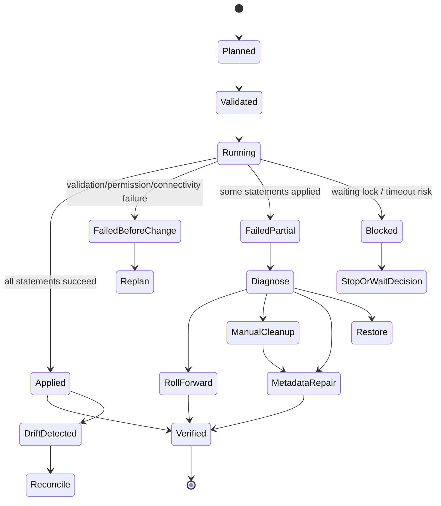
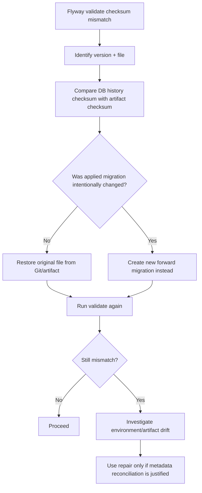
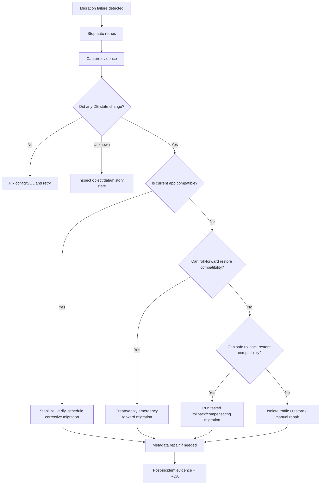

------
title: Learn Java Database Migrations, Flyway, Liquibase - Part 032
description: Failure models and recovery playbooks for broken database migrations, checksum mismatch, locks, timeouts, partial apply, drift, hotfix, and production repair using Flyway and Liquibase.
series: learn-java-database-migrations
seriesTitle: Learn Java Database Migrations, Flyway, Liquibase
order: 32
partTitle: Failure Models and Recovery Playbook
slug: failure-models-and-recovery-playbook
tags:
  - java
  - database
  - migration
  - flyway
  - liquibase
  - failure-modeling
  - recovery
  - incident-response
  - production-engineering
  - reliability
date: 2026-06-28
---

# Part 032 — Failure Models and Recovery Playbook

> **Goal:** setelah bagian ini, kamu bisa menangani migration failure dengan tenang: mengklasifikasi failure, menghentikan blast radius, menginspeksi actual database state, memilih repair/rollback/roll-forward, dan meninggalkan evidence yang defensible.

Database migration failure berbeda dari application deployment failure. Aplikasi bisa di-rollback ke image lama. Database state tidak selalu bisa “di-undo” tanpa konsekuensi. Satu statement DDL bisa commit sendiri, menahan lock, mengubah query plan, memicu replication lag, atau membuat versi aplikasi lama dan baru sama-sama tidak kompatibel.

Karena itu recovery migration bukan sekadar:

```txt
run rollback
```

Recovery migration adalah state reconciliation:

```txt
expected state from source control
observed state in target database
recorded state in history/changelog table
running application compatibility
business data correctness
```

---

## 1. Failure State Model

Pikirkan migration sebagai state machine.



A recovery action must be chosen based on **actual state**, not based on tool error text only.

---

## 2. Incident Triage Protocol

When migration fails in production, do not immediately run `repair`, `clear-checksums`, `release-locks`, or rollback. First freeze the situation.

### 2.1 First 10 Minutes

```txt
1. Stop automatic retries unless failure is known transient.
2. Identify target database, schema, tenant, region.
3. Capture exact migration artifact version.
4. Capture tool command and arguments.
5. Capture error output and timestamps.
6. Check whether application traffic is impacted.
7. Check active locks, sessions, blocking transactions.
8. Snapshot history/changelog table rows.
9. Determine whether any DDL/DML actually applied.
10. Decide: wait, cancel, continue, roll-forward, or isolate.
```

### 2.2 Do Not Do This First

```txt
- Do not edit an already applied migration file.
- Do not delete history/changelog rows manually.
- Do not run repair before understanding actual database state.
- Do not run Liquibase clear-checksums as a generic fix.
- Do not release Liquibase lock if a migration process is still alive.
- Do not retry a non-idempotent data migration blindly.
- Do not deploy new app version if schema compatibility is unknown.
```

---

## 3. Failure Class Matrix

| Failure Class | Symptom | First Question | Likely Recovery |
|---|---|---|---|
| Connectivity/auth | cannot connect/login | did DB change? | fix config/secret/network, retry |
| Permission | denied DDL/DML | did statement apply? | grant correct privilege or change runner |
| Syntax/vendor | SQL error | did previous statements apply? | fix forward migration; maybe cleanup |
| Checksum mismatch | validation failed | was applied file modified? | restore file or create new migration; metadata repair only after RCA |
| Missing migration | applied migration absent locally | was file deleted/renamed? | restore artifact or mark deleted with approval |
| Lock wait | stuck waiting | who blocks whom? | wait/cancel blocker/cancel migration |
| Timeout | statement killed | did DB complete statement anyway? | inspect DB state before retry |
| Partial apply | some objects/data changed | what exactly changed? | manual cleanup or roll-forward |
| Data invariant | duplicate/null/orphan data | can data be corrected safely? | data repair migration/backfill |
| App incompatibility | app fails after schema change | old/new compatibility? | roll-forward schema/app or restore compatibility layer |
| Drift | DB differs from changelog | authorized? | revert/adopt/waive/investigate |
| Stuck Liquibase lock | waiting changelog lock | is another Liquibase active? | release lock only after verification |

---

## 4. Flyway Failure Playbooks

### 4.1 Flyway Validate Fails: Checksum Mismatch

Typical meaning: a migration that was already applied is now different from what Flyway finds in the configured locations.

Possible root causes:

```txt
- developer edited applied SQL file
- file line endings changed
- placeholder value or script content changed unexpectedly
- migration was rebuilt/generated differently
- wrong artifact/version deployed
- environment has different migration file set
```

Recovery flow:



Rule:

```txt
If production already applied V012, do not rewrite V012.
Create V013 that corrects the state.
```

`repair` can realign schema history metadata, but it does not undo database changes or prove semantic correctness. Use it only after root cause and database state are known.

### 4.2 Flyway Migration Failed Before Any Change

Examples:

```txt
- connection refused
- wrong password
- permission denied before statement execution
- syntax parse error before transaction begins
```

Recovery:

1. fix configuration/credential/SQL,
2. ensure no object/data changed,
3. rerun `validate`,
4. rerun `migrate`.

No history repair should be needed if nothing was recorded/applied.

### 4.3 Flyway Migration Failed Partially

Partial apply depends on database DDL transaction semantics. PostgreSQL often supports transactional DDL for many operations, but not all commands can run inside transaction blocks. MySQL and Oracle have important implicit commit behavior. Therefore never infer partial state from the tool alone.

Inspection checklist:

```sql
-- Examples; adapt to vendor.
SELECT * FROM flyway_schema_history ORDER BY installed_rank DESC;

-- inspect whether object exists
-- inspect whether column exists
-- inspect whether index exists
-- inspect whether data rows changed
-- inspect invalid objects / constraints
```

Recovery choices:

| Actual State | Recovery |
|---|---|
| no changes applied | fix and rerun |
| object created but history failed | decide whether to clean object or repair metadata |
| some DML applied | write idempotent correction/backfill |
| DDL applied but app incompatible | add compatibility migration urgently |
| destructive change applied | restore from backup or roll-forward with compensating design |

### 4.4 Flyway Missing Migration

A migration is recorded in schema history but absent from local files.

Root causes:

```txt
- file deleted after being applied
- branch artifact missing old migration
- repository restructuring changed locations
- wrong artifact deployed to environment
```

Recovery:

1. restore the missing file if it is still valid,
2. if intentionally removed, create an audit note,
3. use `repair` only if marking missing migration as deleted is intended and approved,
4. avoid normalizing history silently.

### 4.5 Flyway Out-of-Order Hotfix

Scenario:

```txt
Prod has V100, V101, V102.
A hotfix branch creates V101_1 or V099 accidentally.
Flyway sees lower version after higher version.
```

Preferred policy:

```txt
Do not rely on outOfOrder as normal workflow.
Use timestamp versions or reserve hotfix version ranges.
If outOfOrder is used, record release justification and compatibility proof.
```

---

## 5. Liquibase Failure Playbooks

### 5.1 Liquibase Checksum Validation Error

Likely meaning: an already executed changeset has been modified since it was recorded in `DATABASECHANGELOG`.

Recovery flow:

```txt
1. Identify changeset id, author, filepath.
2. Compare current changelog artifact with deployed artifact.
3. Determine whether modification was accidental, formatting-only, or semantic.
4. If accidental: restore original changeset.
5. If semantic: revert change and create a new changeset.
6. Use validCheckSum or clear-checksums only under explicit policy.
```

Danger:

```txt
clear-checksums can reset checksum tracking.
It should not be a generic way to silence validation errors.
```

### 5.2 Liquibase DATABASECHANGELOGLOCK Stuck

Symptom:

```txt
Waiting for changelog lock...
Could not acquire change log lock...
```

Interpretation: Liquibase uses the lock table to ensure only one Liquibase instance updates the database at a time.

Recovery:

```txt
1. Confirm whether another Liquibase process is still running.
2. Check CI job status, pod/job status, DB sessions.
3. If active process exists, do not release lock.
4. If process died, capture lock row evidence.
5. Run release-locks through approved operator path.
6. Rerun status/validate before update.
```

Do not manually update the lock table unless your operational policy explicitly allows it and records evidence.

### 5.3 Liquibase Precondition Failure

Precondition failure may be good. It may have prevented a dangerous change.

Classify:

| Precondition Result | Meaning | Action |
|---|---|---|
| expected HALT | DB state unsafe | fix data/schema first |
| unexpected HALT | assumption wrong | investigate drift or environment mismatch |
| MARK_RAN | change skipped but recorded | verify this was intended |
| CONTINUE | changeset skipped/continues based on scope | verify release selection |
| WARN | risk accepted | attach waiver/evidence |

Anti-pattern:

```txt
onFail=MARK_RAN to bypass object existence errors everywhere.
```

This hides actual state transitions and can create future drift.

### 5.4 Liquibase Rollback Fails

Rollback can fail because:

```txt
- automatic rollback is unsupported for the change type
- custom rollback SQL is wrong
- data changed since migration
- dependent objects now exist
- app wrote data using new schema
- rollback violates constraints
```

Recovery posture:

```txt
Rollback is a migration too.
It needs testing, evidence, and compatibility analysis.
```

Often the safer action is roll-forward:

```txt
bad schema state -> corrective migration -> compatibility restored
```

rather than:

```txt
bad schema state -> destructive rollback -> unknown data loss
```

---

## 6. Lock and Timeout Playbook

Lock-related failures are production classics.

### 6.1 Symptoms

```txt
- migration hangs
- statement timeout
- lock wait timeout
- app latency spike
- deadlock detected
- replication lag increases
- connection pool saturation
```

### 6.2 Questions

```txt
What statement is waiting?
What object is locked?
Who holds the blocking lock?
Is blocker an app transaction, batch job, reporting query, or another migration?
Can we wait safely?
What is the timeout policy?
If we cancel, does DB roll back fully?
```

### 6.3 Decision Matrix

| Situation | Preferred Action |
|---|---|
| harmless short lock | wait within SLO window |
| long app transaction blocking DDL | cancel blocker if safe or abort migration |
| migration blocking app traffic | cancel migration if DB can roll back safely |
| online index build slow but not blocking | monitor and continue |
| timeout after possible partial apply | inspect actual DB state before retry |

---

## 7. Data Migration Failure Playbook

Data migration failure is often worse than DDL failure because it can leave mixed semantics.

### 7.1 Required Design

Every significant data migration should have:

```txt
- deterministic selection criteria
- batch/chunk size
- checkpoint or resumability strategy
- idempotent update logic
- verification query
- stop/resume command
- rollback or compensating strategy
```

### 7.2 Failed Backfill Example

```txt
Migration target:
  populate orders.customer_region from customers.region

Failure:
  job updated 8M of 20M rows, then timed out

Bad retry:
  run full update again without WHERE target IS NULL

Better retry:
  update only rows where customer_region IS NULL
  checkpoint by order id range
  verify count of remaining NULL
  track progress in backfill_control table
```

Example checkpoint table:

```sql
CREATE TABLE migration_backfill_checkpoint (
  migration_key VARCHAR(200) PRIMARY KEY,
  last_processed_id BIGINT NOT NULL,
  processed_count BIGINT NOT NULL,
  updated_at TIMESTAMP NOT NULL
);
```

---

## 8. Drift Recovery Playbook

Drift means actual database state differs from intended migration source/history.

### 8.1 Drift Types

| Drift Type | Example | Severity |
|---|---|---|
| benign metadata | comment differs | low |
| unauthorized index | manual index added | medium |
| missing object | table absent | high |
| modified column type | `VARCHAR(64)` vs `VARCHAR(128)` | high |
| missing constraint | FK/check absent | high |
| changed data semantics | reference code modified manually | critical |
| history tampering | changelog/history row modified | critical |

### 8.2 Reconciliation Options

```txt
Revert
  Bring DB back to source-controlled intent.

Adopt
  Create a new migration representing the real DB change.

Waive
  Record accepted difference with expiry/owner.

Investigate
  Treat as incident if unauthorized or unexplained.
```

Never normalize drift by generating a changelog from production and committing it without review. That converts unknown reality into official intent without understanding why it exists.

---

## 9. Hotfix Migration Playbook

Hotfixes are dangerous because they happen under pressure. Predefine the path before pressure exists.

### 9.1 Hotfix Rules

```txt
1. Hotfix migration must still be committed to source control.
2. Artifact must still be built by CI or an approved emergency pipeline.
3. Migration version must avoid future collision.
4. Compatibility with currently running app version must be checked.
5. Main branch must be reconciled immediately after hotfix.
6. Post-incident review must capture why normal path was insufficient.
```

### 9.2 Versioning Strategy

For Flyway, timestamp versioning reduces hotfix collision:

```txt
V20260628153000__hotfix_add_missing_index.sql
```

For Liquibase, use a clear identity:

```yaml
- changeSet:
    id: 20260628-153000-hotfix-add-missing-index
    author: platform
    labels: hotfix,incident-12345
```

---

## 10. Restore from Backup Decision

Restore is not rollback. Restore changes the entire database or subset to prior physical/logical state and can lose valid writes after backup time unless point-in-time recovery is possible.

Use restore when:

```txt
- destructive data loss occurred
- compensating migration cannot reconstruct data
- schema/data corruption is widespread
- audit/legal/business impact requires exact recovery
```

Before restore:

```txt
- identify recovery point objective
- identify writes after recovery point
- estimate data loss window
- coordinate application downtime/read-only mode
- preserve corrupted state for forensic analysis if needed
- confirm backup integrity and restore rehearsal maturity
```

A top-tier migration plan includes restore feasibility before destructive changes, not after.

---

## 11. Recovery Decision Tree



---

## 12. Recovery Evidence Bundle

Every production recovery should leave an evidence bundle:

```txt
Incident
[ ] Incident/ticket id
[ ] Start/end timestamp
[ ] Affected database/schema/tenant/region
[ ] Business impact summary

Artifact
[ ] Git commit SHA
[ ] Build id
[ ] Migration file list and checksums
[ ] Tool version and command arguments

Database State
[ ] History/changelog rows before and after
[ ] Object/data verification queries
[ ] Lock/session snapshots if relevant
[ ] Error logs and SQL state codes

Decision
[ ] Classification of failure
[ ] Decision: retry, cleanup, repair, rollback, roll-forward, restore
[ ] Approver/owner
[ ] Risk accepted

Resolution
[ ] Corrective migration id
[ ] Metadata repair command if used
[ ] Verification result
[ ] Follow-up tasks
```

Evidence is not bureaucracy. Evidence is what prevents the same incident from becoming tribal memory.

---

## 13. Anti-Patterns

### 13.1 Retry Until Green

```txt
Symptom:
  Pipeline retries failed migration repeatedly.

Risk:
  Non-idempotent statements apply multiple times or lock pressure grows.

Fix:
  Stop retries unless migration is explicitly idempotent/resumable.
```

### 13.2 Repair as First Response

```txt
Symptom:
  validate fails, operator runs repair immediately.

Risk:
  History metadata changes before root cause is captured.

Fix:
  RCA first, metadata repair second.
```

### 13.3 Rollback Fantasy

```txt
Symptom:
  Team assumes every migration can be rolled back.

Risk:
  Data loss or app incompatibility during rollback.

Fix:
  Classify rollback capability per migration.
```

### 13.4 Manual DB Fix Not Reconciled

```txt
Symptom:
  DBA fixes production directly, no migration file created.

Risk:
  Permanent drift.

Fix:
  Adopt/revert through source-controlled migration.
```

### 13.5 Release Lock Blindly

```txt
Symptom:
  Liquibase waits for lock, operator runs release-locks.

Risk:
  Two migrations run concurrently if original process is active.

Fix:
  Verify active process/session first.
```

---

## 14. Kaufman Practice Drill

Simulate failures locally:

1. create a Flyway migration, apply it, edit it, run validate, then fix by restoring original and creating a new migration,
2. create a Liquibase changeset, apply it, edit it, observe checksum validation failure, then fix via new changeset,
3. create a long-running transaction that blocks an `ALTER TABLE`, observe lock wait, then decide cancel/wait,
4. create a partial backfill and resume using checkpoint logic,
5. create drift manually, detect it using schema comparison or inspection, then choose revert/adopt.

The point is to build operational muscle memory before production pressure.

---

## 15. Mental Model Summary

```txt
Migration failure recovery is not tool command memorization.
It is state reconciliation under uncertainty.
```

Your recovery sequence should be:

```txt
stop -> observe -> classify -> inspect actual state -> choose recovery -> verify -> repair metadata if needed -> document evidence
```

Top-tier engineers are calm during migration incidents because they do not improvise from tool errors. They reason from state, invariants, compatibility, and evidence.

---

## References

- Redgate Flyway Documentation — Repair Command: https://documentation.red-gate.com/fd/repair-277578892.html
- Redgate Flyway Documentation — Schema History Table: https://documentation.red-gate.com/fd/flyway-schema-history-table-273973417.html
- Redgate Flyway Documentation — Versioned Migrations: https://documentation.red-gate.com/fd/versioned-migrations-273973333.html
- Liquibase Documentation — DATABASECHANGELOGLOCK Table: https://docs.liquibase.com/concepts/tracking-tables/databasechangeloglock-table.html
- Liquibase Documentation — Changeset Checksums: https://docs.liquibase.com/secure/user-guide-5-1-1/what-is-a-changeset-checksum
- Liquibase Documentation — Rollback Command: https://docs.liquibase.com/commands/rollback/rollback.html
