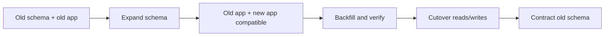
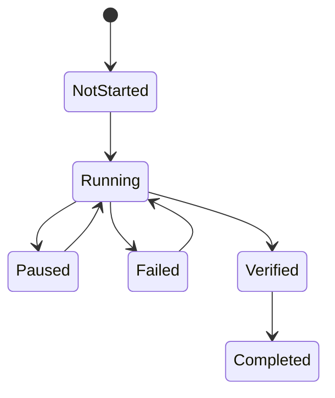
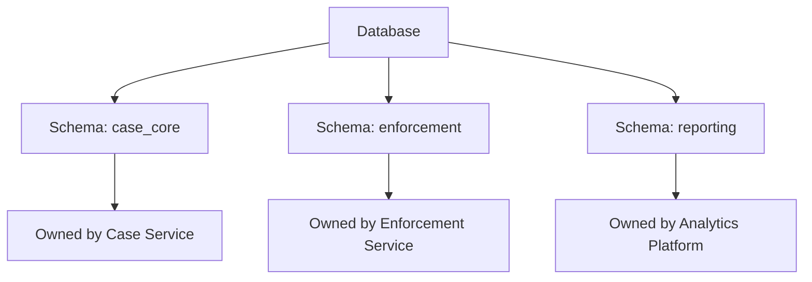
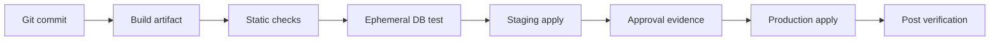
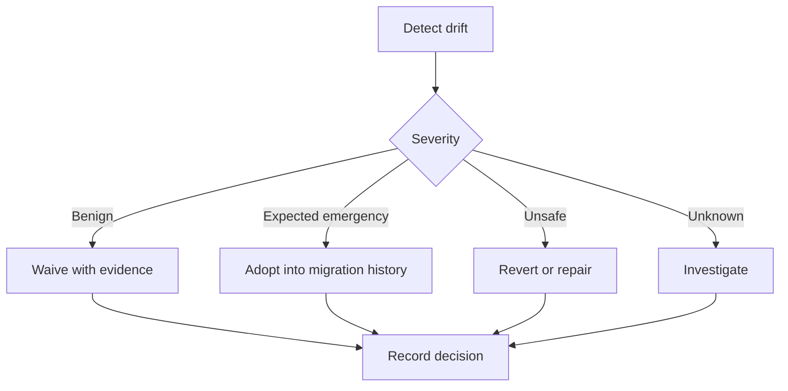

# Part 033 — Patterns and Anti-Patterns Catalog

Bagian ini adalah katalog praktis. Tujuannya bukan memperkenalkan konsep baru, tetapi mengubah seluruh seri menjadi **pattern language** yang bisa dipakai saat review PR, design review, incident response, dan release readiness.

Database migration yang buruk biasanya tidak gagal karena developer tidak tahu sintaks `ALTER TABLE`. Ia gagal karena tim salah membaca **state**, **ownership**, **compatibility**, **lock behavior**, **data volume**, **rollback reality**, atau **operational evidence**.

Katalog ini dibagi menjadi:

1. safe delivery patterns;
2. schema evolution patterns;
3. data migration patterns;
4. Flyway-specific patterns;
5. Liquibase-specific patterns;
6. governance patterns;
7. common anti-patterns;
8. review checklist.

> Mental model utama: migration adalah perubahan state terhadap artifact yang persistent, shared, dan sulit dikembalikan. Pattern yang baik menjaga compatibility dan evidence. Anti-pattern yang buruk biasanya menghapus context, mengandalkan asumsi, atau menyembunyikan state transition.

---

## 1. Pattern: Immutable Applied Migration

**Masalah**: migration file yang sudah diterapkan di environment permanen diedit ulang karena typo, review terlambat, atau hotfix.

**Pattern**: begitu migration diterapkan ke shared/permanent environment, file tersebut diperlakukan immutable. Perubahan berikutnya dibuat sebagai migration baru.

```txt
Wrong:
V021__add_customer_status.sql   # sudah jalan di staging
# lalu diedit untuk memperbaiki constraint

Right:
V021__add_customer_status.sql
V022__fix_customer_status_constraint.sql
```

**Kenapa benar**:

- Flyway menyimpan checksum versioned migration yang sudah diterapkan.
- Liquibase menyimpan checksum changeset di tracking table.
- Mengubah file lama memutus audit trail: source control tidak lagi merepresentasikan state transition yang benar-benar pernah terjadi.

**Review rule**:

```txt
IF migration has been applied to any permanent environment
THEN do not edit it
ELSE editing is allowed before merge/apply
```

**Exception**:

- Local developer DB.
- Ephemeral CI DB.
- Migration belum pernah merge dan belum pernah diterapkan ke shared environment.

**Production response saat sudah terlanjur diedit**:

1. hentikan deployment;
2. identifikasi environment yang sudah menjalankan versi lama;
3. restore file lama dari Git history;
4. buat migration baru untuk koreksi;
5. hindari `repair` kecuali RCA dan audit sudah jelas.

---

## 2. Pattern: Expand / Transition / Contract

**Masalah**: perubahan schema langsung destructive, sementara aplikasi lama dan baru bisa hidup bersamaan saat rolling deployment.

**Pattern**:

1. **Expand**: tambah struktur baru tanpa merusak aplikasi lama.
2. **Transition**: aplikasi menulis/membaca dua bentuk atau melakukan compatibility bridge.
3. **Contract**: hapus struktur lama setelah tidak ada consumer.



**Contoh rename column**:

```sql
-- Expand
ALTER TABLE customer ADD COLUMN full_name VARCHAR(255);

-- Transition
-- application writes both name and full_name
-- backfill full_name from name

-- Contract, later release
ALTER TABLE customer DROP COLUMN name;
```

**Anti-pattern lawan**:

```sql
ALTER TABLE customer RENAME COLUMN name TO full_name;
```

Rename langsung terlihat bersih, tetapi dapat memutus aplikasi lama, batch job, BI query, CDC consumer, report, stored procedure, atau external integration.

---

## 3. Pattern: Backward-Compatible DDL First

**Masalah**: aplikasi baru membutuhkan schema baru, tetapi deployment order tidak selalu sempurna.

**Pattern**: schema migration pertama harus kompatibel dengan versi aplikasi saat ini.

**Safe changes biasanya**:

- add nullable column;
- add table yang belum dipakai;
- add index;
- add view compatible;
- add optional FK/constraint dengan staged validation;
- add enum value jika old app toleran.

**Unsafe changes biasanya**:

- drop column;
- rename column/table;
- change type secara sempit;
- add `NOT NULL` tanpa default/backfill;
- add unique constraint tanpa deduplication;
- change semantic reference data;
- remove enum value;
- change stored procedure signature yang dipakai aplikasi lama.

**Decision rule**:

```txt
A migration is release-safe only if:
- old app can run against new schema; and
- new app can run against new schema; and
- rollback of app version does not require rollback of schema; and
- monitoring can detect semantic inconsistency.
```

---

## 4. Pattern: Data Backfill as Job, Not Giant Migration Script

**Masalah**: migration mencoba update jutaan/miliaran row dalam satu transaction.

```sql
UPDATE invoice SET normalized_status = lower(status);
```

Untuk tabel besar, ini dapat menyebabkan lock panjang, transaction log membengkak, replication lag, cache churn, undo/redo pressure, timeout, dan recovery sulit.

**Pattern**: backfill diperlakukan sebagai resumable operational job.



**Core properties**:

- chunked;
- throttled;
- idempotent;
- resumable;
- observable;
- has checkpoint;
- has verification query;
- has stop condition.

**Skeleton**:

```sql
CREATE TABLE migration_checkpoint (
    migration_key VARCHAR(128) PRIMARY KEY,
    last_id BIGINT NOT NULL,
    updated_at TIMESTAMP NOT NULL
);
```

```java
while (true) {
    long lastId = checkpointRepository.get("invoice-status-backfill");

    List<InvoiceRow> rows = repository.findNextBatch(lastId, 1000);
    if (rows.isEmpty()) {
        break;
    }

    repository.updateNormalizedStatus(rows);
    checkpointRepository.save("invoice-status-backfill", rows.getLast().id());

    Thread.sleep(throttleMs);
}
```

**Tool boundary**:

- Flyway/Liquibase creates schema and checkpoint table.
- Application job or migration runner executes long backfill.
- Final migration adds strict constraint only after verification.

---

## 5. Pattern: Constraint Tightening in Stages

**Masalah**: langsung menambahkan `NOT NULL`, `UNIQUE`, `CHECK`, atau FK ke existing large table.

**Pattern**:

1. add nullable/soft constraint;
2. clean data;
3. add index/constraint using low-lock mechanism if vendor supports it;
4. validate;
5. enforce in application;
6. enforce in database.

**Example: NOT NULL**

```sql
ALTER TABLE account ADD COLUMN region_code VARCHAR(16);

UPDATE account
SET region_code = 'UNKNOWN'
WHERE region_code IS NULL;

ALTER TABLE account
ALTER COLUMN region_code SET NOT NULL;
```

Untuk database besar, backfill harus chunked, bukan single update.

**Example: unique constraint**

```sql
-- 1. detect duplicates
SELECT email, COUNT(*)
FROM user_account
GROUP BY email
HAVING COUNT(*) > 1;

-- 2. resolve duplicates explicitly
-- 3. add unique index/constraint
```

**Review rule**:

```txt
Never add strict constraint to existing data before proving existing data satisfies it.
```

---

## 6. Pattern: Reference Data Ownership

**Masalah**: reference data, seed data, configuration data, test fixture, dan master data dicampur dalam migration yang sama.

**Pattern**: klasifikasi data sebelum memilih mekanisme.

| Data Type | Example | Owner | Migration Strategy |
|---|---|---|---|
| Reference data | country code, case status | platform/domain team | versioned or repeatable controlled migration |
| Seed data | initial admin role | platform/security team | versioned migration with explicit policy |
| Test fixture | fake customer | test suite | never production migration |
| Configuration data | feature threshold | ops/product/platform | config service or explicit config migration |
| Master data | customer/vendor | business process | not migration-owned |

**Rule**:

```txt
If data changes because of business operation, do not manage it as migration.
If data defines system semantics, manage it as controlled artifact.
```

---

## 7. Pattern: Migration Ownership Boundary

**Masalah**: satu database dipakai banyak service dan semua tim bebas mengubah table yang sama.

**Pattern**: tetapkan ownership pada level schema/table/contract.



**Rule**:

- Owner boleh mengubah internal table.
- Consumer hanya boleh bergantung pada published contract: API, event, view, CDC contract, atau reporting table.
- Breaking database contract butuh deprecation window.

**PR requirement**:

```txt
Does this migration affect another service's read/write/query/reporting path?
If yes, include consumer inventory and deprecation plan.
```

---

## 8. Pattern: Migration as Release Artifact

**Masalah**: migration dijalankan manual dari laptop atau script ad-hoc.

**Pattern**: migration adalah immutable release artifact yang dibangun, diuji, dipromosikan, dan diaudit.



**Evidence bundle**:

- commit SHA;
- migration artifact version;
- SQL preview;
- validation output;
- reviewer approval;
- target environment;
- migration runner identity;
- start/end time;
- success/failure state;
- post-check results.

---

## 9. Pattern: Drift Detection as Control, Not Blame Tool

**Masalah**: production database berbeda dari migration history karena manual patch, hotfix, vendor tool, DBA change, or failed cleanup.

**Pattern**: drift dikelola sebagai control loop.



**Classification**:

| Drift Type | Example | Response |
|---|---|---|
| Metadata-only | comment, owner | waive or adopt |
| Performance | missing index | adopt or apply controlled migration |
| Contract-breaking | column missing | incident |
| Security | grant differs | urgent review |
| Data semantic | reference data mismatch | domain RCA |

---

# Anti-Pattern Catalog

## Anti-Pattern 1: ORM Auto-DDL in Production

**Smell**:

```properties
spring.jpa.hibernate.ddl-auto=update
```

**Why dangerous**:

- application boot becomes schema mutator;
- DDL intent is hidden inside entity diff;
- generated SQL is not reviewed as release artifact;
- destructive or lock-heavy changes may surprise production;
- audit evidence is weak;
- behavior can vary by dialect/provider.

**Acceptable only**:

- local development;
- throwaway test environment;
- prototype with no production data.

**Replacement**:

- Flyway or Liquibase migration;
- explicit SQL/changelog;
- CI validation;
- production review.

---

## Anti-Pattern 2: One Big Migration

**Smell**:

```txt
V128__q4_schema_refactor.sql
- creates tables
- drops columns
- renames fields
- backfills 200M rows
- adds constraints
- changes reference data
- updates grants
```

**Why dangerous**:

- failure point unclear;
- rollback impossible;
- review too broad;
- lock and data risk mixed;
- app compatibility unclear.

**Replacement**:

Split by lifecycle:

```txt
V128__expand_customer_schema.sql
V129__add_customer_shadow_indexes.sql
V130__create_backfill_checkpoint.sql
V131__verify_customer_backfill.sql
V132__contract_legacy_customer_columns.sql
```

---

## Anti-Pattern 3: Blind IF EXISTS / IF NOT EXISTS

**Smell**:

```sql
ALTER TABLE customer ADD COLUMN IF NOT EXISTS risk_score INTEGER;
```

**Why dangerous**:

This can hide unexpected state. If the column already exists with wrong type, wrong default, wrong nullability, or wrong semantic meaning, the migration silently passes.

**Better**:

- assert expected state;
- fail loudly if existing object is incompatible;
- use Liquibase preconditions or explicit SQL checks.

```sql
-- Example pseudo-check
-- Fail if column exists but has incompatible type/nullability.
```

**Rule**:

```txt
Idempotency must not hide drift.
```

---

## Anti-Pattern 4: Environment Branching Inside Migration

**Smell**:

```sql
-- if prod do this
-- if staging do that
-- if local skip constraint
```

**Why dangerous**:

- environment no longer proves production behavior;
- state history diverges;
- migration intent becomes conditional and hard to audit.

**Replacement**:

- one deterministic production migration;
- test data separate from schema migration;
- explicit context/label only for non-production fixtures;
- separate config/secrets from migration logic.

---

## Anti-Pattern 5: App Startup Migration in Large Fleet

**Smell**:

Every pod starts and attempts migration.

**Why dangerous**:

- multiple instances compete for lock;
- app readiness depends on DDL latency;
- failed migration causes fleet rollout failure;
- runtime credentials need DDL privilege;
- orchestration is harder.

**Replacement**:

- dedicated migration job before app deployment;
- app runtime user has limited privileges;
- readiness checks assume schema already compatible.

**Exception**:

- small service, low criticality, low data volume, strong lock semantics, and explicit operational acceptance.

---

## Anti-Pattern 6: Repair as Eraser

**Smell**:

```bash
flyway repair
```

run immediately after validation failure with no RCA.

**Why dangerous**:

Repair changes metadata. It does not prove database state is correct. It can erase evidence needed to understand divergence.

**Replacement**:

1. capture current state;
2. identify file/history/db mismatch;
3. decide whether to restore file, roll forward, or reconcile metadata;
4. run repair only with recorded reason.

---

## Anti-Pattern 7: Rollback Fantasy

**Smell**:

“Liquibase has rollback, so we are safe.”

**Why dangerous**:

Rollback is not universal. Dropped columns lose data unless preserved. Data transformation may be many-to-one. Application writes during compatibility window may make old state unrecoverable.

**Better framing**:

```txt
Every migration must declare one of:
- reversible automatically;
- reversible manually;
- roll-forward only;
- restore required;
- not safely reversible.
```

---

## Anti-Pattern 8: Schema.sql Mixed with Migration Tool

**Smell**:

Application has:

```txt
src/main/resources/schema.sql
src/main/resources/data.sql
src/main/resources/db/migration/V001__init.sql
```

**Why dangerous**:

- initialization order can become surprising;
- local and production bootstrap differ;
- migration history may not represent full schema;
- CI may pass while production path differs.

**Replacement**:

Use one source of truth:

- Flyway/Liquibase for schema evolution;
- test fixtures separated under test resources;
- local bootstrap through same migration artifact.

---

## Anti-Pattern 9: Shared Table Writes by Multiple Services

**Smell**:

Service A and Service B both insert/update the same business table.

**Why dangerous**:

- migration owner unclear;
- invariant enforcement fragmented;
- schema change requires hidden coordination;
- data correctness bugs appear as “migration issue”.

**Replacement**:

- single write owner;
- other services use API/event;
- if impossible, define database contract and governance.

---

## Anti-Pattern 10: Generated Diff as Final Migration

**Smell**:

```bash
liquibase diff-changelog > prod-fix.yaml
# directly merge and deploy
```

**Why dangerous**:

Diff detects structural difference, not business intent. It may capture accidental drift, omit semantic context, produce unsafe ordering, or generate low-quality names.

**Replacement**:

- treat generated diff as candidate;
- review object-by-object;
- convert to intentional migration;
- add preconditions, rollback decision, and evidence.

---

## Anti-Pattern 11: No Post-Migration Verification

**Smell**:

Deployment is considered successful when CLI returns exit code 0.

**Why dangerous**:

A migration can execute successfully but violate semantic invariants, degrade query plans, break downstream consumers, or leave backfill incomplete.

**Replacement**:

Verification query set:

```sql
-- row count sanity
SELECT COUNT(*) FROM customer WHERE full_name IS NULL;

-- duplicate check before unique constraint
SELECT email, COUNT(*) FROM user_account GROUP BY email HAVING COUNT(*) > 1;

-- orphan check before FK
SELECT COUNT(*)
FROM child c
LEFT JOIN parent p ON p.id = c.parent_id
WHERE p.id IS NULL;
```

---

## Anti-Pattern 12: Migration Without Blast Radius

**Smell**:

PR says “add column” but does not identify impacted app versions, reports, batch jobs, CDC, analytics, or external integrations.

**Replacement**:

Every risky migration should include:

```txt
Blast radius:
- tables/columns changed
- application paths affected
- read consumers
- write consumers
- batch/reporting/CDC consumers
- lock risk
- data volume
- rollback/roll-forward strategy
- verification query
```

---

# Review Checklist

Use this checklist when reviewing database migration PRs.

## A. Intent

```txt
[ ] Is the business/technical intent clear?
[ ] Is this schema, data, reference data, permission, or stored logic?
[ ] Is it part of expand, transition, or contract phase?
```

## B. Compatibility

```txt
[ ] Can old app run against new schema?
[ ] Can new app run against old schema during rollout?
[ ] Is rollback of app possible without rollback of database?
[ ] Are downstream consumers identified?
```

## C. Safety

```txt
[ ] Does it lock large table?
[ ] Does it scan/rewrite large table?
[ ] Does it require vendor-specific online DDL option?
[ ] Is there a timeout/stop strategy?
[ ] Is there a staged constraint/index plan?
```

## D. Data

```txt
[ ] Is data migration chunked if large?
[ ] Is it idempotent or resumable?
[ ] Is there checkpointing?
[ ] Is there verification query?
[ ] Is reference/config/test data separated?
```

## E. Tooling

```txt
[ ] Flyway: versioned/repeatable chosen correctly?
[ ] Flyway: no edited applied migration?
[ ] Flyway: repair/baseline/clean not abused?
[ ] Liquibase: changeset identity stable?
[ ] Liquibase: contexts/labels/preconditions used safely?
[ ] Liquibase: rollback capability declared honestly?
```

## F. Operations

```txt
[ ] Is execution model clear: startup, pipeline, or dedicated runner?
[ ] Is migration user privilege appropriate?
[ ] Are logs/metrics/evidence captured?
[ ] Is recovery playbook documented?
[ ] Is manual change policy respected?
```

---

# Production Pattern Scorecard

| Score | Meaning | Criteria |
|---|---|---|
| 0 | Unsafe | destructive, unreviewed, no recovery |
| 1 | Works locally | applies on clean DB only |
| 2 | CI-safe | tested on ephemeral DB |
| 3 | Release-safe | compatible with rolling deploy |
| 4 | Production-safe | lock/data/recovery/observability covered |
| 5 | Regulated-safe | evidence, approval, audit, SoD, drift controls |

Target for critical systems: **4 or 5**.

---

# The Senior Engineer Rule

A senior engineer does not ask only:

```txt
Will this migration run?
```

They ask:

```txt
What state transition does this encode?
Who depends on this contract?
What happens if it runs twice, halfway, late, out of order, or during rollback?
What evidence proves it changed the database correctly?
What is the safest recovery path if our assumption is wrong?
```

That is the difference between “knows Flyway/Liquibase” and “can safely evolve production databases.”

---

# References

- Flyway versioned migrations: https://documentation.red-gate.com/fd/versioned-migrations-273973333.html
- Flyway repeatable migrations: https://documentation.red-gate.com/fd/repeatable-migrations-273973335.html
- Flyway schema history table: https://documentation.red-gate.com/fd/flyway-schema-history-table-273973417.html
- Liquibase changeset checksum: https://docs.liquibase.com/secure/user-guide-5-2/what-is-a-changeset-checksum
- Liquibase changeset: https://docs.liquibase.com/oss/user-guide-4-33/what-is-a-changeset
- Spring Boot database initialization: https://docs.spring.io/spring-boot/how-to/data-initialization.html
