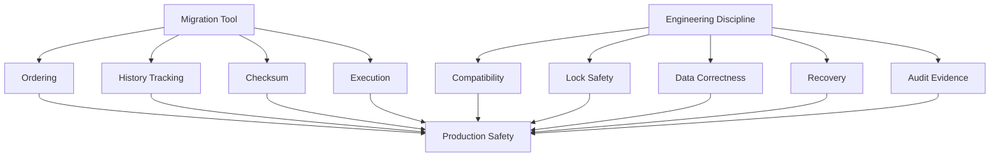
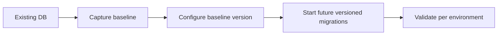
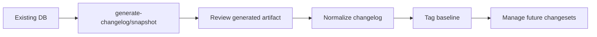

# Part 034 — Flyway vs Liquibase Decision Framework and Final Mastery Map

Bagian terakhir ini menjawab pertanyaan praktis:

> “Kapan memilih Flyway, kapan memilih Liquibase, bagaimana menilai trade-off, dan seperti apa standar mastery untuk database migration production-grade?”

Jawaban singkatnya:

- **Flyway** cocok ketika tim ingin migration yang sederhana, SQL-first, eksplisit, dekat dengan cara DBA/developer membaca perubahan database.
- **Liquibase** cocok ketika tim butuh changelog yang lebih terstruktur, conditional execution, rollback workflow, diff/snapshot, labels/contexts, dan governance yang lebih kaya.

Jawaban panjangnya: pilihan tool bukan hanya soal fitur, tetapi soal **operating model**.

---

## 1. First Principle: Tool Does Not Remove Database Risk

Flyway dan Liquibase membantu mengelola migration history, ordering, checksum, execution, dan repeatability. Tetapi keduanya tidak otomatis menyelesaikan:

- bad schema design;
- unsafe lock behavior;
- destructive migration;
- data correctness;
- poor release choreography;
- hidden downstream consumers;
- missing rollback/roll-forward plan;
- weak production evidence;
- unclear ownership.

Tool bisa menjaga **execution discipline**. Engineer tetap harus merancang **state transition**.



---

## 2. Decision Axis 1: SQL-First vs Changelog-First

### Choose Flyway when SQL is the primary artifact

Flyway is strongest when the team wants migration to look like normal SQL scripts:

```txt
V001__create_customer_table.sql
V002__add_customer_status.sql
V003__backfill_customer_status.sql
R__customer_active_view.sql
```

**Good fit**:

- database-specific SQL is accepted;
- DBA review is SQL-oriented;
- portability is not a top goal;
- migration files should be simple and readable;
- team prefers explicit SQL over abstraction;
- rollback is usually roll-forward, not generated inverse.

### Choose Liquibase when changelog metadata matters

Liquibase is strongest when migration needs structured metadata:

```yaml
databaseChangeLog:
  - changeSet:
      id: 2026-06-28-001-add-customer-status
      author: platform-team
      labels: customer,release-2026-07
      context: prod
      preConditions:
        - onFail: HALT
        - tableExists:
            tableName: customer
      changes:
        - addColumn:
            tableName: customer
            columns:
              - column:
                  name: status
                  type: varchar(32)
      rollback:
        - dropColumn:
            tableName: customer
            columnName: status
```

**Good fit**:

- team wants explicit changeset metadata;
- preconditions matter;
- contexts/labels are useful;
- rollback SQL review is part of process;
- diff/snapshot helps governance;
- multiple database vendors must be supported;
- audit and compliance need structured evidence.

---

## 3. Decision Axis 2: Simplicity vs Control Surface

| Axis | Flyway | Liquibase |
|---|---|---|
| Core mental model | ordered migration scripts | changelog of changesets |
| Default style | SQL-first | XML/YAML/JSON/formatted SQL |
| Learning curve | lower | higher |
| Review experience | direct SQL review | metadata + SQL/change type review |
| Conditional execution | limited/basic through config/callbacks/placeholders | rich via preconditions, contexts, labels, dbms |
| Rollback model | usually manual/roll-forward | explicit rollback workflow, some automatic rollback |
| Diff/snapshot | not the core OSS mental model | major capability |
| Governance richness | depends on process/tooling | stronger built-in metadata surface |
| Risk | oversimplifying complex governance | overengineering simple migration flow |

**Practical rule**:

```txt
If your organization cannot operate Liquibase's extra control surface safely,
Flyway may be safer because it is simpler.

If your organization needs governance that Flyway would require you to build externally,
Liquibase may be safer because the control surface is explicit.
```

---

## 4. Decision Axis 3: Team and Review Model

### Flyway favors teams where:

- engineers are comfortable writing SQL;
- DBAs review actual SQL artifact;
- releases are trunk-based or linear enough;
- environment behavior is mostly uniform;
- schema is database-specific;
- rollback is managed by roll-forward playbook;
- migration runner and CI provide external governance.

### Liquibase favors teams where:

- change ownership needs more metadata;
- preconditions are important to adoption/migration safety;
- deployment filters are needed;
- changelog needs to encode rollback intent;
- schema diff/snapshot is useful for drift controls;
- database portability has value;
- regulated release evidence benefits from richer changelog structure.

---

## 5. Decision Axis 4: Application Architecture

| Architecture | Recommended Bias | Reasoning |
|---|---|---|
| Small Spring Boot service | Flyway | simple, predictable, low ceremony |
| Modular monolith | Flyway or Liquibase | depends on governance and module ownership |
| Large enterprise monolith | Liquibase bias | changelog organization, preconditions, rollback metadata can help |
| Microservices with service-owned DB | Flyway bias per service | simple artifact per service works well |
| Shared enterprise database | Liquibase bias | ownership, labels, contexts, diff, governance help |
| Multi-tenant schema-per-tenant SaaS | Either | orchestration matters more than tool |
| Multi-vendor product | Liquibase bias | change types/dbms filters can help portability |
| DBA-controlled SQL release | Flyway bias | SQL-first review aligns well |
| Regulated environment | Either, Liquibase bias if metadata needed | evidence process matters more than brand |

---

## 6. Decision Axis 5: Rollback Philosophy

Do not choose Liquibase merely because “it has rollback.” Choose based on rollback reality.

### Roll-forward-first systems

Common in high-scale production systems.

```txt
Bug found after migration:
- keep schema compatible;
- disable feature flag;
- deploy corrective migration;
- preserve data;
- avoid reverse destructive rollback.
```

Flyway fits this model naturally.

### Rollback-heavy systems

Common where release governance demands rollback SQL preview or tag-based rollback procedure.

```txt
Before deployment:
- produce update SQL;
- produce rollback SQL;
- review both;
- tag release checkpoint;
- retain rollback script evidence.
```

Liquibase fits this model better.

### Reality check

Even with Liquibase, rollback may not be safe for:

- dropped data;
- lossy transformations;
- external side effects;
- application writes after migration;
- semantic changes to reference data;
- long-running backfills.

The mature posture is:

```txt
Use rollback for simple reversible changes.
Use roll-forward for most production correction.
Use restore only for catastrophic state corruption.
```

---

## 7. Decision Axis 6: Existing Database Adoption

### Flyway adoption path

Best when you want to establish a baseline and manage future changes.



Key decision:

```txt
Do we need to reconstruct historical changes?
Or only establish current schema as baseline and control future changes?
```

Most teams should baseline current schema and control future changes.

### Liquibase adoption path

Best when you need snapshot/diff/generate changelog to onboard existing schema.



Key warning:

```txt
Generated changelog is an observation of database state, not proof of correct domain intent.
```

---

## 8. Weighted Decision Matrix

Use this scoring model for tool selection.

Score each item from 1 to 5.

| Criterion | Weight | Flyway Score | Liquibase Score | Notes |
|---|---:|---:|---:|---|
| SQL readability | 5 | 5 | 3 | Liquibase formatted SQL can improve this |
| Simplicity | 5 | 5 | 3 | Liquibase has richer model |
| Structured metadata | 4 | 2 | 5 | changeset attributes, labels, contexts |
| Rollback workflow | 4 | 2 | 5 | depends on actual change type |
| Diff/snapshot | 3 | 2 | 5 | Liquibase stronger here |
| DBA collaboration | 4 | 5 | 3 | depends on format |
| Multi-vendor support | 3 | 2 | 4 | Liquibase change types help, raw SQL reduces portability |
| CI/CD simplicity | 4 | 5 | 4 | both work well |
| Regulated evidence | 4 | 4 | 5 | process can make either strong |
| Developer ergonomics | 3 | 5 | 3 | team-dependent |

Example calculation:

```txt
Weighted score = sum(weight * score)
```

But avoid false precision. The matrix is a conversation tool, not a mathematical truth.

---

## 9. Recommended Defaults

### Default 1: New Java microservice with one primary database

Choose **Flyway** unless there is a strong reason not to.

Why:

- simpler;
- SQL artifact is clear;
- Spring Boot integration is straightforward;
- review burden is lower;
- roll-forward model is natural.

### Default 2: Enterprise shared database with many teams

Choose **Liquibase** or a strongly governed Flyway platform.

Why:

- structured metadata matters;
- preconditions help protect against unexpected state;
- labels/contexts can support controlled deployment;
- diff/snapshot can support drift management;
- rollback SQL review may be required.

### Default 3: Multi-tenant SaaS

Either tool is acceptable. Focus on orchestration.

The hard problems are:

- tenant inventory;
- per-tenant state;
- partial failure;
- version skew;
- throttling;
- audit per tenant;
- retry/resume;
- canary tenant.

### Default 4: Regulated enforcement/case-management platform

Use either tool only with strong controls:

- migration as release artifact;
- immutable applied migration;
- approval evidence;
- pre/post verification;
- segregation of duties;
- drift detection;
- recovery playbook;
- audit-friendly release notes.

Liquibase may provide more built-in metadata; Flyway may provide clearer SQL review. The winner depends on organization process maturity.

---

## 10. Anti-Decision: Do Not Choose Based on These Alone

Do not choose only because:

- “Flyway is simpler.” Simpler can be under-controlled.
- “Liquibase has rollback.” Rollback can be unsafe or irrelevant.
- “Our ORM can generate schema.” Auto-DDL is not production migration governance.
- “DBA prefers SQL.” Liquibase can use formatted SQL; Flyway can be wrapped with governance.
- “We need multi-vendor support.” Real portability still requires vendor-specific testing.
- “We already use Spring Boot.” Spring Boot supports both.

Choose based on operating model.

---

# Adoption Blueprint

## Phase 1: Establish Source of Truth

Goal: no more uncontrolled schema change.

Deliverables:

```txt
[ ] migration repository or module exists
[ ] naming convention documented
[ ] migration tool configured
[ ] schema history/changelog table present
[ ] production manual change policy defined
[ ] local dev bootstrap uses same migration path
```

## Phase 2: CI Validation

Goal: every migration is tested before merge/deploy.

Deliverables:

```txt
[ ] clean database migration test
[ ] previous-version upgrade test
[ ] static destructive SQL check
[ ] Flyway validate or Liquibase validate
[ ] SQL preview for high-risk changes
[ ] Testcontainers or equivalent real DB test
```

## Phase 3: Production Release Discipline

Goal: migration becomes controlled release artifact.

Deliverables:

```txt
[ ] dedicated migration job or controlled startup path
[ ] migration user separate from app user
[ ] pre/post verification queries
[ ] evidence bundle captured
[ ] rollback/roll-forward decision recorded
[ ] approval workflow for destructive changes
```

## Phase 4: Operational Maturity

Goal: failures are recoverable without panic.

Deliverables:

```txt
[ ] checksum mismatch playbook
[ ] stuck lock playbook
[ ] failed migration playbook
[ ] hotfix migration playbook
[ ] drift detection process
[ ] tenant partial failure strategy if multi-tenant
```

## Phase 5: Architecture Maturity

Goal: schema evolution is aligned with service boundaries.

Deliverables:

```txt
[ ] table/schema ownership map
[ ] contract migration policy
[ ] expand/contract standard
[ ] downstream consumer inventory
[ ] deprecation window policy
[ ] data migration job framework
```

---

# Mastery Checklist

A top-tier engineer should be able to do the following without relying on templates.

## A. Conceptual Mastery

```txt
[ ] Explain migration as state transition.
[ ] Explain schema as contract.
[ ] Explain checksum as integrity control, not correctness proof.
[ ] Explain difference between versioned, repeatable, idempotent, rerunnable, resumable.
[ ] Explain why rollback is not always safe.
[ ] Explain expand/contract with compatibility matrix.
```

## B. Tool Mastery: Flyway

```txt
[ ] Design version naming strategy for team workflow.
[ ] Explain schema history table.
[ ] Use versioned vs repeatable migration correctly.
[ ] Handle checksum mismatch without blind repair.
[ ] Use baseline safely for existing DB.
[ ] Know why clean must be disabled in production.
[ ] Integrate with Spring Boot and dedicated migration runner.
```

## C. Tool Mastery: Liquibase

```txt
[ ] Design changelog topology.
[ ] Explain changeset identity.
[ ] Use preconditions safely.
[ ] Use contexts/labels without environment fork.
[ ] Generate and review update-sql/rollback-sql.
[ ] Handle DATABASECHANGELOGLOCK safely.
[ ] Use diff/snapshot as evidence, not blind source of truth.
```

## D. Production Mastery

```txt
[ ] Predict lock behavior before deployment.
[ ] Design large table migration with chunking/checkpointing.
[ ] Separate schema migration from long-running backfill.
[ ] Build pre/post verification queries.
[ ] Define stop condition and recovery path.
[ ] Produce audit evidence bundle.
[ ] Detect and classify drift.
```

## E. Architecture Mastery

```txt
[ ] Define schema ownership boundaries.
[ ] Design multi-service contract migration.
[ ] Manage multi-tenant migration fan-out.
[ ] Handle version skew.
[ ] Avoid shared table write ownership.
[ ] Coordinate schema, app, event, CDC, reporting consumers.
```

---

# Capstone Project

Build a production-grade migration platform for a Java enforcement case-management system.

## Scenario

You maintain a regulatory enforcement platform with these domains:

- case intake;
- investigation;
- violation assessment;
- enforcement action;
- penalty calculation;
- appeal;
- document evidence;
- audit trail;
- reporting;
- user/role/permission.

The database is PostgreSQL in production. Some teams use Spring Boot. There are reporting consumers and batch exports. The system must support rolling deployment and audit evidence.

## Capstone Requirements

### 1. Initial Schema

Create migration for:

```txt
case_file
party
investigation
violation
case_status_history
enforcement_action
penalty
appeal
case_document
role
permission
role_permission
```

### 2. Tool Choice

Choose Flyway or Liquibase and write an ADR.

ADR must include:

```txt
[ ] context
[ ] decision
[ ] alternatives considered
[ ] why chosen tool fits operating model
[ ] rollback philosophy
[ ] audit strategy
[ ] CI/CD strategy
[ ] risks and mitigations
```

### 3. Expand/Contract Change

Implement a safe rename:

```txt
case_file.status -> case_file.lifecycle_status
```

Must include:

```txt
[ ] expand migration
[ ] application dual-write/dual-read plan
[ ] backfill
[ ] verification
[ ] contract migration
[ ] rollback/roll-forward reasoning
```

### 4. Large Table Backfill

Assume `case_status_history` has 300 million rows.

Add:

```txt
case_status_history.normalized_status
```

Must include:

```txt
[ ] nullable column migration
[ ] checkpoint table
[ ] Java worker
[ ] chunking
[ ] throttling
[ ] verification
[ ] final constraint
[ ] failure recovery
```

### 5. Multi-Service Ownership

Define ownership for:

```txt
case service
audit service
reporting service
identity service
notification service
```

Must include:

```txt
[ ] table ownership
[ ] read contract
[ ] write contract
[ ] migration approval owner
[ ] consumer deprecation process
```

### 6. CI/CD Pipeline

Design pipeline stages:

```txt
[ ] static validation
[ ] ephemeral DB apply
[ ] previous-version upgrade
[ ] application compatibility test
[ ] SQL preview
[ ] staging rehearsal
[ ] production approval
[ ] production apply
[ ] post-verification
```

### 7. Failure Injection

Simulate and document recovery for:

```txt
[ ] checksum mismatch
[ ] failed DDL halfway
[ ] long lock blocker
[ ] failed backfill after 40%
[ ] stuck Liquibase lock or Flyway failed state
[ ] manual production drift
[ ] urgent hotfix migration
```

### 8. Evidence Bundle

Produce example evidence:

```txt
[ ] commit SHA
[ ] migration list
[ ] SQL preview
[ ] reviewer approval
[ ] deployment logs
[ ] schema history/changelog rows
[ ] verification query output
[ ] incident/recovery link if any
```

---

# Final Mental Model

Database migration excellence is not memorizing Flyway commands or Liquibase XML.

It is the ability to reason precisely about:

```txt
state before
state after
allowed intermediate states
application compatibility
data correctness
operational risk
observability
audit evidence
recovery path
```

The migration file is only the visible artifact. The real skill is designing a safe state transition under uncertainty.

---

# Series Completion

This is the final planned part of the series.

```txt
learn-java-database-migrations-part-034-flyway-vs-liquibase-decision-framework.mdx
```

The series contains 34 parts total.

---

# References

- Flyway versioned migrations: https://documentation.red-gate.com/fd/versioned-migrations-273973333.html
- Flyway repeatable migrations: https://documentation.red-gate.com/fd/repeatable-migrations-273973335.html
- Flyway schema history table: https://documentation.red-gate.com/fd/flyway-schema-history-table-273973417.html
- Liquibase changeset checksum: https://docs.liquibase.com/secure/user-guide-5-2/what-is-a-changeset-checksum
- Liquibase changeset: https://docs.liquibase.com/oss/user-guide-4-33/what-is-a-changeset
- Spring Boot database initialization: https://docs.spring.io/spring-boot/how-to/data-initialization.html
