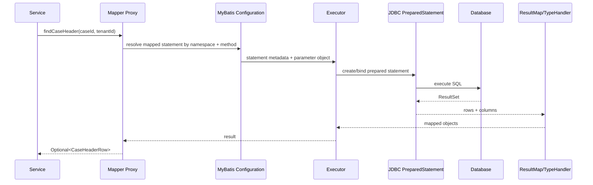

------
title: Learn Java MyBatis - Part 001
description: Kaufman-based skill map and mental model for mastering MyBatis as an explicit SQL mapping layer in production Java systems.
series: learn-java-mybatis
seriesTitle: Learn Java MyBatis, Patterns, Anti-Patterns, and Production Persistence Mapping
order: 1
partTitle: Kaufman Skill Map and MyBatis Mental Model
tags:
  - java
  - mybatis
  - persistence
  - sql
  - mapper
  - architecture
  - kaufman
  - advanced-engineering
date: 2026-06-27
---

# Learn Java MyBatis - Part 001

# Kaufman Skill Map and MyBatis Mental Model

## 1. Tujuan Part Ini

Part ini membangun fondasi berpikir sebelum masuk ke mapper XML, dynamic SQL, `SqlSession`, Spring integration, testing, dan performance.

Targetnya bukan sekadar bisa menulis:

```java
User user = userMapper.findById(id);
```

Targetnya adalah mampu menjawab pertanyaan engineering seperti:

- Mengapa query ini berada di mapper ini, bukan mapper lain?
- Apakah return type mapper ini merepresentasikan domain, projection, atau read model?
- Apakah SQL ini aman terhadap injection, missing tenant predicate, pagination bug, dan accidental full-table scan?
- Apakah query ini stabil terhadap perubahan schema?
- Apakah mapper ini membocorkan detail persistence ke layer domain/service?
- Apakah mapping object graph-nya sengaja, atau secara tidak sadar sedang meniru ORM buruk?
- Apakah transaction boundary-nya bisa dipertanggungjawabkan saat incident?
- Apakah engineer lain bisa memahami, menguji, dan mengubah mapper ini tanpa merusak behavior production?

MyBatis harus dipahami sebagai **explicit SQL mapping layer**. Kekuatan utamanya bukan “membuat database access menjadi ajaib”, melainkan memberi engineer kontrol penuh atas SQL, parameter binding, mapping, dan boundary.

---

## 2. Prinsip Kaufman yang Dipakai di Seri Ini

Josh Kaufman dalam _The First 20 Hours_ menekankan bahwa belajar skill baru secara cepat membutuhkan deconstruction, cukup teori untuk self-correction, removal of barriers, dan deliberate practice.

Kita adaptasikan untuk MyBatis sebagai berikut.

| Kaufman Principle | Implementasi di MyBatis |
|---|---|
| Deconstruct the skill | MyBatis dipecah menjadi mapper contract, SQL ownership, result mapping, dynamic SQL, session lifecycle, transaction semantics, performance, testing, observability, dan governance. |
| Learn enough to self-correct | Setiap topik dijelaskan dengan invariant, smell, failure mode, dan cara mendeteksi kesalahan desain. |
| Remove practice barriers | Kita gunakan struktur file, naming convention, checklist, dan contoh review rule supaya praktik tidak kabur. |
| Practice deliberately | Tiap part berisi drills yang memaksa pembaca menulis, memecah, menguji, dan mereview mapper secara sadar. |

Yang penting: framework Kaufman bukan berarti materi menjadi dangkal. Justru sebaliknya: kita membuang noise dan menyusun urutan belajar yang mempercepat penguasaan skill inti.

---

## 3. Apa Itu MyBatis dalam Mental Model yang Benar

MyBatis adalah framework persistence untuk Java yang memetakan object ke SQL statement atau stored procedure melalui XML descriptor atau annotation. Dokumentasi resmi menekankan bahwa MyBatis fokus pada SQL dan mencoba “stay out of your way”.

Mental model ringkas:

```text
Application method call
    -> Mapper interface method
        -> Mapped statement id
            -> SQL rendering / parameter binding
                -> JDBC execution
                    -> ResultSet reading
                        -> Object/result mapping
                            -> Return value
```

MyBatis bukan ORM penuh seperti Hibernate. MyBatis tidak mencoba menyembunyikan SQL, tidak otomatis melakukan dirty checking entity, tidak mengelola persistence context kompleks seperti JPA, dan tidak seharusnya dipakai untuk membuat ilusi bahwa relational model sama dengan object graph.

MyBatis memberi kita:

- kontrol eksplisit terhadap SQL;
- mapper interface sebagai API data access;
- mapper XML atau annotation sebagai definisi statement;
- parameter binding;
- result mapping;
- dynamic SQL;
- integration point dengan transaction manager;
- plugin/type handler/customization surface;
- cukup abstraksi agar JDBC boilerplate berkurang tanpa kehilangan SQL ownership.

---

## 4. Diagram Mental Model

```mermaid
flowchart LR
    A[Use Case / Application Service] --> B[Repository or Persistence Gateway]
    B --> C[MyBatis Mapper Interface]
    C --> D[Mapped Statement]
    D --> E[SQL + Parameter Binding]
    E --> F[JDBC Driver]
    F --> G[(Database)]
    G --> H[ResultSet]
    H --> I[ResultMap / TypeHandler]
    I --> J[Projection / Persistence DTO / Domain Rehydration Input]
    J --> B
    B --> A

    style C fill:#f9f9f9,stroke:#333,stroke-width:1px
    style D fill:#f9f9f9,stroke:#333,stroke-width:1px
    style I fill:#f9f9f9,stroke:#333,stroke-width:1px
```



Hal yang perlu diperhatikan:

1. Mapper interface bukan domain service.
2. SQL statement bukan tempat business rule utama.
3. ResultMap bukan domain modeler.
4. Database bukan detail yang boleh diabaikan.
5. Application service tidak boleh bergantung pada SQL shape secara langsung.

---

## 5. Skill Decomposition: Apa yang Harus Dikuasai

Untuk menjadi engineer yang kuat dalam MyBatis, skill-nya harus didekomposisi. Banyak engineer belajar MyBatis dari contoh CRUD, lalu berhenti. Itu membuat mereka bisa membuat aplikasi berjalan, tetapi rapuh saat query kompleks, transaction conflict, schema evolution, multi-tenant isolation, atau performance incident muncul.

Skill MyBatis advanced dapat dipetakan menjadi 12 area.

| Area | Kompetensi Inti | Failure Mode Jika Lemah |
|---|---|---|
| Mapper contract | Mendesain method mapper yang stabil, jelas, dan tidak bocor ke domain | Mapper menjadi god object, method ambigu, service bergantung pada detail SQL |
| SQL ownership | Menulis SQL yang eksplisit, reviewable, dan sesuai use case | Query tersebar, sulit diuji, performa tidak terkontrol |
| Parameter binding | Memahami `#{}` vs `${}`, safe interpolation, whitelisting | SQL injection, dynamic order-by berbahaya |
| Result mapping | Mengontrol object shape, nested mapping, projection | Silent null, duplicate row explosion, incorrect object graph |
| Dynamic SQL | Membangun query bersyarat yang tetap readable dan deterministic | XML kacau, query branch tidak teruji, hidden full-table scan |
| Transaction/session | Memahami `SqlSession`, executor, Spring transaction | Leaky session, commit/rollback salah, cache visibility bug |
| Type handling | Enum, JSON, time, value object, database-specific type | Data corruption, status code salah, timezone bug |
| Performance | Mengerti query cost, mapping cost, N+1, pagination, batch | Slow endpoint, memory spike, lock contention |
| Concurrency | Version update, status transition guard, locking | Lost update, double processing, deadlock |
| Testing | Mapper test dengan database nyata, contract test | Mock memberi rasa aman palsu |
| Observability | SQL logging, metrics, tracing, query fingerprint | Incident sulit didiagnosis |
| Governance | Convention, review checklist, migration strategy | Codebase berubah menjadi kumpulan query ad-hoc |

---

## 6. Posisi MyBatis Dibanding Alternatif

Bagian ini tidak mengulang seri JDBC/JPA/Hibernate, tetapi kita butuh decision frame.

| Tool | Mental Model | Cocok Untuk | Tidak Cocok Untuk |
|---|---|---|---|
| JDBC langsung | Manual database access | Kontrol sangat rendah-level, library internal kecil | Codebase besar yang butuh mapping convention |
| JPA/Hibernate | ORM/unit-of-work/entity state management | Domain entity lifecycle, relationship persistence, dirty checking | Query-heavy system dengan SQL sangat spesifik dan performance-sensitive |
| Spring Data JDBC | Aggregate persistence yang lebih sederhana daripada ORM | CRUD aggregate sederhana dengan explicit aggregate boundary | Query/reporting kompleks dan mapping custom berat |
| jOOQ | Type-safe SQL DSL, database-centric | SQL kompleks, compile-time schema DSL, advanced SQL modeling | Tim yang tidak ingin DSL/schema generation atau butuh MyBatis ecosystem |
| MyBatis | SQL mapper eksplisit | Query-centric service, legacy schema, reporting/search, controlled mapping | Tim yang ingin ORM otomatis dan tidak mau maintain SQL |

Kesimpulan: MyBatis unggul ketika organisasi **ingin SQL tetap menjadi artifact utama** yang bisa direview, dituning, diaudit, dan disesuaikan dengan database nyata.

---

## 7. Kapan MyBatis Adalah Pilihan yang Baik

MyBatis biasanya kuat untuk sistem dengan karakteristik berikut:

1. **Query lebih penting daripada object graph.**
   Sistem memiliki banyak search screen, reporting query, queue query, dashboard, SLA query, export, dan filter kompleks.

2. **Schema sudah ada atau tidak sepenuhnya mengikuti domain model.**
   Misalnya legacy database, shared database, regulatory database, atau schema yang dikontrol tim lain.

3. **SQL harus dapat direview oleh database engineer.**
   Query plan, index usage, lock behavior, dan explain plan adalah bagian dari engineering workflow.

4. **Data correctness lebih penting daripada convenience.**
   Engineer ingin melihat predicate, join, tenant filter, status transition guard, dan locking clause secara eksplisit.

5. **Read model berbeda dari write model.**
   Banyak endpoint membutuhkan shape yang bukan entity domain murni.

6. **Performance tuning terjadi di level SQL.**
   Query perlu hint, CTE, window function, custom pagination, stored procedure, atau database-specific feature.

7. **Tim sudah kuat di SQL.**
   MyBatis tidak mengurangi kebutuhan untuk mengerti SQL. Ia justru mengasumsikan engineer bersedia memiliki SQL secara eksplisit.

---

## 8. Kapan MyBatis Menjadi Pilihan Buruk

MyBatis bisa menjadi buruk jika dipakai dengan asumsi yang salah.

Gunakan hati-hati atau hindari ketika:

1. **Tim tidak ingin memiliki SQL.**
   MyBatis bukan alat untuk menghindari SQL. Jika tim lemah di SQL dan tidak ingin memperbaikinya, MyBatis akan memperbesar masalah.

2. **Semua kebutuhan persistence hanya CRUD sederhana.**
   Framework yang lebih opinionated mungkin lebih produktif.

3. **Domain entity lifecycle sangat kaya dan cocok dengan ORM.**
   Jika benar-benar butuh dirty checking, cascading, persistence context, lazy loading terkontrol, dan entity graph management, JPA/Hibernate bisa lebih cocok.

4. **Mapper dijadikan tempat business logic.**
   SQL bisa mengekspresikan constraint dan data operation, tetapi policy/domain decision sebaiknya tidak tersembunyi di XML.

5. **Tidak ada testing database nyata.**
   MyBatis mapper yang hanya diuji dengan mock hampir tidak memberi jaminan terhadap SQL, mapping, constraint, dan branch dynamic SQL.

6. **Codebase tidak punya convention.**
   Tanpa convention, MyBatis cepat berubah menjadi kumpulan XML/annotation ad-hoc.

---

## 9. Core Invariants MyBatis Production-Grade

Invariant adalah aturan yang harus tetap benar walaupun codebase tumbuh.

### 9.1 SQL Is Owned, Not Generated Blindly

Setiap query penting harus punya owner. Owner memahami:

- tujuan query;
- expected cardinality;
- filter wajib;
- join path;
- index yang diharapkan;
- ordering deterministik;
- pagination semantics;
- transaction/locking consequence;
- data exposure boundary.

Jika tidak ada yang bisa menjelaskan query, query itu belum production-ready.

### 9.2 Mapper Method Is a Contract

Mapper method bukan sekadar function yang kebetulan menjalankan SQL.

Mapper method adalah contract:

```java
Optional<CaseHeaderRow> findOpenCaseHeaderByCaseIdAndTenantId(
    @Param("caseId") CaseId caseId,
    @Param("tenantId") TenantId tenantId
);
```

Contract ini menyatakan:

- cardinality: optional, bukan list;
- scope: open case only;
- tenant safety: tenant id wajib;
- return shape: header row, bukan full aggregate;
- intent: lookup by case id.

Bandingkan dengan method buruk:

```java
Case getCase(String id);
```

Masalahnya:

- tidak jelas tenant boundary;
- tidak jelas case harus active/open/all;
- tidak jelas projection atau aggregate;
- return null atau throw?
- terlalu generic untuk review.

### 9.3 Database Predicate Is Part of Security

Untuk multi-tenant atau access-controlled system, predicate bukan hanya performance concern. Predicate adalah security boundary.

Contoh minimal:

```sql
WHERE case_id = #{caseId}
  AND tenant_id = #{tenantId}
```

Missing tenant predicate adalah data leak bug, bukan sekadar bug query.

### 9.4 Result Shape Must Be Intentional

Return object harus dipilih secara sadar:

- domain aggregate;
- persistence row object;
- read model;
- API projection;
- report row;
- command result;
- count/existence flag.

Anti-pattern umum adalah memakai satu `CaseEntity` untuk semua query. Akibatnya object menjadi terlalu besar, nullable everywhere, dan tidak ada yang tahu field mana yang valid untuk use case tertentu.

### 9.5 Dynamic SQL Must Be Deterministic

Dynamic SQL boleh fleksibel, tetapi output-nya harus bisa diprediksi. Untuk setiap kombinasi filter penting, engineer harus bisa menjawab:

- SQL final seperti apa yang terbentuk?
- Apakah predicate wajib selalu muncul?
- Apakah query tetap punya ordering?
- Apakah filter kosong berubah menjadi full-table scan?
- Apakah branch dynamic SQL tercakup test?

### 9.6 Transaction Boundary Belongs Above Mapper

Mapper menjalankan statement. Ia tidak seharusnya menjadi pemilik transaction orchestration bisnis.

Transaction boundary umumnya berada di application service/use case:

```java
@Transactional
public void escalateCase(EscalateCaseCommand command) {
    CaseRecord record = caseRepository.lockForEscalation(command.caseId(), command.tenantId());
    policy.assertEscalatable(record);
    caseRepository.markEscalated(command);
    auditRepository.appendEscalationAudit(command);
}
```

Mapper di bawahnya menyediakan operation yang kecil, eksplisit, dan testable.

---

## 10. MyBatis Execution Lifecycle

Diagram ini membantu memahami apa yang terjadi saat mapper dipanggil.



Implikasi engineering:

1. Method name harus match mapped statement identity.
2. Parameter binding harus aman.
3. Column alias harus match mapping.
4. ResultMap harus sesuai cardinality dan object shape.
5. Session/executor behavior memengaruhi cache, batch, dan transaction.

---

## 11. Mapper Sebagai Boundary, Bukan Dumping Ground

Mapper yang sehat memiliki karakteristik berikut:

```java
@Mapper
public interface CaseReadMapper {
    Optional<CaseHeaderRow> findHeaderById(CaseHeaderQuery query);

    List<CaseQueueRow> findAssignmentQueue(CaseQueueQuery query);

    List<CaseSlaBreachRow> findPotentialSlaBreaches(SlaBreachQuery query);

    boolean existsOpenCaseForParty(OpenCaseForPartyQuery query);
}
```

Hal-hal yang terlihat:

- Mapper ini read-oriented.
- Setiap method punya intent jelas.
- Query object membawa parameter dengan nama domain-level.
- Return type adalah projection/read row.
- Tidak ada method generic seperti `query(Map<String, Object> params)`.

Mapper yang buruk:

```java
@Mapper
public interface CaseMapper {
    List<Map<String, Object>> search(Map<String, Object> params);
    Object execute(String sql);
    List<Case> getCases(String keyword, String sort, String status, String tenant);
    void update(Case c);
    void saveAudit(Case c);
    void doEscalation(String id);
}
```

Masalah:

- Map membuat contract tidak terlihat.
- `execute(String sql)` membuka pintu injection dan bypass review.
- Nama method tidak menjelaskan cardinality/intent.
- Read, write, audit, workflow dicampur.
- Business operation masuk ke mapper.

---

## 12. Mapper Contract Review Heuristic

Gunakan pertanyaan ini saat code review.

### 12.1 Intent

- Apakah nama method menjelaskan tujuan bisnis/data access?
- Apakah method terlalu generic?
- Apakah method mengekspresikan filter wajib?

### 12.2 Cardinality

- Return type `Optional<T>` jika maksimal satu row?
- Return type `List<T>` jika banyak row?
- Apakah query bisa menghasilkan lebih dari satu row tapi method mengasumsikan satu?
- Apakah `null` dihindari?

### 12.3 Scope

- Apakah tenant/user/security predicate wajib muncul?
- Apakah status lifecycle jelas?
- Apakah soft-delete predicate konsisten?

### 12.4 Shape

- Apakah return object sesuai use case?
- Apakah field nullable karena benar-benar nullable, bukan karena projection campur aduk?
- Apakah resultMap terlalu besar?

### 12.5 Evolvability

- Jika schema berubah, bagian mana yang terdampak?
- Apakah SQL fragment reuse membantu atau malah menyembunyikan behavior?
- Apakah method ini akan menjadi magnet untuk parameter tambahan?

---

## 13. MyBatis dan Explicit SQL Ownership

Dalam sistem enterprise, SQL bukan detail kecil. SQL menentukan:

- data apa yang terlihat;
- data apa yang terkunci;
- row mana yang diperbarui;
- index mana yang digunakan;
- consistency apa yang dijamin;
- audit trail apa yang bisa dibuktikan;
- apakah query aman untuk tenant/regulator/customer;
- apakah endpoint tetap hidup di traffic tinggi.

MyBatis membuat SQL tetap dekat dengan Java contract, tetapi tidak menyembunyikannya.

Contoh SQL yang lebih reviewable:

```xml
<select id="findAssignmentQueue" resultMap="CaseQueueRowMap">
  SELECT
      c.case_id,
      c.case_number,
      c.priority,
      c.status,
      c.assigned_team_id,
      c.created_at,
      c.sla_due_at
  FROM enforcement_case c
  WHERE c.tenant_id = #{tenantId}
    AND c.status IN
    <foreach collection="statuses" item="status" open="(" separator="," close=")">
      #{status}
    </foreach>
    AND c.assigned_team_id = #{teamId}
  ORDER BY c.priority DESC, c.sla_due_at ASC, c.case_id ASC
  LIMIT #{limit}
</select>
```

Kelebihan:

- tenant predicate eksplisit;
- status scope terlihat;
- queue ordering deterministic;
- limit eksplisit;
- projection kolom jelas;
- reviewer bisa mendiskusikan index.

---

## 14. MyBatis Bukan Alasan untuk Menulis SQL Sembarangan

Karena MyBatis membuat SQL mudah ditulis, ada risiko engineer menulis query tanpa design.

Kesalahan umum:

```xml
<select id="search" resultType="CaseEntity">
  SELECT * FROM enforcement_case
  <where>
    <if test="keyword != null">
      case_number LIKE '%${keyword}%'
    </if>
  </where>
</select>
```

Masalah:

1. `SELECT *` membuat mapping rapuh dan menambah payload.
2. `${keyword}` raw interpolation berbahaya.
3. Tidak ada tenant predicate.
4. Tidak ada deterministic ordering.
5. Empty filter bisa menjadi full-table scan.
6. Return `CaseEntity` mungkin terlalu besar.
7. Tidak ada pagination.

Versi lebih sehat:

```xml
<select id="searchCaseHeaders" resultMap="CaseHeaderRowMap">
  SELECT
      c.case_id,
      c.case_number,
      c.status,
      c.priority,
      c.created_at,
      c.updated_at
  FROM enforcement_case c
  WHERE c.tenant_id = #{tenantId}
    <if test="status != null">
      AND c.status = #{status}
    </if>
    <if test="keyword != null and keyword != ''">
      AND (
        c.case_number LIKE #{keywordPattern}
        OR c.normalized_subject_name LIKE #{keywordPattern}
      )
    </if>
  ORDER BY c.updated_at DESC, c.case_id DESC
  LIMIT #{limit}
  OFFSET #{offset}
</select>
```

Catatan penting: `keywordPattern` sebaiknya dibentuk di Java setelah validasi/normalisasi, bukan dari raw string interpolation di XML.

---

## 15. Batas Antara Domain Logic dan SQL Logic

Tidak semua logic di SQL adalah buruk. SQL memang tempat yang tepat untuk logic yang bersifat data-relational.

### Logic yang Wajar di SQL

- filtering;
- join;
- aggregation;
- ordering;
- window function;
- existence check;
- compare-and-set update;
- status guard sederhana;
- uniqueness enforcement;
- pagination;
- projection shaping.

### Logic yang Biasanya Tidak Sehat Jika Tersembunyi di SQL

- policy bisnis yang sering berubah;
- authorization kompleks tanpa layer eksplisit;
- workflow branching;
- cross-aggregate decision;
- notification decision;
- external integration decision;
- regulatory interpretation;
- rule yang butuh audit alasan keputusan.

Contoh sehat: SQL menjaga state transition secara atomik.

```sql
UPDATE enforcement_case
SET status = 'ESCALATED',
    escalated_at = #{now},
    version = version + 1
WHERE case_id = #{caseId}
  AND tenant_id = #{tenantId}
  AND status = 'OPEN'
  AND version = #{expectedVersion}
```

Ini bukan business logic penuh; ini data consistency guard. Policy “apakah case boleh dieskalasi” tetap bisa dievaluasi di application/domain layer, tetapi update SQL menjaga atomicity.

---

## 16. Advanced Engineer Mental Model: Query as Contracted Operation

Jangan pikirkan mapper method sebagai “ambil data”. Pikirkan sebagai **contracted database operation**.

Sebuah operation punya:

- name;
- input;
- output;
- cardinality;
- consistency expectation;
- authorization/tenant scope;
- performance expectation;
- error behavior;
- observability need;
- regression tests.

Contoh:

```java
int markCaseEscalated(MarkCaseEscalatedCommand command);
```

Contract yang harus jelas:

| Dimension | Harus Jelas |
|---|---|
| Input | `caseId`, `tenantId`, `expectedVersion`, `actorId`, `escalatedAt` |
| Output | affected row count |
| Cardinality | 0 atau 1 row updated |
| Meaning of 0 | case not found, tenant mismatch, invalid status, or version conflict |
| Consistency | atomic compare-and-set |
| Security | tenant predicate mandatory |
| Observability | log conflict count, not raw PII |
| Test | success, wrong version, wrong tenant, wrong status |

Top-tier engineer tidak hanya menulis mapper. Mereka mendefinisikan semantics.

---

## 17. MyBatis Skill Map untuk 20 Jam Pertama yang Efektif

Ini bukan estimasi durasi absolut. Ini struktur deliberate practice awal agar cepat mencapai “usable fluency”.

### Hour 1-2: Mental Model dan Runtime Path

Tujuan:

- tahu posisi MyBatis;
- paham mapper method -> mapped statement -> SQL -> result mapping;
- tahu bedanya XML, annotation, dynamic SQL, type handler, session.

Latihan:

- Ambil 5 mapper dari codebase atau contoh project.
- Untuk tiap method, tulis mapped statement id, SQL final, return shape, dan cardinality.

### Hour 3-4: Mapper Contract Design

Tujuan:

- bisa membedakan mapper buruk vs sehat;
- bisa memilih parameter object dan return type.

Latihan:

- Refactor mapper generic menjadi mapper method spesifik.
- Ubah `Map<String,Object>` menjadi query object.

### Hour 5-6: XML Mapper dan ResultMap

Tujuan:

- memahami namespace, statement id, resultMap, SQL fragment;
- bisa mapping projection secara eksplisit.

Latihan:

- Buat `CaseHeaderRowMap`.
- Buat query list dengan ordering deterministic.

### Hour 7-8: Parameter Safety dan Dynamic SQL

Tujuan:

- paham `#{}` vs `${}`;
- bisa membangun filter optional tanpa injection;
- bisa mencegah full-table scan accidental.

Latihan:

- Buat search mapper dengan 5 filter optional.
- Tambahkan guard minimal satu filter atau mandatory tenant predicate.

### Hour 9-10: Spring Transaction dan SqlSession

Tujuan:

- tahu siapa pemilik transaction;
- tahu mapper tidak mengelola transaction orchestration;
- paham `SqlSessionTemplate` di Spring.

Latihan:

- Buat use case dengan 3 mapper call dalam satu transaction.
- Test rollback saat call ketiga gagal.

### Hour 11-12: TypeHandler dan Domain Value

Tujuan:

- mapping enum/status/code dengan benar;
- menghindari stringly-typed domain state.

Latihan:

- Buat `CaseStatusTypeHandler`.
- Test unknown database value.

### Hour 13-14: Performance Basic

Tujuan:

- melihat query plan;
- mendeteksi N+1;
- tahu cost mapping dan large result.

Latihan:

- Bandingkan nested select vs join mapping.
- Ukur jumlah query dan rows returned.

### Hour 15-16: Testing Mapper dengan Database Nyata

Tujuan:

- tidak percaya mock untuk SQL;
- test resultMap, dynamic SQL branch, transaction behavior.

Latihan:

- Buat test untuk query search dengan kombinasi filter.
- Test missing optional filter tidak menghasilkan full scan tak disengaja.

### Hour 17-18: Concurrency dan Atomic Update

Tujuan:

- memahami affected row count sebagai signal;
- menerapkan optimistic locking.

Latihan:

- Implement update by `id + tenantId + version + status`.
- Test conflict menghasilkan 0 row.

### Hour 19-20: Review dan Hardening

Tujuan:

- bisa mereview mapper seperti production code;
- membuat checklist dan convention.

Latihan:

- Review 10 mapper method.
- Tandai smell: missing tenant, `SELECT *`, `${}`, no order, giant resultMap, unbounded list.

---

## 18. Praktik Deliberate: Dari Template ke Judgment

Belajar MyBatis sering gagal karena engineer hanya menghafal template:

```xml
<select id="findById" resultType="User">
  SELECT * FROM users WHERE id = #{id}
</select>
```

Template ini tidak salah untuk contoh kecil, tetapi tidak cukup untuk production.

Deliberate practice harus melatih judgment:

- kapan `resultType` cukup dan kapan butuh `resultMap`;
- kapan query perlu projection khusus;
- kapan nested select menyebabkan N+1;
- kapan dynamic SQL sudah terlalu kompleks;
- kapan mapper harus dipecah;
- kapan SQL fragment reuse membuat query tidak jelas;
- kapan `LIMIT/OFFSET` tidak cukup dan butuh cursor;
- kapan affected row count adalah bagian dari consistency model;
- kapan mapper test harus memverifikasi generated SQL branch;
- kapan cache tidak boleh dipakai karena correctness lebih penting.

---

## 19. Engineering Rubric: Level Kompetensi MyBatis

### Level 1: User

Bisa:

- membuat mapper sederhana;
- menulis select/insert/update/delete;
- memakai parameter binding dasar;
- menjalankan mapper dari service.

Risiko:

- belum bisa mendesain mapper boundary;
- mudah membuat query tidak aman;
- tidak sadar N+1/resultMap bug.

### Level 2: Productive Engineer

Bisa:

- membuat mapper XML rapi;
- menulis resultMap;
- membuat dynamic SQL sederhana;
- memakai Spring integration;
- membuat mapper test dasar.

Risiko:

- dynamic SQL bisa tumbuh kacau;
- transaction semantics belum kuat;
- performance review belum sistematis.

### Level 3: Senior Engineer

Bisa:

- mendesain persistence boundary;
- memilih projection vs aggregate;
- menghindari mapper leakage;
- menulis query aman multi-tenant;
- menguji dynamic SQL branch;
- melakukan tuning query plan;
- menerapkan optimistic/pessimistic locking.

Risiko:

- governance lintas tim belum tentu konsisten;
- migration strategy mungkin masih ad-hoc.

### Level 4: Staff/Principal-Level MyBatis Engineer

Bisa:

- menetapkan convention organisasi;
- mendesain mapper architecture untuk domain besar;
- membuat review rubric;
- menghubungkan mapper design dengan security, auditability, reliability, dan performance;
- memilih kapan MyBatis, JPA, JDBC, jOOQ, atau read-model pipeline lebih tepat;
- memimpin incident diagnosis berbasis SQL trace/query plan;
- merancang migration dan compatibility plan.

Target seri ini adalah membawa pembaca minimal ke Level 3 kuat, dengan exposure Level 4.

---

## 20. Practical Mental Checklist Sebelum Menulis Mapper

Sebelum membuat mapper method baru, jawab ini:

1. Operation ini read atau write?
2. Apakah operation ini milik aggregate, workflow, report, queue, atau search screen?
3. Apakah return object domain, persistence row, projection, atau command result?
4. Apakah cardinality-nya 0/1, 1, many, count, atau existence?
5. Predicate wajib apa yang tidak boleh hilang?
6. Apakah tenant/security/soft-delete/status predicate eksplisit?
7. Apakah SQL punya deterministic ordering jika mengembalikan list?
8. Apakah result set bounded?
9. Apakah dynamic SQL branch bisa diuji?
10. Apakah query ini butuh index tertentu?
11. Apakah mapping bisa rusak jika column alias berubah?
12. Apakah transaction/locking expectation jelas?
13. Apakah failure behavior jelas?
14. Apakah method name cukup spesifik untuk review?
15. Apakah mapper ini berada di boundary yang tepat?

Jika banyak jawaban belum jelas, jangan langsung menulis XML. Desain contract dulu.

---

## 21. Case Management Example: Kenapa MyBatis Relevan

Dalam sistem regulatory enforcement/case management, query sering seperti ini:

- daftar case yang butuh assignment;
- case dengan SLA hampir breach;
- case yang butuh escalation;
- evidence yang belum diverifikasi;
- party yang punya open case di beberapa jurisdiction;
- audit trail untuk regulator;
- dashboard workload investigator;
- export untuk supervisory review;
- bulk transition untuk expired case;
- queue dengan priority rules.

Ini bukan CRUD sederhana. Query sering:

- banyak filter optional;
- butuh tenant/jurisdiction boundary;
- butuh status lifecycle constraint;
- perlu deterministic ordering;
- sensitif terhadap index;
- harus auditable;
- butuh projection berbeda untuk layar berbeda;
- sering berubah mengikuti policy.

MyBatis cocok karena SQL tetap eksplisit dan bisa direview.

Contoh mapper method:

```java
List<InvestigatorQueueRow> findInvestigatorQueue(InvestigatorQueueQuery query);
```

Query object:

```java
public record InvestigatorQueueQuery(
    TenantId tenantId,
    InvestigatorId investigatorId,
    Set<CaseStatus> statuses,
    Priority minimumPriority,
    Instant dueBefore,
    int limit,
    QueueCursor cursor
) {}
```

Return projection:

```java
public record InvestigatorQueueRow(
    CaseId caseId,
    String caseNumber,
    CaseStatus status,
    Priority priority,
    Instant slaDueAt,
    String subjectDisplayName,
    int openTaskCount
) {}
```

Perhatikan: mapper ini tidak mengembalikan `CaseAggregate`. Queue tidak butuh full aggregate. Ia butuh read model.

---

## 22. Anti-Goal Seri Ini

Seri ini tidak akan mengajarkan MyBatis sebagai kumpulan snippet copy-paste.

Kita tidak mengejar:

- “cara tercepat bikin CRUD”;
- “semua query ditaruh di satu mapper”;
- “pakai Map biar fleksibel”;
- “pakai `${}` biar gampang order by”;
- “mock mapper saja cukup”;
- “SELECT * dulu, nanti optimasi belakangan”;
- “semua return entity biar simple”.

Kita mengejar kemampuan untuk membuat persistence layer yang:

- jelas;
- aman;
- testable;
- observable;
- performance-aware;
- transaction-aware;
- evolvable;
- dapat dipertanggungjawabkan saat audit dan incident.

---

## 23. Minimum Vocabulary

Sebelum lanjut ke part berikutnya, pastikan istilah ini jelas.

| Istilah | Arti dalam Seri Ini |
|---|---|
| Mapper interface | Java interface yang menjadi API untuk mapped SQL statement. |
| Mapped statement | Definisi statement MyBatis yang diidentifikasi oleh namespace + id. |
| Mapper XML | File XML berisi statement, resultMap, SQL fragment, cache config, dan mapping. |
| ResultMap | Definisi eksplisit cara column result set dipetakan ke object. |
| TypeHandler | Komponen yang mengubah antara JDBC type dan Java type. |
| Dynamic SQL | SQL yang dirender berdasarkan kondisi/parameter. |
| SqlSession | Interface utama MyBatis untuk menjalankan command, mendapatkan mapper, dan mengelola session-level behavior. |
| SqlSessionFactory | Factory untuk membuat `SqlSession`. |
| SqlSessionTemplate | Spring-managed thread-safe template untuk MyBatis operation. |
| Projection | Object hasil query yang dirancang khusus untuk use case tertentu. |
| Query object | Object parameter yang membawa filter/sort/pagination secara eksplisit. |
| Command object | Object parameter untuk operasi mutasi data. |
| Tenant predicate | Predicate wajib untuk isolasi tenant/data owner. |
| Deterministic ordering | Ordering yang stabil dan tidak ambigu, terutama untuk pagination. |

---

## 24. Latihan Part 001

Gunakan latihan ini sebelum lanjut.

### Drill 1: Mapper Contract Audit

Ambil 5 mapper method dari codebase atau contoh project.

Untuk tiap method, tulis:

- nama method;
- input parameter;
- output type;
- cardinality;
- predicate wajib;
- apakah tenant/security predicate ada;
- apakah return object sesuai use case;
- risiko performance;
- risiko correctness.

Skor:

| Skor | Arti |
|---|---|
| 0 | Method tidak jelas dan sulit direview. |
| 1 | Method bekerja tetapi contract banyak implicit. |
| 2 | Method cukup jelas tetapi ada risiko mapping/scope. |
| 3 | Method eksplisit, aman, testable, dan reviewable. |

### Drill 2: Refactor Nama Method

Ubah method buruk:

```java
List<Case> getCases(String status, String keyword);
```

Menjadi minimal 3 method yang lebih eksplisit. Contoh:

```java
List<CaseHeaderRow> searchCaseHeaders(CaseHeaderSearchQuery query);

List<CaseQueueRow> findAssignmentQueue(CaseAssignmentQueueQuery query);

Optional<CaseDetailRow> findCaseDetailById(CaseDetailQuery query);
```

Jelaskan alasan tiap return type.

### Drill 3: SQL Ownership Review

Ambil satu query list. Jawab:

- index apa yang diharapkan?
- apakah ordering deterministic?
- apakah pagination aman?
- apakah result set bounded?
- apakah query bisa full scan saat filter kosong?
- apakah data exposure sesuai authorization?

---

## 25. Ringkasan Part 001

MyBatis harus dipahami sebagai **explicit SQL mapper**, bukan ORM ajaib dan bukan JDBC wrapper kosong.

Fondasi paling penting:

1. Mapper method adalah contract.
2. SQL adalah artifact engineering yang harus dimiliki dan direview.
3. Result shape harus intentional.
4. Predicate adalah bagian dari correctness dan security.
5. Dynamic SQL harus deterministic.
6. Transaction boundary biasanya berada di application service, bukan mapper.
7. Mapper test harus menggunakan database nyata untuk memberi confidence.
8. Top-tier MyBatis engineer berpikir dalam operation semantics, bukan snippet.

Part berikutnya akan membahas posisi MyBatis dalam architecture: repository, mapper, DAO, gateway, domain boundary, dan bagaimana mencegah MyBatis bocor ke seluruh application layer.

---

## References

- MyBatis 3 Mapper XML Files: https://mybatis.org/mybatis-3/sqlmap-xml.html
- MyBatis 3 Dynamic SQL: https://mybatis.org/mybatis-3/dynamic-sql.html
- MyBatis 3 Configuration: https://mybatis.org/mybatis-3/configuration.html
- MyBatis-Spring Introduction: https://mybatis.org/spring/
- MyBatis-Spring Transactions: https://mybatis.org/spring/transactions.html
- MyBatis Dynamic SQL Introduction: https://mybatis.org/mybatis-dynamic-sql/docs/introduction.html
