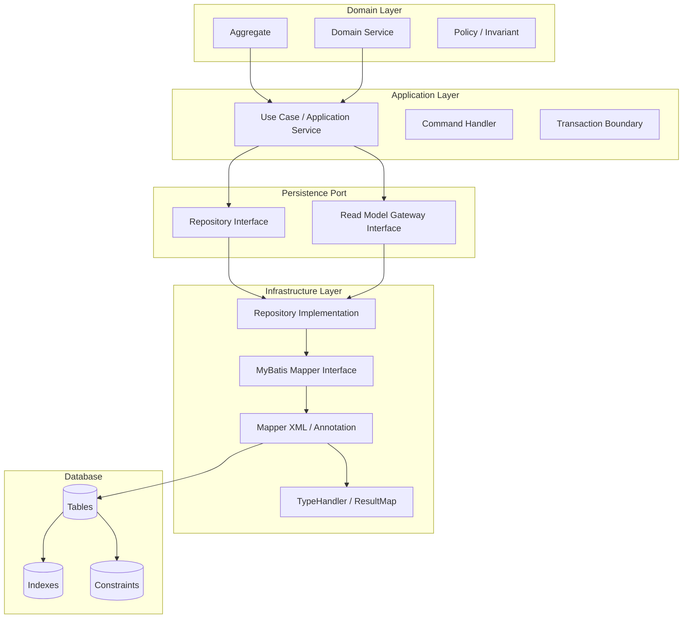
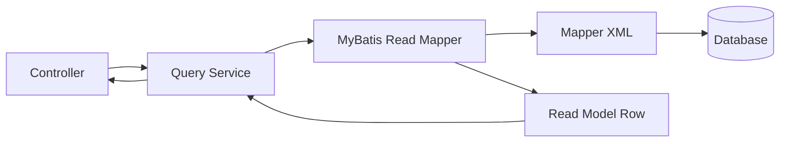
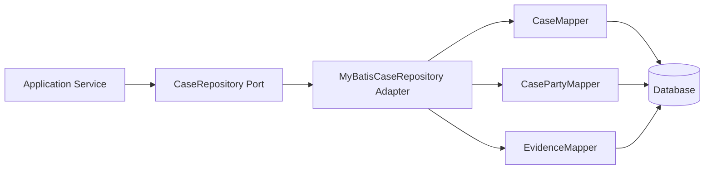
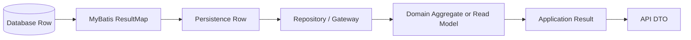
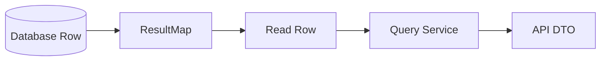
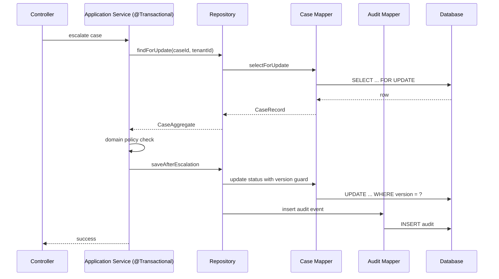

------
title: Learn Java MyBatis - Part 002
description: Architecture positioning, persistence boundaries, repository-vs-mapper design, and anti-leakage rules for production MyBatis systems.
series: learn-java-mybatis
seriesTitle: Learn Java MyBatis, Patterns, Anti-Patterns, and Production Persistence Mapping
order: 2
partTitle: Architecture Positioning and Persistence Boundaries
tags:
  - java
  - mybatis
  - persistence
  - architecture
  - clean-architecture
  - hexagonal-architecture
  - repository
  - mapper
  - advanced-engineering
date: 2026-06-27
---

# Learn Java MyBatis - Part 002

# Architecture Positioning and Persistence Boundaries

## 1. Tujuan Part Ini

Part sebelumnya membangun mental model: MyBatis adalah explicit SQL mapper. Part ini menjawab pertanyaan yang lebih architecture-level:

- Di layer mana MyBatis seharusnya berada?
- Apakah mapper sama dengan repository?
- Apakah service boleh inject MyBatis mapper langsung?
- Kapan perlu persistence gateway di atas mapper?
- Bagaimana mencegah SQL concern bocor ke domain/application layer?
- Bagaimana membagi mapper untuk aggregate, read model, workflow, search, dan reporting?
- Bagaimana membuat boundary yang tetap testable, evolvable, dan tidak over-engineered?

MyBatis bisa dipakai dengan arsitektur sederhana maupun kompleks. Masalah muncul ketika tim tidak sadar bahwa setiap mapper method adalah bagian dari boundary design.

---

## 2. Posisi MyBatis dalam Architecture

Secara production-grade, MyBatis biasanya berada di **infrastructure/data access layer**.

Application/domain layer tidak seharusnya tahu detail berikut:

- nama table;
- nama column;
- SQL join;
- `ResultMap`;
- dynamic SQL branch;
- database-specific pagination;
- MyBatis `SqlSession`;
- mapper XML namespace;
- `@Param` detail;
- executor type;
- cache flag.

Diagram clean boundary:



Catatan:

- Domain tidak bergantung pada MyBatis.
- Application layer bergantung pada port/repository abstraction jika kompleksitas membutuhkannya.
- Infrastructure implementation memakai MyBatis mapper.
- Mapper XML adalah detail infrastructure.

---

## 3. Mapper vs Repository vs DAO vs Gateway

Istilah ini sering campur aduk. Untuk codebase kecil, mapper bisa langsung berperan seperti repository. Untuk codebase besar, perbedaannya penting.

| Istilah | Fokus | Level Abstraksi | Biasanya Berisi |
|---|---|---|---|
| MyBatis Mapper | Mapped SQL statement | Rendah-menengah | SQL-bound method, parameter object, projection row |
| DAO | Data access object | Rendah-menengah | CRUD/table-oriented access, legacy style |
| Repository | Collection-like access untuk aggregate/domain | Menengah-tinggi | Load/save aggregate, enforce persistence boundary |
| Gateway | Interface ke external/data subsystem | Menengah | Query service, reporting source, legacy database access |
| Read Model Gateway | Query-specific read access | Menengah | Search, dashboard, queue, report projection |

Dalam MyBatis, mapper sering terlalu dekat dengan SQL untuk langsung disebut repository domain. Itu tidak selalu buruk, tetapi perlu sadar konsekuensinya.

---

## 4. Tiga Model Penggunaan MyBatis

### 4.1 Model A: Service Inject Mapper Langsung

```java
@Service
public class CaseQueryService {
    private final CaseReadMapper caseReadMapper;

    public List<CaseHeaderRow> search(CaseHeaderSearchQuery query) {
        return caseReadMapper.searchCaseHeaders(query);
    }
}
```

Cocok jika:

- use case query sederhana;
- return type adalah read model/projection;
- tidak ada domain reconstruction kompleks;
- mapper contract sudah cukup stabil;
- tim menerima bahwa application service tahu mapper interface.

Risiko:

- MyBatis concern mudah menyebar;
- service bisa mulai tergantung pada detail query;
- sulit mengganti persistence strategy;
- mapper menjadi API application tanpa desain port.

Gunakan untuk:

- internal admin read model;
- dashboard query;
- reporting ringan;
- service kecil;
- bounded context dengan lifetime pendek.

### 4.2 Model B: Repository Implementation Menggunakan Mapper

```java
public interface CaseRepository {
    Optional<CaseAggregate> findById(CaseId caseId, TenantId tenantId);
    void save(CaseAggregate aggregate);
}
```

```java
@Repository
public class MyBatisCaseRepository implements CaseRepository {
    private final CaseMapper caseMapper;
    private final CasePartyMapper casePartyMapper;
    private final CaseEvidenceMapper evidenceMapper;

    @Override
    public Optional<CaseAggregate> findById(CaseId caseId, TenantId tenantId) {
        CaseRecord caseRecord = caseMapper.findRecordById(caseId, tenantId).orElse(null);
        if (caseRecord == null) {
            return Optional.empty();
        }

        List<CasePartyRecord> parties = casePartyMapper.findByCaseId(caseId, tenantId);
        List<EvidenceRecord> evidence = evidenceMapper.findByCaseId(caseId, tenantId);

        return Optional.of(CaseAggregate.rehydrate(caseRecord, parties, evidence));
    }

    @Override
    public void save(CaseAggregate aggregate) {
        caseMapper.updateCaseHeader(aggregate.toHeaderUpdateCommand());
        casePartyMapper.replaceParties(aggregate.toPartyRows());
        evidenceMapper.syncEvidence(aggregate.toEvidenceRows());
    }
}
```

Cocok jika:

- domain aggregate penting;
- reconstruction membutuhkan beberapa query;
- application layer tidak boleh tahu persistence row;
- save operation punya semantic lebih tinggi dari satu SQL statement;
- ingin menjaga domain tetap MyBatis-free.

Risiko:

- repository bisa menjadi terlalu gemuk;
- save aggregate dengan banyak child bisa kompleks;
- butuh transaction boundary jelas di application service;
- perlu disiplin agar repository tidak menjadi business service.

### 4.3 Model C: Read Model Gateway + Command Repository

Untuk sistem besar, pisahkan read/query dari command/write.

```java
public interface CaseCommandRepository {
    Optional<CaseAggregate> findForUpdate(CaseId caseId, TenantId tenantId);
    void saveAfterTransition(CaseAggregate aggregate);
}
```

```java
public interface CaseQueueReadGateway {
    List<CaseQueueRow> findInvestigatorQueue(CaseQueueQuery query);
    List<SlaBreachCandidateRow> findSlaBreachCandidates(SlaBreachQuery query);
}
```

Cocok jika:

- read model sangat berbeda dari domain aggregate;
- query dashboard/search/reporting sangat banyak;
- write side punya invariant dan transition ketat;
- performance query perlu tuning sendiri;
- tim ingin CQRS ringan tanpa membuat platform event-sourcing penuh.

Risiko:

- jumlah interface bertambah;
- butuh naming convention kuat;
- bisa over-engineered untuk modul kecil.

---

## 5. Decision Rule: Boleh Inject Mapper Langsung atau Tidak?

Gunakan rule berikut.

| Kondisi | Mapper Langsung ke Service | Repository/Gateway di Atas Mapper |
|---|---:|---:|
| Query read-only sederhana | Ya | Opsional |
| Projection khusus screen | Ya, jika jelas | Ya, jika screen penting/stabil |
| Domain aggregate reconstruction | Tidak ideal | Ya |
| Multi-query write operation | Tidak | Ya |
| Transaction semantic kompleks | Tidak | Ya |
| SQL-specific reporting | Ya | Gateway lebih baik |
| Legacy database integration | Mungkin | Gateway lebih baik |
| Need swap persistence implementation | Tidak | Ya |
| Tim kecil/modul kecil | Ya | Opsional |
| Regulated/audited critical workflow | Sebaiknya tidak | Ya |

Heuristic praktis:

> Jika mapper method hanya menjawab read model yang memang query-specific, inject mapper langsung masih masuk akal. Jika operation membawa semantic domain, lifecycle, atau consistency, bungkus dengan repository/gateway.

---

## 6. Boundary Anti-Leakage Rules

### Rule 1: Jangan Biarkan Domain Mengimpor MyBatis

Domain object tidak boleh memiliki:

```java
import org.apache.ibatis.annotations.Param;
import org.apache.ibatis.type.Alias;
```

Domain sebaiknya bebas dari framework persistence.

Buruk:

```java
@Alias("Case")
public class CaseAggregate {
    private String case_id;
    private String tenant_id;
}
```

Lebih sehat:

```java
public final class CaseAggregate {
    private final CaseId id;
    private final TenantId tenantId;
    private CaseStatus status;
    private Version version;
}
```

Persistence row terpisah:

```java
public record CaseRecord(
    String caseId,
    String tenantId,
    String statusCode,
    long version
) {}
```

### Rule 2: Jangan Bocorkan Table/Column Naming ke Application Layer

Buruk:

```java
caseService.search("case_number", "OPEN", "created_at desc");
```

Lebih sehat:

```java
caseService.search(new CaseSearchRequest(
    CaseSearchKeyword.of("AML-2026"),
    Set.of(CaseStatus.OPEN),
    CaseSort.RECENTLY_UPDATED
));
```

Mapper/repository menerjemahkan `CaseSort.RECENTLY_UPDATED` menjadi SQL ordering yang aman.

### Rule 3: Jangan Pakai `Map<String, Object>` sebagai Boundary Utama

Buruk:

```java
List<CaseHeaderRow> search(Map<String, Object> params);
```

Masalah:

- tidak ada compile-time safety;
- parameter wajib tidak terlihat;
- typo key baru ketahuan runtime;
- reviewer tidak tahu contract;
- test data mudah salah;
- dynamic SQL menjadi rapuh.

Lebih sehat:

```java
public record CaseHeaderSearchQuery(
    TenantId tenantId,
    Optional<CaseStatus> status,
    Optional<String> normalizedKeyword,
    CaseSort sort,
    PageRequest page
) {}
```

### Rule 4: Jangan Jadikan Mapper Tempat Orchestration

Buruk:

```java
void escalateCase(EscalateCaseRequest request);
```

Jika di balik method ini ada update case, insert audit, update task, insert notification, dan assign reviewer, mapper sudah menjadi workflow engine tersembunyi.

Lebih sehat:

```java
@Transactional
public void escalate(EscalateCaseCommand command) {
    CaseAggregate aggregate = caseRepository.findForUpdate(command.caseId(), command.tenantId())
        .orElseThrow(CaseNotFoundException::new);

    aggregate.escalate(command.reason(), command.actorId(), clock.now());

    caseRepository.saveAfterEscalation(aggregate);
    auditRepository.append(aggregate.releaseAuditEvents());
    taskRepository.createEscalationReviewTask(command);
}
```

Mapper tetap menyediakan statement kecil:

```java
int updateStatusIfVersionMatches(UpdateCaseStatusCommand command);
void insertAuditEvent(AuditEventRow row);
void insertReviewTask(ReviewTaskRow row);
```

### Rule 5: Jangan Campur Read Model dan Domain Save Tanpa Alasan

Read model cenderung projection-heavy. Write model cenderung invariant-heavy.

Buruk:

```java
public interface CaseMapper {
    CaseAggregate findAggregate(...);
    List<CaseDashboardRow> dashboard(...);
    List<CaseExportRow> export(...);
    int updateStatus(...);
    List<InvestigatorWorkloadRow> workload(...);
}
```

Lebih sehat:

```java
public interface CaseAggregateMapper { ... }
public interface CaseStatusCommandMapper { ... }
public interface CaseDashboardMapper { ... }
public interface CaseExportMapper { ... }
public interface InvestigatorWorkloadMapper { ... }
```

Tidak harus ekstrem satu mapper per query, tetapi jangan biarkan satu mapper menjadi semua hal.

---

## 7. Layering Pattern untuk MyBatis

### 7.1 Simple Query Service Pattern

Gunakan untuk read-only use case yang tidak membawa domain invariant.



Contoh:

```java
@Service
public class CaseDashboardQueryService {
    private final CaseDashboardMapper mapper;

    public CaseDashboardView getDashboard(CaseDashboardRequest request) {
        CaseDashboardQuery query = CaseDashboardQuery.from(request);
        List<CaseDashboardRow> rows = mapper.findDashboardRows(query);
        return CaseDashboardView.from(rows);
    }
}
```

Baik jika:

- query spesifik untuk view;
- tidak ada domain mutation;
- parameter sudah divalidasi;
- mapper method jelas.

### 7.2 Repository Adapter Pattern

Gunakan untuk domain aggregate.



Repository implementation boleh tahu banyak detail persistence. Domain dan application tidak perlu tahu.

### 7.3 Command Mapper Pattern

Gunakan untuk write operation yang perlu atomic guard.

```java
public interface CaseStatusCommandMapper {
    int markEscalatedIfOpenAndVersionMatches(MarkEscalatedCommand command);
    int closeIfAllTasksResolved(CloseCaseCommand command);
    int assignIfUnassigned(AssignCaseCommand command);
}
```

Return `int` penting karena affected row count adalah signal consistency.

### 7.4 Read Model Mapper Pattern

Gunakan untuk screen/report/queue.

```java
public interface CaseQueueReadMapper {
    List<CaseQueueRow> findQueue(CaseQueueQuery query);
    long countQueue(CaseQueueCountQuery query);
}
```

Read model mapper tidak harus mengembalikan aggregate.

### 7.5 Legacy Gateway Pattern

Gunakan jika database bukan milik bounded context ini.

```java
public interface LegacyPartyGateway {
    Optional<LegacyPartySnapshot> findPartySnapshot(PartyExternalId id);
}
```

Implementation memakai MyBatis, tetapi application melihatnya sebagai gateway ke sistem legacy.

---

## 8. Package Structure Production-Grade

Tidak ada satu struktur universal, tetapi berikut baseline yang sehat untuk Spring + MyBatis.

```text
com.acme.enforcement
  ├── casecore
  │   ├── domain
  │   │   ├── CaseAggregate.java
  │   │   ├── CaseStatus.java
  │   │   ├── CasePolicy.java
  │   │   └── ...
  │   ├── application
  │   │   ├── EscalateCaseService.java
  │   │   ├── AssignCaseService.java
  │   │   └── port
  │   │       ├── CaseRepository.java
  │   │       └── CaseAuditRepository.java
  │   └── infrastructure
  │       └── persistence
  │           ├── mybatis
  │           │   ├── mapper
  │           │   │   ├── CaseAggregateMapper.java
  │           │   │   ├── CaseStatusCommandMapper.java
  │           │   │   └── CaseAuditMapper.java
  │           │   ├── row
  │           │   │   ├── CaseRecord.java
  │           │   │   ├── CasePartyRecord.java
  │           │   │   └── AuditEventRow.java
  │           │   ├── command
  │           │   │   ├── MarkEscalatedCommand.java
  │           │   │   └── InsertAuditEventCommand.java
  │           │   ├── typehandler
  │           │   │   └── CaseStatusTypeHandler.java
  │           │   └── MyBatisCaseRepository.java
  │           └── config
  │               └── MyBatisCasePersistenceConfig.java
  └── casequery
      ├── application
      │   └── CaseSearchQueryService.java
      └── infrastructure
          └── persistence
              └── mybatis
                  ├── mapper
                  │   ├── CaseSearchMapper.java
                  │   ├── CaseDashboardMapper.java
                  │   └── CaseQueueMapper.java
                  ├── query
                  │   ├── CaseSearchQuery.java
                  │   └── CaseQueueQuery.java
                  └── row
                      ├── CaseHeaderRow.java
                      ├── CaseQueueRow.java
                      └── CaseDashboardRow.java
```

Mapper XML:

```text
src/main/resources/mappers/casecore/CaseAggregateMapper.xml
src/main/resources/mappers/casecore/CaseStatusCommandMapper.xml
src/main/resources/mappers/casecore/CaseAuditMapper.xml
src/main/resources/mappers/casequery/CaseSearchMapper.xml
src/main/resources/mappers/casequery/CaseDashboardMapper.xml
src/main/resources/mappers/casequery/CaseQueueMapper.xml
```

Prinsip:

- domain tidak bergantung pada infrastructure;
- row/query/command persistence object berada dekat mapper;
- XML dipisah berdasarkan bounded context atau module;
- read query dan command mapper tidak dicampur sembarangan;
- config explicit untuk scan path dan mapper location.

---

## 9. Domain Model vs Persistence Model vs DTO

Kesalahan besar dalam MyBatis adalah memakai satu class untuk semua kebutuhan.

### 9.1 Domain Model

Domain model membawa behavior dan invariant.

```java
public final class CaseAggregate {
    private final CaseId id;
    private final TenantId tenantId;
    private CaseStatus status;
    private Version version;
    private final List<CaseParty> parties;

    public void escalate(EscalationReason reason, ActorId actorId, Instant now) {
        if (!status.canEscalate()) {
            throw new InvalidCaseTransitionException(status, CaseStatus.ESCALATED);
        }
        this.status = CaseStatus.ESCALATED;
        this.version = version.next();
        // collect domain event / audit intent
    }
}
```

Domain model tidak harus match table.

### 9.2 Persistence Row

Persistence row merepresentasikan database shape.

```java
public record CaseRecord(
    String caseId,
    String tenantId,
    String caseNumber,
    String statusCode,
    String priorityCode,
    Instant createdAt,
    Instant updatedAt,
    long version
) {}
```

Persistence row boleh lebih dekat ke column naming, tetapi tetap jangan terlalu mentah jika bisa dihindari.

### 9.3 Query DTO / Read Model

Read model merepresentasikan kebutuhan screen/report/API.

```java
public record CaseQueueRow(
    String caseId,
    String caseNumber,
    String statusLabel,
    String priorityLabel,
    Instant slaDueAt,
    int openTaskCount,
    String assignedInvestigatorName
) {}
```

Read model tidak harus bisa disimpan kembali.

### 9.4 API DTO

API DTO adalah contract external.

```java
public record CaseQueueResponse(
    String id,
    String number,
    String status,
    String priority,
    String slaDueAt,
    int openTasks,
    String investigator
) {}
```

Jangan langsung expose persistence row jika API contract perlu stabil.

---

## 10. Mapping Flow yang Sehat



Untuk read-only query sederhana, flow bisa dipersingkat:



Yang penting: pemotongan layer harus sadar, bukan karena malas.

---

## 11. Aggregate Loading Strategy

Jika memakai MyBatis untuk domain aggregate, pilih strategi loading.

### 11.1 Single Join Query

```sql
SELECT
    c.case_id,
    c.status,
    p.party_id,
    p.party_role,
    e.evidence_id,
    e.evidence_type
FROM enforcement_case c
LEFT JOIN case_party p ON p.case_id = c.case_id
LEFT JOIN case_evidence e ON e.case_id = c.case_id
WHERE c.case_id = #{caseId}
  AND c.tenant_id = #{tenantId}
```

Kelebihan:

- satu round trip;
- semua data terlihat di satu SQL;
- bisa cocok untuk aggregate kecil.

Risiko:

- duplicate parent row;
- cartesian multiplication jika banyak collection;
- mapping object graph lebih kompleks;
- memory membesar.

### 11.2 Multiple Focused Queries

```java
CaseRecord caseRecord = caseMapper.findCaseRecord(query).orElseThrow();
List<PartyRecord> parties = partyMapper.findPartiesByCase(query);
List<EvidenceRecord> evidence = evidenceMapper.findEvidenceByCase(query);
```

Kelebihan:

- query lebih sederhana;
- mapping lebih jelas;
- collection tidak saling mengalikan;
- mudah tuning per bagian.

Risiko:

- beberapa round trip;
- butuh transaction consistency jika data berubah;
- bisa berubah menjadi N+1 jika tidak hati-hati.

### 11.3 Decision Heuristic

| Kondisi | Pilihan Awal |
|---|---|
| Aggregate kecil, one-to-one atau one-to-few | Join query |
| Banyak collection | Multiple focused queries |
| Butuh lock parent | Lock parent dulu, load child sesuai kebutuhan |
| Read-only dashboard | Projection query, bukan aggregate |
| Export besar | Streaming/chunked query, bukan aggregate |
| Workflow command | Load minimal state yang dibutuhkan untuk decision |

---

## 12. Read Model Boundary

Read model adalah salah satu alasan MyBatis kuat.

Contoh kebutuhan UI:

```text
Investigator Queue
- case number
- priority
- SLA due date
- subject display name
- open task count
- latest activity timestamp
- assigned team
```

Ini bukan domain aggregate. Ini query projection.

Mapper:

```java
public interface InvestigatorQueueMapper {
    List<InvestigatorQueueRow> findQueue(InvestigatorQueueQuery query);
}
```

Query object:

```java
public record InvestigatorQueueQuery(
    TenantId tenantId,
    InvestigatorId investigatorId,
    Set<CaseStatus> statuses,
    Instant dueBefore,
    int limit,
    String cursorCaseId,
    Instant cursorSlaDueAt
) {}
```

Row:

```java
public record InvestigatorQueueRow(
    String caseId,
    String caseNumber,
    String priority,
    Instant slaDueAt,
    String subjectDisplayName,
    int openTaskCount,
    Instant latestActivityAt
) {}
```

Application service bisa mengubah row menjadi response. Domain aggregate tidak perlu dilibatkan.

---

## 13. Write Boundary dan Command Semantics

Untuk write operation, jangan hanya berpikir `update table`. Pikirkan semantic.

Buruk:

```java
void updateCase(CaseRecord record);
```

Lebih baik:

```java
int markCaseEscalated(MarkCaseEscalatedCommand command);
```

Command object:

```java
public record MarkCaseEscalatedCommand(
    TenantId tenantId,
    CaseId caseId,
    CaseStatus expectedCurrentStatus,
    Version expectedVersion,
    ActorId actorId,
    Instant escalatedAt
) {}
```

SQL:

```xml
<update id="markCaseEscalated">
  UPDATE enforcement_case
  SET status = 'ESCALATED',
      escalated_by = #{actorId},
      escalated_at = #{escalatedAt},
      version = version + 1,
      updated_at = #{escalatedAt}
  WHERE tenant_id = #{tenantId}
    AND case_id = #{caseId}
    AND status = #{expectedCurrentStatus}
    AND version = #{expectedVersion}
</update>
```

Affected row count menjadi signal:

| Affected Rows | Meaning |
|---:|---|
| 1 | Transition berhasil. |
| 0 | Case tidak ditemukan, tenant salah, status berubah, atau version conflict. |
| >1 | Critical data integrity bug jika primary key benar. |

Repository/application layer harus menangani `0` secara eksplisit.

---

## 14. Anti-Corruption Layer untuk Database Legacy

Dalam banyak enterprise, database tidak selalu ideal:

- nama column historis;
- kode status tidak konsisten;
- nullable field tanpa alasan jelas;
- table dipakai banyak aplikasi;
- soft delete tidak konsisten;
- date/time disimpan dalam format lama;
- status lifecycle tersebar di beberapa table.

MyBatis mapper sebaiknya menjadi bagian dari anti-corruption layer.

Buruk: domain mengikuti legacy shape.

```java
public record Case(
    String c_id,
    String sts_cd,
    String flg_del,
    String dt_upd
) {}
```

Lebih sehat:

```java
public record LegacyCaseRow(
    String cId,
    String statusCode,
    String deletedFlag,
    String updatedDateText
) {}
```

Adapter menerjemahkan:

```java
public CaseSnapshot toSnapshot(LegacyCaseRow row) {
    return new CaseSnapshot(
        CaseId.of(row.cId()),
        LegacyStatusMapper.toCaseStatus(row.statusCode()),
        LegacyBooleanMapper.isDeleted(row.deletedFlag()),
        LegacyDateParser.parse(row.updatedDateText())
    );
}
```

Tujuan: legacy corruption berhenti di infrastructure boundary.

---

## 15. Multi-Module Boundary

Untuk sistem besar, mapper harus mengikuti ownership module.

Buruk:

```text
com.acme.persistence.mapper.GlobalMapper
com.acme.persistence.mapper.CommonMapper
com.acme.persistence.mapper.ReportMapper
```

Lebih sehat:

```text
casecore.infrastructure.persistence.mybatis.mapper
casequery.infrastructure.persistence.mybatis.mapper
audit.infrastructure.persistence.mybatis.mapper
party.infrastructure.persistence.mybatis.mapper
reporting.infrastructure.persistence.mybatis.mapper
```

Kenapa?

- ownership jelas;
- schema impact bisa dilacak;
- review bisa diarahkan ke domain owner;
- query tidak saling bergantung tanpa sadar;
- migration lebih mudah dikaitkan dengan module.

---

## 16. Mapper Granularity

Tidak ada aturan absolut. Pilihan granularity harus mengikuti change reason.

### 16.1 Per Table Mapper

```java
CaseTableMapper
CasePartyTableMapper
EvidenceTableMapper
```

Cocok untuk:

- generated CRUD;
- internal maintenance;
- schema-oriented operation;
- modul kecil.

Risiko:

- service harus orchestrate banyak table;
- domain intent hilang;
- read model query lintas table jadi canggung.

### 16.2 Per Aggregate Mapper

```java
CaseAggregateMapper
PartyAggregateMapper
```

Cocok untuk:

- aggregate-centric write;
- domain reconstruction;
- consistency boundary.

Risiko:

- mapper bisa terlalu besar;
- reporting/search tidak cocok.

### 16.3 Per Use Case / Read Model Mapper

```java
CaseQueueMapper
CaseDashboardMapper
CaseExportMapper
```

Cocok untuk:

- query kompleks;
- screen-specific projection;
- performance tuning terisolasi.

Risiko:

- jumlah mapper banyak;
- fragment SQL bisa duplicate;
- butuh convention naming.

### 16.4 Per Workflow Command Mapper

```java
CaseAssignmentCommandMapper
CaseEscalationCommandMapper
CaseClosureCommandMapper
```

Cocok untuk:

- update dengan guard;
- lifecycle transition;
- audit-sensitive command.

Risiko:

- terlalu fragment jika workflow kecil;
- perlu memastikan transaction orchestration tetap di application service.

### 16.5 Heuristic

| Mapper Type | Change Reason |
|---|---|
| Table mapper | Schema/table operation berubah |
| Aggregate mapper | Aggregate persistence berubah |
| Read model mapper | Screen/report/query berubah |
| Command mapper | Workflow transition berubah |
| Gateway mapper | External/legacy integration berubah |

Pilih granularity berdasarkan alasan perubahan, bukan sekadar jumlah file.

---

## 17. Persistence Boundary untuk Transaction

Transaction boundary biasanya bukan mapper.



Application service owns:

- use case orchestration;
- transaction boundary;
- policy call;
- exception mapping;
- conflict handling.

Repository/mapper owns:

- SQL execution;
- persistence mapping;
- atomic database operation;
- row-to-domain reconstruction if needed.

---

## 18. Common Boundary Smells

### Smell 1: Service Contains SQL Concepts

```java
service.search(sortColumn: "updated_at", tableAlias: "c")
```

Fix:

```java
service.search(sort: CaseSort.RECENTLY_UPDATED)
```

### Smell 2: Mapper Method Name Is CRUD but SQL Is Business-Specific

```java
updateCase(...)
```

Padahal SQL:

```sql
UPDATE enforcement_case
SET status = 'ESCALATED'
WHERE status = 'OPEN'
  AND severity = 'HIGH'
  AND sla_due_at < now()
```

Fix:

```java
markHighSeverityOpenCaseEscalatedIfSlaBreached(...)
```

Atau pecah policy di application layer dan update guard di command mapper.

### Smell 3: Domain Object Has Database Nullability Everywhere

```java
public class Case {
    private String caseId;
    private String status;
    private String optionalColumn1;
    private String optionalColumn2;
    private String optionalColumn3;
}
```

Kemungkinan class ini dipakai sebagai entity, row, projection, dan API DTO sekaligus.

Fix: pisahkan domain, row, projection.

### Smell 4: Mapper Returns `Map`

```java
List<Map<String, Object>> report(...)
```

Bisa diterima untuk generic admin tooling, tetapi buruk untuk core application.

Fix:

```java
List<CaseExposureReportRow> findExposureReport(...)
```

### Smell 5: One Mapper per Database, Not per Boundary

```java
ApplicationMapper
CommonMapper
MasterMapper
```

Fix berdasarkan bounded context/use case.

### Smell 6: XML Fragment Hides Mandatory Predicate

```xml
<include refid="CommonWhereClause" />
```

Jika fragment menyembunyikan tenant/security predicate, reviewer bisa melewatkan bug.

Fix: fragment boleh, tetapi mandatory predicate harus mudah terlihat atau diuji dengan contract test.

---

## 19. Boundary Design untuk Multi-Tenant System

Multi-tenant system membutuhkan discipline ekstra.

### 19.1 TenantId Harus Ada di Query Object

Buruk:

```java
Optional<CaseRecord> findById(CaseId caseId);
```

Lebih sehat:

```java
Optional<CaseRecord> findById(CaseId caseId, TenantId tenantId);
```

Atau:

```java
public record CaseIdentityQuery(CaseId caseId, TenantId tenantId) {}
```

### 19.2 Tenant Predicate Harus Eksplisit

```sql
WHERE case_id = #{caseId}
  AND tenant_id = #{tenantId}
```

Jangan bergantung pada convention informal.

### 19.3 Read Model Juga Wajib Tenant-Safe

Search/report/dashboard sering menjadi sumber leak karena dianggap read-only.

Read-only bukan berarti harmless.

### 19.4 Test Missing Tenant Scenario

Minimal test:

- tenant A dan tenant B punya `case_number` sama;
- query tenant A tidak boleh melihat tenant B;
- search keyword tidak boleh menembus tenant predicate;
- count query dan data query harus punya tenant predicate konsisten.

---

## 20. Boundary Design untuk Auditability

Dalam regulatory system, auditability bukan fitur tambahan.

Mapper design harus mendukung:

- siapa mengubah data;
- kapan berubah;
- perubahan apa;
- command apa yang menyebabkan perubahan;
- correlation id/request id;
- before/after state jika diperlukan;
- alasan business decision;
- affected row count;
- failure/conflict tracking.

Command object sebaiknya membawa audit metadata:

```java
public record AssignCaseCommand(
    TenantId tenantId,
    CaseId caseId,
    InvestigatorId investigatorId,
    ActorId actorId,
    Instant assignedAt,
    RequestId requestId,
    Version expectedVersion
) {}
```

Mapper update:

```sql
UPDATE enforcement_case
SET assigned_investigator_id = #{investigatorId},
    assigned_by = #{actorId},
    assigned_at = #{assignedAt},
    updated_at = #{assignedAt},
    version = version + 1
WHERE tenant_id = #{tenantId}
  AND case_id = #{caseId}
  AND version = #{expectedVersion}
```

Audit insert sebaiknya berada dalam transaction yang sama.

---

## 21. Boundary Design untuk Reporting

Reporting sering berbeda dari transactional use case.

Jangan paksakan reporting query ke aggregate repository.

Buruk:

```java
caseRepository.findAllCasesForMonthlyExposureReport(...)
```

Lebih sehat:

```java
public interface MonthlyExposureReportGateway {
    List<ExposureReportRow> findExposureRows(ExposureReportQuery query);
}
```

Alasan:

- report punya projection sendiri;
- query bisa heavy;
- index/tuning berbeda;
- pagination/export berbeda;
- data staleness mungkin punya rule sendiri;
- report ownership berbeda dari aggregate write.

---

## 22. Boundary dengan MyBatis-Spring

Dalam Spring, MyBatis-Spring menyediakan integration layer yang menghubungkan mapper, `SqlSession`, dan Spring transaction. Secara praktis, application code biasanya tidak perlu membuka `SqlSession` manual.

Architecture rule:

- gunakan mapper injection melalui Spring;
- biarkan transaction manager mengatur transaction;
- letakkan `@Transactional` di application service/use case;
- hindari manual commit/rollback di mapper/repository Spring-managed;
- jangan campur manual `SqlSession` lifecycle kecuali ada alasan teknis kuat.

Contoh konfigurasi ringkas:

```java
@Configuration
@MapperScan(
    basePackages = "com.acme.enforcement.casecore.infrastructure.persistence.mybatis.mapper",
    sqlSessionTemplateRef = "caseSqlSessionTemplate"
)
public class CaseMyBatisConfig {
}
```

Jika multi-datasource, `sqlSessionFactoryRef` atau `sqlSessionTemplateRef` harus eksplisit agar mapper terhubung ke datasource yang benar.

---

## 23. Architecture Decision Record Template

Untuk modul penting, tulis ADR singkat.

```md
# ADR: Use MyBatis for Case Query Read Models

## Context
Case management requires complex search, queue, dashboard, and SLA queries. Query shape differs from domain aggregate shape. SQL needs to be reviewed and tuned explicitly.

## Decision
Use MyBatis XML mappers for read model queries. Keep domain aggregate persistence behind CaseRepository. Use separate read gateways for dashboard, queue, and reporting.

## Consequences
- SQL remains explicit and reviewable.
- Read models can be optimized independently.
- More mapper files are expected.
- Mapper tests must run against real database schema.
- Tenant predicate must be mandatory in every query object.

## Guardrails
- No Map parameter for core query.
- No raw `${}` except whitelisted identifier rendering.
- No `SELECT *` in production mapper.
- Every list query must have deterministic ordering.
- Every tenant-scoped query must test tenant isolation.
```

ADR menjaga decision agar tidak hilang saat tim berubah.

---

## 24. Code Review Checklist untuk Architecture Boundary

Gunakan checklist ini untuk PR yang menambah mapper/repository.

### Layering

- Apakah MyBatis hanya berada di infrastructure layer?
- Apakah domain bebas dari MyBatis annotation/import?
- Apakah application layer memakai abstraction yang sesuai?
- Apakah mapper direct injection memang disengaja?

### Contract

- Apakah mapper method punya intent jelas?
- Apakah parameter object eksplisit?
- Apakah return type sesuai cardinality?
- Apakah read model dan domain aggregate tidak dicampur sembarangan?

### Security/Correctness

- Apakah tenant predicate wajib ada?
- Apakah soft-delete/status predicate konsisten?
- Apakah authorization-related filter tidak raw/dynamic sembarangan?
- Apakah affected row count ditangani untuk command?

### Maintainability

- Apakah mapper berada di package/module yang tepat?
- Apakah XML namespace sesuai interface?
- Apakah SQL fragment tidak menyembunyikan behavior kritis?
- Apakah nama row/query/command object jelas?

### Testing

- Apakah ada mapper test dengan database nyata?
- Apakah tenant isolation diuji?
- Apakah dynamic SQL branch diuji?
- Apakah transaction behavior diuji di service/repository level?

---

## 25. Common Architecture Anti-Patterns

### Anti-Pattern 1: Mapper Everywhere

Controller, service, scheduled job, listener, dan domain helper semua inject mapper langsung.

Dampak:

- persistence concern menyebar;
- transaction boundary tidak jelas;
- query duplicate;
- sulit mengganti atau mengaudit data access.

Perbaikan:

- gunakan application service sebagai entry point;
- bungkus operation penting dengan repository/gateway;
- pisahkan read service dan command service.

### Anti-Pattern 2: Repository That Is Just a Pass-Through

```java
public List<CaseHeaderRow> search(CaseHeaderSearchQuery query) {
    return mapper.search(query);
}
```

Pass-through tidak selalu buruk, tetapi jika tidak menambah abstraction, jangan membuat layer palsu hanya untuk terlihat clean.

Repository/gateway harus memberi salah satu nilai:

- semantic domain;
- orchestration multi-mapper;
- mapping row ke domain;
- error/conflict handling;
- anti-corruption translation;
- stable port untuk application.

### Anti-Pattern 3: Domain Aggregate for Every Read

Semua query load full aggregate walau UI hanya butuh 5 field.

Dampak:

- query mahal;
- mapping kompleks;
- memory besar;
- lock/concurrency risk meningkat;
- read model sulit berubah.

Perbaikan:

- gunakan projection/read model mapper.

### Anti-Pattern 4: Table-Centric Everything

Semua mapper dibuat per table dan service menggabungkan sendiri.

Dampak:

- use case intent hilang;
- transaction orchestration menyebar;
- query lintas table menjadi tidak natural;
- business operation tidak terlihat di contract.

Perbaikan:

- untuk read, gunakan read model mapper;
- untuk write, gunakan command mapper atau aggregate repository.

### Anti-Pattern 5: Over-Abstracted Persistence

Terlalu banyak interface/layer untuk query sederhana.

Dampak:

- navigasi code sulit;
- tidak ada nilai nyata;
- development lambat;
- mapper behavior tersembunyi.

Perbaikan:

- pilih abstraction berdasarkan complexity dan change reason;
- jangan membuat repository jika mapper direct cukup dan aman.

---

## 26. Practical Decision Matrix

Gunakan matrix ini saat membuat fitur baru.

| Use Case | Recommended Boundary | Return Shape | Mapper Style |
|---|---|---|---|
| Find case detail for command decision | Repository | Domain aggregate/minimal decision state | Aggregate mapper + child mapper |
| Search case headers | Query service or read gateway | `CaseHeaderRow` | Read model mapper |
| Assignment queue | Read gateway | `CaseQueueRow` | Query-specific mapper |
| Escalate case | Application service + command repository | affected row/result | Command mapper |
| Insert audit event | Audit repository | void/id | Command mapper |
| Monthly report | Report gateway | report row | Reporting mapper |
| Legacy party lookup | Gateway | snapshot | Anti-corruption mapper |
| Admin lookup table CRUD | Mapper direct or small repository | row/entity | Table mapper |
| Bulk lifecycle transition | Application service + command mapper | affected count summary | Bulk command mapper |
| Export millions of rows | Export gateway | stream/chunk row | Specialized mapper |

---

## 27. Latihan Part 002

### Drill 1: Boundary Classification

Ambil 10 mapper method dari codebase. Klasifikasikan:

- table mapper;
- aggregate mapper;
- read model mapper;
- command mapper;
- report mapper;
- legacy gateway mapper.

Jika satu mapper memiliki lebih dari 3 kategori, evaluasi apakah perlu dipecah.

### Drill 2: Mapper Direct vs Repository

Untuk 5 use case, putuskan apakah service boleh inject mapper langsung.

Format jawaban:

```text
Use case:
Boundary choice:
Reason:
Risk:
Required tests:
```

### Drill 3: Domain Leakage Audit

Cari import berikut di package domain/application:

```text
org.apache.ibatis
java.sql
javax.sql
```

Jika ada, jelaskan apakah itu legitimate atau leakage.

### Drill 4: Query Object Refactor

Ubah method:

```java
List<Map<String, Object>> search(Map<String, Object> params);
```

Menjadi:

- query object;
- projection row;
- mapper method jelas;
- optional repository/gateway jika perlu.

### Drill 5: Multi-Tenant Boundary Test Design

Rancang test untuk memastikan query search case tidak bocor lintas tenant.

Minimal data:

- tenant A: case number `CASE-001`;
- tenant B: case number `CASE-001`;
- search tenant A keyword `CASE-001`;
- expected hanya tenant A.

---

## 28. Ringkasan Part 002

MyBatis berada paling sehat di infrastructure/data access layer. Mapper boleh digunakan langsung untuk read-only query sederhana, tetapi operation yang membawa domain semantic, aggregate reconstruction, transaction complexity, auditability, atau consistency rule sebaiknya dibungkus repository/gateway.

Prinsip utama:

1. Domain tidak boleh bergantung pada MyBatis.
2. Mapper bukan selalu repository.
3. Read model boleh query-specific.
4. Write operation harus membawa command semantic.
5. Multi-tenant predicate adalah security boundary.
6. Repository/gateway hanya berguna jika memberi abstraction nyata.
7. Mapper granularity mengikuti change reason.
8. Transaction orchestration berada di application service.
9. Anti-corruption layer penting untuk legacy database.
10. Boundary yang sehat membuat SQL tetap eksplisit tanpa membocorkan SQL concern ke seluruh sistem.

Part berikutnya akan masuk ke project structure, configuration, dan runtime model: `SqlSessionFactory`, `SqlSession`, mapper proxy, XML location, type alias, type handler registration, setting penting, dan convention production-grade.

---

## References

- MyBatis 3 Configuration: https://mybatis.org/mybatis-3/configuration.html
- MyBatis 3 Mapper XML Files: https://mybatis.org/mybatis-3/sqlmap-xml.html
- MyBatis-Spring Introduction: https://mybatis.org/spring/
- MyBatis-Spring Mapper Injection: https://mybatis.org/spring/mappers.html
- MyBatis-Spring Transactions: https://mybatis.org/spring/transactions.html
- MyBatis Spring Boot Auto Configure: https://mybatis.org/spring-boot-starter/mybatis-spring-boot-autoconfigure/
