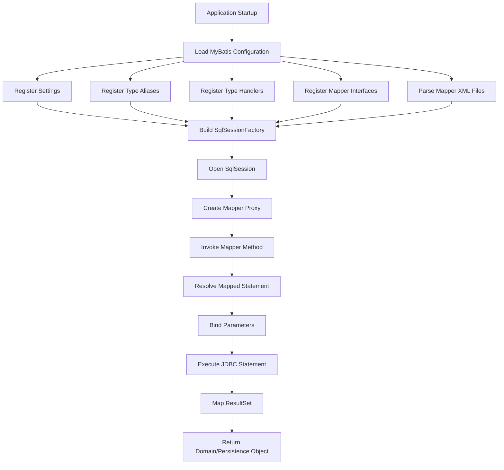
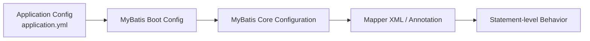
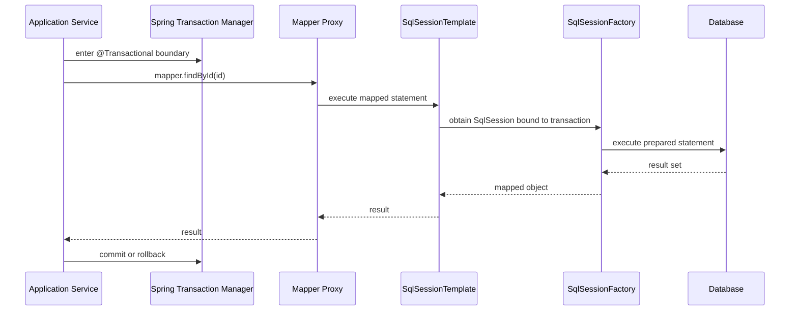

------
title: Learn Java MyBatis - Part 003
description: Production-grade MyBatis project structure, configuration model, runtime lifecycle, mapper loading, and configuration governance for large Java systems.
series: learn-java-mybatis
seriesTitle: Learn Java MyBatis, Patterns, Anti-Patterns, and Production Persistence Mapping
order: 3
partTitle: Project Structure, Configuration, and Runtime Model
tags:
  - java
  - mybatis
  - persistence
  - sql
  - configuration
  - architecture
  - production
  - kaufman
  - series
date: 2026-06-27
---

# Part 003 — Project Structure, Configuration, and Runtime Model

## Target Skill

Setelah part ini, kamu harus bisa membaca atau mendesain struktur project MyBatis production-grade tanpa tersesat di detail incidental.

Kita tidak sedang belajar “cara bikin query jalan”. Kita sedang membangun kemampuan untuk menjawab pertanyaan arsitektural berikut:

- Di mana mapper interface harus hidup?
- Di mana XML mapper harus hidup?
- Apa yang boleh masuk ke configuration dan apa yang tidak?
- Kapan memakai XML, annotation, atau hybrid?
- Bagaimana runtime MyBatis membangun `SqlSessionFactory`, `SqlSession`, dan mapper proxy?
- Bagaimana mencegah configuration drift di large codebase?
- Bagaimana mendesain layout yang tetap maintainable saat jumlah mapper tumbuh dari 5 menjadi 500?

MyBatis terlihat sederhana karena ia tidak memaksa kita masuk ke object graph ORM. Tetapi kesederhanaan itu bisa berubah menjadi chaos jika project structure, mapper boundary, dan configuration governance tidak didesain sejak awal.

Official MyBatis documentation menyatakan bahwa setiap aplikasi MyBatis berpusat pada `SqlSessionFactory`; factory ini biasanya dibangun oleh `SqlSessionFactoryBuilder` dari XML configuration atau `Configuration` object. MyBatis configuration sendiri memiliki elemen seperti `properties`, `settings`, `typeAliases`, `typeHandlers`, `environments`, dan `mappers`. Itu berarti configuration bukan file kosmetik; ia mempengaruhi runtime behavior secara langsung.

References:

- https://mybatis.org/mybatis-3/getting-started.html
- https://mybatis.org/mybatis-3/configuration.html
- https://mybatis.org/mybatis-3/java-api.html
- https://mybatis.org/spring/
- https://mybatis.org/spring-boot-starter/mybatis-spring-boot-autoconfigure/

---

## Kaufman Deconstruction

Dalam framework Josh Kaufman, skill ini perlu didekomposisi menjadi unit kecil agar bisa dilatih cepat dan benar.

| Sub-skill | Pertanyaan Latihan | Failure Jika Salah |
|---|---|---|
| Project layout | “Di mana file ini seharusnya berada?” | Mapper tersebar, sulit ditemukan, sulit di-review |
| Runtime model | “Siapa membuat siapa?” | Salah asumsi lifecycle, session leak, transaction mismatch |
| Configuration scope | “Setting ini global atau local?” | Behavior berubah diam-diam lintas mapper |
| Mapper loading | “Bagaimana interface terhubung ke XML?” | Runtime error saat startup atau query path salah |
| XML vs annotation | “SQL ini butuh readability atau locality?” | SQL panjang sulit dipelihara, refactor risk tinggi |
| Spring integration | “Siapa mengontrol transaction?” | Double transaction management, session misuse |
| Governance | “Bagaimana mencegah drift?” | Setiap team punya style sendiri, knowledge tidak scalable |

Skill utama part ini bukan menghafal property MyBatis. Skill utamanya adalah **membangun peta runtime dan ownership**.

---

## Mental Model: MyBatis Runtime in One Picture



Dari diagram ini, ada beberapa invariant penting:

1. `SqlSessionFactory` adalah object mahal yang dibuat sekali per datasource/environment.
2. `SqlSession` adalah unit kerja yang lebih pendek umur hidupnya.
3. Mapper interface bukan implementasi manual; runtime membuat proxy.
4. Mapper method harus cocok dengan mapped statement identity.
5. XML mapper bukan file dokumentasi; ia bagian dari runtime registry.
6. Type handler dan setting global bisa mempengaruhi banyak mapper sekaligus.

Jika kamu memahami diagram ini, banyak error MyBatis langsung terlihat sebagai kategori masalah:

- Startup error → mapper tidak terdaftar, XML tidak ditemukan, statement id salah, duplicate id.
- Runtime binding error → parameter name/shape tidak cocok.
- Mapping error → column alias, resultMap, typeHandler, constructor mapping, atau nullability salah.
- Transaction issue → session lifecycle tidak mengikuti boundary Spring/application.

---

## Recommended Production Project Structure

Untuk aplikasi enterprise besar, struktur project harus membuat tiga hal jelas:

1. **Business module ownership**
2. **Mapper contract ownership**
3. **SQL artifact ownership**

Contoh struktur Spring Boot + MyBatis yang scalable:

```text
src/main/java
└── com.example.enforcement
    ├── casefile
    │   ├── application
    │   │   ├── CaseCommandService.java
    │   │   └── CaseQueryService.java
    │   ├── domain
    │   │   ├── CaseFile.java
    │   │   ├── CaseStatus.java
    │   │   └── CaseTransition.java
    │   ├── persistence
    │   │   ├── CaseFileMapper.java
    │   │   ├── CaseSearchMapper.java
    │   │   ├── CaseAuditMapper.java
    │   │   ├── CaseFileRow.java
    │   │   ├── CaseSearchRow.java
    │   │   ├── CaseSummaryProjection.java
    │   │   └── CaseMapperConfig.java
    │   └── api
    │       └── CaseController.java
    ├── party
    │   └── ...
    ├── evidence
    │   └── ...
    └── shared
        ├── persistence
        │   ├── typehandler
        │   │   ├── CaseStatusTypeHandler.java
        │   │   ├── JsonNodeTypeHandler.java
        │   │   └── InstantUtcTypeHandler.java
        │   ├── pagination
        │   │   ├── PageRequest.java
        │   │   └── SortSpec.java
        │   └── tenant
        │       └── TenantId.java
        └── error
            └── PersistenceExceptionTranslator.java

src/main/resources
└── mybatis
    ├── mybatis-config.xml
    ├── mappers
    │   ├── casefile
    │   │   ├── CaseFileMapper.xml
    │   │   ├── CaseSearchMapper.xml
    │   │   └── CaseAuditMapper.xml
    │   ├── party
    │   │   └── PartyMapper.xml
    │   └── evidence
    │       └── EvidenceMapper.xml
    └── sql-fragments
        ├── TenantFragments.xml
        └── AuditFragments.xml
```

### Why This Structure Works

| Area | Rule | Reason |
|---|---|---|
| `domain` | Tidak bergantung pada mapper | Domain tetap bersih dari persistence mechanics |
| `application` | Memakai repository/gateway, bukan SQL detail | Use case mengontrol transaction dan orchestration |
| `persistence` | Berisi mapper interface, row model, projection | Semua detail relational terkonsentrasi |
| `resources/mybatis/mappers/<module>` | XML mengikuti module | Reviewer bisa mencari SQL berdasarkan bounded context |
| `shared/persistence/typehandler` | Hanya reusable infrastructure | Type conversion global dikelola eksplisit |

Struktur ini tidak wajib sama persis, tetapi invariant-nya wajib dijaga:

> SQL ownership harus bisa ditemukan dari business capability, bukan dari nama tabel saja.

Untuk sistem regulatory case management, query sering mengikuti workflow: queue, SLA, assignment, escalation, audit trail. Jika mapper hanya dikelompokkan berdasarkan table, query yang secara bisnis satu use case akan tersebar di banyak tempat.

---

## Alternative Layouts and When to Use Them

### Layout A — Mapper per Aggregate

```text
casefile/persistence
├── CaseFileMapper.java
├── CaseFileMapper.xml
├── CaseFileRow.java
└── CaseFileProjection.java
```

Cocok jika:

- sistem domain-driven cukup kuat,
- query mostly mengikuti aggregate boundary,
- tidak terlalu banyak reporting/search query kompleks.

Risiko:

- aggregate mapper bisa menjadi terlalu besar,
- read query dan command query tercampur,
- dashboard/reporting mulai mengotori mapper utama.

### Layout B — Mapper per Use Case / Read Model

```text
casefile/persistence
├── CaseCommandMapper.java
├── CaseCommandMapper.xml
├── CaseSearchMapper.java
├── CaseSearchMapper.xml
├── CaseQueueMapper.java
├── CaseQueueMapper.xml
├── CaseAuditMapper.java
└── CaseAuditMapper.xml
```

Cocok jika:

- aplikasi punya banyak screen query,
- read model berbeda dari write model,
- query perlu dioptimasi per workflow,
- auditability penting.

Risiko:

- jumlah mapper bertambah,
- perlu naming discipline,
- reusable fragment harus dikontrol agar tidak menjadi hidden coupling.

### Layout C — Mapper per Table

```text
persistence
├── CaseTableMapper.java
├── PartyTableMapper.java
└── EvidenceTableMapper.java
```

Cocok jika:

- aplikasi kecil,
- CRUD sederhana,
- data model hampir sama dengan UI/API.

Tidak cocok untuk:

- complex case management,
- enforcement lifecycle,
- multi-tenant regulatory systems,
- workflow-heavy applications.

Mapper per table sering membuat service layer melakukan manual join mental model. Itu biasanya smell: SQL design dipaksa mengikuti storage layout, bukan use case.

---

## Configuration Layers

Ada tiga layer configuration yang perlu dibedakan.



### 1. Application Configuration

Biasanya `application.yml` / `application.properties`.

Contoh:

```yaml
mybatis:
  mapper-locations: classpath*:mybatis/mappers/**/*.xml
  type-aliases-package: com.example.enforcement
  type-handlers-package: com.example.enforcement.shared.persistence.typehandler
  configuration:
    map-underscore-to-camel-case: true
    default-fetch-size: 100
    default-statement-timeout: 30
```

Gunakan untuk configuration yang environment-aware dan aman diekspos sebagai deploy-time setting.

### 2. MyBatis Core Configuration

`mybatis-config.xml` atau Java configuration.

Contoh:

```xml
<?xml version="1.0" encoding="UTF-8" ?>
<!DOCTYPE configuration
  PUBLIC "-//mybatis.org//DTD Config 3.0//EN"
  "https://mybatis.org/dtd/mybatis-3-config.dtd">
<configuration>
  <settings>
    <setting name="mapUnderscoreToCamelCase" value="true"/>
    <setting name="defaultStatementTimeout" value="30"/>
  </settings>

  <typeAliases>
    <package name="com.example.enforcement.casefile.persistence"/>
  </typeAliases>

  <typeHandlers>
    <package name="com.example.enforcement.shared.persistence.typehandler"/>
  </typeHandlers>

  <mappers>
    <mapper resource="mybatis/mappers/casefile/CaseFileMapper.xml"/>
  </mappers>
</configuration>
```

Pakai XML configuration jika kamu butuh visibility eksplisit dan ingin mengontrol behavior MyBatis secara deklaratif.

### 3. Statement-Level Configuration

Ini hidup di mapper XML:

```xml
<select id="findCaseSummaryById"
        parameterType="long"
        resultMap="CaseSummaryMap"
        timeout="10"
        fetchSize="50"
        useCache="false">
  select
    c.id,
    c.case_number,
    c.status,
    c.created_at
  from case_file c
  where c.id = #{id}
</select>
```

Statement-level setting cocok untuk behavior spesifik query. Jangan pindahkan semua behavior ke global config jika hanya satu query yang butuh.

---

## Configuration Governance Rules

### Rule 1 — Global Settings Must Be Rare

Global setting mempengaruhi semua mapper. Semakin besar codebase, semakin mahal mengubahnya.

Contoh setting yang harus diputuskan sejak awal:

| Setting | Dampak |
|---|---|
| `mapUnderscoreToCamelCase` | Mempengaruhi automatic mapping column ke property |
| `defaultStatementTimeout` | Mempengaruhi query timeout default |
| `defaultFetchSize` | Mempengaruhi streaming/fetch behavior driver-dependent |
| `localCacheScope` | Mempengaruhi first-level cache behavior |
| `autoMappingBehavior` | Mempengaruhi seberapa agresif automatic result mapping |

Rule praktis:

> Jika perubahan setting global bisa mengubah hasil query tanpa mengubah SQL, setting itu harus dianggap architectural decision.

### Rule 2 — Type Aliases Are for Readability, Not Obscurity

Type alias membantu XML lebih singkat:

```xml
<select id="findById" resultType="CaseFileRow">
  select * from case_file where id = #{id}
</select>
```

Tetapi alias yang terlalu generik membuat XML sulit dipahami:

```xml
<select id="findById" resultType="Row">
  select * from case_file where id = #{id}
</select>
```

Gunakan nama eksplisit seperti:

- `CaseFileRow`
- `CaseSummaryProjection`
- `CaseQueueItemRow`
- `EscalationCandidateRow`

Hindari alias seperti:

- `Entity`
- `Record`
- `Dto`
- `Result`
- `Data`

### Rule 3 — TypeHandlers Must Be Treated as Shared Infrastructure

Type handler bukan tempat business logic.

Baik:

```java
public final class CaseStatusTypeHandler extends BaseTypeHandler<CaseStatus> {
    @Override
    public void setNonNullParameter(
            PreparedStatement ps,
            int i,
            CaseStatus parameter,
            JdbcType jdbcType
    ) throws SQLException {
        ps.setString(i, parameter.code());
    }

    @Override
    public CaseStatus getNullableResult(ResultSet rs, String columnName) throws SQLException {
        String code = rs.getString(columnName);
        return code == null ? null : CaseStatus.fromCode(code);
    }

    @Override
    public CaseStatus getNullableResult(ResultSet rs, int columnIndex) throws SQLException {
        String code = rs.getString(columnIndex);
        return code == null ? null : CaseStatus.fromCode(code);
    }

    @Override
    public CaseStatus getNullableResult(CallableStatement cs, int columnIndex) throws SQLException {
        String code = cs.getString(columnIndex);
        return code == null ? null : CaseStatus.fromCode(code);
    }
}
```

Buruk:

```java
public final class CaseStatusTypeHandler extends BaseTypeHandler<CaseStatus> {
    // Bad: contacts external service, checks user permissions, logs audit event,
    // or applies workflow transition rules while converting a database value.
}
```

Type handler harus deterministik, local, cepat, dan side-effect free.

### Rule 4 — Mapper Registration Must Be Deterministic

Jangan bergantung pada “semoga classpath scanning ketemu”.

Untuk Spring Boot, pattern umum:

```java
@Configuration
@MapperScan(
    basePackages = "com.example.enforcement",
    annotationClass = Mapper.class
)
public class MyBatisMapperConfiguration {
}
```

Lalu tandai mapper:

```java
@Mapper
public interface CaseFileMapper {
    CaseFileRow findById(long id);
}
```

Atau gunakan package khusus:

```java
@MapperScan("com.example.enforcement.casefile.persistence")
```

Prinsipnya:

> Startup harus gagal cepat jika mapper tidak valid.

Jika aplikasi bisa startup tetapi query baru gagal saat endpoint dipanggil pertama kali, governance mapper registration masih lemah.

---

## XML Mapper Placement

Ada dua strategi umum.

### Strategy 1 — XML Co-located by Classpath Package

```text
src/main/java/com/example/casefile/persistence/CaseFileMapper.java
src/main/resources/com/example/casefile/persistence/CaseFileMapper.xml
```

Kelebihan:

- interface dan XML terlihat berpasangan,
- MyBatis-Spring dapat menemukan XML yang berada pada classpath location yang sama dengan interface dalam beberapa konfigurasi,
- cocok untuk module kecil.

Kekurangan:

- resources mengikuti package Java yang dalam,
- query sulit dicari jika reviewer lebih sering melihat SQL folder,
- shared SQL fragment bisa tersebar.

### Strategy 2 — Centralized `mybatis/mappers` by Module

```text
src/main/java/com/example/enforcement/casefile/persistence/CaseFileMapper.java
src/main/resources/mybatis/mappers/casefile/CaseFileMapper.xml
```

Kelebihan:

- semua SQL mudah dicari,
- cocok untuk DB review,
- cocok untuk large system dengan banyak mapper,
- memisahkan Java package layout dari SQL artifact layout.

Kekurangan:

- perlu `mapper-locations` eksplisit,
- interface/XML pairing harus dijaga lewat naming convention,
- bisa terjadi orphan XML jika tidak diuji saat startup.

Untuk seri ini, kita akan memakai Strategy 2 karena lebih cocok untuk internal engineering handbook dan large regulatory systems.

---

## Mapper XML Namespace Rule

Mapper XML harus punya namespace yang sama dengan fully qualified mapper interface.

```xml
<mapper namespace="com.example.enforcement.casefile.persistence.CaseFileMapper">

  <select id="findById" resultMap="CaseFileRowMap">
    select
      id,
      case_number,
      status,
      created_at
    from case_file
    where id = #{id}
  </select>

</mapper>
```

Interface:

```java
package com.example.enforcement.casefile.persistence;

public interface CaseFileMapper {
    CaseFileRow findById(long id);
}
```

Statement identity secara konseptual menjadi:

```text
com.example.enforcement.casefile.persistence.CaseFileMapper.findById
```

Ini sebabnya rename method atau namespace bukan refactor ringan. Keduanya mempengaruhi statement resolution.

---

## Runtime Lifecycle Without Spring

Untuk memahami MyBatis secara jernih, pahami dulu bentuk non-Spring.

```java
try (Reader reader = Resources.getResourceAsReader("mybatis/mybatis-config.xml")) {
    SqlSessionFactory factory = new SqlSessionFactoryBuilder().build(reader);

    try (SqlSession session = factory.openSession()) {
        CaseFileMapper mapper = session.getMapper(CaseFileMapper.class);
        CaseFileRow row = mapper.findById(1001L);
        session.commit();
    }
}
```

Mental model:

1. `SqlSessionFactoryBuilder` membaca config dan membuat factory.
2. `SqlSessionFactory` membuka session.
3. `SqlSession` menyediakan mapper proxy.
4. Mapper method dipanggil.
5. MyBatis menemukan mapped statement berdasarkan namespace + method id.
6. Parameter di-bind ke prepared statement.
7. ResultSet dipetakan ke object.
8. Session di-commit/rollback/close.

Di aplikasi modern, kamu jarang menulis ini langsung. Tetapi kamu tetap harus memahami lifecycle ini karena Spring integration membungkus lifecycle yang sama.

---

## Runtime Lifecycle With Spring



Dalam Spring, kamu tidak seharusnya membuka dan menutup `SqlSession` manual di service layer. MyBatis-Spring menyediakan integration agar MyBatis berpartisipasi dalam Spring transaction, membangun mapper/session, menginject mapper ke bean lain, dan menerjemahkan exception ke Spring `DataAccessException`.

Prinsip:

> Dalam Spring application, transaction boundary milik application service, bukan milik mapper.

Contoh:

```java
@Service
public class CaseAssignmentService {
    private final CaseFileMapper caseFileMapper;
    private final CaseAuditMapper caseAuditMapper;

    public CaseAssignmentService(
            CaseFileMapper caseFileMapper,
            CaseAuditMapper caseAuditMapper
    ) {
        this.caseFileMapper = caseFileMapper;
        this.caseAuditMapper = caseAuditMapper;
    }

    @Transactional
    public void assignCase(long caseId, long officerId, long actorId) {
        int updated = caseFileMapper.assignOfficer(caseId, officerId);
        if (updated != 1) {
            throw new ConcurrentCaseModificationException(caseId);
        }

        caseAuditMapper.insertAssignmentAudit(caseId, officerId, actorId);
    }
}
```

Mapper tidak commit. Mapper hanya menjalankan statement.

---

## XML vs Annotation vs Hybrid

### XML Mapper

Gunakan XML jika:

- query lebih dari trivial,
- query butuh resultMap,
- query butuh dynamic SQL,
- query perlu di-review DBA/platform team,
- query punya formatting penting,
- query akan berkembang.

Contoh:

```xml
<select id="searchCases" resultMap="CaseSearchRowMap">
  select
    c.id,
    c.case_number,
    c.status,
    c.priority,
    c.created_at,
    assigned.display_name as assigned_officer_name
  from case_file c
  left join officer assigned on assigned.id = c.assigned_officer_id
  <where>
    c.tenant_id = #{tenantId}
    <if test="status != null">
      and c.status = #{status}
    </if>
    <if test="createdFrom != null">
      and c.created_at &gt;= #{createdFrom}
    </if>
    <if test="createdTo != null">
      and c.created_at &lt; #{createdTo}
    </if>
  </where>
  order by c.created_at desc, c.id desc
</select>
```

### Annotation Mapper

Gunakan annotation jika:

- SQL sangat pendek,
- tidak ada dynamic SQL kompleks,
- tidak ada resultMap kompleks,
- locality lebih penting daripada SQL formatting.

Contoh:

```java
@Mapper
public interface CaseLookupMapper {
    @Select("""
        select exists (
          select 1
          from case_file
          where tenant_id = #{tenantId}
            and case_number = #{caseNumber}
        )
        """)
    boolean existsByCaseNumber(
            @Param("tenantId") String tenantId,
            @Param("caseNumber") String caseNumber
    );
}
```

### Hybrid Strategy

Praktis untuk large codebase:

| Query Type | Recommended Style |
|---|---|
| trivial existence check | annotation acceptable |
| complex search | XML |
| nested result mapping | XML |
| command update with guard | XML or annotation if short |
| generated CRUD | generated XML or generated mapper |
| dynamic filtering | XML or MyBatis Dynamic SQL |

Rule:

> Jika reviewer perlu memformat SQL secara mental, pindahkan ke XML.

---

## Configuration Drift

Configuration drift terjadi ketika bagian berbeda dari codebase menjalankan MyBatis dengan asumsi berbeda.

Contoh drift:

- Sebagian mapper mengandalkan `mapUnderscoreToCamelCase`, sebagian lain pakai explicit resultMap.
- Sebagian query menggunakan `resultType`, sebagian resultMap, tanpa rule.
- Ada type handler enum global, tetapi beberapa query override manual.
- Ada mapper annotation di package yang tidak tercakup scan.
- Ada XML fragment common yang dimodifikasi dan mempengaruhi banyak query.
- Ada timeout global, tetapi query reporting butuh timeout berbeda.

### Drift Prevention Checklist

```text
[ ] Ada satu dokumen configuration decision record.
[ ] Semua mapper XML location diatur eksplisit.
[ ] Mapper package scanning dibatasi dan deterministic.
[ ] Semua custom TypeHandler punya test.
[ ] Semua XML mapper divalidasi saat startup/test.
[ ] Query kompleks memakai resultMap eksplisit.
[ ] Tidak ada ${} tanpa whitelist.
[ ] Tidak ada mapper di package random.
[ ] Tidak ada global setting diubah tanpa migration note.
[ ] Tidak ada SQL fragment shared yang berubah tanpa impact analysis.
```

---

## Recommended Baseline Configuration

Untuk aplikasi enterprise baru, baseline berikut cukup aman sebagai titik awal.

```yaml
mybatis:
  mapper-locations: classpath*:mybatis/mappers/**/*.xml
  type-aliases-package: com.example.enforcement
  type-handlers-package: com.example.enforcement.shared.persistence.typehandler
  configuration:
    map-underscore-to-camel-case: true
    default-statement-timeout: 30
    auto-mapping-behavior: partial
    auto-mapping-unknown-column-behavior: warning
    local-cache-scope: statement
```

Penjelasan:

| Option | Rationale |
|---|---|
| `map-underscore-to-camel-case` | Menurunkan boilerplate untuk simple row mapping |
| `default-statement-timeout` | Fail-fast terhadap query menggantung |
| `auto-mapping-behavior: partial` | Mengurangi mapping otomatis terlalu agresif |
| `auto-mapping-unknown-column-behavior: warning` | Membantu deteksi alias/column drift |
| `local-cache-scope: statement` | Mengurangi surprise dari session-level local cache dalam service kompleks |

Catatan penting: baseline ini bukan dogma. Misalnya, `local-cache-scope: statement` bisa mengubah behavior caching first-level. Keputusan ini harus diuji terhadap pattern access aplikasi.

---

## Production Package Naming Convention

Gunakan suffix yang menjelaskan shape dan ownership.

| Suffix | Meaning | Example |
|---|---|---|
| `Mapper` | MyBatis mapper interface | `CaseFileMapper` |
| `Row` | Object yang dekat dengan table/result row | `CaseFileRow` |
| `Projection` | Query-specific read shape | `CaseSummaryProjection` |
| `Criteria` | Search/filter input | `CaseSearchCriteria` |
| `Command` | Write input object | `AssignCaseCommand` |
| `Record` | Hindari kecuali benar-benar Java record atau event record | `CaseAuditRecord` |
| `Entity` | Hindari jika bukan domain entity | `CaseEntity` is ambiguous |

Rule:

> Jangan memakai nama yang membuat persistence object terlihat seperti domain object jika invariant domain tidak dijamin oleh object itu.

Contoh buruk:

```java
public class CaseFile {
    public Long id;
    public String status;
    public String assignedOfficerId;
}
```

Jika object ini hanya hasil query tanpa invariant, jangan panggil `CaseFile` domain. Panggil `CaseFileRow` atau `CaseFileSnapshot`.

---

## Startup Validation Strategy

Production system harus gagal saat startup/test jika mapper rusak.

Minimal validation:

```java
@SpringBootTest
class MyBatisContextBootTest {
    @Autowired
    private ApplicationContext context;

    @Test
    void shouldLoadAllMappers() {
        assertThat(context.getBeansWithAnnotation(Mapper.class)).isNotEmpty();
    }
}
```

Lebih baik:

```java
@SpringBootTest
class MyBatisMappedStatementTest {
    @Autowired
    private SqlSessionFactory sqlSessionFactory;

    @Test
    void shouldRegisterExpectedStatements() {
        Configuration configuration = sqlSessionFactory.getConfiguration();

        assertThat(configuration.hasStatement(
            "com.example.enforcement.casefile.persistence.CaseFileMapper.findById"
        )).isTrue();
    }
}
```

Untuk large codebase, buat test yang memverifikasi:

- semua mapper interface punya XML jika policy XML-first,
- semua XML namespace menunjuk ke interface valid,
- semua statement id punya method terkait,
- tidak ada orphan XML,
- tidak ada duplicate statement id,
- semua custom type handler registered.

---

## Common Pitfalls

### Pitfall 1 — Treating MyBatis Like JPA Without ORM Features

MyBatis tidak melacak dirty checking, persistence context, lazy loading dengan model JPA yang sama, atau automatic relationship management. Jika kamu memakai MyBatis sambil berharap ia “mengurus object graph”, desainmu akan rapuh.

Fix: treat MyBatis as explicit SQL boundary.

### Pitfall 2 — Letting XML Become a Dumping Ground

XML bukan tempat semua hal. XML harus berisi SQL mapping, bukan business process.

Buruk:

```xml
<update id="approveCaseAndEscalateAndAssignAndMaybeClose">
  ...
</update>
```

Lebih baik:

- service mengorkestrasi use case,
- mapper menyediakan command kecil yang transactional,
- SQL tetap set-based dan guarded.

### Pitfall 3 — Global Type Alias Package Too Broad

Jika `type-aliases-package` menunjuk ke root application package, terlalu banyak class menjadi alias candidate.

Buruk:

```yaml
mybatis:
  type-aliases-package: com.example
```

Lebih baik:

```yaml
mybatis:
  type-aliases-package: com.example.enforcement.casefile.persistence,com.example.enforcement.party.persistence
```

Atau jangan gunakan alias untuk project yang sangat besar kecuali ada governance jelas.

### Pitfall 4 — Mixing Transaction Styles

Buruk:

```java
@Transactional
public void doWork() {
    try (SqlSession session = sqlSessionFactory.openSession()) {
        session.getMapper(CaseFileMapper.class).update(...);
        session.commit();
    }
}
```

Masalah:

- service sudah di bawah Spring transaction,
- manual session bisa tidak ikut transaction yang sama,
- commit manual memecah atomicity.

Fix: inject mapper dan biarkan Spring transaction mengontrol boundary.

---

## Engineering Review Checklist

Gunakan checklist ini saat review project MyBatis.

```text
Project Structure
[ ] Mapper interface berada di package persistence/infrastructure, bukan domain.
[ ] XML mapper location mengikuti module/business capability.
[ ] Row/projection object tidak disamarkan sebagai domain entity.
[ ] Shared type handler berada di shared persistence infrastructure.

Configuration
[ ] mapper-locations eksplisit.
[ ] mapper scanning deterministic.
[ ] global settings terdokumentasi.
[ ] type aliases tidak terlalu broad.
[ ] type handlers punya unit/integration test.

Runtime
[ ] Service tidak membuka SqlSession manual saat memakai Spring.
[ ] Transaction boundary berada di application service.
[ ] Mapper tidak melakukan commit/rollback.
[ ] Startup/test memvalidasi mapped statements.

Maintainability
[ ] Query kompleks memakai XML.
[ ] Annotation hanya untuk SQL pendek dan stabil.
[ ] XML namespace cocok dengan mapper interface.
[ ] Tidak ada orphan XML atau mapper tanpa test.
```

---

## Deliberate Practice

### Exercise 1 — Classify Mapper Layout

Ambil 10 query dari aplikasi yang pernah kamu bangun. Kelompokkan ke:

- per table,
- per aggregate,
- per read model,
- per workflow.

Tentukan layout mana yang paling stabil jika jumlah query menjadi 10x.

### Exercise 2 — Build Runtime Map

Gambar runtime map untuk aplikasi MyBatis-mu sendiri:

- siapa membuat `DataSource`,
- siapa membuat `SqlSessionFactory`,
- siapa membuat mapper proxy,
- siapa membuka transaction,
- siapa commit/rollback.

Jika kamu tidak bisa menggambar ini, kamu belum siap debug production incident MyBatis.

### Exercise 3 — Configuration Drift Audit

Cari semua tempat yang mengatur:

- mapper locations,
- type aliases,
- type handlers,
- `mapUnderscoreToCamelCase`,
- transaction manager,
- datasource.

Buat satu halaman “MyBatis Configuration Decision Record”.

---

## Part Summary

MyBatis project structure yang baik bukan tentang folder yang terlihat rapi. Ia tentang membuat runtime behavior, ownership, dan failure mode menjadi eksplisit.

Prinsip utama:

1. `SqlSessionFactory` adalah pusat runtime MyBatis.
2. Mapper interface dan XML harus punya hubungan deterministic.
3. Configuration global harus diperlakukan sebagai architectural decision.
4. Dalam Spring, transaction boundary ada di application service.
5. XML cocok untuk SQL kompleks; annotation cocok untuk SQL pendek dan stabil.
6. TypeHandler adalah infrastructure, bukan business logic.
7. Large codebase membutuhkan startup validation dan governance.

Setelah part ini, kamu harus bisa melihat project MyBatis dan menilai apakah ia akan tetap sehat saat jumlah mapper, query, dan team bertambah.
