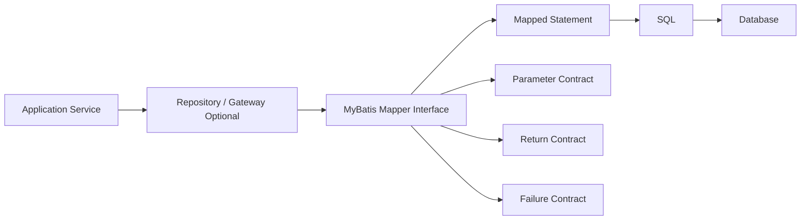

------
title: Learn Java MyBatis - Part 004
description: Advanced mapper contract design for MyBatis: method semantics, return types, parameter objects, command-query separation, mapper granularity, naming, stability, and review rules.
series: learn-java-mybatis
seriesTitle: Learn Java MyBatis, Patterns, Anti-Patterns, and Production Persistence Mapping
order: 4
partTitle: Mapper Contract Design
tags:
  - java
  - mybatis
  - persistence
  - mapper
  - contract-design
  - sql
  - architecture
  - kaufman
  - series
date: 2026-06-27
---

# Part 004 — Mapper Contract Design

## Target Skill

Mapper interface adalah salah satu titik paling penting dalam aplikasi MyBatis. Ia terlihat seperti interface kecil, tetapi secara arsitektural ia adalah contract antara application code dan SQL execution.

Setelah part ini, kamu harus bisa mendesain mapper contract yang:

- jelas secara semantic,
- stabil terhadap perubahan schema,
- aman untuk transaction orchestration,
- mudah diuji,
- mudah di-review,
- tidak membocorkan detail SQL ke domain,
- tidak berubah menjadi god object,
- mendukung read/write model yang berbeda,
- cocok untuk production debugging.

MyBatis memungkinkan mapper interface digunakan sebagai proxy untuk menjalankan mapped statement. Dalam XML mapper, statement seperti `select`, `insert`, `update`, dan `delete` berada di bawah namespace mapper, dan `id` statement biasanya berkorespondensi dengan method mapper. Ini membuat mapper method bukan sekadar Java method; ia adalah public API menuju SQL statement tertentu.

References:

- https://mybatis.org/mybatis-3/sqlmap-xml.html
- https://mybatis.org/mybatis-3/java-api.html
- https://mybatis.org/mybatis-3/getting-started.html
- https://mybatis.org/spring/mappers.html

---

## Kaufman Deconstruction

Skill mapper contract design bisa dipecah menjadi beberapa sub-skill.

| Sub-skill | Pertanyaan Utama | Output yang Diinginkan |
|---|---|---|
| Naming semantics | “Apa maksud method ini tanpa melihat SQL?” | Method name jelas dan tidak ambigu |
| Parameter shape | “Input ini stabil atau incidental?” | Parameter object untuk query kompleks |
| Return type | “Apa arti tidak ada result?” | `Optional`, nullable, list, count, affected rows tepat |
| Command/query split | “Method ini membaca atau mengubah state?” | Mapper tidak mencampur semantics |
| Granularity | “Mapper ini milik aggregate, workflow, atau read model?” | Mapper tidak menjadi god object |
| Failure contract | “Bagaimana caller tahu update gagal?” | affected row count dan exception policy jelas |
| Evolution | “Bisakah schema berubah tanpa merusak caller?” | Projection dan row model menjaga boundary |

Tujuan part ini bukan membuat mapper “cantik”. Tujuannya adalah membuat mapper menjadi **kontrak persistence yang defensible**.

---

## Mapper Interface as a Boundary

Mapper berada di boundary antara Java application dan database.



Ada tiga contract dalam setiap mapper method:

1. **Parameter contract** — data apa yang dibutuhkan query.
2. **Return contract** — bentuk dan arti hasil query.
3. **Failure contract** — bagaimana caller mengetahui query gagal secara business/consistency.

Contoh method kecil:

```java
Optional<CaseFileRow> findById(@Param("tenantId") TenantId tenantId,
                               @Param("caseId") long caseId);
```

Kontraknya:

- tenant wajib ada,
- case id wajib ada,
- result bisa kosong,
- result adalah persistence row, bukan domain aggregate,
- method tidak mengubah state.

Contoh method command:

```java
int transitionStatus(TransitionCaseStatusCommand command);
```

Kontraknya:

- command membawa semua predicate update,
- return value adalah affected row count,
- caller wajib mengecek `updated == 1`,
- method mengubah state,
- transaction boundary berada di service.

---

## Bad Mapper Contract Example

```java
public interface CaseMapper {
    Case get(Long id);

    List<Case> search(String q, String s, String f, String t, Integer p, Integer z);

    void save(Case c);

    void update(Case c);

    void process(Case c);
}
```

Masalah:

| Method | Problem |
|---|---|
| `get` | Tidak jelas bisa null atau tidak; tidak tenant-aware |
| `search` | Parameter tidak punya semantic; mudah salah urutan |
| `save` | Tidak jelas insert atau upsert |
| `update` | Tidak jelas full update, partial update, atau guarded update |
| `process` | Business workflow bocor ke mapper |
| `Case` | Apakah domain object, row object, DTO, atau projection? |

Mapper seperti ini akan menyulitkan debugging. Ia juga membuat caller harus tahu terlalu banyak detail implisit.

---

## Good Mapper Contract Example

```java
@Mapper
public interface CaseFileCommandMapper {

    int insertCaseFile(InsertCaseFileCommand command);

    int assignOfficer(AssignOfficerCommand command);

    int transitionStatus(TransitionCaseStatusCommand command);

    int markAsEscalationCandidate(MarkEscalationCandidateCommand command);
}
```

```java
@Mapper
public interface CaseFileQueryMapper {

    Optional<CaseFileSnapshotRow> findSnapshotById(FindCaseByIdQuery query);

    List<CaseQueueItemProjection> findAssignmentQueue(CaseQueueCriteria criteria);

    List<CaseSearchProjection> searchCases(CaseSearchCriteria criteria);

    int countCases(CaseSearchCriteria criteria);
}
```

Lebih baik karena:

- command dan query dipisah,
- method name menjelaskan intent,
- parameter object memberi semantic,
- return type menjelaskan absence dan cardinality,
- projection dibedakan dari row/domain,
- affected row count digunakan untuk guarded write.

---

## Naming Convention

Nama method mapper harus menjawab empat hal:

1. Operasi apa?
2. Target data apa?
3. Kriteria apa yang penting?
4. Return shape apa?

### Query Method Naming

| Pattern | Example | Meaning |
|---|---|---|
| `findXByY` | `findSnapshotById` | Returns zero or one rich row/projection |
| `getXByY` | Avoid unless guaranteed | Often ambiguous; can imply must exist |
| `listXByY` | `listEvidenceByCaseId` | Returns list with bounded known relation |
| `searchX` | `searchCases` | User/filter-driven query |
| `countX` | `countCases` | Count query matching same criteria |
| `existsX` | `existsOpenCaseByNumber` | Boolean existence check |
| `findTopX` | `findTopEscalationCandidates` | Bounded prioritized query |
| `findNextX` | `findNextQueueItemForAssignment` | Queue-like acquisition query |

Recommended query examples:

```java
Optional<CaseFileSnapshotRow> findSnapshotById(FindCaseByIdQuery query);

List<CaseQueueItemProjection> findOpenCasesForOfficerQueue(OfficerQueueCriteria criteria);

boolean existsActiveCaseNumber(ExistsCaseNumberQuery query);

int countCases(CaseSearchCriteria criteria);
```

Avoid:

```java
CaseFileSnapshotRow get(Long id);

List<CaseFileSnapshotRow> query(Map<String, Object> params);

List<CaseFileSnapshotRow> list(String status, String from, String to, String user);
```

### Command Method Naming

| Pattern | Example | Meaning |
|---|---|---|
| `insertX` | `insertCaseFile` | Creates new row |
| `updateX` | `updateCaseSummary` | General update; use carefully |
| `patchX` | `patchCaseMetadata` | Partial update |
| `transitionX` | `transitionStatus` | State transition with guard |
| `assignX` | `assignOfficer` | Specific command |
| `markX` | `markAsEscalationCandidate` | Flag/status mutation |
| `deleteX` | `deleteDraftCase` | Physical delete; should be rare |
| `softDeleteX` | `softDeleteCase` | Soft delete |
| `archiveX` | `archiveClosedCase` | Lifecycle mutation |

Recommended command examples:

```java
int transitionStatus(TransitionCaseStatusCommand command);

int assignOfficer(AssignOfficerCommand command);

int softDeleteDraftCase(SoftDeleteDraftCaseCommand command);

int insertAuditEvent(InsertAuditEventCommand command);
```

Avoid:

```java
void save(CaseFile caseFile);

void process(CaseFile caseFile);

void updateStatus(Long id, String status);

void doUpdate(Map<String, Object> params);
```

---

## Return Type Design

Return type is part of the contract. It must encode cardinality and failure semantics.

### Query Return Types

| Scenario | Recommended Return | Reason |
|---|---|---|
| zero or one row | `Optional<T>` | Absence explicit |
| exactly one row | `T` plus service-level not-found handling | Use only if caller enforces existence |
| many rows | `List<T>` | Simple and predictable |
| paged query | `List<T>` + separate count, or `PageSlice<T>` at service layer | Avoid hiding expensive count |
| existence | `boolean` | Avoid fetching unnecessary row |
| count | `int` or `long` | Use `long` for large tables |
| scalar | domain value type | Example `CaseStatus`, `Instant`, `MoneyAmount` |

Example:

```java
Optional<CaseFileSnapshotRow> findSnapshotById(FindCaseByIdQuery query);

List<CaseSearchProjection> searchCases(CaseSearchCriteria criteria);

long countCases(CaseSearchCriteria criteria);

boolean existsOpenCaseForSubject(ExistsOpenCaseQuery query);
```

### Command Return Types

| Scenario | Recommended Return | Reason |
|---|---|---|
| guarded update | `int` affected rows | Caller can detect concurrent modification |
| insert generated key | command mutated with key, or return key wrapper | Depends on key generation strategy |
| audit insert | `int` or generated id | Need observability and testability |
| bulk update | `int` affected rows | Important for reconciliation |
| delete | `int` affected rows | Avoid pretending delete always worked |

Prefer:

```java
int transitionStatus(TransitionCaseStatusCommand command);
```

Service:

```java
@Transactional
public void approveCase(ApproveCaseRequest request) {
    int updated = caseCommandMapper.transitionStatus(
        TransitionCaseStatusCommand.approve(
            request.tenantId(),
            request.caseId(),
            CaseStatus.UNDER_REVIEW,
            CaseStatus.APPROVED,
            request.actorId(),
            request.expectedVersion()
        )
    );

    if (updated != 1) {
        throw new CaseTransitionConflictException(request.caseId());
    }
}
```

Avoid:

```java
void transitionStatus(...);
```

`void` throws away consistency information.

---

## Parameter Contract Design

### Rule 1 — Use `@Param` for Simple Multi-Parameter Methods

Acceptable for small query:

```java
Optional<CaseFileRow> findById(
    @Param("tenantId") TenantId tenantId,
    @Param("caseId") long caseId
);
```

Bad:

```java
Optional<CaseFileRow> findById(TenantId tenantId, long caseId);
```

Without explicit parameter names, mapper XML can become fragile depending on compilation metadata and parameter naming behavior.

### Rule 2 — Use Parameter Object for Complex Query

Bad:

```java
List<CaseSearchProjection> searchCases(
    TenantId tenantId,
    String caseNumber,
    String status,
    Instant createdFrom,
    Instant createdTo,
    Long assignedOfficerId,
    Integer priority,
    int limit,
    int offset
);
```

Good:

```java
List<CaseSearchProjection> searchCases(CaseSearchCriteria criteria);
```

```java
public record CaseSearchCriteria(
    TenantId tenantId,
    String caseNumber,
    CaseStatus status,
    Instant createdFrom,
    Instant createdTo,
    Long assignedOfficerId,
    Integer priority,
    int limit,
    int offset,
    SortSpec sort
) {
    public CaseSearchCriteria {
        Objects.requireNonNull(tenantId, "tenantId must not be null");
        if (limit <= 0 || limit > 500) {
            throw new IllegalArgumentException("limit must be between 1 and 500");
        }
        if (offset < 0) {
            throw new IllegalArgumentException("offset must not be negative");
        }
    }
}
```

Parameter object memberi tempat untuk:

- validation,
- normalization,
- defaulting,
- whitelisting sort,
- tenant enforcement,
- naming semantic,
- future-compatible evolution.

### Rule 3 — Do Not Use Raw Map for Production Mapper Contract

Bad:

```java
List<CaseSearchProjection> searchCases(Map<String, Object> params);
```

Masalah:

- tidak type-safe,
- tidak discoverable,
- typo jadi runtime bug,
- tidak ada validation,
- sulit di-refactor,
- SQL injection risk lebih tinggi jika dipakai untuk dynamic identifiers.

Map hanya masuk akal untuk infrastructure-level generic mapper yang sangat terbatas dan heavily tested. Untuk business mapper, hindari.

---

## Command Object Design

Command object untuk write operation harus membawa predicate dan audit metadata.

```java
public record TransitionCaseStatusCommand(
    TenantId tenantId,
    long caseId,
    CaseStatus expectedStatus,
    CaseStatus nextStatus,
    long expectedVersion,
    long actorId,
    Instant changedAt
) {
    public TransitionCaseStatusCommand {
        Objects.requireNonNull(tenantId);
        Objects.requireNonNull(expectedStatus);
        Objects.requireNonNull(nextStatus);
        Objects.requireNonNull(changedAt);

        if (caseId <= 0) {
            throw new IllegalArgumentException("caseId must be positive");
        }
        if (expectedVersion < 0) {
            throw new IllegalArgumentException("expectedVersion must not be negative");
        }
    }
}
```

Mapper XML:

```xml
<update id="transitionStatus">
  update case_file
  set
    status = #{nextStatus},
    version = version + 1,
    updated_by = #{actorId},
    updated_at = #{changedAt}
  where tenant_id = #{tenantId}
    and id = #{caseId}
    and status = #{expectedStatus}
    and version = #{expectedVersion}
</update>
```

Service:

```java
int updated = caseFileCommandMapper.transitionStatus(command);
if (updated != 1) {
    throw new CaseTransitionConflictException(command.caseId());
}
```

This is one of the most important production MyBatis patterns:

> Encode business consistency as SQL predicate; expose success/failure as affected row count.

---

## Command-Query Separation

A mapper method should either read state or mutate state. Avoid method names that do both unless intentionally modeling database-specific `RETURNING` behavior.

### Recommended Split

```java
public interface CaseFileQueryMapper {
    Optional<CaseFileSnapshotRow> findSnapshotById(FindCaseByIdQuery query);
    List<CaseQueueItemProjection> findQueueItems(CaseQueueCriteria criteria);
}
```

```java
public interface CaseFileCommandMapper {
    int insertCaseFile(InsertCaseFileCommand command);
    int transitionStatus(TransitionCaseStatusCommand command);
}
```

### Why Split?

- Read mappers often optimize for projection.
- Command mappers optimize for consistency predicates.
- Read query review and write query review are different activities.
- Caching behavior differs.
- Transaction expectations differ.
- Observability metrics differ.

### Exception: Returning Mutations

Some databases support returning rows from `insert`, `update`, or `delete`. MyBatis documentation notes that when DML returns a result set, it is mapped as a `select` statement with attributes like `affectData="true"` in modern MyBatis versions.

Use intentionally:

```xml
<select id="insertCaseAndReturnSnapshot"
        resultMap="CaseFileSnapshotMap"
        affectData="true"
        flushCache="true">
  insert into case_file (
    tenant_id,
    case_number,
    status,
    created_by,
    created_at
  ) values (
    #{tenantId},
    #{caseNumber},
    #{status},
    #{actorId},
    #{createdAt}
  )
  returning id, case_number, status, created_at
</select>
```

But name it clearly. Do not hide mutation behind `find`.

---

## Mapper Granularity

Mapper granularity determines long-term maintainability.

### Option 1 — One Mapper per Table

```java
public interface CaseFileTableMapper {
    CaseFileRow findById(long id);
    int insert(CaseFileRow row);
    int update(CaseFileRow row);
    int delete(long id);
}
```

Good for:

- generated CRUD,
- small internal tools,
- stable table wrappers.

Bad for:

- workflow-heavy systems,
- complex read model,
- audit-heavy command,
- multi-tenant enforcement.

### Option 2 — One Mapper per Aggregate

```java
public interface CaseFileMapper {
    Optional<CaseFileSnapshotRow> findSnapshotById(FindCaseByIdQuery query);
    int insertCaseFile(InsertCaseFileCommand command);
    int transitionStatus(TransitionCaseStatusCommand command);
}
```

Good for:

- moderate domain modules,
- clear aggregate boundary,
- balanced read/write complexity.

Risk:

- can grow into god mapper.

### Option 3 — Mapper per Capability

```java
public interface CaseQueueMapper {
    List<CaseQueueItemProjection> findQueueItems(CaseQueueCriteria criteria);
    int claimNextCase(ClaimNextCaseCommand command);
}
```

Good for:

- workflow systems,
- assignment queues,
- SLA dashboards,
- escalation engines.

Risk:

- duplicate SQL fragments,
- too many tiny mappers if uncontrolled.

### Recommended Decision Matrix

| Context | Mapper Granularity |
|---|---|
| Simple CRUD admin | per table or generated mapper |
| Core aggregate command | per aggregate command mapper |
| Complex search screen | per read model mapper |
| Workflow queue | per capability mapper |
| Audit/reporting | dedicated audit/report mapper |
| Cross-module dashboard | dedicated projection mapper |

---

## Stable Contract, Flexible SQL

A good mapper hides SQL evolution from caller.

Caller should not care if SQL changes from:

```sql
select * from case_file where id = ?
```

to:

```sql
select
  c.id,
  c.case_number,
  c.status,
  p.display_name as primary_party_name,
  latest_event.occurred_at as last_event_at
from case_file c
left join party p on p.id = c.primary_party_id
left join lateral (
  select e.occurred_at
  from case_event e
  where e.case_id = c.id
  order by e.occurred_at desc
  limit 1
) latest_event on true
where c.id = ?
```

As long as contract remains:

```java
Optional<CaseFileSnapshotRow> findSnapshotById(FindCaseByIdQuery query);
```

This is why projection names matter. `CaseFileSnapshotRow` can evolve more safely than a generic `CaseFile` if it is explicitly a read snapshot.

---

## Mapper Contract and Domain Boundary

Avoid returning domain aggregate directly from mapper unless mapping fully enforces domain invariants.

Bad:

```java
CaseFile findById(long id);
```

Potential issue:

- object may be partially populated,
- invariant not checked,
- child collections incomplete,
- status transition rules not enforced,
- caller assumes domain object is valid.

Better:

```java
Optional<CaseFileSnapshotRow> findSnapshotById(FindCaseByIdQuery query);
```

Then assemble domain in repository/gateway if needed:

```java
@Repository
public class CaseFileRepository {
    private final CaseFileQueryMapper queryMapper;

    public Optional<CaseFile> findById(TenantId tenantId, long caseId) {
        return queryMapper.findSnapshotById(new FindCaseByIdQuery(tenantId, caseId))
            .map(row -> CaseFile.rehydrate(
                row.id(),
                row.caseNumber(),
                row.status(),
                row.version()
            ));
    }
}
```

Mapper returns persistence shape. Repository rehydrates domain shape.

---

## Error and Absence Semantics

### Absence Is Not Always Error

Case search returning empty list is normal:

```java
List<CaseSearchProjection> searchCases(CaseSearchCriteria criteria);
```

Find by ID may be absence:

```java
Optional<CaseFileSnapshotRow> findSnapshotById(FindCaseByIdQuery query);
```

But command update with 0 affected rows usually means conflict or invalid state:

```java
int transitionStatus(TransitionCaseStatusCommand command);
```

Service decides:

```java
if (updated == 0) {
    throw new CaseTransitionConflictException(...);
}
if (updated > 1) {
    throw new IllegalStateException("Expected one row to update, got " + updated);
}
```

### Use Exceptions for Technical Failure

Mapper method should not return magic values for technical errors.

Bad:

```java
int insertCaseFile(InsertCaseFileCommand command); // returns -1 on DB error
```

Good:

- DB error becomes exception,
- affected rows represent business/consistency result,
- service handles conflict explicitly.

---

## Pagination Contract

Bad pagination contract:

```java
List<CaseSearchProjection> search(String q, int page, int size);
```

Problems:

- page index ambiguous,
- no max size,
- no deterministic sort,
- no tenant predicate visible,
- caller may assume total count exists.

Better:

```java
public record CaseSearchCriteria(
    TenantId tenantId,
    String keyword,
    CaseStatus status,
    Instant createdFrom,
    Instant createdTo,
    PageLimit limit,
    Offset offset,
    CaseSort sort
) {}
```

```java
List<CaseSearchProjection> searchCases(CaseSearchCriteria criteria);
long countCases(CaseSearchCriteria criteria);
```

Rule:

> Do not hide count query behind mapper method unless caller explicitly needs total count.

Many UIs do not need exact total count. They only need “has next page”. Exact count on large filtered table can be expensive.

---

## Sorting Contract

Sorting is dangerous if implemented with `${}` directly.

Bad:

```java
List<CaseSearchProjection> searchCases(
    @Param("sortBy") String sortBy,
    @Param("direction") String direction
);
```

XML:

```xml
order by ${sortBy} ${direction}
```

This is injection-prone.

Better:

```java
public enum CaseSortField {
    CREATED_AT("c.created_at"),
    PRIORITY("c.priority"),
    CASE_NUMBER("c.case_number");

    private final String sqlExpression;

    CaseSortField(String sqlExpression) {
        this.sqlExpression = sqlExpression;
    }

    public String sqlExpression() {
        return sqlExpression;
    }
}
```

Then render only whitelisted values in a controlled provider/DSL layer, or use explicit XML branches:

```xml
<choose>
  <when test="sort.field.name() == 'CREATED_AT'">
    order by c.created_at
  </when>
  <when test="sort.field.name() == 'PRIORITY'">
    order by c.priority
  </when>
  <otherwise>
    order by c.id
  </otherwise>
</choose>
<choose>
  <when test="sort.direction.name() == 'ASC'">asc</when>
  <otherwise>desc</otherwise>
</choose>
```

We will discuss parameter binding and SQL injection in more depth in Part 007. For now, mapper contract rule is simple:

> Dynamic identifiers must enter mapper through whitelisted domain types, not raw strings.

---

## Mapper Interface Examples

### Case Command Mapper

```java
@Mapper
public interface CaseFileCommandMapper {

    int insertCaseFile(InsertCaseFileCommand command);

    int transitionStatus(TransitionCaseStatusCommand command);

    int assignOfficer(AssignOfficerCommand command);

    int updatePriority(UpdateCasePriorityCommand command);

    int softDeleteDraftCase(SoftDeleteDraftCaseCommand command);
}
```

### Case Query Mapper

```java
@Mapper
public interface CaseFileQueryMapper {

    Optional<CaseFileSnapshotRow> findSnapshotById(FindCaseByIdQuery query);

    Optional<CaseLifecycleStateRow> findLifecycleState(FindCaseByIdQuery query);

    List<CaseSearchProjection> searchCases(CaseSearchCriteria criteria);

    long countCases(CaseSearchCriteria criteria);

    boolean existsActiveCaseNumber(ExistsCaseNumberQuery query);
}
```

### Queue Mapper

```java
@Mapper
public interface AssignmentQueueMapper {

    List<AssignmentQueueItemProjection> findQueueItems(AssignmentQueueCriteria criteria);

    int claimCase(ClaimCaseCommand command);

    int releaseExpiredClaims(ReleaseExpiredClaimsCommand command);
}
```

Notice that the mapper names describe operational capability, not only table names.

---

## XML Pairing Example

Interface:

```java
package com.example.enforcement.casefile.persistence;

@Mapper
public interface CaseFileCommandMapper {
    int transitionStatus(TransitionCaseStatusCommand command);
}
```

XML:

```xml
<mapper namespace="com.example.enforcement.casefile.persistence.CaseFileCommandMapper">

  <update id="transitionStatus">
    update case_file
    set
      status = #{nextStatus},
      version = version + 1,
      updated_by = #{actorId},
      updated_at = #{changedAt}
    where tenant_id = #{tenantId}
      and id = #{caseId}
      and status = #{expectedStatus}
      and version = #{expectedVersion}
  </update>

</mapper>
```

Contract alignment:

| Java | XML |
|---|---|
| interface FQCN | mapper namespace |
| method name | statement id |
| command properties | `#{...}` bindings |
| return `int` | affected row count |

If one side changes, test should fail.

---

## Avoiding God Mapper

God mapper smell:

```java
public interface CaseMapper {
    // create/update/delete
    // search
    // dashboard
    // queue
    // audit
    // party joins
    // evidence joins
    // reporting
    // admin backdoor
    // migration helpers
}
```

Symptoms:

- XML file > 1000 lines,
- mapper has unrelated methods,
- multiple teams edit same mapper constantly,
- merge conflicts frequent,
- SQL fragments reused without clear ownership,
- no one knows safe impact of change.

Refactoring pattern:

```text
CaseMapper
├── CaseFileCommandMapper
├── CaseFileQueryMapper
├── CaseSearchMapper
├── AssignmentQueueMapper
├── CaseAuditMapper
└── CaseReportingMapper
```

Split by operational reason, not arbitrary line count.

---

## Review Heuristics

A mapper method should be rejected in review if:

```text
[ ] Method name does not reveal business/data intent.
[ ] Method has more than 3 scalar parameters and no clear reason.
[ ] Method accepts Map<String, Object>.
[ ] Write method returns void.
[ ] Method name hides mutation behind query-like naming.
[ ] Query method returns domain aggregate without rehydration boundary.
[ ] Dynamic sort/filter accepts raw string.
[ ] Tenant/security predicate is not visible in parameter object.
[ ] Method mixes unrelated use cases.
[ ] Projection/row name is generic or misleading.
[ ] Caller cannot distinguish not-found, conflict, and technical failure.
```

---

## Mapper Contract Decision Record

For large teams, define policy explicitly.

Example:

```md
# Mapper Contract Policy

## General
- Mapper interfaces live under `<module>.persistence`.
- XML mapper files live under `resources/mybatis/mappers/<module>`.
- XML namespace must match mapper interface FQCN.
- Statement id must match mapper method name.

## Query Methods
- Use `Optional<T>` for zero-or-one query.
- Use `List<T>` for multi-row query.
- Use `boolean` for existence query.
- Use `long` for large count query.
- Search methods must accept criteria object.

## Command Methods
- Write methods must return affected row count unless returning generated key/result is intentional.
- Guarded updates must include tenant id and version/status predicate where applicable.
- Mapper does not commit/rollback.

## Parameter Objects
- Query criteria and command objects must validate limit, offset, tenant id, and whitelisted sort.
- Raw `Map<String, Object>` is forbidden in business mapper.

## Domain Boundary
- Mapper should return row/projection objects.
- Domain aggregate rehydration happens in repository/gateway.
```

---

## Deliberate Practice

### Exercise 1 — Rename Bad Mapper Methods

Refactor this mapper:

```java
public interface CaseMapper {
    Case get(Long id);
    List<Case> find(String q, String status, int page, int size);
    void save(Case c);
    void updateStatus(Long id, String status);
    void delete(Long id);
}
```

Target result:

- separate query/command mapper,
- explicit parameter object,
- no `void` write method,
- explicit return cardinality,
- tenant-aware query.

### Exercise 2 — Add Consistency Guard

Given status update:

```java
void updateStatus(long caseId, String status);
```

Refactor into:

- command object,
- expected current status,
- expected version,
- affected row count,
- service-level conflict exception.

### Exercise 3 — Search Criteria Audit

Design `CaseSearchCriteria` for:

- tenant id,
- status,
- assigned officer,
- created date range,
- keyword,
- priority,
- deterministic sort,
- page limit,
- offset.

Then write the mapper method signature only. Do not write SQL yet. This trains contract-first design.

---

## Part Summary

Mapper contract design determines whether MyBatis stays simple or becomes a hidden liability.

Core principles:

1. Mapper method is a public contract to SQL behavior.
2. Parameter object is better than long scalar parameter lists.
3. Query and command semantics should be separated.
4. Write methods should usually return affected row count.
5. `Optional<T>` makes absence explicit for zero-or-one query.
6. Raw `Map<String, Object>` is a production smell.
7. Dynamic identifiers must be whitelisted before reaching SQL.
8. Mapper should usually return row/projection object, not domain aggregate.
9. Mapper granularity should follow operational capability.
10. God mapper is an architectural smell, not just a file-size issue.

After this part, kamu harus bisa melihat sebuah mapper interface dan menilai apakah ia stabil sebagai contract production, atau hanya wrapper tipis yang akan menyebarkan ambiguity ke seluruh service layer.
