------
title: Learn Java MyBatis - Part 005
description: Deep dive into MyBatis XML mapper files, mapped statements, namespaces, SQL fragments, parameter binding, generated keys, XML maintainability, and production review rules.
series: learn-java-mybatis
seriesTitle: Learn Java MyBatis, Patterns, Anti-Patterns, and Production Persistence Mapping
order: 5
partTitle: XML Mapper Deep Dive
tags:
  - java
  - mybatis
  - persistence
  - sql
  - mapper-xml
  - architecture
date: 2026-06-27
---

# Part 005 — XML Mapper Deep Dive

## Learning Goal

Setelah part ini, kita ingin bisa membaca, menulis, mereview, dan merawat file XML mapper MyBatis seperti seorang engineer yang bertanggung jawab atas sistem production, bukan hanya sebagai tempat menaruh query.

Fokusnya bukan menghafal semua tag. Fokusnya adalah membangun mental model bahwa **XML mapper adalah kontrak eksekusi SQL yang stabil, terukur, dan bisa diaudit**.

MyBatis mapper XML adalah tempat utama mapped statement didefinisikan. Dokumentasi resmi MyBatis menjelaskan bahwa kekuatan utama MyBatis berada pada mapped statements, dan file mapper XML memiliki elemen utama seperti `cache`, `cache-ref`, `resultMap`, `sql`, `insert`, `update`, `delete`, dan `select`.

Referensi resmi:

- https://mybatis.org/mybatis-3/sqlmap-xml.html
- https://mybatis.org/mybatis-3/configuration.html
- https://mybatis.org/mybatis-3/java-api.html

---

## 1. Deconstructing the Skill

Untuk menguasai XML mapper, skill-nya perlu dipecah menjadi beberapa kemampuan kecil:

| Skill | Yang Harus Dikuasai |
|---|---|
| Statement identity | Memahami hubungan namespace + statement id + mapper method |
| Statement shape | Membedakan `select`, `insert`, `update`, `delete`, dan efeknya ke cache/transaction |
| Parameter binding | Memakai `#{}` dengan aman dan menghindari `${}` kecuali untuk identifier yang di-whitelist |
| Result mapping | Memilih `resultType` atau `resultMap` berdasarkan kompleksitas output |
| SQL reuse | Menggunakan `<sql>` dan `<include>` tanpa menciptakan fragment chaos |
| Key handling | Mengelola generated key, `selectKey`, dan database-specific behavior |
| XML readability | Membuat query panjang tetap bisa direview dan dipelihara |
| Production safety | Menjamin query aman dari injection, full scan, stale cache, dan silent mapping bug |

Dalam praktik, XML mapper yang buruk jarang gagal saat compile. Ia gagal lewat data salah, query lambat, hasil tidak lengkap, mapping diam-diam `null`, atau business rule yang bocor ke SQL tanpa test.

---

## 2. Mental Model: XML Mapper as Executable SQL Contract

Mapper XML bukan sekadar file konfigurasi. Ia adalah contract layer antara Java method dan database statement.

```mermaid
flowchart LR
    Service[Application Service] --> Repo[Repository / Gateway]
    Repo --> Mapper[Mapper Interface]
    Mapper --> Proxy[MyBatis Mapper Proxy]
    Proxy --> Statement[Mapped Statement]
    Statement --> SQL[SQL in XML]
    SQL --> DB[(Database)]
    DB --> ResultSet[ResultSet]
    ResultSet --> Mapping[Result Mapping]
    Mapping --> Object[Java Object / Projection]
```



Satu method mapper sebaiknya bisa dijelaskan dengan kalimat berikut:

> Untuk kebutuhan bisnis X, mapper method Y mengeksekusi SQL statement Z, menerima parameter P, mengembalikan bentuk data R, dan memiliki konsekuensi cache/transaction C.

Jika kalimat itu tidak jelas, mapper sedang tumbuh menjadi area rawan.

---

## 3. Anatomy of a Mapper XML

Contoh minimal:

```xml
<?xml version="1.0" encoding="UTF-8" ?>
<!DOCTYPE mapper
  PUBLIC "-//mybatis.org//DTD Mapper 3.0//EN"
  "https://mybatis.org/dtd/mybatis-3-mapper.dtd">

<mapper namespace="com.acme.casework.persistence.mapper.CaseMapper">

  <select id="findById" parameterType="long" resultType="com.acme.casework.persistence.dto.CaseRow">
    select
      c.id,
      c.case_number as caseNumber,
      c.status,
      c.created_at as createdAt
    from regulatory_case c
    where c.id = #{id}
  </select>

</mapper>
```

Bagian penting:

| Bagian | Peran |
|---|---|
| `DOCTYPE` | Mengikat file ke DTD mapper MyBatis agar struktur XML valid |
| `mapper namespace` | Biasanya FQCN dari mapper interface |
| `select id` | Nama statement; biasanya sama dengan method mapper |
| `parameterType` | Tipe parameter input; sering bisa di-infer, tapi eksplisit membantu pembaca |
| `resultType` | Tipe output sederhana jika mapping langsung cukup |
| SQL body | SQL aktual yang akan dikirim ke database |

Untuk codebase besar, namespace harus diperlakukan sebagai package boundary. Jangan asal copy-paste statement antar namespace tanpa alasan arsitektural.

---

## 4. Namespace Semantics

Namespace adalah bagian dari identity mapped statement.

Jika namespace adalah:

```xml
<mapper namespace="com.acme.casework.persistence.mapper.CaseMapper">
```

Dan statement id adalah:

```xml
<select id="findById">
```

Maka statement identity-nya secara konseptual adalah:

```text
com.acme.casework.persistence.mapper.CaseMapper.findById
```

Pada mapper interface:

```java
package com.acme.casework.persistence.mapper;

public interface CaseMapper {
    CaseRow findById(long id);
}
```

MyBatis mapper proxy mencocokkan method interface ke mapped statement berdasarkan namespace dan id.

### Rule

Gunakan namespace = fully qualified mapper interface name.

Benar:

```xml
<mapper namespace="com.acme.casework.persistence.mapper.CaseMapper">
```

Buruk:

```xml
<mapper namespace="CaseMapper">
```

Buruk karena:

- collision risk lebih tinggi
- navigasi IDE lebih lemah
- statement identity kurang eksplisit
- refactor package menjadi lebih rawan
- sulit diaudit di observability/logging

---

## 5. Statement Types

MyBatis mapper XML mendefinisikan empat statement command utama:

| Tag | Kegunaan | Return Java Umum |
|---|---|---|
| `<select>` | Membaca data | object, `Optional`, `List`, `Cursor`, map |
| `<insert>` | Menambah data | affected row count atau void; generated key bisa diisi ke parameter object |
| `<update>` | Mengubah data | affected row count |
| `<delete>` | Menghapus data | affected row count |

Secara engineering, jangan hanya melihat tag-nya. Lihat **semantik bisnisnya**.

Misalnya `select ... for update` secara SQL adalah `select`, tetapi secara concurrency ia memiliki efek locking. Ia harus direview seperti command-side data access.

Contoh:

```xml
<select id="lockCaseForEscalation" parameterType="long" resultMap="CaseLockResultMap">
  select
    c.id,
    c.version,
    c.status
  from regulatory_case c
  where c.id = #{caseId}
  for update
</select>
```

Method seperti ini jangan diberi nama `findById`. Nama harus menunjukkan locking intent.

---

## 6. Select Statement Design

### 6.1 Basic Select

```xml
<select id="findSummaryById" parameterType="long" resultType="com.acme.casework.persistence.read.CaseSummaryRow">
  select
    c.id,
    c.case_number as caseNumber,
    c.status,
    c.severity,
    c.assigned_team_id as assignedTeamId,
    c.created_at as createdAt
  from regulatory_case c
  where c.id = #{caseId}
</select>
```

Good properties:

- column list eksplisit
- alias mengikuti Java property name
- table alias konsisten
- statement name menjelaskan bentuk output
- tidak memakai `select *`

### 6.2 Avoid `select *`

Hindari:

```xml
<select id="findById" resultType="CaseRow">
  select *
  from regulatory_case
  where id = #{id}
</select>
```

Masalah:

- mapping bisa berubah saat schema berubah
- transfer data berlebih
- field sensitif bisa ikut terbaca
- sulit melihat query contract dari file mapper
- hasil query lebih rentan terhadap ambiguous column ketika join ditambahkan

Dalam sistem regulatori atau case management, accidental column exposure bisa menjadi masalah audit dan privacy.

### 6.3 Deterministic Ordering

Untuk list query, selalu pastikan ordering deterministic.

Buruk:

```xml
<select id="searchOpenCases" resultType="CaseSearchRow">
  select c.id, c.case_number as caseNumber, c.created_at as createdAt
  from regulatory_case c
  where c.status = 'OPEN'
  limit #{limit} offset #{offset}
</select>
```

Lebih baik:

```xml
<select id="searchOpenCases" parameterType="CaseSearchCriteria" resultType="CaseSearchRow">
  select
    c.id,
    c.case_number as caseNumber,
    c.created_at as createdAt
  from regulatory_case c
  where c.status = 'OPEN'
  order by c.created_at desc, c.id desc
  limit #{limit}
  offset #{offset}
</select>
```

Tanpa ordering deterministic, halaman 1 dan halaman 2 bisa overlap atau kehilangan record ketika data berubah.

---

## 7. Insert Statement Design

### 7.1 Insert with Generated Key

```xml
<insert id="insertCase"
        parameterType="com.acme.casework.persistence.command.InsertCaseCommand"
        useGeneratedKeys="true"
        keyProperty="id"
        keyColumn="id">
  insert into regulatory_case (
    case_number,
    status,
    severity,
    assigned_team_id,
    created_at,
    updated_at
  ) values (
    #{caseNumber},
    #{status},
    #{severity},
    #{assignedTeamId},
    #{createdAt},
    #{updatedAt}
  )
</insert>
```

Java parameter object:

```java
public class InsertCaseCommand {
    private Long id;
    private String caseNumber;
    private String status;
    private String severity;
    private Long assignedTeamId;
    private Instant createdAt;
    private Instant updatedAt;

    // getters/setters
}
```

Setelah insert, MyBatis dapat mengisi `id` pada object jika database/driver mendukung generated keys dan konfigurasi tepat.

### 7.2 Generated Key Failure Modes

Perhatikan:

- `keyProperty` harus cocok dengan property Java
- `keyColumn` harus cocok dengan column database bila dibutuhkan
- beberapa database membutuhkan `selectKey`
- batch insert + generated keys bisa punya behavior berbeda antar driver
- jangan mengasumsikan generated key aman tanpa test database nyata

### 7.3 Insert Should Not Hide Defaults Accidentally

Jika database punya default value, pilih secara sadar:

```xml
<insert id="insertMinimalCase" parameterType="InsertMinimalCaseCommand">
  insert into regulatory_case (
    case_number,
    status,
    created_at
  ) values (
    #{caseNumber},
    #{status},
    #{createdAt}
  )
</insert>
```

Jangan memasukkan semua column hanya karena template generator menghasilkan semua field. Column yang dikirim aplikasi berarti aplikasi mengambil ownership atas nilai itu.

---

## 8. Update Statement Design

### 8.1 Affected Row Count Is a Consistency Signal

```xml
<update id="transitionStatus" parameterType="TransitionCaseStatusCommand">
  update regulatory_case
  set
    status = #{targetStatus},
    updated_at = #{updatedAt},
    version = version + 1
  where id = #{caseId}
    and status = #{expectedStatus}
    and version = #{expectedVersion}
</update>
```

Mapper method:

```java
int transitionStatus(TransitionCaseStatusCommand command);
```

Service:

```java
int updated = caseMapper.transitionStatus(command);
if (updated != 1) {
    throw new ConcurrentCaseModificationException(command.caseId());
}
```

Ini adalah pattern penting. Update statement bukan hanya command; affected row count adalah bukti apakah invariant terpenuhi.

### 8.2 Avoid Blind Update

Buruk:

```xml
<update id="updateCaseStatus">
  update regulatory_case
  set status = #{status}
  where id = #{caseId}
</update>
```

Masalah:

- tidak mencegah lost update
- tidak mengecek current status
- tidak mengecek version
- tidak memberi sinyal domain conflict
- rentan menimpa transisi valid dari actor lain

### 8.3 Explicit Column Ownership

Update sebaiknya hanya mengubah column yang memang owned oleh use case.

Buruk:

```xml
<update id="updateCase">
  update regulatory_case
  set
    case_number = #{caseNumber},
    status = #{status},
    severity = #{severity},
    assigned_team_id = #{assignedTeamId},
    updated_at = #{updatedAt}
  where id = #{id}
</update>
```

Lebih baik:

```xml
<update id="reassignCase" parameterType="ReassignCaseCommand">
  update regulatory_case
  set
    assigned_team_id = #{targetTeamId},
    updated_at = #{reassignedAt},
    version = version + 1
  where id = #{caseId}
    and version = #{expectedVersion}
</update>
```

Named command mapper membuat update intent jelas.

---

## 9. Delete Statement Design

Delete adalah operasi yang harus dibatasi secara eksplisit.

### 9.1 Hard Delete

```xml
<delete id="deleteDraftCase" parameterType="DeleteDraftCaseCommand">
  delete from regulatory_case
  where id = #{caseId}
    and status = 'DRAFT'
    and created_by = #{actorUserId}
</delete>
```

Hard delete sebaiknya hanya untuk data yang lifecycle-nya memang membolehkan penghapusan fisik.

### 9.2 Soft Delete

```xml
<update id="markCaseDeleted" parameterType="DeleteCaseCommand">
  update regulatory_case
  set
    deleted_at = #{deletedAt},
    deleted_by = #{actorUserId},
    version = version + 1
  where id = #{caseId}
    and deleted_at is null
    and version = #{expectedVersion}
</update>
```

Untuk domain yang memerlukan auditability, soft delete sering lebih cocok. Namun soft delete membawa konsekuensi: semua query aktif harus menyertakan predicate `deleted_at is null` atau menggunakan view/database policy.

### 9.3 Delete Without Guard Is a Critical Smell

Buruk:

```xml
<delete id="deleteByCaseNumber">
  delete from regulatory_case
  where case_number = #{caseNumber}
</delete>
```

Masalah:

- case number mungkin tidak immutable
- tidak ada actor constraint
- tidak ada lifecycle constraint
- tidak ada tenant constraint
- tidak ada version guard
- tidak ada audit trail

---

## 10. Parameter Binding

### 10.1 `#{}` Means Prepared Parameter

Gunakan `#{}` untuk value binding.

```xml
where c.status = #{status}
```

Secara konseptual, ini seperti placeholder pada prepared statement. Database menerima SQL dengan bind parameter, bukan string hasil konkatenasi value.

### 10.2 `${}` Means String Substitution

`${}` melakukan substitusi string langsung ke SQL.

Contoh berbahaya:

```xml
order by ${sortColumn} ${sortDirection}
```

Jika input tidak dikontrol, ini membuka ruang SQL injection.

### 10.3 Safe Identifier Interpolation Pattern

Kadang kita memang perlu dynamic identifier, misalnya sorting column. Pattern aman: whitelist di Java, bukan percaya raw input.

```java
public enum CaseSortField {
    CREATED_AT("c.created_at"),
    SEVERITY("c.severity"),
    CASE_NUMBER("c.case_number");

    private final String sqlExpression;

    CaseSortField(String sqlExpression) {
        this.sqlExpression = sqlExpression;
    }

    public String sqlExpression() {
        return sqlExpression;
    }
}
```

Criteria:

```java
public record CaseSearchCriteria(
    String status,
    CaseSortField sortField,
    SortDirection sortDirection,
    int limit,
    int offset
) {
    public String orderByExpression() {
        return sortField.sqlExpression();
    }

    public String orderDirectionSql() {
        return sortDirection == SortDirection.ASC ? "asc" : "desc";
    }
}
```

Mapper:

```xml
<select id="searchCases" parameterType="CaseSearchCriteria" resultType="CaseSearchRow">
  select
    c.id,
    c.case_number as caseNumber,
    c.status,
    c.created_at as createdAt
  from regulatory_case c
  where c.status = #{status}
  order by ${orderByExpression} ${orderDirectionSql}, c.id desc
  limit #{limit}
  offset #{offset}
</select>
```

Ini masih menggunakan `${}`, tetapi source-nya bukan request raw string. Source-nya enum whitelist.

Rule:

> `${}` hanya boleh dipakai untuk SQL token yang tidak bisa di-bind sebagai value, dan token itu harus berasal dari whitelist internal.

---

## 11. Multiple Parameters and `@Param`

Mapper method:

```java
CaseRow findByTenantAndId(@Param("tenantId") long tenantId,
                          @Param("caseId") long caseId);
```

XML:

```xml
<select id="findByTenantAndId" resultType="CaseRow">
  select
    c.id,
    c.tenant_id as tenantId,
    c.case_number as caseNumber,
    c.status
  from regulatory_case c
  where c.tenant_id = #{tenantId}
    and c.id = #{caseId}
</select>
```

Untuk method dengan lebih dari satu parameter, gunakan `@Param` agar nama parameter eksplisit.

Namun untuk query kompleks, lebih baik gunakan parameter object:

```java
record FindCaseQuery(long tenantId, long caseId, boolean includeDeleted) {}
```

XML:

```xml
<select id="findCase" parameterType="FindCaseQuery" resultType="CaseRow">
  select
    c.id,
    c.tenant_id as tenantId,
    c.case_number as caseNumber,
    c.status
  from regulatory_case c
  where c.tenant_id = #{tenantId}
    and c.id = #{caseId}
    <if test="!includeDeleted">
      and c.deleted_at is null
    </if>
</select>
```

Parameter object unggul ketika:

- parameter lebih dari 2 atau 3
- ada validasi input
- ada pagination/sort/filter
- parameter akan dipakai lintas layer
- query punya semantic intent yang perlu diberi nama

---

## 12. Result Type vs Result Map

### 12.1 Use `resultType` for Flat Simple Rows

```xml
<select id="findCaseHeader" resultType="CaseHeaderRow">
  select
    c.id,
    c.case_number as caseNumber,
    c.status,
    c.severity
  from regulatory_case c
  where c.id = #{caseId}
</select>
```

Cocok jika:

- column alias cocok dengan property Java
- output flat
- tidak ada nested object
- tidak perlu constructor mapping eksplisit

### 12.2 Use `resultMap` for Explicit Mapping

```xml
<resultMap id="CaseHeaderResultMap" type="CaseHeaderRow">
  <id property="id" column="id" />
  <result property="caseNumber" column="case_number" />
  <result property="status" column="status" />
  <result property="severity" column="severity" />
</resultMap>

<select id="findCaseHeader" resultMap="CaseHeaderResultMap">
  select
    c.id,
    c.case_number,
    c.status,
    c.severity
  from regulatory_case c
  where c.id = #{caseId}
</select>
```

Cocok jika:

- column name tidak sama dengan property name
- join menghasilkan ambiguous column
- nested object dibutuhkan
- constructor mapping dibutuhkan
- hasil perlu dikontrol ketat

Rule praktis:

> Untuk read model penting, gunakan `resultMap` walaupun `resultType` bisa bekerja. Kejelasan mapping lebih penting daripada sedikit penghematan baris XML.

---

## 13. SQL Fragments

SQL fragment dipakai dengan `<sql>` dan `<include>`.

```xml
<sql id="CaseBaseColumns">
  c.id,
  c.tenant_id as tenantId,
  c.case_number as caseNumber,
  c.status,
  c.severity,
  c.created_at as createdAt,
  c.updated_at as updatedAt
</sql>

<select id="findById" resultType="CaseRow">
  select
    <include refid="CaseBaseColumns" />
  from regulatory_case c
  where c.id = #{caseId}
</select>
```

### 13.1 Good Uses of SQL Fragment

Gunakan fragment untuk:

- common column list
- common join block yang benar-benar stabil
- common tenant/deleted predicate jika governance-nya jelas
- vendor-specific expression yang dipakai konsisten

### 13.2 Bad Uses of SQL Fragment

Hindari fragment yang terlalu pintar:

```xml
<sql id="UniversalSearchWhereClause">
  <if test="tenantId != null">and tenant_id = #{tenantId}</if>
  <if test="status != null">and status = #{status}</if>
  <if test="severity != null">and severity = #{severity}</if>
  <if test="assignedTeamId != null">and assigned_team_id = #{assignedTeamId}</if>
  <if test="createdFrom != null">and created_at &gt;= #{createdFrom}</if>
  <if test="createdTo != null">and created_at &lt; #{createdTo}</if>
  <if test="keyword != null">and case_number like concat('%', #{keyword}, '%')</if>
</sql>
```

Masalah:

- fragment menjadi mini query builder tersembunyi
- query intent sulit dibaca
- predicate bisa dipakai di query yang index strategy-nya berbeda
- branch coverage sulit dijamin
- mudah muncul accidental full scan

Rule:

> Fragment boleh mengurangi duplikasi fisik, tetapi tidak boleh menghilangkan intent query.

---

## 14. Include Properties

MyBatis mendukung property pada include untuk membuat fragment lebih fleksibel.

```xml
<sql id="CaseColumnsWithAlias">
  ${alias}.id,
  ${alias}.case_number as caseNumber,
  ${alias}.status,
  ${alias}.severity
</sql>

<select id="findCase" resultType="CaseRow">
  select
    <include refid="CaseColumnsWithAlias">
      <property name="alias" value="c" />
    </include>
  from regulatory_case c
  where c.id = #{caseId}
</select>
```

Ini berguna, tetapi perlu disiplin. Karena `${alias}` adalah string substitution, value property harus internal dan statis, bukan berasal dari user input.

---

## 15. Statement Attributes That Matter

### 15.1 `parameterType`

Sering tidak wajib karena MyBatis bisa infer. Tetapi pada mapper XML besar, menulis `parameterType` bisa membantu readability.

```xml
<select id="searchCases" parameterType="CaseSearchCriteria" resultType="CaseSearchRow">
```

Jika memakai fully qualified class name terlalu panjang, gunakan type alias via configuration.

### 15.2 `resultType`

Dipakai untuk mapping sederhana.

```xml
resultType="CaseSearchRow"
```

### 15.3 `resultMap`

Dipakai untuk mapping eksplisit.

```xml
resultMap="CaseDetailResultMap"
```

Jangan gunakan `resultType` dan `resultMap` sekaligus.

### 15.4 `flushCache`

Umumnya insert/update/delete menyebabkan cache flush. Select biasanya tidak. Namun statement tertentu bisa diatur.

Review rule:

- command statement harus menyebabkan cache invalidation yang benar
- select yang memanggil stored procedure dengan side effect harus diperlakukan hati-hati
- jangan mengaktifkan cache tanpa memahami invalidation

### 15.5 `useCache`

Untuk select, `useCache` mengontrol penggunaan second-level cache jika cache namespace aktif.

Dalam sistem dengan data sering berubah atau harus selalu fresh, jangan mengaktifkan cache karena ingin query cepat. Perbaiki query/index dulu.

### 15.6 `timeout`

Statement timeout bisa menjadi guardrail untuk query mahal.

```xml
<select id="searchCases" timeout="5" resultType="CaseSearchRow">
```

Gunakan timeout sebagai safety net, bukan pengganti query design.

### 15.7 `fetchSize`

Fetch size dapat memberi hint ke driver untuk jumlah row yang diambil per roundtrip.

```xml
<select id="streamCasesForExport" fetchSize="1000" resultType="CaseExportRow">
```

Behavior bisa berbeda antar database/driver. Test dengan database nyata.

---

## 16. XML Escaping and CDATA

Karena XML, operator seperti `<` dan `>` perlu hati-hati.

```xml
where c.created_at &gt;= #{from}
  and c.created_at &lt; #{to}
```

Alternatif:

```xml
where c.created_at <![CDATA[ >= ]]> #{from}
  and c.created_at <![CDATA[ < ]]> #{to}
```

Gunakan CDATA secara selektif. Jangan membungkus seluruh query dengan CDATA karena dynamic tags tidak akan terbaca sebagai XML tags jika ditaruh di area yang salah.

---

## 17. XML Formatting Rules for Reviewability

### Recommended Style

```xml
<select id="searchCases" parameterType="CaseSearchCriteria" resultMap="CaseSearchResultMap">
  select
    c.id,
    c.case_number,
    c.status,
    c.severity,
    c.assigned_team_id,
    c.created_at
  from regulatory_case c
  left join team t
    on t.id = c.assigned_team_id
  where c.tenant_id = #{tenantId}
    and c.deleted_at is null
    <if test="status != null">
      and c.status = #{status}
    </if>
    <if test="severity != null">
      and c.severity = #{severity}
    </if>
  order by c.created_at desc, c.id desc
  limit #{limit}
  offset #{offset}
</select>
```

Rules:

- SQL keyword lowercase atau uppercase boleh, tapi konsisten
- satu column per line untuk query non-trivial
- table alias pendek dan konsisten
- join condition dekat dengan join
- predicate wajib berada sebelum dynamic optional predicate
- `order by` eksplisit
- pagination selalu bersama deterministic ordering
- hindari horizontal query panjang

---

## 18. Mapper XML Size Governance

Mapper XML yang terlalu besar adalah smell.

Threshold praktis:

| Ukuran | Interpretasi |
|---|---|
| < 300 lines | Umumnya aman |
| 300–700 lines | Perlu struktur jelas dan section comments |
| 700–1200 lines | Mulai review split boundary |
| > 1200 lines | Hampir pasti god mapper atau query ownership tidak jelas |

Cara split:

- per aggregate write mapper
- per read model mapper
- per workflow mapper
- per reporting mapper
- per maintenance/admin mapper

Jangan split berdasarkan “biar file kecil” saja. Split berdasarkan ownership.

---

## 19. Production Example: Case Search Mapper

### Mapper Interface

```java
public interface CaseSearchMapper {
    List<CaseSearchRow> search(CaseSearchCriteria criteria);
    int count(CaseSearchCriteria criteria);
}
```

### Criteria

```java
public record CaseSearchCriteria(
    long tenantId,
    String status,
    String severity,
    Long assignedTeamId,
    Instant createdFrom,
    Instant createdTo,
    int limit,
    int offset
) {}
```

### XML

```xml
<mapper namespace="com.acme.casework.persistence.mapper.CaseSearchMapper">

  <resultMap id="CaseSearchResultMap" type="CaseSearchRow">
    <id property="id" column="id" />
    <result property="caseNumber" column="case_number" />
    <result property="status" column="status" />
    <result property="severity" column="severity" />
    <result property="assignedTeamId" column="assigned_team_id" />
    <result property="createdAt" column="created_at" />
  </resultMap>

  <sql id="CaseSearchFromWhere">
    from regulatory_case c
    where c.tenant_id = #{tenantId}
      and c.deleted_at is null
      <if test="status != null">
        and c.status = #{status}
      </if>
      <if test="severity != null">
        and c.severity = #{severity}
      </if>
      <if test="assignedTeamId != null">
        and c.assigned_team_id = #{assignedTeamId}
      </if>
      <if test="createdFrom != null">
        and c.created_at &gt;= #{createdFrom}
      </if>
      <if test="createdTo != null">
        and c.created_at &lt; #{createdTo}
      </if>
  </sql>

  <select id="search" parameterType="CaseSearchCriteria" resultMap="CaseSearchResultMap">
    select
      c.id,
      c.case_number,
      c.status,
      c.severity,
      c.assigned_team_id,
      c.created_at
    <include refid="CaseSearchFromWhere" />
    order by c.created_at desc, c.id desc
    limit #{limit}
    offset #{offset}
  </select>

  <select id="count" parameterType="CaseSearchCriteria" resultType="int">
    select count(1)
    <include refid="CaseSearchFromWhere" />
  </select>

</mapper>
```

Good aspects:

- `search` dan `count` share same filter semantics
- tenant predicate wajib dan terlihat
- soft-delete predicate wajib dan terlihat
- query result columns eksplisit
- count query tidak membawa unnecessary order/pagination
- output mapping eksplisit

Risk yang tetap harus dites:

- semua dynamic branch
- kombinasi filter yang menyebabkan index miss
- `limit` dan `offset` validation
- result count consistency saat concurrent writes

---

## 20. XML Mapper Anti-Patterns

### 20.1 Business Workflow Hidden in SQL

Buruk:

```xml
<update id="autoEscalateEverything">
  update regulatory_case
  set status = 'ESCALATED'
  where severity = 'HIGH'
    and status in ('OPEN', 'UNDER_REVIEW')
    and created_at &lt; now() - interval '7 days'
</update>
```

Masalahnya bukan SQL-nya. Masalahnya adalah business workflow tidak jelas ownership-nya.

Lebih baik:

- service/use case menghitung policy decision atau memilih explicit command
- mapper mengeksekusi command yang sudah jelas
- SQL tetap boleh set-based, tetapi rule-nya dinamai dan dites

### 20.2 Universal Mapper

```java
public interface CommonMapper {
    List<Map<String, Object>> query(String sql);
    int update(String sql);
}
```

Ini menghapus semua benefit MyBatis:

- tidak ada mapped statement contract
- tidak ada parameter safety
- tidak ada result mapping
- tidak ada auditability
- tidak bisa direview dengan baik

### 20.3 Map Everything

```xml
<select id="findAnything" resultType="map">
  select * from regulatory_case where id = #{id}
</select>
```

`Map<String, Object>` boleh untuk use case tertentu seperti ad-hoc metadata atau generic report, tetapi buruk untuk contract yang stabil.

### 20.4 ResultMap Monster

ResultMap yang memetakan seluruh graph domain besar biasanya tanda mapper sedang mencoba menjadi ORM.

Jika resultMap berisi banyak `association` dan `collection`, tanyakan:

- apakah query ini benar-benar perlu full graph?
- apakah aggregate boundary terlalu besar?
- apakah read model lebih cocok?
- apakah join menghasilkan row explosion?
- apakah nested select menciptakan N+1?

### 20.5 SQL Fragment Labyrinth

Jika untuk memahami satu query kita harus melompat ke 8 fragment berbeda, readability sudah kalah dari reuse.

---

## 21. Review Checklist for XML Mapper

Gunakan checklist ini saat code review.

### Contract

- Apakah namespace cocok dengan mapper interface?
- Apakah statement id cocok dengan method name?
- Apakah nama method menjelaskan intent?
- Apakah return type sesuai cardinality?
- Apakah affected row count dicek untuk command penting?

### SQL Safety

- Apakah semua value memakai `#{}`?
- Apakah semua `${}` berasal dari whitelist internal?
- Apakah query list punya deterministic `order by`?
- Apakah pagination memiliki limit maksimum?
- Apakah tenant predicate wajib ada untuk multi-tenant data?
- Apakah soft-delete predicate konsisten?

### Mapping

- Apakah column list eksplisit?
- Apakah alias/property mapping jelas?
- Apakah join column ambiguous sudah diberi alias?
- Apakah `resultMap` dipakai untuk mapping kompleks?
- Apakah nullability database cocok dengan Java type?

### Performance

- Apakah query bisa memakai index?
- Apakah filter optional berisiko full scan?
- Apakah count query terlalu mahal?
- Apakah join menghasilkan row explosion?
- Apakah query returning terlalu banyak column?
- Apakah fetch size/streaming diperlukan?

### Operability

- Apakah statement mudah ditemukan dari log?
- Apakah timeout diperlukan?
- Apakah sensitive data tidak masuk log?
- Apakah query punya test integration?
- Apakah migration schema kompatibel dengan mapper?

---

## 22. Deliberate Practice

### Drill 1 — Refactor `select *`

Ambil query lama:

```xml
<select id="findById" resultType="CaseRow">
  select * from regulatory_case where id = #{id}
</select>
```

Refactor menjadi:

- column list eksplisit
- alias sesuai Java property
- tenant predicate jika multi-tenant
- soft-delete predicate jika berlaku
- resultMap jika mapping penting

### Drill 2 — Add Optimistic Guard

Ambil update ini:

```xml
<update id="updateStatus">
  update regulatory_case set status = #{status} where id = #{id}
</update>
```

Refactor agar:

- memakai expected version
- memakai expected status
- increment version
- return `int`
- service memvalidasi affected row count

### Drill 3 — Audit Dynamic Sorting

Cari semua `${}` dalam mapper XML. Klasifikasikan:

| Occurrence | Source | Aman? | Action |
|---|---|---|---|
| `${sortColumn}` | request string | tidak | ubah ke enum whitelist |
| `${alias}` | include property internal | ya | pastikan static |
| `${tableName}` | dynamic tenant | berbahaya | evaluasi routing/schema strategy |

---

## 23. Mental Model Summary

XML mapper yang baik memiliki ciri:

- SQL ownership jelas
- namespace merepresentasikan boundary
- statement id stabil dan bermakna
- parameter binding aman
- result mapping eksplisit saat dibutuhkan
- command statement menjaga consistency
- dynamic behavior dibatasi
- query mudah direview dan dites
- performance implication terlihat
- mapper tidak menyembunyikan business workflow

MyBatis memberi kebebasan besar karena tidak menyembunyikan SQL. Kebebasan itu harus dibayar dengan disiplin desain mapper.

---

## 24. What Comes Next

Part berikutnya membahas annotation mapper. Annotation mapper terlihat ringan dan cepat, tetapi di sistem besar bisa menjadi sumber SQL yang sulit dibaca, sulit direview, dan sulit dikelola jika dipakai tanpa batasan.

Kita akan membahas kapan annotation mapper tepat, kapan XML lebih baik, dan bagaimana memilih strategy yang tidak berubah menjadi maintenance trap.
