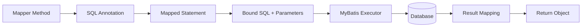
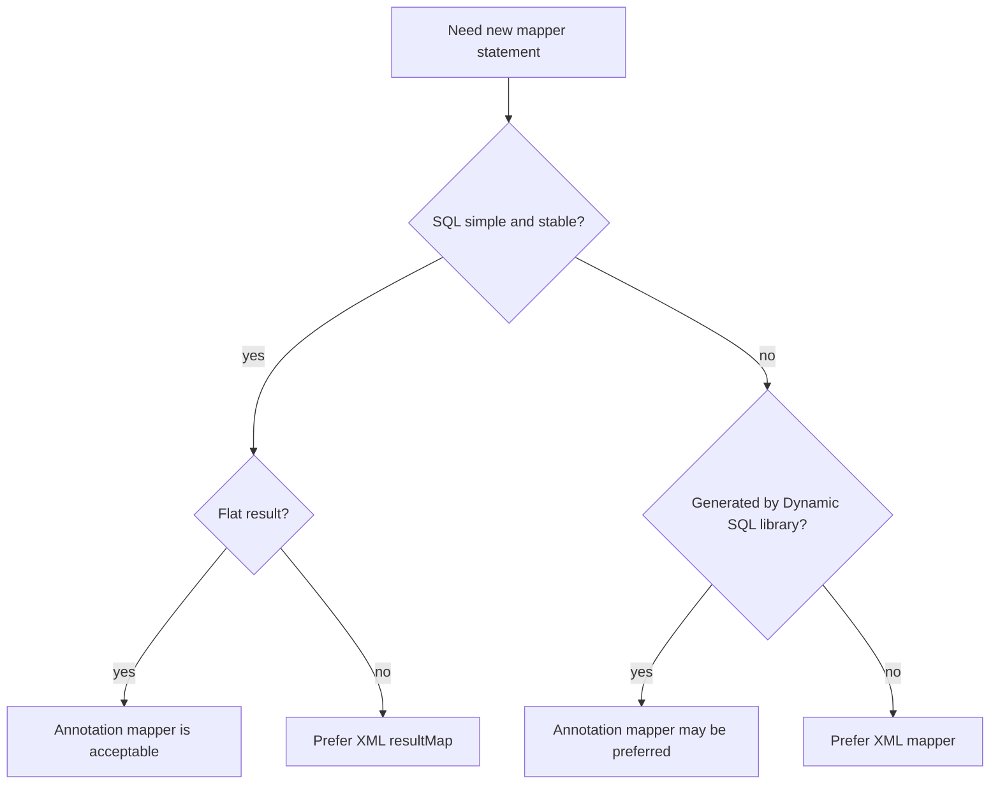
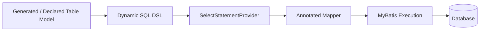

------
title: Learn Java MyBatis - Part 006
description: Deep dive into MyBatis annotation mappers, including @Select, @Insert, @Update, @Delete, provider annotations, result mappings, maintainability trade-offs, and production usage rules.
series: learn-java-mybatis
seriesTitle: Learn Java MyBatis, Patterns, Anti-Patterns, and Production Persistence Mapping
order: 6
partTitle: Annotation Mapper Deep Dive
tags:
  - java
  - mybatis
  - persistence
  - annotations
  - mapper
  - architecture
date: 2026-06-27
---

# Part 006 — Annotation Mapper Deep Dive

## Learning Goal

Setelah part ini, kita ingin bisa memakai MyBatis annotation mapper secara tepat: cepat untuk statement sederhana, tetap aman untuk production, dan tidak berubah menjadi kumpulan string SQL panjang yang sulit dipelihara.

Annotation mapper bukan pengganti universal untuk XML mapper. Ia adalah alat dengan trade-off yang berbeda.

Dokumentasi resmi MyBatis menyediakan annotation seperti `@Select`, `@Insert`, `@Update`, `@Delete`, `@Results`, `@Result`, `@ResultMap`, dan provider annotation seperti `@SelectProvider`. `@Select` secara resmi digunakan untuk menentukan SQL pengambilan record langsung di method mapper.

Referensi resmi:

- https://mybatis.org/mybatis-3/apidocs/org/apache/ibatis/annotations/Select.html
- https://mybatis.org/mybatis-3/apidocs/org/apache/ibatis/annotations/package-summary.html
- https://mybatis.org/mybatis-3/java-api.html
- https://mybatis.org/mybatis-dynamic-sql/docs/quickStart.html

---

## 1. Why Annotation Mappers Exist

Annotation mapper ada untuk mengurangi boilerplate ketika SQL sederhana dan dekat dengan method contract.

Contoh:

```java
public interface CaseLookupMapper {

    @Select("""
        select
          c.id,
          c.case_number as caseNumber,
          c.status
        from regulatory_case c
        where c.id = #{caseId}
        """)
    CaseLookupRow findById(long caseId);
}
```

Untuk query sederhana, annotation mapper punya keunggulan:

- mapper interface dan SQL berada di satu tempat
- navigasi lebih cepat
- tidak perlu sinkronisasi XML file
- cocok untuk simple lookup
- cocok untuk generated/dynamic SQL library tertentu
- review kecil bisa lebih cepat

Namun annotation mapper juga punya risiko:

- SQL panjang membuat Java interface sulit dibaca
- dynamic SQL kompleks menjadi awkward
- result mapping nested lebih terbatas
- reuse fragment tidak sekuat XML
- provider method bisa menyembunyikan SQL generation logic
- annotation bisa menggoda engineer memasukkan SQL tanpa governance

---

## 2. Mental Model: Annotation Mapper as Inline Statement Contract

Annotation mapper tetap mapped statement. Bedanya, SQL dideklarasikan inline pada Java method.



Karena SQL dekat dengan method, annotation mapper cocok ketika statement bisa dipahami dalam satu layar.

Rule awal:

> Jika SQL annotation tidak bisa dipahami tanpa scrolling panjang, pindahkan ke XML atau MyBatis Dynamic SQL dengan struktur yang jelas.

---

## 3. Basic Annotation Statements

### 3.1 `@Select`

```java
public interface CaseMapper {

    @Select("""
        select
          c.id,
          c.case_number as caseNumber,
          c.status,
          c.created_at as createdAt
        from regulatory_case c
        where c.id = #{caseId}
        """)
    CaseSummaryRow findSummaryById(long caseId);
}
```

Good use case:

- single-table lookup
- small projection
- simple where clause
- no dynamic branch
- no nested graph mapping

### 3.2 `@Insert`

```java
public interface CaseCommandMapper {

    @Insert("""
        insert into regulatory_case (
          case_number,
          status,
          severity,
          created_at,
          updated_at
        ) values (
          #{caseNumber},
          #{status},
          #{severity},
          #{createdAt},
          #{updatedAt}
        )
        """)
    @Options(useGeneratedKeys = true, keyProperty = "id", keyColumn = "id")
    int insertCase(InsertCaseCommand command);
}
```

`@Options` dapat dipakai untuk beberapa statement options seperti generated keys.

### 3.3 `@Update`

```java
public interface CaseCommandMapper {

    @Update("""
        update regulatory_case
        set
          status = #{targetStatus},
          updated_at = #{updatedAt},
          version = version + 1
        where id = #{caseId}
          and status = #{expectedStatus}
          and version = #{expectedVersion}
        """)
    int transitionStatus(TransitionCaseStatusCommand command);
}
```

Seperti XML, affected row count tetap menjadi consistency signal.

### 3.4 `@Delete`

```java
public interface DraftCaseMapper {

    @Delete("""
        delete from regulatory_case
        where id = #{caseId}
          and tenant_id = #{tenantId}
          and status = 'DRAFT'
        """)
    int deleteDraft(DeleteDraftCaseCommand command);
}
```

Hard delete tetap harus punya guard.

---

## 4. `@Param` and Parameter Naming

Jika method punya satu parameter object, MyBatis bisa mengakses property-nya langsung.

```java
@Select("""
    select c.id, c.status
    from regulatory_case c
    where c.id = #{caseId}
      and c.tenant_id = #{tenantId}
    """)
CaseRow findCase(FindCaseQuery query);
```

Jika method punya multiple scalar parameters, gunakan `@Param`.

```java
@Select("""
    select c.id, c.status
    from regulatory_case c
    where c.id = #{caseId}
      and c.tenant_id = #{tenantId}
    """)
CaseRow findCase(@Param("tenantId") long tenantId,
                 @Param("caseId") long caseId);
```

Tanpa `@Param`, nama parameter bisa bergantung pada compiler flag dan konfigurasi. Untuk mapper production, explicit parameter names lebih aman.

Rule:

> Untuk lebih dari satu parameter, gunakan `@Param`; untuk query kompleks, gunakan query/command object.

---

## 5. Result Mapping with Annotations

### 5.1 Simple Alias Mapping

Jika column alias sudah cocok dengan Java property, mapping bisa sederhana.

```java
@Select("""
    select
      c.id,
      c.case_number as caseNumber,
      c.created_at as createdAt
    from regulatory_case c
    where c.id = #{caseId}
    """)
CaseHeaderRow findHeader(long caseId);
```

### 5.2 `@Results` and `@Result`

```java
@Select("""
    select
      c.id,
      c.case_number,
      c.status,
      c.created_at
    from regulatory_case c
    where c.id = #{caseId}
    """)
@Results(id = "CaseHeaderResult", value = {
    @Result(property = "id", column = "id", id = true),
    @Result(property = "caseNumber", column = "case_number"),
    @Result(property = "status", column = "status"),
    @Result(property = "createdAt", column = "created_at")
})
CaseHeaderRow findHeader(long caseId);
```

Gunakan ini jika:

- column name tidak cocok dengan property
- alias tidak ingin dipakai di SQL
- mapping ingin eksplisit di Java
- result map ingin dipakai ulang via `@ResultMap`

### 5.3 Reusing `@ResultMap`

```java
@Select("""
    select
      c.id,
      c.case_number,
      c.status,
      c.created_at
    from regulatory_case c
    where c.status = #{status}
    order by c.created_at desc, c.id desc
    """)
@ResultMap("CaseHeaderResult")
List<CaseHeaderRow> findByStatus(String status);
```

Ini membantu, tetapi untuk mapping kompleks XML masih lebih readable.

---

## 6. Annotation Mapper vs XML Mapper

| Dimension | Annotation Mapper | XML Mapper |
|---|---|---|
| Simple lookup | Sangat cocok | Cocok |
| Long SQL | Kurang nyaman | Lebih nyaman |
| Dynamic SQL kompleks | Bisa, tapi mudah berantakan | Lebih kuat |
| ResultMap kompleks | Terbatas/readability turun | Lebih cocok |
| SQL review by DBA | Kurang nyaman | Lebih nyaman |
| Java navigability | Sangat baik | Perlu navigasi XML |
| Fragment reuse | Lemah | Kuat |
| Generated/dynamic SQL library | Sering cocok | Cocok tergantung library |
| Large enterprise governance | Harus dibatasi | Lebih mudah distandardisasi |

Decision rule:



---

## 7. Dynamic SQL in Annotations

MyBatis annotation can use `<script>` for dynamic SQL.

```java
@Select("""
    <script>
    select
      c.id,
      c.case_number as caseNumber,
      c.status,
      c.severity,
      c.created_at as createdAt
    from regulatory_case c
    where c.tenant_id = #{tenantId}
      and c.deleted_at is null
      <if test="status != null">
        and c.status = #{status}
      </if>
      <if test="severity != null">
        and c.severity = #{severity}
      </if>
    order by c.created_at desc, c.id desc
    limit #{limit}
    offset #{offset}
    </script>
    """)
List<CaseSearchRow> search(CaseSearchCriteria criteria);
```

Ini valid, tetapi perlu batasan.

### When It Is Acceptable

- dynamic branch sedikit
- query tetap muat satu layar
- tidak ada fragment reuse kompleks
- hasil flat
- test branch lengkap

### When It Becomes a Smell

- banyak `<if>`
- nested `<choose>`
- query lebih dari sekitar 30–40 baris
- banyak join
- perlu reuse fragment
- perlu resultMap kompleks
- perlu review SQL intensif

Pada titik itu, XML lebih tepat.

---

## 8. Provider Annotations

Provider annotation memindahkan pembuatan SQL ke method Java.

Contoh sederhana:

```java
public interface CaseSearchMapper {

    @SelectProvider(type = CaseSqlProvider.class, method = "searchCases")
    List<CaseSearchRow> search(CaseSearchCriteria criteria);
}
```

Provider:

```java
public final class CaseSqlProvider {

    public String searchCases(CaseSearchCriteria criteria) {
        return new SQL()
            .SELECT("c.id")
            .SELECT("c.case_number as caseNumber")
            .SELECT("c.status")
            .SELECT("c.created_at as createdAt")
            .FROM("regulatory_case c")
            .WHERE("c.tenant_id = #{tenantId}")
            .WHERE("c.deleted_at is null")
            .ORDER_BY("c.created_at desc", "c.id desc")
            .toString();
    }
}
```

Provider berguna ketika:

- SQL perlu dibuat secara programmatic
- ingin komposisi condition di Java
- annotation string akan terlalu rumit
- memakai SQL builder

Namun provider punya risiko besar: SQL menjadi tidak terlihat langsung di mapper.

### Provider Anti-Pattern

```java
public String searchCases(CaseSearchCriteria criteria) {
    StringBuilder sql = new StringBuilder("select * from regulatory_case where 1=1");

    if (criteria.status() != null) {
        sql.append(" and status = '").append(criteria.status()).append("'");
    }

    if (criteria.sort() != null) {
        sql.append(" order by ").append(criteria.sort());
    }

    return sql.toString();
}
```

Masalah:

- string concatenation value membuka injection
- sort raw string berbahaya
- `select *`
- condition sulit dites
- SQL final sulit diprediksi

Provider harus tetap menggunakan bind placeholder dan whitelist.

---

## 9. MyBatis SQL Builder Class

MyBatis menyediakan SQL builder class untuk membantu membangun SQL secara programmatic.

Contoh:

```java
public String findByStatus() {
    return new SQL()
        .SELECT("c.id")
        .SELECT("c.case_number as caseNumber")
        .SELECT("c.status")
        .FROM("regulatory_case c")
        .WHERE("c.tenant_id = #{tenantId}")
        .WHERE("c.status = #{status}")
        .ORDER_BY("c.created_at desc", "c.id desc")
        .toString();
}
```

SQL builder membantu menghindari beberapa masalah string concatenation, tetapi bukan silver bullet.

Review tetap harus memastikan:

- parameter value tetap via `#{}`
- identifier tetap whitelist
- generated SQL readable
- branch coverage ada
- query plan diverifikasi

---

## 10. MyBatis Dynamic SQL Library and Annotations

MyBatis Dynamic SQL library adalah alternatif lebih type-safe untuk membangun SQL. Dokumentasi resminya menyebut library ini dapat digunakan dengan XML dan annotated mappers, serta merekomendasikan annotated mapper support dalam banyak kasus; XML diperlukan untuk beberapa join karena limitation result mapping annotation.

Mental model:



Contoh konseptual:

```java
public interface CaseDynamicMapper {

    @SelectProvider(type = SqlProviderAdapter.class, method = "select")
    @Results(id = "CaseSearchRowResult", value = {
        @Result(column = "id", property = "id", id = true),
        @Result(column = "case_number", property = "caseNumber"),
        @Result(column = "status", property = "status")
    })
    List<CaseSearchRow> selectMany(SelectStatementProvider selectStatement);
}
```

Builder:

```java
SelectStatementProvider statement = select(caseTable.id, caseTable.caseNumber, caseTable.status)
    .from(caseTable)
    .where(caseTable.tenantId, isEqualTo(criteria.tenantId()))
    .and(caseTable.status, isEqualToWhenPresent(criteria.status()))
    .orderBy(caseTable.createdAt.descending(), caseTable.id.descending())
    .limit(criteria.limit())
    .offset(criteria.offset())
    .build()
    .render(RenderingStrategies.MYBATIS3);
```

Kapan ini menarik:

- search criteria banyak
- ingin type-safe column reference
- query composition di Java lebih natural
- ingin mengurangi XML dynamic complexity
- team nyaman dengan DSL

Kapan tidak menarik:

- SQL harus mudah dibaca DBA sebagai SQL literal
- query sangat database-specific
- DSL membuat query lebih sulit dipahami daripada SQL asli
- mapping join kompleks lebih cocok di XML

---

## 11. Annotation Mapper Maintainability Rules

### Rule 1 — Keep SQL Short

Jika SQL lebih dari 30–40 baris, evaluasi XML.

Annotation yang terlalu panjang membuat interface kehilangan fungsi utamanya sebagai contract ringkas.

### Rule 2 — One Method, One Clear Intent

Baik:

```java
@Select("""
    select c.id, c.status
    from regulatory_case c
    where c.id = #{caseId}
    """)
CaseStatusRow findStatus(long caseId);
```

Buruk:

```java
@Select("""
    <script>
    select ... many columns ...
    from ... many joins ...
    where 1=1
    <if test="mode == 'dashboard'">...</if>
    <if test="mode == 'export'">...</if>
    <if test="mode == 'audit'">...</if>
    </script>
    """)
List<Map<String, Object>> findEverything(UniversalCriteria criteria);
```

### Rule 3 — Avoid Business Logic in Provider

Provider boleh membangun SQL. Provider tidak boleh menjadi policy engine tersembunyi.

Buruk:

```java
if (user.role().equals("SUPERVISOR")) {
    sql.WHERE("c.status in ('OPEN', 'ESCALATED')");
} else {
    sql.WHERE("c.assigned_user_id = #{userId}");
}
```

Lebih baik:

- service/application layer menentukan allowed scope
- mapper menerima explicit criteria
- SQL mengeksekusi predicate yang jelas

### Rule 4 — Test Generated SQL Branches

Provider dan `<script>` annotation perlu test untuk:

- no optional filters
- one optional filter
- multiple filters
- sort variations
- pagination
- null handling
- tenant predicate always present

### Rule 5 — Do Not Hide Unsafe Interpolation

Buruk:

```java
@Select("select * from regulatory_case order by ${sort}")
List<CaseRow> search(@Param("sort") String sort);
```

Lebih baik:

```java
record CaseSort(String expression, String direction) {
    static CaseSort from(ApiSort sort) {
        return switch (sort.field()) {
            case CREATED_AT -> new CaseSort("c.created_at", direction(sort));
            case CASE_NUMBER -> new CaseSort("c.case_number", direction(sort));
        };
    }
}
```

Mapper:

```java
@Select("""
    select c.id, c.case_number as caseNumber, c.created_at as createdAt
    from regulatory_case c
    where c.tenant_id = #{tenantId}
    order by ${sort.expression} ${sort.direction}, c.id desc
    limit #{limit}
    offset #{offset}
    """)
List<CaseRow> search(CaseSearchCriteria criteria);
```

Source string harus internal whitelist.

---

## 12. Annotation Mapper in Spring Applications

Dengan MyBatis-Spring atau MyBatis Spring Boot starter, annotation mapper biasanya discan sebagai mapper bean.

Contoh:

```java
@Mapper
public interface CaseLookupMapper {

    @Select("""
        select c.id, c.case_number as caseNumber, c.status
        from regulatory_case c
        where c.id = #{caseId}
        """)
    CaseLookupRow findById(long caseId);
}
```

Atau scan package:

```java
@MapperScan("com.acme.casework.persistence.mapper")
@SpringBootApplication
public class CaseworkApplication {
}
```

Production rules:

- mapper tetap package-private secara konseptual di persistence adapter, walau interface Java public untuk proxying
- jangan inject mapper langsung ke controller
- service/application layer tetap berbicara ke repository/gateway jika ingin boundary bersih
- transaction tetap di service/use case boundary, bukan di mapper method

---

## 13. Example: Good Annotation Mapper Boundary

### Persistence Mapper

```java
@Mapper
public interface CaseStatusMapper {

    @Select("""
        select
          c.id,
          c.status,
          c.version
        from regulatory_case c
        where c.tenant_id = #{tenantId}
          and c.id = #{caseId}
          and c.deleted_at is null
        """)
    CaseStatusRow findStatus(FindCaseStatusQuery query);

    @Update("""
        update regulatory_case
        set
          status = #{targetStatus},
          updated_at = #{changedAt},
          version = version + 1
        where tenant_id = #{tenantId}
          and id = #{caseId}
          and status = #{expectedStatus}
          and version = #{expectedVersion}
          and deleted_at is null
        """)
    int transitionStatus(TransitionCaseStatusCommand command);
}
```

### Repository/Gateway

```java
@Repository
public class MyBatisCaseStatusGateway implements CaseStatusGateway {

    private final CaseStatusMapper mapper;

    public MyBatisCaseStatusGateway(CaseStatusMapper mapper) {
        this.mapper = mapper;
    }

    @Override
    public CaseStatus loadStatus(TenantId tenantId, CaseId caseId) {
        CaseStatusRow row = mapper.findStatus(new FindCaseStatusQuery(tenantId.value(), caseId.value()));
        if (row == null) {
            throw new CaseNotFoundException(caseId);
        }
        return new CaseStatus(row.id(), row.status(), row.version());
    }

    @Override
    public void transition(TransitionCaseStatus command) {
        int updated = mapper.transitionStatus(TransitionCaseStatusCommand.from(command));
        if (updated != 1) {
            throw new CaseTransitionConflictException(command.caseId());
        }
    }
}
```

Good properties:

- annotation SQL sederhana
- mapper tidak bocor ke controller
- affected row count diperiksa
- tenant guard ada
- deleted guard ada
- use case tetap punya exception domain/application yang tepat

---

## 14. Example: When Annotation Becomes Wrong Tool

```java
@Select("""
    <script>
    select
      c.id,
      c.case_number as caseNumber,
      c.status,
      c.severity,
      c.created_at as createdAt,
      p.name as primaryPartyName,
      e.latest_event_type as latestEventType,
      a.action_count as actionCount,
      s.sla_due_at as slaDueAt
    from regulatory_case c
    left join party p on p.case_id = c.id and p.role = 'PRIMARY'
    left join lateral (
      select ev.event_type as latest_event_type
      from case_event ev
      where ev.case_id = c.id
      order by ev.created_at desc
      limit 1
    ) e on true
    left join (
      select enforcement_case_id, count(1) as action_count
      from enforcement_action
      group by enforcement_case_id
    ) a on a.enforcement_case_id = c.id
    left join case_sla s on s.case_id = c.id
    where c.tenant_id = #{tenantId}
      and c.deleted_at is null
      <if test="status != null">
        and c.status = #{status}
      </if>
      <if test="severity != null">
        and c.severity = #{severity}
      </if>
      <if test="assignedTeamId != null">
        and c.assigned_team_id = #{assignedTeamId}
      </if>
      <if test="keyword != null">
        and (
          c.case_number like concat('%', #{keyword}, '%')
          or p.name like concat('%', #{keyword}, '%')
        )
      </if>
    order by c.created_at desc, c.id desc
    limit #{limit}
    offset #{offset}
    </script>
    """)
List<CaseDashboardRow> searchDashboard(CaseDashboardCriteria criteria);
```

Ini mungkin valid secara teknis, tetapi buruk secara maintainability.

Lebih cocok di XML karena:

- SQL panjang
- join kompleks
- dynamic branch banyak
- DBA/reviewer perlu membaca SQL sebagai SQL
- query likely perlu explain plan tuning
- result mapping mungkin berkembang

Annotation mapper bukan tujuan. Maintainability adalah tujuan.

---

## 15. Testing Annotation Mappers

Annotation mapper tetap harus dites dengan database nyata.

### What to Test

| Area | Test |
|---|---|
| Parameter binding | input masuk ke predicate yang benar |
| Result mapping | column mapping cocok ke property |
| Null behavior | nullable column tidak merusak object |
| Affected row | command return `1` saat sukses, `0` saat conflict |
| Tenant guard | data tenant lain tidak terbaca/terubah |
| Dynamic branch | optional condition menghasilkan hasil benar |
| Sorting | order deterministic |
| Pagination | limit/offset bekerja dan stabil |

### Example Test Shape

```java
@SpringBootTest
@Transactional
class CaseStatusMapperTest {

    @Autowired
    CaseStatusMapper mapper;

    @Test
    void transitionStatus_requiresExpectedVersion() {
        seedCase(tenantId, caseId, "OPEN", 3);

        int updated = mapper.transitionStatus(new TransitionCaseStatusCommand(
            tenantId,
            caseId,
            "OPEN",
            "ESCALATED",
            2,
            Instant.parse("2026-06-27T10:00:00Z")
        ));

        assertThat(updated).isZero();
        assertCaseStatus(caseId, "OPEN", 3);
    }
}
```

Jangan mock annotation mapper untuk membuktikan SQL benar. Mock hanya membuktikan interaksi Java, bukan persistence behavior.

---

## 16. Code Review Checklist for Annotation Mappers

### SQL Shape

- Apakah SQL masih cukup pendek untuk annotation?
- Apakah query bisa dibaca dalam satu layar?
- Apakah column list eksplisit?
- Apakah tidak ada `select *`?
- Apakah join kompleks dipindahkan ke XML?

### Parameter Safety

- Apakah semua value memakai `#{}`?
- Apakah `${}` hanya dari whitelist internal?
- Apakah multiple scalar params memakai `@Param`?
- Apakah query kompleks memakai parameter object?

### Result Mapping

- Apakah alias cukup, atau perlu `@Results`?
- Apakah `@Results` terlalu besar sehingga XML lebih baik?
- Apakah nested mapping dihindari jika annotation membuatnya tidak readable?

### Transaction and Consistency

- Apakah command return `int` jika affected row penting?
- Apakah update/delete punya guard status/version/tenant?
- Apakah transaction boundary tidak ditaruh di mapper?

### Maintainability

- Apakah provider method menyembunyikan logic terlalu banyak?
- Apakah SQL builder masih menghasilkan SQL yang bisa diprediksi?
- Apakah ada integration test untuk branch penting?
- Apakah annotation mapper tidak menjadi dumping ground?

---

## 17. Decision Matrix

| Scenario | Recommended Approach |
|---|---|
| Simple lookup by id | Annotation acceptable |
| Simple insert/update with clear guard | Annotation acceptable |
| Query with 1–2 optional filters | Annotation `<script>` acceptable |
| Query with many optional filters | XML or Dynamic SQL library |
| Complex join read model | XML preferred |
| Nested result graph | XML preferred |
| Generated type-safe criteria query | MyBatis Dynamic SQL + annotation can be good |
| DBA-heavy SQL review | XML preferred |
| Database-specific handcrafted SQL | XML often better |
| One-off admin query | Annotation acceptable if controlled |

---

## 18. Common Pitfalls

### Pitfall 1 — Treating Annotation as “Cleaner” by Default

Shorter file count is not the same as cleaner architecture.

Annotation mapper is cleaner only when the statement remains small and local.

### Pitfall 2 — Long Text Blocks Inside Interfaces

Java text blocks make long SQL possible, but not always desirable.

Ask:

- will this SQL be easier to review in XML?
- will it grow?
- does it need fragments?
- does it need explicit resultMap?

### Pitfall 3 — Provider as String Factory

Provider that concatenates strings is often worse than XML dynamic SQL.

### Pitfall 4 — Forgetting `@Param`

Multiple scalar parameters without explicit naming cause fragile mapper behavior.

### Pitfall 5 — Hidden Unsafe Sorting

`order by ${sort}` is one of the easiest ways to introduce injection risk.

### Pitfall 6 — Assuming Annotation Means Type-Safe

Annotation SQL is still string SQL. It is not type-safe just because it is inside Java.

---

## 19. Deliberate Practice

### Drill 1 — Classify Mappers

Ambil 20 mapper methods dari codebase. Klasifikasikan:

| Method | Current Style | Should Be | Reason |
|---|---|---|---|
| `findStatus` | annotation | annotation | simple flat lookup |
| `searchDashboard` | annotation | XML | complex join + dynamic filters |
| `insertCase` | XML | annotation or XML | simple command, either acceptable |
| `loadCaseGraph` | annotation | XML | nested mapping |

### Drill 2 — Convert Unsafe Sort

Dari:

```java
@Select("""
    select id, case_number as caseNumber
    from regulatory_case
    order by ${sort}
    """)
List<CaseRow> list(@Param("sort") String sort);
```

Ubah menjadi:

- enum sort field
- enum direction
- whitelist SQL expression
- no raw request string
- deterministic tie-breaker

### Drill 3 — Move Long Annotation to XML

Ambil satu annotation query panjang. Pindahkan ke XML dengan:

- namespace sama dengan mapper interface
- statement id sama dengan method
- resultMap eksplisit
- reusable column list jika masuk akal
- integration test tetap hijau

---

## 20. Mental Model Summary

Annotation mapper adalah alat untuk statement kecil dan jelas. Ia mempercepat development ketika SQL sederhana, tetapi memperburuk maintainability ketika SQL kompleks.

Gunakan prinsip berikut:

- annotation untuk locality
- XML untuk readability dan mapping complexity
- provider untuk programmatic SQL yang benar-benar perlu
- Dynamic SQL library untuk type-safe query composition
- integration test untuk semua statement penting
- whitelist untuk semua identifier interpolation
- affected row count untuk command consistency

Jangan memilih annotation karena tidak suka XML. Pilih annotation karena statement tersebut memang lebih jelas jika berada di dekat method Java.

---

## 21. What Comes Next

Part berikutnya membahas parameter binding dan SQL injection safety secara lebih mendalam. Kita akan membedah `#{}` vs `${}`, dynamic identifier, whitelist pattern, search/filter security, pagination safety, tenant safety, dan anti-pattern yang sering lolos code review.
