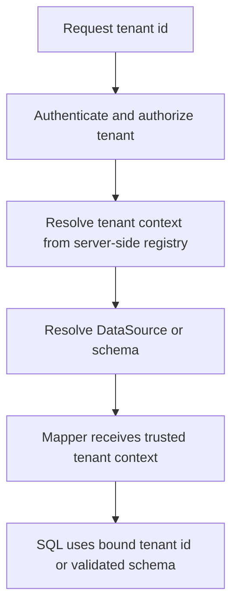

------
title: Learn Java MyBatis - Part 007
description: Advanced guide to MyBatis parameter binding, SQL injection safety, safe dynamic identifiers, whitelisting, pagination inputs, and multi-tenant query safety.
series: learn-java-mybatis
seriesTitle: Learn Java MyBatis, Patterns, Anti-Patterns, and Production Persistence Mapping
order: 7
partTitle: Parameter Binding and SQL Injection Safety
tags:
  - java
  - mybatis
  - sql
  - security
  - parameter-binding
  - persistence
date: 2026-06-27
---

# Part 007 — Parameter Binding and SQL Injection Safety

## 1. Why This Part Matters

MyBatis gives engineers direct ownership over SQL.

That is its strength.

It is also the reason parameter binding must be treated as an architectural concern, not just a syntax detail.

In JPA/Hibernate, many queries are generated through an abstraction. In MyBatis, the SQL is yours. That means:

- every unsafe interpolation is your bug;
- every missing tenant predicate is your bug;
- every dynamic `ORDER BY` mistake is your bug;
- every search screen filter explosion is your bug;
- every full-table access caused by bad criteria construction is your bug.

The goal of this part is not merely to say "`#{}` is safe and `${}` is dangerous." That is too shallow.

The goal is to build the mental model needed to design mapper APIs that are safe by construction.

---

## 2. Kaufman Framing

Following Josh Kaufman's learning model, we deconstruct this skill into small, high-leverage subskills.

| Subskill | What You Need to Master |
|---|---|
| Binding model | Understand how MyBatis converts Java parameters into SQL placeholders |
| Interpolation model | Know when MyBatis injects raw text into SQL |
| Identifier safety | Safely handle column names, sort fields, table names, schema names |
| Search input normalization | Convert user filters into trusted internal query criteria |
| Pagination safety | Prevent invalid limits, unstable ordering, and offset abuse |
| Tenant safety | Ensure every scoped query has correct tenant/account/org boundary |
| Review habit | Detect unsafe SQL in mapper XML and annotations before it reaches production |

The core rule:

> Untrusted values must become bound values.  
> Untrusted structure must become validated structure.  
> Untrusted SQL must never exist.

---

## 3. The Core Mental Model

A MyBatis statement can contain two fundamentally different kinds of substitution:

```xml
SELECT *
FROM users
WHERE id = #{id}
ORDER BY ${sortColumn}
```

These two placeholders are not equivalent.

| Syntax | Meaning | SQL Shape | Typical Use |
|---|---|---|---|
| `#{value}` | Binds value as parameter | `?` placeholder | Values: id, name, date, status, amount |
| `${value}` | Injects raw text into SQL | Text substitution | SQL identifiers or fragments, only after strict validation |

The difference is architectural.

`#{}` means: "this is data."

`${}` means: "this is SQL."

That distinction is the foundation of safe MyBatis design.

---

## 4. Safe Binding with `#{}`

When using `#{}`, MyBatis prepares a statement with parameter placeholders and binds Java values into those placeholders.

Example:

```xml
<select id="findByCaseId" resultMap="CaseResultMap">
  SELECT
    c.id,
    c.case_number,
    c.status,
    c.created_at
  FROM regulatory_case c
  WHERE c.id = #{caseId}
</select>
```

Conceptually:

```sql
SELECT
  c.id,
  c.case_number,
  c.status,
  c.created_at
FROM regulatory_case c
WHERE c.id = ?
```

Then the value of `caseId` is bound separately.

This protects value positions from being interpreted as SQL syntax.

Good candidates for `#{}`:

- IDs;
- status codes;
- usernames;
- dates;
- timestamps;
- booleans;
- amounts;
- free-text search terms;
- enum codes;
- tenant IDs;
- pagination limit and offset, if supported by the driver/dialect;
- audit actor IDs;
- version numbers for optimistic locking.

Example with multiple safe values:

```xml
<select id="searchCases" resultMap="CaseSummaryResultMap">
  SELECT
    c.id,
    c.case_number,
    c.status,
    c.priority,
    c.created_at
  FROM regulatory_case c
  WHERE c.tenant_id = #{tenantId}
    AND c.status = #{status}
    AND c.created_at >= #{createdFrom}
    AND c.created_at < #{createdTo}
  ORDER BY c.created_at DESC, c.id DESC
  LIMIT #{limit}
  OFFSET #{offset}
</select>
```

This is safe for values, assuming the input object has already been normalized.

---

## 5. The Danger of `${}`

`${}` performs literal string substitution before the SQL is executed.

Example:

```xml
<select id="unsafeFind" resultMap="CaseResultMap">
  SELECT *
  FROM regulatory_case
  WHERE case_number = '${caseNumber}'
</select>
```

If `caseNumber` is:

```text
ABC-123' OR '1' = '1
```

The SQL becomes:

```sql
SELECT *
FROM regulatory_case
WHERE case_number = 'ABC-123' OR '1' = '1'
```

That is an injection vulnerability.

Never use `${}` for values.

Bad:

```xml
WHERE status = '${status}'
```

Good:

```xml
WHERE status = #{status}
```

Bad:

```xml
WHERE created_at >= '${createdFrom}'
```

Good:

```xml
WHERE created_at >= #{createdFrom}
```

Bad:

```xml
LIMIT ${limit}
```

Prefer:

```xml
LIMIT #{limit}
```

If a specific database driver or dialect does not allow binding limit/offset, validate and clamp values before interpolation.

---

## 6. When `${}` Is Legitimate

There are cases where SQL grammar does not allow a placeholder.

For example, you cannot usually bind a column name using `?`.

Bad idea:

```sql
ORDER BY ?
```

This does not mean "order by this column." It means "order by a bound value," which is not the same thing.

Therefore, dynamic identifiers sometimes require text substitution:

```xml
ORDER BY ${sortColumn} ${sortDirection}
```

But this is safe only if `sortColumn` and `sortDirection` are not raw user input.

They must be trusted internal values produced by validation.

The valid cases for `${}` are narrow:

- whitelisted column names;
- whitelisted sort directions;
- whitelisted table names for controlled partitioning;
- whitelisted schema names for multi-tenant routing;
- whitelisted SQL fragments generated by internal code;
- database-specific hints selected from an enum;
- fixed fragments controlled by application code.

The rule:

> `${}` is acceptable only when the value is not user input anymore, but a validated SQL token from a closed set.

---

## 7. Safe Dynamic `ORDER BY`

### 7.1 The Problem

Search screens often support sorting:

```http
GET /cases?sort=createdAt&direction=desc
```

Naive mapper:

```xml
ORDER BY ${sort} ${direction}
```

This is unsafe.

A malicious input might become:

```http
sort=created_at; DROP TABLE regulatory_case; --
```

The fix is not "sanitize the string."

The fix is to transform input into a domain-controlled sort specification.

---

### 7.2 Safe Sort Enum

```java
public enum CaseSortField {
    CREATED_AT("c.created_at"),
    CASE_NUMBER("c.case_number"),
    PRIORITY("c.priority"),
    STATUS("c.status"),
    UPDATED_AT("c.updated_at");

    private final String sqlExpression;

    CaseSortField(String sqlExpression) {
        this.sqlExpression = sqlExpression;
    }

    public String sqlExpression() {
        return sqlExpression;
    }

    public static CaseSortField fromApiValue(String value) {
        if (value == null || value.isBlank()) {
            return CREATED_AT;
        }

        return switch (value) {
            case "createdAt" -> CREATED_AT;
            case "caseNumber" -> CASE_NUMBER;
            case "priority" -> PRIORITY;
            case "status" -> STATUS;
            case "updatedAt" -> UPDATED_AT;
            default -> throw new IllegalArgumentException("Unsupported sort field: " + value);
        };
    }
}
```

Sort direction:

```java
public enum SortDirection {
    ASC("ASC"),
    DESC("DESC");

    private final String sqlKeyword;

    SortDirection(String sqlKeyword) {
        this.sqlKeyword = sqlKeyword;
    }

    public String sqlKeyword() {
        return sqlKeyword;
    }

    public static SortDirection fromApiValue(String value) {
        if (value == null || value.isBlank()) {
            return DESC;
        }

        return switch (value.toLowerCase()) {
            case "asc" -> ASC;
            case "desc" -> DESC;
            default -> throw new IllegalArgumentException("Unsupported sort direction: " + value);
        };
    }
}
```

Criteria object:

```java
public record CaseSearchCriteria(
    long tenantId,
    String status,
    String keyword,
    Instant createdFrom,
    Instant createdTo,
    CaseSortField sortField,
    SortDirection sortDirection,
    int limit,
    int offset
) {
}
```

Mapper XML:

```xml
<select id="searchCases" resultMap="CaseSummaryResultMap">
  SELECT
    c.id,
    c.case_number,
    c.status,
    c.priority,
    c.created_at,
    c.updated_at
  FROM regulatory_case c
  WHERE c.tenant_id = #{tenantId}

  <if test="status != null">
    AND c.status = #{status}
  </if>

  <if test="keyword != null and keyword != ''">
    AND (
      c.case_number ILIKE #{keyword}
      OR c.subject_name ILIKE #{keyword}
    )
  </if>

  <if test="createdFrom != null">
    AND c.created_at >= #{createdFrom}
  </if>

  <if test="createdTo != null">
    AND c.created_at &lt; #{createdTo}
  </if>

  ORDER BY ${sortField.sqlExpression} ${sortDirection.sqlKeyword}, c.id DESC
  LIMIT #{limit}
  OFFSET #{offset}
</select>
```

Notice the distinction:

- filter values use `#{}`;
- SQL identifiers use `${}`, but only through enum-controlled values.

This is a controlled escape hatch.

---

## 8. Safe Pagination Inputs

Pagination bugs are often security, performance, and correctness bugs at the same time.

Bad API behavior:

```http
GET /cases?limit=1000000&offset=0
```

Bad mapper:

```xml
LIMIT ${limit}
OFFSET ${offset}
```

A safer approach:

```java
public record PageRequest(int limit, int offset) {
    private static final int DEFAULT_LIMIT = 50;
    private static final int MAX_LIMIT = 200;
    private static final int MAX_OFFSET = 10_000;

    public static PageRequest normalize(Integer requestedLimit, Integer requestedOffset) {
        int normalizedLimit = requestedLimit == null ? DEFAULT_LIMIT : requestedLimit;
        int normalizedOffset = requestedOffset == null ? 0 : requestedOffset;

        if (normalizedLimit < 1) {
            normalizedLimit = DEFAULT_LIMIT;
        }

        if (normalizedLimit > MAX_LIMIT) {
            normalizedLimit = MAX_LIMIT;
        }

        if (normalizedOffset < 0) {
            normalizedOffset = 0;
        }

        if (normalizedOffset > MAX_OFFSET) {
            throw new IllegalArgumentException("Offset too large. Use cursor pagination.");
        }

        return new PageRequest(normalizedLimit, normalizedOffset);
    }
}
```

Mapper:

```xml
LIMIT #{limit}
OFFSET #{offset}
```

Production rule:

> Pagination inputs are not simple integers. They are resource-control decisions.

---

## 9. Deterministic Ordering Rule

Pagination without deterministic ordering is unstable.

Bad:

```xml
ORDER BY c.created_at DESC
LIMIT #{limit}
OFFSET #{offset}
```

If many rows share the same `created_at`, rows can move between pages.

Better:

```xml
ORDER BY c.created_at DESC, c.id DESC
LIMIT #{limit}
OFFSET #{offset}
```

The second column must be unique or at least stable enough to provide deterministic ordering.

Checklist:

- Is the primary sort nullable?
- Are duplicate values common?
- Is there a tie-breaker?
- Is the tie-breaker indexed?
- Does the tie-breaker match the pagination direction?
- Does the result remain stable under concurrent inserts?

---

## 10. Safe Keyword Search

Bad:

```xml
AND c.description LIKE '%${keyword}%'
```

Good:

```java
public final class SearchText {
    private final String likePattern;

    private SearchText(String likePattern) {
        this.likePattern = likePattern;
    }

    public static SearchText contains(String raw) {
        if (raw == null || raw.isBlank()) {
            return null;
        }

        String normalized = raw.trim();

        if (normalized.length() > 100) {
            throw new IllegalArgumentException("Search text too long");
        }

        String escaped = normalized
            .replace("\\", "\\\\")
            .replace("%", "\\%")
            .replace("_", "\\_");

        return new SearchText("%" + escaped + "%");
    }

    public String likePattern() {
        return likePattern;
    }
}
```

Mapper:

```xml
<if test="keyword != null">
  AND (
    c.case_number LIKE #{keyword.likePattern} ESCAPE '\'
    OR c.subject_name LIKE #{keyword.likePattern} ESCAPE '\'
  )
</if>
```

The important distinction:

- SQL wildcard construction can be done in Java;
- SQL value binding still uses `#{}`;
- special wildcard characters are escaped if user input should be literal.

---

## 11. Dynamic `IN` Clauses

MyBatis `foreach` is commonly used for `IN` clauses.

Example:

```xml
<select id="findByIds" resultMap="CaseResultMap">
  SELECT
    c.id,
    c.case_number,
    c.status
  FROM regulatory_case c
  WHERE c.tenant_id = #{tenantId}
    AND c.id IN
    <foreach collection="caseIds"
             item="caseId"
             open="("
             separator=","
             close=")">
      #{caseId}
    </foreach>
</select>
```

This safely binds each ID as a value.

However, `IN` clauses introduce edge cases.

### 11.1 Empty Collection

Bad generated SQL:

```sql
AND c.id IN ()
```

Prevent this before calling the mapper:

```java
if (caseIds == null || caseIds.isEmpty()) {
    return List.of();
}
```

Or handle in XML:

```xml
<choose>
  <when test="caseIds != null and caseIds.size() > 0">
    AND c.id IN
    <foreach collection="caseIds"
             item="caseId"
             open="("
             separator=","
             close=")">
      #{caseId}
    </foreach>
  </when>
  <otherwise>
    AND 1 = 0
  </otherwise>
</choose>
```

For explicitness, prefer short-circuiting in service/application layer for empty input.

### 11.2 Large Collection

Large `IN` clauses can cause:

- SQL text bloat;
- parameter count limits;
- poor query plans;
- high parse time;
- memory pressure.

Better options:

- temporary table;
- database array parameter, if supported;
- staging table;
- join against a derived table;
- batch the query;
- redesign the workflow.

Mapper review question:

> Is this `IN` list expected to contain 10 values, 500 values, or 50,000 values?

Those are different designs.

---

## 12. Safe Dynamic Table or Schema Names

Sometimes systems use schema-per-tenant or partition tables.

Unsafe:

```xml
SELECT *
FROM ${tenantSchema}.regulatory_case
WHERE id = #{caseId}
```

This is unsafe if `tenantSchema` came from a request.

Better:

```java
public record TenantSchema(String sqlName) {
    private static final Pattern SAFE_SCHEMA = Pattern.compile("[a-z][a-z0-9_]{0,62}");

    public TenantSchema {
        if (sqlName == null || !SAFE_SCHEMA.matcher(sqlName).matches()) {
            throw new IllegalArgumentException("Invalid tenant schema");
        }

        if (!TenantSchemaRegistry.exists(sqlName)) {
            throw new IllegalArgumentException("Unknown tenant schema");
        }
    }
}
```

Mapper:

```xml
SELECT
  c.id,
  c.case_number,
  c.status
FROM ${tenantSchema.sqlName}.regulatory_case c
WHERE c.id = #{caseId}
```

Still be careful: regex is not enough. Use a registry or internal lookup.

Better architecture for many systems:



Tenant schema must be derived from trusted server-side configuration, not directly from user input.

---

## 13. Multi-Tenant Safety

For single-schema multi-tenant systems, every tenant-scoped query must include tenant filtering.

Unsafe:

```xml
<select id="findById" resultMap="CaseResultMap">
  SELECT
    c.id,
    c.tenant_id,
    c.case_number,
    c.status
  FROM regulatory_case c
  WHERE c.id = #{caseId}
</select>
```

Safe:

```xml
<select id="findById" resultMap="CaseResultMap">
  SELECT
    c.id,
    c.tenant_id,
    c.case_number,
    c.status
  FROM regulatory_case c
  WHERE c.tenant_id = #{tenantId}
    AND c.id = #{caseId}
</select>
```

The mapper contract should force tenant safety:

```java
Optional<CaseRecord> findById(@Param("tenantId") long tenantId,
                              @Param("caseId") long caseId);
```

Better:

```java
Optional<CaseRecord> findById(CaseIdentity identity);
```

```java
public record CaseIdentity(long tenantId, long caseId) {
}
```

This reduces the chance of accidentally passing only an ID.

### Tenant Safety Invariant

> No tenant-scoped mapper method may accept a domain ID without tenant scope.

Bad method names:

```java
findById(long id)
updateStatus(long id, String status)
deleteById(long id)
```

Better:

```java
findByIdentity(CaseIdentity identity)
updateStatus(CaseStatusChange command)
deleteTenantCase(CaseIdentity identity)
```

---

## 14. Binding and Domain-Specific Value Objects

Primitive-heavy mapper APIs are easy to misuse.

Bad:

```java
List<CaseRecord> search(long tenantId, String status, String sort, String direction, int limit, int offset);
```

Better:

```java
List<CaseRecord> search(CaseSearchCriteria criteria);
```

Example:

```java
public record CaseSearchCriteria(
    TenantId tenantId,
    CaseStatus status,
    SearchText keyword,
    CaseSort sort,
    PageRequest page
) {
}
```

Mapper XML:

```xml
WHERE c.tenant_id = #{tenantId.value}

<if test="status != null">
  AND c.status = #{status.code}
</if>

<if test="keyword != null">
  AND c.subject_name LIKE #{keyword.likePattern} ESCAPE '\'
</if>

ORDER BY ${sort.field.sqlExpression} ${sort.direction.sqlKeyword}, c.id DESC
LIMIT #{page.limit}
OFFSET #{page.offset}
```

This makes invalid states harder to represent.

The higher-level application should normalize and validate raw input before the mapper is called.

---

## 15. Annotation Mapper Safety

Unsafe annotation:

```java
@Select("""
    SELECT *
    FROM regulatory_case
    WHERE status = '${status}'
    ORDER BY ${sort}
    """)
List<CaseRecord> search(@Param("status") String status,
                        @Param("sort") String sort);
```

Better:

```java
@Select("""
    SELECT
      c.id,
      c.case_number,
      c.status,
      c.created_at
    FROM regulatory_case c
    WHERE c.tenant_id = #{tenantId}
      AND c.status = #{status}
    ORDER BY c.created_at DESC, c.id DESC
    LIMIT #{limit}
    OFFSET #{offset}
    """)
List<CaseRecord> findByStatus(CaseStatusPageQuery query);
```

If dynamic identifiers become necessary, avoid building them casually inside annotations. Prefer XML or a provider class where validation is explicit.

---

## 16. Provider Method Safety

Provider methods are powerful but dangerous if they concatenate raw input.

Unsafe:

```java
public String search(Map<String, Object> params) {
    return "SELECT * FROM regulatory_case ORDER BY " + params.get("sort");
}
```

Better:

```java
public String search(CaseSearchCriteria criteria) {
    return """
        SELECT
          c.id,
          c.case_number,
          c.status,
          c.created_at
        FROM regulatory_case c
        WHERE c.tenant_id = #{tenantId}
        ORDER BY %s %s, c.id DESC
        LIMIT #{limit}
        OFFSET #{offset}
        """.formatted(
            criteria.sortField().sqlExpression(),
            criteria.sortDirection().sqlKeyword()
        );
}
```

This is acceptable only if `sortField()` and `sortDirection()` return enum-controlled SQL tokens.

Provider class rule:

> Provider methods may compose SQL structure, but must never trust raw request strings.

---

## 17. Safe Update Commands

Injection is not only a `SELECT` problem.

Unsafe:

```xml
<update id="unsafeUpdate">
  UPDATE regulatory_case
  SET ${column} = #{value}
  WHERE id = #{caseId}
</update>
```

This attempts to create a generic update method.

Avoid this pattern.

Better:

```xml
<update id="changePriority">
  UPDATE regulatory_case
  SET
    priority = #{newPriority},
    updated_at = #{changedAt},
    updated_by = #{changedBy}
  WHERE tenant_id = #{tenantId}
    AND id = #{caseId}
    AND version = #{expectedVersion}
</update>
```

Command object:

```java
public record ChangeCasePriorityCommand(
    long tenantId,
    long caseId,
    String newPriority,
    long expectedVersion,
    Instant changedAt,
    long changedBy
) {
}
```

Generic update methods usually weaken:

- validation;
- auditability;
- authorization;
- optimistic locking;
- domain semantics;
- code review visibility.

For production systems, prefer intent-specific update statements.

---

## 18. Dynamic Update with Safe Field Selection

There are valid cases for partial update.

Use explicit whitelisting.

```xml
<update id="updateCasePatch">
  UPDATE regulatory_case
  <set>
    <if test="patch.priorityPresent">
      priority = #{patch.priority},
    </if>
    <if test="patch.dueDatePresent">
      due_date = #{patch.dueDate},
    </if>
    <if test="patch.assigneePresent">
      assignee_id = #{patch.assigneeId},
    </if>
    updated_at = #{updatedAt},
    updated_by = #{updatedBy},
    version = version + 1
  </set>
  WHERE tenant_id = #{tenantId}
    AND id = #{caseId}
    AND version = #{expectedVersion}
</update>
```

This is safer than:

```xml
SET ${fieldName} = #{value}
```

Patch methods must be constrained to domain-approved fields.

---

## 19. Dynamic SQL Decision Tree

```mermaid
flowchart TD
    A[Need dynamic SQL?] --> B{Is it a value?}
    B -->|Yes| C[Use #{}]
    B -->|No| D{Is it SQL structure?}
    D -->|No| E[Do not interpolate]
    D -->|Yes| F{Closed whitelist?}
    F -->|No| G[Reject design]
    F -->|Yes| H[Use enum/value object]
    H --> I[Use ${} only for trusted token]
    I --> J[Add mapper test for generated SQL]
```

---

## 20. Common Anti-Patterns

### 20.1 Stringly Typed Mapper

```java
List<CaseRecord> search(Map<String, Object> params);
```

Why it fails:

- no type safety;
- unclear required fields;
- easy to omit tenant;
- hard to review;
- hard to test;
- weak IDE support.

Better:

```java
List<CaseRecord> search(CaseSearchCriteria criteria);
```

---

### 20.2 Raw Sort Input

```xml
ORDER BY ${sort}
```

Better:

```xml
ORDER BY ${sort.field.sqlExpression} ${sort.direction.sqlKeyword}, c.id DESC
```

Where `sort.field` and `sort.direction` are validated enum values.

---

### 20.3 Generic Find

```java
List<Map<String, Object>> find(String table, String whereClause);
```

This is not a mapper. It is an SQL injection framework.

Avoid.

---

### 20.4 Generic Update Field

```java
int updateField(String table, long id, String field, Object value);
```

This bypasses:

- domain rules;
- authorization;
- audit logic;
- version checks;
- invariants;
- reviewability.

Avoid.

---

### 20.5 Missing Tenant Predicate

```xml
WHERE id = #{id}
```

In tenant-scoped data, this is an authorization bug.

Better:

```xml
WHERE tenant_id = #{tenantId}
  AND id = #{id}
```

---

### 20.6 Unsafe LIKE

```xml
WHERE name LIKE '%${keyword}%'
```

Better:

```xml
WHERE name LIKE #{keyword.likePattern} ESCAPE '\'
```

---

### 20.7 Silent Full Search

Bad dynamic where:

```xml
<select id="searchCases" resultMap="CaseResultMap">
  SELECT *
  FROM regulatory_case
  <where>
    <if test="status != null">
      status = #{status}
    </if>
    <if test="assignedTo != null">
      AND assigned_to = #{assignedTo}
    </if>
  </where>
</select>
```

If all filters are null, this returns everything.

That may be correct for an admin report, but dangerous for user-facing search.

Safer pattern:

```java
criteria.ensureAtLeastOneNarrowingFilter();
```

Or require tenant and page limit:

```xml
WHERE tenant_id = #{tenantId}
ORDER BY created_at DESC, id DESC
LIMIT #{limit}
```

---

## 21. Mapper Security Review Checklist

Use this checklist during code review.

### Placeholder Safety

- [ ] Are all values bound with `#{}`?
- [ ] Is every `${}` justified?
- [ ] Is every `${}` value produced by enum/value object/registry?
- [ ] Are there any raw request strings inside SQL?
- [ ] Are provider methods concatenating raw input?

### Identifier Safety

- [ ] Are sort columns whitelisted?
- [ ] Are sort directions whitelisted?
- [ ] Are dynamic table/schema names validated against internal registry?
- [ ] Are SQL hints selected from fixed values?

### Tenant Safety

- [ ] Does every tenant-scoped query include tenant predicate?
- [ ] Does every tenant-scoped command include tenant predicate?
- [ ] Does the mapper contract require tenant identity?
- [ ] Are IDs wrapped in scoped identity objects?

### Search Safety

- [ ] Are keyword lengths limited?
- [ ] Are wildcard characters escaped when needed?
- [ ] Does search require pagination?
- [ ] Is there deterministic ordering?
- [ ] Can all-null filters produce accidental full scan?

### Pagination Safety

- [ ] Is limit clamped?
- [ ] Is offset bounded?
- [ ] Is cursor pagination considered for deep pages?
- [ ] Is ordering stable?
- [ ] Is the sort index-supported?

### Command Safety

- [ ] Does update include version check if concurrent writes are possible?
- [ ] Does update include audit fields?
- [ ] Does command return affected row count?
- [ ] Does service layer verify affected row count?
- [ ] Are generic update methods avoided?

---

## 22. Production Case Example: Safe Case Search

### 22.1 API Input

```java
public record CaseSearchRequest(
    String status,
    String keyword,
    String sort,
    String direction,
    Integer limit,
    Integer offset
) {
}
```

### 22.2 Normalized Criteria

```java
public record CaseSearchCriteria(
    long tenantId,
    String status,
    SearchText keyword,
    CaseSortField sortField,
    SortDirection sortDirection,
    int limit,
    int offset
) {
    public static CaseSearchCriteria from(long tenantId, CaseSearchRequest request) {
        PageRequest page = PageRequest.normalize(request.limit(), request.offset());

        return new CaseSearchCriteria(
            tenantId,
            normalizeStatus(request.status()),
            SearchText.contains(request.keyword()),
            CaseSortField.fromApiValue(request.sort()),
            SortDirection.fromApiValue(request.direction()),
            page.limit(),
            page.offset()
        );
    }

    private static String normalizeStatus(String status) {
        if (status == null || status.isBlank()) {
            return null;
        }

        return switch (status) {
            case "OPEN", "UNDER_REVIEW", "ESCALATED", "CLOSED" -> status;
            default -> throw new IllegalArgumentException("Unsupported case status: " + status);
        };
    }
}
```

### 22.3 Mapper Interface

```java
@Mapper
public interface CaseQueryMapper {
    List<CaseSummaryRecord> searchCases(CaseSearchCriteria criteria);
}
```

### 22.4 Mapper XML

```xml
<select id="searchCases" resultMap="CaseSummaryResultMap">
  SELECT
    c.id,
    c.case_number,
    c.status,
    c.priority,
    c.subject_name,
    c.created_at,
    c.updated_at
  FROM regulatory_case c
  WHERE c.tenant_id = #{tenantId}

  <if test="status != null">
    AND c.status = #{status}
  </if>

  <if test="keyword != null">
    AND (
      c.case_number LIKE #{keyword.likePattern} ESCAPE '\'
      OR c.subject_name LIKE #{keyword.likePattern} ESCAPE '\'
    )
  </if>

  ORDER BY ${sortField.sqlExpression} ${sortDirection.sqlKeyword}, c.id DESC
  LIMIT #{limit}
  OFFSET #{offset}
</select>
```

### 22.5 Why This Is Safe

- tenant filter is mandatory;
- status is validated;
- keyword is bounded and escaped;
- values are bound with `#{}`;
- sorting uses enum-controlled SQL tokens;
- limit and offset are normalized;
- ordering is deterministic.

---

## 23. Testing Parameter Safety

You cannot fully prove injection safety with tests, but tests catch regressions.

### 23.1 Malicious Keyword Test

```java
@Test
void searchCases_doesNotTreatKeywordAsSql() {
    CaseSearchCriteria criteria = new CaseSearchCriteria(
        tenantId,
        null,
        SearchText.contains("' OR '1' = '1"),
        CaseSortField.CREATED_AT,
        SortDirection.DESC,
        50,
        0
    );

    List<CaseSummaryRecord> results = mapper.searchCases(criteria);

    assertThat(results).isEmpty();
}
```

### 23.2 Sort Whitelist Test

```java
@Test
void rejectsUnsupportedSortField() {
    assertThatThrownBy(() -> CaseSortField.fromApiValue("created_at; DROP TABLE regulatory_case"))
        .isInstanceOf(IllegalArgumentException.class);
}
```

### 23.3 Pagination Clamp Test

```java
@Test
void clampsLimit() {
    PageRequest page = PageRequest.normalize(10_000, 0);

    assertThat(page.limit()).isEqualTo(200);
}
```

### 23.4 Missing Tenant Regression Test

Use a test dataset with identical case IDs or case numbers across tenants.

```java
@Test
void findById_doesNotCrossTenantBoundary() {
    Optional<CaseRecord> caseA = mapper.findById(new CaseIdentity(tenantA, sharedCaseId));
    Optional<CaseRecord> caseB = mapper.findById(new CaseIdentity(tenantB, sharedCaseId));

    assertThat(caseA).isPresent();
    assertThat(caseB).isPresent();
    assertThat(caseA.get().tenantId()).isEqualTo(tenantA);
    assertThat(caseB.get().tenantId()).isEqualTo(tenantB);
}
```

---

## 24. Heuristics for Top-Tier Engineers

A weak MyBatis engineer asks:

> Does this query work?

A strong MyBatis engineer asks:

> Is this query safe under hostile input, concurrent writes, tenant isolation, large data, and future maintenance?

Use these heuristics:

1. **Default to `#{}`.**
2. **Treat `${}` as privileged SQL construction.**
3. **Never pass raw request values to `${}`.**
4. **Model dynamic SQL tokens as enums/value objects.**
5. **Make tenant scope part of the mapper contract.**
6. **Normalize input before mapper access.**
7. **Avoid generic SQL mappers.**
8. **Test malicious input paths.**
9. **Force deterministic ordering for paginated results.**
10. **Prefer intent-specific commands over generic updates.**

---

## 25. Deliberate Practice

### Exercise 1 — Fix Unsafe Sort

Refactor this mapper:

```xml
<select id="search" resultMap="CaseResultMap">
  SELECT *
  FROM regulatory_case
  WHERE tenant_id = #{tenantId}
  ORDER BY ${sort}
</select>
```

Target design:

- sort field enum;
- direction enum;
- deterministic tie-breaker;
- test for rejected injection input.

---

### Exercise 2 — Tenant-Safe Mapper

Refactor:

```java
Optional<CaseRecord> findById(long id);
```

Into:

```java
Optional<CaseRecord> findByIdentity(CaseIdentity identity);
```

Then update SQL to include tenant predicate.

---

### Exercise 3 — Safe Keyword Search

Implement:

- search text normalization;
- wildcard escaping;
- max length enforcement;
- mapper test for malicious text;
- mapper test for literal `%` search.

---

### Exercise 4 — Remove Generic Update

Replace:

```java
int updateField(String table, String field, Object value, long id);
```

With explicit update commands:

- change priority;
- assign case;
- change status;
- update due date.

Each command must include:

- tenant scope;
- audit fields;
- optimistic lock version;
- affected row verification.

---

## 26. Summary

Parameter binding in MyBatis is not just about syntax.

It is about preserving a strict boundary:

```mermaid
flowchart LR
    A[Raw external input] --> B[Validation and normalization]
    B --> C[Domain query or command object]
    C --> D[Mapper contract]
    D --> E[Bound values via #{}]
    D --> F[Whitelisted SQL tokens via ${}]
    E --> G[Database]
    F --> G
```

The production-grade rule is simple:

> Values are bound.  
> SQL structure is whitelisted.  
> Mapper contracts force scope.  
> Unsafe states are rejected before SQL exists.

---

## 27. References

- MyBatis 3 Reference Documentation — Mapper XML Files: https://mybatis.org/mybatis-3/sqlmap-xml.html
- MyBatis 3 Reference Documentation — Dynamic SQL: https://mybatis.org/mybatis-3/dynamic-sql.html
- MyBatis 3 Reference Documentation — Configuration: https://mybatis.org/mybatis-3/configuration.html
