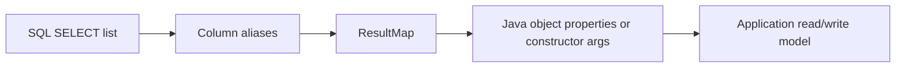
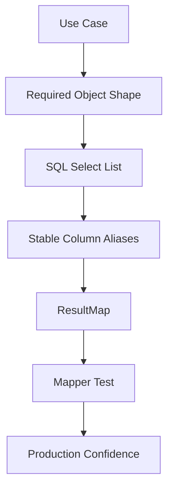

------
title: Learn Java MyBatis - Part 008
description: Advanced ResultMap deep dive covering resultType vs resultMap, explicit column mapping, constructor mapping, association, collection, discriminator, immutable records, and mapping failure modes.
series: learn-java-mybatis
seriesTitle: Learn Java MyBatis, Patterns, Anti-Patterns, and Production Persistence Mapping
order: 8
partTitle: ResultMap Deep Dive
tags:
  - java
  - mybatis
  - resultmap
  - mapping
  - persistence
  - sql
date: 2026-06-27
---

# Part 008 — ResultMap Deep Dive

## 1. Why ResultMap Deserves Its Own Part

`ResultMap` is one of the most important MyBatis features.

It is also one of the easiest features to misuse.

A beginner uses MyBatis like this:

```xml
<select id="findById" resultType="CaseRecord">
  SELECT *
  FROM regulatory_case
  WHERE id = #{id}
</select>
```

A production engineer asks different questions:

- Which columns are selected?
- Are column aliases stable?
- Is the mapping explicit?
- Is the object immutable?
- Are nested objects reconstructed correctly?
- Are duplicate parent rows handled?
- Are null child rows interpreted correctly?
- Is a join causing row explosion?
- Will a schema change silently break the object?
- Are we mapping a domain object, persistence record, projection, or API read model?

This part builds the mental model for result mapping as a contract.

---

## 2. Kaufman Framing

Using Josh Kaufman's skill acquisition approach, we deconstruct result mapping into subskills.

| Subskill | What You Need to Learn |
|---|---|
| Shape control | Decide what object shape each SQL statement returns |
| Explicit mapping | Map columns to properties without relying on accidental names |
| Constructor mapping | Build immutable objects and records |
| Nested mapping | Reconstruct one-to-one and one-to-many relationships |
| Duplicate handling | Understand how joined rows map to parent and child objects |
| Null semantics | Prevent phantom child objects and silent nulls |
| Discriminator mapping | Map polymorphic result shapes carefully |
| Failure diagnosis | Identify mapping bugs from symptoms |
| Review discipline | Treat `ResultMap` as part of the persistence contract |

The end goal:

> Every mapper statement should make object shape intentional, reviewable, and testable.

---

## 3. `resultType` vs `resultMap`

MyBatis gives two broad ways to map query results.

### 3.1 `resultType`

Example:

```xml
<select id="findOpenCases" resultType="com.example.caseapp.CaseSummaryRecord">
  SELECT
    id,
    case_number,
    status,
    created_at
  FROM regulatory_case
  WHERE status = 'OPEN'
</select>
```

`resultType` is convenient when:

- selected columns match Java property names;
- mapping is flat;
- there is no nested object;
- there are no ambiguous column names;
- object construction is simple;
- the query is small and stable.

However, `resultType` becomes fragile when:

- database columns use snake_case;
- Java properties use camelCase;
- joins introduce duplicate column names like `id`;
- you need nested objects;
- you need constructor mapping;
- you need explicit identity mapping;
- the query returns a projection that must remain stable.

### 3.2 `resultMap`

Example:

```xml
<resultMap id="CaseSummaryResultMap"
           type="com.example.caseapp.CaseSummaryRecord">
  <id property="id" column="case_id"/>
  <result property="caseNumber" column="case_number"/>
  <result property="status" column="case_status"/>
  <result property="createdAt" column="case_created_at"/>
</resultMap>

<select id="findOpenCases" resultMap="CaseSummaryResultMap">
  SELECT
    c.id AS case_id,
    c.case_number AS case_number,
    c.status AS case_status,
    c.created_at AS case_created_at
  FROM regulatory_case c
  WHERE c.status = 'OPEN'
</select>
```

`ResultMap` is preferred when mapping must be explicit.

Production rule:

> Use `resultType` for trivial, local, flat mappings.  
> Use `resultMap` for anything that must survive schema growth, joins, projections, or review.

---

## 4. The Mapping Contract

A `ResultMap` connects SQL output columns to Java object shape.



A mapping contract has four sides:

| Side | Contract |
|---|---|
| SQL | Exactly which columns are selected |
| Alias | Stable names exported by SQL |
| ResultMap | Explicit mapping from aliases to object |
| Java type | Object structure expected by application |

A failure in any side can break correctness.

---

## 5. Avoid `SELECT *`

Bad:

```xml
<select id="findById" resultMap="CaseResultMap">
  SELECT *
  FROM regulatory_case
  WHERE id = #{id}
</select>
```

Why this is weak:

- unreadable column contract;
- accidental extra data;
- ambiguous columns in joins;
- schema changes affect mapper behavior;
- difficult to optimize;
- hard to review;
- exposes sensitive columns accidentally;
- brittle with nested mappings.

Better:

```xml
<select id="findById" resultMap="CaseResultMap">
  SELECT
    c.id AS case_id,
    c.case_number AS case_number,
    c.status AS case_status,
    c.priority AS case_priority,
    c.created_at AS case_created_at,
    c.updated_at AS case_updated_at
  FROM regulatory_case c
  WHERE c.tenant_id = #{tenantId}
    AND c.id = #{caseId}
</select>
```

Production mapper SQL should treat the `SELECT` list as an API response contract.

---

## 6. Column Alias Discipline

In joined queries, never rely on raw column names.

Bad:

```xml
SELECT
  c.id,
  p.id,
  c.name,
  p.name
FROM regulatory_case c
JOIN party p ON p.case_id = c.id
```

Both tables have `id` and `name`.

Better:

```xml
SELECT
  c.id AS case_id,
  c.case_number AS case_number,
  c.status AS case_status,
  p.id AS party_id,
  p.full_name AS party_full_name,
  p.role AS party_role
FROM regulatory_case c
JOIN party p ON p.case_id = c.id
```

Alias convention:

```text
<table-or-concept-prefix>_<field-name>
```

Examples:

| Concept | Alias |
|---|---|
| Case ID | `case_id` |
| Case status | `case_status` |
| Party ID | `party_id` |
| Party role | `party_role` |
| Assignment user ID | `assignment_user_id` |
| SLA due at | `sla_due_at` |

This makes `ResultMap` reviewable.

---

## 7. Basic `ResultMap`

Java type:

```java
public class CaseRecord {
    private long id;
    private String caseNumber;
    private String status;
    private String priority;
    private Instant createdAt;
    private Instant updatedAt;

    // getters and setters
}
```

Result map:

```xml
<resultMap id="CaseResultMap" type="com.example.caseapp.CaseRecord">
  <id property="id" column="case_id"/>
  <result property="caseNumber" column="case_number"/>
  <result property="status" column="case_status"/>
  <result property="priority" column="case_priority"/>
  <result property="createdAt" column="case_created_at"/>
  <result property="updatedAt" column="case_updated_at"/>
</resultMap>
```

Select:

```xml
<select id="findById" resultMap="CaseResultMap">
  SELECT
    c.id AS case_id,
    c.case_number AS case_number,
    c.status AS case_status,
    c.priority AS case_priority,
    c.created_at AS case_created_at,
    c.updated_at AS case_updated_at
  FROM regulatory_case c
  WHERE c.tenant_id = #{tenantId}
    AND c.id = #{caseId}
</select>
```

The `<id>` element matters because MyBatis uses ID mappings to identify object identity during nested result mapping.

---

## 8. `id` vs `result`

Use `<id>` for columns that identify the object.

```xml
<id property="id" column="case_id"/>
```

Use `<result>` for ordinary properties.

```xml
<result property="status" column="case_status"/>
```

Why it matters:

- nested result mapping depends on object identity;
- duplicate parent rows are collapsed based on ID mapping;
- poor ID mapping can create duplicate objects;
- missing ID mapping can degrade performance and correctness.

For composite identity:

```xml
<resultMap id="AssignmentResultMap" type="AssignmentRecord">
  <id property="caseId" column="assignment_case_id"/>
  <id property="userId" column="assignment_user_id"/>
  <result property="assignedAt" column="assignment_assigned_at"/>
</resultMap>
```

Composite IDs should be used deliberately.

---

## 9. Constructor Mapping

Setter-based mapping is easy but not always desirable.

For immutable objects, use constructor mapping.

Java record:

```java
public record CaseSummaryRecord(
    long id,
    String caseNumber,
    String status,
    String priority,
    Instant createdAt
) {
}
```

Result map:

```xml
<resultMap id="CaseSummaryResultMap"
           type="com.example.caseapp.CaseSummaryRecord">
  <constructor>
    <idArg column="case_id" javaType="long"/>
    <arg column="case_number" javaType="string"/>
    <arg column="case_status" javaType="string"/>
    <arg column="case_priority" javaType="string"/>
    <arg column="case_created_at" javaType="java.time.Instant"/>
  </constructor>
</resultMap>
```

Select:

```xml
<select id="findSummaries" resultMap="CaseSummaryResultMap">
  SELECT
    c.id AS case_id,
    c.case_number AS case_number,
    c.status AS case_status,
    c.priority AS case_priority,
    c.created_at AS case_created_at
  FROM regulatory_case c
  WHERE c.tenant_id = #{tenantId}
  ORDER BY c.created_at DESC, c.id DESC
</select>
```

Constructor mapping is useful for:

- immutable DTOs;
- Java records;
- query-specific read models;
- API response projections;
- objects where invalid partial state should not exist.

---

## 10. Constructor Mapping with Named Arguments

If your environment supports parameter names, constructor arg names can improve readability.

```xml
<resultMap id="CaseSummaryResultMap"
           type="com.example.caseapp.CaseSummaryRecord">
  <constructor>
    <idArg name="id" column="case_id" javaType="long"/>
    <arg name="caseNumber" column="case_number" javaType="string"/>
    <arg name="status" column="case_status" javaType="string"/>
    <arg name="priority" column="case_priority" javaType="string"/>
    <arg name="createdAt" column="case_created_at" javaType="java.time.Instant"/>
  </constructor>
</resultMap>
```

Guideline:

- use named constructor args when possible;
- keep SQL aliases exactly aligned with constructor semantics;
- test mapping when changing constructor parameter order;
- avoid overloaded constructors for mapped types.

---

## 11. Association Mapping

Use `<association>` for one-to-one or many-to-one nested objects.

Java types:

```java
public class CaseDetailRecord {
    private long id;
    private String caseNumber;
    private String status;
    private PartyRecord primaryParty;

    // getters and setters
}
```

```java
public class PartyRecord {
    private long id;
    private String fullName;
    private String role;

    // getters and setters
}
```

Result map:

```xml
<resultMap id="CaseDetailResultMap" type="CaseDetailRecord">
  <id property="id" column="case_id"/>
  <result property="caseNumber" column="case_number"/>
  <result property="status" column="case_status"/>

  <association property="primaryParty" javaType="PartyRecord">
    <id property="id" column="party_id"/>
    <result property="fullName" column="party_full_name"/>
    <result property="role" column="party_role"/>
  </association>
</resultMap>
```

Select:

```xml
<select id="findCaseDetail" resultMap="CaseDetailResultMap">
  SELECT
    c.id AS case_id,
    c.case_number AS case_number,
    c.status AS case_status,
    p.id AS party_id,
    p.full_name AS party_full_name,
    p.role AS party_role
  FROM regulatory_case c
  LEFT JOIN party p
    ON p.case_id = c.id
   AND p.role = 'PRIMARY'
  WHERE c.tenant_id = #{tenantId}
    AND c.id = #{caseId}
</select>
```

---

## 12. Null Association Problem

With `LEFT JOIN`, child columns may all be null.

Example:

```sql
party_id = NULL
party_full_name = NULL
party_role = NULL
```

If mapping is careless, you may get a phantom nested object.

The key is to identify the child with its ID column:

```xml
<association property="primaryParty" javaType="PartyRecord">
  <id property="id" column="party_id"/>
  <result property="fullName" column="party_full_name"/>
  <result property="role" column="party_role"/>
</association>
```

If the child ID is null, MyBatis can avoid constructing a meaningful child object in many common nested result scenarios.

Practical rule:

> Every nested association should have an explicit child `<id>` mapping.

Also test the no-child case.

```java
@Test
void findCaseDetail_withoutPrimaryParty_mapsNullAssociation() {
    CaseDetailRecord detail = mapper.findCaseDetail(caseWithoutParty);

    assertThat(detail.getPrimaryParty()).isNull();
}
```

---

## 13. Collection Mapping

Use `<collection>` for one-to-many nested lists.

Java type:

```java
public class CaseWithPartiesRecord {
    private long id;
    private String caseNumber;
    private String status;
    private List<PartyRecord> parties;

    // getters and setters
}
```

Result map:

```xml
<resultMap id="CaseWithPartiesResultMap" type="CaseWithPartiesRecord">
  <id property="id" column="case_id"/>
  <result property="caseNumber" column="case_number"/>
  <result property="status" column="case_status"/>

  <collection property="parties" ofType="PartyRecord">
    <id property="id" column="party_id"/>
    <result property="fullName" column="party_full_name"/>
    <result property="role" column="party_role"/>
  </collection>
</resultMap>
```

Select:

```xml
<select id="findCaseWithParties" resultMap="CaseWithPartiesResultMap">
  SELECT
    c.id AS case_id,
    c.case_number AS case_number,
    c.status AS case_status,
    p.id AS party_id,
    p.full_name AS party_full_name,
    p.role AS party_role
  FROM regulatory_case c
  LEFT JOIN party p
    ON p.case_id = c.id
  WHERE c.tenant_id = #{tenantId}
    AND c.id = #{caseId}
  ORDER BY p.id
</select>
```

The SQL returns multiple rows. MyBatis reconstructs a parent object with a collection.

Conceptually:

```text
row 1: case 10 + party 100
row 2: case 10 + party 101
row 3: case 10 + party 102

mapped object:
case 10
  parties:
    party 100
    party 101
    party 102
```

---

## 14. Row Explosion

A one-to-many join multiplies rows.

A one-to-many-to-many join multiplies them even more.

Example:

```text
case has 5 parties
case has 8 allegations
case has 10 documents
```

Naive join:

```text
5 × 8 × 10 = 400 rows for one case
```

This causes:

- network overhead;
- duplicate data transfer;
- object mapping overhead;
- memory pressure;
- incorrect collection duplication if IDs are wrong;
- query plan complexity.

Top-tier engineers do not blindly use nested result maps for every graph.

They ask:

> Is this graph better loaded with one join, multiple targeted queries, or a read-model query?

---

## 15. Nested Result vs Nested Select

MyBatis supports nested mapping through joined result sets and nested selects.

### 15.1 Nested Result

Uses one joined SQL statement.

```xml
<collection property="parties" ofType="PartyRecord">
  <id property="id" column="party_id"/>
  <result property="fullName" column="party_full_name"/>
</collection>
```

Good when:

- data volume is bounded;
- join shape is simple;
- you need a single round trip;
- row multiplication is low;
- ordering is manageable.

Bad when:

- graph is wide and deep;
- multiple collections are joined;
- child cardinality is high;
- query becomes unreadable;
- row explosion becomes significant.

### 15.2 Nested Select

Nested select calls another statement.

```xml
<resultMap id="CaseWithPartiesNestedSelectMap" type="CaseWithPartiesRecord">
  <id property="id" column="case_id"/>
  <result property="caseNumber" column="case_number"/>
  <result property="status" column="case_status"/>

  <collection property="parties"
              column="{tenantId=tenant_id,caseId=case_id}"
              select="findPartiesByCaseId"/>
</resultMap>
```

Child query:

```xml
<select id="findPartiesByCaseId" resultMap="PartyResultMap">
  SELECT
    p.id AS party_id,
    p.full_name AS party_full_name,
    p.role AS party_role
  FROM party p
  WHERE p.tenant_id = #{tenantId}
    AND p.case_id = #{caseId}
  ORDER BY p.id
</select>
```

Good when:

- child graph is optional;
- child loading can be lazy or controlled;
- joined row explosion is too expensive;
- child query can use a targeted index.

Bad when:

- it causes N+1 queries;
- loading many parents causes many child selects;
- transaction/session lifecycle is unclear.

Decision rule:

> Nested result risks row explosion.  
> Nested select risks N+1.  
> Choose intentionally and test with realistic cardinality.

---

## 16. Reusing Result Maps

You can reuse result maps to keep mapping consistent.

```xml
<resultMap id="PartyResultMap" type="PartyRecord">
  <id property="id" column="party_id"/>
  <result property="fullName" column="party_full_name"/>
  <result property="role" column="party_role"/>
</resultMap>
```

Reference it:

```xml
<association property="primaryParty" resultMap="PartyResultMap"/>
```

However, reuse has a trap.

The reused result map expects specific column aliases.

If one query aliases columns differently, reuse breaks.

Therefore, when reusing result maps:

- standardize aliases;
- use prefixes consistently;
- avoid generic result maps with vague column names;
- document alias requirements.

Example with column prefix:

```xml
<association property="primaryParty"
             resultMap="PartyResultMap"
             columnPrefix="primary_party_"/>
```

Then the nested result map may expect columns like:

```xml
<resultMap id="PartyResultMap" type="PartyRecord">
  <id property="id" column="id"/>
  <result property="fullName" column="full_name"/>
  <result property="role" column="role"/>
</resultMap>
```

SQL:

```sql
p.id AS primary_party_id,
p.full_name AS primary_party_full_name,
p.role AS primary_party_role
```

This is useful but must be standardized across the codebase.

---

## 17. Discriminator Mapping

Discriminators can map different object types based on a column value.

Example:

```xml
<resultMap id="ActionResultMap" type="EnforcementActionRecord">
  <id property="id" column="action_id"/>
  <result property="actionType" column="action_type"/>
  <result property="createdAt" column="action_created_at"/>

  <discriminator javaType="string" column="action_type">
    <case value="WARNING" resultMap="WarningActionResultMap"/>
    <case value="FINE" resultMap="FineActionResultMap"/>
    <case value="SUSPENSION" resultMap="SuspensionActionResultMap"/>
  </discriminator>
</resultMap>
```

Use discriminators carefully.

Good use cases:

- stable type column;
- small number of variants;
- variants truly have different shapes;
- read model benefits from polymorphism.

Avoid when:

- a simple enum is enough;
- variants change frequently;
- result maps become inheritance maze;
- business logic is being pushed into mapping configuration.

For regulatory systems, prefer clarity over clever polymorphic mapping.

Often a flat read model is easier to audit:

```java
public record EnforcementActionView(
    long id,
    String actionType,
    BigDecimal fineAmount,
    LocalDate suspensionStart,
    LocalDate suspensionEnd,
    String warningText
) {
}
```

---

## 18. Mapping Java Records

Java records are excellent for query-specific projections.

Example:

```java
public record CaseQueueItem(
    long caseId,
    String caseNumber,
    String status,
    String priority,
    String assignedTo,
    Instant dueAt
) {
}
```

Mapper:

```xml
<resultMap id="CaseQueueItemResultMap" type="CaseQueueItem">
  <constructor>
    <idArg name="caseId" column="case_id" javaType="long"/>
    <arg name="caseNumber" column="case_number" javaType="string"/>
    <arg name="status" column="case_status" javaType="string"/>
    <arg name="priority" column="case_priority" javaType="string"/>
    <arg name="assignedTo" column="assigned_to_name" javaType="string"/>
    <arg name="dueAt" column="due_at" javaType="java.time.Instant"/>
  </constructor>
</resultMap>
```

Advantages:

- immutable;
- compact;
- strong projection boundary;
- less accidental mutation;
- good fit for read models;
- easy to test.

Cautions:

- constructor mapping must match parameter types;
- nullable database columns mapped to primitive parameters can fail;
- avoid mapping large object graphs into records;
- use wrapper types for nullable columns.

Bad:

```java
public record CaseQueueItem(long dueInDays) {
}
```

If `due_in_days` can be null, use:

```java
public record CaseQueueItem(Long dueInDays) {
}
```

---

## 19. Nullability Mapping

Database nullability and Java type nullability must align.

| Database Column | Java Type | Risk |
|---|---|---|
| nullable integer | `int` | null cannot map safely |
| nullable bigint | `long` | null cannot map safely |
| nullable timestamp | `Instant` | okay if object type |
| nullable boolean | `boolean` | null ambiguity |
| nullable numeric | `BigDecimal` | okay if object type |

Guideline:

- use primitives only for non-null columns;
- use wrapper types for nullable columns;
- test rows with null optional fields;
- encode required fields in constructor;
- avoid mapping nullable DB columns into domain invariants without validation.

Example:

```java
public record CaseSlaView(
    long caseId,
    Instant openedAt,
    Instant dueAt,
    Instant completedAt
) {
}
```

If `completed_at` is nullable, this is acceptable because `Instant` is a reference type.

But if a business invariant requires completedAt for closed cases, enforce that after mapping.

---

## 20. Auto Mapping: Convenience vs Control

MyBatis can automatically map columns to properties depending on configuration and naming.

Auto mapping is convenient for simple objects.

But in production mapper design, explicit mapping is often better.

Risks of over-relying on auto mapping:

- silent mapping changes;
- hidden dependency on naming convention;
- ambiguity in joined queries;
- accidental mapping of unwanted columns;
- weak reviewability;
- harder regression diagnosis.

Recommended default for critical queries:

```xml
<resultMap id="..." type="..." autoMapping="false">
  ...
</resultMap>
```

Then map each property explicitly.

Use auto mapping selectively for:

- simple internal tools;
- trivial flat lookup tables;
- low-risk admin views;
- generated CRUD where conventions are strict.

---

## 21. ResultMap Design Patterns

### 21.1 Flat Projection Map

Use for search results, dashboards, queues.

```java
public record CaseSearchRow(
    long id,
    String caseNumber,
    String status,
    String priority,
    Instant createdAt
) {
}
```

Pattern:

```xml
<resultMap id="CaseSearchRowMap" type="CaseSearchRow">
  <constructor>
    <idArg name="id" column="case_id" javaType="long"/>
    <arg name="caseNumber" column="case_number" javaType="string"/>
    <arg name="status" column="case_status" javaType="string"/>
    <arg name="priority" column="case_priority" javaType="string"/>
    <arg name="createdAt" column="case_created_at" javaType="java.time.Instant"/>
  </constructor>
</resultMap>
```

Best for:

- list screens;
- APIs;
- queues;
- reports;
- exports.

---

### 21.2 Aggregate Loader Map

Use for bounded aggregate loading.

```xml
<resultMap id="CaseAggregateMap" type="CaseAggregateRecord">
  <id property="id" column="case_id"/>
  <result property="caseNumber" column="case_number"/>
  <result property="status" column="case_status"/>

  <collection property="parties" ofType="PartyRecord">
    <id property="id" column="party_id"/>
    <result property="fullName" column="party_full_name"/>
    <result property="role" column="party_role"/>
  </collection>
</resultMap>
```

Best when:

- aggregate is small;
- children are bounded;
- loading is transactional;
- object graph is needed for a command decision.

Avoid for unbounded child collections.

---

### 21.3 Detail View Map

Use for a detail screen, not necessarily a domain aggregate.

```java
public class CaseDetailView {
    private CaseHeader header;
    private PartySummary primaryParty;
    private AssignmentSummary assignment;
    private SlaSummary sla;
}
```

This is a read model.

It does not need to mirror domain object structure.

---

### 21.4 Reference Data Map

Use simple maps for stable lookup tables.

```xml
<resultMap id="StatusCodeMap" type="StatusCodeRecord">
  <id property="code" column="status_code"/>
  <result property="label" column="status_label"/>
  <result property="sortOrder" column="sort_order"/>
</resultMap>
```

---

## 22. Anti-Patterns

### 22.1 The Monster ResultMap

Symptoms:

- hundreds of lines;
- many nested collections;
- multiple discriminators;
- hard to tell which SQL columns are required;
- fragile under changes;
- performance unpredictable.

Fix:

- split read models;
- reduce graph depth;
- use multiple targeted queries;
- separate command aggregate from detail screen;
- measure row counts and mapping time.

---

### 22.2 Domain Object Abuse

Bad:

```xml
<resultMap id="CaseDomainMap" type="Case">
  ...
</resultMap>
```

If `Case` is a rich domain object with invariants, lifecycle rules, and behavior, mapping it directly from SQL may bypass construction rules.

Better options:

- map to persistence record;
- reconstruct domain object through factory;
- validate invariants explicitly;
- use domain-specific loaders.

Example:

```java
CaseRecord record = mapper.findCaseRecord(identity)
    .orElseThrow();

Case domain = Case.rehydrate(record);
```

---

### 22.3 Reusing One ResultMap Everywhere

A single `CaseResultMap` for every query often becomes bloated.

Bad signs:

- many queries select columns they do not need;
- result map contains properties irrelevant to most use cases;
- API search pays cost for detail fields;
- mapper becomes hard to change.

Better:

```text
CaseSummaryResultMap
CaseDetailResultMap
CaseAuditExportResultMap
CaseQueueItemResultMap
CaseAggregateResultMap
```

Each query should return the shape it actually needs.

---

### 22.4 Ambiguous Aliases

Bad:

```sql
SELECT
  c.id,
  p.id,
  a.id
```

Good:

```sql
SELECT
  c.id AS case_id,
  p.id AS party_id,
  a.id AS allegation_id
```

---

### 22.5 Nullable Child Without ID

Bad:

```xml
<association property="primaryParty" javaType="PartyRecord">
  <result property="fullName" column="party_full_name"/>
</association>
```

Better:

```xml
<association property="primaryParty" javaType="PartyRecord">
  <id property="id" column="party_id"/>
  <result property="fullName" column="party_full_name"/>
</association>
```

---

### 22.6 Collection Without Stable Child ID

Bad:

```xml
<collection property="parties" ofType="PartyRecord">
  <result property="fullName" column="party_full_name"/>
</collection>
```

Better:

```xml
<collection property="parties" ofType="PartyRecord">
  <id property="id" column="party_id"/>
  <result property="fullName" column="party_full_name"/>
</collection>
```

---

### 22.7 Mapping Too Much Data

Bad for list screen:

```sql
SELECT
  c.*,
  p.*,
  d.*,
  a.*
FROM ...
```

Better:

```sql
SELECT
  c.id AS case_id,
  c.case_number AS case_number,
  c.status AS case_status,
  c.priority AS case_priority,
  c.created_at AS case_created_at
FROM regulatory_case c
WHERE ...
ORDER BY c.created_at DESC, c.id DESC
LIMIT #{limit}
```

---

## 23. Testing ResultMap Correctness

Mapper tests should verify mapping behavior, not only row count.

### 23.1 Explicit Mapping Test

```java
@Test
void findCaseSummary_mapsExpectedColumns() {
    CaseSummaryRecord row = mapper.findSummary(identity).orElseThrow();

    assertThat(row.id()).isEqualTo(caseId);
    assertThat(row.caseNumber()).isEqualTo("CASE-2026-0001");
    assertThat(row.status()).isEqualTo("OPEN");
    assertThat(row.priority()).isEqualTo("HIGH");
    assertThat(row.createdAt()).isNotNull();
}
```

### 23.2 Null Association Test

```java
@Test
void findCaseDetail_withoutParty_mapsPrimaryPartyAsNull() {
    CaseDetailRecord detail = mapper.findCaseDetail(caseWithoutParty).orElseThrow();

    assertThat(detail.getPrimaryParty()).isNull();
}
```

### 23.3 Collection Mapping Test

```java
@Test
void findCaseWithParties_mapsAllPartiesOnce() {
    CaseWithPartiesRecord detail = mapper.findCaseWithParties(identity).orElseThrow();

    assertThat(detail.getParties())
        .extracting(PartyRecord::getId)
        .containsExactly(100L, 101L, 102L);
}
```

### 23.4 Duplicate Prevention Test

```java
@Test
void findCaseWithParties_doesNotDuplicateParent() {
    List<CaseWithPartiesRecord> rows = mapper.findCasesWithParties(searchCriteria);

    assertThat(rows)
        .extracting(CaseWithPartiesRecord::getId)
        .doesNotHaveDuplicates();
}
```

### 23.5 Nullability Regression Test

```java
@Test
void queueItem_allowsNullAssignee() {
    CaseQueueItem item = mapper.findQueueItem(unassignedCaseId).orElseThrow();

    assertThat(item.assignedTo()).isNull();
}
```

---

## 24. Debugging Mapping Failures

### Symptom 1: Property is always null

Likely causes:

- wrong column alias;
- property name mismatch;
- constructor arg order mismatch;
- missing type handler;
- auto mapping disabled;
- selected column not present.

Diagnosis:

- inspect actual SQL result columns;
- enable SQL logging;
- verify aliases;
- test with one row;
- compare `ResultMap` columns with `SELECT` list.

---

### Symptom 2: Collection duplicates child objects

Likely causes:

- missing child `<id>`;
- wrong child ID alias;
- composite key incomplete;
- row explosion from multiple joined collections.

Fix:

- add correct `<id>` mapping;
- use complete composite ID;
- split query;
- use separate collection loading.

---

### Symptom 3: Parent objects duplicated

Likely causes:

- missing parent `<id>`;
- parent ID alias is wrong;
- selected parent ID differs by row;
- result map is not used;
- query returns logically different parent rows.

Fix:

- verify parent `<id>`;
- inspect raw rows;
- reduce query;
- test with known fixture.

---

### Symptom 4: Phantom child object appears

Likely causes:

- left join child has null ID but non-ID mapping creates object;
- child ID not mapped;
- default values mask nulls.

Fix:

- map child `<id>`;
- ensure child ID column aliases are null when no child exists;
- test no-child case.

---

### Symptom 5: Constructor mapping fails

Likely causes:

- wrong argument order;
- primitive receiving null;
- wrong Java type;
- missing parameter names;
- overloaded constructors.

Fix:

- use `name` in constructor args;
- use wrapper types for nullable columns;
- simplify constructor;
- add mapper test for null fields.

---

## 25. ResultMap Review Checklist

### SQL Shape

- [ ] Does the query avoid `SELECT *`?
- [ ] Are all selected columns needed?
- [ ] Are aliases stable and unambiguous?
- [ ] Are joined table columns prefixed?
- [ ] Is the selected shape appropriate for the use case?

### ResultMap Shape

- [ ] Does every object have explicit `<id>` mapping?
- [ ] Are nested associations identified by child ID?
- [ ] Are collections identified by child ID?
- [ ] Are constructor args clear and stable?
- [ ] Are nullable columns mapped to nullable Java types?

### Performance

- [ ] Can joins cause row explosion?
- [ ] Are multiple collections joined in one query?
- [ ] Is nested select causing N+1?
- [ ] Is the graph bounded?
- [ ] Is the query measured with realistic cardinality?

### Maintainability

- [ ] Is the result map small enough to review?
- [ ] Is this a query-specific projection?
- [ ] Is reuse helping or hiding coupling?
- [ ] Are aliases standardized?
- [ ] Is there a mapper test covering mapping behavior?

---

## 26. Practical Design Rules

1. Avoid `SELECT *`.
2. Alias every joined column.
3. Prefer `resultMap` for production queries.
4. Use `<id>` for parent and child identity.
5. Use constructor mapping for immutable projections.
6. Use records for query-specific read models.
7. Avoid mapping huge graphs.
8. Avoid one universal result map.
9. Test no-child, many-child, null-field, and duplicate cases.
10. Treat result mapping as part of the persistence contract.

---

## 27. Capstone Example: Case Detail Read Model

### 27.1 Java Types

```java
public class CaseDetailView {
    private long id;
    private String caseNumber;
    private String status;
    private String priority;
    private PartySummary primaryParty;
    private AssignmentSummary assignment;

    // getters and setters
}
```

```java
public record PartySummary(
    long id,
    String fullName,
    String role
) {
}
```

```java
public record AssignmentSummary(
    Long userId,
    String displayName,
    Instant assignedAt
) {
}
```

### 27.2 ResultMap

```xml
<resultMap id="CaseDetailViewMap" type="CaseDetailView">
  <id property="id" column="case_id"/>
  <result property="caseNumber" column="case_number"/>
  <result property="status" column="case_status"/>
  <result property="priority" column="case_priority"/>

  <association property="primaryParty" javaType="PartySummary">
    <constructor>
      <idArg name="id" column="party_id" javaType="long"/>
      <arg name="fullName" column="party_full_name" javaType="string"/>
      <arg name="role" column="party_role" javaType="string"/>
    </constructor>
  </association>

  <association property="assignment" javaType="AssignmentSummary">
    <constructor>
      <arg name="userId" column="assignment_user_id" javaType="java.lang.Long"/>
      <arg name="displayName" column="assignment_display_name" javaType="string"/>
      <arg name="assignedAt" column="assignment_assigned_at" javaType="java.time.Instant"/>
    </constructor>
  </association>
</resultMap>
```

### 27.3 SQL

```xml
<select id="findCaseDetail" resultMap="CaseDetailViewMap">
  SELECT
    c.id AS case_id,
    c.case_number AS case_number,
    c.status AS case_status,
    c.priority AS case_priority,

    p.id AS party_id,
    p.full_name AS party_full_name,
    p.role AS party_role,

    u.id AS assignment_user_id,
    u.display_name AS assignment_display_name,
    ca.assigned_at AS assignment_assigned_at

  FROM regulatory_case c

  LEFT JOIN party p
    ON p.tenant_id = c.tenant_id
   AND p.case_id = c.id
   AND p.role = 'PRIMARY'

  LEFT JOIN case_assignment ca
    ON ca.tenant_id = c.tenant_id
   AND ca.case_id = c.id
   AND ca.active = true

  LEFT JOIN app_user u
    ON u.tenant_id = ca.tenant_id
   AND u.id = ca.user_id

  WHERE c.tenant_id = #{tenantId}
    AND c.id = #{caseId}
</select>
```

### 27.4 Why This Is Good

- query has explicit select list;
- aliases are concept-prefixed;
- tenant joins are scoped;
- parent identity is explicit;
- nested objects are explicit;
- nullable assignment user ID uses `Long`;
- no collection row explosion;
- shape matches a detail screen, not a domain aggregate.

---

## 28. Deliberate Practice

### Exercise 1 — Replace `resultType`

Take this:

```xml
<select id="findQueue" resultType="CaseQueueItem">
  SELECT *
  FROM regulatory_case
  WHERE tenant_id = #{tenantId}
</select>
```

Refactor into:

- explicit select list;
- `CaseQueueItemResultMap`;
- constructor mapping;
- stable ordering;
- test for null assignee.

---

### Exercise 2 — Fix Joined Alias Ambiguity

Given:

```sql
SELECT c.id, p.id, c.status, p.role
FROM regulatory_case c
JOIN party p ON p.case_id = c.id
```

Refactor with:

- prefixed aliases;
- parent `<id>`;
- child `<id>`;
- collection mapping.

---

### Exercise 3 — Detect Row Explosion

Model a query that joins:

- case;
- parties;
- allegations;
- documents.

Calculate row count for:

- 1 case;
- 4 parties;
- 6 allegations;
- 8 documents.

Then redesign using multiple targeted queries.

Expected row count:

```text
4 × 6 × 8 = 192 rows
```

For one case.

---

### Exercise 4 — Null Child Test

Create a fixture:

- case exists;
- no assignment exists.

Assert:

- case maps;
- assignment is null or has controlled null semantics;
- no phantom user object appears.

---

## 29. Summary

`ResultMap` is where SQL rows become application objects.

In simple systems, that sounds mechanical.

In production systems, it is a correctness boundary.

A strong MyBatis engineer designs mapping around explicit shape:



The key rule:

> Do not let database rows accidentally become objects.  
> Design the object shape, map it explicitly, and test the mapping.

---

## 30. References

- MyBatis 3 Reference Documentation — Mapper XML Files: https://mybatis.org/mybatis-3/sqlmap-xml.html
- MyBatis 3 Reference Documentation — Configuration: https://mybatis.org/mybatis-3/configuration.html
- MyBatis 3 Reference Documentation — Dynamic SQL: https://mybatis.org/mybatis-3/dynamic-sql.html
