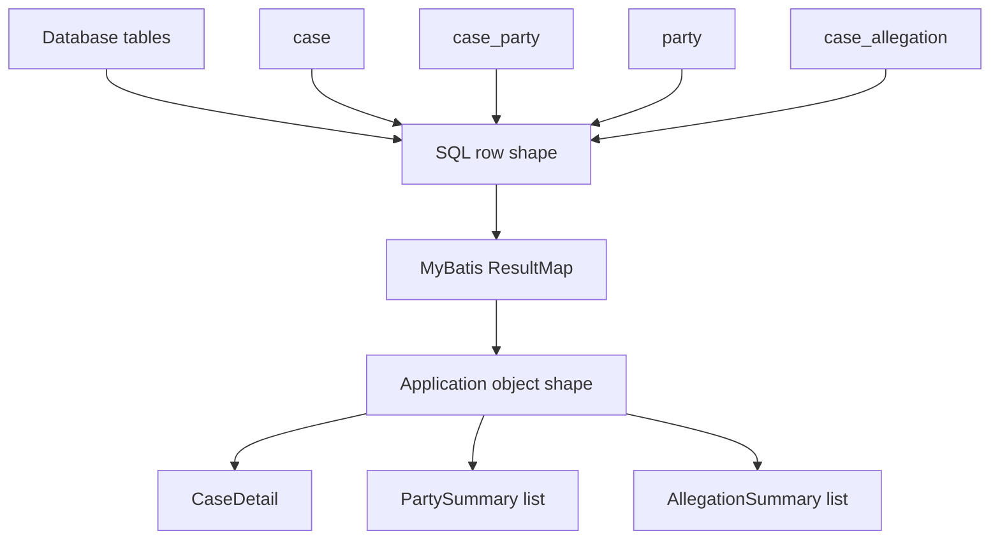
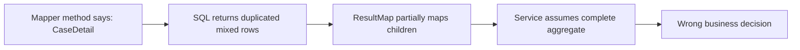
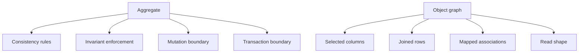
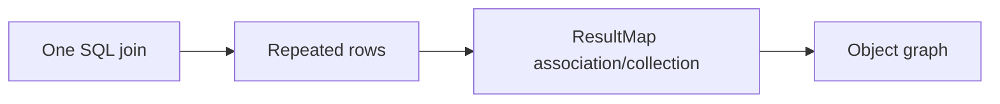
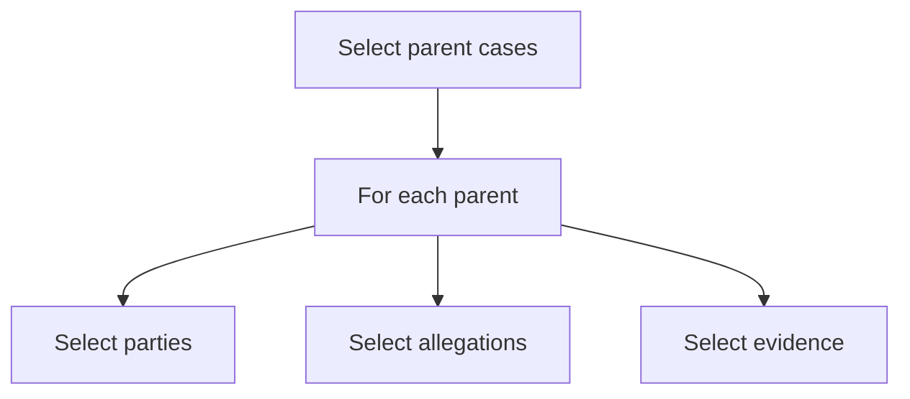
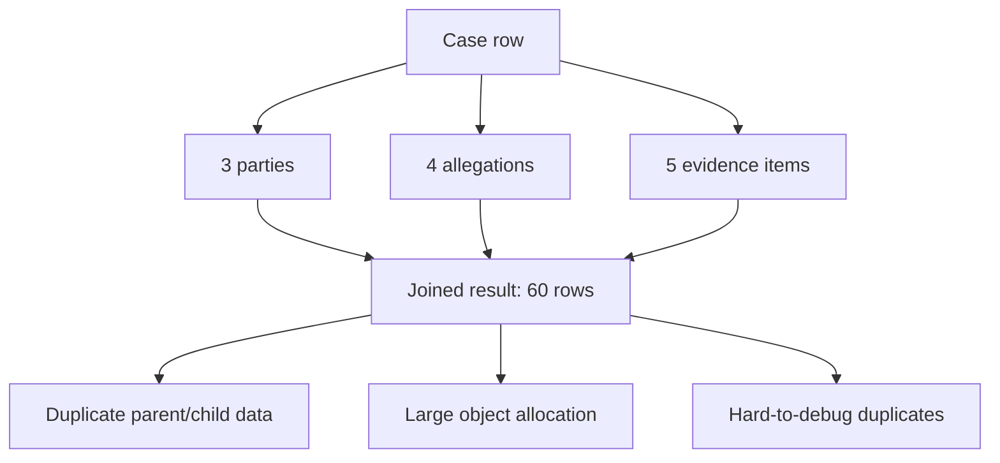
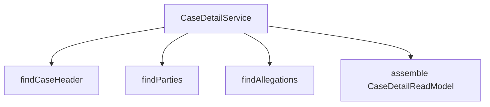

------
title: Learn Java MyBatis - Part 009
description: Advanced object graph mapping with MyBatis covering aggregate reconstruction, association, collection, join flattening, nested select trade-offs, identity handling, row explosion, and deliberate object shape control.
series: learn-java-mybatis
seriesTitle: Learn Java MyBatis, Patterns, Anti-Patterns, and Production Persistence Mapping
order: 9
partTitle: Advanced Object Graph Mapping
tags:
  - java
  - mybatis
  - resultmap
  - object-graph
  - aggregate
  - mapping
  - persistence
date: 2026-06-27
---

# Part 009 — Advanced Object Graph Mapping

## 1. The Core Problem

A relational database returns **rows**.

Your application usually wants **objects**.

For simple queries, this mapping is trivial:

```text
1 row -> 1 object
```

For real systems, the shape is rarely that simple:

```text
1 case -> many parties
1 case -> many allegations
1 case -> many evidence items
1 case -> many enforcement actions
1 case -> one current assignment
1 case -> one latest SLA state
```

That means one SQL result set may contain repeated parent columns, child columns, nullable child columns, partial child shapes, and multiple logical collections.

MyBatis can map these structures, but it will not design the object graph for you.

That is the main mental shift of this part:

> MyBatis gives you object graph mapping primitives. It does not give you aggregate design.

A strong engineer must decide:

- what graph depth is valid,
- what relationship should be joined,
- what relationship should be loaded separately,
- what object shape is safe for a use case,
- what data duplication is acceptable,
- what correctness risks appear from null child rows,
- what performance risks appear from row multiplication,
- and what should never be modeled as a nested graph at all.

---

## 2. Kaufman Framing

Josh Kaufman's method says: deconstruct the skill, learn enough to self-correct, remove friction, and practice deliberately.

For object graph mapping, the skill decomposes like this:

| Subskill | What You Must Master |
|---|---|
| Shape selection | Decide whether a query should return aggregate, projection, row view, or flat DTO |
| Relationship modeling | Distinguish one-to-one, one-to-many, many-to-many, and derived relationships |
| Join flattening | Understand how relational joins repeat parent data |
| Nested result mapping | Map joined rows into parent-child objects using `association` and `collection` |
| Nested select mapping | Load child objects with secondary statements and understand N+1 risk |
| Identity handling | Configure parent/child identifiers so MyBatis can collapse duplicate rows correctly |
| Null semantics | Prevent phantom child objects from outer joins |
| Graph depth control | Avoid accidental ORM behavior and uncontrolled object loading |
| Performance reasoning | Estimate row count, object allocation, network cost, and duplication |
| Testing discipline | Verify mapping shape with representative data, not only happy-path single-row data |

The target capability:

> Given a relational query result, you can predict exactly what object graph MyBatis will produce, where it can be wrong, and how much it will cost.

---

## 3. Mental Model: Row Shape vs Object Shape

Think in two layers.



The SQL decides the **row shape**.

The `ResultMap` decides the **object shape**.

The mapper method decides the **contract shape**.

A production bug usually happens when these three shapes drift:



A senior-level review does not ask only: "Does this query work?"

It asks:

- What exact graph does this statement promise?
- Is it complete or partial?
- Is the graph safe for mutation decisions?
- Is it read-only?
- Can this graph grow too large?
- Can a missing child row create a fake child object?
- Does the mapper method name reveal the graph depth?

---

## 4. Object Graph Mapping Is Not Aggregate Modeling

A common mistake is to treat a MyBatis object graph as if it were automatically a domain aggregate.

It is not.

An aggregate is a consistency boundary.

An object graph is a data shape.

Those are different concepts.



In a regulatory case-management system, a `Case` aggregate might enforce:

- only an assigned officer can recommend escalation,
- closed cases cannot accept new allegations,
- enforcement action cannot be created without validated evidence,
- status transition must follow allowed lifecycle rules,
- SLA breach must be recorded auditable.

A query returning `CaseDetail` with parties and allegations does not automatically enforce any of those rules.

Therefore:

> Do not confuse "I loaded a nested object" with "I loaded a valid aggregate for command handling".

---

## 5. Relationship Types and Mapping Strategy

### 5.1 One-to-one / many-to-one

Example:

```text
case -> current assignment
case -> assigned officer
case -> latest risk score
```

These are usually good candidates for `association` because they do not multiply parent rows much.

```xml
<resultMap id="CaseWithOfficerMap" type="com.acme.caseapp.read.CaseWithOfficer">
  <id property="caseId" column="case_id"/>
  <result property="caseNumber" column="case_number"/>
  <result property="status" column="case_status"/>

  <association property="assignedOfficer" javaType="com.acme.caseapp.read.OfficerSummary">
    <id property="officerId" column="officer_id"/>
    <result property="displayName" column="officer_name"/>
    <result property="unitCode" column="officer_unit_code"/>
  </association>
</resultMap>
```

The key rule:

> A nested `association` should have an explicit `<id>` mapping when the associated object has identity.

Without identifier mapping, duplicate detection and nested object composition become harder to reason about.

### 5.2 One-to-many

Example:

```text
case -> parties
case -> allegations
case -> evidence items
case -> timeline events
```

These are mapped using `collection`.

```xml
<resultMap id="CaseWithPartiesMap" type="com.acme.caseapp.read.CaseWithParties">
  <id property="caseId" column="case_id"/>
  <result property="caseNumber" column="case_number"/>
  <result property="status" column="case_status"/>

  <collection property="parties" ofType="com.acme.caseapp.read.PartySummary">
    <id property="partyId" column="party_id"/>
    <result property="partyName" column="party_name"/>
    <result property="roleCode" column="party_role_code"/>
  </collection>
</resultMap>
```

The risk is row multiplication.

If a case has five parties, the parent case columns are repeated five times.

That is acceptable for small bounded collections.

It becomes dangerous when the collection is unbounded.

### 5.3 Many-to-many

Example:

```text
evidence <-> allegation
case <-> related case
party <-> role
```

Many-to-many usually has an association table.

Avoid casually mapping large many-to-many structures as deep nested graphs.

A many-to-many graph can explode quickly:

```text
cases x allegations x evidence x parties
```

Prefer one of these strategies:

1. flat projection for the screen,
2. two-step loading with explicit query boundaries,
3. read model table/materialized view,
4. separate mapper method per collection,
5. graph assembler that merges bounded result sets in Java.

---

## 6. Joined Nested Result vs Nested Select

MyBatis supports two broad ways to load nested data.

### 6.1 Nested result

A nested result maps data from a joined result set.



Example:

```xml
<select id="findCaseWithParties" resultMap="CaseWithPartiesMap">
  SELECT
      c.id           AS case_id,
      c.case_number  AS case_number,
      c.status       AS case_status,
      p.id           AS party_id,
      p.name         AS party_name,
      cp.role_code   AS party_role_code
  FROM regulatory_case c
  LEFT JOIN case_party cp ON cp.case_id = c.id
  LEFT JOIN party p ON p.id = cp.party_id
  WHERE c.id = #{caseId}
  ORDER BY p.name ASC
</select>
```

Benefits:

- one database round trip,
- easier to reason about transaction snapshot,
- no hidden lazy query per parent,
- good for bounded children,
- good for read screens that need one compact graph.

Costs:

- repeated parent columns,
- row multiplication,
- more complex aliases,
- possible duplicate children if join is not constrained,
- difficult with multiple collections.

### 6.2 Nested select

A nested select calls another mapped statement to load a nested association or collection.



Example:

```xml
<resultMap id="CaseWithPartiesNestedSelectMap" type="com.acme.caseapp.read.CaseWithParties">
  <id property="caseId" column="case_id"/>
  <result property="caseNumber" column="case_number"/>
  <result property="status" column="case_status"/>

  <collection property="parties"
              column="case_id"
              select="com.acme.caseapp.persistence.CasePartyMapper.findPartiesByCaseId"/>
</resultMap>

<select id="findCaseWithPartiesByNestedSelect" resultMap="CaseWithPartiesNestedSelectMap">
  SELECT
      c.id          AS case_id,
      c.case_number AS case_number,
      c.status      AS case_status
  FROM regulatory_case c
  WHERE c.id = #{caseId}
</select>
```

Benefits:

- simpler parent SQL,
- child query can be reused,
- avoids multi-collection Cartesian product,
- useful when child collection is optional or loaded conditionally,
- clearer for complex child filtering.

Costs:

- N+1 risk,
- multiple database round trips,
- harder to see total query cost from one mapper method,
- can surprise reviewers,
- can become accidental lazy loading.

### 6.3 Decision table

| Situation | Prefer |
|---|---|
| One parent by id, one small child collection | Joined nested result |
| Page of many parents, each with child collection | Avoid nested select unless batch-loaded |
| Multiple unbounded child collections | Separate queries / assembler / read model |
| Complex search screen | Flat projection or query-specific read model |
| Mutation decision requiring strict aggregate state | Explicit aggregate loader with bounded graph |
| Dashboard/reporting | Projection, not domain graph |
| Need to reuse child query independently | Nested select or separate mapper method |
| Need predictable one-query behavior | Joined nested result |

---

## 7. The Row Multiplication Problem

Suppose one case has:

- 3 parties,
- 4 allegations,
- 5 evidence items.

If you join all three collections naively:

```sql
SELECT ...
FROM regulatory_case c
LEFT JOIN case_party cp ON cp.case_id = c.id
LEFT JOIN case_allegation ca ON ca.case_id = c.id
LEFT JOIN evidence e ON e.case_id = c.id
WHERE c.id = ?
```

The result may contain:

```text
3 x 4 x 5 = 60 rows
```

For one case.

If each row repeats case columns, party columns, allegation columns, and evidence columns, mapping becomes expensive and semantically fragile.



This is not a MyBatis bug.

This is relational algebra.

MyBatis can collapse some duplicates if `id` mapping is correct, but it cannot make a bad row shape cheap.

Production rule:

> Never join multiple unbounded one-to-many collections into a single object graph without a deliberate row-count budget.

---

## 8. Identity Mapping and Duplicate Collapse

For nested result mapping, identifiers matter.

Bad mapping:

```xml
<collection property="parties" ofType="PartySummary">
  <result property="partyId" column="party_id"/>
  <result property="partyName" column="party_name"/>
</collection>
```

Better mapping:

```xml
<collection property="parties" ofType="PartySummary">
  <id property="partyId" column="party_id"/>
  <result property="partyName" column="party_name"/>
</collection>
```

Why?

Because `<id>` tells MyBatis which columns identify the object in that part of the graph.

For a joined result set, this helps MyBatis reason about whether a row represents the same child object or a new child object.

Use `<id>` for:

- parent object identity,
- associated object identity,
- collection element identity,
- composite keys when relevant.

Composite identity example:

```xml
<collection property="assignments" ofType="AssignmentHistoryItem">
  <id property="caseId" column="case_id"/>
  <id property="assignmentSequence" column="assignment_sequence"/>
  <result property="officerId" column="officer_id"/>
  <result property="assignedAt" column="assigned_at"/>
</collection>
```

Do not map every field as `<id>`.

Only map identity fields as `<id>`.

---

## 9. Null Child Rows and Phantom Objects

Outer joins are common:

```sql
LEFT JOIN case_party cp ON cp.case_id = c.id
LEFT JOIN party p ON p.id = cp.party_id
```

When no party exists, the party columns are null.

A bad mapping may still create a child object with all null properties, depending on configuration and mapping details.

The symptom:

```java
caseDetail.parties().size() == 1
caseDetail.parties().get(0).partyId() == null
```

This is a phantom child.

Production rule:

> For every outer-joined child object, make the child identity column explicit and test the zero-child case.

Test data must include:

- parent with zero children,
- parent with one child,
- parent with multiple children,
- parent with child row containing nullable non-identity fields,
- parent with filtered-out children.

Example test intent:

```java
@Test
void should_not_create_phantom_party_when_case_has_no_parties() {
    CaseWithParties result = mapper.findCaseWithParties(caseWithoutPartiesId);

    assertThat(result.parties()).isEmpty();
}
```

---

## 10. Graph Depth Control

Deep object graphs feel convenient.

They are often dangerous.

```text
Case
 ├─ parties
 │   ├─ addresses
 │   ├─ representatives
 │   └─ riskFlags
 ├─ allegations
 │   ├─ evidenceLinks
 │   │   └─ evidence
 │   └─ legalBasis
 ├─ enforcementActions
 │   └─ approvals
 └─ timelineEvents
```

This shape may be useful for a detail screen, but terrible for a command handler that only needs case status and version.

Do not design mapper methods as if more data is always better.

A mapper method should declare graph depth through name and return type.

Bad:

```java
CaseRecord findById(UUID caseId);
```

Better:

```java
CaseHeaderRecord findHeaderById(UUID caseId);
CaseLifecycleRecord findLifecycleForCommand(UUID caseId);
CaseDetailReadModel findDetailReadModel(UUID caseId);
CaseWithPartiesReadModel findWithParties(UUID caseId);
CaseEscalationSnapshot findEscalationSnapshot(UUID caseId);
```

A good mapper API makes object shape explicit before you read the SQL.

---

## 11. Aggregate Loader Pattern

Use an aggregate loader when you need data for a command decision.

Example command:

```text
Recommend case escalation
```

The command may require:

- case id,
- status,
- version,
- assigned officer,
- current severity,
- open allegations count,
- latest SLA breach state,
- enforcement history summary.

It may not require:

- all party addresses,
- all evidence metadata,
- full timeline,
- all comments,
- document binary metadata.

Design a purpose-built snapshot:

```java
public record CaseEscalationSnapshot(
    UUID caseId,
    String caseNumber,
    CaseStatus status,
    long version,
    UUID assignedOfficerId,
    Severity severity,
    int openAllegationCount,
    boolean hasSlaBreach,
    boolean hasActiveEnforcementAction
) {}
```

Mapper:

```java
public interface CaseCommandMapper {
    Optional<CaseEscalationSnapshot> findEscalationSnapshot(UUID caseId);
}
```

SQL:

```xml
<select id="findEscalationSnapshot" resultMap="CaseEscalationSnapshotMap">
  SELECT
      c.id AS case_id,
      c.case_number AS case_number,
      c.status AS case_status,
      c.version AS case_version,
      c.assigned_officer_id AS assigned_officer_id,
      c.severity AS severity,
      (
        SELECT COUNT(*)
        FROM allegation a
        WHERE a.case_id = c.id
          AND a.status = 'OPEN'
      ) AS open_allegation_count,
      EXISTS (
        SELECT 1
        FROM sla_breach b
        WHERE b.case_id = c.id
          AND b.resolved_at IS NULL
      ) AS has_sla_breach,
      EXISTS (
        SELECT 1
        FROM enforcement_action ea
        WHERE ea.case_id = c.id
          AND ea.status IN ('DRAFT', 'ACTIVE')
      ) AS has_active_enforcement_action
  FROM regulatory_case c
  WHERE c.id = #{caseId}
</select>
```

The important point:

> Command snapshots should contain exactly the data needed to evaluate invariants, not a maximal graph.

---

## 12. Read Model Loader Pattern

For UI and reporting, prefer read models.

Example:

```java
public record CaseDetailReadModel(
    UUID caseId,
    String caseNumber,
    String title,
    String status,
    String assignedOfficerName,
    Instant createdAt,
    List<PartySummary> parties,
    List<AllegationSummary> allegations
) {}
```

This is not a domain aggregate.

It is a screen-oriented read shape.

Good naming makes that obvious:

```java
public interface CaseDetailReadMapper {
    Optional<CaseDetailReadModel> findCaseDetail(UUID caseId);
}
```

Avoid naming it:

```java
Case findById(UUID caseId);
```

because that implies a general-purpose domain object.

---

## 13. Split Query + Assembler Pattern

When one SQL join would multiply rows too much, use separate bounded queries and assemble in Java.



Example:

```java
public CaseDetailReadModel getCaseDetail(UUID caseId) {
    CaseHeader header = caseReadMapper.findHeader(caseId)
        .orElseThrow(() -> new CaseNotFoundException(caseId));

    List<PartySummary> parties = casePartyReadMapper.findParties(caseId);
    List<AllegationSummary> allegations = allegationReadMapper.findOpenAllegations(caseId);

    return new CaseDetailReadModel(
        header.caseId(),
        header.caseNumber(),
        header.title(),
        header.status(),
        header.assignedOfficerName(),
        header.createdAt(),
        parties,
        allegations
    );
}
```

This costs multiple queries.

But it avoids Cartesian multiplication and keeps each mapper simpler.

Use this pattern when:

- each collection has independent filtering/sorting,
- multiple collections are involved,
- child collections are bounded separately,
- object graph is a read model, not mutation aggregate,
- you need easy test diagnostics.

Do not use this pattern blindly for pages of many parents. For pages, it can become N+1 unless batch loading is used.

---

## 14. Batch Child Loading Pattern

For pages, avoid loading children one parent at a time.

Bad:

```java
List<CaseCard> cards = caseMapper.searchCases(criteria);
for (CaseCard card : cards) {
    card.setParties(casePartyMapper.findParties(card.caseId()));
}
```

This is classic N+1.

Better:

```java
List<CaseCard> cards = caseMapper.searchCases(criteria);
List<UUID> caseIds = cards.stream().map(CaseCard::caseId).toList();
List<PartySummaryRow> rows = casePartyMapper.findPartiesForCases(caseIds);
Map<UUID, List<PartySummary>> partiesByCaseId = groupParties(rows);

return cards.stream()
    .map(card -> card.withParties(partiesByCaseId.getOrDefault(card.caseId(), List.of())))
    .toList();
```

Mapper:

```xml
<select id="findPartiesForCases" resultType="PartySummaryRow">
  SELECT
      cp.case_id AS case_id,
      p.id AS party_id,
      p.name AS party_name,
      cp.role_code AS role_code
  FROM case_party cp
  JOIN party p ON p.id = cp.party_id
  WHERE cp.case_id IN
  <foreach collection="caseIds" item="caseId" open="(" separator="," close=")">
    #{caseId}
  </foreach>
  ORDER BY cp.case_id, p.name
</select>
```

The key is to use two or three predictable queries instead of one query per parent.

---

## 15. Multiple Collections: Avoid the Cartesian Trap

Suppose you need:

```text
CaseDetail
 ├─ parties
 └─ allegations
```

Option A: one big join.

```sql
SELECT ...
FROM regulatory_case c
LEFT JOIN case_party cp ON cp.case_id = c.id
LEFT JOIN party p ON p.id = cp.party_id
LEFT JOIN allegation a ON a.case_id = c.id
WHERE c.id = ?
```

If there are 4 parties and 7 allegations, you get 28 rows.

Option B: split queries.

```text
1 query for case header
1 query for parties
1 query for allegations
```

If there are 4 parties and 7 allegations, you get:

```text
1 + 4 + 7 = 12 rows
```

Option B is often better.

The latency trade-off depends on network, database, connection pool, and transaction boundary.

But from a mapping correctness perspective, Option B is simpler.

Production heuristic:

> One parent + one bounded collection is usually fine as nested result. One parent + multiple collections deserves suspicion. Page of parents + nested collection demands a batch strategy.

---

## 16. Many-to-Many Mapping Strategy

Example model:

```text
case
 ├─ allegations
 │   └─ evidence links
 │       └─ evidence
```

Avoid loading this as a deep graph unless the use case demands it.

Instead, create a row model:

```java
public record AllegationEvidenceLinkRow(
    UUID allegationId,
    String allegationCode,
    UUID evidenceId,
    String evidenceReference,
    String evidenceType
) {}
```

Mapper:

```xml
<select id="findEvidenceLinksForCase" resultType="AllegationEvidenceLinkRow">
  SELECT
      a.id AS allegation_id,
      a.allegation_code AS allegation_code,
      e.id AS evidence_id,
      e.reference_number AS evidence_reference,
      e.evidence_type AS evidence_type
  FROM allegation a
  JOIN allegation_evidence ae ON ae.allegation_id = a.id
  JOIN evidence e ON e.id = ae.evidence_id
  WHERE a.case_id = #{caseId}
  ORDER BY a.allegation_code, e.reference_number
</select>
```

Then assemble into the shape needed by the UI.

This has two advantages:

1. the SQL stays honest about relational shape,
2. the Java assembler owns object graph composition.

That is often easier to test than a huge nested `ResultMap`.

---

## 17. Ordering Inside Collections

A collection mapped from a result set inherits row order.

If the collection order matters, encode it in SQL.

Bad:

```sql
SELECT ...
FROM case_party cp
JOIN party p ON p.id = cp.party_id
WHERE cp.case_id = #{caseId}
```

Better:

```sql
SELECT ...
FROM case_party cp
JOIN party p ON p.id = cp.party_id
WHERE cp.case_id = #{caseId}
ORDER BY cp.role_priority ASC, p.name ASC, p.id ASC
```

Always add deterministic tie-breakers.

Why?

Because non-deterministic order creates flaky tests, unstable UI diffs, and hard-to-debug cache variation.

---

## 18. Graph Shape and Transaction Snapshot

When you split queries, ask whether all queries must observe the same database snapshot.

For a simple read screen, minor drift may be tolerable.

For command validation, drift may be unacceptable.

Example risk:

```text
Query 1: load case status = OPEN
Query 2: load allegations = 2 open allegations
Between query 1 and query 2: another transaction closes the case
Command proceeds with inconsistent snapshot
```

When consistency matters:

- run queries inside an explicit transaction,
- use appropriate isolation level,
- use optimistic version checks,
- load only what is required for decision,
- perform guarded update with expected state/version.

Example guarded update:

```xml
<update id="markCaseRecommendedForEscalation">
  UPDATE regulatory_case
  SET status = 'ESCALATION_RECOMMENDED',
      version = version + 1,
      updated_at = CURRENT_TIMESTAMP
  WHERE id = #{caseId}
    AND status = 'OPEN'
    AND version = #{expectedVersion}
</update>
```

The object graph is not the final safety mechanism.

The database update guard is.

---

## 19. Avoid Accidental ORM Behavior

MyBatis can map nested graphs, but it should not become a weak reimplementation of Hibernate.

Anti-pattern:

```java
CaseRecord caseRecord = caseMapper.findEverything(caseId);
caseRecord.getParties().get(0).getAddresses().get(0).getCountry().getRegion().getPolicies();
```

This style creates:

- unclear query boundaries,
- large graphs,
- hidden performance cost,
- business logic coupled to persistence shape,
- unpredictable future changes,
- accidental domain model leakage.

Better:

```java
CaseEscalationSnapshot snapshot = caseCommandMapper.findEscalationSnapshot(caseId)
    .orElseThrow(...);

EscalationDecision decision = escalationPolicy.evaluate(snapshot);
```

or:

```java
CaseDetailReadModel detail = caseDetailReadService.getCaseDetail(caseId);
```

The use case chooses the shape.

The mapper does not expose "everything".

---

## 20. Explicit Graph Naming Convention

Use names that encode shape.

| Mapper Method | Meaning |
|---|---|
| `findHeaderById` | Parent row only, small object |
| `findDetailById` | Screen detail shape, not command aggregate |
| `findWithPartiesById` | Parent with party collection |
| `findEscalationSnapshot` | Command decision snapshot |
| `findTimelineForCase` | Child collection query |
| `findPartyRowsForCases` | Batch child loading row query |
| `findEvidenceLinksForCase` | Flat many-to-many row view |

Avoid names like:

- `getCase`,
- `loadCase`,
- `findFullCase`,
- `findCompleteCase`,
- `findEverything`,
- `getCaseData`.

They do not express shape or cost.

---

## 21. Object Graph Mapping Patterns

### 21.1 Single bounded collection pattern

Use when one parent has one small collection.

```text
Case -> parties
```

Characteristics:

- one SQL join,
- explicit parent `<id>`,
- explicit child `<id>`,
- deterministic `ORDER BY`,
- zero-child test.

### 21.2 Header plus batch children pattern

Use for pages.

```text
Page<CaseCard> + parties for visible case ids
```

Characteristics:

- search parent page first,
- collect ids,
- load children using `IN`,
- group in Java,
- no nested select per parent.

### 21.3 Command snapshot pattern

Use for decisions.

```text
CaseEscalationSnapshot
```

Characteristics:

- no large graph,
- contains invariant inputs,
- includes version,
- used with guarded update.

### 21.4 Flat relation row pattern

Use for many-to-many.

```text
AllegationEvidenceLinkRow
```

Characteristics:

- SQL exposes relation rows,
- Java assembler groups if needed,
- avoids deep nested `ResultMap`.

### 21.5 Read model assembler pattern

Use for complex UI detail pages.

```text
header + parties + allegations + SLA + timeline summary
```

Characteristics:

- explicit service-level composition,
- simple mapper methods,
- testable child loaders,
- avoids multi-collection row explosion.

---

## 22. Anti-Patterns

### 22.1 The monster result map

Smell:

```xml
<resultMap id="CaseEverythingMap" type="Case">
  <!-- hundreds of lines -->
</resultMap>
```

Why it fails:

- hard to review,
- hard to test,
- unclear use case,
- likely over-fetching,
- fragile aliases,
- hidden row explosion.

Better:

- split into use-case-specific maps,
- use read models,
- use assembler pattern.

### 22.2 The multiple collection join

Smell:

```sql
case
LEFT JOIN parties
LEFT JOIN allegations
LEFT JOIN evidence
LEFT JOIN comments
```

Why it fails:

- multiplicative rows,
- duplicate child confusion,
- memory pressure,
- unstable performance as data grows.

Better:

- split queries,
- load batches,
- use read model tables,
- set hard limits.

### 22.3 The nested select page

Smell:

```java
List<CaseDetail> searchCases(CaseSearchCriteria criteria);
```

where result mapping performs nested select per case.

Why it fails:

- N+1 queries,
- database round-trip amplification,
- performance collapse under page size growth.

Better:

- page parent rows,
- batch-load children,
- assemble.

### 22.4 The domain aggregate illusion

Smell:

```java
Case case = caseMapper.findDetailById(caseId);
case.close();
```

Why it fails:

- detail read model may not include all invariant data,
- nested graph may be stale,
- command safety belongs to transaction and guarded update.

Better:

- command snapshot,
- domain method receives explicit invariant inputs,
- guarded update validates expected state.

### 22.5 The null child bug

Smell:

```java
assertThat(caseDetail.parties()).hasSize(1);
assertThat(caseDetail.parties().get(0).partyId()).isNull();
```

Better:

- explicit child `<id>`,
- zero-child tests,
- avoid ambiguous outer join mapping.

---

## 23. Testing Object Graph Mapping

Mapper tests should use data that proves shape.

Minimum dataset for one-to-many mapping:

| Case | Parties | Allegations | Purpose |
|---|---:|---:|---|
| C-001 | 0 | 0 | proves no phantom child |
| C-002 | 1 | 0 | proves single child mapping |
| C-003 | 3 | 0 | proves duplicate collapse and ordering |
| C-004 | 3 | 4 | proves multi-collection strategy avoids row explosion |
| C-005 | 1 with nullable fields | 0 | proves nullable child field does not suppress child |

Example assertions:

```java
@Test
void should_map_case_with_parties_in_deterministic_order() {
    CaseWithParties result = mapper.findCaseWithParties(caseId);

    assertThat(result.caseId()).isEqualTo(caseId);
    assertThat(result.parties())
        .extracting(PartySummary::partyName)
        .containsExactly("Alpha Ltd", "Beta LLC", "Gamma Inc");
}
```

```java
@Test
void should_not_duplicate_parties_when_join_repeats_parent_rows() {
    CaseWithParties result = mapper.findCaseWithParties(caseId);

    assertThat(result.parties())
        .extracting(PartySummary::partyId)
        .doesNotHaveDuplicates();
}
```

```java
@Test
void should_not_load_large_graph_for_escalation_snapshot() {
    CaseEscalationSnapshot snapshot = commandMapper.findEscalationSnapshot(caseId).orElseThrow();

    assertThat(snapshot.openAllegationCount()).isGreaterThanOrEqualTo(0);
    assertThat(snapshot.hasActiveEnforcementAction()).isIn(true, false);
}
```

The goal is not only to test field values.

The goal is to test graph shape.

---

## 24. Code Review Checklist

Use this checklist for every nested mapping PR.

### 24.1 Shape

- Is the returned object a domain aggregate, read model, projection, or row model?
- Does the method name reveal graph depth?
- Is the graph bounded?
- Is this shape needed by the use case?
- Is this over-fetching?

### 24.2 SQL

- How many rows can the query return for one parent?
- Are multiple one-to-many collections joined together?
- Is `ORDER BY` deterministic?
- Are outer joins required?
- Are filters applied to the correct side of the join?
- Is tenant filtering present where required?

### 24.3 ResultMap

- Does every identity-bearing object use `<id>`?
- Are aliases explicit and stable?
- Are nested associations/collections tested?
- Is the zero-child case tested?
- Could nullable child fields create phantom objects?
- Is the map too large for review?

### 24.4 Performance

- Is this one query, N+1 queries, or split bounded queries?
- What is the worst-case row count?
- What is the maximum collection size?
- Does this run on a detail screen, search page, batch job, or command path?
- Is there a monitoring signal for slow execution?

### 24.5 Correctness

- Is this graph used for command decisions?
- If yes, is there version/state guarding on update?
- Are invariants evaluated from complete data?
- Is transaction isolation sufficient?
- Is stale data acceptable?

---

## 25. Deliberate Practice

### Exercise 1 — Predict row count

Given:

```text
1 case
4 parties
5 allegations
3 evidence items per allegation
```

Predict row count for:

1. case joined to parties only,
2. case joined to allegations only,
3. case joined to parties and allegations,
4. case joined to parties, allegations, and evidence.

Then decide which shapes should be nested result and which should be split query.

### Exercise 2 — Refactor a monster graph

Given a mapper method:

```java
CaseRecord findCompleteCase(UUID caseId);
```

Break it into:

- command snapshot,
- detail read model,
- child collection query,
- many-to-many flat row query.

Write method names and return types.

### Exercise 3 — Test phantom child behavior

Create a dataset where a case has zero parties.

Write a mapper test proving the `parties` collection is empty, not a list containing one null-valued object.

### Exercise 4 — Batch load children for a search page

Given a search result page of 20 cases, design:

- parent query,
- child query using `IN`,
- grouping function,
- final read model assembly.

### Exercise 5 — Choose nested result vs nested select

For each scenario, choose a strategy and justify:

| Scenario | Strategy |
|---|---|
| Case detail page with 5 parties max | ? |
| Search page with 50 cases and party badges | ? |
| Case detail page with parties and allegations | ? |
| Evidence graph with many-to-many allegations | ? |
| Escalation command validation | ? |

---

## 26. Engineering Heuristics

Keep these rules close:

1. A joined object graph is a row-shape decision before it is a Java mapping decision.
2. One bounded collection is usually manageable.
3. Multiple collections deserve suspicion.
4. Pages with nested selects are N+1 traps.
5. Use `<id>` for every identity-bearing nested object.
6. Test zero-child cases.
7. Do not use detail read models for command invariants.
8. Use command snapshots for mutation decisions.
9. Use flat row models for many-to-many relationships.
10. Prefer explicit assembler logic over unreadable monster `ResultMap`s.
11. Method names should reveal graph depth and use case.
12. Deterministic ordering belongs in SQL.
13. Split queries are not less professional; they are often more honest.
14. Guard updates in SQL even if the object graph looked valid.
15. MyBatis is a mapping tool, not an aggregate consistency engine.

---

## 27. Summary

Advanced object graph mapping in MyBatis is about controlling the relationship between:

- relational row shape,
- SQL join strategy,
- `ResultMap` identity mapping,
- object graph depth,
- use-case-specific return type,
- performance budget,
- and correctness boundary.

The strongest design is rarely "load everything".

The strongest design is:

- load exactly the shape the use case needs,
- make that shape visible in the mapper contract,
- keep row multiplication bounded,
- test graph shape explicitly,
- and protect command decisions with transaction and update guards.

In the next part, we move deeper into **projections, read models, and query-specific shapes**.

That is where MyBatis becomes especially powerful: not because it hides SQL, but because it lets you design precise read shapes without pretending every query must hydrate a domain entity.

---

## References

- MyBatis 3 Mapper XML Files: https://mybatis.org/mybatis-3/sqlmap-xml.html
- MyBatis 3 Java API: https://mybatis.org/mybatis-3/java-api.html
- MyBatis Dynamic SQL Select Statements: https://mybatis.org/mybatis-dynamic-sql/docs/select.html
