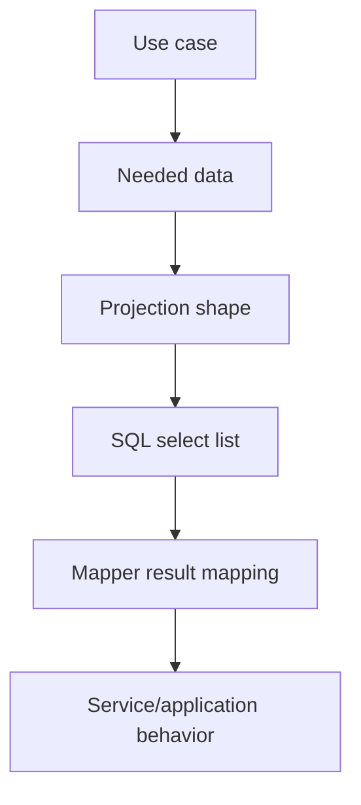
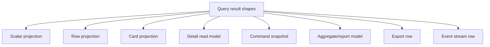

------
title: Learn Java MyBatis - Part 010
description: Projection and read model design with MyBatis covering query-specific shapes, DTO boundaries, reporting models, dashboard queries, regulatory case-management read models, API response projections, and projection evolution.
series: learn-java-mybatis
seriesTitle: Learn Java MyBatis, Patterns, Anti-Patterns, and Production Persistence Mapping
order: 10
partTitle: Projections, Read Models, and Query-Specific Shapes
tags:
  - java
  - mybatis
  - projection
  - read-model
  - dto
  - query-design
  - architecture
date: 2026-06-27
---

# Part 010 — Projections, Read Models, and Query-Specific Shapes

## 1. The Core Idea

A common beginner mistake is to map every query into the same object.

```java
CaseRecord findById(UUID caseId);
List<CaseRecord> search(CaseSearchCriteria criteria);
List<CaseRecord> findCasesForDashboard(UUID officerId);
List<CaseRecord> findOverdueCases(Instant now);
```

This feels simple at first.

It becomes expensive later.

Different use cases need different data shapes:

| Use Case | Needed Shape |
|---|---|
| Case detail screen | rich read model with parties, allegations, assignment summary |
| Search result page | compact row card with status, severity, owner, SLA badge |
| Escalation command | invariant snapshot with status, version, severity, counts |
| Dashboard | aggregated counters and queues |
| Export | denormalized tabular row |
| Audit review | chronological event stream |
| API response | stable external contract DTO |

MyBatis is particularly strong when you accept this:

> Not every query should return an entity. Most production queries should return use-case-specific shapes.

This part is about designing those shapes deliberately.

---

## 2. Kaufman Framing

Using Josh Kaufman's learning model, projection design decomposes into these subskills:

| Subskill | What You Must Learn |
|---|---|
| Shape selection | Decide what data shape the use case actually needs |
| Boundary naming | Name DTOs/read models so their lifecycle and ownership are clear |
| SQL-column discipline | Select only columns needed by the shape |
| Alias stability | Use explicit aliases matching projection properties |
| Query specificity | Avoid generic queries that pretend one shape fits all |
| Evolution control | Change projections without breaking callers |
| Reporting design | Build flat, aggregate, and grouped models intentionally |
| API separation | Avoid leaking persistence read models as external API contracts |
| Performance budgeting | Make shape cheaper than full object graph loading |
| Test discipline | Verify projection fields, nullability, and sorting semantics |

The target capability:

> You can design a MyBatis mapper layer where each query shape is clear, minimal, testable, and aligned to a use case.

---

## 3. Why Projections Matter More in MyBatis

In ORM-heavy systems, developers often think in terms of entities and relationships.

In MyBatis systems, you should think in terms of **query contracts**.



The query contract should answer:

- What question is this query answering?
- What fields does the caller need?
- Is this object mutable or read-only?
- Is this data complete enough for a command decision?
- Is this shape stable enough for API response?
- Can this query be paged, sorted, and filtered safely?
- What is the worst-case cost?

A projection is not merely a smaller entity.

A projection is a **purpose-built answer**.

---

## 4. Entity Obsession

Entity obsession is the habit of using the same entity-shaped object everywhere.

Example:

```java
public class CaseRecord {
    private UUID id;
    private String caseNumber;
    private String title;
    private String description;
    private String status;
    private String severity;
    private UUID assignedOfficerId;
    private Instant createdAt;
    private Instant updatedAt;
    private List<PartyRecord> parties;
    private List<AllegationRecord> allegations;
    private List<EvidenceRecord> evidenceItems;
}
```

Then this object is reused for:

- search results,
- dashboards,
- command decisions,
- exports,
- REST responses,
- background jobs,
- audit screens.

This creates several problems:

1. callers cannot tell which fields are populated,
2. accidental nulls become normal,
3. queries over-fetch,
4. object graph depth becomes ambiguous,
5. API contracts leak persistence concerns,
6. tests become weak because every shape is optional,
7. adding fields feels harmless but increases query cost.

Replace entity obsession with shape ownership.

---

## 5. Projection Taxonomy

Use distinct categories.



### 5.1 Scalar projection

A single value.

```java
boolean existsOpenCaseForParty(UUID partyId);
int countOpenAllegations(UUID caseId);
Optional<Instant> findLatestEscalationDate(UUID caseId);
```

Use for:

- existence checks,
- counts,
- max/min values,
- guard conditions,
- simple policy inputs.

### 5.2 Row projection

A flat row directly matching SQL.

```java
public record CaseSearchRow(
    UUID caseId,
    String caseNumber,
    String title,
    String status,
    String severity,
    String assignedOfficerName,
    Instant createdAt
) {}
```

Use for:

- search results,
- tables,
- batch processing,
- export source rows,
- relation rows.

### 5.3 Card projection

A compact shape for UI cards or list items.

```java
public record CaseCard(
    UUID caseId,
    String caseNumber,
    String title,
    String statusLabel,
    String severityLabel,
    String assignedOfficerDisplayName,
    boolean overdue,
    int openAllegationCount
) {}
```

Use for:

- dashboard queues,
- cards,
- mobile summary screens,
- worklist rows.

### 5.4 Detail read model

A richer read-only shape.

```java
public record CaseDetailReadModel(
    UUID caseId,
    String caseNumber,
    String title,
    String status,
    String severity,
    OfficerSummary assignedOfficer,
    List<PartySummary> parties,
    List<AllegationSummary> allegations,
    SlaSummary sla
) {}
```

Use for:

- detail screens,
- internal review screens,
- read-only workflow pages.

### 5.5 Command snapshot

A shape specifically for command decision.

```java
public record CaseClosureSnapshot(
    UUID caseId,
    String status,
    long version,
    int openAllegationCount,
    int pendingEvidenceCount,
    boolean hasActiveEnforcementAction
) {}
```

Use for:

- command validation,
- invariant checks,
- state transition guards.

### 5.6 Aggregate/report model

A grouped or summarized result.

```java
public record OfficerQueueMetrics(
    UUID officerId,
    String officerName,
    int openCaseCount,
    int overdueCaseCount,
    int highSeverityCaseCount
) {}
```

Use for:

- dashboards,
- reporting,
- operational metrics,
- workload distribution.

### 5.7 Export row

A stable tabular shape.

```java
public record CaseExportRow(
    String caseNumber,
    String status,
    String severity,
    String assignedOfficer,
    String partyName,
    String allegationCode,
    Instant createdAt,
    Instant closedAt
) {}
```

Use for:

- CSV,
- XLSX,
- regulatory reporting,
- external data extracts.

---

## 6. Projection Naming Rules

Names should reveal intent.

Good names:

```text
CaseSearchRow
CaseCard
CaseDetailReadModel
CaseEscalationSnapshot
CaseClosureSnapshot
CaseExportRow
OfficerQueueMetrics
AllegationEvidenceLinkRow
CaseTimelineItem
```

Weak names:

```text
CaseDto
CaseData
CaseInfo
CaseResult
CaseResponse
CaseView
CaseModel
```

Why weak names hurt:

- unclear use case,
- unclear completeness,
- unclear ownership,
- unclear evolution rules,
- too easy to reuse incorrectly.

Prefer suffixes with meaning:

| Suffix | Meaning |
|---|---|
| `Row` | flat database/query row |
| `Card` | compact UI list/card shape |
| `ReadModel` | read-only use-case model, may compose multiple query results |
| `Snapshot` | command/invariant decision input |
| `Metrics` | aggregated measurement |
| `Summary` | nested compact child shape |
| `ExportRow` | denormalized output row |
| `TimelineItem` | event-like ordered item |

---

## 7. Projection Package Structure

For large systems, do not dump every projection into `dto`.

Better:

```text
com.acme.caseapp
  casework
    persistence
      mapper
        CaseSearchMapper.java
        CaseDetailMapper.java
        CaseCommandMapper.java
      readmodel
        CaseSearchRow.java
        CaseCard.java
        CaseDetailReadModel.java
        PartySummary.java
        AllegationSummary.java
      commandmodel
        CaseEscalationSnapshot.java
        CaseClosureSnapshot.java
      export
        CaseExportRow.java
```

Alternative by bounded context:

```text
casework
  search
    CaseSearchMapper.java
    CaseSearchCriteria.java
    CaseSearchRow.java
  detail
    CaseDetailMapper.java
    CaseDetailReadModel.java
  command
    CaseCommandMapper.java
    CaseClosureSnapshot.java
  reporting
    CaseReportingMapper.java
    OfficerQueueMetrics.java
```

The second structure is often better for large teams because it groups by use case.

---

## 8. SQL Select List Discipline

Projection design starts with the select list.

Bad:

```xml
<select id="searchCases" resultType="CaseSearchRow">
  SELECT c.*
  FROM regulatory_case c
  WHERE c.status = #{status}
</select>
```

Better:

```xml
<select id="searchCases" resultType="CaseSearchRow">
  SELECT
      c.id AS case_id,
      c.case_number AS case_number,
      c.title AS title,
      c.status AS status,
      c.severity AS severity,
      o.display_name AS assigned_officer_name,
      c.created_at AS created_at
  FROM regulatory_case c
  LEFT JOIN officer o ON o.id = c.assigned_officer_id
  WHERE c.status = #{status}
  ORDER BY c.created_at DESC, c.id DESC
</select>
```

Why explicit columns matter:

- schema changes are less likely to silently alter query shape,
- result mapping is reviewable,
- network payload is smaller,
- accidental sensitive columns are not selected,
- query plans can be reasoned about,
- projection fields stay intentional.

Production rule:

> Projection queries should almost never use `SELECT *`.

---

## 9. Alias Discipline

Use aliases that map clearly to projection fields.

Example record:

```java
public record CaseSearchRow(
    UUID caseId,
    String caseNumber,
    String title,
    String status,
    String severity,
    String assignedOfficerName,
    Instant createdAt
) {}
```

SQL:

```sql
SELECT
    c.id AS case_id,
    c.case_number AS case_number,
    c.title AS title,
    c.status AS status,
    c.severity AS severity,
    o.display_name AS assigned_officer_name,
    c.created_at AS created_at
```

Result map:

```xml
<resultMap id="CaseSearchRowMap" type="com.acme.casework.search.CaseSearchRow">
  <constructor>
    <arg column="case_id" javaType="java.util.UUID"/>
    <arg column="case_number" javaType="string"/>
    <arg column="title" javaType="string"/>
    <arg column="status" javaType="string"/>
    <arg column="severity" javaType="string"/>
    <arg column="assigned_officer_name" javaType="string"/>
    <arg column="created_at" javaType="java.time.Instant"/>
  </constructor>
</resultMap>
```

If you rely on auto-mapping, still keep aliases explicit.

Do not depend on incidental database column names.

---

## 10. Constructor-Based Projection Mapping

Java records are useful for projections because they are immutable and compact.

```java
public record CaseSearchRow(
    UUID caseId,
    String caseNumber,
    String title,
    String status,
    String severity,
    String assignedOfficerName,
    Instant createdAt
) {}
```

Use constructor mapping when you want:

- immutability,
- no setters,
- no partially populated object,
- clear field requirement,
- better test assertions.

Example:

```xml
<resultMap id="CaseSearchRowMap" type="com.acme.casework.search.CaseSearchRow">
  <constructor>
    <arg column="case_id" javaType="java.util.UUID"/>
    <arg column="case_number" javaType="string"/>
    <arg column="title" javaType="string"/>
    <arg column="status" javaType="string"/>
    <arg column="severity" javaType="string"/>
    <arg column="assigned_officer_name" javaType="string"/>
    <arg column="created_at" javaType="java.time.Instant"/>
  </constructor>
</resultMap>
```

For frequently changed search rows, you may choose setter-based mapping for lower friction.

But for command snapshots, prefer immutable constructor mapping.

---

## 11. Search Result Projection

A search screen should not load a detail graph.

Typical search row:

```java
public record CaseSearchRow(
    UUID caseId,
    String caseNumber,
    String title,
    String status,
    String severity,
    String assignedOfficerName,
    Instant createdAt,
    Instant dueAt,
    boolean overdue
) {}
```

Mapper:

```java
public interface CaseSearchMapper {
    List<CaseSearchRow> searchCases(CaseSearchCriteria criteria);
}
```

SQL:

```xml
<select id="searchCases" resultMap="CaseSearchRowMap">
  SELECT
      c.id AS case_id,
      c.case_number AS case_number,
      c.title AS title,
      c.status AS status,
      c.severity AS severity,
      o.display_name AS assigned_officer_name,
      c.created_at AS created_at,
      c.due_at AS due_at,
      CASE
        WHEN c.due_at < CURRENT_TIMESTAMP AND c.status NOT IN ('CLOSED', 'CANCELLED')
        THEN TRUE
        ELSE FALSE
      END AS overdue
  FROM regulatory_case c
  LEFT JOIN officer o ON o.id = c.assigned_officer_id
  <where>
    <if test="status != null">
      c.status = #{status}
    </if>
    <if test="severity != null">
      AND c.severity = #{severity}
    </if>
    <if test="assignedOfficerId != null">
      AND c.assigned_officer_id = #{assignedOfficerId}
    </if>
    <if test="createdFrom != null">
      AND c.created_at &gt;= #{createdFrom}
    </if>
    <if test="createdTo != null">
      AND c.created_at &lt; #{createdTo}
    </if>
  </where>
  ORDER BY c.created_at DESC, c.id DESC
  LIMIT #{limit}
  OFFSET #{offset}
</select>
```

Important points:

- select only fields visible in the search result,
- avoid child collections,
- use deterministic ordering,
- keep pagination stable,
- compute simple badges in SQL only when stable and obvious,
- move complex policy labels to Java if SQL would obscure business meaning.

---

## 12. Dashboard and Work Queue Projections

Dashboards often need aggregated shapes.

Example:

```java
public record OfficerWorkQueueRow(
    UUID officerId,
    String officerName,
    int openCaseCount,
    int overdueCaseCount,
    int highSeverityCaseCount,
    Instant oldestOpenCaseCreatedAt
) {}
```

SQL:

```xml
<select id="findOfficerWorkQueue" resultMap="OfficerWorkQueueRowMap">
  SELECT
      o.id AS officer_id,
      o.display_name AS officer_name,
      COUNT(c.id) AS open_case_count,
      SUM(CASE WHEN c.due_at &lt; CURRENT_TIMESTAMP THEN 1 ELSE 0 END) AS overdue_case_count,
      SUM(CASE WHEN c.severity = 'HIGH' THEN 1 ELSE 0 END) AS high_severity_case_count,
      MIN(c.created_at) AS oldest_open_case_created_at
  FROM officer o
  LEFT JOIN regulatory_case c
    ON c.assigned_officer_id = o.id
   AND c.status IN ('OPEN', 'UNDER_REVIEW', 'ESCALATION_RECOMMENDED')
  WHERE o.active = TRUE
  GROUP BY o.id, o.display_name
  ORDER BY overdue_case_count DESC, open_case_count DESC, o.display_name ASC
</select>
```

Dashboard projections should be designed with caution:

- aggregation semantics must be agreed with business users,
- filters must match operational definitions,
- time zone and date boundary rules matter,
- counts should be reproducible,
- query plans must be reviewed,
- results may need materialization if expensive.

Do not hide a complex reporting definition behind a vague method like:

```java
List<OfficerDto> getDashboard();
```

Prefer:

```java
List<OfficerWorkQueueRow> findOfficerWorkQueue(WorkQueueCriteria criteria);
```

---

## 13. Detail Read Model Projection

A detail screen often composes several projections.

```java
public record CaseDetailReadModel(
    CaseHeader header,
    List<PartySummary> parties,
    List<AllegationSummary> allegations,
    SlaSummary sla,
    List<TimelineItem> latestTimelineItems
) {}
```

Each child shape is small and purposeful:

```java
public record CaseHeader(
    UUID caseId,
    String caseNumber,
    String title,
    String status,
    String severity,
    String assignedOfficerName,
    Instant createdAt,
    Instant updatedAt
) {}
```

```java
public record PartySummary(
    UUID partyId,
    String partyName,
    String partyType,
    String roleCode
) {}
```

```java
public record AllegationSummary(
    UUID allegationId,
    String allegationCode,
    String status,
    String legalBasisCode
) {}
```

Detail service:

```java
public CaseDetailReadModel getCaseDetail(UUID caseId) {
    CaseHeader header = caseDetailMapper.findHeader(caseId)
        .orElseThrow(() -> new CaseNotFoundException(caseId));

    List<PartySummary> parties = caseDetailMapper.findParties(caseId);
    List<AllegationSummary> allegations = caseDetailMapper.findAllegations(caseId);
    SlaSummary sla = caseDetailMapper.findSlaSummary(caseId);
    List<TimelineItem> timeline = caseTimelineMapper.findLatestItems(caseId, 20);

    return new CaseDetailReadModel(header, parties, allegations, sla, timeline);
}
```

This is often better than a huge nested result map because each child query has independent meaning and test coverage.

---

## 14. API Response Projection vs Internal Read Model

Do not assume internal read models are API contracts.

Internal read model:

```java
public record CaseDetailReadModel(
    CaseHeader header,
    List<PartySummary> parties,
    List<AllegationSummary> allegations,
    SlaSummary sla
) {}
```

API response:

```java
public record CaseDetailResponse(
    String caseNumber,
    String title,
    String statusLabel,
    String severityLabel,
    List<PartyResponse> parties,
    List<AllegationResponse> allegations,
    SlaResponse sla
) {}
```

Why separate them?

- API may hide internal ids,
- API may expose labels instead of codes,
- API versioning has different lifecycle,
- API may require localization,
- API may require authorization filtering,
- internal read model may contain fields not safe externally,
- persistence changes should not automatically change API.

Mapping layer:

```java
public CaseDetailResponse toResponse(CaseDetailReadModel model, UserContext user) {
    return new CaseDetailResponse(
        model.header().caseNumber(),
        model.header().title(),
        labelService.statusLabel(model.header().status(), user.locale()),
        labelService.severityLabel(model.header().severity(), user.locale()),
        model.parties().stream().map(this::toPartyResponse).toList(),
        model.allegations().stream().map(this::toAllegationResponse).toList(),
        toSlaResponse(model.sla())
    );
}
```

Production rule:

> MyBatis projections may feed API DTOs, but they should not automatically become API DTOs.

---

## 15. Command Snapshot Projection

Command snapshots are different from read models.

A read model answers:

```text
What should the user see?
```

A command snapshot answers:

```text
Can this state transition happen safely?
```

Example:

```java
public record CaseCloseSnapshot(
    UUID caseId,
    String status,
    long version,
    int openAllegationCount,
    int pendingEvidenceReviewCount,
    boolean hasUnresolvedSlaBreach,
    boolean hasActiveEnforcementAction
) {}
```

Mapper:

```xml
<select id="findCloseSnapshot" resultMap="CaseCloseSnapshotMap">
  SELECT
      c.id AS case_id,
      c.status AS status,
      c.version AS version,
      (
        SELECT COUNT(*)
        FROM allegation a
        WHERE a.case_id = c.id
          AND a.status IN ('OPEN', 'UNDER_REVIEW')
      ) AS open_allegation_count,
      (
        SELECT COUNT(*)
        FROM evidence e
        WHERE e.case_id = c.id
          AND e.review_status = 'PENDING'
      ) AS pending_evidence_review_count,
      EXISTS (
        SELECT 1
        FROM sla_breach b
        WHERE b.case_id = c.id
          AND b.resolved_at IS NULL
      ) AS has_unresolved_sla_breach,
      EXISTS (
        SELECT 1
        FROM enforcement_action ea
        WHERE ea.case_id = c.id
          AND ea.status IN ('DRAFT', 'ACTIVE')
      ) AS has_active_enforcement_action
  FROM regulatory_case c
  WHERE c.id = #{caseId}
</select>
```

Then command handler:

```java
@Transactional
public void closeCase(CloseCaseCommand command) {
    CaseCloseSnapshot snapshot = caseCommandMapper.findCloseSnapshot(command.caseId())
        .orElseThrow(() -> new CaseNotFoundException(command.caseId()));

    closePolicy.validate(snapshot);

    int updated = caseCommandMapper.closeCase(
        command.caseId(),
        snapshot.version(),
        command.reason(),
        command.actorId()
    );

    if (updated != 1) {
        throw new ConcurrentCaseModificationException(command.caseId());
    }
}
```

The snapshot is not used as a mutable entity.

It is evidence for a decision.

---

## 16. Export Projection

Exports are often denormalized.

Example:

```java
public record CaseRegulatoryExportRow(
    String caseNumber,
    String caseStatus,
    String severity,
    String assignedOfficerName,
    String partyName,
    String partyRole,
    String allegationCode,
    String legalBasisCode,
    Instant createdAt,
    Instant closedAt
) {}
```

SQL:

```xml
<select id="exportCases" resultType="CaseRegulatoryExportRow">
  SELECT
      c.case_number AS case_number,
      c.status AS case_status,
      c.severity AS severity,
      o.display_name AS assigned_officer_name,
      p.name AS party_name,
      cp.role_code AS party_role,
      a.allegation_code AS allegation_code,
      a.legal_basis_code AS legal_basis_code,
      c.created_at AS created_at,
      c.closed_at AS closed_at
  FROM regulatory_case c
  LEFT JOIN officer o ON o.id = c.assigned_officer_id
  LEFT JOIN case_party cp ON cp.case_id = c.id
  LEFT JOIN party p ON p.id = cp.party_id
  LEFT JOIN allegation a ON a.case_id = c.id
  WHERE c.created_at &gt;= #{from}
    AND c.created_at &lt; #{to}
  ORDER BY c.case_number, p.name, a.allegation_code
</select>
```

Export projections require different review questions:

- Is duplication expected?
- Is one row per case, per party, per allegation, or per relation?
- Is the output stable for audit?
- Are columns named according to reporting requirements?
- Is ordering deterministic?
- Are date boundaries documented?
- Are sensitive fields excluded?
- Can the export stream results instead of loading all rows?

Do not reuse UI read models for exports.

Exports are contractual tabular outputs.

---

## 17. Projection Evolution

Projection changes are risky when many callers reuse the same shape.

Bad sign:

```text
CaseDto is used by 19 services, 7 controllers, 3 jobs, and 4 exports.
```

Any change becomes dangerous.

Better:

```text
CaseSearchRow is used only by search.
CaseDetailReadModel is used only by detail page.
CaseCloseSnapshot is used only by close command.
CaseExportRow is used only by export job.
```

Evolution rules:

1. Add fields only when the use case needs them.
2. Do not add fields because another caller wants to reuse the projection.
3. Split projection when two callers start needing different semantics.
4. Keep command snapshots stable and minimal.
5. Version API DTOs separately from MyBatis projections.
6. Write mapper tests for nullability and default behavior.

Projection reuse is good only when semantics are identical.

Structural similarity is not enough.

---

## 18. Nullability Discipline

Projection fields should state whether null is meaningful.

Example:

```java
public record CaseSearchRow(
    UUID caseId,
    String caseNumber,
    String title,
    String status,
    @Nullable String assignedOfficerName,
    @Nullable Instant dueAt
) {}
```

A null assigned officer may mean:

- unassigned case,
- deleted officer,
- permission-hidden officer,
- bad join,
- data corruption.

These meanings are different.

If possible, encode meaning explicitly:

```java
public record CaseSearchRow(
    UUID caseId,
    String caseNumber,
    String title,
    String status,
    AssignmentState assignmentState,
    @Nullable String assignedOfficerName,
    @Nullable Instant dueAt
) {}
```

or:

```java
public record AssignmentSummary(
    boolean assigned,
    @Nullable UUID officerId,
    @Nullable String officerName
) {}
```

Do not allow every null to mean "whatever".

---

## 19. Projection and Authorization

Authorization can affect projection design.

Example:

- investigator can see party identity,
- analyst can see aggregated party category only,
- external reviewer can see redacted party name,
- admin can see internal notes.

Avoid sprinkling authorization logic inside SQL unless the rule is purely data-filtering and centrally governed.

Possible strategies:

### 19.1 Query-level filtering

```sql
WHERE c.tenant_id = #{tenantId}
  AND c.assigned_unit_id IN (...)
```

Good for mandatory data visibility boundaries.

### 19.2 Projection-level redaction

```java
CaseDetailResponse response = redactionService.redact(model, userContext);
```

Good for field-level masking and role-specific views.

### 19.3 Separate projection per permission class

```java
InternalCaseDetailReadModel findInternalDetail(UUID caseId);
ExternalCaseDetailReadModel findExternalDetail(UUID caseId);
```

Good when shapes are significantly different.

Production rule:

> Do not expose a projection with sensitive fields and rely on callers to remember redaction.

---

## 20. Query-Specific Shape vs Generic DTO

A generic DTO optimizes for fewer classes.

A query-specific shape optimizes for correctness.

For serious systems, correctness wins.

| Generic DTO | Query-Specific Projection |
|---|---|
| Fewer files | More files |
| Faster at first | Safer at scale |
| Ambiguous population | Clear field contract |
| Encourages reuse by accident | Reuse only by semantic match |
| Hard to test fully | Easy to test per query |
| Often over-fetches | Selects only needed columns |
| Weak ownership | Strong use-case ownership |

A top-tier engineer is not afraid of more small types.

Small named types are architecture.

---

## 21. MyBatis Dynamic SQL and Projections

MyBatis Dynamic SQL can be useful for projection-heavy queries because it supports flexible select lists, joins, grouping, ordering, and rendering to MyBatis3.

A projection-oriented query can be built explicitly:

```java
SelectStatementProvider selectStatement = select(
        regulatoryCase.id,
        regulatoryCase.caseNumber,
        regulatoryCase.title,
        regulatoryCase.status,
        regulatoryCase.severity,
        officer.displayName.as("assigned_officer_name"),
        regulatoryCase.createdAt)
    .from(regulatoryCase, "c")
    .leftJoin(officer, "o")
        .on(regulatoryCase.assignedOfficerId, isEqualTo(officer.id))
    .where(regulatoryCase.status, isEqualToWhenPresent(criteria.status()))
    .and(regulatoryCase.severity, isEqualToWhenPresent(criteria.severity()))
    .orderBy(regulatoryCase.createdAt.descending(), regulatoryCase.id.descending())
    .limit(criteria.limit())
    .offset(criteria.offset())
    .build()
    .render(RenderingStrategies.MYBATIS3);
```

Use it when:

- query composition becomes too complex for XML,
- type-safe column references are valuable,
- filters are highly dynamic,
- team is comfortable with DSL style,
- you can keep the builder readable.

Avoid it when:

- SQL readability matters more,
- DB-specific SQL is complex,
- reporting SQL is easier to review as raw SQL,
- DSL creates indirection without enough benefit.

The principle remains the same:

> Whether SQL is XML or DSL, the projection shape should be explicit.

---

## 22. Regulatory Case Management Example

Assume these screens:

1. work queue,
2. case search,
3. case detail,
4. escalation review,
5. closure command,
6. monthly regulatory export.

A poor design:

```java
CaseDto getCase(UUID id);
List<CaseDto> searchCases(CaseSearchCriteria criteria);
List<CaseDto> getDashboard();
```

A better design:

```java
public interface CaseWorkQueueMapper {
    List<OfficerWorkQueueRow> findOfficerWorkQueue(WorkQueueCriteria criteria);
    List<CaseCard> findMyOpenCaseCards(UUID officerId, int limit);
}

public interface CaseSearchMapper {
    List<CaseSearchRow> searchCases(CaseSearchCriteria criteria);
}

public interface CaseDetailMapper {
    Optional<CaseHeader> findHeader(UUID caseId);
    List<PartySummary> findParties(UUID caseId);
    List<AllegationSummary> findAllegations(UUID caseId);
    Optional<SlaSummary> findSlaSummary(UUID caseId);
}

public interface CaseCommandMapper {
    Optional<CaseEscalationSnapshot> findEscalationSnapshot(UUID caseId);
    Optional<CaseCloseSnapshot> findCloseSnapshot(UUID caseId);
}

public interface CaseExportMapper {
    Cursor<CaseRegulatoryExportRow> exportCases(CaseExportCriteria criteria);
}
```

This structure makes use-case boundaries visible.

It also prevents one query shape from becoming a dumping ground.

---

## 23. Mapper Test Strategy for Projections

Projection tests should verify:

- selected fields,
- aliases,
- nullability,
- derived values,
- sorting,
- pagination,
- filtering,
- authorization constraints if encoded in SQL,
- aggregation semantics,
- no accidental child duplication.

Example search test:

```java
@Test
void searchCases_should_return_compact_rows_sorted_by_createdAt_desc_then_id_desc() {
    CaseSearchCriteria criteria = new CaseSearchCriteria(
        "OPEN",
        null,
        null,
        null,
        null,
        20,
        0
    );

    List<CaseSearchRow> rows = mapper.searchCases(criteria);

    assertThat(rows).isNotEmpty();
    assertThat(rows).allSatisfy(row -> assertThat(row.status()).isEqualTo("OPEN"));
    assertThat(rows).isSortedAccordingTo(
        Comparator.comparing(CaseSearchRow::createdAt).reversed()
            .thenComparing(CaseSearchRow::caseId).reversed()
    );
}
```

Example dashboard aggregation test:

```java
@Test
void officerWorkQueue_should_count_only_open_case_statuses() {
    List<OfficerWorkQueueRow> rows = mapper.findOfficerWorkQueue(criteria);

    OfficerWorkQueueRow officer = findOfficer(rows, officerId);

    assertThat(officer.openCaseCount()).isEqualTo(3);
    assertThat(officer.overdueCaseCount()).isEqualTo(1);
    assertThat(officer.highSeverityCaseCount()).isEqualTo(2);
}
```

Example command snapshot test:

```java
@Test
void closeSnapshot_should_include_invariant_inputs_but_not_detail_graph() {
    CaseCloseSnapshot snapshot = mapper.findCloseSnapshot(caseId).orElseThrow();

    assertThat(snapshot.version()).isPositive();
    assertThat(snapshot.openAllegationCount()).isGreaterThanOrEqualTo(0);
    assertThat(snapshot.pendingEvidenceReviewCount()).isGreaterThanOrEqualTo(0);
}
```

Projection tests are cheap and valuable because the shape is small.

---

## 24. Code Review Checklist

### 24.1 Shape ownership

- Is this a row, card, read model, snapshot, metrics object, export row, or API DTO?
- Is the name specific enough?
- Is it owned by one use case or reused semantically?
- Does the caller need every field?
- Could this be split into smaller shapes?

### 24.2 SQL

- Does the query avoid `SELECT *`?
- Are aliases explicit?
- Is ordering deterministic?
- Are pagination rules stable?
- Are filters safe and intentional?
- Are derived fields understandable?
- Is aggregation semantically correct?

### 24.3 Mapping

- Is constructor mapping appropriate?
- Are nullable fields intentional?
- Are enum/code values handled consistently?
- Is auto-mapping safe here?
- Would an explicit `ResultMap` make the contract clearer?

### 24.4 Architecture

- Is a persistence projection leaking into API contract?
- Is a read model being used for command decisions?
- Is a command snapshot too large?
- Is a search row becoming a detail object?
- Is authorization/redaction handled at the right layer?

### 24.5 Performance

- Is the selected column list minimal?
- Does the query join unnecessary tables?
- Could aggregation be expensive?
- Is this query on a hot path?
- Does it need streaming/cursor behavior?
- Does it need an index review?

---

## 25. Anti-Patterns

### 25.1 The universal DTO

```java
public class CaseDto {
    // used everywhere
}
```

Problem:

- no one knows which fields are safe,
- everyone adds fields,
- query cost grows,
- nulls become normal,
- contract is meaningless.

### 25.2 Search returns detail model

```java
List<CaseDetailReadModel> searchCases(...)
```

Problem:

- over-fetching,
- nested collection loading,
- slow pagination,
- accidental N+1.

### 25.3 API response directly from mapper

```java
CaseDetailResponse findCaseDetailResponse(UUID caseId);
```

Problem:

- persistence and API lifecycle become coupled,
- redaction/versioning becomes harder,
- external contract changes can force SQL changes.

There are rare exceptions for simple internal APIs, but do not make this the default.

### 25.4 Command uses read model

```java
CaseDetailReadModel detail = mapper.findDetail(caseId);
closePolicy.validate(detail);
```

Problem:

- detail model may not contain invariant-complete state,
- expensive graph loading,
- command logic depends on UI shape.

Use command snapshot.

### 25.5 Projection reuse by structural similarity

```text
CaseSearchRow has caseNumber and status.
Export also needs caseNumber and status.
Let's reuse CaseSearchRow.
```

Wrong criterion.

Reuse only when semantics, lifecycle, nullability, filtering, and ownership match.

---

## 26. Deliberate Practice

### Exercise 1 — Split the universal DTO

Given a `CaseDto` used by:

- search page,
- detail page,
- close command,
- dashboard,
- CSV export.

Design five separate projection types.

For each, list only required fields.

### Exercise 2 — Rewrite `SELECT *`

Take this query:

```sql
SELECT *
FROM regulatory_case c
LEFT JOIN officer o ON o.id = c.assigned_officer_id
WHERE c.status = ?
```

Rewrite it for a `CaseSearchRow` projection with explicit aliases.

### Exercise 3 — Design command snapshot

For command:

```text
Approve enforcement action
```

Design a snapshot containing only invariant inputs.

Avoid full case detail graph.

### Exercise 4 — API separation

Given an internal `CaseDetailReadModel`, design a separate `CaseDetailResponse` that:

- hides internal ids,
- exposes labels instead of codes,
- redacts party name for unauthorized users,
- keeps stable API names.

### Exercise 5 — Projection review

Review this mapper:

```java
List<CaseDto> findCases(CaseSearchCriteria criteria);
```

Identify at least ten questions you would ask before approving it.

---

## 27. Engineering Heuristics

Use these rules:

1. Most MyBatis queries should return use-case-specific projections.
2. Avoid universal DTOs.
3. Use `Row`, `Card`, `ReadModel`, `Snapshot`, `Metrics`, and `ExportRow` suffixes deliberately.
4. `SELECT *` is usually wrong for projections.
5. Aliases are part of the mapper contract.
6. Search pages should return compact rows, not detail graphs.
7. Command decisions should use snapshots, not UI read models.
8. API DTOs should not be persistence projections by default.
9. Reuse projections only when semantics match, not merely fields.
10. Test projection shape, nullability, sorting, filtering, and derived fields.
11. Prefer more small, named types over one ambiguous mega DTO.
12. Aggregation queries require business-definition review.
13. Export rows are contracts, not UI models.
14. Authorization can change shape; design for it explicitly.
15. Projection design is architecture, not boilerplate.

---

## 28. Summary

MyBatis gives you direct control over SQL and mapping.

That control is wasted if every query hydrates the same generic object.

Production-grade MyBatis design uses specific shapes:

- scalar projections for simple checks,
- row projections for search and batch processing,
- card projections for queues and dashboards,
- detail read models for screens,
- snapshots for command decisions,
- metrics for aggregation,
- export rows for reporting,
- API DTOs for external contracts.

The principle is simple:

> Let the use case define the shape. Let the SQL select exactly that shape. Let the mapper contract make that shape obvious.

In the next part, we move into **TypeHandlers, enums, JSON, time, and domain values**.

That is where MyBatis mapping meets domain correctness: status codes, severity, money, tenant ids, JSON columns, timestamps, and custom value objects.

---

## References

- MyBatis 3 Mapper XML Files: https://mybatis.org/mybatis-3/sqlmap-xml.html
- MyBatis 3 Dynamic SQL: https://mybatis.org/mybatis-3/dynamic-sql.html
- MyBatis Dynamic SQL Select Statements: https://mybatis.org/mybatis-dynamic-sql/docs/select.html
- MyBatis Dynamic SQL Database Object Representation: https://mybatis.org/mybatis-dynamic-sql/docs/databaseObjects.html
