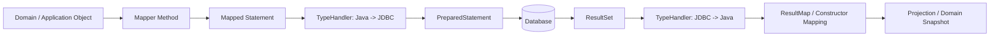
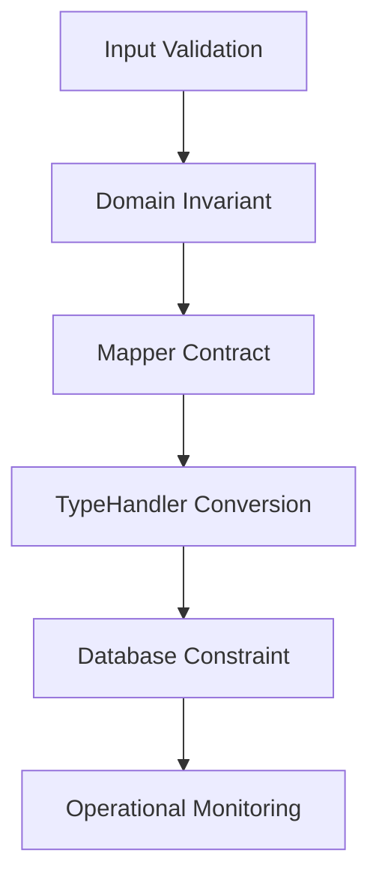

------
title: Learn Java MyBatis - Part 011
description: Advanced MyBatis TypeHandler engineering for enums, JSON, Java time, domain value objects, nullability, and production-safe conversion boundaries.
series: learn-java-mybatis
seriesTitle: Learn Java MyBatis, Patterns, Anti-Patterns, and Production Persistence Mapping
order: 11
partTitle: TypeHandlers, Enums, JSON, Time, and Domain Values
tags:
  - java
  - mybatis
  - persistence
  - typehandler
  - enum
  - json
  - time
  - architecture
date: 2026-06-27
---

# Part 011 — TypeHandlers, Enums, JSON, Time, and Domain Values

## 1. Tujuan Pembelajaran

Setelah part ini, kita ingin bisa melihat `TypeHandler` bukan sebagai fitur kecil MyBatis, tetapi sebagai **boundary adapter** antara dua dunia:

- **Java world**: type, enum, value object, immutability, domain invariant.
- **Database world**: column type, `VARCHAR`, `INT`, `TIMESTAMP`, `JSON`, `JSONB`, `DATE`, `UUID`, nullable value.

Skill yang ingin dibangun:

1. Menentukan kapan cukup memakai default TypeHandler MyBatis.
2. Mendesain mapping enum yang aman untuk evolusi sistem.
3. Membuat custom TypeHandler untuk domain value object.
4. Memetakan JSON column tanpa membuat persistence layer menjadi dumping ground.
5. Mendesain strategi waktu (`Instant`, `OffsetDateTime`, `LocalDate`, `LocalDateTime`) secara defensible.
6. Menghindari bug silent conversion, ordinal enum corruption, timezone drift, dan null handling ambiguity.
7. Membuat review checklist untuk type conversion di mapper production.

Kita tidak akan mengulang dasar JDBC type conversion. Fokusnya adalah **production reasoning**: kapan type conversion harus eksplisit, bagaimana failure mode-nya, dan bagaimana mencegah bug data jangka panjang.

---

## 2. Kaufman Deconstruction

Dalam kerangka Josh Kaufman, skill ini kita pecah menjadi sub-skill kecil:

| Sub-skill | Pertanyaan Praktis |
|---|---|
| Type boundary recognition | Apakah kolom ini bisa langsung menjadi Java type, atau butuh adapter? |
| Enum persistence | Apakah enum disimpan sebagai name, ordinal, code, atau foreign key? |
| Value object mapping | Apakah primitive obsession perlu diganti dengan type domain? |
| JSON mapping | Apakah JSON column benar-benar tepat, atau sedang menutupi schema design buruk? |
| Time mapping | Apakah value ini instant global, local business date, atau local wall-clock time? |
| Nullability | Apakah `null` bermakna unknown, not applicable, atau data error? |
| Testing | Apakah semua conversion round-trip sudah diuji terhadap database nyata? |

Target practice awal:

- Ambil satu mapper yang memakai `String status`.
- Ubah menjadi `CaseStatus`.
- Tambahkan `TypeHandler`.
- Tambahkan mapper test yang membuktikan database code `OPEN`, `SUSP`, `CLSD` dipetakan benar.
- Tambahkan test untuk invalid code.
- Pastikan invalid code tidak diam-diam menjadi `null`.

---

## 3. Mental Model: TypeHandler Adalah Adapter, Bukan Business Logic

MyBatis memakai TypeHandler ketika:

1. Menulis parameter Java ke `PreparedStatement`.
2. Membaca kolom dari `ResultSet` atau `CallableStatement`.
3. Menentukan cara type Java tertentu masuk/keluar dari JDBC.

Secara mental:



Ingat invariannya:

> TypeHandler boleh mengubah **representasi teknis**, tetapi tidak boleh mengambil **keputusan bisnis**.

Contoh yang benar:

- `CaseStatus.OPEN` menjadi `"OPEN"`.
- `"SUSP"` menjadi `CaseStatus.SUSPENDED`.
- `TenantId("t-001")` menjadi `"t-001"`.
- JSON column menjadi `CaseMetadata`.

Contoh yang salah:

- Jika status `"SUSP"` maka otomatis ubah menjadi `"CLOSED"` karena sudah lewat SLA.
- Jika JSON tidak punya field tertentu, tentukan policy escalation di TypeHandler.
- Jika tenant kosong, ambil tenant dari security context global.

TypeHandler harus deterministic, local, dan mudah diuji.

---

## 4. Default TypeHandler: Apa yang Sudah Disediakan MyBatis

MyBatis sudah menyediakan default TypeHandler untuk banyak Java/JDBC type umum. Dokumentasi resmi menjelaskan bahwa TypeHandler dipakai ketika MyBatis men-set parameter ke `PreparedStatement` atau mengambil value dari `ResultSet`.

Hal penting:

- Untuk Java primitive/wrapper, `String`, date/time, byte array, dan type umum lain, default biasanya cukup.
- MyBatis mendukung Java 8 Date and Time API / JSR-310 secara default sejak versi 3.4.5.
- Enum default biasanya memakai `EnumTypeHandler`, yang menyimpan enum berdasarkan `name()`, bukan ordinal.
- `EnumOrdinalTypeHandler` tersedia, tetapi sangat berisiko untuk data jangka panjang.

Default bukan berarti selalu benar. Default berarti **masuk akal untuk tipe umum**, bukan otomatis sesuai dengan domain Anda.

---

## 5. Decision Matrix: Kapan Butuh Custom TypeHandler

Gunakan custom TypeHandler saat ada **semantic gap** antara database representation dan Java representation.

| Kasus | Default Cukup? | Custom TypeHandler? | Catatan |
|---|---:|---:|---|
| `VARCHAR` ke `String` | Ya | Tidak | Kecuali butuh value object |
| `BIGINT` ke `Long` | Ya | Tidak | Jangan over-engineer |
| `TIMESTAMP` ke `Instant` | Biasanya | Kadang | Bergantung driver/database/timezone |
| `VARCHAR` status code ke enum | Kadang | Sering | Jika DB code tidak sama dengan enum name |
| `INT` status ordinal ke enum | Tidak aman | Hindari | Ordinal rapuh terhadap reorder enum |
| `JSONB` ke typed object | Tidak | Ya | Butuh serialization/deserialization |
| `VARCHAR` tenant id ke `TenantId` | Tidak | Ya | Strong typing mencegah parameter tertukar |
| `VARCHAR` money currency ke `Currency` | Kadang | Kadang | Bisa pakai built-in atau custom |
| encrypted column | Tidak | Ya, hati-hati | Biasanya perlu service terpisah, bukan handler sederhana |
| comma-separated values | Tidak | Sebaiknya redesign | TypeHandler hanya menutupi schema smell |

Rule sederhana:

> Jika column value punya makna domain yang stabil dan sering dipakai lintas mapper, pertimbangkan TypeHandler atau value object.

---

## 6. Enum Mapping Strategy

Enum adalah sumber bug persistence yang sering diremehkan.

Ada beberapa strategi.

### 6.1 Enum by Name

Database menyimpan nama enum Java:

```sql
case_status VARCHAR(32) NOT NULL
-- value: OPEN, SUSPENDED, CLOSED
```

Java:

```java
public enum CaseStatus {
    OPEN,
    SUSPENDED,
    CLOSED
}
```

Kelebihan:

- Sederhana.
- Readable di database.
- Cocok dengan default `EnumTypeHandler`.
- Tidak rusak saat urutan enum berubah.

Kekurangan:

- Rename enum menjadi breaking database change.
- Nama Java menjadi bagian dari contract database.
- Sulit jika database code harus mengikuti standard eksternal.

Gunakan untuk:

- Sistem internal.
- Enum stabil.
- Tidak ada code eksternal/regulatory.
- Nama enum memang bagian dari domain language.

### 6.2 Enum by Ordinal

Database menyimpan posisi enum:

```sql
case_status SMALLINT NOT NULL
-- 0 = OPEN, 1 = SUSPENDED, 2 = CLOSED
```

Java:

```java
public enum CaseStatus {
    OPEN,
    SUSPENDED,
    CLOSED
}
```

Kelebihan:

- Compact.

Kekurangan:

- Sangat rapuh.
- Reorder enum merusak data historis.
- Insert enum di tengah mengubah makna row lama.
- Sulit dibaca saat investigasi production.
- Tidak cocok untuk audit/regulatory system.

Prinsip:

> Hindari ordinal enum untuk persistent data yang hidup lebih lama dari satu deployment.

### 6.3 Enum by Stable Code

Database menyimpan code stabil:

```sql
case_status VARCHAR(16) NOT NULL
-- OPEN, SUSP, CLSD
```

Java:

```java
public enum CaseStatus {
    OPEN("OPEN"),
    SUSPENDED("SUSP"),
    CLOSED("CLSD");

    private final String code;

    CaseStatus(String code) {
        this.code = code;
    }

    public String code() {
        return code;
    }

    public static CaseStatus fromCode(String code) {
        for (CaseStatus value : values()) {
            if (value.code.equals(code)) {
                return value;
            }
        }
        throw new IllegalArgumentException("Unknown CaseStatus code: " + code);
    }
}
```

Kelebihan:

- Stable even if Java enum name changes.
- Readable.
- Cocok untuk external/regulatory code.
- Lebih defensible untuk audit.

Kekurangan:

- Butuh custom TypeHandler.
- Butuh test untuk invalid code.
- Butuh governance saat menambah code baru.

Ini sering menjadi pilihan terbaik untuk enterprise system.

---

## 7. Custom TypeHandler untuk Enum Code

Contoh TypeHandler untuk `CaseStatus`:

```java
package com.acme.caseapp.persistence.mybatis.typehandler;

import com.acme.caseapp.casefile.domain.CaseStatus;
import org.apache.ibatis.type.BaseTypeHandler;
import org.apache.ibatis.type.JdbcType;
import org.apache.ibatis.type.MappedJdbcTypes;
import org.apache.ibatis.type.MappedTypes;

import java.sql.CallableStatement;
import java.sql.PreparedStatement;
import java.sql.ResultSet;
import java.sql.SQLException;

@MappedTypes(CaseStatus.class)
@MappedJdbcTypes(JdbcType.VARCHAR)
public final class CaseStatusTypeHandler extends BaseTypeHandler<CaseStatus> {

    @Override
    public void setNonNullParameter(
            PreparedStatement ps,
            int i,
            CaseStatus parameter,
            JdbcType jdbcType
    ) throws SQLException {
        ps.setString(i, parameter.code());
    }

    @Override
    public CaseStatus getNullableResult(ResultSet rs, String columnName) throws SQLException {
        String code = rs.getString(columnName);
        return toStatus(code);
    }

    @Override
    public CaseStatus getNullableResult(ResultSet rs, int columnIndex) throws SQLException {
        String code = rs.getString(columnIndex);
        return toStatus(code);
    }

    @Override
    public CaseStatus getNullableResult(CallableStatement cs, int columnIndex) throws SQLException {
        String code = cs.getString(columnIndex);
        return toStatus(code);
    }

    private static CaseStatus toStatus(String code) {
        if (code == null) {
            return null;
        }
        return CaseStatus.fromCode(code);
    }
}
```

Hal penting:

- `setNonNullParameter` tidak perlu handle null karena `BaseTypeHandler` sudah memisahkan non-null path.
- `getNullableResult` harus memutuskan apakah null database menjadi null Java.
- Invalid code sebaiknya fail-fast.
- Jangan silently map unknown code ke `UNKNOWN` kecuali domain memang mendesain `UNKNOWN` sebagai state valid.

### 7.1 Registrasi TypeHandler

Via MyBatis XML configuration:

```xml
<configuration>
  <typeHandlers>
    <typeHandler
      javaType="com.acme.caseapp.casefile.domain.CaseStatus"
      jdbcType="VARCHAR"
      handler="com.acme.caseapp.persistence.mybatis.typehandler.CaseStatusTypeHandler"/>
  </typeHandlers>
</configuration>
```

Via package scanning:

```xml
<configuration>
  <typeHandlers>
    <package name="com.acme.caseapp.persistence.mybatis.typehandler"/>
  </typeHandlers>
</configuration>
```

Via Spring Boot property:

```yaml
mybatis:
  type-handlers-package: com.acme.caseapp.persistence.mybatis.typehandler
```

Production rule:

> Untuk large codebase, gunakan package scanning untuk handler yang reusable, tetapi tetap dokumentasikan mapping domain type -> database type di persistence handbook.

---

## 8. Generic Interface untuk Enum Code

Jika banyak enum memakai stable code, buat interface:

```java
public interface CodedEnum {
    String code();
}
```

Contoh:

```java
public enum EnforcementActionType implements CodedEnum {
    WARNING_LETTER("WARN"),
    ADMINISTRATIVE_FINE("FINE"),
    LICENSE_SUSPENSION("SUSP");

    private final String code;

    EnforcementActionType(String code) {
        this.code = code;
    }

    @Override
    public String code() {
        return code;
    }

    public static EnforcementActionType fromCode(String code) {
        for (EnforcementActionType value : values()) {
            if (value.code.equals(code)) {
                return value;
            }
        }
        throw new IllegalArgumentException("Unknown EnforcementActionType code: " + code);
    }
}
```

Namun TypeHandler generic sulit dibuat otomatis untuk semua enum karena perlu tahu concrete enum class. Pendekatan yang cukup aman:

- Buat satu TypeHandler per enum penting.
- Atau buat abstract base handler:

```java
public abstract class AbstractCodedEnumTypeHandler<E extends Enum<E> & CodedEnum>
        extends BaseTypeHandler<E> {

    private final Class<E> enumType;

    protected AbstractCodedEnumTypeHandler(Class<E> enumType) {
        this.enumType = enumType;
    }

    @Override
    public void setNonNullParameter(
            PreparedStatement ps,
            int i,
            E parameter,
            JdbcType jdbcType
    ) throws SQLException {
        ps.setString(i, parameter.code());
    }

    @Override
    public E getNullableResult(ResultSet rs, String columnName) throws SQLException {
        return fromCode(rs.getString(columnName));
    }

    @Override
    public E getNullableResult(ResultSet rs, int columnIndex) throws SQLException {
        return fromCode(rs.getString(columnIndex));
    }

    @Override
    public E getNullableResult(CallableStatement cs, int columnIndex) throws SQLException {
        return fromCode(cs.getString(columnIndex));
    }

    private E fromCode(String code) {
        if (code == null) {
            return null;
        }

        for (E value : enumType.getEnumConstants()) {
            if (value.code().equals(code)) {
                return value;
            }
        }

        throw new IllegalArgumentException(
            "Unknown code '" + code + "' for enum " + enumType.getName()
        );
    }
}
```

Concrete handler:

```java
@MappedTypes(EnforcementActionType.class)
@MappedJdbcTypes(JdbcType.VARCHAR)
public final class EnforcementActionTypeHandler
        extends AbstractCodedEnumTypeHandler<EnforcementActionType> {

    public EnforcementActionTypeHandler() {
        super(EnforcementActionType.class);
    }
}
```

Jangan membuat generic handler yang terlalu magic sampai sulit ditrace saat production incident.

---

## 9. Domain Value Object Mapping

Primitive obsession membuat mapper mudah tertukar parameter.

Buruk:

```java
CaseRecord findByTenantAndCaseId(String tenantId, String caseId);
```

Risiko:

```java
mapper.findByTenantAndCaseId(caseId, tenantId); // compile, wrong semantics
```

Lebih baik:

```java
CaseRecord findByTenantAndCaseId(TenantId tenantId, CaseId caseId);
```

Value object:

```java
public record TenantId(String value) {
    public TenantId {
        if (value == null || value.isBlank()) {
            throw new IllegalArgumentException("tenant id must not be blank");
        }
    }
}

public record CaseId(String value) {
    public CaseId {
        if (value == null || value.isBlank()) {
            throw new IllegalArgumentException("case id must not be blank");
        }
    }
}
```

TypeHandler:

```java
@MappedTypes(TenantId.class)
@MappedJdbcTypes(JdbcType.VARCHAR)
public final class TenantIdTypeHandler extends BaseTypeHandler<TenantId> {

    @Override
    public void setNonNullParameter(
            PreparedStatement ps,
            int i,
            TenantId parameter,
            JdbcType jdbcType
    ) throws SQLException {
        ps.setString(i, parameter.value());
    }

    @Override
    public TenantId getNullableResult(ResultSet rs, String columnName) throws SQLException {
        return toTenantId(rs.getString(columnName));
    }

    @Override
    public TenantId getNullableResult(ResultSet rs, int columnIndex) throws SQLException {
        return toTenantId(rs.getString(columnIndex));
    }

    @Override
    public TenantId getNullableResult(CallableStatement cs, int columnIndex) throws SQLException {
        return toTenantId(cs.getString(columnIndex));
    }

    private static TenantId toTenantId(String value) {
        return value == null ? null : new TenantId(value);
    }
}
```

Kapan value object layak?

| Candidate | Layak? | Alasan |
|---|---:|---|
| `TenantId` | Ya | Security boundary |
| `CaseId` | Ya | Domain identity |
| `UserId` | Ya | Prevent swapped params |
| `EmailAddress` | Kadang | Validasi biasanya di domain/input |
| `CommentText` | Tidak selalu | Bisa over-model |
| `PageSize` | Mungkin | Jika punya invariant limit |
| `String description` | Tidak | Terlalu granular |

Rule:

> Strong type-kan value yang sering menjadi boundary, identifier, security control, atau source of production mistakes.

---

## 10. UUID Handling

Jika database memakai UUID native:

- PostgreSQL: `uuid`
- MySQL: sering `CHAR(36)`, `BINARY(16)`, atau database-specific function
- SQL Server: `uniqueidentifier`

Java:

```java
public record CaseId(UUID value) {
    public CaseId {
        Objects.requireNonNull(value, "case id must not be null");
    }
}
```

Jika driver sudah mendukung `UUID`, TypeHandler bisa memakai `setObject` / `getObject`, tetapi pastikan diuji terhadap database nyata:

```java
@MappedTypes(CaseId.class)
@MappedJdbcTypes(JdbcType.OTHER)
public final class CaseIdUuidTypeHandler extends BaseTypeHandler<CaseId> {

    @Override
    public void setNonNullParameter(
            PreparedStatement ps,
            int i,
            CaseId parameter,
            JdbcType jdbcType
    ) throws SQLException {
        ps.setObject(i, parameter.value());
    }

    @Override
    public CaseId getNullableResult(ResultSet rs, String columnName) throws SQLException {
        UUID value = rs.getObject(columnName, UUID.class);
        return value == null ? null : new CaseId(value);
    }

    @Override
    public CaseId getNullableResult(ResultSet rs, int columnIndex) throws SQLException {
        UUID value = rs.getObject(columnIndex, UUID.class);
        return value == null ? null : new CaseId(value);
    }

    @Override
    public CaseId getNullableResult(CallableStatement cs, int columnIndex) throws SQLException {
        UUID value = cs.getObject(columnIndex, UUID.class);
        return value == null ? null : new CaseId(value);
    }
}
```

Jika UUID disimpan sebagai `VARCHAR(36)`:

```java
ps.setString(i, parameter.value().toString());
UUID value = UUID.fromString(rs.getString(columnName));
```

Jika UUID disimpan sebagai `BINARY(16)`, jangan menulis conversion manual tersebar di mapper. Buat TypeHandler khusus dan test dengan database real.

---

## 11. JSON Column Mapping

JSON column berguna, tetapi mudah menjadi tempat membuang desain schema.

Contoh use case valid:

- Metadata yang jarang difilter.
- External payload snapshot.
- Configurable attributes yang tidak punya schema stabil.
- Audit context.
- Denormalized read model payload.
- Event payload.

Use case berisiko:

- Status utama disimpan di JSON.
- Field yang sering dipakai filter/sort berada di JSON tanpa index strategy.
- Data relasional penting disembunyikan di JSON.
- JSON menjadi “mini database” di dalam satu column.
- Business rule membaca field JSON arbitrary tanpa contract.

### 11.1 Typed JSON Value

Misalnya:

```java
public record CaseMetadata(
        String sourceSystem,
        String externalReference,
        Map<String, String> labels
) {
}
```

TypeHandler:

```java
@MappedTypes(CaseMetadata.class)
@MappedJdbcTypes({JdbcType.VARCHAR, JdbcType.OTHER})
public final class CaseMetadataJsonTypeHandler extends BaseTypeHandler<CaseMetadata> {

    private static final ObjectMapper OBJECT_MAPPER = new ObjectMapper()
            .findAndRegisterModules();

    @Override
    public void setNonNullParameter(
            PreparedStatement ps,
            int i,
            CaseMetadata parameter,
            JdbcType jdbcType
    ) throws SQLException {
        try {
            ps.setString(i, OBJECT_MAPPER.writeValueAsString(parameter));
        } catch (JsonProcessingException e) {
            throw new SQLException("Failed to serialize CaseMetadata", e);
        }
    }

    @Override
    public CaseMetadata getNullableResult(ResultSet rs, String columnName) throws SQLException {
        return read(rs.getString(columnName));
    }

    @Override
    public CaseMetadata getNullableResult(ResultSet rs, int columnIndex) throws SQLException {
        return read(rs.getString(columnIndex));
    }

    @Override
    public CaseMetadata getNullableResult(CallableStatement cs, int columnIndex) throws SQLException {
        return read(cs.getString(columnIndex));
    }

    private static CaseMetadata read(String json) throws SQLException {
        if (json == null || json.isBlank()) {
            return null;
        }

        try {
            return OBJECT_MAPPER.readValue(json, CaseMetadata.class);
        } catch (JsonProcessingException e) {
            throw new SQLException("Failed to deserialize CaseMetadata JSON", e);
        }
    }
}
```

Catatan production:

- Gunakan `findAndRegisterModules()` agar Java time module terbaca jika ada field time.
- Jangan membuat `ObjectMapper` baru per row.
- Jangan swallow deserialization error.
- Jangan return empty object untuk JSON corrupt.
- Pertimbangkan schema version di JSON.

### 11.2 PostgreSQL JSONB

Untuk PostgreSQL, bisa memakai `PGobject` agar driver tahu type `jsonb`:

```java
@Override
public void setNonNullParameter(
        PreparedStatement ps,
        int i,
        CaseMetadata parameter,
        JdbcType jdbcType
) throws SQLException {
    try {
        PGobject jsonObject = new PGobject();
        jsonObject.setType("jsonb");
        jsonObject.setValue(OBJECT_MAPPER.writeValueAsString(parameter));
        ps.setObject(i, jsonObject);
    } catch (JsonProcessingException e) {
        throw new SQLException("Failed to serialize CaseMetadata", e);
    }
}
```

Namun ini mengikat TypeHandler ke PostgreSQL driver. Itu tidak selalu salah. Yang salah adalah menyembunyikan database-specific decision tanpa dokumentasi.

Checklist:

- Apakah project memang PostgreSQL-specific?
- Apakah migration/test memakai PostgreSQL real?
- Apakah query JSONB butuh index?
- Apakah fallback untuk database lain dibutuhkan?

---

## 12. Java Time Mapping

Time bug biasanya bukan bug syntax, tetapi bug semantic.

Pertanyaan pertama:

> Value ini merepresentasikan apa?

| Java Type | Makna | Contoh |
|---|---|---|
| `Instant` | Titik waktu global | created_at, submitted_at, approved_at |
| `OffsetDateTime` | Titik waktu + offset eksplisit | received_at dari external system |
| `LocalDate` | Tanggal bisnis tanpa waktu | due_date, birth_date, license_expiry_date |
| `LocalDateTime` | Waktu lokal tanpa timezone | local appointment time, jarang untuk audit |
| `YearMonth` | Bulan bisnis | reporting period |
| `Duration` | Durasi mesin | SLA elapsed duration |
| `Period` | Periode kalender | license valid for 2 years |

Untuk audit/enforcement lifecycle:

- `created_at`: `Instant`
- `updated_at`: `Instant`
- `submitted_at`: `Instant`
- `sla_due_date`: bisa `Instant` atau `LocalDate`, tergantung rule SLA
- `hearing_date`: sering `LocalDate`
- `scheduled_local_time`: mungkin `LocalDateTime` + timezone terpisah

### 12.1 Recommended Policy

Untuk distributed regulatory system:

1. Simpan event timestamp sebagai UTC instant.
2. Gunakan `Instant` di Java untuk audit timestamp.
3. Gunakan `LocalDate` untuk business date yang tidak tergantung timezone.
4. Hindari `LocalDateTime` untuk event timestamp global.
5. Jika local time penting, simpan local datetime + zone id.
6. Test round-trip terhadap database dan driver yang sama dengan production.

Contoh:

```sql
created_at TIMESTAMP WITH TIME ZONE NOT NULL
received_at TIMESTAMP WITH TIME ZONE NOT NULL
due_date DATE NOT NULL
hearing_local_time TIMESTAMP WITHOUT TIME ZONE NULL
hearing_zone_id VARCHAR(64) NULL
```

Java projection:

```java
public record CaseTimelineRow(
        CaseId caseId,
        Instant createdAt,
        Instant receivedAt,
        LocalDate dueDate,
        LocalDateTime hearingLocalTime,
        ZoneId hearingZoneId
) {
}
```

`ZoneId` bisa dibuat TypeHandler sederhana:

```java
@MappedTypes(ZoneId.class)
@MappedJdbcTypes(JdbcType.VARCHAR)
public final class ZoneIdTypeHandler extends BaseTypeHandler<ZoneId> {

    @Override
    public void setNonNullParameter(
            PreparedStatement ps,
            int i,
            ZoneId parameter,
            JdbcType jdbcType
    ) throws SQLException {
        ps.setString(i, parameter.getId());
    }

    @Override
    public ZoneId getNullableResult(ResultSet rs, String columnName) throws SQLException {
        return toZoneId(rs.getString(columnName));
    }

    @Override
    public ZoneId getNullableResult(ResultSet rs, int columnIndex) throws SQLException {
        return toZoneId(rs.getString(columnIndex));
    }

    @Override
    public ZoneId getNullableResult(CallableStatement cs, int columnIndex) throws SQLException {
        return toZoneId(cs.getString(columnIndex));
    }

    private static ZoneId toZoneId(String value) {
        return value == null ? null : ZoneId.of(value);
    }
}
```

---

## 13. Money and Numeric Value Mapping

Money harus hati-hati.

Buruk:

```java
double fineAmount;
```

Lebih baik:

```java
public record Money(BigDecimal amount, Currency currency) {
    public Money {
        Objects.requireNonNull(amount, "amount must not be null");
        Objects.requireNonNull(currency, "currency must not be null");
    }
}
```

Schema:

```sql
fine_amount DECIMAL(19, 4) NOT NULL
fine_currency CHAR(3) NOT NULL
```

Biasanya jangan pakai satu TypeHandler untuk `Money` jika value tersebar dalam dua column. MyBatis TypeHandler bekerja per column. Untuk multi-column value object, gunakan constructor mapping atau assembler:

```xml
<constructor>
  <arg column="fine_amount" javaType="java.math.BigDecimal"/>
  <arg column="fine_currency" javaType="java.util.Currency"/>
</constructor>
```

Atau projection:

```java
public record FineRow(
        BigDecimal fineAmount,
        String fineCurrency
) {
    public Money toMoney() {
        return new Money(fineAmount, Currency.getInstance(fineCurrency));
    }
}
```

Rule:

> TypeHandler cocok untuk satu column ke satu value. Untuk value object multi-column, gunakan ResultMap/constructor/assembler.

---

## 14. Nullability Design

Null bukan detail kecil. Null adalah bagian dari contract.

Ada beberapa arti null:

| Makna | Contoh | Treatment |
|---|---|---|
| unknown | `external_reference` belum diterima | nullable field |
| not applicable | `hearing_date` untuk case yang tidak butuh hearing | nullable atau separate state |
| not yet assigned | `assigned_officer_id` belum ada | nullable dengan workflow rule |
| data error | `case_status` null padahal wajib | database constraint + fail fast |
| intentionally cleared | optional note dihapus | nullable command semantics |

MyBatis dapat memetakan null secara normal, tetapi domain harus jelas.

### 14.1 Primitive Trap

Buruk:

```java
public record CaseCounter(int escalationCount) {
}
```

Jika database value null, primitive tidak bisa merepresentasikan null. Gunakan wrapper jika column nullable:

```java
public record CaseCounter(Integer escalationCount) {
}
```

Atau pastikan SQL memberi default:

```sql
COALESCE(escalation_count, 0) AS escalation_count
```

Dan buat alias itu eksplisit.

### 14.2 `jdbcTypeForNull`

Saat parameter null, JDBC kadang butuh JDBC type eksplisit. MyBatis configuration memiliki setting `jdbcTypeForNull`.

Contoh mapper:

```xml
<insert id="insertCaseNote">
  INSERT INTO case_note (
    case_id,
    note_text,
    external_reference
  )
  VALUES (
    #{caseId},
    #{noteText},
    #{externalReference, jdbcType=VARCHAR}
  )
</insert>
```

Rule:

> Untuk nullable parameter penting, tulis `jdbcType` eksplisit daripada mengandalkan global default.

---

## 15. TypeHandler dan ResultMap

TypeHandler dapat dipakai implicit berdasarkan Java type, atau eksplisit di mapping.

Contoh eksplisit:

```xml
<resultMap id="CaseSummaryMap" type="com.acme.caseapp.casefile.read.CaseSummary">
  <constructor>
    <arg column="case_id"
         javaType="com.acme.caseapp.casefile.domain.CaseId"
         typeHandler="com.acme.caseapp.persistence.mybatis.typehandler.CaseIdTypeHandler"/>
    <arg column="status"
         javaType="com.acme.caseapp.casefile.domain.CaseStatus"
         typeHandler="com.acme.caseapp.persistence.mybatis.typehandler.CaseStatusTypeHandler"/>
    <arg column="created_at"
         javaType="java.time.Instant"/>
  </constructor>
</resultMap>
```

Kapan eksplisit?

- Saat mapping risk tinggi.
- Saat ada beberapa TypeHandler untuk Java type yang sama.
- Saat review readability lebih penting daripada brevity.
- Saat migration sedang berlangsung.

Kapan implicit cukup?

- TypeHandler registered globally dan satu Java type hanya punya satu representation.
- Mapping sangat repetitif.
- Team punya convention kuat.

---

## 16. TypeHandler dan Parameter Binding

Mapper:

```java
List<CaseSummary> findByStatus(
        @Param("tenantId") TenantId tenantId,
        @Param("status") CaseStatus status
);
```

XML:

```xml
<select id="findByStatus" resultMap="CaseSummaryMap">
  SELECT
    case_id,
    case_number,
    status,
    created_at
  FROM regulatory_case
  WHERE tenant_id = #{tenantId}
    AND status = #{status}
</select>
```

Jika `TenantIdTypeHandler` dan `CaseStatusTypeHandler` terdaftar, MyBatis akan memakai handler saat binding.

Namun untuk clarity, boleh eksplisit:

```xml
WHERE tenant_id = #{tenantId, typeHandler=com.acme.caseapp.persistence.mybatis.typehandler.TenantIdTypeHandler}
  AND status = #{status, typeHandler=com.acme.caseapp.persistence.mybatis.typehandler.CaseStatusTypeHandler}
```

Gunakan eksplisit jika:

- Bug pernah terjadi di area itu.
- Ada legacy database representation.
- Ada ambiguity.
- Query security-sensitive.

---

## 17. Error Handling Strategy

TypeHandler error harus membantu debugging.

Buruk:

```java
catch (Exception e) {
    return null;
}
```

Ini menciptakan data corruption silent.

Lebih baik:

```java
catch (JsonProcessingException e) {
    throw new SQLException("Failed to deserialize CaseMetadata JSON", e);
}
```

Untuk enum:

```java
throw new IllegalArgumentException("Unknown CaseStatus code: " + code);
```

Namun MyBatis/JDBC flow sering membungkus exception. Pesan error harus mengandung:

- nama domain type,
- value bermasalah,
- arah conversion jika perlu,
- bukan PII penuh,
- cukup context untuk production debugging.

Untuk value sensitif, jangan log raw value.

---

## 18. Database Constraint Tetap Wajib

TypeHandler bukan pengganti constraint.

Jika status hanya boleh nilai tertentu:

```sql
ALTER TABLE regulatory_case
ADD CONSTRAINT chk_regulatory_case_status
CHECK (status IN ('OPEN', 'SUSP', 'CLSD'));
```

Jika tenant id wajib:

```sql
tenant_id VARCHAR(64) NOT NULL
```

Jika JSON harus valid:

- Gunakan native JSON/JSONB type jika database mendukung.
- Tambahkan schema validation di application layer jika perlu.
- Jangan hanya mengandalkan TypeHandler.

Layer defense:



Semakin penting data, semakin banyak lapisan validasi yang layak.

---

## 19. Testing TypeHandler

Minimal test:

1. Java -> DB value.
2. DB value -> Java.
3. Null handling.
4. Invalid database value.
5. Unknown enum code.
6. JSON corrupt.
7. Timezone round-trip.
8. Multi-row mapper behavior.
9. Parameter binding in real mapper.
10. ResultMap integration.

### 19.1 Unit Test untuk Enum Handler

```java
class CaseStatusTypeHandlerTest {

    @Test
    void shouldMapKnownCode() {
        assertThat(CaseStatus.fromCode("SUSP"))
                .isEqualTo(CaseStatus.SUSPENDED);
    }

    @Test
    void shouldRejectUnknownCode() {
        assertThatThrownBy(() -> CaseStatus.fromCode("BAD"))
                .isInstanceOf(IllegalArgumentException.class);
    }
}
```

### 19.2 Integration Test dengan Database

Unit test tidak cukup untuk JDBC driver behavior. Gunakan database nyata via Testcontainers atau environment integration.

```java
@Test
void shouldPersistAndReadCaseStatus() {
    mapper.insert(new CreateCaseCommand(
            new TenantId("tenant-a"),
            new CaseId(UUID.randomUUID()),
            CaseStatus.SUSPENDED
    ));

    CaseSummary row = mapper.findById(...).orElseThrow();

    assertThat(row.status()).isEqualTo(CaseStatus.SUSPENDED);
}
```

### 19.3 SQL-Level Assertion

Untuk enum code, verifikasi actual DB value:

```java
String rawStatus = jdbcTemplate.queryForObject(
        "SELECT status FROM regulatory_case WHERE case_id = ?",
        String.class,
        caseId.value()
);

assertThat(rawStatus).isEqualTo("SUSP");
```

Ini memastikan TypeHandler tidak hanya round-trip secara kebetulan.

---

## 20. Performance Considerations

TypeHandler dipanggil per parameter dan per cell/column yang dipetakan. Biasanya bukan bottleneck utama, tetapi bisa menjadi masalah jika:

- JSON deserialization dilakukan untuk ribuan row besar.
- ObjectMapper dibuat per call.
- TypeHandler melakukan network call.
- TypeHandler melakukan lookup database.
- TypeHandler melakukan expensive reflection.
- Large object graph memetakan banyak typed value.

Hard rules:

- Jangan lakukan I/O eksternal di TypeHandler.
- Jangan query database dari TypeHandler.
- Jangan create expensive object per row jika bisa static/reusable.
- Jangan parsing JSON besar jika projection tidak membutuhkan field itu.
- Untuk list/export besar, pertimbangkan projection raw atau streaming design.

---

## 21. Anti-Patterns

### 21.1 Business Logic in TypeHandler

```java
if (status == SUSPENDED && clock.now().isAfter(dueDate)) {
    return CLOSED;
}
```

Salah karena:

- TypeHandler tidak punya context bisnis lengkap.
- Conversion menjadi non-deterministic.
- Testing sulit.
- Query result berubah berdasarkan waktu, bukan database value.

### 21.2 Swallowing Unknown Code

```java
return CaseStatus.UNKNOWN;
```

Bisa benar hanya jika `UNKNOWN` adalah domain state eksplisit. Jika tidak, ini menyembunyikan data corruption.

### 21.3 Enum Ordinal Persistence

```java
ACTIVE.ordinal()
```

Ini brittle dan tidak audit-friendly.

### 21.4 JSON Everything

```sql
case_payload JSONB NOT NULL
```

Lalu semua search, status, assignment, SLA, dan reporting membaca JSON. Ini biasanya bukan fleksibilitas; ini schema avoidance.

### 21.5 TypeHandler as Encryption Layer Without Design

Encryption/decryption di TypeHandler bisa terlihat nyaman, tetapi berisiko:

- key management tidak jelas,
- rotation sulit,
- logging raw value berbahaya,
- queryability hilang,
- failure mode rumit.

Boleh dilakukan hanya jika security architecture-nya matang.

### 21.6 Hidden Database Specificity

TypeHandler memakai `PGobject`, Oracle struct, atau SQL Server-specific object tanpa dokumentasi. Ini membuat portability assumption palsu.

### 21.7 Global Handler Too Broad

Satu handler untuk semua `String` atau semua `Object` akan membuat mapping tidak terduga.

---

## 22. Review Checklist

Gunakan checklist ini saat review mapper/type conversion:

### Enum

- [ ] Apakah enum disimpan sebagai stable code, bukan ordinal?
- [ ] Apakah rename enum Java tidak merusak database contract?
- [ ] Apakah invalid code fail-fast?
- [ ] Apakah database punya constraint untuk allowed codes?
- [ ] Apakah ada test Java -> DB dan DB -> Java?

### Value Object

- [ ] Apakah value object benar-benar melindungi boundary penting?
- [ ] Apakah TypeHandler registered dengan jelas?
- [ ] Apakah null behavior eksplisit?
- [ ] Apakah tidak ada conversion logic tersebar di service?

### JSON

- [ ] Apakah JSON column punya alasan architectural?
- [ ] Apakah field yang sering difilter tidak tersembunyi tanpa index?
- [ ] Apakah deserialization error fail-fast?
- [ ] Apakah ObjectMapper reused?
- [ ] Apakah schema evolution dipikirkan?

### Time

- [ ] Apakah event timestamp memakai `Instant` atau equivalent?
- [ ] Apakah business date memakai `LocalDate`?
- [ ] Apakah `LocalDateTime` tidak dipakai untuk global event audit?
- [ ] Apakah timezone policy terdokumentasi?
- [ ] Apakah round-trip test memakai database nyata?

### General

- [ ] Apakah TypeHandler tidak melakukan I/O?
- [ ] Apakah TypeHandler deterministic?
- [ ] Apakah sensitive value tidak bocor ke log?
- [ ] Apakah database-specific behavior terdokumentasi?
- [ ] Apakah mapper test mencakup conversion branch?

---

## 23. Deliberate Practice

### Practice 1 — Replace Primitive Status

Ambil mapper ini:

```java
List<CaseSummary> findByStatus(String tenantId, String status);
```

Ubah menjadi:

```java
List<CaseSummary> findByStatus(TenantId tenantId, CaseStatus status);
```

Tambahkan:

- `TenantIdTypeHandler`
- `CaseStatusTypeHandler`
- database constraint
- mapper integration test
- invalid code test

### Practice 2 — JSON Metadata

Buat `CaseMetadata` JSON column dengan field:

- `sourceSystem`
- `externalReference`
- `labels`

Tulis TypeHandler dan test:

- write metadata,
- read metadata,
- null metadata,
- corrupt JSON,
- unknown extra field.

Putuskan apakah unknown extra field boleh diterima atau harus gagal.

### Practice 3 — Time Semantics Audit

Ambil tabel case lifecycle:

```sql
created_at
submitted_at
due_date
hearing_time
```

Tentukan Java type untuk masing-masing. Jelaskan:

- apakah instant global,
- apakah business date,
- apakah local wall-clock,
- apakah butuh zone id.

### Practice 4 — Review Existing Mapper

Cari semua mapper method yang memakai:

- `String tenantId`
- `String status`
- `String type`
- `LocalDateTime createdAt`
- raw JSON `String`

Klasifikasikan mana yang aman, mana yang harus diubah.

---

## 24. Production Heuristics

1. Default TypeHandler cukup untuk primitive data biasa.
2. Domain identity, tenant, status, severity, regulatory code layak diberi type eksplisit.
3. Enum ordinal hampir selalu buruk untuk persistent state.
4. JSON column harus punya ownership dan schema evolution policy.
5. Time type dipilih berdasarkan makna, bukan convenience.
6. TypeHandler tidak boleh mengandung business decision.
7. TypeHandler harus fail-fast untuk corrupt data.
8. Mapper integration test harus membuktikan raw database value.
9. Database constraint tetap wajib.
10. Conversion policy harus terdokumentasi seperti API contract.

---

## 25. Ringkasan

TypeHandler adalah salah satu titik kecil yang menentukan kualitas persistence layer MyBatis.

Engineer biasa melihat TypeHandler sebagai “cara convert enum”.

Engineer kuat melihatnya sebagai:

- boundary adapter,
- semantic contract,
- corruption prevention layer,
- documentation of database representation,
- testable conversion unit,
- guardrail untuk domain clarity.

Dalam sistem besar, bug conversion jarang terlihat saat development awal. Ia muncul saat:

- enum direnamakan,
- code eksternal berubah,
- timezone berpindah,
- JSON berevolusi,
- tenant id tertukar,
- database lama berisi value invalid,
- audit/regulatory report harus dijelaskan.

Karena itu, TypeHandler harus didesain seperti bagian dari architecture, bukan utilitas kecil.

---

## References

- MyBatis 3 Configuration — TypeHandlers and settings: https://mybatis.org/mybatis-3/configuration.html
- MyBatis 3 Mapper XML Files: https://mybatis.org/mybatis-3/sqlmap-xml.html
- MyBatis 3 Java API: https://mybatis.org/mybatis-3/java-api.html
