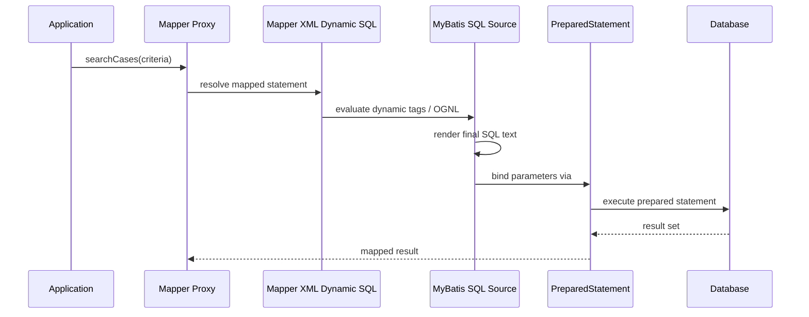

------
title: Learn Java MyBatis - Part 012
description: Advanced MyBatis XML dynamic SQL design covering if, choose, trim, where, set, foreach, bind, safe query composition, search screens, and anti-patterns.
series: learn-java-mybatis
seriesTitle: Learn Java MyBatis, Patterns, Anti-Patterns, and Production Persistence Mapping
order: 12
partTitle: Dynamic SQL in XML
tags:
  - java
  - mybatis
  - persistence
  - dynamic-sql
  - xml
  - sql
  - architecture
date: 2026-06-27
---

# Part 012 — Dynamic SQL in XML

## 1. Tujuan Pembelajaran

Dynamic SQL adalah salah satu alasan banyak team memilih MyBatis. Tetapi fitur ini juga bisa mengubah mapper menjadi file XML besar yang sulit diuji, sulit direview, dan mudah menghasilkan query buruk.

Setelah part ini, kita ingin bisa:

1. Memahami dynamic SQL sebagai **SQL template rendering**, bukan string concatenation liar.
2. Menggunakan `if`, `choose`, `where`, `trim`, `set`, `foreach`, dan `bind` secara aman.
3. Mendesain search/filter query yang tetap readable walaupun punya banyak optional criteria.
4. Menghindari bug invalid SQL, full-table scan, unsafe `${}`, dan dynamic branch yang tidak pernah dites.
5. Membuat query composition policy untuk codebase besar.
6. Mendesain mapper XML yang deterministic, testable, dan reviewable.
7. Menentukan kapan dynamic SQL XML sudah terlalu kompleks dan harus dipindah ke pendekatan lain.

Kita akan fokus pada dynamic SQL dalam mapper XML. MyBatis Dynamic SQL library akan dibahas terpisah di Part 013.

---

## 2. Kaufman Deconstruction

Sub-skill dynamic SQL:

| Sub-skill | Pertanyaan Praktis |
|---|---|
| Conditional SQL | Kapan clause dimasukkan atau dihilangkan? |
| Valid SQL generation | Apakah semua kombinasi filter menghasilkan SQL valid? |
| Safe parameter binding | Apakah semua value tetap memakai `#{}`? |
| Safe identifier rendering | Jika butuh `${}`, apakah input sudah whitelist? |
| Query shape control | Apakah query tetap index-friendly? |
| Branch testing | Apakah branch dynamic SQL sudah diuji? |
| Readability | Apakah reviewer bisa memahami query tanpa menjalankan aplikasi? |

Target practice:

- Buat search mapper dengan 8 filter optional.
- Pastikan setiap branch valid.
- Tambahkan sorting whitelist.
- Tambahkan pagination deterministic.
- Tambahkan SQL snapshot test.
- Tambahkan database integration test untuk kombinasi filter penting.

---

## 3. Mental Model: Dynamic SQL adalah Template Rendering

MyBatis dynamic SQL bekerja seperti ini:



Poin penting:

1. Dynamic tags membuat **final SQL string**.
2. `#{}` tetap menjadi prepared statement parameter.
3. `${}` melakukan raw text substitution.
4. OGNL expression dipakai untuk mengevaluasi condition.
5. Semua branch harus menghasilkan SQL valid.
6. Valid SQL belum tentu good SQL.

Invariant utama:

> Dynamic SQL boleh mengubah struktur query, tetapi parameter data user tetap harus masuk lewat `#{}` kecuali identifier yang sudah di-whitelist.

---

## 4. Dynamic SQL Tags

MyBatis dynamic SQL XML umumnya memakai tag berikut:

| Tag | Fungsi |
|---|---|
| `<if>` | Menambahkan fragment jika kondisi benar |
| `<choose>` / `<when>` / `<otherwise>` | Branching seperti switch/if-else |
| `<where>` | Menambahkan `WHERE` dan membersihkan leading `AND`/`OR` |
| `<trim>` | Mengontrol prefix/suffix dan override text |
| `<set>` | Membuat dynamic `SET` untuk update |
| `<foreach>` | Iterasi collection untuk `IN`, bulk values, atau OR group |
| `<bind>` | Membuat variable hasil expression OGNL |

Semakin banyak tag dipakai dalam satu statement, semakin besar kebutuhan test.

---

## 5. Baseline Example: Search Cases

Parameter object:

```java
public record CaseSearchCriteria(
        TenantId tenantId,
        CaseStatus status,
        Severity severity,
        String keyword,
        LocalDate receivedFrom,
        LocalDate receivedTo,
        OfficerId assignedOfficerId,
        Boolean overdueOnly,
        CaseSort sort,
        PageRequest page
) {
}
```

Mapper:

```java
List<CaseSearchRow> searchCases(CaseSearchCriteria criteria);
```

XML:

```xml
<select id="searchCases"
        parameterType="com.acme.caseapp.casefile.query.CaseSearchCriteria"
        resultMap="CaseSearchRowMap">
  SELECT
    c.case_id,
    c.case_number,
    c.status,
    c.severity,
    c.received_date,
    c.assigned_officer_id,
    c.sla_due_at
  FROM regulatory_case c
  <where>
    c.tenant_id = #{tenantId}

    <if test="status != null">
      AND c.status = #{status}
    </if>

    <if test="severity != null">
      AND c.severity = #{severity}
    </if>

    <if test="receivedFrom != null">
      AND c.received_date &gt;= #{receivedFrom}
    </if>

    <if test="receivedTo != null">
      AND c.received_date &lt;= #{receivedTo}
    </if>

    <if test="assignedOfficerId != null">
      AND c.assigned_officer_id = #{assignedOfficerId}
    </if>

    <if test="overdueOnly != null and overdueOnly">
      AND c.sla_due_at &lt; CURRENT_TIMESTAMP
      AND c.status NOT IN ('CLSD', 'CANC')
    </if>
  </where>
  ORDER BY ${sort.sql}
  LIMIT #{page.size}
  OFFSET #{page.offset}
</select>
```

Yang benar:

- Mandatory tenant predicate selalu ada.
- Optional filter memakai `#{}`.
- `ORDER BY ${sort.sql}` hanya aman jika `sort.sql` berasal dari enum whitelist, bukan raw user input.
- Pagination memakai parameter binding.
- XML escaping memakai `&lt;` dan `&gt;`.

Yang harus direview:

- Apakah `tenantId` bisa null?
- Apakah `sort.sql` benar-benar safe?
- Apakah `status NOT IN ('CLSD', 'CANC')` sebaiknya hardcoded atau domain-owned?
- Apakah offset pagination cukup untuk data besar?
- Apakah semua kombinasi filter sudah diuji?

---

## 6. `<if>`: Conditional Fragment

`<if>` adalah dynamic SQL paling sering dipakai.

Contoh:

```xml
<if test="status != null">
  AND c.status = #{status}
</if>
```

OGNL expression bisa membaca property parameter object. Jika parameter object adalah record Java, property dapat diakses seperti property bean oleh MyBatis.

### 6.1 Good Use

Gunakan `<if>` untuk optional clause yang kecil dan jelas:

```xml
<if test="caseNumber != null and caseNumber != ''">
  AND c.case_number = #{caseNumber}
</if>
```

Untuk string:

```xml
<if test="keyword != null and keyword != ''">
  AND (
    LOWER(c.case_number) LIKE #{keywordPattern}
    OR LOWER(c.subject_name) LIKE #{keywordPattern}
  )
</if>
```

Namun lebih baik normalisasi keyword di Java agar XML tidak penuh expression.

### 6.2 Bad Use

Buruk:

```xml
<if test="status == 'OPEN'">
  AND c.status IN ('OPEN', 'REOPENED')
</if>
<if test="status == 'CLOSED'">
  AND c.status IN ('CLSD', 'CANC', 'REJ')
</if>
```

Ini mulai memasukkan business classification ke XML. Lebih baik service/query object mengirim `includedStatuses`.

```java
public record CaseSearchCriteria(
        TenantId tenantId,
        List<CaseStatus> statuses
) {
}
```

XML:

```xml
<if test="statuses != null and statuses.size() > 0">
  AND c.status IN
  <foreach collection="statuses" item="status" open="(" separator="," close=")">
    #{status}
  </foreach>
</if>
```

---

## 7. `<where>`: Safe WHERE Assembly

Tanpa `<where>`, dynamic SQL mudah menghasilkan:

```sql
SELECT ...
FROM regulatory_case
WHERE
AND status = ?
```

`<where>` membantu:

- menambahkan `WHERE` hanya jika ada content,
- menghapus leading `AND` atau `OR`.

Contoh:

```xml
<where>
  <if test="status != null">
    AND c.status = #{status}
  </if>
  <if test="severity != null">
    AND c.severity = #{severity}
  </if>
</where>
```

Namun ada bahaya besar:

Jika semua condition optional dan tidak ada mandatory predicate, query bisa menjadi full-table scan.

Buruk:

```xml
<select id="searchCases" resultMap="CaseSearchRowMap">
  SELECT ...
  FROM regulatory_case c
  <where>
    <if test="status != null">
      AND c.status = #{status}
    </if>
    <if test="keyword != null">
      AND c.subject_name LIKE #{keyword}
    </if>
  </where>
</select>
```

Jika `status` dan `keyword` null, query mengambil semua case.

Untuk sistem multi-tenant, mandatory predicate harus eksplisit:

```xml
<where>
  c.tenant_id = #{tenantId}
  ...
</where>
```

Bahkan lebih baik validate di Java:

```java
public record CaseSearchCriteria(TenantId tenantId, ...) {
    public CaseSearchCriteria {
        Objects.requireNonNull(tenantId, "tenantId must not be null");
    }
}
```

---

## 8. `<trim>`: Generalized Clause Control

`<where>` dan `<set>` adalah special case dari `<trim>`. Gunakan `<trim>` saat butuh kontrol custom.

Contoh dynamic `ON` clause:

```xml
<trim prefix="ON" prefixOverrides="AND |OR ">
  AND c.case_id = e.case_id
  <if test="tenantScoped">
    AND c.tenant_id = e.tenant_id
  </if>
</trim>
```

Contoh custom filter group:

```xml
<trim prefix="AND (" suffix=")" prefixOverrides="OR ">
  <if test="keyword != null and keyword != ''">
    OR LOWER(c.case_number) LIKE #{keywordPattern}
    OR LOWER(c.subject_name) LIKE #{keywordPattern}
  </if>
  <if test="externalReference != null and externalReference != ''">
    OR c.external_reference = #{externalReference}
  </if>
</trim>
```

Hati-hati: jika semua inner condition false, Anda bisa menghasilkan `AND ()` tergantung struktur. Wrap trim dengan `<if>` jika perlu:

```xml
<if test="hasAnyKeywordCriteria">
  <trim prefix="AND (" suffix=")" prefixOverrides="OR ">
    ...
  </trim>
</if>
```

Lebih baik `hasAnyKeywordCriteria` dihitung di Java daripada OGNL panjang.

---

## 9. `<choose>`: Mutually Exclusive Branch

Gunakan `<choose>` untuk pilihan branch yang saling eksklusif.

Contoh search mode:

```java
public enum CaseSearchMode {
    EXACT_CASE_NUMBER,
    EXTERNAL_REFERENCE,
    SUBJECT_KEYWORD
}
```

XML:

```xml
<choose>
  <when test="mode.name() == 'EXACT_CASE_NUMBER'">
    AND c.case_number = #{caseNumber}
  </when>
  <when test="mode.name() == 'EXTERNAL_REFERENCE'">
    AND c.external_reference = #{externalReference}
  </when>
  <when test="mode.name() == 'SUBJECT_KEYWORD'">
    AND LOWER(c.subject_name) LIKE #{keywordPattern}
  </when>
  <otherwise>
    AND 1 = 0
  </otherwise>
</choose>
```

Tapi expression `mode.name() == ...` membuat XML terlalu aware terhadap enum internals. Lebih baik parameter object menyediakan boolean helper:

```java
public boolean exactCaseNumberMode() {
    return mode == CaseSearchMode.EXACT_CASE_NUMBER;
}
```

XML:

```xml
<choose>
  <when test="exactCaseNumberMode">
    AND c.case_number = #{caseNumber}
  </when>
  <when test="externalReferenceMode">
    AND c.external_reference = #{externalReference}
  </when>
  <when test="subjectKeywordMode">
    AND LOWER(c.subject_name) LIKE #{keywordPattern}
  </when>
  <otherwise>
    AND 1 = 0
  </otherwise>
</choose>
```

`AND 1 = 0` sebagai defensive default bisa berguna untuk mencegah accidental broad query. Namun jangan jadikan ini pengganti validation. Parameter object tetap harus valid.

---

## 10. `<set>`: Dynamic Update

Dynamic update umum dipakai untuk patch/update partial.

Command:

```java
public record UpdateCaseAssignmentCommand(
        TenantId tenantId,
        CaseId caseId,
        OfficerId assignedOfficerId,
        Instant assignedAt,
        UserId assignedBy
) {
}
```

XML:

```xml
<update id="assignCase">
  UPDATE regulatory_case
  <set>
    assigned_officer_id = #{assignedOfficerId},
    assigned_at = #{assignedAt},
    assigned_by = #{assignedBy},
    updated_at = CURRENT_TIMESTAMP
  </set>
  WHERE tenant_id = #{tenantId}
    AND case_id = #{caseId}
    AND status IN ('OPEN', 'REOPENED')
</update>
```

`<set>` akan menangani comma di akhir.

### 10.1 Partial Patch

Command:

```java
public record PatchCaseCommand(
        TenantId tenantId,
        CaseId caseId,
        String subjectName,
        Severity severity,
        String externalReference,
        Instant expectedUpdatedAt
) {
}
```

XML:

```xml
<update id="patchCase">
  UPDATE regulatory_case
  <set>
    <if test="subjectName != null">
      subject_name = #{subjectName},
    </if>
    <if test="severity != null">
      severity = #{severity},
    </if>
    <if test="externalReference != null">
      external_reference = #{externalReference},
    </if>
    updated_at = CURRENT_TIMESTAMP
  </set>
  WHERE tenant_id = #{tenantId}
    AND case_id = #{caseId}
    AND updated_at = #{expectedUpdatedAt}
</update>
```

Karena `updated_at` selalu di-set, statement tetap valid walaupun semua optional field null. Tetapi secara domain, patch tanpa perubahan mungkin harus ditolak sebelum mapper.

### 10.2 Dangerous Dynamic Update

Buruk:

```xml
<update id="patchCase">
  UPDATE regulatory_case
  <set>
    <if test="subjectName != null">
      subject_name = #{subjectName},
    </if>
    <if test="severity != null">
      severity = #{severity},
    </if>
  </set>
  WHERE case_id = #{caseId}
</update>
```

Masalah:

- Jika semua field null, SQL bisa invalid.
- Tidak ada tenant predicate.
- Tidak ada optimistic lock.
- Tidak ada update timestamp.
- Tidak ada affected-row check di service.

Production command mapper harus return affected row:

```java
int patchCase(PatchCaseCommand command);
```

Service:

```java
int updated = caseMapper.patchCase(command);
if (updated != 1) {
    throw new ConcurrentModificationException("Case was modified or not found");
}
```

---

## 11. `<foreach>`: Collection Expansion

### 11.1 `IN` Clause

```xml
<if test="statuses != null and statuses.size() > 0">
  AND c.status IN
  <foreach collection="statuses"
           item="status"
           open="("
           separator=","
           close=")">
    #{status}
  </foreach>
</if>
```

Risk:

- Empty list bisa menghilangkan filter dan memperluas query.
- Large list bisa membuat query lambat atau melebihi bind parameter limit.
- Duplicates membuang resource.
- Order list tidak menjamin result order.

Policy:

- Normalize list di Java.
- Empty list harus punya semantic jelas:
  - berarti no filter?
  - berarti no results?
  - berarti invalid request?
- Limit jumlah item.
- Untuk list sangat besar, gunakan temp table, join table, atau bulk staging.

### 11.2 Empty List Semantics

Jika empty list berarti no results:

```xml
<choose>
  <when test="statuses != null and statuses.size() > 0">
    AND c.status IN
    <foreach collection="statuses" item="status" open="(" separator="," close=")">
      #{status}
    </foreach>
  </when>
  <when test="statuses != null and statuses.size() == 0">
    AND 1 = 0
  </when>
</choose>
```

Namun lebih baik parameter object punya flag:

```java
public boolean statusFilterProvided() {
    return statuses != null;
}

public boolean statusFilterEmpty() {
    return statuses != null && statuses.isEmpty();
}
```

### 11.3 Bulk Insert Values

```xml
<insert id="insertCaseTags">
  INSERT INTO case_tag (
    tenant_id,
    case_id,
    tag_code,
    created_at
  )
  VALUES
  <foreach collection="tags" item="tag" separator=",">
    (
      #{tenantId},
      #{caseId},
      #{tag.code},
      CURRENT_TIMESTAMP
    )
  </foreach>
</insert>
```

Guard di Java:

```java
if (tags.isEmpty()) {
    return 0;
}
```

Jangan biarkan XML menghasilkan `INSERT INTO ... VALUES` tanpa row.

---

## 12. `<bind>`: Derived Parameter

`<bind>` membuat variable baru dari OGNL expression.

Contoh keyword pattern:

```xml
<bind name="keywordPattern" value="'%' + keyword.toLowerCase() + '%'" />

<if test="keyword != null and keyword != ''">
  AND (
    LOWER(c.case_number) LIKE #{keywordPattern}
    OR LOWER(c.subject_name) LIKE #{keywordPattern}
  )
</if>
```

Ini berguna, tetapi jangan terlalu banyak business normalization di XML.

Lebih baik untuk search serius:

```java
public record CaseSearchCriteria(
        String keyword,
        String keywordPattern
) {
    public CaseSearchCriteria {
        keyword = normalizeKeyword(keyword);
        keywordPattern = keyword == null ? null : "%" + keyword.toLowerCase(Locale.ROOT) + "%";
    }
}
```

Lalu XML:

```xml
<if test="keywordPattern != null">
  AND (
    LOWER(c.case_number) LIKE #{keywordPattern}
    OR LOWER(c.subject_name) LIKE #{keywordPattern}
  )
</if>
```

Alasannya:

- Java lebih mudah dites.
- Escaping wildcard bisa dilakukan jelas.
- Locale bisa dikontrol.
- XML lebih readable.

### 12.1 LIKE Escaping

Jika user input mengandung `%` atau `_`, ia bisa memperluas search. Itu belum tentu SQL injection karena tetap parameterized, tetapi bisa mengubah semantics.

Java normalizer:

```java
public static String toLikePattern(String input) {
    if (input == null || input.isBlank()) {
        return null;
    }

    String normalized = input.trim().toLowerCase(Locale.ROOT)
            .replace("\\", "\\\\")
            .replace("%", "\\%")
            .replace("_", "\\_");

    return "%" + normalized + "%";
}
```

SQL:

```xml
AND LOWER(c.subject_name) LIKE #{keywordPattern} ESCAPE '\'
```

Database compatibility untuk escape syntax perlu dites.

---

## 13. Safe Dynamic ORDER BY

`ORDER BY` tidak bisa di-bind sebagai value:

```sql
ORDER BY ?
```

Itu bukan column identifier; database akan memperlakukannya sebagai literal/parameter, bukan nama kolom.

Karena itu dynamic sort sering memakai `${}`. Ini berbahaya jika raw user input masuk.

Buruk:

```xml
ORDER BY ${sortColumn} ${sortDirection}
```

User bisa mengirim:

```text
case_number; DROP TABLE regulatory_case
```

Benar: whitelist di Java.

```java
public enum CaseSort {
    RECEIVED_DATE_DESC("c.received_date DESC, c.case_id DESC"),
    RECEIVED_DATE_ASC("c.received_date ASC, c.case_id ASC"),
    SEVERITY_DESC("c.severity DESC, c.received_date DESC, c.case_id DESC"),
    CASE_NUMBER_ASC("c.case_number ASC, c.case_id ASC");

    private final String sql;

    CaseSort(String sql) {
        this.sql = sql;
    }

    public String sql() {
        return sql;
    }
}
```

XML:

```xml
ORDER BY ${sort.sql}
```

Safe karena `sort.sql` bukan raw string dari request, melainkan enum internal.

Lebih defensive:

```java
public record CaseSearchCriteria(..., CaseSort sort, PageRequest page) {
    public CaseSearchCriteria {
        sort = sort == null ? CaseSort.RECEIVED_DATE_DESC : sort;
    }
}
```

Rule:

> `${}` hanya boleh menerima SQL fragment dari constant/enum/factory internal yang sudah di-whitelist.

---

## 14. Pagination Dynamic SQL

Offset pagination:

```xml
ORDER BY ${sort.sql}
LIMIT #{page.size}
OFFSET #{page.offset}
```

Validation di Java:

```java
public record PageRequest(int size, int offset) {
    public PageRequest {
        if (size < 1 || size > 200) {
            throw new IllegalArgumentException("page size must be between 1 and 200");
        }
        if (offset < 0) {
            throw new IllegalArgumentException("offset must not be negative");
        }
    }
}
```

Deterministic ordering wajib. Jangan:

```sql
ORDER BY received_date DESC
```

Jika banyak row punya `received_date` sama, hasil bisa bergeser antar page. Tambahkan tie-breaker:

```sql
ORDER BY received_date DESC, case_id DESC
```

Untuk data besar, pertimbangkan keyset pagination:

```xml
<if test="cursor != null">
  AND (
    c.received_date &lt; #{cursor.receivedDate}
    OR (
      c.received_date = #{cursor.receivedDate}
      AND c.case_id &lt; #{cursor.caseId}
    )
  )
</if>
ORDER BY c.received_date DESC, c.case_id DESC
LIMIT #{page.size}
```

Keyset pagination lebih kompleks, tetapi lebih stabil untuk large dataset.

---

## 15. SQL Fragments dengan `<sql>` dan `<include>`

Fragments berguna untuk mengurangi duplikasi, tetapi bisa menciptakan indirection berlebihan.

### 15.1 Column List Fragment

```xml
<sql id="CaseSearchColumns">
  c.case_id,
  c.case_number,
  c.status,
  c.severity,
  c.received_date,
  c.assigned_officer_id,
  c.sla_due_at
</sql>

<select id="searchCases" resultMap="CaseSearchRowMap">
  SELECT
    <include refid="CaseSearchColumns"/>
  FROM regulatory_case c
  ...
</select>
```

Baik karena:

- Projection columns punya nama jelas.
- ResultMap bisa direview bersama column list.
- Mengurangi drift.

### 15.2 Dangerous Fragment

Buruk:

```xml
<sql id="CommonWhere">
  <if test="status != null">AND status = #{status}</if>
  <if test="type != null">AND type = #{type}</if>
  <if test="keyword != null">AND name LIKE #{keyword}</if>
</sql>
```

Dipakai di banyak query dengan alias/table berbeda. Ini fragile karena:

- column ambiguity,
- alias mismatch,
- hidden predicate,
- sulit tahu query final,
- fragment terlalu generic.

Rule:

> Fragment harus punya ownership lokal dan nama yang menjelaskan konteks query, bukan “common” abstrak berlebihan.

---

## 16. Dynamic Join

Kadang join hanya diperlukan jika filter tertentu aktif.

Contoh:

```xml
SELECT
  c.case_id,
  c.case_number,
  c.status
FROM regulatory_case c
<if test="tagCodes != null and tagCodes.size() > 0">
  JOIN case_tag t
    ON t.tenant_id = c.tenant_id
   AND t.case_id = c.case_id
</if>
<where>
  c.tenant_id = #{tenantId}

  <if test="tagCodes != null and tagCodes.size() > 0">
    AND t.tag_code IN
    <foreach collection="tagCodes" item="tagCode" open="(" separator="," close=")">
      #{tagCode}
    </foreach>
  </if>
</where>
```

Risk:

- Join conditional mengubah cardinality.
- Multiple tags bisa duplicate case row.
- Need `DISTINCT` atau grouping.
- Index strategy harus jelas.
- Count query harus konsisten dengan data query.

Jika join optional mulai banyak, pertimbangkan:

- separate query per search mode,
- query builder library,
- database view/materialized view,
- dedicated search backend.

---

## 17. Dynamic Count Query

Search screen biasanya butuh data query dan count query.

Data query:

```xml
<select id="searchCases" resultMap="CaseSearchRowMap">
  SELECT
    <include refid="CaseSearchColumns"/>
  FROM regulatory_case c
  <include refid="CaseSearchJoins"/>
  <include refid="CaseSearchWhere"/>
  ORDER BY ${sort.sql}
  LIMIT #{page.size}
  OFFSET #{page.offset}
</select>
```

Count query:

```xml
<select id="countCases" resultType="long">
  SELECT COUNT(*)
  FROM regulatory_case c
  <include refid="CaseSearchJoins"/>
  <include refid="CaseSearchWhere"/>
</select>
```

Fragments bisa membantu konsistensi, tetapi hati-hati:

- `ORDER BY` tidak boleh masuk count.
- `LEFT JOIN` yang tidak diperlukan bisa memperlambat count.
- `DISTINCT` mungkin diperlukan jika join menggandakan row.
- Count exact untuk query kompleks bisa mahal.

Untuk large systems, count strategy bisa berbeda:

- exact count,
- limited count,
- approximate count,
- no count, use “has next page”,
- background count.

---

## 18. Dynamic SQL for Authorization and Tenant Safety

Tenant predicate tidak boleh optional.

Benar:

```xml
<where>
  c.tenant_id = #{tenantId}
  ...
</where>
```

Buruk:

```xml
<if test="tenantId != null">
  AND c.tenant_id = #{tenantId}
</if>
```

Ini membuka risiko accidental cross-tenant query.

Untuk row-level authorization:

```xml
AND EXISTS (
  SELECT 1
  FROM officer_case_access a
  WHERE a.tenant_id = c.tenant_id
    AND a.case_id = c.case_id
    AND a.officer_id = #{requestingOfficerId}
)
```

Atau filter berdasarkan role:

```xml
<choose>
  <when test="admin">
    <!-- tenant predicate still applies -->
  </when>
  <otherwise>
    AND EXISTS (...)
  </otherwise>
</choose>
```

Jangan menaruh authorization rule kompleks tersebar di banyak XML tanpa policy. Buat fragment lokal atau database view/security policy jika cocok.

---

## 19. Dynamic SQL Branch Explosion

Jika ada 10 optional filters, kombinasi teoritisnya 2^10 = 1024. Tidak mungkin semua diuji manual.

Tapi kita bisa mengendalikan branch explosion:

1. Pisahkan mandatory predicate.
2. Normalisasi criteria di Java.
3. Kelompokkan filter yang related.
4. Batasi search mode.
5. Gunakan `<choose>` untuk mutually exclusive path.
6. Tulis test matrix berbasis risk, bukan brute force semua kombinasi.
7. Snapshot generated SQL untuk branch penting.
8. Integration test untuk filter yang mempengaruhi join/cardinality.

Risk matrix:

| Branch | Risk | Test wajib? |
|---|---:|---:|
| tenant only | High | Ya |
| status filter | Medium | Ya |
| date range | Medium | Ya |
| keyword LIKE | High | Ya |
| tag join | High | Ya |
| optional sort | High | Ya |
| empty IN list | High | Ya |
| null pagination | High | Ya |
| admin authorization path | High | Ya |
| non-admin authorization path | High | Ya |

---

## 20. Testing Dynamic SQL

### 20.1 Criteria Normalization Test

Test Java object:

```java
@Test
void shouldNormalizeKeywordPattern() {
    CaseSearchCriteria criteria = CaseSearchCriteria.forKeyword(
            new TenantId("tenant-a"),
            "  ABC_100% "
    );

    assertThat(criteria.keywordPattern()).isEqualTo("%abc\\_100\\%%");
}
```

### 20.2 Mapper Integration Test

```java
@Test
void shouldSearchByStatusAndDateRange() {
    seedCase("C-001", CaseStatus.OPEN, LocalDate.of(2026, 1, 10));
    seedCase("C-002", CaseStatus.CLOSED, LocalDate.of(2026, 1, 11));
    seedCase("C-003", CaseStatus.OPEN, LocalDate.of(2026, 2, 1));

    CaseSearchCriteria criteria = new CaseSearchCriteria(
            tenantId,
            CaseStatus.OPEN,
            null,
            null,
            LocalDate.of(2026, 1, 1),
            LocalDate.of(2026, 1, 31),
            null,
            false,
            CaseSort.RECEIVED_DATE_DESC,
            new PageRequest(20, 0)
    );

    List<CaseSearchRow> rows = mapper.searchCases(criteria);

    assertThat(rows)
            .extracting(CaseSearchRow::caseNumber)
            .containsExactly("C-001");
}
```

### 20.3 Empty List Test

```java
@Test
void emptyStatusFilterShouldReturnNoRowsWhenFilterProvided() {
    CaseSearchCriteria criteria = baseCriteria()
            .withStatuses(List.of());

    List<CaseSearchRow> rows = mapper.searchCases(criteria);

    assertThat(rows).isEmpty();
}
```

### 20.4 Sort Safety Test

```java
@Test
void shouldOnlyAllowKnownSorts() {
    assertThat(CaseSort.values())
            .extracting(CaseSort::sql)
            .allSatisfy(sql -> {
                assertThat(sql).doesNotContain(";");
                assertThat(sql).doesNotContain("--");
                assertThat(sql).contains("c.");
            });
}
```

Lebih baik lagi: jangan expose raw SQL selain di enum internal.

---

## 21. Observability for Dynamic SQL

Dynamic SQL sulit di-debug jika kita tidak bisa melihat final SQL.

Yang perlu disiapkan:

- SQL logging di non-production.
- Slow query logging di database.
- Query fingerprinting.
- Mapper method name di metric.
- Parameter redaction.
- Correlation id.
- EXPLAIN plan workflow.

Jangan log raw parameter sensitif:

- identity number,
- personal name,
- address,
- evidence detail,
- external payload,
- secret token.

Untuk production incident, kita butuh tahu:

- mapper method apa,
- generated SQL shape apa,
- parameter cardinality,
- row count,
- latency,
- database plan,
- index usage.

---

## 22. When XML Dynamic SQL Becomes Too Much

XML dynamic SQL mulai melewati batas jika:

- satu `<select>` lebih dari 150-200 line,
- nested `<if>` lebih dari 2 level,
- banyak conditional join,
- banyak `${}` meski whitelist,
- fragment include saling bergantung,
- reviewer harus menjalankan mental interpreter,
- test matrix sulit didefinisikan,
- query berubah tergantung banyak mode bisnis,
- XML mulai mengandung decision business yang kompleks.

Alternatif:

1. Pecah menjadi beberapa mapper method.
2. Buat query object yang lebih spesifik.
3. Gunakan MyBatis Dynamic SQL library.
4. Gunakan jOOQ untuk SQL composition kompleks.
5. Gunakan database view/materialized view.
6. Gunakan search service khusus untuk full-text/faceted search.
7. Pindahkan business classification ke Java sebelum mapper.

Rule:

> Dynamic SQL XML bagus untuk conditional SQL yang masih bisa direview sebagai SQL. Jika reviewer tidak lagi bisa membaca final intent, desainnya perlu dipecah.

---

## 23. Anti-Patterns

### 23.1 `${}` for User Input

```xml
AND c.${field} = #{value}
```

Ini SQL injection risk. Gunakan whitelist enum.

### 23.2 Optional Tenant Predicate

```xml
<if test="tenantId != null">
  AND tenant_id = #{tenantId}
</if>
```

Untuk multi-tenant system, ini critical bug.

### 23.3 If Jungle

```xml
<if test="a">
  ...
  <if test="b">
    ...
    <if test="c">
      ...
    </if>
  </if>
</if>
```

Biasanya tanda query punya terlalu banyak responsibility.

### 23.4 Business Workflow in XML

```xml
<if test="caseType == 'A' and severity == 'HIGH' and daysOpen > 30">
  AND escalation_required = true
</if>
```

XML bukan tempat memodelkan policy kompleks. Kirim calculated criteria atau gunakan domain service/query service.

### 23.5 Dynamic Update Without Guard

```xml
<set>
  <if test="status != null">status = #{status},</if>
</set>
WHERE id = #{id}
```

Tanpa tenant, version, affected-row check.

### 23.6 Fragment Over-Reuse

Satu `CommonWhere` dipakai 20 mapper. Ini biasanya membuat dependency implicit dan query sulit dimengerti.

### 23.7 Search Query That Can Accidentally Return Everything

Jika semua filter null dan tidak ada mandatory limit/tenant, query menjadi dangerous.

### 23.8 Count Query Drift

Data query dan count query memakai filter berbeda. UI pagination menjadi salah dan debugging menyebalkan.

---

## 24. Production Pattern: Search Criteria Object

Strong criteria object:

```java
public record CaseSearchCriteria(
        TenantId tenantId,
        Set<CaseStatus> statuses,
        Set<Severity> severities,
        String keywordPattern,
        LocalDate receivedFrom,
        LocalDate receivedTo,
        OfficerId assignedOfficerId,
        boolean overdueOnly,
        CaseSort sort,
        PageRequest page
) {
    public CaseSearchCriteria {
        Objects.requireNonNull(tenantId, "tenantId must not be null");
        statuses = statuses == null ? null : Set.copyOf(statuses);
        severities = severities == null ? null : Set.copyOf(severities);
        sort = sort == null ? CaseSort.RECEIVED_DATE_DESC : sort;
        page = page == null ? PageRequest.firstPage() : page;

        if (receivedFrom != null && receivedTo != null && receivedFrom.isAfter(receivedTo)) {
            throw new IllegalArgumentException("receivedFrom must be <= receivedTo");
        }
    }

    public boolean hasStatuses() {
        return statuses != null && !statuses.isEmpty();
    }

    public boolean statusFilterProvidedButEmpty() {
        return statuses != null && statuses.isEmpty();
    }

    public boolean hasSeverities() {
        return severities != null && !severities.isEmpty();
    }

    public boolean hasKeyword() {
        return keywordPattern != null;
    }
}
```

XML menjadi lebih sederhana:

```xml
<where>
  c.tenant_id = #{tenantId}

  <choose>
    <when test="hasStatuses">
      AND c.status IN
      <foreach collection="statuses" item="status" open="(" separator="," close=")">
        #{status}
      </foreach>
    </when>
    <when test="statusFilterProvidedButEmpty">
      AND 1 = 0
    </when>
  </choose>

  <if test="hasSeverities">
    AND c.severity IN
    <foreach collection="severities" item="severity" open="(" separator="," close=")">
      #{severity}
    </foreach>
  </if>

  <if test="hasKeyword">
    AND (
      LOWER(c.case_number) LIKE #{keywordPattern} ESCAPE '\'
      OR LOWER(c.subject_name) LIKE #{keywordPattern} ESCAPE '\'
    )
  </if>
</where>
```

Kunci: complexity dipindah ke Java object yang bisa diuji.

---

## 25. Production Pattern: Stable Query Shape

Untuk query yang sangat performance-sensitive, terlalu banyak dynamic shape bisa membuat plan cache/optimizer behavior tidak stabil.

Alternatif: gunakan query dengan shape relatif stabil.

Contoh:

```sql
AND (#{status} IS NULL OR c.status = #{status})
```

Dalam XML:

```xml
AND (#{status, jdbcType=VARCHAR} IS NULL OR c.status = #{status})
```

Kelebihan:

- SQL shape stabil.
- Fewer dynamic branches.

Kekurangan:

- Bisa mengganggu index usage.
- Optimizer behavior tergantung database.
- Predicate kadang kurang sargable.

Jangan pakai pattern ini secara buta. Test dengan EXPLAIN plan database production-like.

Rule:

> Dynamic SQL vs stable SQL shape adalah performance trade-off, bukan preference style.

---

## 26. Case Management Example

Kita desain search untuk case management:

Requirements:

- wajib tenant scoped,
- bisa filter status,
- bisa filter severity,
- bisa cari case number/subject,
- bisa filter assigned officer,
- bisa filter overdue,
- bisa filter tag,
- sort whitelist,
- deterministic pagination,
- count query konsisten.

Mapper:

```java
public interface CaseSearchMapper {
    List<CaseSearchRow> searchCases(CaseSearchCriteria criteria);

    long countCases(CaseSearchCriteria criteria);
}
```

Fragments:

```xml
<sql id="CaseSearchColumns">
  c.case_id,
  c.case_number,
  c.status,
  c.severity,
  c.subject_name,
  c.received_date,
  c.assigned_officer_id,
  c.sla_due_at
</sql>

<sql id="CaseSearchJoins">
  <if test="hasTags">
    JOIN case_tag t
      ON t.tenant_id = c.tenant_id
     AND t.case_id = c.case_id
  </if>
</sql>

<sql id="CaseSearchWhere">
  <where>
    c.tenant_id = #{tenantId}

    <if test="hasStatuses">
      AND c.status IN
      <foreach collection="statuses" item="status" open="(" separator="," close=")">
        #{status}
      </foreach>
    </if>

    <if test="hasSeverities">
      AND c.severity IN
      <foreach collection="severities" item="severity" open="(" separator="," close=")">
        #{severity}
      </foreach>
    </if>

    <if test="keywordPattern != null">
      AND (
        LOWER(c.case_number) LIKE #{keywordPattern} ESCAPE '\'
        OR LOWER(c.subject_name) LIKE #{keywordPattern} ESCAPE '\'
      )
    </if>

    <if test="assignedOfficerId != null">
      AND c.assigned_officer_id = #{assignedOfficerId}
    </if>

    <if test="overdueOnly">
      AND c.sla_due_at &lt; CURRENT_TIMESTAMP
      AND c.status NOT IN ('CLSD', 'CANC')
    </if>

    <if test="hasTags">
      AND t.tag_code IN
      <foreach collection="tagCodes" item="tagCode" open="(" separator="," close=")">
        #{tagCode}
      </foreach>
    </if>
  </where>
</sql>
```

Data query:

```xml
<select id="searchCases" resultMap="CaseSearchRowMap">
  SELECT
    <if test="hasTags">
      DISTINCT
    </if>
    <include refid="CaseSearchColumns"/>
  FROM regulatory_case c
  <include refid="CaseSearchJoins"/>
  <include refid="CaseSearchWhere"/>
  ORDER BY ${sort.sql}
  LIMIT #{page.size}
  OFFSET #{page.offset}
</select>
```

Count query:

```xml
<select id="countCases" resultType="long">
  SELECT
    <choose>
      <when test="hasTags">
        COUNT(DISTINCT c.case_id)
      </when>
      <otherwise>
        COUNT(*)
      </otherwise>
    </choose>
  FROM regulatory_case c
  <include refid="CaseSearchJoins"/>
  <include refid="CaseSearchWhere"/>
</select>
```

Review notes:

- `DISTINCT` hanya saat tag join bisa menggandakan row.
- Count query mencerminkan cardinality data query.
- Tenant predicate mandatory.
- Sort via enum.
- Keyword escaped.
- Pagination deterministic wajib di `sort.sql`.

---

## 27. Review Checklist

### Safety

- [ ] Tidak ada raw user input masuk `${}`.
- [ ] Semua user values memakai `#{}`.
- [ ] Tenant/security predicate tidak optional.
- [ ] Empty list semantics eksplisit.
- [ ] Pagination limit divalidasi.
- [ ] Sort whitelist internal.
- [ ] No accidental full-table scan.

### Correctness

- [ ] Semua branch menghasilkan SQL valid.
- [ ] Data query dan count query konsisten.
- [ ] Optional join tidak menggandakan row tanpa disadari.
- [ ] Date range semantics jelas.
- [ ] Keyword escaping sesuai database.
- [ ] Dynamic update punya affected-row check.
- [ ] Null parameter punya `jdbcType` jika perlu.

### Maintainability

- [ ] Query masih bisa dibaca sebagai SQL.
- [ ] Fragment tidak terlalu generic.
- [ ] OGNL expression tidak mengandung policy kompleks.
- [ ] Criteria object melakukan normalization.
- [ ] Test matrix mencakup branch high-risk.
- [ ] Mapper method punya nama yang menjelaskan query intent.

### Performance

- [ ] Predicate index-friendly.
- [ ] Sort sesuai index jika query besar.
- [ ] Large `IN` list dibatasi.
- [ ] Count query tidak terlalu mahal tanpa alasan.
- [ ] EXPLAIN plan dicek untuk query utama.
- [ ] Dynamic join punya index yang sesuai.

---

## 28. Deliberate Practice

### Practice 1 — Safe Case Search

Buat mapper search dengan filter:

- tenant id,
- status list,
- severity list,
- keyword,
- assigned officer,
- received date range,
- overdue only,
- tag list.

Rules:

- tenant wajib,
- sort whitelist,
- page size max 100,
- empty status list berarti no result,
- empty tag list berarti no result,
- keyword escape `%` dan `_`.

### Practice 2 — Count Consistency

Buat data query dan count query untuk search yang punya optional tag join.

Test:

- tanpa tag,
- dengan satu tag,
- dengan dua tag,
- case punya dua matching tags,
- count tidak double.

### Practice 3 — Dynamic Update

Buat patch command untuk:

- subject name,
- severity,
- external reference.

Rules:

- tenant wajib,
- case id wajib,
- optimistic lock pakai `version`,
- update harus return affected rows,
- patch kosong ditolak sebelum mapper.

### Practice 4 — SQL Snapshot

Tambahkan mechanism test yang mengambil generated SQL untuk criteria tertentu.

Snapshot minimal:

- tenant only,
- status list,
- keyword,
- tag join,
- overdue,
- empty status list,
- custom sort.

Tujuan bukan mengganti integration test, tetapi menangkap drift query shape.

---

## 29. Ringkasan

Dynamic SQL XML adalah alat yang kuat, tetapi hanya aman jika dipakai dengan batasan jelas.

Mental model terbaik:

- XML adalah SQL template.
- Java criteria object adalah tempat normalisasi input.
- Mapper adalah contract.
- Database adalah tempat cost sebenarnya terjadi.
- Test adalah alat untuk membuktikan semua branch penting.

Prinsip yang harus diingat:

1. `#{}` untuk value.
2. `${}` hanya untuk whitelisted SQL fragment.
3. Mandatory security predicate tidak boleh optional.
4. Empty list semantics harus eksplisit.
5. Dynamic update harus punya guard.
6. Query final harus tetap bisa direview sebagai SQL.
7. Branch high-risk harus dites.
8. Count query harus konsisten dengan data query.
9. Sort harus deterministic.
10. Jika XML menjadi policy engine, desainnya sudah melenceng.

Dalam sistem enforcement/case management, dynamic SQL sering menjadi inti search screen, assignment queue, dashboard, SLA monitor, dan reporting. Kualitas dynamic SQL akan langsung mempengaruhi correctness, security, performance, dan auditability.

---

## References

- MyBatis 3 Dynamic SQL XML: https://mybatis.org/mybatis-3/dynamic-sql.html
- MyBatis 3 Mapper XML Files: https://mybatis.org/mybatis-3/sqlmap-xml.html
- MyBatis 3 Configuration: https://mybatis.org/mybatis-3/configuration.html
