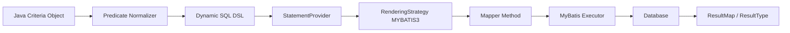
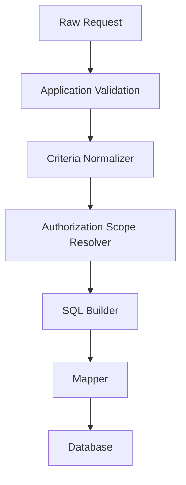

------
title: Learn Java MyBatis - Part 013
description: Advanced MyBatis Dynamic SQL library guide covering type-safe SQL construction, table modeling, rendering strategies, mapper integration, optional predicates, safety rules, and production patterns.
series: learn-java-mybatis
seriesTitle: Learn Java MyBatis, Patterns, Anti-Patterns, and Production Persistence Mapping
order: 13
partTitle: MyBatis Dynamic SQL Library
tags:
  - java
  - mybatis
  - persistence
  - dynamic-sql
  - sql-dsl
  - architecture
date: 2026-06-28
---

# Part 013 — MyBatis Dynamic SQL Library

## 1. Tujuan Pembelajaran

Pada part sebelumnya, kita memakai dynamic SQL di XML. Pendekatan itu sangat berguna untuk query yang masih mudah dibaca sebagai SQL template. Tetapi pada search screen kompleks, query builder, reusable predicates, dan conditional statement yang banyak variasinya, XML bisa menjadi terlalu besar dan sulit dites sebagai unit kecil.

Di sini kita membahas **MyBatis Dynamic SQL library**: library resmi dari ekosistem MyBatis untuk membangun SQL melalui Java DSL yang type-safe, lalu merender statement tersebut untuk MyBatis, Spring JDBC, atau runtime lain.

Setelah part ini, kita ingin bisa:

1. Memahami MyBatis Dynamic SQL sebagai **type-safe SQL templating library**, bukan ORM dan bukan replacement total untuk XML.
2. Memodelkan table dan column dengan `AliasableSqlTable` dan `SqlColumn`.
3. Membangun `SELECT`, `INSERT`, `UPDATE`, dan `DELETE` dengan DSL yang deterministic.
4. Menggunakan rendering strategy yang benar untuk MyBatis3.
5. Mengintegrasikan generated statement dengan mapper MyBatis.
6. Mendesain optional predicates tanpa menghasilkan query berbahaya.
7. Menentukan kapan Dynamic SQL library lebih baik daripada XML dynamic SQL.
8. Menjaga DSL agar tidak berubah menjadi business-rule engine tersembunyi.

Referensi resmi MyBatis Dynamic SQL menyebut library ini sebagai framework untuk menghasilkan dynamic SQL statement, atau secara praktis sebagai **typesafe SQL templating library** dengan support untuk MyBatis3 dan Spring JDBC Templates. Dokumentasi versi 2.0.0 dipublikasikan pada 12 Mar 2026.

---

## 2. Kaufman Deconstruction

Sub-skill yang perlu dipisahkan:

| Sub-skill | Pertanyaan Praktis |
|---|---|
| Table modeling | Bagaimana table dan column direpresentasikan secara type-safe? |
| Statement DSL | Bagaimana query dibangun tanpa string concatenation? |
| Rendering strategy | Bagaimana DSL menjadi SQL + parameter object untuk MyBatis? |
| Predicate composition | Bagaimana filter optional disusun tanpa kehilangan safety? |
| Mapper integration | Bagaimana statement provider dipanggil dari mapper? |
| Result mapping | Bagaimana hasil SQL tetap dipetakan melalui MyBatis? |
| Query governance | Bagaimana mencegah DSL menjadi unreadable? |
| Safety validation | Bagaimana mencegah empty WHERE untuk command berbahaya? |

Deliberate practice target:

- Buat table model untuk `case_file`, `case_party`, dan `case_assignment`.
- Buat search query dengan 8 filter optional.
- Tambahkan deterministic ordering dan pagination.
- Tambahkan `count` query yang konsisten dengan query data.
- Tambahkan update command dengan optimistic locking.
- Tambahkan test yang memverifikasi rendered SQL shape dan hasil real database.

---

## 3. Mental Model: SQL DSL, Bukan Query Magic

MyBatis Dynamic SQL bekerja dalam pipeline seperti ini:



Yang penting: library ini **tidak mengambil keputusan domain**. Ia hanya membangun SQL dengan cara yang lebih aman dan composable. Keputusan seperti tenant scope, authorization, status transition, escalation rule, dan allowed sorting tetap harus dirancang di application layer atau query service.

Salah kaprah umum:

| Salah Kaprah | Koreksi |
|---|---|
| Dynamic SQL library menggantikan MyBatis XML sepenuhnya | Tidak. XML tetap unggul untuk SQL panjang yang lebih natural dibaca sebagai SQL. |
| DSL membuat query otomatis optimal | Tidak. Optimasi tetap bergantung pada SQL shape, index, cardinality, dan query plan. |
| Type-safe berarti business-safe | Tidak. Type-safe hanya membantu column/value compatibility, bukan authorization atau tenant isolation. |
| Semua filter optional aman | Tidak. Optional predicate bisa hilang dan menyebabkan command menyentuh terlalu banyak row. |
| DSL lebih readable daripada SQL | Hanya jika query composition disiplin. DSL yang terlalu clever lebih buruk dari SQL eksplisit. |

---

## 4. Kapan Memakai XML Dynamic SQL vs MyBatis Dynamic SQL Library

Gunakan **XML dynamic SQL** ketika:

- Query panjang tetapi masih mudah dibaca sebagai SQL.
- Join kompleks lebih natural ditulis langsung.
- Team DBA/reviewer SQL ingin membaca statement dalam bentuk SQL.
- ResultMap kompleks berada dekat dengan query.
- Dynamic branch tidak terlalu banyak.

Gunakan **MyBatis Dynamic SQL library** ketika:

- Query filter sangat composable.
- Banyak optional criteria dengan kombinasi besar.
- Sorting dan pagination perlu distandarkan.
- Perlu reuse predicate antar query data dan count.
- Query dibangun dari object criteria yang sama di banyak use case.
- Ingin menguji query rendering sebagai unit Java.
- Ingin menghindari XML yang penuh `if`, `choose`, dan fragment abstrak.

Hindari Dynamic SQL library ketika:

- Query sudah menjadi laporan SQL besar dengan CTE, window function, vendor-specific hint, dan formatting penting.
- DSL membuat query sulit dibaca oleh reviewer.
- Team lebih kuat membaca SQL daripada membaca chained Java DSL.
- Query membutuhkan banyak vendor-specific construct yang tidak nyaman diekspresikan dengan DSL.

Rule praktis:

> Jika bentuk query utamanya stabil tetapi clause kecilnya optional, DSL cocok. Jika bentuk query utamanya sendiri adalah SQL kompleks yang harus dibaca sebagai SQL, XML atau SQL file lebih cocok.

---

## 5. Modeling Table dan Column

MyBatis Dynamic SQL merepresentasikan table/view sebagai Java object. Table biasanya dibuat dengan subclass `AliasableSqlTable`, sedangkan column dibuat sebagai `SqlColumn<T>`.

Contoh model table:

```java
package com.acme.caseplatform.persistence.mybatis.dynamic;

import java.sql.JDBCType;
import java.time.Instant;
import org.mybatis.dynamic.sql.AliasableSqlTable;
import org.mybatis.dynamic.sql.SqlColumn;

public final class CaseFileTable extends AliasableSqlTable<CaseFileTable> {
    public static final CaseFileTable caseFile = new CaseFileTable();

    public final SqlColumn<Long> id = column("id", JDBCType.BIGINT);
    public final SqlColumn<String> caseNumber = column("case_number", JDBCType.VARCHAR);
    public final SqlColumn<String> tenantId = column("tenant_id", JDBCType.VARCHAR);
    public final SqlColumn<String> status = column("status", JDBCType.VARCHAR);
    public final SqlColumn<String> severity = column("severity", JDBCType.VARCHAR);
    public final SqlColumn<Long> assignedOfficerId = column("assigned_officer_id", JDBCType.BIGINT);
    public final SqlColumn<Instant> openedAt = column("opened_at", JDBCType.TIMESTAMP_WITH_TIMEZONE);
    public final SqlColumn<Instant> updatedAt = column("updated_at", JDBCType.TIMESTAMP_WITH_TIMEZONE);
    public final SqlColumn<Long> version = column("version", JDBCType.BIGINT);

    private CaseFileTable() {
        super("case_file", CaseFileTable::new);
    }
}
```

Hal yang perlu diperhatikan:

1. Table model bukan domain model.
2. Table model bukan entity.
3. Table model adalah schema metadata di application code.
4. Nama column harus sesuai database, bukan Java property name.
5. Type column harus sesuai semantic Java type yang diharapkan mapper.
6. Aliasable table lebih fleksibel untuk join, self-join, dan runtime table name scenario.

Untuk schema besar, jangan taruh semua table dalam satu file raksasa. Gunakan struktur seperti ini:

```text
src/main/java/com/acme/caseplatform/persistence/mybatis/dynamic/
  CaseFileTable.java
  CasePartyTable.java
  CaseAssignmentTable.java
  EnforcementActionTable.java
  EvidenceItemTable.java
  AuditEventTable.java
```

Anti-pattern:

```java
public final class Tables {
    public static final CaseFileTable caseFile = new CaseFileTable();
    public static final CasePartyTable caseParty = new CasePartyTable();
    public static final EvidenceTable evidence = new EvidenceTable();
    // 80 tables later...
}
```

Kenapa buruk:

- merge conflict tinggi,
- ownership kabur,
- import statis jadi terlalu global,
- reviewer sulit melihat perubahan schema mapping,
- bounded context tidak terlihat.

---

## 6. Basic SELECT dengan RenderingStrategies.MYBATIS3

Contoh criteria object:

```java
public record CaseSearchCriteria(
    String tenantId,
    String status,
    String severity,
    Long assignedOfficerId,
    Instant openedFrom,
    Instant openedTo,
    String keyword,
    int limit,
    long offset
) {}
```

Contoh statement builder:

```java
import static com.acme.caseplatform.persistence.mybatis.dynamic.CaseFileTable.caseFile;
import static org.mybatis.dynamic.sql.SqlBuilder.*;

import org.mybatis.dynamic.sql.render.RenderingStrategies;
import org.mybatis.dynamic.sql.select.render.SelectStatementProvider;

public final class CaseFileSqlProvider {

    public SelectStatementProvider searchCases(CaseSearchCriteria criteria) {
        return select(
                caseFile.id,
                caseFile.caseNumber,
                caseFile.status,
                caseFile.severity,
                caseFile.assignedOfficerId,
                caseFile.openedAt,
                caseFile.updatedAt
            )
            .from(caseFile)
            .where(caseFile.tenantId, isEqualTo(criteria.tenantId()))
            .and(caseFile.status, isEqualToWhenPresent(criteria.status()))
            .and(caseFile.severity, isEqualToWhenPresent(criteria.severity()))
            .and(caseFile.assignedOfficerId, isEqualToWhenPresent(criteria.assignedOfficerId()))
            .and(caseFile.openedAt, isGreaterThanOrEqualToWhenPresent(criteria.openedFrom()))
            .and(caseFile.openedAt, isLessThanWhenPresent(criteria.openedTo()))
            .orderBy(caseFile.openedAt.descending(), caseFile.id.descending())
            .limit(criteria.limit())
            .offset(criteria.offset())
            .build()
            .render(RenderingStrategies.MYBATIS3);
    }
}
```

Catatan penting:

- `tenantId` sengaja tidak `WhenPresent`. Tenant scope tidak boleh optional.
- `status`, `severity`, dan `assignedOfficerId` boleh optional.
- Sorting deterministic: `opened_at desc, id desc`.
- `limit` dan `offset` harus divalidasi sebelum dipakai.
- Keyword belum dimasukkan karena butuh normalisasi khusus.

---

## 7. Mapper Integration

Dynamic SQL statement provider bisa diteruskan ke mapper method. Pola umum:

```java
import java.util.List;
import org.apache.ibatis.annotations.Mapper;
import org.apache.ibatis.annotations.ResultMap;
import org.apache.ibatis.annotations.SelectProvider;
import org.mybatis.dynamic.sql.select.render.SelectStatementProvider;
import org.mybatis.dynamic.sql.util.SqlProviderAdapter;

@Mapper
public interface CaseFileDynamicMapper {

    @SelectProvider(type = SqlProviderAdapter.class, method = "select")
    @ResultMap("CaseFileReadModelMap")
    List<CaseFileRow> selectMany(SelectStatementProvider selectStatement);
}
```

Mapper XML tetap bisa dipakai untuk `resultMap`:

```xml
<mapper namespace="com.acme.caseplatform.persistence.mybatis.CaseFileDynamicMapper">

  <resultMap id="CaseFileReadModelMap" type="com.acme.caseplatform.persistence.model.CaseFileRow">
    <id property="id" column="id"/>
    <result property="caseNumber" column="case_number"/>
    <result property="status" column="status"/>
    <result property="severity" column="severity"/>
    <result property="assignedOfficerId" column="assigned_officer_id"/>
    <result property="openedAt" column="opened_at"/>
    <result property="updatedAt" column="updated_at"/>
  </resultMap>

</mapper>
```

Ini adalah hybrid pattern yang sering paling sehat:

- Java DSL untuk query composition.
- Mapper interface untuk execution boundary.
- XML resultMap untuk explicit result mapping.

Jangan menganggap Dynamic SQL library membuat result mapping hilang. Query generation dan result mapping adalah concern berbeda.

---

## 8. Optional Predicate Discipline

Optional predicate berguna, tetapi berbahaya jika diterapkan ke command seperti update/delete.

Contoh aman untuk search:

```java
.where(caseFile.tenantId, isEqualTo(criteria.tenantId()))
.and(caseFile.status, isEqualToWhenPresent(criteria.status()))
.and(caseFile.severity, isEqualToWhenPresent(criteria.severity()))
```

Contoh berbahaya:

```java
deleteFrom(caseFile)
    .where(caseFile.tenantId, isEqualToWhenPresent(command.tenantId()))
    .and(caseFile.status, isEqualToWhenPresent(command.status()))
    .build()
    .render(RenderingStrategies.MYBATIS3);
```

Jika semua predicate optional tidak render, command bisa berubah menjadi operasi luas. Dynamic SQL library memiliki guard terkait non-rendering where clause, tetapi desain production tidak boleh bergantung hanya pada library exception. Validasi input tetap wajib.

Gunakan invariant:

```java
public record BulkCloseCasesCommand(
    String tenantId,
    List<Long> caseIds,
    String reason
) {
    public BulkCloseCasesCommand {
        if (tenantId == null || tenantId.isBlank()) {
            throw new IllegalArgumentException("tenantId is required");
        }
        if (caseIds == null || caseIds.isEmpty()) {
            throw new IllegalArgumentException("caseIds is required");
        }
        if (reason == null || reason.isBlank()) {
            throw new IllegalArgumentException("reason is required");
        }
    }
}
```

Lalu command SQL:

```java
public UpdateStatementProvider bulkClose(BulkCloseCasesCommand command, Instant now) {
    return update(caseFile)
        .set(caseFile.status).equalTo("CLOSED")
        .set(caseFile.updatedAt).equalTo(now)
        .where(caseFile.tenantId, isEqualTo(command.tenantId()))
        .and(caseFile.id, isIn(command.caseIds()))
        .and(caseFile.status, isNotEqualTo("CLOSED"))
        .build()
        .render(RenderingStrategies.MYBATIS3);
}
```

Rule:

> Untuk `UPDATE` dan `DELETE`, predicate yang menentukan scope wajib tidak boleh optional.

---

## 9. Keyword Search Pattern

Jangan menyebarkan wildcard logic di mapper:

```java
.and(caseFile.caseNumber, isLikeWhenPresent(criteria.keyword())) // buruk jika keyword raw
```

Buat normalized criteria:

```java
public record NormalizedCaseSearchCriteria(
    String tenantId,
    String status,
    String severity,
    Long assignedOfficerId,
    Instant openedFrom,
    Instant openedTo,
    String keywordLike,
    int limit,
    long offset
) {}
```

Normalizer:

```java
public final class CaseSearchCriteriaNormalizer {

    public NormalizedCaseSearchCriteria normalize(CaseSearchCriteria raw) {
        int limit = Math.clamp(raw.limit(), 1, 100);
        long offset = Math.max(0, raw.offset());

        String keywordLike = normalizeKeyword(raw.keyword());

        return new NormalizedCaseSearchCriteria(
            requireTenant(raw.tenantId()),
            blankToNull(raw.status()),
            blankToNull(raw.severity()),
            raw.assignedOfficerId(),
            raw.openedFrom(),
            raw.openedTo(),
            keywordLike,
            limit,
            offset
        );
    }

    private String normalizeKeyword(String keyword) {
        if (keyword == null || keyword.isBlank()) {
            return null;
        }
        String trimmed = keyword.trim().replace("%", "\\%").replace("_", "\\_");
        return "%" + trimmed.toLowerCase() + "%";
    }
}
```

Query:

```java
.and(lower(caseFile.caseNumber), isLikeWhenPresent(criteria.keywordLike()))
```

Catatan: contoh `lower(...)` bisa membutuhkan function support atau custom rendering tergantung style yang dipakai. Alternatifnya gunakan database-specific expression secara eksplisit dan test hasil SQL-nya.

Invariant keyword:

1. Keyword mentah tidak langsung masuk query builder.
2. Escape wildcard dilakukan di normalizer.
3. Case-insensitive policy konsisten.
4. Minimum keyword length ditentukan.
5. Query plan dicek untuk search screen yang dipakai sering.

---

## 10. Sorting Whitelist dengan DSL

Sorting dari request tidak boleh langsung menjadi SQL identifier.

Model:

```java
public enum CaseSortField {
    OPENED_AT,
    UPDATED_AT,
    SEVERITY,
    CASE_NUMBER
}

public enum SortDirection {
    ASC,
    DESC
}

public record SortSpec(CaseSortField field, SortDirection direction) {}
```

Resolver:

```java
import org.mybatis.dynamic.sql.SortSpecification;

public final class CaseSortResolver {

    public List<SortSpecification> resolve(SortSpec sortSpec) {
        SortSpec effective = sortSpec == null
            ? new SortSpec(CaseSortField.OPENED_AT, SortDirection.DESC)
            : sortSpec;

        SortSpecification primary = switch (effective.field()) {
            case OPENED_AT -> order(caseFile.openedAt, effective.direction());
            case UPDATED_AT -> order(caseFile.updatedAt, effective.direction());
            case SEVERITY -> order(caseFile.severity, effective.direction());
            case CASE_NUMBER -> order(caseFile.caseNumber, effective.direction());
        };

        return List.of(primary, caseFile.id.descending());
    }

    private SortSpecification order(SqlColumn<?> column, SortDirection direction) {
        return direction == SortDirection.ASC ? column : column.descending();
    }
}
```

Tujuan resolver:

- Tidak ada raw column dari user.
- Sorting selalu deterministic.
- Tie-breaker selalu ada.
- Field yang mahal bisa dilarang.
- Field yang butuh functional index bisa ditangani eksplisit.

---

## 11. Reusing Predicate antara Data Query dan Count Query

Masalah umum search screen: query data dan query count tidak konsisten.

Buruk:

```java
SelectStatementProvider data = buildSearchData(criteria);
SelectStatementProvider count = buildSearchCountWithDifferentWhere(criteria);
```

Lebih baik: pisahkan predicate application ke helper.

```java
public final class CaseWhereApplier {

    public <T extends AbstractWhereDSL<T>> T applySearchWhere(
        T where,
        NormalizedCaseSearchCriteria criteria
    ) {
        return where
            .and(caseFile.tenantId, isEqualTo(criteria.tenantId()))
            .and(caseFile.status, isEqualToWhenPresent(criteria.status()))
            .and(caseFile.severity, isEqualToWhenPresent(criteria.severity()))
            .and(caseFile.assignedOfficerId, isEqualToWhenPresent(criteria.assignedOfficerId()))
            .and(caseFile.openedAt, isGreaterThanOrEqualToWhenPresent(criteria.openedFrom()))
            .and(caseFile.openedAt, isLessThanWhenPresent(criteria.openedTo()));
    }
}
```

Tipe generik di atas adalah ilustrasi desain. Dalam implementasi nyata, sesuaikan dengan API DSL versi yang dipakai. Yang penting adalah prinsipnya: **predicate definition satu sumber**.

Checklist:

- Data query dan count query menggunakan filter source yang sama.
- Count query tidak membawa `orderBy`.
- Count query tidak membawa `limit/offset`.
- Join di count query hanya join yang diperlukan untuk filter.
- Jika count mahal, desain approximate count atau deferred count secara eksplisit.

---

## 12. Insert dan Update dengan Optional Mapping

Dynamic SQL mendukung mapping conditional. Gunakan untuk patch/update partial, tetapi jangan biarkan command kosong.

Contoh insert:

```java
public InsertStatementProvider<CaseFileInsertRow> insertCase(CaseFileInsertRow row) {
    return insert(row)
        .into(caseFile)
        .map(caseFile.caseNumber).toProperty("caseNumber")
        .map(caseFile.tenantId).toProperty("tenantId")
        .map(caseFile.status).toProperty("status")
        .map(caseFile.severity).toPropertyWhenPresent("severity", row::severity)
        .map(caseFile.assignedOfficerId).toPropertyWhenPresent("assignedOfficerId", row::assignedOfficerId)
        .map(caseFile.openedAt).toProperty("openedAt")
        .map(caseFile.version).toConstant("0")
        .build()
        .render(RenderingStrategies.MYBATIS3);
}
```

Contoh update patch:

```java
public UpdateStatementProvider updateCasePatch(CasePatchCommand command, Instant now) {
    command.requireAtLeastOnePatchField();

    return update(caseFile)
        .set(caseFile.severity).equalToWhenPresent(command::severity)
        .set(caseFile.assignedOfficerId).equalToWhenPresent(command::assignedOfficerId)
        .set(caseFile.updatedAt).equalTo(now)
        .set(caseFile.version).equalTo(add(caseFile.version, constant("1")))
        .where(caseFile.tenantId, isEqualTo(command.tenantId()))
        .and(caseFile.id, isEqualTo(command.caseId()))
        .and(caseFile.version, isEqualTo(command.expectedVersion()))
        .build()
        .render(RenderingStrategies.MYBATIS3);
}
```

Invariant update patch:

1. At least one business field must change, or update is rejected.
2. `updated_at` and `version` are set intentionally.
3. Tenant and id are mandatory.
4. Version guard is mandatory for concurrent update-sensitive aggregates.
5. Caller must check affected row count.

---

## 13. Join Query Pattern

Contoh join untuk assignment queue:

```java
SelectStatementProvider statement = select(
        caseFile.id.as("case_id"),
        caseFile.caseNumber,
        caseFile.status,
        caseFile.severity,
        caseAssignment.assignedOfficerId,
        caseAssignment.assignedAt
    )
    .from(caseFile, "cf")
    .join(caseAssignment, "ca")
        .on(caseFile.id, equalTo(caseAssignment.caseId))
    .where(caseFile.tenantId, isEqualTo(criteria.tenantId()))
    .and(caseAssignment.assignedOfficerId, isEqualTo(criteria.officerId()))
    .and(caseFile.status, isIn("OPEN", "UNDER_REVIEW"))
    .orderBy(caseAssignment.assignedAt, caseFile.id)
    .limit(criteria.limit())
    .offset(criteria.offset())
    .build()
    .render(RenderingStrategies.MYBATIS3);
```

Rules untuk join:

- Selalu alias table pada query join.
- Select column dengan alias jika ada nama column ambigu.
- Jangan select `*`.
- Mapping result harus eksplisit.
- Pastikan join cardinality tidak menggandakan row tanpa disadari.
- Untuk self-join, gunakan table instance berbeda atau alias strategy yang jelas.

---

## 14. Pattern: Query Builder per Use Case

Jangan buat satu class `CaseSqlBuilder` yang berisi semua query.

Lebih baik:

```text
persistence/mybatis/query/
  CaseSearchSql.java
  CaseAssignmentQueueSql.java
  CaseDashboardSql.java
  CaseLifecycleCommandSql.java
  CaseAuditSql.java
```

Setiap class memiliki scope sempit:

```java
public final class CaseAssignmentQueueSql {
    public SelectStatementProvider findQueue(AssignmentQueueCriteria criteria) { ... }
    public SelectStatementProvider countQueue(AssignmentQueueCriteria criteria) { ... }
}
```

Keuntungan:

- ownership jelas,
- test lebih kecil,
- query evolution lebih aman,
- review lebih fokus,
- tidak berubah menjadi SQL god class.

---

## 15. Pattern: Criteria Normalizer sebelum SQL Builder

Jangan biarkan SQL builder melakukan semua hal:

```java
public SelectStatementProvider search(CaseSearchCriteria raw) {
    // validate tenant
    // normalize keyword
    // clamp limit
    // parse sort
    // decide authorization
    // build SQL
}
```

Pecah menjadi pipeline:



SQL builder hanya menerima criteria yang sudah siap:

```java
public SelectStatementProvider search(NormalizedCaseSearchCriteria criteria) {
    return select(...)
        .from(caseFile)
        .where(caseFile.tenantId, isEqualTo(criteria.tenantId()))
        .and(caseFile.status, isEqualToWhenPresent(criteria.status()))
        .orderBy(criteria.sortSpecifications())
        .limit(criteria.limit())
        .offset(criteria.offset())
        .build()
        .render(RenderingStrategies.MYBATIS3);
}
```

---

## 16. Testing Dynamic SQL Library Usage

Minimal test layers:

### 16.1 Rendered SQL Shape Test

Tujuan: memastikan branch DSL menghasilkan SQL yang diharapkan.

```java
@Test
void searchCases_rendersTenantAndStatusFilter() {
    var criteria = new NormalizedCaseSearchCriteria(
        "tenant-a",
        "OPEN",
        null,
        null,
        null,
        null,
        null,
        50,
        0
    );

    SelectStatementProvider statement = sql.searchCases(criteria);

    assertThat(statement.getSelectStatement()).contains("from case_file");
    assertThat(statement.getSelectStatement()).contains("tenant_id");
    assertThat(statement.getSelectStatement()).contains("status");
    assertThat(statement.getSelectStatement()).contains("order by");
}
```

Jangan overfit exact whitespace kecuali memakai snapshot testing yang sengaja distabilkan.

### 16.2 Parameter Test

```java
assertThat(statement.getParameters()).containsEntry("parameters.p1", "tenant-a");
```

Nama parameter bisa bergantung versi/rendering detail. Jangan membuat test terlalu rapuh kecuali memang diperlukan.

### 16.3 Real Database Mapper Test

Rendered SQL valid belum berarti query benar. Tetap test di database nyata:

- schema migration applied,
- seed data meaningful,
- mapper method executed,
- result mapping verified,
- index-sensitive query dijalankan dengan dataset representatif.

### 16.4 Dangerous Command Test

```java
@Test
void bulkClose_rejectsEmptyCaseIds() {
    assertThatThrownBy(() -> new BulkCloseCasesCommand("tenant-a", List.of(), "done"))
        .isInstanceOf(IllegalArgumentException.class);
}
```

Safety harus diuji di level command/criteria sebelum DSL.

---

## 17. Anti-Patterns

### 17.1 DSL as Business Logic Engine

Buruk:

```java
if (user.role().equals("SUPERVISOR") && status.equals("ESCALATED") && clock.isAfter(...)) {
    // business decision mixed with SQL construction
}
```

Lebih baik:

- application service menentukan allowed scope,
- SQL builder menerima `AuthorizedCaseScope`,
- mapper hanya mengeksekusi query.

### 17.2 Everything Dynamic

Jika semua column, table, join, condition, sorting, grouping, dan projection dynamic, Anda bukan membuat mapper. Anda membuat ad-hoc query engine. Itu area yang perlu governance, sandboxing, dan authorization jauh lebih kuat.

### 17.3 Reusing One Criteria for Everything

`CaseSearchCriteria` dipakai untuk list screen, export, dashboard, report, SLA breach, dan audit query. Akhirnya criteria punya 40 field dan tidak ada invariant yang jelas.

Buat criteria per use case.

### 17.4 Optional Tenant Predicate

Tenant predicate tidak boleh `WhenPresent`.

```java
.where(caseFile.tenantId, isEqualToWhenPresent(criteria.tenantId())) // buruk
```

Gunakan mandatory value:

```java
.where(caseFile.tenantId, isEqualTo(criteria.tenantId()))
```

### 17.5 Sorting by Raw Request

Jika user mengirim `sort=updated_at desc; drop table`, jangan sampai masuk SQL sebagai raw string. Bahkan jika library membantu parameter binding value, identifier tetap harus whitelist.

### 17.6 No ResultMap Review

DSL membuat SQL, bukan mapping. Jika query join menghasilkan alias salah, bug tetap bisa silent.

---

## 18. Review Checklist

Untuk setiap penggunaan MyBatis Dynamic SQL:

- [ ] Table/column object berada di package persistence, bukan domain.
- [ ] Query builder class punya scope sempit per use case.
- [ ] Criteria sudah dinormalisasi sebelum masuk builder.
- [ ] Tenant/security predicate mandatory.
- [ ] `UPDATE`/`DELETE` tidak bergantung pada semua predicate optional.
- [ ] Sorting memakai whitelist.
- [ ] Pagination punya deterministic ordering.
- [ ] Data query dan count query memakai predicate source yang konsisten.
- [ ] ResultMap/resultType direview eksplisit.
- [ ] Rendered SQL diuji untuk branch penting.
- [ ] Mapper diuji dengan database nyata.
- [ ] Query plan dicek untuk screen production-critical.

---

## 19. Deliberate Practice

### Drill 1 — Build Safe Search Query

Buat query `searchCases` dengan filter:

- tenant id wajib,
- status optional,
- severity optional,
- assigned officer optional,
- opened date range optional,
- keyword optional,
- sort whitelist,
- limit/offset.

Acceptance criteria:

- tenant predicate selalu render,
- `ORDER BY` deterministic,
- limit maksimal 100,
- keyword escaped,
- count query konsisten.

### Drill 2 — Build Optimistic Update

Buat command `assignCase`:

- tenant id,
- case id,
- officer id,
- expected version.

SQL harus:

- update assignment field,
- increment version,
- guard by tenant,
- guard by case id,
- guard by version,
- return affected rows.

### Drill 3 — Refactor XML Dynamic Query ke DSL

Ambil query XML dengan 10 `<if>` branch. Refactor ke MyBatis Dynamic SQL jika:

- branch berupa predicate sederhana,
- resultMap tetap bisa reuse,
- query lebih mudah dites,
- reviewer tetap bisa memahami SQL shape.

Jika hasil DSL lebih sulit dibaca, rollback ke XML.

---

## 20. Ringkasan

MyBatis Dynamic SQL library memberikan cara type-safe untuk membangun SQL statement dan parameter object. Ia sangat kuat untuk query composition, optional criteria, reusable predicates, dan search screens. Tetapi ia bukan pengganti desain persistence yang baik.

Mental model yang harus dipegang:

1. Table object adalah schema metadata.
2. DSL menghasilkan SQL, bukan keputusan domain.
3. Predicate optional harus dikendalikan dengan invariant.
4. Tenant/security predicate wajib tidak boleh optional.
5. Sorting harus whitelist.
6. Count query dan data query harus konsisten.
7. Result mapping tetap first-class concern.
8. Real database test tetap wajib.

Part berikutnya akan membahas **query composition patterns** secara lebih luas: criteria object, sorting abstraction, pagination abstraction, predicate reuse, cursor pagination, search matrix, dan governance agar query tetap scalable di codebase besar.

---

## Referensi Resmi

- [MyBatis Dynamic SQL — Introduction](https://mybatis.org/mybatis-dynamic-sql/docs/introduction.html)
- [MyBatis Dynamic SQL — Database Object Representation](https://mybatis.org/mybatis-dynamic-sql/docs/databaseObjects.html)
- [MyBatis Dynamic SQL — Where Conditions](https://mybatis.org/mybatis-dynamic-sql/docs/conditions.html)
- [MyBatis Dynamic SQL — Exceptions](https://mybatis.org/mybatis-dynamic-sql/docs/exceptions.html)
- [MyBatis Mapper XML Files](https://mybatis.org/mybatis-3/sqlmap-xml.html)
