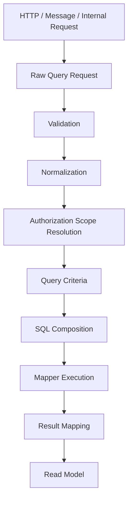
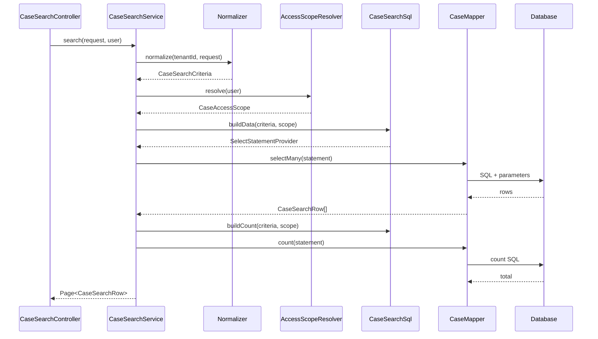

------
title: Learn Java MyBatis - Part 014
description: Advanced MyBatis query composition patterns covering criteria objects, predicate reuse, search screens, sorting, offset and cursor pagination, authorization scope, count consistency, and query governance.
series: learn-java-mybatis
seriesTitle: Learn Java MyBatis, Patterns, Anti-Patterns, and Production Persistence Mapping
order: 14
partTitle: Query Composition Patterns
tags:
  - java
  - mybatis
  - persistence
  - query-composition
  - search
  - pagination
  - architecture
date: 2026-06-28
---

# Part 014 — Query Composition Patterns

## 1. Tujuan Pembelajaran

Banyak aplikasi enterprise tidak gagal karena query CRUD sederhana. Mereka gagal karena search screen tumbuh menjadi 30 filter, sorting tidak deterministic, count query tidak konsisten, authorization predicate lupa dipasang, pagination lambat, dan mapper berisi dynamic branch yang tidak bisa direview.

Part ini membahas **query composition patterns**: cara menyusun query kompleks agar tetap aman, deterministic, testable, dan maintainable di codebase besar.

Setelah part ini, kita ingin bisa:

1. Mendesain criteria object yang punya invariant jelas.
2. Memisahkan raw request, normalized criteria, authorization scope, dan SQL builder.
3. Menyusun optional predicate tanpa kehilangan mandatory guard.
4. Mendesain sorting whitelist dan pagination contract.
5. Menentukan kapan memakai offset pagination dan kapan memakai cursor/keyset pagination.
6. Menjaga consistency antara data query dan count query.
7. Menghindari query builder chaos.
8. Membuat governance untuk mapper query production-critical.

Ini bukan pengulangan SQL dasar. Kita fokus pada **composition boundary**: bagaimana query yang berubah-ubah tetap punya struktur dan aturan.

---

## 2. Kaufman Deconstruction

Sub-skill query composition:

| Sub-skill | Pertanyaan Praktis |
|---|---|
| Criteria modeling | Apa input query yang valid? |
| Normalization | Apa yang harus dibersihkan sebelum SQL dibuat? |
| Predicate ownership | Siapa yang menentukan filter business, tenant, dan authorization? |
| Sorting contract | Field apa yang boleh disort dan apakah deterministic? |
| Pagination contract | Offset atau cursor? Apa stability guarantee-nya? |
| Count consistency | Apakah count dan data memakai predicate yang sama? |
| Query plan awareness | Apakah kombinasi filter masih index-friendly? |
| Testing strategy | Kombinasi branch mana yang harus diuji? |

Target practice:

- Buat search screen untuk case management dengan 12 filter.
- Buat normalized criteria.
- Tambahkan authorization scope.
- Buat data query dan count query.
- Buat cursor pagination untuk work queue.
- Buat test matrix untuk kombinasi filter paling riskan.

---

## 3. Mental Model: Query sebagai Pipeline

Query composition yang sehat tidak dimulai dari mapper. Ia dimulai dari pipeline input sampai database.



Tiap tahap punya tanggung jawab berbeda:

| Tahap | Tanggung Jawab |
|---|---|
| Raw request | Mewakili input eksternal apa adanya |
| Validation | Menolak input invalid |
| Normalization | Mengubah input menjadi canonical form |
| Authorization scope | Menentukan data apa yang boleh dilihat |
| Query criteria | Contract internal untuk SQL builder |
| SQL composition | Membuat SQL deterministic |
| Mapper execution | Mengeksekusi statement dan mapping result |
| Read model | Shape yang dikembalikan ke application/API |

Anti-pattern terbesar adalah melebur semua tahap ini ke mapper method.

---

## 4. Raw Request vs Normalized Criteria

Raw request biasanya lemah:

```java
public record CaseSearchRequest(
    String status,
    String severity,
    String assignedOfficerId,
    String openedFrom,
    String openedTo,
    String keyword,
    String sort,
    String direction,
    Integer page,
    Integer size
) {}
```

Ini cocok untuk boundary API, tetapi buruk untuk mapper.

Normalized criteria harus kuat:

```java
public record CaseSearchCriteria(
    TenantId tenantId,
    Optional<CaseStatus> status,
    Optional<Severity> severity,
    Optional<Long> assignedOfficerId,
    Optional<Instant> openedFrom,
    Optional<Instant> openedTo,
    Optional<String> keywordLike,
    CaseSort sort,
    PageWindow page
) {
    public CaseSearchCriteria {
        Objects.requireNonNull(tenantId, "tenantId is required");
        Objects.requireNonNull(status, "status is required");
        Objects.requireNonNull(severity, "severity is required");
        Objects.requireNonNull(sort, "sort is required");
        Objects.requireNonNull(page, "page is required");

        if (openedFrom.isPresent() && openedTo.isPresent()
            && !openedFrom.get().isBefore(openedTo.get())) {
            throw new IllegalArgumentException("openedFrom must be before openedTo");
        }
    }
}
```

Dalam Java production, penggunaan `Optional` sebagai field record masih diperdebatkan. Jika team melarang `Optional` field, gunakan nullable field + invariant constructor/helper. Yang penting bukan bentuk syntax-nya, melainkan contract:

- tenant wajib,
- date range valid,
- keyword sudah normalized,
- pagination sudah dikontrol,
- sorting sudah whitelist.

---

## 5. Normalizer Pattern

Normalizer mengubah request lemah menjadi criteria kuat.

```java
public final class CaseSearchNormalizer {

    public CaseSearchCriteria normalize(TenantId tenantId, CaseSearchRequest request) {
        return new CaseSearchCriteria(
            tenantId,
            parseStatus(request.status()),
            parseSeverity(request.severity()),
            parseLong(request.assignedOfficerId()),
            parseInstant(request.openedFrom()),
            parseInstant(request.openedTo()),
            normalizeKeyword(request.keyword()),
            normalizeSort(request.sort(), request.direction()),
            normalizePage(request.page(), request.size())
        );
    }

    private Optional<String> normalizeKeyword(String raw) {
        if (raw == null || raw.isBlank()) {
            return Optional.empty();
        }

        String value = raw.trim().toLowerCase(Locale.ROOT);
        if (value.length() < 3) {
            throw new IllegalArgumentException("keyword must be at least 3 characters");
        }

        String escaped = value
            .replace("\\", "\\\\")
            .replace("%", "\\%")
            .replace("_", "\\_");

        return Optional.of("%" + escaped + "%");
    }

    private PageWindow normalizePage(Integer page, Integer size) {
        int effectivePage = page == null ? 0 : Math.max(0, page);
        int effectiveSize = size == null ? 50 : Math.clamp(size, 1, 100);
        return PageWindow.offset(effectivePage, effectiveSize);
    }
}
```

Normalizer bukan tempat business rule berat. Ia hanya memastikan query input aman dan canonical.

---

## 6. Authorization Scope sebagai Predicate Source

Dalam sistem real, query bukan hanya filter user. Query juga harus membawa authorization scope.

Contoh:

```java
public sealed interface CaseAccessScope
    permits TenantWideScope, OfficerScope, UnitScope, RestrictedCaseListScope {
}

public record TenantWideScope(TenantId tenantId) implements CaseAccessScope {}

public record OfficerScope(TenantId tenantId, long officerId) implements CaseAccessScope {}

public record UnitScope(TenantId tenantId, long unitId) implements CaseAccessScope {}

public record RestrictedCaseListScope(TenantId tenantId, List<Long> caseIds) implements CaseAccessScope {}
```

Resolver:

```java
public final class CaseAccessScopeResolver {

    public CaseAccessScope resolve(UserPrincipal principal) {
        if (principal.hasRole("CASE_ADMIN")) {
            return new TenantWideScope(principal.tenantId());
        }
        if (principal.hasRole("OFFICER")) {
            return new OfficerScope(principal.tenantId(), principal.userId());
        }
        return new RestrictedCaseListScope(principal.tenantId(), principal.assignedCaseIds());
    }
}
```

SQL composition menerima criteria + scope:

```java
public record AuthorizedCaseSearch(
    CaseSearchCriteria criteria,
    CaseAccessScope scope
) {}
```

Keuntungan:

- tenant predicate tidak bergantung pada request user,
- authorization tidak tersembunyi sebagai `if` acak di mapper,
- scope bisa dites tanpa database,
- query builder lebih eksplisit.

---

## 7. Applying Scope to Query

Pseudo-pattern dengan Dynamic SQL:

```java
private QueryExpressionDSL<SelectModel>.QueryExpressionWhereBuilder applyScope(
    QueryExpressionDSL<SelectModel>.QueryExpressionWhereBuilder where,
    CaseAccessScope scope
) {
    return switch (scope) {
        case TenantWideScope s -> where
            .and(caseFile.tenantId, isEqualTo(s.tenantId().value()));

        case OfficerScope s -> where
            .and(caseFile.tenantId, isEqualTo(s.tenantId().value()))
            .and(caseFile.assignedOfficerId, isEqualTo(s.officerId()));

        case UnitScope s -> where
            .and(caseFile.tenantId, isEqualTo(s.tenantId().value()))
            .and(caseFile.unitId, isEqualTo(s.unitId()));

        case RestrictedCaseListScope s -> where
            .and(caseFile.tenantId, isEqualTo(s.tenantId().value()))
            .and(caseFile.id, isIn(s.caseIds()));
    };
}
```

Tipe DSL di contoh bisa berbeda tergantung API yang dipakai. Intinya: scope diterapkan sebagai satu fungsi konseptual, bukan disalin manual di 20 query.

Rule:

> Authorization predicate adalah bagian dari query contract, bukan after-filter di memory.

After-filter di memory buruk karena:

- data unauthorized sudah keluar dari database,
- paging/count bisa salah,
- log/trace bisa bocor,
- performance boros,
- bug lebih sulit diaudit.

---

## 8. Search Matrix Pattern

Untuk search screen kompleks, buat matrix filter.

Contoh case search:

| Filter | Optional | Column | Operator | Index Expectation | Notes |
|---|---:|---|---|---|---|
| tenantId | No | `tenant_id` | `=` | Leading index component | Always required |
| status | Yes | `status` | `=` | Composite with tenant | Enum validated |
| severity | Yes | `severity` | `=` | Composite maybe | Low cardinality |
| assignedOfficerId | Yes | `assigned_officer_id` | `=` | Queue index | Important for work queue |
| openedFrom | Yes | `opened_at` | `>=` | Range component | Combine carefully |
| openedTo | Yes | `opened_at` | `<` | Range component | Exclusive upper bound |
| keyword | Yes | `case_number` / text | `LIKE` / FTS | Needs special index | Minimum length |
| sort | Yes | whitelisted | `ORDER BY` | Must match index if possible | Deterministic |

Search matrix membantu review:

- apakah ada filter raw yang masuk SQL,
- apakah ada filter tanpa index,
- apakah ada kombinasi yang mahal,
- apakah semantic optional jelas,
- apakah predicate tenant selalu ada.

Untuk query production-critical, matrix ini sebaiknya ada di dekat query builder atau ADR kecil.

---

## 9. Predicate Composition Pattern

Jika memakai XML, predicate composition biasanya berupa `<sql>` fragment. Jika memakai Dynamic SQL library, predicate composition berupa helper method/function.

### XML Fragment Pattern

```xml
<sql id="CaseSearchWhere">
  WHERE cf.tenant_id = #{tenantId}
  <if test="status != null">
    AND cf.status = #{status}
  </if>
  <if test="severity != null">
    AND cf.severity = #{severity}
  </if>
  <if test="assignedOfficerId != null">
    AND cf.assigned_officer_id = #{assignedOfficerId}
  </if>
</sql>
```

Gunakan fragment hanya jika:

- fragment benar-benar reusable,
- fragment tidak membawa `ORDER BY`,
- fragment tidak punya side effect semantic,
- nama fragment sangat jelas,
- parameter contract terdokumentasi.

Anti-pattern:

```xml
<sql id="CommonWhere">
  <!-- 200 lines of conditional SQL used by 11 statements -->
</sql>
```

### Java Predicate Helper Pattern

```java
public final class CasePredicates {

    public static IsEqualTo<String> tenantEquals(TenantId tenantId) {
        return isEqualTo(tenantId.value());
    }

    public static IsEqualToWhenPresent<String> statusEquals(Optional<CaseStatus> status) {
        return isEqualToWhenPresent(status.map(CaseStatus::code).orElse(null));
    }
}
```

Jangan berlebihan sampai helper menyembunyikan SQL.

Buruk:

```java
CasePredicates.applyEverythingForCurrentScreen(...)
```

Lebih baik:

```java
.where(caseFile.tenantId, tenantEquals(criteria.tenantId()))
.and(caseFile.status, statusEquals(criteria.status()))
```

Reviewer tetap bisa melihat column dan predicate.

---

## 10. Sorting Abstraction

Sorting bukan string bebas. Sorting adalah contract.

```java
public enum CaseSortKey {
    OPENED_AT,
    UPDATED_AT,
    CASE_NUMBER,
    SEVERITY
}

public record CaseSort(CaseSortKey key, SortDirection direction) {
    public static CaseSort defaultSort() {
        return new CaseSort(CaseSortKey.OPENED_AT, SortDirection.DESC);
    }
}
```

Mapping ke SQL harus whitelist:

```java
public final class CaseSortSql {

    public List<SortSpecification> toOrderBy(CaseSort sort) {
        SortSpecification primary = switch (sort.key()) {
            case OPENED_AT -> order(caseFile.openedAt, sort.direction());
            case UPDATED_AT -> order(caseFile.updatedAt, sort.direction());
            case CASE_NUMBER -> order(caseFile.caseNumber, sort.direction());
            case SEVERITY -> order(caseFile.severity, sort.direction());
        };

        return List.of(primary, caseFile.id.descending());
    }
}
```

Rules:

1. Sort key eksternal tidak sama dengan nama column.
2. Direction hanya enum.
3. Default sort jelas.
4. Tie-breaker wajib.
5. Sort field mahal harus disetujui eksplisit.
6. Sort harus compatible dengan pagination strategy.

---

## 11. Offset Pagination Pattern

Offset pagination cocok untuk:

- admin screen kecil,
- dataset tidak terlalu besar,
- user butuh lompat halaman,
- total count penting,
- perubahan data antar page tidak terlalu kritikal.

Model:

```java
public record PageWindow(int page, int size) {
    public PageWindow {
        if (page < 0) throw new IllegalArgumentException("page must be >= 0");
        if (size < 1 || size > 100) throw new IllegalArgumentException("size must be 1..100");
    }

    public long offset() {
        return (long) page * size;
    }
}
```

Query invariant:

```sql
ORDER BY opened_at DESC, id DESC
LIMIT :size OFFSET :offset
```

Tanpa deterministic order, page bisa duplicate/missing row saat data berubah.

Offset pagination failure modes:

| Failure | Dampak |
|---|---|
| Tidak ada `ORDER BY` | Urutan tidak stabil |
| Sort tidak unique | Row bisa pindah antar page |
| Offset besar | Database tetap scan/skip banyak row |
| Count mahal | Screen lambat |
| Data berubah | User melihat duplicate/missing row |

---

## 12. Cursor / Keyset Pagination Pattern

Cursor pagination cocok untuk:

- work queue,
- infinite scroll,
- event/audit stream,
- high-volume dataset,
- page berikutnya lebih penting daripada lompat ke page 80,
- sorting stabil berdasarkan key.

Model cursor:

```java
public record CaseCursor(
    Instant openedAt,
    long id
) {}

public record CursorPageRequest(
    Optional<CaseCursor> after,
    int size
) {
    public CursorPageRequest {
        if (size < 1 || size > 100) {
            throw new IllegalArgumentException("size must be 1..100");
        }
    }
}
```

Query concept untuk descending order:

```sql
WHERE tenant_id = :tenantId
  AND (
      opened_at < :cursorOpenedAt
      OR (opened_at = :cursorOpenedAt AND id < :cursorId)
  )
ORDER BY opened_at DESC, id DESC
LIMIT :size
```

DSL predicate harus mencerminkan tuple ordering.

Pseudo-code:

```java
if (request.after().isPresent()) {
    CaseCursor cursor = request.after().get();
    where.and(
        group(
            caseFile.openedAt, isLessThan(cursor.openedAt())
        ).or(
            caseFile.openedAt, isEqualTo(cursor.openedAt()),
            caseFile.id, isLessThan(cursor.id())
        )
    );
}
```

Exact API grouping bergantung pada DSL yang digunakan. Yang penting adalah SQL semantics.

Cursor pagination invariants:

1. Sort column harus immutable atau cukup stabil.
2. Tie-breaker unique wajib.
3. Cursor harus encode semua sort key.
4. Direction harus konsisten.
5. Cursor tidak boleh bisa dimanipulasi untuk bypass tenant/security.
6. Cursor payload sebaiknya ditandatangani atau divalidasi.

---

## 13. Count Query Consistency

Search screen sering membutuhkan:

- `items`,
- `totalItems`,
- `page`,
- `size`.

Masalah: data query dan count query drift.

Buruk:

```java
List<CaseRow> rows = mapper.search(criteria);
long total = mapper.count(criteria.toDifferentCountCriteria());
```

Lebih baik:

```java
CaseSearchPredicateSet predicates = predicateFactory.from(criteria, scope);
List<CaseRow> rows = mapper.search(predicates, page, sort);
long total = mapper.count(predicates);
```

Aturan count query:

- predicate sama dengan data query,
- authorization sama,
- tenant sama,
- join hanya yang dibutuhkan,
- tidak ada `ORDER BY`,
- tidak ada pagination,
- jangan count hasil join many-to-many tanpa `distinct` jika semantics-nya parent row.

Jika count terlalu mahal:

- gunakan `hasNext` dengan fetch `size + 1`,
- tampilkan count approximate,
- hitung count async/materialized view,
- batasi count untuk filter tertentu,
- desain UX agar tidak bergantung pada total exact.

---

## 14. Query Object Pattern

Query object adalah object yang mewakili query use case, bukan database statement.

```java
public record FindAssignableCasesQuery(
    TenantId tenantId,
    OfficerId officerId,
    Optional<Severity> minimumSeverity,
    CursorPageRequest page
) {}
```

Application service:

```java
public CursorPage<AssignableCaseCard> findAssignableCases(FindAssignableCasesQuery query) {
    AuthorizedCaseScope scope = accessResolver.assignmentScope(query.tenantId(), query.officerId());
    NormalizedAssignableCasesCriteria criteria = normalizer.normalize(query, scope);
    List<AssignableCaseCard> rows = mapper.findAssignableCases(criteria);
    return cursorPageAssembler.assemble(rows, query.page().size());
}
```

Mapper menerima criteria internal:

```java
List<AssignableCaseCard> findAssignableCases(NormalizedAssignableCasesCriteria criteria);
```

Benefit:

- API input tidak bocor ke mapper,
- authorization eksplisit,
- criteria bisa dites,
- query use case bisa evolve tanpa merusak contract eksternal.

---

## 15. Search Screen Design Pattern

Untuk setiap search screen, dokumentasikan:

```md
# Case Search Screen Query Contract

## Mandatory Scope
- tenant_id = current tenant
- authorization scope = officer/unit/admin scope

## Optional Filters
- status
- severity
- assignedOfficerId
- openedAt range
- keyword

## Sorting
- default: openedAt desc, id desc
- allowed: openedAt, updatedAt, caseNumber, severity

## Pagination
- offset pagination
- max size: 100

## Count
- exact count for normal filter
- count skipped for keyword search above threshold if query plan too expensive

## Index Expectations
- case_file(tenant_id, opened_at desc, id desc)
- case_file(tenant_id, status, opened_at desc, id desc)
- case_file(tenant_id, assigned_officer_id, opened_at desc, id desc)
```

Dokumen pendek seperti ini mengurangi query drift saat screen bertambah fitur.

---

## 16. Handling Large `IN` Lists

`IN` list umum pada authorization scope atau bulk screen.

Risiko:

- parameter terlalu banyak,
- query plan buruk,
- SQL terlalu besar,
- database limit terlampaui,
- latency naik.

Pattern:

| Ukuran List | Strategy |
|---:|---|
| 1–100 | `IN` biasa |
| 100–1000 | chunking atau temporary table tergantung DB |
| >1000 | staging table, temp table, server-side join, atau redesign scope |

Jangan sembarang:

```java
.where(caseFile.id, isIn(possiblyTenThousandIds))
```

Lebih baik punya policy:

```java
public final class InListPolicy {
    public static final int MAX_INLINE_IDS = 500;

    public void validateInlineIds(List<Long> ids) {
        if (ids == null || ids.isEmpty()) {
            throw new IllegalArgumentException("ids are required");
        }
        if (ids.size() > MAX_INLINE_IDS) {
            throw new IllegalArgumentException("too many ids for inline IN query");
        }
    }
}
```

Untuk authorization scope besar, jangan jadikan list ribuan id sebagai default. Modelkan scope secara relational jika bisa: join ke assignment table, membership table, unit table, atau permission table.

---

## 17. Avoiding Query Builder Chaos

Query builder chaos biasanya muncul bertahap:

```java
public List<CaseRow> search(CaseSearchCriteria c) {
    if (c.status() != null) { ... }
    if (c.role().equals("ADMIN")) { ... }
    if (c.exportMode()) { ... }
    if (c.dashboardMode()) { ... }
    if (c.includeArchived()) { ... }
    if (c.specialReport()) { ... }
}
```

Smell:

- satu method punya banyak mode,
- flag mengubah projection,
- flag mengubah authorization,
- flag mengubah join cardinality,
- result type tidak lagi stabil,
- count query penuh exception,
- test matrix meledak.

Refactor:

```text
CaseSearchQuery
CaseExportQuery
CaseDashboardQuery
CaseSlaBreachQuery
CaseAssignmentQueueQuery
```

Rule:

> Jika flag mengubah shape hasil, query itu harus menjadi use case terpisah.

---

## 18. Mapper Method Naming untuk Query Composition

Nama mapper harus menjelaskan intent dan shape.

Buruk:

```java
List<CaseRow> find(CaseSearchCriteria criteria);
List<CaseRow> query(CaseSearchCriteria criteria);
List<CaseRow> search2(CaseSearchCriteria criteria);
```

Lebih baik:

```java
List<CaseSearchRow> searchCases(CaseSearchCriteria criteria);
long countSearchCases(CaseSearchCriteria criteria);
List<AssignableCaseCard> findAssignmentQueue(AssignmentQueueCriteria criteria);
List<CaseExportRow> exportCases(CaseExportCriteria criteria);
List<SlaBreachRow> findSlaBreaches(SlaBreachCriteria criteria);
```

Return type harus ikut shape:

- `CaseSearchRow`,
- `AssignableCaseCard`,
- `CaseExportRow`,
- `SlaBreachRow`,
- `CaseDashboardMetricRow`.

Jangan pakai `CaseEntity` untuk semua query.

---

## 19. Dynamic SQL Branch Testing Matrix

Untuk query dengan banyak optional filter, tidak semua kombinasi perlu dites. Tetapi kombinasi riskan wajib.

Minimal matrix:

| Test | Tujuan |
|---|---|
| Mandatory only | Tenant/security predicate selalu ada |
| Each optional filter alone | Setiap filter render benar |
| Common filter combination | Query screen utama benar |
| Date range boundary | Exclusive/inclusive benar |
| Keyword special chars | Escape benar |
| Sort each allowed field | Whitelist benar |
| Invalid sort | Ditolak sebelum SQL |
| Max page size | Clamp/validation benar |
| Empty IN list | Ditolak atau semantics jelas |
| Unauthorized scope | Predicate authorization benar |
| Count consistency | Count dan data filter sama |
| Cursor next page | Tidak duplicate/missing row |

Testing level:

1. unit test normalizer,
2. unit/snapshot test rendered SQL,
3. integration test mapper dengan database nyata,
4. explain plan review untuk query high traffic.

---

## 20. Production Governance Checklist

Untuk query production-critical:

- [ ] Query punya owner.
- [ ] Query contract terdokumentasi.
- [ ] Criteria object punya invariant.
- [ ] Tenant predicate wajib.
- [ ] Authorization predicate eksplisit.
- [ ] Sorting whitelist.
- [ ] Pagination deterministic.
- [ ] Count query konsisten atau deliberately omitted.
- [ ] Index expectation jelas.
- [ ] Query plan pernah dicek.
- [ ] Mapper integration test ada.
- [ ] Dangerous empty-list behavior diuji.
- [ ] Result mapping eksplisit.
- [ ] PII exposure direview.
- [ ] Metrics/slow query observability tersedia.

---

## 21. Anti-Patterns

### 21.1 Criteria God Object

Satu criteria dipakai semua screen. Akhirnya criteria tidak punya invariant.

Solusi: criteria per use case.

### 21.2 Mapper Handles Raw Request

Mapper menerima `Map<String, Object>` atau request DTO langsung dari API.

Solusi: normalized criteria internal.

### 21.3 Authorization After Fetch

Data difilter di Java setelah database query.

Solusi: authorization predicate harus masuk SQL.

### 21.4 Count Query Drift

Count query tidak sama predicate dengan data query.

Solusi: predicate source dipakai bersama.

### 21.5 Pagination Without Stable Sort

`LIMIT/OFFSET` tanpa unique tie-breaker.

Solusi: selalu tambah key unique seperti `id`.

### 21.6 Export Reuses Screen Query Blindly

Export butuh semua row, screen butuh page. Jika memakai query yang sama tanpa policy, export bisa membebani database.

Solusi: export query dan screen query dipisah, dengan limit, streaming, atau async export.

### 21.7 Too Clever DSL

DSL terlalu abstrak sehingga SQL tidak lagi terlihat.

Solusi: komposisi boleh, tetapi column dan predicate utama harus tetap mudah dibaca.

---

## 22. Example: Case Search End-to-End



Boundary:

- controller tidak tahu SQL,
- mapper tidak tahu HTTP,
- SQL builder tidak tahu user role mentah,
- scope resolver tidak tahu SQL syntax,
- normalizer tidak tahu mapper,
- result row bukan domain aggregate.

---

## 23. Deliberate Practice

### Drill 1 — Build Search Contract

Buat markdown kecil untuk search screen:

- mandatory predicates,
- optional predicates,
- sorting,
- pagination,
- count behavior,
- index expectation,
- PII fields,
- authorization scope.

### Drill 2 — Split Criteria God Object

Ambil criteria besar dengan 25 field. Pecah menjadi:

- `CaseSearchCriteria`,
- `CaseExportCriteria`,
- `CaseDashboardCriteria`,
- `AssignmentQueueCriteria`.

Tentukan invariant masing-masing.

### Drill 3 — Convert Offset to Cursor

Ambil work queue query yang memakai offset. Ubah menjadi cursor pagination dengan:

- sort key stabil,
- tie-breaker id,
- cursor encode/decode,
- test next page,
- no duplicate row.

### Drill 4 — Count Query Audit

Cari semua mapper method `count*`. Untuk tiap count:

- cocokkan dengan data query,
- cek join cardinality,
- cek tenant predicate,
- cek authorization predicate,
- cek apakah count masih diperlukan.

---

## 24. Ringkasan

Query composition adalah disiplin arsitektur, bukan sekadar teknik menulis SQL dinamis. Semakin kompleks search screen, semakin penting memisahkan raw request, normalized criteria, authorization scope, query builder, mapper execution, dan read model.

Prinsip utama:

1. Mapper tidak menerima raw request.
2. Criteria internal harus punya invariant.
3. Tenant dan authorization predicate wajib masuk SQL.
4. Sorting harus whitelist dan deterministic.
5. Pagination harus punya stability guarantee.
6. Count query harus konsisten atau sengaja dihilangkan.
7. Query builder harus scope-specific, bukan god class.
8. Dynamic query harus diuji dengan matrix branch yang risk-based.

Part berikutnya akan membahas **bulk operations, batch, dan set-based thinking**: bagaimana menangani insert/update/delete massal, batch executor, upsert, bulk status transition, idempotency, dan failure recovery tanpa mengorbankan correctness.

---

## Referensi Resmi

- [MyBatis Mapper XML Files](https://mybatis.org/mybatis-3/sqlmap-xml.html)
- [MyBatis Dynamic SQL — Introduction](https://mybatis.org/mybatis-dynamic-sql/docs/introduction.html)
- [MyBatis Dynamic SQL — Where Conditions](https://mybatis.org/mybatis-dynamic-sql/docs/conditions.html)
- [MyBatis Dynamic SQL — Exceptions](https://mybatis.org/mybatis-dynamic-sql/docs/exceptions.html)
