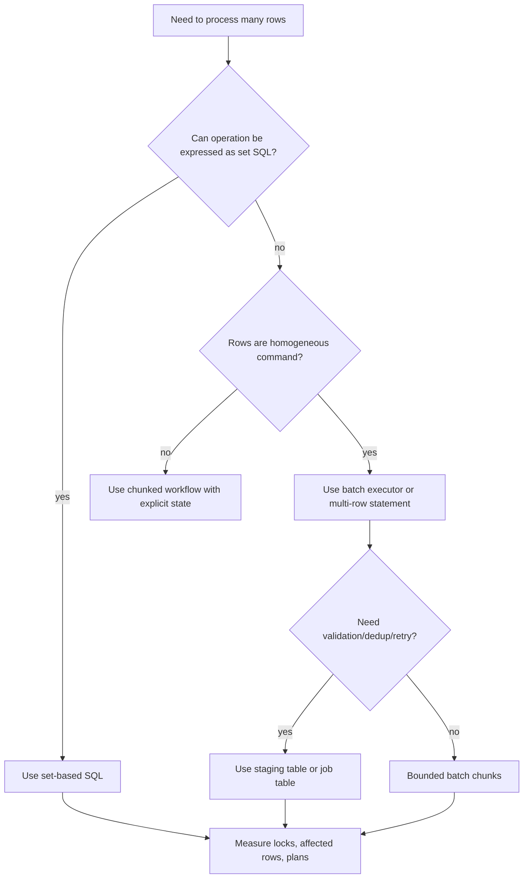
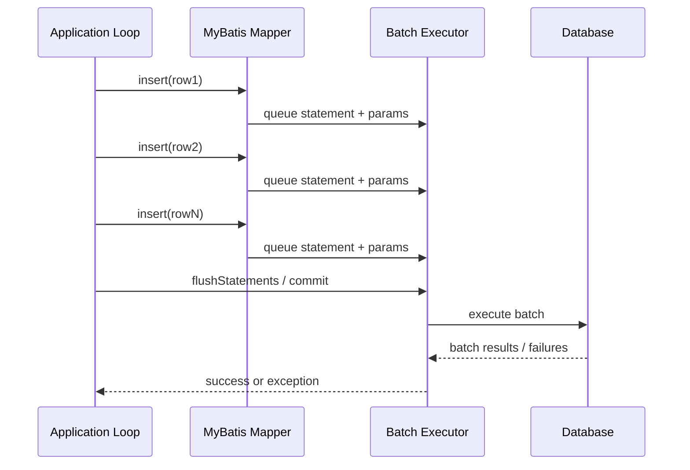
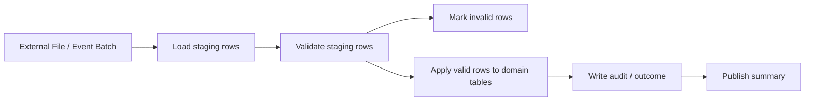

------
title: Learn Java MyBatis - Part 015
description: Bulk operations, batch executor, set-based update thinking, idempotent commands, failure handling, and production-grade batch persistence patterns with MyBatis.
series: learn-java-mybatis
seriesTitle: Learn Java MyBatis, Patterns, Anti-Patterns, and Production Persistence Mapping
order: 15
partTitle: Bulk Operations, Batch, and Set-Based Thinking
tags:
  - java
  - mybatis
  - persistence
  - sql
  - batch
  - bulk-operations
  - performance
  - architecture
date: 2026-06-28
------

# Part 015 — Bulk Operations, Batch, and Set-Based Thinking

Bulk work is where many otherwise clean persistence layers collapse. A single-row mapper design can look excellent in code review, then fail in production when a regulatory workflow needs to update 80,000 cases, import 2 million rows, recalculate SLA states, or bulk-transition enforcement actions after a policy change.

This part is not about memorizing `insert` syntax. It is about developing the mental model for **set-based persistence** in MyBatis: when to issue one SQL command for a set, when to use MyBatis batch execution, when to chunk, how to preserve correctness, and how to make large data changes observable and recoverable.

MyBatis gives us explicit SQL control. That is a strength only if we design bulk behavior intentionally.

---

## 1. Kaufman Skill Slice

### Target Skill

After this part, you should be able to design a bulk persistence workflow that is:

- correct under partial failure,
- bounded in memory,
- safe for transaction logs and locks,
- observable in production,
- idempotent where business semantics require retry,
- reviewable by both application engineers and database engineers.

### Subskills

1. Distinguish **batch execution** from **set-based SQL**.
2. Choose between row-by-row, JDBC/MyBatis batch, multi-row SQL, staging-table, and set-based update.
3. Design chunked operations with deterministic resume semantics.
4. Interpret affected-row counts as correctness signals.
5. Avoid hidden transaction, memory, and lock amplification.
6. Build mapper methods that expose business intent, not low-level looping mechanics.

### Practice Barrier to Remove

The common barrier is the belief that “bulk” means “loop over mapper method faster.” That is often wrong. In data-heavy systems, the first design question is not “how do I batch this loop?” but:

> Can the database perform this as a set operation with one relational command?

---

## 2. Bulk vs Batch: The Core Distinction

The terms are often used interchangeably. They should not be.

| Term | Meaning | Example | Main Risk |
|---|---|---|---|
| Row-by-row | One database round trip per item | loop calls `mapper.insert(row)` | network and statement overhead |
| MyBatis/JDBC batch | Many similar statements sent as batch | `ExecutorType.BATCH` + repeated mapper calls | memory, delayed failure, generated key complexity |
| Multi-row SQL | One SQL statement contains many rows | `INSERT INTO t(a,b) VALUES (...), (...)` | SQL size limit, parameter limit |
| Set-based SQL | One SQL statement transforms a set | `UPDATE case SET status = ... WHERE ...` | lock scope, predicate correctness |
| Staging-table workflow | Load data into staging table, then merge/apply | import CSV into staging, validate, merge | operational complexity |

A top-tier engineer sees these as different tools.



---

## 3. MyBatis Batch Execution Mental Model

MyBatis supports different executor types. In the Java API, `SqlSession` is the primary interface for executing commands, getting mappers, and managing transactions. `SqlSession` instances are created by `SqlSessionFactory`. The executor type controls how statements are executed internally.

The practical executor types are:

| Executor Type | Behavior | Typical Use |
|---|---|---|
| `SIMPLE` | Creates a new `PreparedStatement` for each execution | default general-purpose execution |
| `REUSE` | Reuses prepared statements | repeated statements in same session |
| `BATCH` | Batches update statements and flushes later | high-volume insert/update/delete |

Conceptually:



The key consequence: errors may surface late. If row 4,839 violates a constraint, the exception may appear at flush/commit time, not at the mapper call where the invalid row was queued.

---

## 4. Set-Based Thinking First

Suppose we need to close all expired review tasks:

Bad default instinct:

```java
List<Long> ids = reviewTaskMapper.findExpiredTaskIds(now);
for (Long id : ids) {
    reviewTaskMapper.closeExpiredTask(id, now);
}
```

Better first question:

> Can this be one update statement?

```xml
<update id="closeExpiredReviewTasks">
  UPDATE review_task
  SET status = 'CLOSED',
      closed_reason = 'EXPIRED',
      closed_at = #{closedAt},
      updated_at = #{closedAt}
  WHERE status = 'OPEN'
    AND due_at &lt; #{closedAt}
</update>
```

Mapper contract:

```java
int closeExpiredReviewTasks(@Param("closedAt") Instant closedAt);
```

The affected row count becomes an operational metric and a correctness signal.

```java
int closed = reviewTaskMapper.closeExpiredReviewTasks(clock.instant());
log.info("closed_expired_review_tasks count={}", closed);
```

### Why This Is Better

- One round trip.
- Database optimizer can use indexes.
- No application-side list materialization.
- No risk of changing the dataset between select and update.
- Affected rows are directly visible.

### When It Is Not Enough

Set-based SQL is not always sufficient. You may need row-by-row processing when each row requires:

- external API call,
- complex per-row validation unavailable in SQL,
- event generation with strict per-entity payload,
- different business transition per item,
- audit entry per item with rich state snapshot.

But even then, separate the problem:

1. identify candidate set,
2. persist candidates in a job/staging table,
3. process candidates in bounded chunks,
4. mark per-row outcome.

---

## 5. Bulk Insert Patterns

### 5.1 Single-Row Insert Loop: Usually the Baseline, Not the Target

```java
for (CaseNote note : notes) {
    caseNoteMapper.insert(note);
}
```

This is simple and sometimes fine for small volumes. But it is not a bulk strategy. It causes one mapper call per row and may cause one database round trip per row unless batch execution is used.

Use it only when:

- row count is small,
- correctness matters more than throughput,
- each insert has unique side effects,
- the code path is not latency-sensitive,
- operational volume is bounded by business rules.

### 5.2 Multi-Row Insert

```xml
<insert id="insertCaseNotes">
  INSERT INTO case_note (
    case_id,
    note_id,
    body,
    created_by,
    created_at
  )
  VALUES
  <foreach collection="notes" item="note" separator=",">
    (
      #{note.caseId},
      #{note.noteId},
      #{note.body},
      #{note.createdBy},
      #{note.createdAt}
    )
  </foreach>
</insert>
```

Mapper:

```java
int insertCaseNotes(@Param("notes") List<CaseNoteInsertRow> notes);
```

Guard against empty input before calling the mapper:

```java
public int addNotes(List<CaseNoteInsertRow> notes) {
    if (notes == null || notes.isEmpty()) {
        return 0;
    }
    return caseNoteMapper.insertCaseNotes(notes);
}
```

Do not generate invalid SQL like:

```sql
INSERT INTO case_note (...) VALUES
```

### 5.3 Parameter Limit and SQL Size

Multi-row insert can fail when too many rows are placed in one SQL statement. Databases and drivers have limits around:

- maximum SQL text size,
- maximum number of bind parameters,
- packet size,
- parse time,
- lock duration,
- transaction log pressure.

Therefore, multi-row insert should usually be chunked.

```java
public int insertNotesInChunks(List<CaseNoteInsertRow> notes) {
    int total = 0;
    for (List<CaseNoteInsertRow> chunk : Lists.partition(notes, 500)) {
        total += caseNoteMapper.insertCaseNotes(chunk);
    }
    return total;
}
```

Do not blindly choose 500. Start with a safe value, benchmark against your database, and document the reason.

---

## 6. MyBatis Batch Executor Pattern

Batch executor is useful when each row maps to the same statement but multi-row SQL is not practical or not supported for the desired command shape.

### 6.1 Manual MyBatis Batch Session

Without Spring:

```java
try (SqlSession session = sqlSessionFactory.openSession(ExecutorType.BATCH)) {
    CaseNoteMapper mapper = session.getMapper(CaseNoteMapper.class);

    int counter = 0;
    for (CaseNoteInsertRow row : rows) {
        mapper.insertCaseNote(row);
        counter++;

        if (counter % 1000 == 0) {
            session.flushStatements();
            session.clearCache();
        }
    }

    session.commit();
} catch (RuntimeException ex) {
    // session close triggers rollback if commit did not happen
    throw ex;
}
```

Important details:

- Flush periodically to bound memory.
- Clear session cache if necessary.
- Commit only after the intended transaction boundary.
- Understand that errors may surface during `flushStatements()` or `commit()`.

### 6.2 Spring Integration Pattern

In Spring, do not randomly open manual sessions inside a service that already uses `@Transactional`. That can create confusing transaction semantics.

Prefer a dedicated batch component with clearly configured session/executor behavior.

```java
@Service
public class CaseNoteBatchWriter {
    private final SqlSessionTemplate batchSqlSessionTemplate;

    public CaseNoteBatchWriter(
            @Qualifier("batchSqlSessionTemplate") SqlSessionTemplate batchSqlSessionTemplate) {
        this.batchSqlSessionTemplate = batchSqlSessionTemplate;
    }

    public void insertNotes(List<CaseNoteInsertRow> rows) {
        CaseNoteMapper mapper = batchSqlSessionTemplate.getMapper(CaseNoteMapper.class);
        for (CaseNoteInsertRow row : rows) {
            mapper.insertCaseNote(row);
        }
    }
}
```

Configuration sketch:

```java
@Bean
SqlSessionTemplate batchSqlSessionTemplate(SqlSessionFactory sqlSessionFactory) {
    return new SqlSessionTemplate(sqlSessionFactory, ExecutorType.BATCH);
}
```

This should be introduced intentionally, not hidden inside ordinary mapper usage.

---

## 7. Bulk Update Patterns

### 7.1 Update by Criteria

```xml
<update id="markCasesForEscalation">
  UPDATE enforcement_case
  SET escalation_required = TRUE,
      escalation_reason = #{reason},
      updated_at = #{now}
  WHERE status = 'OPEN'
    AND risk_score &gt;= #{minimumRiskScore}
    AND last_reviewed_at &lt; #{reviewBefore}
</update>
```

Mapper:

```java
int markCasesForEscalation(EscalationMarkCommand command);
```

This is the cleanest form when the predicate is the business rule.

### 7.2 Update by IDs

```xml
<update id="assignCasesToOfficer">
  UPDATE enforcement_case
  SET assigned_officer_id = #{officerId},
      assigned_at = #{assignedAt},
      updated_at = #{assignedAt}
  WHERE case_id IN
  <foreach collection="caseIds" item="caseId" open="(" separator="," close=")">
    #{caseId}
  </foreach>
    AND status = 'OPEN'
</update>
```

Mapper:

```java
int assignCasesToOfficer(
    @Param("caseIds") List<Long> caseIds,
    @Param("officerId") Long officerId,
    @Param("assignedAt") Instant assignedAt
);
```

Production rule:

> Never rely only on `WHERE id IN (...)` for business commands. Include the legal/current-state guard.

If 100 case IDs are supplied but only 93 rows are affected, that is information. It may mean seven cases were already closed, assigned, deleted, or inaccessible.

### 7.3 Compare-and-Set Bulk Update

```xml
<update id="transitionCasesFromOpenToUnderReview">
  UPDATE enforcement_case
  SET status = 'UNDER_REVIEW',
      status_changed_at = #{now},
      updated_at = #{now}
  WHERE case_id IN
  <foreach collection="caseIds" item="caseId" open="(" separator="," close=")">
    #{caseId}
  </foreach>
    AND status = 'OPEN'
</update>
```

Application interpretation:

```java
int affected = mapper.transitionCasesFromOpenToUnderReview(caseIds, now);
if (affected != caseIds.size()) {
    throw new ConcurrentCaseTransitionException(caseIds.size(), affected);
}
```

Sometimes partial success is acceptable. Sometimes it is a correctness violation. The mapper cannot decide that alone; the service contract must decide.

---

## 8. Upsert Patterns

Upsert is database-specific. Avoid pretending it is portable when it is not.

### PostgreSQL Example

```xml
<insert id="upsertCaseMetric">
  INSERT INTO case_metric (
    case_id,
    metric_name,
    metric_value,
    calculated_at
  ) VALUES (
    #{caseId},
    #{metricName},
    #{metricValue},
    #{calculatedAt}
  )
  ON CONFLICT (case_id, metric_name)
  DO UPDATE SET
    metric_value = EXCLUDED.metric_value,
    calculated_at = EXCLUDED.calculated_at
</insert>
```

### MySQL Example

```xml
<insert id="upsertCaseMetric">
  INSERT INTO case_metric (
    case_id,
    metric_name,
    metric_value,
    calculated_at
  ) VALUES (
    #{caseId},
    #{metricName},
    #{metricValue},
    #{calculatedAt}
  )
  ON DUPLICATE KEY UPDATE
    metric_value = VALUES(metric_value),
    calculated_at = VALUES(calculated_at)
</insert>
```

### Design Rule

Name the mapper according to semantic intent, not vendor syntax:

```java
int saveLatestCaseMetric(CaseMetricSnapshot snapshot);
```

Do not name it:

```java
int insertOnConflictCaseMetric(...);
```

The mapper XML can be vendor-specific. The Java contract should remain business-oriented.

---

## 9. Staging Table Workflow

For large imports or high-risk bulk state changes, staging tables are often better than direct batch mapper calls.



### Example Staging Schema

```sql
CREATE TABLE case_import_stage (
  import_id        UUID NOT NULL,
  row_number       INTEGER NOT NULL,
  external_case_no VARCHAR(100),
  subject_name     VARCHAR(300),
  risk_code        VARCHAR(50),
  validation_state VARCHAR(30) NOT NULL,
  error_message    VARCHAR(1000),
  created_at       TIMESTAMP NOT NULL,
  PRIMARY KEY (import_id, row_number)
);
```

### Mapper Methods

```java
interface CaseImportStageMapper {
    int insertStageRows(@Param("rows") List<CaseImportStageRow> rows);

    int markInvalidRows(@Param("importId") UUID importId);

    int insertValidCases(@Param("importId") UUID importId, @Param("now") Instant now);

    ImportSummary summarizeImport(@Param("importId") UUID importId);
}
```

### Benefits

- Validation is auditable.
- Partial row failures are visible.
- Retry can be based on `import_id`.
- Operators can inspect intermediate state.
- Large imports are not hidden inside application memory.

---

## 10. Chunking and Resume Semantics

Chunking is not just about performance. It is about failure containment.

### Offset-Based Chunking Problem

```sql
SELECT * FROM case_event ORDER BY event_id LIMIT 1000 OFFSET 5000
```

This can become expensive and unstable if rows are inserted or deleted during processing.

### Keyset Chunking

```xml
<select id="findNextEventChunk" resultMap="CaseEventRowMap">
  SELECT event_id, case_id, event_type, occurred_at
  FROM case_event
  WHERE event_id &gt; #{lastSeenEventId}
  ORDER BY event_id ASC
  LIMIT #{limit}
</select>
```

Mapper:

```java
List<CaseEventRow> findNextEventChunk(
    @Param("lastSeenEventId") long lastSeenEventId,
    @Param("limit") int limit
);
```

Processor:

```java
long lastSeen = checkpointRepository.load(jobId);

while (true) {
    List<CaseEventRow> chunk = mapper.findNextEventChunk(lastSeen, 1000);
    if (chunk.isEmpty()) {
        break;
    }

    process(chunk);

    lastSeen = chunk.get(chunk.size() - 1).eventId();
    checkpointRepository.save(jobId, lastSeen);
}
```

### Invariant

A resumable job needs a stable ordering key and a durable checkpoint.

Without those, retry is guesswork.

---

## 11. Idempotency in Bulk Commands

A bulk command may be retried because of timeout, deadlock, node restart, message redelivery, or operator action. Therefore, design commands so that retry is either safe or explicitly rejected.

### Idempotent Insert with Request ID

```sql
CREATE TABLE bulk_assignment_request (
  request_id UUID PRIMARY KEY,
  requested_by VARCHAR(100) NOT NULL,
  requested_at TIMESTAMP NOT NULL
);
```

```xml
<insert id="insertBulkAssignmentRequest">
  INSERT INTO bulk_assignment_request (
    request_id,
    requested_by,
    requested_at
  ) VALUES (
    #{requestId},
    #{requestedBy},
    #{requestedAt}
  )
</insert>
```

If duplicate `request_id` appears, the system can detect replay.

### Idempotent Update via State Guard

```xml
<update id="applyBulkAssignment">
  UPDATE enforcement_case
  SET assigned_officer_id = #{officerId},
      assignment_request_id = #{requestId},
      assigned_at = #{assignedAt}
  WHERE case_id IN
  <foreach collection="caseIds" item="caseId" open="(" separator="," close=")">
    #{caseId}
  </foreach>
    AND status = 'OPEN'
    AND assignment_request_id IS NULL
</update>
```

The `assignment_request_id IS NULL` guard prevents accidental overwrite.

---

## 12. Affected Row Count as a Domain Signal

Do not discard mapper return values for commands.

Weak code:

```java
caseMapper.bulkClose(caseIds, now);
```

Better:

```java
int affected = caseMapper.bulkClose(caseIds, now);
if (affected != caseIds.size()) {
    throw new BulkTransitionMismatchException(caseIds.size(), affected);
}
```

But be careful. In some databases and drivers, affected row semantics may vary for no-op updates. For example, updating a row to the same value may or may not count as affected depending on configuration. For critical correctness, prefer state transition predicates that change state exactly once.

---

## 13. Lock and Transaction Pressure

A large update is not just a faster version of a small update. It may:

- hold locks longer,
- generate large transaction logs,
- block readers or writers,
- cause deadlocks,
- saturate replication,
- trigger autovacuum/undo pressure,
- invalidate cache regions,
- cause long rollback time.

### Safer Chunked Update

```xml
<select id="findCaseIdsEligibleForSlaEscalation" resultType="long">
  SELECT case_id
  FROM enforcement_case
  WHERE status = 'OPEN'
    AND sla_due_at &lt; #{now}
    AND case_id &gt; #{lastSeenCaseId}
  ORDER BY case_id ASC
  LIMIT #{limit}
</select>

<update id="escalateCasesByIds">
  UPDATE enforcement_case
  SET status = 'ESCALATED',
      escalated_at = #{now},
      updated_at = #{now}
  WHERE case_id IN
  <foreach collection="caseIds" item="caseId" open="(" separator="," close=")">
    #{caseId}
  </foreach>
    AND status = 'OPEN'
    AND sla_due_at &lt; #{now}
</update>
```

Notice the predicate is repeated in the update. The select is for chunk discovery; the update is the source of truth.

---

## 14. Bulk Audit Pattern

Bulk commands need auditability. Avoid per-row audit inside application loop when the database can derive audit rows set-wise.

```xml
<insert id="insertBulkEscalationAuditRows">
  INSERT INTO case_audit (
    case_id,
    event_type,
    event_time,
    actor_id,
    detail
  )
  SELECT
    c.case_id,
    'CASE_ESCALATED',
    #{now},
    #{actorId},
    #{detail}
  FROM enforcement_case c
  WHERE c.case_id IN
  <foreach collection="caseIds" item="caseId" open="(" separator="," close=")">
    #{caseId}
  </foreach>
    AND c.status = 'ESCALATED'
    AND c.escalated_at = #{now}
</insert>
```

This creates audit rows for the rows actually changed in the batch, assuming `escalated_at` is sufficiently controlled for the operation.

For stronger correctness, use a request ID:

```sql
assignment_request_id = #{requestId}
```

Then audit based on request ID.

---

## 15. Avoiding “Bulk Mapper God Methods”

Bad mapper:

```java
int processEverything(BulkProcessRequest request);
```

Why it is bad:

- hides multiple business stages,
- hard to observe,
- hard to retry,
- hard to test,
- impossible to reason about partial failure,
- encourages huge dynamic SQL.

Better:

```java
interface BulkCaseEscalationMapper {
    List<Long> findNextEligibleCaseIds(EscalationScanCriteria criteria);

    int markEscalationRequestStarted(EscalationRequest request);

    int escalateCases(EscalationApplyCommand command);

    int insertEscalationAuditRows(EscalationAuditCommand command);

    EscalationSummary summarizeRequest(UUID requestId);
}
```

This is more verbose, but it exposes the workflow and makes each step testable.

---

## 16. Error Handling in Batch Execution

Batch errors are harder than single-row errors because the failure may happen after many rows were queued.

### Failure Questions

When a batch fails, ask:

1. Did the database apply none, some, or all statements?
2. Did the transaction commit?
3. Can we identify the failing row?
4. Can we retry safely?
5. Is the error deterministic, like constraint violation, or transient, like deadlock?
6. Do operators need a row-level failure report?

### Design Implication

If you need row-level failure visibility, a plain batch executor is often insufficient. Use staging rows with per-row status.

```sql
validation_state IN ('PENDING', 'VALID', 'INVALID', 'APPLIED', 'FAILED')
```

Then process rows in a way that records outcome.

---

## 17. Testing Bulk Mappers

Bulk mapper tests should not only test happy path.

### Test Matrix

| Case | What to Verify |
|---|---|
| empty input | service returns 0, mapper not called or SQL valid |
| one row | normal behavior |
| many rows | chunking works |
| duplicate IDs | behavior documented |
| non-existing IDs | affected count mismatch handled |
| state mismatch | guarded update does not modify row |
| tenant mismatch | tenant predicate blocks update |
| constraint violation | transaction rollback or row failure recorded |
| retry | command is idempotent or safely rejected |

### Example Test

```java
@Test
void bulkTransitionFailsWhenSomeCasesAreNotOpen() {
    insertCase(1L, "OPEN");
    insertCase(2L, "CLOSED");

    int affected = mapper.transitionCasesFromOpenToUnderReview(
        List.of(1L, 2L),
        Instant.parse("2026-06-28T10:00:00Z")
    );

    assertThat(affected).isEqualTo(1);
}
```

The mapper test should expose affected count. The service test should verify that the mismatch becomes a domain failure when the command requires all-or-nothing behavior.

---

## 18. Production Observability

For every meaningful bulk operation, log or emit metrics for:

- operation name,
- request/job ID,
- actor/system initiator,
- tenant,
- criteria summary,
- candidate count,
- affected row count,
- chunk number,
- chunk size,
- duration,
- retry count,
- failure type.

Example log:

```text
bulk_case_escalation requestId=3de... tenant=reg-a chunk=17 candidates=1000 affected=997 durationMs=421
```

The mismatch is visible immediately.

---

## 19. Common Anti-Patterns

### Anti-Pattern 1: Looping Over Single-Row Mapper by Default

This wastes the database's set-processing capability.

### Anti-Pattern 2: Huge `IN` Clause Without Chunking

This may hit SQL length or parameter limits and produce unstable performance.

### Anti-Pattern 3: Missing State Guard

```sql
UPDATE case SET status = 'CLOSED' WHERE id IN (...)
```

This ignores whether the transition is legal.

### Anti-Pattern 4: Ignoring Affected Rows

A command mapper returning `int` is giving you information. Use it.

### Anti-Pattern 5: Batch Without Idempotency

If retry can duplicate data or overwrite state, the design is incomplete.

### Anti-Pattern 6: One Giant Transaction for Operational Convenience

A huge transaction may cause long locks, massive rollback, and replication impact.

### Anti-Pattern 7: Business Logic Hidden in Unreviewable Dynamic SQL

If the SQL is the business rule, make it readable, tested, and named accordingly.

---

## 20. Review Checklist

Before approving a bulk mapper, ask:

- Is this actually a set-based operation?
- Is batching necessary, or can one SQL statement solve it?
- Is the input size bounded?
- Are empty inputs handled?
- Is there a tenant predicate where needed?
- Are business state guards included?
- Is affected row count interpreted?
- Is retry behavior safe?
- Is the transaction boundary explicit?
- Are chunk size and ordering documented?
- Are locks and indexes considered?
- Is there an audit trail?
- Are metrics emitted?
- Are failure modes tested?

---

## 21. Deliberate Practice

### Exercise 1 — Replace Loop with Set-Based Update

Given:

```java
for (Long caseId : caseIds) {
    caseMapper.closeCase(caseId, now);
}
```

Refactor into:

- one mapper method,
- guarded SQL transition,
- affected-row validation,
- test for partial mismatch.

### Exercise 2 — Design an Import Workflow

Design mappers for importing 500,000 external complaint records.

Include:

- staging insert,
- validation update,
- insert valid complaints,
- row-level error reporting,
- import summary.

### Exercise 3 — Idempotent Bulk Assignment

Create an assignment command that can be retried safely after timeout.

Must include:

- request ID,
- state guard,
- audit row generation,
- summary query,
- duplicate request behavior.

---

## 22. Final Mental Model

Bulk persistence is not a performance trick. It is a correctness design problem under scale.

Use this hierarchy:

1. Prefer **set-based SQL** when the business rule is relational.
2. Use **multi-row SQL** when rows are simple and bounded.
3. Use **batch executor** when repeated statements are necessary.
4. Use **staging tables** when validation, retry, and row-level outcomes matter.
5. Always make transaction, lock, retry, and affected-row semantics explicit.

In MyBatis, you own the SQL. Therefore you also own the operational behavior of that SQL.

---

## References

- MyBatis 3 Java API — `SqlSession`, `SqlSessionFactory`, and executor model: https://mybatis.org/mybatis-3/java-api.html
- MyBatis 3 Mapper XML Files — `insert`, `update`, `delete`, `select`, SQL fragments, mapped statements: https://mybatis.org/mybatis-3/sqlmap-xml.html
- MyBatis Dynamic SQL Insert Statements — batch insert guidance and `ExecutorType.BATCH`: https://mybatis.org/mybatis-dynamic-sql/docs/insert.html
- MyBatis-Spring SqlSession — Spring-managed session behavior and `SqlSessionTemplate`: https://mybatis.org/spring/sqlsession.html
