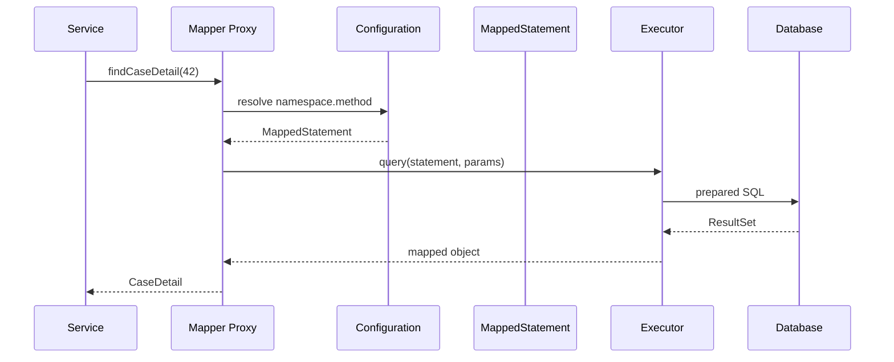
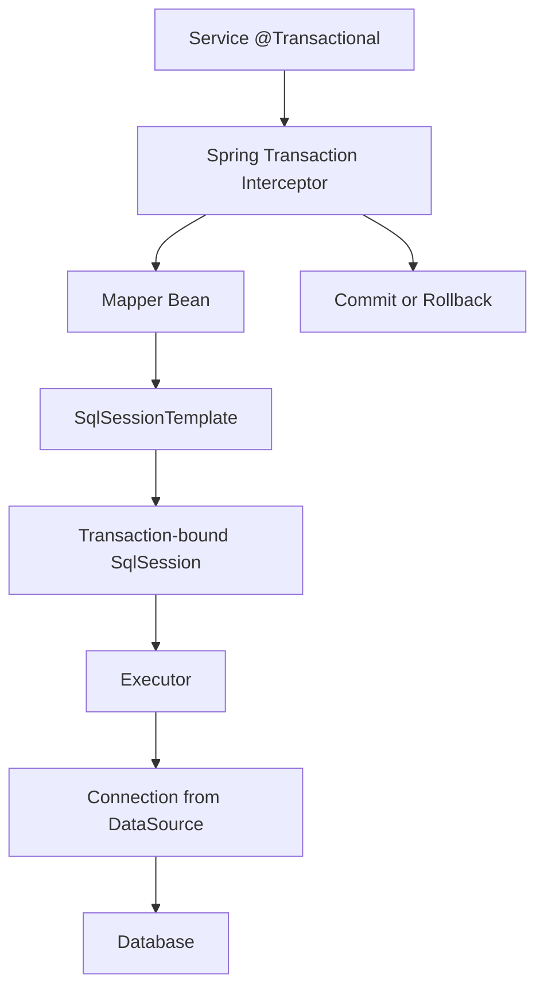
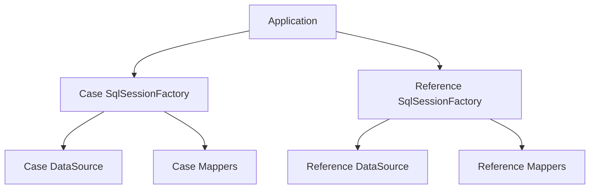

------
title: Learn Java MyBatis - Part 016
description: SqlSession lifecycle, SqlSessionFactory, mapper proxy, executor types, local cache behavior, transaction boundaries, thread-safety, and runtime failure modes in MyBatis.
series: learn-java-mybatis
seriesTitle: Learn Java MyBatis, Patterns, Anti-Patterns, and Production Persistence Mapping
order: 16
partTitle: SqlSession Lifecycle and Executor Model
tags:
  - java
  - mybatis
  - persistence
  - sqlsession
  - executor
  - transaction
  - runtime
  - architecture
date: 2026-06-28
------

# Part 016 — SqlSession Lifecycle and Executor Model

This part moves from mapper design into MyBatis runtime semantics. Many MyBatis bugs come from engineers understanding SQL but not understanding what a `SqlSession` represents, how mapper proxies execute statements, when statements are flushed, how local cache behaves, and how transactions are coordinated.

At production level, MyBatis is not just XML plus interfaces. It is a runtime pipeline:


A top-tier MyBatis engineer can reason through this pipeline when debugging performance, transaction visibility, mapping errors, and concurrency issues.

---

## 1. Kaufman Skill Slice

### Target Skill

After this part, you should be able to explain and debug:

- how a mapper method reaches the database,
- what a `SqlSession` owns,
- why `SqlSession` lifecycle matters,
- how executor type changes runtime behavior,
- when local cache can surprise you,
- why Spring-managed sessions differ from manual sessions,
- which objects are thread-safe and which are not.

### Subskills

1. Understand `SqlSessionFactory` as a long-lived factory.
2. Understand `SqlSession` as a short-lived unit of database interaction.
3. Understand mapper interface as proxy, not implementation.
4. Understand executor types: `SIMPLE`, `REUSE`, `BATCH`.
5. Understand first-level/local cache scope.
6. Understand commit, rollback, flush, and close semantics.
7. Recognize runtime anti-patterns.

---

## 2. Core Runtime Objects

### `SqlSessionFactoryBuilder`

Builds a `SqlSessionFactory` from configuration. It is typically used during application startup.

Rule:

> Build factories at boot. Do not build factories per request.

### `SqlSessionFactory`

Creates `SqlSession` instances. It is intended to be long-lived and reused.

Conceptually:

```java
SqlSessionFactory sqlSessionFactory = new SqlSessionFactoryBuilder()
    .build(configurationReader);
```

Then:

```java
try (SqlSession session = sqlSessionFactory.openSession()) {
    CaseMapper mapper = session.getMapper(CaseMapper.class);
    CaseDetail detail = mapper.findCaseDetail(caseId);
}
```

### `SqlSession`

`SqlSession` is the primary MyBatis interface for:

- executing mapped commands,
- obtaining mapper proxies,
- committing or rolling back,
- flushing statements,
- clearing local cache,
- closing resources.

It should be short-lived.

### Mapper Proxy

Your mapper interface is not implemented manually:

```java
interface CaseMapper {
    CaseDetail findCaseDetail(long caseId);
}
```

MyBatis creates a proxy that resolves method calls to mapped statements.



---

## 3. Statement Identity

Mapper method resolution depends on statement identity:

```text
namespace + statement id
```

Example:

```java
package com.example.caseapp.persistence.CaseMapper;

interface CaseMapper {
    CaseDetail findCaseDetail(long caseId);
}
```

XML:

```xml
<mapper namespace="com.example.caseapp.persistence.CaseMapper">
  <select id="findCaseDetail" resultMap="CaseDetailMap">
    SELECT ...
  </select>
</mapper>
```

Identity:

```text
com.example.caseapp.persistence.CaseMapper.findCaseDetail
```

If namespace or method id drift, the mapper breaks.

Governance rule:

> Mapper interface and XML namespace are one contract. Review them together.

---

## 4. Manual SqlSession Lifecycle

A manual session lifecycle looks like this:

```java
try (SqlSession session = sqlSessionFactory.openSession()) {
    CaseMapper mapper = session.getMapper(CaseMapper.class);

    CaseDetail detail = mapper.findCaseDetail(caseId);

    session.commit(); // usually only needed for write transactions
}
```

For read-only operations, commit may not be required depending on transaction configuration, but the session must always be closed.

### Write Example

```java
try (SqlSession session = sqlSessionFactory.openSession(false)) {
    CaseMapper mapper = session.getMapper(CaseMapper.class);

    int affected = mapper.transitionStatus(command);
    if (affected != 1) {
        session.rollback();
        throw new ConcurrentTransitionException(command.caseId());
    }

    session.commit();
}
```

Do not hide commit/rollback decisions inside random utility classes. Transaction boundary is an architectural decision.

---

## 5. Spring-Managed Lifecycle

With MyBatis-Spring, application code usually does not manage `SqlSession` directly. Mapper beans participate in Spring transaction management.

Typical service:

```java
@Service
public class CaseTransitionService {
    private final CaseMapper caseMapper;

    public CaseTransitionService(CaseMapper caseMapper) {
        this.caseMapper = caseMapper;
    }

    @Transactional
    public void transition(CaseTransitionCommand command) {
        int affected = caseMapper.transitionStatus(command);
        if (affected != 1) {
            throw new ConcurrentTransitionException(command.caseId());
        }
    }
}
```

MyBatis-Spring provides a thread-safe `SqlSessionTemplate` that works with Spring transaction configuration.

Runtime view:



### Rule

> In Spring applications, prefer mapper injection and `@Transactional` at service/application boundary. Do not manually open sessions unless you have a clear reason and document the reason.

---

## 6. Executor Types

Executor type changes how MyBatis handles statements.

### `ExecutorType.SIMPLE`

Creates a new prepared statement for each execution.

Use for:

- ordinary mapper calls,
- most request/response workloads,
- clarity and predictability.

### `ExecutorType.REUSE`

Reuses prepared statements within the session.

Use when:

- repeated same statements occur in one session,
- you have measured statement preparation overhead,
- session lifecycle is controlled.

Do not set globally without understanding driver/database behavior.

### `ExecutorType.BATCH`

Queues update statements and sends them in batch.

Use for:

- repeated inserts,
- repeated updates,
- high-volume command processing,
- controlled batch jobs.

Avoid for:

- mixed read/write workflows unless you understand flush boundaries,
- operations requiring immediate generated keys per row,
- workflows needing simple per-row failure handling.

---

## 7. Batch Executor Semantics

With batch executor, mapper calls may not immediately hit the database.

```java
try (SqlSession session = sqlSessionFactory.openSession(ExecutorType.BATCH)) {
    CaseEventMapper mapper = session.getMapper(CaseEventMapper.class);

    mapper.insertEvent(event1);
    mapper.insertEvent(event2);
    mapper.insertEvent(event3);

    session.flushStatements();
    session.commit();
}
```

The failure may appear at `flushStatements()` or `commit()`.

### Dangerous Assumption

```java
mapper.insertEvent(event);
// assume event is now definitely in DB
```

With batch executor, that assumption is not necessarily true.

---

## 8. Local Cache / First-Level Cache

MyBatis has a local cache associated with a session. This can reduce repeated query work within the same session and help prevent circular reference problems in nested result mapping.

But it can surprise you if you expect every select to go to the database.

### Example Surprise

```java
try (SqlSession session = sqlSessionFactory.openSession()) {
    CaseMapper mapper = session.getMapper(CaseMapper.class);

    CaseDetail before = mapper.findCaseDetail(42L);
    externalJdbcTemplate.update("UPDATE enforcement_case SET status = 'CLOSED' WHERE case_id = 42");
    CaseDetail after = mapper.findCaseDetail(42L);
}
```

Depending on local cache behavior and statement configuration, `after` may not reflect the external update within the same session.

### Design Rule

Do not mix external JDBC updates and MyBatis reads inside the same logical transaction/session unless the visibility semantics are understood.

### Cache Clearing

```java
session.clearCache();
```

Use intentionally. If you find yourself clearing cache frequently to make logic work, inspect your session boundary.

---

## 9. Local Cache Scope

MyBatis configuration includes settings that materially affect runtime behavior. One important setting is local cache scope.

Conceptually:

| Scope | Meaning | Use Case |
|---|---|---|
| `SESSION` | Cache query results for duration of session | default-style behavior, nested mapping support |
| `STATEMENT` | Clear local cache after each statement | reduce stale reads in long sessions |

Do not change this casually. It can affect nested mapping behavior and performance.

Governance rule:

> Runtime settings must be owned as architecture configuration, not incidental YAML/XML tweaks.

---

## 10. Transaction Boundary

A `SqlSession` is not itself the business transaction. It is the MyBatis interface participating in the transaction.

The real transaction boundary may be:

- manual session commit/rollback,
- Spring `@Transactional`,
- container-managed transaction,
- external transaction manager.

### Bad Boundary

```java
public void approveCase(long caseId) {
    caseMapper.approve(caseId);
    auditMapper.insertAudit(...);
    notificationClient.send(...);
}
```

No transaction annotation. No explicit boundary. Unknown rollback behavior.

### Better Boundary

```java
@Transactional
public void approveCase(ApproveCaseCommand command) {
    int affected = caseMapper.approve(command);
    if (affected != 1) {
        throw new ConcurrentTransitionException(command.caseId());
    }

    auditMapper.insertCaseApprovedAudit(command);
    outboxMapper.insertNotificationOutbox(command.toOutboxMessage());
}
```

External notification is moved to outbox, keeping database changes atomic.

---

## 11. Thread Safety

### Safe to Share

- `SqlSessionFactory`
- Spring mapper beans backed by `SqlSessionTemplate`
- `SqlSessionTemplate`

### Not Safe to Share Manually

- manually opened `SqlSession`
- mapper proxy obtained from a manually opened `SqlSession`

Bad:

```java
class CaseRepository {
    private final SqlSession session; // bad
    private final CaseMapper mapper;  // bad if from manual session
}
```

Why bad:

- session state is mutable,
- transaction state is mutable,
- local cache is session-scoped,
- concurrent calls can corrupt assumptions,
- session must be closed.

Good:

```java
@Repository
class CaseRepository {
    private final CaseMapper mapper;

    CaseRepository(CaseMapper mapper) {
        this.mapper = mapper;
    }
}
```

Let Spring manage the lifecycle.

---

## 12. Mapper Proxy Is Not a Repository Boundary by Itself

Mapper proxy is a runtime adapter. It should not automatically become the public domain repository.

Weak architecture:

```java
@Service
class EnforcementService {
    private final CaseMapper caseMapper;
    private final PartyMapper partyMapper;
    private final EvidenceMapper evidenceMapper;
    private final AuditMapper auditMapper;
}
```

This can be acceptable for simple application services, but for complex workflows it often leaks persistence concerns.

Better for complex aggregate loading:

```java
@Repository
class CasePersistenceGateway {
    private final CaseMapper caseMapper;
    private final PartyMapper partyMapper;
    private final EvidenceMapper evidenceMapper;

    CaseAggregate loadCaseAggregate(long caseId) {
        CaseHeader header = caseMapper.findHeader(caseId);
        List<PartyRow> parties = partyMapper.findParties(caseId);
        List<EvidenceRow> evidence = evidenceMapper.findEvidence(caseId);
        return CaseAggregateAssembler.assemble(header, parties, evidence);
    }
}
```

The mapper remains SQL contract; the gateway owns persistence orchestration.

---

## 13. Flush Semantics

Flush matters mainly for batch execution, but also for understanding when pending statements reach the database.

```java
List<BatchResult> results = session.flushStatements();
```

A `BatchResult` gives information about executed batch statements. You generally should not design ordinary request logic around this unless you are explicitly writing batch processing infrastructure.

### Rule

> If correctness requires knowing row-level success immediately, do not hide the operation behind deferred batch semantics.

---

## 14. Generated Keys and Session Semantics

Generated keys can be straightforward for simple inserts:

```xml
<insert id="insertCase" useGeneratedKeys="true" keyProperty="caseId">
  INSERT INTO enforcement_case (case_number, status, created_at)
  VALUES (#{caseNumber}, #{status}, #{createdAt})
</insert>
```

But in batch execution, generated key behavior may vary by driver/database and statement shape.

Design recommendations:

- Prefer application-generated IDs for high-volume batch inserts when possible.
- Use UUID/ULID/snowflake/sequence preallocation depending on architecture.
- Test generated key behavior with the real driver and database.
- Do not infer correctness from H2 tests.

---

## 15. Long-Lived Session Smell

A long-lived `SqlSession` creates hidden state.

Symptoms:

- stale reads,
- memory growth,
- confusing transaction visibility,
- delayed batch failure,
- too much local cache,
- resource leakage,
- concurrency bugs.

Bad pattern:

```java
public class CaseImportWorker {
    private final SqlSession session;

    public void runForever() {
        while (true) {
            processNextMessage(session);
        }
    }
}
```

Better:

```java
public void processMessage(Message message) {
    try (SqlSession session = sqlSessionFactory.openSession(false)) {
        processMessageInSession(message, session);
        session.commit();
    }
}
```

Or in Spring:

```java
@Transactional
public void processMessage(Message message) {
    // mapper calls here
}
```

---

## 16. Read-Your-Writes Semantics

Inside a transaction, you often expect to read your own writes.

```java
@Transactional
public CaseDetail updateAndReload(UpdateCaseCommand command) {
    caseMapper.updateCase(command);
    return caseMapper.findCaseDetail(command.caseId());
}
```

This is usually fine when everything participates in the same transaction and session semantics are coherent.

But surprises occur when:

- writes are batched and not flushed,
- reads use a different transaction/session/data source,
- read replicas are involved,
- local cache returns old data,
- external JDBC modifies data outside MyBatis session,
- async code reads before commit.

### Defensive Rule

For command workflows, avoid unnecessary reloads. If you need a post-write representation, know whether it must reflect database-generated values, trigger effects, or just application state.

---

## 17. Multi-DataSource Runtime Model

When an application has multiple databases, each database generally needs its own `SqlSessionFactory` and mapper configuration.



Avoid accidental cross-binding:

- case mapper using reference datasource,
- transaction manager mismatch,
- mapper scan including wrong package,
- XML loaded into wrong factory.

Configuration tests should verify mapper-to-factory ownership.

---

## 18. Runtime Failure Modes

### Failure Mode 1: Mapper Statement Not Found

Cause:

- namespace mismatch,
- wrong mapper XML location,
- method renamed without XML update,
- mapper not scanned.

Prevention:

- startup validation,
- mapper tests,
- convention-based package layout.

### Failure Mode 2: Wrong Transaction Manager

Cause:

- multiple data sources,
- service uses wrong `@Transactional` manager,
- mapper bound to different factory.

Prevention:

- named transaction managers,
- package-level mapper config,
- integration tests.

### Failure Mode 3: Batch Failure at Commit

Cause:

- `ExecutorType.BATCH`,
- constraint violation,
- deferred execution.

Prevention:

- chunking,
- staging table,
- explicit flush points,
- row-level validation.

### Failure Mode 4: Stale Read Within Session

Cause:

- local cache,
- external update,
- long-lived session.

Prevention:

- short session scope,
- avoid mixing data access mechanisms,
- configure local cache intentionally.

### Failure Mode 5: Connection Leak

Cause:

- manual session not closed,
- exception path missing cleanup.

Prevention:

- try-with-resources,
- Spring-managed mapper beans,
- connection pool leak detection.

---

## 19. Testing Runtime Semantics

Unit tests are not enough. Test runtime configuration with real application wiring.

### Tests to Include

1. Mapper XML is loaded.
2. Mapper namespace matches interface.
3. Transaction rollback works.
4. Batch executor flush behavior is understood.
5. Generated keys work with real database.
6. Multiple data sources bind correct mapper packages.
7. Local cache behavior is acceptable.
8. Spring transaction manager controls mapper calls.

### Example Rollback Test

```java
@Test
void transitionAndAuditRollbackTogether() {
    assertThatThrownBy(() -> service.transitionWithForcedFailure(command))
        .isInstanceOf(TestFailure.class);

    assertThat(caseMapper.findStatus(command.caseId())).isEqualTo("OPEN");
    assertThat(auditMapper.findByCaseId(command.caseId())).isEmpty();
}
```

This verifies transaction boundary, not just SQL syntax.

---

## 20. Production Diagnostics

When debugging a runtime issue, collect:

- mapper method name,
- mapped statement id,
- datasource identity,
- transaction id/correlation id,
- executor type,
- SQL text,
- bound parameter summary,
- affected rows,
- session lifecycle path,
- whether Spring transaction is active,
- whether batch executor is used,
- exception root cause.

A useful error log is not:

```text
Database error
```

It is:

```text
mapper=CaseMapper.transitionStatus statement=com.example.CaseMapper.transitionStatus tx=active executor=SIMPLE affected=0 caseId=123 expectedStatus=OPEN targetStatus=UNDER_REVIEW
```

---

## 21. Code Review Checklist

For session/executor-sensitive code, ask:

- Is `SqlSessionFactory` long-lived?
- Is `SqlSession` short-lived?
- Is every manual session closed?
- Is transaction boundary explicit?
- Is this code Spring-managed or manual, not both accidentally?
- Is executor type intentional?
- If `BATCH`, where are flush and commit boundaries?
- Are generated keys tested with the real DB?
- Is mapper proxy obtained from correct factory/session?
- Are local cache assumptions documented?
- Are multiple datasource mappings isolated?
- Are affected rows checked for commands?

---

## 22. Deliberate Practice

### Exercise 1 — Trace a Mapper Call

Pick one mapper method and write down:

1. Java method signature.
2. Full mapped statement id.
3. XML or annotation statement.
4. Parameter object.
5. Result map or result type.
6. Executor type.
7. Transaction boundary.
8. Expected affected rows or result size.

### Exercise 2 — Find the Session Smell

Review a codebase for:

- manually stored `SqlSession`,
- session opened outside try-with-resources,
- manual session inside Spring transaction,
- batch executor used without flush strategy,
- mapper proxies stored from manual sessions.

### Exercise 3 — Prove Rollback

Create an integration test where:

1. mapper A updates a row,
2. mapper B inserts audit,
3. service throws exception,
4. test proves both changes rollback.

---

## 23. Final Mental Model

`SqlSession` is the runtime boundary between your mapper contract and MyBatis execution machinery. Treat it as short-lived, transaction-aware, and stateful.

Use this rule set:

1. `SqlSessionFactory` is infrastructure; reuse it.
2. `SqlSession` is a unit of work; keep it short-lived.
3. Mapper proxy is a runtime adapter; do not confuse it with domain boundary.
4. Executor type changes behavior; choose intentionally.
5. Batch execution delays certainty; design failure handling accordingly.
6. Local cache exists; avoid long-lived sessions and mixed data access surprises.
7. In Spring, let `SqlSessionTemplate` and `@Transactional` coordinate lifecycle unless you have a deliberate exception.

MyBatis gives you explicit SQL. `SqlSession` is the runtime object that makes that SQL execute. If you do not understand it, your mapper layer is only accidentally correct.

---

## References

- MyBatis 3 Java API — `SqlSession`, `SqlSessionFactory`, transaction control, executor types: https://mybatis.org/mybatis-3/java-api.html
- MyBatis 3 Configuration — settings, environments, mappers, and runtime behavior: https://mybatis.org/mybatis-3/configuration.html
- MyBatis-Spring SqlSession — `SqlSessionTemplate`, Spring transaction integration, lifecycle management: https://mybatis.org/spring/sqlsession.html
- MyBatis 3 Mapper XML Files — mapped statement elements and statement identity: https://mybatis.org/mybatis-3/sqlmap-xml.html
