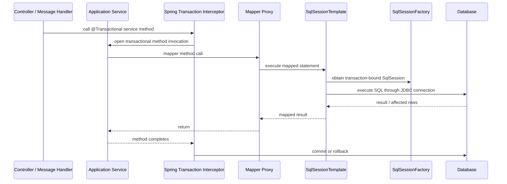

------
title: Learn Java MyBatis - Part 017
description: MyBatis-Spring integration, Spring-managed SqlSession lifecycle, transaction semantics, propagation behavior, exception translation, multi-datasource risks, and production transaction design.
series: learn-java-mybatis
seriesTitle: Learn Java MyBatis, Patterns, Anti-Patterns, and Production Persistence Mapping
order: 17
partTitle: Spring Integration and Transaction Semantics
tags:
  - java
  - mybatis
  - spring
  - transaction
  - sqlsession
  - persistence
  - architecture
  - production
date: 2026-06-28
------

# Part 017 — Spring Integration and Transaction Semantics

This part is about the point where MyBatis stops being a standalone SQL mapper and becomes part of a Spring application runtime.

The important shift is this:

> In plain MyBatis, you own the `SqlSession` lifecycle directly. In MyBatis-Spring, Spring owns transaction boundaries and MyBatis participates through Spring-managed session synchronization.

That sounds simple, but production bugs often come from violating that one sentence.

Common symptoms:

- writes committed earlier than expected,
- reads not seeing writes inside the same business operation,
- mapper calls outside transaction behaving differently from mapper calls inside transaction,
- multiple data sources silently not participating in the intended transaction,
- batch operations not flushing when engineers think they are flushed,
- exceptions being translated or swallowed incorrectly,
- `@Transactional` not taking effect because of self-invocation,
- read-only service methods accidentally performing writes,
- hidden transaction boundaries inside repository/helper code.

This part builds the mental model needed to design transaction-safe MyBatis code in Spring.

---

## 1. Kaufman Skill Slice

### Target Skill

After this part, you should be able to:

1. explain how MyBatis participates in Spring transactions,
2. design service-layer transaction boundaries intentionally,
3. recognize when a mapper call runs inside or outside a transaction,
4. configure the correct transaction manager and data source pairing,
5. avoid manual `SqlSession` lifecycle mistakes in Spring,
6. reason about propagation, rollback, batch flush, and exception semantics,
7. review MyBatis-Spring code for production-grade correctness.

### Subskills

| Subskill | Why It Matters |
|---|---|
| Understand `SqlSessionTemplate` | It is the Spring-managed bridge used instead of manual sessions. |
| Understand mapper injection | Mapper interfaces become Spring beans backed by MyBatis session handling. |
| Understand transaction synchronization | One session is bound to the current transaction when appropriate. |
| Understand `DataSourceTransactionManager` pairing | The transaction manager must coordinate the same data source used by MyBatis. |
| Understand exception translation | Persistence exceptions are normalized into Spring's data-access exception model. |
| Understand propagation | Business operations can accidentally split or merge database units of work. |
| Understand rollback rules | Checked exceptions, runtime exceptions, and custom rules affect data correctness. |

### Practice Goal

You are not trying to memorize Spring annotations. You are trying to answer this question for every mapper call:

> Which transaction owns this SQL statement, which connection executes it, and when is the outcome committed or rolled back?

---

## 2. Core Runtime Model

A typical Spring + MyBatis application has this runtime path:



In this model, the mapper is not opening and closing sessions manually. The mapper call is routed through Spring-managed infrastructure.

The production invariant:

> Application services own transaction boundaries; mappers own SQL statements; MyBatis-Spring coordinates session lifecycle between them.

---

## 3. MyBatis-Spring Components

### 3.1 `SqlSessionFactoryBean`

`SqlSessionFactoryBean` creates the MyBatis `SqlSessionFactory` inside the Spring container.

It combines:

- a JDBC `DataSource`,
- optional MyBatis config file,
- mapper XML locations,
- type aliases,
- type handlers,
- plugins/interceptors,
- environment configuration generated for Spring integration.

Production rule:

> In Spring, do not manually build `SqlSessionFactory` using `SqlSessionFactoryBuilder` unless you are writing special infrastructure. Let Spring configuration create it once at boot.

Example:

```java
@Configuration
@MapperScan(basePackages = "com.acme.caseapp.persistence.mybatis.mapper")
public class MyBatisConfig {

    @Bean
    public SqlSessionFactory sqlSessionFactory(DataSource dataSource) throws Exception {
        SqlSessionFactoryBean factory = new SqlSessionFactoryBean();
        factory.setDataSource(dataSource);
        factory.setMapperLocations(
            new PathMatchingResourcePatternResolver()
                .getResources("classpath*:mybatis/mappers/**/*.xml")
        );
        return factory.getObject();
    }
}
```

Do not place production connection configuration inside the old MyBatis `<environments>` section when using Spring-managed configuration. Spring owns the data source and transaction manager.

---

### 3.2 `SqlSessionTemplate`

`SqlSessionTemplate` is the central MyBatis-Spring bridge.

It:

- implements `SqlSession`,
- is thread-safe,
- can be shared by multiple DAOs/mappers,
- obtains the correct session for the current Spring transaction,
- commits, rolls back, and closes sessions according to Spring transaction configuration,
- translates exceptions where applicable.

That means this is safe:

```java
@Repository
public class CaseQueryDao {

    private final SqlSession sqlSession;

    public CaseQueryDao(SqlSession sqlSession) {
        this.sqlSession = sqlSession;
    }

    public CaseDetailRow findCaseDetail(long caseId) {
        return sqlSession.selectOne(
            "com.acme.caseapp.persistence.mybatis.mapper.CaseQueryMapper.findCaseDetail",
            caseId
        );
    }
}
```

But in most codebases, prefer mapper interfaces over raw statement names:

```java
@Service
public class CaseQueryService {

    private final CaseQueryMapper caseQueryMapper;

    public CaseQueryService(CaseQueryMapper caseQueryMapper) {
        this.caseQueryMapper = caseQueryMapper;
    }

    @Transactional(readOnly = true)
    public CaseDetailView getCase(long caseId) {
        return caseQueryMapper.findCaseDetail(caseId)
            .orElseThrow(() -> new CaseNotFoundException(caseId));
    }
}
```

Why prefer mapper interfaces?

- compile-time method discovery,
- easier refactoring,
- clear contract,
- easier testing,
- less stringly-typed statement access.

---

### 3.3 Mapper Beans

In Spring, mapper interfaces become Spring beans.

Typical setup:

```java
@Mapper
public interface CaseCommandMapper {

    int updateStatus(CaseStatusUpdateCommand command);
}
```

Or package-level scanning:

```java
@Configuration
@MapperScan(
    basePackages = "com.acme.caseapp.persistence.mybatis.mapper",
    annotationClass = Mapper.class
)
public class MapperScanConfig {
}
```

Mapper injection is just dependency injection:

```java
@Service
public class CaseEscalationService {

    private final CaseCommandMapper caseCommandMapper;
    private final CaseAuditMapper caseAuditMapper;

    public CaseEscalationService(
        CaseCommandMapper caseCommandMapper,
        CaseAuditMapper caseAuditMapper
    ) {
        this.caseCommandMapper = caseCommandMapper;
        this.caseAuditMapper = caseAuditMapper;
    }
}
```

Production rule:

> Inject mappers into application services or persistence adapters, not into domain objects.

---

## 4. Transaction Ownership

### 4.1 The Service Layer Owns the Unit of Work

A transaction is a business unit of work, not a mapper detail.

Bad:

```java
@Repository
public class CaseRepository {

    @Transactional
    public void updateStatus(CaseStatusUpdateCommand command) {
        mapper.updateStatus(command);
    }
}
```

This is often wrong because each repository method may create its own transaction boundary. A service operation that needs multiple mapper calls may accidentally lose atomicity.

Better:

```java
@Service
public class CaseWorkflowService {

    private final CaseCommandMapper caseCommandMapper;
    private final CaseAuditMapper caseAuditMapper;
    private final OutboxMapper outboxMapper;

    @Transactional
    public void escalateCase(EscalateCaseCommand command) {
        int updated = caseCommandMapper.escalate(command);

        if (updated != 1) {
            throw new ConcurrentCaseModificationException(command.caseId());
        }

        caseAuditMapper.insertAuditEvent(AuditEvent.escalated(command));
        outboxMapper.insertEvent(OutboxEvent.caseEscalated(command));
    }
}
```

Here, status update, audit event, and outbox event are one unit of work.

### 4.2 Transaction Boundary Heuristic

Put `@Transactional` on methods that represent:

- a command use case,
- a consistent read model operation requiring repeatable assumptions,
- a workflow step,
- a bulk operation,
- a message handler,
- a scheduled job chunk,
- a domain operation that must write multiple tables atomically.

Avoid placing transaction boundaries on:

- every mapper method,
- every repository method by default,
- low-level utility methods,
- code that might be called from many transaction contexts with different semantics.

---

## 5. Same DataSource Rule

A critical production invariant:

> The transaction manager must manage the same `DataSource` that was used to create the `SqlSessionFactory`.

Wrong:

```java
@Bean
SqlSessionFactory caseSqlSessionFactory(@Qualifier("caseDataSource") DataSource dataSource) {
    // uses caseDataSource
}

@Bean
PlatformTransactionManager transactionManager(
    @Qualifier("auditDataSource") DataSource dataSource
) {
    return new DataSourceTransactionManager(dataSource);
}
```

This looks valid to Spring but is wrong for MyBatis transaction participation.

Correct:

```java
@Configuration
public class CasePersistenceConfig {

    @Bean
    public SqlSessionFactory caseSqlSessionFactory(
        @Qualifier("caseDataSource") DataSource dataSource
    ) throws Exception {
        SqlSessionFactoryBean factory = new SqlSessionFactoryBean();
        factory.setDataSource(dataSource);
        return factory.getObject();
    }

    @Bean
    public PlatformTransactionManager caseTransactionManager(
        @Qualifier("caseDataSource") DataSource dataSource
    ) {
        return new DataSourceTransactionManager(dataSource);
    }
}
```

When there are multiple data sources, name transaction managers explicitly:

```java
@Transactional(transactionManager = "caseTransactionManager")
public void escalateCase(EscalateCaseCommand command) {
    // MyBatis mappers backed by caseSqlSessionFactory
}
```

Do not rely on accidental primary bean selection in large systems.

---

## 6. Mapper Call Inside vs Outside Transaction

A mapper call may run:

1. inside an active Spring transaction,
2. outside a transaction but still through `SqlSessionTemplate`,
3. inside a different transaction than the engineer expected,
4. inside a transaction for the wrong data source.

### Inside Transaction

```java
@Transactional
public void assignCase(AssignCaseCommand command) {
    caseMapper.assign(command);
    auditMapper.insertAssignmentAudit(command);
}
```

Expected behavior:

- one transaction,
- one transaction-bound session,
- commit after method success,
- rollback on configured rollback exception.

### Outside Transaction

```java
public CaseSummary findSummary(long caseId) {
    return caseMapper.findSummary(caseId);
}
```

For simple reads, this may be acceptable. But for consistency-sensitive reads, define the boundary explicitly:

```java
@Transactional(readOnly = true)
public CaseDetailView findDetail(long caseId) {
    return caseMapper.findDetail(caseId)
        .orElseThrow(() -> new CaseNotFoundException(caseId));
}
```

Production rule:

> If the correctness of a read depends on transaction-level consistency, declare a read-only transaction explicitly.

---

## 7. Propagation Semantics for MyBatis Engineers

Spring propagation is not MyBatis-specific, but MyBatis mapper behavior depends on it because mapper calls use the current transaction-bound session.

### 7.1 `REQUIRED`

Default behavior.

- Join existing transaction if present.
- Create a new transaction if none exists.

Typical command use case:

```java
@Transactional
public void closeCase(CloseCaseCommand command) {
    caseMapper.close(command);
    auditMapper.insert(AuditEvent.closed(command));
}
```

Use for most service methods.

### 7.2 `REQUIRES_NEW`

Suspends current transaction and starts a new one.

Use carefully.

Example valid use:

```java
@Transactional(propagation = Propagation.REQUIRES_NEW)
public void recordIndependentOperationalLog(OperationalLog log) {
    operationalLogMapper.insert(log);
}
```

Risk:

```java
@Transactional
public void escalateCase(EscalateCaseCommand command) {
    caseMapper.escalate(command);
    auditService.insertAuditRequiresNew(command);
    throw new RuntimeException("later failure");
}
```

Result:

- case escalation rolls back,
- audit record may commit,
- audit now describes a state change that did not happen.

This may be correct for diagnostic logs but wrong for domain audit.

### 7.3 `MANDATORY`

Requires an existing transaction.

Useful for low-level command methods that must never run alone:

```java
@Transactional(propagation = Propagation.MANDATORY)
public void insertCaseAudit(AuditEvent event) {
    auditMapper.insert(event);
}
```

But do not overuse it. It increases coupling to transaction context.

### 7.4 `NOT_SUPPORTED`

Suspends transaction.

Useful for long-running reads that should not hold transactional resources, but dangerous when read consistency matters.

### 7.5 `NESTED`

Uses savepoints when supported by the transaction manager and database.

Good for partial rollback inside a larger operation, but many teams avoid it because it complicates failure reasoning.

Example:

```java
@Transactional
public void processBatch(List<CaseCommand> commands) {
    for (CaseCommand command : commands) {
        try {
            processSingleCaseNested(command);
        } catch (Exception ex) {
            failureMapper.insertFailure(command.caseId(), ex.getMessage());
        }
    }
}

@Transactional(propagation = Propagation.NESTED)
public void processSingleCaseNested(CaseCommand command) {
    caseMapper.transition(command);
    auditMapper.insert(AuditEvent.transitioned(command));
}
```

Warning: self-invocation prevents Spring proxy interception. The `processSingleCaseNested` method must be invoked through a Spring proxy, not as `this.processSingleCaseNested(...)`.

---

## 8. The Self-Invocation Trap

This is one of the most common Spring transaction bugs.

Wrong:

```java
@Service
public class CaseBatchService {

    @Transactional
    public void processBatch(List<Long> caseIds) {
        for (Long caseId : caseIds) {
            processOne(caseId); // self-invocation; proxy is bypassed
        }
    }

    @Transactional(propagation = Propagation.REQUIRES_NEW)
    public void processOne(Long caseId) {
        caseMapper.process(caseId);
    }
}
```

The `REQUIRES_NEW` annotation on `processOne` will not work when called through `this` from the same object.

Better:

```java
@Service
public class CaseBatchService {

    private final SingleCaseProcessor singleCaseProcessor;

    public CaseBatchService(SingleCaseProcessor singleCaseProcessor) {
        this.singleCaseProcessor = singleCaseProcessor;
    }

    public void processBatch(List<Long> caseIds) {
        for (Long caseId : caseIds) {
            singleCaseProcessor.processOne(caseId);
        }
    }
}

@Service
public class SingleCaseProcessor {

    private final CaseCommandMapper caseMapper;

    @Transactional(propagation = Propagation.REQUIRES_NEW)
    public void processOne(Long caseId) {
        caseMapper.process(caseId);
    }
}
```

Production rule:

> If transaction propagation matters, make sure the method is entered through a Spring proxy.

---

## 9. Rollback Semantics

By default, Spring rolls back on unchecked exceptions and errors. Checked exceptions may not trigger rollback unless configured.

In MyBatis-heavy systems, this matters because SQL failure may be translated into runtime data access exceptions, but business validation exceptions may be checked or custom exceptions.

### 9.1 Good Command Pattern

```java
@Transactional
public void transitionCase(TransitionCommand command) {
    int updated = caseMapper.transition(command);

    if (updated != 1) {
        throw new CaseTransitionConflictException(command.caseId());
    }

    auditMapper.insert(AuditEvent.transitioned(command));
}
```

The conflict exception should be unchecked if it must roll back.

### 9.2 Checked Exception Trap

```java
@Transactional
public void importCases(ImportFile file) throws ImportRejectedException {
    caseMapper.insertAll(file.cases());
    if (file.hasFatalError()) {
        throw new ImportRejectedException("invalid file"); // checked
    }
}
```

If `ImportRejectedException` is checked and rollback is not configured, the transaction may commit.

Correct:

```java
@Transactional(rollbackFor = ImportRejectedException.class)
public void importCases(ImportFile file) throws ImportRejectedException {
    caseMapper.insertAll(file.cases());
    if (file.hasFatalError()) {
        throw new ImportRejectedException("invalid file");
    }
}
```

Alternative: make the exception unchecked when it represents a failed command.

---

## 10. Exception Translation

MyBatis-Spring integrates with Spring's `DataAccessException` hierarchy.

Why this matters:

- service code can catch higher-level data-access exceptions,
- database vendor details are reduced at upper layers,
- retry and conflict logic can be centralized,
- persistence technology can be changed more easily.

Do not leak raw database exceptions into domain code.

Bad:

```java
try {
    caseMapper.insert(command);
} catch (SQLException ex) {
    throw new RuntimeException(ex);
}
```

Mapper methods should not throw `SQLException` directly in normal MyBatis-Spring use.

Better:

```java
try {
    caseMapper.insert(command);
} catch (DuplicateKeyException ex) {
    throw new CaseAlreadyExistsException(command.caseId(), ex);
}
```

But be careful: mapping every database exception to a business exception can hide infrastructure failure. Translate only when the meaning is domain-specific.

---

## 11. Read-Only Transactions

`@Transactional(readOnly = true)` communicates intent. Depending on database, driver, pool, and transaction manager, it may or may not enforce hard read-only behavior.

Use it for:

- query services,
- read model assembly,
- report preview,
- lookup operations with consistency expectations.

Do not treat it as a security boundary.

Bad assumption:

> `readOnly = true` guarantees that no mapper can write.

Better rule:

> `readOnly = true` is an optimization and intent signal; architectural boundaries and tests must still prevent writes.

Pattern:

```java
@Service
public class CaseQueryService {

    private final CaseReadMapper caseReadMapper;

    @Transactional(readOnly = true)
    public CaseDetailView getCaseDetail(long caseId) {
        return caseReadMapper.findDetail(caseId)
            .orElseThrow(() -> new CaseNotFoundException(caseId));
    }
}
```

Review smell:

```java
@Transactional(readOnly = true)
public void markViewed(long caseId) {
    caseMapper.updateLastViewed(caseId); // contradictory intent
}
```

---

## 12. Batch Executor and Transaction Semantics

When using batch execution, SQL statements may be queued and flushed later.

This changes the failure model.

Example configuration:

```java
@Bean
public SqlSessionTemplate batchSqlSessionTemplate(SqlSessionFactory sqlSessionFactory) {
    return new SqlSessionTemplate(sqlSessionFactory, ExecutorType.BATCH);
}
```

Typical batch DAO:

```java
@Repository
public class CaseBatchDao {

    private final SqlSessionTemplate batchSession;

    public CaseBatchDao(
        @Qualifier("batchSqlSessionTemplate") SqlSessionTemplate batchSession
    ) {
        this.batchSession = batchSession;
    }

    public void insertBatch(List<CaseImportRow> rows) {
        CaseImportMapper mapper = batchSession.getMapper(CaseImportMapper.class);
        for (CaseImportRow row : rows) {
            mapper.insert(row);
        }
        batchSession.flushStatements();
    }
}
```

Production concerns:

- failure may surface at flush, not at individual mapper call,
- generated keys may behave differently depending on driver/database,
- memory grows with queued statements,
- transaction is still important because batch flush does not mean business commit,
- affected rows may need special interpretation.

Do not mix batch and normal execution carelessly in the same operation. Use explicit infrastructure and tests.

---

## 13. Multi-Mapper Transaction Pattern

A realistic command often touches multiple mappers.

```java
@Transactional
public void acceptSettlement(AcceptSettlementCommand command) {
    SettlementRow settlement = settlementMapper.findForUpdate(command.settlementId())
        .orElseThrow(() -> new SettlementNotFoundException(command.settlementId()));

    settlement.assertAcceptableBy(command.actorId());

    int updated = settlementMapper.accept(command);
    if (updated != 1) {
        throw new SettlementConflictException(command.settlementId());
    }

    caseMapper.updateCaseAfterSettlement(command.caseId(), command.actorId());
    auditMapper.insert(AuditEvent.settlementAccepted(command));
    outboxMapper.insert(OutboxEvent.settlementAccepted(command));
}
```

This shows several transaction-safe rules:

1. Lock or version-check before transition.
2. Validate transition inside the transaction.
3. Use affected-row checks.
4. Write audit in the same transaction if it is domain audit.
5. Write outbox event in the same transaction if using transactional outbox.
6. Do not commit halfway through the workflow.

---

## 14. Transaction Boundary and Outbox Pattern

For event-driven systems, do not publish external messages directly inside a transaction and assume atomicity.

Bad:

```java
@Transactional
public void escalateCase(EscalateCaseCommand command) {
    caseMapper.escalate(command);
    eventPublisher.publish(new CaseEscalatedEvent(command.caseId()));
}
```

If database commit fails after publish, consumers may observe an event for data that was not committed.

Better:

```java
@Transactional
public void escalateCase(EscalateCaseCommand command) {
    int updated = caseMapper.escalate(command);
    if (updated != 1) {
        throw new CaseTransitionConflictException(command.caseId());
    }

    auditMapper.insert(AuditEvent.escalated(command));
    outboxMapper.insert(OutboxEvent.caseEscalated(command));
}
```

A separate publisher reads committed outbox rows.

This pattern is not MyBatis-specific, but MyBatis makes it explicit because you directly own the SQL statements.

---

## 15. Multi-DataSource Transaction Pitfalls

Suppose a regulatory platform has:

- case database,
- audit database,
- reporting database.

You may have:

```java
@MapperScan(
    basePackages = "com.acme.caseapp.casepersistence",
    sqlSessionFactoryRef = "caseSqlSessionFactory"
)
@Configuration
class CaseMyBatisConfig { }

@MapperScan(
    basePackages = "com.acme.caseapp.auditpersistence",
    sqlSessionFactoryRef = "auditSqlSessionFactory"
)
@Configuration
class AuditMyBatisConfig { }
```

Then transaction selection must be explicit:

```java
@Transactional(transactionManager = "caseTransactionManager")
public void updateCaseOnly(UpdateCaseCommand command) {
    caseMapper.update(command);
}
```

If one service writes to both databases, a single local `DataSourceTransactionManager` cannot make that atomic across both databases.

Options:

1. avoid cross-database atomic writes,
2. use outbox/compensation,
3. redesign ownership boundary,
4. use distributed transaction only when the operational complexity is justified.

Top-tier rule:

> Do not pretend two local transactions are one atomic transaction.

---

## 16. Isolation-Level-Aware MyBatis Design

MyBatis does not hide isolation anomalies. Your SQL and transaction settings determine behavior.

Example lost update risk:

```sql
UPDATE cases
SET status = #{newStatus}
WHERE case_id = #{caseId}
```

Safer versioned update:

```sql
UPDATE cases
SET status = #{newStatus},
    version = version + 1,
    updated_at = CURRENT_TIMESTAMP
WHERE case_id = #{caseId}
  AND version = #{expectedVersion}
```

Service:

```java
@Transactional
public void transition(TransitionCommand command) {
    int updated = caseMapper.transition(command);
    if (updated != 1) {
        throw new OptimisticLockConflictException(command.caseId());
    }
}
```

Isolation level can reduce some anomalies, but SQL-level guards are often clearer and more portable.

Use isolation level intentionally:

```java
@Transactional(isolation = Isolation.READ_COMMITTED)
public CaseQueuePage findAssignableCases(CaseQueueCriteria criteria) {
    return caseQueueMapper.findAssignableCases(criteria);
}
```

Do not set high isolation levels globally without measuring lock contention and throughput impact.

---

## 17. Transaction Timeout and Statement Timeout

There are two different timeout concepts:

| Timeout | Scope | Purpose |
|---|---|---|
| Spring transaction timeout | whole transaction | prevent long-running unit of work |
| MyBatis/JDBC statement timeout | single SQL statement | prevent individual query from running too long |

Example:

```java
@Transactional(timeout = 10)
public void processCaseDecision(ProcessDecisionCommand command) {
    decisionMapper.lockDecision(command.decisionId());
    decisionMapper.applyDecision(command);
    auditMapper.insert(AuditEvent.decisionApplied(command));
}
```

Mapper XML:

```xml
<select id="findQueue" resultMap="CaseQueueRowMap" timeout="5">
    SELECT ...
</select>
```

Production rule:

> Use transaction timeout for workflow duration; use statement timeout for query-level protection.

---

## 18. Transactional Read Model Assembly

A read operation can still need a transaction.

Example:

```java
@Transactional(readOnly = true)
public CaseCompleteView getCompleteCase(long caseId) {
    CaseHeader header = caseMapper.findHeader(caseId)
        .orElseThrow(() -> new CaseNotFoundException(caseId));

    List<PartyRow> parties = partyMapper.findByCaseId(caseId);
    List<EvidenceRow> evidence = evidenceMapper.findByCaseId(caseId);
    List<ActionRow> actions = actionMapper.findByCaseId(caseId);

    return CaseCompleteView.assemble(header, parties, evidence, actions);
}
```

Why use a read-only transaction?

- consistent connection/session behavior,
- predictable local cache scope,
- ability to specify isolation if needed,
- clear read boundary.

But do not over-serialize all read operations. For simple independent lookup, a read-only transaction may be unnecessary.

---

## 19. Manual `SqlSession` Anti-Pattern in Spring

Avoid this in Spring application code:

```java
public void updateCase(UpdateCaseCommand command) {
    try (SqlSession session = sqlSessionFactory.openSession()) {
        CaseMapper mapper = session.getMapper(CaseMapper.class);
        mapper.update(command);
        session.commit();
    }
}
```

Problems:

- bypasses Spring transaction management,
- may use different connection behavior,
- creates hidden commit point,
- breaks service-level atomicity,
- bypasses exception translation expectations,
- makes tests misleading.

Use injected mapper or `SqlSessionTemplate`.

---

## 20. Mapper-Level `@Transactional` Smell

Mapper interfaces should not usually have `@Transactional`.

Bad:

```java
@Mapper
@Transactional
public interface CaseMapper {
    int updateStatus(UpdateStatusCommand command);
}
```

Why bad?

- SQL method becomes transaction boundary,
- service workflow cannot clearly define unit of work,
- annotation is too low-level,
- read/write intent becomes scattered.

Better:

```java
@Mapper
public interface CaseMapper {
    int updateStatus(UpdateStatusCommand command);
}

@Service
public class CaseWorkflowService {
    @Transactional
    public void updateStatus(UpdateStatusCommand command) {
        caseMapper.updateStatus(command);
        auditMapper.insert(AuditEvent.statusUpdated(command));
    }
}
```

---

## 21. Transaction Design Patterns

### 21.1 Command Transaction Pattern

Use for business commands:

```java
@Transactional
public CommandResult execute(Command command) {
    validate(command);
    int changed = commandMapper.apply(command);
    assertOneRow(changed);
    auditMapper.insert(AuditEvent.from(command));
    outboxMapper.insert(OutboxEvent.from(command));
    return CommandResult.success();
}
```

Invariant:

> State change, audit, and outbox commit together.

### 21.2 Query Transaction Pattern

Use for consistency-sensitive reads:

```java
@Transactional(readOnly = true)
public CaseDashboard loadDashboard(DashboardCriteria criteria) {
    return dashboardMapper.load(criteria);
}
```

Invariant:

> The read operation has explicit consistency and timeout semantics.

### 21.3 Chunk Transaction Pattern

Use for large jobs:

```java
public void processAllPendingCases() {
    while (true) {
        List<Long> ids = caseQueueMapper.findNextIds(100);
        if (ids.isEmpty()) {
            return;
        }
        chunkProcessor.processChunk(ids);
    }
}

@Service
class ChunkProcessor {
    @Transactional
    public void processChunk(List<Long> ids) {
        for (Long id : ids) {
            caseMapper.markProcessing(id);
        }
    }
}
```

Invariant:

> Do not hold one huge transaction for the whole job.

### 21.4 Requires-New Diagnostic Pattern

Use only for logs that must survive rollback:

```java
@Transactional(propagation = Propagation.REQUIRES_NEW)
public void recordFailureLog(FailureLog log) {
    failureLogMapper.insert(log);
}
```

Invariant:

> This record is operational evidence, not domain audit that must match committed domain state.

---

## 22. Anti-Patterns

### Anti-Pattern 1 — Hidden Commit Inside Helper

```java
public void helper(Command command) {
    try (SqlSession session = factory.openSession()) {
        mapper.update(command);
        session.commit();
    }
}
```

Impact:

- breaks atomicity,
- cannot be rolled back by outer service,
- hard to detect in code review.

Fix:

- inject mapper,
- move transaction boundary to service.

### Anti-Pattern 2 — Repository Transaction Confetti

```java
@Transactional
public void updateCase(...) { ... }

@Transactional
public void insertAudit(...) { ... }

@Transactional
public void insertOutbox(...) { ... }
```

Impact:

- workflow unit is fragmented,
- propagation becomes accidental,
- failure behavior is unclear.

Fix:

- one service method owns the command transaction.

### Anti-Pattern 3 — Wrong Transaction Manager

```java
@Transactional
public void updateAudit(...) {
    auditMapper.insert(...); // but default transaction manager is for case DB
}
```

Impact:

- write may not participate in intended transaction,
- subtle consistency bugs.

Fix:

- explicit `transactionManager` in multi-datasource applications.

### Anti-Pattern 4 — Read-Only Write

```java
@Transactional(readOnly = true)
public void updateLastSeen(...) {
    mapper.updateLastSeen(...);
}
```

Impact:

- misleading intent,
- database/pool-specific behavior,
- hard-to-debug production differences.

Fix:

- separate query methods from command methods.

### Anti-Pattern 5 — Requires-New Domain Audit

```java
@Transactional(propagation = Propagation.REQUIRES_NEW)
public void insertDomainAudit(...) { ... }
```

Impact:

- audit may commit even if domain state rolls back.

Fix:

- domain audit should normally be in the same transaction as the domain write.

### Anti-Pattern 6 — Self-Invocation Transaction Assumption

```java
this.processOneWithRequiresNew(id);
```

Impact:

- annotation does not apply,
- batch failure semantics differ from design.

Fix:

- call through another Spring bean or use `TransactionTemplate` intentionally.

---

## 23. TransactionTemplate for Explicit Control

Sometimes annotation-based transaction management is less clear than programmatic boundaries.

Example chunk processor:

```java
@Service
public class CaseImportService {

    private final TransactionTemplate transactionTemplate;
    private final CaseImportMapper mapper;

    public void importRows(List<CaseImportRow> rows) {
        Lists.partition(rows, 500).forEach(chunk -> {
            transactionTemplate.executeWithoutResult(status -> {
                for (CaseImportRow row : chunk) {
                    mapper.insert(row);
                }
            });
        });
    }
}
```

Use this when:

- transaction boundaries are loop-controlled,
- propagation must be explicit,
- retry behavior is carefully scoped,
- self-invocation would make annotations misleading.

Do not use it as a way to hide transaction logic inside random helper methods.

---

## 24. Testing Transaction Semantics

Mapper tests alone are not enough for transaction behavior. You need service-level transaction tests.

Example rollback test:

```java
@SpringBootTest
class CaseWorkflowTransactionTest {

    @Autowired CaseWorkflowService service;
    @Autowired CaseQueryMapper queryMapper;

    @Test
    void shouldRollbackCaseAndAuditTogether() {
        var command = fixture.invalidEscalationCommand();

        assertThrows(RuntimeException.class, () -> service.escalateCase(command));

        assertThat(queryMapper.findCaseStatus(command.caseId()))
            .isEqualTo(CaseStatus.OPEN);
        assertThat(queryMapper.findAuditEvents(command.caseId()))
            .isEmpty();
    }
}
```

Test cases to include:

- success commit,
- runtime exception rollback,
- checked exception rollback when configured,
- affected-row conflict rollback,
- audit/outbox atomicity,
- multi-datasource transaction manager selection,
- batch flush failure behavior,
- self-invocation detection through a regression test.

---

## 25. Production Review Checklist

Use this checklist for every MyBatis-Spring command path.

### Boundary

- [ ] Is the transaction boundary at the application service/use-case level?
- [ ] Are mapper interfaces free of transaction annotations?
- [ ] Is the transaction manager explicit when more than one data source exists?
- [ ] Are read-only methods clearly separated from command methods?

### Consistency

- [ ] Are state change, audit, and outbox written in the same transaction when required?
- [ ] Are affected rows checked for commands that must update exactly one row?
- [ ] Are optimistic/pessimistic locking rules explicit?
- [ ] Are `REQUIRES_NEW` methods justified and documented?

### Runtime

- [ ] Is `SqlSessionTemplate` or mapper injection used instead of manual `openSession()`?
- [ ] Is batch execution isolated behind explicit infrastructure?
- [ ] Are statement and transaction timeouts configured appropriately?
- [ ] Are large jobs chunked instead of wrapped in a huge transaction?

### Failure

- [ ] Do checked exceptions trigger rollback when needed?
- [ ] Are database exceptions translated at the correct layer?
- [ ] Does the service test prove rollback behavior?
- [ ] Are multi-database writes handled with outbox/compensation or explicit distributed transaction design?

---

## 26. Deliberate Practice

### Exercise 1 — Identify the Real Transaction

Given this code:

```java
@Service
public class CaseService {

    @Transactional
    public void closeCase(long caseId) {
        updateStatus(caseId);
        auditMapper.insert(AuditEvent.closed(caseId));
    }

    @Transactional(propagation = Propagation.REQUIRES_NEW)
    public void updateStatus(long caseId) {
        caseMapper.close(caseId);
    }
}
```

Answer:

1. Does `REQUIRES_NEW` apply?
2. How many transactions exist?
3. What happens if audit insert fails?
4. How would you refactor it?

Expected direction:

- self-invocation means `REQUIRES_NEW` does not apply,
- one transaction exists if `closeCase` is called through proxy,
- case close rolls back with audit failure,
- extract `updateStatus` only if propagation is truly needed.

### Exercise 2 — Multi-DataSource Safety

Design configuration for:

- `caseDataSource`,
- `auditDataSource`,
- `caseSqlSessionFactory`,
- `auditSqlSessionFactory`,
- `caseTransactionManager`,
- `auditTransactionManager`.

Then write one service method that writes only to case DB and one that writes to audit DB.

Each method must name the correct transaction manager.

### Exercise 3 — Checked Exception Rollback

Write a test proving that a checked business exception rolls back inserted rows only when `rollbackFor` is configured.

---

## 27. Mental Model Summary

MyBatis-Spring production correctness is built on five invariants:

1. The service method owns the transaction boundary.
2. Mapper methods are SQL contracts, not unit-of-work boundaries.
3. `SqlSessionTemplate` coordinates MyBatis sessions with Spring transactions.
4. The transaction manager must manage the same data source used by the `SqlSessionFactory`.
5. Transaction propagation changes database visibility, atomicity, and failure semantics.

When debugging a persistence bug, ask:

```text
Which service method opened the transaction?
Which transaction manager is active?
Which DataSource does the mapper use?
Which SqlSession is bound to the current transaction?
When will the SQL be flushed?
Which exception will trigger rollback?
What state can commit independently?
```

If you can answer those questions, MyBatis-Spring becomes predictable.

---

## 28. References

- MyBatis-Spring Reference — Transactions: https://mybatis.org/spring/transactions.html
- MyBatis-Spring Reference — Using an SqlSession: https://mybatis.org/spring/sqlsession.html
- MyBatis-Spring Reference — Getting Started: https://mybatis.org/spring/getting-started.html
- MyBatis-Spring Reference — SqlSessionFactoryBean: https://mybatis.org/spring/factorybean.html
- MyBatis 3 Reference — Java API: https://mybatis.org/mybatis-3/java-api.html
