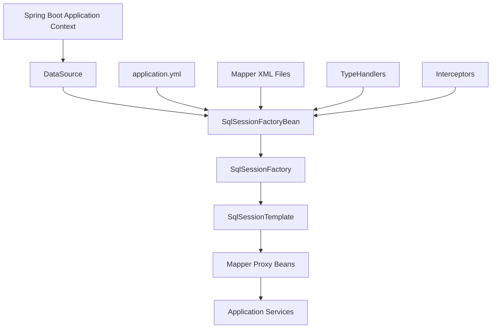

------
title: Learn Java MyBatis - Part 018
description: Production Spring Boot configuration for MyBatis, auto-configuration behavior, mapper scanning, configuration properties, customization hooks, multi-datasource setup, testing slices, and operational hardening.
series: learn-java-mybatis
seriesTitle: Learn Java MyBatis, Patterns, Anti-Patterns, and Production Persistence Mapping
order: 18
partTitle: Spring Boot Starter Production Configuration
tags:
  - java
  - mybatis
  - spring-boot
  - configuration
  - sqlsessionfactory
  - mapper
  - production
  - architecture
date: 2026-06-28
------

# Part 018 — Spring Boot Starter Production Configuration

This part is about configuring MyBatis in Spring Boot without turning production configuration into a pile of accidental defaults.

The Spring Boot starter makes MyBatis easy to start. Production engineering makes it explicit enough to trust.

The danger is not that the starter is weak. The danger is that auto-configuration can hide important decisions:

- which data source is used,
- where mapper XML files are loaded from,
- which mapper interfaces are scanned,
- which executor type is active,
- which type handlers are registered,
- whether underscore-to-camel-case mapping is enabled,
- whether statement timeout and fetch size have sane defaults,
- how multiple data sources are separated,
- how mapper tests are configured,
- how configuration changes are reviewed.

A top-tier engineer uses Spring Boot auto-configuration as a controlled baseline, not as a black box.

---

## 1. Kaufman Skill Slice

### Target Skill

After this part, you should be able to:

1. explain what the MyBatis Spring Boot starter auto-configures,
2. design a production-grade MyBatis configuration layout,
3. choose between properties, XML config, Java customizers, and manual factory beans,
4. configure mapper XML loading safely,
5. register type aliases and type handlers intentionally,
6. handle multiple data sources without accidental mapper crossover,
7. configure tests for mapper correctness,
8. review MyBatis Boot configuration for operational risk.

### Subskills

| Subskill | Production Value |
|---|---|
| Starter auto-configuration model | Prevents hidden assumptions. |
| Mapper scanning | Prevents missing or wrongly registered mappers. |
| XML mapper locations | Prevents boot-time success with runtime missing statements. |
| Configuration properties | Makes environment-specific behavior visible. |
| Customizers | Allows precise changes without abandoning auto-config. |
| Multi-datasource setup | Prevents wrong transaction/session factory pairing. |
| Test auto-configuration | Keeps mapper tests fast and focused. |
| Governance | Makes configuration changes reviewable. |

---

## 2. What the Starter Does

With a normal single-data-source Spring Boot application, the MyBatis Spring Boot starter can:

1. detect an existing `DataSource`,
2. create a `SqlSessionFactory` using `SqlSessionFactoryBean`,
3. create a `SqlSessionTemplate`,
4. scan mapper interfaces,
5. link mapper interfaces to the `SqlSessionTemplate`,
6. register mapper beans in the Spring context.

Runtime shape:



This is excellent for standard applications. But once the system grows, you must decide which parts stay automatic and which become explicit.

---

## 3. Dependency Baseline

For Spring Boot 4 generation:

```xml
<dependency>
    <groupId>org.mybatis.spring.boot</groupId>
    <artifactId>mybatis-spring-boot-starter</artifactId>
    <version>4.0.0</version>
</dependency>
```

For Gradle:

```kotlin
dependencies {
    implementation("org.mybatis.spring.boot:mybatis-spring-boot-starter:4.0.0")
}
```

Version choice must match your Spring Boot and Java baseline. Do not copy starter versions blindly across applications.

Production rule:

> Treat MyBatis starter version, Spring Boot version, Java version, and database driver version as a compatibility set.

---

## 4. Minimal Single-DataSource Configuration

For a simple application:

```yaml
spring:
  datasource:
    url: jdbc:postgresql://localhost:5432/case_db
    username: case_app
    password: ${CASE_DB_PASSWORD}
    hikari:
      maximum-pool-size: 20
      minimum-idle: 5
      connection-timeout: 3000

mybatis:
  mapper-locations: classpath*:mybatis/mappers/**/*.xml
  type-aliases-package: com.acme.caseapp.persistence.mybatis.model
  type-handlers-package: com.acme.caseapp.persistence.mybatis.typehandler
  configuration:
    map-underscore-to-camel-case: false
    default-fetch-size: 100
    default-statement-timeout: 30
```

This configuration says:

- mapper XML lives under `mybatis/mappers`,
- aliases are restricted to persistence model package,
- type handlers are registered from a known package,
- implicit underscore-to-camel mapping is disabled,
- fetch size and statement timeout have defaults.

Why disable `map-underscore-to-camel-case` in advanced codebases?

Not because the feature is bad. Because explicit aliasing is more reviewable for complex projections.

Example:

```sql
SELECT
    c.case_id       AS caseId,
    c.case_number   AS caseNumber,
    c.status_code   AS statusCode,
    c.created_at    AS createdAt
FROM cases c
WHERE c.case_id = #{caseId}
```

This avoids magical mapping behavior in critical read models.

Some teams enable underscore-to-camel-case for simple CRUD-style models. That is valid when it is a deliberate convention and tested.

---

## 5. Configuration Surface Area

Important starter properties include:

| Property | Use |
|---|---|
| `mybatis.config-location` | Path to MyBatis XML configuration file. |
| `mybatis.check-config-location` | Validate config file presence. |
| `mybatis.mapper-locations` | Mapper XML resource locations. |
| `mybatis.type-aliases-package` | Packages scanned for aliases. |
| `mybatis.type-aliases-super-type` | Restrict aliases to a supertype. |
| `mybatis.type-handlers-package` | Packages scanned for type handlers. |
| `mybatis.executor-type` | Default executor type: `SIMPLE`, `REUSE`, or `BATCH`. |
| `mybatis.configuration.*` | Direct MyBatis configuration settings. |
| `mybatis.configuration-properties` | External properties for MyBatis config and mapper placeholders. |
| `mybatis.lazy-initialization` | Lazy mapper bean initialization. |
| `mybatis.mapper-default-scope` | Default scope for scanned mapper beans. |

Production rule:

> Prefer `application.yml` for environment-sensitive settings and Java configuration for structural wiring.

Examples of environment-sensitive settings:

- statement timeout,
- fetch size,
- mapper XML location,
- database connection settings,
- logging level.

Examples of structural wiring:

- which data source a `SqlSessionFactory` uses,
- multi-datasource mapper scan boundaries,
- interceptor registration,
- type handler registration policy,
- custom VFS in manual Spring Boot configuration.

---

## 6. Configuration File vs Boot Properties

There are four ways to configure MyBatis in Spring Boot:

1. starter properties in `application.yml`,
2. MyBatis XML config file via `config-location`,
3. `ConfigurationCustomizer`,
4. manual `SqlSessionFactoryBean` configuration.

### 6.1 Properties First

Use for common settings:

```yaml
mybatis:
  configuration:
    default-statement-timeout: 30
    default-fetch-size: 100
    cache-enabled: false
    lazy-loading-enabled: false
```

Good when:

- settings are simple,
- operations team needs visibility,
- values differ per environment,
- no complex bean wiring is required.

### 6.2 XML Config

Use `config-location` when you already have MyBatis-level config or want standard MyBatis XML sections.

```yaml
mybatis:
  config-location: classpath:mybatis/mybatis-config.xml
  mapper-locations: classpath*:mybatis/mappers/**/*.xml
```

Example config:

```xml
<?xml version="1.0" encoding="UTF-8" ?>
<!DOCTYPE configuration
  PUBLIC "-//mybatis.org//DTD Config 3.0//EN"
  "https://mybatis.org/dtd/mybatis-3-config.dtd">
<configuration>
    <settings>
        <setting name="mapUnderscoreToCamelCase" value="false"/>
        <setting name="defaultStatementTimeout" value="30"/>
    </settings>
</configuration>
```

Do not use MyBatis `<environments>` as the source of truth in Spring Boot. Spring Boot and Spring transaction management own data source wiring.

### 6.3 `ConfigurationCustomizer`

Use when you need Java-level customization of MyBatis `Configuration`.

```java
@Configuration
public class MyBatisConfigurationCustomizers {

    @Bean
    ConfigurationCustomizer strictMappingCustomizer() {
        return configuration -> {
            configuration.setMapUnderscoreToCamelCase(false);
            configuration.setCallSettersOnNulls(true);
        };
    }
}
```

Good for:

- custom flags,
- plugin-aware configuration,
- settings that need Java constants,
- centralizing project defaults.

### 6.4 `SqlSessionFactoryBeanCustomizer`

Use when you need to customize the factory bean generated by auto-configuration.

```java
@Configuration
public class MyBatisFactoryCustomizers {

    @Bean
    SqlSessionFactoryBeanCustomizer mapperLocationCustomizer(
        ResourcePatternResolver resolver
    ) {
        return factory -> factory.setMapperLocations(
            resolver.getResources("classpath*:mybatis/mappers/**/*.xml")
        );
    }
}
```

Good for:

- mapper locations,
- VFS settings,
- factory-level extension points,
- customized type handler setup.

### 6.5 Manual `SqlSessionFactoryBean`

Use for:

- multiple data sources,
- multiple session factories,
- different mapper groups with different configuration,
- advanced routing patterns,
- strict module isolation.

Do not manually configure everything just because it feels more “enterprise.” Manual configuration increases responsibility.

---

## 7. Mapper Location Strategy

Recommended layout:

```text
src/main/java/
  com/acme/caseapp/
    caseworkflow/
    persistence/mybatis/
      mapper/
        CaseCommandMapper.java
        CaseQueryMapper.java
      model/
      typehandler/

src/main/resources/
  mybatis/
    mappers/
      case/
        CaseCommandMapper.xml
        CaseQueryMapper.xml
      audit/
        CaseAuditMapper.xml
```

Configuration:

```yaml
mybatis:
  mapper-locations: classpath*:mybatis/mappers/**/*.xml
```

Rules:

1. Mapper interface and XML statement namespace must match.
2. XML file path should mirror domain/module structure.
3. Avoid dumping all mapper XML files into one flat folder.
4. Avoid wildcard patterns that accidentally load test resources in production.
5. Fail fast on missing XML.

Review smell:

```yaml
mybatis:
  mapper-locations: classpath*:**/*.xml
```

This is too broad. It can load unrelated XML resources.

Better:

```yaml
mybatis:
  mapper-locations: classpath*:mybatis/mappers/**/*.xml
```

---

## 8. Mapper Scanning Strategy

### 8.1 Annotation-Based Mapper Discovery

```java
@Mapper
public interface CaseQueryMapper {
    Optional<CaseDetailRow> findDetail(long caseId);
}
```

Simple and good for small-to-medium codebases.

### 8.2 Package Scanning

```java
@SpringBootApplication
@MapperScan(basePackages = "com.acme.caseapp.persistence.mybatis.mapper")
public class CaseApplication {
}
```

Good when:

- many mapper interfaces exist,
- you want a single scanning boundary,
- mapper interfaces should not need `@Mapper` individually.

### 8.3 Marker Interface Strategy

```java
public interface MyBatisMapperMarker {
}

@MapperScan(
    basePackages = "com.acme.caseapp",
    markerInterface = MyBatisMapperMarker.class
)
@Configuration
class MyBatisMapperScanConfig {
}
```

Mapper:

```java
public interface CaseCommandMapper extends MyBatisMapperMarker {
    int updateStatus(UpdateCaseStatusCommand command);
}
```

Good for large codebases where package boundaries alone are not enough.

### 8.4 Multi-DataSource Scan Boundary

Never let mappers from different databases be scanned into the same session factory accidentally.

```java
@MapperScan(
    basePackages = "com.acme.caseapp.persistence.caseDb.mapper",
    sqlSessionFactoryRef = "caseSqlSessionFactory",
    sqlSessionTemplateRef = "caseSqlSessionTemplate"
)
@Configuration
class CaseDbMapperConfig {
}

@MapperScan(
    basePackages = "com.acme.caseapp.persistence.auditDb.mapper",
    sqlSessionFactoryRef = "auditSqlSessionFactory",
    sqlSessionTemplateRef = "auditSqlSessionTemplate"
)
@Configuration
class AuditDbMapperConfig {
}
```

Production rule:

> Mapper package boundary is a database ownership boundary.

---

## 9. Type Aliases Governance

Type aliases reduce XML noise:

```yaml
mybatis:
  type-aliases-package: com.acme.caseapp.persistence.mybatis.model
```

Then XML can use:

```xml
<select id="findDetail" resultType="CaseDetailRow">
    SELECT ...
</select>
```

But aliases can also reduce clarity if package scope is too broad.

Bad:

```yaml
mybatis:
  type-aliases-package: com.acme.caseapp
```

This can register too many classes and create naming collisions.

Better:

```yaml
mybatis:
  type-aliases-package: com.acme.caseapp.persistence.mybatis.model
```

Even better in huge systems:

```yaml
mybatis:
  type-aliases-package: com.acme.caseapp.persistence.mybatis.model
  type-aliases-super-type: com.acme.caseapp.persistence.mybatis.model.MyBatisRow
```

This restricts alias scanning to a known base type.

---

## 10. Type Handler Registration

Type handlers are boundary adapters between JDBC values and Java values.

Configuration:

```yaml
mybatis:
  type-handlers-package: com.acme.caseapp.persistence.mybatis.typehandler
```

Example handler:

```java
@MappedTypes(CaseStatus.class)
@MappedJdbcTypes(JdbcType.VARCHAR)
public class CaseStatusTypeHandler extends BaseTypeHandler<CaseStatus> {

    @Override
    public void setNonNullParameter(
        PreparedStatement ps,
        int i,
        CaseStatus parameter,
        JdbcType jdbcType
    ) throws SQLException {
        ps.setString(i, parameter.code());
    }

    @Override
    public CaseStatus getNullableResult(ResultSet rs, String columnName) throws SQLException {
        return CaseStatus.fromCode(rs.getString(columnName));
    }

    @Override
    public CaseStatus getNullableResult(ResultSet rs, int columnIndex) throws SQLException {
        return CaseStatus.fromCode(rs.getString(columnIndex));
    }

    @Override
    public CaseStatus getNullableResult(CallableStatement cs, int columnIndex) throws SQLException {
        return CaseStatus.fromCode(cs.getString(columnIndex));
    }
}
```

Production rules:

1. Keep handlers deterministic.
2. Do not perform database calls inside type handlers.
3. Do not hide business rules in type handlers.
4. Test unknown/invalid database values.
5. Keep package scanning narrow.

---

## 11. Executor Type Configuration

Starter property:

```yaml
mybatis:
  executor-type: SIMPLE
```

Valid conceptual choices:

| Executor | Use |
|---|---|
| `SIMPLE` | Default, creates a statement for each execution. |
| `REUSE` | Reuses prepared statements where possible. |
| `BATCH` | Batches update statements. |

Do not globally set `BATCH` unless the whole application is designed for batch semantics.

Bad:

```yaml
mybatis:
  executor-type: BATCH
```

Why risky?

- write failures can surface later,
- affected-row timing changes,
- memory behavior changes,
- services may assume immediate execution.

Better:

```java
@Bean
public SqlSessionTemplate batchSqlSessionTemplate(SqlSessionFactory sqlSessionFactory) {
    return new SqlSessionTemplate(sqlSessionFactory, ExecutorType.BATCH);
}
```

Then inject batch execution only into dedicated batch components.

---

## 12. Statement Timeout and Fetch Size

Production defaults:

```yaml
mybatis:
  configuration:
    default-statement-timeout: 30
    default-fetch-size: 100
```

Statement timeout protects the database and application threads from runaway queries.

Fetch size can reduce memory pressure for large result sets, depending on database and driver behavior.

Mapper-level override:

```xml
<select
    id="streamLargeExport"
    resultMap="CaseExportRowMap"
    fetchSize="500"
    timeout="120">
    SELECT ...
</select>
```

Rule:

> Defaults should protect normal workloads; mapper-level overrides should be rare and justified.

---

## 13. Cache Configuration

Many production systems disable MyBatis second-level cache by default:

```yaml
mybatis:
  configuration:
    cache-enabled: false
```

Why?

- invalidation complexity,
- namespace-level behavior surprises,
- distributed deployment staleness,
- regulatory correctness risk,
- application-level cache is often more observable.

This does not disable the local session cache behavior entirely. Session-level behavior still needs to be understood from the runtime model.

Use MyBatis second-level cache only when:

- data is truly stable,
- invalidation is understood,
- namespace boundaries are clear,
- tests prove stale-data behavior is acceptable,
- operations can observe cache behavior.

---

## 14. Logging Configuration

Do not enable verbose SQL logging blindly in production.

Development:

```yaml
logging:
  level:
    com.acme.caseapp.persistence.mybatis.mapper: DEBUG
```

Production:

```yaml
logging:
  level:
    com.acme.caseapp.persistence.mybatis.mapper: INFO
```

If using SQL logging tools, enforce:

- PII masking,
- credential masking,
- bounded log size,
- correlation id,
- slow-query threshold,
- sampling where needed.

Bad production behavior:

```text
SELECT * FROM parties WHERE national_id = '...'
```

Logs can become regulatory evidence and liability. Treat SQL logs as sensitive data.

---

## 15. Interceptors and Plugins

MyBatis plugins can intercept internal execution points.

Use cases:

- metrics,
- query timing,
- tenant enforcement,
- SQL comment injection for traceability,
- pagination support,
- auditing support.

Example registration by bean:

```java
@Configuration
public class MyBatisPluginConfig {

    @Bean
    public Interceptor queryTimingInterceptor() {
        return new QueryTimingInterceptor();
    }
}
```

Production cautions:

1. Interceptors affect all mapped statements in their scope.
2. They can become hidden behavior.
3. They must be heavily tested.
4. They must not mutate SQL unpredictably.
5. They must not log sensitive data unsafely.

A tenant enforcement interceptor can be valuable, but it must not replace explicit tenant predicates in SQL review.

---

## 16. Manual Multi-DataSource Configuration

Auto-configuration is optimized for a single data source. For multiple databases, define each session factory explicitly.

Example:

```java
@Configuration
@MapperScan(
    basePackages = "com.acme.caseapp.persistence.caseDb.mapper",
    sqlSessionFactoryRef = "caseSqlSessionFactory",
    sqlSessionTemplateRef = "caseSqlSessionTemplate"
)
public class CaseDbMyBatisConfig {

    @Bean
    public SqlSessionFactory caseSqlSessionFactory(
        @Qualifier("caseDataSource") DataSource dataSource,
        ResourcePatternResolver resolver
    ) throws Exception {
        SqlSessionFactoryBean factory = new SqlSessionFactoryBean();
        factory.setDataSource(dataSource);
        factory.setMapperLocations(
            resolver.getResources("classpath*:mybatis/case-db/**/*.xml")
        );
        factory.setTypeAliasesPackage("com.acme.caseapp.persistence.caseDb.model");
        factory.setTypeHandlersPackage("com.acme.caseapp.persistence.caseDb.typehandler");
        factory.setVfs(SpringBootVFS.class);
        return factory.getObject();
    }

    @Bean
    public SqlSessionTemplate caseSqlSessionTemplate(
        @Qualifier("caseSqlSessionFactory") SqlSessionFactory sqlSessionFactory
    ) {
        return new SqlSessionTemplate(sqlSessionFactory);
    }

    @Bean
    public PlatformTransactionManager caseTransactionManager(
        @Qualifier("caseDataSource") DataSource dataSource
    ) {
        return new DataSourceTransactionManager(dataSource);
    }
}
```

Audit DB:

```java
@Configuration
@MapperScan(
    basePackages = "com.acme.caseapp.persistence.auditDb.mapper",
    sqlSessionFactoryRef = "auditSqlSessionFactory",
    sqlSessionTemplateRef = "auditSqlSessionTemplate"
)
public class AuditDbMyBatisConfig {

    @Bean
    public SqlSessionFactory auditSqlSessionFactory(
        @Qualifier("auditDataSource") DataSource dataSource,
        ResourcePatternResolver resolver
    ) throws Exception {
        SqlSessionFactoryBean factory = new SqlSessionFactoryBean();
        factory.setDataSource(dataSource);
        factory.setMapperLocations(
            resolver.getResources("classpath*:mybatis/audit-db/**/*.xml")
        );
        factory.setTypeAliasesPackage("com.acme.caseapp.persistence.auditDb.model");
        factory.setVfs(SpringBootVFS.class);
        return factory.getObject();
    }

    @Bean
    public SqlSessionTemplate auditSqlSessionTemplate(
        @Qualifier("auditSqlSessionFactory") SqlSessionFactory sqlSessionFactory
    ) {
        return new SqlSessionTemplate(sqlSessionFactory);
    }

    @Bean
    public PlatformTransactionManager auditTransactionManager(
        @Qualifier("auditDataSource") DataSource dataSource
    ) {
        return new DataSourceTransactionManager(dataSource);
    }
}
```

Key rules:

- separate mapper packages,
- separate XML locations,
- separate model packages,
- separate transaction managers,
- explicit `@Transactional(transactionManager = "...")`,
- no mapper package overlap.

---

## 17. SpringBootVFS in Manual Configuration

When running as executable Spring Boot jars, classpath scanning can differ from exploded classpath behavior.

In manual `SqlSessionFactoryBean` configuration, set `SpringBootVFS` explicitly:

```java
factory.setVfs(SpringBootVFS.class);
```

This is especially relevant for:

- type alias scanning,
- type handler scanning,
- packaged executable jars,
- application server deployment variations,
- multi-data-source manual configuration.

If aliases or handlers work in IDE but fail in packaged deployment, check VFS configuration.

---

## 18. Profile-Specific Configuration

Example:

```yaml
# application-dev.yml
mybatis:
  configuration:
    default-statement-timeout: 60
logging:
  level:
    com.acme.caseapp.persistence.mybatis.mapper: DEBUG
```

```yaml
# application-prod.yml
mybatis:
  configuration:
    default-statement-timeout: 30
logging:
  level:
    com.acme.caseapp.persistence.mybatis.mapper: INFO
```

Keep behavior differences minimal.

Acceptable differences:

- logging level,
- connection URL,
- pool size,
- statement timeout,
- test-only mapper locations.

Dangerous differences:

- different mapper XML files,
- different type handler packages,
- different cache behavior,
- different underscore-to-camel behavior,
- different executor type.

Production rule:

> Environment profiles should change operational parameters, not semantic mapping behavior.

---

## 19. Configuration Governance

For large teams, MyBatis configuration needs ownership.

Create a configuration policy:

```text
MyBatis configuration policy:
1. All mapper XML lives under src/main/resources/mybatis/mappers.
2. All mapper interfaces live under persistence.mybatis.mapper.
3. Every mapper XML namespace must match a mapper interface FQN.
4. mapUnderscoreToCamelCase is disabled; aliases are explicit.
5. Type handlers live under persistence.mybatis.typehandler.
6. Global executor type is SIMPLE.
7. Batch execution requires dedicated SqlSessionTemplate.
8. MyBatis second-level cache is disabled unless approved by architecture review.
9. New mapper packages require module owner approval.
10. Multi-datasource mappers must have explicit scan configuration.
```

Why write this down?

Because otherwise configuration conventions become oral tradition.

---

## 20. Boot-Time Validation

Fail fast at application startup.

Recommendations:

1. enable config location check when using `config-location`,
2. keep mapper XML under deterministic location,
3. load application context in integration tests,
4. execute a smoke query per mapper group,
5. test packaged jar behavior when using aliases/handlers,
6. avoid conditional mapper registration unless necessary.

Smoke test:

```java
@SpringBootTest
class MyBatisBootValidationTest {

    @Autowired ApplicationContext context;

    @Test
    void shouldLoadCaseMappers() {
        assertThat(context.getBean(CaseQueryMapper.class)).isNotNull();
        assertThat(context.getBean(CaseCommandMapper.class)).isNotNull();
    }
}
```

Mapper statement validation test:

```java
@SpringBootTest
class MyBatisMappedStatementValidationTest {

    @Autowired SqlSessionFactory sqlSessionFactory;

    @Test
    void shouldContainExpectedMappedStatements() {
        Configuration configuration = sqlSessionFactory.getConfiguration();

        assertThat(configuration.hasStatement(
            "com.acme.caseapp.persistence.mybatis.mapper.CaseQueryMapper.findDetail"
        )).isTrue();
    }
}
```

---

## 21. Mapper Test Slice

MyBatis Spring Boot starter test provides `@MybatisTest` for testing MyBatis components.

Example:

```java
@MybatisTest
@AutoConfigureTestDatabase(replace = AutoConfigureTestDatabase.Replace.NONE)
@Testcontainers
class CaseQueryMapperTest {

    @Container
    static PostgreSQLContainer<?> postgres = new PostgreSQLContainer<>("postgres:16");

    @Autowired CaseQueryMapper mapper;

    @Test
    void shouldFindCaseDetail() {
        // given seed data
        // when
        Optional<CaseDetailRow> result = mapper.findDetail(1001L);

        // then
        assertThat(result).isPresent();
        assertThat(result.get().caseNumber()).isEqualTo("CASE-1001");
    }
}
```

Use `@MybatisTest` for focused mapper tests.

Use `@SpringBootTest` when testing:

- service transaction semantics,
- multi-mapper workflow,
- outbox atomicity,
- security/authorization integration,
- cross-component behavior.

Do not mock mapper XML behavior and call it a mapper test.

---

## 22. Configuration and Migration Compatibility

Mapper XML and schema migrations must evolve together.

Checklist for changing configuration:

- Does mapper XML path change affect packaged jar?
- Does alias package change affect existing XML aliases?
- Does TypeHandler package change affect enum/code mapping?
- Does timeout change affect long-running reports?
- Does fetch size change affect export memory?
- Does executor type change affect write behavior?
- Does cache setting affect data freshness?
- Does mapper scan boundary accidentally include another module?

Checklist for schema change:

- Do affected mapper XML files still compile at runtime?
- Are aliases still correct?
- Are column aliases still stable?
- Are `ResultMap` mappings still valid?
- Are type handlers still compatible with database values?
- Are projection tests updated?

---

## 23. Security Configuration Concerns

MyBatis configuration can affect security.

### 23.1 Placeholder Injection

`configuration-properties` can provide placeholders used in MyBatis config or mapper files.

Do not use environment-provided properties as raw SQL fragments unless fully controlled.

Dangerous:

```xml
SELECT * FROM ${schemaName}.cases
```

If `schemaName` is external and unvalidated, this becomes SQL text injection.

Safer:

- use fixed schema per data source,
- validate against whitelist at boot,
- avoid dynamic schema names inside mapper XML,
- route by data source instead of interpolating schema names.

### 23.2 SQL Logging

Never log sensitive parameter values carelessly.

Sensitive examples:

- national ID,
- passport number,
- phone number,
- email address,
- allegations text,
- evidence metadata,
- financial identifiers,
- authentication tokens.

### 23.3 Mapper Package Exposure

Do not expose mapper beans to layers that should not perform persistence operations.

Bad architecture:

```java
@RestController
public class CaseController {
    private final CaseCommandMapper mapper;
}
```

Better:

```java
@RestController
public class CaseController {
    private final CaseCommandService service;
}
```

---

## 24. Configuration Anti-Patterns

### Anti-Pattern 1 — Everything Under One Alias Package

```yaml
mybatis:
  type-aliases-package: com.acme
```

Impact:

- classpath scanning overhead,
- name collisions,
- XML ambiguity,
- unstable aliases.

Fix:

```yaml
mybatis:
  type-aliases-package: com.acme.caseapp.persistence.mybatis.model
```

### Anti-Pattern 2 — Broad Mapper XML Wildcard

```yaml
mybatis:
  mapper-locations: classpath*:/**/*.xml
```

Impact:

- accidental resource loading,
- slow boot,
- confusing failures.

Fix:

```yaml
mybatis:
  mapper-locations: classpath*:mybatis/mappers/**/*.xml
```

### Anti-Pattern 3 — Global Batch Executor

```yaml
mybatis:
  executor-type: BATCH
```

Impact:

- hidden flush semantics,
- delayed failures,
- wrong affected-row assumptions.

Fix:

- keep default `SIMPLE`,
- create dedicated batch `SqlSessionTemplate`.

### Anti-Pattern 4 — Multi-DataSource Auto-Configuration Guessing

Relying on `@Primary` and hoping mapper packages bind to the correct session factory.

Fix:

- explicit `@MapperScan` per data source,
- explicit `sqlSessionFactoryRef`,
- explicit `sqlSessionTemplateRef`,
- explicit transaction manager names.

### Anti-Pattern 5 — Semantic Differences Across Profiles

```yaml
# dev
mybatis.configuration.map-underscore-to-camel-case: true

# prod
mybatis.configuration.map-underscore-to-camel-case: false
```

Impact:

- tests pass in dev and fail in prod,
- mapping behavior changes by environment.

Fix:

- keep semantic mapping settings identical.

### Anti-Pattern 6 — Hiding Configuration in Multiple Places

Some settings in `application.yml`, some in XML, some in customizer, some in manual factory, with no ownership.

Fix:

- define one canonical configuration strategy,
- document exceptions,
- test effective configuration.

---

## 25. Recommended Production Baseline

For a single-data-source application:

```yaml
mybatis:
  mapper-locations: classpath*:mybatis/mappers/**/*.xml
  type-aliases-package: com.acme.caseapp.persistence.mybatis.model
  type-handlers-package: com.acme.caseapp.persistence.mybatis.typehandler
  executor-type: SIMPLE
  configuration:
    map-underscore-to-camel-case: false
    default-fetch-size: 100
    default-statement-timeout: 30
    cache-enabled: false
    lazy-loading-enabled: false
```

Recommended Java config:

```java
@Configuration
@MapperScan(basePackages = "com.acme.caseapp.persistence.mybatis.mapper")
public class MyBatisConfig {

    @Bean
    ConfigurationCustomizer myBatisDefaults() {
        return configuration -> {
            configuration.setMapUnderscoreToCamelCase(false);
            configuration.setCacheEnabled(false);
            configuration.setLazyLoadingEnabled(false);
        };
    }
}
```

Recommended test dependencies:

```kotlin
dependencies {
    testImplementation("org.mybatis.spring.boot:mybatis-spring-boot-starter-test:4.0.0")
    testImplementation("org.testcontainers:junit-jupiter")
    testImplementation("org.testcontainers:postgresql")
}
```

---

## 26. Configuration Review Checklist

### Starter and Versioning

- [ ] Is the starter version compatible with Spring Boot and Java baseline?
- [ ] Is the database driver version compatible with target database?
- [ ] Is dependency management centralized?

### Mapper Loading

- [ ] Are mapper XML locations specific and deterministic?
- [ ] Do mapper namespaces match mapper interface FQNs?
- [ ] Are mapper package scan boundaries narrow?
- [ ] Are multi-datasource mappers separated by package and session factory?

### Mapping Behavior

- [ ] Is `mapUnderscoreToCamelCase` decision explicit?
- [ ] Are TypeHandler packages narrow?
- [ ] Are aliases restricted to persistence models?
- [ ] Is second-level cache disabled unless intentionally approved?

### Runtime Behavior

- [ ] Is default executor type safe for normal services?
- [ ] Are batch executors isolated?
- [ ] Are statement timeout and fetch size configured?
- [ ] Is SQL logging safe for sensitive data?

### Environment

- [ ] Do profiles avoid semantic mapping differences?
- [ ] Are secrets injected safely?
- [ ] Is packaged jar behavior tested?
- [ ] Are config changes covered by boot-time validation tests?

---

## 27. Deliberate Practice

### Exercise 1 — Design a Baseline Configuration

Create `application.yml` for a case-management service with:

- PostgreSQL data source,
- mapper XML under `mybatis/mappers/**/*.xml`,
- aliases under `persistence.mybatis.model`,
- type handlers under `persistence.mybatis.typehandler`,
- explicit statement timeout,
- cache disabled,
- explicit underscore mapping policy.

Explain every setting in one sentence.

### Exercise 2 — Detect Bad Wildcards

Review this configuration:

```yaml
mybatis:
  mapper-locations: classpath*:/**/*.xml
  type-aliases-package: com.acme
  executor-type: BATCH
  configuration:
    map-underscore-to-camel-case: true
```

Identify at least five risks and rewrite it for production.

### Exercise 3 — Multi-DataSource Mapper Separation

Design two mapper groups:

- case DB mappers,
- audit DB mappers.

Write:

- package layout,
- XML resource layout,
- two `@MapperScan` configurations,
- two `SqlSessionFactory` beans,
- two `SqlSessionTemplate` beans,
- two transaction managers.

### Exercise 4 — Effective Configuration Test

Write a test that verifies:

- mapper bean exists,
- mapped statement exists,
- `mapUnderscoreToCamelCase` has expected value,
- cache is disabled,
- statement timeout default is configured.

---

## 28. Mental Model Summary

The starter gives you a fast path to working MyBatis. Production configuration gives you a safe path to operating MyBatis.

Think in layers:

```text
Spring Boot properties
    -> define environment-visible defaults
ConfigurationCustomizer
    -> applies Java-level MyBatis defaults
SqlSessionFactoryBeanCustomizer
    -> customizes generated factory bean
Manual SqlSessionFactoryBean
    -> used when auto-config is not enough
MapperScan
    -> binds mapper package to session factory/template
TransactionManager
    -> defines commit/rollback authority for the same DataSource
```

The most important invariant:

> Every mapper must be intentionally bound to exactly one `SqlSessionFactory`, exactly one `SqlSessionTemplate`, and the correct transaction manager for its data source.

If that invariant holds, Spring Boot MyBatis configuration remains understandable even as the system grows.

---

## 29. References

- MyBatis Spring Boot Starter Reference — Introduction and Configuration: https://mybatis.org/spring-boot-starter/mybatis-spring-boot-autoconfigure/
- MyBatis Spring Boot Starter Test Reference: https://mybatis.org/spring-boot-starter/mybatis-spring-boot-test-autoconfigure/
- MyBatis-Spring Reference — SqlSessionFactoryBean: https://mybatis.org/spring/factorybean.html
- MyBatis-Spring Reference — Mapper Scanning: https://mybatis.org/spring/mappers.html
- MyBatis-Spring Reference — Transactions: https://mybatis.org/spring/transactions.html
