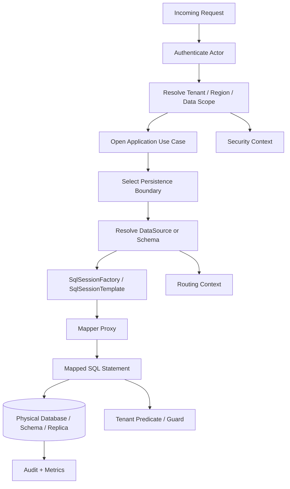
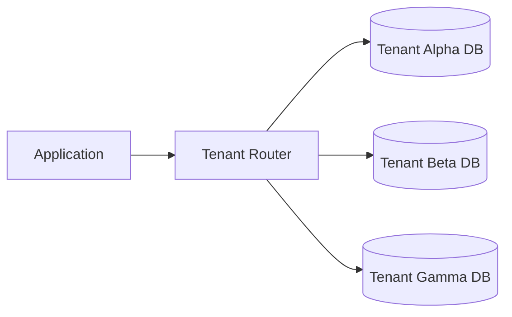
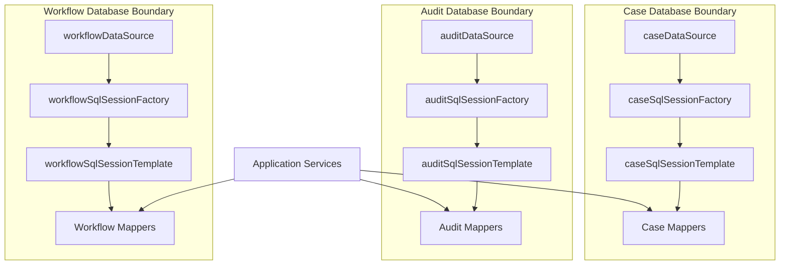
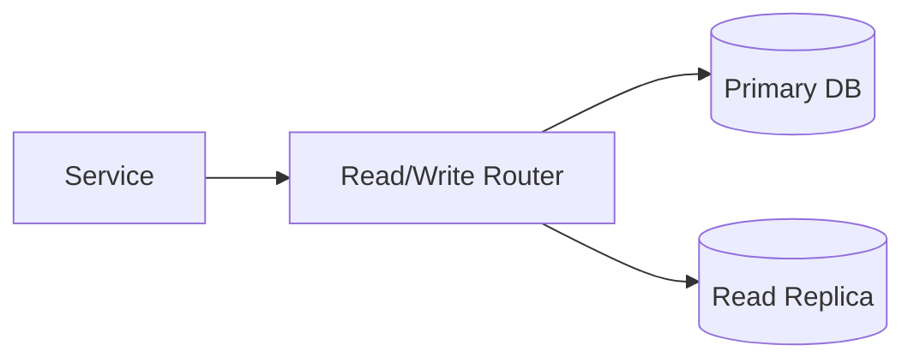
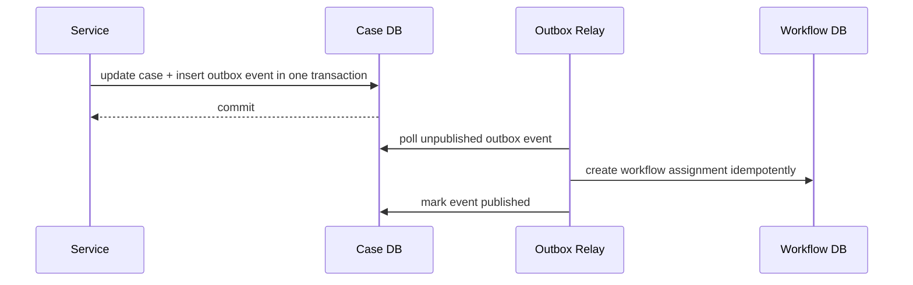

------
title: Learn Java MyBatis - Part 019
description: Production patterns for multi-database, multi-tenant, and routing architectures with MyBatis, including datasource isolation, mapper/session factory ownership, tenant predicate enforcement, schema and database-per-tenant trade-offs, and failure-mode-driven design.
series: learn-java-mybatis
seriesTitle: Learn Java MyBatis, Patterns, Anti-Patterns, and Production Persistence Mapping
order: 19
partTitle: Multi-Database, Multi-Tenant, and Routing Patterns
tags:
  - java
  - mybatis
  - multi-tenant
  - multi-database
  - datasource-routing
  - architecture
  - persistence
  - production
date: 2026-06-28
------

# Part 019 — Multi-Database, Multi-Tenant, and Routing Patterns

This part is about using MyBatis when the database topology is not simple.

A single application may need to talk to:

- one database with tenant discriminator columns,
- one database with schema-per-tenant,
- many physical databases,
- read/write replicas,
- domain-separated databases,
- reporting replicas,
- archive databases,
- regulatory-region-specific databases,
- legacy databases with incompatible naming and semantics.

MyBatis works well in these environments because it is explicit. It does not pretend that every database is just a transparent object graph. However, that explicitness is also dangerous: every mapper method becomes a possible isolation boundary violation if routing, transaction, schema, or tenant predicates are not designed deliberately.

The goal of this part is to build a mental model for **database topology as a first-class architecture decision**.

---

## 1. Kaufman Skill Slice

### Target Skill

After this part, you should be able to:

1. choose an appropriate multi-tenant topology for a MyBatis application,
2. design mapper/session factory boundaries for multiple databases,
3. prevent mapper crossover between datasources,
4. enforce tenant predicates in SQL contracts,
5. design routing around service boundaries rather than random mapper calls,
6. reason about transaction limits across databases,
7. review multi-tenant MyBatis code for isolation failures,
8. build operational checks that detect routing and predicate mistakes early.

### Subskills

| Subskill | Why It Matters |
|---|---|
| Topology choice | Determines isolation, operability, cost, and query complexity. |
| Datasource ownership | Prevents a mapper from accidentally using the wrong database. |
| Session factory separation | Keeps mapper namespaces bound to the correct database configuration. |
| Tenant predicate design | Prevents cross-tenant reads and writes. |
| Routing context management | Prevents leaking routing state across requests or threads. |
| Transaction boundary design | Avoids fake atomicity across independent databases. |
| Observability | Makes routing and tenant behavior inspectable in production. |
| Governance | Makes isolation rules enforceable in code review and CI. |

---

## 2. The Core Mental Model

In a single-database application, it is easy to think:

> Service calls mapper, mapper calls SQL.

In a multi-database or multi-tenant application, the real model is:

> Service decides business intent. Routing decides database context. Mapper executes SQL within that context. SQL enforces data isolation. Observability proves it happened.



The database target is not an implementation detail. It is part of the correctness model.

In regulated systems, a query that returns the wrong tenant's data is not merely a bug. It is a data breach, audit failure, and sometimes a legal incident.

---

## 3. Three Main Multi-Tenant Topologies

### 3.1 Shared Database, Shared Schema, Tenant Column

All tenants live in the same tables. Each tenant-owned table has a `tenant_id` or equivalent discriminator.

```sql
CREATE TABLE enforcement_case (
    tenant_id     varchar(64)  NOT NULL,
    case_id       uuid         NOT NULL,
    status        varchar(32)  NOT NULL,
    title         text         NOT NULL,
    created_at    timestamptz  NOT NULL,
    updated_at    timestamptz  NOT NULL,
    PRIMARY KEY (tenant_id, case_id)
);
```

Typical mapper method:

```java
public interface CaseMapper {
    Optional<CaseRecord> findByTenantAndId(
        @Param("tenantId") TenantId tenantId,
        @Param("caseId") CaseId caseId
    );
}
```

```xml
<select id="findByTenantAndId" resultMap="CaseRecordMap">
  SELECT
      c.tenant_id,
      c.case_id,
      c.status,
      c.title,
      c.created_at,
      c.updated_at
  FROM enforcement_case c
  WHERE c.tenant_id = #{tenantId}
    AND c.case_id = #{caseId}
</select>
```

Strengths:

- operationally simple,
- cheapest to run,
- easiest to query across tenants for internal operations if allowed,
- simple schema migration,
- simple connection pool management.

Weaknesses:

- every query must remember tenant predicates,
- indexes must include tenant dimension,
- noisy tenant can affect others,
- data isolation depends heavily on application and database controls,
- backup/restore per tenant is harder.

Use this topology when:

- tenants are small or medium,
- legal isolation requirements allow shared storage,
- operational simplicity is more important than strict physical isolation,
- there is strong test and review discipline around tenant predicates.

Do not use this topology casually when:

- tenants require physical separation,
- tenant-specific backup/restore is mandatory,
- one tenant's workload can dominate the platform,
- data residency varies heavily by tenant.

---

### 3.2 Shared Database, Schema per Tenant

Each tenant has its own schema, but schemas live in the same physical database.

```text
physical database: enforcement_prod

schemas:
  tenant_alpha.enforcement_case
  tenant_beta.enforcement_case
  tenant_gamma.enforcement_case
```

The application must resolve the tenant schema before executing SQL.

There are two common approaches:

1. set database search path / current schema per connection,
2. render schema-qualified table names.

The first is safer if the connection lifecycle is controlled. The second is explicit but often requires dynamic identifier rendering, which must be whitelisted.

Strengths:

- better logical isolation than tenant column,
- per-tenant maintenance can be easier,
- queries do not always need `tenant_id` predicate,
- tenant data is visually separated at database level.

Weaknesses:

- schema migration must run across many schemas,
- connection state must be reset safely,
- routing bugs can still hit the wrong schema,
- dynamic schema names create SQL injection risk if not whitelisted,
- database metadata and migration time grow with tenant count.

Use this topology when:

- tenant count is moderate,
- tenant-level logical isolation matters,
- operational team can manage schema migrations reliably,
- cross-tenant analytics can be handled separately.

Be careful when tenant count is very large. Thousands of schemas may turn every migration into an operational event.

---

### 3.3 Database per Tenant

Each tenant has its own physical database or cluster.



Strengths:

- strongest physical isolation,
- tenant-specific scaling,
- tenant-specific backup/restore,
- tenant-specific maintenance windows,
- easier data residency separation.

Weaknesses:

- operational cost is higher,
- routing is mandatory,
- connection pool explosion risk,
- migrations are more complex,
- cross-tenant reporting requires separate pipeline,
- distributed transactions should generally be avoided.

Use this topology when:

- tenants are large,
- legal or contractual isolation requires it,
- data residency differs by tenant,
- per-tenant performance isolation is important,
- tenant-specific lifecycle is expected.

Avoid pretending this is just a simple configuration detail. Database-per-tenant is a platform architecture decision.

---

## 4. Domain-Separated Databases

Not every multi-database system is multi-tenant. Sometimes databases are split by domain or operational role:

```text
case_db       -> enforcement cases, allegations, parties
workflow_db   -> assignments, queues, timers, escalations
audit_db      -> immutable audit log
reporting_db  -> denormalized reporting projections
legacy_db     -> external or inherited system
```

This split changes mapper ownership.

Bad structure:

```text
com.example.mapper
  CaseMapper.java
  WorkflowMapper.java
  AuditMapper.java
  LegacyPersonMapper.java
```

Better structure:

```text
com.example.persistence.casefile
  CaseSqlConfig.java
  CaseMapper.java
  CaseSearchMapper.java

com.example.persistence.workflow
  WorkflowSqlConfig.java
  AssignmentMapper.java
  EscalationMapper.java

com.example.persistence.audit
  AuditSqlConfig.java
  AuditLogMapper.java

com.example.persistence.legacy
  LegacySqlConfig.java
  LegacyPersonGateway.java
```

Separate database means separate persistence boundary.

Do not let one `SqlSessionFactory` accidentally become the global gateway to every database in the company.

---

## 5. MyBatis Runtime Boundaries in Multi-Database Systems

A production MyBatis multi-database design usually has:

- one `DataSource` per physical database or pool,
- one `SqlSessionFactory` per `DataSource`,
- one `SqlSessionTemplate` per `SqlSessionFactory`,
- mapper scanning scoped per database boundary,
- separate transaction manager per data source unless using a deliberate distributed transaction strategy.



The invariant:

> A mapper package must be bound to exactly one intended `SqlSessionFactory`.

If this invariant is not true, mapper scanning becomes a production risk.

---

## 6. Example: Separate Mapper Scans per Database

A simplified Spring configuration:

```java
@Configuration
@MapperScan(
    basePackages = "com.acme.enforcement.persistence.casefile.mapper",
    sqlSessionTemplateRef = "caseSqlSessionTemplate"
)
class CaseMyBatisConfig {

    @Bean
    DataSource caseDataSource(CaseDbProperties properties) {
        return properties.toHikariDataSource();
    }

    @Bean
    SqlSessionFactory caseSqlSessionFactory(
            @Qualifier("caseDataSource") DataSource dataSource,
            ApplicationContext context
    ) throws Exception {
        SqlSessionFactoryBean bean = new SqlSessionFactoryBean();
        bean.setDataSource(dataSource);
        bean.setMapperLocations(
            context.getResources("classpath*:mybatis/casefile/**/*.xml")
        );
        bean.setTypeAliasesPackage("com.acme.enforcement.persistence.casefile.model");
        return bean.getObject();
    }

    @Bean
    SqlSessionTemplate caseSqlSessionTemplate(
            @Qualifier("caseSqlSessionFactory") SqlSessionFactory factory
    ) {
        return new SqlSessionTemplate(factory);
    }
}
```

For another database:

```java
@Configuration
@MapperScan(
    basePackages = "com.acme.enforcement.persistence.audit.mapper",
    sqlSessionTemplateRef = "auditSqlSessionTemplate"
)
class AuditMyBatisConfig {
    // auditDataSource
    // auditSqlSessionFactory
    // auditSqlSessionTemplate
}
```

The important part is not the exact Java syntax. The important part is the boundary:

```text
casefile mappers -> caseSqlSessionTemplate -> caseSqlSessionFactory -> caseDataSource

audit mappers    -> auditSqlSessionTemplate -> auditSqlSessionFactory -> auditDataSource
```

Never rely on mapper package naming alone. Make the binding explicit.

---

## 7. The Mapper Crossover Failure

A mapper crossover happens when a mapper intended for database A gets bound to database B.

Example:

```text
CaseMapper accidentally scanned by auditSqlSessionTemplate.
```

Possible outcomes:

1. app fails at startup because mapped statement or table is missing,
2. app starts but fails at runtime,
3. app succeeds because both databases have similarly named tables,
4. app writes correct-looking data to the wrong database.

The fourth case is the worst.

### Defense

Use package separation:

```text
com.acme.casefile.persistence.mapper
com.acme.audit.persistence.mapper
```

Use XML path separation:

```text
classpath*:mybatis/casefile/**/*.xml
classpath*:mybatis/audit/**/*.xml
```

Use test assertions:

```java
@SpringBootTest
class MapperBindingTest {

    @Autowired
    ApplicationContext context;

    @Test
    void caseMapperIsBoundToCaseTemplate() {
        CaseMapper mapper = context.getBean(CaseMapper.class);
        assertThat(AopUtils.getTargetClass(mapper)).isNotNull();
        // In real projects, verify mapper package scan config, factory beans,
        // and a known query against a case-db-only table.
    }
}
```

Use database-level least privilege:

```text
case application user  -> cannot write audit-owned tables
audit application user -> cannot write case-owned tables
```

Database permissions are not optional hardening. They are the last line of defense when mapper wiring is wrong.

---

## 8. Tenant Context: Value, Scope, and Lifetime

A tenant context is the current tenant/data-scope resolved for a request or job.

Bad approach:

```java
public final class TenantContext {
    public static String tenantId;
}
```

This is globally mutable state. It is unsafe under concurrency.

Better shape:

```java
public record TenantScope(
    TenantId tenantId,
    RegionCode region,
    DataResidencyZone residencyZone
) {}
```

Pass it explicitly to application services:

```java
public CaseDetail getCase(TenantScope scope, CaseId caseId) {
    return caseMapper.findDetail(scope.tenantId(), caseId)
        .orElseThrow(() -> new CaseNotFoundException(caseId));
}
```

For infrastructure routing, you may still need a thread-bound routing context, but treat it as an infrastructure mechanism, not a business API.

```java
public final class RoutingContextHolder {
    private static final ThreadLocal<RoutingKey> CURRENT = new ThreadLocal<>();

    public static void set(RoutingKey key) {
        CURRENT.set(Objects.requireNonNull(key));
    }

    public static RoutingKey requireCurrent() {
        RoutingKey key = CURRENT.get();
        if (key == null) {
            throw new IllegalStateException("No routing key bound to current thread");
        }
        return key;
    }

    public static void clear() {
        CURRENT.remove();
    }
}
```

Usage must always be scoped:

```java
public <T> T withRouting(RoutingKey key, Supplier<T> action) {
    RoutingContextHolder.set(key);
    try {
        return action.get();
    } finally {
        RoutingContextHolder.clear();
    }
}
```

The `finally` block is not style. It is correctness.

Thread-local routing context must be cleared because pooled request threads are reused.

---

## 9. Routing DataSource Pattern

Spring's `AbstractRoutingDataSource` pattern chooses a target `DataSource` at runtime.

Conceptual shape:

```java
class TenantRoutingDataSource extends AbstractRoutingDataSource {
    @Override
    protected Object determineCurrentLookupKey() {
        return RoutingContextHolder.requireCurrent();
    }
}
```

A simplified routing configuration:

```java
@Bean
DataSource tenantRoutingDataSource(Map<RoutingKey, DataSource> tenantDataSources) {
    TenantRoutingDataSource routing = new TenantRoutingDataSource();
    routing.setTargetDataSources(new HashMap<>(tenantDataSources));
    routing.setDefaultTargetDataSource(noDefaultDataSource());
    routing.afterPropertiesSet();
    return routing;
}
```

### No Default Datasource by Default

A dangerous routing datasource silently falls back to a default tenant.

Bad:

```text
No routing key -> tenant_alpha database
```

Better:

```text
No routing key -> fail fast
```

Default fallback can create invisible data leaks. A missing tenant context should be an error.

### Routing Key Must Be Resolved Before Transaction Starts

In Spring, a database connection may be acquired when the transaction begins or when the first JDBC operation occurs. The safe rule is:

> Bind routing context before entering the transactional method that will use the routed datasource.

Bad:

```java
@Transactional
public void handle(Command command) {
    routingContext.set(command.tenant()); // may be too late depending on connection acquisition
    mapper.updateSomething(...);
}
```

Better:

```java
public void handle(Command command) {
    routing.with(command.routingKey(), () -> transactionalHandler.handle(command));
}

@Component
class TransactionalHandler {
    @Transactional
    public void handle(Command command) {
        mapper.updateSomething(...);
    }
}
```

This separates routing setup from transaction start.

---

## 10. Tenant Predicate Enforcement

For shared-schema multi-tenancy, every tenant-owned query must include tenant predicate.

### The Non-Negotiable Rule

Bad:

```xml
<select id="findById" resultMap="CaseMap">
  SELECT *
  FROM enforcement_case
  WHERE case_id = #{caseId}
</select>
```

Good:

```xml
<select id="findByTenantAndId" resultMap="CaseMap">
  SELECT
      tenant_id,
      case_id,
      status,
      title
  FROM enforcement_case
  WHERE tenant_id = #{tenantId}
    AND case_id = #{caseId}
</select>
```

For updates:

```xml
<update id="transitionStatus">
  UPDATE enforcement_case
  SET status = #{targetStatus},
      updated_at = #{now},
      version = version + 1
  WHERE tenant_id = #{tenantId}
    AND case_id = #{caseId}
    AND status = #{expectedStatus}
    AND version = #{expectedVersion}
</update>
```

Affected row count must be checked:

```java
int updated = caseMapper.transitionStatus(command);
if (updated != 1) {
    throw new ConcurrentCaseModificationException(command.caseId());
}
```

Tenant isolation and concurrency control often live in the same `WHERE` clause.

---

## 11. Tenant-Aware Primary Keys

In shared-schema multi-tenancy, prefer composite logical identity:

```text
(tenant_id, business_id)
```

Even if there is a synthetic database primary key, application mapper methods should usually take tenant id plus business id.

Bad service API:

```java
CaseDetail getCase(UUID internalRowId);
```

Better service API:

```java
CaseDetail getCase(TenantId tenantId, CaseId caseId);
```

Reason:

- `internalRowId` hides tenant scope,
- logs become less meaningful,
- accidental cross-tenant lookups are easier,
- authorization checks become detached from persistence checks.

In regulated case management systems, business identity and tenant identity should be visible throughout the use case.

---

## 12. Tenant Predicate as Mapper Contract

Design mapper names to make missing tenant scope uncomfortable.

Bad:

```java
Optional<CaseRecord> findById(CaseId caseId);
List<CaseRecord> search(CaseSearchCriteria criteria);
int deleteById(CaseId caseId);
```

Better:

```java
Optional<CaseRecord> findByTenantAndId(TenantId tenantId, CaseId caseId);
List<CaseSearchRow> searchForTenant(TenantId tenantId, CaseSearchCriteria criteria);
int deleteForTenant(TenantId tenantId, CaseId caseId);
```

For criteria object:

```java
public record TenantScopedCaseSearchCriteria(
    TenantId tenantId,
    Set<CaseStatus> statuses,
    Instant createdFrom,
    Instant createdTo,
    PageRequest page
) {}
```

Then mapper:

```java
List<CaseSearchRow> search(TenantScopedCaseSearchCriteria criteria);
```

This eliminates a common bug: passing a criteria object that has filters but no tenant.

---

## 13. SQL Fragment for Tenant Predicate

You can use a reusable SQL fragment:

```xml
<sql id="TenantPredicate">
  ${alias}.tenant_id = #{tenantId}
</sql>
```

But this is dangerous because `${alias}` is raw string interpolation.

A safer variant is to avoid dynamic alias when possible:

```xml
<sql id="CaseTenantPredicate">
  c.tenant_id = #{tenantId}
</sql>
```

Usage:

```xml
<select id="findByTenantAndId" resultMap="CaseMap">
  SELECT c.tenant_id, c.case_id, c.status, c.title
  FROM enforcement_case c
  WHERE <include refid="CaseTenantPredicate" />
    AND c.case_id = #{caseId}
</select>
```

For many aliases, duplication may be safer than interpolation. Do not DRY yourself into SQL injection risk.

---

## 14. Interceptor-Based Tenant Injection: Use Carefully

Some teams try to enforce tenant filters using a MyBatis plugin/interceptor that rewrites SQL.

Potential value:

- centralized enforcement,
- reduces repetitive SQL,
- can catch missing predicates.

Risks:

- SQL rewriting is hard,
- joins and aliases are complex,
- vendor SQL syntax varies,
- debugging becomes difficult,
- false confidence can be worse than explicit SQL.

A safer stance:

> Prefer explicit tenant predicates in mapper SQL. Use interceptors for validation/observability, not magical mutation, unless you own the full SQL grammar and test it heavily.

Example validation idea:

```text
For mapper namespace under tenant-owned package:
  - statement id must be annotated/registered as tenant-scoped, or
  - rendered SQL must include known tenant column, or
  - statement must be explicitly marked as system-scope/admin-scope.
```

This can be implemented as test-time SQL scanning or runtime instrumentation.

---

## 15. System-Scope Queries

Some queries intentionally cross tenant boundaries:

- platform admin search,
- operational dashboards,
- fraud detection,
- global risk scoring,
- billing reconciliation,
- data quality checks,
- migration jobs.

These queries must not look like normal tenant-scoped queries.

Bad:

```java
List<CaseSearchRow> searchAll(CaseSearchCriteria criteria);
```

Better:

```java
List<SystemCaseSearchRow> searchForPlatformOperations(
    PlatformOperatorId operatorId,
    SystemCaseSearchCriteria criteria
);
```

And place them in a different mapper package:

```text
com.acme.enforcement.persistence.casefile.mapper.tenant
com.acme.enforcement.persistence.casefile.mapper.system
```

System-scope queries need stronger audit logging:

```text
operator_id
reason_code
query_filters
row_count
request_id
approval_reference if applicable
```

In regulated environments, cross-tenant access must be intentional, reviewable, and auditable.

---

## 16. Schema-per-Tenant and Dynamic Identifiers

Suppose each tenant has a schema:

```sql
SELECT * FROM tenant_alpha.enforcement_case WHERE case_id = ?
```

You cannot bind a schema name using `#{}` because prepared statement parameters bind values, not SQL identifiers.

This means schema names often tempt people into `${}`:

```xml
<select id="findById" resultMap="CaseMap">
  SELECT *
  FROM ${schemaName}.enforcement_case
  WHERE case_id = #{caseId}
</select>
```

This is dangerous unless `schemaName` is strictly trusted and whitelisted.

A better pattern:

```java
public record TenantSchema(String value) {
    public TenantSchema {
        if (!value.matches("tenant_[a-z0-9_]{1,48}")) {
            throw new IllegalArgumentException("Invalid tenant schema");
        }
    }
}
```

But regex is not enough. Prefer registry lookup:

```java
public TenantSchema resolveSchema(TenantId tenantId) {
    return tenantRegistry.findActiveSchema(tenantId)
        .orElseThrow(() -> new UnknownTenantException(tenantId));
}
```

Then mapper receives only a resolved infrastructure value, not raw user input.

Even better: set current schema on the connection when supported and safe, avoiding schema interpolation in every SQL statement. However, that requires rigorous connection reset behavior.

---

## 17. Connection State Reset

For schema-per-tenant systems using connection-level state:

```sql
SET search_path TO tenant_alpha;
```

or equivalent vendor-specific operation.

The danger:

1. connection is borrowed from pool,
2. application sets schema to tenant alpha,
3. query runs,
4. connection returns to pool,
5. next request borrows same connection,
6. schema is still tenant alpha unless reset.

Defense:

- set schema before every use,
- reset schema after use,
- configure pool connection initialization carefully,
- test cross-tenant request sequences,
- avoid relying on implicit default schema.

The invariant:

> A pooled connection must never carry tenant state into the next logical request.

If you cannot guarantee this, do not use connection-level tenant schema switching.

---

## 18. Read/Write Routing

Another common topology uses primary database for writes and replica for reads.



This is attractive but dangerous.

### Problem: Read-After-Write Consistency

Request flow:

```text
1. update case status on primary
2. immediately read case detail from replica
3. replica lag means old status is returned
```

For workflows, enforcement actions, and state transitions, this can break user trust and correctness.

Rule:

> Any use case requiring read-your-write consistency must read from the primary inside the consistency window.

Potential patterns:

1. all reads inside write transaction use primary,
2. after a command, redirect detail read to primary for a short duration,
3. use logical version token and wait until replica catches up,
4. only route clearly stale-tolerant dashboards to replica.

Do not hide read/write routing behind mapper names alone.

Bad:

```java
caseReadMapper.findById(caseId); // unknown whether primary or replica
```

Better:

```java
caseQueryService.getCaseDetail(scope, caseId, Consistency.REQUIRES_CURRENT);
caseDashboardService.listQueue(scope, Consistency.STALE_TOLERANT);
```

The service expresses consistency need. Infrastructure chooses route.

---

## 19. Transaction Boundaries Across Multiple Databases

A local transaction protects one database connection.

If a use case writes to two databases:

```text
case_db.update_case_status
workflow_db.create_assignment
```

There is no automatic atomicity unless you deliberately use distributed transaction infrastructure.

Most modern service architectures avoid distributed transactions and use:

- outbox pattern,
- transactional event log,
- saga/process manager,
- retryable idempotent commands,
- reconciliation jobs.

### Bad Design

```java
@Transactional
public void escalate(CaseId caseId) {
    caseMapper.updateStatus(caseId, ESCALATED);
    workflowMapper.createAssignment(caseId, supervisorQueue);
}
```

This may only cover one transaction manager. The other write may auto-commit or participate in a different transaction.

### Better Design: Outbox in the Owning Database

```java
@Transactional("caseTransactionManager")
public void escalate(TenantId tenantId, CaseId caseId) {
    int updated = caseMapper.transitionStatus(...);
    if (updated != 1) {
        throw new CaseTransitionRejectedException(caseId);
    }

    outboxMapper.insert(new OutboxEvent(
        tenantId,
        EventType.CASE_ESCALATED,
        caseId,
        payload
    ));
}
```

A separate relay publishes to workflow system.



This changes the correctness model from atomic cross-database commit to reliable eventual consistency.

---

## 20. Multi-Database MyBatis Naming Rules

Naming rules prevent ambiguity.

### Bean Names

Use explicit bean names:

```text
caseDataSource
caseSqlSessionFactory
caseSqlSessionTemplate
caseTransactionManager

auditDataSource
auditSqlSessionFactory
auditSqlSessionTemplate
auditTransactionManager
```

Avoid generic names in multi-database systems:

```text
dataSource
sqlSessionFactory
sqlSessionTemplate
transactionManager
```

Generic names invite accidental injection.

### Mapper Namespaces

Use package-derived namespaces:

```xml
<mapper namespace="com.acme.casefile.persistence.mapper.CaseMapper">
```

Do not reuse the same mapper interface name in different boundaries unless package names are obvious.

### XML Paths

```text
mybatis/casefile/CaseMapper.xml
mybatis/workflow/AssignmentMapper.xml
mybatis/audit/AuditLogMapper.xml
```

Mappers are not just files. They are production contracts.

---

## 21. Multi-Tenant Search Design

Search screens are where tenant isolation often fails because they have many optional filters.

Bad SQL:

```xml
<select id="search" resultMap="CaseSearchRowMap">
  SELECT c.case_id, c.title, c.status
  FROM enforcement_case c
  <where>
    <if test="status != null">
      c.status = #{status}
    </if>
    <if test="keyword != null">
      AND lower(c.title) LIKE lower(concat('%', #{keyword}, '%'))
    </if>
  </where>
</select>
```

If no status and no keyword are passed, this can become an all-tenant search.

Good SQL:

```xml
<select id="searchForTenant" resultMap="CaseSearchRowMap">
  SELECT c.case_id, c.title, c.status, c.updated_at
  FROM enforcement_case c
  WHERE c.tenant_id = #{tenantId}
  <if test="status != null">
    AND c.status = #{status}
  </if>
  <if test="keyword != null and keyword != ''">
    AND lower(c.title) LIKE lower(concat('%', #{keyword}, '%'))
  </if>
  ORDER BY c.updated_at DESC, c.case_id DESC
  LIMIT #{page.limit}
  OFFSET #{page.offset}
</select>
```

Tenant predicate must be outside optional dynamic blocks.

Rule:

> Mandatory security predicates should not be optional dynamic SQL.

---

## 22. Admin Override Pattern

Sometimes platform operators need elevated access. Do not implement it as nullable tenant id.

Bad:

```xml
<where>
  <if test="tenantId != null">
    tenant_id = #{tenantId}
  </if>
</where>
```

This makes `tenantId = null` mean "all tenants". That is too subtle.

Better:

```java
sealed interface CaseDataScope permits TenantCaseScope, PlatformCaseScope {}

record TenantCaseScope(TenantId tenantId) implements CaseDataScope {}

record PlatformCaseScope(
    PlatformOperatorId operatorId,
    AccessReason reason
) implements CaseDataScope {}
```

Separate mapper methods:

```java
List<CaseSearchRow> searchForTenant(TenantCaseScope scope, CaseSearchCriteria criteria);

List<SystemCaseSearchRow> searchForPlatform(
    PlatformCaseScope scope,
    SystemCaseSearchCriteria criteria
);
```

Separate SQL. Separate audit. Separate review.

---

## 23. Database Permissions as Architecture

Application-level tenant checks are not enough.

Use database users to constrain damage:

```text
case_app_user:
  SELECT/INSERT/UPDATE on case tables
  no access to audit internal maintenance tables
  no DDL permission

audit_app_user:
  INSERT audit_log
  SELECT limited audit views
  no UPDATE audit_log
  no DELETE audit_log

reporting_user:
  SELECT reporting views
  no write permission
```

For schema-per-tenant:

```text
tenant runtime user:
  USAGE on tenant schemas only through controlled routing
  no permission on internal registry schema except read-only tenant mapping if needed
```

For database-per-tenant:

```text
tenant_alpha_app -> tenant_alpha_db only
tenant_beta_app  -> tenant_beta_db only
```

Least privilege turns many application bugs into database errors instead of data breaches.

---

## 24. Migration Strategy by Topology

### Shared Schema

Migration is straightforward:

```text
one schema -> one migration stream
```

Tenant column changes must consider all tenants at once.

### Schema per Tenant

Migration is repeated:

```text
for each tenant schema:
  apply migration
  record status
  handle failure
```

You need:

- tenant migration registry,
- retries,
- per-tenant migration state,
- migration timeout policy,
- alerting for partial migration,
- compatibility between application version and partially migrated tenants.

### Database per Tenant

Migration becomes fleet management:

```text
for each tenant database:
  connect
  check version
  apply migration
  verify
  report
```

You need operational tooling, not just an application startup script.

Never let application startup automatically run uncontrolled migrations across hundreds of tenant databases.

---

## 25. Observability Requirements

For multi-tenant/multi-database MyBatis, logs and metrics should expose:

- tenant id or tenant hash,
- routing key,
- datasource name,
- database role: primary/replica/archive,
- mapper namespace,
- statement id,
- query duration,
- row count,
- affected row count,
- transaction id/correlation id,
- operator id for system-scope queries.

Example structured log:

```json
{
  "event": "mybatis.statement.completed",
  "tenant": "tenant_8f2a",
  "route": "case-db-primary-ap-southeast-1",
  "mapper": "CaseMapper",
  "statement": "searchForTenant",
  "durationMs": 42,
  "rowCount": 25,
  "requestId": "req-123"
}
```

Do not log raw tenant-sensitive SQL parameters unless redaction rules are strong.

For security-sensitive systems, tenant observability should be enough to audit behavior without leaking data.

---

## 26. Testing Multi-Tenant Isolation

### Test 1: Cross-Tenant Read

Seed data:

```text
tenant_a case_id = C-001 title = Alpha Case
tenant_b case_id = C-001 title = Beta Case
```

Test:

```java
@Test
void findByTenantAndIdDoesNotCrossTenant() {
    Optional<CaseRecord> alpha = mapper.findByTenantAndId(TENANT_A, CASE_001);
    Optional<CaseRecord> beta = mapper.findByTenantAndId(TENANT_B, CASE_001);

    assertThat(alpha).hasValueSatisfying(row ->
        assertThat(row.title()).isEqualTo("Alpha Case")
    );

    assertThat(beta).hasValueSatisfying(row ->
        assertThat(row.title()).isEqualTo("Beta Case")
    );
}
```

### Test 2: Cross-Tenant Update

```java
@Test
void updateRequiresTenantPredicate() {
    int updated = mapper.transitionStatus(new TransitionCommand(
        TENANT_A,
        CASE_OWNED_BY_TENANT_B,
        OPEN,
        ESCALATED,
        1,
        now
    ));

    assertThat(updated).isZero();
}
```

### Test 3: Search Without Optional Filters

```java
@Test
void searchWithNoFiltersStillScopedToTenant() {
    List<CaseSearchRow> rows = mapper.searchForTenant(new TenantScopedCaseSearchCriteria(
        TENANT_A,
        Set.of(),
        null,
        null,
        PageRequest.first(50)
    ));

    assertThat(rows).allMatch(row -> row.tenantId().equals(TENANT_A));
}
```

### Test 4: Routing Context Cleanup

```java
@Test
void routingContextIsClearedAfterUse() {
    routing.with(TENANT_A_ROUTE, () -> {
        mapper.countCases();
        return null;
    });

    assertThatThrownBy(() -> RoutingContextHolder.requireCurrent())
        .isInstanceOf(IllegalStateException.class);
}
```

### Test 5: Mapper Bound to Expected Database

Use a table that only exists in that database boundary.

```java
@Test
void auditMapperUsesAuditDatabase() {
    auditMapper.insertAuditEvent(...);
    assertThat(auditMapper.countAuditEvents()).isGreaterThan(0);
}
```

A good multi-tenant test suite tests the absence of leaks, not just the presence of happy-path data.

---

## 27. Static Review Rules

During code review, look for these red flags:

| Red Flag | Risk |
|---|---|
| Mapper method `findById(id)` on tenant-owned table | Missing tenant scope. |
| `<if test="tenantId != null">` around tenant predicate | Null means cross-tenant access. |
| `${schema}` from request-derived value | Identifier injection. |
| Generic `sqlSessionFactory` in multi-db app | Accidental mapper crossover. |
| `@Transactional` without specifying transaction manager in multi-db service | Wrong or partial transaction. |
| Read replica used after write | Stale read. |
| ThreadLocal routing without `finally clear` | Context leak across requests. |
| Admin query mixed with tenant query | Audit and access-control ambiguity. |
| Same DB user has broad privileges | Application bug can become breach. |
| Migration on app startup for many tenant DBs | Startup and partial migration risk. |

---

## 28. A Production-Grade Tenant-Safe Mapper Example

Java contract:

```java
public interface CaseTenantMapper {

    Optional<CaseDetailRow> findDetail(TenantId tenantId, CaseId caseId);

    List<CaseQueueRow> searchQueue(TenantScopedCaseQueueCriteria criteria);

    int transitionStatus(CaseStatusTransitionCommand command);

    int assignOwner(CaseAssignmentCommand command);
}
```

Criteria:

```java
public record TenantScopedCaseQueueCriteria(
    TenantId tenantId,
    Set<CaseStatus> statuses,
    QueueId queueId,
    Instant dueBefore,
    PageRequest page
) {
    public TenantScopedCaseQueueCriteria {
        Objects.requireNonNull(tenantId, "tenantId");
        Objects.requireNonNull(page, "page");
        page.validateMaxLimit(200);
    }
}
```

Mapper XML:

```xml
<select id="searchQueue" resultMap="CaseQueueRowMap">
  SELECT
      c.tenant_id,
      c.case_id,
      c.status,
      c.title,
      c.priority,
      c.assigned_queue_id,
      c.due_at,
      c.updated_at
  FROM enforcement_case c
  WHERE c.tenant_id = #{tenantId}
  <if test="statuses != null and statuses.size() > 0">
    AND c.status IN
    <foreach collection="statuses" item="status" open="(" separator="," close=")">
      #{status}
    </foreach>
  </if>
  <if test="queueId != null">
    AND c.assigned_queue_id = #{queueId}
  </if>
  <if test="dueBefore != null">
    AND c.due_at &lt; #{dueBefore}
  </if>
  ORDER BY c.priority DESC, c.due_at ASC, c.case_id ASC
  LIMIT #{page.limit}
  OFFSET #{page.offset}
</select>
```

Update:

```xml
<update id="transitionStatus">
  UPDATE enforcement_case
  SET status = #{targetStatus},
      status_reason = #{reason},
      updated_at = #{now},
      version = version + 1
  WHERE tenant_id = #{tenantId}
    AND case_id = #{caseId}
    AND status = #{expectedStatus}
    AND version = #{expectedVersion}
</update>
```

Service:

```java
@Transactional("caseTransactionManager")
public void transition(CaseStatusTransitionCommand command) {
    int updated = caseTenantMapper.transitionStatus(command);

    if (updated != 1) {
        throw new CaseTransitionRejectedException(
            command.tenantId(),
            command.caseId(),
            command.expectedStatus()
        );
    }

    auditOutboxMapper.insert(AuditEvent.caseStatusChanged(command));
}
```

The design has explicit tenant scope, transaction manager, deterministic update semantics, and audit integration.

---

## 29. Anti-Patterns

### 29.1 The Nullable Tenant Filter

```xml
<if test="tenantId != null">
  AND tenant_id = #{tenantId}
</if>
```

This is one of the most dangerous multi-tenant SQL patterns.

Use separate methods for tenant-scope and system-scope.

### 29.2 Routing Context Set Inside Mapper

Mapper methods should not decide tenant routing.

Bad:

```java
mapper.findById(tenantId, caseId); // mapper plugin sets routing context
```

Routing should be resolved before transaction and mapper execution.

### 29.3 One Giant Routing Mapper

```java
UniversalTenantMapper.execute(String sql, Object params)
```

This destroys mapper contracts, reviewability, testability, and security.

### 29.4 Cross-Database Transaction Illusion

```java
@Transactional
void doEverything() {
    db1Mapper.write();
    db2Mapper.write();
}
```

This may not be atomic. Be explicit about transaction managers and consistency model.

### 29.5 Schema Name from HTTP Request

```text
GET /cases?schema=tenant_alpha
```

Never route directly from raw request values. Resolve through trusted tenant registry and authorization.

### 29.6 Default Tenant Fallback

```text
missing tenant context -> default tenant
```

Fail fast instead.

### 29.7 Admin Query Hidden in Tenant Mapper

Platform-level queries need separate names, separate audit, and separate review.

---

## 30. Review Checklist

Before approving multi-tenant or multi-database MyBatis code, check:

- [ ] Does every tenant-owned query include mandatory tenant predicate?
- [ ] Are tenant predicates outside optional dynamic SQL blocks?
- [ ] Are system-scope queries separate from tenant-scope queries?
- [ ] Are mapper packages bound to explicit `SqlSessionTemplate`s?
- [ ] Are XML mapper locations separated per database boundary?
- [ ] Are transaction managers explicit in multi-database services?
- [ ] Is routing context bound before transaction begins?
- [ ] Is routing context cleared in `finally`?
- [ ] Is there no dangerous default datasource fallback?
- [ ] Are schema/table identifiers whitelisted or registry-resolved?
- [ ] Are affected row counts checked for scoped updates/deletes?
- [ ] Are database permissions least-privilege?
- [ ] Are cross-tenant/admin queries audited?
- [ ] Do tests prove cross-tenant isolation?
- [ ] Do metrics/logs expose route and mapper statement safely?

---

## 31. Deliberate Practice

### Exercise 1: Tenant Predicate Audit

Pick five mapper XML files from an existing codebase. For every query touching tenant-owned tables, classify:

```text
SAFE: tenant predicate mandatory and explicit
RISKY: tenant predicate optional or indirectly injected
UNSAFE: no tenant predicate
SYSTEM: intentional cross-tenant access with audit
```

Refactor one risky query into separate tenant-scope and system-scope mapper methods.

### Exercise 2: Mapper Boundary Diagram

Draw a diagram of your application's datasources, session factories, templates, mapper packages, and transaction managers.

If any mapper package can be scanned into more than one factory, fix the package or configuration design.

### Exercise 3: Routing Failure Test

Create a test where tenant A and tenant B have the same business id. Verify that tenant A cannot read or update tenant B data.

### Exercise 4: Read Replica Consistency Review

Find one use case that writes and then reads. Decide whether the read is:

```text
REQUIRES_CURRENT
STALE_TOLERANT
EVENTUALLY_CONSISTENT
```

Route accordingly.

### Exercise 5: Cross-Database Transaction Review

Find one service that writes to more than one database. Document whether it uses:

- local transaction only,
- chained transaction manager,
- distributed transaction,
- outbox/eventual consistency,
- no clear strategy.

If the answer is unclear, the design is not production-ready.

---

## 32. Summary

Multi-database and multi-tenant MyBatis design is not just configuration.

It is a set of correctness invariants:

1. mapper packages must bind to the intended session factory,
2. routing context must be explicit and scoped,
3. tenant predicates must be mandatory for tenant-owned data,
4. system-scope queries must be separated and audited,
5. database permissions must limit damage,
6. transactions must not pretend to span databases unless deliberately designed,
7. tests must prove isolation failures cannot happen silently,
8. observability must show which route and mapper statement executed.

MyBatis gives you control. In multi-tenant systems, control is useful only if paired with discipline.

The production-grade mindset is simple:

> Every query must know whose data it is allowed to touch, where that data lives, and how the system proves the boundary was respected.
