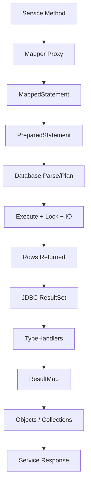
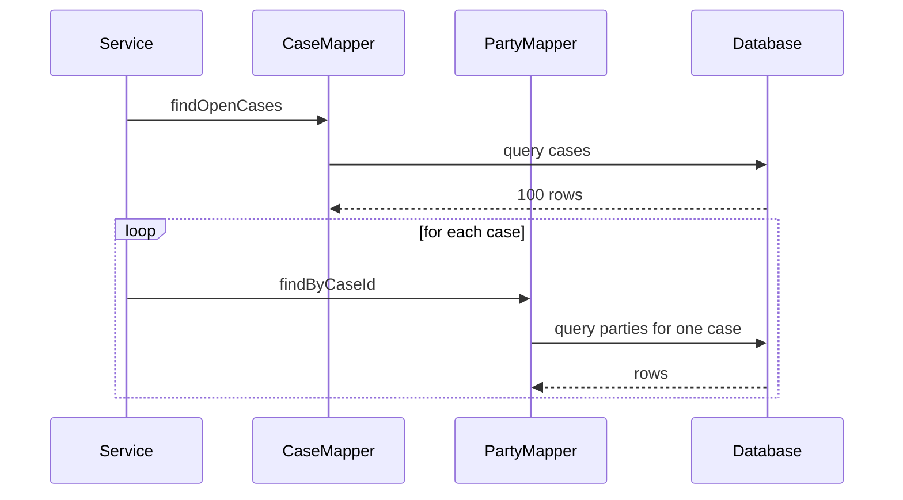
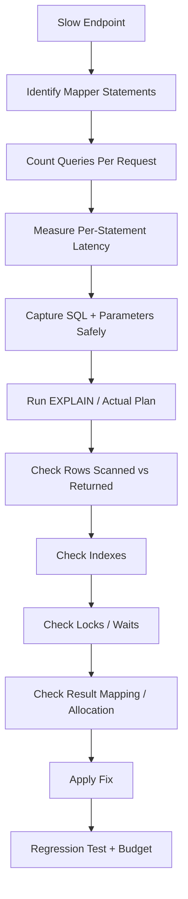

------
title: Learn Java MyBatis - Part 020
description: Production performance model for MyBatis applications, including query cost, mapper execution cost, N+1 detection, pagination, fetch size, result mapping overhead, index-aware review, slow-query triage, and performance budgets.
series: learn-java-mybatis
seriesTitle: Learn Java MyBatis, Patterns, Anti-Patterns, and Production Persistence Mapping
order: 20
partTitle: Performance Model and Query Cost Control
tags:
  - java
  - mybatis
  - performance
  - sql
  - query-optimization
  - observability
  - production
  - architecture
date: 2026-06-28
------

# Part 020 — Performance Model and Query Cost Control

This part is about understanding where MyBatis performance comes from, where it disappears, and how to control it in production.

MyBatis is often described as "fast" because it does not do the same level of automatic dirty checking, persistence context management, lazy proxy orchestration, and object graph synchronization associated with full ORM frameworks.

That statement is incomplete.

MyBatis does not make bad SQL fast. It does not make missing indexes harmless. It does not make large result sets cheap. It does not prevent N+1 queries by default. It does not automatically choose safe pagination. It does not protect you from result mapping explosions.

The real performance model is:

> MyBatis performance is mostly SQL performance plus mapping cost plus data transfer cost plus application allocation cost plus transaction/connection behavior.

A top-tier engineer does not ask, "Is MyBatis fast?".

A top-tier engineer asks:

- What SQL does this mapper execute?
- How many rows does it scan?
- How many rows does it return?
- How many queries does the use case execute?
- How much data crosses the network?
- How expensive is object reconstruction?
- What indexes support the predicates and ordering?
- What is the p95/p99 latency under realistic data volume?
- What happens when tenant size grows by 10x?

---

## 1. Kaufman Skill Slice

### Target Skill

After this part, you should be able to:

1. build a cost model for a MyBatis mapper method,
2. detect N+1 and row explosion problems,
3. choose between join, nested select, split query, and projection,
4. design pagination that remains stable under growth,
5. review dynamic SQL for index and plan stability,
6. set mapper-level performance budgets,
7. instrument mapper execution for production diagnostics,
8. triage slow MyBatis queries from symptom to root cause.

### Subskills

| Subskill | Production Value |
|---|---|
| Query cost modeling | Prevents treating mapper calls as free. |
| Result size control | Avoids memory and network blowups. |
| Mapping cost awareness | Prevents object graph reconstruction from dominating latency. |
| N+1 detection | Prevents query count growing with result count. |
| Pagination strategy | Prevents slow late-page queries and unstable results. |
| Index-aware mapper review | Keeps SQL aligned with physical database design. |
| Observability | Makes slow statements diagnosable in production. |
| Performance budgeting | Makes performance an engineering contract. |

---

## 2. The MyBatis Performance Equation

For one mapper method:

```text
Total Latency =
    connection acquisition
  + transaction overhead
  + SQL parse/plan/execute time
  + lock wait time
  + disk/cache IO
  + network transfer
  + JDBC result iteration
  + TypeHandler conversion
  + ResultMap/object construction
  + collection assembly
  + application post-processing
```

For a use case:

```text
Use Case Latency =
    sum(mapper call latencies)
  + dependency latency
  + serialization latency
  + queueing/contention
```

MyBatis gives direct control over SQL and mapping. It does not remove the rest of the cost equation.



Performance tuning can happen at any stage, but the biggest wins usually come from reducing unnecessary rows, unnecessary queries, and unnecessary object graphs.

---

## 3. Mapper Method as a Performance Contract

Every mapper method should have an implicit or explicit cost contract.

Example:

```java
Optional<CaseDetailRow> findDetail(TenantId tenantId, CaseId caseId);
```

Expected cost:

```text
query count: 1 to 3 depending on object graph strategy
result rows: bounded by case detail shape
latency budget: p95 < 50ms under normal load
index requirement: (tenant_id, case_id)
cardinality: exactly 0 or 1 logical case
```

Another example:

```java
List<CaseQueueRow> searchQueue(TenantScopedCaseQueueCriteria criteria);
```

Expected cost:

```text
query count: 1 list query + optional count query
result rows: bounded by page.limit, max 200
latency budget: p95 < 150ms for first page
index requirement: tenant + queue/status/due_at/order columns
cardinality: many, but bounded by pagination
sort: deterministic
```

A mapper without a cost contract becomes a production surprise.

---

## 4. Query Count Problems

### 4.1 The Obvious N+1

Bad pattern:

```java
List<CaseRow> cases = caseMapper.findOpenCases(tenantId);
for (CaseRow c : cases) {
    List<PartyRow> parties = partyMapper.findByCaseId(tenantId, c.caseId());
    c.attachParties(parties);
}
```

If `findOpenCases` returns 100 cases, this executes 101 queries.



N+1 is not just a latency problem. It also creates:

- connection pool pressure,
- database CPU overhead,
- lock duration variance,
- noisy logs,
- transaction duration growth,
- high p99 latency.

### 4.2 The Hidden N+1 via Nested Select

MyBatis supports nested select mapping for associations and collections. It can be useful, but it can also hide N+1 behavior in `ResultMap`.

Example smell:

```xml
<collection property="parties"
            column="case_id"
            select="findPartiesByCaseId" />
```

When the parent query returns many cases, MyBatis may execute child selects per parent.

This can be acceptable when:

- parent row count is always tiny,
- child data is rarely needed and lazy loading is controlled,
- use case is internal/non-latency-sensitive,
- query count is measured and bounded.

It is risky when:

- parent row count is user-controlled,
- parent list is paginated but page size is large,
- child collection can be large,
- nested select is hidden from service-level review,
- production metrics do not count statements per request.

### 4.3 Batch Child Loading Pattern

Instead of N+1:

```java
List<CaseRow> cases = caseMapper.searchCases(criteria);
Set<CaseId> caseIds = cases.stream()
    .map(CaseRow::caseId)
    .collect(toSet());

List<PartyRow> parties = partyMapper.findByTenantAndCaseIds(tenantId, caseIds);
return CaseAssembler.attachParties(cases, parties);
```

Mapper SQL:

```xml
<select id="findByTenantAndCaseIds" resultMap="PartyRowMap">
  SELECT
      p.tenant_id,
      p.case_id,
      p.party_id,
      p.party_role,
      p.display_name
  FROM case_party p
  WHERE p.tenant_id = #{tenantId}
    AND p.case_id IN
    <foreach collection="caseIds" item="caseId" open="(" separator="," close=")">
      #{caseId}
    </foreach>
  ORDER BY p.case_id, p.party_role, p.party_id
</select>
```

This turns `1 + N` into `2` queries.

But it introduces a new concern: large `IN` lists. Always bound page size and consider chunking when needed.

---

## 5. Row Explosion Problems

Joining parent and child tables can avoid N+1, but it can multiply rows.

Example:

```text
case has 5 parties
case has 4 allegations
case has 3 evidence items

naive join rows = 5 * 4 * 3 = 60 rows for one case
```

SQL:

```sql
SELECT ...
FROM enforcement_case c
LEFT JOIN case_party p ON p.case_id = c.case_id
LEFT JOIN allegation a ON a.case_id = c.case_id
LEFT JOIN evidence e ON e.case_id = c.case_id
WHERE c.case_id = ?
```

This can produce Cartesian multiplication across independent child collections.

### Better Options

#### Option 1: Join One Collection Only

Use a join for the most important child collection, then load others separately.

```text
query 1: case + parties
query 2: allegations by case id
query 3: evidence by case id
```

#### Option 2: Detail Header + Separate Collections

```text
query 1: case detail header
query 2: parties
query 3: allegations
query 4: evidence
```

This is more queries, but each query is simple and row-bounded.

#### Option 3: Purpose-Specific Projection

For a screen that only needs counts:

```sql
SELECT
    c.case_id,
    c.title,
    c.status,
    party_counts.party_count,
    allegation_counts.allegation_count
FROM enforcement_case c
LEFT JOIN (
    SELECT tenant_id, case_id, count(*) AS party_count
    FROM case_party
    WHERE tenant_id = #{tenantId}
    GROUP BY tenant_id, case_id
) party_counts
  ON party_counts.tenant_id = c.tenant_id
 AND party_counts.case_id = c.case_id
LEFT JOIN (
    SELECT tenant_id, case_id, count(*) AS allegation_count
    FROM allegation
    WHERE tenant_id = #{tenantId}
    GROUP BY tenant_id, case_id
) allegation_counts
  ON allegation_counts.tenant_id = c.tenant_id
 AND allegation_counts.case_id = c.case_id
WHERE c.tenant_id = #{tenantId}
  AND c.case_id = #{caseId}
```

Do not reconstruct a full object graph to display counts.

---

## 6. Result Mapping Cost

`ResultMap` is powerful. It is not free.

Mapping cost comes from:

- reading each column from `ResultSet`,
- TypeHandler conversion,
- object construction,
- reflection or constructor invocation,
- collection initialization,
- duplicate parent detection for nested results,
- nested association/collection assembly,
- memory allocation,
- garbage collection pressure.

A simple projection:

```java
public record CaseQueueRow(
    CaseId caseId,
    String title,
    CaseStatus status,
    Instant dueAt
) {}
```

is cheaper than reconstructing:

```java
CaseAggregate
  -> parties
  -> allegations
  -> evidence
  -> audit events
  -> assignments
```

The rule:

> Map the shape the use case needs, not the shape the domain model happens to have.

### Mapping Smell

A list screen uses a `CaseAggregateResultMap`.

Bad:

```xml
<select id="searchQueue" resultMap="CaseAggregateMap">
  ... many joins ...
</select>
```

Better:

```xml
<select id="searchQueue" resultMap="CaseQueueRowMap">
  SELECT c.case_id, c.title, c.status, c.priority, c.due_at
  FROM enforcement_case c
  WHERE c.tenant_id = #{tenantId}
  ORDER BY c.priority DESC, c.due_at ASC, c.case_id ASC
  LIMIT #{limit}
</select>
```

Use aggregate mapping only when the use case requires aggregate behavior.

---

## 7. Column Selection Discipline

`SELECT *` is not a harmless shortcut.

Problems:

- transfers unused columns,
- breaks when column names conflict in joins,
- makes projection contract implicit,
- increases result set metadata work,
- can accidentally include large text/blob/json columns,
- makes review harder.

Bad:

```xml
<select id="findDetail" resultMap="CaseMap">
  SELECT *
  FROM enforcement_case
  WHERE tenant_id = #{tenantId}
    AND case_id = #{caseId}
</select>
```

Good:

```xml
<select id="findDetail" resultMap="CaseMap">
  SELECT
      c.tenant_id,
      c.case_id,
      c.case_number,
      c.status,
      c.title,
      c.priority,
      c.opened_at,
      c.updated_at,
      c.version
  FROM enforcement_case c
  WHERE c.tenant_id = #{tenantId}
    AND c.case_id = #{caseId}
</select>
```

For tables with large payloads:

```text
case_summary query -> excludes long_description, raw_payload, document_blob
case_detail query  -> includes long_description only when needed
document query     -> streams/downloads blob separately
```

A small query shape is a performance feature.

---

## 8. Pagination Cost Control

### 8.1 Offset Pagination

Typical offset pagination:

```sql
SELECT c.case_id, c.title, c.status, c.updated_at
FROM enforcement_case c
WHERE c.tenant_id = ?
ORDER BY c.updated_at DESC, c.case_id DESC
LIMIT 50 OFFSET 10000
```

Problems:

- late pages can be expensive,
- database may scan/skip many rows,
- concurrent inserts can shift results,
- unstable ordering can duplicate or miss rows.

Use offset pagination when:

- page numbers are required,
- result set is not huge,
- user rarely goes to deep pages,
- good composite indexes support filters and order,
- stable deterministic order is enforced.

Mandatory rule:

```text
ORDER BY must be deterministic.
```

Bad:

```sql
ORDER BY updated_at DESC
```

Good:

```sql
ORDER BY updated_at DESC, case_id DESC
```

Add a unique tie-breaker.

### 8.2 Keyset/Cursor Pagination

Keyset pagination uses the last row from the previous page:

```sql
SELECT c.case_id, c.title, c.status, c.updated_at
FROM enforcement_case c
WHERE c.tenant_id = #{tenantId}
  AND (
       c.updated_at &lt; #{cursor.updatedAt}
       OR (c.updated_at = #{cursor.updatedAt} AND c.case_id &lt; #{cursor.caseId})
  )
ORDER BY c.updated_at DESC, c.case_id DESC
LIMIT #{limit}
```

Use keyset pagination when:

- users scroll forward,
- deep pagination matters,
- data volume is large,
- stable latency matters,
- exact page number is not required.

Expose cursor as an opaque token at API boundary, not raw SQL values.

### 8.3 Count Query Cost

A list screen often runs:

```text
query 1: page rows
query 2: total count
```

The count query can be more expensive than the page query.

Options:

| Approach | Use When |
|---|---|
| Exact count | User needs exact total and filters are cheap. |
| Approximate count | Dashboard/reporting tolerance allows estimate. |
| Count only first page | Product can avoid deep total display. |
| No count | Infinite scroll / cursor UX. |
| Cached count | Data changes slowly or correctness tolerance exists. |

Do not add count query automatically to every search endpoint.

---

## 9. Index-Aware Mapper Review

A mapper query is not production-ready until you can name the expected index.

Example query:

```sql
SELECT c.case_id, c.title, c.status, c.due_at
FROM enforcement_case c
WHERE c.tenant_id = ?
  AND c.status IN (?, ?)
  AND c.assigned_queue_id = ?
ORDER BY c.due_at ASC, c.case_id ASC
LIMIT 50
```

Possible index:

```sql
CREATE INDEX ix_case_queue_status_due
ON enforcement_case (
    tenant_id,
    assigned_queue_id,
    status,
    due_at,
    case_id
);
```

The exact index depends on database optimizer, cardinality, and workload, but the mapper review should still ask:

- Which predicates are equality?
- Which predicates are range?
- Which columns are used for sorting?
- Is tenant id leading where appropriate?
- Is the index too wide?
- Does it support the most common query path?
- Does a different filter combination need a different index?
- Will this index slow writes too much?

### Query Matrix

For complex search screens, build a query matrix:

| Use Case | Filters | Sort | Expected Index | Max Rows | Budget |
|---|---|---|---|---:|---:|
| Queue first page | tenant, queue, status | due_at asc | ix_case_queue_status_due | 50 | 150ms |
| My assigned cases | tenant, owner, status | updated_at desc | ix_case_owner_status_updated | 50 | 100ms |
| Case number lookup | tenant, case_number | none | uq_case_tenant_number | 1 | 30ms |
| SLA breach report | tenant, due_at range, status | due_at asc | ix_case_tenant_due_status | 1000 | 2s async |

This turns performance into a reviewable artifact.

---

## 10. Dynamic SQL and Plan Stability

Dynamic SQL can produce many SQL shapes.

Example filters:

```text
status optional
queue optional
owner optional
dueBefore optional
keyword optional
priority optional
```

This can create many predicate combinations. Some combinations are index-friendly. Others are table scans.

### Normalize Criteria

Do not allow arbitrary filter chaos.

```java
public record CaseSearchCriteria(
    TenantId tenantId,
    Set<CaseStatus> statuses,
    QueueId queueId,
    UserId ownerId,
    Instant dueBefore,
    String keyword,
    SortKey sort,
    PageRequest page
) {
    public CaseSearchCriteria {
        Objects.requireNonNull(tenantId);
        Objects.requireNonNull(page);
        page.validateMaxLimit(200);
        keyword = normalizeKeyword(keyword);
    }
}
```

### Reject Expensive Combinations

Example rule:

```text
keyword search requires at least tenant + status or tenant + date range
```

or:

```text
unbounded keyword search must use dedicated search index, not OLTP table scan
```

### Split Queries by Access Path

Instead of one mega dynamic query, use multiple mapper methods:

```java
List<CaseSearchRow> searchByQueue(CaseQueueCriteria criteria);
List<CaseSearchRow> searchByOwner(CaseOwnerCriteria criteria);
List<CaseSearchRow> searchByCaseNumber(CaseNumberCriteria criteria);
List<CaseSearchRow> searchByKeyword(CaseKeywordCriteria criteria);
```

This makes index and cost contracts clearer.

---

## 11. Fetch Size and Large Result Sets

Large exports and reports need special treatment.

Bad:

```java
List<CaseExportRow> rows = exportMapper.exportAll(criteria);
```

This loads all rows into memory.

Better options:

1. database-side cursor/streaming where supported,
2. chunked keyset pagination,
3. asynchronous export job,
4. write directly to file/object storage,
5. separate reporting database.

MyBatis `select` statements support attributes such as `fetchSize`, `timeout`, and `resultSetType` in mapper XML. These are hints/settings passed through JDBC behavior and database driver capabilities.

Example:

```xml
<select id="streamExportRows"
        resultMap="CaseExportRowMap"
        fetchSize="1000"
        resultSetType="FORWARD_ONLY">
  SELECT
      c.case_id,
      c.case_number,
      c.status,
      c.title,
      c.updated_at
  FROM enforcement_case c
  WHERE c.tenant_id = #{tenantId}
    AND c.updated_at &gt;= #{from}
    AND c.updated_at &lt; #{to}
  ORDER BY c.updated_at ASC, c.case_id ASC
</select>
```

Do not assume `fetchSize` behaves the same across all JDBC drivers and databases. Validate with the actual driver and database.

### Export Rule

Interactive request path:

```text
small bounded pages only
```

Export path:

```text
async job + streaming/chunking + file output + progress tracking
```

Do not let a UI button run an unbounded mapper list into application memory.

---

## 12. Statement Timeout

A mapper method should not be allowed to run forever.

MyBatis can configure statement timeout globally or per statement.

Example:

```xml
<select id="searchQueue"
        resultMap="CaseQueueRowMap"
        timeout="5">
  SELECT ...
</select>
```

Use timeouts according to use case:

| Use Case | Timeout Style |
|---|---|
| ID lookup | Very short. |
| Queue page | Short. |
| Dashboard | Moderate or async. |
| Export | Long but async and controlled. |
| Maintenance job | Long, monitored, cancellable. |

A timeout is not a fix for bad SQL. It is a blast-radius limiter.

---

## 13. Executor Type and Prepared Statement Reuse

MyBatis supports executor types:

- `SIMPLE`: creates a new statement for each execution,
- `REUSE`: reuses prepared statements,
- `BATCH`: batches update statements.

Use `REUSE` carefully when repeated statement execution benefits from reuse and resource behavior is understood.

Use `BATCH` for write batching, not for ordinary request reads.

Do not globally set `BATCH` in a normal web application without understanding flush behavior and transaction semantics.

Performance configuration must be use-case-specific, not fashionable.

---

## 14. Local Cache and Query Consistency

MyBatis has a local session cache. It can reduce repeated queries in the same session and helps with circular references in nested mapping.

The performance benefit can be useful, but local cache can surprise engineers who expect every mapper call to hit the database.

Consider this conceptual flow:

```java
CaseRow before = mapper.findById(tenantId, caseId).orElseThrow();
externalJdbcTemplate.update("update enforcement_case set status = 'CLOSED' where ...");
CaseRow after = mapper.findById(tenantId, caseId).orElseThrow();
```

Depending on session scope and cache behavior, the second query might not behave the way a naive reader expects.

In Spring-managed request/service code, understand the session/transaction boundary before relying on local cache behavior.

For correctness-sensitive flows, prefer clear transaction boundaries and avoid mixing MyBatis with external data access operations in the same logical unit without knowing cache behavior.

---

## 15. Second-Level Cache: Performance vs Correctness

MyBatis supports namespace-level second-level cache. It can improve repeated read performance, but it is dangerous for rapidly changing or correctness-sensitive data.

Good candidates:

- stable reference data,
- status code metadata,
- country/region definitions,
- rarely changing configuration,
- small lookup tables.

Bad candidates:

- enforcement case status,
- assignment queues,
- SLA timers,
- access-control-sensitive data,
- tenant-specific mutable data,
- financial/regulatory decision data.

Before enabling mapper cache, answer:

- Who invalidates it?
- What statements flush it?
- What is the stale-data tolerance?
- Is data tenant-specific?
- Is data authorization-specific?
- How will stale cache be detected?
- Does the performance win justify the correctness risk?

Most production systems should use MyBatis second-level cache sparingly.

Application-level cache with explicit keys, TTL, invalidation, and metrics is often easier to reason about.

---

## 16. Slow Query Triage Workflow

When a MyBatis endpoint is slow, do not guess.

Use a structured workflow.



### Step 1: Identify Mapper Statements

Log or trace:

```text
CaseMapper.searchQueue
CaseMapper.countQueue
PartyMapper.findByTenantAndCaseIds
```

### Step 2: Count Queries Per Request

If an endpoint executes 200 queries, no single query plan may look terrible, but the use case is still slow.

### Step 3: Measure Per Statement

Capture p50/p95/p99 by mapper statement id.

### Step 4: Explain Plan

Use the database's actual plan tooling. Estimated plan is useful, but actual rows scanned and timing are better where available.

### Step 5: Fix the Right Layer

Common fixes:

| Symptom | Likely Fix |
|---|---|
| Many queries | Batch child loading or join/projection. |
| Many rows scanned | Better predicate/index/query shape. |
| Many rows returned | Pagination/projection/filtering. |
| Large payload | Remove large columns or stream export. |
| Slow deep page | Keyset pagination. |
| Lock wait | Transaction redesign/index/update order. |
| CPU in app | Simpler `ResultMap`/projection/object shape. |
| GC pressure | Reduce result size/allocation. |

---

## 17. Mapper-Level Metrics

At minimum, collect metrics by:

```text
mapper namespace
statement id
datasource
success/failure
duration
row count if available
affected rows for writes
```

Useful metrics:

```text
mybatis.statement.duration{mapper="CaseMapper", statement="searchQueue"}
mybatis.statement.count{mapper="CaseMapper", statement="searchQueue"}
mybatis.statement.rows{mapper="CaseMapper", statement="searchQueue"}
mybatis.statement.error{mapper="CaseMapper", statement="transitionStatus"}
```

Alert examples:

```text
CaseMapper.searchQueue p95 > 300ms for 10 minutes
CaseMapper.searchQueue rows > configured page limit
CaseMapper.transitionStatus affectedRows=0 spike
Mapper statements per request > 50
Export query running in interactive request path
```

You cannot optimize what you cannot see.

---

## 18. SQL Logging Without Leaking Data

SQL logging helps performance diagnostics. It can also leak sensitive data.

Safe logging strategy:

- log mapper statement id,
- log normalized/fingerprinted SQL,
- log duration,
- log row count,
- log datasource/tenant hash,
- avoid raw PII parameters by default,
- sample high-volume logs,
- allow temporary secure diagnostic mode with approval.

Bad log:

```text
SELECT * FROM party WHERE national_id = '1234567890'
```

Better log:

```json
{
  "statement": "PartyMapper.findByNationalId",
  "sqlFingerprint": "select party by tenant and national id",
  "durationMs": 18,
  "tenantHash": "t_9d1a",
  "rowCount": 1
}
```

Performance observability must not violate privacy or regulatory controls.

---

## 19. Performance Budgeting

A performance budget is a contract that says what is acceptable.

Example budget for an enforcement case API:

| Operation | Query Count | Rows Returned | p95 Budget | Notes |
|---|---:|---:|---:|---|
| Get case header | 1 | 0-1 | 30ms | Indexed by tenant + case id. |
| Get case detail | 3-5 | bounded | 100ms | Split child collections. |
| Search queue | 1-2 | <= 100 | 150ms | Count optional. |
| Transition status | 1 update + 1 audit insert | affected 1 | 80ms | Check affected rows. |
| Export cases | chunked | many | async | Not interactive. |
| Dashboard metrics | precomputed | small | 200ms | Avoid OLTP scan. |

Budgets should be tested with realistic data.

Do not benchmark against empty development databases and call it done.

---

## 20. Test Strategies for Performance Safety

### 20.1 Query Count Tests

Use instrumentation to assert statement count for critical use cases.

Example intent:

```java
@Test
void caseDetailDoesNotUseNPlusOneQueries() {
    queryCounter.reset();

    caseDetailService.getDetail(TENANT, CASE_ID);

    assertThat(queryCounter.countForRequest()).isLessThanOrEqualTo(5);
}
```

### 20.2 SQL Shape Snapshot Tests

For dynamic SQL, render representative criteria and snapshot SQL shape.

Check:

- tenant predicate present,
- expected filters present,
- no accidental `SELECT *`,
- deterministic order,
- limit present,
- no unsafe interpolation.

### 20.3 Realistic Data Tests

Seed enough rows to expose plan behavior:

```text
1 tenant with 10 rows is not enough.
Use at least:
  - many tenants,
  - one large tenant,
  - skewed statuses,
  - old and new rows,
  - realistic child collection sizes.
```

### 20.4 Explain Plan Checks

For critical queries, store expected plan characteristics, not exact fragile plan output.

Example:

```text
must use index on tenant_id + queue_id + status + due_at
must not sequential scan enforcement_case for normal queue query
must return first page within budget on realistic dataset
```

---

## 21. Common Performance Anti-Patterns

### 21.1 Mapper Call in Loop

```java
for (CaseId id : ids) {
    mapper.findById(tenantId, id);
}
```

Use batch lookup.

### 21.2 ResultMap Monster

One result map reconstructs everything for every use case.

Use query-specific projections.

### 21.3 Unbounded List Return

```java
List<CaseRow> findAllOpenCases(TenantId tenantId);
```

Require limit, cursor, or async export.

### 21.4 `SELECT *`

Explicit columns only.

### 21.5 Deep Offset Pagination

Use keyset/cursor when deep navigation matters.

### 21.6 Optional Filter Table Scan

Dynamic SQL allows expensive combinations. Normalize and reject unsafe criteria.

### 21.7 Count Everything

Exact count may be expensive. Make it product-aware.

### 21.8 Large JSON/BLOB in List Query

Split summary and payload queries.

### 21.9 Cache as Band-Aid

Do not cache broken SQL before fixing query shape and indexes.

### 21.10 Missing Statement Timeout

Timeout is not optimization, but it limits incidents.

---

## 22. Production Example: Queue Search Optimization

### Initial Mapper

```xml
<select id="searchCases" resultMap="CaseAggregateMap">
  SELECT *
  FROM enforcement_case c
  LEFT JOIN case_party p ON p.case_id = c.case_id
  LEFT JOIN allegation a ON a.case_id = c.case_id
  WHERE c.tenant_id = #{tenantId}
  <if test="status != null">
    AND c.status = #{status}
  </if>
  ORDER BY c.updated_at DESC
</select>
```

Problems:

- `SELECT *`,
- aggregate map for list screen,
- joins multiply rows,
- no limit,
- unstable order,
- status optional may produce large scan,
- no queue-specific index contract.

### Refactored Mapper

```xml
<select id="searchQueue" resultMap="CaseQueueRowMap" timeout="3">
  SELECT
      c.case_id,
      c.case_number,
      c.title,
      c.status,
      c.priority,
      c.due_at,
      c.updated_at
  FROM enforcement_case c
  WHERE c.tenant_id = #{tenantId}
    AND c.assigned_queue_id = #{queueId}
  <if test="statuses != null and statuses.size() > 0">
    AND c.status IN
    <foreach collection="statuses" item="status" open="(" separator="," close=")">
      #{status}
    </foreach>
  </if>
  <if test="dueBefore != null">
    AND c.due_at &lt; #{dueBefore}
  </if>
  ORDER BY c.priority DESC, c.due_at ASC, c.case_id ASC
  LIMIT #{page.limit}
</select>
```

Possible supporting index:

```sql
CREATE INDEX ix_case_queue_worklist
ON enforcement_case (
    tenant_id,
    assigned_queue_id,
    status,
    priority DESC,
    due_at ASC,
    case_id ASC
);
```

Service-level contract:

```java
public List<CaseQueueRow> searchQueue(TenantScopedCaseQueueCriteria criteria) {
    criteria.page().validateMaxLimit(100);
    return caseQueueMapper.searchQueue(criteria);
}
```

Budget:

```text
query count: 1
max rows: 100
p95: 150ms
statement timeout: 3s
must include tenant and queue predicates
```

---

## 23. Performance Review Checklist

Before approving a mapper change, ask:

- [ ] Does the query select only needed columns?
- [ ] Is the result shape appropriate for the use case?
- [ ] Is the row count bounded?
- [ ] Is pagination deterministic?
- [ ] Is deep pagination handled intentionally?
- [ ] Is there an expected index?
- [ ] Are optional filters normalized?
- [ ] Can dynamic SQL produce an unbounded scan?
- [ ] Are tenant predicates mandatory?
- [ ] Are large text/json/blob columns excluded from list queries?
- [ ] Does the query avoid hidden N+1 behavior?
- [ ] Does the mapper avoid row explosion from multiple collections?
- [ ] Is statement timeout set where appropriate?
- [ ] Are count queries necessary and bounded?
- [ ] Is the query observable by mapper statement id?
- [ ] Is there a performance regression test for critical paths?

---

## 24. Deliberate Practice

### Exercise 1: Cost Model a Mapper

Pick one mapper method and write:

```text
query count:
rows scanned:
rows returned:
columns returned:
object shape:
expected index:
latency budget:
failure mode under 10x data:
```

If you cannot answer, the mapper is not understood.

### Exercise 2: Find an N+1

Search your service code for mapper calls inside loops. For one example, refactor to batch loading or query-specific join.

### Exercise 3: Remove One `SELECT *`

Find one mapper using `SELECT *`. Replace it with explicit columns and a query-specific projection.

### Exercise 4: Pagination Audit

Find one paginated query. Verify:

```text
limit exists
max limit is enforced
order is deterministic
index supports order
count query is justified
```

### Exercise 5: Explain Plan Review

Run an explain plan for one important mapper query on realistic data. Document:

```text
chosen index:
rows estimated:
rows actual:
scan type:
sort method:
join strategy:
slowest node:
fix if needed:
```

---

## 25. Summary

MyBatis performance is not magic.

It is the consequence of explicit SQL, bounded result shapes, appropriate indexes, controlled mapping, and observable runtime behavior.

The production-grade rules are:

1. know the cost contract of every important mapper method,
2. avoid mapper calls in loops unless bounded and intentional,
3. avoid reconstructing aggregates for list screens,
4. avoid multiple independent child joins that cause row explosion,
5. use deterministic and bounded pagination,
6. design dynamic SQL around known access paths,
7. use fetch size and streaming only after validating driver behavior,
8. set timeouts to limit blast radius,
9. treat cache as a correctness trade-off, not a default optimization,
10. instrument mapper statement latency and query count.

The mental model:

> A mapper method is not just Java calling SQL. It is a performance contract between the application, the database optimizer, the network, the JVM, and production operations.
