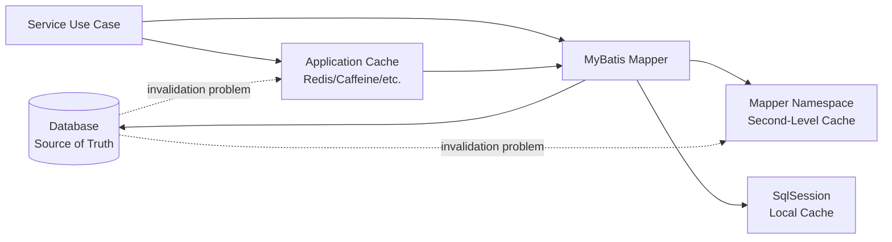
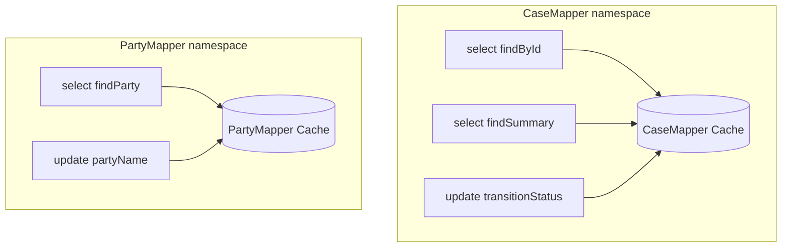
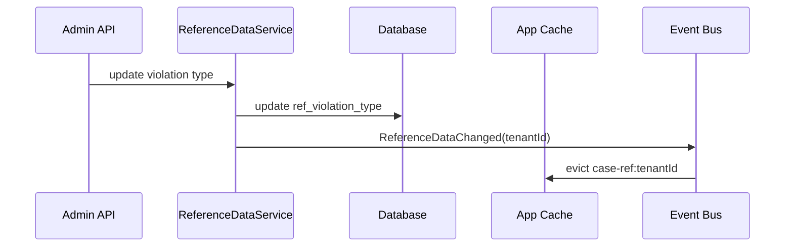
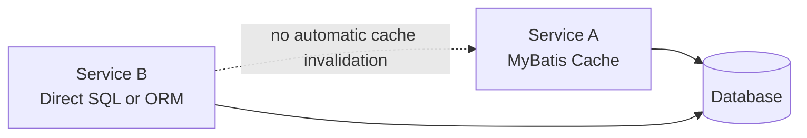

------
title: Learn Java MyBatis - Part 021
description: Production-grade caching model for MyBatis applications, covering first-level local cache, second-level namespace cache, statement cache attributes, cache invalidation, cache correctness, application cache boundaries, and regulatory-grade data freshness.
series: learn-java-mybatis
seriesTitle: Learn Java MyBatis, Patterns, Anti-Patterns, and Production Persistence Mapping
order: 21
partTitle: Caching: First-Level, Second-Level, and Application Cache
tags:
  - java
  - mybatis
  - caching
  - performance
  - consistency
  - sql
  - production
  - architecture
date: 2026-06-28
------

# Part 021 — Caching: First-Level, Second-Level, and Application Cache

Caching is one of the easiest places to create a system that is fast, wrong, and difficult to debug.

In MyBatis, caching is not a single feature. It is a stack of different mechanisms with different scopes, invalidation rules, and correctness risks:

1. **local first-level cache** inside a `SqlSession`,
2. **second-level mapper namespace cache** configured in mapper XML,
3. **application-level cache** such as Caffeine, Redis, Hazelcast, or a domain-specific read-through cache,
4. **database-level cache** such as buffer cache, plan cache, materialized views, or result cache features in some databases,
5. **HTTP/API cache** if the data is served through external interfaces.

This part focuses on MyBatis-level and application-level cache decisions.

The key principle:

> A cache is not an optimization until you can state its owner, scope, invalidation trigger, freshness guarantee, and failure behavior.

In regulatory systems, enforcement workflows, financial systems, case management, entitlement systems, or audit-heavy domains, stale data is not merely a performance trade-off. It can become a correctness, legal, or operational risk.

---

## 1. Kaufman Skill Slice

### Target Skill

After this part, you should be able to:

1. distinguish MyBatis first-level cache from second-level cache,
2. explain what `localCacheScope` changes,
3. decide whether a mapper query should use second-level cache,
4. reason about `useCache` and `flushCache`,
5. avoid stale read and cross-boundary invalidation bugs,
6. design application caches outside MyBatis where correctness demands explicit policy,
7. review cache configuration for production readiness,
8. debug cache-related data inconsistencies.

### Subskills

| Subskill | Why It Matters |
|---|---|
| Scope reasoning | Prevents assuming a cache is global when it is session-local. |
| Invalidation modeling | Prevents stale reads after writes. |
| Namespace awareness | Prevents mapper-level cache isolation surprises. |
| Object mutability discipline | Prevents cached object mutation corrupting future reads. |
| Transaction visibility reasoning | Prevents reading data with the wrong freshness expectation. |
| Application cache design | Moves business freshness rules to a visible layer. |
| Observability | Makes cache behavior diagnosable. |
| Regulatory correctness | Ensures cache does not hide state transitions or audit-relevant facts. |

### Deliberate Practice Goal

By the end of this part, you should be able to review a mapper cache configuration and answer:

- What data can become stale?
- What operation invalidates it?
- Is stale data acceptable?
- Who owns the freshness contract?
- Can we prove the behavior in tests?

---

## 2. Mental Model: Cache as a Consistency Boundary

A cache is a derived copy of truth.

The database is usually the system of record. A cache is a performance-oriented view of database state. That means cache design is part of consistency design.



The essential danger is not that cache exists. The danger is that a cache hides data movement.

A mapper method looks like this:

```java
CaseSummary summary = caseMapper.findSummary(caseId);
```

But the actual question is:

```text
Did this value come from the current database state,
from this transaction's local session cache,
from a mapper namespace cache,
from a Redis cache,
or from a stale snapshot built earlier?
```

A production engineer treats every cached read as a contract.

---

## 3. MyBatis First-Level Cache

MyBatis has a local cache associated with a `SqlSession`.

Its purpose is mainly to:

1. reduce repeated query work within the same session,
2. support nested result/nested select scenarios,
3. prevent circular reference problems in complex mappings.

The important property:

> First-level cache is scoped to a `SqlSession`, not to the whole application.

In Spring applications using MyBatis-Spring, mapper calls usually participate in a Spring-managed `SqlSession` bound to the current transaction. This means the visible lifetime of the local cache is strongly related to the transaction/session lifecycle described in Part 017.

### 3.1 Default Local Cache Scope

The relevant setting is:

```xml
<settings>
  <setting name="localCacheScope" value="SESSION"/>
</settings>
```

Common values:

| Value | Meaning |
|---|---|
| `SESSION` | Queries executed during the same `SqlSession` may reuse local cached results. |
| `STATEMENT` | Local cache is limited to statement execution; values are not shared between calls. |

`SESSION` is useful for repeated nested queries and can reduce duplicate work. But it can also surprise engineers who expect every mapper call to hit the database.

### 3.2 Example: Repeated Select in One Session

```java
@Transactional
public CaseDetail loadTwice(CaseId caseId) {
    CaseDetail first = caseMapper.findDetail(caseId);
    CaseDetail second = caseMapper.findDetail(caseId);
    return second;
}
```

With session-level local cache, the second call may not perform the same database roundtrip if MyBatis considers the mapped statement and parameters equivalent and the cache has not been cleared.

This is not a bug by itself. It is an optimization. It becomes dangerous when the engineer's mental model expects external changes to be visible immediately within the same session.

### 3.3 Local Cache and Updates

A write operation can clear local cache depending on statement behavior. Still, engineers should not rely on accidental cache clearing as a business consistency mechanism.

Bad mental model:

```text
I assume MyBatis will always know when my data is stale.
```

Better mental model:

```text
Mapper reads inside one session may be served from local cache.
If a use case requires read-your-own-write semantics or post-write re-query semantics,
I design and test that explicitly.
```

### 3.4 When to Use `STATEMENT`

`localCacheScope=STATEMENT` may be considered when:

- session-local reuse causes confusing stale reads,
- transaction methods perform external database calls outside MyBatis,
- stored procedures or triggers modify data read again in the same transaction,
- correctness is more important than repeated query optimization,
- mapper behavior must be easier to reason about.

Trade-off:

| `SESSION` | `STATEMENT` |
|---|---|
| Can reduce repeated work | Easier freshness reasoning |
| Helps nested query reuse | More database roundtrips |
| Default behavior | Less surprising in complex service orchestration |
| Can hide repeated reads | Can expose N+1 cost more clearly |

A common production recommendation is not universal. The correct choice depends on the team’s transaction model, mapper style, and debugging maturity.

---

## 4. MyBatis Second-Level Cache

Second-level cache in MyBatis is configured at mapper namespace level.

In XML, it usually begins with:

```xml
<mapper namespace="com.acme.casefile.CaseMapper">
  <cache/>

  <select id="findReferenceData" resultMap="ReferenceDataMap">
    select code, label, display_order
    from reference_status
    where active = true
    order by display_order
  </select>
</mapper>
```

This cache is not a global magic cache for all database rows. It is bound to the mapper namespace.

### 4.1 Namespace Scope



An update in `PartyMapper` does not automatically flush `CaseMapper` cache unless you design that relationship explicitly. This namespace-local behavior is a frequent source of stale cross-aggregate read models.

### 4.2 Basic Cache Configuration

A mapper cache can configure eviction behavior, flush interval, size, and read-only behavior:

```xml
<cache
  eviction="LRU"
  flushInterval="600000"
  size="512"
  readOnly="false"/>
```

The important design questions are not XML syntax. They are:

- What data is cached?
- Is it immutable enough?
- What writes invalidate it?
- Does invalidation happen in the same namespace?
- Can another service or process update the same table?
- Is stale data acceptable?
- Are cached objects mutable?
- Is the cache observable?

### 4.3 Common Eviction Strategies

| Strategy | Meaning | Use Case |
|---|---|---|
| `LRU` | Evict least recently used entries | General-purpose bounded cache |
| `FIFO` | Evict oldest inserted entries | Simple predictable expiry order |
| `SOFT` | Soft references, GC-sensitive | Rarely preferred in predictable production systems |
| `WEAK` | Weak references, aggressive GC interaction | Rarely preferred for business correctness |

In production, `LRU` with explicit size and freshness rules is usually easier to reason about than GC-sensitive strategies.

---

## 5. Statement-Level Cache Attributes

MyBatis mapped statements can control cache behavior through attributes such as `useCache` and `flushCache`.

### 5.1 Select Cache Participation

```xml
<select id="findStatusReferenceData"
        resultMap="StatusReferenceMap"
        useCache="true">
  select status_code, label, terminal
  from case_status_reference
  where active = true
  order by display_order
</select>
```

Use this only when:

- data is stable or slow-changing,
- stale read is acceptable within the chosen freshness window,
- all relevant invalidating writes are understood,
- result objects are safe to cache,
- the query does not depend on hidden context such as tenant, user role, time, locale, or request-specific authorization unless those parameters are part of the cache key.

### 5.2 Excluding a Select

```xml
<select id="findCurrentEscalationQueue"
        resultMap="EscalationQueueItemMap"
        useCache="false">
  select ...
  from case_queue
  where assignee_id = #{assigneeId}
    and state = 'OPEN'
  order by priority desc, due_at asc, case_id asc
</select>
```

Queries that should usually avoid second-level cache:

- queues,
- dashboards with live operational state,
- authorization-sensitive reads,
- tenant-sensitive reads where key design is not obvious,
- SLA timers,
- case status transition screens,
- recent activity feeds,
- audit review pages,
- lock/assignment queries,
- data used for decisions that must reflect current state.

### 5.3 Flush Behavior on Writes

```xml
<update id="transitionStatus" flushCache="true">
  update case_file
  set status = #{targetStatus},
      version = version + 1,
      updated_at = current_timestamp
  where case_id = #{caseId}
    and status = #{expectedStatus}
    and version = #{expectedVersion}
</update>
```

Write statements usually flush the namespace cache by default. But this only helps if all affected cached reads live in the same namespace.

The hard case:

```text
CaseCommandMapper.transitionStatus() updates case_file.
CaseReadModelMapper.findDashboard() caches dashboard data.
```

If these are different namespaces, flushing one namespace does not automatically flush the other.

---

## 6. Cache Key Correctness

A cache entry is safe only if its key includes every input that can affect the result.

For a mapper query, obvious inputs include:

- statement id,
- SQL text,
- bound parameters,
- pagination bounds,
- environment-specific aspects.

But business queries often have hidden inputs:

- tenant id,
- data access scope,
- user role,
- locale,
- timezone,
- feature flag,
- current date/time,
- row-level security context,
- database session variables,
- active regulatory regime,
- effective date.

### 6.1 Dangerous Query

```xml
<select id="findVisibleCases" resultMap="CaseCardMap" useCache="true">
  select c.case_id, c.case_number, c.status
  from case_file c
  where c.tenant_id = #{tenantId}
    and c.status = #{status}
</select>
```

At first glance, `tenantId` and `status` are parameters. That is good.

But if visibility also depends on user privileges stored in database session variables or application-side context that is not a query parameter, caching becomes unsafe.

Better:

```java
public record VisibleCaseCriteria(
    TenantId tenantId,
    UserId viewerId,
    Set<String> permissionCodes,
    CaseStatus status
) {}
```

Then make the visibility policy explicit either in SQL or before cache lookup.

### 6.2 Time-Dependent Queries

Bad cache candidate:

```sql
where due_at < current_timestamp
```

This query changes result over time even when table data does not change.

Better options:

1. do not cache it,
2. pass an explicit `asOf` timestamp and include it in the cache key,
3. round `asOf` to a controlled bucket if approximate freshness is acceptable,
4. materialize the state through a scheduled process.

---

## 7. Object Mutability and Cache Safety

Caching mutable objects is dangerous.

Suppose this object is returned from cache:

```java
public class CaseReferenceData {
    private List<StatusOption> statuses;

    public List<StatusOption> statuses() {
        return statuses;
    }
}
```

A caller can accidentally mutate it:

```java
referenceData.statuses().removeIf(StatusOption::deprecated);
```

Now another caller may receive a corrupted cached object.

Safer design:

```java
public record CaseReferenceData(
    List<StatusOption> statuses,
    List<PriorityOption> priorities
) {
    public CaseReferenceData {
        statuses = List.copyOf(statuses);
        priorities = List.copyOf(priorities);
    }
}
```

Cacheable objects should preferably be:

- immutable,
- detached from persistence lifecycle,
- serializable if required by cache implementation,
- not lazily loaded,
- not context-dependent,
- small enough to store safely.

---

## 8. Good Cache Candidates

### 8.1 Reference Data

```xml
<select id="findActiveViolationTypes"
        resultMap="ViolationTypeOptionMap"
        useCache="true">
  select violation_type_code,
         label,
         severity_default,
         active
  from ref_violation_type
  where active = true
  order by display_order
</select>
```

Good candidate when:

- data changes rarely,
- operational correctness tolerates short staleness,
- admin changes can trigger cache clear or deployment refresh,
- object is immutable,
- query does not depend on viewer-specific authorization.

### 8.2 Static Lookup Tables

Examples:

- country codes,
- document type definitions,
- fixed regulatory category codes,
- allowed status transition metadata,
- UI label dictionaries with deployment-based refresh.

### 8.3 Expensive Read Models with Controlled Freshness

Example:

```text
Daily compliance summary by office, generated from previous-day closed cases.
```

This is a cache candidate if the business contract says:

```text
Data is refreshed every day at 02:00 local time.
```

The point is not that it is stale. The point is that staleness is explicit and acceptable.

---

## 9. Bad Cache Candidates

### 9.1 Case Assignment Queue

```sql
select ...
from case_assignment
where assignee_id = #{userId}
  and status = 'READY'
order by priority desc, due_at asc
```

Why bad?

- queue state changes frequently,
- concurrent workers may claim items,
- stale queue can cause duplicate work,
- assignment has operational correctness implications.

### 9.2 Authorization-Sensitive Result

```sql
select ...
from case_file
where tenant_id = #{tenantId}
```

If visibility depends on role, office, delegation, conflict-of-interest constraints, or data classification, cache must include those dimensions or be avoided.

### 9.3 Transition Decision Input

```sql
select status, version, hold_flag
from case_file
where case_id = #{caseId}
```

This may be used to decide whether a transition is allowed. Use fresh read or guarded update instead.

### 9.4 Audit Trail

Audit views should favor correctness and completeness over cache optimization unless the cache is a read-only archive projection with explicit refresh semantics.

---

## 10. Application-Level Cache vs MyBatis Cache

For serious systems, application-level cache is often more appropriate than MyBatis second-level cache.

Why?

Because application cache can express business policy.

| Concern | MyBatis Second-Level Cache | Application Cache |
|---|---|---|
| Scope | Mapper namespace | Domain/use-case specific |
| Invalidation | Mapper statement driven | Business event driven |
| Visibility | Hidden behind mapper call | Explicit in service/component |
| Metrics | Limited unless wrapped/instrumented | Fully instrumentable |
| Distributed cache | Custom integration required | Natural with Redis/Caffeine/etc. |
| Policy expression | SQL-centric | Domain-centric |
| Cross-namespace invalidation | Awkward | Explicit |

### 10.1 Example: Reference Data Cache Component

```java
@Service
public class ReferenceDataService {
    private final ReferenceDataMapper mapper;
    private final Cache<String, CaseReferenceData> cache;

    public CaseReferenceData getCaseReferenceData(TenantId tenantId) {
        return cache.get("case-ref:" + tenantId.value(), key ->
            mapper.findCaseReferenceData(tenantId)
        );
    }

    public void evictCaseReferenceData(TenantId tenantId) {
        cache.invalidate("case-ref:" + tenantId.value());
    }
}
```

This makes the cache a visible design element.

### 10.2 Event-Driven Invalidation



This design is easier to reason about than hoping every mapper namespace cache flushes at the correct time.

---

## 11. Regulatory-Grade Cache Freshness Classes

In enforcement or case-management systems, not all data has the same freshness requirement.

| Freshness Class | Example | Cache Rule |
|---|---|---|
| Strong current state | case status, assignment owner, lock state | Avoid cache or use guarded write/read. |
| Decision input | violation eligibility, escalation precondition | Avoid stale cache; verify with write guard. |
| Operational dashboard | queue counts, aging buckets | Cache only with explicit refresh timestamp. |
| Reference data | status labels, type codes | Cache with clear invalidation policy. |
| Historical archive | closed case snapshot | Cache if immutable and versioned. |
| Export/report snapshot | generated report rows | Cache by snapshot id/version. |

The strongest rule:

> Never use a stale cache to decide whether a state transition is legal.

For transition legality, use guarded update:

```sql
update case_file
set status = #{targetStatus},
    version = version + 1
where case_id = #{caseId}
  and status = #{expectedStatus}
  and version = #{expectedVersion}
```

Then check affected rows.

---

## 12. Cache Invalidation Patterns

### 12.1 Write-Through Invalidation

After a successful write, evict relevant cache keys.

```java
@Transactional
public void updateReferenceData(UpdateViolationTypeCommand command) {
    int updated = referenceMapper.updateViolationType(command);
    requireOneRow(updated);

    transactionSynchronization.afterCommit(() ->
        referenceDataCache.evict(command.tenantId())
    );
}
```

Evicting after commit matters. If you evict before commit and transaction rolls back, readers may repopulate cache with old data or create confusing race behavior.

### 12.2 Time-Based Expiry

Useful for low-risk data.

```text
Cache violation type options for 10 minutes.
```

Weakness:

- stale reads are guaranteed possible,
- refresh is not linked to actual change,
- bad for correctness-sensitive workflows.

### 12.3 Versioned Cache Key

```text
case-ref:{tenantId}:v{referenceDataVersion}
```

If version changes on update, old entries naturally become unreachable.

Good for:

- reference data,
- feature configuration,
- generated read models,
- deployment-versioned data.

### 12.4 Snapshot Cache

```text
report:{reportRunId}:page:{pageNo}
```

Good for reports because the cache is tied to a known snapshot, not mutable live state.

### 12.5 Event-Based Invalidation

Use domain events:

```java
public record CaseReferenceDataChanged(
    TenantId tenantId,
    Instant changedAt
) {}
```

Then evict by tenant or by affected key.

This is stronger than TTL when freshness matters.

---

## 13. MyBatis Cache and Transactions

Cache correctness must be interpreted through transaction boundaries.

Questions to ask:

1. Is the read inside a transaction?
2. Did the transaction perform writes before the read?
3. Is the read served from local cache?
4. Is second-level cache enabled?
5. Are other transactions modifying the same table?
6. Does the database isolation level allow seeing those changes?
7. Are writes flushed to cache after commit or before commit?

### 13.1 Read-Your-Own-Write

Within one transaction:

```java
@Transactional
public CaseDetail transitionAndReload(Command command) {
    caseMapper.transitionStatus(command);
    return caseMapper.findDetail(command.caseId());
}
```

This may work, but the correct production approach is to test it with the actual transaction manager and database.

For critical workflows, prefer returning a post-command projection from a deterministic query, and ensure the write method checks affected rows.

### 13.2 External Writers

If another service updates the same table, MyBatis second-level cache in this application does not magically know that. Distributed invalidation must be designed.



This is why second-level cache is usually safer for data that only changes through the same mapper namespace or is effectively immutable.

---

## 14. Cache Observability

A production cache needs telemetry.

At minimum:

- hit count,
- miss count,
- eviction count,
- load time,
- load failure count,
- size,
- stale-data incident count,
- manual invalidation events,
- refresh timestamp,
- cache key cardinality.

For MyBatis second-level cache, observability may require wrapping cache implementations or relying on application cache instead.

### 14.1 Diagnostic Log for App Cache

```java
log.info("reference_cache_load tenantId={} durationMs={} rows={}",
    tenantId.value(), durationMs, data.statuses().size());
```

Avoid logging sensitive data. Log dimensions, not payload.

### 14.2 Operational Endpoint

Expose safe cache metadata:

```json
{
  "cacheName": "case-reference-data",
  "tenantId": "tenant-a",
  "lastRefreshAt": "2026-06-28T09:20:00Z",
  "entryCount": 1,
  "ttlSeconds": 600
}
```

Never expose raw case data from cache diagnostics.

---

## 15. Common Cache Anti-Patterns

### 15.1 Enabling Second-Level Cache Globally Without Ownership

Bad:

```xml
<settings>
  <setting name="cacheEnabled" value="true"/>
</settings>
```

Then adding `<cache/>` to mappers because performance seems poor.

Why bad?

- no freshness contract,
- no invalidation model,
- namespace boundary misunderstood,
- mutable object risk,
- inconsistent behavior across mappers.

### 15.2 Caching Operational Queues

Queues are not reference data. They are active coordination state.

### 15.3 Caching Authorization Results Without Subject in Key

A result visible to one user may not be visible to another.

### 15.4 Caching SQL That Depends on Current Time

Queries using `current_timestamp`, `now()`, current business day, or SLA windows are time-dependent. Cache only if time is explicit in the key or freshness is deliberately approximate.

### 15.5 Mutating Cached Objects

Any cached object that can be mutated by callers is a correctness hazard.

### 15.6 Cache as a Fix for Bad SQL

If the query scans 30 million rows, caching may hide the problem until eviction, deploy, cold start, or tenant growth.

Fix the query and indexes first.

### 15.7 Cross-Namespace Invalidation Assumption

Never assume an update in one mapper namespace invalidates another namespace’s cache.

### 15.8 Cache Without Tests

If cache behavior matters, test it.

---

## 16. Testing Cache Behavior

### 16.1 Test Cache Hit Behavior

Use a query counter or datasource proxy:

```java
@Test
void repeatedReferenceDataReadUsesCache() {
    mapper.findActiveViolationTypes();
    mapper.findActiveViolationTypes();

    assertThat(queryCounter.countFor("findActiveViolationTypes"))
        .isEqualTo(1);
}
```

This kind of test is useful only for known cache candidates. Do not make tests fragile by asserting cache behavior for operational queries.

### 16.2 Test Invalidation

```java
@Test
void updateInvalidatesReferenceDataCache() {
    List<ViolationType> before = mapper.findActiveViolationTypes();

    mapper.updateViolationTypeLabel("DISCLOSURE", "Disclosure Failure");

    List<ViolationType> after = mapper.findActiveViolationTypes();

    assertThat(after).extracting(ViolationType::label)
        .contains("Disclosure Failure");
}
```

### 16.3 Test Cross-Namespace Risk

Create two mappers:

```text
ReferenceReadMapper.findActiveViolationTypes()
ReferenceCommandMapper.updateViolationTypeLabel()
```

Then verify whether update invalidates read cache. If not, either:

- move statements into one namespace,
- use `<cache-ref>`,
- avoid MyBatis second-level cache,
- use application cache with explicit invalidation.

### 16.4 Test Mutation Safety

```java
@Test
void cachedReferenceDataIsImmutable() {
    CaseReferenceData data = service.getCaseReferenceData(tenantId);

    assertThatThrownBy(() -> data.statuses().add(new StatusOption("X", "X")))
        .isInstanceOf(UnsupportedOperationException.class);
}
```

---

## 17. Cache Review Checklist

Use this checklist before approving MyBatis cache usage.

### Scope

- Is the cache first-level, second-level, or application-level?
- Is the namespace boundary understood?
- Are all affected statements in the same namespace?
- Is there cross-service writing?

### Data Suitability

- Is the data stable?
- Is stale data acceptable?
- Is the object immutable?
- Is the result small enough to cache?
- Is the result authorization-sensitive?
- Is the query time-dependent?

### Invalidation

- What write invalidates the cache?
- Does invalidation happen after commit?
- Is TTL enough, or is event invalidation needed?
- What happens during failed invalidation?
- Is manual eviction possible during incident response?

### Observability

- Can we see hit/miss/eviction/load failures?
- Can we identify stale data incidents?
- Can we safely inspect cache metadata?
- Are sensitive values excluded from logs?

### Testing

- Is cache hit/miss behavior tested where important?
- Is invalidation tested?
- Is cross-namespace behavior tested?
- Is mutation safety tested?

---

## 18. Production Decision Matrix

| Situation | Recommended Approach |
|---|---|
| Small static lookup table | MyBatis second-level cache or application cache. |
| Tenant-specific reference data | Application cache keyed by tenant, with explicit invalidation. |
| Case status decision | No stale cache; use fresh read or guarded update. |
| Assignment queue | No second-level cache. |
| Dashboard counts | Cache only with visible refresh timestamp. |
| Historical immutable snapshot | Cache by snapshot/version id. |
| Report export pages | Snapshot cache. |
| Cross-service mutable table | Avoid MyBatis second-level cache unless distributed invalidation exists. |
| Need detailed metrics | Application cache. |
| Need mapper-local repeated nested select optimization | First-level local cache may be enough. |

---

## 19. Case Management Example

Assume a regulatory case system has:

- `case_file`,
- `case_assignment`,
- `case_status_history`,
- `ref_case_status`,
- `ref_violation_type`,
- `case_escalation_rule`.

### Cache Classification

| Data | Cache? | Reason |
|---|---:|---|
| `ref_case_status` | Yes | Stable reference data. |
| `ref_violation_type` | Yes | Stable but tenant/regime-aware. |
| `case_file.status` | No | Current state and transition input. |
| `case_assignment.owner_id` | No | Coordination state. |
| `case_status_history` | Usually no | Audit correctness. |
| `case_escalation_rule` | Maybe | Cache if versioned by policy version. |
| dashboard aging counts | Maybe | Cache with explicit `asOf`. |

### Better Design

```java
public record EscalationPolicySnapshot(
    TenantId tenantId,
    String policyVersion,
    List<EscalationRule> rules
) {}
```

Cache by:

```text
escalation-policy:{tenantId}:{policyVersion}
```

Do not cache by only tenant if policy can change independently.

---

## 20. Senior-Level Heuristics

1. **Prefer no cache over invisible wrong cache.**
2. **Cache reference data, not coordination state.**
3. **Make time explicit.** If a query depends on time, include `asOf` or do not cache.
4. **Make identity explicit.** Include tenant, viewer, role, locale, and policy version when they affect result.
5. **Cache immutable objects.** Mutable cached values are shared-state bugs.
6. **Avoid MyBatis second-level cache for cross-namespace read models.** Application cache is often clearer.
7. **Evict after commit.** Avoid invalidating cache for rolled-back writes.
8. **Never use cache as your consistency mechanism.** Use guarded updates, constraints, and transaction semantics.
9. **Observe cache behavior.** Unmeasured cache is operational debt.
10. **Document freshness.** A cache without a freshness statement is an implicit bug.

---

## 21. Deliberate Practice

### Exercise 1 — Classify Cache Candidates

Classify each query:

1. `findActiveViolationTypes(tenantId)`
2. `findCaseStatusForTransition(caseId)`
3. `findMyAssignmentQueue(userId)`
4. `findClosedCaseSnapshot(caseId, snapshotVersion)`
5. `findDashboardAgingCounts(tenantId)`

For each one, answer:

- cache or not,
- cache scope,
- key dimensions,
- invalidation trigger,
- acceptable staleness.

### Exercise 2 — Find Hidden Cache Inputs

Review this mapper:

```xml
<select id="findVisibleCases" resultMap="CaseCardMap" useCache="true">
  select c.case_id, c.case_number, c.status
  from case_file c
  where c.tenant_id = #{tenantId}
    and c.status = #{status}
</select>
```

List all hidden inputs that might make this cache unsafe.

Expected considerations:

- viewer identity,
- permissions,
- office assignment,
- conflict-of-interest rules,
- classification level,
- feature flag,
- current date,
- row-level security context.

### Exercise 3 — Design Explicit Application Cache

Implement a `CaseReferenceDataService` that:

1. caches reference data by tenant,
2. evicts after admin update commits,
3. exposes last refresh timestamp,
4. does not leak sensitive data in logs,
5. returns immutable objects.

---

## 22. Summary

MyBatis caching is powerful but narrow. The first-level cache is session-local and mostly a runtime optimization. The second-level cache is mapper-namespace scoped and can be useful for stable data, but it is dangerous when engineers assume it understands domain-wide invalidation.

For production systems, especially regulatory or case-management platforms, application-level caching is often safer because it makes business freshness explicit.

The senior-level mindset is:

```text
Do not ask: can I cache this query?
Ask: what correctness contract does this cached value have?
```

A cache is acceptable only when its scope, key, invalidation rule, freshness window, observability, and failure behavior are explicit.

---

## References

- MyBatis 3 Reference Documentation — Mapper XML Files: `https://mybatis.org/mybatis-3/sqlmap-xml.html`
- MyBatis 3 Reference Documentation — Configuration: `https://mybatis.org/mybatis-3/configuration.html`
- MyBatis-Spring Reference Documentation — Transactions: `https://mybatis.org/spring/transactions.html`
