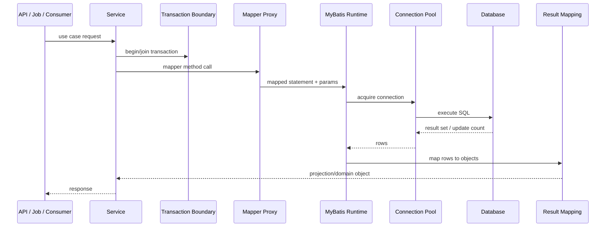
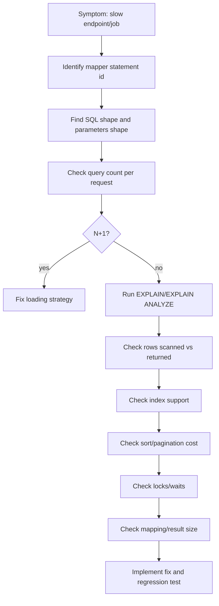
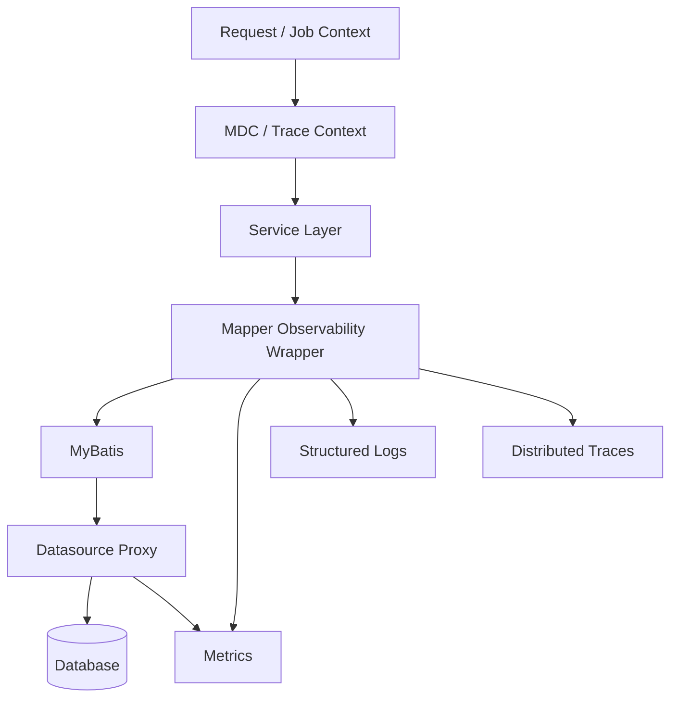

------
title: Learn Java MyBatis - Part 022
description: Production observability and SQL diagnostics for MyBatis applications, including logging, safe parameter visibility, mapper-level metrics, tracing, slow-query triage, explain-plan workflow, PII masking, incident response, and operational review patterns.
series: learn-java-mybatis
seriesTitle: Learn Java MyBatis, Patterns, Anti-Patterns, and Production Persistence Mapping
order: 22
partTitle: Observability, Logging, and SQL Diagnostics
tags:
  - java
  - mybatis
  - observability
  - logging
  - diagnostics
  - sql
  - performance
  - production
  - architecture
date: 2026-06-28
------

# Part 022 — Observability, Logging, and SQL Diagnostics

A MyBatis mapper is not production-ready just because it returns the right data in a test.

It is production-ready when you can answer these questions during an incident:

- Which mapper method is slow?
- Which SQL statement was executed?
- What parameters shaped the query?
- Which tenant, user, request, job, or workflow triggered it?
- Was the latency caused by database execution, connection waiting, result mapping, network transfer, lock contention, or object allocation?
- Did the query scan too many rows?
- Did dynamic SQL generate an unexpected predicate set?
- Did a deployment change the SQL shape?
- Did the failure affect all tenants or one large tenant?
- Can we prove whether this is a database problem, application problem, or data-volume problem?

This part is about making MyBatis behavior visible without leaking sensitive data or drowning the system in logs.

The core principle:

> Observability is not printing SQL. Observability is being able to reconstruct the execution story safely and quickly.

---

## 1. Kaufman Skill Slice

### Target Skill

After this part, you should be able to:

1. configure MyBatis logging intentionally,
2. choose logging level per mapper/statement,
3. avoid logging sensitive data,
4. define mapper-level metrics,
5. instrument query latency and row counts,
6. correlate SQL with request trace and transaction context,
7. triage slow queries using explain plans,
8. diagnose dynamic SQL and mapping failures,
9. build a production incident workflow for MyBatis persistence issues.

### Subskills

| Subskill | Production Value |
|---|---|
| Logger configuration | Makes SQL visible only where useful. |
| Parameter safety | Prevents PII/secrets leakage. |
| Mapper metrics | Shows which mapper methods dominate latency. |
| Query fingerprinting | Groups equivalent SQL shapes. |
| Tracing | Connects mapper calls to use cases. |
| Explain-plan workflow | Moves diagnosis from guesswork to evidence. |
| Dynamic SQL diagnostics | Detects unexpected predicate rendering. |
| Incident playbook | Reduces mean time to recovery. |

---

## 2. Observability Mental Model

A mapper call has several phases.



Different tools observe different phases.

| Phase | Useful Signal |
|---|---|
| Service entry | use case, tenant, user, request id |
| Transaction | propagation, isolation, duration |
| Mapper proxy | mapper id, method name, parameters shape |
| MyBatis runtime | statement id, SQL text, bound parameters |
| Connection pool | acquisition latency, active/idle connections |
| Database | execution time, locks, rows scanned, plan |
| Result mapping | row count, object count, mapping errors |
| Response | total latency, status, error type |

If you only log SQL, you miss the execution story.

---

## 3. MyBatis Logging Basics

MyBatis uses an internal log factory that delegates to supported logging implementations such as SLF4J, Commons Logging, Log4j 2, JDK logging, and others depending on runtime configuration and classpath.

In modern Spring Boot systems, the usual target is SLF4J with Logback or Log4j 2 through the application logging stack.

### 3.1 Explicit Log Implementation

```yaml
mybatis:
  configuration:
    log-impl: org.apache.ibatis.logging.slf4j.Slf4jImpl
```

Or in XML-style configuration:

```xml
<settings>
  <setting name="logImpl" value="SLF4J"/>
</settings>
```

The goal is to avoid accidental logging behavior caused by classpath discovery.

### 3.2 Mapper-Level Logging

With Logback:

```xml
<logger name="com.acme.casefile.persistence.CaseMapper" level="DEBUG"/>
```

This enables logging for the mapper namespace.

### 3.3 Statement-Level Logging

```xml
<logger name="com.acme.casefile.persistence.CaseMapper.findCaseDetail" level="DEBUG"/>
```

This is useful when one mapper method is suspicious and you do not want to flood logs from the entire mapper package.

### 3.4 Package-Level Logging

```xml
<logger name="com.acme.casefile.persistence" level="DEBUG"/>
```

Use package-level SQL logging only for short diagnostics, lower environments, or carefully sampled production debugging.

---

## 4. Logging Levels: DEBUG vs TRACE

A dangerous practice is enabling the most verbose SQL logging in production without understanding what it prints.

A safer model:

| Level | Intended Use |
|---|---|
| `ERROR` | Normal production baseline for framework internals. |
| `WARN` | Unexpected but survivable framework/database behavior. |
| `INFO` | High-level application events, not every query. |
| `DEBUG` | SQL statement visibility during targeted diagnostics. |
| `TRACE` | Very detailed output, often including result-level detail; avoid broad production use. |

For large result sets, detailed result logging can be catastrophic. It can:

- increase latency,
- consume disk,
- leak sensitive data,
- overwhelm log aggregation,
- cause incident noise.

The rule:

> Use statement-level `DEBUG` for targeted SQL visibility. Avoid broad `TRACE` in production.

---

## 5. SQL Logging Is Not Enough

Raw SQL logs often answer:

```text
What was executed?
```

But incidents need:

```text
Why was it executed, for whom, how often, and with what consequence?
```

### 5.1 Minimum Context Fields

Every mapper-related diagnostic event should be correlatable with:

- trace id,
- request id,
- tenant id,
- authenticated subject or service principal,
- use case name,
- transaction id or logical workflow id,
- mapper statement id,
- database name or datasource id,
- elapsed time,
- row count or affected row count,
- result size class,
- error category.

Example structured log:

```json
{
  "event": "mybatis.mapper.slow_query",
  "traceId": "4f5e9c...",
  "tenantId": "tenant-a",
  "useCase": "CaseSearch",
  "statementId": "CaseSearchMapper.searchCases",
  "durationMs": 842,
  "rowCount": 100,
  "pageSize": 100,
  "datasource": "case-db-primary",
  "sqlFingerprint": "select-case-search-v3",
  "severity": "WARN"
}
```

Notice: this does not include raw PII values.

---

## 6. Parameter Logging Safety

MyBatis can show bound parameters in logs depending on configuration. That is useful in development and dangerous in production.

Parameters may include:

- names,
- emails,
- phone numbers,
- addresses,
- national identifiers,
- case numbers,
- document ids,
- free-text allegations,
- secrets or tokens,
- access-control identifiers,
- health/financial/legal data.

### 6.1 Safe Parameter Strategy

Instead of logging raw parameter values, log parameter shape.

Bad:

```json
{
  "keyword": "John Smith fraud complaint",
  "email": "john.smith@example.com"
}
```

Better:

```json
{
  "keywordPresent": true,
  "keywordLength": 26,
  "emailPresent": true,
  "statusCount": 3,
  "dateRangeDays": 30
}
```

### 6.2 Parameter Classification

| Parameter Type | Logging Rule |
|---|---|
| tenant id | Usually loggable if not secret; consider hashing in external logs. |
| case id | Log internal id only if policy allows. |
| case number | Often sensitive; mask or hash. |
| email/phone/name | Do not log raw. |
| free text search | Do not log raw. Log length/token count. |
| status enum | Usually safe. |
| date range | Usually safe. |
| role/permission | Usually safe but review security implications. |
| document id | Often sensitive. |

### 6.3 Redaction Utility

```java
public final class SqlDiagnosticSanitizer {
    public SearchDiagnostic sanitize(CaseSearchCriteria criteria) {
        return new SearchDiagnostic(
            criteria.tenantId().safeValue(),
            criteria.statuses().size(),
            criteria.keyword() != null,
            criteria.keyword() == null ? 0 : criteria.keyword().length(),
            criteria.fromDate() != null,
            criteria.toDate() != null,
            criteria.page().size()
        );
    }
}
```

Do not leave redaction decisions to ad hoc logging at call sites.

---

## 7. Mapper-Level Metrics

Logs are for investigation. Metrics are for trend detection and alerting.

At minimum, collect:

- call count per statement,
- latency histogram per statement,
- error count per statement,
- affected rows for commands,
- returned rows for queries where feasible,
- connection acquisition latency,
- timeout count,
- retry count,
- deadlock/lock-timeout count,
- query result size bucket,
- tenant dimension for aggregate analysis, carefully controlled to avoid high cardinality.

### 7.1 Suggested Metric Names

```text
mybatis.mapper.calls
mybatis.mapper.duration
mybatis.mapper.errors
mybatis.mapper.rows.returned
mybatis.mapper.rows.affected
mybatis.mapper.timeouts
mybatis.mapper.deadlocks
mybatis.mapper.result.size.bucket
```

### 7.2 Tag Discipline

Good tags:

- `statementId`,
- `mapper`,
- `operationType`,
- `datasource`,
- `outcome`,
- `tenantTier`,
- `useCase`.

Dangerous tags:

- raw tenant id in high-cardinality metric systems,
- user id,
- case id,
- keyword,
- SQL text,
- exception message if it contains values.

High cardinality can break monitoring systems or make dashboards unusable.

### 7.3 Statement ID as the Primary Dimension

Use MyBatis statement id as the stable diagnostic anchor:

```text
com.acme.casefile.persistence.CaseSearchMapper.searchCases
```

This gives a direct path from production signal to source code.

---

## 8. Instrumentation Patterns

### 8.1 Service-Level Timing

```java
public SearchResult<CaseCard> searchCases(CaseSearchCriteria criteria) {
    Timer.Sample sample = Timer.start(meterRegistry);
    try {
        return mapper.searchCases(criteria);
    } finally {
        sample.stop(Timer.builder("mybatis.mapper.duration")
            .tag("statementId", "CaseSearchMapper.searchCases")
            .tag("useCase", "CaseSearch")
            .register(meterRegistry));
    }
}
```

This is simple but manual.

Pros:

- easy to understand,
- business context available,
- safe redaction possible.

Cons:

- repetitive,
- can miss mapper calls,
- statement id must be maintained.

### 8.2 DataSource Proxy

A datasource proxy can observe SQL execution below MyBatis.

Pros:

- captures all JDBC calls,
- measures actual SQL execution,
- can count queries per request,
- can detect N+1.

Cons:

- may not know use case context unless MDC/tracing is propagated,
- parameter redaction must be configured,
- can add overhead,
- raw SQL cardinality must be controlled.

### 8.3 MyBatis Plugin Interceptor

MyBatis supports plugin interception for certain internal extension points. Teams sometimes instrument `Executor` operations.

Example conceptual interceptor:

```java
@Intercepts({
    @Signature(
        type = Executor.class,
        method = "query",
        args = {MappedStatement.class, Object.class, RowBounds.class, ResultHandler.class}
    )
})
public final class MapperMetricsInterceptor implements Interceptor {
    @Override
    public Object intercept(Invocation invocation) throws Throwable {
        MappedStatement ms = (MappedStatement) invocation.getArgs()[0];
        long start = System.nanoTime();
        try {
            Object result = invocation.proceed();
            recordSuccess(ms.getId(), result, System.nanoTime() - start);
            return result;
        } catch (Throwable t) {
            recordFailure(ms.getId(), t, System.nanoTime() - start);
            throw t;
        }
    }
}
```

Use this carefully. Interceptors are powerful but can become hidden framework magic.

Production rule:

> Instrumentation must not change SQL semantics.

---

## 9. Query Fingerprinting

Raw SQL can vary by literals, whitespace, dynamic predicates, and `IN` list length.

A query fingerprint groups similar SQL shapes.

Example raw SQL:

```sql
select c.case_id, c.status
from case_file c
where c.tenant_id = ?
  and c.status in (?, ?, ?)
  and c.created_at >= ?
order by c.created_at desc
limit ?
```

Fingerprint:

```text
case-search-by-tenant-status-createdAt-v2
```

Or normalized SQL hash:

```text
sqlhash:93d0f41a
```

### 9.1 Why Fingerprints Matter

They help answer:

- Did the SQL shape change after deployment?
- Which query family is slow?
- Are only searches with keyword slow?
- Does a dynamic branch produce unindexed predicates?
- Is one query generating too many variants?

### 9.2 Dynamic SQL Shape Logging

For search criteria, log rendered predicate flags:

```json
{
  "statementId": "CaseSearchMapper.searchCases",
  "shape": {
    "hasStatus": true,
    "hasKeyword": true,
    "hasDateRange": false,
    "hasAssignee": true,
    "sort": "DUE_AT_ASC",
    "pageSize": 100
  }
}
```

This is safer and more useful than logging the raw search text.

---

## 10. Slow Query Triage Workflow

When a MyBatis query is slow, do not randomly add indexes.

Use a disciplined path.



### 10.1 Step 1 — Identify Statement ID

Find the mapper id:

```text
CaseSearchMapper.searchCases
```

Not enough:

```text
Database is slow.
```

Better:

```text
CaseSearchMapper.searchCases p95 increased from 120ms to 1.8s for large tenants after release 2026.06.28.
```

### 10.2 Step 2 — Capture SQL Shape

For dynamic SQL, capture which predicates rendered.

```text
status=true, assignee=false, keyword=true, dateRange=false, sort=DUE_AT_ASC
```

This helps reproduce the issue.

### 10.3 Step 3 — Query Count

A slow endpoint might not have one slow query. It may have 300 fast queries.

Symptoms of N+1:

- mapper call count grows with result count,
- logs show repeated child lookup by parent id,
- p95 grows with page size,
- database CPU increases with request volume.

### 10.4 Step 4 — Explain Plan

Use database-native tools:

- PostgreSQL: `EXPLAIN (ANALYZE, BUFFERS)` where safe,
- MySQL: `EXPLAIN`, `EXPLAIN ANALYZE` depending on version,
- SQL Server: actual execution plan,
- Oracle: execution plan and SQL monitor.

Do not run destructive or high-cost explain-analyze commands blindly against production. Use safe replicas, lower environments with representative data, or DBA-approved workflows.

### 10.5 Step 5 — Rows Scanned vs Rows Returned

A query returning 50 rows but scanning 8 million rows is a physical design problem.

Look for:

- sequential scan on large table,
- missing composite index,
- non-sargable predicate,
- function applied to indexed column,
- `OR` predicate defeating index usage,
- sort spill,
- late filtering after join,
- high row multiplication.

### 10.6 Step 6 — Mapping Cost

If database execution is fast but application latency is high:

- too many rows returned,
- huge object graph mapping,
- nested result row explosion,
- JSON deserialization in `TypeHandler`,
- large CLOB/BLOB columns,
- logging result rows at TRACE,
- allocation pressure and GC.

---

## 11. Dynamic SQL Diagnostics

Dynamic SQL creates many possible query shapes.

### 11.1 Predicate Matrix

For a search mapper, define expected predicate combinations:

| Shape | status | assignee | keyword | date range | expected index |
|---|---:|---:|---:|---:|---|
| S1 | yes | no | no | no | `(tenant_id, status, created_at)` |
| S2 | yes | yes | no | no | `(tenant_id, assignee_id, status, due_at)` |
| S3 | yes | no | yes | no | search index or full-text index |
| S4 | yes | yes | yes | yes | verify plan under realistic data |

This turns dynamic SQL into a finite design surface.

### 11.2 Rendered SQL Snapshot Tests

Rendered SQL tests catch accidental query shape changes.

```java
@Test
void searchCases_withStatusAndDateRange_rendersExpectedPredicates() {
    CaseSearchCriteria criteria = new CaseSearchCriteria(
        tenantId,
        Set.of(CaseStatus.OPEN),
        null,
        LocalDate.parse("2026-01-01"),
        LocalDate.parse("2026-01-31")
    );

    BoundSql sql = renderBoundSql("CaseSearchMapper.searchCases", criteria);

    assertThat(normalize(sql.getSql()))
        .contains("c.tenant_id = ?")
        .contains("c.status in")
        .contains("c.created_at >= ?")
        .doesNotContain("assignee_id");
}
```

The helper depends on your MyBatis test setup, but the principle is stable: dynamic branches deserve verification.

---

## 12. Observing Row Counts

Returned row count matters.

Examples:

| Mapper | Expected Row Count |
|---|---:|
| `findById` | 0 or 1 |
| `searchCases` | up to page size |
| `findChildrenForParentIds` | bounded by parent count × expected children |
| `exportCases` | may be large, must stream/chunk |
| `dashboardCounts` | fixed small number |

### 12.1 Row Count Guard

```java
List<CaseCard> rows = mapper.searchCases(criteria);
if (rows.size() > criteria.pageSize()) {
    log.warn("mapper_returned_more_than_page_size statementId={} size={} pageSize={}",
        "CaseSearchMapper.searchCases", rows.size(), criteria.pageSize());
}
```

Better: design SQL so it cannot happen.

### 12.2 Affected Row Count for Commands

For commands, affected row count is an observability signal and correctness guard.

```java
int updated = caseCommandMapper.transitionStatus(command);
if (updated != 1) {
    metrics.counter("mybatis.mapper.unexpected_affected_rows",
        "statementId", "CaseCommandMapper.transitionStatus").increment();
    throw new OptimisticConcurrencyException(command.caseId());
}
```

Do not ignore affected rows for state transitions.

---

## 13. Lock and Timeout Diagnostics

Not every slow query is missing an index. Some are waiting.

Symptoms:

- latency spikes without CPU increase,
- deadlock errors,
- lock wait timeout,
- blocked transactions,
- connection pool exhaustion,
- batch job overlaps with online traffic.

Capture:

- statement id,
- transaction duration,
- lock timeout errors,
- deadlock errors,
- retry count,
- connection acquisition latency,
- active connections,
- database wait events where available.

### 13.1 Timeout Configuration

MyBatis supports statement timeout configuration through settings or statement-level attributes depending on setup.

Example configuration:

```yaml
mybatis:
  configuration:
    default-statement-timeout: 10
```

Use timeouts as guardrails, not performance fixes.

A timeout tells the system to fail instead of waiting forever. It does not make the query efficient.

---

## 14. Connection Pool Signals

A MyBatis mapper uses JDBC connections through a datasource. Many apparent SQL problems are actually connection pool problems.

Watch:

- active connections,
- idle connections,
- pending acquisition count,
- acquisition latency,
- max lifetime churn,
- validation failures,
- leak detection warnings,
- transaction duration.

If mapper latency includes connection wait time, database execution may be fast but requests still slow.

```text
total mapper latency = connection acquisition + statement execution + result transfer + mapping
```

Separate these dimensions where possible.

---

## 15. PII, Secrets, and Audit Safety

Observability must not become a data breach.

### 15.1 Never Log These Raw by Default

- passwords,
- tokens,
- API keys,
- session ids,
- personal identifiers,
- names in sensitive domains,
- emails and phone numbers,
- national ids,
- free-text complaint content,
- legal allegations,
- protected health or financial data,
- full document contents,
- raw JSON payloads with unknown shape.

### 15.2 Use MDC Carefully

Mapped Diagnostic Context is useful:

```java
MDC.put("traceId", traceId);
MDC.put("tenantId", safeTenantId);
MDC.put("useCase", "CaseSearch");
```

But do not put high-cardinality sensitive values in MDC if all logs will inherit them.

### 15.3 Audit Logs vs Diagnostic Logs

Do not mix them.

| Diagnostic Log | Audit Log |
|---|---|
| For debugging and operations | For legal/compliance accountability |
| May be sampled | Must be complete where required |
| Short retention often acceptable | Retention governed by policy |
| Should avoid business payload | May contain controlled business facts |
| Mutable log level | Stable schema and access control |

MyBatis SQL logs are diagnostic logs, not audit logs.

---

## 16. Production Dashboards

A useful MyBatis dashboard shows:

1. top mapper statements by p95 latency,
2. top mapper statements by call count,
3. error rate by mapper statement,
4. timeout/deadlock counts,
5. rows returned distribution,
6. affected row anomalies,
7. connection pool acquisition latency,
8. slow query count by datasource,
9. query count per request/use case,
10. deployment comparison before/after release.

### 16.1 Example Dashboard Panels

| Panel | Question Answered |
|---|---|
| Mapper p95 latency | Which statement is slow? |
| Mapper throughput | Which statement dominates DB load? |
| Slow query events | Which use cases generate slow SQL? |
| Query count per request | Is N+1 happening? |
| Rows returned bucket | Are endpoints returning too much data? |
| Lock timeout/deadlock | Is concurrency causing failures? |
| Pool acquisition latency | Is pool saturation causing delay? |
| Tenant tier breakdown | Is one large tenant driving cost? |

---

## 17. Incident Playbook

### Scenario

Users report that the case search page is slow.

### Step 1 — Identify Impact

Ask:

- all tenants or one tenant?
- all users or one role?
- all searches or keyword searches?
- started after deployment or data growth?
- read-only slowness or command failures too?

### Step 2 — Find Statement ID

From metrics:

```text
CaseSearchMapper.searchCases p95 2200ms
CaseSearchMapper.countCases p95 1700ms
```

### Step 3 — Compare Query Shapes

```json
{
  "hasKeyword": true,
  "hasStatus": true,
  "hasAssignee": false,
  "sort": "LAST_ACTIVITY_DESC"
}
```

### Step 4 — Check Query Count

If each search executes:

- one count query,
- one page query,
- 100 child lookup queries,

then the issue may be N+1, not a single bad query.

### Step 5 — Check Database Plan

Look for:

- missing index for keyword branch,
- sort spill,
- count scanning too many rows,
- tenant skew,
- stale statistics,
- non-sargable predicate.

### Step 6 — Apply Fix

Possible fixes:

- add/adjust composite index,
- split keyword search into dedicated search index,
- remove unnecessary count,
- switch late-page offset pagination to keyset,
- batch load child data,
- reduce projection columns,
- cap export size,
- materialize dashboard counts.

### Step 7 — Add Regression Protection

- SQL shape snapshot test,
- performance test with representative data,
- index review note,
- mapper p95 alert,
- query count per request test.

---

## 18. Common Observability Anti-Patterns

### 18.1 Logging Everything at TRACE

This creates noise and risk. It often makes incidents worse.

### 18.2 No Statement ID in Metrics

If metrics only say “database slow”, engineers waste time finding the actual mapper.

### 18.3 Logging Raw Search Inputs

This leaks user data and creates compliance risk.

### 18.4 Metrics With User ID or Case ID Tags

High-cardinality tags can destroy monitoring usefulness.

### 18.5 No Query Count Per Request

N+1 problems stay invisible.

### 18.6 No Separation Between Connection Wait and Execution Time

Teams blame SQL when the pool is exhausted.

### 18.7 No Plan Capture Workflow

Engineers guess indexes instead of reading evidence.

### 18.8 Observability Only in Production

If lower environments cannot show SQL shape, query count, and mapper latency, performance work starts too late.

---

## 19. Testing Diagnostics

Observability code also needs tests.

### 19.1 Query Count Test

```java
@Test
void caseSearchDoesNotLoadChildrenWithNPlusOne() {
    queryCounter.reset();

    service.searchCases(criteriaWithPageSize(50));

    assertThat(queryCounter.count()).isLessThanOrEqualTo(3);
}
```

This protects against accidental mapper calls inside loops.

### 19.2 Slow Query Event Test

```java
@Test
void slowMapperCallEmitsStatementId() {
    SlowQueryEvent event = simulateSlowMapperCall();

    assertThat(event.statementId()).isEqualTo("CaseSearchMapper.searchCases");
    assertThat(event.durationMs()).isGreaterThan(500);
    assertThat(event.rawParameters()).isNull();
}
```

### 19.3 Redaction Test

```java
@Test
void diagnosticSanitizerDoesNotExposeKeyword() {
    CaseSearchCriteria criteria = criteriaWithKeyword("sensitive allegation text");

    SearchDiagnostic diagnostic = sanitizer.sanitize(criteria);

    assertThat(diagnostic.toString()).doesNotContain("sensitive allegation text");
    assertThat(diagnostic.keywordPresent()).isTrue();
}
```

---

## 20. Mapper Review Checklist for Observability

Before approving a complex mapper, ask:

### Identification

- Does the statement id map clearly to source code?
- Is the mapper method named after the use case/query intent?
- Can logs and metrics identify this statement?

### SQL Shape

- Are dynamic branches testable?
- Is the sort mode visible?
- Is pagination mode visible?
- Are optional predicates normalized?

### Safety

- Are raw sensitive parameters excluded from logs?
- Are high-cardinality metric tags avoided?
- Are tenant and user identifiers handled according to policy?

### Performance

- Is expected row count known?
- Is query count per use case bounded?
- Is result mapping cost understood?
- Is there a timeout policy?
- Is index support documented for major shapes?

### Incidents

- Can we reproduce the SQL shape from diagnostic data?
- Can we run explain plan safely?
- Can we identify whether connection pool wait is involved?
- Are slow query thresholds set?

---

## 21. Reference Implementation Shape

A mature MyBatis observability setup often has this shape:



The important separation:

- service layer knows use case and sanitized business context,
- MyBatis knows statement id and SQL mapping,
- datasource proxy knows JDBC execution,
- database knows physical plan and waits,
- metrics/logging/tracing join the story.

---

## 22. Senior-Level Heuristics

1. **Statement id is the diagnostic anchor.** Every mapper metric should point to source code.
2. **SQL logs are temporary; metrics are permanent.** Do not rely on verbose logs for normal operation.
3. **Never leak raw business-sensitive parameters.** Log shapes, not payloads.
4. **Separate connection wait from SQL execution.** Pool saturation is not query execution.
5. **Count mapper calls per request.** N+1 is invisible without query count.
6. **Use dynamic SQL shape logging.** Optional predicates need observability.
7. **Prefer structured logs.** Regex-based incident analysis is fragile.
8. **Explain plans beat intuition.** Do not guess indexes.
9. **Observe row counts.** Returning too much data is both a performance and product-design smell.
10. **Treat observability as part of mapper contract.** A mapper you cannot diagnose is not production-ready.

---

## 23. Deliberate Practice

### Exercise 1 — Design Metrics

For these mapper methods, define metrics and tags:

1. `CaseSearchMapper.searchCases`
2. `CaseSearchMapper.countCases`
3. `CaseCommandMapper.transitionStatus`
4. `AssignmentMapper.claimNextCase`
5. `ReportExportMapper.streamClosedCases`

For each, identify:

- latency metric,
- count metric,
- row metric,
- error metric,
- safe tags,
- unsafe tags.

### Exercise 2 — Redact Diagnostics

Given:

```java
public record CaseSearchCriteria(
    TenantId tenantId,
    String caseNumber,
    String complainantName,
    String keyword,
    Set<CaseStatus> statuses,
    LocalDate fromDate,
    LocalDate toDate,
    int pageSize
) {}
```

Create a diagnostic object that reveals enough to debug query shape without leaking raw values.

### Exercise 3 — Slow Query Playbook

A production alert says:

```text
CaseSearchMapper.searchCases p95 > 2s for tenant tier LARGE.
```

Write the exact diagnostic sequence:

1. what metrics you check,
2. what logs you inspect,
3. what SQL shape you reproduce,
4. what explain plan evidence you need,
5. what regression test you add after fixing.

---

## 24. Summary

Observability for MyBatis is not just framework logging. It is a system-level diagnostic design that connects use case, mapper statement, SQL shape, datasource behavior, database execution, result mapping, and operational impact.

The production-grade rule is:

```text
Every important mapper must be identifiable, measurable, traceable, and safe to diagnose.
```

Use MyBatis logging intentionally, not broadly. Capture statement ids, latency, row counts, query count per request, and sanitized query shape. Avoid raw sensitive parameters. Build an explain-plan workflow. Separate SQL execution from connection waiting and object mapping.

A mapper that cannot be diagnosed under production pressure is not complete.

---

## References

- MyBatis 3 Reference Documentation — Logging: `https://mybatis.org/mybatis-3/logging.html`
- MyBatis 3 Reference Documentation — Configuration: `https://mybatis.org/mybatis-3/configuration.html`
- MyBatis 3 Reference Documentation — Mapper XML Files: `https://mybatis.org/mybatis-3/sqlmap-xml.html`
