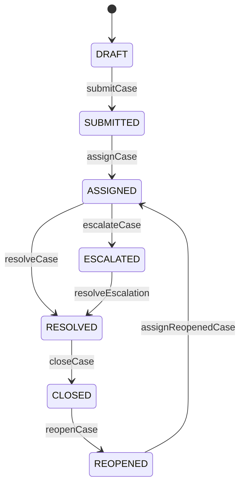
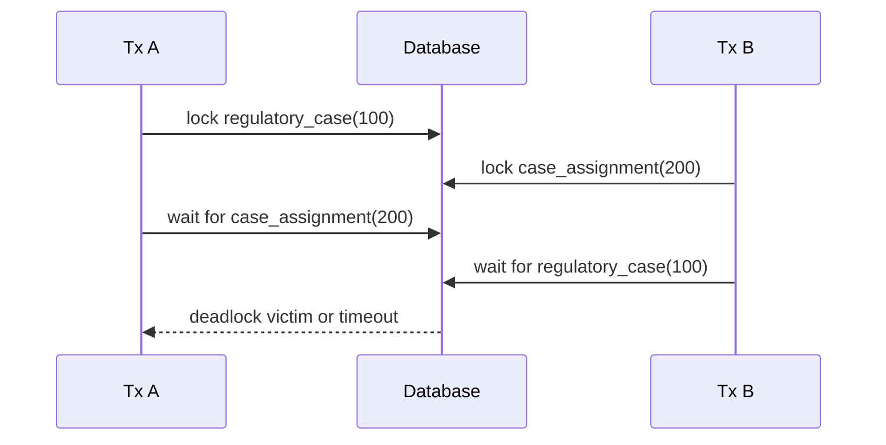

------
title: Learn Java MyBatis - Part 023
description: Advanced concurrency, locking, and consistency patterns for MyBatis applications, including optimistic locking, guarded updates, pessimistic locks, idempotency, status transition guards, deadlock prevention, transactional boundaries, and production failure modeling.
series: learn-java-mybatis
seriesTitle: Learn Java MyBatis, Patterns, Anti-Patterns, and Production Persistence Mapping
order: 23
partTitle: Concurrency, Locking, and Consistency Patterns
tags:
  - java
  - mybatis
  - concurrency
  - locking
  - transactions
  - consistency
  - sql
  - production
  - architecture
date: 2026-06-28
------

# Part 023 — Concurrency, Locking, and Consistency Patterns

This part is about correctness under concurrent writes.

In simple tutorials, a mapper method looks like this:

```java
caseMapper.updateStatus(caseId, "APPROVED");
```

In production, that line hides a harder question:

> What must still be true at the exact moment the database accepts this write?

A MyBatis application is usually explicit-SQL-first. That is a strength because it lets us encode concurrency constraints directly into SQL. It is also a risk because MyBatis will not automatically infer your domain consistency model.

MyBatis will execute the statements you map. It will not automatically prevent lost updates, invalid lifecycle transitions, duplicated commands, stale approvals, cross-tenant writes, phantom reads, or deadlocks.

So the advanced mental model is:

> In MyBatis, concurrency correctness is designed through SQL predicates, transaction boundaries, constraints, lock modes, affected-row checks, idempotency keys, and post-write verification.

This is especially important in regulatory systems, enforcement workflows, case-management platforms, financial operations, workflow engines, and any system where state transitions have legal, operational, or audit consequences.

---

## 1. Kaufman Skill Slice

### Target Skill

After this part, you should be able to:

1. identify which mapper writes are concurrency-sensitive,
2. choose optimistic locking, pessimistic locking, guarded update, idempotency, or database constraints intentionally,
3. encode state transition invariants in SQL,
4. interpret affected row count as a consistency signal,
5. design retry policies without hiding business conflicts,
6. prevent deadlocks through deterministic access order,
7. test concurrent mapper behavior with a real database,
8. review MyBatis mapper methods for correctness under race conditions.

### Subskills

| Subskill | Production Value |
|---|---|
| Lost update detection | Prevents stale writes from overwriting newer decisions. |
| Guarded updates | Keeps lifecycle transitions legal at write time. |
| Optimistic locking | Preserves concurrency without holding long locks. |
| Pessimistic locking | Serializes high-risk operations when conflict cost is high. |
| Idempotency design | Makes retries safe across network and process failure. |
| Unique constraint modeling | Lets the database enforce non-negotiable invariants. |
| Deadlock prevention | Reduces production instability under load. |
| Affected-row interpretation | Turns SQL result count into a business correctness signal. |

---

## 2. The Real Problem: The Database Is Shared Time

Application code often reads like time is linear:

```java
Case c = caseMapper.findById(caseId);
validate(c);
caseMapper.updateStatus(caseId, APPROVED);
```

But the database is shared by multiple transactions.

Between the read and the write, another actor may change the same row.

```mermaid
gantt
    title Lost Update Timeline
    dateFormat X
    axisFormat %s
    section Analyst A
    Read case status = DRAFT        :a1, 0, 2
    Validate approval               :a2, 2, 2
    Update status = APPROVED        :a3, 5, 1
    section Analyst B
    Read case status = DRAFT        :b1, 1, 2
    Validate rejection              :b2, 3, 2
    Update status = REJECTED        :b3, 6, 1
```



If both updates are unconditional, the last writer wins. That may be acceptable for a user profile nickname. It is usually unacceptable for case disposition, enforcement status, inventory allocation, payment state, or workflow escalation.

The SQL mapper must answer:

- What row is being changed?
- Which tenant owns the row?
- What previous state is required?
- Which version is expected?
- Which actor is allowed to perform the transition?
- Which timestamp/audit values are inserted atomically?
- What does zero affected rows mean?
- Should the operation retry, fail, or be treated as idempotent success?

---

## 3. MyBatis Does Not Replace Database Concurrency Control

MyBatis provides mapping, parameter binding, result mapping, session management, and integration with transaction managers. It does not replace the database's concurrency model.

The database remains responsible for:

- transaction isolation,
- row locks,
- unique constraints,
- foreign keys,
- check constraints,
- serialization conflicts,
- deadlock detection,
- statement atomicity.

MyBatis is responsible for making those controls explicit and maintainable from Java.

A mapper method like this is not enough:

```java
int updateStatus(@Param("caseId") long caseId,
                 @Param("status") String status);
```

A better mapper contract encodes the concurrency assumption:

```java
int transitionStatus(CaseTransitionCommand command);
```

```java
public record CaseTransitionCommand(
    long tenantId,
    long caseId,
    String expectedStatus,
    long expectedVersion,
    String nextStatus,
    long actorUserId,
    Instant decidedAt
) {}
```

The command object forces the caller to provide the invariants needed for a guarded write.

---

## 4. Pattern: Guarded Update

A guarded update puts the business precondition in the `WHERE` clause.

### Mapper Interface

```java
public interface CaseCommandMapper {
    int transition(CaseTransitionCommand command);
}
```

### XML Mapper

```xml
<update id="transition" parameterType="CaseTransitionCommand">
  update regulatory_case
  set
      status = #{nextStatus},
      version = version + 1,
      updated_by = #{actorUserId},
      updated_at = #{decidedAt}
  where tenant_id = #{tenantId}
    and case_id = #{caseId}
    and status = #{expectedStatus}
    and version = #{expectedVersion}
</update>
```

### Service Interpretation

```java
@Transactional
public void approveCase(CaseTransitionCommand command) {
    int rows = caseCommandMapper.transition(command);

    if (rows == 0) {
        throw new ConcurrentCaseModificationException(command.caseId());
    }

    if (rows != 1) {
        throw new IllegalStateException("Expected exactly one case row to be updated");
    }
}
```

This is one of the most important patterns in production MyBatis.

The `WHERE` clause is not just a lookup condition. It is the consistency contract.

### Why It Works

The database evaluates the predicate and performs the update atomically for a single statement. Another transaction cannot slip between predicate evaluation and update for the same statement.

### What Zero Rows Means

`rows == 0` can mean:

- the case does not exist,
- the tenant is wrong,
- the current status is not the expected status,
- the version is stale,
- the row is logically deleted,
- the actor is no longer authorized if authorization predicates are included.

A top-tier implementation does not always collapse all these cases into "not found". It decides which distinctions matter to API behavior, audit, and user feedback.

---

## 5. Pattern: Optimistic Locking with Version Column

Optimistic locking assumes conflicts are possible but uncommon. Instead of locking early, it detects whether the row changed before committing the update.

### Table Shape

```sql
create table regulatory_case (
    tenant_id      bigint not null,
    case_id        bigint not null,
    status         varchar(32) not null,
    version        bigint not null,
    updated_at     timestamp not null,
    updated_by     bigint not null,
    primary key (tenant_id, case_id)
);
```

### Read Projection

```java
public record CaseEditSnapshot(
    long tenantId,
    long caseId,
    String status,
    long version,
    Instant updatedAt
) {}
```

### Update Statement

```xml
<update id="updateCaseSummary" parameterType="UpdateCaseSummaryCommand">
  update regulatory_case
  set
      summary = #{summary},
      version = version + 1,
      updated_at = #{updatedAt},
      updated_by = #{updatedBy}
  where tenant_id = #{tenantId}
    and case_id = #{caseId}
    and version = #{expectedVersion}
</update>
```

### Conflict Handling

```java
int rows = caseMapper.updateCaseSummary(command);

if (rows == 0) {
    CaseEditSnapshot latest = caseMapper.findEditSnapshot(command.tenantId(), command.caseId())
        .orElseThrow(CaseNotFoundException::new);

    throw new OptimisticConflictException(
        command.caseId(),
        command.expectedVersion(),
        latest.version()
    );
}
```

### Do Not Retry Blindly

Blind optimistic-lock retries are dangerous when the operation is semantic.

Bad:

```java
while (true) {
    CaseEditSnapshot snapshot = mapper.findSnapshot(id);
    int rows = mapper.updateWithVersion(snapshot.version());
    if (rows == 1) return;
}
```

This can hide business conflicts.

Use blind retries only when the update is mathematically commutative or intentionally mergeable, such as incrementing a technical counter with a safe SQL operation.

For lifecycle transitions, approvals, assignments, or enforcement actions, surface the conflict.

---

## 6. Pattern: Compare-and-Set Status Transition

Workflow systems often need state transitions.

The common beginner approach is:

```java
Case c = mapper.findById(id);
if (c.status() != DRAFT) throw ...;
mapper.updateStatus(id, SUBMITTED);
```

The safer pattern is a compare-and-set update.

```xml
<update id="submitCase" parameterType="SubmitCaseCommand">
  update regulatory_case
  set
      status = 'SUBMITTED',
      submitted_at = #{submittedAt},
      submitted_by = #{submittedBy},
      version = version + 1
  where tenant_id = #{tenantId}
    and case_id = #{caseId}
    and status = 'DRAFT'
    and deleted_at is null
</update>
```

The previous status belongs in the SQL.

### Transition Matrix

For complex workflows, do not scatter status transitions across random mapper methods.

Create explicit commands:

```java
int submitCase(SubmitCaseCommand command);
int assignCase(AssignCaseCommand command);
int escalateCase(EscalateCaseCommand command);
int closeCase(CloseCaseCommand command);
int reopenCase(ReopenCaseCommand command);
```

Each command should encode its legal predecessor state.

| Command | Required Current State | Next State | Concurrency Signal |
|---|---:|---:|---|
| `submitCase` | `DRAFT` | `SUBMITTED` | `rows == 1` |
| `assignCase` | `SUBMITTED` | `ASSIGNED` | `rows == 1` |
| `escalateCase` | `ASSIGNED` | `ESCALATED` | `rows == 1` |
| `closeCase` | `ESCALATED` or `RESOLVED` | `CLOSED` | `rows == 1` |
| `reopenCase` | `CLOSED` | `REOPENED` | `rows == 1` |

### Mermaid View



The state machine may be modeled in Java, but the write precondition must still be enforced in SQL.

Otherwise, the database can accept illegal transitions under concurrency.

---

## 7. Pattern: Pessimistic Locking

Optimistic locking detects conflicts after they happen. Pessimistic locking prevents concurrent modification by acquiring a lock earlier.

Pessimistic locking is useful when:

- conflict probability is high,
- conflict cost is high,
- the workflow requires exclusive editing,
- multiple related rows must be inspected before deciding,
- the operation allocates scarce resources,
- business users expect explicit "checked out" behavior.

### Example: Lock Case for Assignment

```xml
<select id="findCaseForAssignmentForUpdate" resultMap="CaseAssignmentMap">
  select
      c.tenant_id,
      c.case_id,
      c.status,
      c.assignee_user_id,
      c.version
  from regulatory_case c
  where c.tenant_id = #{tenantId}
    and c.case_id = #{caseId}
    and c.status = 'SUBMITTED'
  for update
</select>
```

Service:

```java
@Transactional
public void assignCase(AssignCaseCommand command) {
    CaseAssignmentRow row = caseMapper.findCaseForAssignmentForUpdate(
        command.tenantId(),
        command.caseId()
    ).orElseThrow(CaseNotAssignableException::new);

    int updated = caseMapper.assignLockedCase(command);
    if (updated != 1) {
        throw new IllegalStateException("Locked case was not updated exactly once");
    }
}
```

The lock is useful only inside a transaction. Without a transaction boundary, the lock may be released immediately after the select depending on database and connection behavior.

### Lock Scope Discipline

Keep pessimistic lock transactions short.

Do not hold database locks while:

- calling remote services,
- sending email,
- waiting for user input,
- rendering reports,
- performing expensive computation,
- publishing messages synchronously to slow infrastructure.

Bad:

```java
@Transactional
public void assignAndNotify(AssignCaseCommand command) {
    caseMapper.findCaseForAssignmentForUpdate(command.tenantId(), command.caseId());
    caseMapper.assignLockedCase(command);
    emailClient.sendAssignmentEmail(command.caseId()); // bad inside lock transaction
}
```

Better:

```java
@Transactional
public void assignCase(AssignCaseCommand command) {
    caseMapper.findCaseForAssignmentForUpdate(command.tenantId(), command.caseId());
    caseMapper.assignLockedCase(command);
    outboxMapper.insertAssignmentNotification(command.toOutboxEvent());
}
```

Then a separate outbox publisher sends the email after commit.

---

## 8. Pattern: Queue Claiming with Skip Locked

Work queues often need multiple workers to claim tasks concurrently.

A fragile implementation reads open tasks and then updates them row by row. Multiple workers can select the same tasks.

A better database-specific pattern uses row locking and skip semantics where supported.

Example shape:

```xml
<select id="claimableCases" resultType="long">
  select case_id
  from regulatory_case
  where tenant_id = #{tenantId}
    and status = 'READY_FOR_REVIEW'
    and assignee_user_id is null
  order by priority desc, created_at asc, case_id asc
  limit #{limit}
  for update skip locked
</select>
```

Then update the selected rows in the same transaction.

```xml
<update id="markClaimed">
  update regulatory_case
  set
      assignee_user_id = #{assigneeUserId},
      status = 'ASSIGNED',
      claimed_at = #{claimedAt},
      version = version + 1
  where tenant_id = #{tenantId}
    and case_id in
    <foreach collection="caseIds" item="caseId" open="(" separator="," close=")">
      #{caseId}
    </foreach>
    and status = 'READY_FOR_REVIEW'
    and assignee_user_id is null
</update>
```

Important:

- This pattern is database-specific.
- It must be tested on the production database engine.
- It should have deterministic ordering.
- The update should still contain guard predicates.
- The affected row count must match the claimed id count.

---

## 9. Pattern: Idempotency Key

Distributed systems retry.

A client may submit a command, time out before receiving the response, and submit again. A message consumer may process the same event more than once. A scheduler may retry a failed job.

For commands with side effects, idempotency is mandatory.

### Table

```sql
create table command_idempotency (
    tenant_id          bigint not null,
    idempotency_key   varchar(128) not null,
    command_type      varchar(64) not null,
    command_hash      varchar(128) not null,
    result_reference  varchar(128),
    created_at        timestamp not null,
    primary key (tenant_id, idempotency_key)
);
```

### Insert Claim

```xml
<insert id="insertIdempotencyKey" parameterType="IdempotencyCommand">
  insert into command_idempotency (
      tenant_id,
      idempotency_key,
      command_type,
      command_hash,
      created_at
  ) values (
      #{tenantId},
      #{idempotencyKey},
      #{commandType},
      #{commandHash},
      #{createdAt}
  )
</insert>
```

The primary key enforces uniqueness.

Service:

```java
@Transactional
public SubmitCaseResult submit(SubmitCaseCommand command) {
    try {
        idempotencyMapper.insertIdempotencyKey(command.toIdempotencyRecord());
    } catch (DuplicateKeyException duplicate) {
        return idempotencyMapper.findExistingResult(
            command.tenantId(),
            command.idempotencyKey()
        ).orElseThrow(() -> new IncompleteIdempotentCommandException(command.idempotencyKey()));
    }

    int rows = caseMapper.submitCase(command);
    if (rows != 1) {
        throw new CaseCannotBeSubmittedException(command.caseId());
    }

    idempotencyMapper.storeResult(command.idempotencyKey(), command.caseId());
    return new SubmitCaseResult(command.caseId());
}
```

### Idempotency Must Validate Command Equivalence

If the same idempotency key is reused with a different command body, do not return the old result silently.

Store and compare a command hash.

```xml
<select id="findIdempotencyRecord" resultType="IdempotencyRecord">
  select tenant_id, idempotency_key, command_type, command_hash, result_reference
  from command_idempotency
  where tenant_id = #{tenantId}
    and idempotency_key = #{idempotencyKey}
</select>
```

If `command_hash` differs, return a client error.

---

## 10. Pattern: Unique Constraint as Concurrency Control

Some invariants should not be implemented only in Java.

Example invariant:

> A case can have at most one active primary assignee.

Do not rely on "check first then insert".

Bad:

```java
if (!mapper.existsActivePrimaryAssignee(caseId)) {
    mapper.insertPrimaryAssignee(...);
}
```

Two transactions can pass the existence check and both insert.

Better:

Use a unique constraint or partial unique index where supported.

Conceptually:

```sql
create unique index uq_active_primary_assignee
on case_assignment (tenant_id, case_id)
where role = 'PRIMARY' and active = true;
```

Then the mapper attempts insert and interprets duplicate key as a business conflict.

```xml
<insert id="insertPrimaryAssignment" parameterType="AssignmentCommand">
  insert into case_assignment (
      tenant_id,
      case_id,
      user_id,
      role,
      active,
      assigned_at,
      assigned_by
  ) values (
      #{tenantId},
      #{caseId},
      #{userId},
      'PRIMARY',
      true,
      #{assignedAt},
      #{assignedBy}
  )
</insert>
```

### Rule

Use database constraints for invariants that must hold regardless of which application instance, job, migration script, or integration writes the data.

---

## 11. Pattern: Insert-If-Not-Exists

For concurrency-sensitive creation, avoid application-level check-then-insert.

Bad:

```java
if (!mapper.existsExternalReference(tenantId, externalRef)) {
    mapper.insertCase(command);
}
```

Better approaches:

1. unique constraint + insert + duplicate handling,
2. database-specific upsert,
3. insert-select where not exists with proper isolation and constraints,
4. idempotency key.

Example with unique business key:

```sql
alter table regulatory_case
add constraint uq_case_external_reference
unique (tenant_id, external_reference);
```

Mapper:

```xml
<insert id="insertCase" parameterType="CreateCaseCommand">
  insert into regulatory_case (
      tenant_id,
      case_id,
      external_reference,
      status,
      version,
      created_at,
      created_by,
      updated_at,
      updated_by
  ) values (
      #{tenantId},
      #{caseId},
      #{externalReference},
      'DRAFT',
      0,
      #{createdAt},
      #{createdBy},
      #{createdAt},
      #{createdBy}
  )
</insert>
```

Service:

```java
try {
    caseMapper.insertCase(command);
} catch (DuplicateKeyException e) {
    throw new DuplicateExternalCaseReferenceException(command.externalReference(), e);
}
```

This is not just an error handling pattern. It is a concurrency control pattern.

---

## 12. Pattern: Work Item Lease

Sometimes long-running workers need to claim a job but cannot hold a database transaction for the full duration.

Use a lease.

### Table Columns

```sql
lease_owner      varchar(128),
lease_until      timestamp,
attempt_count    integer not null default 0
```

### Claim Statement

```xml
<update id="claimExpiredOrUnclaimedWorkItem" parameterType="ClaimWorkCommand">
  update work_item
  set
      lease_owner = #{workerId},
      lease_until = #{leaseUntil},
      attempt_count = attempt_count + 1,
      updated_at = #{now}
  where tenant_id = #{tenantId}
    and work_item_id = #{workItemId}
    and status = 'READY'
    and (
        lease_until is null
        or lease_until &lt;= #{now}
    )
</update>
```

If `rows == 1`, this worker owns the lease.

If `rows == 0`, another worker owns it or the item is no longer claimable.

### Completion Statement

```xml
<update id="completeLeasedWorkItem" parameterType="CompleteWorkCommand">
  update work_item
  set
      status = 'COMPLETED',
      completed_at = #{completedAt},
      lease_owner = null,
      lease_until = null,
      updated_at = #{completedAt}
  where tenant_id = #{tenantId}
    and work_item_id = #{workItemId}
    and lease_owner = #{workerId}
    and status = 'READY'
</update>
```

The completion update must verify lease ownership. Otherwise, a slow worker may complete work after its lease expired and another worker claimed the item.

---

## 13. Isolation Levels: What MyBatis Engineers Need to Know

This series does not repeat general transaction theory, but MyBatis mapper authors must know how isolation affects SQL behavior.

The key point:

> MyBatis does not upgrade your database isolation level. Your transaction manager and database configuration define it.

### Mapper-Relevant Effects

| Phenomenon | Mapper Risk |
|---|---|
| Dirty read | Reading uncommitted changes can drive invalid decisions. |
| Non-repeatable read | A row can change between two reads in one transaction. |
| Phantom read | A set of rows matching a predicate can change between reads. |
| Serialization conflict | Database may reject transaction under stricter isolation. |
| Gap/range locking | Predicate-based operations may block more than expected. |

### Practical Rule

Do not rely on isolation level as an invisible business rule.

Prefer explicit SQL guards:

- `and version = #{expectedVersion}`
- `and status = 'DRAFT'`
- `and assignee_user_id is null`
- `and lease_owner = #{workerId}`
- unique constraints
- foreign keys
- check constraints

Isolation level is a safety net, not a substitute for business predicates.

---

## 14. Local Cache and Concurrency Awareness

MyBatis uses a local session cache by default. Within the same `SqlSession`, repeated queries may return cached objects depending on configuration and statement behavior.

This matters for long transactions and nested queries.

Danger pattern:

```java
@Transactional
public void processCase(long caseId) {
    CaseRow before = mapper.findById(caseId);
    externalComponentMutatesDatabase(caseId);
    CaseRow after = mapper.findById(caseId); // may not mean what you think
}
```

Avoid designs where a long-running transaction expects repeated mapper reads to observe external changes.

Production guidance:

- keep transactions short,
- do not call external systems inside database transaction,
- understand local cache scope,
- use explicit refresh queries carefully,
- avoid second-level cache for volatile command-side data,
- treat cached reads as correctness-sensitive.

---

## 15. Deadlock Prevention

Deadlocks are not random. They usually come from inconsistent lock acquisition order.

### Bad Access Order

Transaction A:

1. update case `100`,
2. update assignment `200`.

Transaction B:

1. update assignment `200`,
2. update case `100`.

They can block each other.



### Prevention Rules

1. Lock parent before child.
2. Lock rows in deterministic key order.
3. Keep transaction scope small.
4. Avoid mixed read/write ordering across services.
5. Avoid user interaction inside transaction.
6. Avoid remote calls inside transaction.
7. Use stable `order by` when selecting rows to update.
8. Retry only deadlock-safe operations.

### Deterministic Batch Update

Bad:

```java
for (Long id : request.caseIds()) {
    mapper.updateCase(id);
}
```

Better:

```java
List<Long> sortedIds = request.caseIds().stream()
    .distinct()
    .sorted()
    .toList();

for (Long id : sortedIds) {
    mapper.updateCase(id);
}
```

Even better, where appropriate, use a set-based statement with deterministic predicate and database-supported lock behavior.

---

## 16. Retry Semantics

Not every failure should be retried.

| Failure | Retry? | Reason |
|---|---:|---|
| transient network failure before transaction begins | Often | No write may have happened. Use idempotency. |
| deadlock victim | Sometimes | Safe only if command is idempotent or conflict rules are preserved. |
| optimistic lock conflict | Usually no | Business state changed. User/process must re-evaluate. |
| duplicate key on idempotency key | No, interpret | Return stored result or reject hash mismatch. |
| duplicate business key | No | Business conflict, not transient. |
| lock timeout | Maybe | Depends on SLA and whether waiting longer is useful. |
| serialization failure | Sometimes | Safe if operation can be replayed from fresh state. |

### Retry Requires Idempotency

A retry wrapper around a non-idempotent mapper command can duplicate side effects.

Bad:

```java
retryTemplate.execute(ctx -> {
    caseMapper.insertEnforcementAction(command);
    notificationMapper.insertNotification(command);
    return null;
});
```

If the first insert committed but response was lost, retry may duplicate the action unless protected by keys and idempotency.

---

## 17. Consistency Pattern for Audit Trail

For regulatory systems, a state transition without audit trail is usually incomplete.

Do not write audit asynchronously if the audit record is part of the legal transaction.

### Transactional State + Audit

```java
@Transactional
public void escalate(EscalateCaseCommand command) {
    int rows = caseMapper.escalate(command);
    if (rows != 1) {
        throw new CaseCannotBeEscalatedException(command.caseId());
    }

    auditMapper.insertCaseAudit(CaseAuditRecord.from(command));
}
```

### Mapper

```xml
<insert id="insertCaseAudit" parameterType="CaseAuditRecord">
  insert into case_audit (
      tenant_id,
      audit_id,
      case_id,
      action,
      previous_status,
      next_status,
      actor_user_id,
      occurred_at,
      reason_code,
      comment
  ) values (
      #{tenantId},
      #{auditId},
      #{caseId},
      #{action},
      #{previousStatus},
      #{nextStatus},
      #{actorUserId},
      #{occurredAt},
      #{reasonCode},
      #{comment}
  )
</insert>
```

### Stronger Pattern: Insert Audit from Updated Row

If the audit must reflect the actual current database row, use database-specific `returning` or a locked read.

Generic approach:

1. lock/read row,
2. perform guarded update,
3. insert audit with values derived from locked row and command,
4. commit.

The audit record and state update should share one transaction.

---

## 18. Outbox Pattern for Post-Commit Effects

Many actions need a message after a successful update.

Examples:

- send notification,
- publish domain event,
- update search index,
- notify workflow engine,
- call downstream enforcement service.

Do not do those inside the lock-sensitive part of the transaction unless absolutely required.

Use an outbox table.

```xml
<insert id="insertOutboxEvent" parameterType="OutboxEvent">
  insert into outbox_event (
      tenant_id,
      event_id,
      aggregate_type,
      aggregate_id,
      event_type,
      payload_json,
      status,
      created_at
  ) values (
      #{tenantId},
      #{eventId},
      #{aggregateType},
      #{aggregateId},
      #{eventType},
      #{payloadJson},
      'NEW',
      #{createdAt}
  )
</insert>
```

```java
@Transactional
public void closeCase(CloseCaseCommand command) {
    int rows = caseMapper.closeCase(command);
    if (rows != 1) {
        throw new CaseCannotBeClosedException(command.caseId());
    }

    auditMapper.insertCaseAudit(command.toAudit());
    outboxMapper.insertOutboxEvent(command.toClosedEvent());
}
```

The outbox write commits atomically with the state transition. The external publish happens later.

---

## 19. Mapper Return Type Rules for Writes

For concurrency-sensitive writes, prefer `int` affected row count over `void`.

Bad:

```java
void approveCase(ApproveCaseCommand command);
```

Better:

```java
int approveCase(ApproveCaseCommand command);
```

Why?

Because affected row count is the mapper's primary consistency signal.

Interpret it deliberately:

```java
static void requireExactlyOne(int rows, String operation) {
    if (rows == 1) return;
    if (rows == 0) throw new ConcurrentModificationException(operation);
    throw new IllegalStateException(operation + " affected " + rows + " rows");
}
```

For bulk operations, return count is still useful, but it must be compared to expected count only when exact count is meaningful.

---

## 20. Multi-Tenant Concurrency Safety

Every concurrency-sensitive statement in a shared-schema system should include `tenant_id`.

Bad:

```xml
<update id="approveCase">
  update regulatory_case
  set status = 'APPROVED'
  where case_id = #{caseId}
</update>
```

Better:

```xml
<update id="approveCase">
  update regulatory_case
  set status = 'APPROVED'
  where tenant_id = #{tenantId}
    and case_id = #{caseId}
    and status = 'PENDING_APPROVAL'
</update>
```

This is both authorization safety and concurrency safety.

A missing tenant predicate can turn a version or status guard into a cross-tenant data corruption incident.

### Defensive Review Rule

For shared-schema multi-tenant systems:

> No mapper write may be merged unless its tenant predicate is visible in SQL or enforced by a verified database security layer.

---

## 21. Anti-Patterns

### 21.1 Check-Then-Act Without Guard

```java
if (mapper.isAssignable(caseId)) {
    mapper.assign(caseId, userId);
}
```

This is race-prone unless `assign` also contains the assignability predicate.

### 21.2 Ignoring Affected Row Count

```java
caseMapper.transition(command);
return Success.INSTANCE;
```

This reports success even if nothing changed.

### 21.3 Blind Retry of Business Conflict

```java
retry(() -> mapper.approve(command));
```

This can hide that another actor rejected or changed the case.

### 21.4 Long Transaction with Remote Call

```java
@Transactional
public void process() {
    mapper.lockRow(...);
    remoteClient.call(...);
    mapper.update(...);
}
```

This turns external latency into database lock duration.

### 21.5 Pessimistic Lock Without Transaction

```java
mapper.findForUpdate(id);
mapper.update(id);
```

Without a transaction boundary, the lock may not protect the update.

### 21.6 Dynamic Update Without Guard

```xml
<update id="patchCase">
  update regulatory_case
  <set>
    <if test="summary != null">summary = #{summary},</if>
    <if test="priority != null">priority = #{priority},</if>
  </set>
  where case_id = #{caseId}
</update>
```

This can silently overwrite newer changes unless version or field-level guards are used.

### 21.7 Treating Cache as Fresh Truth

Second-level or application cache can serve stale rows. Do not use stale cached data to approve high-risk commands without guarded write verification.

---

## 22. Production Decision Matrix

| Situation | Recommended Pattern |
|---|---|
| User edits a record form | Optimistic lock with version. |
| Workflow status transition | Guarded update with expected status and affected-row check. |
| High-value assignment claim | Pessimistic lock or atomic claim update. |
| Multi-worker queue | `for update skip locked`, atomic claim, or lease. |
| Duplicate external command risk | Idempotency key. |
| Unique business invariant | Database unique constraint. |
| Long-running worker | Lease ownership pattern. |
| Cross-service side effect after commit | Outbox pattern. |
| Bulk lifecycle transition | Set-based guarded update plus audit strategy. |
| High-conflict hot row | Reconsider data model, sharding, queueing, or serialized actor. |

---

## 23. Code Review Checklist

For every mapper write, ask:

- Does the `WHERE` clause include the primary identifier?
- Does it include `tenant_id` where relevant?
- Does it include expected status/version/owner where required?
- Is affected row count returned and checked?
- What does `rows == 0` mean?
- Could two transactions both pass the precondition?
- Is there a unique constraint for unique business invariants?
- Is the transaction boundary explicit?
- Are locks held only for a short duration?
- Are remote calls outside the transaction?
- Are audit records inserted in the same transaction when required?
- Are post-commit effects handled through outbox or equivalent?
- Is retry behavior safe and idempotent?
- Are deadlock risks reduced through deterministic access order?
- Are concurrency cases tested against the real database engine?

---

## 24. Deliberate Practice

### Exercise 1 — Refactor Unsafe Transition

Given:

```xml
<update id="closeCase">
  update regulatory_case
  set status = 'CLOSED'
  where case_id = #{caseId}
</update>
```

Refactor it to include:

- tenant guard,
- expected current status,
- version guard,
- actor audit columns,
- affected-row interpretation.

### Exercise 2 — Design Idempotent Submit

Design tables and mapper methods for a `submitCase` command that may be retried by an API client.

Include:

- idempotency key table,
- command hash,
- case transition,
- stored result,
- duplicate key handling,
- hash mismatch behavior.

### Exercise 3 — Assignment Queue

Design a mapper flow for multiple workers claiming case assignments.

Include:

- deterministic ordering,
- row locking or atomic claim,
- max batch size,
- affected row verification,
- worker id,
- timeout/lease strategy.

### Exercise 4 — Deadlock Review

Take two service methods that update the same tables in different order. Rewrite them to use one deterministic lock order.

---

## 25. Final Mental Model

MyBatis gives you precise SQL control. That control is valuable only if you encode the real invariants in the SQL.

The production mindset is:

- a mapper write is not just data modification,
- a mapper write is a conditional state transition,
- the `WHERE` clause is a consistency contract,
- affected row count is a correctness signal,
- transaction boundary defines lock lifetime,
- idempotency defines retry safety,
- constraints define non-negotiable truth,
- tests must prove concurrent behavior on the real database.

A top-tier MyBatis engineer can look at an `update` statement and immediately ask:

> Under concurrent execution, what prevents this statement from accepting an invalid world?

If the answer is "the service already checked earlier", the design is probably not strong enough.

---

## References

- MyBatis Java API: `SqlSession`, command execution, mapper access, and transaction control — https://mybatis.org/mybatis-3/java-api.html
- MyBatis-Spring Transactions: Spring transaction participation and `SqlSession` lifecycle — https://mybatis.org/spring/transactions.html
- MyBatis Configuration: local cache scope and runtime behavior — https://mybatis.org/mybatis-3/configuration.html
- MyBatis Mapper XML: mapped statements and statement attributes — https://mybatis.org/mybatis-3/sqlmap-xml.html
