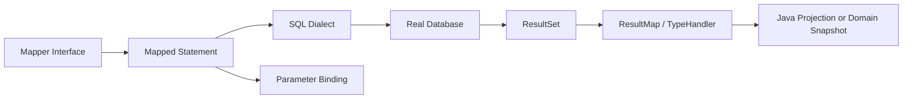
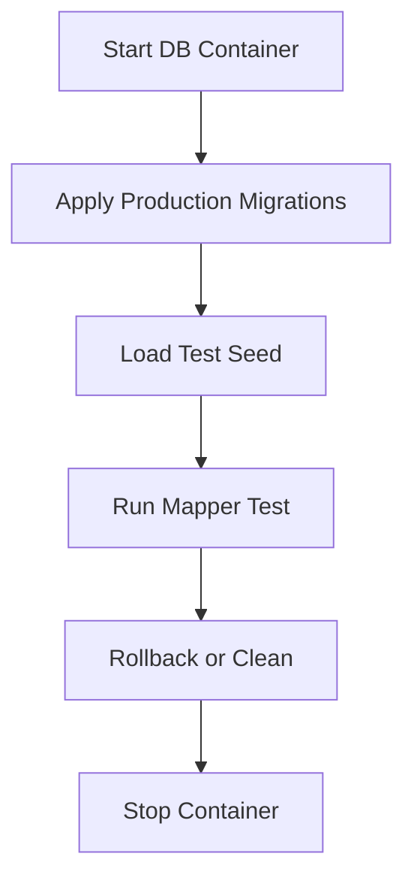
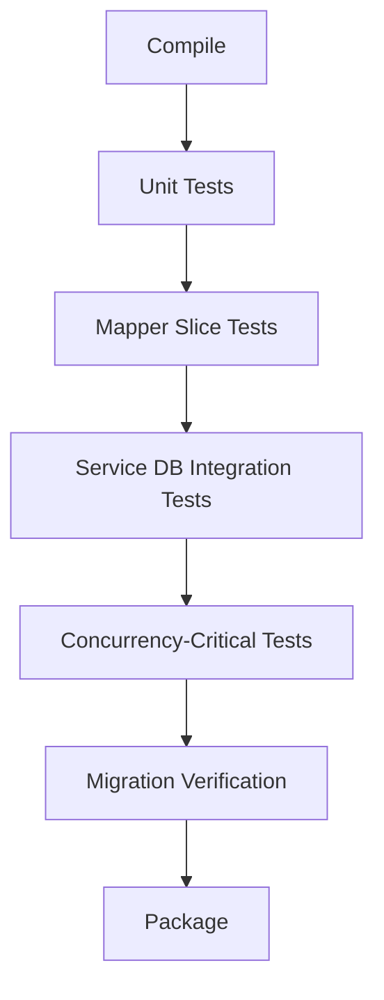

------
title: Learn Java MyBatis - Part 024
description: Production-grade testing strategy for MyBatis mappers using real databases, Testcontainers, @MybatisTest, schema migrations, seed data, ResultMap verification, dynamic SQL branch coverage, transaction tests, concurrency tests, and CI hardening.
series: learn-java-mybatis
seriesTitle: Learn Java MyBatis, Patterns, Anti-Patterns, and Production Persistence Mapping
order: 24
partTitle: Testing Mappers with Real Databases
tags:
  - java
  - mybatis
  - testing
  - testcontainers
  - integration-testing
  - database
  - sql
  - production
  - architecture
date: 2026-06-28
------

# Part 024 — Testing Mappers with Real Databases

This part is about proving that your MyBatis mapper works against the database that matters.

A MyBatis mapper is not just Java code. It is a contract across Java, XML or annotations, SQL dialect, database schema, type handlers, result maps, transaction behavior, constraints, indexes, and runtime configuration.

A mock cannot verify most of that.

A unit test like this is almost useless for mapper correctness:

```java
when(caseMapper.findById(10L)).thenReturn(Optional.of(caseRow));
```

It verifies only that Mockito returns what you told it to return.

It does not verify:

- SQL syntax,
- column names,
- aliases,
- result mapping,
- enum conversion,
- JSON mapping,
- dynamic SQL branches,
- null behavior,
- generated keys,
- database constraints,
- transaction rollback,
- locking behavior,
- query plans,
- vendor-specific functions.

The advanced rule is:

> Mapper tests should run against a real database engine whenever the SQL matters.

For production MyBatis systems, mapper testing is not optional plumbing. It is the safety net that lets you evolve explicit SQL with confidence.

---

## 1. Kaufman Skill Slice

### Target Skill

After this part, you should be able to:

1. design a mapper test suite that catches real SQL and mapping failures,
2. use `@MybatisTest` or full Spring integration tests intentionally,
3. run mapper tests against production-like databases with Testcontainers,
4. seed test data without hiding schema drift,
5. verify `ResultMap`, dynamic SQL, TypeHandler, generated key, and transaction behavior,
6. test concurrency-sensitive mapper methods,
7. prevent H2 or mock-based false confidence,
8. integrate mapper tests into CI as a production safety gate.

### Subskills

| Subskill | Production Value |
|---|---|
| Real database testing | Catches SQL dialect and schema mismatch. |
| Mapper slice testing | Keeps tests focused and fast enough for CI. |
| Seed data design | Makes SQL behavior deterministic. |
| ResultMap verification | Prevents silent nulls and wrong object reconstruction. |
| Dynamic SQL coverage | Prevents broken optional filter branches. |
| TypeHandler testing | Catches enum, JSON, UUID, and time conversion errors. |
| Transaction testing | Proves rollback, lock, and affected-row semantics. |
| Concurrency testing | Verifies behavior under overlapping transactions. |

---

## 2. Why Mapper Tests Are Different

A service test can mock the mapper because it is testing service logic.

A mapper test cannot mock the database because the database is part of the mapper's behavior.



The failure can occur at any edge:

| Edge | Example Failure |
|---|---|
| Interface → statement | Wrong namespace or statement id. |
| Statement → SQL | Bad syntax, invalid function, missing comma. |
| SQL → schema | Column renamed, constraint changed, index missing. |
| Binding → SQL | Wrong parameter name, null handling, bad JDBC type. |
| ResultSet → ResultMap | Alias mismatch, wrong nested collection, missing `<id>`. |
| TypeHandler → Java | Enum code unknown, JSON parse failure, timestamp shift. |
| Transaction → database | Rollback not applied, lock not held, wrong datasource. |

A real mapper test exercises the full path.

---

## 3. Test Taxonomy for MyBatis

Do not put every database-related test in the same bucket.

| Test Type | Purpose | Recommended DB |
|---|---|---|
| Mapper syntax smoke test | Verify mapper loads and basic SQL executes. | Real DB container. |
| Mapper contract test | Verify method behavior and result mapping. | Real DB container. |
| Dynamic SQL branch test | Verify optional filters and generated SQL semantics. | Real DB container. |
| TypeHandler test | Verify conversion both directions. | Real DB container. |
| Transaction test | Verify rollback/commit/lock behavior. | Real DB container. |
| Concurrency test | Verify race behavior. | Real DB container. |
| Service test | Verify orchestration and domain decisions. | Mapper can be mocked or real depending scope. |
| Repository facade test | Verify boundary behavior. | Usually real DB. |
| Performance smoke test | Detect obvious query explosion. | Real DB with representative data shape. |

The mapper layer deserves direct tests.

---

## 4. Why H2 Often Gives False Confidence

In-memory databases can be useful for simple Java persistence tests, but they are often misleading for MyBatis SQL.

Common mismatches:

- different SQL dialect,
- different JSON functions,
- different timestamp semantics,
- different generated key behavior,
- different locking behavior,
- different isolation behavior,
- different index planner,
- different pagination syntax,
- different constraint enforcement,
- different case sensitivity for identifiers,
- unsupported vendor-specific features.

If production uses PostgreSQL, test PostgreSQL.

If production uses MySQL, test MySQL.

If production uses Oracle, test Oracle-compatible behavior as closely as practical.

### Rule

Use H2 only when the SQL is intentionally database-agnostic and the test does not claim production SQL confidence.

For advanced MyBatis, assume real database tests are required.

---

## 5. MyBatis Spring Boot Test Slice

The MyBatis Spring Boot test module provides `@MybatisTest` for testing MyBatis components with Spring Boot test infrastructure.

A typical mapper slice test loads MyBatis-related beans without starting the whole application.

```java
@MybatisTest
class CaseQueryMapperTest {

    @Autowired
    CaseQueryMapper caseQueryMapper;

    @Test
    void findsCaseById() {
        Optional<CaseDetailRow> row = caseQueryMapper.findDetail(1L, 100L);
        assertThat(row).isPresent();
    }
}
```

That is only useful if the test points to the correct database and schema.

For production confidence, combine the slice with a real database container.

---

## 6. Testcontainers Pattern

Testcontainers lets tests run short-lived real services such as databases in Docker containers.

For a PostgreSQL-backed MyBatis application:

```java
@Testcontainers
@MybatisTest
class CaseMapperPostgresTest {

    @Container
    static PostgreSQLContainer<?> postgres = new PostgreSQLContainer<>("postgres:16")
        .withDatabaseName("case_test")
        .withUsername("test")
        .withPassword("test");

    @DynamicPropertySource
    static void databaseProperties(DynamicPropertyRegistry registry) {
        registry.add("spring.datasource.url", postgres::getJdbcUrl);
        registry.add("spring.datasource.username", postgres::getUsername);
        registry.add("spring.datasource.password", postgres::getPassword);
    }

    @Autowired
    CaseQueryMapper caseQueryMapper;
}
```

The exact dependency and container version should follow your organization standard. The key is not the library syntax. The key is the principle:

> The mapper test should execute against the same database family, dialect, and migration path as production.

---

## 7. Schema Setup Strategy

There are several ways to prepare schema for mapper tests.

| Strategy | Good For | Risk |
|---|---|---|
| Run production migrations | Highest fidelity. | Slower; migration tool complexity. |
| Apply test schema SQL | Focused mapper tests. | Can drift from production schema. |
| Use reusable database image | Faster CI. | Must rebuild when migrations change. |
| Use in-memory substitute | Fast experiments. | Often false confidence. |

Recommended default for serious systems:

1. run production migrations against container,
2. seed only test data required for the scenario,
3. rollback or clean tables between tests,
4. keep migration failures visible.

### Flyway/Liquibase Integration Shape

Even if this series does not prescribe Flyway or Liquibase, the mapper test should use the same schema truth as deployment.



---

## 8. Seed Data Design

Seed data should be minimal, explicit, and scenario-driven.

Bad seed strategy:

- one huge global SQL file,
- hundreds of unrelated rows,
- hidden assumptions,
- shared mutable state across tests,
- no clear ownership of records.

Better seed strategy:

```sql
insert into regulatory_case (
    tenant_id,
    case_id,
    status,
    priority,
    version,
    created_at,
    updated_at,
    updated_by
) values (
    1,
    100,
    'DRAFT',
    'HIGH',
    0,
    timestamp '2026-01-01 10:00:00',
    timestamp '2026-01-01 10:00:00',
    501
);
```

The test name should make the intent clear:

```java
@Test
void findDetail_returnsHighPriorityDraftCaseForTenant() {
    CaseDetailRow row = caseQueryMapper.findDetail(1L, 100L).orElseThrow();

    assertThat(row.status()).isEqualTo("DRAFT");
    assertThat(row.priority()).isEqualTo("HIGH");
}
```

Seed data should make failure diagnosis simple.

---

## 9. Test Data Cleanup

Common cleanup strategies:

| Strategy | Description | Notes |
|---|---|---|
| Transaction rollback per test | Test runs in transaction and rolls back. | Fast, but can hide commit behavior. |
| Truncate tables before each test | Explicit clean state. | Needs FK-aware order or cascade. |
| Recreate schema per test class | Strong isolation. | Slower. |
| Reusable container per suite | Faster. | Requires reliable cleanup. |

For mapper tests, transaction rollback is usually fine for read/write contract tests.

But do not use rollback-only tests for behavior that depends on commit, such as:

- outbox visibility after commit,
- transaction synchronization,
- lock release behavior,
- concurrent transaction visibility,
- generated values committed for another connection,
- migration verification.

Use explicit cleanup for those.

---

## 10. Testing Simple Select Mapper

Mapper:

```java
public interface CaseQueryMapper {
    Optional<CaseDetailRow> findDetail(@Param("tenantId") long tenantId,
                                       @Param("caseId") long caseId);
}
```

XML:

```xml
<select id="findDetail" resultMap="CaseDetailMap">
  select
      c.tenant_id,
      c.case_id,
      c.status,
      c.priority,
      c.version,
      c.created_at,
      c.updated_at
  from regulatory_case c
  where c.tenant_id = #{tenantId}
    and c.case_id = #{caseId}
    and c.deleted_at is null
</select>
```

Test:

```java
@Test
void findDetail_mapsAllExpectedColumns() {
    insertCase(tenantId(1), caseId(100), status("DRAFT"));

    CaseDetailRow row = caseQueryMapper.findDetail(1L, 100L).orElseThrow();

    assertThat(row.tenantId()).isEqualTo(1L);
    assertThat(row.caseId()).isEqualTo(100L);
    assertThat(row.status()).isEqualTo("DRAFT");
    assertThat(row.version()).isZero();
    assertThat(row.createdAt()).isNotNull();
    assertThat(row.updatedAt()).isNotNull();
}
```

This catches:

- wrong table,
- wrong column,
- wrong alias,
- missing mapper statement,
- bad `ResultMap`,
- time mapping issues.

---

## 11. Testing ResultMap with Nested Collections

Nested result mapping is a common source of silent bugs.

Test these cases explicitly:

1. parent with no child,
2. parent with one child,
3. parent with multiple children,
4. multiple parents with children,
5. child with nullable columns,
6. duplicate child prevention,
7. ordering if order matters.

Example assertion:

```java
@Test
void findCaseWithAllegations_mapsMultipleChildrenWithoutDuplicatingParent() {
    insertCase(1L, 100L);
    insertAllegation(1L, 100L, 1001L, "LATE_REPORTING");
    insertAllegation(1L, 100L, 1002L, "MISSTATEMENT");

    CaseWithAllegations row = caseGraphMapper.findCaseWithAllegations(1L, 100L)
        .orElseThrow();

    assertThat(row.caseId()).isEqualTo(100L);
    assertThat(row.allegations())
        .extracting(AllegationRow::allegationId)
        .containsExactly(1001L, 1002L);
}
```

This catches missing `<id>` inside child mapping and row multiplication issues.

---

## 12. Testing Dynamic SQL Branches

Dynamic SQL must be branch-tested.

Suppose mapper supports criteria:

```java
public record CaseSearchCriteria(
    long tenantId,
    Set<String> statuses,
    String keyword,
    Instant createdFrom,
    Instant createdTo,
    SortField sortField,
    SortDirection sortDirection,
    int limit,
    int offset
) {}
```

Test matrix:

| Case | Purpose |
|---|---|
| no optional filters | base query valid. |
| one status | `status = ?` or `in (?)` valid. |
| multiple statuses | `IN` clause valid. |
| empty statuses | defined semantics: return none or ignore. |
| keyword | escaped search works. |
| date range from only | lower bound works. |
| date range to only | upper bound works. |
| both dates | inclusive/exclusive policy works. |
| sort by allowed field | safe order by renders. |
| invalid sort field | rejected before mapper or mapped safely. |

Test example:

```java
@Test
void search_withEmptyStatuses_returnsEmptyResultByPolicy() {
    CaseSearchCriteria criteria = new CaseSearchCriteria(
        1L,
        Set.of(),
        null,
        null,
        null,
        SortField.CREATED_AT,
        SortDirection.DESC,
        20,
        0
    );

    List<CaseSearchRow> rows = caseSearchMapper.search(criteria);

    assertThat(rows).isEmpty();
}
```

The test should document the policy.

Do not leave empty-list semantics accidental.

---

## 13. Testing Parameter Binding Safety

You cannot fully prove SQL injection safety with a few tests, but you can catch dangerous behavior.

Example: dynamic sort should use whitelist mapping, not raw `${request.sort}`.

Test:

```java
@Test
void search_rejectsUnknownSortField() {
    assertThatThrownBy(() -> criteriaFactory.fromRequest(
        new SearchRequest("status; drop table regulatory_case")
    )).isInstanceOf(InvalidSortFieldException.class);
}
```

Mapper test:

```java
@Test
void search_sortsByWhitelistedCreatedAt() {
    insertCase(1L, 101L, createdAt("2026-01-02T00:00:00Z"));
    insertCase(1L, 102L, createdAt("2026-01-01T00:00:00Z"));

    List<CaseSearchRow> rows = caseSearchMapper.search(criteriaSortByCreatedAtDesc());

    assertThat(rows).extracting(CaseSearchRow::caseId)
        .containsExactly(101L, 102L);
}
```

The whitelist itself is usually tested outside the mapper. The rendered behavior is tested through the mapper.

---

## 14. Testing TypeHandlers

Custom `TypeHandler` behavior should be tested in both directions.

### Enum Code Handler

```java
@Test
void mapsStatusCodeToDomainEnum() {
    jdbcTemplate.update("""
        insert into regulatory_case (tenant_id, case_id, status, version, created_at, updated_at, updated_by)
        values (?, ?, ?, ?, ?, ?, ?)
        """,
        1L, 100L, "PENDING_APPROVAL", 0, now(), now(), 501L
    );

    CaseStatus status = caseMapper.findStatus(1L, 100L).orElseThrow();

    assertThat(status).isEqualTo(CaseStatus.PENDING_APPROVAL);
}
```

### Unknown Code

```java
@Test
void unknownStatusCodeFailsFast() {
    jdbcTemplate.update("""
        insert into regulatory_case (tenant_id, case_id, status, version, created_at, updated_at, updated_by)
        values (?, ?, ?, ?, ?, ?, ?)
        """,
        1L, 100L, "LEGACY_UNKNOWN", 0, now(), now(), 501L
    );

    assertThatThrownBy(() -> caseMapper.findStatus(1L, 100L))
        .isInstanceOf(PersistenceMappingException.class);
}
```

### JSON Handler

Test:

- valid JSON,
- missing optional field,
- missing required field,
- unknown field policy,
- invalid JSON,
- null column behavior,
- write and read round trip.

---

## 15. Testing Insert and Generated Keys

Generated key behavior is database-specific enough to deserve a mapper test.

Mapper:

```xml
<insert id="insertCase" parameterType="CreateCaseRecord"
        useGeneratedKeys="true" keyProperty="caseId">
  insert into regulatory_case (
      tenant_id,
      external_reference,
      status,
      version,
      created_at,
      updated_at,
      updated_by
  ) values (
      #{tenantId},
      #{externalReference},
      #{status},
      0,
      #{createdAt},
      #{createdAt},
      #{createdBy}
  )
</insert>
```

Test:

```java
@Test
void insertCase_populatesGeneratedCaseId() {
    CreateCaseRecord record = new CreateCaseRecord(
        1L,
        null,
        "EXT-100",
        "DRAFT",
        fixedInstant(),
        501L
    );

    int rows = caseCommandMapper.insertCase(record);

    assertThat(rows).isOne();
    assertThat(record.caseId()).isNotNull();
    assertThat(caseQueryMapper.findDetail(1L, record.caseId())).isPresent();
}
```

If using immutable command records, prefer returning generated keys via database-specific `returning` query or a separate inserted row lookup by natural key/idempotency key.

---

## 16. Testing Guarded Updates

Concurrency-sensitive updates must test affected-row behavior.

Mapper:

```xml
<update id="transition" parameterType="CaseTransitionCommand">
  update regulatory_case
  set
      status = #{nextStatus},
      version = version + 1,
      updated_at = #{decidedAt},
      updated_by = #{actorUserId}
  where tenant_id = #{tenantId}
    and case_id = #{caseId}
    and status = #{expectedStatus}
    and version = #{expectedVersion}
</update>
```

Tests:

```java
@Test
void transition_updatesExactlyOneRowWhenStatusAndVersionMatch() {
    insertCase(1L, 100L, "DRAFT", 0);

    int rows = caseCommandMapper.transition(new CaseTransitionCommand(
        1L, 100L, "DRAFT", 0, "SUBMITTED", 501L, fixedInstant()
    ));

    assertThat(rows).isOne();
    assertThat(caseQueryMapper.findStatus(1L, 100L)).hasValue("SUBMITTED");
}

@Test
void transition_updatesZeroRowsWhenVersionIsStale() {
    insertCase(1L, 100L, "DRAFT", 2);

    int rows = caseCommandMapper.transition(new CaseTransitionCommand(
        1L, 100L, "DRAFT", 1, "SUBMITTED", 501L, fixedInstant()
    ));

    assertThat(rows).isZero();
    assertThat(caseQueryMapper.findStatus(1L, 100L)).hasValue("DRAFT");
}
```

The zero-row case is not a minor test. It is the proof of your optimistic lock contract.

---

## 17. Testing Transactions

When using MyBatis-Spring, transaction behavior is usually owned by Spring's transaction manager.

Test service-level transaction behavior, not just mapper behavior.

Example:

```java
@SpringBootTest
class CaseSubmissionTransactionTest {

    @Autowired
    CaseSubmissionService service;

    @Autowired
    CaseQueryMapper caseQueryMapper;

    @Test
    void submit_rollsBackCaseUpdateWhenAuditInsertFails() {
        insertCase(1L, 100L, "DRAFT", 0);
        forceAuditConstraintFailure();

        assertThatThrownBy(() -> service.submit(commandForCase(100L)))
            .isInstanceOf(AuditPersistenceException.class);

        assertThat(caseQueryMapper.findStatus(1L, 100L)).hasValue("DRAFT");
    }
}
```

This catches:

- wrong transaction manager,
- mapper using wrong datasource,
- self-invocation bypassing transaction proxy,
- exception not triggering rollback,
- audit and state update not sharing transaction.

Mapper slice tests are not enough for this. Use service integration tests where transaction semantics matter.

---

## 18. Testing Pessimistic Locking and Concurrency

Concurrency tests are more complex but necessary for high-risk operations.

Test shape:

1. open transaction A,
2. lock row,
3. attempt conflicting operation in transaction B,
4. assert timeout/block/zero-row behavior depending design,
5. release transaction A,
6. assert final state.

Pseudo-structure:

```java
@Test
void assignCase_serializesConcurrentAssignment() throws Exception {
    insertCase(1L, 100L, "SUBMITTED", 0);

    CountDownLatch txALocked = new CountDownLatch(1);
    CountDownLatch allowTxAToCommit = new CountDownLatch(1);

    Future<?> txA = executor.submit(() -> transactionTemplate.executeWithoutResult(status -> {
        caseMapper.findCaseForAssignmentForUpdate(1L, 100L).orElseThrow();
        txALocked.countDown();
        await(allowTxAToCommit);
        caseMapper.assignCase(assignToUser(501L));
    }));

    await(txALocked);

    Future<Integer> txB = executor.submit(() -> transactionTemplate.execute(status ->
        caseMapper.assignCase(assignToUser(502L))
    ));

    allowTxAToCommit.countDown();
    txA.get();

    Integer rowsB = txB.get();

    assertThat(rowsB).isZero();
    assertThat(caseQueryMapper.findAssignee(1L, 100L)).hasValue(501L);
}
```

This test is intentionally heavier. Keep only a few critical concurrency tests, but make them real.

---

## 19. Testing Multi-Tenant Safety

Every shared-schema mapper should prove tenant isolation.

Example:

```java
@Test
void findDetail_doesNotReturnCaseFromAnotherTenant() {
    insertCase(tenantId(2), caseId(100), status("DRAFT"));

    Optional<CaseDetailRow> row = caseQueryMapper.findDetail(1L, 100L);

    assertThat(row).isEmpty();
}
```

Write mapper:

```java
@Test
void transition_doesNotUpdateCaseFromAnotherTenant() {
    insertCase(tenantId(2), caseId(100), status("DRAFT"), version(0));

    int rows = caseCommandMapper.transition(new CaseTransitionCommand(
        1L, 100L, "DRAFT", 0, "SUBMITTED", 501L, fixedInstant()
    ));

    assertThat(rows).isZero();
    assertThat(caseQueryMapper.findStatus(2L, 100L)).hasValue("DRAFT");
}
```

Tenant isolation tests should be boring, repetitive, and mandatory.

---

## 20. Testing Pagination and Sorting

Search mappers should verify stable ordering.

Bad test:

```java
assertThat(search(criteria)).hasSize(20);
```

Better:

```java
@Test
void search_ordersByPriorityThenCreatedAtThenCaseId() {
    insertCase(1L, 101L, "HIGH", createdAt("2026-01-02T00:00:00Z"));
    insertCase(1L, 102L, "HIGH", createdAt("2026-01-01T00:00:00Z"));
    insertCase(1L, 103L, "MEDIUM", createdAt("2026-01-03T00:00:00Z"));

    List<CaseSearchRow> rows = caseSearchMapper.search(highPriorityFirstCriteria());

    assertThat(rows).extracting(CaseSearchRow::caseId)
        .containsExactly(101L, 102L, 103L);
}
```

For pagination:

- verify page size,
- verify deterministic ordering,
- verify no duplicate across pages under stable dataset,
- verify cursor boundary for keyset pagination,
- verify tenant predicate with pagination.

---

## 21. Testing Empty and Null Semantics

MyBatis dynamic SQL can behave unexpectedly around null and empty collections.

Test explicitly:

| Input | Expected Behavior |
|---|---|
| `keyword = null` | no keyword filter. |
| `keyword = ""` | rejected or normalized to null. |
| `statuses = null` | no status filter or validation failure. |
| `statuses = emptySet()` | return empty result or validation failure. |
| `createdFrom > createdTo` | validation failure before mapper. |
| `limit = 0` | validation failure or empty result by policy. |
| `tenantId = null` | impossible by type or validation failure. |

Do not let these semantics emerge accidentally from XML behavior.

---

## 22. Testing Error Translation

When using MyBatis-Spring, persistence exceptions can be translated into Spring `DataAccessException` hierarchy.

You should test application-level interpretation for important constraint violations.

Example:

```java
@Test
void insertDuplicateExternalReference_isMappedToBusinessConflict() {
    insertCase(1L, 100L, "EXT-1");

    assertThatThrownBy(() -> service.createCase(createCommand("EXT-1")))
        .isInstanceOf(DuplicateExternalReferenceException.class);
}
```

Avoid exposing raw database exceptions past application boundaries.

Mapper tests can verify the database raises the constraint. Service tests verify translation to domain/application exception.

---

## 23. Testing Mapper Configuration Load

A surprisingly useful test is simply loading all mapper statements at startup.

This catches:

- broken XML,
- duplicate statement ids,
- missing result maps,
- invalid type aliases,
- invalid type handlers,
- unresolved mapper resources.

In Spring Boot, a context load test with MyBatis configuration can catch many issues.

```java
@MybatisTest
class MyBatisMapperConfigurationTest {

    @Autowired
    SqlSessionFactory sqlSessionFactory;

    @Test
    void allMappedStatementsAreLoaded() {
        Collection<String> names = sqlSessionFactory.getConfiguration()
            .getMappedStatementNames();

        assertThat(names).contains("com.example.case.CaseQueryMapper.findDetail");
    }
}
```

This is not sufficient, but it is a cheap safety net.

---

## 24. Testing SQL Shape Without Overfitting

Sometimes you want to verify generated SQL shape, especially for MyBatis Dynamic SQL.

Be careful.

Overly exact string assertions are brittle.

Better assertions:

- rendered SQL contains tenant predicate,
- rendered SQL contains expected `order by`,
- parameter map contains expected keys,
- empty optional conditions do not remove mandatory predicates,
- dangerous raw input is not rendered.

For XML mappers, prefer behavior tests against the database. For SQL builder code, SQL rendering tests can be valuable.

---

## 25. Performance Smoke Tests

Mapper tests should not become full load tests, but a few performance smoke checks are useful.

Examples:

- search query returns within a budget on representative seed size,
- mapper does not execute N+1 queries for detail screen,
- dashboard query does not select giant unused columns,
- pagination query uses deterministic ordering,
- nested mapping does not explode parent rows.

A performance smoke test should be stable in CI. Do not make it depend on exact millisecond timing unless environment is controlled.

Prefer structural checks:

- query count,
- row count,
- explain plan presence in manual review,
- max page size enforcement,
- no unbounded query path.

---

## 26. CI Strategy

A practical CI pipeline:



Recommended gates:

1. mapper XML loads,
2. migrations apply cleanly,
3. core mapper contract tests pass,
4. dynamic SQL branch tests pass,
5. type handlers pass,
6. transaction tests pass,
7. critical concurrency tests pass,
8. no test relies on production/shared database,
9. no test requires developer-local manual schema setup.

### CI Flakiness Control

- avoid depending on wall-clock `now()` unless controlled,
- use fixed instants,
- isolate test data by tenant/test id,
- avoid test ordering dependency,
- clean database deterministically,
- keep concurrency tests minimal and robust,
- tune container reuse only after correctness is stable.

---

## 27. Test Naming Convention

Good mapper test names include condition and expected behavior.

Examples:

```java
findDetail_returnsEmpty_whenTenantDoesNotMatch()
transition_updatesOneRow_whenStatusAndVersionMatch()
transition_updatesZeroRows_whenVersionIsStale()
search_excludesDeletedCases()
search_returnsEmpty_whenStatusFilterIsEmpty()
findGraph_mapsCaseWithMultipleAllegations()
insertCase_populatesGeneratedKey()
jsonHandler_failsFast_onInvalidPayload()
```

Bad names:

```java
testFind()
testMapper()
testSearch1()
shouldWork()
```

Mapper tests are executable documentation. Name them accordingly.

---

## 28. Anti-Patterns

### 28.1 Mocking Mapper in Mapper Test

```java
@Mock
CaseMapper caseMapper;
```

This does not test SQL.

### 28.2 Global Seed File With Mystery Rows

A giant seed file makes tests fragile and hard to understand.

### 28.3 H2 Confidence for Vendor SQL

If production SQL uses PostgreSQL JSONB, Oracle sequences, MySQL upsert, or SQL Server locking behavior, H2 is not proof.

### 28.4 No Zero-Row Tests for Guarded Updates

Testing only the happy path misses the actual concurrency contract.

### 28.5 Ignoring ResultMap Edge Cases

Nested result maps must test no-child, one-child, many-child, and multi-parent cases.

### 28.6 Rollback-Only Transaction Tests for Commit Behavior

Rollback tests cannot prove post-commit effects.

### 28.7 Over-Asserting Exact SQL Formatting

Exact SQL string tests become brittle if formatting changes. Assert behavior and critical clauses.

### 28.8 Shared Database in CI

Tests should not depend on a manually maintained shared database. That creates non-reproducible failures.

---

## 29. Mapper Test Review Checklist

For each important mapper, verify:

- Does at least one test execute each mapped statement?
- Are required columns and aliases verified?
- Are dynamic SQL branches covered?
- Are null and empty inputs covered?
- Are tenant isolation cases covered?
- Are soft-delete predicates covered?
- Are generated keys tested if used?
- Are TypeHandlers tested both read and write?
- Are guarded updates tested for success and zero-row cases?
- Are duplicate key and constraint violations tested where meaningful?
- Are transaction semantics tested at service boundary?
- Are pessimistic locks or leases tested if used?
- Does the test run against the production database family?
- Does CI create schema from the same source as deployment?
- Can a new engineer understand the scenario from the test name and seed data?

---

## 30. Deliberate Practice

### Exercise 1 — Mapper Contract Test

Pick one existing mapper method that returns a detail view.

Write tests for:

- row exists,
- row does not exist,
- wrong tenant,
- soft deleted row,
- null optional fields,
- all expected aliases mapped.

### Exercise 2 — Dynamic Search Matrix

For a search mapper, build a test matrix covering:

- no filters,
- each filter individually,
- filters combined,
- empty list semantics,
- invalid sort rejected,
- stable pagination.

### Exercise 3 — Guarded Update

For one lifecycle transition mapper, write tests for:

- expected status and version match,
- wrong status,
- stale version,
- wrong tenant,
- missing row.

### Exercise 4 — TypeHandler Round Trip

For one enum or JSON TypeHandler:

- insert using mapper and read raw SQL,
- insert raw SQL and read using mapper,
- test invalid database value.

### Exercise 5 — Concurrency Proof

Choose one high-risk command. Write a two-transaction test proving that two concurrent attempts cannot both succeed.

---

## 31. Final Mental Model

A MyBatis mapper is executable SQL infrastructure.

Testing it with mocks is like testing a network protocol by mocking the socket and never sending bytes.

The production mindset is:

- service tests can mock mapper behavior,
- mapper tests must execute real SQL,
- SQL tests must use the real database dialect,
- `ResultMap` tests must verify object shape,
- dynamic SQL tests must cover branches,
- guarded updates must test zero rows,
- transaction behavior must be tested at service boundary,
- concurrency-sensitive behavior must be tested with overlapping transactions,
- CI must make schema, mapper, and database behavior reproducible.

A top-tier MyBatis engineer does not ask:

> Did the mapper method get called?

They ask:

> Did the exact mapped SQL, against the real schema and database engine, preserve the contract we claim it preserves?

That is the difference between having tests and having persistence confidence.

---

## References

- MyBatis Spring Boot Test Autoconfigure: `@MybatisTest` support for pure MyBatis component tests — https://mybatis.org/spring-boot-starter/mybatis-spring-boot-test-autoconfigure/
- MyBatis-Spring Transactions: Spring transaction participation and one `SqlSession` per transaction — https://mybatis.org/spring/transactions.html
- MyBatis Java API: `SqlSession`, transaction methods, and executor types — https://mybatis.org/mybatis-3/java-api.html
- MyBatis Mapper XML: mapped statements, result maps, generated keys, and statement attributes — https://mybatis.org/mybatis-3/sqlmap-xml.html
- Testcontainers Java Documentation: containerized dependencies for Java tests — https://java.testcontainers.org/
- Spring Boot Testcontainers Reference — https://docs.spring.io/spring-boot/reference/testing/testcontainers.html
