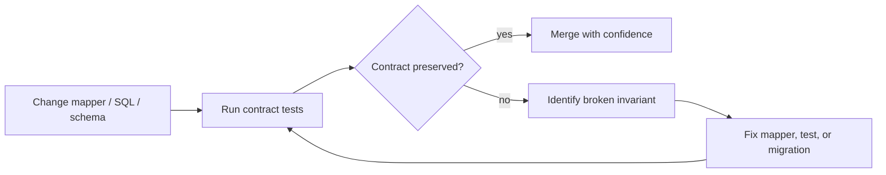
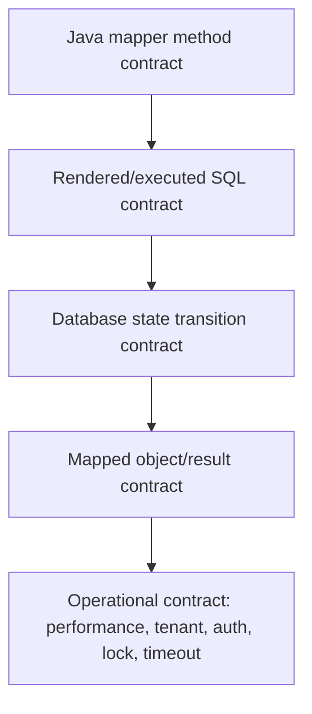
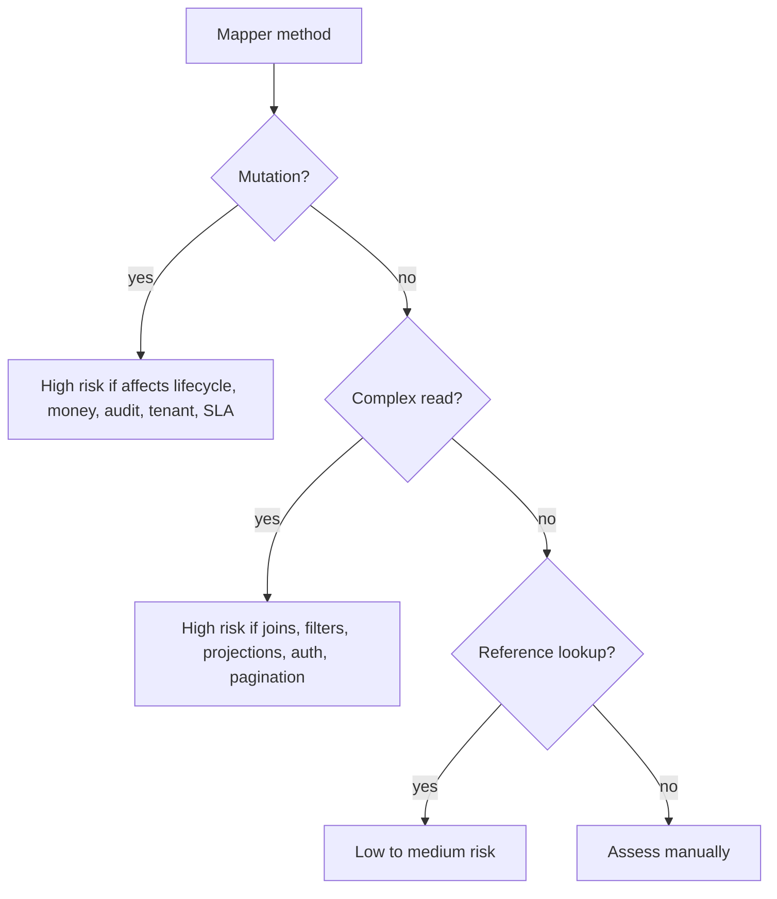
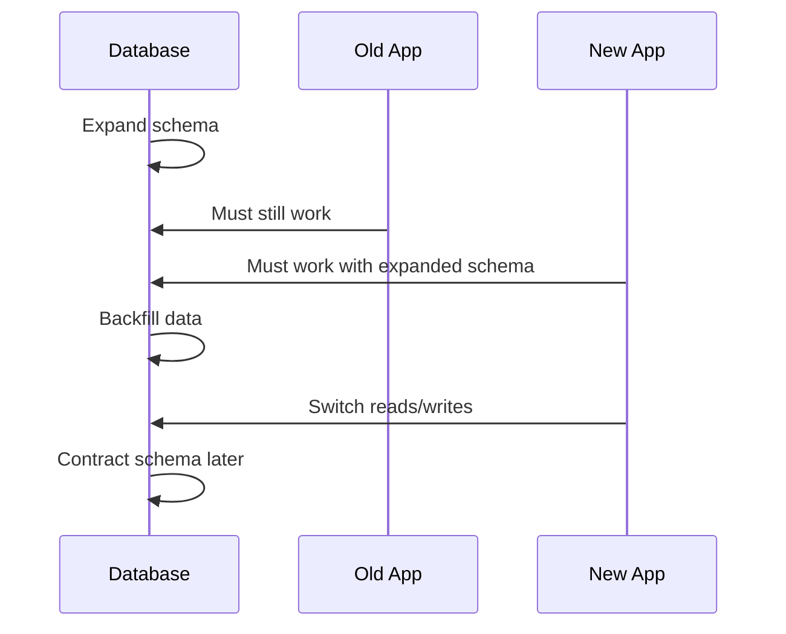
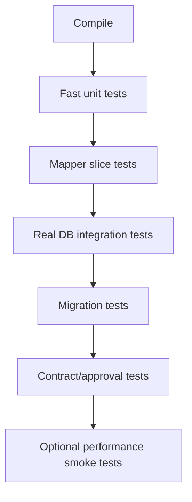

------
title: Learn Java MyBatis - Part 025
description: Contract testing and regression safety for MyBatis mappers, covering mapper API contracts, SQL snapshot tests, result mapping regression, dynamic SQL branch coverage, migration compatibility, nullability, enum/code mapping, approval tests, and CI governance.
series: learn-java-mybatis
seriesTitle: Learn Java MyBatis, Patterns, Anti-Patterns, and Production Persistence Mapping
order: 25
partTitle: Contract Testing and Regression Safety
tags:
  - java
  - mybatis
  - testing
  - contract-testing
  - regression-testing
  - sql
  - persistence
  - ci
  - architecture
  - production
date: 2026-06-28
------

# Part 025 — Contract Testing and Regression Safety

Part 024 proved mapper behavior against a real database.

This part raises the bar: **how do we prevent mapper behavior from accidentally changing over time?**

That is the difference between a mapper that merely passes today and a mapper layer that can survive schema evolution, refactoring, new filters, tenant rules, enum changes, projection changes, and performance hardening.

In a serious system, MyBatis mapper tests are not only integration tests. They are **contract tests**.

A mapper contract answers:

> Given a stable Java method, parameter shape, database state, and configuration, what SQL behavior and object shape must remain true across future changes?

That contract covers much more than “query returns a row.”

It covers:

- SQL semantics,
- parameter binding behavior,
- filter semantics,
- sorting semantics,
- result shape,
- nullability,
- enum/code mapping,
- pagination stability,
- tenant isolation,
- affected-row semantics,
- lock behavior,
- generated-key behavior,
- migration compatibility,
- and backward compatibility with upstream services.

A top-tier MyBatis engineer treats every mapper method as a small public API.

If an API needs compatibility tests, so does a mapper.

---

## 1. Kaufman Framing: Self-Correction Through Regression Signals

In Josh Kaufman's skill acquisition model, after deconstructing a skill, we need fast feedback that helps us self-correct.

For MyBatis, the fastest useful feedback is not only compiler feedback. The compiler cannot see:

- broken SQL syntax inside XML,
- wrong column alias,
- missing tenant predicate,
- changed enum code,
- accidental left join turned into inner join,
- dynamic SQL branch that removes `WHERE`,
- result map that silently produces null,
- pagination order that becomes nondeterministic,
- update method that returns `1` even when it should enforce a version guard,
- or projection drift that breaks an API response.

So the practice loop becomes:



The goal is not to write many tests.

The goal is to encode the invariants that must never silently change.

---

## 2. Contract Testing vs Integration Testing

A normal integration test asks:

> Does this mapper work against a database?

A contract test asks:

> Does this mapper still satisfy the behavior that other layers depend on?

Example integration test:

```java
@Test
void findById_returnsCase() {
    var result = caseReadMapper.findById(new CaseId(1001L));
    assertThat(result).isPresent();
}
```

Useful, but weak.

Example contract test:

```java
@Test
void findById_contract() {
    var result = caseReadMapper.findById(new CaseId(1001L));

    assertThat(result).hasValueSatisfying(caseView -> {
        assertThat(caseView.id()).isEqualTo(new CaseId(1001L));
        assertThat(caseView.caseNumber()).isEqualTo("ENF-2026-0001");
        assertThat(caseView.status()).isEqualTo(CaseStatus.UNDER_REVIEW);
        assertThat(caseView.priority()).isEqualTo(Priority.HIGH);
        assertThat(caseView.assignedOfficerName()).isEqualTo("A. Investigator");
        assertThat(caseView.openedAt()).isNotNull();
        assertThat(caseView.closedAt()).isNull();
    });
}
```

This test is stronger because it locks the returned shape and important fields.

But it is still only one layer of contract.

A full mapper contract usually has four layers:



Each mapper method does not need every layer. A high-risk mapper usually does.

---

## 3. What Exactly Is the Contract?

For MyBatis, a mapper contract is the combined promise of:

1. **Method contract** — method name, parameters, return type, exception behavior.
2. **SQL contract** — statement intent, predicates, joins, ordering, pagination, locking.
3. **Mapping contract** — columns, aliases, result maps, type handlers, nullability.
4. **State transition contract** — inserted/updated/deleted rows and affected-row meaning.
5. **Security contract** — tenant filtering, authorization scope, safe dynamic identifiers.
6. **Operational contract** — query count, timeout, row count, lock scope, deterministic order.
7. **Evolution contract** — compatibility across schema migrations and code refactoring.

For example:

```java
Optional<CaseDetailView> findDetail(CaseDetailQuery query);
```

A serious contract could say:

- must return empty when tenant does not match,
- must include case summary, assigned officer, current SLA, open allegations, latest decision,
- must not include soft-deleted allegations,
- must preserve allegation order by severity desc, created_at asc, id asc,
- must map unknown status codes as a test failure, not silently null,
- must not run more than two SQL statements,
- must not expose sealed evidence unless query scope allows it,
- must remain compatible with schema migration that splits `case_party` into `case_party` and `party_identity`.

That is the real contract.

The method signature alone is not enough.

---

## 4. Contract Test Taxonomy

A production-grade MyBatis test suite usually needs these categories.

| Test category | Purpose | Typical target |
|---|---|---|
| Mapper API contract | Verify method-level behavior | return type, empty result, affected rows |
| Result shape contract | Verify mapped object fields | projections, detail views, aggregates |
| SQL rendering contract | Verify generated SQL shape | Dynamic SQL library, provider methods |
| Dynamic branch contract | Verify optional filter behavior | search screens, dashboards |
| Mutation contract | Verify state transitions | inserts, updates, deletes, guarded commands |
| Tenant/security contract | Verify isolation and scope | tenant predicate, role scope |
| Migration compatibility contract | Verify code works across schema changes | backward/forward deployment |
| Performance regression contract | Prevent query explosion | query count, row count, timeout |
| Nullability/type contract | Prevent silent mapping drift | enums, JSON, time, value objects |
| Approval/golden contract | Lock complex output | SQL text, export rows, report projections |

Do not write all of them for every mapper.

Use risk-based selection.

A CRUD lookup mapper may need only a few tests. A regulatory case search mapper might need all categories.

---

## 5. Risk-Based Mapper Classification

Classify mapper methods before testing them.



Use this rule:

> The more business decisions depend on the mapper result, the more contract tests it deserves.

### High-risk examples

- `transitionCaseStatus(...)`
- `claimNextAssignment(...)`
- `findCasesForEscalation(...)`
- `searchCaseWorkQueue(...)`
- `loadCaseAuditTrail(...)`
- `insertEnforcementDecision(...)`
- `findEvidenceVisibleToOfficer(...)`
- `bulkEscalateExpiredCases(...)`

### Low-risk examples

- `findCountryCodes()`
- `findPriorityOptions()`
- `findByNaturalKey(...)` if backed by unique constraint and simple mapping

Even low-risk methods need a smoke test. They just do not need a full contract suite.

---

## 6. Mapper API Contract Tests

Mapper API contract tests lock the Java-facing behavior.

They answer:

- What happens when no row exists?
- What happens when multiple rows exist?
- What does the method return after update?
- Is null allowed?
- Is empty list returned instead of null?
- Does the method enforce expected uniqueness?
- Does it use domain value objects correctly?

Example:

```java
@Test
void findByCaseNumber_returnsEmptyForDifferentTenant() {
    var query = new CaseNumberQuery(
        TenantId.of("TENANT_A"),
        CaseNumber.of("TENANT_B-CASE-001")
    );

    assertThat(caseMapper.findByCaseNumber(query)).isEmpty();
}
```

This is not a security unit test. It is a mapper contract test.

The service layer may also check tenant. The database query still needs to be tenant-safe.

### Return type contract

Prefer precise return types:

```java
Optional<CaseSummaryRow> findSummaryById(CaseLookup lookup);
List<CaseQueueRow> searchQueue(CaseQueueCriteria criteria);
int transitionStatus(CaseStatusTransitionCommand command);
long countQueue(CaseQueueCriteria criteria);
```

Avoid vague contracts:

```java
Map<String, Object> findCase(Object param);
Object execute(Map<String, Object> params);
List<Map<String, Object>> search(Map<String, Object> params);
```

Vague method signatures create weak test contracts.

---

## 7. Affected-Row Contract for Commands

For commands, the affected row count is part of correctness.

Example guarded update:

```xml
<update id="transitionStatus">
  update enforcement_case
  set status = #{nextStatus},
      version = version + 1,
      updated_at = #{now}
  where tenant_id = #{tenantId}
    and case_id = #{caseId}
    and status = #{expectedCurrentStatus}
    and version = #{expectedVersion}
</update>
```

Test it like a contract:

```java
@Test
void transitionStatus_returnsOne_whenExpectedStateMatches() {
    var rows = caseCommandMapper.transitionStatus(validTransition());
    assertThat(rows).isEqualTo(1);
}

@Test
void transitionStatus_returnsZero_whenVersionChanged() {
    var command = validTransition().withExpectedVersion(999);
    var rows = caseCommandMapper.transitionStatus(command);
    assertThat(rows).isZero();
}
```

Then enforce interpretation outside mapper:

```java
int rows = caseCommandMapper.transitionStatus(command);
if (rows != 1) {
    throw new ConcurrentCaseModificationException(command.caseId());
}
```

Never ignore affected rows for guarded commands.

Anti-pattern:

```java
caseCommandMapper.transitionStatus(command);
return true;
```

That erases the database's concurrency signal.

---

## 8. Result Shape Contract Tests

A `ResultMap` can fail subtly.

Common failures:

- wrong alias maps to null,
- duplicate parent rows produce duplicated children,
- child collection contains phantom empty object,
- constructor arg order mismatch,
- enum handler maps unknown code incorrectly,
- column added with same name creates ambiguous mapping,
- auto-mapping fills a field you did not intend,
- nested result loses identity because `<id>` is missing.

Contract tests should lock the shape.

Example:

```java
@Test
void loadCaseDetail_mapsNestedCollectionsWithoutDuplicates() {
    var detail = caseDetailMapper.loadDetail(caseKey()).orElseThrow();

    assertThat(detail.allegations())
        .extracting(AllegationView::id)
        .containsExactly(
            AllegationId.of(501L),
            AllegationId.of(502L)
        );

    assertThat(detail.allegations())
        .flatExtracting(AllegationView::evidenceItems)
        .extracting(EvidenceItemView::id)
        .doesNotHaveDuplicates();
}
```

Also assert absence:

```java
@Test
void loadCaseDetail_doesNotMapSoftDeletedEvidence() {
    var detail = caseDetailMapper.loadDetail(caseKey()).orElseThrow();

    assertThat(detail.evidenceItems())
        .extracting(EvidenceItemView::id)
        .doesNotContain(EvidenceItemId.of(999L));
}
```

Negative assertions are not optional in regulatory systems. They prove that the mapper does not leak data.

---

## 9. SQL Snapshot Tests

SQL snapshot testing is useful when SQL is generated by:

- MyBatis Dynamic SQL,
- provider annotations,
- custom query builders,
- reusable query criteria,
- complex dynamic XML branches where rendered SQL can be captured through logs/interceptors.

The goal is not to freeze whitespace.

The goal is to detect semantic drift.

Example normalized SQL assertion:

```java
static String normalizeSql(String sql) {
    return sql
        .replaceAll("\\s+", " ")
        .trim()
        .toLowerCase(Locale.ROOT);
}

@Test
void queueSearch_rendersExpectedSqlShape() {
    var select = caseQueueSql.build(criteria()).render(RenderingStrategies.MYBATIS3);

    assertThat(normalizeSql(select.getSelectStatement()))
        .contains("from enforcement_case c")
        .contains("where c.tenant_id = #{parameters.p1}")
        .contains("c.status in")
        .contains("order by c.priority desc, c.opened_at asc, c.case_id asc")
        .doesNotContain("select *");
}
```

Do not assert the exact parameter names unless your renderer guarantees stability and you want that as part of the contract.

### What SQL snapshots should check

Check:

- selected columns,
- main table,
- required joins,
- required predicates,
- tenant predicate,
- soft-delete predicate,
- deterministic order,
- pagination clause,
- lock clause,
- absence of `select *`,
- absence of unsafe interpolation.

Avoid brittle checks for:

- whitespace,
- harmless alias order,
- formatting,
- exact parameter placeholder names when not meaningful.

---

## 10. Golden Dataset Testing

A golden dataset is a minimal, intentional database state used to verify behavior.

It is not a random fixture dump.

A good golden dataset contains edge cases:

- one normal open case,
- one closed case,
- one soft-deleted case,
- one case from another tenant,
- one case with no assigned officer,
- one case with multiple allegations,
- one case with sealed evidence,
- one case near SLA deadline,
- one case with unknown/legacy status code if migration compatibility requires it,
- one case with null optional fields.

Example dataset naming:

```text
case_1001_open_high_priority.sql
case_1002_closed.sql
case_1003_other_tenant.sql
case_1004_soft_deleted.sql
case_1005_no_assignee.sql
case_1006_multiple_allegations.sql
case_1007_sealed_evidence.sql
```

A golden dataset should be small enough that a reviewer can understand it.

If the fixture is too large to reason about, it stops being a contract and becomes test noise.

---

## 11. Dynamic SQL Branch Coverage

Dynamic SQL is dangerous when only the happy path is tested.

For a search mapper, test the query matrix.

Example criteria:

```java
public record CaseQueueCriteria(
    TenantId tenantId,
    Set<CaseStatus> statuses,
    Priority minPriority,
    OfficerId assignedTo,
    Instant openedFrom,
    Instant openedTo,
    boolean includeUnassigned,
    PageRequest page
) {}
```

Do not test every combination blindly. Instead classify branches.

| Branch | Required test |
|---|---|
| no optional filters | baseline tenant-scoped query |
| one filter | verify predicate is applied |
| multiple filters | verify AND/OR composition |
| empty collection | verify safe empty semantics |
| null boundary | verify no broken SQL |
| date range | verify inclusive/exclusive semantics |
| boolean filter | verify both true and false |
| sort option | verify whitelist and deterministic tie-breaker |

Example:

```java
@Test
void searchQueue_emptyStatusesReturnsEmptyWithoutDroppingWhereClause() {
    var criteria = baselineCriteria().withStatuses(Set.of());

    var rows = caseQueueMapper.search(criteria);

    assertThat(rows).isEmpty();
}
```

The contract here is not merely “empty list.”

The real contract is:

> An empty status filter must not remove the status predicate and return every status.

---

## 12. Count Query Consistency Contract

Search screens often have two queries:

```java
List<CaseQueueRow> search(CaseQueueCriteria criteria);
long count(CaseQueueCriteria criteria);
```

The count query must use the same filter semantics as the data query.

Common bug:

- data query has tenant predicate,
- count query forgets tenant predicate,
- UI shows wrong total,
- pagination leaks existence of other tenant data.

Contract test:

```java
@Test
void searchAndCount_useSameFilterSemantics() {
    var criteria = CaseQueueCriteria.builder()
        .tenantId(TenantId.of("TENANT_A"))
        .statuses(Set.of(CaseStatus.UNDER_REVIEW))
        .assignedTo(OfficerId.of("OFFICER_1"))
        .build();

    var rows = caseQueueMapper.search(criteria.withPage(PageRequest.first(100)));
    var count = caseQueueMapper.count(criteria);

    assertThat(count).isEqualTo(rows.size());
}
```

For large datasets, this test should use a controlled fixture where the first page includes all expected rows.

A more advanced approach is to share filter fragments, but shared fragments do not remove the need for tests. They only reduce duplication.

---

## 13. Nullability Regression Tests

Nullability bugs are common in MyBatis because SQL columns, Java primitive types, constructor args, records, and type handlers all interact.

A column that becomes nullable can break:

```java
public record CaseSummaryRow(
    long caseId,
    String caseNumber,
    Instant openedAt,
    Instant assignedAt
) {}
```

If `assigned_at` is nullable, this projection is wrong unless `assignedAt` can be null and the rest of the code accepts it.

Better:

```java
public record CaseSummaryRow(
    CaseId caseId,
    CaseNumber caseNumber,
    Instant openedAt,
    @Nullable Instant assignedAt
) {}
```

Or model it explicitly:

```java
public record AssignmentSummary(
    OfficerId officerId,
    Instant assignedAt
) {}

public record CaseSummaryRow(
    CaseId caseId,
    CaseNumber caseNumber,
    Instant openedAt,
    Optional<AssignmentSummary> assignment
) {}
```

Be careful: using `Optional` inside DTO fields is a design choice and may not be appropriate for all Java serialization or mapping styles. The main point is explicitness.

Contract test:

```java
@Test
void summary_allowsUnassignedCase() {
    var row = caseSummaryMapper.findById(unassignedCaseKey()).orElseThrow();

    assertThat(row.assignedOfficerId()).isNull();
    assertThat(row.assignedAt()).isNull();
}
```

If null is not allowed, assert failure earlier through constraints or fixture setup.

---

## 14. Enum and Code Mapping Regression

Enum/code mapping deserves contract tests because business meaning often depends on stable code values.

Avoid ordinal mapping.

Prefer explicit code mapping:

```java
public enum CaseStatus {
    OPEN("OPEN"),
    UNDER_REVIEW("UNDER_REVIEW"),
    ESCALATED("ESCALATED"),
    CLOSED("CLOSED");

    private final String code;

    CaseStatus(String code) {
        this.code = code;
    }

    public String code() {
        return code;
    }

    public static CaseStatus fromCode(String code) {
        return Arrays.stream(values())
            .filter(status -> status.code.equals(code))
            .findFirst()
            .orElseThrow(() -> new IllegalArgumentException("Unknown case status: " + code));
    }
}
```

Contract tests:

```java
@Test
void mapsEveryKnownStatusCode() {
    for (CaseStatus status : CaseStatus.values()) {
        insertCaseWithStatus(status.code());
        var row = mapper.findLastInserted().orElseThrow();
        assertThat(row.status()).isEqualTo(status);
    }
}

@Test
void unknownStatusCodeFailsFast() {
    insertCaseWithRawStatus("LEGACY_UNKNOWN");

    assertThatThrownBy(() -> mapper.findLastInserted())
        .isInstanceOf(PersistenceException.class);
}
```

Fail-fast is usually better than silently returning null for unknown lifecycle states.

In a regulatory workflow, unknown status is not “minor data dirt.” It can change legal meaning.

---

## 15. Projection Compatibility Tests

Projection evolution is dangerous.

A query-specific DTO may be consumed by:

- REST response mappers,
- internal workflow rules,
- export jobs,
- dashboards,
- notification templates,
- audit screens,
- downstream event builders.

Changing a projection field can break behavior even if SQL still executes.

Example projection:

```java
public record CaseQueueRow(
    CaseId caseId,
    String caseNumber,
    CaseStatus status,
    Priority priority,
    String assignedOfficerName,
    Instant openedAt,
    Instant slaDueAt
) {}
```

Contract tests should assert:

- all required fields are present,
- optional fields are intentionally nullable,
- ordering is stable,
- computed fields have correct semantics,
- rows from other tenants are absent,
- soft-deleted rows are absent.

Example:

```java
@Test
void queueProjection_contract() {
    var rows = caseQueueMapper.search(queueCriteria());

    assertThat(rows)
        .extracting(CaseQueueRow::caseNumber)
        .containsExactly("ENF-2026-0001", "ENF-2026-0003");

    assertThat(rows.getFirst().slaDueAt())
        .isEqualTo(Instant.parse("2026-07-01T00:00:00Z"));
}
```

Do not assert every field in every test. Create one explicit projection contract test and smaller behavior tests around it.

---

## 16. Approval Testing for Complex SQL and Reports

Some mapper outputs are too complex for small assertions.

Examples:

- regulatory export rows,
- CSV report projections,
- investigation timeline views,
- audit trail reconstruction,
- dashboard metrics,
- cross-entity impact reports.

For these, approval testing can be useful.

The test generates a stable output and compares it to an approved file.

Example output file:

```json
[
  {
    "caseNumber": "ENF-2026-0001",
    "status": "UNDER_REVIEW",
    "priority": "HIGH",
    "openAllegationCount": 2,
    "sealedEvidenceCount": 1,
    "slaState": "DUE_SOON"
  }
]
```

Test:

```java
@Test
void enforcementDashboardProjection_matchesApprovedContract() {
    var rows = dashboardMapper.loadDashboard(tenantScope());
    Approvals.verifyJson(objectMapper.writeValueAsString(rows));
}
```

Approval tests are powerful but risky.

Bad approval test:

- huge output,
- random ordering,
- volatile timestamps,
- generated IDs,
- unclear fixture,
- reviewers approve changes without understanding meaning.

Good approval test:

- small output,
- deterministic order,
- stable fixture,
- domain-meaningful fields,
- clear diff.

---

## 17. SQL Migration Compatibility Contracts

Schema migrations can break mapper contracts in subtle ways.

Example migration:

```sql
alter table enforcement_case
  add column risk_score integer;
```

This is usually safe.

But this migration is risky:

```sql
alter table enforcement_case
  rename column status to lifecycle_status;
```

Existing mapper XML breaks unless deployed at the same time or made compatible.

A safer multi-step migration:

```sql
-- migration 1
alter table enforcement_case add column lifecycle_status varchar(50);
update enforcement_case set lifecycle_status = status;

-- application release reads lifecycle_status with fallback if needed

-- migration 2
alter table enforcement_case drop column status;
```

Mapper compatibility test:

```java
@Test
void caseStatusMapping_worksWithMigratedColumn() {
    insertMigratedCaseWithLifecycleStatus("UNDER_REVIEW");

    var row = caseMapper.findById(caseKey()).orElseThrow();

    assertThat(row.status()).isEqualTo(CaseStatus.UNDER_REVIEW);
}
```

For zero-downtime deployments, mapper tests should represent the deployment windows:



If old and new app versions can run together, test both contracts.

---

## 18. Backward and Forward Compatibility in Mapper Evolution

Backward compatibility means:

> New database/schema still supports old application behavior.

Forward compatibility means:

> New application behavior tolerates old or transitional data shape.

In practice, database-backed services often need both during rolling deploys.

Example risky change:

- split `assigned_officer_id` into `assignment` table,
- new app writes to `assignment`,
- old app still reads from `enforcement_case.assigned_officer_id`.

Compatibility options:

1. dual-write during transition,
2. database trigger,
3. compatibility view,
4. mapper fallback query,
5. brief maintenance window,
6. big-bang deploy.

Top-tier engineering means choosing intentionally, not accidentally.

Contract tests should encode the chosen strategy.

Example compatibility view test:

```sql
create view enforcement_case_compat as
select
  c.case_id,
  c.case_number,
  c.status,
  a.officer_id as assigned_officer_id
from enforcement_case c
left join assignment a on a.case_id = c.case_id and a.active = true;
```

Mapper points to compatibility view during transition:

```xml
<select id="findSummary" resultMap="CaseSummaryMap">
  select
    case_id,
    case_number,
    status,
    assigned_officer_id
  from enforcement_case_compat
  where tenant_id = #{tenantId}
    and case_id = #{caseId}
</select>
```

Contract test verifies the old projection remains valid while schema evolves.

---

## 19. Contract Tests for Security and Data Isolation

Security-sensitive mapper contracts need explicit negative cases.

### Tenant isolation

```java
@Test
void searchQueue_neverReturnsOtherTenantRows() {
    var rows = caseQueueMapper.search(criteriaForTenantA());

    assertThat(rows)
        .extracting(CaseQueueRow::tenantId)
        .containsOnly(TenantId.of("TENANT_A"));
}
```

### Authorization scope

```java
@Test
void evidenceSearch_excludesSealedEvidenceWithoutPermission() {
    var rows = evidenceMapper.search(
        EvidenceSearchCriteria.withoutSealedPermission(caseKey())
    );

    assertThat(rows)
        .extracting(EvidenceRow::classification)
        .doesNotContain(EvidenceClassification.SEALED);
}
```

### Soft delete

```java
@Test
void detailView_excludesSoftDeletedChildren() {
    var detail = caseDetailMapper.loadDetail(caseKey()).orElseThrow();

    assertThat(detail.allegations())
        .noneMatch(AllegationView::deleted);
}
```

Do not rely only on service-layer authorization tests.

If mapper SQL can leak data, mapper tests should prove it does not.

---

## 20. Performance Regression Contract

Not every performance issue should be encoded as a unit test. But high-risk mappers should have guardrails.

Examples:

- search endpoint must not execute N+1 queries,
- dashboard query must complete under a reasonable threshold in CI fixture,
- detail loader must execute exactly two mapper calls,
- export query must stream or page instead of loading unbounded rows,
- queue claim command must use index-friendly predicate.

You can test query count using a proxy datasource or datasource instrumentation.

Example conceptual assertion:

```java
@Test
void loadDetail_doesNotUseNPlusOneQueries() {
    queryCounter.reset();

    caseDetailService.loadDetail(caseKey());

    assertThat(queryCounter.count()).isLessThanOrEqualTo(2);
}
```

Be careful with timing tests.

Bad:

```java
assertThat(duration).isLessThan(Duration.ofMillis(10));
```

This is often flaky.

Better:

- assert query count,
- assert row count,
- assert no nested select for collections where not intended,
- assert pagination is required,
- run explain-plan checks in separate performance CI or database review workflow.

---

## 21. Contract Test Data Management

A contract test fails when its data is unclear.

Use deterministic data builders.

Example:

```java
caseFixture.givenCase()
    .tenant("TENANT_A")
    .caseId(1001L)
    .caseNumber("ENF-2026-0001")
    .status("UNDER_REVIEW")
    .priority("HIGH")
    .assignedTo("OFFICER_1")
    .openedAt("2026-06-01T00:00:00Z")
    .insert();
```

This is more readable than a giant SQL file when the test needs local intent.

But SQL files are better when testing exact database shape or migration scripts.

Use both:

| Data style | Best for |
|---|---|
| SQL fixture | schema/migration/result map tests |
| Java fixture builder | behavior-specific mapper tests |
| factory method | repeated common setup |
| golden dataset | report/search contract |
| migration-generated data | compatibility tests |

Avoid random test data unless randomness is controlled and the failing seed is printed.

---

## 22. CI Pipeline Design

A strong MyBatis CI pipeline has layers.



For smaller teams, combine C-F in one integration stage.

For large systems, separate by cost:

| Stage | Runs on | Purpose |
|---|---|---|
| mapper smoke | every PR | catch broken SQL quickly |
| contract suite | every PR | protect invariants |
| full migration suite | every PR or merge queue | protect schema evolution |
| performance smoke | nightly or protected branch | catch query explosion |
| cross-database suite | scheduled or release branch | dialect compatibility |

Do not hide mapper tests behind a nightly-only job if mapper changes merge daily.

---

## 23. Review Checklist for Mapper Contract Tests

Use this checklist when reviewing a MyBatis mapper change.

### Mapper API

- Does the method name communicate query/command intent?
- Is the return type precise?
- Is empty result behavior explicit?
- Are affected rows checked for commands?
- Are parameters typed instead of using raw maps?

### SQL behavior

- Are required predicates tested?
- Is tenant filtering tested?
- Is soft-delete behavior tested?
- Is sorting deterministic?
- Is pagination tested?
- Are empty collections safe?

### Mapping behavior

- Are aliases explicit?
- Are nested collections duplicate-free?
- Are null fields intentional?
- Are enum/code mappings tested?
- Are type handlers covered?

### Migration safety

- Does the mapper survive expand/contract migration windows?
- Are renamed/split columns tested?
- Is backward compatibility required?
- Is data backfill assumed or verified?

### Operations

- Is query count bounded for complex loaders?
- Is large result behavior controlled?
- Are timeouts/fetch size configured where needed?
- Are logs safe from secrets and PII?

---

## 24. Common Anti-Patterns

### Anti-pattern: Mocking the mapper and calling it tested

```java
when(caseMapper.search(any())).thenReturn(List.of(row));
```

This tests your mock setup, not MyBatis behavior.

Use mocks for service logic tests. Use real DB tests for mapper contracts.

### Anti-pattern: Testing only row count

```java
assertThat(rows).hasSize(2);
```

This misses wrong rows, wrong order, wrong fields, and tenant leaks.

### Anti-pattern: Golden dataset as landfill

A 5,000-line fixture with unclear purpose is not a contract. It is a future maintenance trap.

### Anti-pattern: Approving snapshots blindly

Approval tests are only useful when reviewers understand the diff.

### Anti-pattern: No negative tests

If a mapper should exclude other tenants, deleted rows, sealed evidence, or unauthorized data, test those absences.

### Anti-pattern: Unversioned enum codes

Changing enum names without tests can corrupt business meaning.

### Anti-pattern: Dynamic SQL branch not tested

The bug is usually in the branch nobody tried.

---

## 25. Deliberate Practice

Use these exercises to build fluency.

### Exercise 1 — Convert integration test to contract test

Take a mapper test that only asserts `isNotEmpty()`.

Improve it to assert:

- expected IDs,
- field values,
- order,
- excluded rows,
- tenant boundary,
- nullability.

### Exercise 2 — Add dynamic SQL branch matrix

Choose a search mapper.

Create tests for:

- no optional filters,
- one filter,
- combined filters,
- empty list,
- null date boundary,
- invalid sort,
- pagination tie-breaker.

### Exercise 3 — Add migration compatibility test

Simulate a column split or rename.

Write tests for:

- old schema shape,
- expanded schema shape,
- backfilled data,
- final contracted schema if applicable.

### Exercise 4 — Add enum mapping regression test

For every lifecycle enum:

- assert each known database code maps correctly,
- assert unknown code fails fast,
- assert database constraints reject invalid code if constraints exist.

### Exercise 5 — Add query count guard

Instrument a detail loader.

Assert it does not execute N+1 queries.

Then intentionally introduce a nested select and watch the test fail.

---

## 26. Mental Model Summary

A mapper contract is a long-lived promise.

For MyBatis, the promise is not just Java method compatibility. It is the combined behavior of:

- Java method,
- SQL text,
- database schema,
- dynamic conditions,
- type handlers,
- result maps,
- transaction semantics,
- tenant and authorization filters,
- and operational assumptions.

The mature engineering move is to encode the most important promises as tests.

Not everything needs to be tested equally. But high-risk mapper behavior must not depend on memory, convention, or code review alone.

In MyBatis, the advantage is explicit control.

The cost is explicit responsibility.

Contract testing is how you pay that cost once, then benefit every time the code evolves.

---

## References

- MyBatis Mapper XML Files: https://mybatis.org/mybatis-3/sqlmap-xml.html
- MyBatis Java API: https://mybatis.org/mybatis-3/java-api.html
- MyBatis Dynamic SQL Conditions: https://mybatis.org/mybatis-dynamic-sql/docs/conditions.html
- MyBatis Spring Boot Test AutoConfigure: https://mybatis.org/spring-boot-starter/mybatis-spring-boot-test-autoconfigure/
