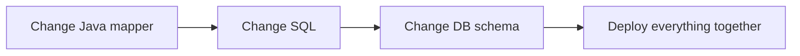
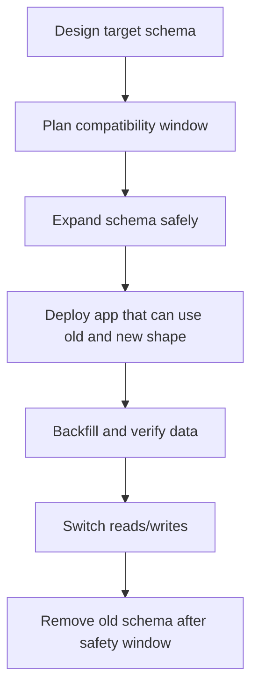
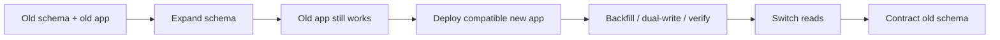
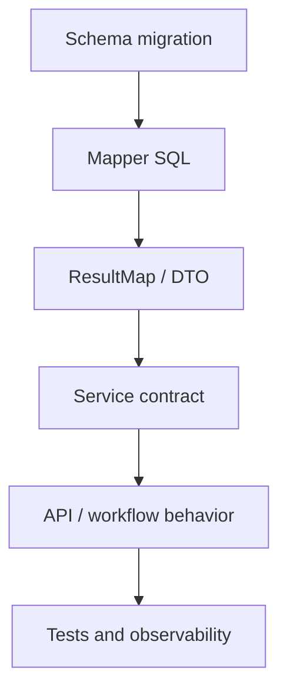
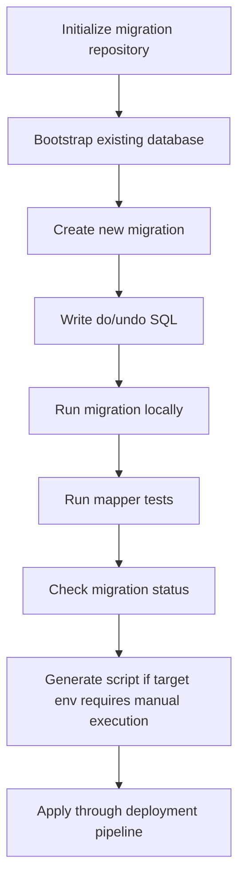
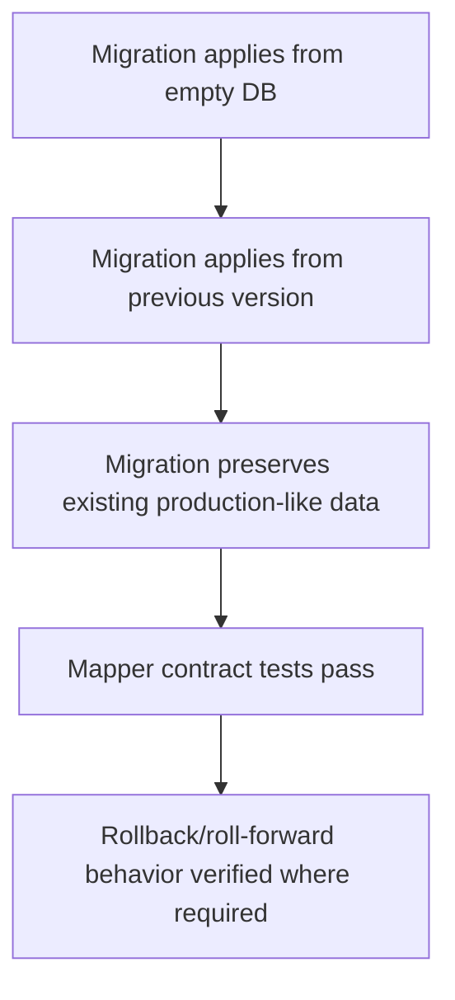
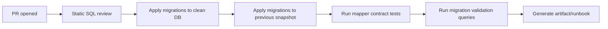

------
title: Learn Java MyBatis - Part 026
description: Schema migration strategy for MyBatis applications, covering MyBatis Migrations, expand-contract deployment, backward compatibility, rollback realism, migration testing, mapper/schema co-evolution, Flyway/Liquibase comparison, CI/CD governance, and zero-downtime release patterns.
series: learn-java-mybatis
seriesTitle: Learn Java MyBatis, Patterns, Anti-Patterns, and Production Persistence Mapping
order: 26
partTitle: Schema Migration and MyBatis Migrations
tags:
  - java
  - mybatis
  - migrations
  - schema-migration
  - database
  - sql
  - devops
  - ci-cd
  - production
  - architecture
date: 2026-06-28
------

# Part 026 — Schema Migration and MyBatis Migrations

MyBatis gives us explicit SQL ownership.

That means schema evolution is not a background infrastructure concern. It is part of the mapper design lifecycle.

If a column is renamed, a table is split, a status code changes, an index is added, or a foreign key becomes nullable, the mapper contract may change.

So a production MyBatis codebase needs a serious migration strategy.

This part covers:

- schema migration mental model,
- MyBatis Migrations,
- migration repository layout,
- mapper/schema co-evolution,
- expand-contract deployment,
- rollback reality,
- data backfill,
- compatibility views,
- CI migration checks,
- and governance rules for large systems.

This is not a generic “how to write `alter table`” guide.

It is about making schema changes safe when MyBatis mappers are explicit contracts over SQL.

---

## 1. The Core Problem

Application code and database schema rarely change at exactly the same instant.

In real systems:

- rolling deployments run old and new app versions together,
- blue/green deployment may route traffic to both versions,
- background workers may lag behind API deployment,
- read replicas may lag behind primary writes,
- ETL/export jobs may use old projections,
- emergency rollback may run old code against new schema,
- multiple teams may add migrations concurrently,
- and production data may not match ideal assumptions.

The unsafe mental model is:



This works only in simple environments.

A safer mental model is:



Schema migration is not a one-time script. It is a sequence of compatible states.

---

## 2. What MyBatis Migrations Is

MyBatis Migrations is the schema migration tool in the MyBatis ecosystem.

It provides a command-line approach for managing database evolution through migration scripts. The official documentation describes a lifecycle that includes initializing a migration repository, bootstrapping a database schema, creating migrations, applying migrations, reverting migrations, applying pending migrations out of order when safe, generating offline scripts, and checking migration status.

A migration script contains sections that allow the tool to apply and undo changes.

The official command model includes concepts like:

- `init` — initialize migration repository,
- `bootstrap` — bootstrap schema history,
- `new` — create migration script,
- `up` — apply pending migrations in order,
- `down` — undo the last applied migration,
- `pending` — apply pending migrations regardless of order when explicitly safe,
- `status` — inspect migration state,
- `script` — generate migration scripts for controlled environments.

The important idea is not the command syntax alone.

The important idea is this:

> Schema changes must be versioned, reviewable, repeatable, and tied to application compatibility.

---

## 3. Migration Tooling Is Not a Substitute for Migration Design

MyBatis Migrations, Flyway, Liquibase, and similar tools can apply scripts.

They cannot decide whether your deployment is safe.

A migration tool can tell you:

- what migrations exist,
- which migrations ran,
- which migrations are pending,
- whether a script failed,
- what order was applied.

It cannot automatically guarantee:

- old app compatibility,
- new app compatibility,
- semantic correctness of data backfill,
- query performance after table growth,
- absence of tenant leaks,
- downstream report compatibility,
- rollback feasibility,
- or legal/audit correctness.

That is engineering work.

The tool executes the plan. It does not create the plan.

---

## 4. Migration Repository Structure

A typical MyBatis Migrations repository has a dedicated migration directory and environment properties.

For a service codebase, use a layout that keeps schema changes near the application, but separate from mapper XML.

Example:

```text
case-service/
  src/main/java/com/acme/caseapp/
  src/main/resources/mappers/
    CaseReadMapper.xml
    CaseCommandMapper.xml
  src/main/resources/db/
    migrations/
      20260628090000_create_case_tables.sql
      20260628103000_add_case_sla_columns.sql
      20260628120000_create_assignment_table.sql
    seed/
      local-dev-seed.sql
    test-fixtures/
      case-contract-fixture.sql
  src/test/java/com/acme/caseapp/persistence/
  src/test/resources/db/
    fixtures/
```

The exact folder differs by tool and build system. The principle is stable:

- migration scripts are versioned,
- mapper XML is versioned,
- tests verify their compatibility,
- no production schema drift is accepted outside version control.

---

## 5. Migration Naming Rules

A migration name should communicate intent.

Bad:

```text
001_update.sql
002_fix.sql
003_new_columns.sql
```

Better:

```text
20260628090000_create_enforcement_case_tables.sql
20260628103000_add_sla_due_at_to_enforcement_case.sql
20260628120000_create_case_assignment_table.sql
20260628150000_backfill_case_assignment_from_case_assignee.sql
20260629100000_drop_legacy_assigned_officer_columns.sql
```

Good names help reviewers understand deployment risk.

Prefer names that say:

- what entity changes,
- what kind of change it is,
- whether it is schema or data migration,
- whether it is expand, backfill, switch, or contract.

For example:

```text
20260628120000_expand_create_case_assignment_table.sql
20260628130000_backfill_case_assignment.sql
20260628140000_switch_assignment_reads_to_assignment_table.md
20260629100000_contract_drop_case_assignee_columns.sql
```

The `.md` note in this example is not a tool migration. It is a release coordination document. For risky migrations, this is often worth adding.

---

## 6. Anatomy of a Migration Script

A migration script should be easy to review.

Example:

```sql
-- // add_case_sla_due_at
-- Migration SQL that makes the change.

alter table enforcement_case
  add column sla_due_at timestamp with time zone;

create index idx_enforcement_case_tenant_sla_due
  on enforcement_case (tenant_id, sla_due_at)
  where status in ('OPEN', 'UNDER_REVIEW', 'ESCALATED');

-- //@UNDO
-- SQL that reverses the change when possible.

drop index if exists idx_enforcement_case_tenant_sla_due;

alter table enforcement_case
  drop column sla_due_at;
```

The exact marker format depends on the migration tool. MyBatis Migrations uses a migration script model with apply and undo sections. The broader point is that reviewers should understand both forward and reverse direction.

However, do not confuse “has undo SQL” with “safe rollback.”

Dropping a column may be syntactically reversible but data-destructive.

---

## 7. Rollback Reality

Rollback is not always possible.

These changes are usually easy to roll back:

- add nullable column,
- add index concurrently/online,
- add new table unused by old code,
- add view,
- add non-enforced constraint for validation,
- add trigger disabled by default.

These changes are risky to roll back:

- drop column,
- rename column used by old app,
- split table after writes begin,
- change enum code values,
- tighten nullability before data cleanup,
- rewrite primary keys,
- change timezone interpretation,
- destructive data backfill,
- merge duplicate identities.

For risky migrations, prefer roll-forward.

Rollback plan should be explicit:

| Migration type | Rollback strategy |
|---|---|
| additive schema | undo script may be enough |
| data backfill | preserve source data until verified |
| column rename | use compatibility column/view first |
| table split | dual-write or backfill with validation |
| enum/code change | support old and new codes during window |
| destructive cleanup | backup, archive, or delayed contract step |

In production, “down migration exists” is not the same as “business-safe rollback exists.”

---

## 8. Expand-Contract Pattern

The expand-contract pattern is the default for safe schema evolution.

It has three broad phases:

1. **Expand** — add new schema without breaking old code.
2. **Migrate/switch** — deploy code that writes/reads new shape, backfill data, verify.
3. **Contract** — remove old schema only after no code depends on it.



Example: move assignment data from `enforcement_case.assigned_officer_id` to `case_assignment` table.

### Step 1 — Expand

```sql
create table case_assignment (
  tenant_id varchar(64) not null,
  case_id bigint not null,
  officer_id varchar(64) not null,
  assigned_at timestamp with time zone not null,
  active boolean not null default true,
  primary key (tenant_id, case_id, officer_id, assigned_at)
);

create index idx_case_assignment_active
  on case_assignment (tenant_id, case_id)
  where active = true;
```

Old app still reads `enforcement_case.assigned_officer_id`.

No break.

### Step 2 — Dual-read or compatibility read

New mapper can read from the new table with fallback:

```sql
select
  c.case_id,
  c.case_number,
  coalesce(a.officer_id, c.assigned_officer_id) as assigned_officer_id
from enforcement_case c
left join case_assignment a
  on a.tenant_id = c.tenant_id
 and a.case_id = c.case_id
 and a.active = true
where c.tenant_id = #{tenantId}
  and c.case_id = #{caseId}
```

### Step 3 — Backfill

```sql
insert into case_assignment (
  tenant_id,
  case_id,
  officer_id,
  assigned_at,
  active
)
select
  tenant_id,
  case_id,
  assigned_officer_id,
  coalesce(assigned_at, updated_at, created_at),
  true
from enforcement_case
where assigned_officer_id is not null
  and not exists (
    select 1
    from case_assignment a
    where a.tenant_id = enforcement_case.tenant_id
      and a.case_id = enforcement_case.case_id
      and a.active = true
  );
```

### Step 4 — Switch writes

New command mapper writes assignment changes to `case_assignment`.

During transition, you may dual-write to old column if rollback requires old app compatibility.

### Step 5 — Contract

Only after all apps, workers, reports, and jobs no longer depend on old columns:

```sql
alter table enforcement_case
  drop column assigned_officer_id,
  drop column assigned_at;
```

This final step should usually be a separate migration in a later release.

---

## 9. Mapper and Schema Co-Evolution

A MyBatis mapper is tightly coupled to column names, table names, result maps, type handlers, and SQL dialect.

Treat schema change and mapper change as one design unit.



When changing schema, ask:

- Which mapper XML files reference this table/column?
- Which dynamic SQL table objects reference it?
- Which projections include it?
- Which result maps alias it?
- Which type handlers depend on its representation?
- Which indexes support its queries?
- Which tests encode its behavior?
- Which downstream systems consume it?

Use search, database metadata, and mapper tests. Do not rely on memory.

---

## 10. Migration Compatibility Matrix

Before merging a schema change, document compatibility.

| DB state | Old app works? | New app works? | Rollback possible? | Notes |
|---|---:|---:|---:|---|
| before migration | yes | maybe | yes | new app may require expand |
| after expand | yes | yes | yes | preferred safe state |
| after backfill | yes | yes | mostly | verify data |
| after switch writes | maybe | yes | depends | dual-write needed for rollback |
| after contract | no | yes | difficult | only after safety window |

For high-risk changes, this matrix belongs in the PR description.

If you cannot fill it in, the migration is not ready.

---

## 11. Zero-Downtime Rules for MyBatis Mappers

Use these rules as defaults.

### Rule 1 — Add before use

Do not deploy mapper SQL that reads a new column before the column exists in all target databases.

Safe order:

1. add column,
2. deploy code that can read/write it,
3. later make it required if needed.

### Rule 2 — Do not rename directly

Direct rename breaks old mappers.

Unsafe:

```sql
alter table enforcement_case rename column status to lifecycle_status;
```

Safer:

```sql
alter table enforcement_case add column lifecycle_status varchar(50);
update enforcement_case set lifecycle_status = status;
```

Then update app. Drop old column later.

### Rule 3 — Do not tighten constraints before data cleanup

Unsafe:

```sql
alter table enforcement_case alter column sla_due_at set not null;
```

If existing rows have nulls, deployment fails.

Safer:

1. add nullable column,
2. backfill,
3. verify no nulls,
4. add constraint,
5. update mapper contract.

### Rule 4 — Keep old reads working during rolling deploy

If old app version can run after migration, old mapper SQL must still work.

### Rule 5 — Remove later

Contract migrations are delayed.

A good schema migration system is patient.

---

## 12. Backfill Design

Backfill is often more dangerous than DDL.

A bad backfill:

```sql
update enforcement_case
set sla_due_at = opened_at + interval '14 days';
```

Maybe correct. Maybe not.

Questions:

- Does SLA vary by case type?
- Does jurisdiction affect SLA?
- Are holidays excluded?
- Are paused cases excluded?
- Are closed cases included?
- Are historic cases governed by old rules?
- Does `opened_at` have timezone ambiguity?
- Should manual override exist?

Backfill must encode business semantics.

For large data, also consider:

- chunking,
- lock duration,
- transaction size,
- index impact,
- retry behavior,
- idempotency,
- progress tracking,
- validation query,
- monitoring.

Example idempotent chunked backfill pattern:

```sql
update enforcement_case
set sla_due_at = opened_at + interval '14 days'
where tenant_id = :tenant_id
  and sla_due_at is null
  and status in ('OPEN', 'UNDER_REVIEW', 'ESCALATED')
  and case_id > :last_case_id
order by case_id
limit :chunk_size;
```

The exact syntax differs by database. The pattern is what matters.

---

## 13. Data Validation Queries

Every non-trivial migration needs validation queries.

Example:

```sql
-- rows not backfilled
select count(*)
from enforcement_case
where status in ('OPEN', 'UNDER_REVIEW', 'ESCALATED')
  and sla_due_at is null;

-- mismatched assignment after table split
select count(*)
from enforcement_case c
left join case_assignment a
  on a.tenant_id = c.tenant_id
 and a.case_id = c.case_id
 and a.active = true
where c.assigned_officer_id is not null
  and a.officer_id is distinct from c.assigned_officer_id;

-- duplicate active assignments
select tenant_id, case_id, count(*)
from case_assignment
where active = true
group by tenant_id, case_id
having count(*) > 1;
```

Validation queries should be committed with the migration or included in deployment runbooks.

For critical systems, validation should be automated in CI/staging and observable in production.

---

## 14. Mapper Changes During Migration Windows

During migration, mappers may need temporary compatibility SQL.

Example fallback read:

```xml
<select id="findAssignment" resultMap="AssignmentMap">
  select
    c.tenant_id,
    c.case_id,
    coalesce(a.officer_id, c.assigned_officer_id) as officer_id,
    coalesce(a.assigned_at, c.assigned_at) as assigned_at
  from enforcement_case c
  left join case_assignment a
    on a.tenant_id = c.tenant_id
   and a.case_id = c.case_id
   and a.active = true
  where c.tenant_id = #{tenantId}
    and c.case_id = #{caseId}
</select>
```

This SQL is intentionally transitional.

Mark it clearly:

```xml
<!--
  Transitional migration SQL.
  Remove after migration 20260629100000_contract_drop_case_assignee_columns
  and after all services are on release 2026.07 or later.
-->
```

Temporary compatibility code without removal criteria becomes permanent complexity.

---

## 15. Views as Compatibility Layer

A database view can protect mappers during transition.

Example:

```sql
create view enforcement_case_assignment_view as
select
  c.tenant_id,
  c.case_id,
  coalesce(a.officer_id, c.assigned_officer_id) as officer_id,
  coalesce(a.assigned_at, c.assigned_at) as assigned_at
from enforcement_case c
left join case_assignment a
  on a.tenant_id = c.tenant_id
 and a.case_id = c.case_id
 and a.active = true;
```

Mapper:

```xml
<select id="findAssignment" resultType="AssignmentRow">
  select tenant_id, case_id, officer_id, assigned_at
  from enforcement_case_assignment_view
  where tenant_id = #{tenantId}
    and case_id = #{caseId}
</select>
```

Benefits:

- simplifies mapper SQL,
- centralizes compatibility logic,
- supports multiple consumers,
- can be replaced later.

Costs:

- hides complexity in database,
- may affect performance,
- must be versioned and tested,
- may complicate write paths.

Use views intentionally.

---

## 16. Index Migrations

Mapper performance often depends on indexes.

Changing a query without changing indexes is a common production incident source.

Example mapper predicate:

```sql
where tenant_id = #{tenantId}
  and status in ('OPEN', 'UNDER_REVIEW')
  and assigned_officer_id = #{officerId}
order by priority desc, opened_at asc, case_id asc
limit #{limit}
```

Likely index candidate:

```sql
create index idx_case_queue_officer
  on enforcement_case (
    tenant_id,
    assigned_officer_id,
    status,
    priority desc,
    opened_at asc,
    case_id asc
  );
```

Index design is database-specific. The MyBatis-specific point is:

> Mapper changes and index changes should be reviewed together.

If Part 020 introduced performance budgets, migration PRs are where those budgets become physical database structures.

### Index migration checklist

- Does the new mapper query need an index?
- Does the index match tenant predicate first?
- Does it support sorting?
- Is the index too wide?
- Can it be partial/filtered?
- Can it be created online/concurrently?
- Will it lock writes?
- Is there a rollback/drop plan?
- Is there an explain-plan before and after?

---

## 17. Constraint Migrations

Constraints are part of correctness.

Examples:

```sql
alter table enforcement_case
  add constraint chk_case_status
  check (status in ('OPEN', 'UNDER_REVIEW', 'ESCALATED', 'CLOSED'));

alter table case_assignment
  add constraint fk_case_assignment_case
  foreign key (tenant_id, case_id)
  references enforcement_case (tenant_id, case_id);
```

Do not treat constraints as optional if the application depends on them.

A mapper may assume:

- only one active assignment exists,
- status code is valid,
- tenant id is present,
- case number is unique per tenant,
- child rows cannot exist without parent.

If the database does not enforce these, mapper code must defensively handle broken states.

Better: enforce what the database can enforce.

### Constraint rollout pattern

For large existing tables:

1. add nullable/new column,
2. backfill,
3. validate dirty data,
4. clean dirty data,
5. add constraint in non-blocking way if database supports it,
6. update mapper tests,
7. monitor violations.

---

## 18. Enum and Lookup Table Migrations

Lifecycle codes are dangerous.

Example:

```sql
update enforcement_case
set status = 'UNDER_REVIEW'
where status = 'REVIEW';
```

This seems simple but may break old code if it still expects `REVIEW`.

Safer options:

- support both codes in TypeHandler temporarily,
- add lookup table mapping legacy code to canonical code,
- migrate data only after all apps accept new code,
- use compatibility view,
- introduce new code as additive state rather than rename.

Mapper TypeHandler during transition:

```java
public static CaseStatus fromCode(String code) {
    return switch (code) {
        case "REVIEW", "UNDER_REVIEW" -> CaseStatus.UNDER_REVIEW;
        case "OPEN" -> CaseStatus.OPEN;
        case "ESCALATED" -> CaseStatus.ESCALATED;
        case "CLOSED" -> CaseStatus.CLOSED;
        default -> throw new IllegalArgumentException("Unknown status: " + code);
    };
}
```

This should be temporary and tested.

After data is migrated and old versions are gone, remove legacy support.

---

## 19. MyBatis Migrations Workflow

A typical workflow with MyBatis Migrations looks conceptually like this:



The exact commands depend on your setup, but the engineering sequence should remain stable.

Example conceptual commands:

```bash
migrate status
migrate new add_case_sla_due_at
migrate up
migrate down
migrate script
```

Use the official docs for exact syntax and environment configuration.

Do not let local ad-hoc DDL bypass migration history.

---

## 20. Handling Concurrent Team Migrations

Multiple teams may create migrations from the same base.

This creates order conflicts.

Example:

```text
Team A: 20260628100000_add_sla_columns.sql
Team B: 20260628100500_create_case_tags.sql
Team C: 20260628093000_add_party_index.sql merged later
```

Out-of-order migrations can be safe if they are isolated.

They can be dangerous if they depend on each other.

Review questions:

- Does migration C depend on a table/column from A or B?
- Does it modify same table with incompatible lock behavior?
- Does it backfill data based on a new column?
- Does it create a constraint that assumes another migration already cleaned data?
- Does it change code values used by another mapper?

MyBatis Migrations has a `pending` command for applying pending migrations regardless of order when it has been reviewed as safe. Treat this as an explicit engineering decision, not a convenience shortcut.

---

## 21. Offline Script Generation

Some environments do not allow the application deployment pipeline to directly mutate schema.

Common examples:

- regulated environments,
- DBA-controlled production,
- customer-hosted installations,
- government systems,
- bank/financial environments,
- air-gapped deployments.

For these, migration tools may generate scripts for manual execution.

The generated script should be accompanied by:

- target version,
- pre-check queries,
- migration SQL,
- post-check queries,
- rollback/roll-forward plan,
- expected duration,
- lock risk,
- affected tables,
- application version compatibility,
- approval owner.

Do not hand a DBA a raw DDL file with no compatibility notes.

---

## 22. Migration Testing Strategy

A serious migration test suite has three levels.



### Test 1 — Fresh schema build

Can all migrations apply from zero?

This catches syntax errors and missing dependencies.

### Test 2 — Previous-version upgrade

Can the latest migration apply to a database at the previous production version?

This is closer to reality.

### Test 3 — Dirty data upgrade

Can migration handle imperfect historical data?

Production data usually has surprises.

### Test 4 — Mapper compatibility

After migration, do MyBatis mapper contract tests pass?

### Test 5 — Transitional compatibility

If old and new app versions overlap, do both contracts pass against expanded schema?

---

## 23. CI/CD Pipeline for Migrations

A good migration pipeline does not only run `migrate up`.

Example:



Minimum PR checks:

- migration file name is unique and ordered,
- migration applies cleanly,
- mapper tests pass,
- no destructive migration without explicit approval,
- no direct rename/drop in same release as mapper change unless maintenance window is approved,
- validation query exists for data migration,
- indexes are reviewed for new high-traffic queries.

For regulated environments, keep migration artifacts.

They are part of audit evidence.

---

## 24. Flyway, Liquibase, and MyBatis Migrations

Many Java teams use Flyway or Liquibase instead of MyBatis Migrations.

That is fine.

The engineering principles are the same.

| Tool | Style | Strength |
|---|---|---|
| MyBatis Migrations | SQL script migration in MyBatis ecosystem | simple, close to SQL, MyBatis-aligned |
| Flyway | versioned SQL/Java migrations | widely adopted, simple version model |
| Liquibase | XML/YAML/JSON/SQL changelog | rich metadata, rollback, diff-oriented workflows |

Do not choose migration tooling only by ecosystem loyalty.

Choose based on:

- team familiarity,
- deployment model,
- DBA process,
- audit requirements,
- rollback expectations,
- multi-database support,
- CI integration,
- operational maturity.

For a MyBatis application, the critical requirement is not that you use MyBatis Migrations specifically.

The critical requirement is that schema evolution is versioned, tested, reviewed, and compatible with mapper contracts.

---

## 25. Common MyBatis-Specific Migration Failures

### Failure 1 — Column renamed, result map silently breaks

```xml
<result property="status" column="status" />
```

After rename to `lifecycle_status`, mapper returns null or fails depending on mapping style.

Fix:

- explicit compatibility phase,
- update aliases,
- result map contract test.

### Failure 2 — New nullable column mapped to primitive

```java
public record CaseSlaRow(long remainingHours) {}
```

If SQL returns null, primitive mapping fails or becomes semantically wrong.

Fix:

- use wrapper/domain type,
- backfill before not-null mapping,
- nullability test.

### Failure 3 — Enum code migration breaks TypeHandler

Database code changes but Java enum handler does not.

Fix:

- temporary legacy code support,
- enum mapping regression test,
- database constraint update.

### Failure 4 — New search query without index

Mapper passes tests but times out in production.

Fix:

- review query plan,
- add index migration,
- performance budget test.

### Failure 5 — Contract migration too early

Old app still runs, but old column is dropped.

Fix:

- separate contract migration,
- deploy after safety window,
- check runtime fleet version.

### Failure 6 — Data migration not idempotent

Script partially fails, rerun duplicates data.

Fix:

- use `not exists`, unique constraints, progress table, or deterministic upsert.

### Failure 7 — Multi-tenant backfill misses tenant predicate

Backfill joins across tenant boundaries.

Fix:

- include tenant id in all joins,
- validate per tenant,
- test cross-tenant fixture.

---

## 26. Migration Review Checklist

Use this checklist for every schema PR.

### Compatibility

- Does old app still work after this migration?
- Does new app require this migration before deployment?
- Are old and new versions expected to overlap?
- Is rollback actually safe or only syntactically possible?
- Is this expand, backfill, switch, or contract?

### Mapper impact

- Which mapper XML files reference changed tables/columns?
- Which annotation/provider mappers reference them?
- Which Dynamic SQL table objects need update?
- Which result maps and projections change?
- Which TypeHandlers are affected?
- Which contract tests prove behavior?

### Data impact

- Is there existing data?
- Is data clean enough for constraints?
- Is backfill idempotent?
- Is backfill chunked if large?
- Are validation queries included?
- Is tenant isolation preserved?

### Performance

- Does new query need an index?
- Does new index create write overhead?
- Can index be created online?
- Is there an explain-plan review?
- Does migration lock critical tables?

### Operations

- Is deployment order documented?
- Is there a runbook?
- Are manual scripts needed?
- Are alerts/metrics needed during migration?
- Is there a post-deploy verification step?

---

## 27. Deliberate Practice

### Exercise 1 — Convert unsafe rename into expand-contract

Take this change:

```sql
alter table enforcement_case rename column status to lifecycle_status;
```

Rewrite it into:

1. expand migration,
2. compatible mapper SQL,
3. backfill script,
4. validation queries,
5. contract migration.

### Exercise 2 — Add mapper compatibility test

Create a test that proves `CaseSummaryMapper` works during the transition from old column to new column.

Use fixtures for:

- old-only data,
- new-only data,
- both columns populated,
- inconsistent values.

Decide expected behavior.

### Exercise 3 — Design index migration

Given a queue search mapper, design an index that supports:

- tenant predicate,
- status filter,
- assigned officer filter,
- deterministic ordering,
- pagination.

Then write review notes about trade-offs.

### Exercise 4 — Backfill safely

Write an idempotent backfill from `enforcement_case.assigned_officer_id` to `case_assignment`.

Include:

- tenant join,
- duplicate prevention,
- validation query,
- rollback/roll-forward note.

### Exercise 5 — Migration PR template

Create a PR template section for schema changes:

- compatibility matrix,
- mapper impact,
- data impact,
- performance impact,
- validation plan,
- rollback plan.

---

## 28. Mental Model Summary

In a MyBatis application, schema migrations and mapper contracts are inseparable.

A migration does not only change tables. It changes the truth that mapper SQL depends on.

Safe schema evolution requires:

- versioned scripts,
- explicit compatibility windows,
- expand-contract discipline,
- mapper contract tests,
- data validation,
- operational runbooks,
- and delayed removal of old schema.

MyBatis Migrations can help manage the mechanics of schema versioning. But the real engineering skill is designing migrations that are compatible with how software is actually deployed.

Top-tier engineers do not ask only:

> Does this migration run?

They ask:

> Which app versions, mapper contracts, data states, operational paths, and rollback scenarios remain safe before, during, and after this migration?

That is the difference between database change management and production schema engineering.

---

## References

- MyBatis Migrations Introduction: https://mybatis.org/migrations/
- MyBatis Migrations Lifecycle: https://mybatis.org/migrations/migrate.html
- MyBatis Migrations Up/Down Commands: https://mybatis.org/migrations/updown.html
- MyBatis Migrations Pending Command: https://mybatis.org/migrations/pending.html
- MyBatis Migrations Script Command: https://mybatis.org/migrations/script.html
- MyBatis Mapper XML Files: https://mybatis.org/mybatis-3/sqlmap-xml.html
