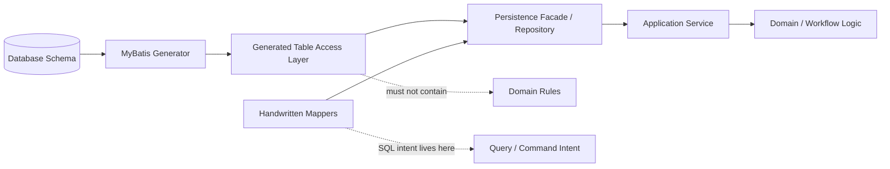
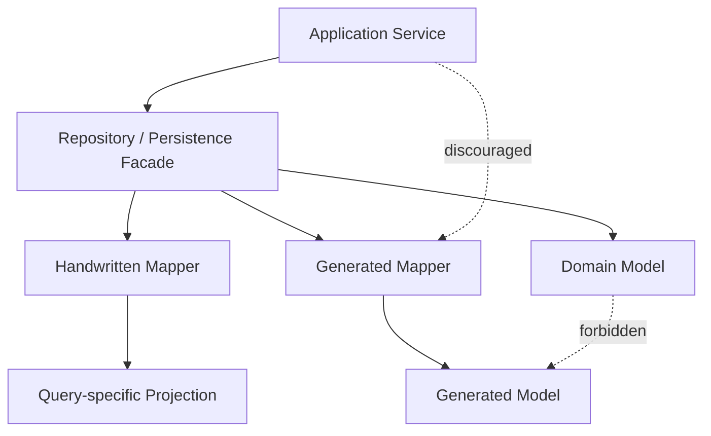
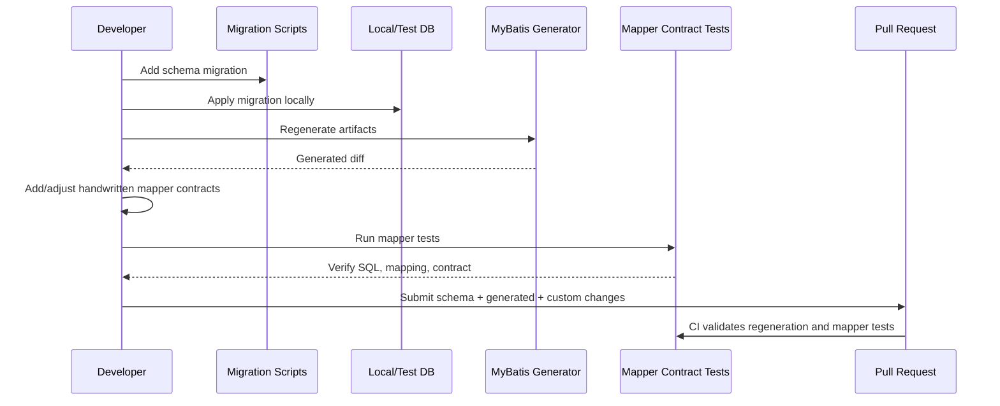

------
title: Learn Java MyBatis - Part 027
description: Advanced strategy for MyBatis Generator, generated CRUD boundaries, regeneration safety, plugins, governance, and production code generation decisions.
series: learn-java-mybatis
seriesTitle: Learn Java MyBatis, Patterns, Anti-Patterns, and Production Persistence Mapping
order: 27
partTitle: Code Generation and MyBatis Generator Strategy
tags:
  - java
  - mybatis
  - mybatis-generator
  - persistence
  - sql
  - code-generation
  - architecture
  - governance
date: 2026-06-28
---

# Part 027 — Code Generation and MyBatis Generator Strategy

Code generation in a MyBatis codebase is not primarily a productivity trick. In a large system, it is an architectural decision about **ownership**, **change control**, **schema drift**, and **where database-table mechanics are allowed to live**.

MyBatis Generator, often abbreviated as MBG, introspects database tables and generates artifacts that can be used to access those tables. Its official positioning is pragmatic: reduce the initial nuisance of setting up objects, mapper interfaces, and configuration for table access, especially for simple CRUD operations. That framing matters. MBG is excellent at eliminating repetitive table-access scaffolding. It is not a replacement for domain modeling, query design, authorization rules, transaction semantics, or production persistence governance.

This part teaches how to use code generation without letting generated code become the architecture.

## 1. Kaufman Skill Deconstruction

Following Josh Kaufman's acquisition model, we deconstruct the skill into small components that can be deliberately practiced.

| Sub-skill | What You Must Be Able To Do |
|---|---|
| Understand generator scope | Know exactly which artifacts are generated and which should remain handcrafted |
| Separate generated table access from domain intent | Avoid treating generated POJOs as rich domain models |
| Choose a generator runtime deliberately | Pick XML mapper, simple mapper, or Dynamic SQL generation based on team constraints |
| Govern regeneration | Regenerate safely without overwriting business code or destabilizing mapper contracts |
| Use plugins carefully | Extend generation only when the benefit is systemic and stable |
| Review generated code | Detect when generated code encourages bad repository or service design |
| Design hybrid persistence layers | Combine generated CRUD, custom SQL, projections, and command mappers cleanly |

The goal is not to memorize MBG XML options. The goal is to decide **where generation ends and engineering judgment begins**.

## 2. Mental Model: Generated Code Is Table Machinery

Generated code should be treated as **table machinery**.

It knows about:

- table names
- column names
- JDBC types
- generated keys
- basic CRUD shapes
- simple criteria objects or dynamic SQL support, depending on runtime
- mapper interfaces and XML files, depending on configuration

It should not be responsible for:

- business workflow decisions
- regulatory status transitions
- authorization
- tenant isolation policy unless generated into every query very deliberately
- audit semantics
- case lifecycle invariants
- cross-aggregate consistency
- API response shape
- application transaction boundaries

A safe mental model:



Generated code is useful because it is boring. Once generated code becomes clever, it is usually becoming dangerous.

## 3. What MBG Actually Gives You

MBG can generate different artifacts depending on its configuration and selected runtime. Official documentation describes MBG as a code generator that introspects database tables and generates artifacts for table access. It can generate Java model classes, mapper interfaces, XML mapping files, and Dynamic SQL support depending on configuration.

Typical generated artifacts include:

```text
src/generated/java/
  com/example/persistence/generated/model/CaseRecord.java
  com/example/persistence/generated/mapper/CaseRecordMapper.java
  com/example/persistence/generated/support/CaseRecordDynamicSqlSupport.java

src/generated/resources/
  com/example/persistence/generated/mapper/CaseRecordMapper.xml
```

Depending on the runtime:

| Runtime Style | Typical Output | Best Fit |
|---|---|---|
| Classic MyBatis XML | model class, mapper interface, mapper XML, criteria/example classes depending on config | Legacy or XML-heavy codebases |
| Simple MyBatis style | simpler CRUD-oriented mapper artifacts | Small applications, low abstraction needs |
| MyBatis3 Dynamic SQL style | model, mapper, dynamic SQL support classes | Type-safe query composition, Java-heavy teams |
| Kotlin style, where used | Kotlin-oriented generated artifacts | Kotlin projects |

The important decision is not merely “XML vs Java DSL”. It is **how much generated structure you are willing to expose to application code**.

## 4. The Biggest Architectural Risk

The biggest risk is this:

> The team starts from generated CRUD and lets generated table access become the persistence architecture.

That creates several long-term problems:

1. Services become table-script coordinators.
2. Generated models leak into API, domain, and workflow code.
3. Business commands are expressed as generic `updateByPrimaryKeySelective` calls.
4. Authorization and tenant predicates become optional rather than mandatory.
5. Complex read models are forced into table-shaped objects.
6. Refactoring becomes hard because generated contracts are used everywhere.

Generated CRUD is useful at the edge of the persistence layer. It should not become the application language.

Bad usage:

```java
@Service
public class CaseService {
    private final CaseRecordMapper caseRecordMapper;

    @Transactional
    public void escalate(long caseId) {
        CaseRecord record = caseRecordMapper.selectByPrimaryKey(caseId).orElseThrow();
        record.setStatus("ESCALATED");
        record.setEscalatedAt(LocalDateTime.now());
        record.setUpdatedBy(SecurityContext.userId());
        caseRecordMapper.updateByPrimaryKey(record);
    }
}
```

The service is now mutating a table-shaped generated object and trusting a generic update to enforce a business transition. That is weak.

Better usage:

```java
@Mapper
public interface CaseCommandMapper {
    int escalateCase(EscalateCaseCommand command);
}

public record EscalateCaseCommand(
        long caseId,
        long tenantId,
        String expectedStatus,
        String nextStatus,
        long actorUserId,
        Instant now
) {}
```

```xml
<update id="escalateCase">
  update regulatory_case
  set status = #{nextStatus},
      escalated_at = #{now},
      updated_by = #{actorUserId},
      updated_at = #{now},
      version = version + 1
  where case_id = #{caseId}
    and tenant_id = #{tenantId}
    and status = #{expectedStatus}
</update>
```

Here, the mapper method encodes the domain-relevant persistence invariant. The affected row count becomes part of the correctness contract.

Generated CRUD may still exist for simple administrative maintenance, reference-data lookup, or scaffolding, but not for critical workflow transitions.

## 5. Recommended Package Layout

A production-grade layout separates generated artifacts from handcrafted persistence intent.

```text
src/main/java/com/acme/caseapp/
  casework/
    application/
      CaseWorkflowService.java
    domain/
      CaseStatus.java
      CaseId.java
      TenantId.java
    persistence/
      CaseRepository.java
      CaseCommandMapper.java
      CaseQueryMapper.java
      CaseAggregateLoader.java
      model/
        CaseDetailRow.java
        CaseQueueRow.java
        CaseAuditRow.java

  persistence/generated/
    model/
      RegulatoryCaseRecord.java
      PartyRecord.java
      EvidenceRecord.java
    mapper/
      RegulatoryCaseRecordMapper.java
      PartyRecordMapper.java
      EvidenceRecordMapper.java
    support/
      RegulatoryCaseRecordDynamicSqlSupport.java
      PartyRecordDynamicSqlSupport.java

src/main/resources/com/acme/caseapp/casework/persistence/
  CaseCommandMapper.xml
  CaseQueryMapper.xml
```

Rules:

- `persistence/generated/**` may be regenerated.
- Application services do not inject generated mappers directly.
- Domain code never imports generated table record classes.
- Handwritten mappers express workflow-specific query and command intent.
- Generated mappers can be used behind a facade when the operation is truly table-mechanical.
- Custom read models live outside generated packages.

A dependency direction check:



## 6. Decision Matrix: Generate or Handwrite?

| Use Case | Generate? | Reason |
|---|---:|---|
| Simple lookup by primary key | Usually yes | Low business semantics |
| Reference table CRUD | Often yes | Stable table-shaped operations |
| Admin maintenance screen | Maybe | Acceptable if business rules are light |
| Complex search screen | Usually no | Needs explicit criteria, authorization, deterministic sorting |
| Regulatory status transition | No | Must encode invariant and affected-row semantics |
| Bulk escalation | No | Requires set-based, guarded, auditable command |
| Dashboard projection | No | Query-specific shape, often joins and aggregates |
| Audit trail append | Handwrite | Must enforce actor/time/correlation metadata |
| Outbox insert | Handwrite | Part of consistency contract |
| Many-table aggregate load | Handwrite or hybrid | Needs controlled graph reconstruction |
| Internal back-office export | Handwrite | Needs stable projection and pagination/export semantics |

A practical rule:

> Generate table mechanics. Handwrite business intent.

## 7. A Minimal MBG Configuration Example

A simplified configuration might look like this:

```xml
<?xml version="1.0" encoding="UTF-8"?>
<!DOCTYPE generatorConfiguration
  PUBLIC "-//mybatis.org//DTD MyBatis Generator Configuration 1.0//EN"
  "https://mybatis.org/dtd/mybatis-generator-config_1_0.dtd">

<generatorConfiguration>
  <context id="casework" targetRuntime="MyBatis3DynamicSql">
    <jdbcConnection
        driverClass="org.postgresql.Driver"
        connectionURL="jdbc:postgresql://localhost:5432/casework"
        userId="casework"
        password="casework" />

    <javaModelGenerator
        targetPackage="com.acme.caseapp.persistence.generated.model"
        targetProject="src/generated/java" />

    <javaClientGenerator
        targetPackage="com.acme.caseapp.persistence.generated.mapper"
        targetProject="src/generated/java" />

    <table tableName="regulatory_case" domainObjectName="RegulatoryCaseRecord" />
    <table tableName="party" domainObjectName="PartyRecord" />
    <table tableName="evidence" domainObjectName="EvidenceRecord" />
  </context>
</generatorConfiguration>
```

Notes:

- Keep generated output in a recognizable generated source directory.
- Do not point generation into handcrafted packages.
- Use domain object names that make table-shape explicit, for example `RegulatoryCaseRecord`, not `Case`.
- Avoid naming generated POJOs as if they were rich domain aggregates.

For XML-oriented generation, configuration typically includes SQL map generation and a client generator type appropriate to XML mappers. The exact configuration should follow the selected MBG runtime and current official documentation.

## 8. Generated Models Are Not Rich Domain Models

Official MBG documentation explicitly warns that generated Java model classes correspond to table fields and should not be confused with a rich domain model. That warning is architecturally important.

A generated model is table-shaped:

```java
public class RegulatoryCaseRecord {
    private Long caseId;
    private Long tenantId;
    private String status;
    private LocalDateTime openedAt;
    private LocalDateTime closedAt;
    private Integer version;

    // getters and setters
}
```

A domain model is behavior-shaped:

```java
public final class RegulatoryCase {
    private final CaseId id;
    private final TenantId tenantId;
    private CaseStatus status;
    private Version version;

    public EscalationDecision evaluateEscalation(EscalationPolicy policy, Instant now) {
        // domain reasoning, not table mutation
    }
}
```

They may contain similar data, but they are not the same abstraction.

Generated model leak smells:

- controller returns generated record directly
- service accepts generated record as command input
- domain object extends generated record
- generated record has domain behavior added manually
- generated record is edited by developers and later overwritten
- generated object field names drive API naming

Better approach:

```java
public final class CaseRepository {
    private final RegulatoryCaseRecordMapper generatedCaseMapper;
    private final CaseCommandMapper commandMapper;
    private final CaseQueryMapper queryMapper;

    public CaseDetail loadDetail(CaseId id, TenantId tenantId) {
        return queryMapper.findDetail(id.value(), tenantId.value())
                .orElseThrow(CaseNotFoundException::new);
    }

    public void escalate(EscalateCaseCommand command) {
        int updated = commandMapper.escalateCase(command);
        if (updated != 1) {
            throw new ConcurrentCaseUpdateException(command.caseId());
        }
    }
}
```

The repository may use generated components internally, but it exports application-relevant operations.

## 9. Generation Boundaries in a Large Codebase

Generation boundaries should be explicit and enforceable.

Recommended rules:

1. Generated source path is separate.
2. Generated package name includes `.generated`.
3. Generated classes are not edited by humans.
4. Generated mappers are not injected into application services.
5. Generated model classes are not used as API DTOs.
6. Custom mapper XML is not generated into the same directory as generated XML.
7. Regeneration is deterministic and reproducible in CI.
8. Generated diffs are reviewed like schema diffs.

A simple architecture test can enforce some of this:

```java
@Test
void domainMustNotDependOnGeneratedPersistence() {
    JavaClasses classes = new ClassFileImporter()
            .importPackages("com.acme.caseapp");

    noClasses()
            .that().resideInAPackage("..domain..")
            .should().dependOnClassesThat().resideInAPackage("..persistence.generated..")
            .check(classes);
}
```

This is not about purity. It is about keeping regeneration from becoming a breaking architectural event.

## 10. Regeneration Strategy

There are three broad regeneration strategies.

### Strategy A — Generated Code Is Checked In

Generated code is committed to the repository.

Pros:

- visible diffs
- no generator required during normal compile
- easier debugging
- stable for teams with many IDE setups

Cons:

- large diffs
- merge conflicts
- risk of manual edits
- generated code noise in reviews

Good for:

- enterprise teams
- regulated environments
- stable schema
- teams that want explicit review of generated artifacts

Rules:

- generated code is never manually edited
- generated diffs must be reviewed after schema change
- generator version is pinned
- regeneration is reproducible

### Strategy B — Generated Code Is Built During Compile

Generated code is not committed. The build generates it.

Pros:

- no generated code in VCS
- clean repository
- always generated from current config

Cons:

- harder debugging
- build depends on database/schema metadata or generated metadata
- generation drift may surprise developers
- less visible review surface

Good for:

- stable automation
- low-regulation systems
- teams comfortable with generated-source build steps

Rules:

- generation must not depend on a mutable shared database
- generation inputs must be versioned
- build must be reproducible offline or in CI

### Strategy C — Generate Once, Then Handcraft

Generator is used only to bootstrap initial code.

Pros:

- avoids long-term generator governance
- simple for small systems
- allows full customization

Cons:

- loses regeneration benefits
- schema drift becomes manual
- generated style may still influence architecture

Good for:

- small services
- one-time migrations
- prototypes that become mature with careful refactoring

The dangerous variant is pretending Strategy C is Strategy A. If the team edits generated code but also expects to regenerate later, conflict is inevitable.

## 11. A Safe Regeneration Workflow

A production-grade workflow:



Checklist:

- Schema migration exists before generator changes.
- Generator config is versioned.
- Generator version is pinned.
- Generated output path is deterministic.
- No handcrafted files are overwritten.
- Generated diff is reviewed.
- Mapper contract tests pass.
- Critical custom SQL is not replaced by generic CRUD.
- Architecture tests prevent generated model leakage.

## 12. Generated CRUD Behind a Facade

Generated mappers can be useful if they are hidden behind application-specific facades.

Example: simple reference data.

```java
@Repository
public class ViolationTypeRepository {
    private final ViolationTypeRecordMapper mapper;

    public Optional<ViolationType> findByCode(String code) {
        return mapper.selectOne(c -> c.where(ViolationTypeDynamicSqlSupport.code, isEqualTo(code)))
                .map(this::toDomain);
    }

    private ViolationType toDomain(ViolationTypeRecord record) {
        return new ViolationType(record.getCode(), record.getDisplayName(), record.getSeverityLevel());
    }
}
```

The generated mapper does the table access. The repository owns the domain translation and the public contract.

## 13. Generated Code and Dynamic SQL

When using MBG with a Dynamic SQL runtime, generated support classes usually make table and column references available as Java objects. This can help reduce stringly-typed SQL in simple-to-medium query composition.

Example style:

```java
import static com.acme.persistence.generated.support.RegulatoryCaseDynamicSqlSupport.*;
import static org.mybatis.dynamic.sql.SqlBuilder.*;

List<RegulatoryCaseRecord> rows = caseMapper.select(c -> c
        .where(tenantId, isEqualTo(command.tenantId()))
        .and(status, isIn("OPEN", "UNDER_REVIEW"))
        .orderBy(openedAt.descending())
        .limit(100));
```

This is cleaner than string concatenation, but it does not automatically solve architectural concerns.

Risks remain:

- dynamic criteria can become too permissive
- generated column support can leak across modules
- services can start composing SQL directly
- authorization predicates may be forgotten
- query intent can become scattered

Safer style:

```java
@Repository
public class CaseQueueGateway {
    private final CaseQueueMapper mapper;

    public List<CaseQueueRow> findQueue(CaseQueueCriteria criteria) {
        CaseQueueCriteria normalized = criteria.normalized();
        return mapper.findQueue(normalized);
    }
}
```

The query criteria and mapper remain explicit. Dynamic SQL support is an implementation detail.

## 14. Plugins: Useful but Dangerous

MBG supports plugins for modifying or adding generated objects. Plugins are powerful because they change generated output systematically. That is also what makes them risky.

Use plugins when:

- the rule is stable across many tables
- the generated output must follow team-wide convention
- manual post-processing would be repetitive and error-prone
- the plugin is tested
- the plugin is versioned and documented

Avoid plugins when:

- the requirement applies to only one or two tables
- the plugin embeds business logic
- the plugin creates surprising hidden behavior
- the plugin makes generated code hard to understand
- the plugin is used to compensate for poor package boundaries

Good plugin candidates:

- add generated annotation
- suppress timestamps in generated comments for deterministic diffs
- add standard serialization marker if required
- adjust naming convention
- generate lightweight metadata needed by infrastructure

Bad plugin candidates:

- inject authorization logic into generated CRUD
- generate workflow transition methods from status columns
- add domain methods to generated records
- generate service classes
- generate controller endpoints

A plugin should make table-access generation more consistent. It should not move application design into code generation.

## 15. The “Generated Service” Trap

Some teams are tempted to generate:

- entity
- mapper
- service
- controller
- API schema
- frontend form

This can be useful for admin scaffolding, but it is dangerous in workflow-heavy systems.

For regulatory case management, generated service/controller stacks usually fail because:

- lifecycle rules are not CRUD
- transitions require guards
- actions require audit and actor context
- reads are projection-specific
- security is contextual
- evidence and party relationships are not table-local
- bulk operations require controlled semantics
- reporting queries are not aggregate loads

Generated CRUD may support an internal admin maintenance screen. It should not define the core case workflow.

## 16. Naming Generated Artifacts

Names shape behavior. Use names that prevent abstraction confusion.

Recommended:

```text
RegulatoryCaseRecord
PartyRecord
EvidenceRecord
GeneratedCaseMapper
RegulatoryCaseDynamicSqlSupport
```

Avoid:

```text
Case
Party
Evidence
CaseRepository
CaseService
```

Why?

- `Case` sounds like a domain aggregate.
- `CaseRepository` sounds like an application-facing port.
- `CaseService` sounds like business logic.
- Generated code should not steal those names.

A useful convention:

| Layer | Name Example |
|---|---|
| Generated table model | `RegulatoryCaseRecord` |
| Query projection | `CaseQueueRow`, `CaseDetailView` |
| Domain aggregate | `RegulatoryCase` |
| Application command | `EscalateCaseCommand` |
| Handwritten command mapper | `CaseCommandMapper` |
| Handwritten query mapper | `CaseQueryMapper` |
| Application-facing persistence facade | `CaseRepository` |

## 17. Handling Schema Changes

Schema changes affect generated code. Treat this as part of migration design.

### Adding a Nullable Column

Usually safe:

1. Add migration.
2. Regenerate model/support classes.
3. Add mapper tests for new projection only if used.
4. Avoid exposing the field accidentally through API.

### Adding a Non-Nullable Column

Requires more care:

1. Add nullable column first or with default.
2. Backfill.
3. Update insert command mappers.
4. Regenerate code.
5. Add contract tests.
6. Enforce not-null after data is valid.

### Renaming a Column

High risk:

1. Add new column.
2. Dual-write if necessary.
3. Backfill.
4. Update custom mappers.
5. Regenerate.
6. Remove old column after compatibility window.

### Changing a Column Type

Very high risk:

- verify TypeHandler impact
- verify generated Java type impact
- verify projection mapping
- verify JSON/time/enum conversion
- verify API compatibility
- update tests before deployment

Generated code makes schema changes visible. It does not make them safe by itself.

## 18. Generated Code Review Checklist

Review generated diffs using a short checklist.

### Schema-to-Code Consistency

- Are new columns represented with expected Java types?
- Are nullable columns modeled safely?
- Did any column disappear unexpectedly?
- Did JDBC type inference change?
- Did generated key behavior change?
- Did table or column naming create confusing Java names?

### Architecture Boundary

- Are generated classes still under `.generated`?
- Did any service start injecting generated mapper directly?
- Did generated records leak into controller/API/domain?
- Are custom command/query mappers still the public persistence boundary?

### Runtime Safety

- Are inserts updated for new required columns?
- Are updates still guarded where required?
- Are tenant predicates still enforced in custom queries?
- Did regeneration remove or overwrite handwritten SQL?
- Did mapper XML namespace remain stable?

### Test Coverage

- Do mapper tests pass against real database?
- Do projection tests catch alias changes?
- Do migration tests catch compatibility issues?
- Do architecture tests catch dependency leaks?

## 19. Anti-Patterns

### Anti-Pattern 1 — Generated Mapper Injection Everywhere

```java
@Service
class EnforcementService {
    private final RegulatoryCaseRecordMapper caseMapper;
    private final EvidenceRecordMapper evidenceMapper;
    private final PartyRecordMapper partyMapper;
}
```

Problem:

- service becomes table orchestration
- no stable persistence contract
- generated API shapes business logic

Correction:

```java
@Service
class EnforcementService {
    private final CaseRepository caseRepository;
}
```

### Anti-Pattern 2 — Rich Domain Behavior in Generated Records

```java
public class RegulatoryCaseRecord {
    public boolean canEscalate() {
        return "OPEN".equals(status);
    }
}
```

Problem:

- regenerated code may overwrite behavior
- table record now pretends to be domain model

Correction:

Move behavior to domain or policy object.

### Anti-Pattern 3 — Generic Update for Critical Commands

```java
record.setStatus("CLOSED");
caseMapper.updateByPrimaryKey(record);
```

Problem:

- no expected current state
- no affected-row invariant
- no tenant guard visible
- easy lost update

Correction:

Use a guarded command mapper.

### Anti-Pattern 4 — Editing Generated XML Manually

Problem:

- regeneration overwrites changes
- generated and custom responsibilities blur

Correction:

Create a handwritten mapper XML file.

### Anti-Pattern 5 — Generator Config as Tribal Knowledge

Problem:

- regeneration differs by developer
- output changes unpredictably

Correction:

Pin generator version, commit config, document workflow, run generator in CI or verify generated diff.

## 20. Production Playbook: Hybrid Generated + Handwritten MyBatis

A strong hybrid strategy:

1. Generate table records and simple mappers.
2. Keep generated code in `.generated` packages.
3. Use generated mappers only inside persistence facades.
4. Handwrite workflow command mappers.
5. Handwrite read model query mappers.
6. Use generated Dynamic SQL support only in gateway/repository layer.
7. Add architecture tests to prevent generated leakage.
8. Add mapper contract tests for custom SQL.
9. Treat generator output as schema-derived infrastructure.
10. Never let generated CRUD define domain behavior.

## 21. Case Management Example

Imagine these tables:

```text
regulatory_case
party
evidence
enforcement_action
case_assignment
audit_event
outbox_event
```

Good generated candidates:

- `party_type` reference table
- `violation_code` reference table
- simple admin lookup tables
- generated records for table-to-row conversion

Bad generated candidates:

- `escalateCase`
- `closeCase`
- `claimNextCase`
- `bulkEscalateOverdueCases`
- `findInvestigatorQueue`
- `appendAuditAndOutbox`

Why?

These operations encode workflow, concurrency, tenant, and audit semantics.

A handcrafted command mapper might look like:

```java
@Mapper
public interface CaseWorkflowCommandMapper {
    int claimCase(ClaimCaseCommand command);
    int escalateOverdueCases(BulkEscalationCommand command);
    int closeCase(CloseCaseCommand command);
}
```

Generated code may still help with table-shaped maintenance, but the workflow mappers own the business-relevant SQL.

## 22. Deliberate Practice

### Drill 1 — Identify Generated Leakage

Review a service class that injects five generated mappers. Refactor it behind a repository/facade with explicit methods:

- `loadCaseDetail`
- `claimCase`
- `appendEvidence`
- `findAssignmentQueue`

Success criteria:

- service no longer imports generated packages
- generated model classes do not cross application boundary
- workflow commands use guarded SQL

### Drill 2 — Design a Regeneration Workflow

For a table with a new required column:

1. Write the migration plan.
2. Regenerate MBG artifacts.
3. List expected generated diffs.
4. Update custom insert mappers.
5. Add regression tests.

Success criteria:

- no deployment step breaks old code
- generated diff is explainable
- mapper tests catch missing insert column

### Drill 3 — Separate Generated CRUD from Business Commands

Given a generated `updateByPrimaryKeySelective`, write a custom command mapper for `approveEnforcementAction` that requires:

- `tenant_id`
- expected current status
- actor user id
- timestamp
- version guard

Success criteria:

- affected row count is checked
- SQL contains all guards
- service does not mutate generated table record directly

## 23. Final Heuristics

Use MBG when:

- table access is repetitive
- CRUD mechanics are boring
- schema is large enough to justify generation
- team can govern regeneration
- generated code is kept behind boundaries

Avoid or limit MBG when:

- domain logic is table-local only by accident
- schema changes frequently without governance
- developers will edit generated code manually
- generated models would leak into APIs
- workflow commands require strong invariants

The best MyBatis engineers are not anti-generation. They are anti-accidental architecture.

## References

- MyBatis Generator Introduction: https://mybatis.org/generator/
- MyBatis Generator Quick Start Guide: https://mybatis.org/generator/quickstart.html
- MyBatis Generator Generated Java Model Classes: https://mybatis.org/generator/generatedobjects/javamodel.html
- MyBatis Generator Generated Java Client Objects: https://mybatis.org/generator/generatedobjects/javaclient.html
- MyBatis Generator Plugins: https://mybatis.org/generator/reference/pluggingIn.html
- MyBatis Dynamic SQL Introduction: https://mybatis.org/mybatis-dynamic-sql/docs/introduction.html
