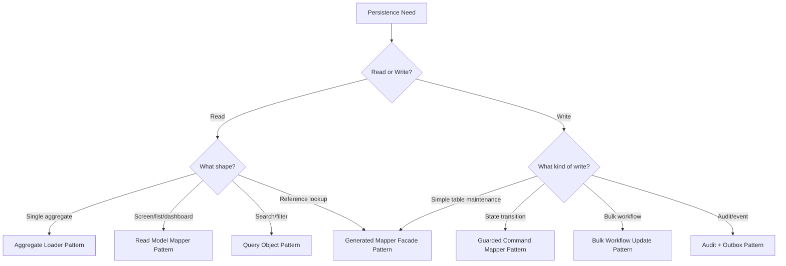
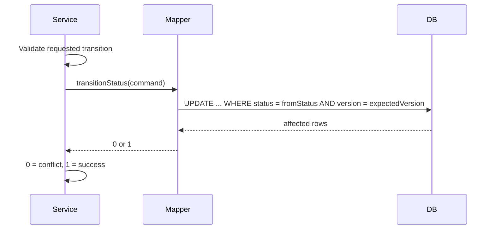
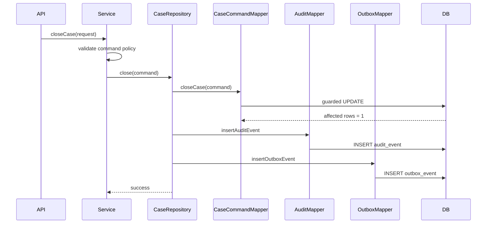

------
title: Learn Java MyBatis - Part 028
description: Production-grade MyBatis patterns catalog covering explicit SQL ownership, query objects, read models, command mappers, aggregate loaders, tenant safety, auditability, outbox, and mapper facades.
series: learn-java-mybatis
seriesTitle: Learn Java MyBatis, Patterns, Anti-Patterns, and Production Persistence Mapping
order: 28
partTitle: Production Patterns Catalog
tags:
  - java
  - mybatis
  - persistence
  - sql
  - architecture
  - patterns
  - production
  - case-management
date: 2026-06-28
---

# Part 028 — Production Patterns Catalog

This part is a MyBatis-specific pattern catalog. It intentionally avoids re-teaching generic design patterns. Every pattern here exists because MyBatis gives you explicit SQL control, and explicit control requires explicit design discipline.

MyBatis is powerful because mapped statements let the team own SQL directly. That same power can become a maintenance problem if mapper methods are treated as random database functions. Production-grade MyBatis codebases need a small set of repeatable persistence patterns that make SQL intent, transaction behavior, tenant safety, and mapping shape obvious.

The patterns below are written for systems where correctness matters: regulatory workflows, case management, enforcement lifecycle systems, audit-heavy back-office platforms, financial operations, and high-volume internal systems.

## 1. Pattern Selection Mental Model

Before choosing a pattern, classify the persistence operation.



A good MyBatis pattern answers four questions:

1. Who owns the SQL?
2. What invariant does the SQL enforce?
3. What shape does the mapper return?
4. How will failure be detected?

## 2. Pattern: Explicit SQL Ownership

### Problem

In many teams, SQL is spread across XML mappers, annotation strings, provider methods, helper classes, generated mappers, and service-level query builders. Nobody owns query semantics.

### Solution

Assign every SQL statement to one owner:

- command mapper for state-changing business command
- query mapper for read model/projection
- generated mapper for mechanical table access
- migration script for schema change
- repository/facade for application-facing persistence contract

### Structure

```text
casework/persistence/
  CaseCommandMapper.java
  CaseCommandMapper.xml
  CaseQueryMapper.java
  CaseQueryMapper.xml
  CaseAggregateLoader.java
  CaseRepository.java
```

### Example

```java
@Mapper
public interface CaseCommandMapper {
    int assignCase(AssignCaseCommand command);
    int escalateCase(EscalateCaseCommand command);
    int closeCase(CloseCaseCommand command);
}
```

```java
@Mapper
public interface CaseQueryMapper {
    Optional<CaseDetailView> findCaseDetail(CaseDetailCriteria criteria);
    List<CaseQueueRow> findInvestigatorQueue(CaseQueueCriteria criteria);
}
```

### Invariant

A mapper method should have one reason to exist. If the method name cannot express its persistence intent clearly, the SQL likely has unclear ownership.

### Failure Modes

- service builds SQL fragments manually
- generated CRUD used for workflow transition
- one mapper contains all SQL for a module
- query and command methods are mixed without naming discipline
- XML fragments become pseudo-frameworks

### Review Questions

- Can a reviewer identify why this SQL exists?
- Is the method name business-relevant or table-mechanical?
- Is this query better as a projection mapper?
- Is this command enforcing its own consistency guard?

## 3. Pattern: Mapper Contract Pattern

### Problem

Mapper methods are often treated as internal implementation details. Over time, services start depending on incidental query behavior: ordering, nullability, tenant scope, eager-loaded children, or specific default filters.

### Solution

Treat each mapper method as a contract. Define input, output, ordering, nullability, authorization scope, tenant behavior, and failure semantics explicitly.

### Example

```java
public record CaseQueueCriteria(
        long tenantId,
        long investigatorUserId,
        Set<String> statuses,
        Instant dueBefore,
        int limit,
        String sortKey,
        SortDirection sortDirection
) {
    public CaseQueueCriteria normalized() {
        if (limit < 1 || limit > 200) {
            throw new IllegalArgumentException("limit must be between 1 and 200");
        }
        return this;
    }
}
```

```java
@Mapper
public interface CaseQueueMapper {
    /**
     * Returns visible cases for one investigator in deterministic order.
     * Always filters by tenant_id and investigator_user_id.
     * Never returns closed cases unless explicitly included in statuses.
     */
    List<CaseQueueRow> findQueue(CaseQueueCriteria criteria);
}
```

### Contract Dimensions

| Dimension | Example Contract |
|---|---|
| Cardinality | zero-or-one, exactly-one, many |
| Ordering | deterministic by due date then id |
| Tenant scope | always requires tenant id |
| Security scope | only assigned investigator cases |
| Nullability | nullable due date, non-null case id |
| Consistency | read committed snapshot acceptable |
| Performance | limit max 200 |
| Failure | empty list means no visible cases, not permission error |

### Failure Modes

- method returns list but caller assumes one row
- query has implicit order only by database accident
- missing tenant predicate
- nullable column mapped to primitive
- dynamic SQL allows unbounded result
- security scope implemented outside mapper inconsistently

## 4. Pattern: Query Object Pattern

### Problem

Search screens and work queues accumulate many optional filters. Passing many method parameters into a mapper creates fragile signatures and encourages unsafe dynamic SQL.

### Solution

Use a dedicated query object that normalizes, validates, and expresses allowed query dimensions.

### Example

```java
public record EnforcementSearchCriteria(
        long tenantId,
        Set<String> statuses,
        Set<String> violationCodes,
        Instant openedFrom,
        Instant openedTo,
        String keyword,
        SortField sortField,
        SortDirection sortDirection,
        int limit,
        String afterCursor
) {
    public EnforcementSearchCriteria normalized() {
        return new EnforcementSearchCriteria(
                tenantId,
                statuses == null ? Set.of() : Set.copyOf(statuses),
                violationCodes == null ? Set.of() : Set.copyOf(violationCodes),
                openedFrom,
                openedTo,
                normalizeKeyword(keyword),
                sortField == null ? SortField.OPENED_AT : sortField,
                sortDirection == null ? SortDirection.DESC : sortDirection,
                Math.min(Math.max(limit, 1), 200),
                afterCursor
        );
    }

    private static String normalizeKeyword(String value) {
        if (value == null || value.isBlank()) return null;
        return value.trim().toLowerCase(Locale.ROOT);
    }
}
```

Mapper:

```java
@Mapper
public interface EnforcementSearchMapper {
    List<EnforcementSearchRow> search(EnforcementSearchCriteria criteria);
    long count(EnforcementSearchCriteria criteria);
}
```

XML excerpt:

```xml
<select id="search" resultMap="EnforcementSearchRowMap">
  select
      c.case_id,
      c.case_number,
      c.status,
      c.opened_at,
      c.due_at,
      v.violation_code,
      p.display_name as primary_party_name
  from regulatory_case c
  join violation v on v.case_id = c.case_id
  left join party p on p.party_id = c.primary_party_id
  <where>
    c.tenant_id = #{tenantId}
    <if test="statuses != null and !statuses.isEmpty()">
      and c.status in
      <foreach collection="statuses" item="status" open="(" separator="," close=")">
        #{status}
      </foreach>
    </if>
    <if test="keyword != null">
      and lower(c.case_number) like concat('%', #{keyword}, '%')
    </if>
  </where>
  order by
  <choose>
    <when test="sortField.name() == 'DUE_AT'">c.due_at</when>
    <when test="sortField.name() == 'OPENED_AT'">c.opened_at</when>
    <otherwise>c.case_id</otherwise>
  </choose>
  ${sortDirection.sqlKeyword}
  limit #{limit}
</select>
```

For `${sortDirection.sqlKeyword}`, use only a trusted enum value, never raw user input.

### Invariant

The query object is the only place where external request values become normalized persistence criteria.

### Failure Modes

- raw HTTP request passed to mapper
- `Map<String, Object>` criteria
- arbitrary sort column input
- no maximum limit
- empty filter means full table scan accidentally

## 5. Pattern: Read Model Mapper

### Problem

Teams often reuse domain objects or generated table records for screen queries. This causes over-fetching, wrong mapping shape, and accidental coupling between UI/API and database tables.

### Solution

Create query-specific projections and mappers.

### Example

```java
public record CaseQueueRow(
        long caseId,
        String caseNumber,
        String status,
        String severity,
        Instant dueAt,
        String assignedInvestigator,
        int openActionCount
) {}
```

```java
@Mapper
public interface CaseReadModelMapper {
    List<CaseQueueRow> findQueue(CaseQueueCriteria criteria);
    Optional<CaseDetailView> findDetail(CaseDetailCriteria criteria);
    List<CaseTimelineRow> findTimeline(CaseTimelineCriteria criteria);
}
```

### When to Use

- dashboard
- queue
- search result
- export
- report
- API response with joins
- detail page assembled from multiple tables

### Benefits

- precise column selection
- stable screen contract
- easier performance tuning
- easier regression testing
- no fake aggregate loading
- no dependence on generated records

### Failure Modes

- one projection reused for unrelated screens
- projection contains unused fields
- projection is named after a table, not a use case
- read model includes mutation methods
- alias changes silently break mapping

## 6. Pattern: Command Mapper

### Problem

Generic updates are too weak for workflow systems. A command like “escalate case” is not equivalent to “update row by primary key”.

### Solution

Create mapper methods for business-relevant write commands. The SQL should include guards that enforce expected state, tenant, version, and actor context.

### Example

```java
public record EscalateCaseCommand(
        long tenantId,
        long caseId,
        String expectedStatus,
        String nextStatus,
        long actorUserId,
        Instant now,
        int expectedVersion
) {}
```

```xml
<update id="escalateCase">
  update regulatory_case
  set status = #{nextStatus},
      escalated_at = #{now},
      updated_at = #{now},
      updated_by = #{actorUserId},
      version = version + 1
  where tenant_id = #{tenantId}
    and case_id = #{caseId}
    and status = #{expectedStatus}
    and version = #{expectedVersion}
</update>
```

Service:

```java
@Transactional
public void escalate(EscalateCaseCommand command) {
    int updated = mapper.escalateCase(command);
    if (updated != 1) {
        throw new CaseTransitionConflictException(command.caseId());
    }
}
```

### Invariant

A business command should either update exactly the expected number of rows or fail explicitly.

### Failure Modes

- no affected-row check
- update does not include tenant id
- update does not include expected status/version
- actor/time set in multiple layers inconsistently
- generic update overwrites columns unintentionally

## 7. Pattern: Guarded Status Transition

### Problem

State machines are often enforced only in Java code. Between read and write, another transaction can change the row. This creates lost updates and illegal transitions.

### Solution

Encode the expected current state into the SQL `WHERE` clause.

### Example

```xml
<update id="transitionStatus">
  update regulatory_case
  set status = #{toStatus},
      updated_at = #{now},
      updated_by = #{actorUserId},
      version = version + 1
  where tenant_id = #{tenantId}
    and case_id = #{caseId}
    and status = #{fromStatus}
    and version = #{expectedVersion}
</update>
```

### Flow



### Invariant

Java validates the transition policy; SQL validates that the row is still in the expected state.

## 8. Pattern: Aggregate Loader

### Problem

A domain aggregate may require multiple tables, but loading it with a single massive join can create row explosion and confusing `ResultMap` behavior. Loading it with nested selects can create N+1 queries.

### Solution

Use an aggregate loader that coordinates a small number of explicit mapper queries and assembles the aggregate intentionally.

### Example

```java
@Component
public class CaseAggregateLoader {
    private final CaseCoreMapper coreMapper;
    private final CasePartyMapper partyMapper;
    private final CaseEvidenceMapper evidenceMapper;
    private final CaseActionMapper actionMapper;

    public RegulatoryCase load(CaseId caseId, TenantId tenantId) {
        CaseCoreRow core = coreMapper.findCore(caseId.value(), tenantId.value())
                .orElseThrow(CaseNotFoundException::new);

        List<PartyRow> parties = partyMapper.findByCaseId(caseId.value(), tenantId.value());
        List<EvidenceRow> evidence = evidenceMapper.findByCaseId(caseId.value(), tenantId.value());
        List<ActionRow> actions = actionMapper.findOpenActions(caseId.value(), tenantId.value());

        return CaseAssembler.assemble(core, parties, evidence, actions);
    }
}
```

### When to Use

- aggregate has multiple collections
- join would multiply rows heavily
- child collections have separate ordering/filtering
- aggregate is used for command decision, not screen display

### Failure Modes

- aggregate loader called inside loop
- no tenant predicate in child queries
- inconsistent snapshot due to missing transaction where needed
- assembler hides missing required child data
- loader used for read screen where projection would be cheaper

## 9. Pattern: Split Query + Assembler

### Problem

One query cannot always efficiently return the shape you need. A single join may duplicate parent data; nested select may produce N+1.

### Solution

Execute a bounded set of queries and assemble in memory by key.

### Example

```java
List<CaseHeaderRow> cases = caseMapper.findHeaders(criteria);
List<Long> caseIds = cases.stream().map(CaseHeaderRow::caseId).toList();
List<CaseActionCountRow> actionCounts = actionMapper.countOpenActions(caseIds, criteria.tenantId());

Map<Long, Integer> countByCaseId = actionCounts.stream()
        .collect(Collectors.toMap(CaseActionCountRow::caseId, CaseActionCountRow::count));

return cases.stream()
        .map(row -> new CaseQueueRow(
                row.caseId(),
                row.caseNumber(),
                row.status(),
                row.dueAt(),
                countByCaseId.getOrDefault(row.caseId(), 0)))
        .toList();
```

### Invariant

The number of SQL statements is bounded and independent of result size.

### Failure Modes

- child query uses huge `IN` list without chunking
- missing ordering after reassembly
- second query has inconsistent security/tenant scope
- assembler silently ignores missing related rows

## 10. Pattern: Tenant-Safe Mapper

### Problem

In multi-tenant systems, forgetting `tenant_id` in one mapper can become a data isolation incident.

### Solution

Make tenant id mandatory in every tenant-scoped mapper contract and SQL statement.

### Example

```java
public interface TenantScopedCriteria {
    long tenantId();
}

public record CaseDetailCriteria(long tenantId, long caseId) implements TenantScopedCriteria {}
```

```xml
<select id="findDetail" resultMap="CaseDetailViewMap">
  select ...
  from regulatory_case c
  where c.tenant_id = #{tenantId}
    and c.case_id = #{caseId}
</select>
```

### Stronger Guardrails

- criteria interface requiring tenant id
- SQL review checklist
- mapper tests with two tenants
- static XML linting for tenant-scoped tables
- database row-level security where available
- composite indexes including `tenant_id`
- unique constraints scoped by tenant

### Failure Modes

- tenant predicate applied in service after query
- tenant id optional
- tenant id stored in thread-local only
- join includes tenant table but child join lacks tenant guard
- generated mapper used directly without tenant filter

## 11. Pattern: Auditable Command

### Problem

Critical writes need consistent actor, timestamp, correlation, and reason metadata. If each service sets audit columns manually, behavior drifts.

### Solution

Use command objects that carry audit metadata and mapper SQL that writes it consistently.

### Example

```java
public record AuditContext(
        long actorUserId,
        String actorRole,
        String correlationId,
        Instant now,
        String reason
) {}

public record CloseCaseCommand(
        long tenantId,
        long caseId,
        String expectedStatus,
        int expectedVersion,
        AuditContext audit
) {}
```

```xml
<update id="closeCase">
  update regulatory_case
  set status = 'CLOSED',
      closed_at = #{audit.now},
      updated_at = #{audit.now},
      updated_by = #{audit.actorUserId},
      update_reason = #{audit.reason},
      version = version + 1
  where tenant_id = #{tenantId}
    and case_id = #{caseId}
    and status = #{expectedStatus}
    and version = #{expectedVersion}
</update>
```

### Invariant

Every critical command has actor and time metadata at the persistence boundary.

### Failure Modes

- timestamp produced in SQL for some commands and Java for others
- actor id omitted in bulk update
- reason text stored only in application logs
- audit row insert not in same transaction as state change

## 12. Pattern: Outbox Mapper

### Problem

A database update and a message publish cannot be made reliably atomic by simply calling the database and then a broker.

### Solution

Write an outbox event in the same database transaction as the state change. A separate publisher later delivers the event.

### Example

```java
@Mapper
public interface CaseOutboxMapper {
    int insertOutboxEvent(OutboxEventRow row);
}
```

```xml
<insert id="insertOutboxEvent">
  insert into outbox_event (
      event_id,
      tenant_id,
      aggregate_type,
      aggregate_id,
      event_type,
      payload_json,
      occurred_at,
      correlation_id,
      publish_status
  ) values (
      #{eventId},
      #{tenantId},
      #{aggregateType},
      #{aggregateId},
      #{eventType},
      #{payloadJson},
      #{occurredAt},
      #{correlationId},
      'PENDING'
  )
</insert>
```

Service:

```java
@Transactional
public void closeCase(CloseCaseCommand command) {
    int updated = caseCommandMapper.closeCase(command);
    if (updated != 1) throw new CaseTransitionConflictException(command.caseId());

    outboxMapper.insertOutboxEvent(OutboxEventRow.caseClosed(command));
}
```

### Invariant

The state change and outbox event commit or rollback together.

### Failure Modes

- publish to broker inside transaction before commit
- event payload cannot be replayed
- no idempotency key/event id
- publisher deletes events before confirmed delivery
- event does not include tenant/correlation metadata

## 13. Pattern: Bulk Workflow Update

### Problem

Bulk actions are often implemented as loops over single-row mapper calls. This is slow, lock-heavy, and difficult to reason about.

### Solution

Use set-based SQL with explicit criteria, audit metadata, affected-row reporting, and idempotency where needed.

### Example

```java
public record BulkEscalationCommand(
        long tenantId,
        Instant overdueBefore,
        String fromStatus,
        String toStatus,
        long actorUserId,
        Instant now,
        int maxRows
) {}
```

```xml
<update id="escalateOverdueCases">
  update regulatory_case
  set status = #{toStatus},
      escalated_at = #{now},
      updated_at = #{now},
      updated_by = #{actorUserId},
      version = version + 1
  where tenant_id = #{tenantId}
    and status = #{fromStatus}
    and due_at &lt; #{overdueBefore}
    and case_id in (
      select case_id
      from regulatory_case
      where tenant_id = #{tenantId}
        and status = #{fromStatus}
        and due_at &lt; #{overdueBefore}
      order by due_at asc, case_id asc
      limit #{maxRows}
    )
</update>
```

### Invariant

Bulk commands must be bounded, auditable, and repeatable.

### Failure Modes

- unbounded update
- no audit metadata
- no tenant predicate
- no deterministic selection
- no reporting of affected rows
- deadlock due to inconsistent ordering

## 14. Pattern: Mapper Facade Over Generated CRUD

### Problem

Generated mapper APIs are table-shaped and too low-level for application services.

### Solution

Hide generated mappers behind a facade that exposes intent-oriented methods.

### Example

```java
@Repository
public class ViolationCodeRepository {
    private final ViolationCodeRecordMapper generatedMapper;

    public Optional<ViolationCode> findActiveByCode(long tenantId, String code) {
        return generatedMapper.selectOne(c -> c
                .where(ViolationCodeDynamicSqlSupport.tenantId, isEqualTo(tenantId))
                .and(ViolationCodeDynamicSqlSupport.code, isEqualTo(code))
                .and(ViolationCodeDynamicSqlSupport.active, isEqualTo(true)))
                .map(this::toDomain);
    }
}
```

### Invariant

Generated CRUD is an implementation detail, not the service-facing persistence API.

### Failure Modes

- services inject generated mapper directly
- generated records returned to API
- domain rules added to generated classes
- generated query methods used without tenant/security filters

## 15. Pattern: Deterministic Pagination

### Problem

Pagination without deterministic ordering produces unstable pages, duplicates, missing rows, and hard-to-debug user behavior.

### Solution

Every paginated mapper must define deterministic ordering and a stable tie-breaker.

### Example

```sql
order by c.due_at asc, c.case_id asc
limit #{limit}
```

For cursor pagination:

```xml
<if test="cursor != null">
  and (
    c.due_at &gt; #{cursor.dueAt}
    or (c.due_at = #{cursor.dueAt} and c.case_id &gt; #{cursor.caseId})
  )
</if>
order by c.due_at asc, c.case_id asc
limit #{limit}
```

### Invariant

If two rows have the same business sort value, a unique tie-breaker must decide their order.

### Failure Modes

- `limit` without `order by`
- order by non-unique column only
- offset pagination on high-churn queue
- count query has different filters than data query
- cursor does not include all sort keys

## 16. Pattern: SQL Fragment With Discipline

### Problem

Repeated SQL predicates create drift, but overusing `<sql>` fragments creates unreadable, implicit SQL.

### Solution

Use SQL fragments only for stable, low-level repetition: base columns, tenant predicates, common joins, or count/data query shared filters.

### Example

```xml
<sql id="CaseBaseColumns">
  c.case_id,
  c.case_number,
  c.status,
  c.severity,
  c.opened_at,
  c.due_at
</sql>

<sql id="TenantPredicate">
  c.tenant_id = #{tenantId}
</sql>
```

Use:

```xml
<select id="findCaseHeader" resultMap="CaseHeaderMap">
  select <include refid="CaseBaseColumns" />
  from regulatory_case c
  where <include refid="TenantPredicate" />
    and c.case_id = #{caseId}
</select>
```

### Invariant

Fragments should reduce duplication without hiding business-specific query semantics.

### Failure Modes

- fragment contains many optional conditions
- fragment depends on parameter names not obvious to caller
- nested fragments become hard to trace
- fragment reused across contexts with different security needs

## 17. Pattern: TypeHandler Boundary Adapter

### Problem

Database values often represent domain concepts: status code, severity, JSON payload, tenant id, money, timestamps. Mapping them as raw strings and primitives spreads conversion logic everywhere.

### Solution

Use `TypeHandler` for stable low-level representation conversion, but not for business policy.

### Example

```java
@MappedTypes(CaseStatus.class)
@MappedJdbcTypes(JdbcType.VARCHAR)
public final class CaseStatusTypeHandler extends BaseTypeHandler<CaseStatus> {
    @Override
    public void setNonNullParameter(PreparedStatement ps, int i, CaseStatus parameter, JdbcType jdbcType)
            throws SQLException {
        ps.setString(i, parameter.code());
    }

    @Override
    public CaseStatus getNullableResult(ResultSet rs, String columnName) throws SQLException {
        String value = rs.getString(columnName);
        return value == null ? null : CaseStatus.fromCode(value);
    }
}
```

### Invariant

A `TypeHandler` converts representation. It does not decide whether a transition is allowed.

### Failure Modes

- TypeHandler performs database lookup
- TypeHandler reads security context
- TypeHandler applies business policy
- enum ordinal mapping
- swallowing unknown code as `UNKNOWN` without alerting

## 18. Pattern: Mapper-Level Observability

### Problem

When production slows down, teams need to know which mapper statement is causing load, not just which endpoint is slow.

### Solution

Capture metrics and logs at mapper/statement granularity.

### Dimensions

- mapper namespace
- statement id
- duration
- row count
- affected row count
- exception type
- tenant, if safe and low-cardinality strategy exists
- query fingerprint
- correlation id

### Invariant

Every critical mapper should be diagnosable by statement id.

### Failure Modes

- SQL logs disabled everywhere
- SQL logs include sensitive parameters
- metrics only at controller layer
- no distinction between query time and mapping time
- slow query logs not connected to mapper id

## 19. Pattern: Contract Test Per Critical Mapper

### Problem

A mapper can compile but still be semantically broken: wrong alias, missing predicate, wrong count query, wrong affected-row behavior.

### Solution

Write tests around the mapper contract, not around implementation trivia.

### Example Test Cases

For a queue mapper:

- returns only rows for tenant
- excludes closed cases by default
- applies keyword filter
- uses deterministic order
- respects max limit
- count query matches data query filters

For a command mapper:

- returns 1 when expected status/version matches
- returns 0 when status changed
- returns 0 when tenant mismatches
- increments version
- writes audit fields

### Invariant

Critical SQL must be verified against a real database engine compatible with production.

## 20. Pattern: Persistence Facade

### Problem

Application services should not know whether persistence uses generated mappers, XML mappers, Dynamic SQL, split queries, or multiple mapper calls.

### Solution

Expose a facade/repository with application-relevant methods.

### Example

```java
public interface CaseRepository {
    CaseDetailView loadDetail(CaseDetailCriteria criteria);
    List<CaseQueueRow> findQueue(CaseQueueCriteria criteria);
    void escalate(EscalateCaseCommand command);
    void close(CloseCaseCommand command);
}
```

Implementation:

```java
@Repository
public class MyBatisCaseRepository implements CaseRepository {
    private final CaseQueryMapper queryMapper;
    private final CaseCommandMapper commandMapper;
    private final CaseOutboxMapper outboxMapper;

    @Override
    public void close(CloseCaseCommand command) {
        int updated = commandMapper.closeCase(command);
        if (updated != 1) {
            throw new CaseTransitionConflictException(command.caseId());
        }
        outboxMapper.insertOutboxEvent(OutboxEventRow.caseClosed(command));
    }
}
```

### Invariant

Application services depend on use-case persistence operations, not mapper mechanics.

### Failure Modes

- facade just mirrors generated CRUD
- facade hides too much and becomes god repository
- transaction boundary unclear
- facade mixes unrelated bounded contexts

## 21. Combining Patterns in a Real Workflow

Example: investigator closes a case.



Patterns used:

- Command Mapper
- Guarded Status Transition
- Auditable Command
- Outbox Mapper
- Persistence Facade
- Contract Test
- Mapper-Level Observability

The design is not complex for its own sake. Each pattern corresponds to a failure mode that production systems actually experience.

## 22. Pattern-to-Failure Mapping

| Failure | Pattern That Prevents It |
|---|---|
| Service mutates table records directly | Persistence Facade, Command Mapper |
| Missing tenant filter | Tenant-Safe Mapper |
| Illegal state transition | Guarded Status Transition |
| N+1 loading | Aggregate Loader, Split Query + Assembler |
| Unstable pagination | Deterministic Pagination |
| Stale or wrong projection | Read Model Mapper, Contract Test |
| SQL injection via sort column | Query Object, Enum Sort Whitelist |
| Audit inconsistency | Auditable Command |
| Lost integration event | Outbox Mapper |
| Generated code leaks | Mapper Facade over Generated CRUD |
| Undiagnosable production slowdown | Mapper-Level Observability |
| Query drift between count/data | SQL Fragment With Discipline, Contract Test |

## 23. Pattern Review Rubric

Before approving a mapper PR, ask:

1. Does the mapper method name express intent?
2. Is tenant/security scope visible in the contract?
3. Is dynamic SQL bounded and safe?
4. Is sorting whitelisted?
5. Is pagination deterministic?
6. Does a command check affected rows?
7. Does a critical command include audit metadata?
8. Is the return type a deliberate projection or aggregate?
9. Is generated code hidden behind a facade?
10. Is there a real database test for critical SQL?
11. Can the statement be diagnosed in production?
12. Does this SQL belong in MyBatis, or should it be a migration, view, materialized view, stored procedure, or application computation?

## 24. Deliberate Practice

### Drill 1 — Refactor Generic CRUD Into Command Mapper

Given a service that calls `updateByPrimaryKeySelective`, design:

- command object
- mapper method
- XML update with guards
- affected-row error handling
- mapper contract tests

Success criteria:

- no generated record mutation in service
- SQL includes tenant, expected status, and version
- tests cover success and conflict

### Drill 2 — Build a Read Model Mapper

Given a case queue API response, create:

- `CaseQueueCriteria`
- `CaseQueueRow`
- mapper XML
- deterministic ordering
- count query
- contract tests

Success criteria:

- selected columns match projection
- no aggregate object is loaded unnecessarily
- pagination is stable

### Drill 3 — Tenant Safety Audit

Inspect all mapper XML files in a module. Classify each table as tenant-scoped or global. For every tenant-scoped table:

- verify tenant predicate
- verify joins do not cross tenant boundary
- verify tests include two tenants
- verify generated mappers are not exposed directly

Success criteria:

- no tenant-scoped query can return cross-tenant data
- missing predicate fails test or review lint

## 25. Final Heuristics

Use MyBatis patterns to make SQL explicit, not scattered.

A production-ready MyBatis mapper is:

- intentionally named
- tenant-aware
- projection-aware
- transaction-aware
- concurrency-aware
- testable against a real database
- observable in production
- stable under schema evolution

The deeper skill is not writing XML or annotations. The deeper skill is designing SQL contracts that behave correctly under scale, concurrency, schema change, operational failure, and human maintenance.

## References

- MyBatis Mapper XML Files: https://mybatis.org/mybatis-3/sqlmap-xml.html
- MyBatis Dynamic SQL Introduction: https://mybatis.org/mybatis-dynamic-sql/docs/introduction.html
- MyBatis Dynamic SQL Conditions: https://mybatis.org/mybatis-dynamic-sql/docs/conditions.html
- MyBatis Java API: https://mybatis.org/mybatis-3/java-api.html
- MyBatis-Spring Transactions: https://mybatis.org/spring/transactions.html
