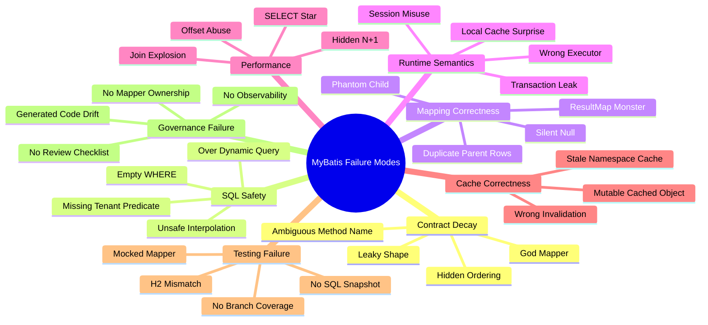

------
title: Learn Java MyBatis - Part 029
description: Advanced MyBatis anti-patterns and common pitfalls covering mapper design failures, unsafe dynamic SQL, ResultMap complexity, transaction leaks, hidden N+1, tenant bugs, cache correctness, and false-confidence testing.
series: learn-java-mybatis
seriesTitle: Learn Java MyBatis, Patterns, Anti-Patterns, and Production Persistence Mapping
order: 29
partTitle: Anti-Patterns and Common Pitfalls
tags:
  - java
  - mybatis
  - persistence
  - sql
  - architecture
  - anti-patterns
  - production
  - security
  - testing
date: 2026-06-28
---

# Part 029 — Anti-Patterns and Common Pitfalls

This part is the failure catalog for production MyBatis systems.

MyBatis gives the team direct ownership of SQL. That is its strength. It is also the reason MyBatis codebases can decay quickly when the team treats mapper methods as casual database shortcuts instead of durable persistence contracts.

The goal here is not to memorize a list of smells. The goal is to build a failure model:

- how mapper APIs decay
- how dynamic SQL becomes unsafe
- how mapping hides data bugs
- how transaction boundaries leak
- how cache and local session behavior surprise teams
- how testing can create false confidence
- how multi-tenant systems fail silently

By the end of this part, you should be able to review a MyBatis pull request and identify production risk before the code reaches staging.

## 1. Anti-Pattern Taxonomy

Most MyBatis failures fall into one of eight groups.



A production MyBatis review should ask one core question:

> What invariant is this mapper method responsible for, and how can that invariant fail?

If the code does not make the invariant visible, the mapper is already risky.

## 2. Anti-Pattern: Mapper as God Object

### Symptom

A single mapper owns too many unrelated operations.

```java
@Mapper
public interface CaseMapper {
    CaseEntity findById(long id);
    List<CaseEntity> findAll();
    int insert(CaseEntity entity);
    int update(CaseEntity entity);
    int delete(long id);
    List<CaseQueueRow> findQueue(CaseQueueCriteria criteria);
    int assign(AssignCaseCommand command);
    int escalate(EscalateCaseCommand command);
    int close(CloseCaseCommand command);
    List<SlaReportRow> findSlaReport(SlaReportCriteria criteria);
    List<AuditRow> findAuditTrail(long caseId);
    int insertAudit(AuditCommand command);
    int insertOutbox(OutboxEvent event);
}
```

This looks convenient at first. It becomes dangerous because every operation has different semantics:

- table maintenance
- workflow command
- queue read model
- reporting query
- audit write
- outbox write
- aggregate loading

These are not the same abstraction.

### Why It Fails

A god mapper causes several hidden problems:

1. reviewers cannot reason about ownership
2. XML grows without clear grouping
3. shared SQL fragments become accidental coupling
4. simple generated CRUD sits beside business-critical guarded commands
5. read-model queries start depending on command mapper fragments
6. testing becomes broad and shallow

### Better Shape

Split by persistence responsibility, not only by database table.

```text
casework/persistence/
  command/
    CaseCommandMapper.java
    CaseCommandMapper.xml
  query/
    CaseQueueMapper.java
    CaseQueueMapper.xml
    CaseDetailMapper.java
    CaseDetailMapper.xml
    SlaReportMapper.java
    SlaReportMapper.xml
  audit/
    CaseAuditMapper.java
    CaseAuditMapper.xml
  outbox/
    OutboxMapper.java
    OutboxMapper.xml
  generated/
    CaseGeneratedMapper.java
    CaseGeneratedMapper.xml
```

### Refactoring Rule

When a mapper contains both state-changing workflow commands and screen/reporting queries, split it.

Mapper size is not the main problem. Mixed semantics are the problem.

### Review Questions

- Does every method in this mapper share the same responsibility?
- Would the same reviewer naturally own all statements in this XML file?
- Are generated CRUD methods separated from business commands?
- Are command methods guarded by state/version/tenant predicates?
- Are query methods named after the read model they serve?

## 3. Anti-Pattern: Business Logic Hidden in SQL

### Symptom

The SQL implements business rules that are invisible to the application layer.

```xml
<select id="findCasesForAction" resultMap="CaseActionRowMap">
  SELECT c.id, c.status, c.priority, c.created_at
  FROM cases c
  WHERE c.tenant_id = #{tenantId}
    AND (
      (c.priority = 'HIGH' AND c.created_at < now() - interval '2 days')
      OR
      (c.priority = 'MEDIUM' AND c.created_at < now() - interval '7 days')
      OR
      (c.status = 'REOPENED' AND c.reopen_count > 2)
    )
</select>
```

The query may be correct, but it hides important domain policy inside SQL.

### Why It Fails

This becomes fragile when:

- business policy changes but SQL is not reviewed by domain owners
- another mapper duplicates part of the rule differently
- tests only check rows, not policy intent
- the condition depends on jurisdiction, product, tenant, or regulatory regime
- the rule needs explanation in audit or decision logs

### Good SQL Responsibility

SQL may enforce data consistency and efficient selection. But business policy should have an explicit owner.

A better approach is to split:

1. policy definition in application/domain layer
2. persistence query that applies policy parameters
3. test cases that connect policy scenarios to query behavior

```java
public record EscalationEligibilityCriteria(
        long tenantId,
        Set<String> eligibleStatuses,
        Instant highPriorityCutoff,
        Instant mediumPriorityCutoff,
        int reopenedThreshold
) {}
```

```xml
<select id="findEscalationCandidates" resultMap="EscalationCandidateMap">
  SELECT c.id, c.status, c.priority, c.created_at, c.reopen_count
  FROM cases c
  WHERE c.tenant_id = #{tenantId}
    AND c.status IN
    <foreach collection="eligibleStatuses" item="status" open="(" separator="," close=")">
      #{status}
    </foreach>
    AND (
      (c.priority = 'HIGH' AND c.created_at &lt; #{highPriorityCutoff})
      OR
      (c.priority = 'MEDIUM' AND c.created_at &lt; #{mediumPriorityCutoff})
      OR
      (c.status = 'REOPENED' AND c.reopen_count &gt; #{reopenedThreshold})
    )
</select>
```

This is still SQL, but the domain thresholds are named and testable.

### Boundary Rule

SQL may answer: “which rows match this explicit criterion?”

SQL should not silently answer: “what is the policy?”

## 4. Anti-Pattern: Unsafe `${}` Interpolation

### Symptom

The mapper uses `${}` for values that come from user input, request input, or untrusted upstream systems.

```xml
<select id="search" resultMap="CaseRowMap">
  SELECT id, case_number, status
  FROM cases
  WHERE tenant_id = #{tenantId}
  ORDER BY ${sortColumn} ${sortDirection}
  LIMIT ${limit}
</select>
```

### Why It Fails

`#{}` binds values through prepared statement parameters.

`${}` performs textual substitution into SQL.

Textual substitution is only acceptable for carefully controlled SQL identifiers or SQL fragments that cannot be represented as bind parameters, and only after whitelisting.

### Safer Pattern

Normalize request sorting into a safe enum.

```java
public enum CaseSort {
    CREATED_AT("c.created_at"),
    PRIORITY("c.priority"),
    CASE_NUMBER("c.case_number");

    private final String sqlExpression;

    CaseSort(String sqlExpression) {
        this.sqlExpression = sqlExpression;
    }

    public String sqlExpression() {
        return sqlExpression;
    }
}
```

```java
public record CaseSearchCriteria(
        long tenantId,
        String keyword,
        CaseSort sort,
        SortDirection direction,
        int limit,
        int offset
) {
    public CaseSearchCriteria normalized() {
        var safeLimit = Math.min(Math.max(limit, 1), 200);
        var safeSort = sort == null ? CaseSort.CREATED_AT : sort;
        var safeDirection = direction == null ? SortDirection.DESC : direction;
        return new CaseSearchCriteria(tenantId, keyword, safeSort, safeDirection, safeLimit, Math.max(offset, 0));
    }
}
```

```xml
<select id="search" resultMap="CaseRowMap">
  SELECT c.id, c.case_number, c.status, c.created_at
  FROM cases c
  WHERE c.tenant_id = #{tenantId}
  <if test="keyword != null and keyword != ''">
    AND (lower(c.case_number) LIKE lower(#{keywordLike})
         OR lower(c.title) LIKE lower(#{keywordLike}))
  </if>
  ORDER BY ${sort.sqlExpression} ${direction.sqlKeyword}
  LIMIT #{limit}
  OFFSET #{offset}
</select>
```

The interpolation remains, but it interpolates only whitelisted enum-owned SQL.

### Review Rule

Every `${}` must answer:

- why `#{}` cannot be used
- what exact whitelist controls the value
- whether the interpolated value is a SQL identifier or SQL keyword
- whether the value can ever originate from HTTP, messaging, file import, or user preferences

If any answer is unclear, reject the mapper.

## 5. Anti-Pattern: Over-Dynamic XML

### Symptom

The mapper becomes a mini query engine.

```xml
<select id="searchEverything" resultMap="CaseRowMap">
  SELECT ...
  FROM cases c
  <if test="joinParty"> JOIN parties p ON ... </if>
  <if test="joinEvidence"> JOIN evidence e ON ... </if>
  <if test="joinViolation"> JOIN violations v ON ... </if>
  <where>
    <if test="filters != null">
      <foreach collection="filters" item="f">
        ${f.column} ${f.operator} #{f.value}
      </foreach>
    </if>
  </where>
  <if test="groupBy != null"> GROUP BY ${groupBy} </if>
  <if test="having != null"> HAVING ${having} </if>
</select>
```

This is no longer a mapper. It is an unsafe SQL construction framework.

### Why It Fails

Over-dynamic XML fails because:

- reviewers cannot enumerate possible SQL shapes
- query plans become unpredictable
- branch coverage becomes impossible
- injection risk increases
- missing predicates become likely
- generated SQL is hard to diagnose
- performance regressions appear only in production data

### Better Pattern

Use separate query methods for materially different shapes.

```java
@Mapper
public interface CaseSearchMapper {
    List<CaseQueueRow> findQueue(CaseQueueCriteria criteria);
    List<CaseInvestigationRow> findInvestigationSearch(InvestigationSearchCriteria criteria);
    List<CaseEvidenceRow> findEvidenceSearch(EvidenceSearchCriteria criteria);
    List<SlaReportRow> findSlaReport(SlaReportCriteria criteria);
}
```

Reuse normalization and predicate construction, not arbitrary SQL fragments.

### Decision Rule

Dynamic SQL is appropriate for optional predicates.

Dynamic SQL is dangerous when it changes the fundamental query shape:

- different joins
- different grouping
- different authorization model
- different projection
- different pagination semantics
- different consistency expectations

When those change, create another mapper method.

## 6. Anti-Pattern: ResultMap Monster

### Symptom

A single `ResultMap` tries to reconstruct an entire object graph.

```xml
<resultMap id="CaseFullGraphMap" type="CaseAggregate">
  <id property="id" column="case_id"/>
  <result property="caseNumber" column="case_number"/>
  <association property="owner" javaType="User">...</association>
  <association property="jurisdiction" javaType="Jurisdiction">...</association>
  <collection property="parties" ofType="Party">...</collection>
  <collection property="allegations" ofType="Allegation">...</collection>
  <collection property="evidence" ofType="Evidence">...</collection>
  <collection property="actions" ofType="EnforcementAction">...</collection>
  <collection property="auditTrail" ofType="AuditEntry">...</collection>
  <collection property="comments" ofType="Comment">...</collection>
</resultMap>
```

### Why It Fails

Large graph mapping creates:

- row multiplication
- duplicate child objects
- high memory use
- slow mapping
- accidental eager loading
- fragile column aliases
- impossible debugging
- unclear aggregate boundaries

### Safer Alternatives

Use one of three patterns.

#### 6.1 Projection Query

For screens, return a shape designed for the screen.

```java
public record CaseDetailView(
        long caseId,
        String caseNumber,
        String status,
        String assignedTo,
        Instant openedAt,
        List<PartySummary> parties,
        List<AllegationSummary> allegations
) {}
```

#### 6.2 Split Query + Assembler

Load stable sections separately.

```java
public CaseDetailView loadCaseDetail(CaseDetailCriteria criteria) {
    var header = caseDetailMapper.findHeader(criteria).orElseThrow();
    var parties = caseDetailMapper.findParties(criteria);
    var allegations = caseDetailMapper.findAllegations(criteria);
    return CaseDetailView.of(header, parties, allegations);
}
```

#### 6.3 Aggregate Loader with Explicit Depth

Only load graph required for a command.

```java
public Optional<CaseForEscalation> findCaseForEscalation(EscalationCommand command);
```

This aggregate is not “all case data.” It is the minimal state required to evaluate and execute escalation.

### Review Rule

A `ResultMap` should not be a substitute for aggregate design.

## 7. Anti-Pattern: Annotation Abuse

### Symptom

Long, dynamic, multi-join SQL is embedded in Java annotations.

```java
@Select("""
    <script>
    SELECT c.id, c.case_number, c.status, p.name, e.file_name, a.code
    FROM cases c
    LEFT JOIN parties p ON ...
    LEFT JOIN evidence e ON ...
    LEFT JOIN allegations a ON ...
    <where>
      <if test='status != null'> c.status = #{status} </if>
      <if test='keyword != null'> AND lower(c.title) LIKE lower(#{keyword}) </if>
      <if test='assignedTo != null'> AND c.assigned_to = #{assignedTo} </if>
    </where>
    ORDER BY c.created_at DESC
    </script>
    """)
List<CaseSearchRow> search(CaseSearchCriteria criteria);
```

### Why It Fails

Annotation mapper is good for small, stable, readable SQL. It becomes painful when:

- query length exceeds a few lines
- dynamic SQL is involved
- result mapping is complex
- statement needs reuse or SQL fragments
- DB-specific syntax appears
- reviewer needs SQL formatting and diff clarity

### Better Rule

Use annotation mappers for:

- trivial lookup
- simple insert/update/delete
- small static query
- generated/provider methods with clear DSL

Use XML or Dynamic SQL DSL for:

- complex query
- dynamic predicates
- reusable fragments
- advanced result map
- reporting query
- multi-join search

### Migration Path

When annotation SQL grows, move it without changing service code.

```java
@Mapper
public interface CaseSearchMapper {
    List<CaseSearchRow> search(CaseSearchCriteria criteria);
}
```

```xml
<mapper namespace="com.acme.casework.persistence.CaseSearchMapper">
  <select id="search" parameterType="CaseSearchCriteria" resultMap="CaseSearchRowMap">
    ...
  </select>
</mapper>
```

The mapper contract stays stable. Only statement implementation moves.

## 8. Anti-Pattern: Hidden N+1

### Symptom

A mapper uses nested select for collections without controlling cardinality.

```xml
<resultMap id="CaseMap" type="CaseDetail">
  <id property="id" column="id"/>
  <result property="caseNumber" column="case_number"/>
  <collection property="parties"
              column="id"
              select="findPartiesByCaseId"/>
</resultMap>
```

If the outer query returns 100 cases, MyBatis may run 1 query for cases plus 100 child queries.

### Why It Fails

Nested select can be acceptable for single aggregate load. It is dangerous for list screens.

Failure signs:

- query count grows with row count
- database latency dominates response time
- local dev looks fine with small seed data
- production queues become slow
- tracing shows many repeated mapper calls

### Safer Patterns

#### For List Screens

Return a flat projection.

```sql
SELECT c.id,
       c.case_number,
       c.status,
       p.primary_party_name,
       c.created_at
FROM cases c
LEFT JOIN case_primary_party p ON p.case_id = c.id
WHERE c.tenant_id = #{tenantId}
ORDER BY c.created_at DESC
LIMIT #{limit}
```

#### For Detail Screens

Load sections explicitly.

```java
var header = mapper.findCaseHeader(criteria);
var parties = mapper.findCaseParties(criteria);
var evidence = mapper.findCaseEvidence(criteria);
```

#### For Multiple Parents

Batch child loading.

```java
List<Long> caseIds = rows.stream().map(CaseRow::caseId).toList();
List<PartyRow> parties = partyMapper.findByCaseIds(tenantId, caseIds);
```

### Review Rule

Nested select is banned in list queries unless there is a written reason and query-count test.

## 9. Anti-Pattern: Accidental Full-Table Scan

### Symptom

Dynamic filters are optional, but no guard prevents an unbounded query.

```xml
<select id="search" resultMap="CaseRowMap">
  SELECT id, case_number, status
  FROM cases
  <where>
    <if test="tenantId != null">
      tenant_id = #{tenantId}
    </if>
    <if test="status != null">
      AND status = #{status}
    </if>
    <if test="keyword != null">
      AND title LIKE #{keyword}
    </if>
  </where>
</select>
```

If all inputs are null, this query can scan the entire table.

### Why It Fails

Production data is larger and more skewed than test data. A missing predicate may:

- overload primary database
- leak tenant data
- lock heavily used pages
- trigger slow query alerts
- produce huge result mapping allocation
- time out upstream requests

### Safer Pattern

Mandatory scope must not be optional.

```xml
<select id="search" resultMap="CaseRowMap">
  SELECT id, case_number, status
  FROM cases
  WHERE tenant_id = #{tenantId}
  <if test="status != null">
    AND status = #{status}
  </if>
  <if test="keywordLike != null">
    AND lower(title) LIKE lower(#{keywordLike})
  </if>
  ORDER BY created_at DESC, id DESC
  LIMIT #{limit}
</select>
```

Validate criteria before mapper call.

```java
public CaseSearchCriteria normalize() {
    if (tenantId <= 0) {
        throw new IllegalArgumentException("tenantId is required");
    }
    if (limit < 1 || limit > 200) {
        throw new IllegalArgumentException("limit must be between 1 and 200");
    }
    return this;
}
```

### Review Rule

No production search query should rely on `<where>` to decide whether tenant scope exists.

Tenant scope belongs in the fixed part of SQL.

## 10. Anti-Pattern: Pagination Without Deterministic Ordering

### Symptom

A query uses `LIMIT`/`OFFSET` without a stable unique ordering.

```sql
SELECT id, case_number, status
FROM cases
WHERE tenant_id = #{tenantId}
ORDER BY priority DESC
LIMIT #{limit}
OFFSET #{offset}
```

If many rows have the same priority, pages can duplicate or skip rows.

### Better Pattern

Always include a deterministic tie-breaker.

```sql
ORDER BY priority DESC, created_at DESC, id DESC
```

For high-volume queues, prefer keyset/cursor pagination.

```sql
WHERE tenant_id = #{tenantId}
  AND (
    created_at &lt; #{cursorCreatedAt}
    OR (created_at = #{cursorCreatedAt} AND id &lt; #{cursorId})
  )
ORDER BY created_at DESC, id DESC
LIMIT #{limit}
```

### Review Rule

Every paginated query must declare:

- ordering columns
- tie-breaker
- maximum page size
- offset or cursor strategy
- whether result consistency across page requests matters

## 11. Anti-Pattern: Leaky Transaction Boundary

### Symptom

Persistence operations that must be atomic are spread across services without an explicit transaction owner.

```java
public void escalate(EscalateCaseRequest request) {
    caseCommandMapper.escalate(request.toCommand());
    auditMapper.insertAudit(request.toAudit());
    outboxMapper.insertEvent(request.toEvent());
}
```

The code may be transactional depending on how it is called. That is a smell.

### Why It Fails

Transaction correctness should not depend on accidental caller context.

Common failures:

- mapper write commits but audit insert fails
- outbox event missing for successful state change
- retry duplicates audit entries
- self-invocation bypasses Spring transaction proxy
- wrong transaction manager used in multi-datasource setup
- batch executor flush happens later than expected

### Better Pattern

Declare transaction boundary at use-case/service method.

```java
@Transactional
public EscalationResult escalate(EscalateCaseRequest request) {
    var command = request.toCommand(clock.instant());

    int updated = caseCommandMapper.escalate(command);
    if (updated != 1) {
        throw new ConcurrentCaseUpdateException(command.caseId());
    }

    auditMapper.insert(command.toAuditEntry());
    outboxMapper.insert(command.toOutboxEvent());

    return EscalationResult.success(command.caseId());
}
```

### Review Rule

Every command use case should answer:

- where is the transaction boundary?
- which mapper writes must commit atomically?
- what happens when affected row count is zero?
- what happens when audit/outbox insert fails?
- which transaction manager is active?

## 12. Anti-Pattern: Missing Tenant Predicate

### Symptom

A mapper method looks up by globally unique-looking id.

```xml
<select id="findById" resultMap="CaseMap">
  SELECT id, tenant_id, case_number, status
  FROM cases
  WHERE id = #{caseId}
</select>
```

In a multi-tenant system, this is usually unsafe even if ids are globally unique.

### Why It Fails

Tenant predicate is not only for physical uniqueness. It is an authorization and audit boundary.

Missing tenant predicates cause:

- cross-tenant data exposure
- unauthorized command execution
- incorrect audit trail
- hard-to-prove regulatory access boundaries
- inconsistent cache keys

### Better Pattern

Use tenant-aware criteria consistently.

```java
public record CaseIdentity(long tenantId, long caseId) {}
```

```xml
<select id="findByIdentity" resultMap="CaseMap">
  SELECT id, tenant_id, case_number, status
  FROM cases
  WHERE tenant_id = #{tenantId}
    AND id = #{caseId}
</select>
```

Commands must also include tenant scope.

```xml
<update id="assignCase">
  UPDATE cases
  SET assigned_to = #{assigneeUserId},
      version = version + 1,
      updated_at = #{now}
  WHERE tenant_id = #{tenantId}
    AND id = #{caseId}
    AND status IN ('OPEN', 'REOPENED')
    AND version = #{expectedVersion}
</update>
```

### Review Rule

No mapper method should accept `caseId` alone in a tenant-aware module.

Use identity objects that force tenant scope.

## 13. Anti-Pattern: Mock-Based False Confidence

### Symptom

Mapper tests mock MyBatis mapper interfaces.

```java
when(caseMapper.findQueue(any())).thenReturn(List.of(row));
```

This verifies service branching, not mapper correctness.

### Why It Fails

Mocks do not verify:

- SQL syntax
- column aliases
- `ResultMap`
- TypeHandler behavior
- generated keys
- dynamic SQL branches
- affected row semantics
- database constraints
- lock behavior
- transaction rollback

### Better Testing Stack

Use layered tests.

```text
Service unit test
  - mocks mapper only for service decisions

Mapper integration test
  - real database
  - migration schema
  - seed data
  - real MyBatis configuration

Contract regression test
  - SQL snapshot
  - golden dataset
  - dynamic SQL branch coverage
  - nullability regression

Concurrency test
  - real transaction
  - competing updates
  - lock timeout behavior
```

### Review Rule

A mapper change without a real database test should be treated as unverified.

## 14. Anti-Pattern: Cache Correctness Bugs

### Symptom

The mapper enables second-level cache because it improves benchmark numbers.

```xml
<mapper namespace="com.acme.CaseMapper">
  <cache/>

  <select id="findCaseDetail" resultMap="CaseDetailMap" useCache="true">
    SELECT ...
  </select>
</mapper>
```

### Why It Fails

Caching is not a performance feature until invalidation and visibility are correct.

Second-level namespace cache is risky when:

- data is updated by another mapper namespace
- data is updated outside the application
- result objects are mutable
- tenant is not part of cache key
- authorization scope affects result visibility
- stale reads are unacceptable
- workflow state changes frequently

### Safer Cache Classification

Classify data before caching.

| Data Class | Example | Cache Risk | Suggested Strategy |
|---|---|---:|---|
| Static reference | country codes | Low | application cache or MyBatis cache acceptable |
| Slow-changing config | SLA policy | Medium | versioned application cache |
| Workflow state | case status | High | avoid MyBatis second-level cache |
| Authorization-scoped data | user queue | Very high | avoid mapper cache |
| Audit trail | append-only audit | Medium | cache only with strict freshness rules |

### Review Rule

Do not enable MyBatis cache on workflow state unless the team can prove invalidation correctness.

## 15. Anti-Pattern: Local Cache Surprise

### Symptom

Within the same `SqlSession`, a repeated select returns cached data when the developer expects a fresh database read.

### Why It Fails

MyBatis has local session cache behavior. In Spring-managed transactions, the same session may be used for the transaction duration. This can surprise teams when they mix repeated reads, writes, and external updates.

### Safer Practice

Do not write code that depends on repeated reads being magically fresh.

If freshness matters:

- design explicit command result
- use affected row count
- read after write with known transaction semantics
- understand local cache scope
- avoid hidden external mutation during transaction

### Review Rule

If a use case reads the same row multiple times in one transaction, ask why.

## 16. Anti-Pattern: TypeHandler as Business Logic Container

### Symptom

A custom `TypeHandler` validates complex domain policy or performs external lookup.

```java
public class CaseStatusTypeHandler extends BaseTypeHandler<CaseStatus> {
    @Override
    public void setNonNullParameter(PreparedStatement ps, int i, CaseStatus status, JdbcType jdbcType) {
        if (!status.isAllowedForCurrentJurisdiction()) {
            throw new IllegalStateException("Invalid status");
        }
        ps.setString(i, status.code());
    }
}
```

### Why It Fails

A `TypeHandler` should convert between JDBC values and Java values. It should not own workflow policy.

Problems:

- conversion becomes context-dependent
- mapping behavior differs by runtime state
- tests become hard
- reading old data can fail because policy changed
- persistence conversion throws domain exceptions unexpectedly

### Better Boundary

Keep `TypeHandler` narrow.

```java
public final class CaseStatusTypeHandler extends BaseTypeHandler<CaseStatus> {
    @Override
    public void setNonNullParameter(PreparedStatement ps, int i, CaseStatus status, JdbcType jdbcType)
            throws SQLException {
        ps.setString(i, status.code());
    }

    @Override
    public CaseStatus getNullableResult(ResultSet rs, String columnName) throws SQLException {
        return CaseStatus.fromCode(rs.getString(columnName));
    }
}
```

Workflow legality belongs in command handling or guarded SQL.

## 17. Anti-Pattern: Generated CRUD Escapes Its Boundary

### Symptom

Generated mapper methods are used directly by application services.

```java
caseGeneratedMapper.updateByPrimaryKeySelective(record);
```

### Why It Fails

Generated CRUD is mechanical. Business commands need invariants.

`updateByPrimaryKeySelective` usually cannot express:

- expected status
- expected version
- tenant scope
- audit requirement
- authorization scope
- idempotency
- workflow transition legality

### Better Pattern

Hide generated mapper behind a facade or command mapper.

```java
public interface CaseCommandMapper {
    int transitionToEscalated(EscalateCaseCommand command);
}
```

Use generated CRUD only for low-risk reference tables or admin maintenance where invariants are explicit elsewhere.

### Review Rule

Generated CRUD should not be called from workflow use cases.

## 18. Anti-Pattern: No Affected-Row Semantics

### Symptom

A command updates rows but ignores the returned count.

```java
caseCommandMapper.closeCase(command);
```

### Why It Fails

For guarded commands, affected row count is part of correctness.

Zero rows can mean:

- not found
- wrong tenant
- stale version
- invalid status transition
- already processed
- authorization mismatch
- idempotency duplicate

More than one row can mean:

- missing unique predicate
- tenant bug
- query bug
- schema constraint missing

### Better Pattern

```java
int updated = caseCommandMapper.closeCase(command);

if (updated == 0) {
    throw new CaseTransitionRejectedException(command.caseId(), command.expectedVersion());
}
if (updated != 1) {
    throw new IllegalStateException("Expected exactly one case row to be closed, updated=" + updated);
}
```

### Review Rule

Every workflow update mapper should return `int` and the service must interpret it.

## 19. Anti-Pattern: SQL Fragment Coupling

### Symptom

SQL fragments are reused across statements with different semantics.

```xml
<sql id="BaseWhere">
  WHERE tenant_id = #{tenantId}
  <if test="status != null"> AND status = #{status} </if>
  <if test="assignedTo != null"> AND assigned_to = #{assignedTo} </if>
</sql>
```

This fragment may be included by queue queries, report queries, export queries, and command validation queries.

### Why It Fails

Reusable fragments are good for mechanical repetition. They are risky when they encode business semantics.

A fragment change for one query can silently alter another.

### Better Rule

Use fragments for:

- repeated column lists
- stable joins
- stable tenant predicate
- stable projection aliases

Avoid fragments for:

- authorization logic
- workflow eligibility
- report-specific filters
- command guards
- pagination order

### Review Rule

A SQL fragment should be boring. If it contains business meaning, give it a single owner.

## 20. Anti-Pattern: Observability Afterthought

### Symptom

Mapper methods have no clear diagnostics.

When production latency increases, the team cannot answer:

- which mapper statement is slow?
- how many rows were returned?
- how many queries were executed per request?
- what SQL shape was generated?
- what tenant or feature path triggered it?
- was the slowdown database execution or Java mapping?

### Better Pattern

Instrument mapper boundary.

At minimum, collect:

- mapper statement id
- duration
- row count
- affected row count
- exception class
- timeout
- correlation id
- tenant id where safe
- SQL fingerprint

### Review Rule

Complex mapper changes should include diagnostics before the incident happens.

## 21. Refactoring Playbook

When you inherit a messy MyBatis module, do not rewrite everything first. Stabilize it.

### Step 1: Inventory Mapper Methods

Create a table:

| Mapper | Method | Type | Read/Write | Tenant Scope | Test Coverage | Risk |
|---|---|---|---|---|---|---|
| CaseMapper | findQueue | read model | read | yes | weak | high |
| CaseMapper | updateById | mechanical | write | no | none | critical |
| CaseMapper | escalate | command | write | partial | weak | critical |

### Step 2: Mark Contract Boundaries

Separate:

- command mappers
- query mappers
- generated mappers
- audit/outbox mappers
- reference-data mappers

### Step 3: Add Safety Tests Before Refactor

Before changing SQL, add:

- real database mapper test
- SQL snapshot if dynamic
- tenant isolation test
- affected row test
- nullability test
- golden dataset result test

### Step 4: Split XML by Responsibility

Move statements into clear mapper namespaces.

Keep service behavior unchanged at first.

### Step 5: Replace Unsafe Inputs

Replace stringly criteria with typed criteria.

```java
public record SafeSort(String sqlExpression) {
    public static SafeSort fromUserInput(String input) {
        return switch (input) {
            case "createdAt" -> new SafeSort("c.created_at");
            case "priority" -> new SafeSort("c.priority");
            default -> throw new IllegalArgumentException("Unsupported sort: " + input);
        };
    }
}
```

### Step 6: Add Observability

Measure before optimizing.

### Step 7: Remove Dead Statements

Mapper XML often keeps unused statements. Delete them after verifying references.

## 22. Pull Request Review Checklist

Use this checklist for any MyBatis mapper change.

### Contract

- [ ] Method name expresses persistence intent
- [ ] Input type is explicit and normalized
- [ ] Return type expresses cardinality
- [ ] Nullability is clear
- [ ] Ordering is documented for lists
- [ ] Pagination has maximum limit

### SQL Safety

- [ ] `#{}` used for values
- [ ] Every `${}` is whitelisted
- [ ] Tenant predicate is mandatory where applicable
- [ ] Empty-list behavior is defined
- [ ] Dynamic SQL cannot produce unbounded query accidentally
- [ ] Search keyword is normalized safely

### Mapping

- [ ] Column aliases match Java properties explicitly
- [ ] `resultMap` has proper `<id>` elements
- [ ] Nested select is not used in list queries without reason
- [ ] `ResultMap` size is understandable
- [ ] TypeHandlers are narrow converters

### Transaction and Consistency

- [ ] Write operation has clear transaction owner
- [ ] Guarded updates return affected row count
- [ ] Service interprets zero/one/many affected rows
- [ ] Audit/outbox writes are transactionally aligned
- [ ] Multi-datasource transaction manager is correct

### Performance

- [ ] Query shape is stable and explainable
- [ ] No accidental N+1
- [ ] No unnecessary `SELECT *`
- [ ] Pagination is deterministic
- [ ] Index assumptions are documented
- [ ] Large result set behavior is controlled

### Testing

- [ ] Real database mapper test exists
- [ ] Dynamic SQL branches are covered
- [ ] Tenant isolation is tested
- [ ] Nullability and enum mapping are tested
- [ ] Affected row semantics are tested
- [ ] SQL snapshot or golden dataset exists for complex query

### Observability

- [ ] Statement id can be identified in logs/metrics
- [ ] Slow query triage path exists
- [ ] Sensitive parameters are masked
- [ ] Row count or affected count is visible where useful

## 23. Production Risk Matrix

| Smell | Risk Level | Why It Matters | Immediate Action |
|---|---:|---|---|
| `${}` from request input | Critical | SQL injection | Replace with whitelist or `#{}` |
| Missing tenant predicate | Critical | Data leak | Introduce tenant identity criteria |
| Ignored affected row count | Critical | Silent failed command | Interpret count in service |
| Nested select in list query | High | N+1 latency | Replace with projection or batch child load |
| ResultMap monster | High | row explosion, memory | Split query or projection |
| Over-dynamic XML | High | unpredictable SQL | Split query methods |
| Generated CRUD in workflow | High | no invariant guard | Replace with command mapper |
| Cache on workflow state | High | stale reads | Disable or move to app cache with invalidation |
| Mock-only mapper tests | High | false confidence | Add real DB tests |
| No deterministic ordering | Medium | duplicate/missing page rows | Add unique tie-breaker |
| `SELECT *` | Medium | schema coupling | Use explicit projection |
| TypeHandler with policy | Medium | hidden behavior | Move policy to domain/use case |

## 24. Deliberate Practice

### Drill 1: Find the Hidden Tenant Bug

Given this mapper:

```xml
<select id="findCaseDetail" resultMap="CaseDetailMap">
  SELECT c.id, c.tenant_id, c.case_number, c.status
  FROM cases c
  WHERE c.id = #{caseId}
</select>
```

Fix it by:

1. introducing `CaseIdentity`
2. requiring `tenantId`
3. adding a mapper test that proves tenant isolation
4. rejecting any service call that only has `caseId`

### Drill 2: Refactor Over-Dynamic Search

Take a single `searchEverything` mapper and split it into:

- `findQueue`
- `findInvestigationSearch`
- `findEvidenceSearch`
- `findSlaReport`

For each method define:

- criteria type
- projection type
- mandatory predicates
- ordering
- page size limit
- test matrix

### Drill 3: Kill Hidden N+1

Find a list query with nested select collection mapping.

Replace it with either:

- flat projection query
- batch child loading
- explicit detail endpoint loading

Add a test that asserts query count or verifies the generated SQL path.

### Drill 4: Guard a Workflow Update

Refactor this:

```xml
<update id="closeCase">
  UPDATE cases
  SET status = 'CLOSED'
  WHERE id = #{caseId}
</update>
```

Into this:

```xml
<update id="closeCase">
  UPDATE cases
  SET status = 'CLOSED',
      closed_at = #{closedAt},
      version = version + 1,
      updated_at = #{now}
  WHERE tenant_id = #{tenantId}
    AND id = #{caseId}
    AND status IN ('OPEN', 'ESCALATED')
    AND version = #{expectedVersion}
</update>
```

Then handle affected row count in the service.

## 25. Mental Compression

A top-tier MyBatis engineer does not ask only:

> Does this query return the expected rows?

They ask:

> What contract does this statement expose, what invariant does it enforce, and how does it fail under unsafe input, concurrent writes, tenant boundaries, stale cache, and production data volume?

That question separates working MyBatis code from production-grade MyBatis architecture.

## References

- MyBatis 3 Mapper XML Files: https://mybatis.org/mybatis-3/sqlmap-xml.html
- MyBatis 3 Dynamic SQL in XML: https://mybatis.org/mybatis-3/dynamic-sql.html
- MyBatis 3 Configuration: https://mybatis.org/mybatis-3/configuration.html
- MyBatis 3 Java API and SqlSession: https://mybatis.org/mybatis-3/java-api.html
- MyBatis-Spring Transactions: https://mybatis.org/spring/transactions.html
- MyBatis Dynamic SQL: https://mybatis.org/mybatis-dynamic-sql/docs/introduction.html
