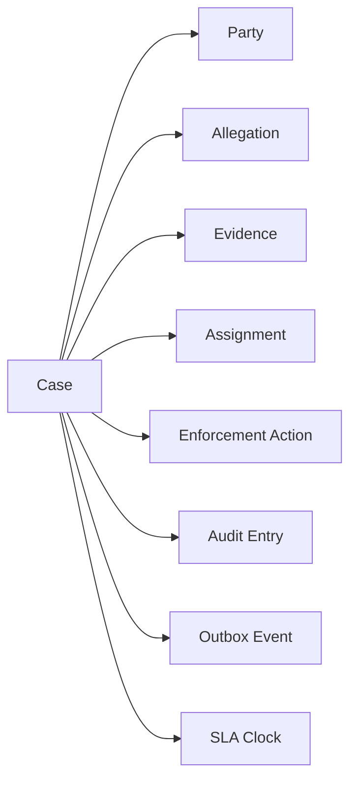
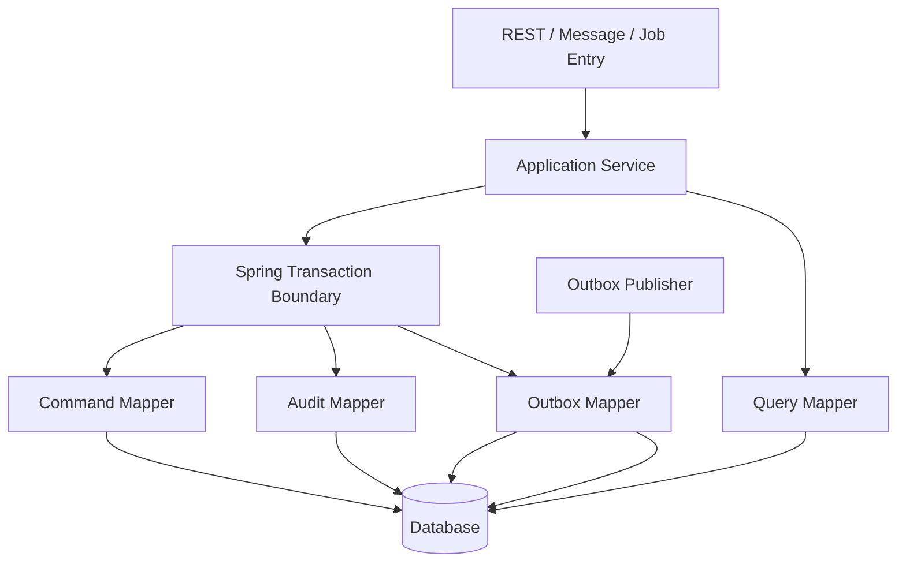
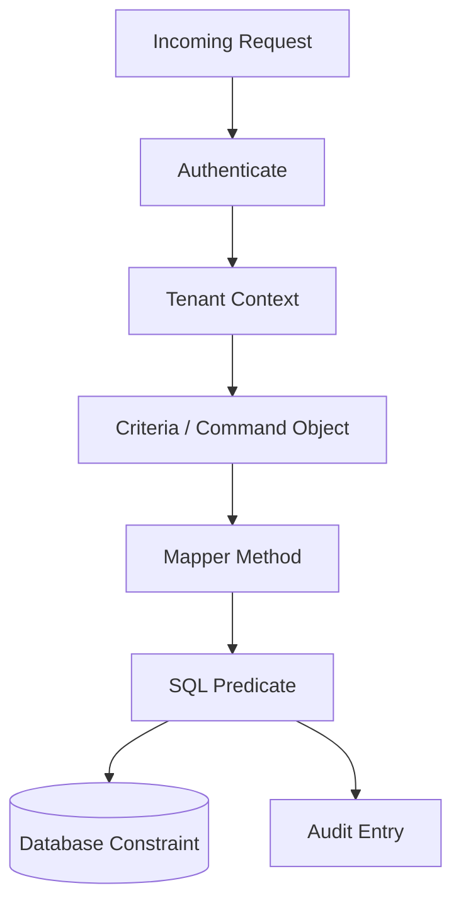
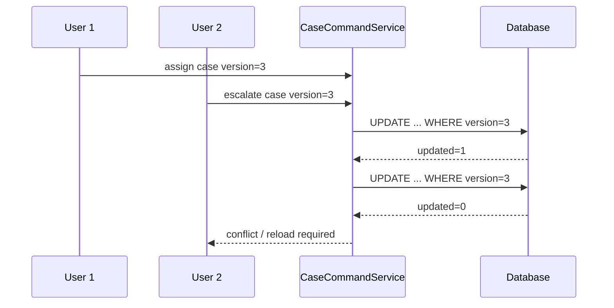
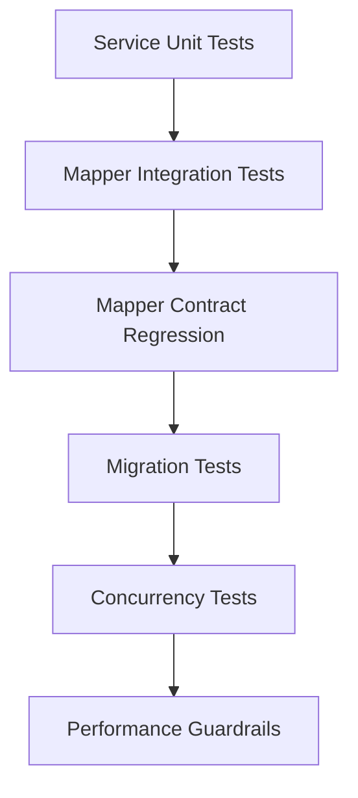

------
title: Learn Java MyBatis - Part 030
description: Capstone production case-management persistence layer using MyBatis, covering domain boundaries, mapper packages, guarded commands, read models, audit, outbox, search, queues, SLA, tenant safety, testing, observability, and final engineering rubric.
series: learn-java-mybatis
seriesTitle: Learn Java MyBatis, Patterns, Anti-Patterns, and Production Persistence Mapping
order: 30
partTitle: Capstone: Production Case Management Persistence Layer
tags:
  - java
  - mybatis
  - persistence
  - sql
  - architecture
  - capstone
  - case-management
  - regulatory-systems
  - production
date: 2026-06-28
---

# Part 030 — Capstone: Production Case Management Persistence Layer

This final part combines the whole series into a production-style design.

The scenario is a regulatory case-management platform. The system tracks cases, parties, allegations, evidence, assignments, workflow transitions, SLA deadlines, enforcement actions, audit trail, and domain events. The persistence layer uses MyBatis because the system needs explicit SQL control, auditable state transitions, complex read models, careful tenant isolation, and predictable performance.

This is not a complete runnable application. It is an architecture blueprint and engineering handbook section showing how a senior engineer should structure, reason about, test, and operate a MyBatis persistence layer in a serious system.

## 1. Capstone Goals

The capstone has five goals.

1. Design mapper boundaries that do not become a DAO dumping ground.
2. Encode workflow consistency with SQL guards and transaction boundaries.
3. Build read models that serve real user journeys efficiently.
4. Keep tenant safety, auditability, and observability first-class.
5. Create a test strategy that catches SQL, mapping, migration, and concurrency regressions.

The system must support these journeys:

- create a case
- assign a case to an investigator
- search cases
- view case detail
- add allegation
- attach evidence metadata
- escalate overdue case
- close case
- list investigator work queue
- list supervisor escalation queue
- calculate SLA breach risk
- emit audit and outbox events

## 2. Domain Slice

The capstone focuses on one bounded context: `casework`.



The aggregate boundary is not “everything connected to a case.”

A case detail screen may need many related records. A workflow command usually needs a smaller consistency boundary.

### Command Aggregate Examples

| Use Case | Required State | Not Required |
|---|---|---|
| Assign case | case id, tenant id, status, version, current assignee | evidence files, full audit trail |
| Escalate case | status, priority, due date, version, current escalation level | party addresses, comments |
| Close case | status, version, mandatory checks, unresolved allegations count | dashboard metrics |

### Read Model Examples

| Screen | Shape |
|---|---|
| Investigator queue | flat row with case number, priority, due date, assigned date |
| Supervisor queue | escalation candidate row with age, breach risk, owner |
| Case detail | header + parties + allegations + evidence summaries |
| SLA report | aggregate row grouped by office, priority, status |
| Audit timeline | append-only audit projection |

## 3. Package Structure

Use package boundaries that reveal persistence responsibility.

```text
com.acme.regulatory.casework
  application/
    CaseCommandService.java
    CaseQueryService.java
    CaseSlaService.java
  domain/
    CaseStatus.java
    CasePriority.java
    CaseTransition.java
    CaseIdentity.java
    TenantId.java
  persistence/
    command/
      CaseCommandMapper.java
      CaseCommandMapper.xml
      CaseWorkflowCommand.java
    query/
      CaseDetailMapper.java
      CaseDetailMapper.xml
      CaseQueueMapper.java
      CaseQueueMapper.xml
      CaseSearchMapper.java
      CaseSearchMapper.xml
      SlaReportMapper.java
      SlaReportMapper.xml
    aggregate/
      CaseAggregateLoader.java
      CaseForEscalation.java
      CaseForClosure.java
    audit/
      CaseAuditMapper.java
      CaseAuditMapper.xml
      AuditEntryRecord.java
    outbox/
      OutboxMapper.java
      OutboxMapper.xml
      OutboxEventRecord.java
    typehandler/
      TenantIdTypeHandler.java
      CaseStatusTypeHandler.java
      JsonMetadataTypeHandler.java
    generated/
      CaseGeneratedMapper.java
      CaseGeneratedMapper.xml
```

The package layout makes three decisions explicit:

- command mappers enforce state changes
- query mappers return read models
- generated mappers are isolated from workflow use cases

## 4. Database Sketch

The schema is simplified but realistic.

```sql
CREATE TABLE cases (
    tenant_id           BIGINT NOT NULL,
    id                  BIGINT NOT NULL,
    case_number         VARCHAR(64) NOT NULL,
    status              VARCHAR(32) NOT NULL,
    priority            VARCHAR(16) NOT NULL,
    title               VARCHAR(300) NOT NULL,
    assigned_to_user_id BIGINT,
    office_id           BIGINT NOT NULL,
    due_at              TIMESTAMP NOT NULL,
    escalation_level    INTEGER NOT NULL DEFAULT 0,
    version             INTEGER NOT NULL DEFAULT 0,
    created_at          TIMESTAMP NOT NULL,
    updated_at          TIMESTAMP NOT NULL,
    closed_at           TIMESTAMP,
    PRIMARY KEY (tenant_id, id),
    UNIQUE (tenant_id, case_number)
);

CREATE TABLE case_parties (
    tenant_id      BIGINT NOT NULL,
    id             BIGINT NOT NULL,
    case_id        BIGINT NOT NULL,
    party_type     VARCHAR(32) NOT NULL,
    display_name   VARCHAR(300) NOT NULL,
    created_at     TIMESTAMP NOT NULL,
    PRIMARY KEY (tenant_id, id)
);

CREATE TABLE case_allegations (
    tenant_id       BIGINT NOT NULL,
    id              BIGINT NOT NULL,
    case_id         BIGINT NOT NULL,
    allegation_code VARCHAR(64) NOT NULL,
    status          VARCHAR(32) NOT NULL,
    severity        VARCHAR(16) NOT NULL,
    created_at      TIMESTAMP NOT NULL,
    PRIMARY KEY (tenant_id, id)
);

CREATE TABLE case_evidence (
    tenant_id       BIGINT NOT NULL,
    id              BIGINT NOT NULL,
    case_id         BIGINT NOT NULL,
    file_name       VARCHAR(500) NOT NULL,
    content_hash    VARCHAR(128) NOT NULL,
    metadata_json   JSONB,
    created_at      TIMESTAMP NOT NULL,
    PRIMARY KEY (tenant_id, id)
);

CREATE TABLE case_audit_entries (
    tenant_id      BIGINT NOT NULL,
    id             BIGINT NOT NULL,
    case_id        BIGINT NOT NULL,
    action         VARCHAR(64) NOT NULL,
    actor_user_id  BIGINT NOT NULL,
    reason         VARCHAR(1000),
    before_json    JSONB,
    after_json     JSONB,
    created_at     TIMESTAMP NOT NULL,
    PRIMARY KEY (tenant_id, id)
);

CREATE TABLE outbox_events (
    tenant_id        BIGINT NOT NULL,
    id               BIGINT NOT NULL,
    aggregate_type   VARCHAR(64) NOT NULL,
    aggregate_id     BIGINT NOT NULL,
    event_type       VARCHAR(128) NOT NULL,
    payload_json     JSONB NOT NULL,
    idempotency_key  VARCHAR(128) NOT NULL,
    created_at       TIMESTAMP NOT NULL,
    published_at     TIMESTAMP,
    PRIMARY KEY (tenant_id, id),
    UNIQUE (tenant_id, idempotency_key)
);
```

The most important design choice: most primary keys are composite with `tenant_id`.

Even if the platform uses globally unique ids, the persistence layer should still carry tenant scope through queries and commands.

## 5. Runtime Architecture



Rules:

1. Application services own transaction boundaries.
2. Command mappers return affected row count.
3. Audit and outbox writes occur in the same transaction as state-changing commands.
4. Query mappers return projections, not rich domain aggregates by default.
5. Tenant id is always part of criteria and command objects.
6. Generated CRUD is not called by workflow services.

## 6. MyBatis Configuration Baseline

A production baseline might look like this.

```yaml
mybatis:
  mapper-locations: classpath*:/mybatis/casework/**/*.xml
  type-aliases-package: com.acme.regulatory.casework.persistence
  type-handlers-package: com.acme.regulatory.casework.persistence.typehandler
  configuration:
    map-underscore-to-camel-case: true
    default-fetch-size: 200
    default-statement-timeout: 5
    local-cache-scope: statement
    auto-mapping-unknown-column-behavior: warning
```

This is intentionally conservative.

- `default-statement-timeout` prevents indefinite waiting.
- `local-cache-scope: statement` reduces local session cache surprises.
- `auto-mapping-unknown-column-behavior: warning` helps catch alias drift.
- explicit `mapper-locations` prevents accidental mapper discovery ambiguity.

In some systems, `SESSION` local cache is acceptable. The key is to decide intentionally and test behavior under transaction boundaries.

## 7. Type Aliases and Type Handlers

Keep TypeHandlers narrow.

```java
public record TenantId(long value) {
    public TenantId {
        if (value <= 0) {
            throw new IllegalArgumentException("tenant id must be positive");
        }
    }
}
```

```java
@MappedTypes(TenantId.class)
@MappedJdbcTypes(JdbcType.BIGINT)
public final class TenantIdTypeHandler extends BaseTypeHandler<TenantId> {
    @Override
    public void setNonNullParameter(PreparedStatement ps, int i, TenantId parameter, JdbcType jdbcType)
            throws SQLException {
        ps.setLong(i, parameter.value());
    }

    @Override
    public TenantId getNullableResult(ResultSet rs, String columnName) throws SQLException {
        long value = rs.getLong(columnName);
        return rs.wasNull() ? null : new TenantId(value);
    }

    @Override
    public TenantId getNullableResult(ResultSet rs, int columnIndex) throws SQLException {
        long value = rs.getLong(columnIndex);
        return rs.wasNull() ? null : new TenantId(value);
    }

    @Override
    public TenantId getNullableResult(CallableStatement cs, int columnIndex) throws SQLException {
        long value = cs.getLong(columnIndex);
        return cs.wasNull() ? null : new TenantId(value);
    }
}
```

TypeHandlers convert values. They do not enforce workflow policy.

## 8. Mapper Contract Objects

### Identity

```java
public record CaseIdentity(
        TenantId tenantId,
        long caseId
) {}
```

### Assignment Command

```java
public record AssignCaseCommand(
        TenantId tenantId,
        long caseId,
        long assigneeUserId,
        long actorUserId,
        int expectedVersion,
        Instant now,
        String reason
) {}
```

### Escalation Command

```java
public record EscalateCaseCommand(
        TenantId tenantId,
        long caseId,
        int expectedVersion,
        int nextEscalationLevel,
        long actorUserId,
        Instant now,
        String reason,
        String idempotencyKey
) {}
```

### Queue Criteria

```java
public record InvestigatorQueueCriteria(
        TenantId tenantId,
        long investigatorUserId,
        Set<CaseStatus> statuses,
        Instant dueBefore,
        int limit,
        QueueCursor cursor
) {
    public InvestigatorQueueCriteria normalized() {
        if (limit < 1 || limit > 200) {
            throw new IllegalArgumentException("limit must be between 1 and 200");
        }
        if (statuses == null || statuses.isEmpty()) {
            return new InvestigatorQueueCriteria(
                    tenantId,
                    investigatorUserId,
                    Set.of(CaseStatus.OPEN, CaseStatus.REOPENED, CaseStatus.ESCALATED),
                    dueBefore,
                    limit,
                    cursor
            );
        }
        return this;
    }
}
```

The criteria object is not just a parameter bag. It is a validation and normalization boundary.

## 9. Command Mapper

```java
@Mapper
public interface CaseCommandMapper {
    int assignCase(AssignCaseCommand command);
    int escalateCase(EscalateCaseCommand command);
    int closeCase(CloseCaseCommand command);
    int addAllegation(AddAllegationCommand command);
    int attachEvidence(AttachEvidenceCommand command);
}
```

### XML: Assign Case

```xml
<mapper namespace="com.acme.regulatory.casework.persistence.command.CaseCommandMapper">

  <update id="assignCase">
    UPDATE cases
    SET assigned_to_user_id = #{assigneeUserId},
        status = CASE
          WHEN status = 'NEW' THEN 'OPEN'
          ELSE status
        END,
        version = version + 1,
        updated_at = #{now}
    WHERE tenant_id = #{tenantId}
      AND id = #{caseId}
      AND status IN ('NEW', 'OPEN', 'REOPENED')
      AND version = #{expectedVersion}
  </update>

</mapper>
```

This command enforces four invariants:

1. tenant boundary
2. case identity
3. allowed source statuses
4. optimistic version

The service must interpret affected row count.

### XML: Escalate Case

```xml
<update id="escalateCase">
  UPDATE cases
  SET status = 'ESCALATED',
      escalation_level = #{nextEscalationLevel},
      version = version + 1,
      updated_at = #{now}
  WHERE tenant_id = #{tenantId}
    AND id = #{caseId}
    AND status IN ('OPEN', 'REOPENED')
    AND due_at &lt;= #{now}
    AND version = #{expectedVersion}
</update>
```

The SQL guards against stale transitions and premature escalation.

The domain service may still calculate eligibility before issuing the command, but the database command must remain guarded because concurrent changes can invalidate the decision.

## 10. Application Service Transaction

```java
@Service
public class CaseCommandService {
    private final CaseCommandMapper caseCommandMapper;
    private final CaseAuditMapper auditMapper;
    private final OutboxMapper outboxMapper;
    private final Clock clock;

    @Transactional
    public void assignCase(AssignCaseRequest request) {
        Instant now = clock.instant();
        AssignCaseCommand command = request.toCommand(now);

        int updated = caseCommandMapper.assignCase(command);
        requireExactlyOne(updated, "assign case", command.caseId());

        auditMapper.insert(AuditEntryRecord.assignment(command));
        outboxMapper.insert(OutboxEventRecord.caseAssigned(command));
    }

    @Transactional
    public void escalateCase(EscalateCaseRequest request) {
        Instant now = clock.instant();
        EscalateCaseCommand command = request.toCommand(now);

        int updated = caseCommandMapper.escalateCase(command);
        requireExactlyOne(updated, "escalate case", command.caseId());

        auditMapper.insert(AuditEntryRecord.escalation(command));
        outboxMapper.insert(OutboxEventRecord.caseEscalated(command));
    }

    private static void requireExactlyOne(int updated, String operation, long caseId) {
        if (updated == 1) {
            return;
        }
        if (updated == 0) {
            throw new ConcurrentCaseUpdateException(operation, caseId);
        }
        throw new IllegalStateException("Expected exactly one row for " + operation + ", caseId=" + caseId + ", updated=" + updated);
    }
}
```

This service has a clear persistence contract:

- command update
- affected row interpretation
- audit insert
- outbox insert
- one transaction

## 11. Audit Mapper

```java
@Mapper
public interface CaseAuditMapper {
    int insert(AuditEntryRecord record);
    List<AuditTimelineRow> findTimeline(CaseIdentity identity);
}
```

```xml
<insert id="insert">
  INSERT INTO case_audit_entries (
      tenant_id,
      id,
      case_id,
      action,
      actor_user_id,
      reason,
      before_json,
      after_json,
      created_at
  ) VALUES (
      #{tenantId},
      #{id},
      #{caseId},
      #{action},
      #{actorUserId},
      #{reason},
      #{beforeJson, typeHandler=JsonMetadataTypeHandler},
      #{afterJson, typeHandler=JsonMetadataTypeHandler},
      #{createdAt}
  )
</insert>
```

Audit writes should be append-only. Avoid update/delete unless there is a legally reviewed retention process.

## 12. Outbox Mapper

```java
@Mapper
public interface OutboxMapper {
    int insert(OutboxEventRecord record);
    List<OutboxEventRecord> claimUnpublished(OutboxClaimCriteria criteria);
    int markPublished(MarkOutboxPublishedCommand command);
}
```

```xml
<insert id="insert">
  INSERT INTO outbox_events (
      tenant_id,
      id,
      aggregate_type,
      aggregate_id,
      event_type,
      payload_json,
      idempotency_key,
      created_at
  ) VALUES (
      #{tenantId},
      #{id},
      #{aggregateType},
      #{aggregateId},
      #{eventType},
      #{payloadJson, typeHandler=JsonMetadataTypeHandler},
      #{idempotencyKey},
      #{createdAt}
  )
</insert>
```

The unique `(tenant_id, idempotency_key)` constraint protects against duplicate event creation.

For worker claiming, use database-specific locking intentionally.

```xml
<select id="claimUnpublished" resultMap="OutboxEventMap">
  SELECT tenant_id,
         id,
         aggregate_type,
         aggregate_id,
         event_type,
         payload_json,
         idempotency_key,
         created_at
  FROM outbox_events
  WHERE tenant_id = #{tenantId}
    AND published_at IS NULL
  ORDER BY created_at ASC, id ASC
  LIMIT #{limit}
  FOR UPDATE SKIP LOCKED
</select>
```

This SQL is PostgreSQL-style. If the platform supports multiple databases, isolate this statement by database id or separate mapper implementation.

## 13. Query Mapper: Investigator Queue

```java
@Mapper
public interface CaseQueueMapper {
    List<InvestigatorQueueRow> findInvestigatorQueue(InvestigatorQueueCriteria criteria);
    List<SupervisorEscalationRow> findSupervisorEscalationQueue(SupervisorQueueCriteria criteria);
}
```

```java
public record InvestigatorQueueRow(
        long caseId,
        String caseNumber,
        CaseStatus status,
        CasePriority priority,
        Instant dueAt,
        Instant createdAt,
        int version
) {}
```

```xml
<select id="findInvestigatorQueue" resultMap="InvestigatorQueueRowMap">
  SELECT c.id AS case_id,
         c.case_number,
         c.status,
         c.priority,
         c.due_at,
         c.created_at,
         c.version
  FROM cases c
  WHERE c.tenant_id = #{tenantId}
    AND c.assigned_to_user_id = #{investigatorUserId}
    AND c.status IN
    <foreach collection="statuses" item="status" open="(" separator="," close=")">
      #{status}
    </foreach>
    <if test="dueBefore != null">
      AND c.due_at &lt;= #{dueBefore}
    </if>
    <if test="cursor != null">
      AND (
        c.due_at &gt; #{cursor.dueAt}
        OR (c.due_at = #{cursor.dueAt} AND c.id &gt; #{cursor.caseId})
      )
    </if>
  ORDER BY c.due_at ASC, c.id ASC
  LIMIT #{limit}
</select>
```

Key points:

- tenant predicate is fixed
- assignee predicate is fixed
- status set is normalized before mapper call
- cursor pagination uses deterministic ordering
- projection is flat and queue-specific

## 14. Query Mapper: Case Detail

A case detail page should not require a single monster join.

```java
public interface CaseDetailMapper {
    Optional<CaseDetailHeader> findHeader(CaseIdentity identity);
    List<PartySummaryRow> findParties(CaseIdentity identity);
    List<AllegationSummaryRow> findAllegations(CaseIdentity identity);
    List<EvidenceSummaryRow> findEvidence(CaseIdentity identity);
    List<AuditTimelineRow> findAuditTimeline(CaseIdentity identity);
}
```

```java
@Service
public class CaseQueryService {
    private final CaseDetailMapper detailMapper;

    @Transactional(readOnly = true)
    public CaseDetailView getDetail(CaseIdentity identity) {
        CaseDetailHeader header = detailMapper.findHeader(identity).orElseThrow(CaseNotFoundException::new);
        List<PartySummaryRow> parties = detailMapper.findParties(identity);
        List<AllegationSummaryRow> allegations = detailMapper.findAllegations(identity);
        List<EvidenceSummaryRow> evidence = detailMapper.findEvidence(identity);
        List<AuditTimelineRow> audit = detailMapper.findAuditTimeline(identity);
        return new CaseDetailView(header, parties, allegations, evidence, audit);
    }
}
```

This intentionally performs several queries. That can be better than a single join if each section has different cardinality and the result graph would explode.

The key is to measure and control query count.

## 15. Search Mapper

Search screens are where MyBatis projects often become over-dynamic.

Use a criteria object that normalizes inputs.

```java
public record CaseSearchCriteria(
        TenantId tenantId,
        String keyword,
        Set<CaseStatus> statuses,
        Long assignedToUserId,
        Long officeId,
        Instant createdFrom,
        Instant createdTo,
        CaseSearchSort sort,
        SortDirection direction,
        int limit,
        int offset
) {
    public CaseSearchCriteria normalized() {
        var safeSort = sort == null ? CaseSearchSort.CREATED_AT : sort;
        var safeDirection = direction == null ? SortDirection.DESC : direction;
        var safeLimit = Math.min(Math.max(limit, 1), 200);
        var safeKeyword = keyword == null || keyword.isBlank() ? null : "%" + keyword.trim().toLowerCase() + "%";
        return new CaseSearchCriteria(
                tenantId,
                safeKeyword,
                statuses,
                assignedToUserId,
                officeId,
                createdFrom,
                createdTo,
                safeSort,
                safeDirection,
                safeLimit,
                Math.max(offset, 0)
        );
    }
}
```

```java
public enum CaseSearchSort {
    CREATED_AT("c.created_at"),
    DUE_AT("c.due_at"),
    PRIORITY("c.priority"),
    CASE_NUMBER("c.case_number");

    private final String sqlExpression;

    CaseSearchSort(String sqlExpression) {
        this.sqlExpression = sqlExpression;
    }

    public String sqlExpression() {
        return sqlExpression;
    }
}
```

```xml
<select id="searchCases" resultMap="CaseSearchRowMap">
  SELECT c.id AS case_id,
         c.case_number,
         c.status,
         c.priority,
         c.title,
         c.assigned_to_user_id,
         c.office_id,
         c.created_at,
         c.due_at
  FROM cases c
  WHERE c.tenant_id = #{tenantId}
  <if test="keyword != null">
    AND (
      lower(c.case_number) LIKE #{keyword}
      OR lower(c.title) LIKE #{keyword}
    )
  </if>
  <if test="statuses != null and statuses.size() > 0">
    AND c.status IN
    <foreach collection="statuses" item="status" open="(" separator="," close=")">
      #{status}
    </foreach>
  </if>
  <if test="assignedToUserId != null">
    AND c.assigned_to_user_id = #{assignedToUserId}
  </if>
  <if test="officeId != null">
    AND c.office_id = #{officeId}
  </if>
  <if test="createdFrom != null">
    AND c.created_at &gt;= #{createdFrom}
  </if>
  <if test="createdTo != null">
    AND c.created_at &lt; #{createdTo}
  </if>
  ORDER BY ${sort.sqlExpression} ${direction.sqlKeyword}, c.id DESC
  LIMIT #{limit}
  OFFSET #{offset}
</select>
```

Only whitelisted enum values reach `${}`.

If this search grows into multiple different join shapes, split the mapper method instead of making the XML more dynamic.

## 16. SLA Report Mapper

Reporting queries often need SQL-specific optimization. Keep them as read models.

```java
public record SlaReportCriteria(
        TenantId tenantId,
        Long officeId,
        Instant asOf,
        Set<CasePriority> priorities
) {}
```

```java
public record SlaReportRow(
        long officeId,
        CasePriority priority,
        long openCount,
        long dueSoonCount,
        long breachedCount
) {}
```

```xml
<select id="findSlaReport" resultMap="SlaReportRowMap">
  SELECT c.office_id,
         c.priority,
         COUNT(*) AS open_count,
         SUM(CASE WHEN c.due_at &gt; #{asOf} AND c.due_at &lt;= #{dueSoonCutoff} THEN 1 ELSE 0 END) AS due_soon_count,
         SUM(CASE WHEN c.due_at &lt;= #{asOf} THEN 1 ELSE 0 END) AS breached_count
  FROM cases c
  WHERE c.tenant_id = #{tenantId}
    AND c.status IN ('OPEN', 'REOPENED', 'ESCALATED')
    <if test="officeId != null">
      AND c.office_id = #{officeId}
    </if>
    <if test="priorities != null and priorities.size() > 0">
      AND c.priority IN
      <foreach collection="priorities" item="priority" open="(" separator="," close=")">
        #{priority}
      </foreach>
    </if>
  GROUP BY c.office_id, c.priority
  ORDER BY c.office_id ASC, c.priority ASC
</select>
```

The query is not an aggregate loader. It is a report projection.

## 17. ResultMap Strategy

Use explicit result maps for non-trivial rows.

```xml
<resultMap id="InvestigatorQueueRowMap" type="InvestigatorQueueRow">
  <constructor>
    <arg column="case_id" javaType="long"/>
    <arg column="case_number" javaType="string"/>
    <arg column="status" javaType="CaseStatus"/>
    <arg column="priority" javaType="CasePriority"/>
    <arg column="due_at" javaType="java.time.Instant"/>
    <arg column="created_at" javaType="java.time.Instant"/>
    <arg column="version" javaType="int"/>
  </constructor>
</resultMap>
```

Constructor mapping is useful for immutable projection objects.

Rules:

- alias every selected column
- map every constructor argument intentionally
- avoid relying on incidental column order
- test nullability
- include `<id>` in nested result maps
- avoid nested collection mapping for list screens

## 18. Generated Mapper Boundary

Generated CRUD can exist, but it must be isolated.

Allowed uses:

- reference table maintenance
- admin-only simple CRUD
- test fixtures
- migration utilities
- low-risk data access behind a facade

Not allowed uses:

- status transition
- assignment workflow
- escalation workflow
- tenant-sensitive command without guard
- audit/outbox protocol
- authorization-scoped query

Example facade:

```java
@Repository
public class CaseReferenceDataRepository {
    private final CaseTypeGeneratedMapper mapper;

    public Optional<CaseTypeRecord> findEnabledType(TenantId tenantId, String code) {
        return mapper.selectOneByTenantAndCode(tenantId, code)
                .filter(CaseTypeRecord::enabled);
    }
}
```

Generated code is a tool. It is not the architecture.

## 19. Multi-Tenant Safety Model

Tenant safety must be structural.



Defense layers:

1. authentication resolves tenant context
2. command/criteria requires `TenantId`
3. mapper method accepts tenant-aware object
4. SQL includes fixed tenant predicate
5. database keys/indexes include `tenant_id`
6. audit stores tenant id
7. tests prove cross-tenant isolation

### Tenant Isolation Test

```java
@Test
void findCaseDetail_doesNotCrossTenantBoundary() {
    seedCase(tenant(1), caseId(100), "CASE-A");
    seedCase(tenant(2), caseId(100), "CASE-B");

    var result = mapper.findHeader(new CaseIdentity(new TenantId(1), 100));

    assertThat(result).hasValueSatisfying(row ->
            assertThat(row.caseNumber()).isEqualTo("CASE-A"));
}
```

## 20. Concurrency Model

Use optimistic locking for workflow commands.



Every state-changing command uses:

- tenant id
- case id
- allowed source status
- expected version
- timestamp
- actor id

For queue claiming jobs, use database locking or atomic update claim patterns.

```xml
<update id="claimNextCases">
  UPDATE cases
  SET assigned_to_user_id = #{workerUserId},
      version = version + 1,
      updated_at = #{now}
  WHERE tenant_id = #{tenantId}
    AND assigned_to_user_id IS NULL
    AND status = 'OPEN'
    AND id IN (
      SELECT id
      FROM cases
      WHERE tenant_id = #{tenantId}
        AND assigned_to_user_id IS NULL
        AND status = 'OPEN'
      ORDER BY priority DESC, due_at ASC, id ASC
      LIMIT #{limit}
      FOR UPDATE SKIP LOCKED
    )
</update>
```

Database-specific locking must be explicit and tested against the real target database.

## 21. Transaction Model

Use case methods own transactions.

| Use Case | Transaction? | Why |
|---|---:|---|
| Search cases | read-only | consistency + timeout boundary |
| View detail | read-only | stable multi-query view |
| Assign case | required | command + audit + outbox |
| Escalate case | required | command + audit + outbox |
| Close case | required | command + audit + outbox |
| Publish outbox | required per batch or message | claim + mark published |

Do not put transaction ownership inside mapper classes. MyBatis mapper is not the use-case boundary.

## 22. Testing Strategy

The test suite should mirror risk.



### Mapper Integration Tests

Use a real database. Seed data through migrations or test fixtures.

Test:

- statement syntax
- result mapping
- TypeHandlers
- generated keys
- affected row count
- tenant predicate
- dynamic SQL branches
- nullability

### Contract Tests

For complex search:

- keyword only
- status only
- office only
- assigned user only
- date range only
- all filters
- no optional filters
- empty status set
- invalid sort rejected before mapper
- deterministic ordering

### Concurrency Tests

For guarded update:

1. seed version 3
2. update with version 3 succeeds
3. update again with version 3 returns 0
4. service throws conflict
5. audit/outbox are not inserted on failed update

### Migration Tests

Each migration should be tested with mapper compatibility:

- old code with expanded schema where relevant
- new code with expanded schema
- backfill correctness
- constraints after cleanup
- rollback script if organization requires rollback

## 23. Observability and Operations

Every production mapper should be diagnosable.

Collect:

- statement id
- duration
- row count
- affected row count
- tenant id where safe
- correlation id
- exception type
- SQL fingerprint
- timeout count
- retry count

Example log shape:

```json
{
  "event": "mybatis.statement.completed",
  "statementId": "CaseQueueMapper.findInvestigatorQueue",
  "durationMs": 42,
  "rowCount": 50,
  "tenantId": "masked-or-hashed",
  "correlationId": "req-123",
  "success": true
}
```

For incident triage, ask:

1. Which mapper statement is slow?
2. Did query count increase?
3. Did row count increase?
4. Did SQL shape change?
5. Did plan change after migration?
6. Did a new dynamic branch activate?
7. Did data skew change for a tenant?
8. Is latency in DB execution or Java mapping?

## 24. Deployment and Migration Playbook

Use expand-contract migration.

### Example: Add `escalation_level`

Release 1:

```sql
ALTER TABLE cases ADD COLUMN escalation_level INTEGER;
UPDATE cases SET escalation_level = 0 WHERE escalation_level IS NULL;
ALTER TABLE cases ALTER COLUMN escalation_level SET DEFAULT 0;
```

Release 2:

- application writes `escalation_level`
- mapper reads `escalation_level`
- tests verify no nulls

Release 3:

```sql
ALTER TABLE cases ALTER COLUMN escalation_level SET NOT NULL;
```

Do not deploy mapper code that assumes non-null before production data is backfilled.

## 25. Security and Privacy Checklist

Case-management systems often contain sensitive data.

Mapper-level concerns:

- never log raw PII parameters by default
- mask keyword searches if they may contain names or IDs
- do not return columns the screen does not need
- always include tenant scope
- enforce authorization scope in criteria
- avoid cross-tenant cache keys
- avoid second-level cache for authorization-scoped data
- audit state-changing commands
- record actor id and reason where required

SQL is part of the security boundary.

## 26. Final Review Rubric

Use this rubric to assess whether the persistence layer is production-grade.

### Level 1: Working

- mapper methods execute
- basic CRUD works
- simple tests pass
- application can read/write cases

This is not enough.

### Level 2: Structured

- command and query mappers are separated
- criteria/command objects exist
- XML files are readable
- basic real database tests exist
- generated code is isolated

Good for early production, but still fragile.

### Level 3: Defensible

- tenant scope is structural
- guarded updates enforce workflow invariants
- affected row count is interpreted
- audit and outbox are transactionally aligned
- dynamic SQL branches are tested
- projections are query-specific
- pagination is deterministic
- migrations are compatible with mapper evolution

This is where serious systems should be.

### Level 4: Operable

- mapper metrics exist
- slow query triage is documented
- statement ids are visible in traces/logs
- SQL snapshots catch dynamic regressions
- performance budgets exist for hot queries
- concurrency tests cover critical commands
- cache policy is explicit

This is production maturity.

### Level 5: Top-Tier

- persistence design supports regulatory explanation
- query and command semantics are reviewable by architecture and domain owners
- mapper contracts are stable under schema evolution
- failure modes are tested, not assumed
- multi-tenant and audit boundaries are provable
- performance behavior is predictable under realistic data volume
- the team can safely evolve SQL without fear

This is the target of this series.

## 27. Capstone Checklist

Before calling a MyBatis persistence layer complete, verify:

### Architecture

- [ ] command mappers and query mappers are separated
- [ ] generated mapper usage is bounded
- [ ] repository/facade boundary is clear
- [ ] domain model is not polluted by MyBatis concerns
- [ ] SQL ownership is obvious

### SQL and Mapping

- [ ] no unsafe `${}` from untrusted input
- [ ] all dynamic identifiers are whitelisted
- [ ] all list queries have deterministic ordering
- [ ] projections select explicit columns
- [ ] ResultMaps are explicit and tested
- [ ] nested selects are controlled

### Consistency

- [ ] workflow updates are guarded
- [ ] affected row count is interpreted
- [ ] optimistic locking exists where needed
- [ ] audit/outbox writes are atomic with command writes
- [ ] idempotency keys exist for replay-prone commands

### Tenant and Security

- [ ] tenant id is part of criteria/command objects
- [ ] SQL contains fixed tenant predicate
- [ ] database indexes/keys support tenant isolation
- [ ] logs mask sensitive parameters
- [ ] authorization-scoped queries are not cached unsafely

### Testing

- [ ] real database mapper tests exist
- [ ] dynamic SQL branch matrix is covered
- [ ] tenant isolation tests exist
- [ ] concurrency tests exist for critical commands
- [ ] migration compatibility tests exist
- [ ] SQL snapshot or approval tests exist for complex search/reporting SQL

### Operations

- [ ] mapper statement id visible in logs/metrics
- [ ] slow query workflow exists
- [ ] performance budget exists for hot mappers
- [ ] index assumptions are documented
- [ ] incident playbook includes SQL diagnostics

## 28. Final Mental Model

MyBatis is not a shortcut around persistence design.

It is a tool for teams that want to own SQL deliberately.

That ownership is valuable when:

- SQL shape matters
- performance matters
- tenant isolation matters
- auditability matters
- workflow state transitions matter
- regulatory defensibility matters
- read models differ from write models

But ownership has a cost. The team must design mapper contracts, guard writes, test real SQL, observe production behavior, and evolve schema carefully.

The final skill is not “knowing MyBatis syntax.”

The final skill is being able to look at a complex workflow and decide:

- what SQL should exist
- where it should live
- what invariant it enforces
- what shape it returns
- how it behaves under concurrency
- how it is tested
- how it is diagnosed
- how it evolves safely

That is the difference between using MyBatis and engineering with MyBatis.

## 29. Series Completion

This is the final part of the planned 30-part series:

**Learn Java MyBatis, Patterns, Anti-Patterns, and Production Persistence Mapping**.

The series is now complete.

Recommended next advanced topics:

1. jOOQ and type-safe SQL architecture
2. database indexing and query plan engineering for Java systems
3. distributed transaction alternatives: outbox, saga, transactional messaging
4. advanced PostgreSQL for workflow and regulatory systems
5. event sourcing vs stateful workflow persistence
6. auditability and evidentiary data modeling
7. high-volume search architecture: database search vs Elasticsearch/OpenSearch
8. database migration governance for regulated systems

## References

- MyBatis 3 Mapper XML Files: https://mybatis.org/mybatis-3/sqlmap-xml.html
- MyBatis 3 Configuration: https://mybatis.org/mybatis-3/configuration.html
- MyBatis 3 Java API and SqlSession: https://mybatis.org/mybatis-3/java-api.html
- MyBatis-Spring Introduction: https://mybatis.org/spring/
- MyBatis-Spring Transactions: https://mybatis.org/spring/transactions.html
- MyBatis Dynamic SQL: https://mybatis.org/mybatis-dynamic-sql/docs/introduction.html
- MyBatis Generator: https://mybatis.org/generator/
