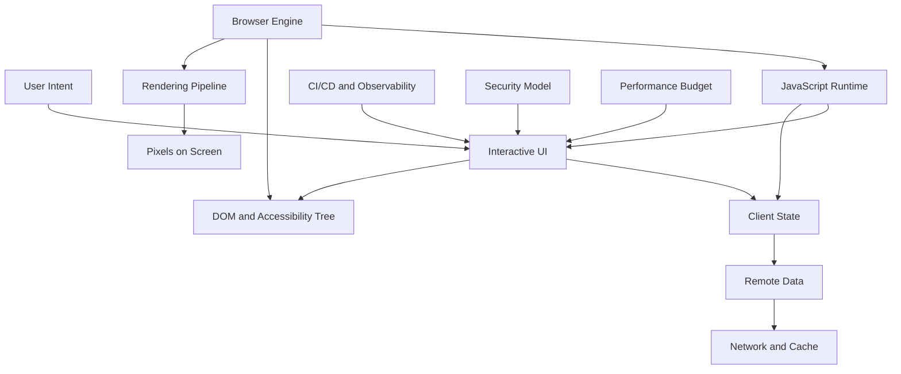
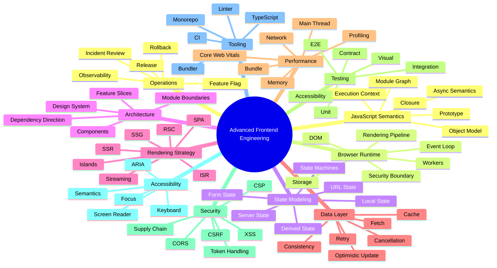
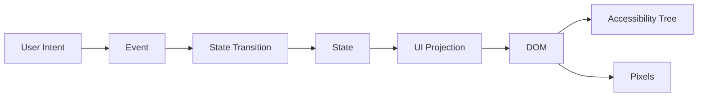
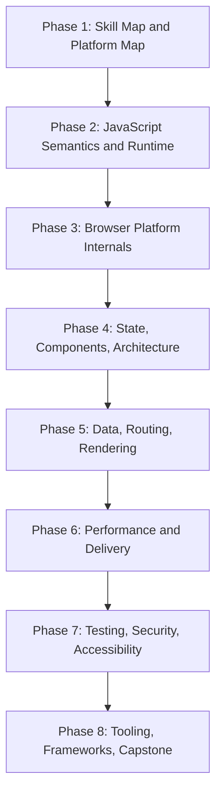
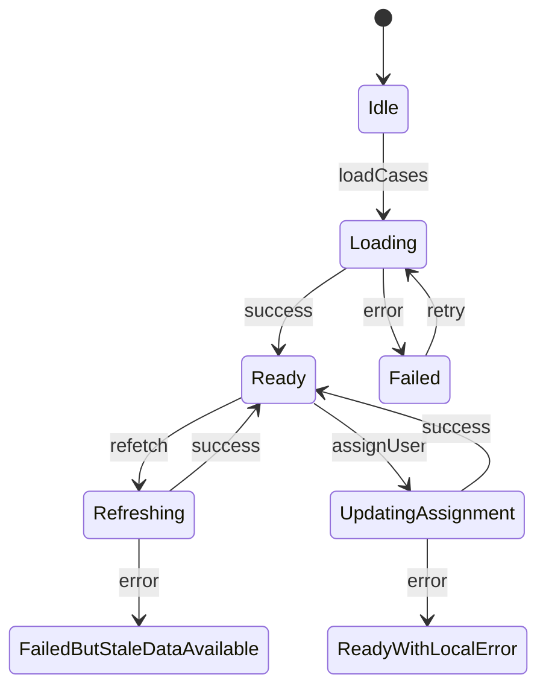

------
title: Learn Advanced JavaScript for Web / Frontend Engineering - Part 001
description: Kaufman skill map for mastering advanced JavaScript frontend engineering through deliberate practice, production mental models, and top-tier engineering feedback loops.
series: learn-javascript-frontend-advanced
seriesTitle: Learn Advanced JavaScript for Web / Frontend Engineering
order: 1
partTitle: Kaufman Skill Map for Advanced Frontend Engineering
tags:
- javascript
- frontend
- web
- advanced
- kaufman
- skill-map
- engineering-handbook
date: 2026-06-27
---

# Kaufman Skill Map for Advanced Frontend Engineering

## 1. Tujuan Part Ini

Part ini adalah peta belajar. Kita belum masuk terlalu dalam ke `Promise`, event loop, DOM, React Server Components, caching, performance, accessibility, atau security. Semua itu akan datang pada part berikutnya.

Tujuan part ini adalah menjawab pertanyaan yang lebih fundamental:

> Kalau kita ingin menjadi frontend engineer level sangat tinggi, apa sebenarnya skill yang harus didekonstruksi, dilatih, divalidasi, dan dioperasikan secara konsisten?

Materi ini menggunakan prinsip dari *The First 20 Hours* karya Josh Kaufman:

1. **Deconstruct the skill**: pecah skill besar menjadi sub-skill yang bisa dilatih.
2. **Learn enough to self-correct**: belajar cukup teori agar bisa mendeteksi kesalahan sendiri.
3. **Remove barriers to practice**: hilangkan hambatan setup, tool, ambiguity, dan friction.
4. **Practice deliberately for at least 20 hours**: latihan terarah dengan feedback, bukan konsumsi konten pasif.

Dalam konteks advanced frontend, prinsip ini perlu sedikit diperluas. Kita tidak sedang belajar “cara membuat todo app”. Kita sedang membangun kemampuan untuk mendesain, menguji, mengobservasi, dan mempertahankan sistem UI yang kompleks di atas runtime browser yang berubah, jaringan yang tidak stabil, perangkat yang heterogen, dan kebutuhan produk yang sering ambigu.

## 2. Definisi Skill: Advanced JavaScript Frontend Engineering

Advanced frontend engineering bukan hanya kemampuan menggunakan framework. Framework adalah lapisan ekspresi. Skill yang lebih mendasar adalah kemampuan mengendalikan sistem ini:



Frontend engineer senior harus mampu menjelaskan hubungan berikut:

- bagaimana kode JavaScript berubah menjadi interaksi pengguna;
- bagaimana state lokal, state server, URL, cache, dan DOM saling memengaruhi;
- bagaimana satu update kecil bisa menyebabkan layout, paint, request, rerender, hydration mismatch, atau accessibility regression;
- bagaimana sebuah bug yang tampak “UI doang” sebenarnya bisa berasal dari scheduling, cache invalidation, stale closure, race condition, browser compatibility, atau kontrak API yang salah;
- bagaimana keputusan arsitektur frontend berdampak pada deployment, observability, security, dan maintainability.

Skill ini bukan satu kemampuan. Ini gabungan dari beberapa lapisan.

## 3. Yang Tidak Akan Kita Ulang

Karena seri ini adalah lanjutan dari pembelajaran basic dan beberapa seri engineering sebelumnya, kita tidak akan mengulang materi berikut kecuali dibutuhkan untuk konteks advance:

- `let`, `const`, `var`, basic function, basic class, basic array methods;
- HTML semantic dasar;
- CSS selector, box model, flexbox, grid dasar;
- konsep programming umum seperti variable, loop, condition, function, OOP dasar;
- tutorial framework sederhana;
- contoh aplikasi dangkal tanpa failure model.

Kita akan memakai konsep basic itu sebagai asumsi, lalu naik ke lapisan yang lebih sulit: runtime, semantic, invariants, trade-off, diagnosis, dan production constraints.

## 4. Output Akhir yang Ingin Dicapai

Setelah menyelesaikan seri ini, targetnya bukan sekadar “bisa bikin frontend”. Targetnya adalah memiliki operating model seperti ini:

| Area | Kemampuan yang Diharapkan |
|---|---|
| Language | Memahami JavaScript bukan hanya syntax, tetapi execution semantics, object model, closure, async scheduling, memory, module graph, dan interop dengan host runtime. |
| Browser | Memahami browser sebagai platform: DOM, event loop, rendering pipeline, networking, storage, workers, security boundary, dan compatibility. |
| State | Mampu memodelkan state dengan invariant: local state, server state, derived state, URL state, form state, optimistic state, dan async lifecycle. |
| Architecture | Mampu menentukan boundary module, component, feature, data, rendering, deployment, dan ownership. |
| Performance | Mampu mendiagnosis bottleneck berdasarkan data: Core Web Vitals, flame chart, long task, bundle, network waterfall, memory profile. |
| Reliability | Mampu menangani error, cancellation, retry, fallback, consistency, race condition, dan degraded mode. |
| Security | Memahami XSS, CSRF, token handling, CORS, CSP, dependency risk, dan supply-chain risk dari sisi frontend. |
| Accessibility | Mampu membangun interaksi yang benar secara semantic, keyboard-accessible, screen-reader-aware, dan testable. |
| Testing | Mampu menyusun strategi unit, integration, component, contract, E2E, visual, dan accessibility testing tanpa over-testing. |
| Delivery | Mampu mendesain build, CI, release, observability, feature flag, rollback, dan regression gates. |

## 5. Prinsip Top 1% Frontend Engineer

Istilah “top 1%” sering kabur. Dalam seri ini, kita definisikan secara operasional.

Seorang frontend engineer level tinggi bukan orang yang hafal semua library. Ia adalah engineer yang bisa membuat keputusan benar di bawah constraints.

### 5.1 Ia Tidak Menilai Teknologi dari Hype

Contoh pertanyaan yang lebih matang:

- Apakah state ini harus hidup di component, URL, cache, server, atau state machine?
- Apakah rendering mode ini memindahkan kompleksitas ke server, client, build time, atau edge?
- Apakah masalah performance ini berasal dari JavaScript execution, rendering pipeline, asset delivery, network, atau backend latency?
- Apakah komponen ini perlu reusable, composable, configurable, atau justru spesifik domain?
- Apakah caching ini punya invalidation model yang jelas?
- Apakah user bisa menyelesaikan flow dengan keyboard dan screen reader?
- Apakah error ini bisa diobservasi dan dikorelasikan dengan user impact?

### 5.2 Ia Bisa Membedakan Symptoms dan Root Cause

| Symptom | Kemungkinan Root Cause |
|---|---|
| UI terasa lambat | Long task, excessive rerender, layout thrashing, heavy hydration, slow network, large bundle, inefficient data fetching, image delivery buruk. |
| Data berubah balik sendiri | Race condition, stale response, optimistic update rollback, cache invalidation salah, refetch policy agresif. |
| Bug hanya muncul di production | Minification, environment variable, timing difference, hydration mismatch, CDN cache, browser compatibility, feature flag state. |
| Component sulit dipakai ulang | Boundary salah, terlalu banyak responsibility, props API bocor, implicit state, styling coupling. |
| Test sering flaky | Selector rapuh, async wait salah, network tidak dikontrol, global state bocor, clock tidak deterministik. |
| Form sering invalid tanpa sebab jelas | Dirty/touched semantics kabur, validation source bercampur, async validation race, schema mismatch. |

Engineer kuat selalu mengejar causal chain, bukan sekadar patch lokal.

## 6. Deconstruct the Skill: Peta Sub-Skill

Skill advanced frontend dapat dipecah menjadi 12 domain besar.



Kita akan memperlakukan setiap domain sebagai skill terpisah, lalu menggabungkannya dalam case study.

## 7. Skill Tree Level 0 sampai Level 5

Agar progress bisa diukur, gunakan model level berikut.

### Level 0: Consumer

Karakteristik:

- bisa mengikuti tutorial;
- bisa memasang library;
- bisa membuat fitur sederhana jika requirement jelas;
- belum mampu menjelaskan failure mode.

Contoh output:

```tsx
function SearchBox() {
  const [query, setQuery] = useState('');

  useEffect(() => {
    fetch(`/api/search?q=${query}`)
      .then((r) => r.json())
      .then(setResults);
  }, [query]);
}
```

Masalahnya bukan syntax. Masalahnya: tidak ada cancellation, debounce, stale response protection, empty state, error state, loading state, cache policy, input accessibility, atau observability.

### Level 1: Implementer

Karakteristik:

- bisa membuat fitur bekerja;
- paham pola umum;
- mulai bisa membaca dokumentasi;
- masih banyak keputusan didorong oleh “biasanya begitu”.

### Level 2: Debugger

Karakteristik:

- bisa membaca stack trace;
- bisa memakai DevTools;
- bisa membedakan bug UI, network, data, rendering, dan state;
- mulai memahami async flow.

### Level 3: Designer

Karakteristik:

- bisa mendesain component contract;
- bisa menentukan state ownership;
- bisa memecah fitur berdasarkan boundary;
- bisa menulis API frontend yang stabil.

### Level 4: Systems Engineer

Karakteristik:

- memandang frontend sebagai distributed system kecil;
- memikirkan latency, failure, cache consistency, partial availability, security boundary, dan observability;
- mampu melakukan architecture review.

### Level 5: Technical Leader

Karakteristik:

- membuat standar tim;
- membuat migration plan;
- menurunkan insiden production menjadi learning system;
- menyeimbangkan product velocity dan engineering quality;
- bisa memilih teknologi berdasarkan constraints organisasi.

Seri ini ditulis untuk membawa pembaca dari Level 2/3 menuju Level 4/5.

## 8. Learn Enough to Self-Correct

Dalam Kaufman, belajar teori tidak boleh terlalu banyak sampai menunda praktik. Tetapi untuk advanced frontend, teori minimum yang benar sangat penting karena browser dan JavaScript punya banyak perilaku tidak intuitif.

Self-correction berarti mampu menjawab empat pertanyaan saat ada bug:

1. **Apa invariant yang dilanggar?**
2. **Di boundary mana pelanggaran terjadi?**
3. **Apakah ini bug logic, timing, state, rendering, network, compatibility, atau security?**
4. **Bukti apa yang membedakan satu hipotesis dari hipotesis lain?**

### 8.1 Contoh: Bug Stale Response

Kode naif:

```ts
async function loadUser(userId: string) {
  const response = await fetch(`/api/users/${userId}`);
  const user = await response.json();
  setUser(user);
}
```

Jika user berpindah dari `A` ke `B`, request `A` bisa selesai setelah request `B`, lalu UI menampilkan data `A` padahal state aktif adalah `B`.

Self-correction yang benar:

- invariant: UI user detail harus sesuai dengan `activeUserId` terbaru;
- boundary: async data fetching ke state mutation;
- root cause: response lama masih boleh menulis ke state baru;
- solusi: cancellation, request identity, cache library, atau state machine.

Contoh perbaikan sederhana:

```ts
let requestSeq = 0;

async function loadUser(userId: string) {
  const seq = ++requestSeq;
  const response = await fetch(`/api/users/${userId}`);
  const user = await response.json();

  if (seq !== requestSeq) {
    return;
  }

  setUser(user);
}
```

Ini bukan solusi final untuk semua kasus, tetapi menunjukkan mental model: async result tidak boleh otomatis dipercaya.

## 9. Remove Barriers to Practice

Hambatan belajar advanced frontend biasanya bukan kurang video. Hambatan utamanya adalah environment tidak mendukung feedback cepat.

### 9.1 Setup Minimum untuk Seri Ini

Gunakan stack latihan yang kecil tetapi production-relevant:

- Node.js LTS modern;
- package manager yang konsisten;
- TypeScript;
- Vite untuk eksperimen browser cepat;
- browser Chromium + Firefox untuk cross-browser check;
- Playwright untuk E2E;
- ESLint + formatter;
- test runner;
- DevTools profiling;
- local mock API;
- Git repository khusus latihan.

Tidak semua part membutuhkan framework. Banyak konsep harus dilatih di browser native dulu sebelum dibungkus React/Vue/Svelte.

### 9.2 Struktur Repository Latihan

Gunakan satu repository seperti ini:

```txt
learn-javascript-frontend-advanced/
  apps/
    playground-native/
    playground-react/
    playground-next/
    case-dashboard/
  packages/
    ui/
    data-client/
    state-machines/
    testing-utils/
  notes/
    decisions/
    profiling/
    incidents/
  tests/
    e2e/
    fixtures/
```

Tujuannya bukan membuat monorepo rumit. Tujuannya membuat tempat latihan yang mengizinkan comparison:

- native DOM vs framework;
- client rendering vs server rendering;
- manual fetch vs cache abstraction;
- unit test vs E2E test;
- optimistic update vs pessimistic update.

### 9.3 Latihan Harus Mempunyai Feedback Loop

Setiap latihan harus menghasilkan salah satu feedback berikut:

| Feedback | Tool / Bukti |
|---|---|
| Correctness | Test pass/fail, invariant check, property-based thinking. |
| Performance | DevTools Performance panel, Lighthouse, Web Vitals, flame chart. |
| Accessibility | Keyboard test, screen reader smoke test, axe, semantic inspection. |
| Reliability | Network throttling, offline mode, retry/cancellation test. |
| Maintainability | Code review checklist, dependency graph, module boundary check. |
| Security | Threat model checklist, CSP report, dependency audit. |

Tanpa feedback, latihan berubah menjadi aktivitas menulis kode biasa.

## 10. Deliberate Practice Model

Latihan deliberate berbeda dari “membangun project random”. Ia punya target sempit, constraint, dan evaluasi.

### 10.1 Template Latihan

Gunakan format berikut untuk setiap latihan besar:

```md
## Practice: <nama latihan>

### Target Skill
Apa skill yang dilatih?

### Scenario
Apa konteks domainnya?

### Constraints
Apa batasan teknisnya?

### Invariants
Apa yang harus selalu benar?

### Failure Modes
Apa yang sengaja harus diuji?

### Implementation
Apa yang dibuat?

### Verification
Bagaimana membuktikan hasilnya benar?

### Reflection
Apa trade-off dan alternatifnya?
```

### 10.2 Contoh Latihan: Search dengan Race Control

```md
## Practice: Search with Race Control

### Target Skill
Async control flow, cancellation, stale response prevention.

### Scenario
User mengetik query cepat pada search input.

### Constraints
- Network latency acak 100ms sampai 1500ms.
- Response bisa datang tidak berurutan.
- Query kosong tidak boleh memanggil API.
- User bisa membatalkan dengan clear button.

### Invariants
- Hasil yang tampil harus sesuai query terakhir.
- Loading state tidak boleh stuck.
- Error lama tidak boleh menimpa hasil query baru.

### Failure Modes
- Request lambat selesai belakangan.
- Request gagal setelah query berubah.
- Component unmount saat request masih berjalan.

### Verification
- Unit test untuk state transition.
- E2E test dengan mocked network delay.
- Manual test dengan throttling DevTools.
```

## 11. Mental Model Utama Seri Ini

### 11.1 Frontend adalah Distributed System di Browser

Frontend modern tidak lagi hanya “view layer”. Ia berkomunikasi dengan server, cache, CDN, identity provider, analytics, feature flag, worker, storage lokal, service worker, dan kadang edge runtime.

Distributed system memiliki masalah klasik:

- latency;
- partial failure;
- retry storm;
- stale data;
- inconsistent cache;
- clock/time assumption;
- concurrency;
- idempotency;
- observability gap.

Frontend mewarisi semua masalah ini, hanya saja gejalanya muncul sebagai UI glitch.

### 11.2 UI adalah State Projection

UI seharusnya dipandang sebagai proyeksi dari state:



Jika UI salah, jangan langsung menyalahkan component. Tanyakan:

- state mana yang menjadi sumber kebenaran?
- transisi mana yang mengubah state?
- apakah derived state dihitung dari sumber yang tepat?
- apakah state lama masih bisa menulis ke UI?
- apakah DOM merepresentasikan state dengan benar?

### 11.3 Browser adalah Scheduler, Bukan Sekadar Renderer

Browser mengatur:

- event dispatch;
- JavaScript execution;
- microtasks;
- rendering opportunities;
- animation frame;
- resource loading;
- painting;
- compositing;
- idle work.

Jika kita tidak memahami scheduling, kita akan membuat UI yang tampak benar pada mesin cepat tetapi patah pada perangkat lambat.

### 11.4 Component adalah Contract, Bukan File

Component bagus bukan yang “kelihatan reusable”. Component bagus punya contract jelas:

- apa inputnya;
- siapa pemilik state;
- apa event yang bisa keluar;
- apa accessibility responsibility-nya;
- apa styling boundary-nya;
- apa side effect yang dilarang;
- apa performance expectation-nya.

### 11.5 Cache adalah State dengan Expiration dan Authority

Cache bukan optimization tambahan. Cache adalah state. Maka cache butuh jawaban:

- siapa authority data?
- kapan data dianggap stale?
- event apa yang menginvalidasi data?
- apakah update optimistic boleh?
- apa rollback behavior?
- apakah cache scoped per user, tenant, tab, route, atau session?

## 12. Roadmap Internal 35 Part

Seri ini dibagi menjadi delapan fase.



### Phase 1: Skill Map and Platform Map

- Part 001: Kaufman Skill Map
- Part 002: Modern JavaScript Platform Map

Tujuan: membangun peta mental sebelum masuk ke detail.

### Phase 2: JavaScript Semantics and Runtime

- Part 003: Language Semantics Beyond Syntax
- Part 004: Event Loop, Tasks, Microtasks, and Rendering
- Part 005: Async Control Flow and Cancellation
- Part 006: Modules, Bundling, and Code Loading
- Part 007: Browser Runtime, Memory, and Garbage Collection

Tujuan: memahami JavaScript sebagai bahasa dan runtime.

### Phase 3: Browser Platform Internals

- Part 008: DOM as a Stateful System
- Part 009: Browser Rendering Pipeline

Tujuan: memahami bagaimana code menjadi DOM dan pixels.

### Phase 4: State, Components, Architecture

- Part 010: State Modeling for Frontend Systems
- Part 011: Reactivity and Change Propagation
- Part 012: Component Architecture at Scale
- Part 013: Frontend Architecture Boundaries

Tujuan: mendesain UI sebagai sistem yang maintainable.

### Phase 5: Data, Routing, Rendering

- Part 014: Data Fetching, Cache, and Consistency
- Part 015: Forms, Validation, and User Input Systems
- Part 016: Routing, Navigation, and URL State
- Part 017: Rendering Strategies: SPA, SSR, SSG, ISR, RSC
- Part 018: Hydration, Resumability, and Islands

Tujuan: memahami lifecycle aplikasi frontend modern.

### Phase 6: Performance and Delivery

- Part 019: Performance Engineering and Core Web Vitals
- Part 020: JavaScript Performance Profiling
- Part 021: Network Performance and Delivery
- Part 022: Web Workers, WASM, and Off-Main-Thread Architecture

Tujuan: mengukur dan mengoptimalkan berdasarkan bukti.

### Phase 7: Testing, Security, Accessibility

- Part 023: Type Systems with TypeScript for Frontend
- Part 024: Error Handling, Observability, and Debuggability
- Part 025: Testing Strategy for Frontend Systems
- Part 026: Playwright and Browser Automation
- Part 027: Security for Modern Frontends
- Part 028: Accessibility as Engineering Discipline
- Part 029: Internationalization, Localization, and Time

Tujuan: membuat sistem yang aman, reliable, testable, dan inklusif.

### Phase 8: Tooling, Frameworks, Capstone

- Part 030: Design System Engineering
- Part 031: Build Tooling, Vite, Monorepo, and CI
- Part 032: Framework Decision-Making
- Part 033: Next.js Production Architecture
- Part 034: Frontend System Design Case Studies
- Part 035: Capstone: Top 1% Frontend Engineer Operating Model

Tujuan: menggabungkan semua skill dalam keputusan engineering nyata.

## 13. Apa yang Harus Dicatat Saat Belajar

Gunakan catatan bukan sebagai ringkasan, tetapi sebagai knowledge base engineering.

### 13.1 Decision Log

```md
# Decision: Where should this state live?

## Context
Fitur memiliki filter, pagination, sort, dan tab aktif.

## Options
1. Component local state
2. URL query params
3. Global store
4. Server session

## Decision
Filter, pagination, sort masuk URL query params.
Tab aktif masuk URL jika deep-linkable; local state jika hanya presentational.

## Why
- Shareable link
- Back/forward navigation benar
- Refresh tidak kehilangan state
- Observability route lebih baik

## Consequences
- Perlu parser/serializer query param
- Perlu default value policy
- Perlu migration jika query schema berubah
```

### 13.2 Failure Log

```md
# Failure: Search result shows stale data

## Symptom
User mengetik `john`, lalu `jane`, tetapi hasil `john` muncul setelah `jane`.

## Root Cause
Response `john` selesai lebih lambat dan masih menulis ke state.

## Fix
Tambahkan AbortController dan request identity check.

## Prevention
Semua async query yang bergantung input user harus punya cancellation atau stale guard.
```

### 13.3 Profiling Log

```md
# Profiling: Slow interaction on table filter

## Scenario
Filtering 10k rows in client table.

## Evidence
- INP tinggi pada perangkat low-end.
- Flame chart menunjukkan heavy synchronous filtering pada main thread.

## Options
1. Debounce input
2. Virtualize rows
3. Move computation to worker
4. Server-side filtering

## Decision
Server-side filtering untuk production; worker hanya untuk offline mode.
```

## 14. Rubric Evaluasi Diri

Gunakan rubric berikut setiap selesai satu fase.

| Level | Indicator | Bukti yang Harus Ada |
|---|---|---|
| 1 | Bisa menjelaskan konsep | Catatan ringkas dan diagram. |
| 2 | Bisa mengimplementasikan contoh | Working code dengan test minimum. |
| 3 | Bisa mendiagnosis bug | Failure log dengan root cause. |
| 4 | Bisa memilih trade-off | Decision log dengan alternatif. |
| 5 | Bisa membuat guideline tim | Checklist atau standard yang reusable. |

Jika hanya mencapai level 1, berarti masih konsumsi. Jika mencapai level 3, mulai berguna. Jika mencapai level 4/5, skill mulai menjadi engineering capability.

## 15. Anti-Pattern Belajar Frontend Advance

### 15.1 Belajar Framework Sebelum Runtime

Framework membantu produktivitas, tetapi runtime menentukan batasan. Banyak bug framework sebenarnya berasal dari:

- closure semantics;
- async scheduling;
- DOM event propagation;
- layout invalidation;
- browser cache;
- hydration mismatch;
- URL/history behavior.

### 15.2 Menganggap UI Bug Selalu Bug Component

UI bug bisa berasal dari:

- API contract;
- backend eventual consistency;
- CDN cache;
- stale service worker;
- feature flag;
- auth token expiration;
- browser extension;
- locale/timezone;
- accessibility tree mismatch.

### 15.3 Mengoptimalkan Tanpa Budget

Optimization tanpa budget biasanya menjadi opini. Performance engineering harus punya baseline, target, dan measurement.

Contoh budget:

```md
- Initial JS under 180 KB compressed for critical route.
- No long task above 100 ms during first interaction on mid-tier mobile.
- LCP under target percentile based on field data.
- Table interaction under 100 ms for 5k visible-domain rows.
```

Angka budget harus disesuaikan konteks produk, tetapi prinsipnya sama: optimization butuh constraint eksplisit.

### 15.4 Membuat Abstraction Terlalu Cepat

Frontend sering rusak karena abstraction dibuat sebelum variasi problem dipahami.

Tanda abstraction buruk:

- props terlalu banyak;
- naming generic tetapi behavior spesifik;
- sulit dites;
- state ownership tidak jelas;
- side effect tersembunyi;
- styling bocor;
- accessibility tidak konsisten.

## 16. Practice Loop 20 Jam Pertama untuk Seri Ini

Walaupun seri ini panjang, kita tetap memakai pendekatan “20 jam pertama” sebagai bootstrap.

### Jam 0-2: Platform Orientation

Target:

- paham JavaScript vs ECMAScript vs Web APIs;
- paham browser sebagai host runtime;
- membuat repository latihan.

Output:

- diagram platform pribadi;
- setup playground.

### Jam 2-5: Async and Event Loop

Target:

- memahami task, microtask, rendering opportunity;
- membuat eksperimen ordering;
- membuat demo race condition.

Output:

- notebook eksperimen event loop;
- failure log stale response.

### Jam 5-8: DOM and Rendering

Target:

- memahami event propagation;
- memahami layout thrashing;
- membuat demo forced reflow.

Output:

- profiling log;
- fix dengan batching read/write.

### Jam 8-12: State and Data

Target:

- membedakan local, remote, derived, URL, form state;
- membuat state machine sederhana;
- membuat fetch dengan cancellation.

Output:

- state transition diagram;
- test untuk race condition.

### Jam 12-16: Component and Architecture

Target:

- mendesain component contract;
- memisahkan feature boundary;
- membuat headless component kecil.

Output:

- component API doc;
- architecture decision record.

### Jam 16-20: Reliability and Review

Target:

- menambah E2E test;
- menambah accessibility smoke test;
- menambah performance budget sederhana;
- menulis review checklist.

Output:

- mini case study production readiness.

## 17. Mini Capstone untuk Bootstrap

Sebelum masuk ke part yang lebih dalam, siapkan satu mini capstone yang akan kita revisi berkali-kali.

### Domain: Case Management Dashboard

Fitur:

- daftar kasus dengan filter, sort, pagination;
- detail kasus;
- assignment user;
- status transition;
- comment timeline;
- attachment preview;
- notification badge;
- audit trail ringan.

Mengapa domain ini bagus?

- punya state kompleks;
- punya async flow;
- punya consistency problem;
- punya authorization concern;
- punya accessibility concern;
- punya performance concern pada table/list;
- punya auditability requirement.

### Invariants Awal

```md
- User tidak boleh melihat kasus yang tidak authorized.
- Status transition harus mengikuti allowed transition.
- UI tidak boleh menampilkan stale assignee setelah update berhasil.
- Filter/sort/pagination harus shareable via URL.
- Comment yang gagal terkirim harus terlihat sebagai failed local state.
- Audit trail tidak boleh dimutasi client-side sebagai sumber kebenaran.
```

### Diagram State Sederhana



Kita akan memakai capstone ini sebagai contoh berulang untuk state, data fetching, routing, forms, testing, security, performance, dan observability.

## 18. Checklist Sebelum Lanjut ke Part 002

Sebelum lanjut, pastikan kamu bisa menjawab:

1. Apa beda belajar frontend sebagai “framework usage” dan sebagai “system engineering”?
2. Apa saja sub-skill utama advanced frontend?
3. Mengapa async result tidak boleh otomatis dipercaya?
4. Mengapa cache harus dianggap state?
5. Apa minimal feedback loop untuk latihan frontend advance?
6. Bagaimana cara menulis failure log?
7. Apa mini capstone yang akan dipakai selama seri ini?

## 19. Ringkasan

Advanced frontend engineering adalah kemampuan mengendalikan sistem UI di atas runtime browser, jaringan, state, rendering pipeline, security model, dan delivery pipeline.

Dengan pendekatan Kaufman, kita tidak belajar semuanya sekaligus. Kita pecah skill menjadi sub-skill, belajar teori minimum untuk self-correction, menghilangkan hambatan praktik, lalu melakukan latihan deliberate dengan feedback nyata.

Part berikutnya akan membangun peta platform JavaScript modern: ECMAScript, Web APIs, DOM, HTML event loop, browser engine, module loading, standards, compatibility, dan deployment target.

## 20. References

- Josh Kaufman, *The First 20 Hours: How to Learn Anything... Fast*.
- ECMA International, ECMA-262 ECMAScript Language Specification: https://ecma-international.org/publications-and-standards/standards/ecma-262/
- TC39 Process: https://tc39.es/process-document/
- MDN JavaScript: https://developer.mozilla.org/en-US/docs/Web/JavaScript
- MDN Web APIs: https://developer.mozilla.org/en-US/docs/Web/API
- MDN Baseline: https://developer.mozilla.org/en-US/docs/Glossary/Baseline/Compatibility
