------
title: Learn Advanced JavaScript for Web / Frontend Engineering - Part 002
description: "A modern platform map of JavaScript for web frontend engineering: ECMAScript, browser host APIs, DOM, event loop, rendering, modules, compatibility, and deployment targets."
series: learn-javascript-frontend-advanced
seriesTitle: Learn Advanced JavaScript for Web / Frontend Engineering
order: 2
partTitle: Modern JavaScript Platform Map
tags:
- javascript
- frontend
- web-platform
- browser
- ecmascript
- web-apis
- architecture
- engineering-handbook
date: 2026-06-27
---

# Modern JavaScript Platform Map

## 1. Tujuan Part Ini

Part ini membangun peta platform. Sebelum kita membedah execution context, event loop, DOM, rendering pipeline, module graph, atau framework, kita perlu memahami satu hal penting:

> JavaScript frontend bukan hanya bahasa JavaScript. Ia adalah gabungan antara ECMAScript, browser host APIs, DOM, HTML event loop, rendering engine, network stack, security model, compatibility matrix, build pipeline, dan deployment environment.

Banyak engineer belajar JavaScript seolah-olah runtime-nya netral. Di backend, JavaScript berjalan di Node.js, Deno, atau Bun. Di browser, JavaScript berjalan di dalam sistem yang jauh lebih kompleks: browser process, renderer process, DOM, CSSOM, compositor, network service, storage, permission model, origin policy, dan user interaction model.

Part ini menjadi peta navigasi untuk seluruh seri.

## 2. JavaScript vs ECMAScript vs Web Platform

Istilah “JavaScript” sering dipakai untuk beberapa hal sekaligus. Untuk engineering yang presisi, kita harus memisahkannya.

| Istilah | Arti Praktis | Contoh |
|---|---|---|
| ECMAScript | Spesifikasi bahasa: syntax, type, object model, execution semantics, standard library inti. | `let`, `Promise`, `Map`, `Set`, `Array.prototype`, modules. |
| JavaScript Engine | Implementasi ECMAScript yang mengeksekusi kode. | V8, SpiderMonkey, JavaScriptCore. |
| Host Environment | Lingkungan yang menyediakan API tambahan dan aturan eksekusi. | Browser, Node.js, Deno, Bun, edge runtime. |
| Web APIs | API browser yang biasanya dipakai dari JavaScript, tetapi bukan bagian inti ECMAScript. | `fetch`, `document`, `localStorage`, `navigator`, `MutationObserver`, `IntersectionObserver`. |
| Web Platform | Keseluruhan standar dan kemampuan browser. | HTML, DOM, CSSOM, Fetch, URL, Encoding, Streams, Storage, Workers, accessibility tree. |

Contoh paling sederhana:

```js
const result = await fetch('/api/cases');
```

`await` dan `Promise` berada di wilayah ECMAScript. `fetch` berasal dari Web API yang didefinisikan oleh platform web. Perilaku scheduling-nya mengikuti event loop host environment browser. Response-nya tunduk pada CORS, cache, service worker, credential mode, dan origin policy.

Jika kita menganggap semua itu “JavaScript biasa”, kita akan kehilangan banyak root cause saat debugging.

## 3. Layer Model Platform Frontend

Gunakan model lapisan berikut.

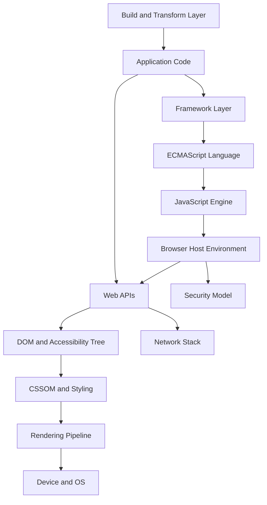

Keterangan:

- **Application Code**: kode fitur, UI, domain logic, state, data fetching.
- **Framework Layer**: React, Vue, Svelte, Solid, Angular, atau native abstraction.
- **Build and Transform Layer**: TypeScript, Babel/SWC, Vite, bundler, minifier, CSS pipeline.
- **ECMAScript Language**: semantic bahasa standar.
- **JavaScript Engine**: parser, interpreter, JIT, GC, optimizer.
- **Browser Host Environment**: event loop, task scheduling, realms, integration dengan DOM dan rendering.
- **Web APIs**: API yang disediakan browser.
- **DOM and Accessibility Tree**: representasi document dan interaksi assistive technology.
- **CSSOM and Styling**: style computation dan layout inputs.
- **Rendering Pipeline**: layout, paint, compositing.
- **Network Stack**: HTTP, cache, priority, service worker, connection reuse.
- **Security Model**: same-origin policy, CORS, CSP, sandbox, permissions.
- **Device and OS**: input, GPU, memory, CPU, battery, display.

## 4. Standards Map

Frontend engineering modern berdiri di atas banyak spesifikasi. Kita tidak perlu membaca semua spesifikasi dari awal sampai akhir, tetapi harus tahu sumber kebenarannya.

### 4.1 ECMAScript

ECMAScript mendefinisikan bahasa. Di sinilah konsep seperti execution context, lexical environment, completion record, object internal methods, promises, modules, dan built-in objects dijelaskan.

Untuk seri ini, ECMAScript penting karena banyak bug framework sebenarnya berasal dari semantic bahasa:

- closure menangkap binding, bukan snapshot value;
- `this` bergantung pada call site atau lexical binding pada arrow function;
- object property punya descriptor dan prototype lookup;
- `Promise` callback masuk microtask;
- module bersifat live binding;
- equality dan coercion punya aturan spesifik.

### 4.2 TC39 Proposal Process

Fitur JavaScript baru tidak langsung “resmi”. Fitur melewati proses proposal TC39.

Secara praktis:

| Stage | Sikap Engineering |
|---|---|
| Stage 0/1 | Ide awal. Jangan jadikan dependency produksi kecuali eksperimen sangat terkontrol. |
| Stage 2 | Desain mulai jelas, tetapi masih bisa berubah. Hati-hati untuk library publik. |
| Stage 3 | Candidate. Lebih realistis untuk dipertimbangkan, tetapi cek implementasi dan transpiler. |
| Stage 4 | Finished. Siap masuk standard ECMAScript berikutnya. |

Aturan kerja:

> Jangan menyebut fitur sebagai “JavaScript modern yang aman” hanya karena ada plugin Babel. Bedakan standard maturity, implementation availability, tooling support, dan browser baseline.

### 4.3 WHATWG and Living Standards

Banyak standar web modern hidup sebagai living standard. Contoh penting:

- HTML;
- DOM;
- Fetch;
- URL;
- Encoding;
- Streams;
- Storage;
- Web Workers.

Untuk frontend engineer, WHATWG penting karena perilaku browser sering dijelaskan di sana, termasuk event loop, task, microtask, parsing HTML, script loading, navigation, dan fetch integration.

### 4.4 MDN and Baseline

MDN bukan spesifikasi formal, tetapi sangat berguna sebagai dokumentasi praktis. Baseline membantu menentukan apakah suatu fitur cukup tersedia di browser populer.

Aturan kerja:

- Untuk memahami konsep cepat, baca MDN.
- Untuk detail edge case, baca spesifikasi.
- Untuk production adoption, cek compatibility dan Baseline.
- Untuk fitur proposal, cek TC39 stage dan implementasi engine.

## 5. Browser Runtime Map

Browser bukan satu proses sederhana. Detail implementasi berbeda antar browser, tetapi mental model umumnya seperti ini:

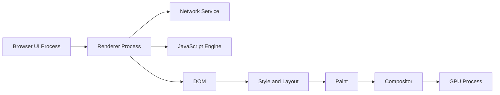

Kita tidak perlu menghafal internal setiap browser. Yang penting adalah konsekuensi engineering:

- JavaScript sering berjalan di main thread renderer yang sama dengan banyak pekerjaan UI.
- Work berat di main thread bisa menghambat input responsiveness.
- DOM mutation bisa memicu style/layout/paint.
- Network request punya lifecycle sendiri dan bisa dipengaruhi cache, service worker, CORS, dan priority.
- Worker bisa memindahkan compute dari main thread, tetapi komunikasi worker punya biaya serialization/transfer.
- Memory leak di frontend bisa bertahan selama tab hidup, bahkan jika route sudah berubah.

## 6. JavaScript Engine Map

JavaScript engine melakukan banyak pekerjaan:

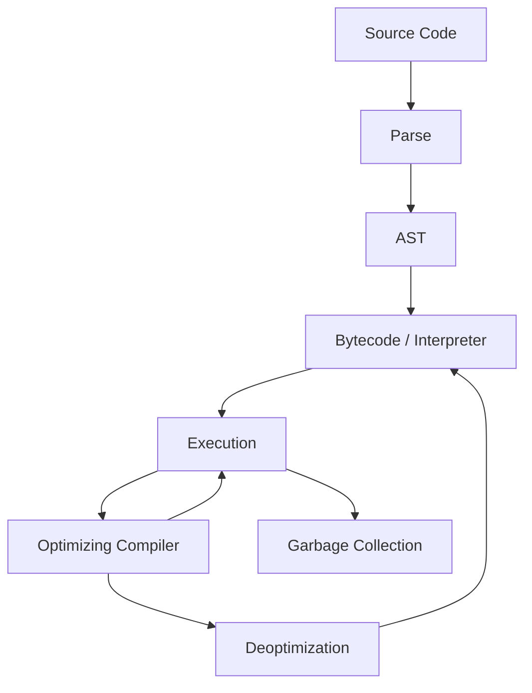

Kita tidak akan menjadi engine developer, tetapi perlu memahami prinsip berikut:

- Engine mengoptimalkan berdasarkan pola yang stabil.
- Bentuk object yang berubah-ubah dapat mengganggu optimization.
- Function panas bisa dioptimalkan, tetapi bisa deopt jika asumsi engine patah.
- Allocation berlebihan meningkatkan tekanan garbage collection.
- Closure yang menahan reference dapat menyebabkan memory retention.

Contoh pola yang bisa buruk dalam hot path:

```js
function updateRow(row, key, value) {
  row[key] = value;
  return row;
}
```

Kode ini tidak selalu salah. Tetapi jika `key` sangat variatif dan dipanggil pada banyak object shape, engine mungkin lebih sulit mengoptimalkan dibanding shape yang stabil. Dalam aplikasi biasa ini mungkin tidak penting. Dalam grid besar dengan ribuan update per detik, ini bisa relevan.

Engineering judgment berarti tahu kapan detail engine penting dan kapan tidak.

## 7. Host Environment: Browser sebagai Penyedia API

ECMAScript tidak tahu tentang `document`, `window`, `fetch`, `localStorage`, atau `requestAnimationFrame`. Semua itu disediakan oleh host environment.

### 7.1 Global Object dan Host Objects

Di browser, banyak API tersedia melalui global object seperti `window` atau `globalThis`.

```js
console.log(globalThis === window); // true pada window context browser umum
console.log(typeof document);       // object
console.log(typeof fetch);          // function
```

Namun jangan menyamakan semua environment:

| Environment | `document` | `window` | `fetch` | DOM |
|---|---:|---:|---:|---:|
| Browser Window | Ada | Ada | Ada | Ada |
| Web Worker | Tidak ada | Tidak ada | Ada pada browser modern | Tidak ada DOM |
| Service Worker | Tidak ada | Tidak ada | Ada | Tidak ada DOM |
| Node.js | Tidak ada secara default | Tidak ada | Ada pada versi modern | Tidak ada DOM default |
| SSR Runtime | Biasanya tidak ada | Tidak ada | Tergantung runtime | Tidak ada DOM nyata |

Konsekuensi:

- kode yang memakai `window` langsung bisa gagal saat SSR;
- kode yang memakai DOM tidak bisa dipindah ke worker;
- utility yang tampak general bisa diam-diam browser-only;
- hydration bug sering muncul dari perbedaan server environment dan browser environment.

### 7.2 Realms dan Execution Context

Dalam browser, setiap iframe/window dapat memiliki realm berbeda. Object dari realm berbeda punya identity dan prototype berbeda.

Contoh masalah:

```js
// Array dari iframe lain bisa gagal pada check tertentu jika memakai instanceof
value instanceof Array;
```

Lebih aman:

```js
Array.isArray(value);
```

Ini terlihat kecil, tetapi penting untuk library, design system, extension, embedded app, dan integration dengan third-party iframe.

## 8. Event Loop Map

Event loop adalah pusat pemahaman async frontend.

Model ringkas:

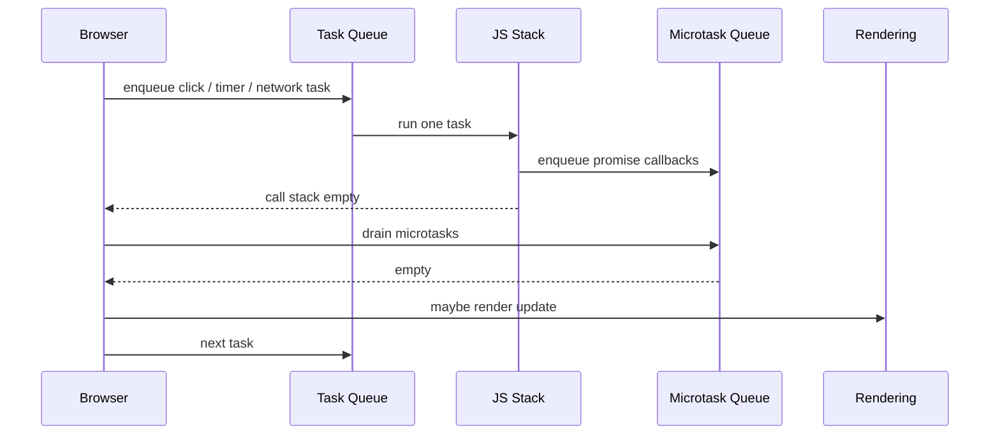

Prinsip penting:

- Satu task dijalankan sampai selesai.
- Setelah task selesai, microtask queue dikosongkan sebelum browser punya kesempatan render.
- Terlalu banyak microtask dapat menunda rendering.
- `requestAnimationFrame` dipakai untuk kerja sebelum render frame.
- `setTimeout(fn, 0)` bukan berarti langsung sekarang; ia masuk task scheduling.
- Network completion, user input, timer, parsing, dan message event punya jalur scheduling yang berbeda.

Contoh eksperimen:

```js
console.log('A');

setTimeout(() => console.log('B: timeout'), 0);

Promise.resolve().then(() => console.log('C: microtask'));

requestAnimationFrame(() => console.log('D: raf'));

console.log('E');
```

Urutan umum yang diharapkan:

```txt
A
E
C: microtask
D: raf
B: timeout
```

Tetapi detail scheduling bisa dipengaruhi konteks browser dan frame lifecycle. Yang penting adalah memahami kategori kerja, bukan menghafal semua urutan tanpa konteks.

## 9. DOM Map

DOM adalah struktur stateful yang merepresentasikan document. Ia bukan sekadar output HTML.

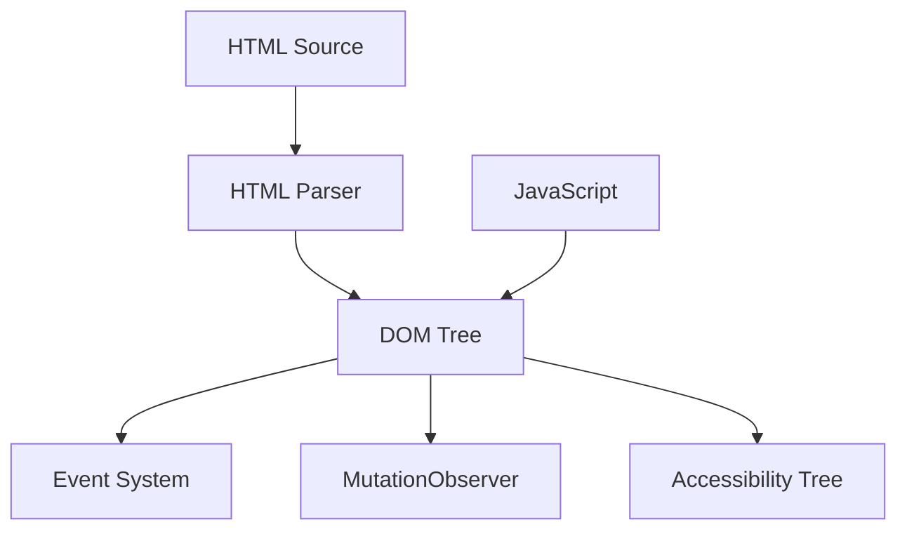

Frontend engineer harus memahami:

- DOM node punya identity;
- DOM mutation dapat berdampak pada style/layout;
- event mengalir melalui capture, target, dan bubble phase;
- accessibility tree dibangun dari DOM + semantics + ARIA + browser mapping;
- DOM API imperative dapat berbenturan dengan framework declarative rendering;
- MutationObserver berjalan via microtask mechanism;
- live collection berbeda dari static snapshot.

Contoh risiko live collection:

```js
const items = document.getElementsByClassName('item'); // live collection

for (let i = 0; i < items.length; i++) {
  items[i].classList.remove('item');
}
```

Karena collection live berubah saat class dihapus, loop bisa melewati element tertentu. Lebih aman membuat snapshot:

```js
const items = Array.from(document.getElementsByClassName('item'));

for (const item of items) {
  item.classList.remove('item');
}
```

## 10. Rendering Pipeline Map

Rendering pipeline menjelaskan bagaimana DOM dan CSS menjadi pixels.

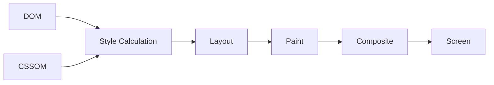

Biaya update berbeda-beda:

| Perubahan | Kemungkinan Biaya |
|---|---|
| Mengubah `transform` | Biasanya composite-only jika layer sesuai. |
| Mengubah `opacity` | Sering composite-friendly. |
| Mengubah `width`, `height`, `top`, `left` | Bisa memicu layout. |
| Membaca layout setelah menulis style | Bisa memicu forced synchronous layout. |
| Menambah banyak node | Bisa memicu style/layout/paint besar. |
| Mengubah text banyak element | Bisa berdampak ke layout dan paint. |

Contoh layout thrashing:

```js
for (const box of boxes) {
  box.style.width = `${container.offsetWidth / 3}px`;
}
```

Masalah: setiap iterasi menulis style dan membaca layout. Lebih baik pisahkan read dan write:

```js
const width = container.offsetWidth / 3;

for (const box of boxes) {
  box.style.width = `${width}px`;
}
```

Part khusus rendering pipeline akan membahas ini lebih dalam.

## 11. Web APIs Capability Map

Browser menyediakan banyak API. Tidak semua harus dikuasai sekaligus. Tetapi kita harus tahu kategori dan failure mode-nya.

| Kategori | API Contoh | Failure Mode Umum |
|---|---|---|
| DOM and Events | `document`, `Element`, `addEventListener`, `MutationObserver` | Memory leak listener, propagation salah, mutation berlebihan. |
| Network | `fetch`, `Headers`, `Request`, `Response`, `WebSocket`, `EventSource` | CORS, timeout tidak eksplisit, retry salah, stale response. |
| Storage | `localStorage`, `sessionStorage`, IndexedDB, Cache API | Quota, blocking sync API, stale schema, privacy mode. |
| Scheduling | `setTimeout`, `requestAnimationFrame`, `requestIdleCallback`, `queueMicrotask` | Starvation, jank, wrong timing assumption. |
| Performance | `PerformanceObserver`, Navigation Timing, Resource Timing | Salah membaca lab vs field, missing attribution. |
| Workers | Web Worker, Service Worker, Shared Worker | Serialization cost, lifecycle kompleks, stale service worker. |
| Media | Canvas, WebGL, WebGPU, Web Audio, MediaDevices | Permission, device compatibility, GPU/resource pressure. |
| File | File, Blob, File System Access | Permission, memory pressure, browser support. |
| Security | Web Crypto, Credential Management, Permissions Policy | Wrong threat model, unsafe token storage. |
| Internationalization | `Intl.*` | Locale fallback, timezone, pluralization. |

Aturan kerja:

> Jangan memilih API hanya karena tersedia. Pilih berdasarkan lifecycle, permission, compatibility, performance cost, security model, dan fallback strategy.

## 12. Network and Fetch Map

`fetch` terlihat sederhana, tetapi berada di atas sistem yang kompleks.

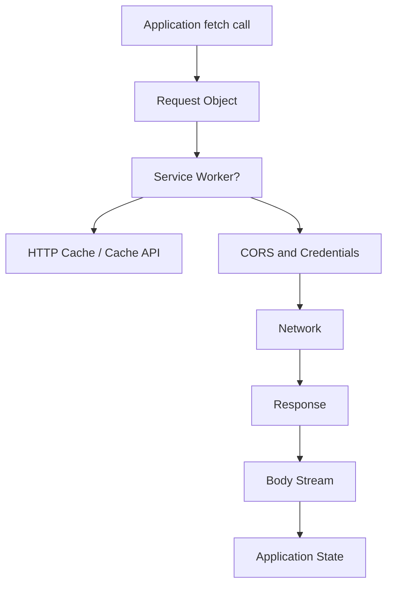

Hal penting:

- `fetch` tidak reject hanya karena HTTP status 404/500; ia reject pada network-level failure tertentu.
- cancellation memakai `AbortController`.
- credential mode memengaruhi cookie/auth.
- CORS adalah enforcement browser, bukan sekadar header backend.
- service worker bisa mengintercept request.
- response body bisa berupa stream.
- cache bisa terjadi di beberapa lapisan: browser HTTP cache, service worker cache, app cache, CDN, backend cache.

Contoh wrapper yang lebih benar daripada fetch naif:

```ts
type ApiResult<T> =
  | { ok: true; data: T; status: number }
  | { ok: false; error: ApiError; status?: number };

type ApiError =
  | { type: 'http'; message: string; status: number }
  | { type: 'network'; message: string }
  | { type: 'aborted'; message: string }
  | { type: 'decode'; message: string };

async function getJson<T>(url: string, signal?: AbortSignal): Promise<ApiResult<T>> {
  try {
    const response = await fetch(url, { signal });

    if (!response.ok) {
      return {
        ok: false,
        status: response.status,
        error: {
          type: 'http',
          status: response.status,
          message: `HTTP ${response.status}`,
        },
      };
    }

    try {
      const data = (await response.json()) as T;
      return { ok: true, data, status: response.status };
    } catch {
      return {
        ok: false,
        status: response.status,
        error: { type: 'decode', message: 'Failed to decode JSON response' },
      };
    }
  } catch (error) {
    if (error instanceof DOMException && error.name === 'AbortError') {
      return { ok: false, error: { type: 'aborted', message: 'Request aborted' } };
    }

    return { ok: false, error: { type: 'network', message: 'Network failure' } };
  }
}
```

Wrapper seperti ini belum lengkap untuk semua production case, tetapi sudah lebih baik karena membedakan HTTP error, network error, abort, dan decode error.

## 13. Storage Map

Storage di browser bukan satu hal.

| Storage | Scope | Sync/Async | Cocok Untuk | Risiko |
|---|---|---:|---|---|
| `localStorage` | Origin | Sync | Setting kecil, feature flag cache kecil | Blocking main thread, string-only, quota, privacy mode. |
| `sessionStorage` | Tab/session | Sync | State sementara per tab | Hilang saat session berakhir, sync blocking. |
| IndexedDB | Origin | Async | Data besar, offline storage, structured data | API kompleks, migration schema. |
| Cache API | Origin/service worker | Async | Request/response caching | Invalidation kompleks. |
| Cookies | Domain/path | Sent with request | Session/auth tertentu | CSRF, size kecil, SameSite/Secure/HttpOnly policy. |
| Memory Cache | Runtime only | N/A | Fast state during page lifetime | Hilang saat reload, leak risk. |

Aturan penting:

- Jangan simpan secret sensitif di JavaScript-accessible storage jika threat model XSS relevan.
- Jangan gunakan `localStorage` untuk data besar atau high-frequency writes.
- Storage butuh schema versioning.
- Offline-first bukan hanya menyimpan data; ia butuh conflict resolution.

## 14. Security Boundary Map

Browser menyediakan security model yang kuat, tetapi mudah disalahpahami.

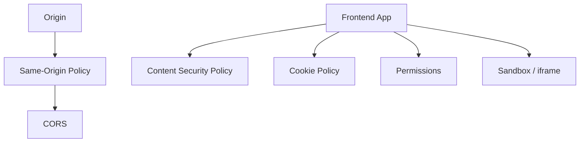

Konsep utama:

- **Origin** terdiri dari scheme, host, dan port.
- **Same-Origin Policy** membatasi akses antar origin.
- **CORS** mengatur kapan response cross-origin boleh dibaca oleh browser.
- **CSP** membantu membatasi sumber script/style/resource dan mengurangi dampak XSS.
- **Cookie flags** seperti `HttpOnly`, `Secure`, dan `SameSite` sangat penting untuk auth flow.
- **iframe sandbox** dapat membatasi kemampuan embedded content.
- **Permissions Policy** dapat membatasi API tertentu.

Frontend security bukan hanya “jangan pakai `innerHTML`”. Ia mencakup data flow, rendering sink, token lifecycle, dependency risk, build artifact, dan runtime policy.

## 15. Module and Code Loading Map

Frontend modern jarang mengirim satu file JavaScript sederhana. Ia mengelola module graph.

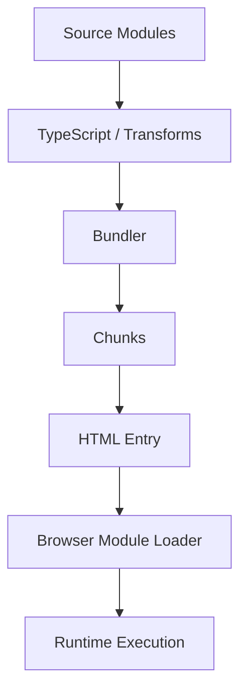

Konsep penting:

- ESM memakai static import untuk dependency graph.
- Dynamic import membuat split point.
- Tree shaking bergantung pada static analyzability dan side-effect model.
- Bundler dapat mengubah struktur module untuk production.
- Transpiler dapat mengubah syntax tetapi tidak selalu mengisi API missing.
- Polyfill mengisi API missing tetapi menambah payload dan risiko behavior mismatch.
- Source map penting untuk debugging production.

Contoh dynamic import:

```ts
async function openHeavyReport() {
  const { ReportViewer } = await import('./ReportViewer');
  renderModal(ReportViewer);
}
```

Ini membantu initial load jika `ReportViewer` jarang dipakai. Tetapi jika user hampir selalu membukanya segera, split ini bisa membuat interaction lebih lambat. Code splitting adalah trade-off, bukan default magic.

## 16. Compatibility Map

Compatibility harus dipandang sebagai keputusan produk dan engineering.

Pertanyaan yang harus dijawab:

1. Browser dan versi apa yang didukung?
2. Apakah target termasuk mobile WebView?
3. Apakah user enterprise memakai browser lama?
4. Apakah fitur butuh graceful degradation?
5. Apakah polyfill cukup atau butuh fallback UX?
6. Apakah performance budget berubah untuk low-end device?
7. Apakah accessibility testing mencakup kombinasi browser/screen reader yang relevan?

### 16.1 Baseline Decision Flow

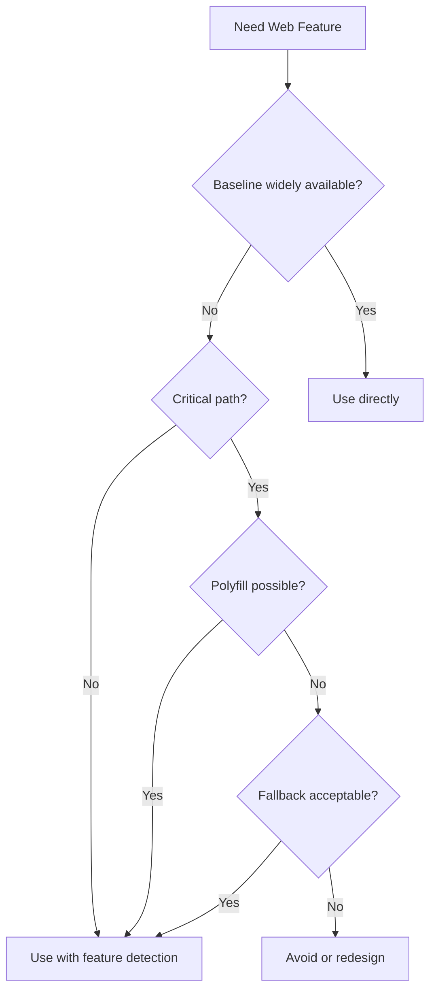

### 16.2 Feature Detection

Prefer feature detection daripada browser sniffing.

```ts
if ('IntersectionObserver' in globalThis) {
  // Use IntersectionObserver
} else {
  // Fallback behavior
}
```

Browser sniffing mudah salah karena browser version, embedded WebView, spoofing, dan partial support.

## 17. Runtime Target Map

Kode frontend modern sering berjalan di banyak target.

| Target | Karakteristik | Risiko |
|---|---|---|
| Browser Client | DOM tersedia, user interaction nyata | Device heterogeneity, browser compatibility, network variability. |
| SSR Node Runtime | Tidak ada DOM nyata | `window` undefined, hydration mismatch. |
| Edge Runtime | API terbatas, latency rendah | Node API tidak tersedia, cold start, platform constraints. |
| Web Worker | Tidak ada DOM, compute off-main-thread | Serialization cost, limited APIs. |
| Service Worker | Lifecycle event-driven, network proxy | Stale cache, update lifecycle, debugging sulit. |
| Test Environment | Simulasi browser atau browser nyata | False confidence jika environment tidak realistis. |
| WebView | Embedded browser di mobile app | Version fragmentation, bridge issues, memory constraints. |

Aturan kerja:

> Selalu sebutkan runtime target saat mendesain module. “Works in JavaScript” tidak cukup.

Contoh annotation:

```ts
// Runtime: browser window only. Uses DOM and ResizeObserver.
export function measureElement(element: Element): DOMRectReadOnly {
  return element.getBoundingClientRect();
}
```

Atau:

```ts
// Runtime: isomorphic. No DOM, no window, no process.
export function buildCaseUrl(caseId: string): string {
  return `/cases/${encodeURIComponent(caseId)}`;
}
```

## 18. Frameworks as Platform Adapters

Framework bukan pengganti platform. Framework adalah adapter yang mengatur bagaimana application state diproyeksikan ke platform.

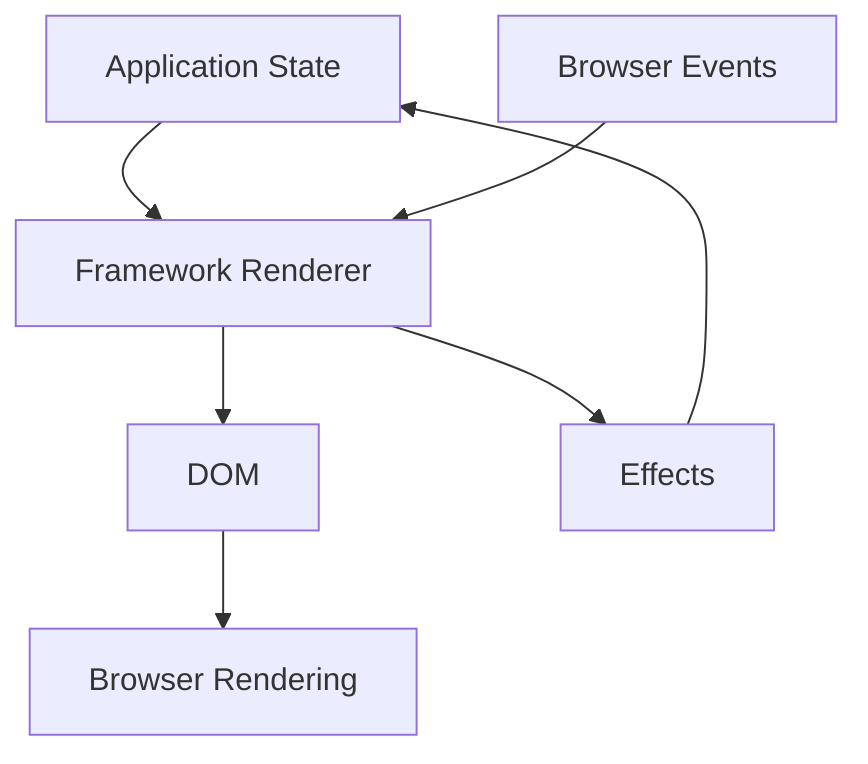

React, Vue, Svelte, Solid, Angular, dan lainnya berbeda dalam:

- model reactivity;
- rendering strategy;
- scheduling;
- compilation vs runtime work;
- state ownership patterns;
- server rendering support;
- ecosystem;
- testing ergonomics;
- performance characteristics;
- mental model.

Tetapi semua tetap berakhir pada browser platform. Jika platform dipahami, framework lebih mudah dievaluasi secara objektif.

## 19. Build Tooling as Semantic Transformer

Build tool bukan hanya packaging. Ia dapat mengubah semantic yang terlihat oleh developer.

Contoh:

- TypeScript menghapus type saat runtime.
- Babel/SWC dapat mengubah syntax modern menjadi syntax lama.
- Bundler dapat menggabungkan module, mengubah import, membuat chunk, dan menyisipkan runtime helper.
- Minifier dapat mengganti nama variable, menghapus dead code, dan mengubah expression.
- CSS tooling dapat mengubah class name, scope, prefix, atau extract CSS.
- Environment variable sering di-inline saat build, bukan dibaca runtime.

Konsekuensi:

- Bug bisa hanya muncul di production build.
- Code yang tampak dynamic bisa gagal di bundler karena tidak statically analyzable.
- `process.env` di frontend bukan environment runtime seperti di server; biasanya hasil transform build.
- Source map harus dikelola sebagai artifact sensitif.

## 20. Example: Platform Map untuk Case Management Dashboard

Kita akan memakai contoh domain case management sepanjang seri. Berikut platform map awalnya.

### 20.1 Fitur

- Case list dengan filter/sort/pagination.
- Case detail dengan status transition.
- Assignment user.
- Comment timeline.
- Attachment preview.
- Notification badge.
- Audit trail.

### 20.2 Platform Concerns

| Concern | Pertanyaan Engineering |
|---|---|
| Runtime | Apakah route ini SSR, CSR, atau hybrid? |
| Data | Apakah case list memakai server state cache? Bagaimana invalidation setelah assignment? |
| URL | Apakah filter/sort/pagination masuk URL? |
| Async | Apa yang terjadi jika user mengganti filter saat request lama masih berjalan? |
| Security | Apakah authorization hanya UI-level atau enforced server-side? Bagaimana data bocor dicegah? |
| Performance | Apakah table butuh virtualization? Apakah filter server-side? |
| Accessibility | Apakah status transition bisa dilakukan dengan keyboard? Apakah dialog punya focus trap? |
| Observability | Apakah failed transition punya correlation ID? |
| Testing | Apa E2E critical path? Apa yang bisa dites sebagai state machine? |
| Compatibility | Apakah fitur attachment preview punya fallback? |

### 20.3 Architecture Sketch

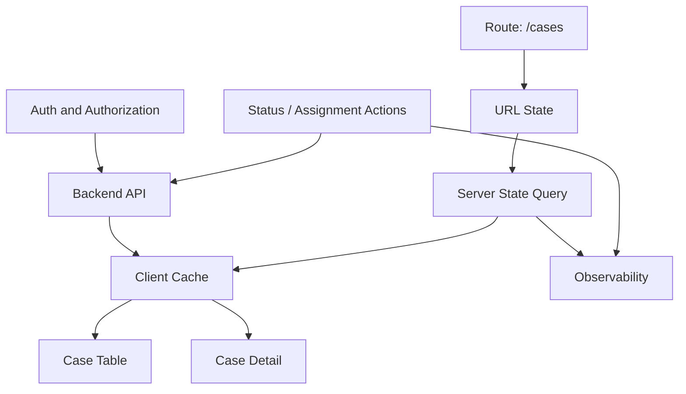

### 20.4 Invariants

```md
- URL adalah source of truth untuk filter/sort/pagination.
- Server adalah source of truth untuk authorization, status transition, dan audit trail.
- Client cache boleh stale, tetapi harus punya policy invalidation eksplisit.
- Optimistic update boleh hanya untuk action yang rollback behavior-nya jelas.
- UI tidak boleh menghilangkan failed action tanpa feedback.
- Attachment preview harus punya fallback download.
- Semua action mutating harus observable dengan correlation ID.
```

## 21. Decision Checklist: Saat Memakai Fitur Platform

Sebelum memakai API/browser feature baru, jawab:

```md
## Platform Feature Decision

### Feature
Apa API/fitur yang ingin dipakai?

### User Value
Masalah user apa yang diselesaikan?

### Runtime Target
Browser window, worker, service worker, SSR, edge, atau semua?

### Compatibility
Apakah sudah baseline? Browser target apa yang terdampak?

### Failure Mode
Apa yang terjadi jika API tidak tersedia atau permission ditolak?

### Performance
Apakah API ini memindahkan kerja dari main thread atau justru menambah beban?

### Security/Privacy
Apakah menyentuh permission, identity, storage, sensor, atau data sensitif?

### Fallback
Apa fallback UX yang acceptable?

### Testing
Bagaimana mensimulasikan supported dan unsupported environment?
```

## 22. Common Wrong Mental Models

### 22.1 “JavaScript Single-Threaded, Jadi Tidak Ada Race Condition”

JavaScript execution pada satu event loop memang menjalankan satu stack pada satu waktu. Tetapi race condition tetap bisa terjadi karena event, promise, network response, timer, worker message, dan user interaction datang dalam urutan yang tidak selalu kita kontrol.

Race condition frontend biasanya bukan dua thread menulis memory yang sama bersamaan. Ia sering berupa “hasil async lama menimpa state baru”.

### 22.2 “SSR Berarti Tidak Ada Client Complexity”

SSR memindahkan sebagian render awal ke server, tetapi client complexity tetap ada saat hydration dan interaction. Bahkan SSR menambah kelas bug baru:

- server/client environment mismatch;
- hydration mismatch;
- serialization boundary;
- cache boundary;
- streaming order;
- server action/data mutation boundary.

### 22.3 “Polyfill Menyelesaikan Compatibility”

Polyfill hanya bisa mengisi sebagian API atau syntax behavior. Ia tidak selalu bisa mengisi:

- browser rendering behavior;
- security model;
- permission model;
- performance characteristics;
- low-level platform capability;
- CSS/layout implementation gap.

### 22.4 “Bundler Akan Mengoptimalkan Semuanya”

Bundler membantu, tetapi tidak bisa memperbaiki arsitektur dependency yang buruk. Jika route critical mengimpor library berat melalui shared module, bundler mungkin tetap memasukkannya ke chunk awal.

### 22.5 “Framework Mengurus Accessibility”

Framework bisa membantu rendering, tetapi accessibility tetap membutuhkan semantic markup, focus management, keyboard interaction, ARIA yang benar, testing, dan UX decision yang eksplisit.

## 23. Practice: Membuat Personal Platform Map

Buat file `notes/platform-map.md` di repository latihan.

Isi minimal:

```md
# Personal JavaScript Frontend Platform Map

## Language
- ECMAScript features yang saya pakai.
- Fitur proposal yang tidak boleh dianggap stabil.

## Runtime Targets
- Browser target.
- SSR target.
- Worker target.
- Test environment.

## Web APIs
- API yang dipakai langsung.
- API yang dibungkus abstraction.
- API yang butuh feature detection.

## Build Pipeline
- TypeScript config.
- Bundler.
- Transpilation target.
- Polyfill policy.
- Source map policy.

## Compatibility
- Browser support matrix.
- Baseline policy.
- Fallback strategy.

## Performance
- Main-thread budget.
- Bundle budget.
- Network budget.

## Security
- Token storage policy.
- CSP policy.
- Third-party script policy.

## Observability
- Error reporting.
- Web Vitals.
- User action tracing.
```

Tujuan latihan ini adalah membuat batas runtime eksplisit. Banyak bug production muncul karena batas ini tidak pernah ditulis.

## 24. Practice: API Classification

Ambil 15 API browser yang sering kamu temui, lalu klasifikasikan.

Contoh:

| API | Standard Area | Runtime | Sync/Async | Failure Mode | Fallback |
|---|---|---|---|---|---|
| `fetch` | Fetch | Window/Worker | Async | Network error, CORS, abort | Retry/fallback UI |
| `localStorage` | Web Storage | Window | Sync | Quota, privacy mode, blocking | Memory/session fallback |
| `ResizeObserver` | Resize Observer | Window | Async callback | Loop limit, unsupported browser | Window resize fallback |
| `IntersectionObserver` | Intersection Observer | Window | Async callback | Unsupported browser | Scroll listener fallback |
| `requestAnimationFrame` | HTML/browser scheduling | Window | Async callback | Background throttling | Timer fallback with caution |

Kriteria sukses:

- kamu bisa membedakan API bahasa vs API browser;
- kamu bisa menyebut runtime target;
- kamu bisa menjelaskan failure mode;
- kamu bisa menentukan fallback.

## 25. Practice: Runtime-Safe Utility

Buat dua utility:

1. `isomorphicUrl.ts`: tidak boleh memakai DOM/window/process.
2. `browserMeasure.ts`: boleh memakai DOM, tetapi harus diberi annotation browser-only.

Contoh:

```ts
// isomorphicUrl.ts
export function buildQuery(params: Record<string, string | number | boolean | null | undefined>) {
  const search = new URLSearchParams();

  for (const [key, value] of Object.entries(params)) {
    if (value === null || value === undefined) continue;
    search.set(key, String(value));
  }

  return search.toString();
}
```

```ts
// browserMeasure.ts
// Runtime: browser window only.
export function getElementSize(element: Element) {
  const rect = element.getBoundingClientRect();

  return {
    width: rect.width,
    height: rect.height,
  };
}
```

Tambahkan test yang membuktikan `isomorphicUrl.ts` tidak membutuhkan DOM.

## 26. Checklist Sebelum Lanjut ke Part 003

Pastikan kamu bisa menjawab:

1. Apa bedanya ECMAScript, JavaScript engine, Web APIs, dan Web Platform?
2. Mengapa `fetch` bukan bagian inti ECMAScript?
3. Mengapa browser harus dipahami sebagai host environment?
4. Apa risiko memakai `window` pada kode yang dijalankan saat SSR?
5. Apa hubungan DOM, CSSOM, layout, paint, dan composite?
6. Mengapa compatibility bukan hanya urusan transpiler?
7. Mengapa framework harus dilihat sebagai adapter ke platform?
8. Apa runtime target dari module yang kamu tulis hari ini?

## 27. Ringkasan

JavaScript frontend modern adalah sistem berlapis. ECMAScript mendefinisikan bahasa, engine menjalankan kode, browser menyediakan host APIs, DOM merepresentasikan document, rendering pipeline mengubah state menjadi pixels, network stack mengatur resource, security model membatasi akses, dan build pipeline mengubah source menjadi artifact produksi.

Engineer yang kuat tidak mencampur semua lapisan menjadi satu istilah “JavaScript”. Ia tahu lapisan mana yang sedang bermasalah, sumber kebenaran mana yang perlu dibaca, dan trade-off apa yang sedang dibuat.

Part berikutnya akan masuk ke semantic JavaScript secara lebih presisi: execution context, lexical environment, binding, reference, completion record, object model, prototype, property descriptor, coercion, dan equality.

## 28. References

- ECMA International, ECMA-262 ECMAScript Language Specification: https://ecma-international.org/publications-and-standards/standards/ecma-262/
- TC39 Process: https://tc39.es/process-document/
- TC39 Proposals: https://github.com/tc39/proposals
- MDN JavaScript: https://developer.mozilla.org/en-US/docs/Web/JavaScript
- MDN JavaScript Reference: https://developer.mozilla.org/en-US/docs/Web/JavaScript/Reference
- MDN Web APIs: https://developer.mozilla.org/en-US/docs/Web/API
- MDN Baseline Compatibility: https://developer.mozilla.org/en-US/docs/Glossary/Baseline/Compatibility
- WHATWG HTML Living Standard: https://html.spec.whatwg.org/
- WHATWG DOM Standard: https://dom.spec.whatwg.org/
- WHATWG Fetch Standard: https://fetch.spec.whatwg.org/
