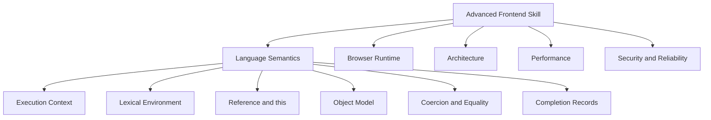
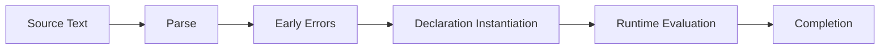
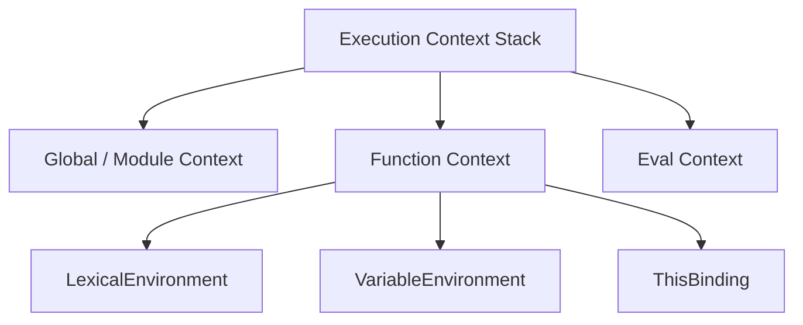
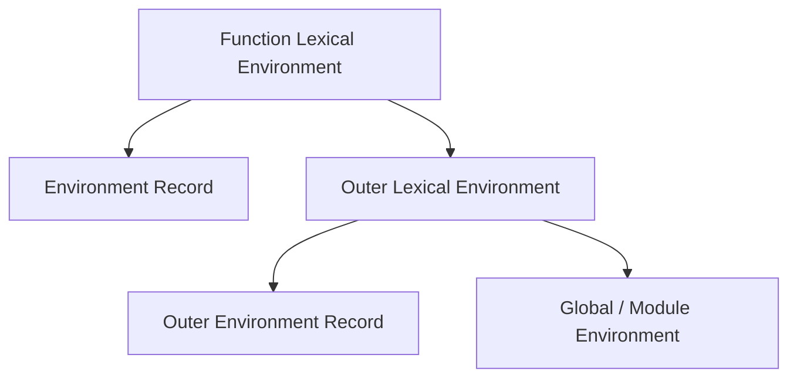
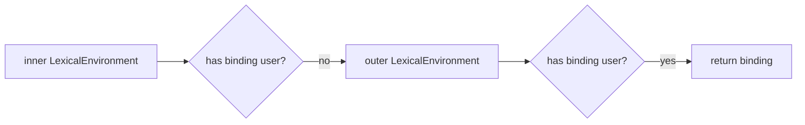
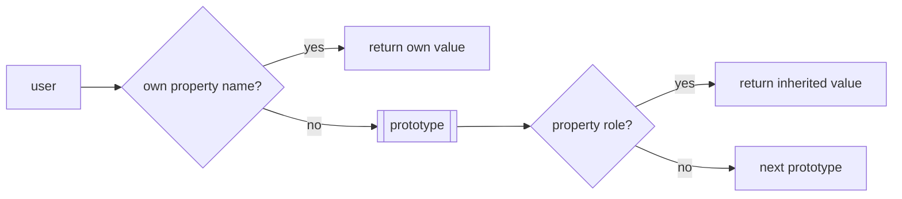
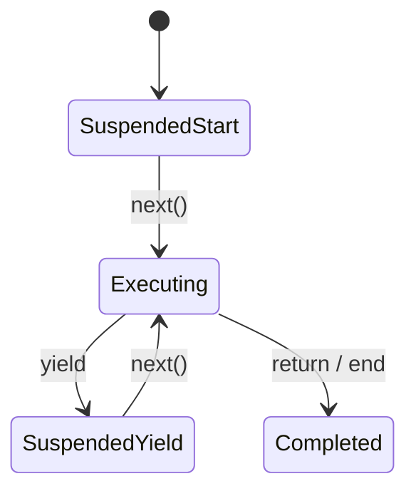
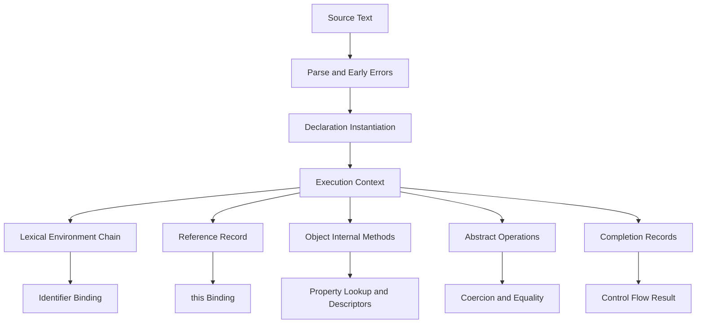

------
title: Learn Advanced JavaScript for Web / Frontend Engineering - Part 003
description: "Deep dive ke semantic JavaScript di balik syntax: execution context, lexical environment, binding, references, completion records, object model, coercion, equality, prototype, dan failure modes yang sering muncul di frontend production."
series: learn-javascript-frontend-advanced
seriesTitle: Learn Advanced JavaScript for Web / Frontend Engineering
order: 3
partTitle: JavaScript Semantics Beyond Syntax
tags:
- javascript
- frontend
- web
- ecmascript
- runtime
- semantics
- advanced
date: 2026-06-27
---

# JavaScript Semantics Beyond Syntax

Part ini membangun fondasi untuk membaca JavaScript bukan sebagai kumpulan "trick", tetapi sebagai bahasa dengan model eksekusi yang konsisten.

Targetnya bukan menghafal seluruh ECMA-262, tetapi punya kemampuan untuk menjawab pertanyaan seperti:

- mengapa `let`, `const`, `var`, function declaration, dan import terasa "hoisted" dengan perilaku berbeda;
- mengapa `this` bisa berubah ketika method dilepas dari object;
- mengapa closure menyimpan binding, bukan sekadar "copy value";
- mengapa `obj.x` dan `x` secara semantic bukan operasi yang sama;
- mengapa optional chaining, destructuring, spread, dan default value punya edge case;
- mengapa coercion dan equality bisa menghasilkan bug yang terlihat tidak masuk akal;
- bagaimana prototype lookup, property descriptor, getter/setter, dan internal method memengaruhi performa serta correctness;
- bagaimana JavaScript menangani abrupt completion seperti `throw`, `return`, `break`, dan `continue`.

Mental model ini sangat penting sebelum masuk ke event loop, DOM, rendering, state architecture, framework internals, performance profiling, testing, dan security.

---

## 1. Posisi Part Ini Dalam Framework Kaufman

Josh Kaufman menekankan bahwa skill perlu dipecah menjadi sub-skill kecil yang bisa dilatih dengan feedback cepat. Untuk advanced JavaScript, sub-skill pertama bukan framework, tetapi semantic literacy.



Dalam praktik produksi, engineer yang kuat tidak sekadar tahu "gunakan `===`" atau "hindari `var`". Engineer kuat bisa menjelaskan **mengapa** aturan itu ada, kapan pengecualian masuk akal, dan bagaimana menemukan root cause ketika bug muncul di area yang tidak obvious.

---

## 2. Kontrak Belajar Part Ini

Setelah part ini, Anda harus bisa:

1. membaca kode JavaScript dengan membedakan syntax-level, semantic-level, dan runtime-host-level;
2. menjelaskan lifecycle binding dari parse sampai execution;
3. memprediksi hasil kode yang melibatkan scope, closure, `this`, prototype, property descriptor, coercion, dan exception flow;
4. menghindari semantic bugs yang umum di frontend production;
5. menulis debugging note yang menjelaskan penyebab bug secara mekanistik, bukan spekulatif.

Kita tidak akan mengulang basic seperti deklarasi variable, function, array method dasar, atau class syntax. Kita akan masuk ke model yang membuat fitur itu bekerja.

---

## 3. JavaScript Sebagai Spec Machine

JavaScript yang dijalankan browser adalah implementasi dari spesifikasi bahasa ECMAScript plus kemampuan host environment seperti DOM, Fetch, timers, storage, events, rendering, dan networking.

Batas besar yang harus selalu dipisahkan:

| Layer | Contoh | Diatur oleh |
|---|---|---|
| ECMAScript language | `let`, `const`, object, promise, module, class, iterator, async function | ECMA-262 |
| Web platform APIs | DOM, Fetch, URL, Storage, History, Web Worker | WHATWG/W3C/standar terkait |
| Browser engine implementation | V8, SpiderMonkey, JavaScriptCore, Blink, Gecko, WebKit | Implementasi vendor |
| Framework/runtime abstraction | React, Vue, Svelte, Next.js, Remix | Library/framework |
| Application policy | state, routing, validation, cache, auth, permissions | Tim produk/engineering |

Kesalahan berpikir yang sering terjadi: mencampur semua layer menjadi satu konsep bernama "JavaScript". Akibatnya debugging menjadi kabur.

Contoh:

```js
setTimeout(() => console.log("timer"), 0);
Promise.resolve().then(() => console.log("promise"));
console.log("sync");
```

Urutan output bukan hanya masalah bahasa ECMAScript. Promise job memang bagian ECMAScript, tetapi scheduling task, timer, dan event loop browser adalah urusan host environment. Detailnya akan dibahas di Part 004.

---

## 4. Syntax, Static Semantics, Runtime Semantics

JavaScript code melewati beberapa lapisan:



### 4.1 Source Text

Source text adalah teks program. Pada tahap ini, semuanya masih karakter.

```js
const answer = 40 + 2;
```

### 4.2 Parse

Parser membangun struktur syntax. Pada titik ini, engine memahami bahwa ada `const` declaration, identifier `answer`, binary expression, dan literal number.

### 4.3 Early Errors

Sebagian error bisa ditemukan sebelum eksekusi.

Contoh:

```js
"use strict";

let x;
let x; // SyntaxError
```

Ini bukan runtime branch error. Program bahkan tidak boleh dieksekusi.

### 4.4 Declaration Instantiation

Sebelum statement dieksekusi, JavaScript menyiapkan binding untuk deklarasi tertentu. Inilah sumber kata "hoisting", tetapi "hoisting" adalah istilah informal. Model yang lebih presisi adalah **declaration instantiation**.

### 4.5 Runtime Evaluation

Statement dan expression dievaluasi sesuai urutan control flow.

### 4.6 Completion

Setiap evaluasi menghasilkan completion: normal, return, throw, break, continue, dan bentuk abrupt lain. Ini penting untuk memahami `try/finally`, generator, async, dan control flow kompleks.

---

## 5. Execution Context

Execution context adalah record internal yang mewakili keadaan eksekusi JavaScript saat ini.

Secara mental, bayangkan setiap eksekusi function/script/module punya frame dengan:

- lexical environment;
- variable environment;
- private environment;
- realm;
- function info;
- script/module info;
- state internal lain.



### 5.1 Call Stack Bukan Execution Context Saja

Dalam percakapan sehari-hari, orang sering bilang "call stack". Itu cukup untuk debugging awal, tetapi kurang presisi.

Call stack adalah representasi eksekusi bertumpuk. Execution context adalah unit semantic yang berisi environment dan state evaluasi.

Contoh:

```js
function a() {
  b();
}

function b() {
  c();
}

function c() {
  throw new Error("boom");
}

a();
```

Saat error terjadi, stack trace menunjukkan rantai call. Tetapi penyebab binding, `this`, lexical lookup, dan closure ditentukan oleh execution context dan environment di dalamnya.

---

## 6. Realm, Global Object, dan Cross-Realm Problems

Realm adalah lingkungan eksekusi dengan global object dan intrinsic objects sendiri.

Contoh realm di browser:

- main window;
- iframe;
- worker;
- worklet.

Dua object dari realm berbeda bisa terlihat sama tetapi tidak berbagi intrinsic constructor yang sama.

```js
const iframe = document.createElement("iframe");
document.body.append(iframe);

const arr = new iframe.contentWindow.Array();

console.log(Array.isArray(arr)); // true
console.log(arr instanceof Array); // false
```

Mengapa?

`instanceof` memeriksa prototype chain terhadap `Array.prototype` dari realm saat ini. Array dari iframe punya `Array.prototype` milik realm iframe, bukan realm parent.

### Engineering Implication

Untuk validasi lintas realm:

```js
Array.isArray(value);
Object.prototype.toString.call(value);
```

lebih aman daripada:

```js
value instanceof Array;
```

Kasus nyata:

- library embedded dalam iframe;
- microfrontend;
- browser extension;
- design system preview sandbox;
- test runner yang membuat DOM realm;
- analytics SDK yang mengoper object antar boundary.

---

## 7. Lexical Environment dan Environment Record

Lexical environment adalah struktur internal yang menghubungkan identifier dengan binding.

Setiap lexical environment punya:

1. environment record;
2. outer environment reference.



Contoh:

```js
const globalName = "app";

function makeFormatter(prefix) {
  const separator = ":";

  return function format(value) {
    return `${globalName}${separator}${prefix}${value}`;
  };
}

const formatUser = makeFormatter("user-");
console.log(formatUser(42));
```

Function `format` punya akses ke:

- `value` dari parameter environment miliknya;
- `prefix` dan `separator` dari outer function;
- `globalName` dari outer global/module environment.

Closure bukan "function membawa semua variable". Closure adalah function yang mempertahankan akses ke lexical environment yang masih diperlukan.

---

## 8. Binding Bukan Value

Ini salah satu mental model paling penting.

Identifier tidak langsung berarti value. Identifier di-resolve menjadi binding. Binding kemudian menghasilkan value.

```js
let count = 0;

function inc() {
  count += 1;
}

inc();
console.log(count); // 1
```

`inc` tidak membawa copy dari `count = 0`. Ia membawa akses ke binding `count`.

Karena itu:

```js
let currentUser = { id: 1 };

function getUserId() {
  return currentUser.id;
}

currentUser = { id: 2 };

console.log(getUserId()); // 2
```

Closure membaca binding terbaru, bukan snapshot value.

### 8.1 Snapshot Harus Dibuat Eksplisit

```js
let currentUser = { id: 1 };

function makeReader(userSnapshot) {
  return function getUserId() {
    return userSnapshot.id;
  };
}

const readInitialUserId = makeReader(currentUser);

currentUser = { id: 2 };

console.log(readInitialUserId()); // 1
```

Dalam frontend, ini muncul sebagai:

- stale closure bug;
- outdated event handler;
- async callback membaca state lama;
- debounced function memegang reference lama;
- subscription callback tidak sinkron dengan state terbaru.

Framework seperti React memperlihatkan problem ini secara intens karena render membuat closure baru.

---

## 9. Global Environment: Script vs Module

Script dan module berbeda secara semantic.

### 9.1 Script

Dalam classic script, top-level `var` bisa membuat property di global object.

```html
<script>
  var legacyName = "x";
  console.log(window.legacyName); // "x"
</script>
```

Top-level `let` dan `const` tidak menjadi property global object.

```html
<script>
  let modernName = "x";
  console.log(window.modernName); // undefined
</script>
```

### 9.2 Module

Dalam ES module:

- top-level scope adalah module scope;
- code berjalan dalam strict mode;
- top-level `this` adalah `undefined`;
- import/export dianalisis secara statis;
- binding import bersifat live binding.

```js
// counter.js
export let count = 0;

export function inc() {
  count += 1;
}
```

```js
// app.js
import { count, inc } from "./counter.js";

console.log(count); // 0
inc();
console.log(count); // 1
```

Import bukan copy value. Ia adalah live binding.

### Engineering Implication

Module sangat cocok untuk architecture boundary karena:

- dependency graph bisa dianalisis;
- tree shaking lebih mungkin;
- circular dependency terlihat pada graph;
- top-level pollution berkurang.

Tetapi live binding dan circular dependency tetap bisa menjadi sumber bug.

---

## 10. Declaration Instantiation dan "Hoisting"

"Hoisting" sering diajarkan seolah-olah deklarasi dipindahkan ke atas file. Itu metafora yang berguna tapi tidak akurat.

Lebih presisi:

- engine membuat binding sebelum eksekusi statement tertentu;
- jenis binding menentukan apakah bisa diakses sebelum initialization;
- function declaration punya perilaku khusus;
- script, module, block, function, dan eval punya instantiation rules berbeda.

### 10.1 `var`

```js
console.log(x); // undefined
var x = 10;
console.log(x); // 10
```

`var x` membuat binding yang initialized ke `undefined` saat instantiation. Assignment `x = 10` terjadi saat runtime evaluation.

### 10.2 `let` dan `const`

```js
console.log(x); // ReferenceError
let x = 10;
```

Binding `x` sudah ada, tetapi belum initialized. Area sebelum initialization sering disebut **Temporal Dead Zone**.

### 10.3 Function Declaration

```js
console.log(sum(1, 2)); // 3

function sum(a, b) {
  return a + b;
}
```

Function declaration biasanya di-initialize saat declaration instantiation, sehingga callable sebelum posisinya dalam source text.

### 10.4 Function Expression

```js
console.log(sum(1, 2)); // TypeError: sum is not a function

var sum = function (a, b) {
  return a + b;
};
```

`sum` adalah `var`, jadi binding initialized ke `undefined`. Function object baru dibuat saat assignment dievaluasi.

### 10.5 Class Declaration

```js
new User(); // ReferenceError

class User {}
```

Class declaration memiliki TDZ seperti `let`/`const`.

---

## 11. Temporal Dead Zone Sebagai Safety Mechanism

TDZ bukan bug bahasa. TDZ mencegah akses binding sebelum initialized.

Contoh yang sering membingungkan:

```js
const user = "outer";

{
  console.log(user); // ReferenceError
  const user = "inner";
}
```

Mengapa tidak membaca outer `user`?

Karena block memiliki binding `user` sendiri. Selama lookup, binding inner ditemukan lebih dulu, tetapi belum initialized. Maka error.

### Engineering Implication

TDZ membantu menemukan bug refactoring:

```js
const config = loadConfig();

function init() {
  console.log(config);
}
```

Jika seseorang refactor:

```js
const config = loadConfig();

function init() {
  console.log(config);

  const config = readLocalOverride();
}
```

Kode ini gagal cepat, bukan diam-diam membaca global/outer config yang salah.

---

## 12. Identifier Resolution

Saat JavaScript melihat identifier seperti `user`, ia melakukan lookup melalui lexical environment chain.

```js
const user = "global";

function outer() {
  const user = "outer";

  function inner() {
    console.log(user);
  }

  inner();
}

outer(); // "outer"
```

Lookup:



Lookup bersifat lexical, bukan dynamic. Artinya ditentukan oleh posisi code saat ditulis, bukan siapa yang memanggil.

```js
const label = "global";

function printLabel() {
  console.log(label);
}

function run() {
  const label = "run";
  printLabel();
}

run(); // "global"
```

`printLabel` dibuat di global lexical environment, maka ia mencari `label` di sana.

---

## 13. Reference Record: Mengapa `obj.method()` Berbeda Dari `const f = obj.method; f()`

Dalam JavaScript spec, banyak expression menghasilkan sesuatu yang secara mental bisa dipahami sebagai **Reference**: kombinasi base, referenced name, strict flag, dan this-related info.

Contoh:

```js
const user = {
  name: "Ari",
  sayName() {
    console.log(this.name);
  },
};

user.sayName(); // "Ari"

const say = user.sayName;
say(); // undefined atau TypeError tergantung strict/body
```

Mengapa?

`user.sayName()` mempertahankan base reference `user`, sehingga `this` menjadi `user`.

`const say = user.sayName` mengambil value function dari property. Saat `say()` dipanggil sebagai plain function, base object sudah hilang.

### 13.1 Variasi Yang Sering Muncul

```js
const user = {
  name: "Ari",
  sayName() {
    return this.name;
  },
};

(user.sayName)();        // "Ari"
(0, user.sayName)();     // this hilang
user.sayName?.();        // this tetap user
(user.sayName)?.();      // this tetap user
```

Comma operator memaksa expression menghasilkan value, bukan reference dengan base yang sama.

### 13.2 Production Failure Mode

```js
button.addEventListener("click", viewModel.handleClick);
```

Jika `handleClick` butuh `this`, ia akan rusak karena browser memanggil listener dengan `this` tertentu atau undefined tergantung model dan strictness.

Solusi lebih eksplisit:

```js
button.addEventListener("click", (event) => viewModel.handleClick(event));
```

atau:

```js
button.addEventListener("click", viewModel.handleClick.bind(viewModel));
```

Namun `bind` membuat function baru. Jika Anda perlu remove listener, simpan reference.

```js
class Controller {
  constructor(button) {
    this.button = button;
    this.onClick = this.onClick.bind(this);

    button.addEventListener("click", this.onClick);
  }

  destroy() {
    this.button.removeEventListener("click", this.onClick);
  }

  onClick(event) {
    // stable this
  }
}
```

---

## 14. `this` Binding Rules

`this` bukan lexical variable biasa untuk normal function. Nilainya bergantung pada cara function dipanggil.

Prioritas mental model:

1. `new fn()` → `this` adalah object baru;
2. `fn.call(x)` / `fn.apply(x)` / `fn.bind(x)` → explicit this;
3. `obj.fn()` → implicit receiver object;
4. `fn()` → default binding;
5. arrow function → lexical this dari outer environment.

### 14.1 Default Binding

```js
function showThis() {
  console.log(this);
}

showThis();
```

Dalam sloppy script, `this` bisa menjadi global object. Dalam strict mode/module, `this` adalah `undefined`.

### 14.2 Implicit Binding

```js
const user = {
  name: "Nara",
  show() {
    console.log(this.name);
  },
};

user.show(); // "Nara"
```

### 14.3 Explicit Binding

```js
function show() {
  console.log(this.name);
}

show.call({ name: "Nara" }); // "Nara"
```

### 14.4 Constructor Binding

```js
function User(name) {
  this.name = name;
}

const user = new User("Nara");
```

`new` membuat object baru, menghubungkan prototype, menjalankan function dengan `this` object baru, lalu mengembalikan object tersebut kecuali constructor mengembalikan object lain secara eksplisit.

### 14.5 Arrow Function

```js
const user = {
  name: "Nara",
  showLater() {
    setTimeout(() => {
      console.log(this.name);
    }, 0);
  },
};
```

Arrow tidak punya `this` sendiri. Ia menangkap `this` lexical dari `showLater`.

### 14.6 Arrow Bukan Method Default

```js
const user = {
  name: "Nara",
  show: () => {
    console.log(this.name);
  },
};

user.show(); // bukan "Nara"
```

Ini salah satu bug style guide yang umum.

---

## 15. Completion Record

Setiap evaluation menghasilkan completion.

Secara sederhana:

| Completion | Contoh |
|---|---|
| normal | expression selesai biasa |
| return | `return value` |
| throw | `throw error` |
| break | `break` |
| continue | `continue` |

Mengapa ini penting?

Karena `finally` bisa mengganti completion sebelumnya.

```js
function example() {
  try {
    return "try";
  } finally {
    return "finally";
  }
}

console.log(example()); // "finally"
```

`return` di `finally` menggantikan `return` di `try`.

Contoh lain:

```js
function example() {
  try {
    throw new Error("boom");
  } finally {
    return "safe?";
  }
}

console.log(example()); // "safe?"
```

Ini berbahaya karena `finally` menelan error.

### Production Rule

Jangan `return`, `throw`, `break`, atau `continue` dari `finally` kecuali Anda sangat yakin. Gunakan `finally` untuk cleanup.

```js
async function save(data) {
  setSaving(true);

  try {
    return await api.save(data);
  } finally {
    setSaving(false);
  }
}
```

---

## 16. Object Model: Object Bukan Hash Map Biasa

JavaScript object adalah kumpulan property dengan descriptor dan prototype.

Property descriptor bisa berupa:

1. data descriptor;
2. accessor descriptor.

### 16.1 Data Descriptor

```js
const user = {};

Object.defineProperty(user, "id", {
  value: 123,
  writable: false,
  enumerable: true,
  configurable: false,
});

user.id = 456;

console.log(user.id); // 123 dalam sloppy; TypeError dalam strict
```

Descriptor:

| Field | Arti |
|---|---|
| `value` | nilai property |
| `writable` | apakah value bisa diubah |
| `enumerable` | apakah muncul di enumerasi |
| `configurable` | apakah descriptor bisa diubah / property bisa dihapus |

### 16.2 Accessor Descriptor

```js
const user = {
  firstName: "Ari",
  lastName: "Wijaya",

  get fullName() {
    return `${this.firstName} ${this.lastName}`;
  },

  set fullName(value) {
    const [firstName, lastName] = value.split(" ");
    this.firstName = firstName;
    this.lastName = lastName;
  },
};

console.log(user.fullName);
user.fullName = "Nara Putri";
```

Accessor property tidak menyimpan value langsung. Ia menyimpan getter dan setter.

### 16.3 Object Spread Tidak Sama Dengan Deep Clone

```js
const original = {
  nested: { count: 1 },
};

const copy = { ...original };

copy.nested.count = 2;

console.log(original.nested.count); // 2
```

Spread hanya shallow copy enumerable own properties.

### 16.4 Spread Mengakses Getter

```js
const source = {
  get expensive() {
    console.log("computed");
    return 42;
  },
};

const copy = { ...source };
// logs "computed"
```

Object spread membaca property value. Getter dieksekusi.

---

## 17. Own Property, Inherited Property, dan Prototype Lookup

Property access mencari property di object sendiri dulu, lalu prototype chain.

```js
const base = {
  role: "guest",
};

const user = Object.create(base);
user.name = "Ari";

console.log(user.name); // own
console.log(user.role); // inherited
```

Lookup:



### 17.1 Shadowing

```js
const base = { role: "guest" };
const user = Object.create(base);

user.role = "admin";

console.log(user.role); // "admin"
console.log(base.role); // "guest"
```

Assignment biasanya membuat/menulis own property, kecuali ada setter atau descriptor yang mengubah perilaku.

### 17.2 Prototype Pollution Risk

Jika input user bisa menulis ke `__proto__`, `constructor`, atau `prototype`, object global behavior bisa tercemar.

```js
const payload = JSON.parse('{"__proto__": {"isAdmin": true}}');
const target = {};

Object.assign(target, payload);
```

Modern engine dan library banyak mitigasi, tetapi pola merge yang naïf tetap berisiko.

Safer patterns:

```js
const map = Object.create(null);
```

atau gunakan `Map` untuk key-value store yang key-nya berasal dari user.

---

## 18. Class Hanya Syntax Di Atas Prototype, Tetapi Bukan Sekadar Gula Tipis

Class menggunakan prototype-based inheritance, tetapi punya semantic khusus:

- class body strict mode;
- class declaration punya TDZ;
- methods non-enumerable;
- private fields memiliki brand checking;
- `super` punya aturan internal;
- constructor derived class harus memanggil `super()` sebelum memakai `this`.

```js
class User {
  #id;

  constructor(id) {
    this.#id = id;
  }

  getId() {
    return this.#id;
  }
}

const user = new User(1);
console.log(user.getId());
```

Private field bukan property bernama `"#id"`. Ia punya mekanisme internal. Karena itu:

```js
console.log(user["#id"]); // undefined
```

### 18.1 Method Extraction Tetap Bermasalah

```js
class User {
  constructor(name) {
    this.name = name;
  }

  show() {
    return this.name;
  }
}

const user = new User("Ari");
const show = user.show;

show(); // TypeError dalam strict mode
```

Class method tidak auto-bind.

---

## 19. Internal Slots dan Internal Methods

Spec sering menggunakan istilah seperti:

- `[[Prototype]]`;
- `[[Call]]`;
- `[[Construct]]`;
- `[[Get]]`;
- `[[Set]]`;
- `[[OwnPropertyKeys]]`;
- `[[PromiseState]]`;
- `[[ViewedArrayBuffer]]`.

Ini bukan property biasa yang bisa diakses dengan bracket notation.

```js
function fn() {}

console.log(fn["[[Call]]"]); // undefined
```

Internal slots/methods menjelaskan perilaku object pada level spec.

### Engineering Value

Anda tidak perlu menghafal semua internal slots, tetapi perlu tahu bahwa object JavaScript tidak semuanya sama.

Contoh callable vs constructable:

```js
function Normal() {}
const Arrow = () => {};

new Normal(); // ok
new Arrow();  // TypeError
```

Arrow function punya `[[Call]]`, tetapi tidak punya `[[Construct]]`.

---

## 20. Property Enumeration Order

Object property order punya aturan, bukan random.

Secara mental:

1. integer index keys dalam urutan ascending;
2. string keys lain dalam insertion order;
3. symbol keys dalam insertion order.

```js
const obj = {
  b: 1,
  "2": 2,
  a: 3,
  "1": 4,
};

console.log(Object.keys(obj)); // ["1", "2", "b", "a"]
```

### Engineering Implication

Jangan bergantung pada object sebagai ordered collection untuk domain semantics yang sensitif. Gunakan array jika urutan adalah data utama.

---

## 21. `Map` vs Object

Object cocok untuk record dengan shape relatif stabil.

`Map` cocok untuk key-value store dinamis:

- key bisa object;
- tidak punya prototype pollution problem yang sama;
- size tersedia langsung;
- iterasi sesuai insertion order;
- lebih jelas secara intent.

```js
const cache = new Map();

const user = { id: 1 };
cache.set(user, { permissions: ["read"] });

console.log(cache.get(user));
```

Namun `Map` tidak otomatis serialize ke JSON.

---

## 22. Shape, Hidden Class, dan Performance

Engine modern mengoptimalkan object dengan asumsi shape stabil.

Contoh lebih baik:

```js
function makeUser(id, name, role) {
  return {
    id,
    name,
    role,
  };
}
```

Kurang baik untuk hot path:

```js
function makeUser(id, name, role) {
  const user = {};
  user.id = id;

  if (role) {
    user.role = role;
  }

  user.name = name;

  return user;
}
```

Karena object shape bisa berbeda-beda. Engine bisa tetap mengoptimalkan, tetapi polymorphic shape di hot path dapat menurunkan performa.

### Rule Praktis

Jangan premature optimize object shape untuk semua code. Tetapi untuk hot code seperti data grid, rendering list besar, canvas interaction, parser, formatter, atau validation engine, shape stability relevan.

---

## 23. Primitive, Object Wrapper, dan Boxing

Primitive:

- `undefined`;
- `null`;
- boolean;
- number;
- bigint;
- string;
- symbol.

Object:

- plain object;
- array;
- function;
- date;
- regexp;
- map;
- set;
- typed array;
- wrapper object seperti `new String("x")`.

String primitive bisa punya method karena temporary boxing.

```js
"hello".toUpperCase(); // "HELLO"
```

Tetapi:

```js
const x = new String("hello");

console.log(typeof "hello"); // "string"
console.log(typeof x);       // "object"
console.log(x === "hello");  // false
```

Avoid wrapper constructors untuk primitive.

---

## 24. Coercion: Jangan Hafal Trik, Pahami Abstract Operation

Coercion adalah konversi type otomatis atau eksplisit.

Abstract operations penting:

- `ToPrimitive`;
- `ToBoolean`;
- `ToNumber`;
- `ToString`;
- `ToObject`;
- `ToPropertyKey`;
- `ToBigInt`.

### 24.1 ToBoolean

Falsy values:

```js
false
0
-0
0n
""
null
undefined
NaN
```

Semua object truthy, termasuk:

```js
Boolean([]);       // true
Boolean({});       // true
Boolean(new Boolean(false)); // true
```

### 24.2 ToPrimitive

Object dikonversi ke primitive melalui:

- `Symbol.toPrimitive`;
- `valueOf`;
- `toString`.

```js
const value = {
  [Symbol.toPrimitive](hint) {
    return hint === "number" ? 10 : "ten";
  },
};

console.log(+value);      // 10
console.log(`${value}`);  // "ten"
```

### 24.3 Addition Operator

`+` bisa numeric addition atau string concatenation.

```js
console.log(1 + 2);       // 3
console.log("1" + 2);     // "12"
console.log(1 + "2");     // "12"
```

Jika salah satu primitive setelah conversion adalah string, hasilnya concatenation.

### 24.4 BigInt Mixing

```js
1n + 2n; // 3n
1n + 2;  // TypeError
```

BigInt dan Number tidak boleh dicampur dalam arithmetic tanpa konversi eksplisit.

---

## 25. Equality

### 25.1 Strict Equality `===`

Strict equality tidak melakukan coercion lintas type, tetapi punya edge case:

```js
NaN === NaN; // false
0 === -0;    // true
```

### 25.2 Object.is

```js
Object.is(NaN, NaN); // true
Object.is(0, -0);    // false
```

React dependency comparison menggunakan semantics yang mirip `Object.is`. Ini penting untuk memahami effect dependency dan memoization.

### 25.3 Loose Equality `==`

Loose equality melakukan coercion dengan aturan kompleks.

```js
0 == false;      // true
"" == false;     // true
null == undefined; // true
[] == false;     // true
```

Rule produksi yang sehat:

- gunakan `===` sebagai default;
- gunakan `value == null` hanya jika sengaja ingin menangkap `null` atau `undefined`;
- jangan gunakan `==` untuk input user, permission, auth, money, quantity, status, atau branching domain penting.

```js
if (value == null) {
  // null or undefined
}
```

Ini salah satu sedikit penggunaan loose equality yang sering dianggap acceptable jika disepakati di codebase.

---

## 26. Destructuring Semantics

Destructuring terlihat sederhana, tetapi punya evaluation order dan default rule.

### 26.1 Default Hanya Untuk `undefined`

```js
const { count = 0 } = { count: null };

console.log(count); // null
```

Default tidak aktif untuk `null`.

### 26.2 Nested Destructuring Bisa Throw

```js
const input = {};

const { user: { id } } = input; // TypeError
```

Lebih aman:

```js
const { user } = input;
const id = user?.id;
```

atau:

```js
const { user: { id } = {} } = input;
```

### 26.3 Destructuring Mengeksekusi Getter

```js
const source = {
  get value() {
    console.log("read");
    return 42;
  },
};

const { value } = source; // logs "read"
```

---

## 27. Optional Chaining

Optional chaining short-circuit hanya pada chain yang terkait.

```js
const user = null;

console.log(user?.profile?.name); // undefined
```

Tetapi grouping bisa memutus chain:

```js
const user = null;

console.log((user?.profile).name); // TypeError
```

### 27.1 Jangan Menelan Domain Error Sembarangan

```js
const price = order?.items?.[0]?.price;
```

Ini aman secara runtime, tetapi belum tentu benar secara domain. Jika order wajib punya item, optional chaining bisa menyembunyikan data corruption.

Gunakan optional chaining untuk data yang benar-benar optional, bukan untuk menghindari berpikir tentang invariant.

---

## 28. Nullish Coalescing

`??` hanya fallback untuk `null` atau `undefined`.

```js
const count = 0;

console.log(count || 10); // 10
console.log(count ?? 10); // 0
```

Dalam UI, `??` lebih tepat untuk nilai yang falsy tetapi valid:

- `0`;
- `""`;
- `false`.

```js
function Quantity({ value }) {
  return value ?? "Not set";
}
```

---

## 29. Spread, Rest, dan Copy Semantics

### 29.1 Array Spread

```js
const a = [{ count: 1 }];
const b = [...a];

b[0].count = 2;

console.log(a[0].count); // 2
```

Shallow copy.

### 29.2 Rest Object

```js
const user = {
  id: 1,
  name: "Ari",
  role: "admin",
};

const { id, ...profile } = user;
```

Rest object mengumpulkan enumerable own properties yang belum diambil.

### 29.3 Spread Property Order

```js
const result = {
  id: 1,
  ...{ id: 2, name: "Ari" },
};

console.log(result.id); // 2
```

Property yang datang belakangan overwrite sebelumnya.

---

## 30. Mutation, Identity, dan Observability

JavaScript object punya identity.

```js
const a = { count: 1 };
const b = a;

b.count = 2;

console.log(a.count); // 2
```

Dalam frontend, identity memengaruhi:

- re-render;
- memoization;
- state comparison;
- cache key;
- dependency array;
- optimistic updates;
- undo/redo;
- time-travel debugging.

### 30.1 Mutation Tidak Selalu Buruk

Mutation lokal yang terkapsulasi bisa baik:

```js
function normalizeUsers(users) {
  const byId = new Map();

  for (const user of users) {
    byId.set(user.id, user);
  }

  return byId;
}
```

Mutation state shared yang tidak dikontrol berbahaya:

```js
appState.currentUser.permissions.push("admin");
```

Rule-nya bukan "never mutate". Rule-nya: **mutation harus punya ownership boundary yang jelas**.

---

## 31. Iterator dan Iterable

Object iterable punya method `[Symbol.iterator]`.

```js
const values = [1, 2, 3];

for (const value of values) {
  console.log(value);
}
```

Custom iterable:

```js
const range = {
  start: 1,
  end: 3,

  [Symbol.iterator]() {
    let current = this.start;
    const end = this.end;

    return {
      next() {
        if (current <= end) {
          return { value: current++, done: false };
        }

        return { value: undefined, done: true };
      },
    };
  },
};

console.log([...range]); // [1, 2, 3]
```

### 31.1 Iterable vs Array-Like

Array-like:

```js
const arrayLike = {
  0: "a",
  1: "b",
  length: 2,
};
```

Iterable:

```js
const iterable = new Set(["a", "b"]);
```

Tidak semua array-like iterable, dan tidak semua iterable punya index/length.

---

## 32. Generator Sebagai State Machine

Generator function menghasilkan iterator yang bisa pause/resume.

```js
function* ids() {
  let id = 1;

  while (true) {
    yield id++;
  }
}

const nextId = ids();

console.log(nextId.next().value); // 1
console.log(nextId.next().value); // 2
```

Mental model:



Generator berguna untuk:

- lazy sequence;
- parser;
- test data generation;
- workflow stepping;
- state machine modeling.

Namun untuk UI application biasa, generator sering kalah ergonomis dibanding async function, observable, atau explicit state machine.

---

## 33. Async Function Semantic Preview

Async function selalu mengembalikan Promise.

```js
async function getValue() {
  return 42;
}

console.log(getValue()); // Promise
```

`return value` di async function menjadi fulfilled promise.

```js
async function fail() {
  throw new Error("boom");
}

fail().catch(console.error);
```

`throw` menjadi rejected promise.

Detail scheduling Promise akan dibahas di Part 004.

---

## 34. Module Live Binding dan Circular Dependency

Circular dependency bukan selalu salah, tetapi perlu dipahami.

```js
// a.js
import { b } from "./b.js";

export const a = "a";
console.log("from a", b);
```

```js
// b.js
import { a } from "./a.js";

export const b = "b";
console.log("from b", a);
```

Masalah circular dependency sering muncul ketika:

- module melakukan side effect saat import;
- initialization order penting;
- object singleton saling bergantung;
- barrel file menyembunyikan arah dependency;
- dependency injection tidak jelas.

### Rule Architecture

Module sebaiknya mengekspor capability, bukan langsung mengeksekusi proses besar saat import.

Kurang baik:

```js
// analytics.js
import { userStore } from "./userStore.js";

analytics.init(userStore.currentUser);
```

Lebih baik:

```js
// analytics.js
export function createAnalytics({ userProvider, transport }) {
  return {
    track(event) {
      transport.send({
        userId: userProvider.getCurrentUserId(),
        event,
      });
    },
  };
}
```

---

## 35. Error Semantics

Throwing bukan hanya untuk `Error`, tetapi sebaiknya gunakan `Error` atau subtype-nya.

```js
throw "boom"; // legal, buruk untuk debugging
```

Lebih baik:

```js
throw new Error("Failed to parse response");
```

Custom error:

```js
class ValidationError extends Error {
  constructor(message, issues) {
    super(message);
    this.name = "ValidationError";
    this.issues = issues;
  }
}
```

### 35.1 Cause

```js
try {
  await fetchUser();
} catch (error) {
  throw new Error("Unable to load user profile", { cause: error });
}
```

`cause` membantu mempertahankan chain penyebab.

### 35.2 Error Boundary Mental Model

Frontend error handling perlu dibagi:

| Error Type | Contoh | Handling |
|---|---|---|
| programmer error | invariant broken, undefined access | fail fast, log, fix |
| expected domain error | validation fail, permission denied | user-visible message |
| infrastructure error | network, timeout, backend unavailable | retry/backoff/fallback |
| rendering error | component crash | error boundary |
| async background error | refresh fail, analytics fail | isolated handling |

---

## 36. Eval dan Dynamic Code

`eval` dan `new Function` menjalankan source text dinamis. Ini memengaruhi security, optimization, dan static analysis.

```js
const fn = new Function("x", "return x + 1");
console.log(fn(1));
```

Dalam frontend production, hindari dynamic code kecuali ada alasan kuat:

- sandboxed expression engine;
- plugin system terkontrol;
- generated code internal;
- rules engine dengan policy security jelas.

Risiko:

- XSS;
- CSP incompatibility;
- sulit di-bundle;
- sulit di-typecheck;
- sulit di-observe;
- engine optimization terhambat.

---

## 37. Strict Mode

Module selalu strict. Script bisa strict dengan:

```js
"use strict";
```

Strict mode mengubah perilaku:

- assignment ke undeclared variable menjadi error;
- `this` default tidak auto-box/global;
- duplicate parameter tertentu dilarang;
- beberapa silent failure menjadi throw;
- `with` dilarang.

```js
"use strict";

function run() {
  x = 1; // ReferenceError
}
```

### Production Rule

Gunakan modules. Anda mendapatkan strict mode dan dependency graph yang lebih sehat.

---

## 38. Common Semantic Bugs di Frontend

### 38.1 Lost `this`

```js
const model = {
  value: 1,
  read() {
    return this.value;
  },
};

const read = model.read;
read(); // broken
```

Diagnosis:

- apakah function dipanggil sebagai method?
- apakah callback melepas receiver?
- apakah perlu bind?
- apakah arrow lebih tepat?
- apakah method sebaiknya pure function?

### 38.2 Stale Closure

```js
let token = "old";

const request = () => fetch("/api", {
  headers: { Authorization: `Bearer ${token}` },
});

token = "new";
```

Ini membaca binding terbaru. Tetapi dalam framework render model, closure bisa menangkap value render tertentu.

Diagnosis:

- closure dibuat kapan?
- value yang dibaca binding global, local render value, atau mutable ref?
- callback disimpan di mana?
- callback dipanggil kapan?

### 38.3 Optional Chaining Menyembunyikan Invariant

```js
const canApprove = user?.permissions?.includes("approve");
```

Jika user wajib ada setelah auth loaded, code ini bisa menyembunyikan bug lifecycle.

Lebih baik:

```js
invariant(user, "Authenticated route requires user");

const canApprove = user.permissions.includes("approve");
```

### 38.4 Shallow Copy Dikira Deep Copy

```js
const next = { ...state };
next.filters.status.push("open");
```

Ini tetap mutate nested array.

Lebih baik:

```js
const next = {
  ...state,
  filters: {
    ...state.filters,
    status: [...state.filters.status, "open"],
  },
};
```

### 38.5 Object Key Collision

```js
const byUser = {};

byUser[userInput] = data;
```

Jika `userInput` adalah `__proto__`, `constructor`, atau key berbahaya, masalah bisa muncul. Gunakan `Map` atau object tanpa prototype.

---

## 39. Semantic Debugging Checklist

Saat bug JavaScript terlihat "aneh", jangan langsung patch. Gunakan checklist ini.

### 39.1 Scope and Binding

- Identifier ini di-resolve ke binding mana?
- Binding dibuat oleh `var`, `let`, `const`, function declaration, class, import, parameter, atau catch?
- Apakah ada shadowing?
- Apakah ada TDZ?
- Apakah closure membaca binding yang sama atau snapshot value?

### 39.2 Object and Property

- Property ini own atau inherited?
- Apakah descriptor writable/configurable/enumerable?
- Apakah ada getter/setter?
- Apakah object frozen/sealed/proxy?
- Apakah copy-nya shallow?
- Apakah key order digunakan untuk logic?

### 39.3 Function and `this`

- Function dipanggil sebagai method atau plain function?
- Apakah callback melepas receiver?
- Apakah arrow function menangkap lexical `this`?
- Apakah function constructable?
- Apakah method class perlu binding?

### 39.4 Type and Coercion

- Apakah operator melakukan coercion?
- Apakah `||` seharusnya `??`?
- Apakah default destructuring hanya aktif untuk `undefined`?
- Apakah `NaN`, `-0`, `0n`, atau wrapper object terlibat?

### 39.5 Control Flow

- Apakah `finally` mengganti return/throw?
- Apakah error tertelan?
- Apakah async error berubah menjadi rejected promise?
- Apakah branch optional chaining menyembunyikan broken invariant?

---

## 40. Practice Loop Kaufman

Latihan harus kecil, cepat, dan punya feedback. Jangan baca spec berjam-jam tanpa menjalankan eksperimen.

### Drill 1 — Predict Then Run

Untuk setiap snippet:

1. prediksi output;
2. tulis alasan semantic;
3. jalankan;
4. jika salah, tulis ulang mental model.

```js
let x = "outer";

{
  console.log(x);
  let x = "inner";
}
```

```js
const obj = {
  value: 1,
  getValue() {
    return this.value;
  },
};

const fn = obj.getValue;
console.log(fn());
```

```js
const a = {
  get x() {
    console.log("read x");
    return 1;
  },
};

const b = { ...a };
console.log(b);
```

### Drill 2 — Explain in Spec-ish Language

Ambil bug nyata. Jelaskan dengan format:

```md
Symptom:
Root cause:
Relevant semantic rule:
Why the initial intuition was wrong:
Safer pattern:
Regression test:
```

### Drill 3 — Build a Tiny Runtime Simulator

Tulis pseudo-interpreter kecil untuk lexical lookup:

```js
function resolve(name, env) {
  let current = env;

  while (current) {
    if (Object.hasOwn(current.bindings, name)) {
      return current.bindings[name];
    }

    current = current.outer;
  }

  throw new ReferenceError(`${name} is not defined`);
}
```

Tujuannya bukan membuat interpreter lengkap, tetapi memaksa Anda melihat bahwa identifier lookup adalah traversal environment chain.

---

## 41. Mini Case Study: Permission Bug Karena Coercion

### Symptom

User tanpa permission bisa melihat action button.

```js
function canApprove(user) {
  return user.permissionLevel >= "2";
}
```

### Root Cause

`>=` dengan string bisa melakukan comparison yang tidak sesuai domain jika input type tidak dijaga.

```js
console.log("10" >= "2"); // false secara lexicographic path tertentu
```

### Better Model

Permission bukan angka/string bebas. Gunakan domain type.

```js
const PermissionLevel = Object.freeze({
  VIEWER: 1,
  REVIEWER: 2,
  APPROVER: 3,
});

function canApprove(user) {
  return user.permissionLevel >= PermissionLevel.APPROVER;
}
```

Lebih kuat dengan TypeScript akan dibahas di Part 023.

### Regression Test

```js
import { describe, expect, it } from "vitest";

describe("canApprove", () => {
  it("does not allow string ordering bug", () => {
    expect(canApprove({ permissionLevel: 10 })).toBe(true);
    expect(canApprove({ permissionLevel: 1 })).toBe(false);
  });
});
```

---

## 42. Mini Case Study: Detached Method Dalam UI Controller

### Symptom

Click handler gagal membaca state.

```js
class FilterPanel {
  constructor(button) {
    this.selected = new Set();
    button.addEventListener("click", this.clear);
  }

  clear() {
    this.selected.clear();
  }
}
```

### Root Cause

`this.clear` dievaluasi menjadi function value. Saat browser memanggil listener, receiver class instance tidak dipertahankan.

### Fix

```js
class FilterPanel {
  constructor(button) {
    this.selected = new Set();
    this.clear = this.clear.bind(this);

    button.addEventListener("click", this.clear);
  }

  destroy() {
    this.button.removeEventListener("click", this.clear);
  }

  clear() {
    this.selected.clear();
  }
}
```

Atau gunakan public field arrow jika build target mendukung dan style guide mengizinkan:

```js
class FilterPanel {
  selected = new Set();

  clear = () => {
    this.selected.clear();
  };
}
```

### Engineering Note

Binding strategy adalah architecture decision kecil. Untuk banyak component/controller, alokasi function dan lifecycle cleanup perlu konsisten.

---

## 43. Mini Case Study: Shallow Copy Dalam State Update

### Symptom

UI tidak re-render atau re-render dengan data aneh.

```js
function addStatus(state, status) {
  const next = { ...state };

  next.filters.statuses.push(status);

  return next;
}
```

### Root Cause

`next.filters` dan `state.filters` reference object yang sama. `statuses` array juga sama. Update ini mutate previous state.

### Fix

```js
function addStatus(state, status) {
  return {
    ...state,
    filters: {
      ...state.filters,
      statuses: [...state.filters.statuses, status],
    },
  };
}
```

### Stronger Design

Untuk state kompleks, jangan bergantung pada nested object bebas. Gunakan reducer dan event domain.

```js
function filterReducer(state, event) {
  switch (event.type) {
    case "status.added":
      return {
        ...state,
        statuses: state.statuses.includes(event.status)
          ? state.statuses
          : [...state.statuses, event.status],
      };

    default:
      return state;
  }
}
```

---

## 44. Mental Model Ringkas



Jika Anda bisa mengikuti diagram ini saat membaca bug, Anda sudah jauh di atas level "hafal syntax".

---

## 45. Production Heuristics

Gunakan rules ini sebagai default:

1. gunakan ES modules, bukan global scripts, untuk application code;
2. gunakan `const` sebagai default, `let` untuk reassignment, hindari `var`;
3. hindari loose equality kecuali `value == null` yang disepakati;
4. gunakan `??` untuk fallback value yang boleh `0`, `""`, atau `false`;
5. jangan gunakan optional chaining untuk invariant yang seharusnya wajib;
6. hindari method yang bergantung pada `this` ketika function akan sering dipassing sebagai callback;
7. gunakan `Map` untuk dictionary dengan key dinamis atau user-controlled;
8. treat spread sebagai shallow copy;
9. jangan return/throw dari `finally` kecuali sengaja;
10. validasi boundary data sebelum masuk ke domain logic.

---

## 46. Red Flags Dalam Code Review

Cari tanda-tanda ini:

```js
// 1. Shallow copy nested mutation
const next = { ...state };
next.user.profile.name = "x";

// 2. Detached method
element.addEventListener("click", controller.submit);

// 3. Suspicious fallback
const quantity = input.quantity || 1;

// 4. Optional chaining on required domain
const id = authenticatedUser?.id;

// 5. Object as untrusted map
const byKey = {};
byKey[userProvidedKey] = value;

// 6. finally swallowing failure
try {
  await save();
} finally {
  return true;
}

// 7. Wrapper primitive
const name = new String("Ari");

// 8. Getter side effect hidden in spread/destructuring
const clone = { ...model };
```

---

## 47. Self-Assessment

Anda siap lanjut ke Part 004 jika bisa menjawab:

1. Apa beda binding dan value?
2. Mengapa TDZ terjadi meskipun outer variable punya nama yang sama?
3. Mengapa `obj.method()` berbeda dari `const m = obj.method; m()`?
4. Kapan arrow function memperbaiki `this`, dan kapan justru salah?
5. Mengapa spread bukan deep clone?
6. Mengapa `Object.is(NaN, NaN)` berbeda dari `NaN === NaN`?
7. Mengapa import binding bisa berubah ketika exporter mengubah value?
8. Bagaimana `finally` bisa menelan error?
9. Kapan object lebih tepat daripada Map, dan sebaliknya?
10. Bagaimana Anda mendiagnosis bug optional chaining yang menyembunyikan invariant?

---

## 48. References

- ECMA-262, ECMAScript Language Specification: https://tc39.es/ecma262/
- ECMA-262 2025 snapshot: https://tc39.es/ecma262/2025/
- MDN JavaScript execution model: https://developer.mozilla.org/en-US/docs/Web/JavaScript/Reference/Execution_model
- MDN Equality comparisons and sameness: https://developer.mozilla.org/en-US/docs/Web/JavaScript/Equality_comparisons_and_sameness
- MDN Closures: https://developer.mozilla.org/en-US/docs/Web/JavaScript/Guide/Closures
- MDN Inheritance and prototype chain: https://developer.mozilla.org/en-US/docs/Web/JavaScript/Guide/Inheritance_and_the_prototype_chain
