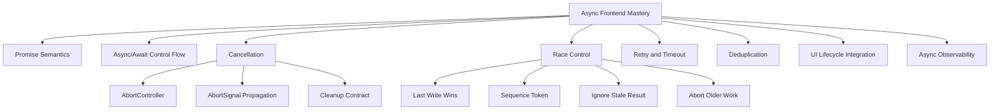
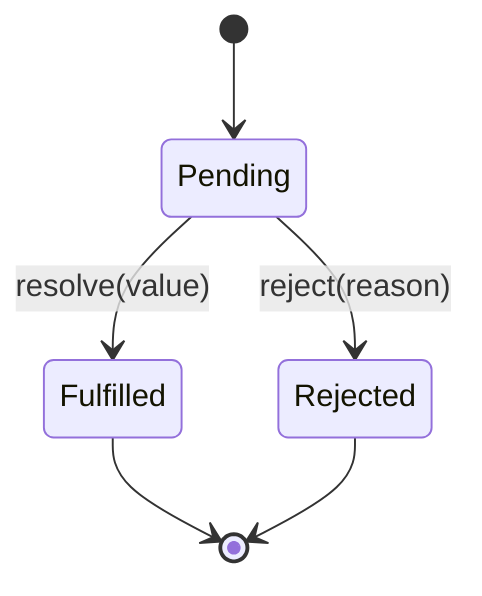
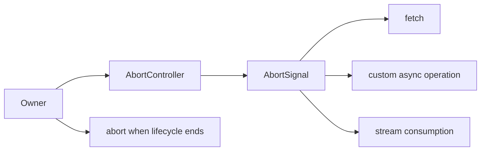
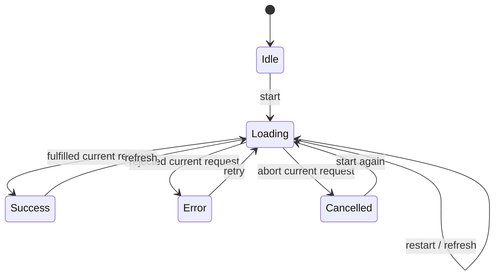
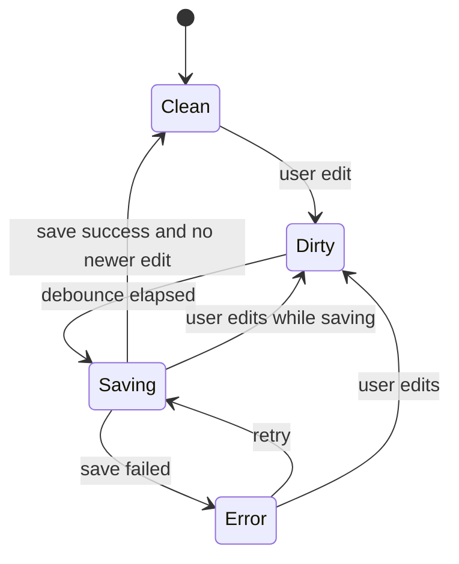

------
title: Learn Advanced JavaScript for Web / Frontend Engineering - Part 005
description: "Deep dive ke async control flow frontend: Promise mechanics, async/await, cancellation dengan AbortController, timeout, retry, backoff, race control, request deduplication, stale response prevention, dan failure propagation di UI production."
series: learn-javascript-frontend-advanced
seriesTitle: Learn Advanced JavaScript for Web / Frontend Engineering
order: 5
partTitle: Async Control Flow and Cancellation
tags:
- javascript
- frontend
- web
- async
- promise
- cancellation
- abortcontroller
- reliability
- advanced
date: 2026-06-27
---

# Async Control Flow and Cancellation

Async frontend bukan sekadar `async/await`. Async frontend adalah disiplin untuk mengendalikan **waktu**, **urutan**, **lifecycle**, **kegagalan**, dan **hasil yang datang terlambat** di sistem UI yang terus berubah.

Di aplikasi produksi, bug async jarang berbentuk syntax error. Bug async biasanya muncul sebagai:

- data lama menimpa data baru;
- spinner tidak pernah berhenti;
- request tetap berjalan setelah user pindah halaman;
- error hilang karena promise tidak ditunggu;
- retry memperparah traffic saat backend sedang rusak;
- validasi form menghasilkan status salah karena response datang tidak berurutan;
- UI terlihat benar di mesin cepat tetapi gagal di jaringan lambat;
- memory leak karena operasi async mempertahankan closure terhadap state lama;
- observability buruk karena error async kehilangan konteks user action.

Part ini melanjutkan Part 004. Di Part 004 kita membahas event loop, task, microtask, dan rendering. Sekarang kita membangun control flow di atasnya.

---

## 1. Posisi Part Ini Dalam Framework Kaufman

Dalam framework Josh Kaufman, skill besar perlu dipecah menjadi sub-skill kecil yang bisa dilatih cepat. Untuk async frontend, sub-skill-nya bukan hanya "pakai Promise".



Kaufman-style target part ini:

1. Anda bisa memprediksi urutan async execution secara mekanistik.
2. Anda bisa mendesain lifecycle async yang eksplisit.
3. Anda bisa membedakan failure, cancellation, timeout, stale result, dan empty result.
4. Anda bisa mencegah race condition sebelum muncul di production.
5. Anda bisa membangun primitive kecil yang reusable tanpa membuat framework kecil yang rapuh.

---

## 2. Kontrak Belajar

Setelah menyelesaikan part ini, Anda harus bisa:

- menjelaskan status dan lifecycle Promise tanpa metafora yang kabur;
- memahami apa yang sebenarnya dilakukan `await` terhadap control flow;
- menulis async function yang error propagation-nya jelas;
- membatalkan request dengan `AbortController` dan meneruskan `AbortSignal` ke layer bawah;
- membedakan promise cancellation dan operation cancellation;
- menerapkan timeout, retry, exponential backoff, jitter, dan retry budget;
- mencegah stale response, double submit, lost update, dan out-of-order write;
- membuat request deduplication dan coalescing sederhana;
- mengintegrasikan async lifecycle dengan komponen UI, routing, form, dan cache;
- membuat debugging checklist untuk async bugs.

Yang tidak dibahas ulang:

- syntax dasar Promise;
- callback dasar;
- basic `fetch`;
- konsep umum HTTP yang sudah masuk materi lain.

---

## 3. Mental Model: Async Adalah Control Flow Yang Ditunda

JavaScript di browser menjalankan kode Anda di main thread, tetapi banyak operasi host berjalan di luar stack JavaScript aktif: network, timer, file, event input, rendering, dan worker. Promise bukan thread. Promise adalah **container untuk hasil masa depan** plus mekanisme untuk menjadwalkan reaksi ketika hasil itu tersedia.

Sebuah async operation memiliki minimal lima dimensi:

| Dimensi | Pertanyaan | Contoh |
|---|---|---|
| Trigger | Apa yang memulai operasi? | user click, route enter, polling tick, visibility change |
| Ownership | Siapa pemilik lifecycle operasi? | component, page, form, cache, global service |
| Completion | Apa arti selesai? | fulfilled, rejected, aborted, timed out, ignored |
| Ordering | Bagaimana jika operasi lain menyusul? | latest wins, first wins, merge, queue, cancel previous |
| Visibility | Bagaimana statusnya terlihat di UI/log? | loading, retrying, stale, failed, cancelled |

Bug async biasanya muncul ketika salah satu dimensi ini implisit.

Contoh buruk:

```js
async function loadUser(id) {
  const response = await fetch(`/api/users/${id}`);
  const user = await response.json();
  setUser(user);
}
```

Kode ini terlihat wajar, tetapi kontraknya kosong:

- siapa yang membatalkan request jika `id` berubah?
- apa yang terjadi jika `loadUser(1)` selesai setelah `loadUser(2)`?
- apa yang terjadi jika component unmount?
- apakah error HTTP 500 masuk `catch`?
- apakah timeout ada?
- apakah retry aman?
- apakah `setUser` boleh berjalan jika user sudah pindah halaman?

Async code produksi harus menjawab pertanyaan itu.

---

## 4. Promise Semantics Yang Harus Dikuasai

Promise memiliki state internal:



State Promise hanya berpindah sekali. Setelah fulfilled atau rejected, state tidak berubah lagi.

Namun ada detail penting: `resolve` bukan selalu berarti langsung fulfilled. Jika Anda resolve dengan promise lain atau thenable, promise akan mengikuti nasib nilai tersebut.

```js
const p = new Promise((resolve) => {
  resolve(fetch('/api/profile'));
});

// p akan menunggu promise dari fetch, bukan fulfilled dengan object Promise mentah.
```

Ini penting ketika membuat abstraction. Banyak bug muncul karena engineer mengira `resolve(x)` selalu menyelesaikan promise saat itu juga.

---

## 5. Promise Reaction dan Microtask

Callback `.then`, `.catch`, `.finally`, dan lanjutan setelah `await` dijalankan sebagai microtask reaction. Artinya, callback tidak langsung berjalan di stack sinkron yang sama.

```js
console.log('A');

Promise.resolve().then(() => {
  console.log('B');
});

console.log('C');

// A
// C
// B
```

Dalam UI, ini punya konsekuensi:

- promise chain panjang bisa menunda rendering opportunity;
- resolved promise dalam loop bisa menciptakan microtask starvation;
- `await` bukan berarti browser sempat repaint;
- async code yang "terlihat yield" belum tentu memberi kesempatan frame berikutnya berjalan.

Contoh jebakan:

```js
async function heavyMicrotaskLoop(items) {
  for (const item of items) {
    await Promise.resolve();
    process(item);
  }
}
```

Kode ini memang memecah execution menjadi banyak microtask, tetapi browser tetap harus menguras microtask queue sebelum masuk render step berikutnya. Untuk memberi kesempatan render, gunakan boundary task/frame, misalnya `setTimeout`, `scheduler.postTask` jika tersedia dan cocok, atau `requestAnimationFrame` tergantung tujuan.

---

## 6. Async/Await Bukan Magic

`async` function selalu mengembalikan Promise.

```js
async function answer() {
  return 42;
}

const value = answer();
console.log(value instanceof Promise); // true
```

`await` melakukan dua hal besar:

1. mengevaluasi expression dan membungkus/menunggu hasilnya sebagai Promise-like;
2. menunda lanjutan function sampai promise settled, lalu melanjutkan sebagai microtask.

```js
async function flow() {
  console.log('before');
  const value = await Promise.resolve(42);
  console.log('after', value);
}

flow();
console.log('outside');

// before
// outside
// after 42
```

Mental model yang lebih akurat:

```js
function flowLike() {
  console.log('before');

  return Promise.resolve(Promise.resolve(42)).then((value) => {
    console.log('after', value);
  });
}
```

Tidak identik secara spesifikasi, tetapi cukup sebagai model operasional.

---

## 7. Error Propagation Dalam Async Function

Error sinkron di async function menjadi rejection.

```js
async function parseBroken() {
  JSON.parse('{');
}

parseBroken().catch((error) => {
  console.log(error instanceof SyntaxError); // true
});
```

`throw` setelah `await` juga menjadi rejection dari promise async function.

```js
async function load() {
  const response = await fetch('/api/user');
  if (!response.ok) {
    throw new Error(`HTTP ${response.status}`);
  }
  return response.json();
}
```

Perhatikan: `fetch` biasanya reject untuk network-level failure, bukan untuk HTTP 404/500. Status HTTP gagal secara aplikasi harus Anda ubah menjadi error secara eksplisit jika itu memang failure untuk use case Anda.

Anti-pattern:

```js
async function submit() {
  try {
    await saveForm();
  } catch (error) {
    console.error(error);
  }
}
```

Masalahnya bukan `catch`, tetapi catch tanpa kontrak. Setelah error ditangkap:

- apakah UI menampilkan error?
- apakah caller perlu tahu submit gagal?
- apakah error harus masuk telemetry?
- apakah ada rollback optimistic update?
- apakah field-level validation perlu diisi?

Lebih baik:

```js
async function submitForm(input) {
  try {
    const result = await saveForm(input);
    return { ok: true, result };
  } catch (error) {
    reportError(error, { action: 'submitForm' });
    return { ok: false, error: normalizeSubmitError(error) };
  }
}
```

Atau, jika caller harus menangani error:

```js
async function submitForm(input) {
  try {
    return await saveForm(input);
  } catch (error) {
    reportError(error, { action: 'submitForm' });
    throw error;
  }
}
```

Rule: **jangan menelan error kecuali Anda menggantinya dengan state yang eksplisit**.

---

## 8. Empat Jenis Kegagalan Async

Frontend production perlu membedakan jenis kegagalan. Semua tidak boleh disamakan menjadi `catch error`.

| Jenis | Arti | UI | Telemetry |
|---|---|---|---|
| Failure | Operasi gagal karena bug/backend/network | tampilkan error atau fallback | laporkan |
| Cancellation | Operasi dihentikan karena lifecycle berubah | biasanya tidak tampil sebagai error | biasanya noise rendah |
| Timeout | Operasi terlalu lama untuk budget UX | tampilkan retry/manual action | laporkan sebagai reliability signal |
| Stale Result | Operasi selesai tetapi sudah tidak relevan | ignore | opsional, biasanya metric race |

Jika semua dianggap error, UX menjadi bising. Jika semua diabaikan, bug hilang dari observability.

---

## 9. Promise Tidak Bisa Dibatalkan Secara Umum

Promise adalah representasi hasil, bukan handle universal untuk menghentikan pekerjaan. Anda bisa mengabaikan hasil promise, tetapi itu tidak selalu menghentikan operasi yang mendasarinya.

```js
const promise = fetch('/api/slow');

// Tidak ada promise.cancel() standar.
```

Cancellation di JavaScript modern biasanya dilakukan dengan membatalkan **operation** yang menerima signal, bukan membatalkan Promise-nya.

Contoh canonical:

```js
const controller = new AbortController();

const promise = fetch('/api/slow', {
  signal: controller.signal,
});

controller.abort();

try {
  await promise;
} catch (error) {
  if (error.name === 'AbortError') {
    // expected cancellation
  } else {
    throw error;
  }
}
```

Mental model:



`AbortController` adalah ownership primitive. `AbortSignal` adalah cancellation contract yang bisa diteruskan ke layer bawah.

---

## 10. AbortSignal Sebagai Parameter Wajib Untuk Async Layer

Layer async yang production-grade sebaiknya menerima `signal` jika operasi itu bisa menjadi tidak relevan.

Buruk:

```js
async function getUser(id) {
  const response = await fetch(`/api/users/${id}`);
  return response.json();
}
```

Lebih baik:

```js
async function getUser(id, { signal } = {}) {
  const response = await fetch(`/api/users/${id}`, { signal });

  if (!response.ok) {
    throw new Error(`Failed to load user ${id}: HTTP ${response.status}`);
  }

  return response.json();
}
```

Kemudian UI owner mengendalikan lifecycle:

```js
let currentController = null;

async function loadSelectedUser(id) {
  currentController?.abort();

  const controller = new AbortController();
  currentController = controller;

  try {
    setStatus('loading');
    const user = await getUser(id, { signal: controller.signal });
    setUser(user);
    setStatus('success');
  } catch (error) {
    if (controller.signal.aborted) {
      return;
    }

    setStatus('error');
    showError(error);
  } finally {
    if (currentController === controller) {
      currentController = null;
    }
  }
}
```

Kontrak penting:

- owner membuat controller;
- signal diteruskan ke operasi;
- owner abort ketika lifecycle berubah;
- result dari operasi yang sudah tidak menjadi current owner tidak boleh menulis state.

---

## 11. Cancellation Harus Menyebar Ke Bawah

Kesalahan umum: signal hanya dipakai di `fetch` pertama, tetapi parsing, transformasi, dan operasi lanjutan tetap berjalan.

```js
async function loadReport({ signal }) {
  const response = await fetch('/api/report', { signal });
  const data = await response.json();

  // Jika transformasi mahal, cancellation juga perlu dicek.
  signal?.throwIfAborted?.();

  return buildLargeViewModel(data);
}
```

Untuk operasi custom:

```js
function throwIfAborted(signal) {
  if (signal?.aborted) {
    throw signal.reason ?? new DOMException('Aborted', 'AbortError');
  }
}

async function expensivePipeline(input, { signal } = {}) {
  throwIfAborted(signal);

  const step1 = await normalize(input);
  throwIfAborted(signal);

  const step2 = await enrich(step1);
  throwIfAborted(signal);

  return finalize(step2);
}
```

Cancellation bukan fitur satu baris. Cancellation adalah **protocol** antar layer.

---

## 12. Timeout Adalah Policy, Bukan Sekadar Timer

Timeout menjawab: "Berapa lama user atau sistem boleh menunggu sebelum operasi dianggap tidak memenuhi kontrak?"

Timeout sederhana:

```js
function timeoutSignal(ms) {
  const controller = new AbortController();
  const timeoutId = setTimeout(() => {
    controller.abort(new DOMException('Timeout', 'TimeoutError'));
  }, ms);

  controller.signal.addEventListener('abort', () => {
    clearTimeout(timeoutId);
  }, { once: true });

  return controller.signal;
}
```

Namun timeout produksi harus mempertimbangkan:

- operation type: search autocomplete tidak sama dengan export report;
- network condition;
- user expectation;
- backend SLA;
- retry policy;
- idempotency;
- apakah timeout membatalkan operasi server atau hanya client wait;
- observability tagging.

Better helper:

```js
class TimeoutError extends Error {
  constructor(message = 'Operation timed out') {
    super(message);
    this.name = 'TimeoutError';
  }
}

async function withTimeout(operation, ms, { label = 'operation' } = {}) {
  const controller = new AbortController();
  const timeoutId = setTimeout(() => {
    controller.abort(new TimeoutError(`${label} exceeded ${ms}ms`));
  }, ms);

  try {
    return await operation(controller.signal);
  } finally {
    clearTimeout(timeoutId);
  }
}

const user = await withTimeout(
  (signal) => getUser('u-123', { signal }),
  5000,
  { label: 'getUser' },
);
```

Catatan: modern browser memiliki helper seperti `AbortSignal.timeout()` di banyak environment, tetapi dalam engineering handbook kita tetap membahas primitive manual agar mental model jelas dan fallback dapat dirancang.

---

## 13. Menggabungkan Signal

Sering kali operasi perlu batal karena beberapa alasan:

- user pindah route;
- component unmount;
- timeout;
- parent workflow batal;
- dialog ditutup.

Modelnya: satu operasi punya signal gabungan.

```js
function anySignal(signals) {
  const controller = new AbortController();

  function abortFrom(signal) {
    if (!controller.signal.aborted) {
      controller.abort(signal.reason);
    }
  }

  for (const signal of signals.filter(Boolean)) {
    if (signal.aborted) {
      abortFrom(signal);
      break;
    }

    signal.addEventListener('abort', () => abortFrom(signal), { once: true });
  }

  return controller.signal;
}
```

Gunakan dengan hati-hati: gabungan signal membuat ownership lebih kompleks. Dokumentasikan alasan cancellation.

---

## 14. Race Condition: Response Lama Menang

Bug klasik:

```js
async function onSearchInput(query) {
  const results = await search(query);
  renderResults(results);
}
```

User mengetik:

1. `j`
2. `ja`
3. `jav`
4. `java`

Request `j` bisa selesai setelah `java`. Jika semua response menulis UI, user melihat hasil lama.

Solusi 1: sequence token.

```js
let searchSeq = 0;

async function onSearchInput(query) {
  const seq = ++searchSeq;

  setSearchStatus('loading');

  try {
    const results = await search(query);

    if (seq !== searchSeq) {
      return; // stale
    }

    renderResults(results);
    setSearchStatus('success');
  } catch (error) {
    if (seq !== searchSeq) {
      return;
    }

    setSearchStatus('error');
    showError(error);
  }
}
```

Solusi 2: abort previous.

```js
let searchController = null;

async function onSearchInput(query) {
  searchController?.abort();
  const controller = new AbortController();
  searchController = controller;

  try {
    const results = await search(query, { signal: controller.signal });

    if (searchController !== controller) {
      return;
    }

    renderResults(results);
  } catch (error) {
    if (controller.signal.aborted) {
      return;
    }

    showError(error);
  }
}
```

Solusi 3: combine sequence + abort untuk robustness.

```js
let current = { seq: 0, controller: null };

async function runLatest(task) {
  current.controller?.abort();

  const seq = current.seq + 1;
  const controller = new AbortController();
  current = { seq, controller };

  try {
    const result = await task({ signal: controller.signal });

    if (current.seq !== seq) {
      return { status: 'stale' };
    }

    return { status: 'success', result };
  } catch (error) {
    if (controller.signal.aborted || current.seq !== seq) {
      return { status: 'cancelled' };
    }

    return { status: 'error', error };
  }
}
```

---

## 15. Race Policy: Jangan Selalu Latest Wins

Tidak semua kasus harus latest wins.

| Use Case | Policy | Alasan |
|---|---|---|
| Search autocomplete | latest wins | query terbaru paling relevan |
| Submit payment | ignore duplicate / lock | side effect tidak boleh dobel |
| Autosave document | serialize / merge | urutan perubahan penting |
| Notification fetch | first acceptable wins | cukup dapat data valid |
| Feature flag fetch | cache then refresh | stale acceptable sementara |
| Infinite scroll | append by cursor | hasil harus sesuai page/cursor |

Sebelum menulis kode async, tentukan policy:

```txt
When multiple operations overlap, which result is allowed to mutate state?
```

Jika jawabannya tidak jelas, bug async hampir pasti akan muncul.

---

## 16. Promise Concurrency Primitives

JavaScript menyediakan beberapa primitive Promise, tetapi masing-masing punya semantics berbeda.

### 16.1 `Promise.all`

Semua harus sukses. Satu reject membuat keseluruhan reject.

```js
const [user, permissions, settings] = await Promise.all([
  getUser(id),
  getPermissions(id),
  getSettings(id),
]);
```

Cocok jika keseluruhan screen tidak valid tanpa semua data.

Risiko: satu failure menutupi result lain. Untuk observability, Anda mungkin tetap perlu instrumentasi per operation.

### 16.2 `Promise.allSettled`

Menunggu semua selesai, baik fulfilled maupun rejected.

```js
const results = await Promise.allSettled([
  loadWidgetA(),
  loadWidgetB(),
  loadWidgetC(),
]);

for (const result of results) {
  if (result.status === 'rejected') {
    reportError(result.reason);
  }
}
```

Cocok untuk dashboard modular.

### 16.3 `Promise.race`

Settled pertama menang, baik fulfilled maupun rejected.

```js
const result = await Promise.race([
  loadData(),
  delay(5000).then(() => {
    throw new TimeoutError();
  }),
]);
```

Hati-hati: yang kalah tidak otomatis berhenti.

### 16.4 `Promise.any`

Fulfilled pertama menang. Rejection diabaikan sampai semua gagal.

```js
const asset = await Promise.any([
  fetchFromPrimaryCdn(url),
  fetchFromBackupCdn(url),
]);
```

Cocok untuk fallback mirror, tetapi observability untuk partial failure tetap penting.

---

## 17. Bounded Concurrency

`Promise.all(items.map(fetchItem))` dapat menghantam backend dan browser connection pool.

Buruk:

```js
await Promise.all(ids.map((id) => fetch(`/api/items/${id}`)));
```

Better: batasi concurrency.

```js
async function mapLimit(items, limit, mapper) {
  const results = new Array(items.length);
  let nextIndex = 0;

  async function worker() {
    while (nextIndex < items.length) {
      const index = nextIndex++;
      results[index] = await mapper(items[index], index);
    }
  }

  const workers = Array.from(
    { length: Math.min(limit, items.length) },
    () => worker(),
  );

  await Promise.all(workers);
  return results;
}

const items = await mapLimit(ids, 5, (id) => getItem(id));
```

Tambahkan cancellation:

```js
async function mapLimitAbortable(items, limit, mapper, { signal } = {}) {
  const results = new Array(items.length);
  let nextIndex = 0;

  function throwIfAborted() {
    if (signal?.aborted) {
      throw signal.reason ?? new DOMException('Aborted', 'AbortError');
    }
  }

  async function worker() {
    while (nextIndex < items.length) {
      throwIfAborted();
      const index = nextIndex++;
      results[index] = await mapper(items[index], index, { signal });
    }
  }

  await Promise.all(
    Array.from({ length: Math.min(limit, items.length) }, () => worker()),
  );

  return results;
}
```

Bounded concurrency adalah reliability feature, bukan optimisasi kecil.

---

## 18. Retry Tidak Selalu Benar

Retry bisa memperbaiki transient failure. Retry juga bisa menggandakan side effect dan memperparah outage.

Sebelum retry, tanya:

1. apakah operasi idempotent?
2. apakah failure kemungkinan transient?
3. apakah backend memberi `Retry-After`?
4. apakah ada retry budget?
5. apakah user action perlu confirmation?
6. apakah request punya idempotency key?
7. apakah timeout total dibatasi?

Retry GET biasanya lebih aman daripada retry POST. Namun GET pun bisa mahal.

Basic retry:

```js
function delay(ms, { signal } = {}) {
  return new Promise((resolve, reject) => {
    const id = setTimeout(resolve, ms);

    signal?.addEventListener('abort', () => {
      clearTimeout(id);
      reject(signal.reason ?? new DOMException('Aborted', 'AbortError'));
    }, { once: true });
  });
}

function exponentialBackoff(attempt, {
  baseMs = 250,
  maxMs = 5000,
  jitter = true,
} = {}) {
  const raw = Math.min(maxMs, baseMs * 2 ** attempt);
  return jitter ? Math.floor(raw * (0.5 + Math.random())) : raw;
}

async function retry(operation, {
  attempts = 3,
  shouldRetry = () => true,
  signal,
  label = 'operation',
} = {}) {
  let lastError;

  for (let attempt = 0; attempt < attempts; attempt++) {
    if (signal?.aborted) {
      throw signal.reason ?? new DOMException('Aborted', 'AbortError');
    }

    try {
      return await operation({ attempt, signal });
    } catch (error) {
      lastError = error;

      if (signal?.aborted || attempt === attempts - 1 || !shouldRetry(error, attempt)) {
        throw error;
      }

      const waitMs = exponentialBackoff(attempt);
      logRetry({ label, attempt, waitMs, error });
      await delay(waitMs, { signal });
    }
  }

  throw lastError;
}
```

Use case:

```js
const data = await retry(
  ({ signal }) => getCatalog({ signal }),
  {
    attempts: 3,
    signal,
    shouldRetry(error) {
      return error.name !== 'AbortError' && isProbablyTransient(error);
    },
    label: 'getCatalog',
  },
);
```

---

## 19. Retry Budget

Retry tanpa budget dapat menciptakan retry storm.

Budget sederhana:

```js
class RetryBudget {
  constructor({ maxRetriesPerMinute }) {
    this.max = maxRetriesPerMinute;
    this.timestamps = [];
  }

  canRetry(now = Date.now()) {
    const windowStart = now - 60_000;
    this.timestamps = this.timestamps.filter((t) => t >= windowStart);
    return this.timestamps.length < this.max;
  }

  consume(now = Date.now()) {
    if (!this.canRetry(now)) {
      return false;
    }

    this.timestamps.push(now);
    return true;
  }
}
```

Di frontend, budget bisa per tab, per route, per operation type, atau per user session. Untuk aplikasi enterprise, retry budget mencegah UI menjadi amplifier saat service down.

---

## 20. Request Deduplication dan Coalescing

Jika dua bagian UI meminta resource sama, jangan selalu kirim dua request.

```js
const inFlight = new Map();

function cacheKey(url, options = {}) {
  return JSON.stringify({ url, method: options.method ?? 'GET' });
}

async function dedupedFetchJson(url, options = {}) {
  const key = cacheKey(url, options);

  if (inFlight.has(key)) {
    return inFlight.get(key);
  }

  const promise = fetch(url, options)
    .then((response) => {
      if (!response.ok) {
        throw new Error(`HTTP ${response.status}`);
      }
      return response.json();
    })
    .finally(() => {
      inFlight.delete(key);
    });

  inFlight.set(key, promise);
  return promise;
}
```

Perhatikan jebakan:

- jangan dedup request yang memiliki authorization/context berbeda;
- jangan dedup mutation kecuali idempotency jelas;
- jangan menyimpan rejected promise terlalu lama jika tujuannya hanya in-flight dedup;
- dedup key harus memasukkan parameter yang relevan;
- cancellation per consumer menjadi lebih kompleks.

Consumer-level cancellation pada shared request:

```js
function makeSharedRequest(loader) {
  let shared = null;

  return function load({ signal } = {}) {
    if (!shared) {
      shared = loader().finally(() => {
        shared = null;
      });
    }

    if (!signal) {
      return shared;
    }

    return Promise.race([
      shared,
      new Promise((_, reject) => {
        signal.addEventListener('abort', () => {
          reject(signal.reason ?? new DOMException('Aborted', 'AbortError'));
        }, { once: true });
      }),
    ]);
  };
}
```

Catatan: consumer abort di atas tidak membatalkan underlying shared request. Ini sering benar untuk dedup cache karena request masih dibutuhkan consumer lain.

---

## 21. Stale Result Prevention Dengan Ownership Token

Pattern umum untuk UI:

```js
function createLatestRunner() {
  let current = 0;

  return async function run(task) {
    const token = ++current;

    try {
      const value = await task();

      if (token !== current) {
        return { status: 'stale' };
      }

      return { status: 'success', value };
    } catch (error) {
      if (token !== current) {
        return { status: 'stale' };
      }

      return { status: 'error', error };
    }
  };
}
```

Usage:

```js
const runLatestSearch = createLatestRunner();

async function handleQueryChange(query) {
  const result = await runLatestSearch(() => search(query));

  if (result.status === 'success') {
    render(result.value);
  }
}
```

Untuk production, token saja tidak membatalkan network. Gabungkan dengan abort jika perlu mengurangi load.

---

## 22. Async State Machine

Daripada banyak boolean:

```js
let isLoading = false;
let isError = false;
let data = null;
let error = null;
```

Gunakan state eksplisit:

```js
type AsyncState<T> =
  | { status: 'idle' }
  | { status: 'loading'; requestId: number }
  | { status: 'success'; data: T; receivedAt: number }
  | { status: 'error'; error: Error; requestId: number }
  | { status: 'cancelled'; reason?: unknown };
```

Dalam JavaScript tanpa TypeScript:

```js
const AsyncStatus = Object.freeze({
  Idle: 'idle',
  Loading: 'loading',
  Success: 'success',
  Error: 'error',
  Cancelled: 'cancelled',
});

function idle() {
  return { status: AsyncStatus.Idle };
}

function loading(requestId) {
  return { status: AsyncStatus.Loading, requestId };
}

function success(data) {
  return { status: AsyncStatus.Success, data, receivedAt: Date.now() };
}
```

State machine:



Invariant penting:

- `success` harus punya data;
- `error` harus punya error;
- `loading` harus punya request owner;
- cancelled bukan error fatal;
- stale result tidak boleh mengubah state current.

---

## 23. Async Lifecycle Di Component UI

Walaupun framework berbeda, lifecycle principle sama.

Pseudo-framework:

```js
function mountUserPanel(userId) {
  const controller = new AbortController();
  let mounted = true;

  load();

  async function load() {
    try {
      setState({ status: 'loading' });
      const user = await getUser(userId, { signal: controller.signal });

      if (!mounted) {
        return;
      }

      setState({ status: 'success', user });
    } catch (error) {
      if (!mounted || controller.signal.aborted) {
        return;
      }

      setState({ status: 'error', error });
    }
  }

  return function unmount() {
    mounted = false;
    controller.abort();
  };
}
```

Mental model untuk framework:

- mount/start creates owner;
- props/input change may cancel old owner;
- unmount destroys owner;
- async result must check ownership before mutating state;
- cleanup should be idempotent.

---

## 24. Double Submit dan Mutation Control

Mutation tidak sama dengan query. Query biasanya bisa dibatalkan/diulang. Mutation memiliki side effect.

Anti-pattern:

```js
button.addEventListener('click', async () => {
  await submitPayment(form.value);
});
```

User double click bisa mengirim dua payment.

Policy options:

1. disable while pending;
2. idempotency key;
3. server-side duplicate detection;
4. client-side lock;
5. queue if operation should serialize.

Client lock:

```js
let submitInFlight = false;

async function handleSubmit(input) {
  if (submitInFlight) {
    return;
  }

  submitInFlight = true;
  setSubmitDisabled(true);

  try {
    await submitOrder(input, {
      idempotencyKey: getOrCreateIdempotencyKey(input),
    });
    showSuccess();
  } catch (error) {
    showSubmitError(error);
  } finally {
    submitInFlight = false;
    setSubmitDisabled(false);
  }
}
```

Tetapi client lock tidak cukup untuk financial/regulatory systems. Server harus memiliki idempotency mechanism.

---

## 25. Autosave: Async Yang Tidak Boleh Naif

Autosave tampak sederhana, tetapi mengandung banyak policy:

- debounce input;
- serialize saves;
- handle network failure;
- expose dirty/saving/saved/error;
- avoid older save overwriting newer content;
- preserve local draft;
- handle tab close/visibility;
- merge server canonical version.

Simplified state machine:



Core pattern:

```js
function createAutosave(save, { debounceMs = 800 } = {}) {
  let version = 0;
  let savedVersion = 0;
  let timer = null;
  let saving = false;
  let latestValue;

  function schedule(value) {
    latestValue = value;
    version++;
    clearTimeout(timer);
    timer = setTimeout(flush, debounceMs);
  }

  async function flush() {
    if (saving || savedVersion === version) {
      return;
    }

    saving = true;
    const versionToSave = version;
    const valueToSave = latestValue;

    try {
      await save(valueToSave, { version: versionToSave });
      savedVersion = Math.max(savedVersion, versionToSave);
    } finally {
      saving = false;

      if (savedVersion < version) {
        flush();
      }
    }
  }

  return { schedule, flush };
}
```

Ini belum lengkap untuk collaborative editing, tetapi menunjukkan invariant: save lama tidak boleh dianggap menyimpan edit baru.

---

## 26. Async Validation

Validasi async field sering terkena stale response.

Buruk:

```js
async function validateUsername(username) {
  const available = await isUsernameAvailable(username);
  setUsernameValid(available);
}
```

Better:

```js
let validationSeq = 0;

async function validateUsername(username) {
  const seq = ++validationSeq;

  setUsernameValidation({ status: 'checking', username });

  try {
    const available = await isUsernameAvailable(username);

    if (seq !== validationSeq) {
      return;
    }

    setUsernameValidation({
      status: available ? 'valid' : 'invalid',
      username,
    });
  } catch (error) {
    if (seq !== validationSeq) {
      return;
    }

    setUsernameValidation({ status: 'error', username, error });
  }
}
```

Rule: validasi async harus terikat ke input value yang divalidasi, bukan hanya field.

---

## 27. Async Observability

Async error yang bagus punya konteks.

Buruk:

```js
catch (error) {
  console.error(error);
}
```

Better:

```js
catch (error) {
  reportError(error, {
    operation: 'loadInvoicePreview',
    invoiceId,
    route: getCurrentRoute(),
    requestId,
    aborted: signal?.aborted ?? false,
    durationMs: performance.now() - startedAt,
  });
}
```

Minimal async telemetry fields:

| Field | Tujuan |
|---|---|
| operation | nama operasi stabil |
| owner | component/page/workflow pemilik |
| requestId/correlationId | trace across layers |
| input shape | parameter aman, bukan PII mentah |
| durationMs | latency |
| status | success/error/cancelled/timeout/stale |
| retryAttempt | retry diagnostics |
| abortReason | lifecycle/timeout/navigation |

Jangan log PII sembarangan. Untuk sistem regulasi/enforcement, logging harus mempertimbangkan auditability, retention, privilege, dan data minimization.

---

## 28. Error Normalization

Raw error dari browser/backend sering tidak sesuai UI.

```js
function normalizeAsyncError(error) {
  if (error?.name === 'AbortError') {
    return { kind: 'cancelled', message: 'Operation cancelled' };
  }

  if (error?.name === 'TimeoutError') {
    return { kind: 'timeout', message: 'The request took too long' };
  }

  if (error?.status === 401) {
    return { kind: 'auth', message: 'Please sign in again' };
  }

  if (error?.status >= 500) {
    return { kind: 'server', message: 'Service is temporarily unavailable' };
  }

  return { kind: 'unknown', message: 'Something went wrong' };
}
```

Pisahkan:

- error untuk developer;
- error untuk telemetry;
- error untuk user;
- error untuk retry policy;
- error untuk audit trail.

Satu object raw tidak harus dipakai untuk semua tujuan.

---

## 29. Async API Design Guidelines

Fungsi async production-grade sebaiknya memiliki shape seperti ini:

```js
async function operation(input, {
  signal,
  timeoutMs,
  correlationId,
  retryPolicy,
} = {}) {
  // implementation
}
```

Guidelines:

1. Terima options object, bukan parameter positional panjang.
2. Dukung `signal` jika operasi bisa tidak relevan.
3. Jangan menelan error tanpa kontrak.
4. Jangan mencampur UI concern di data layer.
5. Return value harus stabil.
6. Error harus bisa diklasifikasi.
7. Side effect harus jelas.
8. Idempotency untuk mutation harus dipikirkan sejak awal.
9. Jangan membuat hidden global state kecuali memang cache/service.
10. Observability jangan ditambahkan belakangan sebagai patch acak.

---

## 30. Pattern: Result Object vs Throw

Throw cocok ketika caller harus memperlakukan failure sebagai exceptional path.

```js
const profile = await loadProfile();
```

Result object cocok ketika failure adalah bagian normal dari flow.

```js
const result = await validateCoupon(code);

if (!result.ok) {
  showCouponMessage(result.reason);
}
```

Jangan dogmatis. Pilih berdasarkan domain semantics.

| Situation | Prefer |
|---|---|
| network failure unexpected | throw |
| invalid coupon | result object |
| permission denied route | typed error or result |
| form validation | result object |
| programmer bug | throw |
| cancellation | typed cancellation or ignored by owner |

---

## 31. Pattern: Async Command

Untuk UI yang punya banyak mutation, bungkus mutation sebagai command object.

```js
function createAsyncCommand(fn) {
  let inFlight = false;

  return {
    get inFlight() {
      return inFlight;
    },

    async run(input) {
      if (inFlight) {
        return { status: 'ignored' };
      }

      inFlight = true;

      try {
        const value = await fn(input);
        return { status: 'success', value };
      } catch (error) {
        return { status: 'error', error };
      } finally {
        inFlight = false;
      }
    },
  };
}
```

Ini primitive sederhana untuk mencegah double submit. Dalam framework, pattern ini bisa menjadi hook/composable/store action.

---

## 32. Pattern: Async Queue

Kadang operasi harus serial, bukan parallel.

```js
function createAsyncQueue() {
  let chain = Promise.resolve();

  return function enqueue(task) {
    const next = chain.then(task, task);

    chain = next.catch(() => {
      // prevent broken chain
    });

    return next;
  };
}

const enqueueSave = createAsyncQueue();

enqueueSave(() => saveDraft(snapshot1));
enqueueSave(() => saveDraft(snapshot2));
```

Use case:

- autosave;
- command log;
- local persistence;
- sequential workflow steps;
- mutation that must preserve order.

Risiko:

- queue bisa tumbuh tanpa batas;
- error handling harus jelas;
- cancellation queue lebih sulit;
- user feedback perlu menunjukkan backlog.

---

## 33. Pattern: Async Resource

Async resource menggabungkan loader, state, refresh, cancel, dan stale protection.

```js
function createAsyncResource(loader) {
  let state = { status: 'idle' };
  let seq = 0;
  let controller = null;

  async function load(input) {
    controller?.abort();
    controller = new AbortController();
    const requestId = ++seq;

    state = { status: 'loading', requestId };

    try {
      const data = await loader(input, { signal: controller.signal });

      if (requestId !== seq) {
        return state;
      }

      state = { status: 'success', data, receivedAt: Date.now() };
      return state;
    } catch (error) {
      if (controller.signal.aborted || requestId !== seq) {
        state = { status: 'cancelled', requestId };
        return state;
      }

      state = { status: 'error', error, requestId };
      return state;
    }
  }

  function cancel(reason) {
    controller?.abort(reason);
  }

  function getState() {
    return state;
  }

  return { load, cancel, getState };
}
```

Ini bukan pengganti library data fetching, tetapi mental model yang menjelaskan apa yang library seperti query/cache manager lakukan.

---

## 34. Debugging Async Bug

Gunakan pertanyaan berikut:

1. Operasi dimulai oleh event apa?
2. Siapa owner lifecycle-nya?
3. Apakah ada lebih dari satu operasi overlap?
4. Policy overlap-nya apa?
5. Apakah old result boleh mutate state?
6. Apakah operasi bisa dibatalkan?
7. Apakah signal diteruskan sampai layer bawah?
8. Apakah timeout ada?
9. Apakah retry ada? Apakah retry aman?
10. Apakah error tertelan?
11. Apakah `finally` mengubah state setelah owner berubah?
12. Apakah status UI merepresentasikan idle/loading/success/error/cancelled/stale dengan jelas?
13. Apakah promise floating tidak ditunggu?
14. Apakah microtask chain menunda rendering?
15. Apakah telemetry punya operation name dan duration?

---

## 35. Code Smell Async

| Smell | Risiko | Perbaikan |
|---|---|---|
| `async` callback tanpa `catch` | unhandled rejection | return/await dan handle error |
| `catch(console.error)` | user tidak tahu failure | state eksplisit + telemetry |
| `Promise.race` untuk timeout tanpa abort | operasi lama tetap jalan | gunakan signal/abort |
| request tanpa owner | memory/race leak | controller per lifecycle |
| banyak boolean loading/error | impossible state | state machine |
| retry semua error | retry storm | retry policy |
| `Promise.all` untuk banyak item besar | overload | bounded concurrency |
| result lama menulis UI | stale data | token/latest/abort |
| mutation double click | duplicate side effect | lock + idempotency |
| async validation tanpa value binding | field status salah | bind result ke input value |

---

## 36. Deliberate Practice

### Latihan 1: Predict the Order

Prediksi output:

```js
console.log('A');

setTimeout(() => console.log('B'), 0);

Promise.resolve()
  .then(() => console.log('C'))
  .then(() => console.log('D'));

(async () => {
  console.log('E');
  await null;
  console.log('F');
})();

console.log('G');
```

Tulis alasan berdasarkan stack, task, microtask, dan `await` continuation.

### Latihan 2: Abortable Fetch Wrapper

Buat `fetchJson(url, { signal, timeoutMs })` dengan kontrak:

- reject untuk HTTP non-2xx;
- timeout membatalkan request;
- abort caller juga membatalkan request;
- error punya `kind` minimal `http`, `network`, `timeout`, `cancelled`;
- tidak leak timer.

### Latihan 3: Search Latest Wins

Implementasikan search autocomplete dengan:

- debounce 250 ms;
- abort previous request;
- stale result prevention;
- `loading`, `success`, `empty`, `error` state;
- no error UI untuk cancellation.

### Latihan 4: Bounded Loader

Buat loader untuk 100 IDs dengan concurrency 5, cancellation, progress, dan partial result.

### Latihan 5: Mutation Command

Buat submit order command dengan:

- double submit prevention;
- idempotency key;
- retry hanya untuk transient network failure;
- no retry untuk validation error;
- telemetry fields.

---

## 37. Production Review Checklist

Sebelum merge async-heavy feature:

- [ ] Semua operation punya owner lifecycle.
- [ ] Request yang bisa stale memiliki latest/token/abort guard.
- [ ] Mutation punya duplicate prevention.
- [ ] Timeout policy jelas.
- [ ] Retry policy eksplisit dan terbatas.
- [ ] HTTP error diklasifikasikan, bukan hanya network error.
- [ ] Cancellation tidak ditampilkan sebagai error fatal.
- [ ] `finally` tidak menulis state setelah owner berubah.
- [ ] Semua floating promise disengaja dan terdokumentasi.
- [ ] Loading/error/success state tidak memiliki impossible state.
- [ ] Observability mencatat operation, duration, status, dan correlation id.
- [ ] PII tidak bocor ke log.
- [ ] Test mencakup slow response, out-of-order response, cancellation, dan retry.

---

## 38. Ringkasan Mental Model

Async frontend yang kuat dibangun dari invariant berikut:

1. Promise mewakili hasil masa depan, bukan thread dan bukan universal cancellation handle.
2. `await` menunda lanjutan function sebagai promise reaction/microtask.
3. Cancellation harus dimodelkan sebagai operation lifecycle dengan `AbortSignal`.
4. Timeout adalah policy UX/reliability, bukan sekadar timer.
5. Race condition harus diselesaikan dengan policy eksplisit: latest wins, first wins, queue, merge, lock, atau ignore.
6. Retry hanya aman jika idempotency, transient failure, dan budget dipahami.
7. UI state async sebaiknya berupa state machine, bukan kumpulan boolean.
8. Async observability harus dirancang sejak awal.

Engineer yang kuat tidak hanya bisa membuat data muncul. Engineer kuat bisa menjamin data yang muncul adalah data yang benar, pada waktu yang benar, untuk owner UI yang benar, dengan failure behavior yang bisa dipahami.

---

## 39. Referensi

- MDN Web Docs — `AbortController`: https://developer.mozilla.org/en-US/docs/Web/API/AbortController
- MDN Web Docs — Using the Fetch API: https://developer.mozilla.org/en-US/docs/Web/API/Fetch_API/Using_Fetch
- MDN Web Docs — Promise: https://developer.mozilla.org/en-US/docs/Web/JavaScript/Reference/Global_Objects/Promise
- MDN Web Docs — async function: https://developer.mozilla.org/en-US/docs/Web/JavaScript/Reference/Statements/async_function
- ECMA-262 — ECMAScript Language Specification: https://tc39.es/ecma262/
- WHATWG HTML — Event loops: https://html.spec.whatwg.org/multipage/webappapis.html#event-loops
