------
title: Learn Advanced JavaScript for Web / Frontend Engineering - Part 006
description: "Deep dive ke module system dan code loading frontend: ESM, module graph, live bindings, dynamic import, import attributes, top-level await, bundling, tree shaking, chunking, preload, lazy loading, dan design boundary untuk aplikasi besar."
series: learn-javascript-frontend-advanced
seriesTitle: Learn Advanced JavaScript for Web / Frontend Engineering
order: 6
partTitle: Modules, Bundling, and Code Loading
tags:
- javascript
- frontend
- web
- esm
- modules
- bundling
- vite
- rollup
- performance
- advanced
date: 2026-06-27
---

# Modules, Bundling, and Code Loading

Frontend modern bukan lagi satu file JavaScript yang ditempel di akhir HTML. Aplikasi frontend produksi adalah **module graph** besar yang harus dibangun, dipotong, dikirim, dieksekusi, di-cache, dan di-debug dengan disiplin.

Part ini membahas JavaScript module system dan code loading bukan sebagai fitur syntax, tetapi sebagai sistem delivery.

Masalah nyata yang ingin kita selesaikan:

- initial bundle terlalu besar;
- route pertama lambat karena semua feature ikut masuk;
- tree shaking tidak bekerja karena side effect tersembunyi;
- dynamic import memecah bundle tetapi menciptakan waterfall;
- top-level await membuat graph loading tertahan;
- shared chunk berubah terlalu sering sehingga cache CDN tidak efektif;
- dependency internal bocor melewati boundary arsitektur;
- package export salah sehingga consumer memuat build yang salah;
- source map dan stack trace tidak membantu debugging production;
- module boundary tidak sesuai ownership tim.

---

## 1. Posisi Part Ini Dalam Framework Kaufman

Dalam framework Kaufman, kita tidak mempelajari module sebagai hafalan `import/export`. Kita memecah skill menjadi sub-skill yang bisa diuji.

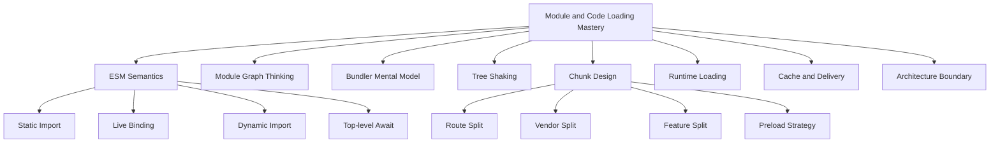

Kaufman-style target:

1. Anda bisa membaca import graph sebagai dependency architecture.
2. Anda bisa memprediksi apa yang masuk initial bundle.
3. Anda bisa menjelaskan mengapa tree shaking gagal.
4. Anda bisa mendesain chunk boundary berdasarkan user journey, bukan tebakan.
5. Anda bisa menyeimbangkan bundle size, request count, cacheability, dan maintainability.

---

## 2. Kontrak Belajar

Setelah part ini, Anda harus bisa:

- menjelaskan perbedaan script klasik dan JavaScript module;
- memahami static import, dynamic import, live binding, module evaluation, dan top-level await;
- membaca module graph sebagai directed graph dengan ownership dan cost;
- memahami bundler sebagai graph transformer;
- menulis library/internal package yang tree-shakeable;
- mendesain lazy loading yang tidak menciptakan UX buruk;
- menentukan chunk boundary untuk route, feature, dan vendor dependency;
- memahami preload, prefetch, cache invalidation, dan hashed assets;
- membuat checklist review untuk bundle regression.

Yang tidak dibahas ulang:

- syntax import/export dasar;
- konfigurasi framework step-by-step;
- tutorial membuat aplikasi.

---

## 3. Script Klasik vs Module

Script klasik dan module punya parsing goal dan semantics berbeda.

Script klasik:

```html
<script src="/legacy.js"></script>
```

Module script:

```html
<script type="module" src="/main.js"></script>
```

Perbedaan penting:

| Aspek | Classic Script | Module Script |
|---|---|---|
| Mode | non-module script | module code |
| Strict mode | tidak otomatis | otomatis strict |
| Scope top-level | bisa menempel ke global dalam beberapa kasus | module scope |
| Loading dependency | manual ordering | dependency graph |
| `import/export` | tidak valid | valid |
| Default defer | perlu `defer` jika ingin non-blocking | module script deferred by default |
| Reuse | global namespace | explicit imports |

Module membuat dependency eksplisit. Itu bagus untuk correctness, bundling, dan tooling. Tetapi module juga membuat graph yang harus dikelola.

---

## 4. Module Graph Mental Model

Setiap file module adalah node. Setiap `import` adalah edge.

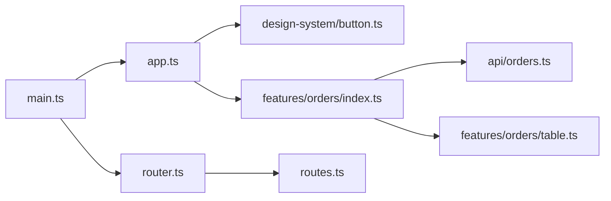

Pertanyaan engineering:

- node mana yang masuk initial path?
- edge mana yang statis dan mana yang dinamis?
- dependency mana yang hanya dibutuhkan route tertentu?
- module mana yang punya side effect saat import?
- apakah dependency direction sesuai architecture?
- apakah shared module terlalu besar?
- apakah module boundary mengikuti ownership tim?

Module graph bukan hanya urusan bundler. Module graph adalah architecture map.

---

## 5. Static Import

Static import harus berada di top-level module.

```js
import { formatCurrency } from './money.js';
import UserCard from './UserCard.js';
```

Karena static import diketahui saat parse/link time, tooling bisa:

- membangun dependency graph tanpa menjalankan kode;
- melakukan tree shaking;
- mendeteksi missing export;
- mengurutkan evaluation;
- memecah bundle lebih deterministik;
- menjalankan lint rule dependency boundary.

Static import adalah kontrak dependency yang kuat.

Anti-pattern:

```js
// barrel besar yang memaksa consumer menarik terlalu banyak dependency
import { Button, DataGrid, RichTextEditor, Chart } from '@app/ui';
```

Jika `@app/ui` punya side effect atau re-export dari banyak module berat, consumer kecil bisa menarik dependency besar.

---

## 6. Live Bindings

ESM import adalah live binding, bukan copy value.

`counter.js`:

```js
export let count = 0;

export function increment() {
  count += 1;
}
```

`main.js`:

```js
import { count, increment } from './counter.js';

console.log(count); // 0
increment();
console.log(count); // 1
```

Binding `count` yang di-import merefleksikan binding export asalnya.

Namun imported binding read-only dari sisi importer:

```js
import { count } from './counter.js';

count = 10; // TypeError
```

Live binding penting untuk circular dependency, hot module replacement, dan stateful singleton. Tetapi live binding juga bisa membuat module state tersembunyi.

Guideline:

- hindari mutable export untuk business state besar;
- gunakan explicit store/service jika state memang shared;
- untuk constants dan pure helpers, export value/function normal;
- jangan mengandalkan mutation export lintas module untuk control flow utama.

---

## 7. Module Evaluation Order

ESM berjalan dalam beberapa fase konseptual:

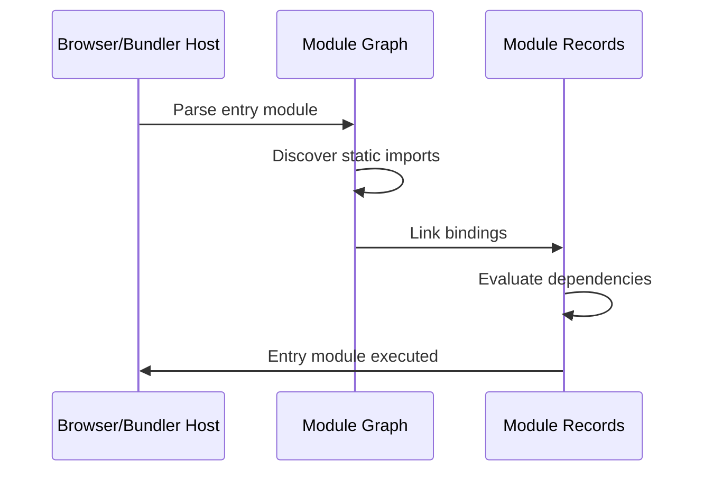

Fase besar:

1. parse source;
2. resolve module specifiers;
3. instantiate/link bindings;
4. evaluate module body.

Konsekuensi:

- import declaration diangkat secara module linking, bukan hoisting gaya `var`;
- dependency dievaluasi sebelum importer body;
- circular dependency bisa valid tetapi binding mungkin belum siap saat digunakan;
- side effect di top-level module terjadi saat evaluation.

---

## 8. Circular Dependency

Circular dependency tidak selalu salah, tetapi sering menjadi design smell.

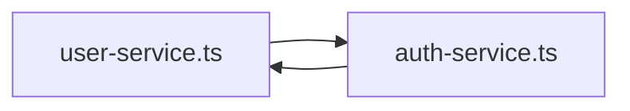

Contoh:

`a.js`:

```js
import { b } from './b.js';

export const a = 'A';
console.log('from a:', b);
```

`b.js`:

```js
import { a } from './a.js';

export const b = 'B';
console.log('from b:', a);
```

ESM mencoba menghubungkan live bindings, tetapi akses terlalu awal bisa masuk temporal dead zone atau menghasilkan perilaku yang membingungkan tergantung shape kode.

Refactoring umum:

- ekstrak shared type/constant ke module ketiga;
- balik dependency direction;
- gunakan dependency injection;
- pisahkan pure domain logic dari infrastructure;
- hilangkan top-level side effect yang membutuhkan module lain sudah siap.

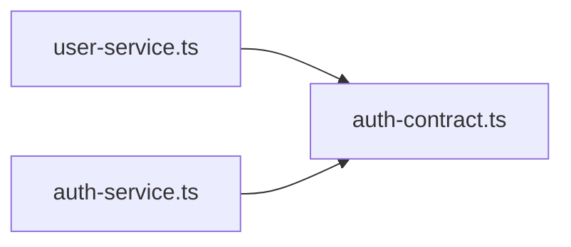

---

## 9. Side Effects Di Module

Side effect adalah efek yang terjadi hanya karena module di-import.

```js
// analytics-init.js
window.analytics = createAnalyticsClient();
window.analytics.track('app_loaded');
```

Atau:

```js
// global-styles.js
import './reset.css';
```

Atau:

```js
// polyfill.js
Array.prototype.groupBy ??= function groupBy() {
  // ...
};
```

Side effect tidak selalu buruk. Tetapi side effect harus eksplisit dan terlokalisasi.

Masalah side effect:

- tree shaking menjadi tidak aman;
- import order menjadi penting;
- test menjadi flakey;
- module sulit dipakai ulang;
- production initialization sulit diaudit.

Guideline:

```js
// buruk: import menjalankan koneksi
import './start-websocket.js';

// lebih baik: import function, panggil di composition root
import { startWebSocket } from './websocket.js';

startWebSocket({ token, url });
```

---

## 10. Dynamic Import

Dynamic import memuat module secara asynchronous saat runtime.

```js
const module = await import('./heavy-editor.js');
module.mountEditor(container);
```

Use case:

- route-level splitting;
- modal/panel yang jarang dibuka;
- heavy dependency seperti editor/chart/map;
- admin-only capability;
- feature flag atau entitlement-based loading;
- progressive enhancement.

Mental model:

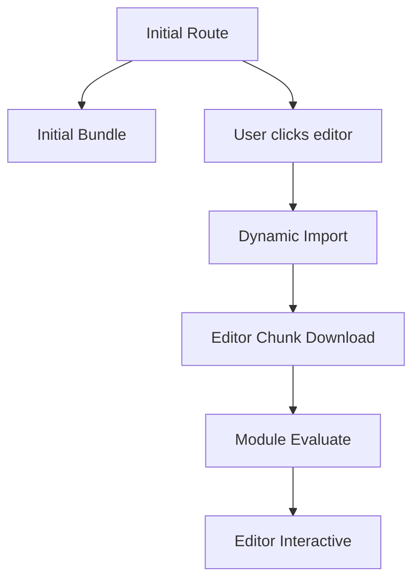

Dynamic import memindahkan cost. Ia tidak menghilangkan cost.

Trade-off:

| Benefit | Cost |
|---|---|
| initial bundle lebih kecil | interaction pertama bisa lambat |
| code jarang dipakai tidak dikirim awal | loading state tambahan |
| route lebih cepat | chunk waterfall jika dependency tidak dipreload |
| privilege split lebih mudah | complexity error handling chunk load |

---

## 11. Dynamic Import Error Handling

Chunk load bisa gagal:

- jaringan offline;
- deploy baru menghapus chunk lama;
- CDN error;
- ad blocker atau corporate proxy;
- integrity mismatch;
- browser cache stale.

Jangan anggap `import()` selalu sukses.

```js
async function loadEditor() {
  try {
    const { mountEditor } = await import('./heavy-editor.js');
    return mountEditor;
  } catch (error) {
    reportError(error, { operation: 'loadEditorChunk' });
    throw new Error('Editor failed to load. Please refresh and try again.');
  }
}
```

UI harus punya fallback:

```js
async function openEditor() {
  setEditorState({ status: 'loading' });

  try {
    const mountEditor = await loadEditor();
    setEditorState({ status: 'ready', mountEditor });
  } catch (error) {
    setEditorState({ status: 'error', error });
  }
}
```

---

## 12. Top-Level Await

Top-level await memungkinkan module menunggu promise di top-level.

```js
const config = await fetch('/config.json').then((r) => r.json());

export { config };
```

Ini kuat, tetapi berbahaya jika dipakai sembarangan. Module yang mengimpor module tersebut harus menunggu evaluation selesai.

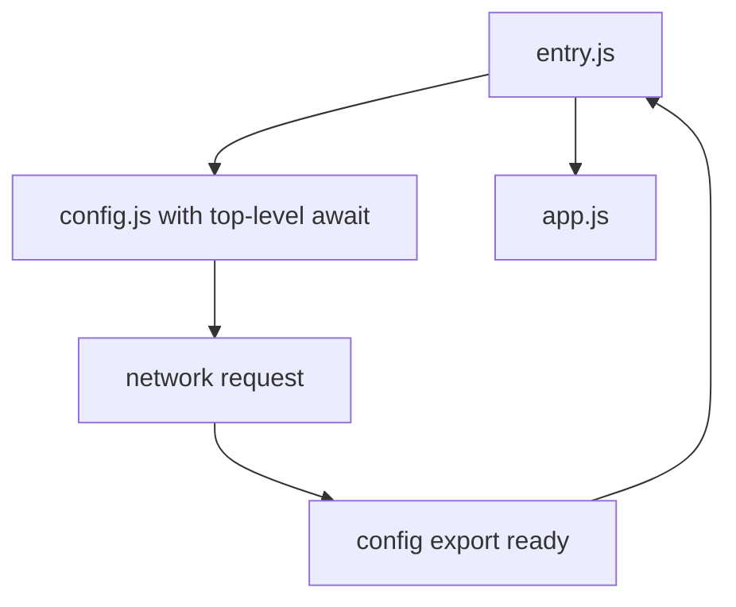

Risiko:

- startup graph tertahan;
- failure saat module evaluation dapat menggagalkan app boot;
- dependency yang tampak kecil bisa menyembunyikan network wait;
- test setup menjadi lebih rumit;
- circular dependency makin sulit dipahami.

Guideline:

- gunakan top-level await untuk module yang memang intrinsik async dan kecil;
- hindari di shared utility;
- hindari network request top-level untuk critical app boot kecuali sengaja;
- pertimbangkan explicit `init()` di composition root.

```js
// lebih eksplisit
import { createConfigClient } from './config-client.js';

const configClient = createConfigClient();
const config = await configClient.load();
startApp({ config });
```

---

## 13. Import Attributes

Import attributes memungkinkan memberi metadata pada import tertentu, misalnya untuk JSON modules di environment yang mendukung.

```js
import data from './data.json' with { type: 'json' };
```

Prinsip engineering:

- cek compatibility dan tooling support;
- jangan anggap semua runtime/browser mendukung fitur baru secara sama;
- bedakan standard language feature, bundler feature, dan framework transform;
- dokumentasikan ketika syntax bergantung pada build pipeline.

Dalam aplikasi frontend modern, banyak syntax tampak seperti JavaScript tetapi sebenarnya di-transform bundler/framework. Bedakan kemampuan browser asli dan kemampuan build tool.

---

## 14. Module Specifier dan Resolution

Specifier:

```js
import './local.js';
import '../domain/order.js';
import '@app/ui/Button';
import 'date-fns/format';
```

Di browser native ESM, path relatif perlu jelas. Bare specifier seperti `'react'` biasanya butuh bundler atau import map.

Bundler melakukan resolution:

- resolve package dari `node_modules`;
- baca `package.json` fields;
- pilih entrypoint sesuai condition;
- apply alias;
- transform TypeScript/JSX/CSS/assets;
- emit output graph.

Resolution adalah sumber bug besar:

- duplicate dependency karena symlink/monorepo;
- ESM/CJS interop salah;
- package mengekspor build development ke production;
- alias membuat import boundary tidak jelas;
- deep import mem-bypass public API package.

---

## 15. Package Public API

Untuk internal package, desain public API seperti kontrak.

Buruk:

```js
import { normalizeOrder } from '@app/orders/src/internal/normalizeOrder';
```

Better:

```js
import { normalizeOrder } from '@app/orders';
```

Package boundary harus menjawab:

- apa yang public?
- apa yang internal?
- apa yang stabil?
- siapa owner?
- apakah dependency boleh masuk dua arah?
- apakah breaking change dikontrol?

Contoh `package.json` exports:

```json
{
  "name": "@app/orders",
  "type": "module",
  "exports": {
    ".": "./dist/index.js",
    "./testing": "./dist/testing.js"
  }
}
```

Gunakan export subpath untuk contract yang disengaja, bukan membiarkan consumer deep import file internal.

---

## 16. Bundler Sebagai Graph Transformer

Bundler mengambil module graph dan menghasilkan assets yang efisien untuk browser.

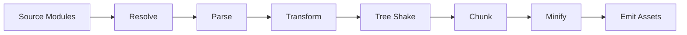

Bundler modern dapat:

- menggabungkan module;
- memecah chunk;
- transform TS/JSX/CSS;
- inline constants;
- remove dead code;
- hash filenames;
- generate source maps;
- optimize asset references;
- inject preload hints;
- handle dynamic imports.

Tetapi bundler tidak bisa memperbaiki architecture yang buruk. Jika graph terlalu coupled, output juga sulit optimal.

---

## 17. Vite Mental Model

Vite populer karena membedakan dev dan production strategy.

Dev:

- memanfaatkan native ESM di browser;
- dependency pre-bundling untuk performa;
- transform on demand;
- HMR cepat.

Production:

- build memakai Rollup;
- tree shaking;
- chunking;
- minification;
- asset hashing;
- output optimized.

Mental model:

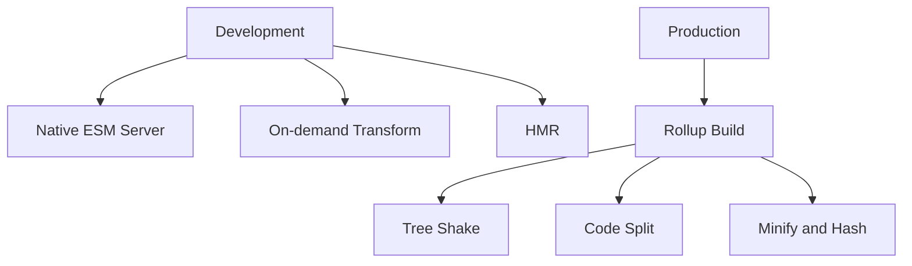

Konsekuensi: perilaku dev dan production tidak selalu identik. Bug production bisa muncul karena chunking, minification, dead-code elimination, env replacement, atau asset path.

---

## 18. Tree Shaking

Tree shaking adalah proses menghapus code yang tidak digunakan dari final bundle.

Agar tree shaking efektif:

- gunakan ESM static imports/exports;
- hindari top-level side effect tidak perlu;
- package menandai side effect dengan benar;
- jangan menggunakan dynamic property access yang membuat bundler tidak bisa menganalisis;
- pisahkan entrypoint besar;
- hindari barrel file yang mengimpor side-effectful module.

Contoh buruk:

```js
// utils/index.js
export * from './date.js';
export * from './money.js';
export * from './dom-polyfills.js'; // side effect
```

Consumer:

```js
import { formatCurrency } from '@app/utils';
```

Jika `dom-polyfills.js` punya side effect, bundler bisa mempertahankan lebih banyak code.

Better:

```js
// utils/index.js
export { formatCurrency } from './money.js';
export { formatDate } from './date.js';

// polyfills harus explicit
import '@app/polyfills/dom';
```

---

## 19. Side Effects Field

Package dapat memberi sinyal side effects.

```json
{
  "sideEffects": false
}
```

Atau whitelist:

```json
{
  "sideEffects": [
    "**/*.css",
    "./src/polyfills.js"
  ]
}
```

Hati-hati: jika Anda menandai `sideEffects: false` padahal module punya side effect penting, bundler dapat menghapus code yang seharusnya berjalan.

Review checklist:

- apakah file CSS di-import sebagai side effect?
- apakah polyfill harus selalu dijalankan?
- apakah analytics init tersimpan di module yang bisa tree-shaken?
- apakah package internal punya top-level registration?
- apakah tests mencakup production build?

---

## 20. Barrel Files

Barrel file adalah file yang re-export banyak module.

```js
export * from './Button.js';
export * from './Modal.js';
export * from './DataGrid.js';
export * from './RichTextEditor.js';
```

Barrel berguna untuk public API. Tetapi barrel besar bisa merusak build performance dan tree shaking jika tidak hati-hati.

Guideline:

- barrel di package boundary boleh, tetapi harus disiplin;
- hindari barrel yang mencampur light dan heavy dependency;
- hindari barrel internal untuk semua file feature;
- jangan re-export module yang punya side effect;
- ukur bundle output, jangan asumsi.

Alternatif:

```js
import { Button } from '@app/ui/button';
import { RichTextEditor } from '@app/ui/rich-text-editor';
```

Subpath exports membuat import tetap public tetapi granular.

---

## 21. Chunking

Chunk adalah output bundle fragment yang bisa dimuat browser.

Terlalu sedikit chunk:

- initial load berat;
- user mengunduh fitur yang tidak dipakai;
- perubahan kecil mengubah bundle besar.

Terlalu banyak chunk:

- request overhead;
- waterfall;
- parse/evaluation overhead;
- cache fragmentation;
- complexity preload.

Tujuan chunking: kirim code yang tepat, pada waktu yang tepat, dengan cache behavior yang baik.

---

## 22. Route-Level Splitting

Route-level splitting biasanya win pertama.

```js
const OrdersPage = () => import('./routes/orders/OrdersPage.js');
const AdminPage = () => import('./routes/admin/AdminPage.js');
```

Mental model:

```mermaid
flowchart TD
  A[App Shell] --> B[Router]
  B --> C[/dashboard chunk]
  B --> D[/orders chunk]
  B --> E[/admin chunk]
```

Bagus karena user journey cenderung route-based. Tetapi route split saja tidak cukup jika route chunk tetap menarik semua dependency berat.

Checklist:

- apakah route chunk memuat editor/chart/map yang tidak langsung terlihat?
- apakah role-specific route dipisah?
- apakah shared layout terlalu berat?
- apakah route loader membuat network waterfall?
- apakah skeleton UI tersedia?

---

## 23. Component/Feature-Level Splitting

Untuk dependency berat yang jarang dipakai:

```js
async function openChartPanel() {
  const [{ Chart }, data] = await Promise.all([
    import('./ChartPanel.js'),
    loadChartData(),
  ]);

  renderChart(Chart, data);
}
```

Perhatikan `Promise.all`: code dan data bisa dimuat parallel. Jangan membuat waterfall jika tidak perlu.

Buruk:

```js
const { Chart } = await import('./ChartPanel.js');
const data = await loadChartData();
```

Jika data dan code tidak saling bergantung, load parallel.

---

## 24. Vendor Splitting

Vendor splitting memisahkan dependency pihak ketiga.

Naif:

```txt
vendor.js: react + router + date + charts + editor + maps + everything
app.js: app code
```

Masalah:

- vendor chunk terlalu besar;
- perubahan satu dependency bisa invalidasi chunk besar;
- user route sederhana tetap mengunduh vendor berat.

Better:

- core vendor untuk dependency selalu dipakai;
- heavy vendor masuk feature chunk;
- role-specific dependency tidak masuk public route;
- monitor duplicate dependency.

Jangan manual split terlalu awal tanpa data. Gunakan bundle analyzer.

---

## 25. Preload dan Prefetch

Lazy loading mengurangi initial cost tetapi bisa menambah latency saat interaction. Preload/prefetch membantu, tetapi harus digunakan dengan policy.

Konsep:

| Hint | Maksud |
|---|---|
| preload | resource penting untuk current navigation |
| modulepreload | preload module graph modern |
| prefetch | kemungkinan dipakai nanti, prioritas lebih rendah |
| preconnect | siapkan koneksi ke origin |

Use case:

- route berikutnya yang sangat mungkin dikunjungi;
- chunk untuk modal yang tombolnya terlihat above-the-fold;
- dependency interaction penting setelah initial render;
- CDN/API origin yang akan dipakai segera.

Jangan prefetch semua route. Itu hanya memindahkan bloat.

---

## 26. Avoiding Lazy Loading Waterfall

Waterfall terjadi ketika chunk A baru diketahui setelah chunk sebelumnya selesai.

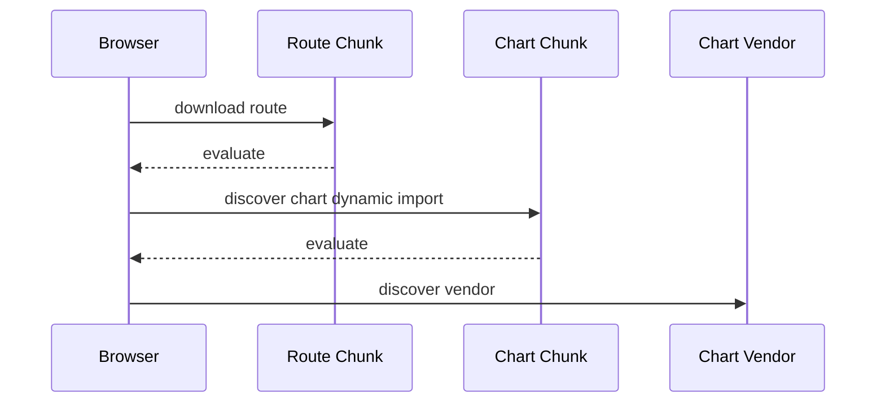

Lebih baik bundler/preload strategy menemukan dependency lebih awal.

Pattern:

```js
const chartModulePromise = import('./ChartPanel.js');
const dataPromise = loadChartData();

const [{ ChartPanel }, data] = await Promise.all([
  chartModulePromise,
  dataPromise,
]);
```

Di framework, gunakan route-level preloading API jika tersedia. Tetapi tetap pahami graph-nya.

---

## 27. Cacheability dan Hashed Assets

Production build biasanya menghasilkan filename dengan content hash:

```txt
assets/index-a1b2c3.js
assets/orders-9f8e7d.js
assets/vendor-react-123abc.js
```

Policy umum:

- hashed assets bisa diberi long-term cache;
- HTML entrypoint biasanya no-cache atau short cache;
- service worker harus hati-hati saat update;
- chunk lama harus tetap tersedia beberapa waktu setelah deploy untuk user yang masih membuka HTML lama.

Chunk load failure sering terjadi saat:

1. user membuka app versi lama;
2. deploy baru menghapus chunk lama dari CDN;
3. user navigasi ke route lazy;
4. browser mencoba mengambil chunk lama yang sudah hilang.

Mitigasi:

- jangan langsung menghapus old assets;
- tampilkan reload prompt untuk chunk load failure;
- gunakan deployment atomic;
- pastikan CDN cache policy sesuai;
- monitor chunk load errors.

---

## 28. Source Maps

Source map menghubungkan minified production code ke source asli.

Trade-off:

- debugging jauh lebih baik;
- potensi exposure source code;
- perlu upload ke error monitoring dengan akses terkontrol;
- source map publik mungkin tidak cocok untuk aplikasi sensitif.

Guideline:

- generate source maps untuk observability pipeline;
- jangan selalu expose source maps publik;
- pastikan release version/source map cocok dengan deployed artifact;
- simpan source map dengan retention policy;
- jangan memasukkan secret ke source code karena source map bukan security boundary.

---

## 29. Environment Replacement

Build tool sering mengganti environment variable saat build.

```js
if (import.meta.env.DEV) {
  enableDebugTools();
}
```

Risiko:

- secret ikut masuk bundle;
- production flag salah;
- code path mati karena replacement;
- environment runtime dan build-time tertukar.

Rule:

- frontend env var bukan secret;
- hanya expose yang memang public;
- gunakan prefix sesuai tool;
- bedakan build-time config dan runtime config;
- untuk multi-tenant/regional deployment, pertimbangkan runtime config endpoint.

---

## 30. Importing Assets

Bundler memperluas module graph ke CSS, images, fonts, WASM, workers.

```js
import logoUrl from './logo.svg';
import './styles.css';
```

Ini bukan ESM murni browser dalam semua kasus. Ini build-tool feature.

Guideline:

- pahami mana standard JS dan mana bundler transform;
- asset import harus jelas cache behavior-nya;
- CSS side effects perlu diperhitungkan dalam tree shaking;
- font/image besar harus masuk performance budget;
- worker/WASM punya loading boundary sendiri.

---

## 31. Web Workers Sebagai Separate Module Graph

Worker modern bisa dibuat sebagai module worker.

```js
const worker = new Worker(new URL('./worker.js', import.meta.url), {
  type: 'module',
});
```

Bundler biasanya memperlakukan worker sebagai entry graph terpisah.

Konsekuensi:

- dependency worker tidak otomatis masuk main bundle;
- shared code bisa menjadi shared chunk atau duplicated tergantung build;
- message protocol harus stabil;
- worker chunk load failure perlu ditangani;
- sourcemap/debugging worker perlu konfigurasi.

Ini akan dibahas lebih detail di part Web Workers, tetapi module graph-nya perlu dipahami sejak sekarang.

---

## 32. Dependency Boundary dan Architecture

Module import harus mengikuti architecture direction.

Contoh layered:

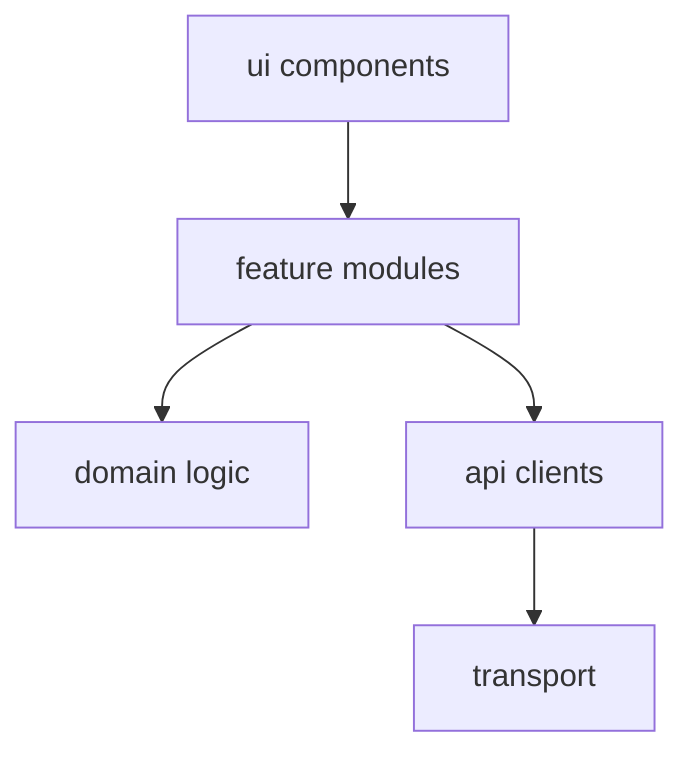

Tetapi dalam vertical slice architecture, boundary bisa berbeda:

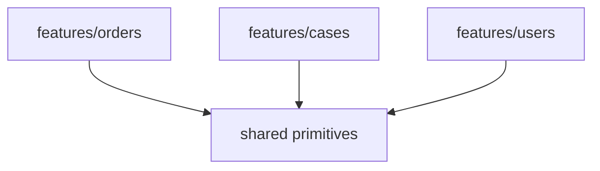

Yang penting bukan bentuknya, tetapi invariant:

- feature A tidak import internal feature B;
- shared tidak import feature;
- domain tidak import UI;
- API client tidak import component;
- test helper tidak masuk production bundle;
- server-only module tidak masuk client bundle.

Enforce dengan lint rule, package exports, tsconfig paths, dan review.

---

## 33. Composition Root

Composition root adalah tempat aplikasi merakit dependency.

```js
import { createApiClient } from './infra/api-client.js';
import { createOrderService } from './features/orders/order-service.js';
import { startApp } from './app.js';

const apiClient = createApiClient({ baseUrl: window.__APP_CONFIG__.apiBaseUrl });
const orderService = createOrderService({ apiClient });

startApp({ orderService });
```

Kenapa penting?

- menghindari top-level hidden initialization;
- membuat testing lebih mudah;
- dependency graph lebih jelas;
- runtime config tidak bocor ke utility;
- feature boundary lebih terkontrol.

Untuk frontend besar, composition root mencegah module import berubah menjadi global service locator tersembunyi.

---

## 34. Server-Only vs Client-Safe Modules

Di era SSR/RSC/edge rendering, tidak semua module boleh masuk client.

Client-safe:

- pure formatting;
- UI components;
- browser APIs;
- public config;
- client data fetching.

Server-only:

- database credentials;
- private API tokens;
- filesystem;
- server session secret;
- privileged business operation.

Risiko fatal:

```js
// server-secret.js
export const privateApiKey = process.env.PRIVATE_API_KEY;

// accidentally imported by client component
import { privateApiKey } from './server-secret.js';
```

Modern framework sering memberi guard, tetapi architecture harus tetap disiplin.

Guideline:

- pisahkan folder/module server dan client;
- gunakan naming convention;
- gunakan lint rule;
- gunakan framework directive secara benar;
- audit bundle output untuk secret;
- jangan percaya tree shaking sebagai security boundary.

---

## 35. Bundle Budget

Bundle budget adalah batas eksplisit untuk menjaga performance.

Contoh budget:

```yaml
initial_js_gzip: 180kb
route_chunk_gzip: 120kb
heavy_interaction_chunk_gzip: 250kb
max_third_party_dependency_delta: 30kb
```

Budget harus dikaitkan dengan user journey dan device class.

Metrics:

- raw size;
- gzip/brotli size;
- parse/compile cost;
- execution cost;
- request count;
- cache hit ratio;
- route transition latency.

Jangan hanya melihat gzip size. JavaScript juga mahal untuk parse dan execute.

---

## 36. Bundle Analysis Workflow

Workflow review:

1. build production;
2. generate bundle stats;
3. lihat initial chunk;
4. identifikasi top dependencies;
5. lihat duplicate packages;
6. lihat route chunk;
7. inspect unexpected imports;
8. cek side effects/barrel;
9. cek source map jika perlu;
10. buat action: remove, replace, lazy load, split, or accept.

Decision categories:

| Finding | Possible Action |
|---|---|
| dependency besar dipakai satu modal | dynamic import |
| dua versi package sama | dedupe/resolution fix |
| utility library seluruhnya masuk | import granular / replace |
| route chunk berat | split below route |
| vendor chunk terlalu besar | manual chunk strategy cautiously |
| code internal bocor | boundary lint |
| source map mismatch | release pipeline fix |

---

## 37. Library Import Discipline

Contoh:

```js
import _ from 'lodash';
```

vs

```js
import debounce from 'lodash/debounce';
```

Namun modern package berbeda-beda. Beberapa sudah ESM-friendly, beberapa belum. Jangan bergantung pada folklore. Ukur output build.

Rule:

- baca package entrypoint;
- cek ESM support;
- cek side effects;
- cek bundle analyzer;
- prefer native platform jika cukup;
- jangan tambah dependency untuk fungsi trivial;
- jangan rewrite library besar tanpa alasan kuat.

---

## 38. Code Loading UX

Lazy loading harus punya UX.

Bad:

```js
button.onclick = async () => {
  const { openDialog } = await import('./Dialog.js');
  openDialog();
};
```

User click, tidak ada feedback.

Better:

```js
button.addEventListener('pointerenter', () => {
  preloadDialog();
});

let dialogPromise;

function preloadDialog() {
  dialogPromise ??= import('./Dialog.js');
  return dialogPromise;
}

button.onclick = async () => {
  button.setAttribute('aria-busy', 'true');

  try {
    const { openDialog } = await preloadDialog();
    openDialog();
  } catch (error) {
    showToast('Dialog failed to load. Please try again.');
  } finally {
    button.removeAttribute('aria-busy');
  }
};
```

Preload on hover/focus can improve perceived latency, tetapi jangan abuse untuk semua elemen.

---

## 39. Module Federation dan Microfrontend: Catatan Singkat

Microfrontend/module federation sering dipakai untuk organisasi besar, tetapi bukan default solution.

Masalah yang ingin diselesaikan:

- deployment independen;
- team autonomy;
- domain ownership;
- legacy coexistence.

Cost:

- runtime dependency negotiation;
- duplicated vendor;
- version mismatch;
- cross-app state consistency;
- design system drift;
- observability lebih sulit;
- security/release governance lebih berat.

Sebelum microfrontend, coba dulu:

- monorepo dengan package boundary kuat;
- vertical slice architecture;
- independent route deployment jika platform mendukung;
- design system governance;
- CI ownership rules.

Microfrontend adalah organizational architecture, bukan bundling trick.

---

## 40. Testing Module Boundaries

Test tidak hanya behavior UI. Test juga boundary.

Contoh checks:

- feature tidak import feature lain;
- server-only module tidak masuk client graph;
- public package import tidak deep import internal;
- bundle size tidak melewati budget;
- dynamic chunk load failure punya fallback;
- production build smoke test berjalan.

Pseudo lint rule idea:

```txt
features/orders/** must not import features/users/internal/**
shared/** must not import features/**
client/** must not import server/**
```

Dalam organisasi besar, boundary yang tidak di-enforce akan rusak perlahan.

---

## 41. Production Failure Modes

| Failure Mode | Gejala | Root Cause | Mitigasi |
|---|---|---|---|
| Initial bundle bloat | LCP/TTI buruk | terlalu banyak static import | route/feature split |
| Chunk load error | blank page saat navigasi | old assets hilang/CDN error | retain old assets + reload fallback |
| Tree shaking gagal | bundle berisi code tak dipakai | side effects/barrel/CJS | audit imports/package |
| Duplicate dependency | bundle membesar/flakey state | version mismatch | dedupe/lockfile policy |
| TLA boot delay | app start lambat | top-level await di shared module | explicit init |
| Circular dependency | undefined/TDZ runtime | dependency dua arah | extract contract |
| Env secret leak | secret muncul di bundle | build-time env salah | audit + server-only boundary |
| Lazy waterfall | interaction lambat | nested dynamic imports | preload/parallel load |
| Source map unusable | stack trace minified | release mismatch | artifact pipeline |
| Test-only code shipped | bundle/security risk | wrong imports | boundary lint |

---

## 42. Deliberate Practice

### Latihan 1: Draw the Graph

Ambil satu feature frontend yang sudah ada. Buat graph:

- entry route;
- component utama;
- data layer;
- shared UI;
- dependency berat;
- CSS/assets;
- dynamic imports.

Tandai node yang masuk initial route.

### Latihan 2: Remove Hidden Side Effects

Cari module yang melakukan work di top-level. Refactor menjadi explicit initialization di composition root.

### Latihan 3: Split Heavy Interaction

Pilih dependency berat seperti chart/editor/map. Buat dynamic import dengan:

- loading state;
- error fallback;
- optional preload on intent;
- parallel data loading.

### Latihan 4: Bundle Regression Review

Tambahkan dependency baru. Ukur bundle delta. Jawab:

- berapa gzip/brotli delta?
- masuk initial atau lazy chunk?
- ada dependency transitif besar?
- ada native alternative?
- apakah import granular?

### Latihan 5: Boundary Enforcement

Tulis aturan boundary untuk folder/module architecture Anda. Buat minimal satu lint/check yang gagal jika boundary dilanggar.

---

## 43. Production Review Checklist

Sebelum merge perubahan module/bundling:

- [ ] Import baru memang berada di boundary yang benar.
- [ ] Dependency berat tidak masuk initial bundle tanpa alasan kuat.
- [ ] Dynamic import punya loading dan error state.
- [ ] Lazy loading tidak menciptakan waterfall yang tidak perlu.
- [ ] Tree shaking tidak rusak oleh side effect/barrel.
- [ ] Package internal tidak di-deep import dari luar contract.
- [ ] Server-only module tidak masuk client graph.
- [ ] Bundle size delta diketahui.
- [ ] Source maps/release artifact tetap konsisten.
- [ ] Chunk load failure memiliki recovery UX.
- [ ] Env var public/private dibedakan.
- [ ] Production build diuji, bukan hanya dev server.

---

## 44. Ringkasan Mental Model

1. ESM membuat dependency eksplisit dan statically analyzable.
2. Module graph adalah architecture graph sekaligus delivery graph.
3. Static import bagus untuk predictability; dynamic import bagus untuk memindahkan cost ke waktu yang lebih tepat.
4. Live binding bukan copy value; mutable export harus hati-hati.
5. Top-level side effect adalah musuh tree shaking dan testability jika tidak dikontrol.
6. Bundler adalah graph transformer, bukan penyelamat architecture buruk.
7. Code splitting adalah trade-off antara initial cost, interaction latency, request count, dan cacheability.
8. Lazy loading tanpa UX adalah performa palsu.
9. Boundary harus di-enforce dengan tooling, bukan hanya konvensi.
10. Bundle budget adalah kontrak production, bukan angka vanity.

Top-tier frontend engineer tidak hanya bertanya "apakah build berhasil?". Ia bertanya: **code mana dikirim ke user mana, pada waktu apa, dengan cost berapa, dan boundary ownership seperti apa?**

---

## 45. Referensi

- MDN Web Docs — `import` declaration: https://developer.mozilla.org/en-US/docs/Web/JavaScript/Reference/Statements/import
- MDN Web Docs — dynamic `import()`: https://developer.mozilla.org/en-US/docs/Web/JavaScript/Reference/Operators/import
- MDN Web Docs — JavaScript modules guide: https://developer.mozilla.org/en-US/docs/Web/JavaScript/Guide/Modules
- ECMA-262 — ECMAScript Language Specification: https://tc39.es/ecma262/
- Vite Documentation — Features: https://vite.dev/guide/features
- Rollup Documentation — ES module bundler: https://rollupjs.org/
- WHATWG HTML — Module scripts: https://html.spec.whatwg.org/multipage/scripting.html#module-scripts
