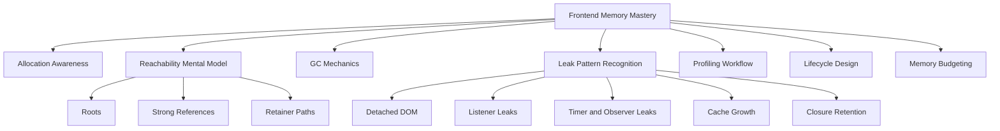
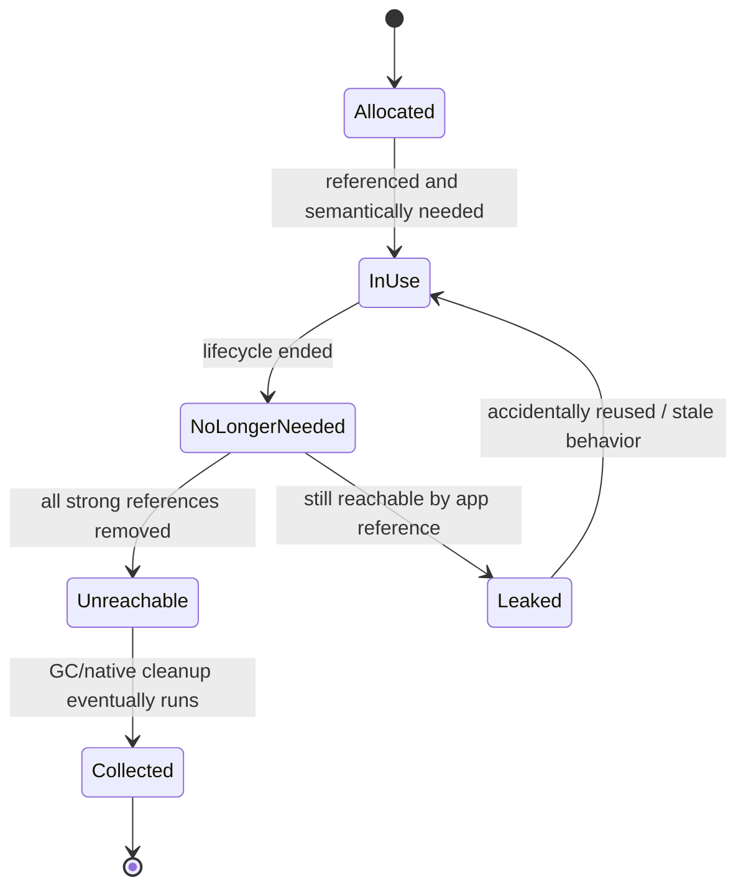
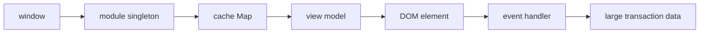
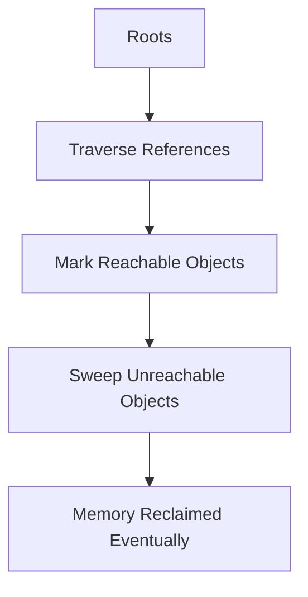
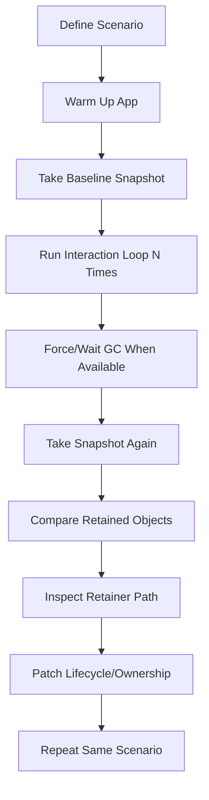

------
title: Learn Advanced JavaScript for Web / Frontend Engineering - Part 007
description: "Deep dive ke browser runtime memory: JavaScript heap, DOM/native memory, reachability, garbage collection, retained references, detached DOM, listener/timer/observer leaks, cache leaks, memory profiling, GC pressure, dan frontend memory budget."
series: learn-javascript-frontend-advanced
seriesTitle: Learn Advanced JavaScript for Web / Frontend Engineering
order: 7
partTitle: Browser Runtime, Memory, and Garbage Collection
tags:
- javascript
- frontend
- web
- browser
- memory
- garbage-collection
- performance
- profiling
- advanced
date: 2026-06-27
---

# Browser Runtime, Memory, and Garbage Collection

Memory bug di frontend jarang muncul sebagai crash langsung. Biasanya ia muncul sebagai aplikasi yang makin lama makin berat, tab yang mengonsumsi RAM besar, input yang makin lambat, long task yang semakin sering, battery drain, mobile browser yang membunuh tab, atau UI yang terasa random setelah user memakai aplikasi cukup lama.

JavaScript memang punya garbage collector. Tetapi itu tidak berarti frontend engineer boleh mengabaikan memory. Garbage collector hanya bisa membebaskan objek yang **tidak reachable**. Jika aplikasi Anda masih menyimpan reference ke objek besar, DOM node, event listener, observer, timer, cache entry, promise callback, atau closure, memory tersebut masih dianggap dibutuhkan.

Part ini membahas memory sebagai bagian dari runtime architecture, bukan sebagai trik optimasi mikro.

---

## 1. Posisi Part Ini Dalam Framework Kaufman

Dalam pendekatan Josh Kaufman, skill yang besar perlu dipecah menjadi sub-skill kecil yang bisa dilatih dengan feedback cepat. Untuk memory frontend, sub-skill utamanya adalah:



Target part ini:

1. Anda bisa menjelaskan mengapa objek tertentu masih hidup.
2. Anda bisa membaca memory leak sebagai **retainer graph problem**.
3. Anda bisa membedakan memory leak, memory bloat, dan GC pressure.
4. Anda bisa mendesain lifecycle cleanup yang eksplisit.
5. Anda bisa melakukan investigasi memory dengan DevTools secara sistematis.

---

## 2. Kontrak Belajar

Setelah menyelesaikan part ini, Anda harus bisa:

- memahami lifecycle memory: allocate, use, release;
- menjelaskan root, reachability, strong reference, weak reference, dan retainer path;
- mengenali sumber memory di browser: JS heap, DOM/native objects, decoded images, GPU layers, worker heaps, caches, dan buffers;
- membedakan objek JavaScript biasa dengan wrapper JavaScript untuk resource native;
- menjelaskan mengapa detached DOM node bisa tetap hidup;
- merancang cleanup untuk listener, timer, observer, subscription, worker, dan async task;
- menggunakan `WeakMap`, `WeakSet`, `WeakRef`, dan `FinalizationRegistry` dengan batasan yang benar;
- membuat bounded cache dengan TTL/size limit;
- membuat memory profiling loop yang repeatable;
- menentukan memory budget untuk fitur frontend yang panjang umur.

Yang tidak dibahas ulang:

- syntax dasar object/array;
- konsep umum stack dan heap dari programming basic;
- optimasi CSS/rendering detail yang akan dibahas lebih dalam di Part 009;
- framework-specific cleanup API secara lengkap.

---

## 3. Mental Model: Memory Bukan Hanya Heap

Banyak engineer melihat memory frontend seolah-olah hanya JavaScript heap. Itu terlalu sempit.

Browser page dapat menyimpan memory di beberapa lapisan:

| Area | Contoh | Cara bocor/bertumbuh |
|---|---|---|
| JavaScript heap | object, array, closure, function, promise reaction | reference masih reachable dari root |
| DOM/native objects | element, text node, event target, style object | detached DOM tetap direferensikan JS |
| decoded media | image bitmap, canvas buffer, video frame | image besar, canvas tidak dibersihkan, object URL tidak dicabut |
| network/cache buffers | response body, blob, array buffer | response besar ditahan cache/app state |
| worker heap | data di dedicated/shared worker | worker tidak di-terminate, message queue menumpuk |
| framework runtime | virtual tree, fiber, reactive graph, subscription | komponen unmounted masih tersubscribe |
| browser internals | layout tree, accessibility tree, compositing layer | layer berlebih, node berlebih, style/layout cache |

Di production, memory problem sering lintas area. Contoh:

1. user membuka modal detail transaksi;
2. modal membuat banyak DOM node;
3. handler `click` menangkap `transaction` object besar dalam closure;
4. modal dihapus dari DOM;
5. handler tetap ada di global event bus;
6. DOM node menjadi detached, tetapi masih reachable dari closure/event bus;
7. transaction object besar ikut tertahan;
8. setelah 200 kali buka-tutup modal, tab terasa berat.

Masalahnya bukan “GC gagal”. Masalahnya aplikasi masih memberi jalur reference dari root ke objek yang seharusnya mati.

---

## 4. Lifecycle Memory: Allocate, Use, Release

Setiap memory memiliki lifecycle sederhana:



Hal penting: **not needed** tidak sama dengan **unreachable**.

GC tidak tahu niat bisnis Anda. GC hanya tahu apakah objek masih bisa dicapai dari root. Jika user sudah pindah halaman tetapi Anda masih menyimpan data page lama di module singleton, objek tersebut masih reachable.

### 4.1 Allocate

Allocation terjadi saat Anda membuat nilai baru:

```js
const rows = data.map(toViewModel);
const element = document.createElement("div");
const controller = new AbortController();
const buffer = await response.arrayBuffer();
```

Allocation juga terjadi secara tidak terlihat:

```js
const label = `${user.name} - ${user.role}`;
const filtered = rows.filter(row => row.active);
const sorted = [...rows].sort(compareRows);
button.addEventListener("click", () => save(formState));
```

Di UI modern, allocation kecil yang berulang ribuan kali bisa menjadi GC pressure, walaupun bukan leak.

### 4.2 Use

Memory digunakan selama objek dibaca/ditulis atau dibutuhkan untuk menjalankan behavior:

```js
viewModel.status = "saving";
render(viewModel);
```

Masalah muncul ketika objek masih dipakai oleh mekanisme internal, bukan oleh fitur user:

```js
const cache = new Map();
cache.set(user.id, hugeUserProfile);
```

Jika cache tidak punya eviction, semua data yang pernah dilihat user bisa tetap hidup.

### 4.3 Release

Di JavaScript, release berarti membuat objek tidak reachable. Anda tidak memanggil `free()`.

```js
let large = new ArrayBuffer(50 * 1024 * 1024);

// selesai dipakai
large = null;
```

Tetapi `null` bukan mantra. Jika reference lain masih ada, objek tetap hidup.

```js
let large = new ArrayBuffer(50 * 1024 * 1024);
const holder = { large };

large = null;

// buffer tetap reachable via holder.large
```

---

## 5. Reachability: Pertanyaan Paling Penting

Saat debugging memory, pertanyaan utama bukan “apakah objek ini besar?” melainkan:

> Dari root mana objek ini masih reachable?

Root dapat berupa:

- global object/window;
- module scope yang hidup sepanjang page;
- stack function yang sedang aktif;
- pending promise reaction;
- timer callback;
- event listener yang terdaftar;
- DOM tree aktif;
- worker global scope;
- framework runtime root;
- browser-managed handle terhadap resource.

Jika ada jalur reference dari root ke object, object belum bisa dikoleksi.



Dalam contoh ini, `DATA` tetap hidup karena jalur reference masih ada. Untuk membebaskannya, Anda perlu memutus jalur yang benar, bukan sekadar berharap GC berjalan.

---

## 6. Strong Reference vs Weak Reference

Mayoritas reference di JavaScript adalah strong reference. Strong reference menjaga objek tetap hidup.

```js
const map = new Map();
const user = { id: "u1" };

map.set(user, { permissions: hugePermissionGraph });
```

Selama `map` hidup, key `user` dan value-nya hidup.

Weak reference tidak menjaga objek tetap hidup. JavaScript menyediakan `WeakMap` dan `WeakSet` untuk kasus metadata yang mengikuti lifecycle object key.

```js
const metadataByElement = new WeakMap();

function attachMetadata(element, metadata) {
  metadataByElement.set(element, metadata);
}
```

Jika `element` tidak reachable dari tempat lain, entry di `WeakMap` tidak mencegah `element` dikoleksi.

### 6.1 Kapan Menggunakan WeakMap

Gunakan `WeakMap` untuk metadata yang lifecycle-nya menempel pada object:

```js
const stateByNode = new WeakMap();

export function initialize(node) {
  stateByNode.set(node, {
    startedAt: performance.now(),
    dispose: createDisposer(node),
  });
}

export function cleanup(node) {
  stateByNode.get(node)?.dispose();
  stateByNode.delete(node);
}
```

Cocok untuk:

- metadata DOM node;
- private per-instance data;
- memoization berdasarkan object identity;
- associating external state tanpa memperpanjang umur key.

Tidak cocok untuk:

- cache yang perlu diiterasi;
- menghitung jumlah entry;
- data yang key-nya primitive;
- lifecycle yang harus deterministic.

### 6.2 WeakRef dan FinalizationRegistry

`WeakRef` dan `FinalizationRegistry` adalah primitive low-level. Mereka berguna untuk kasus khusus, tetapi bukan pengganti cleanup eksplisit.

Contoh cache recomputable:

```js
class WeakValueCache {
  #values = new Map();

  get(key) {
    return this.#values.get(key)?.deref();
  }

  set(key, value) {
    this.#values.set(key, new WeakRef(value));
  }
}
```

Masalahnya:

- Anda tidak bisa mengontrol kapan GC berjalan;
- `deref()` bisa mengembalikan `undefined` kapan saja setelah object tidak strongly reachable;
- cleanup callback finalizer tidak deterministic;
- logic bisnis tidak boleh bergantung pada finalization timing.

Rule praktis:

> Untuk cleanup resource penting, gunakan lifecycle eksplisit. Gunakan weak primitive hanya sebagai bantuan memory, bukan sebagai kontrak correctness.

---

## 7. Garbage Collection: Apa Yang Perlu Diketahui Frontend Engineer

Anda tidak perlu menulis garbage collector. Tetapi Anda perlu memahami batasannya.

Modern JavaScript engine menggunakan ide utama **mark-and-sweep**: mulai dari roots, tandai semua object yang reachable, lalu reclaim object yang tidak reachable. Implementasi modern menambahkan optimasi seperti generational GC, incremental GC, concurrent marking, compaction, dan heuristics lain.

Mental model sederhana:



### 7.1 GC Tidak Mengetahui Intent

Kode ini secara bisnis selesai menggunakan `payload`, tetapi GC tidak bisa membebaskannya karena masih ada closure:

```js
function register(payload) {
  window.addEventListener("resize", () => {
    console.log(payload.id);
  });
}
```

Selama listener masih terdaftar di `window`, callback hidup. Selama callback hidup, closure hidup. Selama closure hidup, `payload` hidup.

### 7.2 GC Tidak Selalu Segera Berjalan

Setelah object menjadi unreachable, memory tidak harus langsung turun. Engine menjalankan GC berdasarkan heuristik. Karena itu, Anda tidak boleh menyimpulkan “tidak bocor” atau “pasti bocor” hanya dari satu titik pengamatan.

Butuh loop:

1. lakukan baseline;
2. jalankan interaction berulang;
3. beri kesempatan GC;
4. bandingkan heap snapshot;
5. lihat retained size dan retainer path;
6. ulangi setelah fix.

### 7.3 GC Pressure Bukan Leak

GC pressure terjadi ketika aplikasi membuat banyak object jangka pendek sehingga GC sering bekerja. Memory mungkin turun kembali, tetapi CPU dan responsiveness terganggu.

Contoh allocation pressure:

```js
function renderRows(rows) {
  return rows
    .filter(row => row.visible)
    .map(row => ({
      ...row,
      label: `${row.code} - ${row.name}`,
      searchText: `${row.code} ${row.name} ${row.owner}`.toLowerCase(),
    }))
    .sort(compareRows);
}
```

Jika fungsi ini berjalan pada setiap keystroke untuk 20.000 row, Anda membuat banyak object sementara.

Solusi bukan selalu memoization. Solusi bisa berupa:

- memindahkan indexing ke precomputed structure;
- debounce input;
- incremental filtering;
- virtualization;
- worker;
- mengubah data shape;
- menghindari clone besar yang tidak perlu.

---

## 8. Tiga Kategori Masalah Memory

Jangan menyebut semua masalah memory sebagai leak. Diagnosis akan kabur.

| Kategori | Gejala | Root cause | Contoh |
|---|---|---|---|
| Memory leak | memory terus naik setelah lifecycle selesai | object tidak pernah unreachable | listener tidak dilepas, cache tak terbatas |
| Memory bloat | memory besar tapi masih reachable secara sengaja | data terlalu besar untuk kebutuhan fitur | menyimpan full response 50MB untuk tabel ringkas |
| GC pressure | memory naik-turun, CPU GC tinggi | allocation jangka pendek terlalu banyak | membuat object baru pada setiap animation frame |

### 8.1 Memory Leak

Leak adalah object yang secara semantik sudah tidak dibutuhkan, tetapi masih reachable.

### 8.2 Memory Bloat

Bloat bukan leak. Data memang masih reachable, tetapi desainnya boros.

```js
const dashboardState = {
  rows: hugeApiResponse,        // 100 fields per row
  visibleColumns: ["id", "name", "status"],
};
```

Jika UI hanya butuh 3 field, menyimpan 100 field untuk 100.000 row adalah bloat.

### 8.3 GC Pressure

GC pressure biasanya muncul sebagai jank. Memory graph tidak selalu naik terus, tetapi frame/input terganggu.

---

## 9. Leak Pattern 1: Detached DOM

Detached DOM adalah DOM node yang sudah tidak berada dalam active document tree, tetapi masih direferensikan oleh JavaScript atau browser-side listener/subscription.

Contoh:

```js
let lastPanel = null;

function openPanel(data) {
  const panel = document.createElement("section");
  panel.textContent = data.title;

  panel.addEventListener("click", () => {
    console.log(data.largePayload);
  });

  document.body.append(panel);
  lastPanel?.remove();
  lastPanel = panel;
}
```

Setiap `lastPanel` diganti, panel lama bisa hilang dari DOM. Tetapi jika ada reference lain ke callback atau data, ia bisa tetap hidup. Contoh di atas juga menyimpan hanya satu panel terakhir, tetapi pola serupa sering lebih buruk ketika panel lama disimpan di array, registry, analytics queue, atau global store.

### 9.1 Fix Dengan Ownership Yang Jelas

```js
function createPanel(data) {
  const panel = document.createElement("section");
  const controller = new AbortController();

  panel.textContent = data.title;
  panel.addEventListener(
    "click",
    () => {
      console.log(data.id);
    },
    { signal: controller.signal },
  );

  return {
    element: panel,
    dispose() {
      controller.abort();
      panel.remove();
    },
  };
}

let currentPanel = null;

function openPanel(data) {
  currentPanel?.dispose();
  currentPanel = createPanel(data);
  document.body.append(currentPanel.element);
}
```

Perbaikan utama bukan `remove()` saja. Perbaikan utama adalah **dispose contract** yang memutus DOM dan listener lifecycle sekaligus.

---

## 10. Leak Pattern 2: Event Listener Yang Tidak Dilepas

Event listener adalah sumber leak klasik karena listener biasanya menyimpan closure.

```js
function mountUserCard(user) {
  window.addEventListener("resize", () => {
    recomputeLayout(user.preferences);
  });
}
```

Setiap mount menambah listener baru. Jika tidak pernah dilepas, semua `user` lama tertahan.

### 10.1 Named Handler

```js
function mountUserCard(user) {
  function onResize() {
    recomputeLayout(user.preferences);
  }

  window.addEventListener("resize", onResize);

  return () => {
    window.removeEventListener("resize", onResize);
  };
}
```

### 10.2 AbortSignal Untuk Cleanup

```js
function mountUserCard(user) {
  const controller = new AbortController();

  window.addEventListener(
    "resize",
    () => recomputeLayout(user.preferences),
    { signal: controller.signal },
  );

  return () => controller.abort();
}
```

`AbortSignal` membuat cleanup banyak listener lebih mudah dikelola.

### 10.3 Event Delegation

Untuk banyak item, jangan memasang listener per node jika satu listener di parent cukup.

```js
function mountList(root, onSelect) {
  const controller = new AbortController();

  root.addEventListener(
    "click",
    event => {
      const button = event.target.closest("[data-row-id]");
      if (!button || !root.contains(button)) return;
      onSelect(button.dataset.rowId);
    },
    { signal: controller.signal },
  );

  return () => controller.abort();
}
```

Keuntungan:

- jumlah listener lebih kecil;
- item dinamis tidak perlu listener baru;
- cleanup cukup di parent;
- retainer graph lebih sederhana.

---

## 11. Leak Pattern 3: Timer, RAF, dan Idle Callback

Timer menyimpan callback. Callback menyimpan closure. Closure menyimpan data.

```js
function startPolling(account) {
  setInterval(async () => {
    await refreshAccount(account.id);
  }, 5000);
}
```

Jika interval tidak dihentikan, account lama tetap hidup.

### 11.1 Cleanup Timer

```js
function startPolling(account) {
  const id = setInterval(async () => {
    await refreshAccount(account.id);
  }, 5000);

  return () => clearInterval(id);
}
```

### 11.2 Timer Scope

Untuk banyak resource, gunakan scope:

```js
function createScope() {
  const disposers = new Set();

  return {
    interval(callback, ms) {
      const id = setInterval(callback, ms);
      disposers.add(() => clearInterval(id));
      return id;
    },

    timeout(callback, ms) {
      const id = setTimeout(callback, ms);
      disposers.add(() => clearTimeout(id));
      return id;
    },

    dispose() {
      for (const dispose of disposers) dispose();
      disposers.clear();
    },
  };
}
```

Penggunaan:

```js
function mountDashboard(accountId) {
  const scope = createScope();

  scope.interval(() => refreshDashboard(accountId), 10_000);

  return () => scope.dispose();
}
```

---

## 12. Leak Pattern 4: Observer dan Subscription

Browser API seperti `MutationObserver`, `ResizeObserver`, `IntersectionObserver`, dan subscription custom biasanya membutuhkan disconnect/unsubscribe.

```js
function observePanel(panel, state) {
  const observer = new ResizeObserver(() => {
    state.panelWidth = panel.getBoundingClientRect().width;
  });

  observer.observe(panel);
}
```

Jika tidak disconnect, observer dapat mempertahankan callback, panel, dan state.

Fix:

```js
function observePanel(panel, state) {
  const observer = new ResizeObserver(() => {
    state.panelWidth = panel.getBoundingClientRect().width;
  });

  observer.observe(panel);

  return () => observer.disconnect();
}
```

Pattern umum:

```js
function subscribe(source, listener) {
  source.add(listener);
  return () => source.delete(listener);
}
```

Jika API tidak mengembalikan unsubscribe, bungkus sendiri.

---

## 13. Leak Pattern 5: Unbounded Cache

Cache tanpa eviction adalah leak yang diberi nama bagus.

```js
const responseCache = new Map();

export async function getUser(id) {
  if (responseCache.has(id)) return responseCache.get(id);

  const response = await fetch(`/api/users/${id}`);
  const user = await response.json();
  responseCache.set(id, user);
  return user;
}
```

Jika user membuka 50.000 profile selama sesi panjang, cache menyimpan semuanya.

### 13.1 Bounded LRU Cache

```js
class LruCache {
  #maxEntries;
  #map = new Map();

  constructor(maxEntries) {
    this.#maxEntries = maxEntries;
  }

  get(key) {
    if (!this.#map.has(key)) return undefined;

    const value = this.#map.get(key);
    this.#map.delete(key);
    this.#map.set(key, value);
    return value;
  }

  set(key, value) {
    if (this.#map.has(key)) {
      this.#map.delete(key);
    }

    this.#map.set(key, value);

    while (this.#map.size > this.#maxEntries) {
      const oldestKey = this.#map.keys().next().value;
      this.#map.delete(oldestKey);
    }
  }

  delete(key) {
    this.#map.delete(key);
  }

  clear() {
    this.#map.clear();
  }
}
```

### 13.2 Cache Dengan TTL

```js
class TtlCache {
  #ttlMs;
  #map = new Map();

  constructor(ttlMs) {
    this.#ttlMs = ttlMs;
  }

  get(key) {
    const entry = this.#map.get(key);
    if (!entry) return undefined;

    if (performance.now() > entry.expiresAt) {
      this.#map.delete(key);
      return undefined;
    }

    return entry.value;
  }

  set(key, value) {
    this.#map.set(key, {
      value,
      expiresAt: performance.now() + this.#ttlMs,
    });
  }
}
```

### 13.3 Cache Policy Checklist

Setiap cache harus punya jawaban untuk:

| Pertanyaan | Mengapa penting |
|---|---|
| Apa key-nya? | key buruk membuat duplikasi |
| Apa value-nya? | value terlalu besar menyebabkan bloat |
| Kapan entry invalid? | correctness data |
| Kapan entry dievict? | memory bound |
| Apa batas ukuran? | mencegah growth tak terbatas |
| Apakah cache per route, per tab, atau global? | menentukan lifecycle |
| Apakah cache observable? | debugging dan tuning |

---

## 14. Leak Pattern 6: Closure Retention

Closure berguna. Tetapi closure juga dapat menahan object besar lebih lama dari yang Anda kira.

```js
function createExporter(report) {
  const rows = report.rows;
  const metadata = report.metadata;

  return function exportCsv() {
    return toCsv(rows, metadata.columns);
  };
}
```

Jika `exportCsv` disimpan di toolbar global, seluruh `report.rows` tertahan.

### 14.1 Tangkap Data Minimal

```js
function createExporter(report) {
  const reportId = report.id;
  const columnNames = report.metadata.columns.map(column => column.name);

  return async function exportCsv() {
    const rows = await fetchReportRows(reportId);
    return toCsv(rows, columnNames);
  };
}
```

Rule:

> Closure untuk long-lived callback harus menangkap identifier/stable primitive bila memungkinkan, bukan object graph besar.

---

## 15. Leak Pattern 7: Pending Promise dan Async Callback

Pending promise dapat mempertahankan callback chain.

```js
function loadHeavyData(filter) {
  return fetch("/api/heavy", {
    method: "POST",
    body: JSON.stringify(filter),
  }).then(response => response.json());
}
```

Jika `filter` besar dan request tidak pernah selesai karena network hang, callback chain bisa hidup lama.

Solusi:

- gunakan timeout;
- gunakan cancellation;
- jangan capture object besar yang tidak perlu;
- batasi jumlah pending request;
- pastikan route/component cleanup membatalkan operasi.

```js
async function loadHeavyData(filter, signal) {
  const minimalFilter = pickServerFilter(filter);

  const response = await fetch("/api/heavy", {
    method: "POST",
    body: JSON.stringify(minimalFilter),
    signal,
  });

  return response.json();
}
```

---

## 16. Object URL, Blob, Canvas, dan Media Memory

Memory frontend sering bocor di luar JS heap.

### 16.1 Object URL

```js
const url = URL.createObjectURL(file);
image.src = url;
```

Object URL perlu dicabut ketika tidak dipakai.

```js
function previewFile(file, image) {
  const url = URL.createObjectURL(file);
  image.src = url;

  return () => {
    URL.revokeObjectURL(url);
    image.removeAttribute("src");
  };
}
```

### 16.2 Canvas

Canvas besar dapat menyimpan buffer besar.

```js
function disposeCanvas(canvas) {
  canvas.width = 0;
  canvas.height = 0;
  canvas.remove();
}
```

### 16.3 Image Decoding

Sebuah image kecil dalam ukuran transfer bisa menjadi besar setelah decoded.

Perkiraan kasar:

```txt
width * height * 4 bytes
```

Image 4000x3000 dapat membutuhkan sekitar 48 MB decoded bitmap, belum termasuk overhead.

---

## 17. Worker Memory

Worker punya heap dan lifecycle sendiri. Menggunakan worker tidak menghilangkan memory problem; hanya memindahkan lokasi problem.

```js
const worker = new Worker(new URL("./worker.js", import.meta.url), {
  type: "module",
});

worker.postMessage({ rows: hugeRows });
```

Jika data dikirim dengan structured clone, data bisa disalin. Untuk `ArrayBuffer`, gunakan transfer bila ownership bisa dipindahkan.

```js
const buffer = new ArrayBuffer(1024 * 1024);
worker.postMessage({ buffer }, [buffer]);
```

Setelah ditransfer, buffer di thread asal menjadi detached. Ini mengurangi duplikasi memory, tetapi mengubah ownership.

Cleanup worker:

```js
function createParserWorker() {
  const worker = new Worker(new URL("./parser.worker.js", import.meta.url), {
    type: "module",
  });

  return {
    worker,
    dispose() {
      worker.terminate();
    },
  };
}
```

Rule:

> Worker harus punya owner, message protocol, backpressure, dan termination policy.

---

## 18. Memory Budget Frontend

Top-tier engineer tidak hanya memperbaiki leak setelah muncul. Ia mendesain budget.

Contoh budget untuk fitur dashboard internal:

| Resource | Budget awal | Red flag |
|---|---:|---:|
| JS heap setelah load | < 80 MB | > 150 MB |
| JS heap setelah 30 menit interaksi | growth < 20 MB | growth terus naik |
| DOM nodes | < 5.000 aktif | > 20.000 aktif |
| listener global | diketahui dan bounded | bertambah tiap navigasi |
| cache entries | bounded per fitur | tidak ada eviction |
| decoded image/canvas | sesuai viewport | full-size asset tanpa resize |
| long-lived worker | 0-2 | worker per panel tanpa terminate |

Budget harus disesuaikan target device. Mobile low-end jauh lebih sensitif dibanding desktop engineer.

---

## 19. Profiling Workflow

Memory profiling yang bagus harus repeatable.



### 19.1 Scenario Harus Spesifik

Buruk:

```txt
Aplikasi terasa berat.
```

Baik:

```txt
Open dashboard > filter by branch > open case detail modal > close modal.
Repeat 100 times.
Expected: heap returns near baseline after GC; detached nodes do not grow linearly.
```

### 19.2 Apa Yang Dicari Di Heap Snapshot

Cari:

- retained size besar;
- object count yang tumbuh linear;
- detached DOM tree;
- listener callback yang menahan data;
- array/map yang terus bertambah;
- closure yang menahan response besar;
- framework nodes yang tidak ter-unmount;
- duplicate payload yang bisa dinormalisasi.

### 19.3 Retainer Path

Retainer path menjawab: siapa yang membuat object tetap hidup?

Contoh diagnosis:

```txt
Detached HTMLDivElement
  retained by EventListener
  retained by function onClick
  retained by Closure modalState
  retained by Array openModals
  retained by Module dashboardRegistry
```

Fix diarahkan ke jalur itu:

- hapus entry dari `openModals`;
- abort listener;
- dispose modal;
- jangan capture `modalState` besar;
- batasi registry.

---

## 20. Lifecycle Scope Pattern

Daripada menyebar cleanup di banyak tempat, buat lifecycle scope.

```js
function createLifecycleScope() {
  const disposers = [];
  let disposed = false;

  function add(disposer) {
    if (disposed) {
      disposer();
      return disposer;
    }

    disposers.push(disposer);
    return disposer;
  }

  return {
    add,

    event(target, type, listener, options = {}) {
      const controller = new AbortController();
      const signal = options.signal
        ? AbortSignal.any([options.signal, controller.signal])
        : controller.signal;

      target.addEventListener(type, listener, {
        ...options,
        signal,
      });

      return add(() => controller.abort());
    },

    timeout(callback, ms) {
      const id = setTimeout(callback, ms);
      return add(() => clearTimeout(id));
    },

    interval(callback, ms) {
      const id = setInterval(callback, ms);
      return add(() => clearInterval(id));
    },

    observer(observer) {
      return add(() => observer.disconnect());
    },

    dispose() {
      if (disposed) return;
      disposed = true;

      for (let i = disposers.length - 1; i >= 0; i -= 1) {
        try {
          disposers[i]();
        } catch (error) {
          console.error("Dispose failed", error);
        }
      }

      disposers.length = 0;
    },
  };
}
```

Penggunaan:

```js
function mountSearchPanel(root, service) {
  const scope = createLifecycleScope();

  const input = root.querySelector("[data-search]");

  scope.event(input, "input", event => {
    service.search(event.currentTarget.value);
  });

  scope.interval(() => service.refresh(), 30_000);

  const resizeObserver = new ResizeObserver(() => service.relayout());
  resizeObserver.observe(root);
  scope.observer(resizeObserver);

  return () => scope.dispose();
}
```

Pattern ini memaksa ownership eksplisit.

---

## 21. Framework Runtime: Jangan Percaya Magic

Framework seperti React, Vue, Svelte, Solid, atau framework lain akan membantu cleanup tertentu. Tetapi framework tidak bisa membersihkan resource yang Anda buat di luar kontraknya.

Contoh resource yang perlu cleanup eksplisit:

- `window`/`document` event listener;
- external event bus;
- WebSocket;
- worker;
- timer;
- observer;
- object URL;
- imperative chart/map/editor library;
- custom global registry;
- manual DOM node reference;
- async request yang harus dibatalkan.

Rule:

> Jika Anda membuat resource dengan `add`, `open`, `start`, `observe`, `subscribe`, `create`, atau `connect`, cari pasangan `remove`, `close`, `stop`, `disconnect`, `unsubscribe`, `revoke`, atau `dispose`.

---

## 22. Data Shape dan Retained Size

Retained size sering lebih penting daripada shallow size.

Object kecil bisa mempertahankan graph besar.

```js
const selectedRow = rows[0];
```

Jika `selectedRow` punya reference ke parent, parent punya reference ke semua rows, satu selected row bisa menahan dataset besar.

Contoh buruk:

```js
function toRowViewModel(row, table) {
  return {
    row,
    table,
    isSelected: table.selection.has(row.id),
  };
}
```

Jika satu view model disimpan, seluruh table bisa tertahan.

Lebih baik:

```js
function toRowViewModel(row, selection) {
  return {
    id: row.id,
    label: row.label,
    status: row.status,
    isSelected: selection.has(row.id),
  };
}
```

Prinsip:

- hindari back-reference ke parent besar;
- normalize data;
- simpan ID, bukan object graph, untuk long-lived state;
- pisahkan raw payload dan UI projection;
- drop field yang tidak dipakai;
- hindari menyimpan response lengkap di banyak layer.

---

## 23. Memory dan State Management

Global store dapat menjadi root yang sangat kuat.

```js
const store = {
  currentUser: null,
  caseDetailsById: new Map(),
  previousScreens: [],
};
```

Jika semua fitur menyimpan data di global store tanpa eviction, sesi panjang akan menumpuk.

Store policy yang sehat:

| State | Lifecycle |
|---|---|
| Auth/session | selama login |
| User preference | selama app/session, kecil |
| Current route data | selama route aktif |
| List cache | bounded dan invalidated |
| Detail cache | bounded/TTL |
| Form draft | sampai submit/cancel/expire |
| Previous navigation | jumlah terbatas |
| Debug history | disabled atau bounded di production |

Jangan campur state route aktif dengan state global permanen.

---

## 24. Memory Dan Observability

Memory bug sulit didiagnosis jika tidak ada sinyal.

Tambahkan telemetry yang murah:

- jumlah item cache;
- jumlah listener/subscription aktif untuk service internal;
- jumlah worker aktif;
- jumlah open object URL;
- jumlah mounted widget imperative;
- ukuran response besar;
- event saat lifecycle dispose gagal;
- route transition count;
- feature-specific memory marker di profiling build.

Contoh instrumentation sederhana:

```js
class ResourceRegistry {
  #resources = new Map();

  register(type, id, dispose) {
    const key = `${type}:${id}`;
    this.#resources.set(key, { type, id, dispose, createdAt: performance.now() });

    return () => {
      const resource = this.#resources.get(key);
      if (!resource) return;
      resource.dispose();
      this.#resources.delete(key);
    };
  }

  snapshot() {
    return [...this.#resources.values()].map(resource => ({
      type: resource.type,
      id: resource.id,
      ageMs: performance.now() - resource.createdAt,
    }));
  }
}
```

Ini bukan pengganti DevTools, tetapi membantu menemukan resource yang tidak pernah turun.

---

## 25. Case Study: Case Management Dashboard Memory Leak

Konteks:

- aplikasi regulatory case management;
- user membuka daftar case;
- klik case membuka side panel;
- side panel memuat timeline, attachments, enforcement actions, dan audit notes;
- user bisa membuka/menutup panel ratusan kali per sesi.

Gejala:

- memory naik 10-15 MB setiap 20 kali buka panel;
- input search makin lambat;
- DevTools menunjukkan detached DOM tree;
- heap snapshot menunjukkan `AuditTimeline` object tertahan.

Diagnosis retainer path:

```txt
Detached HTMLDivElement
  retained by ResizeObserver callback
  retained by Closure panelState
  retained by Object AuditTimelineViewModel
  retained by Map timelineRegistry
  retained by Module scope
```

Root cause:

1. side panel dihapus dari DOM;
2. `ResizeObserver` tidak disconnect;
3. `timelineRegistry` menyimpan view model berdasarkan `caseId` tanpa delete;
4. view model menyimpan raw audit payload besar;
5. callback observer menutup `panelState`.

Fix:

```js
function mountCasePanel(root, caseId, timelineService) {
  const scope = createLifecycleScope();

  const timeline = timelineService.create(caseId);
  root.append(timeline.element);

  const resizeObserver = new ResizeObserver(() => {
    timeline.relayout();
  });

  resizeObserver.observe(root);
  scope.observer(resizeObserver);

  scope.add(() => {
    timeline.dispose();
    timelineService.release(caseId);
  });

  return () => scope.dispose();
}
```

Service policy:

```js
class TimelineService {
  #items = new Map();

  create(caseId) {
    const item = createTimeline(caseId);
    this.#items.set(caseId, item);
    return item;
  }

  release(caseId) {
    const item = this.#items.get(caseId);
    if (!item) return;

    item.dispose();
    this.#items.delete(caseId);
  }
}
```

Hasil yang diharapkan:

- detached DOM count tidak tumbuh linear;
- registry size kembali turun setelah close;
- heap setelah interaction loop kembali mendekati baseline;
- side panel bisa dibuka/ditutup 500 kali tanpa growth signifikan.

---

## 26. Production Checklist

Sebelum merge fitur frontend yang long-lived, cek:

### 26.1 Resource Lifecycle

- Apakah setiap listener global punya cleanup?
- Apakah setiap timer/interval punya clear?
- Apakah setiap observer punya disconnect?
- Apakah setiap subscription punya unsubscribe?
- Apakah setiap worker punya termination policy?
- Apakah setiap object URL punya revoke?
- Apakah setiap imperative library punya destroy/dispose?
- Apakah async request dibatalkan saat owner mati?

### 26.2 State dan Cache

- Apakah cache bounded?
- Apakah cache punya invalidation?
- Apakah route data dibersihkan saat route keluar?
- Apakah global store menyimpan object graph besar?
- Apakah debug/history data dibatasi?
- Apakah selected item menyimpan ID atau full object graph?

### 26.3 DOM

- Apakah DOM node disimpan di global/module scope?
- Apakah detached node muncul setelah interaction loop?
- Apakah list besar divirtualisasi?
- Apakah event delegation bisa mengurangi listener?

### 26.4 Profiling

- Apakah ada scenario memory test manual?
- Apakah heap snapshot dibandingkan sebelum/sesudah loop?
- Apakah retained size dicek, bukan hanya shallow size?
- Apakah retainer path dipahami sebelum fix?

---

## 27. Practice Loop Kaufman

Latihan 1: Closure retention

1. Buat halaman yang memuat payload besar.
2. Buat callback global yang menangkap payload.
3. Hapus UI.
4. Ambil heap snapshot.
5. Temukan retainer path.
6. Fix dengan menangkap ID saja.

Latihan 2: Detached DOM

1. Buat modal yang bisa dibuka/ditutup.
2. Pasang listener dan observer di modal.
3. Ulangi buka/tutup 100 kali.
4. Cek detached DOM.
5. Implementasikan lifecycle scope.

Latihan 3: Cache growth

1. Buat cache `Map` untuk detail entity.
2. Simulasikan akses 10.000 entity.
3. Ukur heap.
4. Ganti dengan LRU + TTL.
5. Bandingkan growth.

Latihan 4: GC pressure

1. Buat filter tabel besar yang clone data pada setiap keystroke.
2. Record performance profile.
3. Identifikasi allocation churn.
4. Ubah ke indexing/debounce/worker.
5. Bandingkan long task dan GC activity.

---

## 28. Ringkasan Mental Model

Memory frontend adalah masalah ownership dan reachability.

GC akan membantu ketika objek sudah unreachable, tetapi GC tidak bisa menebak bahwa modal, route, request, cache, observer, atau callback sudah tidak dibutuhkan secara bisnis. Tugas engineer adalah merancang lifecycle sehingga objek yang selesai digunakan benar-benar tidak lagi reachable.

Prinsip utama:

1. Object hidup selama masih reachable dari root.
2. Leak adalah mismatch antara semantic lifecycle dan reachability lifecycle.
3. DOM node bisa bocor walaupun sudah dihapus dari document.
4. Listener, timer, observer, promise, dan cache adalah retainer umum.
5. Cache tanpa batas adalah leak yang disengaja.
6. Weak primitive bukan pengganti cleanup deterministic.
7. Profiling harus berbasis scenario, snapshot comparison, dan retainer path.
8. Production frontend butuh memory budget, bukan hanya bundle budget.

Part berikutnya akan membahas DOM sebagai sistem stateful: node tree, event propagation, live/static collections, mutation, focus, selection, scroll, dan bagaimana DOM berinteraksi dengan framework/rendering layer.

---

## 29. Referensi

- MDN Web Docs, "Memory management - JavaScript"
- Chrome for Developers, "Fix memory problems"
- MDN Web Docs, "WeakMap"
- MDN Web Docs, "WeakRef"
- MDN Web Docs, "FinalizationRegistry"
- MDN Web Docs, "EventTarget.addEventListener"
- WHATWG DOM Standard
