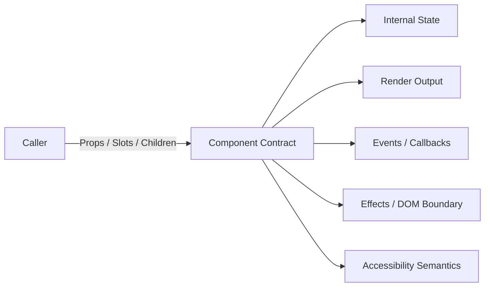
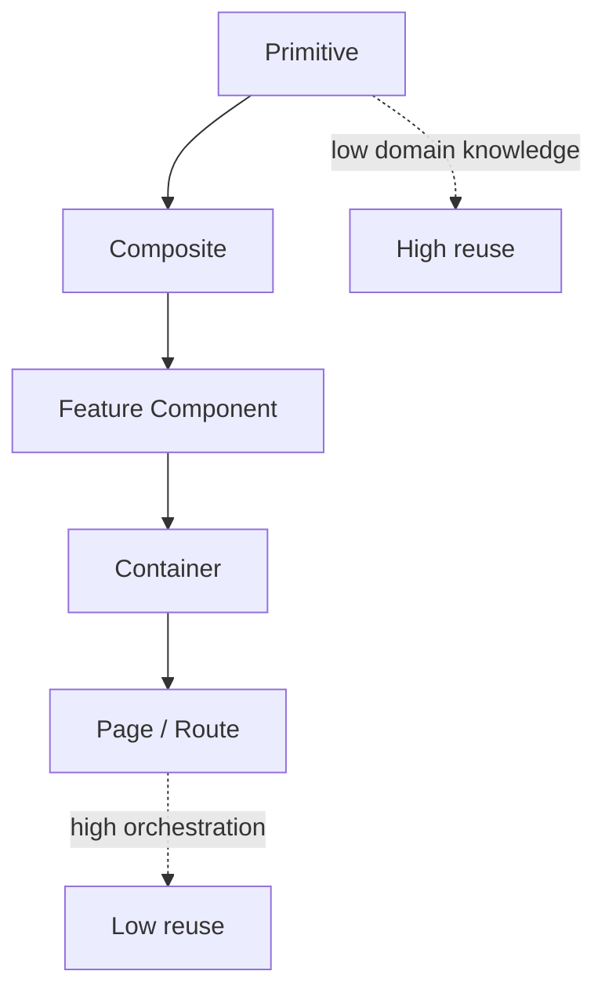
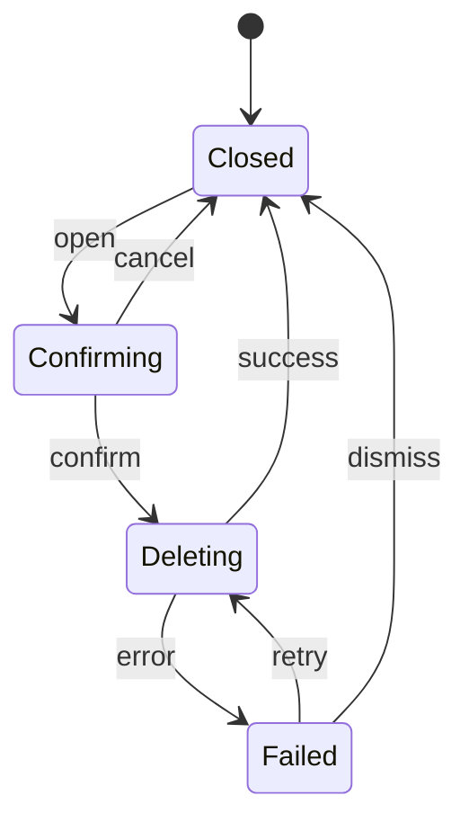

# Part 012 — Component Architecture at Scale

Component architecture sering direduksi menjadi folder structure, naming convention, atau pilihan framework. Itu terlalu dangkal.

Dalam sistem frontend besar, component adalah **unit kontrak**. Ia bukan sekadar file UI. Component mengatur:

1. data apa yang boleh masuk;
2. event apa yang boleh keluar;
3. state apa yang dimiliki;
4. behavior apa yang dijamin;
5. accessibility contract apa yang harus dipenuhi;
6. styling/theming boundary;
7. performance boundary;
8. testing boundary;
9. migration compatibility.

Part ini membahas component architecture sebagai engineering discipline, bukan sebagai estetika folder.

Targetnya: Anda bisa mendesain component yang stabil, composable, testable, accessible, dan tahan terhadap pertumbuhan fitur.

---

## 1. Target Skill

Setelah menyelesaikan part ini, Anda harus mampu:

1. membedakan primitive, composite, container, feature component, dan page component;
2. mendesain props sebagai public API, bukan parameter bebas;
3. menentukan state ownership: local, lifted, controlled, uncontrolled, server-owned, atau URL-owned;
4. menggunakan composition untuk extension tanpa inheritance dan tanpa prop explosion;
5. membangun headless component dan design-system primitive;
6. mengisolasi effect dan imperative integration;
7. menjaga component tetap accessible;
8. menghindari component yang berubah menjadi “god component”;
9. membuat checklist review component architecture.

Ini adalah skill penting karena semakin besar aplikasi, semakin mahal perubahan pada component contract.

---

## 2. Mental Model: Component sebagai Protocol

Component bukan hanya function yang mengembalikan markup.

Component adalah protocol antara caller dan implementation.



Protocol yang baik menjawab:

- Apa input yang valid?
- Apa output/event yang bisa terjadi?
- Apa yang component miliki sendiri?
- Apa yang caller kontrol?
- Apa yang tidak dijamin?
- Apa invariant-nya?
- Bagaimana component berevolusi tanpa breaking change?

Kalau component tidak punya protocol jelas, caller akan bergantung pada detail internal. Setelah itu refactor menjadi mahal.

---

## 3. Decomposition ala Kaufman

Skill component architecture bisa dipecah menjadi delapan sub-skill:

| Sub-skill | Pertanyaan | Latihan |
|---|---|---|
| Taxonomy | Component ini jenis apa? | Klasifikasi 30 component di codebase |
| Contract design | Props/events apa yang public? | Tulis API doc pendek |
| State ownership | Siapa owner state? | Buat ownership matrix |
| Composition | Bagaimana caller extend behavior? | Refactor prop explosion |
| Accessibility | Semantics apa yang dijamin? | Keyboard/focus test |
| Performance boundary | Apa yang menyebabkan rerender? | Profile update path |
| Styling boundary | Apa yang boleh ditheme? | Tokenize variant |
| Evolution | Bagaimana migrasi tanpa breaking? | Buat deprecation plan |

Framework dapat berubah, tetapi sub-skill ini tetap relevan.

---

## 4. Taxonomy Component

Tidak semua component punya tanggung jawab yang sama.

### 4.1 Primitive Component

Primitive adalah wrapper tipis di atas elemen platform atau behavior fundamental.

Contoh:

- `Button`;
- `TextField`;
- `Checkbox`;
- `Dialog`;
- `Tooltip`;
- `Tabs`;
- `Select`;
- `VisuallyHidden`.

Ciri:

- reusable lintas fitur;
- accessibility contract kuat;
- styling tokenized;
- API stabil;
- minim domain knowledge.

Primitive tidak boleh tahu konsep bisnis seperti `caseStatus`, `invoiceApproval`, atau `tenantPolicy`.

### 4.2 Composite Component

Composite menyusun primitive menjadi pola UI yang lebih kaya.

Contoh:

- `SearchBox`;
- `FilterPanel`;
- `DataTable`;
- `DateRangePicker`;
- `CommandPalette`;
- `UserPicker`.

Composite boleh punya behavior kompleks, tetapi sebaiknya tetap domain-light.

### 4.3 Feature Component

Feature component mengandung domain behavior.

Contoh:

- `CaseTransitionPanel`;
- `RegulatoryActionTimeline`;
- `EscalationRuleEditor`;
- `ViolationSummaryCard`.

Feature component boleh tahu domain model, permissions, workflow, dan policy.

### 4.4 Container Component

Container menghubungkan UI dengan data, routing, permission, atau effect.

Contoh:

```tsx
function CaseTransitionPanelContainer({ caseId }: { caseId: string }) {
  const caseQuery = useCase(caseId);
  const transitionMutation = useTransitionCase();
  const permissions = useCurrentUserPermissions();

  return (
    <CaseTransitionPanel
      caseRecord={caseQuery.data}
      permissions={permissions}
      onTransition={transitionMutation.mutate}
    />
  );
}
```

Container bukan anti-pattern. Ia berguna jika memisahkan **data/effect boundary** dari presentational/domain view.

### 4.5 Page / Route Component

Page component mengatur layout-level orchestration:

- membaca route params;
- menentukan page shell;
- menginisiasi query utama;
- mengatur document title;
- menghubungkan error boundary;
- mengatur loading dan empty state level halaman.

Page component tidak ideal untuk detail rendering kecil.

---

## 5. Component Responsibility Gradient



Semakin ke bawah:

- domain knowledge naik;
- reuse lintas fitur turun;
- dependency ke routing/data naik;
- stability requirement berbeda.

Kesalahan umum adalah memaksa semua component menjadi reusable. Tidak semua perlu reusable. Yang penting adalah **boundary jelas**.

---

## 6. Props sebagai Public API

Props adalah kontrak publik. Desain props seperti mendesain API library.

Bad:

```tsx
<Button
  blue
  large
  rounded
  withIcon
  iconLeft
  submit
  disabledWhenLoading
  adminOnly
/>
```

Masalah:

- boolean explosion;
- kombinasi invalid;
- styling dan behavior bercampur;
- domain concern masuk ke primitive;
- sulit evolve.

Better:

```tsx
type ButtonVariant = "primary" | "secondary" | "danger" | "ghost";
type ButtonSize = "sm" | "md" | "lg";

type ButtonProps = {
  variant?: ButtonVariant;
  size?: ButtonSize;
  disabled?: boolean;
  loading?: boolean;
  leadingIcon?: ReactNode;
  trailingIcon?: ReactNode;
  children: ReactNode;
  onClick?: () => void;
};
```

Lebih baik lagi, pisahkan domain:

```tsx
<DeleteCaseButton caseId={caseId} />
```

`DeleteCaseButton` boleh memakai `Button variant="danger"`, tetapi `Button` tidak boleh tahu konsep `case`.

---

## 7. Boolean Props dan Invalid State

Boolean props sering menciptakan state-space yang tidak disengaja.

```tsx
<Alert success warning error info />
```

Empat boolean menghasilkan 16 kombinasi, padahal mungkin hanya 4 valid.

Better:

```tsx
type AlertTone = "success" | "warning" | "error" | "info";

<Alert tone="error" />
```

Rule:

> Jika pilihan bersifat mutually exclusive, gunakan union, bukan banyak boolean.

Contoh TypeScript:

```ts
type AlertProps = {
  tone: "success" | "warning" | "error" | "info";
  title: string;
  children?: ReactNode;
};
```

Untuk state lebih kompleks, gunakan discriminated union:

```ts
type AsyncPanelProps<T> =
  | { state: "loading"; title?: string }
  | { state: "empty"; message: string }
  | { state: "error"; error: Error; onRetry?: () => void }
  | { state: "success"; data: T; children: (data: T) => ReactNode };
```

Ini menghapus kombinasi invalid seperti `loading=true` dan `error` sekaligus.

---

## 8. Controlled vs Uncontrolled Component

Ini salah satu keputusan arsitektur paling penting.

### 8.1 Uncontrolled

Component memiliki state internal.

```tsx
<Tabs defaultValue="overview">
  <TabsList />
  <TabsPanel value="overview" />
  <TabsPanel value="history" />
</Tabs>
```

Cocok bila:

- state hanya relevan untuk component itu;
- caller tidak perlu sinkronisasi;
- interaksi sederhana;
- URL tidak perlu mencerminkan state.

### 8.2 Controlled

Caller memiliki state.

```tsx
<Tabs value={activeTab} onValueChange={setActiveTab}>
  <TabsList />
  <TabsPanel value="overview" />
  <TabsPanel value="history" />
</Tabs>
```

Cocok bila:

- state harus disimpan di URL;
- parent perlu validasi;
- beberapa component harus sinkron;
- state memengaruhi fetch;
- state perlu di-reset dari luar.

### 8.3 Dual Mode

Banyak design-system component mendukung keduanya.

```ts
type TabsProps = {
  value?: string;
  defaultValue?: string;
  onValueChange?: (value: string) => void;
};
```

Invariant:

1. Jika `value` diberikan, component controlled.
2. Jika tidak, component uncontrolled dan memakai `defaultValue`.
3. Jangan berubah dari uncontrolled ke controlled selama lifecycle tanpa alasan eksplisit.
4. `defaultValue` hanya initial value, bukan source of truth setelah mount.

Simplified implementation:

```ts
function useControllableState<T>({
  value,
  defaultValue,
  onChange
}: {
  value?: T;
  defaultValue: T;
  onChange?: (value: T) => void;
}) {
  const [internalValue, setInternalValue] = useState(defaultValue);
  const isControlled = value !== undefined;
  const currentValue = isControlled ? value : internalValue;

  function setValue(next: T) {
    if (!isControlled) {
      setInternalValue(next);
    }
    onChange?.(next);
  }

  return [currentValue, setValue] as const;
}
```

Catatan: implementation production perlu warning untuk controlled/uncontrolled switch.

---

## 9. State Ownership Matrix

Gunakan matrix ini sebelum membuat component.

| State | Owner Ideal | Contoh |
|---|---|---|
| Hover state | Component | row hover, tooltip hover |
| Focus state | Component/platform | active element, focus ring |
| Open/closed modal | Parent or local | tergantung orchestration |
| Active tab | Local or URL | local tabs vs route tab |
| Form input | Form component | sebelum submit |
| Submitted form data | Feature/domain | setelah valid |
| Query filters | URL or feature state | shareable dashboard |
| Auth user | Session provider | global scoped |
| Server data | Query/cache layer | users, cases, reports |
| Workflow transition | Domain reducer/service | case status machine |
| Theme | Design system provider | light/dark, density |
| Toast queue | App shell service | cross-feature notification |

Rule:

> Letakkan state di owner paling sempit yang masih memenuhi kebutuhan sinkronisasi.

Jangan lift state hanya karena mungkin nanti dibutuhkan. Tetapi jangan biarkan local state bila requirement sudah jelas membutuhkan URL, parent coordination, atau server mutation.

---

## 10. Composition over Configuration Explosion

Component sering membengkak karena mencoba melayani semua variasi lewat props.

Bad:

```tsx
<Card
  title="Case Summary"
  subtitle="High risk"
  showFooter
  footerButtonText="Resolve"
  footerButtonDisabled={false}
  showMenu
  menuItems={items}
  showBadge
  badgeTone="danger"
/>
```

Better composition:

```tsx
<Card>
  <CardHeader>
    <CardTitle>Case Summary</CardTitle>
    <CardDescription>High risk</CardDescription>
    <RiskBadge tone="danger">High</RiskBadge>
  </CardHeader>

  <CardContent>
    <CaseSummary caseRecord={caseRecord} />
  </CardContent>

  <CardFooter>
    <Button variant="primary">Resolve</Button>
  </CardFooter>
</Card>
```

Keuntungan:

- API lebih kecil;
- caller bisa menyusun layout;
- component tidak tahu semua use case;
- extension tidak selalu butuh perubahan component;
- visual hierarchy lebih eksplisit.

---

## 11. Slot, Children, Render Prop, dan Compound Component

Pola composition punya beberapa bentuk.

### 11.1 Children Composition

```tsx
<Panel>
  <PanelHeader>Audit Trail</PanelHeader>
  <PanelBody>
    <AuditTimeline events={events} />
  </PanelBody>
</Panel>
```

Cocok untuk layout composition.

### 11.2 Named Slots via Props

```tsx
<Layout
  sidebar={<Sidebar />}
  header={<Header />}
  content={<CaseList />}
/>
```

Cocok jika region harus eksplisit.

### 11.3 Render Props

```tsx
<DataLoader query={query}>
  {state => {
    if (state.status === "loading") return <Spinner />;
    if (state.status === "error") return <ErrorView error={state.error} />;
    return <CaseTable rows={state.data} />;
  }}
</DataLoader>
```

Cocok saat component mengontrol state/behavior tetapi caller mengontrol rendering.

### 11.4 Compound Component

```tsx
<Tabs defaultValue="overview">
  <Tabs.List>
    <Tabs.Trigger value="overview">Overview</Tabs.Trigger>
    <Tabs.Trigger value="history">History</Tabs.Trigger>
  </Tabs.List>
  <Tabs.Content value="overview">...</Tabs.Content>
  <Tabs.Content value="history">...</Tabs.Content>
</Tabs>
```

Cocok untuk UI dengan bagian-bagian yang saling berkoordinasi.

Risiko compound component:

- context terlalu luas;
- nesting constraint tidak terdokumentasi;
- error message buruk;
- sulit tree-shaking jika API terlalu besar;
- accessibility rusak jika caller menyusun bagian tidak valid.

---

## 12. Headless Component

Headless component menyediakan behavior tanpa styling final.

Contoh `useDisclosure`:

```ts
function useDisclosure(defaultOpen = false) {
  const [open, setOpen] = useState(defaultOpen);

  return {
    open,
    setOpen,
    toggle: () => setOpen(value => !value),
    close: () => setOpen(false),
    openDisclosure: () => setOpen(true)
  };
}
```

Pemakaian:

```tsx
function HelpPanel() {
  const disclosure = useDisclosure(false);

  return (
    <section>
      <button onClick={disclosure.toggle} aria-expanded={disclosure.open}>
        Help
      </button>

      {disclosure.open && (
        <div>
          Documentation content
        </div>
      )}
    </section>
  );
}
```

Headless component cocok untuk:

- design system multi-brand;
- behavior reusable;
- accessibility logic kompleks;
- styling bebas.

Tetapi headless bukan berarti caller bebas merusak semantic. Headless primitive harus tetap memberi props/helper yang mendorong markup benar.

---

## 13. Accessibility Contract

Komponen UI production harus punya accessibility contract.

Contoh `Dialog` harus menjamin:

1. focus masuk ke dialog saat terbuka;
2. focus kembali ke trigger saat tertutup;
3. background inert atau tidak reachable;
4. `Escape` menutup jika policy mengizinkan;
5. screen reader mendapat role/name yang benar;
6. tab navigation terperangkap dalam dialog;
7. scroll behavior tidak merusak layout;
8. nested dialog punya aturan eksplisit.

API buruk:

```tsx
<Modal title="Delete case" closeOnEsc={false} noFocusTrap customRole="main" />
```

API seperti ini membuka peluang caller merusak accessibility.

Better:

```tsx
<Dialog open={open} onOpenChange={setOpen} modal>
  <Dialog.Trigger asChild>
    <Button>Delete case</Button>
  </Dialog.Trigger>
  <Dialog.Content aria-describedby="delete-case-description">
    <Dialog.Title>Delete case</Dialog.Title>
    <Dialog.Description id="delete-case-description">
      This action cannot be undone.
    </Dialog.Description>
    <Dialog.Actions>
      <Button variant="secondary">Cancel</Button>
      <Button variant="danger">Delete</Button>
    </Dialog.Actions>
  </Dialog.Content>
</Dialog>
```

Accessibility tidak boleh menjadi “optional enhancement”. Ia bagian dari contract.

---

## 14. Styling Boundary

Styling boundary menjawab:

- siapa boleh mengubah spacing?;
- siapa boleh mengubah color?;
- apakah variant terbatas?;
- apakah caller boleh override class?;
- apakah layout internal stabil?;
- token mana yang public?;
- apakah responsive behavior milik component atau parent?

Bad:

```tsx
<Button className="bg-blue-500 px-9 text-xs rounded-none shadow-xl" />
```

Jika semua caller bebas override, design system kehilangan kendali.

Better:

```tsx
<Button variant="primary" size="sm" density="compact" />
```

Namun terlalu restriktif juga buruk. Untuk component layout, escape hatch mungkin perlu:

```tsx
<Card className="col-span-2" />
```

Rule praktis:

| Component Type | Styling Flexibility |
|---|---|
| Primitive | variant/token terbatas |
| Layout primitive | class/layout override lebih wajar |
| Feature component | styling internal lebih tertutup |
| Page component | bebas mengatur composition |

---

## 15. Design-System Primitive

Design-system primitive harus stabil karena banyak caller bergantung padanya.

Primitive yang baik punya:

1. semantic HTML benar;
2. accessible default;
3. predictable variants;
4. stable prop names;
5. token-based styling;
6. controlled/uncontrolled pattern bila relevan;
7. composability escape hatch;
8. test coverage keyboard/focus;
9. migration path untuk breaking changes.

Contoh `Button` invariant:

- menggunakan `<button>` kecuali explicit `asChild`/link pattern;
- `disabled` benar-benar non-interactive;
- `loading` tidak menghilangkan accessible name;
- `type` default aman, misalnya `button`, bukan selalu `submit`;
- icon-only button wajib punya accessible label;
- focus ring tidak boleh dihapus.

```tsx
type ButtonProps = {
  variant?: "primary" | "secondary" | "danger" | "ghost";
  size?: "sm" | "md" | "lg";
  loading?: boolean;
  disabled?: boolean;
  children: ReactNode;
  type?: "button" | "submit" | "reset";
  onClick?: () => void;
};
```

---

## 16. Component Contract dengan TypeScript

TypeScript bukan hanya untuk autocomplete. Ia bisa mengekspresikan contract.

### 16.1 Mutually Exclusive Props

```ts
type LinkButtonProps = {
  href: string;
  onClick?: never;
};

type ActionButtonProps = {
  onClick: () => void;
  href?: never;
};

type ButtonProps = BaseButtonProps & (LinkButtonProps | ActionButtonProps);
```

Ini mencegah caller memberi `href` dan `onClick` bersamaan jika desain tidak mengizinkan.

### 16.2 Required Prop Berdasarkan Variant

```ts
type ToastProps =
  | { tone: "success"; message: string; action?: never }
  | { tone: "error"; message: string; action: { label: string; onClick: () => void } }
  | { tone: "info"; message: string; action?: { label: string; onClick: () => void } };
```

Error toast bisa dipaksa punya action retry/dismiss.

### 16.3 Generic Component

```ts
type SelectProps<TOption> = {
  options: TOption[];
  value: TOption | null;
  getOptionLabel: (option: TOption) => string;
  getOptionKey: (option: TOption) => string;
  onChange: (option: TOption | null) => void;
};
```

Generic berguna, tetapi jangan over-engineer. Kalau domain jelas, domain-specific component bisa lebih readable.

---

## 17. Domain Component vs Generic Component

Generic component sering terlihat elegan, tetapi bisa membuat API rumit.

Generic:

```tsx
<DataTable
  rows={cases}
  columns={columns}
  getRowId={row => row.id}
  onRowClick={row => navigate(`/cases/${row.id}`)}
/>
```

Domain-specific:

```tsx
<CaseTable
  cases={cases}
  onOpenCase={caseId => navigate(`/cases/${caseId}`)}
/>
```

Gunakan generic jika:

- pola benar-benar lintas domain;
- API bisa stabil;
- team siap menjaga abstraction;
- behavior table memang reusable.

Gunakan domain-specific jika:

- logic domain kuat;
- generic API membuat caller menulis glue code berulang;
- permission/workflow memengaruhi rendering;
- product iteration cepat.

Rule:

> Reusability yang dipaksakan sering lebih mahal daripada duplication kecil yang jelas.

---

## 18. Container / Presentational Split yang Modern

Dulu split container/presentational sering dipakai secara mekanis. Saat ini lebih baik melihatnya sebagai **boundary effect**.

Presentational component:

- menerima data siap pakai;
- pure-ish;
- mudah storybook/test;
- tidak fetch langsung;
- tidak tahu route kecuali memang route component.

Container:

- fetch data;
- baca route;
- baca session/permission;
- handle mutation;
- adapt server model ke view model;
- menghubungkan observability/error boundary.

Contoh:

```tsx
function CaseSummaryContainer({ caseId }: { caseId: string }) {
  const caseQuery = useCaseQuery(caseId);

  if (caseQuery.status === "loading") return <CaseSummarySkeleton />;
  if (caseQuery.status === "error") return <CaseSummaryError error={caseQuery.error} />;

  return <CaseSummary caseRecord={caseQuery.data} />;
}
```

`CaseSummary` lebih mudah diuji karena tidak butuh network.

---

## 19. Component and State Machines

Untuk component dengan workflow, state machine sering lebih baik daripada boolean flags.

Contoh confirmation dialog:

```ts
type DeleteDialogState =
  | { tag: "closed" }
  | { tag: "confirming" }
  | { tag: "deleting" }
  | { tag: "failed"; error: Error };
```

Transitions:



Render:

```tsx
function DeleteCaseDialog({ state }: { state: DeleteDialogState }) {
  switch (state.tag) {
    case "closed":
      return null;
    case "confirming":
      return <ConfirmDeleteContent />;
    case "deleting":
      return <DeletingContent />;
    case "failed":
      return <DeleteFailedContent error={state.error} />;
  }
}
```

Keuntungan:

- invalid state hilang;
- testing transition mudah;
- UI sesuai lifecycle;
- loading/error/success tidak tumpang tindih.

---

## 20. Effect Boundary di Component

Component sering menjadi tempat effect bocor.

Bad:

```tsx
function UserCard({ user }: { user: User }) {
  localStorage.setItem("lastUser", user.id);
  return <article>{user.name}</article>;
}
```

Effect terjadi saat render. Ini buruk.

Better:

```tsx
function UserCard({ user }: { user: User }) {
  useEffect(() => {
    localStorage.setItem("lastUser", user.id);
  }, [user.id]);

  return <article>{user.name}</article>;
}
```

Tapi pertanyaan architecture-nya:

> Apakah `UserCard` memang owner effect `lastUser`, atau effect ini milik page/session layer?

Seringnya, primitive/composite component tidak boleh melakukan effect domain. Effect domain sebaiknya di feature/container/page layer.

---

## 21. Imperative Integration Boundary

Beberapa library tidak deklaratif:

- map;
- chart;
- code editor;
- rich text editor;
- video player;
- third-party widget;
- drag-and-drop engine.

Jangan biarkan imperative API menyebar ke banyak component.

Buat adapter:

```tsx
function ChartView({ data, options }: ChartViewProps) {
  const containerRef = useRef<HTMLDivElement | null>(null);
  const chartRef = useRef<ChartInstance | null>(null);

  useEffect(() => {
    if (!containerRef.current) return;

    chartRef.current = createChart(containerRef.current, options);

    return () => {
      chartRef.current?.destroy();
      chartRef.current = null;
    };
  }, []);

  useEffect(() => {
    chartRef.current?.setData(data);
  }, [data]);

  return <div ref={containerRef} />;
}
```

Invariant:

1. create sekali bila possible;
2. update via imperative method;
3. cleanup saat unmount;
4. jangan recreate instance untuk setiap render;
5. jangan expose raw instance kecuali perlu;
6. handle resize/visibility explicitly.

---

## 22. Performance Boundary

Component architecture memengaruhi performance.

Pertanyaan review:

1. State change ini menyebabkan component apa saja render?
2. Apakah expensive component menerima props yang identity-nya berubah terus?
3. Apakah context terlalu luas?
4. Apakah list item punya key stabil?
5. Apakah derived data dihitung per item tanpa memo?
6. Apakah component membaca global store terlalu besar?
7. Apakah callback identity menyebabkan child update?
8. Apakah component melakukan layout measurement saat render?

Bad:

```tsx
<ExpensiveTable
  rows={rows.map(enrichRow)}
  onRowClick={(row) => openRow(row.id)}
/>
```

Setiap render menghasilkan array dan function baru.

Better, bila memang bottleneck terbukti:

```tsx
const enrichedRows = useMemo(() => rows.map(enrichRow), [rows]);
const handleRowClick = useCallback((row: Row) => {
  openRow(row.id);
}, [openRow]);

<ExpensiveTable rows={enrichedRows} onRowClick={handleRowClick} />
```

Namun jangan jadikan memoization default membabi buta. Ukur dulu. Memoization juga punya cost dan complexity.

---

## 23. Context Boundary

Context berguna untuk data yang dibutuhkan banyak descendant. Tetapi context yang terlalu luas bisa membuat banyak consumer update.

Bad:

```tsx
<AppContext.Provider value={{ user, theme, permissions, filters, modalState, tableState }}>
  {children}
</AppContext.Provider>
```

Masalah:

- semua concern bercampur;
- value object berubah sering;
- consumer sulit tahu dependency;
- testing lebih berat;
- feature coupling.

Better:

```tsx
<SessionProvider>
  <ThemeProvider>
    <PermissionProvider>
      <RouterProvider>
        {children}
      </RouterProvider>
    </PermissionProvider>
  </ThemeProvider>
</SessionProvider>
```

Atau lebih baik lagi, scope provider di feature boundary bila tidak global.

Rule:

> Context sebaiknya merepresentasikan stable cross-cutting concern, bukan tempat menaruh semua state.

---

## 24. Error Boundary dan Component Fault Isolation

Component besar harus punya fault isolation.

Level umum:

| Boundary | Error Handling |
|---|---|
| App shell | fatal fallback |
| Route | page-level error |
| Widget | local fallback |
| Async resource | loading/error/empty state |
| Form field | validation error |

Jangan satu error kecil menjatuhkan seluruh aplikasi jika bisa diisolasi.

Contoh:

```tsx
<RouteErrorBoundary>
  <CaseDetailPage />
</RouteErrorBoundary>
```

Untuk widget opsional:

```tsx
<WidgetErrorBoundary fallback={<TimelineUnavailable />}>
  <AuditTimeline caseId={caseId} />
</WidgetErrorBoundary>
```

Architecture principle:

> Error boundary harus mengikuti user impact boundary.

Jika timeline gagal, user mungkin masih bisa melihat case summary.

---

## 25. Loading, Empty, and Error as First-Class UI

Component production harus mendesain empat state minimal:

1. loading;
2. empty;
3. error;
4. success.

Bad:

```tsx
return <CaseTable rows={data ?? []} />;
```

Ini menyamakan loading, empty, error, dan missing data.

Better:

```tsx
switch (state.tag) {
  case "loading":
    return <CaseTableSkeleton />;
  case "empty":
    return <EmptyState message="No cases found." />;
  case "error":
    return <ErrorState error={state.error} onRetry={retry} />;
  case "success":
    return <CaseTable rows={state.data} />;
}
```

Loading/error bukan detail tambahan. Ia bagian dari component contract.

---

## 26. API Evolution dan Backward Compatibility

Component primitive sering dipakai ratusan kali. Breaking change mahal.

Strategi evolution:

1. tambah prop baru tanpa mengubah behavior lama;
2. tandai prop lama deprecated;
3. buat codemod bila perubahan besar;
4. dokumentasikan migration;
5. tambah runtime warning hanya di development;
6. rilis major version untuk breaking change;
7. ukur usage sebelum menghapus API.

Contoh deprecation:

```tsx
// old
<Button intent="critical" />

// new
<Button variant="danger" />
```

Migration plan:

```txt
v1.8: support both intent and variant, warn if intent is used
v1.9: codemod available
v2.0: remove intent
```

---

## 27. Documentation sebagai Contract Surface

Untuk component reusable, dokumentasi minimal harus berisi:

1. purpose;
2. usage examples;
3. props table;
4. controlled/uncontrolled behavior;
5. accessibility notes;
6. keyboard interaction;
7. composition rules;
8. anti-patterns;
9. migration notes;
10. testing guidance.

Contoh pendek:

```mdx
## Button

Use Button for actions that trigger immediate behavior.
Use Link for navigation.

### Accessibility

- Icon-only buttons must provide aria-label.
- Loading buttons preserve accessible name.
- Default type is button to avoid accidental form submission.

### Do not

- Do not use Button for navigation unless rendered as a link.
- Do not remove focus outline.
```

Dokumentasi yang baik mengurangi interpretasi liar.

---

## 28. Component Testing Strategy

Testing component harus mengikuti contract, bukan implementation detail.

### 28.1 Primitive Tests

Untuk primitive:

- renders correct semantic element;
- handles disabled/loading;
- keyboard interaction;
- focus behavior;
- accessible name;
- variant snapshot terbatas;
- regression untuk bug historis.

### 28.2 Composite Tests

Untuk composite:

- interaction flow;
- controlled/uncontrolled behavior;
- event callback;
- invalid input;
- empty state;
- error state.

### 28.3 Feature Component Tests

Untuk feature:

- permission matrix;
- workflow state;
- server mutation success/error;
- optimistic update;
- rollback;
- route/URL integration bila relevan.

Testing principle:

> Test what the user and caller can observe, not internal state variable names.

---

## 29. Storybook / Component Catalog Discipline

Component catalog bukan hanya showcase. Ia adalah environment untuk:

- visual review;
- accessibility review;
- interaction testing;
- design QA;
- edge case inventory;
- regression capture;
- documentation.

Minimal stories:

1. default;
2. all variants;
3. disabled/loading;
4. long content;
5. empty state;
6. error state;
7. RTL bila relevant;
8. keyboard/focus case;
9. high contrast/dark mode;
10. responsive layout.

Kalau component tidak bisa dibuat story tanpa seluruh aplikasi, kemungkinan boundary-nya terlalu berat.

---

## 30. Anti-Patterns

### 30.1 God Component

Gejala:

- file sangat besar;
- banyak `useEffect`;
- banyak boolean flags;
- fetch, render, permission, analytics, dan form logic bercampur;
- sulit test;
- perubahan kecil sering memicu regression.

Perbaikan:

- ekstrak state machine;
- ekstrak presentational view;
- ekstrak container;
- ekstrak primitive;
- ekstrak domain service;
- buat boundary error/loading.

### 30.2 Prop Drilling Blindly

Prop drilling tidak selalu buruk. Ia buruk bila data melewati banyak layer yang tidak peduli.

Perbaikan:

- composition;
- scoped context;
- feature provider;
- slot/render prop;
- colocate state.

### 30.3 Context Everything

Mengganti semua prop drilling dengan context akan membuat dependency tersembunyi.

Context harus dipakai untuk concern yang benar-benar contextual.

### 30.4 Reusable Too Early

Membuat component generic sebelum melihat variasi nyata sering menghasilkan abstraction salah.

Rule:

> Tunggu minimal dua atau tiga use case nyata sebelum menggeneralisasi, kecuali primitive design-system yang memang strategis.

### 30.5 Styling Escape Hatch Everywhere

Jika setiap component punya `className` yang bebas override internal, consistency hilang.

Escape hatch harus sadar risiko.

### 30.6 Domain Leakage into Primitive

```tsx
<Button requireAdminPermission caseStatus="open" />
```

Primitive tidak boleh tahu domain.

---

## 31. Architecture Review Checklist

Gunakan checklist ini saat review component baru:

```txt
[ ] Component taxonomy jelas: primitive, composite, feature, container, atau page.
[ ] Props merepresentasikan public API yang stabil.
[ ] Tidak ada boolean explosion untuk mutually exclusive state.
[ ] State ownership sudah dijelaskan.
[ ] Controlled/uncontrolled behavior konsisten.
[ ] Derived data tidak disimpan sebagai state internal tanpa alasan.
[ ] Effect berada di layer yang tepat.
[ ] Accessibility contract eksplisit.
[ ] Keyboard/focus behavior dipikirkan.
[ ] Styling boundary jelas.
[ ] Component tidak mengambil domain concern yang bukan miliknya.
[ ] Error/loading/empty state menjadi first-class.
[ ] Performance update path wajar.
[ ] Context tidak terlalu luas.
[ ] Imperative integration punya cleanup.
[ ] Test mencakup observable behavior.
[ ] Story mencakup edge cases.
[ ] Migration/evolution dipikirkan jika reusable luas.
```

---

## 32. Case Study — Case Transition Panel

Misalkan kita membangun component untuk regulatory case management.

Requirement:

1. menampilkan status case;
2. menampilkan allowed transitions berdasarkan role dan current status;
3. beberapa transition butuh reason;
4. beberapa transition butuh confirmation;
5. mutation optimistic tetapi rollback bila gagal;
6. audit trail refresh setelah transition;
7. tombol disabled saat mutation berjalan;
8. error harus lokal, tidak menjatuhkan page.

### 32.1 Bad Shape

```tsx
function CaseTransitionPanel({ caseRecord, user }) {
  const [loading, setLoading] = useState(false);
  const [error, setError] = useState(null);
  const [showConfirm, setShowConfirm] = useState(false);
  const [selectedAction, setSelectedAction] = useState(null);
  const [reason, setReason] = useState("");

  // permission logic, transition logic, mutation, rendering, analytics all here
}
```

Masalah:

- logic domain dan UI bercampur;
- state flags bisa invalid;
- sulit test permission matrix;
- mutation lifecycle tidak eksplisit;
- confirmation flow tersembunyi.

### 32.2 Better Shape

Domain logic:

```ts
type TransitionIntent = {
  id: string;
  label: string;
  targetStatus: CaseStatus;
  requiresReason: boolean;
  requiresConfirmation: boolean;
};

function getAllowedTransitions(caseRecord: CaseRecord, actor: Actor): TransitionIntent[] {
  // pure domain logic
  return [];
}
```

UI state:

```ts
type TransitionPanelState =
  | { tag: "idle" }
  | { tag: "collectingReason"; intent: TransitionIntent; reason: string }
  | { tag: "confirming"; intent: TransitionIntent; reason?: string }
  | { tag: "submitting"; intent: TransitionIntent; reason?: string }
  | { tag: "failed"; intent: TransitionIntent; reason?: string; error: Error };
```

Component split:

```tsx
<CaseTransitionPanelContainer caseId={caseId} />
```

```tsx
<CaseTransitionPanel
  caseRecord={caseRecord}
  allowedTransitions={allowedTransitions}
  state={panelState}
  onIntentSelected={selectIntent}
  onReasonChanged={changeReason}
  onConfirm={submitTransition}
  onCancel={cancelTransition}
  onRetry={retryTransition}
/>
```

Keuntungan:

- domain transition pure;
- UI state explicit;
- container owns server mutation;
- presentational component testable;
- failure state lokal;
- audit refresh di container/cache layer.

---

## 33. Practice Loop 1 — Refactor Prop Explosion

Ambil component dengan banyak boolean props. Refactor menjadi:

1. union props;
2. composition;
3. slot/children;
4. domain wrapper jika perlu.

Acceptance criteria:

- jumlah invalid combination turun;
- public API lebih kecil;
- call site lebih readable;
- tidak ada domain leakage ke primitive;
- test tetap lolos.

---

## 34. Practice Loop 2 — Build Tabs Primitive

Bangun `Tabs` primitive dengan requirement:

1. controlled dan uncontrolled mode;
2. keyboard navigation;
3. accessible roles/attributes;
4. disabled tab;
5. orientation horizontal/vertical;
6. `onValueChange`;
7. story untuk semua variant;
8. tests untuk focus movement.

Acceptance criteria:

- active tab state konsisten;
- focus tidak hilang;
- caller bisa kontrol state;
- uncontrolled mode tetap simpel;
- markup semantic benar.

---

## 35. Practice Loop 3 — Headless Combobox

Bangun headless combobox:

1. input controlled;
2. selected option controlled;
3. async filtering;
4. keyboard support;
5. loading/empty/error state;
6. screen reader semantics;
7. virtualization bila list besar;
8. outside click close;
9. escape closes;
10. selection emits typed value.

Ini latihan sulit karena menggabungkan reactivity, accessibility, async, dan component contract.

---

## 36. Ringkasan

Component architecture yang baik bukan soal membagi file menjadi kecil. Ukuran file bisa menjadi gejala, tetapi bukan diagnosis utama.

Prinsip utama:

1. Component adalah protocol.
2. Props adalah public API.
3. State harus punya owner paling sempit yang memenuhi kebutuhan.
4. Boolean explosion menciptakan invalid state.
5. Composition lebih scalable daripada configuration props tanpa batas.
6. Controlled/uncontrolled behavior harus eksplisit.
7. Primitive tidak boleh bocor domain concern.
8. Accessibility adalah contract, bukan tambahan.
9. Effect dan imperative integration harus punya boundary dan cleanup.
10. Design-system component perlu evolution strategy.
11. Error/loading/empty state harus first-class.
12. Reusability yang dipaksakan bisa lebih mahal daripada duplication kecil.

Part berikutnya akan membahas **frontend architecture boundaries**: bagaimana mengatur feature slicing, module ownership, dependency direction, public API, anti-corruption layer, dan mencegah architecture erosion saat codebase tumbuh.

---

## 37. Referensi

- React Docs — Creating User Interfaces from Components: https://react.dev/
- React Docs — Sharing State Between Components: https://react.dev/learn/sharing-state-between-components
- React Legacy Docs — Composition vs Inheritance: https://legacy.reactjs.org/docs/composition-vs-inheritance.html
- WAI-ARIA Authoring Practices Guide: https://www.w3.org/WAI/ARIA/apg/
- MDN Web Docs — Accessibility: https://developer.mozilla.org/en-US/docs/Web/Accessibility
- WCAG 2.2: https://www.w3.org/TR/WCAG22/
