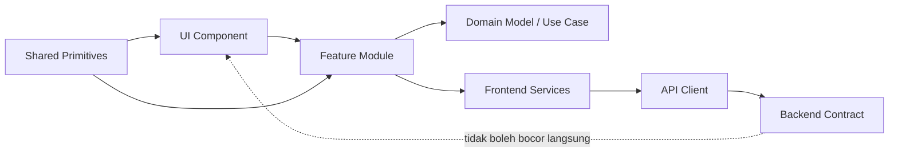
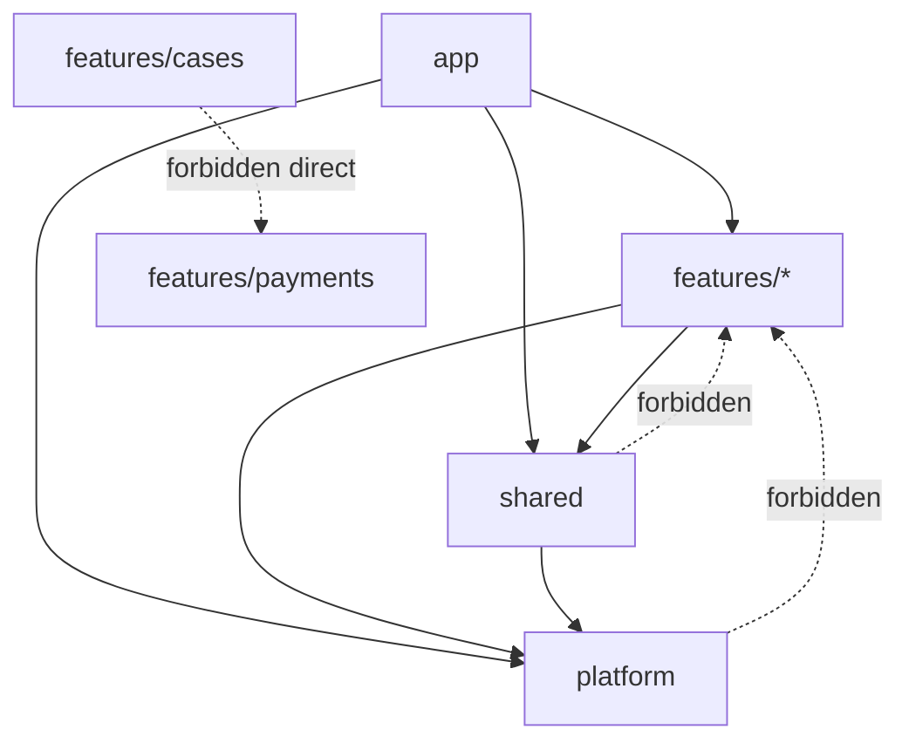
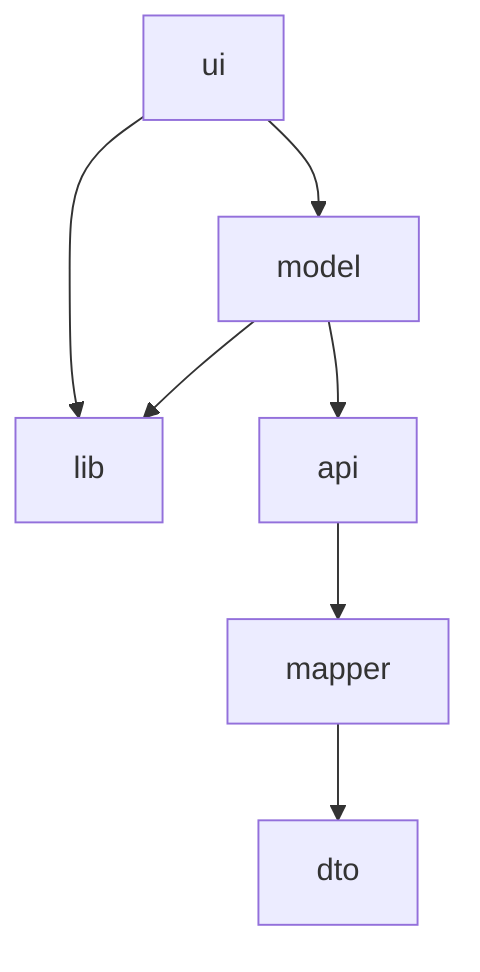
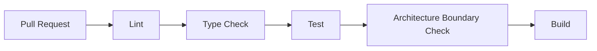
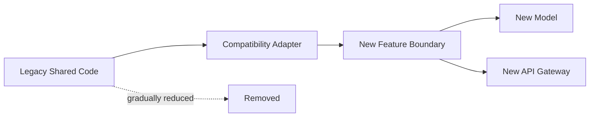
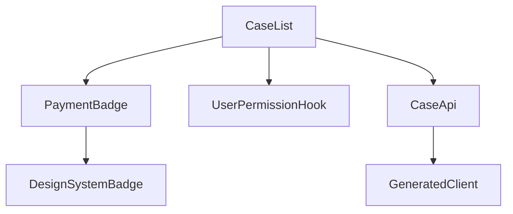

------
title: Learn Advanced JavaScript for Web / Frontend Engineering - Part 013
description: "Frontend architecture boundaries: feature slicing, dependency direction, public APIs, anti-corruption layers, governance, and architecture erosion control for large JavaScript web systems."
series: learn-javascript-frontend-advanced
seriesTitle: Learn Advanced JavaScript for Web / Frontend Engineering
order: 13
partTitle: Frontend Architecture Boundaries
tags:
- javascript
- frontend
- architecture
- boundaries
- modularity
- kaufman
- series
date: 2026-06-27
---

# Part 013 — Frontend Architecture Boundaries

> Target utama part ini: mampu mendesain frontend codebase yang tetap bisa berkembang setelah banyak fitur, banyak tim, banyak state, banyak eksperimen produk, dan banyak integrasi backend. Kita tidak sedang mencari folder structure yang terlihat rapi. Kita sedang mencari **boundary yang menahan perubahan agar tidak menyebar liar**.

Pada level basic, frontend architecture sering dipahami sebagai:

- pilih framework;
- bikin folder `components`, `pages`, `hooks`, `services`;
- pakai state management;
- buat reusable component.

Pada level production, pertanyaannya berubah:

- perubahan domain mana yang boleh mempengaruhi modul mana?
- dependency mana yang legal dan illegal?
- kontrak apa yang publik, apa yang private?
- bagaimana satu fitur bisa diubah tanpa memecahkan fitur lain?
- bagaimana menghindari codebase berubah menjadi shared-global-mutable-ui?
- bagaimana boundary tetap jelas saat tekanan delivery tinggi?

Frontend modern bukan lagi “view layer tipis”. Banyak aplikasi frontend sekarang mengandung workflow, authorization, cache, validation, rendering strategy, routing, optimistic update, offline fallback, instrumentation, dan integrasi third-party. Karena itu, frontend perlu arsitektur dengan disiplin yang sama seriusnya seperti backend.

---

## 1. Kaufman Skill Deconstruction

Mengikuti pendekatan Josh Kaufman, skill “frontend architecture boundaries” kita pecah menjadi beberapa sub-skill yang bisa dilatih secara sengaja.

| Sub-skill | Yang harus bisa dilakukan | Output yang bisa diperiksa |
|---|---|---|
| Boundary identification | Memisahkan domain, feature, shared primitive, dan integration layer | Architecture map |
| Dependency direction | Menentukan arah import yang legal | Dependency rules / lint rules |
| Public API design | Membuat modul punya surface area kecil dan stabil | `index.ts`, package exports, module contract |
| Change containment | Mendesain agar perubahan tidak menyebar | Impact analysis |
| Anti-corruption layer | Melindungi domain UI dari API/backend/external model yang buruk | Mapper, adapter, gateway |
| State ownership | Menentukan siapa pemilik state | State ownership table |
| Architecture governance | Menahan erosi arsitektur | ADR, review checklist, CI rules |
| Refactoring strategy | Memigrasikan codebase tanpa big bang rewrite | Strangler pattern / migration plan |

Skill ini berhasil kalau kamu bisa melihat pull request frontend dan menjawab:

> “Perubahan ini seharusnya berada di boundary mana, dependency-nya legal atau tidak, dan failure mode apa yang akan muncul enam bulan lagi?”

---

## 2. Mental Model: Boundary Adalah Firewall Perubahan

Boundary bukan sekadar folder. Boundary adalah **aturan tentang apa yang boleh diketahui oleh apa**.

Sebuah boundary yang baik menjawab empat pertanyaan:

1. **Ownership** — siapa pemilik logic/data/UI ini?
2. **Knowledge** — modul ini boleh tahu tentang konsep apa?
3. **Direction** — dependency boleh mengarah ke mana?
4. **Contract** — apa interface stabil yang boleh dipakai dari luar?

Diagram sederhana:



Hal penting: boundary bukan tentang “jangan ada dependency”. Software selalu punya dependency. Boundary adalah tentang **dependency yang disengaja, terlihat, dan stabil**.

---

## 3. Kenapa Folder Structure Saja Tidak Cukup

Struktur seperti ini terlihat rapi:

```text
src/
  components/
  hooks/
  pages/
  services/
  utils/
  types/
```

Namun setelah aplikasi membesar, struktur itu sering berubah menjadi bucket global:

```text
components/  -> semua orang import semua komponen
hooks/       -> semua state dan side effect bercampur
services/    -> API, analytics, auth, cache, dan business logic bercampur
types/       -> tipe global yang tidak jelas owner-nya
utils/       -> dumping ground logic
```

Masalahnya bukan pada nama folder. Masalahnya: struktur tersebut tidak menjawab ownership dan dependency direction.

Contoh kegagalan:

```ts
// features/case-management/CaseList.tsx
import { getEnforcementStatusColor } from '@/features/enforcement/utils';
import { PaymentBadge } from '@/features/payments/components/PaymentBadge';
import { useUserPermissions } from '@/features/admin/hooks/useUserPermissions';
import { normalizeCase } from '@/services/cases/normalizeCase';
```

Kode ini mungkin berjalan, tetapi architecture smell-nya kuat:

- case management tahu detail enforcement;
- case management menggunakan UI payments;
- feature import hook dari feature admin;
- normalization model API berada di `services`, bukan boundary yang jelas.

Dalam jangka pendek: cepat.

Dalam jangka panjang: setiap perubahan enforcement, payments, admin, atau API case bisa memecahkan case management.

---

## 4. Layer vs Slice: Dua Sumbu yang Berbeda

Banyak tim mencampur dua konsep:

1. **Layer** — jenis tanggung jawab teknis.
2. **Slice** — area bisnis/fitur.

Layer contoh:

```text
ui
state
data
api
routing
utils
```

Slice contoh:

```text
case-management
enforcement-actions
payments
notifications
identity
reports
```

Frontend besar biasanya membutuhkan kombinasi:

```text
src/
  app/
  shared/
  features/
    case-management/
      ui/
      model/
      api/
      lib/
      routes.tsx
      index.ts
    enforcement-actions/
      ui/
      model/
      api/
      lib/
      index.ts
```

Layer menjaga separation of concerns. Slice menjaga locality of change.

Kesalahan umum:

- hanya layer-based: semua fitur tersebar di banyak folder global;
- hanya feature-based: logic teknis berulang tanpa shared primitive;
- terlalu banyak abstraction: boundary dibuat sebelum ada tekanan perubahan yang nyata;
- terlalu sedikit boundary: semua fitur langsung import semuanya.

Rule praktis:

> Gunakan feature slice untuk domain/product capability. Gunakan layer hanya di dalam slice atau untuk shared platform primitives.

---

## 5. Taxonomy Modul Frontend

Agar architecture review objektif, kita perlu taxonomy. Setiap file/modul harus bisa diklasifikasikan.

### 5.1 App Shell

App shell adalah bootstrap aplikasi:

- router root;
- provider composition;
- global error boundary;
- auth bootstrap;
- telemetry bootstrap;
- global layout;
- feature registration.

App shell boleh mengorkestrasi, tetapi tidak boleh mengandung business logic detail.

```text
src/app/
  router.tsx
  providers.tsx
  telemetry.ts
  error-boundary.tsx
```

### 5.2 Feature Module

Feature module adalah unit product capability.

Contoh:

```text
features/case-management/
  ui/
  model/
  api/
  lib/
  routes.tsx
  index.ts
```

Feature module boleh punya:

- UI spesifik feature;
- state model;
- API adapter;
- validation rules;
- permissions mapping;
- route config;
- tests.

Feature module tidak boleh sembarangan expose semua internal file.

### 5.3 Shared UI Primitives

Shared primitive adalah komponen stabil dan domain-agnostic:

- Button;
- Dialog;
- Table primitive;
- Tooltip;
- FormField;
- DatePicker;
- Toast;
- Skeleton.

Ciri shared primitive yang baik:

- tidak tahu domain;
- tidak fetch data;
- tidak tahu route;
- tidak tahu permission bisnis;
- accessible by default;
- API relatif stabil;
- punya visual/accessibility tests.

### 5.4 Shared Domain-Agnostic Libraries

Contoh:

- date formatting wrapper;
- money formatting;
- result type;
- async state helper;
- logger;
- feature flag client;
- analytics client interface.

Jangan memasukkan business rules ke `shared/lib` hanya karena dipakai dua tempat. “Dipakai dua tempat” belum cukup untuk menjadi shared.

### 5.5 Integration Boundary

Integration boundary adalah lapisan yang berhadapan dengan sistem luar:

- REST/GraphQL/gRPC-web client;
- third-party SDK;
- analytics;
- payment provider;
- identity provider;
- browser storage;
- service worker;
- native bridge.

Integration boundary harus menerjemahkan model luar menjadi model internal.

---

## 6. Dependency Direction

Arsitektur frontend yang sehat punya dependency graph yang bisa dijelaskan.

Contoh rule:

```text
app        -> features, shared, platform
features   -> shared, platform
shared     -> platform? biasanya minimal
platform   -> tidak bergantung pada feature
```

Diagram:



Rule ini tidak harus universal, tetapi harus eksplisit.

### 6.1 Forbidden Dependency

Contoh dependency illegal:

```ts
// shared/ui/Button.tsx
import { useCurrentUserPermissions } from '@/features/auth/model';
```

Kenapa buruk?

Karena shared primitive menjadi tahu konsep business feature. Akibatnya:

- Button tidak lagi reusable;
- testing Button butuh auth context;
- perubahan auth bisa merusak shared UI;
- circular dependency lebih mudah muncul.

Solusi:

```tsx
<Button disabled={!canSubmit}>Submit</Button>
```

Permission dievaluasi di feature layer, bukan di shared primitive.

### 6.2 Feature-to-Feature Dependency

Feature-to-feature dependency perlu hati-hati.

Contoh:

```ts
import { PaymentBadge } from '@/features/payments/ui/PaymentBadge';
```

Ini mungkin acceptable kalau `PaymentBadge` memang public API dari payments feature. Namun harus lewat public export:

```ts
import { PaymentBadge } from '@/features/payments';
```

Bukan:

```ts
import { PaymentBadge } from '@/features/payments/ui/internal/PaymentBadge';
```

Public API membuat boundary terlihat.

---

## 7. Public API Modul

Dalam frontend besar, setiap feature harus punya public API.

```text
features/payments/
  ui/
    PaymentBadge.tsx
    PaymentStatusPanel.tsx
  model/
    payment-status.ts
  api/
    payment-api.ts
  index.ts
```

`index.ts`:

```ts
export { PaymentBadge } from './ui/PaymentBadge';
export type { PaymentStatus } from './model/payment-status';
```

Yang tidak diekspor berarti private.

### 7.1 Kenapa Public API Penting?

Public API:

- memperkecil coupling;
- membuat refactor internal lebih aman;
- memaksa owner berpikir tentang contract;
- mempermudah dependency analysis;
- mengurangi accidental import.

### 7.2 Jangan Mengekspor Semua

Anti-pattern:

```ts
export * from './ui';
export * from './model';
export * from './api';
export * from './lib';
```

Ini membuat semua internal menjadi public. Lebih baik eksplisit.

```ts
export { CaseSummaryCard } from './ui/CaseSummaryCard';
export { useCaseSummary } from './model/useCaseSummary';
export type { CaseSummary } from './model/case-summary';
```

Surface area kecil lebih mudah dijaga daripada surface area besar.

---

## 8. Feature Slice yang Sehat

Contoh struktur feature:

```text
features/case-management/
  api/
    case-management-gateway.ts
    case-management-dto.ts
    case-management-mapper.ts
  model/
    case.ts
    case-status.ts
    case-state-machine.ts
    case-permissions.ts
  ui/
    CaseListPage.tsx
    CaseDetailPage.tsx
    CaseStatusBadge.tsx
    CaseActionMenu.tsx
  lib/
    case-sorting.ts
    case-filtering.ts
  routes.tsx
  index.ts
```

Peran tiap folder:

| Folder | Isi | Tidak boleh berisi |
|---|---|---|
| `api` | DTO, gateway, mapper, endpoint-specific logic | UI state detail |
| `model` | domain model UI, state machine, permission mapping | JSX besar |
| `ui` | component spesifik feature | raw fetch ke backend |
| `lib` | pure helper feature | shared global dumping ground |
| `routes` | route config feature | business logic berat |
| `index` | public exports | export semua internal |

### 8.1 Feature Internal Dependency

Arah internal yang umum:



UI boleh memakai model. Model boleh memakai API jika model adalah use-case/application model. Namun untuk beberapa tim, API dipanggil dari query hooks di `model`.

Yang penting bukan nama foldernya, tetapi rule-nya konsisten.

---

## 9. Anti-Corruption Layer untuk Frontend

Backend API sering tidak ideal untuk UI:

- nama field mengikuti database;
- status terlalu teknis;
- beberapa endpoint perlu digabung;
- data nullable tanpa kontrak jelas;
- tanggal dalam format inconsistent;
- permission tidak eksplisit;
- error shape berbeda-beda;
- enum berubah tanpa koordinasi.

Kalau UI langsung memakai DTO backend, seluruh aplikasi menjadi tergantung detail backend.

Anti-corruption layer memisahkan external model dan internal model.

```ts
// api/case-dto.ts
export type CaseDto = {
  id: string;
  stat_cd: 'OPEN' | 'PND' | 'CLS';
  assigned_user_nm: string | null;
  due_dt: string | null;
};

// model/case.ts
export type Case = {
  id: CaseId;
  status: CaseStatus;
  assigneeName: string | null;
  dueDate: Date | null;
};

// api/case-mapper.ts
export function mapCaseDto(dto: CaseDto): Case {
  return {
    id: toCaseId(dto.id),
    status: mapCaseStatus(dto.stat_cd),
    assigneeName: dto.assigned_user_nm,
    dueDate: dto.due_dt ? new Date(dto.due_dt) : null,
  };
}
```

Dengan mapper, perubahan backend terkonsentrasi di satu boundary.

### 9.1 Mapper Bukan Overengineering

Mapper menjadi penting saat:

- domain penting;
- ada banyak consumer;
- data dipakai untuk workflow;
- API tidak stabil;
- naming backend buruk;
- ada permission/security implication;
- ada multi-source aggregation;
- testing perlu domain object yang jelas.

Untuk prototype kecil, mapper bisa terasa berlebihan. Untuk platform enforcement/case management, mapper biasanya wajib.

---

## 10. Boundary untuk State Ownership

State architecture sering rusak karena ownership tidak jelas.

Contoh smell:

```ts
const [selectedCase, setSelectedCase] = useState<Case | null>(null);
const [selectedCaseId, setSelectedCaseId] = useState<string | null>(null);
const [selectedCaseStatus, setSelectedCaseStatus] = useState<string | null>(null);
```

Tiga state ini mungkin bisa drift.

Pertanyaan ownership:

| State | Owner ideal | Alasan |
|---|---|---|
| `selectedCaseId` | URL/router atau parent feature | Shareable/bookmarkable |
| `selectedCase` | server-state cache | Derived dari ID |
| `selectedCaseStatus` | derived dari `selectedCase` | Jangan disimpan ganda |
| modal open | component/feature local | UI ephemeral |
| active workflow step | workflow model | Punya invariant |
| permission | auth/authorization boundary | Cross-cutting but controlled |

Rule praktis:

> Simpan source state paling kecil yang cukup. Derive sisanya. Jika state harus survive navigation atau shareable, pertimbangkan URL. Jika state berasal dari server, jangan jadikan local state tanpa alasan kuat.

---

## 11. Cross-Cutting Concerns

Frontend besar punya concern lintas fitur:

- authentication;
- authorization;
- telemetry;
- i18n;
- theming;
- feature flags;
- error handling;
- notifications;
- routing;
- data fetching;
- analytics;
- accessibility policy.

Bahaya: cross-cutting concern sering menjadi dependency global yang mencemari semua modul.

### 11.1 Pattern: Platform Interface

Buat interface stabil, bukan import implementation langsung.

```ts
export type Telemetry = {
  track(event: string, attributes?: Record<string, unknown>): void;
  error(error: unknown, context?: Record<string, unknown>): void;
};
```

Feature memakai interface:

```ts
export function createSubmitCaseAction(deps: { telemetry: Telemetry }) {
  return async function submitCase(input: SubmitCaseInput) {
    deps.telemetry.track('case.submit.started', { caseId: input.caseId });
    // ...
  };
}
```

Implementation analytics berada di platform layer.

### 11.2 Pattern: Context di Edge, Pure Function di Core

React Context berguna untuk dependency injection UI tree. Namun jangan membuat semua core logic bergantung langsung pada Context.

Buruk:

```ts
export function calculateAvailableActions(caseItem: Case) {
  const user = useCurrentUser(); // hook di pure logic: illegal
  return deriveActions(caseItem, user.permissions);
}
```

Baik:

```ts
export function calculateAvailableActions(
  caseItem: Case,
  permissions: PermissionSet,
): CaseAction[] {
  // pure, testable
}
```

Hook hanya sebagai adapter:

```ts
export function useAvailableCaseActions(caseItem: Case) {
  const permissions = useCurrentPermissions();
  return calculateAvailableActions(caseItem, permissions);
}
```

---

## 12. Shared Code: Kapan Harus Diekstrak?

Developer sering terlalu cepat membuat shared abstraction.

Rule “dipakai dua kali” sering menyesatkan. Dua penggunaan belum tentu punya alasan berubah yang sama.

Gunakan pertanyaan ini:

1. Apakah kedua penggunaan punya semantic yang sama?
2. Apakah perubahan masa depan kemungkinan sama?
3. Apakah abstraction membuat call site lebih jelas?
4. Apakah owner abstraction jelas?
5. Apakah test abstraction bisa mewakili semua use case?
6. Apakah duplication lebih murah daripada coupling?

### 12.1 Duplication vs Coupling

Duplikasi kecil sering lebih murah daripada coupling salah.

```ts
// Feature A
function formatCaseStatus(status: CaseStatus) {}

// Feature B
function formatAuditStatus(status: AuditStatus) {}
```

Walau mirip, dua function ini mungkin tidak perlu disatukan kalau semantic status berbeda.

Abstraction buruk:

```ts
function formatStatus(status: string, type: 'case' | 'audit' | 'payment') {}
```

Ini terlihat reusable, tetapi sebenarnya menyatukan konsep berbeda.

---

## 13. Architecture Erosion

Architecture erosion terjadi saat rule masih ada di dokumen, tetapi codebase tidak lagi mengikutinya.

Penyebab umum:

- deadline pressure;
- reviewer fokus pada correctness lokal saja;
- tidak ada lint/import boundary rules;
- ownership tidak jelas;
- public API tidak dijaga;
- folder shared menjadi dumping ground;
- exception tidak pernah dibayar;
- refactor tidak diberi kapasitas.

### 13.1 Erosion Smells

| Smell | Indikasi |
|---|---|
| Deep import | `features/x/internal/...` dipakai feature lain |
| Circular dependency | module graph sulit dibangun/test |
| God shared folder | `shared/utils` ratusan function tanpa domain |
| Feature leakage | feature A tahu detail state/API feature B |
| Global hook | `useAppEverything()` dipakai di banyak tempat |
| DTO leak | nama field backend muncul di UI components |
| Boolean explosion | props seperti `isAdmin`, `isCaseClosed`, `isEditable`, `isReviewMode` |
| Shadow state | data sama disimpan di beberapa tempat |
| Route coupling | component domain tahu path string fitur lain |

---

## 14. Enforcing Boundaries dengan Tooling

Boundary yang hanya ada di pikiran architect akan rusak.

### 14.1 Import Restriction

Gunakan lint rule untuk mencegah illegal import.

Contoh konsep:

```json
{
  "rules": {
    "no-restricted-imports": [
      "error",
      {
        "patterns": [
          "@/features/*/internal/*",
          "@/features/*/ui/internal/*"
        ]
      }
    ]
  }
}
```

Untuk setup lebih kuat, gunakan tool yang bisa mengatur dependency graph berdasarkan layer/tag, misalnya Nx module boundaries atau dependency-cruiser. Prinsipnya sama: rule harus automated.

### 14.2 Public API Enforcement

Pattern:

```ts
// allowed
import { PaymentBadge } from '@/features/payments';

// forbidden
import { PaymentBadge } from '@/features/payments/ui/PaymentBadge';
```

Buat lint rule atau convention yang diperiksa di review.

### 14.3 CI Architecture Check

Pipeline ideal:



Architecture check tidak boleh menjadi manual-only.

---

## 15. ADR untuk Frontend

Architecture Decision Record tidak harus panjang. Yang penting mencatat konteks dan trade-off.

Template singkat:

```md
# ADR: Feature modules expose only public index.ts

## Status
Accepted

## Context
Deep imports across features caused refactoring risk and accidental coupling.

## Decision
Each feature exposes a public `index.ts`. Other modules may import only from the feature root.

## Consequences
- Internal refactor becomes safer.
- Public API design requires discipline.
- Some imports become slightly more verbose.
- Lint rule is required to enforce this.
```

ADR membantu karena arsitektur bukan hanya struktur kode, tetapi memori keputusan tim.

---

## 16. Boundary untuk Routing

Routing sering menjadi sumber coupling.

Buruk:

```ts
navigate('/cases/' + caseId + '/payments/' + paymentId);
```

Path string tersebar. Perubahan route memecahkan banyak tempat.

Lebih baik:

```ts
navigate(caseRoutes.paymentDetail({ caseId, paymentId }));
```

Route builder berada di public API feature yang owning route tersebut.

```ts
export const caseRoutes = {
  detail: ({ caseId }: { caseId: CaseId }) => `/cases/${caseId}`,
  paymentDetail: ({ caseId, paymentId }: { caseId: CaseId; paymentId: PaymentId }) =>
    `/cases/${caseId}/payments/${paymentId}`,
};
```

Ini menahan route knowledge di satu tempat.

---

## 17. Boundary untuk Permission

Permission logic yang tersebar akan menjadi risiko security dan UX.

Anti-pattern:

```tsx
{user.role === 'admin' && case.status !== 'closed' && <ApproveButton />}
```

Masalah:

- role check tersebar;
- rule berubah susah;
- UI bisa inconsistent;
- backend mungkin punya rule berbeda;
- auditability buruk.

Lebih baik:

```ts
export function canApproveCase(input: {
  caseItem: Case;
  permissions: PermissionSet;
}): boolean {
  return (
    input.permissions.has('case.approve') &&
    input.caseItem.status === 'pending-review'
  );
}
```

UI:

```tsx
{canApproveCase({ caseItem, permissions }) && <ApproveButton />}
```

Untuk sistem regulatori/enforcement, permission rule sebaiknya dianggap domain logic, bukan conditional JSX biasa.

---

## 18. Boundary untuk Error Handling

Error harus diterjemahkan di boundary yang tepat.

Backend error:

```json
{
  "code": "CASE_STATUS_INVALID",
  "message": "Cannot approve case in CLOSED state",
  "traceId": "abc-123"
}
```

Jangan lempar mentah ke UI global.

Buat domain error:

```ts
export type ApproveCaseError =
  | { kind: 'invalid-status'; traceId?: string }
  | { kind: 'permission-denied'; traceId?: string }
  | { kind: 'network'; retryable: boolean; traceId?: string }
  | { kind: 'unknown'; traceId?: string };
```

Mapper:

```ts
export function mapApproveCaseError(error: unknown): ApproveCaseError {
  if (isApiError(error, 'CASE_STATUS_INVALID')) {
    return { kind: 'invalid-status', traceId: error.traceId };
  }

  if (isApiError(error, 'PERMISSION_DENIED')) {
    return { kind: 'permission-denied', traceId: error.traceId };
  }

  if (isNetworkError(error)) {
    return { kind: 'network', retryable: true };
  }

  return { kind: 'unknown' };
}
```

UI bisa membuat keputusan jelas:

```tsx
switch (error.kind) {
  case 'invalid-status':
    return <InlineError>Case can no longer be approved.</InlineError>;
  case 'permission-denied':
    return <InlineError>You do not have permission to approve this case.</InlineError>;
  case 'network':
    return <RetryError onRetry={retry} />;
  case 'unknown':
    return <InlineError>Something went wrong.</InlineError>;
}
```

---

## 19. Boundary untuk Design System

Design system harus menjadi platform UI, bukan domain knowledge warehouse.

Shared design system boleh tahu:

- tokens;
- variant;
- size;
- accessibility behavior;
- interaction primitive;
- layout primitive.

Tidak boleh tahu:

- `CaseStatus`;
- `PaymentStatus`;
- `EnforcementPriority`;
- user role;
- route;
- API response.

Buruk:

```tsx
<Badge caseStatus="pending-review" />
```

Lebih baik:

```tsx
<Badge tone="warning">Pending review</Badge>
```

Domain mapping berada di feature:

```ts
function getCaseStatusBadgeTone(status: CaseStatus): BadgeTone {
  switch (status) {
    case 'pending-review':
      return 'warning';
    case 'closed':
      return 'neutral';
    case 'escalated':
      return 'critical';
  }
}
```

---

## 20. Boundary untuk Backend Contract

Frontend sering rusak karena backend contract diperlakukan terlalu informal.

Minimal contract discipline:

- generated type dari OpenAPI/GraphQL jika tersedia;
- runtime validation untuk boundary berisiko;
- mapper DTO ke domain model;
- typed error mapping;
- contract test untuk endpoint penting;
- backward compatibility expectation;
- explicit null handling.

### 20.1 Runtime Validation

TypeScript type tidak memvalidasi data runtime.

```ts
type CaseDto = {
  id: string;
  status: 'OPEN' | 'CLOSED';
};
```

Kalau backend mengirim `status: 'ARCHIVED'`, TypeScript tidak otomatis menyelamatkan kamu.

Untuk boundary kritis, gunakan validation:

```ts
import { z } from 'zod';

const CaseDtoSchema = z.object({
  id: z.string(),
  status: z.enum(['OPEN', 'CLOSED']),
});

export async function fetchCase(id: string): Promise<Case> {
  const json = await http.get(`/cases/${id}`);
  const dto = CaseDtoSchema.parse(json);
  return mapCaseDto(dto);
}
```

Gunakan secara selektif. Tidak semua response perlu validation berat, tetapi boundary kritis sebaiknya tidak mengandalkan trust penuh.

---

## 21. Boundary untuk Generated Code

Generated code sebaiknya diisolasi.

```text
src/generated/api/
src/platform/api-client/
src/features/cases/api/
```

Jangan biarkan generated DTO menyebar ke UI.

Buruk:

```tsx
function CaseRow({ caseDto }: { caseDto: components['schemas']['CaseResponse'] }) {
  return <span>{caseDto.stat_cd}</span>;
}
```

Baik:

```tsx
function CaseRow({ caseItem }: { caseItem: Case }) {
  return <span>{caseItem.statusLabel}</span>;
}
```

Generated code adalah integration artifact, bukan domain model UI.

---

## 22. Monorepo dan Package Boundary

Pada skala besar, boundary bisa naik dari folder ke package.

```text
packages/
  ui/
  telemetry/
  auth-client/
  case-management-feature/
  enforcement-feature/
  frontend-app/
```

Kapan perlu package boundary?

- banyak aplikasi memakai modul yang sama;
- owner berbeda;
- release/versioning perlu jelas;
- build time perlu dioptimalkan;
- dependency graph perlu enforced;
- design system matang;
- platform team menyediakan shared capabilities.

Jangan buru-buru membuat package untuk semua hal. Package boundary punya cost:

- build complexity;
- versioning;
- dependency resolution;
- local development overhead;
- publish/release process;
- breaking change management.

---

## 23. Micro-Frontend: Boundary Paling Mahal

Micro-frontend sering dipilih untuk alasan organisasi, bukan teknis murni.

Cocok jika:

- tim besar dan independen;
- release cadence berbeda;
- domain benar-benar terpisah;
- ada kebutuhan deploy independen;
- runtime integration cost bisa diterima;
- shared UX governance kuat.

Tidak cocok jika:

- masalah utama hanya folder berantakan;
- tim kecil;
- belum punya design system matang;
- dependency governance lemah;
- performance budget ketat;
- aplikasi butuh interaksi state sangat intens antar domain.

Micro-frontend memindahkan masalah coupling dari compile-time ke runtime/distributed boundary. Itu bisa berguna, tetapi bukan solusi gratis.

---

## 24. Refactoring Boundary Tanpa Big Bang Rewrite

Codebase lama biasanya tidak bisa langsung diubah total.

Gunakan strategi strangler:



Langkah praktis:

1. Pilih satu feature bermasalah.
2. Definisikan public API feature tersebut.
3. Larang deep import baru.
4. Buat adapter untuk legacy consumers.
5. Pindahkan logic domain ke model/lib feature.
6. Pindahkan API mapping ke gateway feature.
7. Tambahkan tests untuk contract penting.
8. Hapus export lama perlahan.

Jangan mulai dengan “ubah semua folder”. Mulai dengan membatasi perubahan baru.

---

## 25. Architecture Review Checklist

Gunakan checklist ini saat review PR frontend.

### 25.1 Boundary

- Modul ini milik feature/platform/shared mana?
- Apakah file baru berada di boundary yang tepat?
- Apakah ada deep import lintas feature?
- Apakah public API diperluas tanpa alasan jelas?
- Apakah shared code benar-benar domain-agnostic?

### 25.2 Dependency

- Apakah dependency direction legal?
- Apakah ada circular dependency?
- Apakah feature tahu detail internal feature lain?
- Apakah UI mengakses DTO backend langsung?
- Apakah generated code bocor ke component?

### 25.3 State

- Siapa owner state ini?
- Apakah state source dan derived bercampur?
- Apakah state bisa drift?
- Apakah URL state dipakai untuk state yang shareable?
- Apakah server state disalin ke local state tanpa alasan?

### 25.4 Cross-Cutting

- Apakah permission logic tersebar di JSX?
- Apakah telemetry hardcoded di domain logic?
- Apakah error mapping dilakukan di boundary yang tepat?
- Apakah route string tersebar?
- Apakah feature flag punya fallback dan owner?

### 25.5 Evolvability

- Jika backend contract berubah, file mana yang terdampak?
- Jika design system berubah, fitur mana yang terdampak?
- Jika feature ini dipindah ke package, apa yang bocor?
- Apakah perubahan ini memperluas atau mempersempit coupling?

---

## 26. Deliberate Practice

### Latihan 1 — Dependency Graph Audit

Ambil satu feature nyata. Gambar dependency graph-nya.

Jawab:

- file mana yang import dari luar feature?
- import mana yang legal?
- import mana yang deep/private?
- mana yang sebenarnya harus menjadi public API?
- mana yang harus dipindah ke shared/platform?

Output:



Tandai edge illegal.

### Latihan 2 — DTO Leak Refactor

Cari component yang menerima DTO backend. Refactor menjadi:

- DTO type;
- schema/contract boundary jika perlu;
- mapper;
- domain model;
- UI component memakai domain model.

### Latihan 3 — Shared Utility Trial

Pilih satu utility di `shared/utils`. Jawab:

- siapa owner-nya?
- apakah domain-agnostic?
- apakah punya semantic stabil?
- apakah lebih cocok di feature tertentu?
- apakah perlu dipecah?

### Latihan 4 — Public API Tightening

Ambil satu folder feature. Buat `index.ts` eksplisit. Ubah consumer agar import dari root feature. Tambahkan lint rule atau review rule untuk melarang deep import.

---

## 27. Common Failure Modes

| Failure Mode | Gejala | Perbaikan |
|---|---|---|
| Folder tidy, boundary messy | Struktur terlihat rapi tapi import acak | dependency rules |
| Shared everything | semua reusable masuk shared | ownership review |
| Feature silo ekstrem | duplikasi platform primitive | extract only stable primitive |
| DTO everywhere | field backend muncul di UI | anti-corruption mapper |
| Permission scattered | role check di banyak JSX | domain permission functions |
| Route string scattered | path hardcoded | route builders |
| Context abuse | hook global dipakai semua logic | inject deps / pure core |
| Deep imports | feature menembus internal feature lain | public API enforcement |
| Architecture doc stale | aturan tidak sesuai code | CI boundary check |

---

## 28. Baeldung-Style Summary

Frontend architecture boundary bukan tentang membuat folder terlihat enterprise. Boundary adalah mekanisme untuk mengendalikan perubahan.

Prinsip inti:

- feature slice menjaga locality of change;
- layer menjaga separation of concerns;
- public API menjaga encapsulation;
- dependency direction menjaga graph tetap masuk akal;
- anti-corruption layer melindungi UI dari model eksternal;
- shared code harus stabil dan domain-agnostic;
- architecture rule harus ditegakkan oleh tooling, bukan ingatan;
- refactor boundary harus incremental, bukan big bang rewrite.

Kalau satu kalimat harus diingat:

> Arsitektur frontend yang baik membuat perubahan lokal tetap lokal.

---

## 29. Self-Assessment

Kamu sudah menguasai part ini jika bisa:

- menjelaskan beda layer dan feature slice;
- mendesain dependency direction yang eksplisit;
- membuat public API feature yang kecil;
- mengenali deep import dan DTO leak;
- memisahkan design system dari domain knowledge;
- membuat anti-corruption layer untuk API buruk;
- menentukan owner state dan owner route;
- membuat architecture review checklist;
- mengusulkan refactor incremental untuk codebase existing.

---

## 30. References

- React Docs — Managing State: https://react.dev/learn/managing-state
- React Docs — Preserving and Resetting State: https://react.dev/learn/preserving-and-resetting-state
- MDN — JavaScript Modules: https://developer.mozilla.org/en-US/docs/Web/JavaScript/Guide/Modules
- MDN — Fetch API: https://developer.mozilla.org/en-US/docs/Web/API/Fetch_API
- Web Architecture patterns used broadly in modular frontend systems: public APIs, dependency direction, anti-corruption layers, ADRs, and incremental migration patterns.
