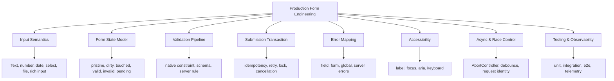
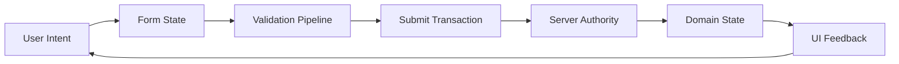
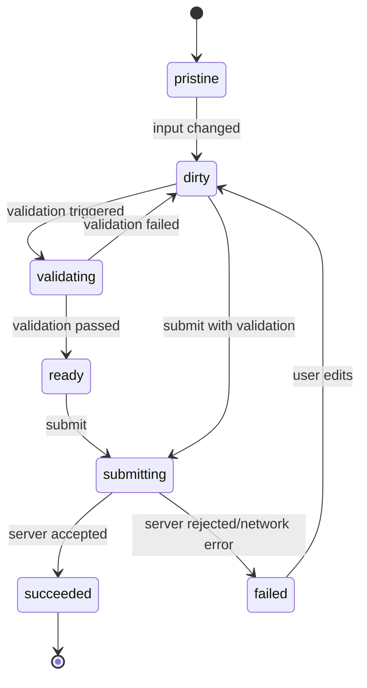
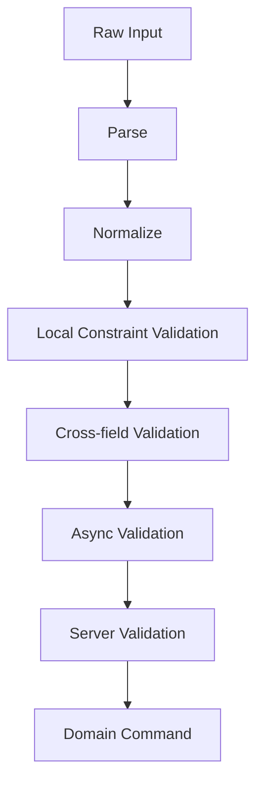
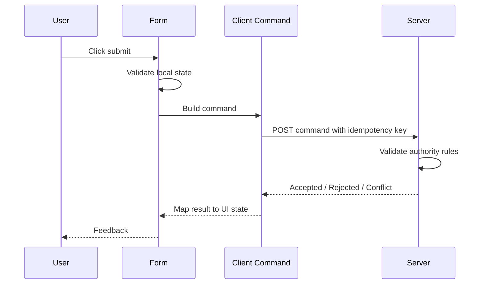
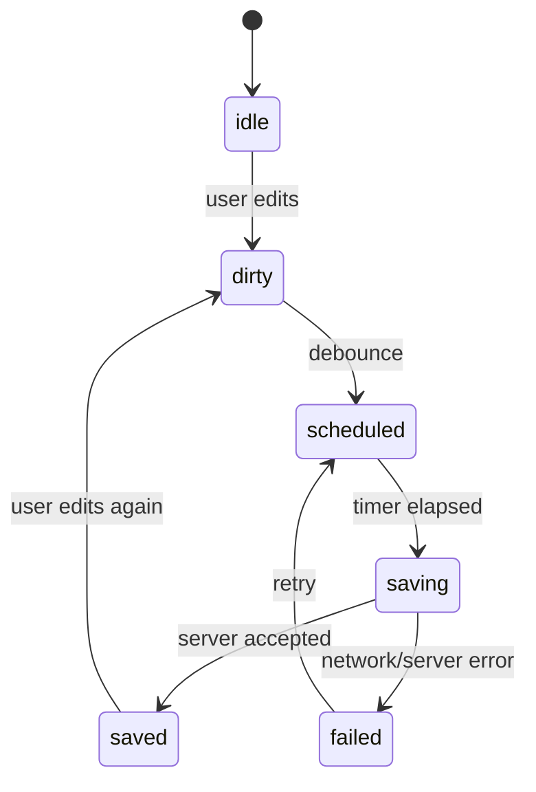
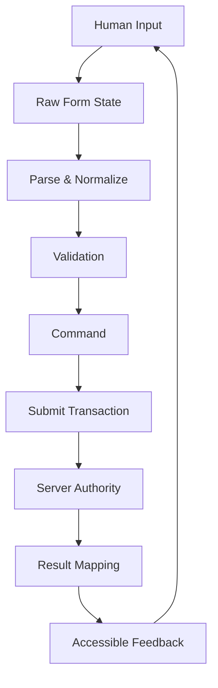

------
title: Learn Advanced JavaScript for Web / Frontend Engineering - Part 015
description: Forms, validation, and user input systems as production-grade transaction boundaries in frontend applications.
series: learn-javascript-frontend-advanced
seriesTitle: Learn Advanced JavaScript for Web / Frontend Engineering
order: 15
partTitle: Forms, Validation, and User Input Systems
tags:
  - javascript
  - frontend
  - forms
  - validation
  - accessibility
  - state-management
  - series
date: 2026-06-27
---

# Part 015 — Forms, Validation, and User Input Systems

> Target part ini: kamu tidak hanya bisa membuat form yang “jalan”, tetapi bisa merancang form sebagai **transaction boundary** yang aman, accessible, recoverable, observable, dan tahan terhadap race condition.

Form adalah salah satu area frontend yang paling sering diremehkan. Banyak engineer menganggap form hanya kombinasi input, state, validation, dan submit. Di production, form adalah tempat beberapa domain paling sulit bertemu:

- intent user;
- aturan bisnis;
- permission;
- data quality;
- accessibility;
- async I/O;
- latency;
- autosave;
- concurrency;
- browser behavior;
- server authority;
- error recovery.

Form yang buruk bukan hanya membuat UI terasa jelek. Form yang buruk bisa menghasilkan data korup, transaksi ganda, kehilangan draft, silent validation mismatch, security leak, atau keputusan bisnis yang salah.

Kita akan mempelajari form sebagai **sistem stateful**.

---

## 1. Kaufman Skill Framing

Dalam kerangka *The First 20 Hours*, skill “advanced frontend forms” perlu didekonstruksi menjadi sub-skill kecil yang bisa dilatih dengan feedback cepat.

### 1.1 Target Performa

Setelah menyelesaikan part ini, kamu harus mampu:

1. mendesain form sebagai state machine;
2. membedakan state input, state validasi, state submit, dan state server;
3. menentukan validation authority: browser, client, server, atau kombinasi;
4. mencegah double submit, stale async validation, dan race condition;
5. membuat error message yang actionable dan accessible;
6. menjaga form tetap recoverable saat network gagal, tab reload, atau navigation terjadi;
7. menguji form secara deterministic;
8. mereview form production menggunakan checklist invariant.

### 1.2 Deconstruct the Skill



### 1.3 Practice Loop

Untuk deliberate practice, setiap form yang kamu buat harus dievaluasi dengan pertanyaan:

- Apa invariant datanya?
- State mana yang authoritative?
- Apa yang terjadi jika user mengetik cepat?
- Apa yang terjadi jika network lambat?
- Apa yang terjadi jika submit berhasil tetapi UI tidak menerima response?
- Apa yang terjadi jika server mengubah aturan validasi?
- Apa yang terjadi jika user memakai keyboard atau screen reader?
- Apa yang terjadi jika user refresh halaman sebelum submit?
- Apa yang terjadi jika dua tab mengedit entity yang sama?

---

## 2. Mental Model: Form Is a Transaction Boundary

Form bukan sekadar UI input. Form adalah boundary antara:



Form menerima intent user yang masih ambigu, parsial, dan kadang invalid. Tugas form bukan memaksa semua input langsung valid, tetapi mengelola transisi dari **messy human input** menjadi **domain command** yang valid.

Contoh:

```ts
type RawSignupForm = {
  email: string;
  password: string;
  confirmPassword: string;
  acceptedTerms: boolean;
};

type SignupCommand = {
  email: string;
  password: string;
  acceptedTermsAt: string;
};
```

`RawSignupForm` adalah bentuk input. `SignupCommand` adalah command domain. Jangan mencampur keduanya terlalu cepat.

### 2.1 Form Tidak Sama dengan Domain Object

Kesalahan umum:

```ts
type User = {
  id: string;
  email: string;
  role: "admin" | "staff";
  createdAt: string;
};

const [form, setForm] = useState<User>(user);
```

Ini terlihat praktis, tetapi bermasalah:

- field readonly ikut masuk ke form;
- field server-managed bisa tidak sengaja diedit;
- permission rule menjadi kabur;
- partial edit sulit dimodelkan;
- dirty comparison menjadi noisy;
- payload submit rawan mengirim data berlebih.

Lebih baik:

```ts
type EditUserForm = {
  email: string;
  role: "admin" | "staff";
};

type EditUserCommand = {
  userId: string;
  email: string;
  role: "admin" | "staff";
  expectedVersion: number;
};
```

Form adalah representasi UI intent. Command adalah representasi domain action.

---

## 3. State Taxonomy for Forms

Form production minimal memiliki beberapa kategori state.

| State | Meaning | Example |
|---|---|---|
| Raw input state | Nilai yang sedang diketik user | `"  Alice "` |
| Parsed state | Nilai setelah parsing | `42`, `Date`, `Money` |
| Normalized state | Nilai setelah canonicalization | `alice@example.com` |
| Validation state | Valid/invalid/pending + errors | `email already used` |
| Interaction state | touched/dirty/focused/visited | `email.touched = true` |
| Submit state | idle/submitting/succeeded/failed | `submitting` |
| Server state | versi terakhir dari backend | `user.version = 8` |
| Draft state | local persisted unsaved changes | `localStorage draft` |
| Permission state | field/action yang boleh diedit | `role disabled` |

Jika semua state ini dimasukkan ke satu object flat, sistem cepat menjadi sulit dirawat.

### 3.1 Minimal State Shape

```ts
type FieldState<T> = {
  value: T;
  initialValue: T;
  touched: boolean;
  dirty: boolean;
  error?: string;
  validating: boolean;
};

type FormState<TFields> = {
  fields: {
    [K in keyof TFields]: FieldState<TFields[K]>;
  };
  submit: {
    status: "idle" | "submitting" | "succeeded" | "failed";
    error?: string;
    lastSubmittedAt?: number;
  };
};
```

Namun jangan menjadikan bentuk ini sebagai dogma. Gunakan sebagai mental model. Library form bisa punya implementasi berbeda, tetapi konsepnya tetap sama.

---

## 4. Form State Machine

Form yang serius sebaiknya dipahami sebagai state machine.



State machine membantu menjawab pertanyaan:

- Apakah user boleh submit saat validation pending?
- Apakah submit boleh dilakukan ulang setelah failure?
- Apakah error server harus hilang saat field diedit?
- Apakah form boleh dianggap dirty setelah autosave berhasil?
- Apakah navigation perlu diblokir?

Tanpa state machine, logic biasanya menyebar ke banyak boolean:

```ts
const isLoading = true;
const isSaving = false;
const isValidating = true;
const hasError = true;
const isDirty = false;
```

Banyak boolean menghasilkan state impossible:

```ts
isSubmitting === true && status === "succeeded"
isDirty === false && hasUnsavedChanges === true
isValid === true && errors.length > 0
```

Gunakan union state untuk mencegah impossible states:

```ts
type SubmitState =
  | { tag: "idle" }
  | { tag: "submitting"; requestId: string }
  | { tag: "succeeded"; savedAt: string }
  | { tag: "failed"; reason: "network" | "validation" | "conflict"; message: string };
```

---

## 5. Native HTML Form Is Not Obsolete

Modern frontend sering terlalu cepat meninggalkan kemampuan native browser.

Native form memberi:

- keyboard behavior;
- label association;
- submit-on-enter;
- browser autofill;
- constraint validation;
- accessibility semantics;
- progressive enhancement;
- integration dengan password manager;
- file input behavior;
- mobile keyboard hints.

Contoh yang baik:

```html
<form method="post" action="/account" noValidate>
  <label for="email">Email</label>
  <input
    id="email"
    name="email"
    type="email"
    autocomplete="email"
    required
  />

  <button type="submit">Save</button>
</form>
```

`noValidate` boleh digunakan jika kamu ingin mengontrol UX validasi sendiri, tetapi constraint native tetap berguna sebagai deklarasi semantic.

### 5.1 Constraint Validation API

Browser memiliki Constraint Validation API untuk validasi dasar seperti `required`, `minLength`, `maxLength`, `pattern`, `type=email`, `min`, dan `max`.

```ts
const form = document.querySelector("form")!;

if (!form.checkValidity()) {
  form.reportValidity();
}
```

Gunakan native constraints untuk:

- required field;
- format email/URL sederhana;
- min/max number;
- min/max length;
- field yang punya aturan lokal dan stabil.

Jangan hanya mengandalkan native constraints untuk:

- uniqueness;
- permission;
- business rule lintas entity;
- server-side policy;
- fraud/security rule;
- rule yang tergantung tenant/config.

---

## 6. Validation Pipeline

Validation bukan satu langkah. Validation adalah pipeline.



### 6.1 Parse

Parsing mengubah string menjadi tipe yang lebih bermakna.

```ts
function parsePositiveInteger(input: string): number | null {
  if (!/^\d+$/.test(input.trim())) return null;

  const value = Number(input);
  return Number.isSafeInteger(value) && value > 0 ? value : null;
}
```

Jangan anggap `input type="number"` berarti state kamu sudah number. DOM input value tetap string.

### 6.2 Normalize

Normalization mengubah representasi menjadi canonical.

```ts
function normalizeEmail(value: string): string {
  return value.trim().toLowerCase();
}
```

Namun normalization harus hati-hati. Tidak semua domain boleh diubah sembarangan:

- nama orang tidak selalu boleh di-title-case;
- alamat bisa punya karakter lokal;
- case sensitivity bisa bermakna di beberapa identifier;
- whitespace kadang bagian dari secret/token.

### 6.3 Local Constraint

```ts
type ValidationError = {
  field: string;
  code: string;
  message: string;
};

function validateProfileForm(form: ProfileForm): ValidationError[] {
  const errors: ValidationError[] = [];

  if (!form.displayName.trim()) {
    errors.push({
      field: "displayName",
      code: "required",
      message: "Display name is required."
    });
  }

  if (form.bio.length > 160) {
    errors.push({
      field: "bio",
      code: "too_long",
      message: "Bio must be 160 characters or less."
    });
  }

  return errors;
}
```

### 6.4 Cross-field Validation

Beberapa rule hanya bisa divalidasi setelah melihat banyak field.

```ts
function validatePasswordForm(form: PasswordForm): ValidationError[] {
  if (form.password !== form.confirmPassword) {
    return [{
      field: "confirmPassword",
      code: "password_mismatch",
      message: "Password confirmation does not match."
    }];
  }

  return [];
}
```

### 6.5 Async Validation

Contoh: cek apakah email sudah dipakai.

Masalah utama async validation:

- response lama menimpa response baru;
- request berlebih saat user mengetik;
- validasi masih pending saat submit;
- field berubah setelah validasi sukses;
- network gagal dianggap valid.

Gunakan `AbortController` dan request identity.

```ts
let currentEmailValidation: AbortController | null = null;
let currentEmailRequestId = 0;

async function validateEmailAvailability(email: string): Promise<string | null> {
  currentEmailValidation?.abort();

  const requestId = ++currentEmailRequestId;
  const controller = new AbortController();
  currentEmailValidation = controller;

  try {
    const response = await fetch(
      `/api/users/email-availability?email=${encodeURIComponent(email)}`,
      { signal: controller.signal }
    );

    if (requestId !== currentEmailRequestId) {
      return null;
    }

    if (!response.ok) {
      return "Unable to validate email right now.";
    }

    const result: { available: boolean } = await response.json();

    return result.available ? null : "Email is already used.";
  } catch (error) {
    if (controller.signal.aborted) {
      return null;
    }

    return "Unable to validate email right now.";
  }
}
```

Rule penting: **async validation yang gagal karena network tidak boleh otomatis dianggap valid**.

---

## 7. Client Validation Is UX, Server Validation Is Authority

Client validation meningkatkan feedback dan mengurangi round trip. Server validation menjaga integritas sistem.

Jangan pernah memperlakukan client validation sebagai security boundary.

| Rule | Client | Server | Reason |
|---|---:|---:|---|
| Required display name | Yes | Yes | UX + integrity |
| Email format | Yes | Yes | UX + integrity |
| Email uniqueness | Maybe | Yes | Server owns global uniqueness |
| Role permission | Display only | Yes | Security |
| Credit limit | Maybe | Yes | Server owns financial rule |
| Tenant boundary | No | Yes | Security |
| Feature flag availability | Maybe | Yes | Runtime policy |

Client harus memvalidasi agar user tidak frustasi. Server harus memvalidasi agar sistem tidak rusak.

---

## 8. Controlled, Uncontrolled, and Hybrid Inputs

### 8.1 Controlled Input

```tsx
function ControlledNameField() {
  const [name, setName] = useState("");

  return (
    <input
      value={name}
      onChange={(event) => setName(event.target.value)}
    />
  );
}
```

Kelebihan:

- state mudah dibaca;
- validation real-time mudah;
- conditional UI mudah;
- cocok untuk field sederhana.

Risiko:

- re-render berlebih;
- cursor jump jika formatting buruk;
- IME/composition bug;
- sulit untuk file input/rich text.

### 8.2 Uncontrolled Input

```tsx
function UncontrolledForm() {
  const formRef = useRef<HTMLFormElement>(null);

  function handleSubmit(event: React.FormEvent) {
    event.preventDefault();

    const data = new FormData(formRef.current!);
    const email = data.get("email");
  }

  return (
    <form ref={formRef} onSubmit={handleSubmit}>
      <input name="email" type="email" required />
      <button>Submit</button>
    </form>
  );
}
```

Kelebihan:

- lebih dekat dengan browser;
- re-render lebih sedikit;
- bagus untuk form besar;
- cocok untuk progressive enhancement.

Risiko:

- state tidak selalu eksplisit;
- validation UI custom perlu adapter;
- dependency antar-field lebih sulit.

### 8.3 Hybrid

Production sering memakai hybrid:

- uncontrolled untuk raw input;
- controlled untuk derived UI penting;
- state machine untuk submit/validation;
- schema untuk payload final.

---

## 9. Field Ownership and Update Boundaries

Setiap field perlu jelas siapa pemiliknya.

| Field Type | Owner | Example |
|---|---|---|
| User-editable field | User input | display name |
| Computed field | Application | total price |
| Server-managed field | Backend | createdAt |
| Permission-constrained field | Policy | role |
| Derived display field | UI | formatted amount |
| External widget field | Adapter | map coordinate |

Jangan membuat semua field “editable by default”.

```ts
type FieldPermission =
  | { editable: true }
  | { editable: false; reason: "readonly" | "permission" | "server_managed" };
```

---

## 10. Error Mapping

Error harus bisa dipetakan ke lokasi yang benar.

```ts
type FormError =
  | { kind: "field"; field: string; code: string; message: string }
  | { kind: "form"; code: string; message: string }
  | { kind: "global"; code: string; message: string };
```

Contoh server response:

```json
{
  "errors": [
    {
      "field": "email",
      "code": "email_taken",
      "message": "This email is already used."
    },
    {
      "code": "version_conflict",
      "message": "This profile was updated elsewhere."
    }
  ]
}
```

Mapping:

```ts
function mapServerErrors(errors: ServerError[]): FormError[] {
  return errors.map((error) => {
    if (error.field) {
      return {
        kind: "field",
        field: error.field,
        code: error.code,
        message: error.message
      };
    }

    return {
      kind: "form",
      code: error.code,
      message: error.message
    };
  });
}
```

### 10.1 Jangan Menghapus Error Terlalu Agresif

Jika user mengedit `email`, boleh hapus error `email_taken`. Tetapi jangan hapus error `version_conflict` karena itu bukan error field email.

```ts
function shouldClearErrorOnFieldChange(error: FormError, changedField: string): boolean {
  return error.kind === "field" && error.field === changedField;
}
```

---

## 11. Submission as Transaction

Submit harus diperlakukan sebagai transaksi.



### 11.1 Prevent Double Submit

```tsx
<button type="submit" disabled={submitState.tag === "submitting"}>
  {submitState.tag === "submitting" ? "Saving..." : "Save"}
</button>
```

Disabling button membantu UX, tetapi tidak cukup sebagai defense. Server tetap harus idempotent.

### 11.2 Idempotency Key

```ts
function createIdempotencyKey(): string {
  return crypto.randomUUID();
}

async function submitPayment(command: PaymentCommand) {
  const idempotencyKey = createIdempotencyKey();

  return fetch("/api/payments", {
    method: "POST",
    headers: {
      "Content-Type": "application/json",
      "Idempotency-Key": idempotencyKey
    },
    body: JSON.stringify(command)
  });
}
```

Untuk operasi critical seperti pembayaran, submit user, approval, enforcement action, atau case transition, idempotency bukan nice-to-have.

### 11.3 Submit Result Classification

```ts
type SubmitResult =
  | { tag: "accepted"; entityId: string; version: number }
  | { tag: "validation_failed"; errors: FormError[] }
  | { tag: "conflict"; serverVersion: number; message: string }
  | { tag: "unauthorized"; message: string }
  | { tag: "network_failed"; retryable: boolean; message: string };
```

Jangan hanya punya `success` dan `error`.

---

## 12. Autosave and Draft Recovery

Autosave berguna, tetapi rawan membuat sistem lebih kompleks.

### 12.1 Autosave State Machine



### 12.2 Autosave Invariants

Autosave harus punya aturan:

- jangan autosave jika local validation fatal;
- jangan mengirim request untuk setiap keystroke;
- batalkan/supersede request lama jika field berubah;
- tampilkan status saved/unsaved secara jelas;
- jangan menimpa server state yang lebih baru tanpa conflict strategy;
- simpan draft lokal jika server tidak tersedia.

### 12.3 Draft Persistence

```ts
type DraftEnvelope<T> = {
  schemaVersion: number;
  savedAt: string;
  entityId?: string;
  data: T;
};

function saveDraft<T>(key: string, data: T) {
  const envelope: DraftEnvelope<T> = {
    schemaVersion: 1,
    savedAt: new Date().toISOString(),
    data
  };

  localStorage.setItem(key, JSON.stringify(envelope));
}
```

Selalu versioning draft schema. Form bisa berubah antar release.

---

## 13. Input Edge Cases

### 13.1 IME Composition

User yang mengetik dengan Japanese, Chinese, Korean, atau input method lain bisa menghasilkan event sequence berbeda. Jangan memvalidasi dan memformat agresif saat composition masih berjalan.

```ts
let isComposing = false;

input.addEventListener("compositionstart", () => {
  isComposing = true;
});

input.addEventListener("compositionend", () => {
  isComposing = false;
});

input.addEventListener("input", () => {
  if (isComposing) return;
  validateInput();
});
```

### 13.2 Number Input

`type="number"` tidak menyelesaikan semua masalah:

- value tetap string;
- decimal separator berbeda antar locale;
- scientific notation bisa diterima browser tertentu;
- leading zero bisa hilang jika di-cast ke number;
- currency tidak selalu aman sebagai floating point.

Untuk uang, gunakan integer minor unit atau decimal library.

```ts
type Money = {
  amountMinor: number;
  currency: "IDR" | "USD";
};
```

### 13.3 Date and Time

Tanggal adalah sumber bug besar.

Bedakan:

- date-only: `2026-06-27`;
- local datetime: `2026-06-27T09:00`;
- instant UTC: `2026-06-27T02:00:00Z`;
- timezone-aware event: `Asia/Jakarta`.

Jangan mengubah date-only menjadi UTC instant tanpa domain reason.

### 13.4 File Input

File input tidak bisa sepenuhnya dikontrol seperti text input.

Perhatikan:

- size limit;
- MIME type tidak bisa dipercaya penuh;
- extension bisa menipu;
- upload progress;
- cancellation;
- resumable upload;
- virus scanning status;
- server-side validation.

### 13.5 Masked Input

Input mask sering merusak UX jika tidak hati-hati.

Contoh buruk:

- cursor selalu pindah ke akhir;
- paste tidak bisa;
- mobile keyboard salah;
- screen reader membaca simbol aneh;
- raw value dan display value tercampur.

Pisahkan:

```ts
type MaskedField = {
  displayValue: string;
  rawValue: string;
};
```

---

## 14. Accessibility Rules for Forms

Form accessible minimal memenuhi:

- setiap input punya label programmatic;
- error terhubung ke field;
- error summary tersedia untuk form panjang;
- focus diarahkan dengan hati-hati setelah submit gagal;
- keyboard navigation tidak rusak;
- required state terlihat dan terbaca;
- disabled field tidak menyembunyikan informasi penting;
- loading/submitting state diumumkan bila perlu.

Contoh:

```tsx
<label htmlFor="email">Email</label>
<input
  id="email"
  name="email"
  type="email"
  aria-invalid={Boolean(emailError)}
  aria-describedby={emailError ? "email-error" : undefined}
/>
{emailError && (
  <p id="email-error" role="alert">
    {emailError}
  </p>
)}
```

### 14.1 Error Summary

```tsx
function ErrorSummary({ errors }: { errors: FormError[] }) {
  const fieldErrors = errors.filter((error) => error.kind === "field");

  if (fieldErrors.length === 0) return null;

  return (
    <section aria-labelledby="form-errors" tabIndex={-1}>
      <h2 id="form-errors">Please fix the following errors</h2>
      <ul>
        {fieldErrors.map((error) => (
          <li key={`${error.field}-${error.code}`}>
            <a href={`#${error.field}`}>{error.message}</a>
          </li>
        ))}
      </ul>
    </section>
  );
}
```

Error summary sangat membantu untuk form panjang dan screen reader user.

---

## 15. Dynamic Forms and Collections

Dynamic form sering muncul pada:

- invoice line items;
- permission matrix;
- questionnaire;
- case intake;
- policy configuration;
- rule builder;
- workflow transition form.

Masalah utama dynamic form:

- identity row tidak stabil;
- error pindah ke row salah;
- remove/reorder mengacaukan dirty state;
- nested validation sulit;
- performance turun.

Jangan gunakan index sebagai identity domain jika row bisa reorder.

```ts
type LineItemForm = {
  clientId: string;
  productId: string;
  quantity: string;
};
```

`clientId` dipakai untuk UI identity sebelum server memberi ID.

---

## 16. Schema Validation Without Losing Domain Meaning

Schema validation berguna, tetapi jangan biarkan schema menjadi satu-satunya domain model.

Contoh pendekatan:

```ts
type Parsed<T> =
  | { ok: true; value: T }
  | { ok: false; errors: FormError[] };

function parseProfileCommand(form: ProfileForm): Parsed<UpdateProfileCommand> {
  const displayName = form.displayName.trim();

  if (!displayName) {
    return {
      ok: false,
      errors: [{
        kind: "field",
        field: "displayName",
        code: "required",
        message: "Display name is required."
      }]
    };
  }

  return {
    ok: true,
    value: {
      displayName,
      bio: form.bio.trim() || null
    }
  };
}
```

Schema library bisa membantu, tetapi domain command tetap harus jelas.

---

## 17. Observability for Forms

Form production perlu telemetry yang menjawab:

- field mana yang paling sering gagal validasi;
- berapa kali user abandon form;
- berapa latency submit;
- error server apa yang paling sering muncul;
- berapa retry;
- berapa draft recovery;
- berapa conflict;
- apakah accessibility error muncul di test pipeline.

Contoh event:

```ts
type FormTelemetryEvent =
  | { name: "form_started"; formId: string }
  | { name: "form_validation_failed"; formId: string; codes: string[] }
  | { name: "form_submit_started"; formId: string }
  | { name: "form_submit_succeeded"; formId: string; durationMs: number }
  | { name: "form_submit_failed"; formId: string; code: string; retryable: boolean }
  | { name: "form_abandoned"; formId: string; dirtyFields: string[] };
```

Jangan kirim PII atau raw user input ke telemetry.

---

## 18. Testing Strategy

### 18.1 Unit Test

Test parser dan validation rules.

```ts
test("requires display name", () => {
  const result = parseProfileCommand({ displayName: " ", bio: "" });

  expect(result.ok).toBe(false);
  expect(result.errors[0].code).toBe("required");
});
```

### 18.2 Integration Test

Test interaction antar-field.

```ts
test("shows mismatch when password confirmation differs", async () => {
  render(<PasswordForm />);

  await user.type(screen.getByLabelText(/password/i), "secret123");
  await user.type(screen.getByLabelText(/confirm password/i), "secret456");
  await user.click(screen.getByRole("button", { name: /save/i }));

  expect(screen.getByText(/does not match/i)).toBeInTheDocument();
});
```

### 18.3 E2E Test

Test browser behavior:

- autofill;
- submit-on-enter;
- navigation guard;
- file upload;
- network error;
- slow async validation;
- reload draft recovery.

### 18.4 Accessibility Test

Minimal:

- label association;
- keyboard navigation;
- focus after error;
- `aria-invalid`;
- error summary;
- contrast handled by design system;
- screen reader smoke test for critical flows.

---

## 19. Production Failure Modes

| Failure Mode | Cause | Prevention |
|---|---|---|
| Double submit | Button not locked, server not idempotent | Disable + idempotency key |
| Stale validation | Old async response wins | Abort + request identity |
| Lost draft | Reload/navigation | Local draft + navigation guard |
| Wrong payload | Form state equals domain entity | Separate form model and command |
| Hidden server error | Bad error mapping | Field/form/global error taxonomy |
| Accessibility failure | Visual-only error | Label + aria + focus management |
| Conflict overwrite | Two tabs/users edit same data | Versioning + conflict result |
| Cache leak | Tenant/user not part of key | Permission-aware cache key |
| Cursor jump | Aggressive formatting | Composition-aware input handling |
| Data corruption | Client-only validation | Server authority validation |

---

## 20. Production Review Checklist

Sebelum merge form penting, review:

- [ ] Apakah form model terpisah dari domain entity?
- [ ] Apakah command submit eksplisit?
- [ ] Apakah field readonly/server-managed tidak ikut terkirim?
- [ ] Apakah validation pipeline jelas?
- [ ] Apakah server tetap menjadi authority?
- [ ] Apakah async validation punya cancellation atau request identity?
- [ ] Apakah submit idempotent untuk operasi critical?
- [ ] Apakah error server dipetakan ke field/form/global?
- [ ] Apakah form accessible dengan keyboard dan screen reader?
- [ ] Apakah dirty/touched semantics konsisten?
- [ ] Apakah navigation/reload saat dirty ditangani?
- [ ] Apakah autosave memiliki conflict strategy?
- [ ] Apakah telemetry tidak membocorkan PII?
- [ ] Apakah test mencakup slow network dan validation failure?
- [ ] Apakah impossible state dicegah dengan union/state machine?

---

## 21. Deliberate Practice

### Exercise 1 — Refactor Naive Form

Ambil form sederhana yang memakai satu object `user` sebagai state. Refactor menjadi:

- `EditUserForm`;
- `EditUserCommand`;
- validation pipeline;
- server error mapping;
- submit state union.

### Exercise 2 — Async Validation Race

Buat field username dengan async validation. Simulasikan response lambat untuk input lama. Pastikan response lama tidak menimpa state terbaru.

### Exercise 3 — Draft Recovery

Buat form panjang dengan local draft. Tambahkan:

- schema version;
- restore prompt;
- clear draft setelah submit sukses;
- migration kecil saat schema berubah.

### Exercise 4 — Accessibility Review

Gunakan keyboard saja untuk mengisi form. Pastikan:

- semua field reachable;
- error terbaca;
- focus masuk akal;
- submit state jelas;
- error summary membantu.

---

## 22. Final Mental Model

Form production adalah kombinasi dari:



Jika kamu hanya mengingat satu hal:

> Jangan mendesain form sebagai kumpulan input. Desain form sebagai lifecycle dari intent user menuju command domain yang valid, aman, dan recoverable.

---

## 23. Referensi

- MDN — Constraint Validation API
- MDN — `HTMLFormElement.checkValidity()`
- MDN — `FormData`
- MDN — `AbortController`
- WAI-ARIA Authoring Practices Guide
- WCAG 2.2
- React Documentation — Forms and state management
- Web.dev — Forms and accessibility guidance
