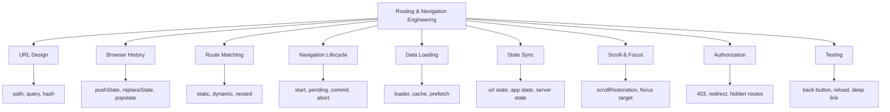
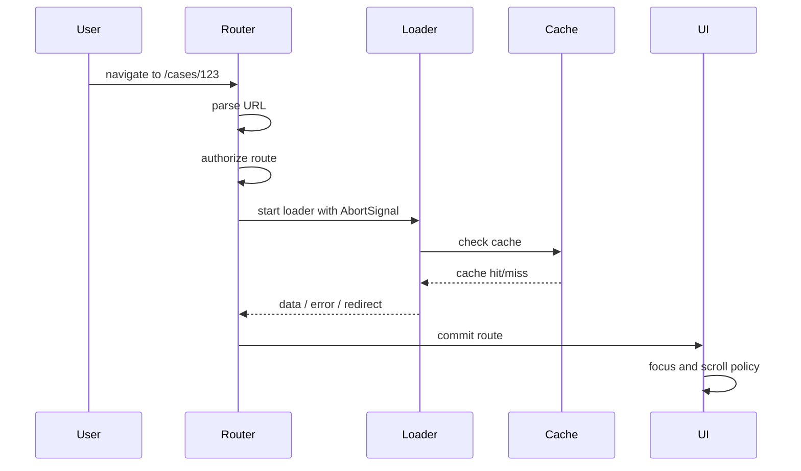
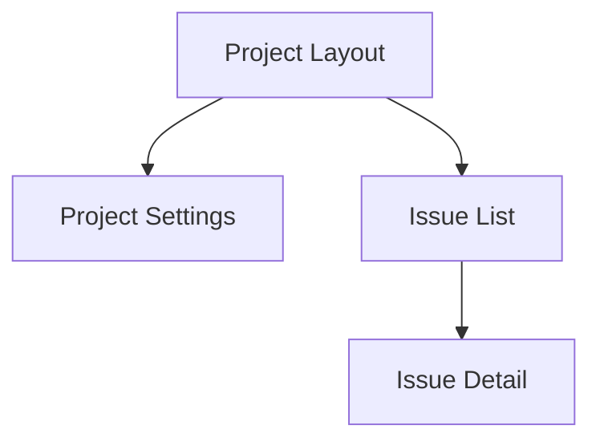
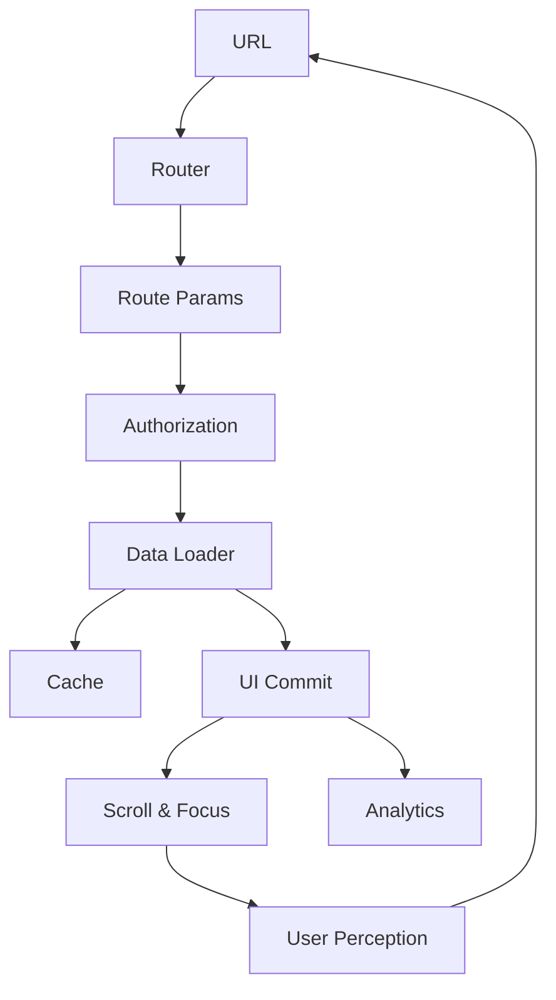

------
title: Learn Advanced JavaScript for Web / Frontend Engineering - Part 016
description: Routing, navigation lifecycle, URL state, history, scroll restoration, and route-level architecture for advanced frontend systems.
series: learn-javascript-frontend-advanced
seriesTitle: Learn Advanced JavaScript for Web / Frontend Engineering
order: 16
partTitle: Routing, Navigation, and URL State
tags:
  - javascript
  - frontend
  - routing
  - navigation
  - url-state
  - history-api
  - accessibility
  - series
date: 2026-06-27
---

# Part 016 — Routing, Navigation, and URL State

> Target part ini: kamu mampu merancang routing bukan sebagai “mapping URL ke component”, tetapi sebagai **state synchronization system** antara browser, application state, server data, cache, accessibility, security, dan user intent.

Routing adalah salah satu fondasi arsitektur frontend modern. Banyak bug besar muncul bukan karena router library buruk, tetapi karena engineer tidak punya mental model kuat tentang URL, navigation lifecycle, history stack, data loading, scroll, focus, cache, dan permission boundary.

Dalam production frontend, route bukan hanya path. Route adalah:

- entry point aplikasi;
- state container yang bisa dishare;
- boundary data loading;
- boundary authorization;
- boundary code splitting;
- boundary error handling;
- boundary analytics;
- boundary accessibility;
- boundary recovery.

---

## 1. Kaufman Skill Framing

### 1.1 Target Performa

Setelah part ini, kamu harus mampu:

1. mendesain URL yang stabil, shareable, dan canonical;
2. membedakan path, query, hash, `history.state`, storage, dan in-memory state;
3. memahami `pushState`, `replaceState`, `popstate`, dan scroll restoration;
4. menghindari sync bug antara URL dan application state;
5. mendesain navigation lifecycle dengan cancellation;
6. menangani unsaved changes dan route guard;
7. mengatur focus dan scroll secara accessible;
8. membuat route-level loading, error, and permission boundary;
9. menguji navigation flow secara deterministic.

### 1.2 Deconstruct the Skill



---

## 2. Mental Model: URL Is Externalized State

URL adalah state aplikasi yang berada di luar memory JavaScript.

Karena URL bisa:

- diketik langsung;
- di-bookmark;
- dibagikan;
- dibuka di tab baru;
- di-refresh;
- diakses crawler;
- menjadi sumber analytics;
- menjadi contract antar sistem.

State yang penting untuk memahami layar sebaiknya berada di URL jika state tersebut:

- shareable;
- recoverable setelah reload;
- meaningful bagi user;
- mempengaruhi data yang ditampilkan;
- bukan rahasia;
- bukan terlalu besar;
- stabil sebagai public contract.

Contoh:

```text
/cases/CASE-2026-00031?tab=timeline&status=open&page=2
```

URL ini menyimpan:

- resource identity: `CASE-2026-00031`;
- selected tab: `timeline`;
- filter: `status=open`;
- pagination: `page=2`.

User bisa share URL ini dan penerima melihat konteks yang sama.

---

## 3. Route Is Not Component Mapping

Pandangan sempit:

```ts
"/cases/:id" -> CasePage
```

Pandangan production:

```ts
type RouteDefinition = {
  path: string;
  parseParams: (url: URL) => RouteParams;
  loadData: (params: RouteParams, signal: AbortSignal) => Promise<RouteData>;
  authorize: (user: User, params: RouteParams) => AuthorizationResult;
  render: (data: RouteData) => UI;
  onError: (error: unknown) => ErrorBoundaryResult;
  getTitle: (data: RouteData) => string;
  restoreScroll: ScrollPolicy;
};
```

Router library boleh menyembunyikan detail, tetapi sistem tetap memiliki concern ini.

---

## 4. Browser Primitives

### 4.1 URL

Gunakan `URL` dan `URLSearchParams`, bukan string manipulation manual.

```ts
const url = new URL("https://app.example.com/cases?status=open&page=2");

const status = url.searchParams.get("status");
const page = Number(url.searchParams.get("page") ?? "1");
```

Parsing manual rawan bug:

```ts
// Fragile
const page = location.search.split("page=")[1];
```

### 4.2 URLSearchParams

`URLSearchParams` cocok untuk query string sederhana.

```ts
function updateQuery(
  currentUrl: URL,
  updates: Record<string, string | null>
): URL {
  const next = new URL(currentUrl);

  for (const [key, value] of Object.entries(updates)) {
    if (value === null) {
      next.searchParams.delete(key);
    } else {
      next.searchParams.set(key, value);
    }
  }

  next.searchParams.sort();
  return next;
}
```

Gunakan canonical order untuk mengurangi duplicate cache key dan analytics fragmentation.

### 4.3 History API

`history.pushState()` menambahkan entry baru ke session history. `history.replaceState()` mengganti entry saat ini.

Gunakan `pushState` untuk navigasi yang user anggap langkah baru:

```ts
history.pushState(
  { source: "case-filter" },
  "",
  "/cases?status=open&page=2"
);
```

Gunakan `replaceState` untuk perubahan yang tidak pantas memenuhi back stack:

```ts
history.replaceState(
  { source: "search-debounce" },
  "",
  "/cases?q=ali"
);
```

Contoh rule:

| Action | API |
|---|---|
| Buka detail case baru | `pushState` |
| Ganti tab yang meaningful | tergantung UX |
| Update search query saat mengetik | `replaceState` |
| Submit filter final | `pushState` |
| Redirect setelah login | `replaceState` |
| Wizard step | biasanya `pushState` |

### 4.4 popstate

`popstate` terjadi saat user berpindah pada session history, misalnya menekan back/forward.

```ts
window.addEventListener("popstate", (event) => {
  const url = new URL(window.location.href);
  routeTo(url, event.state);
});
```

Jangan menganggap `popstate` hanya “back button”. Ia adalah sinyal bahwa active history entry berubah.

### 4.5 scrollRestoration

Browser memiliki `history.scrollRestoration` untuk mengontrol restoration scroll pada navigation history.

```ts
if ("scrollRestoration" in history) {
  history.scrollRestoration = "manual";
}
```

Jika router kamu mengambil alih rendering dan scroll, kamu perlu policy eksplisit agar back/forward terasa natural.

---

## 5. Navigation Lifecycle

Navigation harus dianggap sebagai lifecycle, bukan instant assignment.



Minimal state:

```ts
type NavigationState =
  | { tag: "idle"; location: URL }
  | { tag: "pending"; from: URL; to: URL; requestId: string }
  | { tag: "committed"; location: URL }
  | { tag: "failed"; location: URL; error: unknown };
```

---

## 6. Cancellation and Race Control

Route transition sering memulai data fetch. Jika user berpindah route cepat, request lama bisa selesai belakangan dan menimpa UI baru.

Gunakan `AbortController`.

```ts
let currentNavigation: AbortController | null = null;
let currentNavigationId = 0;

async function navigate(to: URL) {
  currentNavigation?.abort();

  const navigationId = ++currentNavigationId;
  const controller = new AbortController();
  currentNavigation = controller;

  setNavigationState({
    tag: "pending",
    from: new URL(window.location.href),
    to,
    requestId: String(navigationId)
  });

  try {
    const data = await loadRouteData(to, controller.signal);

    if (navigationId !== currentNavigationId) return;

    history.pushState({}, "", to);
    renderRoute(to, data);
    setNavigationState({ tag: "committed", location: to });
  } catch (error) {
    if (controller.signal.aborted) return;

    setNavigationState({
      tag: "failed",
      location: to,
      error
    });
  }
}
```

Invariant:

> Data dari navigation lama tidak boleh menimpa route baru.

---

## 7. URL State Taxonomy

| State Location | Good For | Avoid For |
|---|---|---|
| Path | Resource identity, hierarchy | Optional UI toggles |
| Query | filters, sort, page, tab | secrets, huge object |
| Hash | document fragment, anchor | application-critical state |
| `history.state` | transient per-entry metadata | shareable state |
| Session storage | tab-scoped draft/session | canonical navigation state |
| Local storage | longer-lived preference/draft | sensitive state |
| Memory | ephemeral UI state | reload/shareable state |

### 7.1 Path

Good:

```text
/cases/CASE-001
/users/123/settings
/projects/acme/issues/42
```

Bad:

```text
/page?entity=case&id=CASE-001
```

Use path for identity and hierarchy.

### 7.2 Query

Good:

```text
/cases?status=open&assignee=me&page=2
```

Query is good for view configuration.

### 7.3 Hash

Good:

```text
/docs/routing#scroll-restoration
```

Hash is good for fragments. Avoid putting critical app state only in hash unless building a legacy hash router.

### 7.4 history.state

Good for state tied to a history entry but not shareable:

```ts
history.pushState(
  { openedFrom: "dashboard", previousScrollY: 412 },
  "",
  "/cases/CASE-001"
);
```

If refresh or shared link must preserve it, it does not belong only in `history.state`.

---

## 8. Designing Canonical URLs

Canonical URL means one stable URL represents one intended state.

Problems caused by non-canonical URL:

- duplicate cache keys;
- duplicate analytics entries;
- SEO duplication;
- impossible comparison;
- inconsistent sharing;
- flaky tests.

### 8.1 Canonical Query Serializer

```ts
type CaseListQuery = {
  status?: "open" | "closed";
  assignee?: string;
  page: number;
};

function serializeCaseListQuery(query: CaseListQuery): string {
  const params = new URLSearchParams();

  if (query.status) params.set("status", query.status);
  if (query.assignee) params.set("assignee", query.assignee);
  if (query.page > 1) params.set("page", String(query.page));

  params.sort();

  const value = params.toString();
  return value ? `?${value}` : "";
}
```

Notice: `page=1` tidak perlu jika itu default. Ini mengurangi noise.

### 8.2 Parser with Defaults

```ts
function parseCaseListQuery(url: URL): CaseListQuery {
  const rawStatus = url.searchParams.get("status");
  const rawPage = Number(url.searchParams.get("page") ?? "1");

  return {
    status: rawStatus === "open" || rawStatus === "closed"
      ? rawStatus
      : undefined,
    assignee: url.searchParams.get("assignee") ?? undefined,
    page: Number.isSafeInteger(rawPage) && rawPage > 0 ? rawPage : 1
  };
}
```

Parser harus resilient. URL bisa diedit manual oleh user.

---

## 9. URL Sync Without Infinite Loops

Bug umum:

```ts
useEffect(() => {
  setState(parse(location.search));
}, [location.search]);

useEffect(() => {
  navigate(serialize(state));
}, [state]);
```

Ini bisa menyebabkan loop jika parser/serializer tidak canonical.

Solusi:

1. tentukan source of truth;
2. gunakan canonical serializer;
3. jangan write URL jika URL sudah sama;
4. debounce input draft sebelum commit ke URL;
5. pisahkan draft state dari committed URL state.

```ts
function commitQuery(nextQuery: CaseListQuery) {
  const current = new URL(window.location.href);
  const next = new URL(current);

  next.search = serializeCaseListQuery(nextQuery);

  if (next.href === current.href) {
    return;
  }

  history.pushState({}, "", next);
}
```

---

## 10. Draft vs Committed URL State

Search box sering butuh dua state:

- draft text yang sedang diketik;
- committed query di URL.

```ts
type SearchState = {
  draft: string;
  committed: string;
};
```

Pattern:

- user mengetik `draft`;
- debounce atau submit;
- commit ke URL;
- loader fetch berdasarkan URL;
- result sesuai committed query.

Jika setiap keystroke langsung `pushState`, back button menjadi rusak. Gunakan `replaceState` untuk intermediate typing atau commit saat submit.

---

## 11. Nested Routes and Layout Boundaries

Nested route bukan hanya nested component. Nested route merepresentasikan hierarchy data dan layout.

```text
/projects/:projectId
/projects/:projectId/settings
/projects/:projectId/issues
/projects/:projectId/issues/:issueId
```

Boundary:



`Project Layout` bisa load project summary dan permission. Child route load data spesifik.

Keuntungan:

- data parent reusable;
- permission parent centralized;
- skeleton layout stabil;
- error boundary lebih granular;
- code splitting lebih natural.

---

## 12. Route-Level Data Loading

Data loading berdasarkan route harus menjawab:

- data apa yang wajib sebelum render?
- data apa yang bisa streaming/lazy?
- data apa yang bisa pakai cache?
- apa yang terjadi jika loader gagal?
- apakah navigation harus dibatalkan?
- apakah stale data boleh ditampilkan?

```ts
type RouteLoader<TParams, TData> = {
  key: (params: TParams) => string[];
  load: (params: TParams, signal: AbortSignal) => Promise<TData>;
  staleTimeMs: number;
};
```

### 12.1 Loader Result

```ts
type LoaderResult<T> =
  | { tag: "loaded"; data: T }
  | { tag: "redirect"; to: string }
  | { tag: "not_found" }
  | { tag: "forbidden" }
  | { tag: "failed"; error: unknown; retryable: boolean };
```

Jangan paksakan semua failure menjadi thrown exception.

---

## 13. Authorization and Routing

Routing permission bukan security boundary utama. Server tetap authority.

Tetapi UI routing harus:

- menyembunyikan route yang jelas tidak boleh diakses;
- menampilkan 403 untuk akses direct link yang valid tetapi forbidden;
- tidak bocorkan data sensitif di preload;
- tidak cache data lintas user/tenant;
- handle permission change saat session berjalan.

```ts
type AuthorizationResult =
  | { tag: "allowed" }
  | { tag: "forbidden"; reason: string }
  | { tag: "unauthenticated"; loginUrl: string };
```

### 13.1 401 vs 403 vs 404

| Status | Meaning | UI Behavior |
|---|---|---|
| 401 | Belum login | Redirect/login prompt |
| 403 | Login tapi tidak punya akses | Forbidden page |
| 404 | Resource tidak ada atau tidak terlihat | Not found |
| 410 | Pernah ada, sudah hilang | Gone/archive message |

Untuk beberapa domain, server sengaja mengembalikan 404 untuk resource yang forbidden agar tidak membocorkan existence. UI harus mengikuti domain policy.

---

## 14. Navigation Guards and Unsaved Changes

Unsaved changes harus ditangani pada dua level:

1. internal navigation;
2. browser unload/tab close.

```ts
type UnsavedChangesPolicy =
  | { tag: "none" }
  | { tag: "confirm"; message: string }
  | { tag: "block"; reason: string };
```

Internal navigation:

```ts
async function canNavigateAway(): Promise<boolean> {
  if (!formIsDirty()) return true;

  return window.confirm("You have unsaved changes. Leave this page?");
}
```

Browser unload:

```ts
window.addEventListener("beforeunload", (event) => {
  if (!formIsDirty()) return;

  event.preventDefault();
  event.returnValue = "";
});
```

Catatan: browser modern membatasi custom message pada unload dialog. Jangan mengandalkan pesan custom.

---

## 15. Scroll Restoration

Scroll behavior yang buruk membuat SPA terasa patah.

Scenarios:

| Navigation | Expected Scroll |
|---|---|
| New page | top |
| Back to list | previous list scroll |
| Change tab | often top of content |
| Query filter changed | top of result list |
| Hash anchor | scroll to anchor |
| Modal route close | restore background scroll |

Gunakan per-route scroll key.

```ts
type ScrollEntry = {
  x: number;
  y: number;
};

const scrollPositions = new Map<string, ScrollEntry>();

function saveScroll(key: string) {
  scrollPositions.set(key, {
    x: window.scrollX,
    y: window.scrollY
  });
}

function restoreScroll(key: string) {
  const entry = scrollPositions.get(key);

  if (!entry) {
    window.scrollTo(0, 0);
    return;
  }

  window.scrollTo(entry.x, entry.y);
}
```

Untuk list-detail-back flow, scroll restoration adalah bagian dari UX correctness, bukan polish.

---

## 16. Focus Management and Accessibility

SPA navigation tidak otomatis memberi sinyal yang sama seperti full page load kepada assistive technology. Setelah route berubah, focus perlu diarahkan.

Basic policy:

- setelah navigation utama, focus ke heading utama atau main landmark;
- setelah validation/navigation error, focus ke error summary;
- setelah modal route terbuka, focus masuk modal;
- setelah modal route ditutup, focus kembali ke trigger;
- jangan memindahkan focus untuk perubahan query kecil yang tidak mengganti konteks utama.

```tsx
function RouteFocusBoundary({ title }: { title: string }) {
  const headingRef = useRef<HTMLHeadingElement>(null);

  useEffect(() => {
    headingRef.current?.focus();
  }, [title]);

  return (
    <h1 ref={headingRef} tabIndex={-1}>
      {title}
    </h1>
  );
}
```

Gunakan `tabIndex={-1}` agar elemen bisa difokuskan programmatically tanpa masuk normal tab order.

---

## 17. Route-Level Error Boundaries

Route error harus spesifik.

```ts
type RouteError =
  | { tag: "not_found"; resource: string }
  | { tag: "forbidden"; message: string }
  | { tag: "network"; retryable: boolean }
  | { tag: "server"; requestId?: string }
  | { tag: "unknown"; error: unknown };
```

Jangan tampilkan satu generic “Something went wrong” untuk semua kasus.

Error route harus menjawab:

- apakah user bisa retry?
- apakah user perlu login?
- apakah resource tidak ada?
- apakah permission kurang?
- apakah ada request ID untuk support?
- apakah data partial masih boleh ditampilkan?

---

## 18. Route-Level Code Splitting

Route boundary adalah tempat natural untuk code splitting.

```ts
const CaseDetailPage = lazy(() => import("./routes/CaseDetailPage"));
```

Namun code splitting punya trade-off:

- initial bundle lebih kecil;
- route transition bisa lebih lambat;
- prefetch perlu strategi;
- error loading chunk perlu fallback;
- version mismatch setelah deploy bisa terjadi.

### 18.1 Chunk Load Failure

Setelah deploy baru, user dengan tab lama bisa mencoba load chunk lama yang sudah tidak ada.

Tangani:

```ts
function isChunkLoadError(error: unknown): boolean {
  return error instanceof Error &&
    /Loading chunk|dynamically imported module/i.test(error.message);
}
```

UX bisa menawarkan reload halaman, tetapi jangan reload otomatis tanpa batas.

---

## 19. Prefetching

Prefetching meningkatkan UX jika dilakukan dengan hati-hati.

Good candidates:

- link yang terlihat di viewport;
- next step wizard;
- likely hover/intent;
- top navigation route;
- detail page dari list yang sering dibuka.

Bad candidates:

- data besar;
- route jarang dibuka;
- user on slow connection;
- permission-sensitive data;
- tenant-sensitive cache tanpa key benar.

```ts
function shouldPrefetch(connection: NetworkInformation | undefined): boolean {
  if (!connection) return true;
  if (connection.saveData) return false;
  return !["slow-2g", "2g"].includes(connection.effectiveType);
}
```

Network Information API tidak selalu tersedia, jadi gunakan sebagai hint, bukan hard dependency.

---

## 20. Modal Routes

Modal route berguna ketika URL harus merepresentasikan overlay state.

Contoh:

```text
/cases?selected=CASE-001
```

atau:

```text
/cases/CASE-001?view=modal
```

Pattern:

- background route tetap tersimpan;
- modal bisa ditutup dengan back;
- direct link tetap punya fallback full page;
- focus trap aktif;
- scroll background dikunci;
- close mengembalikan focus.

Modal route yang buruk sering merusak back button.

---

## 21. SSR, Hydration, and Routing

Rendering strategy mempengaruhi routing.

SPA:

- route resolution di client;
- initial load butuh JS;
- data loading sering client-side;
- lebih mudah untuk app internal.

SSR:

- server mengirim HTML awal;
- route harus bisa di-resolve server;
- auth/cache harus benar;
- hydration mismatch perlu dijaga.

RSC/Server Components:

- route boundary bisa menjadi server/client boundary;
- data fetching bisa pindah ke server;
- URL state tetap penting sebagai contract.

Pembahasan detail rendering strategy akan masuk Part 017 dan Part 018. Di part ini cukup pegang invariant:

> URL yang sama harus menghasilkan intent layar yang sama, terlepas dari apakah route dirender oleh server, client, atau kombinasi.

---

## 22. Analytics and Navigation Events

Route analytics harus berdasarkan committed navigation, bukan hanya click.

Jangan track page view saat:

- navigation dibatalkan;
- authorization redirect belum selesai;
- loader gagal sebelum route commit;
- URL berubah intermediate karena typing.

Track setelah route committed:

```ts
function onRouteCommitted(location: URL, title: string) {
  analytics.track("page_view", {
    path: location.pathname,
    query: location.search,
    title
  });
}
```

Pastikan query tidak mengandung PII.

---

## 23. Security and Privacy

URL sering masuk ke:

- browser history;
- server logs;
- analytics;
- screenshot;
- referrer header;
- shared chat;
- support ticket.

Jangan taruh di URL:

- token akses;
- refresh token;
- password reset token yang panjang umur;
- PII sensitif jika tidak perlu;
- secret internal;
- raw search berisi data rahasia.

Jika harus ada token sekali pakai di URL, segera exchange lalu `replaceState` ke URL bersih.

```ts
function cleanSensitiveQueryParam(param: string) {
  const url = new URL(window.location.href);
  url.searchParams.delete(param);
  history.replaceState(history.state, "", url);
}
```

---

## 24. Testing Strategy

### 24.1 Unit Test Parser/Serializer

```ts
test("omits default page from query", () => {
  expect(serializeCaseListQuery({ page: 1 })).toBe("");
});

test("parses invalid page as 1", () => {
  const url = new URL("https://app.example.com/cases?page=-10");
  expect(parseCaseListQuery(url).page).toBe(1);
});
```

### 24.2 Integration Test Routing

Test:

- direct deep link;
- query update;
- back/forward;
- route-level error;
- redirect;
- forbidden route;
- dirty form guard.

### 24.3 E2E Test

Browser-level test harus mencakup:

- user membuka URL langsung;
- user refresh di nested route;
- user klik back dari detail ke list;
- scroll list kembali ke posisi semula;
- focus pindah ke heading setelah route berubah;
- route data fetch dibatalkan saat pindah cepat;
- chunk load error fallback;
- unauthenticated redirect.

---

## 25. Production Failure Modes

| Failure Mode | Cause | Prevention |
|---|---|---|
| Back button broken | Every keystroke uses `pushState` | Use `replaceState` or commit state |
| Shared URL incomplete | Important state only in memory | Externalize meaningful state to URL |
| Infinite URL sync loop | Non-canonical parser/serializer | Canonical URL and equality check |
| Stale data after fast navigation | Old loader wins race | Abort + request identity |
| Scroll lost | Router ignores history scroll | Scroll restoration policy |
| Focus lost | SPA route does not move focus | Route focus boundary |
| Unauthorized data preload | Permission checked too late | Authorization before sensitive load |
| Cache leaks across users | Missing user/tenant in cache key | Permission-aware cache key |
| Analytics pollution | Track before route commit | Track committed navigation only |
| Chunk error after deploy | Old tab loads removed chunk | Chunk error recovery |

---

## 26. Production Review Checklist

Before approving routing changes:

- [ ] Is the URL canonical?
- [ ] Is important state shareable and reload-safe?
- [ ] Are secrets excluded from URL?
- [ ] Does parser handle invalid/manual URL edits?
- [ ] Does serializer omit default noise?
- [ ] Is `pushState` vs `replaceState` chosen intentionally?
- [ ] Does back/forward behave naturally?
- [ ] Are route loaders cancellable?
- [ ] Can stale loader results overwrite new route?
- [ ] Is authorization handled before sensitive data load?
- [ ] Are 401/403/404 states distinct?
- [ ] Is scroll restoration specified?
- [ ] Is focus managed after SPA navigation?
- [ ] Is route-level error UI actionable?
- [ ] Is route analytics tracked only after commit?
- [ ] Are query params free of PII/secrets?
- [ ] Are tests covering direct link, refresh, back, and error routes?

---

## 27. Deliberate Practice

### Exercise 1 — Canonical Query State

Implement parser/serializer for a case list:

```text
/cases?status=open&assignee=me&page=2&sort=updated_desc
```

Rules:

- invalid page becomes `1`;
- default page omitted;
- unknown status ignored;
- query params sorted;
- no infinite URL sync loop.

### Exercise 2 — Back Button UX

Build search input with draft and committed state.

- typing updates draft;
- submit commits query;
- intermediate typing does not pollute back stack;
- back returns previous committed result.

### Exercise 3 — Route Loader Race

Simulate two navigations:

1. `/cases/1` responds after 2 seconds;
2. `/cases/2` responds after 100ms.

Ensure `/cases/1` response cannot overwrite `/cases/2`.

### Exercise 4 — Scroll and Focus

Build list-detail flow:

- scroll list to item 80;
- open detail;
- press back;
- list scroll restored;
- focus lands predictably.

---

## 28. Final Mental Model

Routing is synchronization between:



Jika kamu hanya mengingat satu hal:

> Router bukan sekadar memilih component. Router adalah sistem yang menjaga URL, state, data, history, permission, focus, scroll, dan user expectation tetap konsisten.

---

## 29. Referensi

- MDN — `History.pushState()`
- MDN — `History.replaceState()`
- MDN — `Window: popstate event`
- MDN — `History.scrollRestoration`
- MDN — `URL`
- MDN — `URLSearchParams`
- MDN — Navigation API
- React Router Documentation
- Next.js Routing Documentation
- WAI-ARIA Authoring Practices Guide
- WCAG 2.2
