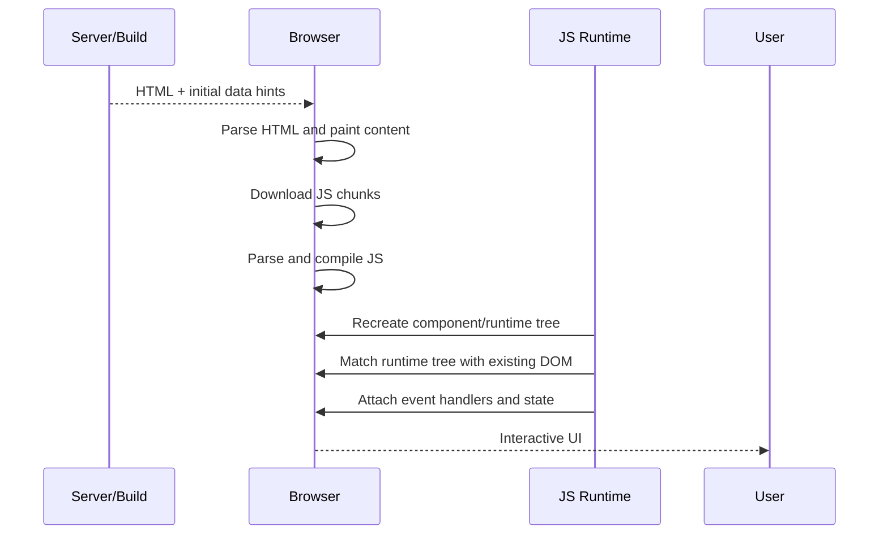
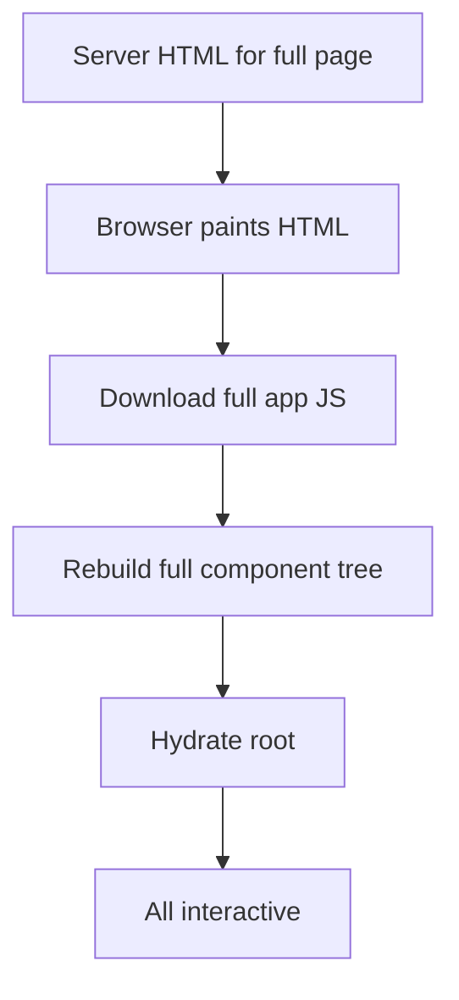
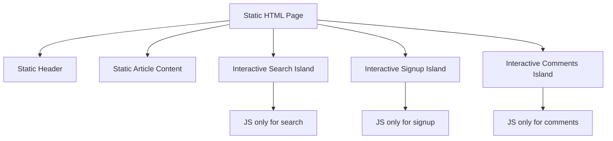
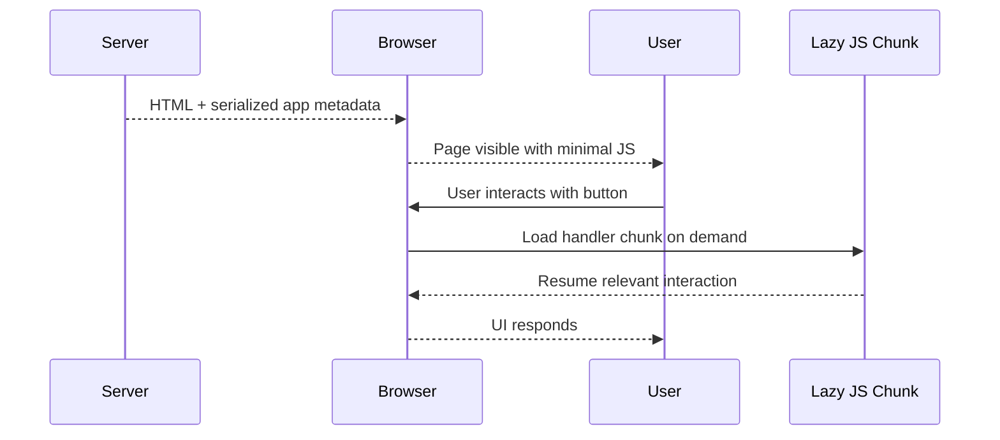
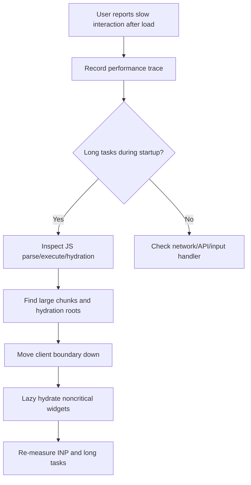

------
title: Learn Advanced JavaScript for Web / Frontend Engineering - Part 018
description: Hydration, selective hydration, islands architecture, resumability, and component-level interactivity boundaries for modern frontend systems.
series: learn-javascript-frontend-advanced
seriesTitle: Learn Advanced JavaScript for Web / Frontend Engineering
order: 18
partTitle: Hydration, Resumability, and Islands
tags:
  - javascript
  - frontend
  - hydration
  - resumability
  - islands
  - performance
  - rendering
  - architecture
  - series
date: 2026-06-27
---

# Part 018 — Hydration, Resumability, and Islands

> Target part ini: kamu mampu menjelaskan dan mendesain interactivity boundary dengan memahami **biaya hydration**, alternatif seperti **islands** dan **resumability**, serta konsekuensinya terhadap performance, state, accessibility, dan arsitektur aplikasi.

Part sebelumnya membahas strategi rendering: SPA, SSR, SSG, ISR, streaming, dan RSC. Sekarang kita masuk ke pertanyaan yang lebih spesifik:

```txt
Setelah HTML terlihat, bagaimana UI menjadi interactive?
```

Banyak tim berhenti pada “pakai SSR biar cepat”. Itu hanya separuh cerita. SSR/SSG bisa membuat HTML cepat terlihat, tetapi user belum tentu bisa berinteraksi sampai JavaScript diunduh, di-parse, dieksekusi, component tree direkonstruksi, event handler dipasang, dan state client siap.

Inilah wilayah hydration.

Hydration adalah salah satu sumber biaya frontend modern yang paling sering diremehkan.

---

## 1. Kaufman Skill Framing

### 1.1 Deconstruct the Skill

Untuk menguasai hydration/resumability/islands, pecah skill menjadi:

1. memahami perbedaan **visible** dan **interactive**;
2. memahami apa yang dilakukan framework saat hydration;
3. memahami biaya JavaScript: download, parse, compile, execute, attach;
4. memahami hydration mismatch;
5. memahami selective/progressive hydration;
6. memahami islands architecture;
7. memahami resumability;
8. mampu membuat interactivity boundary;
9. mampu mengukur hydration cost;
10. mampu memilih model sesuai route/domain.

### 1.2 Learn Enough to Self-Correct

Setiap kali melihat halaman SSR/SSG, tanyakan:

```txt
1. Bagian mana yang hanya perlu terlihat?
2. Bagian mana yang harus interactive segera?
3. Bagian mana yang bisa interactive setelah idle/visible?
4. Berapa banyak JavaScript yang diperlukan untuk menghidupkan halaman?
5. Apakah seluruh component tree perlu dihydrate?
6. Apakah state awal server dan client deterministic?
7. Apa yang terjadi bila user klik sebelum hydration selesai?
8. Apakah ada island yang bisa berdiri sendiri?
9. Apakah global state membuat boundary terlalu mahal?
10. Bagaimana mengukur delay interactivity?
```

### 1.3 Deliberate Practice

Latihan wajib:

- ambil halaman yang SSR/SSG;
- ukur HTML visible time;
- ukur JS parse/execute time;
- ukur hydration duration;
- identifikasi component yang sebenarnya static;
- pindahkan interactivity ke leaf;
- lazy hydrate widget non-critical;
- bandingkan INP dan long task.

---

## 2. Mental Model: HTML Is Not the App Brain

SSR/SSG menghasilkan HTML. HTML membuat content terlihat. Tetapi dalam app berbasis framework, interactivity sering membutuhkan runtime client.

Mental model:

```txt
HTML = body that can be seen.
JavaScript runtime = brain that can react.
Hydration = attaching/reconstructing the brain onto the body.
```

Lebih teknis:



Masalahnya: pada banyak app, hydration menjalankan ulang banyak pekerjaan yang server sudah lakukan.

---

## 3. What Hydration Actually Costs

Hydration bukan hanya “pasang event listener”. Bergantung framework, hydration dapat mencakup:

- download JavaScript chunks;
- parse JavaScript;
- compile JavaScript;
- execute framework runtime;
- reconstruct component tree;
- recreate reactive graph/fiber/virtual DOM;
- deserialize initial data;
- compare expected tree dengan existing DOM;
- attach event handlers;
- run effects after hydration;
- initialize stores;
- initialize router;
- initialize analytics;
- load additional lazy chunks;
- trigger data revalidation.

### 3.1 Cost Model

```txt
Hydration Cost ≈ JS Download + Parse + Compile + Execute + Runtime Reconciliation + Effects + Data Revalidation
```

Di device high-end, biaya ini mungkin tidak terasa. Di device low-end, hydration bisa menjadi beberapa ratus milidetik hingga beberapa detik main-thread work.

### 3.2 Seeing vs Doing

```txt
FCP/LCP answers: when can user see?
INP/event delay answers: when can user do?
```

Halaman SSR yang terlihat cepat tetapi membeku saat user klik adalah masalah hydration/interactivity.

### 3.3 Main Thread Contention

Hydration bersaing dengan:

- layout;
- paint;
- image decoding;
- font loading;
- analytics scripts;
- third-party scripts;
- route prefetch;
- data revalidation;
- user input.

Jika hydration membuat long task, input user tertunda.

---

## 4. Hydration Mismatch

Hydration mismatch terjadi ketika HTML yang ada di DOM tidak sesuai dengan output yang framework harapkan saat client runtime mulai berjalan.

### 4.1 Common Causes

- `Date.now()` atau `Math.random()` di render output;
- timezone/locale berbeda antara server dan client;
- conditional render berdasarkan `window`, viewport, media query;
- browser extension mengubah DOM;
- invalid HTML nesting;
- data server dan client tidak sama;
- user/session berbeda;
- feature flag berubah antara render dan hydration;
- CDN/cache menyajikan HTML lama dengan JS baru;
- A/B test berjalan berbeda di server dan client.

### 4.2 Example

Bad:

```tsx
export function Timestamp() {
  return <p>{new Date().toLocaleString()}</p>;
}
```

Server render menghasilkan waktu A. Client hydration menghasilkan waktu B. Jika output berbeda, mismatch.

Better:

```tsx
export function Timestamp({ renderedAt }: { renderedAt: string }) {
  return <p>{renderedAt}</p>;
}
```

Jika butuh update waktu client-side, lakukan setelah hydration dengan effect atau client-only boundary.

### 4.3 Mismatch Prevention Rules

```txt
[ ] Render output deterministic.
[ ] Browser-only condition tidak memengaruhi server HTML.
[ ] Locale/timezone explicit.
[ ] Random/time values diserialisasi dari server bila tampil di HTML.
[ ] Feature flag snapshot konsisten.
[ ] HTML valid.
[ ] JS dan HTML deploy version compatible.
```

---

## 5. Full Hydration

Full hydration berarti seluruh app/page component tree dihidupkan di client.

Architecture:



### 5.1 Strengths

- simple mental model;
- consistent app architecture;
- global state mudah;
- routing/event system seragam;
- cocok untuk app yang memang seluruhnya interactive;
- ecosystem mature.

### 5.2 Weaknesses

- semua component perlu client JS;
- static content tetap ikut runtime tree;
- hydration bisa mahal;
- time-to-interactive tertunda;
- event delay sebelum hydration;
- low-end device menderita;
- third-party script memperburuk main-thread pressure.

### 5.3 When Full Hydration Is Acceptable

Full hydration bisa acceptable bila:

- page memang app workspace;
- hampir semua area interactive;
- user session panjang;
- initial route bukan bottleneck utama;
- JS budget terkontrol;
- low-end user bukan target utama atau tetap diuji;
- performance budget terpenuhi.

Jangan demonisasi full hydration. Gunakan dengan sadar.

---

## 6. Partial, Progressive, and Selective Hydration

Istilah berbeda antar framework, tetapi ide besarnya sama: jangan semua bagian halaman dihydrate dengan prioritas yang sama.

### 6.1 Selective Hydration

Selective hydration berarti framework bisa memprioritaskan bagian tertentu untuk hydration berdasarkan user interaction, Suspense boundary, atau priority scheduling.

Contoh mental model:

```txt
Header nav hydrates early.
Hero CTA hydrates early.
Below-the-fold carousel hydrates later.
Comments widget hydrates when visible.
```

### 6.2 Progressive Hydration

Progressive hydration berarti halaman dihidupkan bertahap.

```mermaid
gantt
  title Progressive Hydration Timeline
  dateFormat X
  axisFormat %s
  section Browser
  Parse HTML           :0, 1
  Paint content        :1, 1
  section JS
  Hydrate header       :2, 1
  Hydrate hero CTA     :3, 1
  Hydrate form         :4, 2
  Hydrate comments     :8, 3
```



### 6.3 Priority Hydration

Prioritas harus berdasarkan user value:

| Area | Hydration Priority | Reason |
|---|---:|---|
| Primary CTA | high | user likely clicks quickly |
| Login/account menu | high | navigation critical |
| Search input | high/medium | depends route |
| Chart filter below fold | medium/low | not immediately visible |
| Comments | low | below primary content |
| Decorative animation | lowest | should not block input |

### 6.4 Failure Mode

Partial hydration buruk bila user bisa melihat interactive-looking element yang belum siap.

Mitigation:

- disable control until ready;
- use progressive enhancement with native behavior;
- hydrate likely-interacted components early;
- avoid fake controls that do nothing;
- use server fallback for core actions.

---

## 7. Islands Architecture

**Islands architecture** memandang halaman sebagai “laut” HTML static dengan “pulau-pulau” interaktif yang dihydrate secara terpisah.

Mental model:



Dalam model ini, default-nya adalah HTML static. JavaScript dikirim hanya untuk component yang butuh interactivity.

### 7.1 Why Islands Matter

Full app hydration sering membayar biaya untuk content static. Islands mengurangi biaya itu.

Cocok untuk:

- documentation;
- blog/article;
- marketing page;
- ecommerce product page;
- content site dengan widget kecil;
- dashboard yang punya panel independen;
- public site dengan sedikit interactivity.

### 7.2 Island Granularity

Granularity terlalu besar:

```txt
Hydrate entire page because navbar has dropdown.
```

Granularity terlalu kecil:

```txt
Hydrate every button as separate island with duplicated runtime/state.
```

Granularity sehat:

```txt
Hydrate cohesive interaction region.
```

Contoh:

- search box + suggestions = satu island;
- cart summary + add/remove controls = satu island;
- comment composer + list controls = satu island;
- chart + filters = satu island;
- command palette = satu island.

### 7.3 Island Communication

Islands bisa sulit bila harus berbagi state.

Options:

1. URL state;
2. custom events;
3. shared lightweight store;
4. server roundtrip;
5. localStorage/sessionStorage;
6. broadcast channel;
7. parent shell coordinating props.

Aturan:

```txt
Jika islands terlalu sering berkomunikasi, mungkin boundary-nya salah.
```

### 7.4 Islands and Accessibility

Islands tidak boleh merusak accessibility.

Checklist:

```txt
[ ] Static HTML tetap semantic sebelum JS.
[ ] Focus order masuk akal sebelum dan sesudah hydration.
[ ] Control yang belum hydrated tidak menipu user.
[ ] ARIA state konsisten setelah hydration.
[ ] Keyboard interaction siap untuk elemen critical.
[ ] Form punya native fallback bila feasible.
```

---

## 8. Resumability

**Resumability** adalah pendekatan di mana work server tidak diulang penuh di client. Alih-alih “hydrate by replaying/reconstructing”, runtime mencoba melanjutkan state aplikasi yang sudah diserialisasi dari server.

Mental model:

```txt
Hydration: server renders, client rebuilds brain.
Resumability: server pauses brain, client resumes when needed.
```

Qwik adalah contoh framework yang mempopulerkan istilah resumability: aplikasi dapat menserialisasi informasi yang dibutuhkan sehingga browser tidak perlu melakukan full hydration upfront.

### 8.1 Resumability Flow



### 8.2 Potential Benefits

- less upfront JavaScript;
- no full tree hydration at startup;
- faster initial interactivity perception;
- fine-grained lazy loading;
- server work reused conceptually;
- good for content-heavy pages with sparse interaction.

### 8.3 Trade-Offs

- framework-specific model;
- serialization constraints;
- debugging mental model berbeda;
- ecosystem maturity berbeda;
- tooling dan library compatibility perlu dicek;
- some interactions may load code on first click;
- performance depends on chunking and network;
- not free from state design complexity.

Resumability bukan magic. Ia memindahkan biaya dari upfront hydration ke event-time/on-demand loading. Itu bisa sangat baik, tetapi tetap harus diukur.

---

## 9. Hydration vs Islands vs Resumability

| Model | Default | JS Upfront | Interactivity Activation | Best For | Risk |
|---|---|---:|---|---|---|
| Full Hydration | whole app interactive | high | after app hydration | app-like workspace | heavy startup |
| Selective Hydration | prioritized tree | medium/high | priority/event driven | SSR app with complex UI | boundary complexity |
| Islands | static page + islands | low/medium | per island | content-heavy pages | cross-island state |
| Resumability | serialized resumable state | low | on-demand resume | sparse interactivity | framework/tooling constraints |
| Pure CSR | JS app creates UI | high | after JS boot/data | highly interactive apps | blank/loading first view |

Tidak ada model universal. Pilih berdasarkan page shape.

---

## 10. Interactivity Boundary Design

Interactivity boundary menentukan bagian mana yang butuh client runtime.

### 10.1 Boundary Questions

Untuk setiap component, tanyakan:

```txt
1. Apakah component membutuhkan event handler?
2. Apakah membutuhkan browser API?
3. Apakah punya local state?
4. Apakah output bisa dihitung di server/build?
5. Apakah props besar perlu dikirim ke client?
6. Apakah interaction critical above-the-fold?
7. Apakah bisa progressive enhancement?
8. Apakah bisa menjadi island mandiri?
9. Apakah butuh shared state dengan area lain?
10. Apa cost jika component ini client-side?
```

### 10.2 Move Boundary Down

Bad:

```tsx
'use client';

export function ProductPage({ product }) {
  return (
    <PageLayout>
      <ProductDescription product={product} />
      <Reviews reviews={product.reviews} />
      <AddToCartButton productId={product.id} />
    </PageLayout>
  );
}
```

Jika hanya `AddToCartButton` interactive, seluruh page tidak perlu menjadi client component.

Better:

```tsx
export function ProductPage({ product }) {
  return (
    <PageLayout>
      <ProductDescription product={product} />
      <Reviews reviews={product.reviews} />
      <AddToCartButton productId={product.id} />
    </PageLayout>
  );
}
```

`AddToCartButton` saja yang menjadi client/island boundary.

### 10.3 Boundary as API Contract

Boundary harus kecil dan explicit.

Good props:

```ts
type AddToCartProps = {
  productId: string;
  initialQuantityLimit: number;
  priceSnapshot: string;
};
```

Bad props:

```ts
type AddToCartProps = {
  product: HugeProductWithReviewsRecommendationsInternalPricingRules;
};
```

Kirim data yang dibutuhkan untuk interaction, bukan seluruh domain object.

---

## 11. Designing for Click-Before-Hydration

User bisa klik sebelum hydration selesai. Ini bukan edge case di device lambat.

### 11.1 Problem

Halaman menampilkan button, tetapi event handler belum attached. User klik, tidak terjadi apa-apa.

### 11.2 Strategies

1. hydrate critical controls first;
2. use native HTML behavior where possible;
3. render disabled state until ready;
4. queue/replay event if framework supports;
5. avoid making non-ready controls look ready;
6. keep critical JS chunk tiny;
7. use server form submit for critical fallback.

### 11.3 Example: Progressive Enhancement Form

Bad:

```html
<button class="fake-submit">Submit</button>
```

Only JS knows what to do.

Better:

```html
<form method="post" action="/case/123/escalate">
  <button type="submit">Escalate</button>
</form>
```

JavaScript can enhance confirmation dialog, optimistic UI, and inline validation, tetapi native submit tetap memberi fallback bila cocok dengan domain.

Untuk action irreversible/high-risk, jangan sembarang submit tanpa confirmation dan server validation.

---

## 12. State and Hydration

Hydration bukan hanya DOM. Ia juga menghidupkan state.

### 12.1 State Classes

| State | Should Be Serialized? | Notes |
|---|---:|---|
| Server data snapshot | often yes | must be scoped/safe |
| Local UI state | usually no | starts from default |
| Auth/session | carefully | avoid exposing secrets |
| Feature flags | yes snapshot | avoid mismatch |
| Timezone/locale | yes | deterministic formatting |
| Permission | yes but revalidate on mutation | stale risk |
| Draft form state | maybe | recovery/privacy trade-off |
| Realtime presence | no | connect after client ready |

### 12.2 Stale Snapshot Problem

Server renders data at T1. Client hydrates at T2. Data may change between T1 and T2.

Options:

- accept snapshot until user action;
- revalidate after hydration;
- subscribe to realtime updates;
- block action until fresh check;
- show “last updated”;
- use optimistic state with server reconciliation.

### 12.3 Permission Snapshot

Permission snapshot can drive UI, but mutation must re-check.

```txt
Render-time permission = user guidance.
Mutation-time permission = security truth.
```

---

## 13. Framework-Agnostic Hydration Budget

Tetapkan budget per route.

Example:

```yaml
route: /article/:slug
strategy: SSG + islands
budgets:
  initial_js_gzip: 60kb
  hydration_main_thread_p75: 150ms
  critical_interactive_ready: 1000ms
  below_fold_widget_hydration: idle_or_visible
critical_islands:
  - newsletter signup
  - search
noncritical_islands:
  - comments
  - related content carousel
```

Untuk dashboard:

```yaml
route: /cases/:id
strategy: SSR/RSC + client workflow panel
budgets:
  initial_js_gzip: 180kb
  action_panel_interactive: 1500ms
  chart_js: lazy
  audit_timeline: streamed
critical_client:
  - primary action panel
  - keyboard shortcuts
noncritical_client:
  - chart filters
  - attachment previewer
```

Budget membuat trade-off eksplisit.

---

## 14. Debugging Hydration Performance

### 14.1 Symptoms

- content terlihat tetapi klik lambat;
- input delay tinggi;
- page freeze setelah load;
- long tasks saat startup;
- hydration mismatch warning;
- duplicate data fetch setelah load;
- JS chunk besar;
- slow low-end mobile;
- third-party scripts mengganggu.

### 14.2 Investigation Flow



### 14.3 What to Look for in Trace

- long JavaScript tasks before input readiness;
- large framework/vendor chunk;
- hydration work overlapping with user input;
- forced layout during hydration;
- effect doing expensive work;
- duplicate fetch after hydration;
- analytics blocking main thread;
- chart/editor libraries loading too early.

### 14.4 Common Fixes

- split route chunks;
- move component to server/static;
- lazy load heavy widgets;
- defer third-party scripts;
- reduce initial props payload;
- memoize expensive client initialization only when justified;
- remove unnecessary effects;
- virtualize large lists;
- hydrate on visibility/idle for non-critical island;
- replace JS interaction with native HTML where possible.

---

## 15. Islands Architecture in Practice

### 15.1 Article Page

```txt
Static:
- title
- author
- article content
- table of contents
- code blocks if no interaction

Islands:
- search
- newsletter form
- comments
- copy code button
- theme toggle
```

Do not hydrate entire article just to enable copy buttons.

### 15.2 Product Page

```txt
Static/Server:
- product title
- description
- images
- reviews summary
- specs

Islands:
- variant selector
- add to cart
- wishlist
- recommendation carousel
- reviews filter
```

Stock/price truth must be rechecked at cart/checkout. Static product content is not transactional truth.

### 15.3 Case Management Page

```txt
Server:
- case identity
- status
- assignment
- permission snapshot
- audit summary

Client islands:
- action panel
- comment composer
- attachment uploader
- timeline filter
- keyboard shortcuts
```

High-risk workflow actions require server validation and audit.

---

## 16. Resumability in Practice

Resumability shines when page has lots of visible content but user may interact with only a small part.

Example:

- documentation with examples;
- marketing page with several forms;
- large ecommerce page;
- public dashboard with expandable panels;
- content site with sparse widgets.

Potential issue: first interaction on a rarely used widget may trigger JS chunk load. UX must handle this.

```txt
No upfront hydration does not mean zero interaction latency.
It means latency is shifted and often localized.
```

Design guideline:

- critical interactions should have tiny, preloaded handlers;
- non-critical interactions can lazy load;
- visible affordance should reflect readiness;
- avoid huge handler chunk for simple click.

---

## 17. Cross-Island State Patterns

### 17.1 URL as Shared State

Good for:

- filters;
- search query;
- pagination;
- selected tab;
- sort order.

Benefits:

- shareable;
- restorable;
- framework-independent;
- server can read it.

### 17.2 Custom Events

Good for loosely coupled islands.

```ts
window.dispatchEvent(
  new CustomEvent("cart:updated", {
    detail: { itemCount: 3 },
  }),
);
```

Risk:

- no static contract;
- event naming drift;
- difficult tracing;
- memory leaks if listeners not cleaned.

### 17.3 Shared Store

Good when islands truly belong to same interactive domain.

Risk:

- pulls more JS globally;
- recreates SPA-like coupling;
- can defeat island isolation.

### 17.4 Server as Coordinator

Good for authoritative state.

Example:

- cart update posts to server;
- server returns new cart summary;
- cart island updates;
- header cart count updates through event or refresh.

Risk:

- latency;
- conflict handling;
- offline behavior.

---

## 18. Security and Privacy

Hydration often requires serializing data into HTML or script payload.

### 18.1 Serialized Data Risk

Do not serialize:

- secrets;
- internal tokens;
- full permission graph if not needed;
- hidden PII;
- backend-only identifiers if sensitive;
- data from other tenants;
- audit internals not intended for client.

Rule:

```txt
If it is in HTML or JS payload, assume the user can read it.
```

### 18.2 XSS Risk

Serialized state must be safely escaped. Never interpolate raw JSON into script without framework-safe escaping.

Bad conceptual pattern:

```html
<script>
  window.__DATA__ = {userInputRaw}
</script>
```

Use framework-supported serialization or safe escaping.

### 18.3 Permission UI Risk

Client-side hydrated UI can guide user, not enforce security.

```txt
Button visibility is UX.
Server authorization is security.
```

---

## 19. Deployment Version Mismatch

Hydration depends on compatibility between HTML and JS.

### 19.1 Failure Scenario

1. User receives HTML generated by version A.
2. Deployment switches assets to version B.
3. Browser downloads JS version B.
4. Hydration expects different tree/data.
5. Mismatch or runtime error.

### 19.2 Mitigation

- immutable asset URLs with content hash;
- HTML references matching asset manifest;
- avoid deleting old assets immediately;
- deployment atomicity;
- cache headers aligned;
- rollback preserving asset compatibility;
- monitor chunk load failures.

---

## 20. Accessibility During Hydration

Accessibility cannot wait until app is fully hydrated.

### 20.1 Requirements

- content order should be meaningful in HTML;
- headings and landmarks should exist before JS;
- links should be real links when navigation is core;
- forms should use native labels and controls;
- focus should not jump unexpectedly after hydration;
- skeletons should not spam screen readers;
- dynamic updates should use appropriate live regions;
- disabled/loading state should be communicated.

### 20.2 Focus Failure

Hydration can replace DOM nodes or rerender in ways that lose focus.

Prevention:

- avoid unnecessary remount;
- stable keys;
- preserve input value;
- manage focus intentionally after route/navigation;
- test keyboard behavior on slow CPU.

---

## 21. Testing Hydration and Islands

### 21.1 Test Modes

1. JavaScript disabled;
2. slow 3G/network throttling;
3. CPU throttling;
4. delayed hydration bundle;
5. click before hydration completes;
6. mismatched locale/timezone;
7. stale HTML + new JS simulation;
8. cross-island event test;
9. screen reader/keyboard test.

### 21.2 Example E2E Scenario

```txt
Given product page is server-rendered
And JS bundle is delayed
When user reads title and description
Then content is visible
When user clicks Add to Cart before hydration
Then button either works through native fallback or communicates loading state
And no silent click loss occurs
```

### 21.3 Hydration Regression Gate

CI/performance gate:

```yaml
route: /product/example
assertions:
  initial_js_gzip_max: 150kb
  long_task_count_before_interactive_max: 2
  hydration_error_count: 0
  critical_button_ready_ms_p75_max: 1500
  no_js_primary_content_visible: true
```

---

## 22. Common Anti-Patterns

### 22.1 Hydrating Static Content

Bad:

```txt
Article body is rendered as React client component because theme toggle needs state.
```

Better:

```txt
Article body static/server-rendered. Theme toggle isolated.
```

### 22.2 Root Client Boundary

Bad:

```txt
Make whole app client because one provider uses browser API.
```

Better:

```txt
Split provider. Keep server/static layout. Put browser API in leaf/client shell.
```

### 22.3 Island Fragmentation

Bad:

```txt
Every tiny button is its own island with duplicated dependencies.
```

Better:

```txt
Group cohesive interactions.
```

### 22.4 Hidden Hydration Data Leak

Bad:

```txt
Serialize full user object because client might need it.
```

Better:

```txt
Serialize minimal public client contract.
```

### 22.5 Lazy Everything

Bad:

```txt
Hydrate all controls on idle.
```

If user clicks immediately, UX breaks.

Better:

```txt
Hydrate critical controls early, defer low-priority widgets.
```

---

## 23. Engineering Checklist

### 23.1 Before Choosing Hydration Model

```txt
[ ] Page shape known: content-heavy or app-heavy?
[ ] Critical interactions identified?
[ ] Static content separated from interactive regions?
[ ] Client boundary as low as possible?
[ ] Serialized data minimized?
[ ] Hydration mismatch risks reviewed?
[ ] No-JS or slow-JS behavior defined?
[ ] Accessibility before hydration acceptable?
[ ] Performance budget set?
```

### 23.2 Before Shipping

```txt
[ ] Test with slow CPU.
[ ] Test with slow network.
[ ] Test click-before-hydration.
[ ] Test keyboard navigation.
[ ] Test route with old HTML/new JS deployment scenario if relevant.
[ ] Inspect JS chunks.
[ ] Inspect main-thread long tasks.
[ ] Confirm no sensitive serialized data.
[ ] Confirm critical action server validation.
```

---

## 24. Practice Lab

### Lab 1 — Dehydrate a Content Page

Given a blog/article page implemented as full client app:

1. make article content server/static;
2. isolate search as island;
3. isolate newsletter form as island;
4. lazy load comments;
5. measure JS reduction;
6. test no-JS content visibility.

Expected learning:

- not all UI needs client runtime;
- islands improve content-heavy pages;
- cross-island state should be limited.

### Lab 2 — Fix Click-Before-Hydration

Given SSR checkout summary with button:

1. throttle JS loading;
2. click button before hydration;
3. observe behavior;
4. implement native fallback or ready state;
5. hydrate button early;
6. re-test.

Expected learning:

- visible does not mean ready;
- critical actions need readiness design.

### Lab 3 — Hydration Mismatch Hunt

Introduce these bugs:

- `Date.now()` in render;
- `window.innerWidth` conditional render;
- locale-dependent formatting;
- feature flag changes between server/client.

Fix by:

- serializing server snapshot;
- moving browser-only logic to client boundary;
- using explicit locale/timezone;
- stabilizing feature flag snapshot.

### Lab 4 — Island Boundary Review

Take a product page and classify:

| Component | Static/Server | Island/Client | Reason |
|---|---:|---:|---|
| Product title | yes | no | content only |
| Variant picker | no | yes | local interaction |
| Add to cart | no | yes | event/action |
| Reviews summary | yes | maybe | depends filtering |
| Recommendation carousel | maybe | yes lazy | below fold |

---

## 25. What Top 1% Engineers Do Differently

Mereka tidak sekadar berkata “SSR lebih cepat” atau “SPA lebih simple”. Mereka memecah halaman menjadi:

- what must be visible;
- what must be interactive;
- what can be static;
- what can be delayed;
- what can be streamed;
- what must stay server-only;
- what must be serialized;
- what must never be serialized;
- what must be tested under slow CPU/network.

Mereka memahami bahwa hydration adalah cost center. Islands dan resumability adalah cara mengelola cost itu, bukan silver bullet.

---

## 26. Summary

Hydration adalah proses membuat HTML hasil server/build menjadi interactive melalui JavaScript runtime. Biayanya mencakup download, parse, compile, execute, runtime reconstruction, event attachment, effects, dan data revalidation.

Full hydration cocok untuk app-heavy workspace, tetapi mahal untuk content-heavy pages. Selective/progressive hydration membantu memprioritaskan interactivity. Islands architecture mengirim JavaScript hanya untuk region interactive. Resumability mencoba menghindari full hydration upfront dengan melanjutkan state yang diserialisasi dari server.

Mental model paling penting:

```txt
Visible is not interactive.
Static is not useless.
Client JavaScript is not free.
Hydration boundary is architecture.
```

---

## References

- React Docs — Suspense: https://react.dev/reference/react/Suspense
- React Docs — Server Components: https://react.dev/reference/rsc/server-components
- Astro Docs — Islands Architecture: https://docs.astro.build/en/concepts/islands/
- Qwik Docs — Resumability: https://qwik.dev/docs/concepts/resumable/
- Qwik Docs — Think Qwik: https://qwik.dev/docs/concepts/think-qwik/
- MDN — Performance Guides: https://developer.mozilla.org/en-US/docs/Web/Performance
